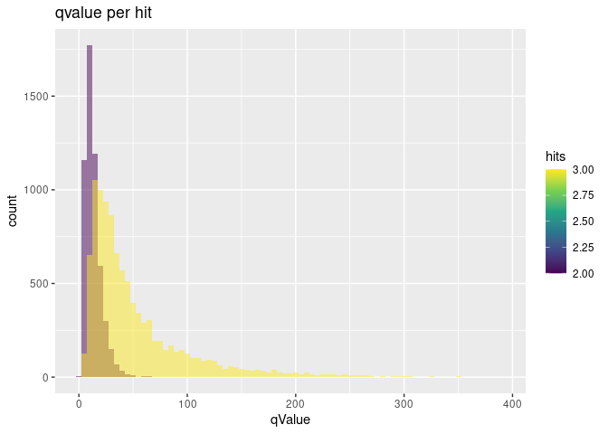

```{=html}
<style>
.vscroll-plot {
    width: 1000px;
    height: 500px;
    overflow-y: scroll;
    overflow-x: scroll;
}
</style>
```
# R Prepare System

## R update and load librarys

BiocManager::install("")

``` r
BiocManager::install(update = TRUE, ask = FALSE)
library(dbplyr)
library(tidyverse)
library(ChIPseeker)
library(rtracklayer)
library(trackViewer)
library(GenomicRanges)
library(IRanges)
library(ChIPpeakAnno)
library(AnnotationHub)
library(ggplot2)
library(viridis)
library(kableExtra)
library(DT)

library(TxDb.Mmusculus.UCSC.mm39.knownGene)
txdb <- TxDb.Mmusculus.UCSC.mm39.knownGene
```

## R folders

# Unix Prepare System

## Unix Update System

## Unix Folder & Names

# 3 Results

### Generate combined peak list

``` r
knitr::kable(npeak_numbers_table) %>% 
  kable_styling("striped", full_width = F) %>% 
 scroll_box(height = "400px")
```

::: {style="border: 1px solid #ddd; padding: 0px; overflow-y: scroll; height:400px; "}
<table class="table table-striped" style="width: auto !important; margin-left: auto; margin-right: auto;">

<thead>

<tr>

<th style="text-align:left;position: sticky; top:0; background-color: #FFFFFF;">

sample

</th>

<th style="text-align:left;position: sticky; top:0; background-color: #FFFFFF;">

Mapping

</th>

<th style="text-align:right;position: sticky; top:0; background-color: #FFFFFF;">

all_peaks

</th>

<th style="text-align:right;position: sticky; top:0; background-color: #FFFFFF;">

peaks_on_std_chromosomes

</th>

<th style="text-align:right;position: sticky; top:0; background-color: #FFFFFF;">

peaks_wo_blacklist

</th>

</tr>

</thead>

<tbody>

<tr>

<td style="text-align:left;">

Std_1463_1461

</td>

<td style="text-align:left;">

Std

</td>

<td style="text-align:right;">

379

</td>

<td style="text-align:right;">

338

</td>

<td style="text-align:right;">

200

</td>

</tr>

<tr>

<td style="text-align:left;">

Std_1466_1464

</td>

<td style="text-align:left;">

Std

</td>

<td style="text-align:right;">

282

</td>

<td style="text-align:right;">

241

</td>

<td style="text-align:right;">

124

</td>

</tr>

<tr>

<td style="text-align:left;">

Std_1499_1497

</td>

<td style="text-align:left;">

Std

</td>

<td style="text-align:right;">

411

</td>

<td style="text-align:right;">

368

</td>

<td style="text-align:right;">

236

</td>

</tr>

<tr>

<td style="text-align:left;">

Std_1574_1572

</td>

<td style="text-align:left;">

Std

</td>

<td style="text-align:right;">

568

</td>

<td style="text-align:right;">

523

</td>

<td style="text-align:right;">

310

</td>

</tr>

<tr>

<td style="text-align:left;">

Std_1577_1575

</td>

<td style="text-align:left;">

Std

</td>

<td style="text-align:right;">

224

</td>

<td style="text-align:right;">

190

</td>

<td style="text-align:right;">

107

</td>

</tr>

<tr>

<td style="text-align:left;">

Std_1580_1578

</td>

<td style="text-align:left;">

Std

</td>

<td style="text-align:right;">

2063

</td>

<td style="text-align:right;">

1997

</td>

<td style="text-align:right;">

1562

</td>

</tr>

<tr>

<td style="text-align:left;">

Std_1583_1581

</td>

<td style="text-align:left;">

Std

</td>

<td style="text-align:right;">

1131

</td>

<td style="text-align:right;">

1072

</td>

<td style="text-align:right;">

826

</td>

</tr>

<tr>

<td style="text-align:left;">

Std_1586_1584

</td>

<td style="text-align:left;">

Std

</td>

<td style="text-align:right;">

184

</td>

<td style="text-align:right;">

143

</td>

<td style="text-align:right;">

48

</td>

</tr>

<tr>

<td style="text-align:left;">

Std_1589_1587

</td>

<td style="text-align:left;">

Std

</td>

<td style="text-align:right;">

109

</td>

<td style="text-align:right;">

106

</td>

<td style="text-align:right;">

61

</td>

</tr>

<tr>

<td style="text-align:left;">

pe_1463_1461

</td>

<td style="text-align:left;">

pe

</td>

<td style="text-align:right;">

2553

</td>

<td style="text-align:right;">

2531

</td>

<td style="text-align:right;">

1861

</td>

</tr>

<tr>

<td style="text-align:left;">

pe_1466_1464

</td>

<td style="text-align:left;">

pe

</td>

<td style="text-align:right;">

3333

</td>

<td style="text-align:right;">

3295

</td>

<td style="text-align:right;">

2491

</td>

</tr>

<tr>

<td style="text-align:left;">

pe_1499_1497

</td>

<td style="text-align:left;">

pe

</td>

<td style="text-align:right;">

2476

</td>

<td style="text-align:right;">

2453

</td>

<td style="text-align:right;">

1787

</td>

</tr>

<tr>

<td style="text-align:left;">

pe_1574_1572

</td>

<td style="text-align:left;">

pe

</td>

<td style="text-align:right;">

2585

</td>

<td style="text-align:right;">

2555

</td>

<td style="text-align:right;">

1874

</td>

</tr>

<tr>

<td style="text-align:left;">

pe_1577_1575

</td>

<td style="text-align:left;">

pe

</td>

<td style="text-align:right;">

1890

</td>

<td style="text-align:right;">

1865

</td>

<td style="text-align:right;">

1333

</td>

</tr>

<tr>

<td style="text-align:left;">

pe_1580_1578

</td>

<td style="text-align:left;">

pe

</td>

<td style="text-align:right;">

3341

</td>

<td style="text-align:right;">

3304

</td>

<td style="text-align:right;">

2450

</td>

</tr>

<tr>

<td style="text-align:left;">

pe_1583_1581

</td>

<td style="text-align:left;">

pe

</td>

<td style="text-align:right;">

2813

</td>

<td style="text-align:right;">

2783

</td>

<td style="text-align:right;">

2091

</td>

</tr>

<tr>

<td style="text-align:left;">

pe_1586_1584

</td>

<td style="text-align:left;">

pe

</td>

<td style="text-align:right;">

4592

</td>

<td style="text-align:right;">

4544

</td>

<td style="text-align:right;">

3522

</td>

</tr>

<tr>

<td style="text-align:left;">

pe_1589_1587

</td>

<td style="text-align:left;">

pe

</td>

<td style="text-align:right;">

27

</td>

<td style="text-align:right;">

25

</td>

<td style="text-align:right;">

8

</td>

</tr>

<tr>

<td style="text-align:left;">

local_1463_1461

</td>

<td style="text-align:left;">

local

</td>

<td style="text-align:right;">

2666

</td>

<td style="text-align:right;">

2634

</td>

<td style="text-align:right;">

1916

</td>

</tr>

<tr>

<td style="text-align:left;">

local_1466_1464

</td>

<td style="text-align:left;">

local

</td>

<td style="text-align:right;">

3602

</td>

<td style="text-align:right;">

3569

</td>

<td style="text-align:right;">

2717

</td>

</tr>

<tr>

<td style="text-align:left;">

local_1499_1497

</td>

<td style="text-align:left;">

local

</td>

<td style="text-align:right;">

2452

</td>

<td style="text-align:right;">

2430

</td>

<td style="text-align:right;">

1769

</td>

</tr>

<tr>

<td style="text-align:left;">

local_1574_1572

</td>

<td style="text-align:left;">

local

</td>

<td style="text-align:right;">

2678

</td>

<td style="text-align:right;">

2643

</td>

<td style="text-align:right;">

1893

</td>

</tr>

<tr>

<td style="text-align:left;">

local_1577_1575

</td>

<td style="text-align:left;">

local

</td>

<td style="text-align:right;">

1910

</td>

<td style="text-align:right;">

1882

</td>

<td style="text-align:right;">

1334

</td>

</tr>

<tr>

<td style="text-align:left;">

local_1580_1578

</td>

<td style="text-align:left;">

local

</td>

<td style="text-align:right;">

3187

</td>

<td style="text-align:right;">

3154

</td>

<td style="text-align:right;">

2315

</td>

</tr>

<tr>

<td style="text-align:left;">

local_1583_1581

</td>

<td style="text-align:left;">

local

</td>

<td style="text-align:right;">

2657

</td>

<td style="text-align:right;">

2626

</td>

<td style="text-align:right;">

1905

</td>

</tr>

<tr>

<td style="text-align:left;">

local_1586_1584

</td>

<td style="text-align:left;">

local

</td>

<td style="text-align:right;">

5200

</td>

<td style="text-align:right;">

5145

</td>

<td style="text-align:right;">

3971

</td>

</tr>

<tr>

<td style="text-align:left;">

local_1589_1587

</td>

<td style="text-align:left;">

local

</td>

<td style="text-align:right;">

107

</td>

<td style="text-align:right;">

95

</td>

<td style="text-align:right;">

58

</td>

</tr>

<tr>

<td style="text-align:left;">

chro5k_1463_1461

</td>

<td style="text-align:left;">

chro5k

</td>

<td style="text-align:right;">

33

</td>

<td style="text-align:right;">

22

</td>

<td style="text-align:right;">

8

</td>

</tr>

<tr>

<td style="text-align:left;">

chro5k_1466_1464

</td>

<td style="text-align:left;">

chro5k

</td>

<td style="text-align:right;">

21

</td>

<td style="text-align:right;">

13

</td>

<td style="text-align:right;">

2

</td>

</tr>

<tr>

<td style="text-align:left;">

chro5k_1499_1497

</td>

<td style="text-align:left;">

chro5k

</td>

<td style="text-align:right;">

28

</td>

<td style="text-align:right;">

13

</td>

<td style="text-align:right;">

2

</td>

</tr>

<tr>

<td style="text-align:left;">

chro5k_1574_1572

</td>

<td style="text-align:left;">

chro5k

</td>

<td style="text-align:right;">

35

</td>

<td style="text-align:right;">

24

</td>

<td style="text-align:right;">

14

</td>

</tr>

<tr>

<td style="text-align:left;">

chro5k_1577_1575

</td>

<td style="text-align:left;">

chro5k

</td>

<td style="text-align:right;">

38

</td>

<td style="text-align:right;">

25

</td>

<td style="text-align:right;">

15

</td>

</tr>

<tr>

<td style="text-align:left;">

chro5k_1580_1578

</td>

<td style="text-align:left;">

chro5k

</td>

<td style="text-align:right;">

36

</td>

<td style="text-align:right;">

26

</td>

<td style="text-align:right;">

12

</td>

</tr>

<tr>

<td style="text-align:left;">

chro5k_1583_1581

</td>

<td style="text-align:left;">

chro5k

</td>

<td style="text-align:right;">

39

</td>

<td style="text-align:right;">

27

</td>

<td style="text-align:right;">

15

</td>

</tr>

<tr>

<td style="text-align:left;">

chro5k_1586_1584

</td>

<td style="text-align:left;">

chro5k

</td>

<td style="text-align:right;">

39

</td>

<td style="text-align:right;">

25

</td>

<td style="text-align:right;">

10

</td>

</tr>

<tr>

<td style="text-align:left;">

chro5k_1589_1587

</td>

<td style="text-align:left;">

chro5k

</td>

<td style="text-align:right;">

24

</td>

<td style="text-align:right;">

22

</td>

<td style="text-align:right;">

12

</td>

</tr>

<tr>

<td style="text-align:left;">

Online_SRR1703423_SRR1703426

</td>

<td style="text-align:left;">

Online

</td>

<td style="text-align:right;">

12870

</td>

<td style="text-align:right;">

12869

</td>

<td style="text-align:right;">

12698

</td>

</tr>

<tr>

<td style="text-align:left;">

Online_SRR1703424_SRR1703427

</td>

<td style="text-align:left;">

Online

</td>

<td style="text-align:right;">

25304

</td>

<td style="text-align:right;">

25288

</td>

<td style="text-align:right;">

24757

</td>

</tr>

<tr>

<td style="text-align:left;">

Online_SRR1703425_SRR1703428

</td>

<td style="text-align:left;">

Online

</td>

<td style="text-align:right;">

16322

</td>

<td style="text-align:right;">

16309

</td>

<td style="text-align:right;">

15963

</td>

</tr>

</tbody>

</table>
:::

``` r
datatable(npeak_numbers_table)
```

```{=html}
<div class="datatables html-widget html-fill-item" id="htmlwidget-c7f12419d5bfa2ce1847" style="width:100%;height:auto;"></div>
<script type="application/json" data-for="htmlwidget-c7f12419d5bfa2ce1847">{"x":{"filter":"none","vertical":false,"data":[["1","2","3","4","5","6","7","8","9","10","11","12","13","14","15","16","17","18","19","20","21","22","23","24","25","26","27","28","29","30","31","32","33","34","35","36","37","38","39"],["Std_1463_1461","Std_1466_1464","Std_1499_1497","Std_1574_1572","Std_1577_1575","Std_1580_1578","Std_1583_1581","Std_1586_1584","Std_1589_1587","pe_1463_1461","pe_1466_1464","pe_1499_1497","pe_1574_1572","pe_1577_1575","pe_1580_1578","pe_1583_1581","pe_1586_1584","pe_1589_1587","local_1463_1461","local_1466_1464","local_1499_1497","local_1574_1572","local_1577_1575","local_1580_1578","local_1583_1581","local_1586_1584","local_1589_1587","chro5k_1463_1461","chro5k_1466_1464","chro5k_1499_1497","chro5k_1574_1572","chro5k_1577_1575","chro5k_1580_1578","chro5k_1583_1581","chro5k_1586_1584","chro5k_1589_1587","Online_SRR1703423_SRR1703426","Online_SRR1703424_SRR1703427","Online_SRR1703425_SRR1703428"],["Std","Std","Std","Std","Std","Std","Std","Std","Std","pe","pe","pe","pe","pe","pe","pe","pe","pe","local","local","local","local","local","local","local","local","local","chro5k","chro5k","chro5k","chro5k","chro5k","chro5k","chro5k","chro5k","chro5k","Online","Online","Online"],[379,282,411,568,224,2063,1131,184,109,2553,3333,2476,2585,1890,3341,2813,4592,27,2666,3602,2452,2678,1910,3187,2657,5200,107,33,21,28,35,38,36,39,39,24,12870,25304,16322],[338,241,368,523,190,1997,1072,143,106,2531,3295,2453,2555,1865,3304,2783,4544,25,2634,3569,2430,2643,1882,3154,2626,5145,95,22,13,13,24,25,26,27,25,22,12869,25288,16309],[200,124,236,310,107,1562,826,48,61,1861,2491,1787,1874,1333,2450,2091,3522,8,1916,2717,1769,1893,1334,2315,1905,3971,58,8,2,2,14,15,12,15,10,12,12698,24757,15963]],"container":"<table class=\"display\">\n  <thead>\n    <tr>\n      <th> <\/th>\n      <th>sample<\/th>\n      <th>Mapping<\/th>\n      <th>all_peaks<\/th>\n      <th>peaks_on_std_chromosomes<\/th>\n      <th>peaks_wo_blacklist<\/th>\n    <\/tr>\n  <\/thead>\n<\/table>","options":{"columnDefs":[{"className":"dt-right","targets":[3,4,5]},{"orderable":false,"targets":0},{"name":" ","targets":0},{"name":"sample","targets":1},{"name":"Mapping","targets":2},{"name":"all_peaks","targets":3},{"name":"peaks_on_std_chromosomes","targets":4},{"name":"peaks_wo_blacklist","targets":5}],"order":[],"autoWidth":false,"orderClasses":false},"selection":{"mode":"multiple","selected":null,"target":"row","selectable":null}},"evals":[],"jsHooks":[]}</script>
```
``` r
knitr::kable(peaks_overlap)
```

+--------+--------+-------+--------+-------+----------+-----------+-----------+
|        | Sample | Peaks | ol.Std | ol.pe | ol.local | ol.chro5k | ol.Online |
+:=======+:=======+======:+=======:+======:+=========:+==========:+==========:+
| Std    | Std    | 48    | 48     | 22    | 27       | 14        | 7         |
+--------+--------+-------+--------+-------+----------+-----------+-----------+
| pe     | pe     | 3038  | 22     | 3138  | 2288     | 9         | 22        |
+--------+--------+-------+--------+-------+----------+-----------+-----------+
| local  | local  | 3061  | 27     | 2301  | 3207     | 10        | 33        |
+--------+--------+-------+--------+-------+----------+-----------+-----------+
| chro5k | chro5k | 11    | 14     | 9     | 10       | 11        | 5         |
+--------+--------+-------+--------+-------+----------+-----------+-----------+
| Online | Online | 15376 | 7      | 25    | 34       | 5         | 17594     |
+--------+--------+-------+--------+-------+----------+-----------+-----------+

``` r
# tibble::as.tibble(npeak_numbers_table)
# tibble::as.tibble(peaks_overlap)
```

### Results combined peaks

``` r
run <- names(npeak_combined_all)
for (i in run){
  print(i)
  pt <- as.data.frame(npeak_combined_all[[i]])
  ggplot(pt,aes(x=hits, fill=hits)) +
    stat_bin(alpha=0.5, position = 'identity', binwidth = 1) + 
    scale_fill_viridis_c() +
    coord_cartesian(xlim = c(0, 10)) +
    ggtitle(paste("peaks per replicate")) 

}
```

#### Venn

<!-- -->

### Annotate Peaks

``` r
# Add Gene names
ah = AnnotationHub()
query(ah, c("EnsDb", "Musculus"))
edb <- ah[["AH113713"]]

# 1 Subfolder
i <- 5
all_npeaksAnno <- annotatePeak(npeak_combined_all[[i]], TxDb=txdb,tssRegion=c(-3000, 3000), verbose=TRUE)
  all_npeaksAnno_table <- as.data.frame(all_npeaksAnno)
  all_npeaksAnno_table$transcriptId2 <- sub("\\.\\d+$", "", all_npeaksAnno_table$transcriptId)
  all_npeaksAnno_table$geneId <- mapIds(edb, keys = all_npeaksAnno_table$transcriptId2, column = "GENEID", keytype = "TXID")
  all_npeaksAnno_table$symbol <- mapIds(edb, keys = all_npeaksAnno_table$transcriptId2, column = "SYMBOL", keytype = "TXID")
n <- names(npeak_combined_all[i])
all_npeaksAnno_table$annotation_short <-  str_split(all_npeaksAnno_table$annotation,pattern = " ", simplify = TRUE)[,1]

ggplot(all_npeaksAnno_table,aes(x=hits, fill=hits)) +
      stat_bin(alpha=0.6, position = 'identity', binwidth=1) + #
      stat_bin(position = 'identity', binwidth=1, geom="text", aes(label=after_stat(count)), vjust=-0.5, colour="blue") +
  ggtitle(n)
```

<!-- -->

``` r
ggplot(all_npeaksAnno_table,aes(x=width, group=annotation_short, fill=annotation_short)) +
      stat_bin(alpha=0.5, position = 'identity', binwidth=100) + 
  # stat_bin(position = 'identity', binwidth=100, geom="text", aes(label=after_stat(count)), vjust=-0.5, colour="blue") +
  scale_fill_viridis_d() +
  ggtitle(paste("genetic region per peak size (",n,")",sep="")) # + coord_cartesian(xlim = c(0, 100), ylim=c(0,200))
```

<!-- -->

``` r
ggsave(file=paste(pubfigdir,"Peaks_geneticregions_",n,".pdf",sep=""), width = 8, height = 8, device = "pdf")

ggplot(all_npeaksAnno_table,aes(x=width, group=hits, fill=hits)) +
      stat_bin(alpha=0.5, position = 'identity', binwidth=200) + 
  # stat_bin(position = 'identity', binwidth=100, geom="text", aes(label=after_stat(count)), vjust=-0.5, colour="blue") +
  scale_fill_viridis_c() +
  ggtitle(paste("hits per peak size")) # + coord_cartesian(xlim = c(0, 10000), ylim=c(0,50))
```

<!-- -->

``` r
ggplot(all_npeaksAnno_table,aes(x=qValue, group=hits, fill=hits)) +
  stat_bin(alpha=0.5, position = 'identity', binwidth=5) + 
  scale_fill_viridis_c() +
  ggtitle(paste("qvalue per hit")) # + coord_cartesian(xlim = c(0, 10000), ylim=c(0,50))
```

<!-- -->

``` r
levels(factor(all_npeaksAnno_table$annotation_short))

head(all_npeaksAnno_table[order(all_npeaksAnno_table$width),])
viridis(8)

top_hits <- subset(all_npeaksAnno_table, distanceToTSS > -2000 & distanceToTSS < 2000)
dim(top_hits)
```

#### All peaks

#### Venns
