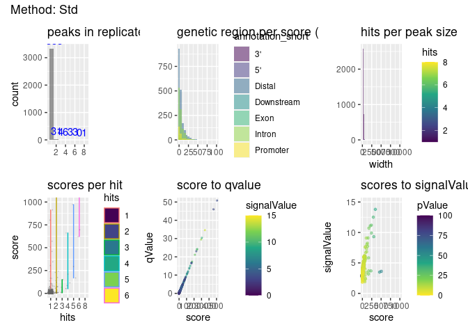

# R Prepare System

## R update and load librarys

BiocManager::install(““)

``` r
# BiocManager::install(update = TRUE, ask = FALSE)

library(dbplyr)
library(tidyverse)
library(ChIPseeker)
library(rtracklayer)
library(trackViewer)
library(GenomicRanges)
library(IRanges)
library(ChIPpeakAnno)
library(AnnotationHub)
library(ggplot2)
library(viridis)
library(kableExtra)
library(DT)
library(patchwork)
library(gridExtra)
library(foreach)
library(doParallel)
# library()

library(TxDb.Mmusculus.UCSC.mm39.knownGene)
txdb <- TxDb.Mmusculus.UCSC.mm39.knownGene
```

## R folders

# Unix Prepare System

## Unix Update System

## Unix Folder & Names

# 3 Results

’ <embed src="../Data/sheme.pdf" style="width:100.0%" />

’ 

``` r
knitr::include_graphics("https://github.com/DNAborn/ChIPseq_Wt1/blob/main/Results/sheme.png")
```

<!-- -->

``` r
knitr::include_graphics("https://github.com/DNAborn/ChIPseq_Wt1/blob/main/Results/sheme.pdf")
```

<!-- -->

``` r
# knitr::include_graphics("./sheme.png")
# knitr::include_graphics("./sheme.pdf")
# knitr::include_graphics("../sheme.png")
# knitr::include_graphics("../sheme.pdf")
# knitr::include_graphics("/mnt/s/AG/AG-Scholz-NGS/Daten/Simon/P3026_ChIP-Seq_epiSVF/ChIPseq_Wt1_P3026/Results/sheme.png")
# knitr::include_graphics("/mnt/s/AG/AG-Scholz-NGS/Daten/Simon/P3026_ChIP-Seq_epiSVF/ChIPseq_Wt1_P3026/Results/sheme.pdf")
getwd()
```

    ## [1] "/mnt/s/AG/AG-Scholz-NGS/Daten/Simon/P3026_ChIP-Seq_epiSVF/ChIPseq_Wt1_P3026/Results"

``` r
print("include figure in r chunk")
knitr::include_graphics("../Data/sheme.pdf") # doesn't show
```

### Generate combined peak list

#### Peak Tables

``` r
knitr::kable(npeak_numbers_table, format = "markdown") %>% 
  kable_styling("striped", full_width = F) %>% 
  scroll_box(height = "400px")
# datatable(npeak_numbers_table)
knitr::kable(peaks_overlap)  %>% 
  kable_styling("striped", full_width = F) %>% 
  scroll_box(height = "400px")
# tibble::as.tibble(npeak_numbers_table)
# tibble::as.tibble(peaks_overlap)
print("hello")
```

#### Hists & Tables


#### Venn Overlap Peaks

``` r
# Venns
npeak_combined_1h <- list(npeak_combined_all[[1]][elementMetadata(npeak_combined_all[[1]])$hits > 1,],
                          npeak_combined_all[[2]][elementMetadata(npeak_combined_all[[2]])$hits > 1,],
                          npeak_combined_all[[3]][elementMetadata(npeak_combined_all[[3]])$hits > 1,],
                          npeak_combined_all[[4]][elementMetadata(npeak_combined_all[[4]])$hits > 1,],
                          npeak_combined_all[[5]][elementMetadata(npeak_combined_all[[5]])$hits > 1,])
names(npeak_combined_1h) <- names(npeak_combined_all)

olvenn <- findOverlapsOfPeaks(npeak_combined_1h)

length(npeak_combined_1h)
# pdf(paste(csrundir,"Venn_Peaks2.pdf",sep="/"))
makeVennDiagram(main="Overlap of combined & filtered (>1 hits) peak lists",
                plot = TRUE, npeak_combined_1h,
                NameOfPeaks = names(npeak_combined_1h),
                fill=c("#009E73", "lightgreen", "lightgreen","lightblue","turquoise"),
                cat.col=c("#009E73", "lightgreen", "lightgreen","lightblue","turquoise")
                )
```

<!-- -->

``` r
# Venns (with 1 hits)
olvenn <- findOverlapsOfPeaks(npeak_combined_all[[1]],
                          npeak_combined_all[[2]],
                          npeak_combined_all[[3]],
                          npeak_combined_all[[4]],
                          npeak_combined_all[[5]])

length(npeak_combined_all)
# pdf(paste(csrundir,"Venn_Peaks2.pdf",sep="/"))
makeVennDiagram(main="Overlap of combined & filtered (with 1 hits) peak lists",
                plot = TRUE, npeak_combined_all,
                NameOfPeaks = names(npeak_combined_all),
                fill=c("#009E73", "lightgreen", "lightgreen","lightblue","turquoise"),
                cat.col=c("#009E73", "lightgreen", "lightgreen","lightblue","turquoise")
                )
```

<!-- -->

``` r
# dev.off()
# ggsave(peaks.venn,file=paste(pubfigdir,"Venn_Peaks.pdf",sep="/"), width = 8, height = 8, device = "pdf")
```

## Annotate Peaks

#### 1 Run

``` r
# Add Gene names
ah = AnnotationHub()
query(ah, c("EnsDb", "Musculus"))
```

    ## AnnotationHub with 81 records
    ## # snapshotDate(): 2023-10-23
    ## # $dataprovider: Ensembl
    ## # $species: Mus musculus, Balaenoptera musculus, Mus musculus musculus, Mus ...
    ## # $rdataclass: EnsDb
    ## # additional mcols(): taxonomyid, genome, description,
    ## #   coordinate_1_based, maintainer, rdatadateadded, preparerclass, tags,
    ## #   rdatapath, sourceurl, sourcetype 
    ## # retrieve records with, e.g., 'object[["AH53222"]]' 
    ## 
    ##              title                                        
    ##   AH53222  | Ensembl 87 EnsDb for Mus Musculus            
    ##   AH53726  | Ensembl 88 EnsDb for Mus Musculus            
    ##   AH56691  | Ensembl 89 EnsDb for Mus Musculus            
    ##   AH57770  | Ensembl 90 EnsDb for Mus Musculus            
    ##   AH60788  | Ensembl 91 EnsDb for Mus Musculus            
    ##   ...        ...                                          
    ##   AH116336 | Ensembl 111 EnsDb for Mus musculus           
    ##   AH116337 | Ensembl 111 EnsDb for Mus musculus           
    ##   AH116338 | Ensembl 111 EnsDb for Mus musculus musculus  
    ##   AH116339 | Ensembl 111 EnsDb for Mus musculus domesticus
    ##   AH116340 | Ensembl 111 EnsDb for Mus musculus

``` r
edb <- ah[["AH113713"]]

# 1 Subfolder

figures_annotated_peaks <- list()

i <- "pe"
all_npeaksAnno <- annotatePeak(npeak_combined_all[[i]], TxDb=txdb,tssRegion=c(-3000, 3000), verbose=TRUE)
```

    ## >> preparing features information...      2024-02-13 11:12:08 
    ## >> identifying nearest features...        2024-02-13 11:12:08 
    ## >> calculating distance from peak to TSS...   2024-02-13 11:12:09 
    ## >> assigning genomic annotation...        2024-02-13 11:12:09 
    ## >> assigning chromosome lengths           2024-02-13 11:12:22 
    ## >> done...                    2024-02-13 11:12:22

``` r
  all_npeaksAnno_table <- as.data.frame(all_npeaksAnno)
  all_npeaksAnno_table$transcriptId2 <- sub("\\.\\d+$", "", all_npeaksAnno_table$transcriptId)
  all_npeaksAnno_table$geneId <- mapIds(edb, keys = all_npeaksAnno_table$transcriptId2, column = "GENEID", keytype = "TXID")
  all_npeaksAnno_table$symbol <- mapIds(edb, keys = all_npeaksAnno_table$transcriptId2, column = "SYMBOL", keytype = "TXID")
n <- names(npeak_combined_all[i])
all_npeaksAnno_table$annotation_short <-  str_split(all_npeaksAnno_table$annotation,pattern = " ", simplify = TRUE)[,1]

# Annotated table
top_hits <- all_npeaksAnno_table[order(all_npeaksAnno_table$signalValue, decreasing=T),]
colnames(top_hits)
```

    ##  [1] "seqnames"         "start"            "end"              "width"           
    ##  [5] "strand"           "name"             "score"            "signalValue"     
    ##  [9] "pValue"           "qValue"           "peak"             "id"              
    ## [13] "hits"             "annotation"       "geneChr"          "geneStart"       
    ## [17] "geneEnd"          "geneLength"       "geneStrand"       "geneId"          
    ## [21] "transcriptId"     "distanceToTSS"    "transcriptId2"    "symbol"          
    ## [25] "annotation_short"

``` r
kable(top_hits[1:40,c("seqnames","start","end","width","score","signalValue","hits","annotation","geneId","distanceToTSS","symbol","annotation_short")])  %>%
 kable_styling("striped", full_width = F) %>% 
 scroll_box(height = "400px")
```

<div style="border: 1px solid #ddd; padding: 0px; overflow-y: scroll; height:400px; ">

<table class="table table-striped" style="width: auto !important; margin-left: auto; margin-right: auto;">
<thead>
<tr>
<th style="text-align:left;position: sticky; top:0; background-color: #FFFFFF;">
</th>
<th style="text-align:left;position: sticky; top:0; background-color: #FFFFFF;">
seqnames
</th>
<th style="text-align:right;position: sticky; top:0; background-color: #FFFFFF;">
start
</th>
<th style="text-align:right;position: sticky; top:0; background-color: #FFFFFF;">
end
</th>
<th style="text-align:right;position: sticky; top:0; background-color: #FFFFFF;">
width
</th>
<th style="text-align:right;position: sticky; top:0; background-color: #FFFFFF;">
score
</th>
<th style="text-align:right;position: sticky; top:0; background-color: #FFFFFF;">
signalValue
</th>
<th style="text-align:right;position: sticky; top:0; background-color: #FFFFFF;">
hits
</th>
<th style="text-align:left;position: sticky; top:0; background-color: #FFFFFF;">
annotation
</th>
<th style="text-align:left;position: sticky; top:0; background-color: #FFFFFF;">
geneId
</th>
<th style="text-align:right;position: sticky; top:0; background-color: #FFFFFF;">
distanceToTSS
</th>
<th style="text-align:left;position: sticky; top:0; background-color: #FFFFFF;">
symbol
</th>
<th style="text-align:left;position: sticky; top:0; background-color: #FFFFFF;">
annotation_short
</th>
</tr>
</thead>
<tbody>
<tr>
<td style="text-align:left;">
2084
</td>
<td style="text-align:left;">
chr17
</td>
<td style="text-align:right;">
4676434
</td>
<td style="text-align:right;">
4676880
</td>
<td style="text-align:right;">
447
</td>
<td style="text-align:right;">
10464.86
</td>
<td style="text-align:right;">
98.17
</td>
<td style="text-align:right;">
7
</td>
<td style="text-align:left;">
Distal Intergenic
</td>
<td style="text-align:left;">
ENSMUSG00000116767
</td>
<td style="text-align:right;">
-8373
</td>
<td style="text-align:left;">
4930517M08Rik
</td>
<td style="text-align:left;">
Distal
</td>
</tr>
<tr>
<td style="text-align:left;">
4080
</td>
<td style="text-align:left;">
chr6
</td>
<td style="text-align:right;">
48882120
</td>
<td style="text-align:right;">
48886141
</td>
<td style="text-align:right;">
4022
</td>
<td style="text-align:right;">
4118.86
</td>
<td style="text-align:right;">
60.05
</td>
<td style="text-align:right;">
6
</td>
<td style="text-align:left;">
Promoter (\<=1kb)
</td>
<td style="text-align:left;">
ENSMUSG00000029811
</td>
<td style="text-align:right;">
0
</td>
<td style="text-align:left;">
Aoc1
</td>
<td style="text-align:left;">
Promoter
</td>
</tr>
<tr>
<td style="text-align:left;">
5552
</td>
<td style="text-align:left;">
chrX
</td>
<td style="text-align:right;">
105230323
</td>
<td style="text-align:right;">
105230844
</td>
<td style="text-align:right;">
522
</td>
<td style="text-align:right;">
2703.00
</td>
<td style="text-align:right;">
37.57
</td>
<td style="text-align:right;">
1
</td>
<td style="text-align:left;">
Promoter (\<=1kb)
</td>
<td style="text-align:left;">
ENSMUSG00000062070
</td>
<td style="text-align:right;">
0
</td>
<td style="text-align:left;">
Pgk1
</td>
<td style="text-align:left;">
Promoter
</td>
</tr>
<tr>
<td style="text-align:left;">
771
</td>
<td style="text-align:left;">
chr11
</td>
<td style="text-align:right;">
5956234
</td>
<td style="text-align:right;">
5956613
</td>
<td style="text-align:right;">
380
</td>
<td style="text-align:right;">
2341.00
</td>
<td style="text-align:right;">
36.44
</td>
<td style="text-align:right;">
1
</td>
<td style="text-align:left;">
Intron (ENSMUST00000109813.9/12323, intron 3 of 20)
</td>
<td style="text-align:left;">
ENSMUSG00000057897
</td>
<td style="text-align:right;">
-5786
</td>
<td style="text-align:left;">
Camk2b
</td>
<td style="text-align:left;">
Intron
</td>
</tr>
<tr>
<td style="text-align:left;">
4281
</td>
<td style="text-align:left;">
chr6
</td>
<td style="text-align:right;">
132440307
</td>
<td style="text-align:right;">
132440774
</td>
<td style="text-align:right;">
468
</td>
<td style="text-align:right;">
1271.00
</td>
<td style="text-align:right;">
28.61
</td>
<td style="text-align:right;">
1
</td>
<td style="text-align:left;">
Distal Intergenic
</td>
<td style="text-align:left;">
ENSMUSG00000108041
</td>
<td style="text-align:right;">
-21622
</td>
<td style="text-align:left;">
Gm5154
</td>
<td style="text-align:left;">
Distal
</td>
</tr>
<tr>
<td style="text-align:left;">
2534
</td>
<td style="text-align:left;">
chr19
</td>
<td style="text-align:right;">
37685100
</td>
<td style="text-align:right;">
37686273
</td>
<td style="text-align:right;">
1174
</td>
<td style="text-align:right;">
1177.50
</td>
<td style="text-align:right;">
22.15
</td>
<td style="text-align:right;">
4
</td>
<td style="text-align:left;">
Promoter (\<=1kb)
</td>
<td style="text-align:left;">
ENSMUSG00000120139
</td>
<td style="text-align:right;">
0
</td>
<td style="text-align:left;">
Gm32342
</td>
<td style="text-align:left;">
Promoter
</td>
</tr>
<tr>
<td style="text-align:left;">
4079
</td>
<td style="text-align:left;">
chr6
</td>
<td style="text-align:right;">
48871614
</td>
<td style="text-align:right;">
48872189
</td>
<td style="text-align:right;">
576
</td>
<td style="text-align:right;">
705.00
</td>
<td style="text-align:right;">
17.60
</td>
<td style="text-align:right;">
1
</td>
<td style="text-align:left;">
Promoter (\<=1kb)
</td>
<td style="text-align:left;">
ENSMUSG00000029811
</td>
<td style="text-align:right;">
0
</td>
<td style="text-align:left;">
Aoc1
</td>
<td style="text-align:left;">
Promoter
</td>
</tr>
<tr>
<td style="text-align:left;">
2740
</td>
<td style="text-align:left;">
chr2
</td>
<td style="text-align:right;">
104956433
</td>
<td style="text-align:right;">
104958215
</td>
<td style="text-align:right;">
1783
</td>
<td style="text-align:right;">
531.67
</td>
<td style="text-align:right;">
14.01
</td>
<td style="text-align:right;">
6
</td>
<td style="text-align:left;">
Promoter (\<=1kb)
</td>
<td style="text-align:left;">
ENSMUSG00000016458
</td>
<td style="text-align:right;">
0
</td>
<td style="text-align:left;">
Wt1
</td>
<td style="text-align:left;">
Promoter
</td>
</tr>
<tr>
<td style="text-align:left;">
2741
</td>
<td style="text-align:left;">
chr2
</td>
<td style="text-align:right;">
104963160
</td>
<td style="text-align:right;">
104964205
</td>
<td style="text-align:right;">
1046
</td>
<td style="text-align:right;">
416.00
</td>
<td style="text-align:right;">
13.48
</td>
<td style="text-align:right;">
1
</td>
<td style="text-align:left;">
Promoter (1-2kb)
</td>
<td style="text-align:left;">
ENSMUSG00000016458
</td>
<td style="text-align:right;">
1932
</td>
<td style="text-align:left;">
Wt1
</td>
<td style="text-align:left;">
Promoter
</td>
</tr>
<tr>
<td style="text-align:left;">
2815
</td>
<td style="text-align:left;">
chr2
</td>
<td style="text-align:right;">
146838103
</td>
<td style="text-align:right;">
146846920
</td>
<td style="text-align:right;">
8818
</td>
<td style="text-align:right;">
676.62
</td>
<td style="text-align:right;">
12.43
</td>
<td style="text-align:right;">
8
</td>
<td style="text-align:left;">
Distal Intergenic
</td>
<td style="text-align:left;">
ENSMUSG00000027433
</td>
<td style="text-align:right;">
-7996
</td>
<td style="text-align:left;">
Xrn2
</td>
<td style="text-align:left;">
Distal
</td>
</tr>
<tr>
<td style="text-align:left;">
5276
</td>
<td style="text-align:left;">
chrX
</td>
<td style="text-align:right;">
17362468
</td>
<td style="text-align:right;">
17370723
</td>
<td style="text-align:right;">
8256
</td>
<td style="text-align:right;">
649.38
</td>
<td style="text-align:right;">
12.41
</td>
<td style="text-align:right;">
8
</td>
<td style="text-align:left;">
Distal Intergenic
</td>
<td style="text-align:left;">
ENSMUSG00000025040
</td>
<td style="text-align:right;">
67140
</td>
<td style="text-align:left;">
Fundc1
</td>
<td style="text-align:left;">
Distal
</td>
</tr>
<tr>
<td style="text-align:left;">
3103
</td>
<td style="text-align:left;">
chr3
</td>
<td style="text-align:right;">
125921474
</td>
<td style="text-align:right;">
125929133
</td>
<td style="text-align:right;">
7660
</td>
<td style="text-align:right;">
726.50
</td>
<td style="text-align:right;">
12.12
</td>
<td style="text-align:right;">
8
</td>
<td style="text-align:left;">
Distal Intergenic
</td>
<td style="text-align:left;">
ENSMUSG00000032854
</td>
<td style="text-align:right;">
-189206
</td>
<td style="text-align:left;">
Ugt8a
</td>
<td style="text-align:left;">
Distal
</td>
</tr>
<tr>
<td style="text-align:left;">
5342
</td>
<td style="text-align:left;">
chrX
</td>
<td style="text-align:right;">
48441137
</td>
<td style="text-align:right;">
48449540
</td>
<td style="text-align:right;">
8404
</td>
<td style="text-align:right;">
732.62
</td>
<td style="text-align:right;">
12.02
</td>
<td style="text-align:right;">
8
</td>
<td style="text-align:left;">
Intron (ENSMUST00000147144.2/102638827, intron 1 of 3)
</td>
<td style="text-align:left;">
ENSMUSG00000087369
</td>
<td style="text-align:right;">
-7023
</td>
<td style="text-align:left;">
Gm14696
</td>
<td style="text-align:left;">
Intron
</td>
</tr>
<tr>
<td style="text-align:left;">
1661
</td>
<td style="text-align:left;">
chr14
</td>
<td style="text-align:right;">
100619090
</td>
<td style="text-align:right;">
100626527
</td>
<td style="text-align:right;">
7438
</td>
<td style="text-align:right;">
709.00
</td>
<td style="text-align:right;">
11.93
</td>
<td style="text-align:right;">
8
</td>
<td style="text-align:left;">
Distal Intergenic
</td>
<td style="text-align:left;">
ENSMUSG00000119005
</td>
<td style="text-align:right;">
-29392
</td>
<td style="text-align:left;">
Gm26367
</td>
<td style="text-align:left;">
Distal
</td>
</tr>
<tr>
<td style="text-align:left;">
4362
</td>
<td style="text-align:left;">
chr7
</td>
<td style="text-align:right;">
7800198
</td>
<td style="text-align:right;">
7813532
</td>
<td style="text-align:right;">
13335
</td>
<td style="text-align:right;">
703.75
</td>
<td style="text-align:right;">
10.97
</td>
<td style="text-align:right;">
8
</td>
<td style="text-align:left;">
Intron (ENSMUST00000169683.2/625353, intron 4 of 5)
</td>
<td style="text-align:left;">
ENSMUSG00000096399
</td>
<td style="text-align:right;">
9334
</td>
<td style="text-align:left;">
Vmn2r35
</td>
<td style="text-align:left;">
Intron
</td>
</tr>
<tr>
<td style="text-align:left;">
1749
</td>
<td style="text-align:left;">
chr15
</td>
<td style="text-align:right;">
11905696
</td>
<td style="text-align:right;">
11907045
</td>
<td style="text-align:right;">
1350
</td>
<td style="text-align:right;">
313.00
</td>
<td style="text-align:right;">
10.79
</td>
<td style="text-align:right;">
4
</td>
<td style="text-align:left;">
Promoter (\<=1kb)
</td>
<td style="text-align:left;">
ENSMUSG00000022206
</td>
<td style="text-align:right;">
0
</td>
<td style="text-align:left;">
Npr3
</td>
<td style="text-align:left;">
Promoter
</td>
</tr>
<tr>
<td style="text-align:left;">
1376
</td>
<td style="text-align:left;">
chr13
</td>
<td style="text-align:right;">
88045393
</td>
<td style="text-align:right;">
88052367
</td>
<td style="text-align:right;">
6975
</td>
<td style="text-align:right;">
589.00
</td>
<td style="text-align:right;">
10.68
</td>
<td style="text-align:right;">
8
</td>
<td style="text-align:left;">
Distal Intergenic
</td>
<td style="text-align:left;">
ENSMUSG00000114273
</td>
<td style="text-align:right;">
-616942
</td>
<td style="text-align:left;">
Gm34585
</td>
<td style="text-align:left;">
Distal
</td>
</tr>
<tr>
<td style="text-align:left;">
5556
</td>
<td style="text-align:left;">
chrX
</td>
<td style="text-align:right;">
106092502
</td>
<td style="text-align:right;">
106099159
</td>
<td style="text-align:right;">
6658
</td>
<td style="text-align:right;">
478.38
</td>
<td style="text-align:right;">
10.59
</td>
<td style="text-align:right;">
8
</td>
<td style="text-align:left;">
Distal Intergenic
</td>
<td style="text-align:left;">
ENSMUSG00000050921
</td>
<td style="text-align:right;">
-32939
</td>
<td style="text-align:left;">
P2ry10
</td>
<td style="text-align:left;">
Distal
</td>
</tr>
<tr>
<td style="text-align:left;">
1613
</td>
<td style="text-align:left;">
chr14
</td>
<td style="text-align:right;">
84103731
</td>
<td style="text-align:right;">
84111322
</td>
<td style="text-align:right;">
7592
</td>
<td style="text-align:right;">
583.62
</td>
<td style="text-align:right;">
10.32
</td>
<td style="text-align:right;">
8
</td>
<td style="text-align:left;">
Distal Intergenic
</td>
<td style="text-align:left;">
ENSMUSG00000115043
</td>
<td style="text-align:right;">
201408
</td>
<td style="text-align:left;">
Gm32455
</td>
<td style="text-align:left;">
Distal
</td>
</tr>
<tr>
<td style="text-align:left;">
2267
</td>
<td style="text-align:left;">
chr17
</td>
<td style="text-align:right;">
79708448
</td>
<td style="text-align:right;">
79715415
</td>
<td style="text-align:right;">
6968
</td>
<td style="text-align:right;">
505.62
</td>
<td style="text-align:right;">
10.32
</td>
<td style="text-align:right;">
8
</td>
<td style="text-align:left;">
Distal Intergenic
</td>
<td style="text-align:left;">
ENSMUSG00000120381
</td>
<td style="text-align:right;">
43776
</td>
<td style="text-align:left;">
Gm32954
</td>
<td style="text-align:left;">
Distal
</td>
</tr>
<tr>
<td style="text-align:left;">
3686
</td>
<td style="text-align:left;">
chr5
</td>
<td style="text-align:right;">
43153723
</td>
<td style="text-align:right;">
43161832
</td>
<td style="text-align:right;">
8110
</td>
<td style="text-align:right;">
443.88
</td>
<td style="text-align:right;">
9.71
</td>
<td style="text-align:right;">
8
</td>
<td style="text-align:left;">
Distal Intergenic
</td>
<td style="text-align:left;">
ENSMUSG00000107193
</td>
<td style="text-align:right;">
33747
</td>
<td style="text-align:left;">
Gm43700
</td>
<td style="text-align:left;">
Distal
</td>
</tr>
<tr>
<td style="text-align:left;">
839
</td>
<td style="text-align:left;">
chr11
</td>
<td style="text-align:right;">
40847719
</td>
<td style="text-align:right;">
40860758
</td>
<td style="text-align:right;">
13040
</td>
<td style="text-align:right;">
599.12
</td>
<td style="text-align:right;">
9.54
</td>
<td style="text-align:right;">
8
</td>
<td style="text-align:left;">
Distal Intergenic
</td>
<td style="text-align:left;">
ENSMUSG00000020326
</td>
<td style="text-align:right;">
-201581
</td>
<td style="text-align:left;">
Ccng1
</td>
<td style="text-align:left;">
Distal
</td>
</tr>
<tr>
<td style="text-align:left;">
2524
</td>
<td style="text-align:left;">
chr19
</td>
<td style="text-align:right;">
24896501
</td>
<td style="text-align:right;">
24896578
</td>
<td style="text-align:right;">
78
</td>
<td style="text-align:right;">
228.00
</td>
<td style="text-align:right;">
9.23
</td>
<td style="text-align:right;">
1
</td>
<td style="text-align:left;">
Distal Intergenic
</td>
<td style="text-align:left;">
ENSMUSG00000024878
</td>
<td style="text-align:right;">
5622
</td>
<td style="text-align:left;">
Cbwd1
</td>
<td style="text-align:left;">
Distal
</td>
</tr>
<tr>
<td style="text-align:left;">
3584
</td>
<td style="text-align:left;">
chr4
</td>
<td style="text-align:right;">
154721321
</td>
<td style="text-align:right;">
154723218
</td>
<td style="text-align:right;">
1898
</td>
<td style="text-align:right;">
288.50
</td>
<td style="text-align:right;">
9.22
</td>
<td style="text-align:right;">
2
</td>
<td style="text-align:left;">
Promoter (\<=1kb)
</td>
<td style="text-align:left;">
ENSMUSG00000085069
</td>
<td style="text-align:right;">
0
</td>
<td style="text-align:left;">
Prdm16os
</td>
<td style="text-align:left;">
Promoter
</td>
</tr>
<tr>
<td style="text-align:left;">
142
</td>
<td style="text-align:left;">
chr1
</td>
<td style="text-align:right;">
46129690
</td>
<td style="text-align:right;">
46135988
</td>
<td style="text-align:right;">
6299
</td>
<td style="text-align:right;">
361.00
</td>
<td style="text-align:right;">
9.00
</td>
<td style="text-align:right;">
8
</td>
<td style="text-align:left;">
Intron (ENSMUST00000069293.10/227058, intron 6 of 65)
</td>
<td style="text-align:left;">
ENSMUSG00000041144
</td>
<td style="text-align:right;">
23677
</td>
<td style="text-align:left;">
Dnah7b
</td>
<td style="text-align:left;">
Intron
</td>
</tr>
<tr>
<td style="text-align:left;">
2151
</td>
<td style="text-align:left;">
chr17
</td>
<td style="text-align:right;">
37022283
</td>
<td style="text-align:right;">
37027720
</td>
<td style="text-align:right;">
5438
</td>
<td style="text-align:right;">
390.12
</td>
<td style="text-align:right;">
8.98
</td>
<td style="text-align:right;">
8
</td>
<td style="text-align:left;">
Distal Intergenic
</td>
<td style="text-align:left;">
ENSMUSG00000037334
</td>
<td style="text-align:right;">
-39172
</td>
<td style="text-align:left;">
H2-M1
</td>
<td style="text-align:left;">
Distal
</td>
</tr>
<tr>
<td style="text-align:left;">
570
</td>
<td style="text-align:left;">
chr10
</td>
<td style="text-align:right;">
27694744
</td>
<td style="text-align:right;">
27701521
</td>
<td style="text-align:right;">
6778
</td>
<td style="text-align:right;">
504.67
</td>
<td style="text-align:right;">
8.81
</td>
<td style="text-align:right;">
9
</td>
<td style="text-align:left;">
Distal Intergenic
</td>
<td style="text-align:left;">
ENSMUSG00000112206
</td>
<td style="text-align:right;">
-9124
</td>
<td style="text-align:left;">
Gm30228
</td>
<td style="text-align:left;">
Distal
</td>
</tr>
<tr>
<td style="text-align:left;">
5167
</td>
<td style="text-align:left;">
chr9
</td>
<td style="text-align:right;">
79446581
</td>
<td style="text-align:right;">
79451203
</td>
<td style="text-align:right;">
4623
</td>
<td style="text-align:right;">
316.88
</td>
<td style="text-align:right;">
8.80
</td>
<td style="text-align:right;">
8
</td>
<td style="text-align:left;">
Distal Intergenic
</td>
<td style="text-align:left;">
ENSMUSG00000111765
</td>
<td style="text-align:right;">
-19997
</td>
<td style="text-align:left;">
Gm10635
</td>
<td style="text-align:left;">
Distal
</td>
</tr>
<tr>
<td style="text-align:left;">
2620
</td>
<td style="text-align:left;">
chr2
</td>
<td style="text-align:right;">
22006758
</td>
<td style="text-align:right;">
22011976
</td>
<td style="text-align:right;">
5219
</td>
<td style="text-align:right;">
359.88
</td>
<td style="text-align:right;">
8.57
</td>
<td style="text-align:right;">
8
</td>
<td style="text-align:left;">
Distal Intergenic
</td>
<td style="text-align:left;">
ENSMUSG00000025716
</td>
<td style="text-align:right;">
-220338
</td>
<td style="text-align:left;">
Myo3a
</td>
<td style="text-align:left;">
Distal
</td>
</tr>
<tr>
<td style="text-align:left;">
2891
</td>
<td style="text-align:left;">
chr3
</td>
<td style="text-align:right;">
14529795
</td>
<td style="text-align:right;">
14535647
</td>
<td style="text-align:right;">
5853
</td>
<td style="text-align:right;">
327.38
</td>
<td style="text-align:right;">
8.57
</td>
<td style="text-align:right;">
8
</td>
<td style="text-align:left;">
Distal Intergenic
</td>
<td style="text-align:left;">
ENSMUSG00000039710
</td>
<td style="text-align:right;">
-10110
</td>
<td style="text-align:left;">
Slc7a12
</td>
<td style="text-align:left;">
Distal
</td>
</tr>
<tr>
<td style="text-align:left;">
1610
</td>
<td style="text-align:left;">
chr14
</td>
<td style="text-align:right;">
81930242
</td>
<td style="text-align:right;">
81937251
</td>
<td style="text-align:right;">
7010
</td>
<td style="text-align:right;">
271.00
</td>
<td style="text-align:right;">
8.56
</td>
<td style="text-align:right;">
8
</td>
<td style="text-align:left;">
Intron (ENSMUST00000227374.2/105245829, intron 1 of 1)
</td>
<td style="text-align:left;">
ENSMUSG00000115455
</td>
<td style="text-align:right;">
6992
</td>
<td style="text-align:left;">
Gm41219
</td>
<td style="text-align:left;">
Intron
</td>
</tr>
<tr>
<td style="text-align:left;">
4242
</td>
<td style="text-align:left;">
chr6
</td>
<td style="text-align:right;">
115843691
</td>
<td style="text-align:right;">
115851034
</td>
<td style="text-align:right;">
7344
</td>
<td style="text-align:right;">
268.62
</td>
<td style="text-align:right;">
8.53
</td>
<td style="text-align:right;">
8
</td>
<td style="text-align:left;">
Intron (ENSMUST00000112925.8/81896, intron 3 of 28)
</td>
<td style="text-align:left;">
ENSMUSG00000030323
</td>
<td style="text-align:right;">
-3194
</td>
<td style="text-align:left;">
Ift122
</td>
<td style="text-align:left;">
Intron
</td>
</tr>
<tr>
<td style="text-align:left;">
4007
</td>
<td style="text-align:left;">
chr6
</td>
<td style="text-align:right;">
20697933
</td>
<td style="text-align:right;">
20702609
</td>
<td style="text-align:right;">
4677
</td>
<td style="text-align:right;">
274.88
</td>
<td style="text-align:right;">
8.47
</td>
<td style="text-align:right;">
8
</td>
<td style="text-align:left;">
Distal Intergenic
</td>
<td style="text-align:left;">
ENSMUSG00000087831
</td>
<td style="text-align:right;">
310632
</td>
<td style="text-align:left;">
Gm23960
</td>
<td style="text-align:left;">
Distal
</td>
</tr>
<tr>
<td style="text-align:left;">
1284
</td>
<td style="text-align:left;">
chr13
</td>
<td style="text-align:right;">
61030788
</td>
<td style="text-align:right;">
61037273
</td>
<td style="text-align:right;">
6486
</td>
<td style="text-align:right;">
340.75
</td>
<td style="text-align:right;">
8.38
</td>
<td style="text-align:right;">
8
</td>
<td style="text-align:left;">
Intron (ENSMUST00000225690.2/214639, intron 2 of 8)
</td>
<td style="text-align:left;">
ENSMUSG00000074874
</td>
<td style="text-align:right;">
6827
</td>
<td style="text-align:left;">
Ctla2b
</td>
<td style="text-align:left;">
Intron
</td>
</tr>
<tr>
<td style="text-align:left;">
1878
</td>
<td style="text-align:left;">
chr15
</td>
<td style="text-align:right;">
91791010
</td>
<td style="text-align:right;">
91808161
</td>
<td style="text-align:right;">
17152
</td>
<td style="text-align:right;">
291.33
</td>
<td style="text-align:right;">
8.26
</td>
<td style="text-align:right;">
9
</td>
<td style="text-align:left;">
Exon (ENSMUST00000239545.1/239611, exon 33 of 43)
</td>
<td style="text-align:left;">
ENSMUSG00000047295
</td>
<td style="text-align:right;">
58892
</td>
<td style="text-align:left;">
Smgc
</td>
<td style="text-align:left;">
Exon
</td>
</tr>
<tr>
<td style="text-align:left;">
3055
</td>
<td style="text-align:left;">
chr3
</td>
<td style="text-align:right;">
93231285
</td>
<td style="text-align:right;">
93238801
</td>
<td style="text-align:right;">
7517
</td>
<td style="text-align:right;">
274.50
</td>
<td style="text-align:right;">
8.11
</td>
<td style="text-align:right;">
8
</td>
<td style="text-align:left;">
Exon (ENSMUST00000090856.10/68723, exon 3 of 4)
</td>
<td style="text-align:left;">
ENSMUSG00000041991
</td>
<td style="text-align:right;">
4229
</td>
<td style="text-align:left;">
Hrnr
</td>
<td style="text-align:left;">
Exon
</td>
</tr>
<tr>
<td style="text-align:left;">
2860
</td>
<td style="text-align:left;">
chr3
</td>
<td style="text-align:right;">
6362691
</td>
<td style="text-align:right;">
6372554
</td>
<td style="text-align:right;">
9864
</td>
<td style="text-align:right;">
424.75
</td>
<td style="text-align:right;">
8.08
</td>
<td style="text-align:right;">
8
</td>
<td style="text-align:left;">
Distal Intergenic
</td>
<td style="text-align:left;">
ENSMUSG00000069118
</td>
<td style="text-align:right;">
312949
</td>
<td style="text-align:left;">
1700008P02Rik
</td>
<td style="text-align:left;">
Distal
</td>
</tr>
<tr>
<td style="text-align:left;">
3092
</td>
<td style="text-align:left;">
chr3
</td>
<td style="text-align:right;">
117795902
</td>
<td style="text-align:right;">
117800503
</td>
<td style="text-align:right;">
4602
</td>
<td style="text-align:right;">
275.50
</td>
<td style="text-align:right;">
8.08
</td>
<td style="text-align:right;">
8
</td>
<td style="text-align:left;">
Distal Intergenic
</td>
<td style="text-align:left;">
ENSMUSG00000028007
</td>
<td style="text-align:right;">
-133317
</td>
<td style="text-align:left;">
Snx7
</td>
<td style="text-align:left;">
Distal
</td>
</tr>
<tr>
<td style="text-align:left;">
2381
</td>
<td style="text-align:left;">
chr18
</td>
<td style="text-align:right;">
44022932
</td>
<td style="text-align:right;">
44031531
</td>
<td style="text-align:right;">
8600
</td>
<td style="text-align:right;">
365.90
</td>
<td style="text-align:right;">
8.07
</td>
<td style="text-align:right;">
8
</td>
<td style="text-align:left;">
Intron (ENSMUST00000236394.2/ENSMUST00000236394.2, intron 1 of 1)
</td>
<td style="text-align:left;">
ENSMUSG00000117902
</td>
<td style="text-align:right;">
49769
</td>
<td style="text-align:left;">
Gm41715
</td>
<td style="text-align:left;">
Intron
</td>
</tr>
<tr>
<td style="text-align:left;">
3555
</td>
<td style="text-align:left;">
chr4
</td>
<td style="text-align:right;">
137697839
</td>
<td style="text-align:right;">
137709832
</td>
<td style="text-align:right;">
11994
</td>
<td style="text-align:right;">
266.38
</td>
<td style="text-align:right;">
8.01
</td>
<td style="text-align:right;">
8
</td>
<td style="text-align:left;">
Distal Intergenic
</td>
<td style="text-align:left;">
ENSMUSG00000028760
</td>
<td style="text-align:right;">
-10501
</td>
<td style="text-align:left;">
Eif4g3
</td>
<td style="text-align:left;">
Distal
</td>
</tr>
</tbody>
</table>

</div>

``` r
hits_lim <- max(all_npeaksAnno_table$hits)
score_lim <- quantile(all_npeaksAnno_table$score, .99)
signalValue_lim <- quantile(all_npeaksAnno_table$signalValue, .99)
qValue_lim <- quantile(all_npeaksAnno_table$qValue, .90)

g1 <- ggplot(all_npeaksAnno_table,aes(x=distanceToTSS, y=score, color=hits)) +
  geom_point(size=1, alpha=0.5, position = "jitter") +
  scale_color_viridis_c() +
  coord_cartesian(ylim=c(0,score_lim)) +
  ggtitle(paste("scores to distance"))

g2 <- ggplot(all_npeaksAnno_table,aes(x=distanceToTSS, y=signalValue, color=hits)) +
  geom_point(size=1, alpha=0.5, position = "jitter") +
  scale_color_viridis_c() +
  coord_cartesian(ylim=c(1,signalValue_lim)) +
  ggtitle(paste("signalValue to distance"))

g3 <- ggplot(all_npeaksAnno_table,aes(x=distanceToTSS)) +
      stat_bin(alpha=0.6, position = 'identity', binwidth=1000, fill=viridis(10)[3]) +
      coord_cartesian(xlim = c(-50000,+50000))
g4 <- ggplot(all_npeaksAnno_table,aes(x=distanceToTSS)) +
      stat_bin(alpha=0.6, position = 'identity', binwidth=200, fill=viridis(10)[5]) +
      coord_cartesian(xlim = c(-10000,+10000)) 

( (g1+g2) / 
  (g1 + coord_cartesian(xlim=c(-500000,+500000),ylim=c(0,score_lim)) + 
    g2 + coord_cartesian(xlim=c(-500000,+500000),ylim=c(1,signalValue_lim))) /
  (g1 + coord_cartesian(xlim=c(-50000,+50000),ylim=c(0,score_lim)) + 
    g2 + coord_cartesian(xlim=c(-50000,+50000),ylim=c(1,signalValue_lim))) /
  (g3 + g4)
  ) + plot_layout(guides = "collect", axis_titles="collect")
```

<!-- -->

``` r
top_hits <- top_hits[order(top_hits$score, decreasing=T),]


top_hits <- subset(all_npeaksAnno_table, distanceToTSS > -2000 & distanceToTSS < 2000) 
dim(top_hits)
```

    ## [1] 204  25

``` r
top_hits <- top_hits[order(top_hits$score, decreasing=T),]
knitr::kable(top_hits[c(0:50),c("symbol","annotation","distanceToTSS","peak","score","signalValue","qValue","hits")],format = "markdown") %>%
 kable_styling("striped", full_width = F) %>% 
 scroll_box(height = "400px")
```

<div style="border: 1px solid #ddd; padding: 0px; overflow-y: scroll; height:400px; ">

<table class="table table-striped" style="width: auto !important; margin-left: auto; margin-right: auto;">
<thead>
<tr>
<th style="text-align:left;position: sticky; top:0; background-color: #FFFFFF;">
</th>
<th style="text-align:left;position: sticky; top:0; background-color: #FFFFFF;">
symbol
</th>
<th style="text-align:left;position: sticky; top:0; background-color: #FFFFFF;">
annotation
</th>
<th style="text-align:right;position: sticky; top:0; background-color: #FFFFFF;">
distanceToTSS
</th>
<th style="text-align:right;position: sticky; top:0; background-color: #FFFFFF;">
peak
</th>
<th style="text-align:right;position: sticky; top:0; background-color: #FFFFFF;">
score
</th>
<th style="text-align:right;position: sticky; top:0; background-color: #FFFFFF;">
signalValue
</th>
<th style="text-align:right;position: sticky; top:0; background-color: #FFFFFF;">
qValue
</th>
<th style="text-align:right;position: sticky; top:0; background-color: #FFFFFF;">
hits
</th>
</tr>
</thead>
<tbody>
<tr>
<td style="text-align:left;">
4080
</td>
<td style="text-align:left;">
Aoc1
</td>
<td style="text-align:left;">
Promoter (\<=1kb)
</td>
<td style="text-align:right;">
0
</td>
<td style="text-align:right;">
2904.29
</td>
<td style="text-align:right;">
4118.86
</td>
<td style="text-align:right;">
60.05
</td>
<td style="text-align:right;">
411.94
</td>
<td style="text-align:right;">
6
</td>
</tr>
<tr>
<td style="text-align:left;">
5552
</td>
<td style="text-align:left;">
Pgk1
</td>
<td style="text-align:left;">
Promoter (\<=1kb)
</td>
<td style="text-align:right;">
0
</td>
<td style="text-align:right;">
213.00
</td>
<td style="text-align:right;">
2703.00
</td>
<td style="text-align:right;">
37.57
</td>
<td style="text-align:right;">
270.35
</td>
<td style="text-align:right;">
1
</td>
</tr>
<tr>
<td style="text-align:left;">
2534
</td>
<td style="text-align:left;">
Gm32342
</td>
<td style="text-align:left;">
Promoter (\<=1kb)
</td>
<td style="text-align:right;">
0
</td>
<td style="text-align:right;">
413.50
</td>
<td style="text-align:right;">
1177.50
</td>
<td style="text-align:right;">
22.15
</td>
<td style="text-align:right;">
117.80
</td>
<td style="text-align:right;">
4
</td>
</tr>
<tr>
<td style="text-align:left;">
4079
</td>
<td style="text-align:left;">
Aoc1
</td>
<td style="text-align:left;">
Promoter (\<=1kb)
</td>
<td style="text-align:right;">
0
</td>
<td style="text-align:right;">
297.00
</td>
<td style="text-align:right;">
705.00
</td>
<td style="text-align:right;">
17.60
</td>
<td style="text-align:right;">
70.54
</td>
<td style="text-align:right;">
1
</td>
</tr>
<tr>
<td style="text-align:left;">
5924
</td>
<td style="text-align:left;">
Gm47283
</td>
<td style="text-align:left;">
Promoter (1-2kb)
</td>
<td style="text-align:right;">
-1452
</td>
<td style="text-align:right;">
6224.00
</td>
<td style="text-align:right;">
583.67
</td>
<td style="text-align:right;">
6.48
</td>
<td style="text-align:right;">
58.42
</td>
<td style="text-align:right;">
8
</td>
</tr>
<tr>
<td style="text-align:left;">
2740
</td>
<td style="text-align:left;">
Wt1
</td>
<td style="text-align:left;">
Promoter (\<=1kb)
</td>
<td style="text-align:right;">
0
</td>
<td style="text-align:right;">
564.67
</td>
<td style="text-align:right;">
531.67
</td>
<td style="text-align:right;">
14.01
</td>
<td style="text-align:right;">
53.24
</td>
<td style="text-align:right;">
6
</td>
</tr>
<tr>
<td style="text-align:left;">
2741
</td>
<td style="text-align:left;">
Wt1
</td>
<td style="text-align:left;">
Promoter (1-2kb)
</td>
<td style="text-align:right;">
1932
</td>
<td style="text-align:right;">
166.00
</td>
<td style="text-align:right;">
416.00
</td>
<td style="text-align:right;">
13.48
</td>
<td style="text-align:right;">
41.68
</td>
<td style="text-align:right;">
1
</td>
</tr>
<tr>
<td style="text-align:left;">
1749
</td>
<td style="text-align:left;">
Npr3
</td>
<td style="text-align:left;">
Promoter (\<=1kb)
</td>
<td style="text-align:right;">
0
</td>
<td style="text-align:right;">
1017.25
</td>
<td style="text-align:right;">
313.00
</td>
<td style="text-align:right;">
10.79
</td>
<td style="text-align:right;">
31.33
</td>
<td style="text-align:right;">
4
</td>
</tr>
<tr>
<td style="text-align:left;">
3584
</td>
<td style="text-align:left;">
Prdm16os
</td>
<td style="text-align:left;">
Promoter (\<=1kb)
</td>
<td style="text-align:right;">
0
</td>
<td style="text-align:right;">
975.00
</td>
<td style="text-align:right;">
288.50
</td>
<td style="text-align:right;">
9.22
</td>
<td style="text-align:right;">
28.90
</td>
<td style="text-align:right;">
2
</td>
</tr>
<tr>
<td style="text-align:left;">
5224
</td>
<td style="text-align:left;">
4921528I07Rik
</td>
<td style="text-align:left;">
Promoter (1-2kb)
</td>
<td style="text-align:right;">
-1737
</td>
<td style="text-align:right;">
3182.75
</td>
<td style="text-align:right;">
269.62
</td>
<td style="text-align:right;">
7.46
</td>
<td style="text-align:right;">
27.02
</td>
<td style="text-align:right;">
8
</td>
</tr>
<tr>
<td style="text-align:left;">
1854
</td>
<td style="text-align:left;">
Gm23217
</td>
<td style="text-align:left;">
Promoter (1-2kb)
</td>
<td style="text-align:right;">
1504
</td>
<td style="text-align:right;">
2491.88
</td>
<td style="text-align:right;">
174.62
</td>
<td style="text-align:right;">
5.81
</td>
<td style="text-align:right;">
17.51
</td>
<td style="text-align:right;">
8
</td>
</tr>
<tr>
<td style="text-align:left;">
1885
</td>
<td style="text-align:left;">
Aqp2
</td>
<td style="text-align:left;">
Promoter (\<=1kb)
</td>
<td style="text-align:right;">
92
</td>
<td style="text-align:right;">
98.00
</td>
<td style="text-align:right;">
159.00
</td>
<td style="text-align:right;">
6.73
</td>
<td style="text-align:right;">
15.99
</td>
<td style="text-align:right;">
1
</td>
</tr>
<tr>
<td style="text-align:left;">
3299
</td>
<td style="text-align:left;">
Gm50470
</td>
<td style="text-align:left;">
Promoter (\<=1kb)
</td>
<td style="text-align:right;">
0
</td>
<td style="text-align:right;">
8034.38
</td>
<td style="text-align:right;">
137.75
</td>
<td style="text-align:right;">
5.27
</td>
<td style="text-align:right;">
13.82
</td>
<td style="text-align:right;">
8
</td>
</tr>
<tr>
<td style="text-align:left;">
3296
</td>
<td style="text-align:left;">
Gm3893
</td>
<td style="text-align:left;">
Promoter (\<=1kb)
</td>
<td style="text-align:right;">
0
</td>
<td style="text-align:right;">
1971.38
</td>
<td style="text-align:right;">
135.00
</td>
<td style="text-align:right;">
5.99
</td>
<td style="text-align:right;">
13.55
</td>
<td style="text-align:right;">
8
</td>
</tr>
<tr>
<td style="text-align:left;">
5925
</td>
<td style="text-align:left;">
Gm47283
</td>
<td style="text-align:left;">
Promoter (\<=1kb)
</td>
<td style="text-align:right;">
0
</td>
<td style="text-align:right;">
2067.22
</td>
<td style="text-align:right;">
125.56
</td>
<td style="text-align:right;">
3.22
</td>
<td style="text-align:right;">
12.61
</td>
<td style="text-align:right;">
8
</td>
</tr>
<tr>
<td style="text-align:left;">
1877
</td>
<td style="text-align:left;">
Smgc
</td>
<td style="text-align:left;">
Promoter (\<=1kb)
</td>
<td style="text-align:right;">
0
</td>
<td style="text-align:right;">
2703.25
</td>
<td style="text-align:right;">
117.38
</td>
<td style="text-align:right;">
5.67
</td>
<td style="text-align:right;">
11.80
</td>
<td style="text-align:right;">
8
</td>
</tr>
<tr>
<td style="text-align:left;">
4525
</td>
<td style="text-align:left;">
Gm22909
</td>
<td style="text-align:left;">
Promoter (\<=1kb)
</td>
<td style="text-align:right;">
0
</td>
<td style="text-align:right;">
11248.28
</td>
<td style="text-align:right;">
116.52
</td>
<td style="text-align:right;">
5.26
</td>
<td style="text-align:right;">
11.71
</td>
<td style="text-align:right;">
8
</td>
</tr>
<tr>
<td style="text-align:left;">
4516
</td>
<td style="text-align:left;">
Gm25988
</td>
<td style="text-align:left;">
Promoter (\<=1kb)
</td>
<td style="text-align:right;">
0
</td>
<td style="text-align:right;">
4274.27
</td>
<td style="text-align:right;">
110.73
</td>
<td style="text-align:right;">
5.43
</td>
<td style="text-align:right;">
11.12
</td>
<td style="text-align:right;">
8
</td>
</tr>
<tr>
<td style="text-align:left;">
1886
</td>
<td style="text-align:left;">
Aqp5
</td>
<td style="text-align:left;">
Promoter (\<=1kb)
</td>
<td style="text-align:right;">
-41
</td>
<td style="text-align:right;">
434.75
</td>
<td style="text-align:right;">
105.25
</td>
<td style="text-align:right;">
5.49
</td>
<td style="text-align:right;">
10.56
</td>
<td style="text-align:right;">
4
</td>
</tr>
<tr>
<td style="text-align:left;">
1587
</td>
<td style="text-align:left;">
Lrch1
</td>
<td style="text-align:left;">
Promoter (1-2kb)
</td>
<td style="text-align:right;">
1311
</td>
<td style="text-align:right;">
1437.50
</td>
<td style="text-align:right;">
98.25
</td>
<td style="text-align:right;">
5.09
</td>
<td style="text-align:right;">
9.86
</td>
<td style="text-align:right;">
8
</td>
</tr>
<tr>
<td style="text-align:left;">
3300
</td>
<td style="text-align:left;">
Gm52989
</td>
<td style="text-align:left;">
Promoter (\<=1kb)
</td>
<td style="text-align:right;">
0
</td>
<td style="text-align:right;">
1521.22
</td>
<td style="text-align:right;">
98.11
</td>
<td style="text-align:right;">
4.92
</td>
<td style="text-align:right;">
9.84
</td>
<td style="text-align:right;">
8
</td>
</tr>
<tr>
<td style="text-align:left;">
4518
</td>
<td style="text-align:left;">
Gm22524
</td>
<td style="text-align:left;">
Promoter (\<=1kb)
</td>
<td style="text-align:right;">
0
</td>
<td style="text-align:right;">
1626.60
</td>
<td style="text-align:right;">
93.87
</td>
<td style="text-align:right;">
4.80
</td>
<td style="text-align:right;">
9.45
</td>
<td style="text-align:right;">
8
</td>
</tr>
<tr>
<td style="text-align:left;">
4521
</td>
<td style="text-align:left;">
Gm25098
</td>
<td style="text-align:left;">
Promoter (\<=1kb)
</td>
<td style="text-align:right;">
0
</td>
<td style="text-align:right;">
1504.10
</td>
<td style="text-align:right;">
88.40
</td>
<td style="text-align:right;">
4.89
</td>
<td style="text-align:right;">
8.87
</td>
<td style="text-align:right;">
8
</td>
</tr>
<tr>
<td style="text-align:left;">
4508
</td>
<td style="text-align:left;">
Gm26488
</td>
<td style="text-align:left;">
Promoter (\<=1kb)
</td>
<td style="text-align:right;">
0
</td>
<td style="text-align:right;">
1298.25
</td>
<td style="text-align:right;">
76.12
</td>
<td style="text-align:right;">
4.45
</td>
<td style="text-align:right;">
7.66
</td>
<td style="text-align:right;">
8
</td>
</tr>
<tr>
<td style="text-align:left;">
5793
</td>
<td style="text-align:left;">
Gm20826
</td>
<td style="text-align:left;">
Promoter (\<=1kb)
</td>
<td style="text-align:right;">
978
</td>
<td style="text-align:right;">
1046.88
</td>
<td style="text-align:right;">
76.00
</td>
<td style="text-align:right;">
4.74
</td>
<td style="text-align:right;">
7.65
</td>
<td style="text-align:right;">
8
</td>
</tr>
<tr>
<td style="text-align:left;">
2441
</td>
<td style="text-align:left;">
Gm36718
</td>
<td style="text-align:left;">
Promoter (\<=1kb)
</td>
<td style="text-align:right;">
0
</td>
<td style="text-align:right;">
1852.24
</td>
<td style="text-align:right;">
70.59
</td>
<td style="text-align:right;">
4.12
</td>
<td style="text-align:right;">
7.12
</td>
<td style="text-align:right;">
8
</td>
</tr>
<tr>
<td style="text-align:left;">
1515
</td>
<td style="text-align:left;">
Gm3287
</td>
<td style="text-align:left;">
Promoter (\<=1kb)
</td>
<td style="text-align:right;">
0
</td>
<td style="text-align:right;">
2021.42
</td>
<td style="text-align:right;">
68.32
</td>
<td style="text-align:right;">
4.10
</td>
<td style="text-align:right;">
6.89
</td>
<td style="text-align:right;">
8
</td>
</tr>
<tr>
<td style="text-align:left;">
2082
</td>
<td style="text-align:left;">
Brwd1
</td>
<td style="text-align:left;">
Promoter (1-2kb)
</td>
<td style="text-align:right;">
1025
</td>
<td style="text-align:right;">
1668.00
</td>
<td style="text-align:right;">
67.00
</td>
<td style="text-align:right;">
4.68
</td>
<td style="text-align:right;">
6.77
</td>
<td style="text-align:right;">
1
</td>
</tr>
<tr>
<td style="text-align:left;">
5424
</td>
<td style="text-align:left;">
Gm26125
</td>
<td style="text-align:left;">
Promoter (\<=1kb)
</td>
<td style="text-align:right;">
0
</td>
<td style="text-align:right;">
1561.12
</td>
<td style="text-align:right;">
66.50
</td>
<td style="text-align:right;">
4.37
</td>
<td style="text-align:right;">
6.70
</td>
<td style="text-align:right;">
8
</td>
</tr>
<tr>
<td style="text-align:left;">
2137
</td>
<td style="text-align:left;">
Glo1
</td>
<td style="text-align:left;">
Promoter (\<=1kb)
</td>
<td style="text-align:right;">
0
</td>
<td style="text-align:right;">
1446.00
</td>
<td style="text-align:right;">
66.38
</td>
<td style="text-align:right;">
4.23
</td>
<td style="text-align:right;">
6.71
</td>
<td style="text-align:right;">
8
</td>
</tr>
<tr>
<td style="text-align:left;">
1952
</td>
<td style="text-align:left;">
Fgf12
</td>
<td style="text-align:left;">
Promoter (1-2kb)
</td>
<td style="text-align:right;">
-1365
</td>
<td style="text-align:right;">
914.12
</td>
<td style="text-align:right;">
63.00
</td>
<td style="text-align:right;">
4.20
</td>
<td style="text-align:right;">
6.34
</td>
<td style="text-align:right;">
8
</td>
</tr>
<tr>
<td style="text-align:left;">
4512
</td>
<td style="text-align:left;">
Gm24528
</td>
<td style="text-align:left;">
Promoter (\<=1kb)
</td>
<td style="text-align:right;">
0
</td>
<td style="text-align:right;">
1950.56
</td>
<td style="text-align:right;">
60.11
</td>
<td style="text-align:right;">
4.00
</td>
<td style="text-align:right;">
6.07
</td>
<td style="text-align:right;">
8
</td>
</tr>
<tr>
<td style="text-align:left;">
454
</td>
<td style="text-align:left;">
E330020D12Rik
</td>
<td style="text-align:left;">
Promoter (\<=1kb)
</td>
<td style="text-align:right;">
0
</td>
<td style="text-align:right;">
1505.33
</td>
<td style="text-align:right;">
58.50
</td>
<td style="text-align:right;">
4.03
</td>
<td style="text-align:right;">
5.91
</td>
<td style="text-align:right;">
6
</td>
</tr>
<tr>
<td style="text-align:left;">
4509
</td>
<td style="text-align:left;">
Gm24969
</td>
<td style="text-align:left;">
Promoter (\<=1kb)
</td>
<td style="text-align:right;">
0
</td>
<td style="text-align:right;">
1887.22
</td>
<td style="text-align:right;">
56.11
</td>
<td style="text-align:right;">
4.07
</td>
<td style="text-align:right;">
5.66
</td>
<td style="text-align:right;">
8
</td>
</tr>
<tr>
<td style="text-align:left;">
4176
</td>
<td style="text-align:left;">
Vmn1r48
</td>
<td style="text-align:left;">
Promoter (1-2kb)
</td>
<td style="text-align:right;">
1202
</td>
<td style="text-align:right;">
976.25
</td>
<td style="text-align:right;">
53.62
</td>
<td style="text-align:right;">
3.44
</td>
<td style="text-align:right;">
5.42
</td>
<td style="text-align:right;">
8
</td>
</tr>
<tr>
<td style="text-align:left;">
3424
</td>
<td style="text-align:left;">
Ifnz
</td>
<td style="text-align:left;">
Promoter (\<=1kb)
</td>
<td style="text-align:right;">
0
</td>
<td style="text-align:right;">
2522.56
</td>
<td style="text-align:right;">
52.15
</td>
<td style="text-align:right;">
3.67
</td>
<td style="text-align:right;">
5.27
</td>
<td style="text-align:right;">
8
</td>
</tr>
<tr>
<td style="text-align:left;">
4513
</td>
<td style="text-align:left;">
Gm24872
</td>
<td style="text-align:left;">
Promoter (\<=1kb)
</td>
<td style="text-align:right;">
0
</td>
<td style="text-align:right;">
1060.00
</td>
<td style="text-align:right;">
51.00
</td>
<td style="text-align:right;">
4.04
</td>
<td style="text-align:right;">
5.17
</td>
<td style="text-align:right;">
1
</td>
</tr>
<tr>
<td style="text-align:left;">
3538
</td>
<td style="text-align:left;">
Cdca8
</td>
<td style="text-align:left;">
Promoter (1-2kb)
</td>
<td style="text-align:right;">
1726
</td>
<td style="text-align:right;">
768.14
</td>
<td style="text-align:right;">
50.43
</td>
<td style="text-align:right;">
3.73
</td>
<td style="text-align:right;">
5.08
</td>
<td style="text-align:right;">
7
</td>
</tr>
<tr>
<td style="text-align:left;">
5233
</td>
<td style="text-align:left;">
Snrk
</td>
<td style="text-align:left;">
Promoter (1-2kb)
</td>
<td style="text-align:right;">
-1107
</td>
<td style="text-align:right;">
1053.00
</td>
<td style="text-align:right;">
49.00
</td>
<td style="text-align:right;">
4.65
</td>
<td style="text-align:right;">
4.98
</td>
<td style="text-align:right;">
1
</td>
</tr>
<tr>
<td style="text-align:left;">
3716
</td>
<td style="text-align:left;">
Ppargc1a
</td>
<td style="text-align:left;">
Promoter (\<=1kb)
</td>
<td style="text-align:right;">
0
</td>
<td style="text-align:right;">
368.25
</td>
<td style="text-align:right;">
48.00
</td>
<td style="text-align:right;">
3.97
</td>
<td style="text-align:right;">
4.83
</td>
<td style="text-align:right;">
4
</td>
</tr>
<tr>
<td style="text-align:left;">
4407
</td>
<td style="text-align:left;">
Arhgef1
</td>
<td style="text-align:left;">
Promoter (1-2kb)
</td>
<td style="text-align:right;">
1428
</td>
<td style="text-align:right;">
378.33
</td>
<td style="text-align:right;">
45.33
</td>
<td style="text-align:right;">
4.07
</td>
<td style="text-align:right;">
4.60
</td>
<td style="text-align:right;">
3
</td>
</tr>
<tr>
<td style="text-align:left;">
5258
</td>
<td style="text-align:left;">
H2al1b
</td>
<td style="text-align:left;">
Promoter (\<=1kb)
</td>
<td style="text-align:right;">
0
</td>
<td style="text-align:right;">
4255.92
</td>
<td style="text-align:right;">
45.16
</td>
<td style="text-align:right;">
3.94
</td>
<td style="text-align:right;">
4.56
</td>
<td style="text-align:right;">
8
</td>
</tr>
<tr>
<td style="text-align:left;">
4909
</td>
<td style="text-align:left;">
Ap1m1
</td>
<td style="text-align:left;">
Promoter (1-2kb)
</td>
<td style="text-align:right;">
-1069
</td>
<td style="text-align:right;">
1832.78
</td>
<td style="text-align:right;">
43.78
</td>
<td style="text-align:right;">
3.21
</td>
<td style="text-align:right;">
4.44
</td>
<td style="text-align:right;">
8
</td>
</tr>
<tr>
<td style="text-align:left;">
1889
</td>
<td style="text-align:left;">
Itga5
</td>
<td style="text-align:left;">
Promoter (\<=1kb)
</td>
<td style="text-align:right;">
-65
</td>
<td style="text-align:right;">
428.00
</td>
<td style="text-align:right;">
43.00
</td>
<td style="text-align:right;">
3.91
</td>
<td style="text-align:right;">
4.34
</td>
<td style="text-align:right;">
1
</td>
</tr>
<tr>
<td style="text-align:left;">
1599
</td>
<td style="text-align:left;">
Gm6999
</td>
<td style="text-align:left;">
Promoter (\<=1kb)
</td>
<td style="text-align:right;">
-787
</td>
<td style="text-align:right;">
459.33
</td>
<td style="text-align:right;">
42.33
</td>
<td style="text-align:right;">
3.29
</td>
<td style="text-align:right;">
4.29
</td>
<td style="text-align:right;">
3
</td>
</tr>
<tr>
<td style="text-align:left;">
1489
</td>
<td style="text-align:left;">
1700087M22Rik
</td>
<td style="text-align:left;">
Promoter (1-2kb)
</td>
<td style="text-align:right;">
-1619
</td>
<td style="text-align:right;">
1151.00
</td>
<td style="text-align:right;">
42.25
</td>
<td style="text-align:right;">
3.54
</td>
<td style="text-align:right;">
4.27
</td>
<td style="text-align:right;">
4
</td>
</tr>
<tr>
<td style="text-align:left;">
5234
</td>
<td style="text-align:left;">
Gm35454
</td>
<td style="text-align:left;">
Promoter (\<=1kb)
</td>
<td style="text-align:right;">
-924
</td>
<td style="text-align:right;">
746.25
</td>
<td style="text-align:right;">
42.12
</td>
<td style="text-align:right;">
3.61
</td>
<td style="text-align:right;">
4.28
</td>
<td style="text-align:right;">
7
</td>
</tr>
<tr>
<td style="text-align:left;">
1336
</td>
<td style="text-align:left;">
Gm26088
</td>
<td style="text-align:left;">
Promoter (1-2kb)
</td>
<td style="text-align:right;">
-1722
</td>
<td style="text-align:right;">
670.00
</td>
<td style="text-align:right;">
41.00
</td>
<td style="text-align:right;">
4.36
</td>
<td style="text-align:right;">
4.20
</td>
<td style="text-align:right;">
1
</td>
</tr>
<tr>
<td style="text-align:left;">
4415
</td>
<td style="text-align:left;">
Fcgbp
</td>
<td style="text-align:left;">
Promoter (1-2kb)
</td>
<td style="text-align:right;">
-1581
</td>
<td style="text-align:right;">
617.80
</td>
<td style="text-align:right;">
40.60
</td>
<td style="text-align:right;">
3.60
</td>
<td style="text-align:right;">
4.13
</td>
<td style="text-align:right;">
5
</td>
</tr>
<tr>
<td style="text-align:left;">
5206
</td>
<td style="text-align:left;">
Gm24641
</td>
<td style="text-align:left;">
Promoter (\<=1kb)
</td>
<td style="text-align:right;">
936
</td>
<td style="text-align:right;">
773.38
</td>
<td style="text-align:right;">
40.12
</td>
<td style="text-align:right;">
3.49
</td>
<td style="text-align:right;">
4.07
</td>
<td style="text-align:right;">
8
</td>
</tr>
</tbody>
</table>

</div>

``` r
# extraCols_narrowPeak <- c(signalValue = "numeric", pValue = "numeric",
                          # qValue = "numeric", peak = "integer")

# 5th: "score" = int(-10*log10qvalue)
# 6th: "strand" = [empty]
# 7th: fold-change at peak summit
# 8th: "pValue" = -log10pvalue at peak summit
# 9th: "qValue" = -log10qvalue at peak summit
# 10th: "peak" = - relative summit position to peak start


hits_lim <- max(all_npeaksAnno_table$hits)
score_lim <- quantile(all_npeaksAnno_table$score, .90)
peak_lim <- quantile(all_npeaksAnno_table$peak, .90)
signalValue_lim <- quantile(all_npeaksAnno_table$signalValue, .90)
qValue_lim <- quantile(all_npeaksAnno_table$qValue, .90)


g1 <- ggplot(all_npeaksAnno_table,aes(x=score, y=peak, color=hits)) +
  # geom_violin(aes(fill=hits)) +
  geom_point(size=0.5, position ='jitter', alpha=0.5) +
  scale_color_viridis_c() +
  coord_cartesian(xlim=c(0,score_lim), ylim = c(0,peak_lim)) +
  ggtitle(paste("score to peak"))

g2 <- ggplot(all_npeaksAnno_table,aes(x=score, y=signalValue, color=hits)) +
  # geom_violin(aes(fill=hits)) +
  geom_point(size=0.5, position ='jitter', alpha=0.5) +
  scale_color_viridis_c() +
  coord_cartesian(xlim=c(0,score_lim), ylim = c(1.9,signalValue_lim)) +
  ggtitle(paste("score to signalValue"))

g3 <- ggplot(all_npeaksAnno_table,aes(x=score, y=qValue, color=hits)) +
  # geom_violin(aes(fill=hits)) +
  geom_point(size=0.5, position ='jitter', alpha=0.5) +
  scale_color_viridis_c() +
  coord_cartesian(xlim=c(0,score_lim), ylim = c(1.9,qValue_lim)) +
  ggtitle(paste("score to qValue"))


g4 <- ggplot(all_npeaksAnno_table,aes(x=peak, y=signalValue, color=hits)) +
  # geom_violin(aes(fill=hits)) +
  geom_point(size=0.5, position ='jitter', alpha=0.5) +
  scale_color_viridis_c() +
  coord_cartesian(xlim=c(0,peak_lim), ylim = c(1.9,signalValue_lim)) +
  ggtitle(paste("peak to signalValue"))

g1+g2+g3+g4+plot_layout(guides = "collect")
```

<!-- -->

``` r
kable(head(all_npeaksAnno_table))  %>%
 kable_styling("striped", full_width = F) %>% 
 scroll_box(height = "400px")
```

<div style="border: 1px solid #ddd; padding: 0px; overflow-y: scroll; height:400px; ">
<table class="table table-striped" style="width: auto !important; margin-left: auto; margin-right: auto;">
<thead>
<tr>
<th style="text-align:left;position: sticky; top:0; background-color: #FFFFFF;">
seqnames
</th>
<th style="text-align:right;position: sticky; top:0; background-color: #FFFFFF;">
start
</th>
<th style="text-align:right;position: sticky; top:0; background-color: #FFFFFF;">
end
</th>
<th style="text-align:right;position: sticky; top:0; background-color: #FFFFFF;">
width
</th>
<th style="text-align:left;position: sticky; top:0; background-color: #FFFFFF;">
strand
</th>
<th style="text-align:left;position: sticky; top:0; background-color: #FFFFFF;">
name
</th>
<th style="text-align:right;position: sticky; top:0; background-color: #FFFFFF;">
score
</th>
<th style="text-align:right;position: sticky; top:0; background-color: #FFFFFF;">
signalValue
</th>
<th style="text-align:right;position: sticky; top:0; background-color: #FFFFFF;">
pValue
</th>
<th style="text-align:right;position: sticky; top:0; background-color: #FFFFFF;">
qValue
</th>
<th style="text-align:right;position: sticky; top:0; background-color: #FFFFFF;">
peak
</th>
<th style="text-align:right;position: sticky; top:0; background-color: #FFFFFF;">
id
</th>
<th style="text-align:right;position: sticky; top:0; background-color: #FFFFFF;">
hits
</th>
<th style="text-align:left;position: sticky; top:0; background-color: #FFFFFF;">
annotation
</th>
<th style="text-align:right;position: sticky; top:0; background-color: #FFFFFF;">
geneChr
</th>
<th style="text-align:right;position: sticky; top:0; background-color: #FFFFFF;">
geneStart
</th>
<th style="text-align:right;position: sticky; top:0; background-color: #FFFFFF;">
geneEnd
</th>
<th style="text-align:right;position: sticky; top:0; background-color: #FFFFFF;">
geneLength
</th>
<th style="text-align:right;position: sticky; top:0; background-color: #FFFFFF;">
geneStrand
</th>
<th style="text-align:left;position: sticky; top:0; background-color: #FFFFFF;">
geneId
</th>
<th style="text-align:left;position: sticky; top:0; background-color: #FFFFFF;">
transcriptId
</th>
<th style="text-align:right;position: sticky; top:0; background-color: #FFFFFF;">
distanceToTSS
</th>
<th style="text-align:left;position: sticky; top:0; background-color: #FFFFFF;">
transcriptId2
</th>
<th style="text-align:left;position: sticky; top:0; background-color: #FFFFFF;">
symbol
</th>
<th style="text-align:left;position: sticky; top:0; background-color: #FFFFFF;">
annotation_short
</th>
</tr>
</thead>
<tbody>
<tr>
<td style="text-align:left;">
chr1
</td>
<td style="text-align:right;">
3263510
</td>
<td style="text-align:right;">
3264017
</td>
<td style="text-align:right;">
508
</td>
<td style="text-align:left;">

- </td>
  <td style="text-align:left;">
  pe_1580_1578_all_peak_1
  </td>
  <td style="text-align:right;">
  1.00
  </td>
  <td style="text-align:right;">
  2.27
  </td>
  <td style="text-align:right;">
  2.78
  </td>
  <td style="text-align:right;">
  0.13
  </td>
  <td style="text-align:right;">
  36.00
  </td>
  <td style="text-align:right;">
  1
  </td>
  <td style="text-align:right;">
  1
  </td>
  <td style="text-align:left;">
  Distal Intergenic
  </td>
  <td style="text-align:right;">
  1
  </td>
  <td style="text-align:right;">
  3276746
  </td>
  <td style="text-align:right;">
  3285855
  </td>
  <td style="text-align:right;">
  9110
  </td>
  <td style="text-align:right;">
  2
  </td>
  <td style="text-align:left;">
  ENSMUSG00000051951
  </td>
  <td style="text-align:left;">
  ENSMUST00000159265.2
  </td>
  <td style="text-align:right;">
  21838
  </td>
  <td style="text-align:left;">
  ENSMUST00000159265
  </td>
  <td style="text-align:left;">
  Xkr4
  </td>
  <td style="text-align:left;">
  Distal
  </td>
  </tr>
  <tr>
  <td style="text-align:left;">
  chr1
  </td>
  <td style="text-align:right;">
  3377747
  </td>
  <td style="text-align:right;">
  3378530
  </td>
  <td style="text-align:right;">
  784
  </td>
  <td style="text-align:left;">

  - </td>
    <td style="text-align:left;">
    pe_1586_1584_all_peak_1, pe_1583_1581_all_peak_1
    </td>
    <td style="text-align:right;">
    29.50
    </td>
    <td style="text-align:right;">
    3.36
    </td>
    <td style="text-align:right;">
    5.89
    </td>
    <td style="text-align:right;">
    3.00
    </td>
    <td style="text-align:right;">
    231.00
    </td>
    <td style="text-align:right;">
    2
    </td>
    <td style="text-align:right;">
    2
    </td>
    <td style="text-align:left;">
    Intron (ENSMUST00000070533.5/497097, intron 2 of 2)
    </td>
    <td style="text-align:right;">
    1
    </td>
    <td style="text-align:right;">
    3276124
    </td>
    <td style="text-align:right;">
    3286567
    </td>
    <td style="text-align:right;">
    10444
    </td>
    <td style="text-align:right;">
    2
    </td>
    <td style="text-align:left;">
    ENSMUSG00000051951
    </td>
    <td style="text-align:left;">
    ENSMUST00000162897.2
    </td>
    <td style="text-align:right;">
    -91180
    </td>
    <td style="text-align:left;">
    ENSMUST00000162897
    </td>
    <td style="text-align:left;">
    Xkr4
    </td>
    <td style="text-align:left;">
    Intron
    </td>
    </tr>
    <tr>
    <td style="text-align:left;">
    chr1
    </td>
    <td style="text-align:right;">
    3916291
    </td>
    <td style="text-align:right;">
    3916761
    </td>
    <td style="text-align:right;">
    471
    </td>
    <td style="text-align:left;">

    - </td>
      <td style="text-align:left;">
      pe_1574_1572_all_peak_1
      </td>
      <td style="text-align:right;">
      19.00
      </td>
      <td style="text-align:right;">
      3.20
      </td>
      <td style="text-align:right;">
      4.90
      </td>
      <td style="text-align:right;">
      1.96
      </td>
      <td style="text-align:right;">
      270.00
      </td>
      <td style="text-align:right;">
      3
      </td>
      <td style="text-align:right;">
      1
      </td>
      <td style="text-align:left;">
      Distal Intergenic
      </td>
      <td style="text-align:right;">
      1
      </td>
      <td style="text-align:right;">
      3284705
      </td>
      <td style="text-align:right;">
      3741721
      </td>
      <td style="text-align:right;">
      457017
      </td>
      <td style="text-align:right;">
      2
      </td>
      <td style="text-align:left;">
      ENSMUSG00000051951
      </td>
      <td style="text-align:left;">
      ENSMUST00000070533.5
      </td>
      <td style="text-align:right;">
      -174570
      </td>
      <td style="text-align:left;">
      ENSMUST00000070533
      </td>
      <td style="text-align:left;">
      Xkr4
      </td>
      <td style="text-align:left;">
      Distal
      </td>
      </tr>
      <tr>
      <td style="text-align:left;">
      chr1
      </td>
      <td style="text-align:right;">
      4053954
      </td>
      <td style="text-align:right;">
      4058423
      </td>
      <td style="text-align:right;">
      4470
      </td>
      <td style="text-align:left;">

      - </td>
        <td style="text-align:left;">
        pe_1463_1461_all_peak_1, pe_1577_1575_all_peak_1,
        pe_1586_1584_all_peak_3, pe_1580_1578_all_peak_3,
        pe_1586_1584_all_peak_2, pe_1580_1578_all_peak_2,
        pe_1586_1584_all_peak_4
        </td>
        <td style="text-align:right;">
        18.86
        </td>
        <td style="text-align:right;">
        2.97
        </td>
        <td style="text-align:right;">
        4.75
        </td>
        <td style="text-align:right;">
        1.92
        </td>
        <td style="text-align:right;">
        679.57
        </td>
        <td style="text-align:right;">
        4
        </td>
        <td style="text-align:right;">
        4
        </td>
        <td style="text-align:left;">
        Exon (ENSMUST00000194643.2/ENSMUST00000194643.2, exon 1 of 3)
        </td>
        <td style="text-align:right;">
        1
        </td>
        <td style="text-align:right;">
        3284705
        </td>
        <td style="text-align:right;">
        3741721
        </td>
        <td style="text-align:right;">
        457017
        </td>
        <td style="text-align:right;">
        2
        </td>
        <td style="text-align:left;">
        ENSMUSG00000051951
        </td>
        <td style="text-align:left;">
        ENSMUST00000070533.5
        </td>
        <td style="text-align:right;">
        -312233
        </td>
        <td style="text-align:left;">
        ENSMUST00000070533
        </td>
        <td style="text-align:left;">
        Xkr4
        </td>
        <td style="text-align:left;">
        Exon
        </td>
        </tr>
        <tr>
        <td style="text-align:left;">
        chr1
        </td>
        <td style="text-align:right;">
        4327318
        </td>
        <td style="text-align:right;">
        4327933
        </td>
        <td style="text-align:right;">
        616
        </td>
        <td style="text-align:left;">

        - </td>
          <td style="text-align:left;">
          pe_1499_1497_all_peak_1
          </td>
          <td style="text-align:right;">
          28.00
          </td>
          <td style="text-align:right;">
          3.15
          </td>
          <td style="text-align:right;">
          5.81
          </td>
          <td style="text-align:right;">
          2.83
          </td>
          <td style="text-align:right;">
          194.00
          </td>
          <td style="text-align:right;">
          5
          </td>
          <td style="text-align:right;">
          1
          </td>
          <td style="text-align:left;">
          Intron (ENSMUST00000208660.2/19888, intron 8 of 29)
          </td>
          <td style="text-align:right;">
          1
          </td>
          <td style="text-align:right;">
          4414369
          </td>
          <td style="text-align:right;">
          4430537
          </td>
          <td style="text-align:right;">
          16169
          </td>
          <td style="text-align:right;">
          2
          </td>
          <td style="text-align:left;">
          ENSMUSG00000025900
          </td>
          <td style="text-align:left;">
          ENSMUST00000027032.6
          </td>
          <td style="text-align:right;">
          102604
          </td>
          <td style="text-align:left;">
          ENSMUST00000027032
          </td>
          <td style="text-align:left;">
          Rp1
          </td>
          <td style="text-align:left;">
          Intron
          </td>
          </tr>
          <tr>
          <td style="text-align:left;">
          chr1
          </td>
          <td style="text-align:right;">
          4629910
          </td>
          <td style="text-align:right;">
          4630575
          </td>
          <td style="text-align:right;">
          666
          </td>
          <td style="text-align:left;">

          - </td>
            <td style="text-align:left;">
            pe_1466_1464_all_peak_1, pe_1580_1578_all_peak_4
            </td>
            <td style="text-align:right;">
            17.00
            </td>
            <td style="text-align:right;">
            2.90
            </td>
            <td style="text-align:right;">
            4.63
            </td>
            <td style="text-align:right;">
            1.76
            </td>
            <td style="text-align:right;">
            321.50
            </td>
            <td style="text-align:right;">
            6
            </td>
            <td style="text-align:right;">
            2
            </td>
            <td style="text-align:left;">
            Distal Intergenic
            </td>
            <td style="text-align:right;">
            1
            </td>
            <td style="text-align:right;">
            4599240
            </td>
            <td style="text-align:right;">
            4599346
            </td>
            <td style="text-align:right;">
            107
            </td>
            <td style="text-align:right;">
            1
            </td>
            <td style="text-align:left;">
            ENSMUSG00000118917
            </td>
            <td style="text-align:left;">
            ENSMUST00000240255.1
            </td>
            <td style="text-align:right;">
            30670
            </td>
            <td style="text-align:left;">
            ENSMUST00000240255
            </td>
            <td style="text-align:left;">
            Gm22307
            </td>
            <td style="text-align:left;">
            Distal
            </td>
            </tr>
            </tbody>
            </table>
            </div>

``` r
ggplot(all_npeaksAnno_table,aes(x=distanceToTSS, y=score, color=hits)) +
  geom_point(size=1, alpha=0.5, position = "jitter") +
  scale_color_viridis_c() +
  coord_cartesian(ylim=c(0,score_lim)) +
  ggtitle(paste("scores to signalValue"))
```

<!-- -->

``` r
# xlim=c(-10000,10000)


top_hits_list <- list()

for (i in 1:length(npeak_combined_all)){
all_npeaksAnno <- annotatePeak(npeak_combined_all[[i]], TxDb=txdb,tssRegion=c(-3000, 3000), verbose=TRUE)
  all_npeaksAnno_table <- as.data.frame(all_npeaksAnno)
  all_npeaksAnno_table$transcriptId2 <- sub("\\.\\d+$", "", all_npeaksAnno_table$transcriptId)
  all_npeaksAnno_table$geneId <- mapIds(edb, keys = all_npeaksAnno_table$transcriptId2, column = "GENEID", keytype = "TXID")
  all_npeaksAnno_table$symbol <- mapIds(edb, keys = all_npeaksAnno_table$transcriptId2, column = "SYMBOL", keytype = "TXID")
n <- names(npeak_combined_all[i])
all_npeaksAnno_table$annotation_short <-  str_split(all_npeaksAnno_table$annotation,pattern = " ", simplify = TRUE)[,1]

g1 <- ggplot(all_npeaksAnno_table,aes(x=hits)) + # fill = cut(hits, 100)
      stat_bin(alpha=0.6, position = 'identity', binwidth=1) + 
      scale_fill_viridis_d() +
      stat_bin(position = 'identity', binwidth=1, geom="text", aes(label=after_stat(count)), vjust=-0.5, colour="blue") +
      ggtitle("peaks in replicates")

g2a <- ggplot(all_npeaksAnno_table,aes(x=score, group=annotation_short, fill=annotation_short)) +
      stat_bin(alpha=0.5, position = 'identity', binwidth=5) + 
  # stat_bin(position = 'identity', binwidth=100, geom="text", aes(label=after_stat(count)), vjust=-0.5, colour="blue") +
  scale_fill_viridis_d() +
  ggtitle(paste("genetic region per score (",n,")",sep="")) + coord_cartesian(xlim = c(0, 100))
g2b <- ggplot(all_npeaksAnno_table,aes(x=signalValue, group=annotation_short, fill=annotation_short)) +
      stat_bin(alpha=0.5, position = 'identity', binwidth=1) + 
  # stat_bin(position = 'identity', binwidth=100, geom="text", aes(label=after_stat(count)), vjust=-0.5, colour="blue") +
  scale_fill_viridis_d() +
  ggtitle(paste("genetic region per signalValue (",n,")",sep="")) + coord_cartesian(xlim = c(0, 15))

g3 <- ggplot(all_npeaksAnno_table,aes(x=width, group=hits, fill=hits)) +
      stat_bin(alpha=0.5, position = 'identity', binwidth=200) + 
  # stat_bin(position = 'identity', binwidth=100, geom="text", aes(label=after_stat(count)), vjust=-0.5, colour="blue") +
  scale_fill_viridis_c() +
  ggtitle(paste("hits per peak size")) + coord_cartesian(xlim = c(0, 10000))

all_npeaksAnno_table$hits <- as.factor(all_npeaksAnno_table$hits)

# g4 <- ggplot(all_npeaksAnno_table,aes(x=hits, y=qValue)) +
#   geom_violin(aes(fill=hits)) +
#   scale_fill_viridis_d() +
#   geom_point(size=0.05, position ='jitter', alpha=0.2,color="grey40") +
#   coord_cartesian(ylim=c(0,50))

g4 <- ggplot(all_npeaksAnno_table,aes(x=hits, y=score)) +
  geom_violin(aes(fill=hits, color=hits)) +
  scale_fill_viridis_d() +
  geom_point(size=0.05, position ='jitter', alpha=0.2,color="grey40") +
  coord_cartesian(ylim=c(0,1000)) +
  ggtitle(paste("scores per hit"))

levels(factor(all_npeaksAnno_table$annotation_short))

g5 <- ggplot(all_npeaksAnno_table,aes(x=score, y=qValue, color=signalValue)) +
  # geom_violin(aes(fill=hits)) +
  geom_point(size=0.5, position ='jitter', alpha=0.5) +
  scale_color_viridis_c(limits = c(0, 15)) +
  coord_cartesian(ylim=c(0,50), xlim = c(0,500)) +
  ggtitle(paste("score to qvalue"))

g6 <- ggplot(all_npeaksAnno_table,aes(x=score, y=signalValue, color=pValue)) +
  # geom_violin(aes(fill=hits)) +
  geom_point(size=1, alpha=0.5) +
  scale_color_viridis_c(option = "D", direction = -1, limits = c(0, 100)) +
  coord_cartesian(ylim=c(0,15), xlim = c(0,1000))+
  ggtitle(paste("scores to signalValue"))

# datatable(head(all_npeaksAnno_table[order(all_npeaksAnno_table$width),]))
viridis(8)

top_hits <- subset(all_npeaksAnno_table, distanceToTSS > -2000 & distanceToTSS < 2000) 
dim(top_hits)
top_hits <- top_hits[order(top_hits$score, decreasing=T),]
top_hits_list[[n]] <- top_hits

figures_annotated_peaks[[n]] <- g1+g2a+g3+g4+g5+g6+plot_layout(nrow = 2, ncol = 3, axis_titles = "collect") + plot_annotation(title = paste("Method:",n))
}
```

    ## >> preparing features information...      2024-02-13 11:12:25 
    ## >> identifying nearest features...        2024-02-13 11:12:25 
    ## >> calculating distance from peak to TSS...   2024-02-13 11:12:25 
    ## >> assigning genomic annotation...        2024-02-13 11:12:25 
    ## >> assigning chromosome lengths           2024-02-13 11:12:26 
    ## >> done...                    2024-02-13 11:12:26 
    ## >> preparing features information...      2024-02-13 11:12:26 
    ## >> identifying nearest features...        2024-02-13 11:12:26 
    ## >> calculating distance from peak to TSS...   2024-02-13 11:12:27 
    ## >> assigning genomic annotation...        2024-02-13 11:12:27 
    ## >> assigning chromosome lengths           2024-02-13 11:12:28 
    ## >> done...                    2024-02-13 11:12:28 
    ## >> preparing features information...      2024-02-13 11:12:28 
    ## >> identifying nearest features...        2024-02-13 11:12:28 
    ## >> calculating distance from peak to TSS...   2024-02-13 11:12:29 
    ## >> assigning genomic annotation...        2024-02-13 11:12:29 
    ## >> assigning chromosome lengths           2024-02-13 11:12:30 
    ## >> done...                    2024-02-13 11:12:30 
    ## >> preparing features information...      2024-02-13 11:12:30 
    ## >> identifying nearest features...        2024-02-13 11:12:30 
    ## >> calculating distance from peak to TSS...   2024-02-13 11:12:31 
    ## >> assigning genomic annotation...        2024-02-13 11:12:31 
    ## >> assigning chromosome lengths           2024-02-13 11:12:32 
    ## >> done...                    2024-02-13 11:12:32 
    ## >> preparing features information...      2024-02-13 11:12:32 
    ## >> identifying nearest features...        2024-02-13 11:12:32 
    ## >> calculating distance from peak to TSS...   2024-02-13 11:12:33 
    ## >> assigning genomic annotation...        2024-02-13 11:12:33 
    ## >> assigning chromosome lengths           2024-02-13 11:12:35 
    ## >> done...                    2024-02-13 11:12:35

``` r
figures_annotated_peaks
```

    ## $Std

<!-- -->

    ## 
    ## $pe

<!-- -->

    ## 
    ## $local

<!-- -->

    ## 
    ## $chro5k

<!-- -->

    ## 
    ## $Online

<!-- -->

``` r
options(kableExtra.auto_format = FALSE)
knitr::kable(top_hits[c(0:50),c("symbol","distanceToTSS","hits","score","signalValue","qValue")],format = "markdown")
```

|       | symbol        | distanceToTSS | hits |   score | signalValue | qValue |
|:------|:--------------|--------------:|:-----|--------:|------------:|-------:|
| 2916  | Nab2          |             0 | 3    | 2945.00 |       64.20 | 294.56 |
| 25750 | Plxnb1        |             0 | 3    | 2735.67 |       60.92 | 273.62 |
| 25582 | Amotl2        |             0 | 3    | 2590.00 |       67.55 | 259.02 |
| 295   | Nab1          |             0 | 3    | 2448.67 |       65.39 | 244.92 |
| 7527  | Gm34934       |             0 | 3    | 2250.67 |       57.14 | 225.13 |
| 7473  | Bmpr1a        |             0 | 3    | 2223.00 |       52.27 | 222.37 |
| 12980 | Neurl1a       |             0 | 3    | 2214.33 |       60.62 | 221.48 |
| 1124  | 1700025G04Rik |             0 | 3    | 2196.00 |       60.96 | 219.66 |
| 25138 | Smad3         |             0 | 3    | 2171.67 |       59.41 | 217.23 |
| 13717 | Gtdc1         |             0 | 3    | 2126.67 |       53.33 | 212.70 |
| 14398 | Secisbp2l     |             0 | 3    | 2113.67 |       52.35 | 211.40 |
| 7972  | Akap11        |             0 | 3    | 2099.00 |       54.49 | 209.95 |
| 4700  | Mrc2          |             0 | 3    | 2020.00 |       54.80 | 202.05 |
| 17727 | Gm12974       |         -1923 | 3    | 2017.00 |       48.00 | 201.74 |
| 18518 | Fosl2         |             0 | 3    | 1960.40 |       52.20 | 196.10 |
| 10637 | Pbx2          |             0 | 3    | 1950.33 |       43.08 | 195.09 |
| 25022 | Nptn          |             0 | 3    | 1931.00 |       47.34 | 193.12 |
| 7509  | Fermt2        |             0 | 3    | 1926.67 |       53.23 | 192.72 |
| 18177 | Phf13         |             0 | 3    | 1926.33 |       51.42 | 192.66 |
| 10306 | Nthl1         |           588 | 3    | 1893.33 |       53.95 | 189.39 |
| 2917  | Nab2          |            27 | 3    | 1887.67 |       46.06 | 188.84 |
| 18256 | Faap20        |             0 | 3    | 1887.33 |       47.96 | 188.79 |
| 12893 | Gm28578       |          -318 | 3    | 1886.33 |       46.69 | 188.67 |
| 8138  | BC037032      |             0 | 3    | 1876.00 |       48.44 | 187.68 |
| 19950 | Pomp          |             0 | 3    | 1860.33 |       46.51 | 186.10 |
| 15542 | Shox2         |             0 | 3    | 1850.67 |       50.98 | 185.10 |
| 15010 | Pard6b        |             0 | 3    | 1846.33 |       44.95 | 184.69 |
| 2161  | Sirt1         |             0 | 3    | 1832.00 |       47.49 | 183.26 |
| 13402 | Rxra          |             0 | 3    | 1824.33 |       47.28 | 182.48 |
| 19258 | Srsf9         |             0 | 3    | 1819.67 |       51.25 | 182.05 |
| 3988  | Lyrm9         |           931 | 3    | 1816.33 |       50.46 | 181.72 |
| 17366 | Slc2a1        |             0 | 3    | 1794.67 |       47.70 | 179.51 |
| 6289  | 2610307P16Rik |           -75 | 3    | 1769.67 |       45.99 | 177.04 |
| 16487 | Pip4p2        |             0 | 3    | 1763.00 |       45.78 | 176.34 |
| 12227 | Tshz1         |             0 | 3    | 1762.33 |       45.00 | 176.31 |
| 7654  | 2410022M11Rik |             0 | 3    | 1741.33 |       46.31 | 174.19 |
| 330   | Hspd1         |             0 | 3    | 1737.00 |       45.15 | 173.77 |
| 1461  | H3f3a         |             0 | 3    | 1725.33 |       48.35 | 172.57 |
| 15418 | Maml3         |          1504 | 3    | 1712.00 |       44.86 | 171.23 |
| 21920 | Dbp           |             0 | 3    | 1707.33 |       48.57 | 170.76 |
| 4390  | Arhgap23      |          1407 | 3    | 1695.00 |       46.89 | 169.53 |
| 7820  | Dock5         |             0 | 3    | 1689.67 |       43.95 | 169.01 |
| 20290 | Casp2         |             0 | 3    | 1681.33 |       45.82 | 168.17 |
| 24659 | Arhgap32      |         -1053 | 3    | 1680.00 |       42.18 | 168.06 |
| 13833 | Rbms1         |             0 | 3    | 1677.33 |       45.54 | 167.81 |
| 7656  | Zmym2         |             0 | 3    | 1675.33 |       42.57 | 167.57 |
| 3791  | Mink1         |          -648 | 3    | 1668.67 |       43.03 | 166.90 |
| 9565  | Hes1          |             0 | 3    | 1648.33 |       45.71 | 164.88 |
| 12485 | Gm30042       |          -501 | 3    | 1641.00 |       47.38 | 164.16 |
| 15420 | Maml3         |             0 | 3    | 1639.33 |       43.85 | 163.97 |

``` r
# datatable(top_hits[c(0:50),c("symbol","distanceToTSS","hits","score","signalValue","qValue")])
```

#### All peaks

#### Venns

# Visualize Peaks
