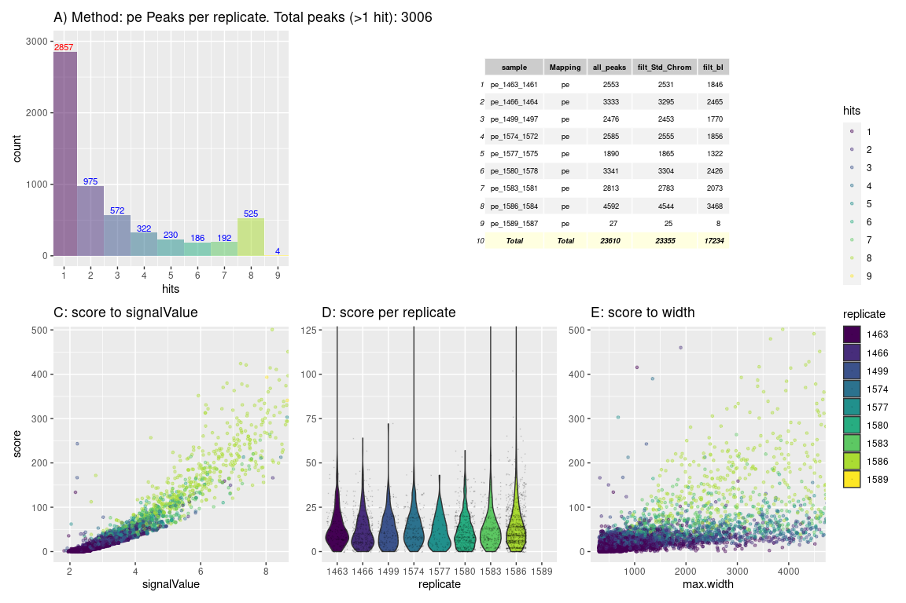
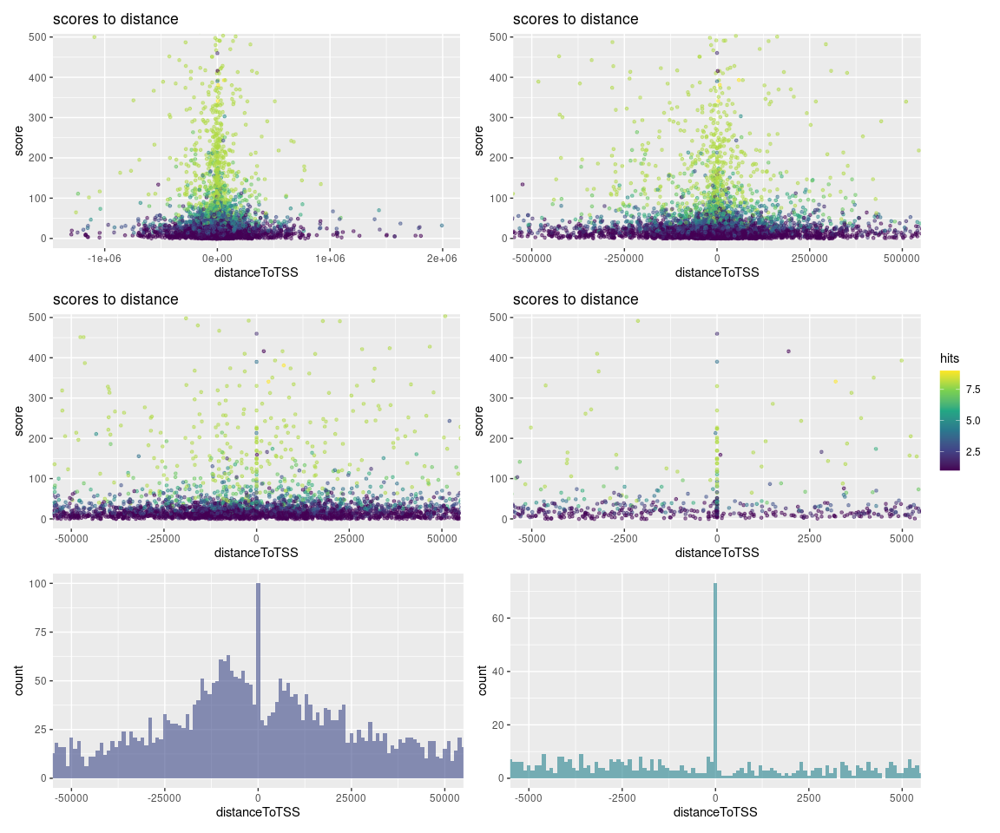
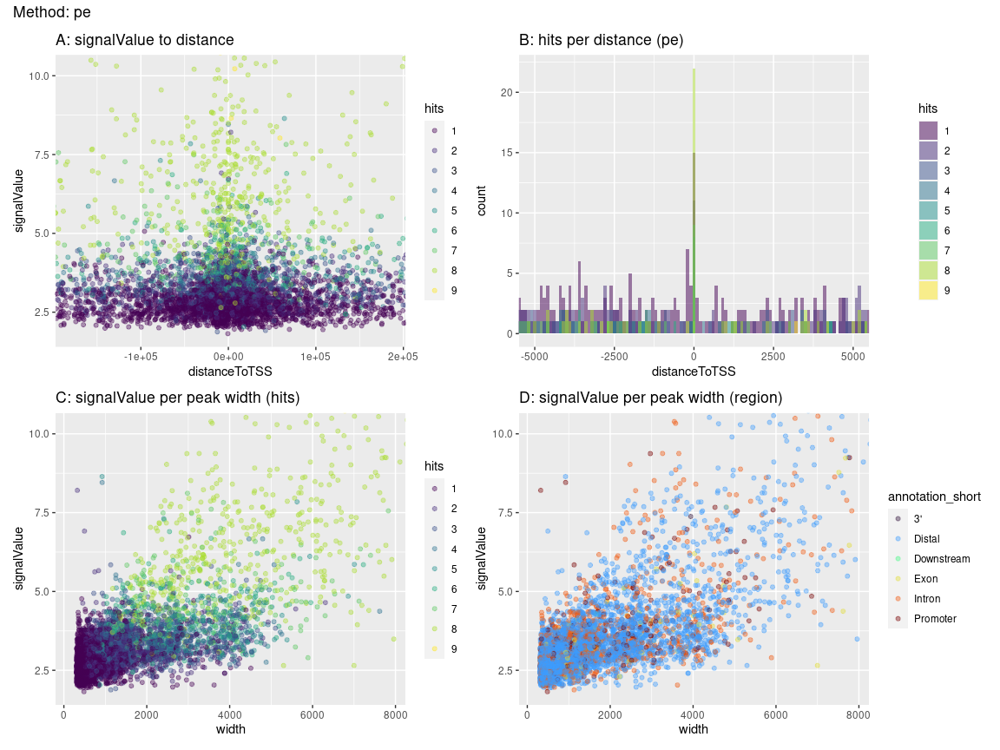
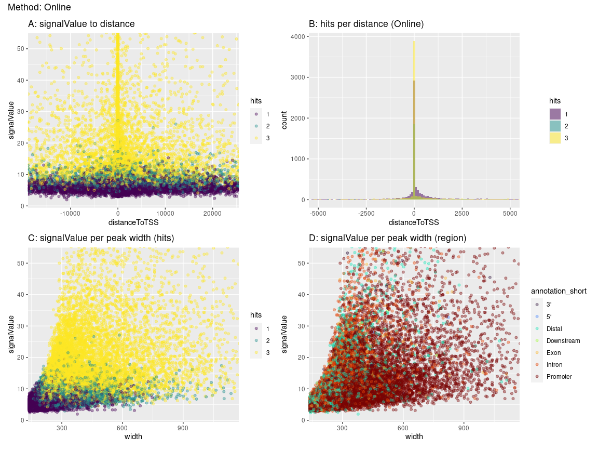

# R Prepare System

## R update and load librarys

BiocManager::install()

``` r
# BiocManager::install(update = TRUE, ask = FALSE)

library(dbplyr)
library(tidyverse)
library(ChIPseeker)
library(rtracklayer)
library(trackViewer)
library(GenomicRanges)
library(IRanges)
library(ChIPpeakAnno)
library(AnnotationHub)
library(ggplot2)
library(viridis)
library(kableExtra)
library(DT)
library(patchwork)
library(gridExtra)
library(foreach)
library(doParallel)
# library()

library(TxDb.Mmusculus.UCSC.mm39.knownGene)
txdb <- TxDb.Mmusculus.UCSC.mm39.knownGene
```

## R folders

# Unix Prepare System

## Unix Update System

## Unix Folder & Names

# 3 Results

<a href="../Data/sheme.pdf" height="100%," width="100%">Analysis
Overview</a> 

``` r
knitr::include_graphics("https://github.com/DNAborn/ChIPseq_Wt1/blob/main/Results/sheme.png")
```

<!-- -->

``` r
knitr::include_graphics("https://github.com/DNAborn/ChIPseq_Wt1/blob/main/Results/sheme.png?raw=true")
```

<!-- -->

``` r
knitr::include_graphics("https://raw.githubusercontent.com/DNAborn/ChIPseq_Wt1/main/Results/sheme.png?token=GHSAT0AAAAAACMW7ZFWBU7F46KMZ6QEZYBGZOLMYTQ")
```

<!-- -->

``` r
knitr::include_graphics("../Data/sheme.png")
```


``` r
# knitr::include_graphics("./sheme.png")
# knitr::include_graphics("./sheme.pdf")
# knitr::include_graphics("../sheme.png")
# knitr::include_graphics("../sheme.pdf")
# knitr::include_graphics("/mnt/s/AG/AG-Scholz-NGS/Daten/Simon/P3026_ChIP-Seq_epiSVF/ChIPseq_Wt1_P3026/Results/sheme.png")
# knitr::include_graphics("/mnt/s/AG/AG-Scholz-NGS/Daten/Simon/P3026_ChIP-Seq_epiSVF/ChIPseq_Wt1_P3026/Results/sheme.pdf")
getwd()
```

    ## [1] "/mnt/s/AG/AG-Scholz-NGS/Daten/Simon/P3026_ChIP-Seq_epiSVF/ChIPseq_Wt1_P3026/Results"

``` r
print("include figure in r chunk")
knitr::include_graphics("../Data/sheme.pdf") # doesn't show
```

### Generate combined peak list

#### Peak Tables

``` r
dim(npeak_numbers_table)
```

    ## [1] 39  5

``` r
knitr::kable(npeak_numbers_table, format = "markdown") %>% 
  kable_styling("striped", full_width = F) %>% 
  scroll_box(height = "400px")
```

<div style="border: 1px solid #ddd; padding: 0px; overflow-y: scroll; height:400px; ">

<table class="table table-striped" style="width: auto !important; margin-left: auto; margin-right: auto;">
<thead>
<tr>
<th style="text-align:left;position: sticky; top:0; background-color: #FFFFFF;">
sample
</th>
<th style="text-align:left;position: sticky; top:0; background-color: #FFFFFF;">
Mapping
</th>
<th style="text-align:right;position: sticky; top:0; background-color: #FFFFFF;">
all_peaks
</th>
<th style="text-align:right;position: sticky; top:0; background-color: #FFFFFF;">
filt_Std_Chrom
</th>
<th style="text-align:right;position: sticky; top:0; background-color: #FFFFFF;">
filt_bl
</th>
</tr>
</thead>
<tbody>
<tr>
<td style="text-align:left;">
Std_1463_1461
</td>
<td style="text-align:left;">
Std
</td>
<td style="text-align:right;">
379
</td>
<td style="text-align:right;">
338
</td>
<td style="text-align:right;">
200
</td>
</tr>
<tr>
<td style="text-align:left;">
Std_1466_1464
</td>
<td style="text-align:left;">
Std
</td>
<td style="text-align:right;">
282
</td>
<td style="text-align:right;">
241
</td>
<td style="text-align:right;">
124
</td>
</tr>
<tr>
<td style="text-align:left;">
Std_1499_1497
</td>
<td style="text-align:left;">
Std
</td>
<td style="text-align:right;">
411
</td>
<td style="text-align:right;">
368
</td>
<td style="text-align:right;">
236
</td>
</tr>
<tr>
<td style="text-align:left;">
Std_1574_1572
</td>
<td style="text-align:left;">
Std
</td>
<td style="text-align:right;">
568
</td>
<td style="text-align:right;">
523
</td>
<td style="text-align:right;">
310
</td>
</tr>
<tr>
<td style="text-align:left;">
Std_1577_1575
</td>
<td style="text-align:left;">
Std
</td>
<td style="text-align:right;">
224
</td>
<td style="text-align:right;">
190
</td>
<td style="text-align:right;">
107
</td>
</tr>
<tr>
<td style="text-align:left;">
Std_1580_1578
</td>
<td style="text-align:left;">
Std
</td>
<td style="text-align:right;">
2063
</td>
<td style="text-align:right;">
1997
</td>
<td style="text-align:right;">
1562
</td>
</tr>
<tr>
<td style="text-align:left;">
Std_1583_1581
</td>
<td style="text-align:left;">
Std
</td>
<td style="text-align:right;">
1131
</td>
<td style="text-align:right;">
1072
</td>
<td style="text-align:right;">
826
</td>
</tr>
<tr>
<td style="text-align:left;">
Std_1586_1584
</td>
<td style="text-align:left;">
Std
</td>
<td style="text-align:right;">
184
</td>
<td style="text-align:right;">
143
</td>
<td style="text-align:right;">
48
</td>
</tr>
<tr>
<td style="text-align:left;">
Std_1589_1587
</td>
<td style="text-align:left;">
Std
</td>
<td style="text-align:right;">
109
</td>
<td style="text-align:right;">
106
</td>
<td style="text-align:right;">
61
</td>
</tr>
<tr>
<td style="text-align:left;">
pe_1463_1461
</td>
<td style="text-align:left;">
pe
</td>
<td style="text-align:right;">
2553
</td>
<td style="text-align:right;">
2531
</td>
<td style="text-align:right;">
1861
</td>
</tr>
<tr>
<td style="text-align:left;">
pe_1466_1464
</td>
<td style="text-align:left;">
pe
</td>
<td style="text-align:right;">
3333
</td>
<td style="text-align:right;">
3295
</td>
<td style="text-align:right;">
2491
</td>
</tr>
<tr>
<td style="text-align:left;">
pe_1499_1497
</td>
<td style="text-align:left;">
pe
</td>
<td style="text-align:right;">
2476
</td>
<td style="text-align:right;">
2453
</td>
<td style="text-align:right;">
1787
</td>
</tr>
<tr>
<td style="text-align:left;">
pe_1574_1572
</td>
<td style="text-align:left;">
pe
</td>
<td style="text-align:right;">
2585
</td>
<td style="text-align:right;">
2555
</td>
<td style="text-align:right;">
1874
</td>
</tr>
<tr>
<td style="text-align:left;">
pe_1577_1575
</td>
<td style="text-align:left;">
pe
</td>
<td style="text-align:right;">
1890
</td>
<td style="text-align:right;">
1865
</td>
<td style="text-align:right;">
1333
</td>
</tr>
<tr>
<td style="text-align:left;">
pe_1580_1578
</td>
<td style="text-align:left;">
pe
</td>
<td style="text-align:right;">
3341
</td>
<td style="text-align:right;">
3304
</td>
<td style="text-align:right;">
2450
</td>
</tr>
<tr>
<td style="text-align:left;">
pe_1583_1581
</td>
<td style="text-align:left;">
pe
</td>
<td style="text-align:right;">
2813
</td>
<td style="text-align:right;">
2783
</td>
<td style="text-align:right;">
2091
</td>
</tr>
<tr>
<td style="text-align:left;">
pe_1586_1584
</td>
<td style="text-align:left;">
pe
</td>
<td style="text-align:right;">
4592
</td>
<td style="text-align:right;">
4544
</td>
<td style="text-align:right;">
3522
</td>
</tr>
<tr>
<td style="text-align:left;">
pe_1589_1587
</td>
<td style="text-align:left;">
pe
</td>
<td style="text-align:right;">
27
</td>
<td style="text-align:right;">
25
</td>
<td style="text-align:right;">
8
</td>
</tr>
<tr>
<td style="text-align:left;">
local_1463_1461
</td>
<td style="text-align:left;">
local
</td>
<td style="text-align:right;">
2666
</td>
<td style="text-align:right;">
2634
</td>
<td style="text-align:right;">
1916
</td>
</tr>
<tr>
<td style="text-align:left;">
local_1466_1464
</td>
<td style="text-align:left;">
local
</td>
<td style="text-align:right;">
3602
</td>
<td style="text-align:right;">
3569
</td>
<td style="text-align:right;">
2717
</td>
</tr>
<tr>
<td style="text-align:left;">
local_1499_1497
</td>
<td style="text-align:left;">
local
</td>
<td style="text-align:right;">
2452
</td>
<td style="text-align:right;">
2430
</td>
<td style="text-align:right;">
1769
</td>
</tr>
<tr>
<td style="text-align:left;">
local_1574_1572
</td>
<td style="text-align:left;">
local
</td>
<td style="text-align:right;">
2678
</td>
<td style="text-align:right;">
2643
</td>
<td style="text-align:right;">
1893
</td>
</tr>
<tr>
<td style="text-align:left;">
local_1577_1575
</td>
<td style="text-align:left;">
local
</td>
<td style="text-align:right;">
1910
</td>
<td style="text-align:right;">
1882
</td>
<td style="text-align:right;">
1334
</td>
</tr>
<tr>
<td style="text-align:left;">
local_1580_1578
</td>
<td style="text-align:left;">
local
</td>
<td style="text-align:right;">
3187
</td>
<td style="text-align:right;">
3154
</td>
<td style="text-align:right;">
2315
</td>
</tr>
<tr>
<td style="text-align:left;">
local_1583_1581
</td>
<td style="text-align:left;">
local
</td>
<td style="text-align:right;">
2657
</td>
<td style="text-align:right;">
2626
</td>
<td style="text-align:right;">
1905
</td>
</tr>
<tr>
<td style="text-align:left;">
local_1586_1584
</td>
<td style="text-align:left;">
local
</td>
<td style="text-align:right;">
5200
</td>
<td style="text-align:right;">
5145
</td>
<td style="text-align:right;">
3971
</td>
</tr>
<tr>
<td style="text-align:left;">
local_1589_1587
</td>
<td style="text-align:left;">
local
</td>
<td style="text-align:right;">
107
</td>
<td style="text-align:right;">
95
</td>
<td style="text-align:right;">
58
</td>
</tr>
<tr>
<td style="text-align:left;">
chro5k_1463_1461
</td>
<td style="text-align:left;">
chro5k
</td>
<td style="text-align:right;">
33
</td>
<td style="text-align:right;">
22
</td>
<td style="text-align:right;">
8
</td>
</tr>
<tr>
<td style="text-align:left;">
chro5k_1466_1464
</td>
<td style="text-align:left;">
chro5k
</td>
<td style="text-align:right;">
21
</td>
<td style="text-align:right;">
13
</td>
<td style="text-align:right;">
2
</td>
</tr>
<tr>
<td style="text-align:left;">
chro5k_1499_1497
</td>
<td style="text-align:left;">
chro5k
</td>
<td style="text-align:right;">
28
</td>
<td style="text-align:right;">
13
</td>
<td style="text-align:right;">
2
</td>
</tr>
<tr>
<td style="text-align:left;">
chro5k_1574_1572
</td>
<td style="text-align:left;">
chro5k
</td>
<td style="text-align:right;">
35
</td>
<td style="text-align:right;">
24
</td>
<td style="text-align:right;">
14
</td>
</tr>
<tr>
<td style="text-align:left;">
chro5k_1577_1575
</td>
<td style="text-align:left;">
chro5k
</td>
<td style="text-align:right;">
38
</td>
<td style="text-align:right;">
25
</td>
<td style="text-align:right;">
15
</td>
</tr>
<tr>
<td style="text-align:left;">
chro5k_1580_1578
</td>
<td style="text-align:left;">
chro5k
</td>
<td style="text-align:right;">
36
</td>
<td style="text-align:right;">
26
</td>
<td style="text-align:right;">
12
</td>
</tr>
<tr>
<td style="text-align:left;">
chro5k_1583_1581
</td>
<td style="text-align:left;">
chro5k
</td>
<td style="text-align:right;">
39
</td>
<td style="text-align:right;">
27
</td>
<td style="text-align:right;">
15
</td>
</tr>
<tr>
<td style="text-align:left;">
chro5k_1586_1584
</td>
<td style="text-align:left;">
chro5k
</td>
<td style="text-align:right;">
39
</td>
<td style="text-align:right;">
25
</td>
<td style="text-align:right;">
10
</td>
</tr>
<tr>
<td style="text-align:left;">
chro5k_1589_1587
</td>
<td style="text-align:left;">
chro5k
</td>
<td style="text-align:right;">
24
</td>
<td style="text-align:right;">
22
</td>
<td style="text-align:right;">
12
</td>
</tr>
<tr>
<td style="text-align:left;">
Online_SRR1703423_SRR1703426
</td>
<td style="text-align:left;">
Online
</td>
<td style="text-align:right;">
12870
</td>
<td style="text-align:right;">
12869
</td>
<td style="text-align:right;">
12698
</td>
</tr>
<tr>
<td style="text-align:left;">
Online_SRR1703424_SRR1703427
</td>
<td style="text-align:left;">
Online
</td>
<td style="text-align:right;">
25304
</td>
<td style="text-align:right;">
25288
</td>
<td style="text-align:right;">
24757
</td>
</tr>
<tr>
<td style="text-align:left;">
Online_SRR1703425_SRR1703428
</td>
<td style="text-align:left;">
Online
</td>
<td style="text-align:right;">
16322
</td>
<td style="text-align:right;">
16309
</td>
<td style="text-align:right;">
15963
</td>
</tr>
</tbody>
</table>

</div>

``` r
# datatable(npeak_numbers_table)

knitr::kable(peaks_overlap)  %>% 
  kable_styling("striped", full_width = F) %>% 
  scroll_box(height = "400px")
```

<div style="border: 1px solid #ddd; padding: 0px; overflow-y: scroll; height:400px; ">

<table class="table table-striped" style="width: auto !important; margin-left: auto; margin-right: auto;">
<thead>
<tr>
<th style="text-align:left;position: sticky; top:0; background-color: #FFFFFF;">
</th>
<th style="text-align:left;position: sticky; top:0; background-color: #FFFFFF;">
Sample
</th>
<th style="text-align:right;position: sticky; top:0; background-color: #FFFFFF;">
Peaks
</th>
<th style="text-align:right;position: sticky; top:0; background-color: #FFFFFF;">
ol.Std
</th>
<th style="text-align:right;position: sticky; top:0; background-color: #FFFFFF;">
ol.pe
</th>
<th style="text-align:right;position: sticky; top:0; background-color: #FFFFFF;">
ol.local
</th>
<th style="text-align:right;position: sticky; top:0; background-color: #FFFFFF;">
ol.chro5k
</th>
<th style="text-align:right;position: sticky; top:0; background-color: #FFFFFF;">
ol.Online
</th>
</tr>
</thead>
<tbody>
<tr>
<td style="text-align:left;">
Std
</td>
<td style="text-align:left;">
Std
</td>
<td style="text-align:right;">
3381
</td>
<td style="text-align:right;">
3387
</td>
<td style="text-align:right;">
299
</td>
<td style="text-align:right;">
326
</td>
<td style="text-align:right;">
55
</td>
<td style="text-align:right;">
36
</td>
</tr>
<tr>
<td style="text-align:left;">
pe
</td>
<td style="text-align:left;">
pe
</td>
<td style="text-align:right;">
5928
</td>
<td style="text-align:right;">
304
</td>
<td style="text-align:right;">
6392
</td>
<td style="text-align:right;">
4829
</td>
<td style="text-align:right;">
29
</td>
<td style="text-align:right;">
98
</td>
</tr>
<tr>
<td style="text-align:left;">
local
</td>
<td style="text-align:left;">
local
</td>
<td style="text-align:right;">
6955
</td>
<td style="text-align:right;">
340
</td>
<td style="text-align:right;">
4935
</td>
<td style="text-align:right;">
7681
</td>
<td style="text-align:right;">
34
</td>
<td style="text-align:right;">
125
</td>
</tr>
<tr>
<td style="text-align:left;">
chro5k
</td>
<td style="text-align:left;">
chro5k
</td>
<td style="text-align:right;">
57
</td>
<td style="text-align:right;">
58
</td>
<td style="text-align:right;">
29
</td>
<td style="text-align:right;">
34
</td>
<td style="text-align:right;">
59
</td>
<td style="text-align:right;">
13
</td>
</tr>
<tr>
<td style="text-align:left;">
Online
</td>
<td style="text-align:left;">
Online
</td>
<td style="text-align:right;">
26474
</td>
<td style="text-align:right;">
47
</td>
<td style="text-align:right;">
111
</td>
<td style="text-align:right;">
135
</td>
<td style="text-align:right;">
14
</td>
<td style="text-align:right;">
33078
</td>
</tr>
</tbody>
</table>

</div>

#### Hists & Tables



#### Venn Overlap Peaks

<!-- --><!-- -->

## Annotate Peaks

#### 1 Run

``` r
# Add Gene names
ah = AnnotationHub()
query(ah, c("EnsDb", "Musculus"))
```

    ## AnnotationHub with 81 records
    ## # snapshotDate(): 2023-10-23
    ## # $dataprovider: Ensembl
    ## # $species: Mus musculus, Balaenoptera musculus, Mus musculus musculus, Mus ...
    ## # $rdataclass: EnsDb
    ## # additional mcols(): taxonomyid, genome, description,
    ## #   coordinate_1_based, maintainer, rdatadateadded, preparerclass, tags,
    ## #   rdatapath, sourceurl, sourcetype 
    ## # retrieve records with, e.g., 'object[["AH53222"]]' 
    ## 
    ##              title                                        
    ##   AH53222  | Ensembl 87 EnsDb for Mus Musculus            
    ##   AH53726  | Ensembl 88 EnsDb for Mus Musculus            
    ##   AH56691  | Ensembl 89 EnsDb for Mus Musculus            
    ##   AH57770  | Ensembl 90 EnsDb for Mus Musculus            
    ##   AH60788  | Ensembl 91 EnsDb for Mus Musculus            
    ##   ...        ...                                          
    ##   AH116336 | Ensembl 111 EnsDb for Mus musculus           
    ##   AH116337 | Ensembl 111 EnsDb for Mus musculus           
    ##   AH116338 | Ensembl 111 EnsDb for Mus musculus musculus  
    ##   AH116339 | Ensembl 111 EnsDb for Mus musculus domesticus
    ##   AH116340 | Ensembl 111 EnsDb for Mus musculus

``` r
edb <- ah[["AH113713"]]

# 1 Subfolder

figures_annotated_peaks <- list()

i <- "pe"
all_npeaksAnno <- annotatePeak(npeak_combined_all[[i]], TxDb=txdb,tssRegion=c(-3000, 3000), verbose=TRUE)
```

    ## >> preparing features information...      2024-02-13 14:07:09 
    ## >> identifying nearest features...        2024-02-13 14:07:09 
    ## >> calculating distance from peak to TSS...   2024-02-13 14:07:10 
    ## >> assigning genomic annotation...        2024-02-13 14:07:10 
    ## >> assigning chromosome lengths           2024-02-13 14:07:23 
    ## >> done...                    2024-02-13 14:07:23

``` r
  all_npeaksAnno_table <- as.data.frame(all_npeaksAnno)
  all_npeaksAnno_table$transcriptId2 <- sub("\\.\\d+$", "", all_npeaksAnno_table$transcriptId)
  all_npeaksAnno_table$geneId <- mapIds(edb, keys = all_npeaksAnno_table$transcriptId2, column = "GENEID", keytype = "TXID")
  all_npeaksAnno_table$symbol <- mapIds(edb, keys = all_npeaksAnno_table$transcriptId2, column = "SYMBOL", keytype = "TXID")
n <- names(npeak_combined_all[i])
all_npeaksAnno_table$annotation_short <-  str_split(all_npeaksAnno_table$annotation,pattern = " ", simplify = TRUE)[,1]

# Annotated table
top_hits <- all_npeaksAnno_table[order(all_npeaksAnno_table$signalValue, decreasing=T),]
colnames(top_hits)
```

    ##  [1] "seqnames"         "start"            "end"              "width"           
    ##  [5] "strand"           "name"             "score"            "signalValue"     
    ##  [9] "pValue"           "qValue"           "peak"             "id"              
    ## [13] "hits"             "annotation"       "geneChr"          "geneStart"       
    ## [17] "geneEnd"          "geneLength"       "geneStrand"       "geneId"          
    ## [21] "transcriptId"     "distanceToTSS"    "transcriptId2"    "symbol"          
    ## [25] "annotation_short"

``` r
kable(top_hits[1:40,c("seqnames","start","end","width","score","signalValue","hits","annotation","geneId","distanceToTSS","symbol","annotation_short")])  %>%
 kable_styling("striped", full_width = F) %>% 
 scroll_box(height = "400px")
```

<div style="border: 1px solid #ddd; padding: 0px; overflow-y: scroll; height:400px; ">

<table class="table table-striped" style="width: auto !important; margin-left: auto; margin-right: auto;">
<thead>
<tr>
<th style="text-align:left;position: sticky; top:0; background-color: #FFFFFF;">
</th>
<th style="text-align:left;position: sticky; top:0; background-color: #FFFFFF;">
seqnames
</th>
<th style="text-align:right;position: sticky; top:0; background-color: #FFFFFF;">
start
</th>
<th style="text-align:right;position: sticky; top:0; background-color: #FFFFFF;">
end
</th>
<th style="text-align:right;position: sticky; top:0; background-color: #FFFFFF;">
width
</th>
<th style="text-align:right;position: sticky; top:0; background-color: #FFFFFF;">
score
</th>
<th style="text-align:right;position: sticky; top:0; background-color: #FFFFFF;">
signalValue
</th>
<th style="text-align:right;position: sticky; top:0; background-color: #FFFFFF;">
hits
</th>
<th style="text-align:left;position: sticky; top:0; background-color: #FFFFFF;">
annotation
</th>
<th style="text-align:left;position: sticky; top:0; background-color: #FFFFFF;">
geneId
</th>
<th style="text-align:right;position: sticky; top:0; background-color: #FFFFFF;">
distanceToTSS
</th>
<th style="text-align:left;position: sticky; top:0; background-color: #FFFFFF;">
symbol
</th>
<th style="text-align:left;position: sticky; top:0; background-color: #FFFFFF;">
annotation_short
</th>
</tr>
</thead>
<tbody>
<tr>
<td style="text-align:left;">
2084
</td>
<td style="text-align:left;">
chr17
</td>
<td style="text-align:right;">
4676434
</td>
<td style="text-align:right;">
4676880
</td>
<td style="text-align:right;">
447
</td>
<td style="text-align:right;">
10464.86
</td>
<td style="text-align:right;">
98.17
</td>
<td style="text-align:right;">
7
</td>
<td style="text-align:left;">
Distal Intergenic
</td>
<td style="text-align:left;">
ENSMUSG00000116767
</td>
<td style="text-align:right;">
-8373
</td>
<td style="text-align:left;">
4930517M08Rik
</td>
<td style="text-align:left;">
Distal
</td>
</tr>
<tr>
<td style="text-align:left;">
4080
</td>
<td style="text-align:left;">
chr6
</td>
<td style="text-align:right;">
48882120
</td>
<td style="text-align:right;">
48886141
</td>
<td style="text-align:right;">
4022
</td>
<td style="text-align:right;">
4118.86
</td>
<td style="text-align:right;">
60.05
</td>
<td style="text-align:right;">
6
</td>
<td style="text-align:left;">
Promoter (\<=1kb)
</td>
<td style="text-align:left;">
ENSMUSG00000029811
</td>
<td style="text-align:right;">
0
</td>
<td style="text-align:left;">
Aoc1
</td>
<td style="text-align:left;">
Promoter
</td>
</tr>
<tr>
<td style="text-align:left;">
5552
</td>
<td style="text-align:left;">
chrX
</td>
<td style="text-align:right;">
105230323
</td>
<td style="text-align:right;">
105230844
</td>
<td style="text-align:right;">
522
</td>
<td style="text-align:right;">
2703.00
</td>
<td style="text-align:right;">
37.57
</td>
<td style="text-align:right;">
1
</td>
<td style="text-align:left;">
Promoter (\<=1kb)
</td>
<td style="text-align:left;">
ENSMUSG00000062070
</td>
<td style="text-align:right;">
0
</td>
<td style="text-align:left;">
Pgk1
</td>
<td style="text-align:left;">
Promoter
</td>
</tr>
<tr>
<td style="text-align:left;">
771
</td>
<td style="text-align:left;">
chr11
</td>
<td style="text-align:right;">
5956234
</td>
<td style="text-align:right;">
5956613
</td>
<td style="text-align:right;">
380
</td>
<td style="text-align:right;">
2341.00
</td>
<td style="text-align:right;">
36.44
</td>
<td style="text-align:right;">
1
</td>
<td style="text-align:left;">
Intron (ENSMUST00000109813.9/12323, intron 3 of 20)
</td>
<td style="text-align:left;">
ENSMUSG00000057897
</td>
<td style="text-align:right;">
-5786
</td>
<td style="text-align:left;">
Camk2b
</td>
<td style="text-align:left;">
Intron
</td>
</tr>
<tr>
<td style="text-align:left;">
4281
</td>
<td style="text-align:left;">
chr6
</td>
<td style="text-align:right;">
132440307
</td>
<td style="text-align:right;">
132440774
</td>
<td style="text-align:right;">
468
</td>
<td style="text-align:right;">
1271.00
</td>
<td style="text-align:right;">
28.61
</td>
<td style="text-align:right;">
1
</td>
<td style="text-align:left;">
Distal Intergenic
</td>
<td style="text-align:left;">
ENSMUSG00000108041
</td>
<td style="text-align:right;">
-21622
</td>
<td style="text-align:left;">
Gm5154
</td>
<td style="text-align:left;">
Distal
</td>
</tr>
<tr>
<td style="text-align:left;">
2534
</td>
<td style="text-align:left;">
chr19
</td>
<td style="text-align:right;">
37685100
</td>
<td style="text-align:right;">
37686273
</td>
<td style="text-align:right;">
1174
</td>
<td style="text-align:right;">
1177.50
</td>
<td style="text-align:right;">
22.15
</td>
<td style="text-align:right;">
4
</td>
<td style="text-align:left;">
Promoter (\<=1kb)
</td>
<td style="text-align:left;">
ENSMUSG00000120139
</td>
<td style="text-align:right;">
0
</td>
<td style="text-align:left;">
Gm32342
</td>
<td style="text-align:left;">
Promoter
</td>
</tr>
<tr>
<td style="text-align:left;">
4079
</td>
<td style="text-align:left;">
chr6
</td>
<td style="text-align:right;">
48871614
</td>
<td style="text-align:right;">
48872189
</td>
<td style="text-align:right;">
576
</td>
<td style="text-align:right;">
705.00
</td>
<td style="text-align:right;">
17.60
</td>
<td style="text-align:right;">
1
</td>
<td style="text-align:left;">
Promoter (\<=1kb)
</td>
<td style="text-align:left;">
ENSMUSG00000029811
</td>
<td style="text-align:right;">
0
</td>
<td style="text-align:left;">
Aoc1
</td>
<td style="text-align:left;">
Promoter
</td>
</tr>
<tr>
<td style="text-align:left;">
2740
</td>
<td style="text-align:left;">
chr2
</td>
<td style="text-align:right;">
104956433
</td>
<td style="text-align:right;">
104958215
</td>
<td style="text-align:right;">
1783
</td>
<td style="text-align:right;">
531.67
</td>
<td style="text-align:right;">
14.01
</td>
<td style="text-align:right;">
6
</td>
<td style="text-align:left;">
Promoter (\<=1kb)
</td>
<td style="text-align:left;">
ENSMUSG00000016458
</td>
<td style="text-align:right;">
0
</td>
<td style="text-align:left;">
Wt1
</td>
<td style="text-align:left;">
Promoter
</td>
</tr>
<tr>
<td style="text-align:left;">
2741
</td>
<td style="text-align:left;">
chr2
</td>
<td style="text-align:right;">
104963160
</td>
<td style="text-align:right;">
104964205
</td>
<td style="text-align:right;">
1046
</td>
<td style="text-align:right;">
416.00
</td>
<td style="text-align:right;">
13.48
</td>
<td style="text-align:right;">
1
</td>
<td style="text-align:left;">
Promoter (1-2kb)
</td>
<td style="text-align:left;">
ENSMUSG00000016458
</td>
<td style="text-align:right;">
1932
</td>
<td style="text-align:left;">
Wt1
</td>
<td style="text-align:left;">
Promoter
</td>
</tr>
<tr>
<td style="text-align:left;">
2815
</td>
<td style="text-align:left;">
chr2
</td>
<td style="text-align:right;">
146838103
</td>
<td style="text-align:right;">
146846920
</td>
<td style="text-align:right;">
8818
</td>
<td style="text-align:right;">
676.62
</td>
<td style="text-align:right;">
12.43
</td>
<td style="text-align:right;">
8
</td>
<td style="text-align:left;">
Distal Intergenic
</td>
<td style="text-align:left;">
ENSMUSG00000027433
</td>
<td style="text-align:right;">
-7996
</td>
<td style="text-align:left;">
Xrn2
</td>
<td style="text-align:left;">
Distal
</td>
</tr>
<tr>
<td style="text-align:left;">
5276
</td>
<td style="text-align:left;">
chrX
</td>
<td style="text-align:right;">
17362468
</td>
<td style="text-align:right;">
17370723
</td>
<td style="text-align:right;">
8256
</td>
<td style="text-align:right;">
649.38
</td>
<td style="text-align:right;">
12.41
</td>
<td style="text-align:right;">
8
</td>
<td style="text-align:left;">
Distal Intergenic
</td>
<td style="text-align:left;">
ENSMUSG00000025040
</td>
<td style="text-align:right;">
67140
</td>
<td style="text-align:left;">
Fundc1
</td>
<td style="text-align:left;">
Distal
</td>
</tr>
<tr>
<td style="text-align:left;">
3103
</td>
<td style="text-align:left;">
chr3
</td>
<td style="text-align:right;">
125921474
</td>
<td style="text-align:right;">
125929133
</td>
<td style="text-align:right;">
7660
</td>
<td style="text-align:right;">
726.50
</td>
<td style="text-align:right;">
12.12
</td>
<td style="text-align:right;">
8
</td>
<td style="text-align:left;">
Distal Intergenic
</td>
<td style="text-align:left;">
ENSMUSG00000032854
</td>
<td style="text-align:right;">
-189206
</td>
<td style="text-align:left;">
Ugt8a
</td>
<td style="text-align:left;">
Distal
</td>
</tr>
<tr>
<td style="text-align:left;">
5342
</td>
<td style="text-align:left;">
chrX
</td>
<td style="text-align:right;">
48441137
</td>
<td style="text-align:right;">
48449540
</td>
<td style="text-align:right;">
8404
</td>
<td style="text-align:right;">
732.62
</td>
<td style="text-align:right;">
12.02
</td>
<td style="text-align:right;">
8
</td>
<td style="text-align:left;">
Intron (ENSMUST00000147144.2/102638827, intron 1 of 3)
</td>
<td style="text-align:left;">
ENSMUSG00000087369
</td>
<td style="text-align:right;">
-7023
</td>
<td style="text-align:left;">
Gm14696
</td>
<td style="text-align:left;">
Intron
</td>
</tr>
<tr>
<td style="text-align:left;">
1661
</td>
<td style="text-align:left;">
chr14
</td>
<td style="text-align:right;">
100619090
</td>
<td style="text-align:right;">
100626527
</td>
<td style="text-align:right;">
7438
</td>
<td style="text-align:right;">
709.00
</td>
<td style="text-align:right;">
11.93
</td>
<td style="text-align:right;">
8
</td>
<td style="text-align:left;">
Distal Intergenic
</td>
<td style="text-align:left;">
ENSMUSG00000119005
</td>
<td style="text-align:right;">
-29392
</td>
<td style="text-align:left;">
Gm26367
</td>
<td style="text-align:left;">
Distal
</td>
</tr>
<tr>
<td style="text-align:left;">
4362
</td>
<td style="text-align:left;">
chr7
</td>
<td style="text-align:right;">
7800198
</td>
<td style="text-align:right;">
7813532
</td>
<td style="text-align:right;">
13335
</td>
<td style="text-align:right;">
703.75
</td>
<td style="text-align:right;">
10.97
</td>
<td style="text-align:right;">
8
</td>
<td style="text-align:left;">
Intron (ENSMUST00000169683.2/625353, intron 4 of 5)
</td>
<td style="text-align:left;">
ENSMUSG00000096399
</td>
<td style="text-align:right;">
9334
</td>
<td style="text-align:left;">
Vmn2r35
</td>
<td style="text-align:left;">
Intron
</td>
</tr>
<tr>
<td style="text-align:left;">
1749
</td>
<td style="text-align:left;">
chr15
</td>
<td style="text-align:right;">
11905696
</td>
<td style="text-align:right;">
11907045
</td>
<td style="text-align:right;">
1350
</td>
<td style="text-align:right;">
313.00
</td>
<td style="text-align:right;">
10.79
</td>
<td style="text-align:right;">
4
</td>
<td style="text-align:left;">
Promoter (\<=1kb)
</td>
<td style="text-align:left;">
ENSMUSG00000022206
</td>
<td style="text-align:right;">
0
</td>
<td style="text-align:left;">
Npr3
</td>
<td style="text-align:left;">
Promoter
</td>
</tr>
<tr>
<td style="text-align:left;">
1376
</td>
<td style="text-align:left;">
chr13
</td>
<td style="text-align:right;">
88045393
</td>
<td style="text-align:right;">
88052367
</td>
<td style="text-align:right;">
6975
</td>
<td style="text-align:right;">
589.00
</td>
<td style="text-align:right;">
10.68
</td>
<td style="text-align:right;">
8
</td>
<td style="text-align:left;">
Distal Intergenic
</td>
<td style="text-align:left;">
ENSMUSG00000114273
</td>
<td style="text-align:right;">
-616942
</td>
<td style="text-align:left;">
Gm34585
</td>
<td style="text-align:left;">
Distal
</td>
</tr>
<tr>
<td style="text-align:left;">
5556
</td>
<td style="text-align:left;">
chrX
</td>
<td style="text-align:right;">
106092502
</td>
<td style="text-align:right;">
106099159
</td>
<td style="text-align:right;">
6658
</td>
<td style="text-align:right;">
478.38
</td>
<td style="text-align:right;">
10.59
</td>
<td style="text-align:right;">
8
</td>
<td style="text-align:left;">
Distal Intergenic
</td>
<td style="text-align:left;">
ENSMUSG00000050921
</td>
<td style="text-align:right;">
-32939
</td>
<td style="text-align:left;">
P2ry10
</td>
<td style="text-align:left;">
Distal
</td>
</tr>
<tr>
<td style="text-align:left;">
1613
</td>
<td style="text-align:left;">
chr14
</td>
<td style="text-align:right;">
84103731
</td>
<td style="text-align:right;">
84111322
</td>
<td style="text-align:right;">
7592
</td>
<td style="text-align:right;">
583.62
</td>
<td style="text-align:right;">
10.32
</td>
<td style="text-align:right;">
8
</td>
<td style="text-align:left;">
Distal Intergenic
</td>
<td style="text-align:left;">
ENSMUSG00000115043
</td>
<td style="text-align:right;">
201408
</td>
<td style="text-align:left;">
Gm32455
</td>
<td style="text-align:left;">
Distal
</td>
</tr>
<tr>
<td style="text-align:left;">
2267
</td>
<td style="text-align:left;">
chr17
</td>
<td style="text-align:right;">
79708448
</td>
<td style="text-align:right;">
79715415
</td>
<td style="text-align:right;">
6968
</td>
<td style="text-align:right;">
505.62
</td>
<td style="text-align:right;">
10.32
</td>
<td style="text-align:right;">
8
</td>
<td style="text-align:left;">
Distal Intergenic
</td>
<td style="text-align:left;">
ENSMUSG00000120381
</td>
<td style="text-align:right;">
43776
</td>
<td style="text-align:left;">
Gm32954
</td>
<td style="text-align:left;">
Distal
</td>
</tr>
<tr>
<td style="text-align:left;">
3686
</td>
<td style="text-align:left;">
chr5
</td>
<td style="text-align:right;">
43153723
</td>
<td style="text-align:right;">
43161832
</td>
<td style="text-align:right;">
8110
</td>
<td style="text-align:right;">
443.88
</td>
<td style="text-align:right;">
9.71
</td>
<td style="text-align:right;">
8
</td>
<td style="text-align:left;">
Distal Intergenic
</td>
<td style="text-align:left;">
ENSMUSG00000107193
</td>
<td style="text-align:right;">
33747
</td>
<td style="text-align:left;">
Gm43700
</td>
<td style="text-align:left;">
Distal
</td>
</tr>
<tr>
<td style="text-align:left;">
839
</td>
<td style="text-align:left;">
chr11
</td>
<td style="text-align:right;">
40847719
</td>
<td style="text-align:right;">
40860758
</td>
<td style="text-align:right;">
13040
</td>
<td style="text-align:right;">
599.12
</td>
<td style="text-align:right;">
9.54
</td>
<td style="text-align:right;">
8
</td>
<td style="text-align:left;">
Distal Intergenic
</td>
<td style="text-align:left;">
ENSMUSG00000020326
</td>
<td style="text-align:right;">
-201581
</td>
<td style="text-align:left;">
Ccng1
</td>
<td style="text-align:left;">
Distal
</td>
</tr>
<tr>
<td style="text-align:left;">
2524
</td>
<td style="text-align:left;">
chr19
</td>
<td style="text-align:right;">
24896501
</td>
<td style="text-align:right;">
24896578
</td>
<td style="text-align:right;">
78
</td>
<td style="text-align:right;">
228.00
</td>
<td style="text-align:right;">
9.23
</td>
<td style="text-align:right;">
1
</td>
<td style="text-align:left;">
Distal Intergenic
</td>
<td style="text-align:left;">
ENSMUSG00000024878
</td>
<td style="text-align:right;">
5622
</td>
<td style="text-align:left;">
Cbwd1
</td>
<td style="text-align:left;">
Distal
</td>
</tr>
<tr>
<td style="text-align:left;">
3584
</td>
<td style="text-align:left;">
chr4
</td>
<td style="text-align:right;">
154721321
</td>
<td style="text-align:right;">
154723218
</td>
<td style="text-align:right;">
1898
</td>
<td style="text-align:right;">
288.50
</td>
<td style="text-align:right;">
9.22
</td>
<td style="text-align:right;">
2
</td>
<td style="text-align:left;">
Promoter (\<=1kb)
</td>
<td style="text-align:left;">
ENSMUSG00000085069
</td>
<td style="text-align:right;">
0
</td>
<td style="text-align:left;">
Prdm16os
</td>
<td style="text-align:left;">
Promoter
</td>
</tr>
<tr>
<td style="text-align:left;">
142
</td>
<td style="text-align:left;">
chr1
</td>
<td style="text-align:right;">
46129690
</td>
<td style="text-align:right;">
46135988
</td>
<td style="text-align:right;">
6299
</td>
<td style="text-align:right;">
361.00
</td>
<td style="text-align:right;">
9.00
</td>
<td style="text-align:right;">
8
</td>
<td style="text-align:left;">
Intron (ENSMUST00000069293.10/227058, intron 6 of 65)
</td>
<td style="text-align:left;">
ENSMUSG00000041144
</td>
<td style="text-align:right;">
23677
</td>
<td style="text-align:left;">
Dnah7b
</td>
<td style="text-align:left;">
Intron
</td>
</tr>
<tr>
<td style="text-align:left;">
2151
</td>
<td style="text-align:left;">
chr17
</td>
<td style="text-align:right;">
37022283
</td>
<td style="text-align:right;">
37027720
</td>
<td style="text-align:right;">
5438
</td>
<td style="text-align:right;">
390.12
</td>
<td style="text-align:right;">
8.98
</td>
<td style="text-align:right;">
8
</td>
<td style="text-align:left;">
Distal Intergenic
</td>
<td style="text-align:left;">
ENSMUSG00000037334
</td>
<td style="text-align:right;">
-39172
</td>
<td style="text-align:left;">
H2-M1
</td>
<td style="text-align:left;">
Distal
</td>
</tr>
<tr>
<td style="text-align:left;">
570
</td>
<td style="text-align:left;">
chr10
</td>
<td style="text-align:right;">
27694744
</td>
<td style="text-align:right;">
27701521
</td>
<td style="text-align:right;">
6778
</td>
<td style="text-align:right;">
504.67
</td>
<td style="text-align:right;">
8.81
</td>
<td style="text-align:right;">
9
</td>
<td style="text-align:left;">
Distal Intergenic
</td>
<td style="text-align:left;">
ENSMUSG00000112206
</td>
<td style="text-align:right;">
-9124
</td>
<td style="text-align:left;">
Gm30228
</td>
<td style="text-align:left;">
Distal
</td>
</tr>
<tr>
<td style="text-align:left;">
5167
</td>
<td style="text-align:left;">
chr9
</td>
<td style="text-align:right;">
79446581
</td>
<td style="text-align:right;">
79451203
</td>
<td style="text-align:right;">
4623
</td>
<td style="text-align:right;">
316.88
</td>
<td style="text-align:right;">
8.80
</td>
<td style="text-align:right;">
8
</td>
<td style="text-align:left;">
Distal Intergenic
</td>
<td style="text-align:left;">
ENSMUSG00000111765
</td>
<td style="text-align:right;">
-19997
</td>
<td style="text-align:left;">
Gm10635
</td>
<td style="text-align:left;">
Distal
</td>
</tr>
<tr>
<td style="text-align:left;">
2620
</td>
<td style="text-align:left;">
chr2
</td>
<td style="text-align:right;">
22006758
</td>
<td style="text-align:right;">
22011976
</td>
<td style="text-align:right;">
5219
</td>
<td style="text-align:right;">
359.88
</td>
<td style="text-align:right;">
8.57
</td>
<td style="text-align:right;">
8
</td>
<td style="text-align:left;">
Distal Intergenic
</td>
<td style="text-align:left;">
ENSMUSG00000025716
</td>
<td style="text-align:right;">
-220338
</td>
<td style="text-align:left;">
Myo3a
</td>
<td style="text-align:left;">
Distal
</td>
</tr>
<tr>
<td style="text-align:left;">
2891
</td>
<td style="text-align:left;">
chr3
</td>
<td style="text-align:right;">
14529795
</td>
<td style="text-align:right;">
14535647
</td>
<td style="text-align:right;">
5853
</td>
<td style="text-align:right;">
327.38
</td>
<td style="text-align:right;">
8.57
</td>
<td style="text-align:right;">
8
</td>
<td style="text-align:left;">
Distal Intergenic
</td>
<td style="text-align:left;">
ENSMUSG00000039710
</td>
<td style="text-align:right;">
-10110
</td>
<td style="text-align:left;">
Slc7a12
</td>
<td style="text-align:left;">
Distal
</td>
</tr>
<tr>
<td style="text-align:left;">
1610
</td>
<td style="text-align:left;">
chr14
</td>
<td style="text-align:right;">
81930242
</td>
<td style="text-align:right;">
81937251
</td>
<td style="text-align:right;">
7010
</td>
<td style="text-align:right;">
271.00
</td>
<td style="text-align:right;">
8.56
</td>
<td style="text-align:right;">
8
</td>
<td style="text-align:left;">
Intron (ENSMUST00000227374.2/105245829, intron 1 of 1)
</td>
<td style="text-align:left;">
ENSMUSG00000115455
</td>
<td style="text-align:right;">
6992
</td>
<td style="text-align:left;">
Gm41219
</td>
<td style="text-align:left;">
Intron
</td>
</tr>
<tr>
<td style="text-align:left;">
4242
</td>
<td style="text-align:left;">
chr6
</td>
<td style="text-align:right;">
115843691
</td>
<td style="text-align:right;">
115851034
</td>
<td style="text-align:right;">
7344
</td>
<td style="text-align:right;">
268.62
</td>
<td style="text-align:right;">
8.53
</td>
<td style="text-align:right;">
8
</td>
<td style="text-align:left;">
Intron (ENSMUST00000112925.8/81896, intron 3 of 28)
</td>
<td style="text-align:left;">
ENSMUSG00000030323
</td>
<td style="text-align:right;">
-3194
</td>
<td style="text-align:left;">
Ift122
</td>
<td style="text-align:left;">
Intron
</td>
</tr>
<tr>
<td style="text-align:left;">
4007
</td>
<td style="text-align:left;">
chr6
</td>
<td style="text-align:right;">
20697933
</td>
<td style="text-align:right;">
20702609
</td>
<td style="text-align:right;">
4677
</td>
<td style="text-align:right;">
274.88
</td>
<td style="text-align:right;">
8.47
</td>
<td style="text-align:right;">
8
</td>
<td style="text-align:left;">
Distal Intergenic
</td>
<td style="text-align:left;">
ENSMUSG00000087831
</td>
<td style="text-align:right;">
310632
</td>
<td style="text-align:left;">
Gm23960
</td>
<td style="text-align:left;">
Distal
</td>
</tr>
<tr>
<td style="text-align:left;">
1284
</td>
<td style="text-align:left;">
chr13
</td>
<td style="text-align:right;">
61030788
</td>
<td style="text-align:right;">
61037273
</td>
<td style="text-align:right;">
6486
</td>
<td style="text-align:right;">
340.75
</td>
<td style="text-align:right;">
8.38
</td>
<td style="text-align:right;">
8
</td>
<td style="text-align:left;">
Intron (ENSMUST00000225690.2/214639, intron 2 of 8)
</td>
<td style="text-align:left;">
ENSMUSG00000074874
</td>
<td style="text-align:right;">
6827
</td>
<td style="text-align:left;">
Ctla2b
</td>
<td style="text-align:left;">
Intron
</td>
</tr>
<tr>
<td style="text-align:left;">
1878
</td>
<td style="text-align:left;">
chr15
</td>
<td style="text-align:right;">
91791010
</td>
<td style="text-align:right;">
91808161
</td>
<td style="text-align:right;">
17152
</td>
<td style="text-align:right;">
291.33
</td>
<td style="text-align:right;">
8.26
</td>
<td style="text-align:right;">
9
</td>
<td style="text-align:left;">
Exon (ENSMUST00000239545.1/239611, exon 33 of 43)
</td>
<td style="text-align:left;">
ENSMUSG00000047295
</td>
<td style="text-align:right;">
58892
</td>
<td style="text-align:left;">
Smgc
</td>
<td style="text-align:left;">
Exon
</td>
</tr>
<tr>
<td style="text-align:left;">
3055
</td>
<td style="text-align:left;">
chr3
</td>
<td style="text-align:right;">
93231285
</td>
<td style="text-align:right;">
93238801
</td>
<td style="text-align:right;">
7517
</td>
<td style="text-align:right;">
274.50
</td>
<td style="text-align:right;">
8.11
</td>
<td style="text-align:right;">
8
</td>
<td style="text-align:left;">
Exon (ENSMUST00000090856.10/68723, exon 3 of 4)
</td>
<td style="text-align:left;">
ENSMUSG00000041991
</td>
<td style="text-align:right;">
4229
</td>
<td style="text-align:left;">
Hrnr
</td>
<td style="text-align:left;">
Exon
</td>
</tr>
<tr>
<td style="text-align:left;">
2860
</td>
<td style="text-align:left;">
chr3
</td>
<td style="text-align:right;">
6362691
</td>
<td style="text-align:right;">
6372554
</td>
<td style="text-align:right;">
9864
</td>
<td style="text-align:right;">
424.75
</td>
<td style="text-align:right;">
8.08
</td>
<td style="text-align:right;">
8
</td>
<td style="text-align:left;">
Distal Intergenic
</td>
<td style="text-align:left;">
ENSMUSG00000069118
</td>
<td style="text-align:right;">
312949
</td>
<td style="text-align:left;">
1700008P02Rik
</td>
<td style="text-align:left;">
Distal
</td>
</tr>
<tr>
<td style="text-align:left;">
3092
</td>
<td style="text-align:left;">
chr3
</td>
<td style="text-align:right;">
117795902
</td>
<td style="text-align:right;">
117800503
</td>
<td style="text-align:right;">
4602
</td>
<td style="text-align:right;">
275.50
</td>
<td style="text-align:right;">
8.08
</td>
<td style="text-align:right;">
8
</td>
<td style="text-align:left;">
Distal Intergenic
</td>
<td style="text-align:left;">
ENSMUSG00000028007
</td>
<td style="text-align:right;">
-133317
</td>
<td style="text-align:left;">
Snx7
</td>
<td style="text-align:left;">
Distal
</td>
</tr>
<tr>
<td style="text-align:left;">
2381
</td>
<td style="text-align:left;">
chr18
</td>
<td style="text-align:right;">
44022932
</td>
<td style="text-align:right;">
44031531
</td>
<td style="text-align:right;">
8600
</td>
<td style="text-align:right;">
365.90
</td>
<td style="text-align:right;">
8.07
</td>
<td style="text-align:right;">
8
</td>
<td style="text-align:left;">
Intron (ENSMUST00000236394.2/ENSMUST00000236394.2, intron 1 of 1)
</td>
<td style="text-align:left;">
ENSMUSG00000117902
</td>
<td style="text-align:right;">
49769
</td>
<td style="text-align:left;">
Gm41715
</td>
<td style="text-align:left;">
Intron
</td>
</tr>
<tr>
<td style="text-align:left;">
3555
</td>
<td style="text-align:left;">
chr4
</td>
<td style="text-align:right;">
137697839
</td>
<td style="text-align:right;">
137709832
</td>
<td style="text-align:right;">
11994
</td>
<td style="text-align:right;">
266.38
</td>
<td style="text-align:right;">
8.01
</td>
<td style="text-align:right;">
8
</td>
<td style="text-align:left;">
Distal Intergenic
</td>
<td style="text-align:left;">
ENSMUSG00000028760
</td>
<td style="text-align:right;">
-10501
</td>
<td style="text-align:left;">
Eif4g3
</td>
<td style="text-align:left;">
Distal
</td>
</tr>
</tbody>
</table>

</div>

``` r
hits_lim <- max(all_npeaksAnno_table$hits)
score_lim <- quantile(all_npeaksAnno_table$score, .99)
signalValue_lim <- quantile(all_npeaksAnno_table$signalValue, .99)
qValue_lim <- quantile(all_npeaksAnno_table$qValue, .90)

g1 <- ggplot(all_npeaksAnno_table,aes(x=distanceToTSS, y=score, color=hits)) +
  geom_point(size=1, alpha=0.5, position = "jitter") +
  scale_color_viridis_c() +
  coord_cartesian(ylim=c(0,score_lim)) +
  ggtitle(paste("scores to distance"))

g2 <- ggplot(all_npeaksAnno_table,aes(x=distanceToTSS, y=signalValue, color=hits)) +
  geom_point(size=1, alpha=0.5, position = "jitter") +
  scale_color_viridis_c() +
  coord_cartesian(ylim=c(1,signalValue_lim)) +
  ggtitle(paste("signalValue to distance"))

g3 <- ggplot(all_npeaksAnno_table,aes(x=distanceToTSS)) +
      stat_bin(alpha=0.6, position = 'identity', binwidth=1000, fill=viridis(10)[3]) +
      coord_cartesian(xlim = c(-50000,+50000))
g4 <- ggplot(all_npeaksAnno_table,aes(x=distanceToTSS)) +
      stat_bin(alpha=0.6, position = 'identity', binwidth=200, fill=viridis(10)[5]) +
      coord_cartesian(xlim = c(-10000,+10000)) 

( (g1+g2) / 
  (g1 + coord_cartesian(xlim=c(-500000,+500000),ylim=c(0,score_lim)) + 
    g2 + coord_cartesian(xlim=c(-500000,+500000),ylim=c(1,signalValue_lim))) /
  (g1 + coord_cartesian(xlim=c(-50000,+50000),ylim=c(0,score_lim)) + 
    g2 + coord_cartesian(xlim=c(-50000,+50000),ylim=c(1,signalValue_lim))) /
  (g3 + g4)
  ) + plot_layout(guides = "collect", axis_titles="collect")
```

<!-- -->

#### All runs

``` r
top_hits_list <- list()
for (i in 1:length(npeak_combined_all)){
all_npeaksAnno <- annotatePeak(npeak_combined_all[[i]], TxDb=txdb,tssRegion=c(-3000, 3000), verbose=TRUE)
  all_npeaksAnno_table <- as.data.frame(all_npeaksAnno)
  all_npeaksAnno_table$transcriptId2 <- sub("\\.\\d+$", "", all_npeaksAnno_table$transcriptId)
  all_npeaksAnno_table$geneId <- mapIds(edb, keys = all_npeaksAnno_table$transcriptId2, column = "GENEID", keytype = "TXID")
  all_npeaksAnno_table$symbol <- mapIds(edb, keys = all_npeaksAnno_table$transcriptId2, column = "SYMBOL", keytype = "TXID")
n <- names(npeak_combined_all[i])
all_npeaksAnno_table$annotation_short <-  str_split(all_npeaksAnno_table$annotation,pattern = " ", simplify = TRUE)[,1]

hits_lim <- max(all_npeaksAnno_table$hits)
score_lim <- quantile(all_npeaksAnno_table$score, .95)
peak_lim <- quantile(all_npeaksAnno_table$peak, .95)
signalValue_lim <- quantile(all_npeaksAnno_table$signalValue, .95)
qValue_lim <- quantile(all_npeaksAnno_table$qValue, .95)

g1 <- ggplot(all_npeaksAnno_table,aes(x=hits)) + # fill = cut(hits, 100)
      stat_bin(alpha=0.6, position = 'identity', binwidth=1, fill=viridis(10)[2]) + 
      stat_bin(position = 'identity', binwidth=1, geom="text", aes(label=after_stat(count)), vjust=-0.5, colour="blue") +
      ggtitle("peaks in replicates")

g2a <- ggplot(all_npeaksAnno_table,aes(x=score, group=annotation_short, fill=annotation_short)) +
      stat_bin(alpha=0.5, position = 'identity', binwidth=5) + 
      # stat_bin(position = 'identity', binwidth=100, geom="text", aes(label=after_stat(count)), vjust=-0.5, colour="blue") +
      scale_fill_viridis_d() +
      ggtitle(paste("genetic region per score (",n,")",sep="")) + coord_cartesian(xlim = c(0, score_lim))

g2b <- ggplot(all_npeaksAnno_table,aes(x=signalValue, group=annotation_short, fill=annotation_short)) +
      stat_bin(alpha=0.5, position = 'identity', binwidth=1) + 
  # stat_bin(position = 'identity', binwidth=100, geom="text", aes(label=after_stat(count)), vjust=-0.5, colour="blue") +
  scale_fill_viridis_d() +
  ggtitle(paste("genetic region per signalValue (",n,")",sep="")) + coord_cartesian(xlim = c(0, 15))

g3 <- ggplot(all_npeaksAnno_table,aes(x=width, group=hits, fill=hits)) +
      stat_bin(alpha=0.5, position = 'identity', binwidth=200) + 
  # stat_bin(position = 'identity', binwidth=100, geom="text", aes(label=after_stat(count)), vjust=-0.5, colour="blue") +
  scale_fill_viridis_c() +
  ggtitle(paste("hits per peak size")) + coord_cartesian(xlim = c(0, 10000))

all_npeaksAnno_table$hits <- as.factor(all_npeaksAnno_table$hits)

# g4 <- ggplot(all_npeaksAnno_table,aes(x=hits, y=qValue)) +
#   geom_violin(aes(fill=hits)) +
#   scale_fill_viridis_d() +
#   geom_point(size=0.05, position ='jitter', alpha=0.2,color="grey40") +
#   coord_cartesian(ylim=c(0,50))

g4 <- ggplot(all_npeaksAnno_table,aes(x=hits, y=score)) +
  geom_violin(aes(fill=hits, color=hits)) +
  scale_fill_viridis_d() +
  geom_point(size=0.05, position ='jitter', alpha=0.2,color="grey40") +
  coord_cartesian(ylim=c(0,1000)) +
  ggtitle(paste("scores per hit"))

levels(factor(all_npeaksAnno_table$annotation_short))

g5 <- ggplot(all_npeaksAnno_table,aes(x=score, y=qValue, color=signalValue)) +
  # geom_violin(aes(fill=hits)) +
  geom_point(size=0.5, position ='jitter', alpha=0.5) +
  scale_color_viridis_c(limits = c(0, 15)) +
  coord_cartesian(ylim=c(0,50), xlim = c(0,500)) +
  ggtitle(paste("score to qvalue"))

g6 <- ggplot(all_npeaksAnno_table,aes(x=score, y=signalValue, color=pValue)) +
  # geom_violin(aes(fill=hits)) +
  geom_point(size=1, alpha=0.5) +
  scale_color_viridis_c(option = "D", direction = -1, limits = c(0, 100)) +
  coord_cartesian(ylim=c(0,15), xlim = c(0,1000))+
  ggtitle(paste("scores to signalValue"))

# datatable(head(all_npeaksAnno_table[order(all_npeaksAnno_table$width),]))
viridis(8)

top_hits <- subset(all_npeaksAnno_table, distanceToTSS > -2000 & distanceToTSS < 2000) 
dim(top_hits)
top_hits <- top_hits[order(top_hits$score, decreasing=T),]
top_hits_list[[n]] <- top_hits

figures_annotated_peaks[[n]] <- g1+g2a+g3+g4+g5+g6+plot_layout(nrow = 2, ncol = 3, axis_titles = "collect") + plot_annotation(title = paste("Method:",n))
}

figures_annotated_peaks
```



``` r
options(kableExtra.auto_format = FALSE)
knitr::kable(top_hits[c(0:50),c("symbol","distanceToTSS","hits","score","signalValue","qValue")],format = "markdown")

# datatable(top_hits[c(0:50),c("symbol","distanceToTSS","hits","score","signalValue","qValue")])
```

#### All peaks (old)

#### Venns

# Visualize Peaks
