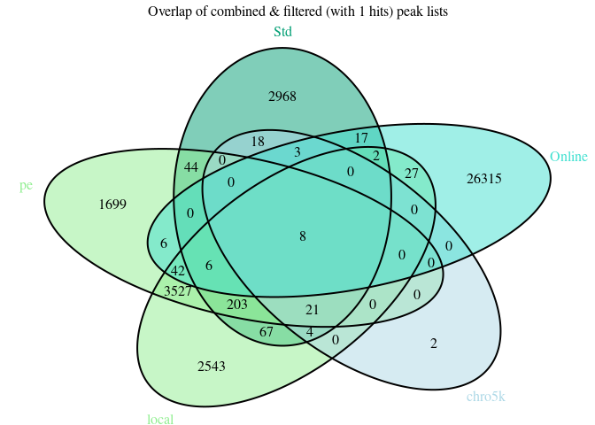

# R Prepare System

## R update and load librarys

BiocManager::install() BiocManager::install(“plyranges”)

``` r
# BiocManager::install(update = TRUE, ask = FALSE)

library(dbplyr)
library(tidyverse)
library(ChIPseeker)
library(rtracklayer)
library(trackViewer)
library(GenomicRanges)
library(IRanges)
library(ChIPpeakAnno)
library(AnnotationHub)
library(ggplot2)
library(viridis)
library(kableExtra)
library(DT)
library(patchwork)
library(gridExtra)
library(foreach)
library(doParallel)
library(tidyGenomeBrowser)
library(Gviz)
library(magrittr)
library(plyranges)

# library()

library(TxDb.Mmusculus.UCSC.mm39.knownGene)
txdb <- TxDb.Mmusculus.UCSC.mm39.knownGene
library(org.Mm.eg.db)
```

## R folders

# Unix Prepare System

## Unix Update System

## Unix Folder & Names

# 3 Results

<a href="../Data/sheme.pdf" height="100%," width="100%">Analysis
Overview</a>

``` r
# write outside r code: {height=100%, width=100%}

# knitr::include_graphics("https://github.com/DNAborn/ChIPseq_Wt1/blob/main/Results/sheme.png")
# knitr::include_graphics("https://github.com/DNAborn/ChIPseq_Wt1/blob/main/Results/sheme.png?raw=true")
knitr::include_graphics("../Data/sheme.png")
```


``` r
# knitr::include_graphics("./sheme.png")
# knitr::include_graphics("./sheme.pdf")
# knitr::include_graphics("../sheme.png")
# knitr::include_graphics("../sheme.pdf")
# knitr::include_graphics("/mnt/s/AG/AG-Scholz-NGS/Daten/Simon/P3026_ChIP-Seq_epiSVF/ChIPseq_Wt1_P3026/Results/sheme.png")
# knitr::include_graphics("/mnt/s/AG/AG-Scholz-NGS/Daten/Simon/P3026_ChIP-Seq_epiSVF/ChIPseq_Wt1_P3026/Results/sheme.pdf")
getwd()
```

    ## [1] "/mnt/s/AG/AG-Scholz-NGS/Daten/Simon/P3026_ChIP-Seq_epiSVF/ChIPseq_Wt1_P3026/Results"

``` r
print("include figure in r chunk")
knitr::include_graphics("../Data/sheme.pdf") # doesn't show
```

### Generate combined peak list

#### Peak Tables

``` r
dim(npeak_numbers_table)
```

    ## [1] 39  5

``` r
knitr::kable(npeak_numbers_table, format = "markdown") %>% 
  kable_styling("striped", full_width = F) %>% 
  scroll_box(height = "400px")
```

<div style="border: 1px solid #ddd; padding: 0px; overflow-y: scroll; height:400px; ">

<table class="table table-striped" style="width: auto !important; margin-left: auto; margin-right: auto;">
<thead>
<tr>
<th style="text-align:left;position: sticky; top:0; background-color: #FFFFFF;">
sample
</th>
<th style="text-align:left;position: sticky; top:0; background-color: #FFFFFF;">
Mapping
</th>
<th style="text-align:right;position: sticky; top:0; background-color: #FFFFFF;">
all_peaks
</th>
<th style="text-align:right;position: sticky; top:0; background-color: #FFFFFF;">
filt_Std_Chrom
</th>
<th style="text-align:right;position: sticky; top:0; background-color: #FFFFFF;">
filt_bl
</th>
</tr>
</thead>
<tbody>
<tr>
<td style="text-align:left;">
Std_1463_1461
</td>
<td style="text-align:left;">
Std
</td>
<td style="text-align:right;">
379
</td>
<td style="text-align:right;">
338
</td>
<td style="text-align:right;">
200
</td>
</tr>
<tr>
<td style="text-align:left;">
Std_1466_1464
</td>
<td style="text-align:left;">
Std
</td>
<td style="text-align:right;">
282
</td>
<td style="text-align:right;">
241
</td>
<td style="text-align:right;">
124
</td>
</tr>
<tr>
<td style="text-align:left;">
Std_1499_1497
</td>
<td style="text-align:left;">
Std
</td>
<td style="text-align:right;">
411
</td>
<td style="text-align:right;">
368
</td>
<td style="text-align:right;">
236
</td>
</tr>
<tr>
<td style="text-align:left;">
Std_1574_1572
</td>
<td style="text-align:left;">
Std
</td>
<td style="text-align:right;">
568
</td>
<td style="text-align:right;">
523
</td>
<td style="text-align:right;">
310
</td>
</tr>
<tr>
<td style="text-align:left;">
Std_1577_1575
</td>
<td style="text-align:left;">
Std
</td>
<td style="text-align:right;">
224
</td>
<td style="text-align:right;">
190
</td>
<td style="text-align:right;">
107
</td>
</tr>
<tr>
<td style="text-align:left;">
Std_1580_1578
</td>
<td style="text-align:left;">
Std
</td>
<td style="text-align:right;">
2063
</td>
<td style="text-align:right;">
1997
</td>
<td style="text-align:right;">
1561
</td>
</tr>
<tr>
<td style="text-align:left;">
Std_1583_1581
</td>
<td style="text-align:left;">
Std
</td>
<td style="text-align:right;">
1131
</td>
<td style="text-align:right;">
1072
</td>
<td style="text-align:right;">
825
</td>
</tr>
<tr>
<td style="text-align:left;">
Std_1586_1584
</td>
<td style="text-align:left;">
Std
</td>
<td style="text-align:right;">
184
</td>
<td style="text-align:right;">
143
</td>
<td style="text-align:right;">
48
</td>
</tr>
<tr>
<td style="text-align:left;">
Std_1589_1587
</td>
<td style="text-align:left;">
Std
</td>
<td style="text-align:right;">
109
</td>
<td style="text-align:right;">
106
</td>
<td style="text-align:right;">
61
</td>
</tr>
<tr>
<td style="text-align:left;">
pe_1463_1461
</td>
<td style="text-align:left;">
pe
</td>
<td style="text-align:right;">
2553
</td>
<td style="text-align:right;">
2531
</td>
<td style="text-align:right;">
1846
</td>
</tr>
<tr>
<td style="text-align:left;">
pe_1466_1464
</td>
<td style="text-align:left;">
pe
</td>
<td style="text-align:right;">
3333
</td>
<td style="text-align:right;">
3295
</td>
<td style="text-align:right;">
2465
</td>
</tr>
<tr>
<td style="text-align:left;">
pe_1499_1497
</td>
<td style="text-align:left;">
pe
</td>
<td style="text-align:right;">
2476
</td>
<td style="text-align:right;">
2453
</td>
<td style="text-align:right;">
1770
</td>
</tr>
<tr>
<td style="text-align:left;">
pe_1574_1572
</td>
<td style="text-align:left;">
pe
</td>
<td style="text-align:right;">
2585
</td>
<td style="text-align:right;">
2555
</td>
<td style="text-align:right;">
1856
</td>
</tr>
<tr>
<td style="text-align:left;">
pe_1577_1575
</td>
<td style="text-align:left;">
pe
</td>
<td style="text-align:right;">
1890
</td>
<td style="text-align:right;">
1865
</td>
<td style="text-align:right;">
1322
</td>
</tr>
<tr>
<td style="text-align:left;">
pe_1580_1578
</td>
<td style="text-align:left;">
pe
</td>
<td style="text-align:right;">
3341
</td>
<td style="text-align:right;">
3304
</td>
<td style="text-align:right;">
2426
</td>
</tr>
<tr>
<td style="text-align:left;">
pe_1583_1581
</td>
<td style="text-align:left;">
pe
</td>
<td style="text-align:right;">
2813
</td>
<td style="text-align:right;">
2783
</td>
<td style="text-align:right;">
2073
</td>
</tr>
<tr>
<td style="text-align:left;">
pe_1586_1584
</td>
<td style="text-align:left;">
pe
</td>
<td style="text-align:right;">
4592
</td>
<td style="text-align:right;">
4544
</td>
<td style="text-align:right;">
3468
</td>
</tr>
<tr>
<td style="text-align:left;">
pe_1589_1587
</td>
<td style="text-align:left;">
pe
</td>
<td style="text-align:right;">
27
</td>
<td style="text-align:right;">
25
</td>
<td style="text-align:right;">
8
</td>
</tr>
<tr>
<td style="text-align:left;">
local_1463_1461
</td>
<td style="text-align:left;">
local
</td>
<td style="text-align:right;">
2666
</td>
<td style="text-align:right;">
2634
</td>
<td style="text-align:right;">
1888
</td>
</tr>
<tr>
<td style="text-align:left;">
local_1466_1464
</td>
<td style="text-align:left;">
local
</td>
<td style="text-align:right;">
3602
</td>
<td style="text-align:right;">
3569
</td>
<td style="text-align:right;">
2679
</td>
</tr>
<tr>
<td style="text-align:left;">
local_1499_1497
</td>
<td style="text-align:left;">
local
</td>
<td style="text-align:right;">
2452
</td>
<td style="text-align:right;">
2430
</td>
<td style="text-align:right;">
1746
</td>
</tr>
<tr>
<td style="text-align:left;">
local_1574_1572
</td>
<td style="text-align:left;">
local
</td>
<td style="text-align:right;">
2678
</td>
<td style="text-align:right;">
2643
</td>
<td style="text-align:right;">
1875
</td>
</tr>
<tr>
<td style="text-align:left;">
local_1577_1575
</td>
<td style="text-align:left;">
local
</td>
<td style="text-align:right;">
1910
</td>
<td style="text-align:right;">
1882
</td>
<td style="text-align:right;">
1318
</td>
</tr>
<tr>
<td style="text-align:left;">
local_1580_1578
</td>
<td style="text-align:left;">
local
</td>
<td style="text-align:right;">
3187
</td>
<td style="text-align:right;">
3154
</td>
<td style="text-align:right;">
2296
</td>
</tr>
<tr>
<td style="text-align:left;">
local_1583_1581
</td>
<td style="text-align:left;">
local
</td>
<td style="text-align:right;">
2657
</td>
<td style="text-align:right;">
2626
</td>
<td style="text-align:right;">
1881
</td>
</tr>
<tr>
<td style="text-align:left;">
local_1586_1584
</td>
<td style="text-align:left;">
local
</td>
<td style="text-align:right;">
5200
</td>
<td style="text-align:right;">
5145
</td>
<td style="text-align:right;">
3916
</td>
</tr>
<tr>
<td style="text-align:left;">
local_1589_1587
</td>
<td style="text-align:left;">
local
</td>
<td style="text-align:right;">
107
</td>
<td style="text-align:right;">
95
</td>
<td style="text-align:right;">
55
</td>
</tr>
<tr>
<td style="text-align:left;">
chro5k_1463_1461
</td>
<td style="text-align:left;">
chro5k
</td>
<td style="text-align:right;">
33
</td>
<td style="text-align:right;">
22
</td>
<td style="text-align:right;">
8
</td>
</tr>
<tr>
<td style="text-align:left;">
chro5k_1466_1464
</td>
<td style="text-align:left;">
chro5k
</td>
<td style="text-align:right;">
21
</td>
<td style="text-align:right;">
13
</td>
<td style="text-align:right;">
2
</td>
</tr>
<tr>
<td style="text-align:left;">
chro5k_1499_1497
</td>
<td style="text-align:left;">
chro5k
</td>
<td style="text-align:right;">
28
</td>
<td style="text-align:right;">
13
</td>
<td style="text-align:right;">
2
</td>
</tr>
<tr>
<td style="text-align:left;">
chro5k_1574_1572
</td>
<td style="text-align:left;">
chro5k
</td>
<td style="text-align:right;">
35
</td>
<td style="text-align:right;">
24
</td>
<td style="text-align:right;">
14
</td>
</tr>
<tr>
<td style="text-align:left;">
chro5k_1577_1575
</td>
<td style="text-align:left;">
chro5k
</td>
<td style="text-align:right;">
38
</td>
<td style="text-align:right;">
25
</td>
<td style="text-align:right;">
15
</td>
</tr>
<tr>
<td style="text-align:left;">
chro5k_1580_1578
</td>
<td style="text-align:left;">
chro5k
</td>
<td style="text-align:right;">
36
</td>
<td style="text-align:right;">
26
</td>
<td style="text-align:right;">
12
</td>
</tr>
<tr>
<td style="text-align:left;">
chro5k_1583_1581
</td>
<td style="text-align:left;">
chro5k
</td>
<td style="text-align:right;">
39
</td>
<td style="text-align:right;">
27
</td>
<td style="text-align:right;">
15
</td>
</tr>
<tr>
<td style="text-align:left;">
chro5k_1586_1584
</td>
<td style="text-align:left;">
chro5k
</td>
<td style="text-align:right;">
39
</td>
<td style="text-align:right;">
25
</td>
<td style="text-align:right;">
10
</td>
</tr>
<tr>
<td style="text-align:left;">
chro5k_1589_1587
</td>
<td style="text-align:left;">
chro5k
</td>
<td style="text-align:right;">
24
</td>
<td style="text-align:right;">
22
</td>
<td style="text-align:right;">
12
</td>
</tr>
<tr>
<td style="text-align:left;">
Online_SRR1703423_SRR1703426
</td>
<td style="text-align:left;">
Online
</td>
<td style="text-align:right;">
12870
</td>
<td style="text-align:right;">
12869
</td>
<td style="text-align:right;">
12693
</td>
</tr>
<tr>
<td style="text-align:left;">
Online_SRR1703424_SRR1703427
</td>
<td style="text-align:left;">
Online
</td>
<td style="text-align:right;">
25304
</td>
<td style="text-align:right;">
25288
</td>
<td style="text-align:right;">
24742
</td>
</tr>
<tr>
<td style="text-align:left;">
Online_SRR1703425_SRR1703428
</td>
<td style="text-align:left;">
Online
</td>
<td style="text-align:right;">
16322
</td>
<td style="text-align:right;">
16309
</td>
<td style="text-align:right;">
15956
</td>
</tr>
</tbody>
</table>

</div>

``` r
# datatable(npeak_numbers_table)

knitr::kable(peaks_overlap)  %>% 
  kable_styling("striped", full_width = F) %>% 
  scroll_box(height = "400px")
```

<div style="border: 1px solid #ddd; padding: 0px; overflow-y: scroll; height:400px; ">

<table class="table table-striped" style="width: auto !important; margin-left: auto; margin-right: auto;">
<thead>
<tr>
<th style="text-align:left;position: sticky; top:0; background-color: #FFFFFF;">
</th>
<th style="text-align:left;position: sticky; top:0; background-color: #FFFFFF;">
Sample
</th>
<th style="text-align:right;position: sticky; top:0; background-color: #FFFFFF;">
Peaks
</th>
<th style="text-align:right;position: sticky; top:0; background-color: #FFFFFF;">
ol.Std
</th>
<th style="text-align:right;position: sticky; top:0; background-color: #FFFFFF;">
ol.pe
</th>
<th style="text-align:right;position: sticky; top:0; background-color: #FFFFFF;">
ol.local
</th>
<th style="text-align:right;position: sticky; top:0; background-color: #FFFFFF;">
ol.chro5k
</th>
<th style="text-align:right;position: sticky; top:0; background-color: #FFFFFF;">
ol.Online
</th>
</tr>
</thead>
<tbody>
<tr>
<td style="text-align:left;">
Std
</td>
<td style="text-align:left;">
Std
</td>
<td style="text-align:right;">
3379
</td>
<td style="text-align:right;">
3385
</td>
<td style="text-align:right;">
298
</td>
<td style="text-align:right;">
326
</td>
<td style="text-align:right;">
55
</td>
<td style="text-align:right;">
36
</td>
</tr>
<tr>
<td style="text-align:left;">
pe
</td>
<td style="text-align:left;">
pe
</td>
<td style="text-align:right;">
5863
</td>
<td style="text-align:right;">
303
</td>
<td style="text-align:right;">
6323
</td>
<td style="text-align:right;">
4787
</td>
<td style="text-align:right;">
29
</td>
<td style="text-align:right;">
97
</td>
</tr>
<tr>
<td style="text-align:left;">
local
</td>
<td style="text-align:left;">
local
</td>
<td style="text-align:right;">
6888
</td>
<td style="text-align:right;">
340
</td>
<td style="text-align:right;">
4891
</td>
<td style="text-align:right;">
7616
</td>
<td style="text-align:right;">
34
</td>
<td style="text-align:right;">
125
</td>
</tr>
<tr>
<td style="text-align:left;">
chro5k
</td>
<td style="text-align:left;">
chro5k
</td>
<td style="text-align:right;">
57
</td>
<td style="text-align:right;">
58
</td>
<td style="text-align:right;">
29
</td>
<td style="text-align:right;">
34
</td>
<td style="text-align:right;">
59
</td>
<td style="text-align:right;">
13
</td>
</tr>
<tr>
<td style="text-align:left;">
Online
</td>
<td style="text-align:left;">
Online
</td>
<td style="text-align:right;">
26460
</td>
<td style="text-align:right;">
47
</td>
<td style="text-align:right;">
110
</td>
<td style="text-align:right;">
136
</td>
<td style="text-align:right;">
14
</td>
<td style="text-align:right;">
33058
</td>
</tr>
</tbody>
</table>

</div>

#### Hists & Tables


#### Venn Overlap Peaks

<!-- --><!-- --><!-- -->
\##### Venn top overlaps

``` r
knitr::kable(venn_top_list[["v1"]][1:20,c("symbol","distanceToTSS","annotation","seqnames","start","end")])  %>%
  kable_styling("striped", full_width = F) %>% 
  scroll_box(height = "400px")
```

<div style="border: 1px solid #ddd; padding: 0px; overflow-y: scroll; height:400px; ">

<table class="table table-striped" style="width: auto !important; margin-left: auto; margin-right: auto;">
<thead>
<tr>
<th style="text-align:left;position: sticky; top:0; background-color: #FFFFFF;">
</th>
<th style="text-align:left;position: sticky; top:0; background-color: #FFFFFF;">
symbol
</th>
<th style="text-align:right;position: sticky; top:0; background-color: #FFFFFF;">
distanceToTSS
</th>
<th style="text-align:left;position: sticky; top:0; background-color: #FFFFFF;">
annotation
</th>
<th style="text-align:left;position: sticky; top:0; background-color: #FFFFFF;">
seqnames
</th>
<th style="text-align:right;position: sticky; top:0; background-color: #FFFFFF;">
start
</th>
<th style="text-align:right;position: sticky; top:0; background-color: #FFFFFF;">
end
</th>
</tr>
</thead>
<tbody>
<tr>
<td style="text-align:left;">
1
</td>
<td style="text-align:left;">
Npr3
</td>
<td style="text-align:right;">
0
</td>
<td style="text-align:left;">
Promoter (\<=1kb)
</td>
<td style="text-align:left;">
chr15
</td>
<td style="text-align:right;">
11905693
</td>
<td style="text-align:right;">
11907099
</td>
</tr>
<tr>
<td style="text-align:left;">
2
</td>
<td style="text-align:left;">
Aqp5
</td>
<td style="text-align:right;">
0
</td>
<td style="text-align:left;">
Promoter (\<=1kb)
</td>
<td style="text-align:left;">
chr15
</td>
<td style="text-align:right;">
99487679
</td>
<td style="text-align:right;">
99488730
</td>
</tr>
<tr>
<td style="text-align:left;">
3
</td>
<td style="text-align:left;">
Wt1
</td>
<td style="text-align:right;">
0
</td>
<td style="text-align:left;">
Promoter (\<=1kb)
</td>
<td style="text-align:left;">
chr2
</td>
<td style="text-align:right;">
104956433
</td>
<td style="text-align:right;">
104958277
</td>
</tr>
<tr>
<td style="text-align:left;">
4
</td>
<td style="text-align:left;">
Pard6b
</td>
<td style="text-align:right;">
-7743
</td>
<td style="text-align:left;">
Distal Intergenic
</td>
<td style="text-align:left;">
chr2
</td>
<td style="text-align:right;">
167914310
</td>
<td style="text-align:right;">
167915181
</td>
</tr>
<tr>
<td style="text-align:left;">
NA
</td>
<td style="text-align:left;">
NA
</td>
<td style="text-align:right;">
NA
</td>
<td style="text-align:left;">
NA
</td>
<td style="text-align:left;">
NA
</td>
<td style="text-align:right;">
NA
</td>
<td style="text-align:right;">
NA
</td>
</tr>
<tr>
<td style="text-align:left;">
NA.1
</td>
<td style="text-align:left;">
NA
</td>
<td style="text-align:right;">
NA
</td>
<td style="text-align:left;">
NA
</td>
<td style="text-align:left;">
NA
</td>
<td style="text-align:right;">
NA
</td>
<td style="text-align:right;">
NA
</td>
</tr>
<tr>
<td style="text-align:left;">
NA.2
</td>
<td style="text-align:left;">
NA
</td>
<td style="text-align:right;">
NA
</td>
<td style="text-align:left;">
NA
</td>
<td style="text-align:left;">
NA
</td>
<td style="text-align:right;">
NA
</td>
<td style="text-align:right;">
NA
</td>
</tr>
<tr>
<td style="text-align:left;">
NA.3
</td>
<td style="text-align:left;">
NA
</td>
<td style="text-align:right;">
NA
</td>
<td style="text-align:left;">
NA
</td>
<td style="text-align:left;">
NA
</td>
<td style="text-align:right;">
NA
</td>
<td style="text-align:right;">
NA
</td>
</tr>
<tr>
<td style="text-align:left;">
NA.4
</td>
<td style="text-align:left;">
NA
</td>
<td style="text-align:right;">
NA
</td>
<td style="text-align:left;">
NA
</td>
<td style="text-align:left;">
NA
</td>
<td style="text-align:right;">
NA
</td>
<td style="text-align:right;">
NA
</td>
</tr>
<tr>
<td style="text-align:left;">
NA.5
</td>
<td style="text-align:left;">
NA
</td>
<td style="text-align:right;">
NA
</td>
<td style="text-align:left;">
NA
</td>
<td style="text-align:left;">
NA
</td>
<td style="text-align:right;">
NA
</td>
<td style="text-align:right;">
NA
</td>
</tr>
<tr>
<td style="text-align:left;">
NA.6
</td>
<td style="text-align:left;">
NA
</td>
<td style="text-align:right;">
NA
</td>
<td style="text-align:left;">
NA
</td>
<td style="text-align:left;">
NA
</td>
<td style="text-align:right;">
NA
</td>
<td style="text-align:right;">
NA
</td>
</tr>
<tr>
<td style="text-align:left;">
NA.7
</td>
<td style="text-align:left;">
NA
</td>
<td style="text-align:right;">
NA
</td>
<td style="text-align:left;">
NA
</td>
<td style="text-align:left;">
NA
</td>
<td style="text-align:right;">
NA
</td>
<td style="text-align:right;">
NA
</td>
</tr>
<tr>
<td style="text-align:left;">
NA.8
</td>
<td style="text-align:left;">
NA
</td>
<td style="text-align:right;">
NA
</td>
<td style="text-align:left;">
NA
</td>
<td style="text-align:left;">
NA
</td>
<td style="text-align:right;">
NA
</td>
<td style="text-align:right;">
NA
</td>
</tr>
<tr>
<td style="text-align:left;">
NA.9
</td>
<td style="text-align:left;">
NA
</td>
<td style="text-align:right;">
NA
</td>
<td style="text-align:left;">
NA
</td>
<td style="text-align:left;">
NA
</td>
<td style="text-align:right;">
NA
</td>
<td style="text-align:right;">
NA
</td>
</tr>
<tr>
<td style="text-align:left;">
NA.10
</td>
<td style="text-align:left;">
NA
</td>
<td style="text-align:right;">
NA
</td>
<td style="text-align:left;">
NA
</td>
<td style="text-align:left;">
NA
</td>
<td style="text-align:right;">
NA
</td>
<td style="text-align:right;">
NA
</td>
</tr>
<tr>
<td style="text-align:left;">
NA.11
</td>
<td style="text-align:left;">
NA
</td>
<td style="text-align:right;">
NA
</td>
<td style="text-align:left;">
NA
</td>
<td style="text-align:left;">
NA
</td>
<td style="text-align:right;">
NA
</td>
<td style="text-align:right;">
NA
</td>
</tr>
<tr>
<td style="text-align:left;">
NA.12
</td>
<td style="text-align:left;">
NA
</td>
<td style="text-align:right;">
NA
</td>
<td style="text-align:left;">
NA
</td>
<td style="text-align:left;">
NA
</td>
<td style="text-align:right;">
NA
</td>
<td style="text-align:right;">
NA
</td>
</tr>
<tr>
<td style="text-align:left;">
NA.13
</td>
<td style="text-align:left;">
NA
</td>
<td style="text-align:right;">
NA
</td>
<td style="text-align:left;">
NA
</td>
<td style="text-align:left;">
NA
</td>
<td style="text-align:right;">
NA
</td>
<td style="text-align:right;">
NA
</td>
</tr>
<tr>
<td style="text-align:left;">
NA.14
</td>
<td style="text-align:left;">
NA
</td>
<td style="text-align:right;">
NA
</td>
<td style="text-align:left;">
NA
</td>
<td style="text-align:left;">
NA
</td>
<td style="text-align:right;">
NA
</td>
<td style="text-align:right;">
NA
</td>
</tr>
<tr>
<td style="text-align:left;">
NA.15
</td>
<td style="text-align:left;">
NA
</td>
<td style="text-align:right;">
NA
</td>
<td style="text-align:left;">
NA
</td>
<td style="text-align:left;">
NA
</td>
<td style="text-align:right;">
NA
</td>
<td style="text-align:right;">
NA
</td>
</tr>
</tbody>
</table>

</div>

``` r
knitr::kable(venn_top_list[["v2"]][1:20,c("symbol","distanceToTSS","annotation","seqnames","start","end")])  %>%
  kable_styling("striped", full_width = F) %>% 
  scroll_box(height = "400px")
```

<div style="border: 1px solid #ddd; padding: 0px; overflow-y: scroll; height:400px; ">

<table class="table table-striped" style="width: auto !important; margin-left: auto; margin-right: auto;">
<thead>
<tr>
<th style="text-align:left;position: sticky; top:0; background-color: #FFFFFF;">
</th>
<th style="text-align:left;position: sticky; top:0; background-color: #FFFFFF;">
symbol
</th>
<th style="text-align:right;position: sticky; top:0; background-color: #FFFFFF;">
distanceToTSS
</th>
<th style="text-align:left;position: sticky; top:0; background-color: #FFFFFF;">
annotation
</th>
<th style="text-align:left;position: sticky; top:0; background-color: #FFFFFF;">
seqnames
</th>
<th style="text-align:right;position: sticky; top:0; background-color: #FFFFFF;">
start
</th>
<th style="text-align:right;position: sticky; top:0; background-color: #FFFFFF;">
end
</th>
</tr>
</thead>
<tbody>
<tr>
<td style="text-align:left;">
1
</td>
<td style="text-align:left;">
Npr3
</td>
<td style="text-align:right;">
0
</td>
<td style="text-align:left;">
Promoter (\<=1kb)
</td>
<td style="text-align:left;">
chr15
</td>
<td style="text-align:right;">
11905693
</td>
<td style="text-align:right;">
11907099
</td>
</tr>
<tr>
<td style="text-align:left;">
2
</td>
<td style="text-align:left;">
Aqp5
</td>
<td style="text-align:right;">
0
</td>
<td style="text-align:left;">
Promoter (\<=1kb)
</td>
<td style="text-align:left;">
chr15
</td>
<td style="text-align:right;">
99487679
</td>
<td style="text-align:right;">
99488730
</td>
</tr>
<tr>
<td style="text-align:left;">
3
</td>
<td style="text-align:left;">
Itga5
</td>
<td style="text-align:right;">
0
</td>
<td style="text-align:left;">
Promoter (\<=1kb)
</td>
<td style="text-align:left;">
chr15
</td>
<td style="text-align:right;">
103274919
</td>
<td style="text-align:right;">
103276382
</td>
</tr>
<tr>
<td style="text-align:left;">
4
</td>
<td style="text-align:left;">
Gm32342
</td>
<td style="text-align:right;">
0
</td>
<td style="text-align:left;">
Promoter (\<=1kb)
</td>
<td style="text-align:left;">
chr19
</td>
<td style="text-align:right;">
37685100
</td>
<td style="text-align:right;">
37686376
</td>
</tr>
<tr>
<td style="text-align:left;">
5
</td>
<td style="text-align:left;">
Wt1
</td>
<td style="text-align:right;">
0
</td>
<td style="text-align:left;">
Promoter (\<=1kb)
</td>
<td style="text-align:left;">
chr2
</td>
<td style="text-align:right;">
104956433
</td>
<td style="text-align:right;">
104958277
</td>
</tr>
<tr>
<td style="text-align:left;">
6
</td>
<td style="text-align:left;">
Pard6b
</td>
<td style="text-align:right;">
-7743
</td>
<td style="text-align:left;">
Distal Intergenic
</td>
<td style="text-align:left;">
chr2
</td>
<td style="text-align:right;">
167914310
</td>
<td style="text-align:right;">
167915181
</td>
</tr>
<tr>
<td style="text-align:left;">
7
</td>
<td style="text-align:left;">
Pgk1
</td>
<td style="text-align:right;">
0
</td>
<td style="text-align:left;">
Promoter (\<=1kb)
</td>
<td style="text-align:left;">
chrX
</td>
<td style="text-align:right;">
105230323
</td>
<td style="text-align:right;">
105230912
</td>
</tr>
<tr>
<td style="text-align:left;">
8
</td>
<td style="text-align:left;">
Gm47283
</td>
<td style="text-align:right;">
-1275
</td>
<td style="text-align:left;">
Promoter (1-2kb)
</td>
<td style="text-align:left;">
chrY
</td>
<td style="text-align:right;">
90774990
</td>
<td style="text-align:right;">
90794732
</td>
</tr>
<tr>
<td style="text-align:left;">
NA
</td>
<td style="text-align:left;">
NA
</td>
<td style="text-align:right;">
NA
</td>
<td style="text-align:left;">
NA
</td>
<td style="text-align:left;">
NA
</td>
<td style="text-align:right;">
NA
</td>
<td style="text-align:right;">
NA
</td>
</tr>
<tr>
<td style="text-align:left;">
NA.1
</td>
<td style="text-align:left;">
NA
</td>
<td style="text-align:right;">
NA
</td>
<td style="text-align:left;">
NA
</td>
<td style="text-align:left;">
NA
</td>
<td style="text-align:right;">
NA
</td>
<td style="text-align:right;">
NA
</td>
</tr>
<tr>
<td style="text-align:left;">
NA.2
</td>
<td style="text-align:left;">
NA
</td>
<td style="text-align:right;">
NA
</td>
<td style="text-align:left;">
NA
</td>
<td style="text-align:left;">
NA
</td>
<td style="text-align:right;">
NA
</td>
<td style="text-align:right;">
NA
</td>
</tr>
<tr>
<td style="text-align:left;">
NA.3
</td>
<td style="text-align:left;">
NA
</td>
<td style="text-align:right;">
NA
</td>
<td style="text-align:left;">
NA
</td>
<td style="text-align:left;">
NA
</td>
<td style="text-align:right;">
NA
</td>
<td style="text-align:right;">
NA
</td>
</tr>
<tr>
<td style="text-align:left;">
NA.4
</td>
<td style="text-align:left;">
NA
</td>
<td style="text-align:right;">
NA
</td>
<td style="text-align:left;">
NA
</td>
<td style="text-align:left;">
NA
</td>
<td style="text-align:right;">
NA
</td>
<td style="text-align:right;">
NA
</td>
</tr>
<tr>
<td style="text-align:left;">
NA.5
</td>
<td style="text-align:left;">
NA
</td>
<td style="text-align:right;">
NA
</td>
<td style="text-align:left;">
NA
</td>
<td style="text-align:left;">
NA
</td>
<td style="text-align:right;">
NA
</td>
<td style="text-align:right;">
NA
</td>
</tr>
<tr>
<td style="text-align:left;">
NA.6
</td>
<td style="text-align:left;">
NA
</td>
<td style="text-align:right;">
NA
</td>
<td style="text-align:left;">
NA
</td>
<td style="text-align:left;">
NA
</td>
<td style="text-align:right;">
NA
</td>
<td style="text-align:right;">
NA
</td>
</tr>
<tr>
<td style="text-align:left;">
NA.7
</td>
<td style="text-align:left;">
NA
</td>
<td style="text-align:right;">
NA
</td>
<td style="text-align:left;">
NA
</td>
<td style="text-align:left;">
NA
</td>
<td style="text-align:right;">
NA
</td>
<td style="text-align:right;">
NA
</td>
</tr>
<tr>
<td style="text-align:left;">
NA.8
</td>
<td style="text-align:left;">
NA
</td>
<td style="text-align:right;">
NA
</td>
<td style="text-align:left;">
NA
</td>
<td style="text-align:left;">
NA
</td>
<td style="text-align:right;">
NA
</td>
<td style="text-align:right;">
NA
</td>
</tr>
<tr>
<td style="text-align:left;">
NA.9
</td>
<td style="text-align:left;">
NA
</td>
<td style="text-align:right;">
NA
</td>
<td style="text-align:left;">
NA
</td>
<td style="text-align:left;">
NA
</td>
<td style="text-align:right;">
NA
</td>
<td style="text-align:right;">
NA
</td>
</tr>
<tr>
<td style="text-align:left;">
NA.10
</td>
<td style="text-align:left;">
NA
</td>
<td style="text-align:right;">
NA
</td>
<td style="text-align:left;">
NA
</td>
<td style="text-align:left;">
NA
</td>
<td style="text-align:right;">
NA
</td>
<td style="text-align:right;">
NA
</td>
</tr>
<tr>
<td style="text-align:left;">
NA.11
</td>
<td style="text-align:left;">
NA
</td>
<td style="text-align:right;">
NA
</td>
<td style="text-align:left;">
NA
</td>
<td style="text-align:left;">
NA
</td>
<td style="text-align:right;">
NA
</td>
<td style="text-align:right;">
NA
</td>
</tr>
</tbody>
</table>

</div>

``` r
knitr::kable(venn_top_list[["v3"]][1:20,c("symbol","distanceToTSS","annotation","seqnames","start","end")])  %>%
  kable_styling("striped", full_width = F) %>% 
  scroll_box(height = "400px")
```

<div style="border: 1px solid #ddd; padding: 0px; overflow-y: scroll; height:400px; ">

<table class="table table-striped" style="width: auto !important; margin-left: auto; margin-right: auto;">
<thead>
<tr>
<th style="text-align:left;position: sticky; top:0; background-color: #FFFFFF;">
</th>
<th style="text-align:left;position: sticky; top:0; background-color: #FFFFFF;">
symbol
</th>
<th style="text-align:right;position: sticky; top:0; background-color: #FFFFFF;">
distanceToTSS
</th>
<th style="text-align:left;position: sticky; top:0; background-color: #FFFFFF;">
annotation
</th>
<th style="text-align:left;position: sticky; top:0; background-color: #FFFFFF;">
seqnames
</th>
<th style="text-align:right;position: sticky; top:0; background-color: #FFFFFF;">
start
</th>
<th style="text-align:right;position: sticky; top:0; background-color: #FFFFFF;">
end
</th>
</tr>
</thead>
<tbody>
<tr>
<td style="text-align:left;">
63
</td>
<td style="text-align:left;">
Gm3287
</td>
<td style="text-align:right;">
0
</td>
<td style="text-align:left;">
Promoter (\<=1kb)
</td>
<td style="text-align:left;">
chr14
</td>
<td style="text-align:right;">
44262627
</td>
<td style="text-align:right;">
44275333
</td>
</tr>
<tr>
<td style="text-align:left;">
71
</td>
<td style="text-align:left;">
Npr3
</td>
<td style="text-align:right;">
0
</td>
<td style="text-align:left;">
Promoter (\<=1kb)
</td>
<td style="text-align:left;">
chr15
</td>
<td style="text-align:right;">
11905693
</td>
<td style="text-align:right;">
11907099
</td>
</tr>
<tr>
<td style="text-align:left;">
78
</td>
<td style="text-align:left;">
Aqp5
</td>
<td style="text-align:right;">
0
</td>
<td style="text-align:left;">
Promoter (\<=1kb)
</td>
<td style="text-align:left;">
chr15
</td>
<td style="text-align:right;">
99487679
</td>
<td style="text-align:right;">
99488730
</td>
</tr>
<tr>
<td style="text-align:left;">
102
</td>
<td style="text-align:left;">
Gm32342
</td>
<td style="text-align:right;">
0
</td>
<td style="text-align:left;">
Promoter (\<=1kb)
</td>
<td style="text-align:left;">
chr19
</td>
<td style="text-align:right;">
37685100
</td>
<td style="text-align:right;">
37686321
</td>
</tr>
<tr>
<td style="text-align:left;">
112
</td>
<td style="text-align:left;">
Wt1
</td>
<td style="text-align:right;">
0
</td>
<td style="text-align:left;">
Promoter (\<=1kb)
</td>
<td style="text-align:left;">
chr2
</td>
<td style="text-align:right;">
104956433
</td>
<td style="text-align:right;">
104958277
</td>
</tr>
<tr>
<td style="text-align:left;">
132
</td>
<td style="text-align:left;">
Abca1
</td>
<td style="text-align:right;">
0
</td>
<td style="text-align:left;">
Promoter (\<=1kb)
</td>
<td style="text-align:left;">
chr4
</td>
<td style="text-align:right;">
53040623
</td>
<td style="text-align:right;">
53040954
</td>
</tr>
<tr>
<td style="text-align:left;">
140
</td>
<td style="text-align:left;">
Prdm16os
</td>
<td style="text-align:right;">
0
</td>
<td style="text-align:left;">
Promoter (\<=1kb)
</td>
<td style="text-align:left;">
chr4
</td>
<td style="text-align:right;">
154721303
</td>
<td style="text-align:right;">
154723256
</td>
</tr>
<tr>
<td style="text-align:left;">
144
</td>
<td style="text-align:left;">
Ppargc1a
</td>
<td style="text-align:right;">
0
</td>
<td style="text-align:left;">
Promoter (\<=1kb)
</td>
<td style="text-align:left;">
chr5
</td>
<td style="text-align:right;">
51711215
</td>
<td style="text-align:right;">
51712511
</td>
</tr>
<tr>
<td style="text-align:left;">
153
</td>
<td style="text-align:left;">
Tmem132c
</td>
<td style="text-align:right;">
0
</td>
<td style="text-align:left;">
Promoter (\<=1kb)
</td>
<td style="text-align:left;">
chr5
</td>
<td style="text-align:right;">
127615167
</td>
<td style="text-align:right;">
127618717
</td>
</tr>
<tr>
<td style="text-align:left;">
158
</td>
<td style="text-align:left;">
Aoc1
</td>
<td style="text-align:right;">
0
</td>
<td style="text-align:left;">
Promoter (\<=1kb)
</td>
<td style="text-align:left;">
chr6
</td>
<td style="text-align:right;">
48871612
</td>
<td style="text-align:right;">
48872300
</td>
</tr>
<tr>
<td style="text-align:left;">
159
</td>
<td style="text-align:left;">
Aoc1
</td>
<td style="text-align:right;">
0
</td>
<td style="text-align:left;">
Promoter (\<=1kb)
</td>
<td style="text-align:left;">
chr6
</td>
<td style="text-align:right;">
48882120
</td>
<td style="text-align:right;">
48886222
</td>
</tr>
<tr>
<td style="text-align:left;">
178
</td>
<td style="text-align:left;">
Gm26488
</td>
<td style="text-align:right;">
0
</td>
<td style="text-align:left;">
Promoter (\<=1kb)
</td>
<td style="text-align:left;">
chr7
</td>
<td style="text-align:right;">
59003580
</td>
<td style="text-align:right;">
59007265
</td>
</tr>
<tr>
<td style="text-align:left;">
180
</td>
<td style="text-align:left;">
Gm25523
</td>
<td style="text-align:right;">
0
</td>
<td style="text-align:left;">
Promoter (\<=1kb)
</td>
<td style="text-align:left;">
chr7
</td>
<td style="text-align:right;">
59157557
</td>
<td style="text-align:right;">
59266781
</td>
</tr>
<tr>
<td style="text-align:left;">
181
</td>
<td style="text-align:left;">
Mir344e
</td>
<td style="text-align:right;">
0
</td>
<td style="text-align:left;">
Promoter (\<=1kb)
</td>
<td style="text-align:left;">
chr7
</td>
<td style="text-align:right;">
61384870
</td>
<td style="text-align:right;">
61385363
</td>
</tr>
<tr>
<td style="text-align:left;">
216
</td>
<td style="text-align:left;">
4921528I07Rik
</td>
<td style="text-align:right;">
0
</td>
<td style="text-align:left;">
Promoter (\<=1kb)
</td>
<td style="text-align:left;">
chr9
</td>
<td style="text-align:right;">
114111724
</td>
<td style="text-align:right;">
114114119
</td>
</tr>
<tr>
<td style="text-align:left;">
225
</td>
<td style="text-align:left;">
Pgk1
</td>
<td style="text-align:right;">
0
</td>
<td style="text-align:left;">
Promoter (\<=1kb)
</td>
<td style="text-align:left;">
chrX
</td>
<td style="text-align:right;">
105230323
</td>
<td style="text-align:right;">
105230912
</td>
</tr>
<tr>
<td style="text-align:left;">
238
</td>
<td style="text-align:left;">
Gm47283
</td>
<td style="text-align:right;">
0
</td>
<td style="text-align:left;">
Promoter (\<=1kb)
</td>
<td style="text-align:left;">
chrY
</td>
<td style="text-align:right;">
90798083
</td>
<td style="text-align:right;">
90802799
</td>
</tr>
<tr>
<td style="text-align:left;">
79
</td>
<td style="text-align:left;">
Itga5
</td>
<td style="text-align:right;">
-33
</td>
<td style="text-align:left;">
Promoter (\<=1kb)
</td>
<td style="text-align:left;">
chr15
</td>
<td style="text-align:right;">
103275223
</td>
<td style="text-align:right;">
103276382
</td>
</tr>
<tr>
<td style="text-align:left;">
77
</td>
<td style="text-align:left;">
Aqp2
</td>
<td style="text-align:right;">
91
</td>
<td style="text-align:left;">
Promoter (\<=1kb)
</td>
<td style="text-align:left;">
chr15
</td>
<td style="text-align:right;">
99477027
</td>
<td style="text-align:right;">
99481929
</td>
</tr>
<tr>
<td style="text-align:left;">
165
</td>
<td style="text-align:left;">
Bhlhe40
</td>
<td style="text-align:right;">
-147
</td>
<td style="text-align:left;">
Promoter (\<=1kb)
</td>
<td style="text-align:left;">
chr6
</td>
<td style="text-align:right;">
108636938
</td>
<td style="text-align:right;">
108637443
</td>
</tr>
</tbody>
</table>

</div>

## Annotate Peaks

#### 1 Run

``` r
# Add Gene names
ah = AnnotationHub()
query(ah, c("EnsDb", "Musculus"))
```

    ## AnnotationHub with 81 records
    ## # snapshotDate(): 2023-10-23
    ## # $dataprovider: Ensembl
    ## # $species: Mus musculus, Balaenoptera musculus, Mus musculus musculus, Mus ...
    ## # $rdataclass: EnsDb
    ## # additional mcols(): taxonomyid, genome, description,
    ## #   coordinate_1_based, maintainer, rdatadateadded, preparerclass, tags,
    ## #   rdatapath, sourceurl, sourcetype 
    ## # retrieve records with, e.g., 'object[["AH53222"]]' 
    ## 
    ##              title                                        
    ##   AH53222  | Ensembl 87 EnsDb for Mus Musculus            
    ##   AH53726  | Ensembl 88 EnsDb for Mus Musculus            
    ##   AH56691  | Ensembl 89 EnsDb for Mus Musculus            
    ##   AH57770  | Ensembl 90 EnsDb for Mus Musculus            
    ##   AH60788  | Ensembl 91 EnsDb for Mus Musculus            
    ##   ...        ...                                          
    ##   AH116336 | Ensembl 111 EnsDb for Mus musculus           
    ##   AH116337 | Ensembl 111 EnsDb for Mus musculus           
    ##   AH116338 | Ensembl 111 EnsDb for Mus musculus musculus  
    ##   AH116339 | Ensembl 111 EnsDb for Mus musculus domesticus
    ##   AH116340 | Ensembl 111 EnsDb for Mus musculus

``` r
edb <- ah[["AH113713"]]

# 1 Subfolder

figures_annotated_peaks <- list()

i <- "pe"
all_npeaksAnno <- annotatePeak(npeak_combined_all[[i]], TxDb=txdb,tssRegion=c(-3000, 3000), verbose=FALSE)
  all_npeaksAnno_table <- as.data.frame(all_npeaksAnno)
  all_npeaksAnno_table$transcriptId2 <- sub("\\.\\d+$", "", all_npeaksAnno_table$transcriptId)
  all_npeaksAnno_table$geneId <- mapIds(edb, keys = all_npeaksAnno_table$transcriptId2, column = "GENEID", keytype = "TXID")
  all_npeaksAnno_table$symbol <- mapIds(edb, keys = all_npeaksAnno_table$transcriptId2, column = "SYMBOL", keytype = "TXID")
n <- names(npeak_combined_all[i])
all_npeaksAnno_table$annotation_short <-  str_split(all_npeaksAnno_table$annotation,pattern = " ", simplify = TRUE)[,1]

# Annotated table
top_hits <- all_npeaksAnno_table[order(all_npeaksAnno_table$signalValue, decreasing=T),]
colnames(top_hits)
```

    ##  [1] "seqnames"         "start"            "end"              "width"           
    ##  [5] "strand"           "name"             "score"            "signalValue"     
    ##  [9] "pValue"           "qValue"           "peak"             "id"              
    ## [13] "name_list"        "max.center"       "max.start"        "max.end"         
    ## [17] "max.width"        "hits"             "annotation"       "geneChr"         
    ## [21] "geneStart"        "geneEnd"          "geneLength"       "geneStrand"      
    ## [25] "geneId"           "transcriptId"     "distanceToTSS"    "transcriptId2"   
    ## [29] "symbol"           "annotation_short"

``` r
kable(top_hits[1:15,c("symbol","distanceToTSS","annotation_short","score","signalValue","hits","seqnames","start","end","width","annotation","geneId")])  %>%
 kable_styling("striped", full_width = F) %>% 
 scroll_box(height = "400px")
```

<div style="border: 1px solid #ddd; padding: 0px; overflow-y: scroll; height:400px; ">

<table class="table table-striped" style="width: auto !important; margin-left: auto; margin-right: auto;">
<thead>
<tr>
<th style="text-align:left;position: sticky; top:0; background-color: #FFFFFF;">
</th>
<th style="text-align:left;position: sticky; top:0; background-color: #FFFFFF;">
symbol
</th>
<th style="text-align:right;position: sticky; top:0; background-color: #FFFFFF;">
distanceToTSS
</th>
<th style="text-align:left;position: sticky; top:0; background-color: #FFFFFF;">
annotation_short
</th>
<th style="text-align:right;position: sticky; top:0; background-color: #FFFFFF;">
score
</th>
<th style="text-align:right;position: sticky; top:0; background-color: #FFFFFF;">
signalValue
</th>
<th style="text-align:right;position: sticky; top:0; background-color: #FFFFFF;">
hits
</th>
<th style="text-align:left;position: sticky; top:0; background-color: #FFFFFF;">
seqnames
</th>
<th style="text-align:right;position: sticky; top:0; background-color: #FFFFFF;">
start
</th>
<th style="text-align:right;position: sticky; top:0; background-color: #FFFFFF;">
end
</th>
<th style="text-align:right;position: sticky; top:0; background-color: #FFFFFF;">
width
</th>
<th style="text-align:left;position: sticky; top:0; background-color: #FFFFFF;">
annotation
</th>
<th style="text-align:left;position: sticky; top:0; background-color: #FFFFFF;">
geneId
</th>
</tr>
</thead>
<tbody>
<tr>
<td style="text-align:left;">
2061
</td>
<td style="text-align:left;">
4930517M08Rik
</td>
<td style="text-align:right;">
-8373
</td>
<td style="text-align:left;">
Distal
</td>
<td style="text-align:right;">
35985
</td>
<td style="text-align:right;">
315.2330
</td>
<td style="text-align:right;">
7
</td>
<td style="text-align:left;">
chr17
</td>
<td style="text-align:right;">
4676434
</td>
<td style="text-align:right;">
4676880
</td>
<td style="text-align:right;">
447
</td>
<td style="text-align:left;">
Distal Intergenic
</td>
<td style="text-align:left;">
ENSMUSG00000116767
</td>
</tr>
<tr>
<td style="text-align:left;">
4038
</td>
<td style="text-align:left;">
Aoc1
</td>
<td style="text-align:right;">
0
</td>
<td style="text-align:left;">
Promoter
</td>
<td style="text-align:right;">
8634
</td>
<td style="text-align:right;">
136.0690
</td>
<td style="text-align:right;">
6
</td>
<td style="text-align:left;">
chr6
</td>
<td style="text-align:right;">
48882120
</td>
<td style="text-align:right;">
48886141
</td>
<td style="text-align:right;">
4022
</td>
<td style="text-align:left;">
Promoter (\<=1kb)
</td>
<td style="text-align:left;">
ENSMUSG00000029811
</td>
</tr>
<tr>
<td style="text-align:left;">
2506
</td>
<td style="text-align:left;">
Gm32342
</td>
<td style="text-align:right;">
0
</td>
<td style="text-align:left;">
Promoter
</td>
<td style="text-align:right;">
3201
</td>
<td style="text-align:right;">
49.4350
</td>
<td style="text-align:right;">
4
</td>
<td style="text-align:left;">
chr19
</td>
<td style="text-align:right;">
37685100
</td>
<td style="text-align:right;">
37686273
</td>
<td style="text-align:right;">
1174
</td>
<td style="text-align:left;">
Promoter (\<=1kb)
</td>
<td style="text-align:left;">
ENSMUSG00000120139
</td>
</tr>
<tr>
<td style="text-align:left;">
5486
</td>
<td style="text-align:left;">
Pgk1
</td>
<td style="text-align:right;">
0
</td>
<td style="text-align:left;">
Promoter
</td>
<td style="text-align:right;">
2703
</td>
<td style="text-align:right;">
37.5665
</td>
<td style="text-align:right;">
1
</td>
<td style="text-align:left;">
chrX
</td>
<td style="text-align:right;">
105230323
</td>
<td style="text-align:right;">
105230844
</td>
<td style="text-align:right;">
522
</td>
<td style="text-align:left;">
Promoter (\<=1kb)
</td>
<td style="text-align:left;">
ENSMUSG00000062070
</td>
</tr>
<tr>
<td style="text-align:left;">
761
</td>
<td style="text-align:left;">
Camk2b
</td>
<td style="text-align:right;">
-5786
</td>
<td style="text-align:left;">
Intron
</td>
<td style="text-align:right;">
2341
</td>
<td style="text-align:right;">
36.4437
</td>
<td style="text-align:right;">
1
</td>
<td style="text-align:left;">
chr11
</td>
<td style="text-align:right;">
5956234
</td>
<td style="text-align:right;">
5956613
</td>
<td style="text-align:right;">
380
</td>
<td style="text-align:left;">
Intron (ENSMUST00000109813.9/12323, intron 3 of 20)
</td>
<td style="text-align:left;">
ENSMUSG00000057897
</td>
</tr>
<tr>
<td style="text-align:left;">
4234
</td>
<td style="text-align:left;">
Gm5154
</td>
<td style="text-align:right;">
-21622
</td>
<td style="text-align:left;">
Distal
</td>
<td style="text-align:right;">
1271
</td>
<td style="text-align:right;">
28.6134
</td>
<td style="text-align:right;">
1
</td>
<td style="text-align:left;">
chr6
</td>
<td style="text-align:right;">
132440307
</td>
<td style="text-align:right;">
132440774
</td>
<td style="text-align:right;">
468
</td>
<td style="text-align:left;">
Distal Intergenic
</td>
<td style="text-align:left;">
ENSMUSG00000108041
</td>
</tr>
<tr>
<td style="text-align:left;">
4037
</td>
<td style="text-align:left;">
Aoc1
</td>
<td style="text-align:right;">
0
</td>
<td style="text-align:left;">
Promoter
</td>
<td style="text-align:right;">
705
</td>
<td style="text-align:right;">
17.6038
</td>
<td style="text-align:right;">
1
</td>
<td style="text-align:left;">
chr6
</td>
<td style="text-align:right;">
48871614
</td>
<td style="text-align:right;">
48872189
</td>
<td style="text-align:right;">
576
</td>
<td style="text-align:left;">
Promoter (\<=1kb)
</td>
<td style="text-align:left;">
ENSMUSG00000029811
</td>
</tr>
<tr>
<td style="text-align:left;">
5216
</td>
<td style="text-align:left;">
Fundc1
</td>
<td style="text-align:right;">
67140
</td>
<td style="text-align:left;">
Distal
</td>
<td style="text-align:right;">
1301
</td>
<td style="text-align:right;">
17.5793
</td>
<td style="text-align:right;">
8
</td>
<td style="text-align:left;">
chrX
</td>
<td style="text-align:right;">
17362468
</td>
<td style="text-align:right;">
17370723
</td>
<td style="text-align:right;">
8256
</td>
<td style="text-align:left;">
Distal Intergenic
</td>
<td style="text-align:left;">
ENSMUSG00000025040
</td>
</tr>
<tr>
<td style="text-align:left;">
2708
</td>
<td style="text-align:left;">
Wt1
</td>
<td style="text-align:right;">
0
</td>
<td style="text-align:left;">
Promoter
</td>
<td style="text-align:right;">
843
</td>
<td style="text-align:right;">
17.2436
</td>
<td style="text-align:right;">
6
</td>
<td style="text-align:left;">
chr2
</td>
<td style="text-align:right;">
104956433
</td>
<td style="text-align:right;">
104958215
</td>
<td style="text-align:right;">
1783
</td>
<td style="text-align:left;">
Promoter (\<=1kb)
</td>
<td style="text-align:left;">
ENSMUSG00000016458
</td>
</tr>
<tr>
<td style="text-align:left;">
3068
</td>
<td style="text-align:left;">
Ugt8a
</td>
<td style="text-align:right;">
-189206
</td>
<td style="text-align:left;">
Distal
</td>
<td style="text-align:right;">
1352
</td>
<td style="text-align:right;">
17.0189
</td>
<td style="text-align:right;">
8
</td>
<td style="text-align:left;">
chr3
</td>
<td style="text-align:right;">
125921474
</td>
<td style="text-align:right;">
125929133
</td>
<td style="text-align:right;">
7660
</td>
<td style="text-align:left;">
Distal Intergenic
</td>
<td style="text-align:left;">
ENSMUSG00000032854
</td>
</tr>
<tr>
<td style="text-align:left;">
5281
</td>
<td style="text-align:left;">
Gm14696
</td>
<td style="text-align:right;">
-7023
</td>
<td style="text-align:left;">
Intron
</td>
<td style="text-align:right;">
1234
</td>
<td style="text-align:right;">
14.9230
</td>
<td style="text-align:right;">
8
</td>
<td style="text-align:left;">
chrX
</td>
<td style="text-align:right;">
48441137
</td>
<td style="text-align:right;">
48449540
</td>
<td style="text-align:right;">
8404
</td>
<td style="text-align:left;">
Intron (ENSMUST00000147144.2/102638827, intron 1 of 3)
</td>
<td style="text-align:left;">
ENSMUSG00000087369
</td>
</tr>
<tr>
<td style="text-align:left;">
1363
</td>
<td style="text-align:left;">
Gm34585
</td>
<td style="text-align:right;">
-616942
</td>
<td style="text-align:left;">
Distal
</td>
<td style="text-align:right;">
1006
</td>
<td style="text-align:right;">
14.5826
</td>
<td style="text-align:right;">
8
</td>
<td style="text-align:left;">
chr13
</td>
<td style="text-align:right;">
88045393
</td>
<td style="text-align:right;">
88052367
</td>
<td style="text-align:right;">
6975
</td>
<td style="text-align:left;">
Distal Intergenic
</td>
<td style="text-align:left;">
ENSMUSG00000114273
</td>
</tr>
<tr>
<td style="text-align:left;">
1646
</td>
<td style="text-align:left;">
Gm26367
</td>
<td style="text-align:right;">
-29392
</td>
<td style="text-align:left;">
Distal
</td>
<td style="text-align:right;">
1088
</td>
<td style="text-align:right;">
14.5554
</td>
<td style="text-align:right;">
8
</td>
<td style="text-align:left;">
chr14
</td>
<td style="text-align:right;">
100619090
</td>
<td style="text-align:right;">
100626527
</td>
<td style="text-align:right;">
7438
</td>
<td style="text-align:left;">
Distal Intergenic
</td>
<td style="text-align:left;">
ENSMUSG00000119005
</td>
</tr>
<tr>
<td style="text-align:left;">
2783
</td>
<td style="text-align:left;">
Xrn2
</td>
<td style="text-align:right;">
-7996
</td>
<td style="text-align:left;">
Distal
</td>
<td style="text-align:right;">
1028
</td>
<td style="text-align:right;">
14.3899
</td>
<td style="text-align:right;">
8
</td>
<td style="text-align:left;">
chr2
</td>
<td style="text-align:right;">
146838103
</td>
<td style="text-align:right;">
146846920
</td>
<td style="text-align:right;">
8818
</td>
<td style="text-align:left;">
Distal Intergenic
</td>
<td style="text-align:left;">
ENSMUSG00000027433
</td>
</tr>
<tr>
<td style="text-align:left;">
2709
</td>
<td style="text-align:left;">
Wt1
</td>
<td style="text-align:right;">
1932
</td>
<td style="text-align:left;">
Promoter
</td>
<td style="text-align:right;">
416
</td>
<td style="text-align:right;">
13.4797
</td>
<td style="text-align:right;">
1
</td>
<td style="text-align:left;">
chr2
</td>
<td style="text-align:right;">
104963160
</td>
<td style="text-align:right;">
104964205
</td>
<td style="text-align:right;">
1046
</td>
<td style="text-align:left;">
Promoter (1-2kb)
</td>
<td style="text-align:left;">
ENSMUSG00000016458
</td>
</tr>
</tbody>
</table>

</div>

``` r
hits_lim <- max(all_npeaksAnno_table$hits)
score_lim <- quantile(all_npeaksAnno_table$score, .99)
signalValue_lim <- quantile(all_npeaksAnno_table$signalValue, .99)
qValue_lim <- quantile(all_npeaksAnno_table$qValue, .90)

g1 <- ggplot(all_npeaksAnno_table,aes(x=distanceToTSS, y=score, color=hits)) +
  geom_point(size=1, alpha=0.5, position = "jitter") +
  scale_color_viridis_c() +
  coord_cartesian(ylim=c(0,score_lim)) +
  ggtitle(paste("scores to distance"))

g2 <- ggplot(all_npeaksAnno_table,aes(x=distanceToTSS, y=signalValue, color=hits)) +
  geom_point(size=1, alpha=0.5, position = "jitter") +
  scale_color_viridis_c() +
  coord_cartesian(ylim=c(1,signalValue_lim)) +
  ggtitle(paste("signalValue to distance"))

g3 <- ggplot(all_npeaksAnno_table,aes(x=distanceToTSS)) +
      stat_bin(alpha=0.6, position = 'identity', binwidth=1000, fill=viridis(10)[3]) +
      coord_cartesian(xlim = c(-50000,+50000))
g4 <- ggplot(all_npeaksAnno_table,aes(x=distanceToTSS)) +
      stat_bin(alpha=0.6, position = 'identity', binwidth=100, fill=viridis(10)[5]) +
      coord_cartesian(xlim = c(-5000,+5000)) 

# ( (g1+g2) / 
#   (g1 + coord_cartesian(xlim=c(-500000,+500000),ylim=c(0,score_lim)) + 
#     g2 + coord_cartesian(xlim=c(-500000,+500000),ylim=c(1,signalValue_lim))) /
#   (g1 + coord_cartesian(xlim=c(-50000,+50000),ylim=c(0,score_lim)) + 
#     g2 + coord_cartesian(xlim=c(-50000,+50000),ylim=c(1,signalValue_lim))) /
#   (g3 + g4)
#   ) + plot_layout(guides = "collect", axis_titles="collect")

 (g1 + 
     (g1 + coord_cartesian(xlim=c(-500000,+500000),ylim=c(0,score_lim)))) /
  ((g1 + coord_cartesian(xlim=c(-50000,+50000),ylim=c(0,score_lim))) + 
         (g1 + coord_cartesian(xlim=c(-5000,+5000),ylim=c(0,score_lim)))) /
  (g3 + g4) + plot_layout(guides = "collect", axis_titles="collect")
```


#### All runs

``` r
i <- 2
top_hits_list <- list()
for (i in 1:length(npeak_combined_all)){
all_npeaksAnno <- annotatePeak(npeak_combined_all[[i]], TxDb=txdb,tssRegion=c(-3000, 3000), verbose=TRUE)
  all_npeaksAnno_table <- as.data.frame(all_npeaksAnno)
  all_npeaksAnno_table$transcriptId2 <- sub("\\.\\d+$", "", all_npeaksAnno_table$transcriptId)
  all_npeaksAnno_table$geneId <- mapIds(edb, keys = all_npeaksAnno_table$transcriptId2, column = "GENEID", keytype = "TXID")
  all_npeaksAnno_table$symbol <- mapIds(edb, keys = all_npeaksAnno_table$transcriptId2, column = "SYMBOL", keytype = "TXID")
  all_npeaksAnno_table$hits <- as.factor(all_npeaksAnno_table$hits)

n <- names(npeak_combined_all[i])
all_npeaksAnno_table$annotation_short <-  str_split(all_npeaksAnno_table$annotation,pattern = " ", simplify = TRUE)[,1]

hits_lim <- max(levels(all_npeaksAnno_table$hits))
score_lim <- quantile(all_npeaksAnno_table$score, .99)
peak_lim <- quantile(all_npeaksAnno_table$peak, .99)
signalValue_lim <- quantile(all_npeaksAnno_table$signalValue, .99)
qValue_lim <- quantile(all_npeaksAnno_table$qValue, .99)
distanceToTSS_max <- quantile(all_npeaksAnno_table$distanceToTSS, .90)
distanceToTSS_min <- quantile(all_npeaksAnno_table$distanceToTSS, .1)
width_lim <- quantile(all_npeaksAnno_table$width, .99)
signalValue_min <- min(all_npeaksAnno_table$signalValue)

df <- all_npeaksAnno_table

g1a <- ggplot(df,aes(x=distanceToTSS, y=signalValue, color=hits)) +
  geom_point(size=1.5, position ='jitter', alpha=0.4) +
  scale_color_viridis_d(option ="viridis") +
  coord_cartesian(xlim=c(distanceToTSS_min,distanceToTSS_max), ylim = c(signalValue_min,signalValue_lim)) +
  ggtitle(paste("A: signalValue to distance"))

g1b <- ggplot(df,aes(x=distanceToTSS, group=hits, fill=hits)) +
      stat_bin(alpha=0.5, position = 'identity', binwidth=c(10000/100)) + 
      # stat_bin(position = 'identity', binwidth=100, geom="text", aes(label=after_stat(count)), vjust=-0.5, colour="blue") +
      scale_fill_viridis_d() +
      ggtitle(paste("B: hits per distance (",n,")",sep="")) + coord_cartesian(xlim = c(-5000, 5000))

g2a <- ggplot(df,aes(x=width, y=signalValue, color=hits)) +
  geom_point(size=1.5, position ='jitter', alpha=0.4) +
  scale_color_viridis_d(option ="viridis") +
  coord_cartesian(xlim=c(180,width_lim), ylim = c(signalValue_min,signalValue_lim)) +
  ggtitle(paste("C: signalValue per peak width (hits)"))

g2b <- ggplot(df,aes(x=width, y=signalValue, color=annotation_short)) +
  geom_point(size=1.5, position ='jitter', alpha=0.4) +
  scale_color_viridis_d(option ="turbo") +
  coord_cartesian(xlim=c(180,width_lim), ylim = c(signalValue_min,signalValue_lim)) +
  ggtitle(paste("D: signalValue per peak width (region)"))

g2c <- ggplot(df,aes(x=width, y=signalValue, color=distanceToTSS)) +
  geom_point(size=1.5, position ='jitter', alpha=0.4) +
  scale_color_viridis_c(option ="turbo", limits = c(distanceToTSS_min*0.2, distanceToTSS_max*0.2)) +
  coord_cartesian(xlim=c(0,width_lim), ylim = c(signalValue_min,signalValue_lim)) +
  ggtitle(paste("E: signalValue per peak width (region)"))


figures_annotated_peaks[[n]] <- g1a+g1b+g2a+g2b+
                                  plot_layout(ncol = 2) + 
                                  plot_annotation(title = paste("Method:",n))

# axis_titles = "collect",guides = "collect"

top_hits <- subset(all_npeaksAnno_table, distanceToTSS > -2000 & distanceToTSS < 2000) 
dim(top_hits)
top_hits <- top_hits[order(top_hits$score, decreasing=T),]
top_hits_list[[n]] <- top_hits

header = 7 
names(header) = paste("Method: ",n)

print("kable normal")
knitr::kable(top_hits[c(0:20),c("symbol","distanceToTSS","hits","score","signalValue","qValue")],format = "markdown")  %>% kable_styling("striped", full_width = F) %>% 
 add_header_above( header = header) %>%
  scroll_box(height = "400px")
print("kable simple")
test <- top_hits[1:3,1:3]
knitr::kable(test)

print("kable simple print")
print(knitr::kable(test))

# cat("\n")
 
plot(figures_annotated_peaks[[n]])

}
```

    ## >> preparing features information...      2024-02-17 10:26:30 
    ## >> identifying nearest features...        2024-02-17 10:26:30 
    ## >> calculating distance from peak to TSS...   2024-02-17 10:26:30 
    ## >> assigning genomic annotation...        2024-02-17 10:26:30 
    ## >> assigning chromosome lengths           2024-02-17 10:26:33 
    ## >> done...                    2024-02-17 10:26:33 
    ## [1] "kable normal"
    ## [1] "kable simple"
    ## [1] "kable simple print"
    ## 
    ## 
    ## |     |seqnames |     start|       end|
    ## |:----|:--------|---------:|---------:|
    ## |2547 |chr6     |  48885161|  48886142|
    ## |3324 |chrX     | 105230324| 105230844|
    ## |1507 |chr19    |  37685100|  37686273|


    ## >> preparing features information...      2024-02-17 10:26:35 
    ## >> identifying nearest features...        2024-02-17 10:26:35 
    ## >> calculating distance from peak to TSS...   2024-02-17 10:26:35 
    ## >> assigning genomic annotation...        2024-02-17 10:26:35 
    ## >> assigning chromosome lengths           2024-02-17 10:26:37 
    ## >> done...                    2024-02-17 10:26:37 
    ## [1] "kable normal"
    ## [1] "kable simple"
    ## [1] "kable simple print"
    ## 
    ## 
    ## |     |seqnames |     start|       end|
    ## |:----|:--------|---------:|---------:|
    ## |4038 |chr6     |  48882120|  48886141|
    ## |2506 |chr19    |  37685100|  37686273|
    ## |5486 |chrX     | 105230323| 105230844|


    ## >> preparing features information...      2024-02-17 10:26:40 
    ## >> identifying nearest features...        2024-02-17 10:26:40 
    ## >> calculating distance from peak to TSS...   2024-02-17 10:26:41 
    ## >> assigning genomic annotation...        2024-02-17 10:26:41 
    ## >> assigning chromosome lengths           2024-02-17 10:26:42 
    ## >> done...                    2024-02-17 10:26:42 
    ## [1] "kable normal"
    ## [1] "kable simple"
    ## [1] "kable simple print"
    ## 
    ## 
    ## |     |seqnames |    start|      end|
    ## |:----|:--------|--------:|--------:|
    ## |4758 |chr6     | 48882126| 48886222|
    ## |1220 |chr12    | 69206069| 69206469|
    ## |1795 |chr14    | 70887965| 70891315|


    ## >> preparing features information...      2024-02-17 10:26:46 
    ## >> identifying nearest features...        2024-02-17 10:26:46 
    ## >> calculating distance from peak to TSS...   2024-02-17 10:26:46 
    ## >> assigning genomic annotation...        2024-02-17 10:26:46 
    ## >> assigning chromosome lengths           2024-02-17 10:26:47 
    ## >> done...                    2024-02-17 10:26:47 
    ## [1] "kable normal"
    ## [1] "kable simple"
    ## [1] "kable simple print"
    ## 
    ## 
    ## |   |seqnames |     start|       end|
    ## |:--|:--------|---------:|---------:|
    ## |53 |chr6     |  48882115|  48886136|
    ## |38 |chrX     | 105230324| 105230844|
    ## |17 |chr19    |  37685100|  37686274|


    ## >> preparing features information...      2024-02-17 10:26:48 
    ## >> identifying nearest features...        2024-02-17 10:26:48 
    ## >> calculating distance from peak to TSS...   2024-02-17 10:26:49 
    ## >> assigning genomic annotation...        2024-02-17 10:26:49 
    ## >> assigning chromosome lengths           2024-02-17 10:26:51 
    ## >> done...                    2024-02-17 10:26:51 
    ## [1] "kable normal"
    ## [1] "kable simple"
    ## [1] "kable simple print"
    ## 
    ## 
    ## |      |seqnames |     start|       end|
    ## |:-----|:--------|---------:|---------:|
    ## |25738 |chr9     | 108925573| 108926508|
    ## |2916  |chr10    | 127502110| 127503094|
    ## |25570 |chr9     | 102594634| 102595068|


``` r
# top_hits_list
# figures_annotated_peaks


knitr::kable(top_hits_list[[1]][c(0:20),c("symbol","distanceToTSS","hits","score","signalValue","qValue")],format = "markdown")  %>% kable_styling("striped", full_width = F) %>% 
 add_header_above( header = header) %>%
  scroll_box(height = "400px")
```

<div style="border: 1px solid #ddd; padding: 0px; overflow-y: scroll; height:400px; ">

<table class="table table-striped" style="width: auto !important; margin-left: auto; margin-right: auto;">
<thead>
<tr>
<th style="border-bottom:hidden;padding-bottom:0; padding-left:3px;padding-right:3px;text-align: center; position: sticky; top:0; background-color: #FFFFFF;" colspan="7">

<div style="border-bottom: 1px solid #ddd; padding-bottom: 5px; ">

Method: Online

</div>

</th>
</tr>
<tr>
<th style="text-align:left;position: sticky; top:0; background-color: #FFFFFF;">
</th>
<th style="text-align:left;position: sticky; top:0; background-color: #FFFFFF;">
symbol
</th>
<th style="text-align:right;position: sticky; top:0; background-color: #FFFFFF;">
distanceToTSS
</th>
<th style="text-align:left;position: sticky; top:0; background-color: #FFFFFF;">
hits
</th>
<th style="text-align:right;position: sticky; top:0; background-color: #FFFFFF;">
score
</th>
<th style="text-align:right;position: sticky; top:0; background-color: #FFFFFF;">
signalValue
</th>
<th style="text-align:right;position: sticky; top:0; background-color: #FFFFFF;">
qValue
</th>
</tr>
</thead>
<tbody>
<tr>
<td style="text-align:left;">
2547
</td>
<td style="text-align:left;">
Aoc1
</td>
<td style="text-align:right;">
872
</td>
<td style="text-align:left;">
6
</td>
<td style="text-align:right;">
9404
</td>
<td style="text-align:right;">
177.44000
</td>
<td style="text-align:right;">
940.48600
</td>
</tr>
<tr>
<td style="text-align:left;">
3324
</td>
<td style="text-align:left;">
Pgk1
</td>
<td style="text-align:right;">
0
</td>
<td style="text-align:left;">
2
</td>
<td style="text-align:right;">
3268
</td>
<td style="text-align:right;">
60.69470
</td>
<td style="text-align:right;">
326.84900
</td>
</tr>
<tr>
<td style="text-align:left;">
1507
</td>
<td style="text-align:left;">
Gm32342
</td>
<td style="text-align:right;">
0
</td>
<td style="text-align:left;">
5
</td>
<td style="text-align:right;">
3238
</td>
<td style="text-align:right;">
62.51200
</td>
<td style="text-align:right;">
323.87100
</td>
</tr>
<tr>
<td style="text-align:left;">
2544
</td>
<td style="text-align:left;">
Aoc1
</td>
<td style="text-align:right;">
200
</td>
<td style="text-align:left;">
6
</td>
<td style="text-align:right;">
1266
</td>
<td style="text-align:right;">
36.85590
</td>
<td style="text-align:right;">
126.68500
</td>
</tr>
<tr>
<td style="text-align:left;">
1660
</td>
<td style="text-align:left;">
Wt1
</td>
<td style="text-align:right;">
0
</td>
<td style="text-align:left;">
6
</td>
<td style="text-align:right;">
970
</td>
<td style="text-align:right;">
23.40940
</td>
<td style="text-align:right;">
97.01340
</td>
</tr>
<tr>
<td style="text-align:left;">
1661
</td>
<td style="text-align:left;">
Wt1
</td>
<td style="text-align:right;">
1932
</td>
<td style="text-align:left;">
1
</td>
<td style="text-align:right;">
913
</td>
<td style="text-align:right;">
40.09450
</td>
<td style="text-align:right;">
91.36210
</td>
</tr>
<tr>
<td style="text-align:left;">
2543
</td>
<td style="text-align:left;">
Aoc1
</td>
<td style="text-align:right;">
-6
</td>
<td style="text-align:left;">
1
</td>
<td style="text-align:right;">
803
</td>
<td style="text-align:right;">
23.40860
</td>
<td style="text-align:right;">
80.33710
</td>
</tr>
<tr>
<td style="text-align:left;">
2210
</td>
<td style="text-align:left;">
Prdm16os
</td>
<td style="text-align:right;">
0
</td>
<td style="text-align:left;">
2
</td>
<td style="text-align:right;">
570
</td>
<td style="text-align:right;">
17.83880
</td>
<td style="text-align:right;">
57.09940
</td>
</tr>
<tr>
<td style="text-align:left;">
1026
</td>
<td style="text-align:left;">
Npr3
</td>
<td style="text-align:right;">
0
</td>
<td style="text-align:left;">
5
</td>
<td style="text-align:right;">
438
</td>
<td style="text-align:right;">
15.93290
</td>
<td style="text-align:right;">
43.88880
</td>
</tr>
<tr>
<td style="text-align:left;">
1119
</td>
<td style="text-align:left;">
Aqp5
</td>
<td style="text-align:right;">
-39
</td>
<td style="text-align:left;">
4
</td>
<td style="text-align:right;">
269
</td>
<td style="text-align:right;">
11.79040
</td>
<td style="text-align:right;">
26.92200
</td>
</tr>
<tr>
<td style="text-align:left;">
2546
</td>
<td style="text-align:left;">
Aoc1
</td>
<td style="text-align:right;">
258
</td>
<td style="text-align:left;">
4
</td>
<td style="text-align:right;">
227
</td>
<td style="text-align:right;">
11.21200
</td>
<td style="text-align:right;">
22.76380
</td>
</tr>
<tr>
<td style="text-align:left;">
1118
</td>
<td style="text-align:left;">
Aqp2
</td>
<td style="text-align:right;">
91
</td>
<td style="text-align:left;">
2
</td>
<td style="text-align:right;">
219
</td>
<td style="text-align:right;">
12.23900
</td>
<td style="text-align:right;">
21.90920
</td>
</tr>
<tr>
<td style="text-align:left;">
252
</td>
<td style="text-align:left;">
Pbx1
</td>
<td style="text-align:right;">
0
</td>
<td style="text-align:left;">
1
</td>
<td style="text-align:right;">
109
</td>
<td style="text-align:right;">
7.32916
</td>
<td style="text-align:right;">
10.92410
</td>
</tr>
<tr>
<td style="text-align:left;">
2277
</td>
<td style="text-align:left;">
Ppargc1a
</td>
<td style="text-align:right;">
0
</td>
<td style="text-align:left;">
4
</td>
<td style="text-align:right;">
104
</td>
<td style="text-align:right;">
6.81414
</td>
<td style="text-align:right;">
10.42860
</td>
</tr>
<tr>
<td style="text-align:left;">
2545
</td>
<td style="text-align:left;">
Aoc1
</td>
<td style="text-align:right;">
-14
</td>
<td style="text-align:left;">
2
</td>
<td style="text-align:right;">
82
</td>
<td style="text-align:right;">
6.30733
</td>
<td style="text-align:right;">
8.23839
</td>
</tr>
<tr>
<td style="text-align:left;">
2124
</td>
<td style="text-align:left;">
Gm12610
</td>
<td style="text-align:right;">
0
</td>
<td style="text-align:left;">
1
</td>
<td style="text-align:right;">
76
</td>
<td style="text-align:right;">
6.00147
</td>
<td style="text-align:right;">
7.64712
</td>
</tr>
<tr>
<td style="text-align:left;">
2315
</td>
<td style="text-align:left;">
Kit
</td>
<td style="text-align:right;">
-112
</td>
<td style="text-align:left;">
2
</td>
<td style="text-align:right;">
70
</td>
<td style="text-align:right;">
7.40557
</td>
<td style="text-align:right;">
7.01991
</td>
</tr>
<tr>
<td style="text-align:left;">
1124
</td>
<td style="text-align:left;">
Itga5
</td>
<td style="text-align:right;">
-56
</td>
<td style="text-align:left;">
1
</td>
<td style="text-align:right;">
51
</td>
<td style="text-align:right;">
5.25024
</td>
<td style="text-align:right;">
5.15759
</td>
</tr>
<tr>
<td style="text-align:left;">
2448
</td>
<td style="text-align:left;">
Eif3b
</td>
<td style="text-align:right;">
-505
</td>
<td style="text-align:left;">
1
</td>
<td style="text-align:right;">
42
</td>
<td style="text-align:right;">
6.05199
</td>
<td style="text-align:right;">
4.28883
</td>
</tr>
<tr>
<td style="text-align:left;">
2604
</td>
<td style="text-align:left;">
1700009C05Rik
</td>
<td style="text-align:right;">
-1752
</td>
<td style="text-align:left;">
1
</td>
<td style="text-align:right;">
39
</td>
<td style="text-align:right;">
4.90555
</td>
<td style="text-align:right;">
3.90468
</td>
</tr>
</tbody>
</table>

</div>

#### All runs old2

#### All runs (generate lists)

#### Venns

# Visualize Peaks

### prepare bams

### prepare bigwigs

``` r
# bigwigs
bigwigdir <- paste(ddir,"deeptools/bigwig",sep="/")
sbwdirs <- list.dirs(bigwigdir)[-1]
bigwigs <- {}
bwfiles_list <- list()
for (d in sbwdirs) {
  n <- basename(d)
  bwfiles <- list.files(d,pattern=".bw$")
  bwfiles <- paste(d,bwfiles,sep="/")
  bigwigs <- c(bigwigs,bwfiles)
  bwfiles_list[[n]] <- bwfiles
}
bwfiles_list
bigwigs
```

## prepare txdb data

``` r
# browseIntervals(npeak_combined_all[["Std"]][1:5])

# 
txdb <- TxDb.Mmusculus.UCSC.mm39.knownGene
gene_models <- genes(txdb)
colnames(edb)
keytypes(edb)
gene_models$ensembl <- mapIds(edb, keys = gene_models$gene_id, column = "GENEID", keytype = "ENTREZID")
gene_models$symbol <- mapIds(edb, keys = gene_models$gene_id, column = "SYMBOL", keytype = "ENTREZID")
AOC1 <- gene_models["76507"]
# Plotting window: 500 bp around AKAP2
gene_window <- AOC1 + 500
# Window around promoter for second examples
promoter_window <- promoters(AOC1, upstream=500, downstream=500)
tx_models <- exonsBy(txdb, by="tx", use.names=TRUE)
meta_models <- exonsBy(txdb, by="gene")
```

## trackViewer

#### example

``` r
## trackViewer example
extdata <- system.file("extdata", package="trackViewer",
                       mustWork=TRUE)
gr <- GRanges("chr11", IRanges(122929275, 122930122), strand="-")
fox2 <- importScore(file.path(extdata, "fox2.bed"), format="BED",
                    ranges=gr)
fox2$dat <- coverageGR(fox2$dat)

viewTracks(trackList(fox2), gr=gr, autoOptimizeStyle=TRUE, newpage=TRUE)

dt <- DataTrack(range=fox2$dat[strand(fox2$dat)=="-"] , 
                genome="hg19", type="hist", name="fox2", 
                window=-1, chromosome="chr11", 
                fill.histogram="black", col.histogram="NA",
                background.title="white",
                col.frame="white", col.axis="black",
                col="black", col.title="black")
plotTracks(dt, from=122929275, to=122930122, strand="-")


# Maunals
## tidyGenomeBrowser
## https://github.com/MalteThodberg/tidyGenomeBrowser/blob/master/README.Rmd

## trackViewer
## https://bioconductor.org/packages/release/bioc/vignettes/trackViewer/inst/doc/trackViewer.html

## Generate bigwig
## https://hbctraining.github.io/Intro-to-ChIPseq-flipped/lessons/08_creating_bigwig_files.html

## Normalize bigwig
## https://www.biostars.org/p/394434/
```

#### own data

``` r
# # Step 1. Import data
# ## example
# repA <- importScore(file.path(extdata, "cpsf160.repA_-.wig"),
#                     file.path(extdata, "cpsf160.repA_+.wig"),
#                     format="WIG")
# ## Because the wig file does not contain any strand info, 
# ## we need to set it manually.
# strand(repA$dat) <- "-"
# strand(repA$dat2) <- "+"
# 
# # Step 2. Build the gene model
# library(TxDb.Hsapiens.UCSC.hg19.knownGene)
# library(org.Hs.eg.db)
# gr <- GRanges("chr11", IRanges(122929275, 122930122), strand="-")
# trs <- geneModelFromTxdb(TxDb.Hsapiens.UCSC.hg19.knownGene,
#                          org.Hs.eg.db,
#                          gr=gr)
# # Step 3. View the tracks
# viewerStyle <- trackViewerStyle()
# setTrackViewerStyleParam(viewerStyle, "margin", c(.1, .05, .02, .02))
# trackList <- trackList(trs)
# trackList <- trackList(repA, trs)
# vp <- viewTracks(trackList, 
#                  gr=gr, viewerStyle=viewerStyle, 
#                  autoOptimizeStyle=TRUE)

# own data
# get Peak info

top_hits_genes <- subset(top_hits_list[["pe"]], distanceToTSS > -2000 & distanceToTSS < 2000, hits > 1) 

peak <- top_hits_genes[2,]
gr <- GRanges(peak[,1:3])+1000
gr$peak <- peak$start+peak$peak
trs <- geneModelFromTxdb(txdb,
                         org.Mm.eg.db,
                         gr=gr)

bw_pe_1580 <- importScore(bigwigs[1],
                          ranges = gr,
                    format="BigWig")

bw_pe_1580_1578 <- importScore(bigwigs[3],
                          ranges = gr,
                    format="BigWig")

bw_pe_1580_2 <- importScore(bigwigs[2],
                          ranges = gr,
                    format="BigWig")

bw_pe_1580_1578_4 <- importScore(bigwigs[4],
                          ranges = gr,
                    format="BigWig")


bam_track_list <- list()
for (i in bams[25:42]){
  bam_track <- importBam(i,
                          ranges = gr)
  bam_track_list[[i]] <- bam_track
}
# bam_track_list

# Step 3. View the tracks
viewerStyle <- trackViewerStyle()
setTrackViewerStyleParam(viewerStyle, "margin", c(.1, .05, .02, .02))
trackList <- trackList(trs)
trackList <- trackList(bam_track_list,trs)
vp <- viewTracks(trackList, 
                 gr=gr, viewerStyle=viewerStyle, 
                 autoOptimizeStyle=TRUE)
addGuideLine(gr$peak, vp=vp, col="red")
```

<!-- -->

### plot all peaks
