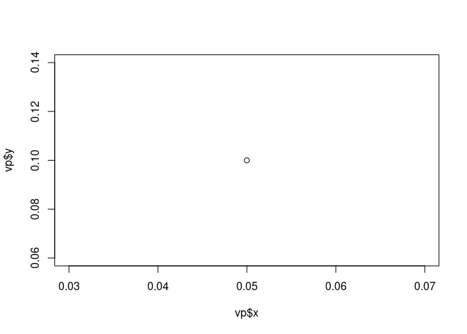

# Prepare System

## R update and load librarys

``` r
BiocManager::install(update = TRUE, ask = FALSE)

library(dbplyr)
library(tidyverse)
library(ChIPseeker)
library(rtracklayer)
library(trackViewer)
library(GenomicRanges)
library(IRanges)
library(ChIPpeakAnno)
library(AnnotationHub)
library(ggplot2)
library(viridis)

library(TxDb.Mmusculus.UCSC.mm39.knownGene)
txdb <- TxDb.Mmusculus.UCSC.mm39.knownGene

# library("ggVennDiagram")
# library("ggvenn")
# 

# library(ChIPQC)
# library(BiocParallel)
# library(readxl)
# library(writexl)
# library(xlsx)
# library(beepr)

# library(TxDb.Hsapiens.UCSC.hg19.knownGene)
# library(TxDb.Hsapiens.UCSC.hg38.knownGene)
# library(TxDb.Mmusculus.UCSC.mm10.knownGene)
# library(TxDb.Mmusculus.UCSC.mm39.knownGene)
# # txdb <- TxDb.Hsapiens.UCSC.hg19.knownGene
# # txdb <- TxDb.Mmusculus.UCSC.mm10.knownGene
# txdb <- TxDb.Mmusculus.UCSC.mm39.knownGene
# library(clusterProfiler)
# library(UpSetR)
# library(ggimage)
# library(ReactomePA)
# library(ggcorrplot)
# library(gplots)
# library(pheatmap)
# library(EnsDb.Mmusculus.v79)
# library(Rsamtools)
# library(VennDiagram)
# library(biomaRt)
# library(biobtreeR)
# library(memes)
# library(magrittr)
# 

# library(Motif2Site)
# library(updater)
# 
# library(BiocManager)
# library(ChIPQC)
# library(rtracklayer)

# library(trackViewer)
# library(Gviz)

# library(GenomicFeatures)
# library(UpSetR)
# library(grid)
# library(plyr)
# library(tidyGenomeBrowser)
# library(rentrez)
# library("GenomicFeatures")
# library("Gviz")
# library(GenomicRanges)
# library()
```

## R folders

``` r
if(Sys.info()[["sysname"]]== "Linux") {
  s <- "/mnt/s"} else(
  s <- "S:")

ddir <- paste(s,"AG/AG-Scholz-NGS/Daten/Simon/P3026_ChIP-Seq_epiSVF",sep="/")
gitdir <- paste(ddir,"ChIPseq_Wt1_P3026", sep="/")
resdir <- paste(gitdir,"Results", sep="/")
pubfigdir <- paste(resdir,"pub_figures",sep="/")

wdir <- "E:/Simon/P3026_ChIP_Seq_epiSVF"

setwd(gitdir)
getwd()
```

    ## [1] "/mnt/s/AG/AG-Scholz-NGS/Daten/Simon/P3026_ChIP-Seq_epiSVF/ChIPseq_Wt1_P3026"

## linux

``` bash
##  linux ####
sudo apt update
sudo apt upgrade
conda update conda
conda update --all
sudo mount -t drvfs S: /mnt/s
```

# 0 Prerequisits

## Folder & Names

``` bash
source activate chipseq

run="Kelly";

dirdata="/mnt/s/AG/AG-Scholz-NGS/Daten/ChIP_epiSVF_P3026";
dir="/mnt/e/Simon/P3026_ChIP_Seq_epiSVF"; 
dirs="/mnt/s/AG/AG-Scholz-NGS/Daten/Simon/P3026_ChIP-Seq_epiSVF"; 

index_GRCh38="/mnt/s/AG/AG-Scholz-NGS/Daten/Simon/Genomic_data/Human/GRCh38_noalt_decoy_as/GRCh38_noalt_decoy_as";
index_GRCm39="/mnt/s/AG/AG-Scholz-NGS/Daten/Simon/Genomic_data/Mus/GRCm39/GRCm39";
index_mm10="/mnt/s/AG/AG-Scholz-NGS/Daten/Simon/Genomic_data/Mus/mm10/mm10";
index_mm39="/mnt/s/AG/AG-Scholz-NGS/Daten/Simon/Genomic_data/Mus/GRCm39/USCS/mm39";
index_cm_mm39="/mnt/s/AG/AG-Scholz-NGS/Daten/Simon/Genomic_data/Mus/GRCm39/USCS/mm39.index";

fastqdir="$dirdata/fastq";

ardir="$dirdata/Adapterremoval";
  test -d $ardir && echo "# Folder $ardir exists" ||
  (mkdir $ardir && echo "# Folder $ardir created");
  
fastqcdir="$dirdata/fastqc/";
  test -d $fastqcdir && echo "# Folder $fastqcdir exists" ||
  (mkdir $fastqcdir && echo "# Folder $fastqcdir created");
  
multiqcdir="$dirdata/multiqc/";
  test -d $multiqcdir && echo "# Folder $multiqcdir exists" ||
  (mkdir $multiqcdir && echo "# Folder $multiqcdir created");
  
bdir="$dir/Bowtie2";
  test -d $bdir && echo "# Folder $bdir exists" ||
  (mkdir $bdir && echo "# Folder $bdir created");
  
mdir="$dirs/MACS3";
  test -d $mdir && echo "# Folder $mdir exists" ||
  (mkdir $mdir && echo "# Folder $mdir created");

rgtmdir="$dir/RGT-Motif";
  test -d $rgtmdir && echo "# Folder $rgtmdir exists" ||
  (mkdir $rgtmdir && echo "# Folder $rgtmdir created");

dtoolsdir="$dir/deeptools";
  test -d $dtoolsdir && echo "# Folder $dtoolsdir exists" ||
  (mkdir $dtoolsdir && echo "# Folder $dtoolsdir created");

chromapdir="$dir/chromap";
  test -d $chromapdir && echo "# Folder $chromapdir exists" ||
  (mkdir $chromapdir && echo "# Folder $chromapdir created");

blacklhs="/mnt/e/Simon/ChIPSeq_Kelly/Bowtie2/hg38-blacklist.v2.bed"
blacklmm39="/mnt/s/AG/AG-Scholz-NGS/Daten/Simon/Genomic_data/Mus/GRCm39/mm39.excluderanges.bed.gz"
blacklmm10="/mnt/s/AG/AG-Scholz-NGS/Daten/Simon/Genomic_data/Mus/mm10/mm10.blacklist.bed.gz"
```

    ## # Folder /mnt/s/AG/AG-Scholz-NGS/Daten/ChIP_epiSVF_P3026/Adapterremoval exists
    ## # Folder /mnt/s/AG/AG-Scholz-NGS/Daten/ChIP_epiSVF_P3026/fastqc/ exists
    ## # Folder /mnt/s/AG/AG-Scholz-NGS/Daten/ChIP_epiSVF_P3026/multiqc/ exists
    ## mkdir: cannot create directory ‘/mnt/e/Simon/P3026_ChIP_Seq_epiSVF/Bowtie2’: No such file or directory
    ## # Folder /mnt/s/AG/AG-Scholz-NGS/Daten/Simon/P3026_ChIP-Seq_epiSVF/MACS3 exists
    ## mkdir: cannot create directory ‘/mnt/e/Simon/P3026_ChIP_Seq_epiSVF/RGT-Motif’: No such file or directory
    ## mkdir: cannot create directory ‘/mnt/e/Simon/P3026_ChIP_Seq_epiSVF/deeptools’: No such file or directory
    ## mkdir: cannot create directory ‘/mnt/e/Simon/P3026_ChIP_Seq_epiSVF/chromap’: No such file or directory

# 3 Results

### Generate combined peak list

``` r
csdir <- paste(ddir,"ChIPSeeker",sep="/")

# Peak Calling files
macsdir <- paste(ddir,"MACS3",sep="/")
macssubdir <- list.dirs(macsdir)
macssubdir <- macssubdir[c(6,5,3,2,4)]

# blacklist
blacklmm39 <- paste(s,"AG/AG-Scholz-NGS/Daten/Simon/Genomic_data/Mus/GRCm39/mm39.excluderanges.bed.gz",sep="/")
bl <- readPeakFile(blacklmm39)

extraCols_narrowPeak <- c(signalValue = "numeric", pValue = "numeric",
                          qValue = "numeric", peak = "integer")

# Read peak files from all subfolders
npeak_list_all <- list()
npeak_combined_all <- list()

# loop through subfolders
for (beddir in macssubdir){
  print(beddir)
  run <- basename(beddir)
  print(run)

beds <- list.files(beddir, pattern=".narrowPeak")
beds <- file.path(beddir,beds)
name <- paste(run,"_",sep="")

npeak_numbers <- {}
npeak_list <- list()

# inside loop thourgh each replicate
for (i in beds) {
  print(i)
# npeak <- readPeakFile(i)
npeak <- import(i, format = "BED",extraCols = extraCols_narrowPeak)
n <- basename(i) %>% str_remove(pattern="_all_peaks.narrowPeak")
print(paste("Run: ",run,", Sample: ",n," Peaks: ",length(npeak), sep=""))
npeak_numbers <- rbind(npeak_numbers,data.frame(sample = paste(n,sep="_"), peaks = length(npeak)))
assign(paste(run,"npeaks",sep="_"),npeak_numbers)

print(length(npeak))
npeak <- keepStandardChromosomes(npeak, pruning.mode="coarse")
print(length(npeak))
filtered <- GenomicRanges::setdiff(npeak, bl)
revmap <- findOverlaps(filtered, npeak, select="arbitrary")
mcols(filtered) <- mcols(npeak)[revmap, , drop=FALSE]
print(length(filtered))
npeak_list[[n]] <- filtered
npeak_list_all[[n]] <- filtered
}

# combine replicates
assign(paste(run,"npeak_list",sep="_"),npeak_list)
npeak_list <- GRangesList(npeak_list)
ul <- unlist(npeak_list)
ul <- sort(ul,by=~qValue, decreasing = T)
length(ul)
npeak_combined <- GenomicRanges::reduce(ul)
length(ul)
length(npeak_combined)
revmap <- findOverlaps(npeak_combined, ul, select="first")
mcols(npeak_combined) <- mcols(ul)[revmap, , drop=FALSE]
length(npeak_combined)

# count overlap between peaks
npeak_combined$hits <- rep(0,length(npeak_combined))
for (i in 1:length(npeak_list)){
print(i)
npeak_combined$hits <- npeak_combined$hits+countOverlaps(npeak_combined,npeak_list[i])
}
hist(npeak_combined$hits, breaks=10, main=run)
npeak_combined <- npeak_combined[elementMetadata(npeak_combined)$hits > 1,]
length(npeak_combined)
assign(paste(run,"npeak_combined",sep="_"),npeak_combined)

npeak_combined_all[[run]] <- npeak_combined

}
```

    ## [1] "/mnt/s/AG/AG-Scholz-NGS/Daten/Simon/P3026_ChIP-Seq_epiSVF/MACS3/Std"
    ## [1] "Std"
    ## [1] "/mnt/s/AG/AG-Scholz-NGS/Daten/Simon/P3026_ChIP-Seq_epiSVF/MACS3/Std/Std_1463_1461_all_peaks.narrowPeak"
    ## [1] "Run: Std, Sample: Std_1463_1461 Peaks: 379"
    ## [1] 379
    ## [1] 338
    ## [1] 200
    ## [1] "/mnt/s/AG/AG-Scholz-NGS/Daten/Simon/P3026_ChIP-Seq_epiSVF/MACS3/Std/Std_1466_1464_all_peaks.narrowPeak"
    ## [1] "Run: Std, Sample: Std_1466_1464 Peaks: 282"
    ## [1] 282
    ## [1] 241
    ## [1] 124
    ## [1] "/mnt/s/AG/AG-Scholz-NGS/Daten/Simon/P3026_ChIP-Seq_epiSVF/MACS3/Std/Std_1499_1497_all_peaks.narrowPeak"
    ## [1] "Run: Std, Sample: Std_1499_1497 Peaks: 411"
    ## [1] 411
    ## [1] 368
    ## [1] 236
    ## [1] "/mnt/s/AG/AG-Scholz-NGS/Daten/Simon/P3026_ChIP-Seq_epiSVF/MACS3/Std/Std_1574_1572_all_peaks.narrowPeak"
    ## [1] "Run: Std, Sample: Std_1574_1572 Peaks: 568"
    ## [1] 568
    ## [1] 523
    ## [1] 310
    ## [1] "/mnt/s/AG/AG-Scholz-NGS/Daten/Simon/P3026_ChIP-Seq_epiSVF/MACS3/Std/Std_1577_1575_all_peaks.narrowPeak"
    ## [1] "Run: Std, Sample: Std_1577_1575 Peaks: 224"
    ## [1] 224
    ## [1] 190
    ## [1] 107
    ## [1] "/mnt/s/AG/AG-Scholz-NGS/Daten/Simon/P3026_ChIP-Seq_epiSVF/MACS3/Std/Std_1580_1578_all_peaks.narrowPeak"
    ## [1] "Run: Std, Sample: Std_1580_1578 Peaks: 2063"
    ## [1] 2063
    ## [1] 1997
    ## [1] 1562
    ## [1] "/mnt/s/AG/AG-Scholz-NGS/Daten/Simon/P3026_ChIP-Seq_epiSVF/MACS3/Std/Std_1583_1581_all_peaks.narrowPeak"
    ## [1] "Run: Std, Sample: Std_1583_1581 Peaks: 1131"
    ## [1] 1131
    ## [1] 1072
    ## [1] 826
    ## [1] "/mnt/s/AG/AG-Scholz-NGS/Daten/Simon/P3026_ChIP-Seq_epiSVF/MACS3/Std/Std_1586_1584_all_peaks.narrowPeak"
    ## [1] "Run: Std, Sample: Std_1586_1584 Peaks: 184"
    ## [1] 184
    ## [1] 143
    ## [1] 48
    ## [1] "/mnt/s/AG/AG-Scholz-NGS/Daten/Simon/P3026_ChIP-Seq_epiSVF/MACS3/Std/Std_1589_1587_all_peaks.narrowPeak"
    ## [1] "Run: Std, Sample: Std_1589_1587 Peaks: 109"
    ## [1] 109
    ## [1] 106
    ## [1] 61
    ## [1] 1
    ## [1] 2
    ## [1] 3
    ## [1] 4
    ## [1] 5
    ## [1] 6
    ## [1] 7
    ## [1] 8
    ## [1] 9

<!-- -->

    ## [1] "/mnt/s/AG/AG-Scholz-NGS/Daten/Simon/P3026_ChIP-Seq_epiSVF/MACS3/pe"
    ## [1] "pe"
    ## [1] "/mnt/s/AG/AG-Scholz-NGS/Daten/Simon/P3026_ChIP-Seq_epiSVF/MACS3/pe/pe_1463_1461_all_peaks.narrowPeak"
    ## [1] "Run: pe, Sample: pe_1463_1461 Peaks: 2553"
    ## [1] 2553
    ## [1] 2531
    ## [1] 1861
    ## [1] "/mnt/s/AG/AG-Scholz-NGS/Daten/Simon/P3026_ChIP-Seq_epiSVF/MACS3/pe/pe_1466_1464_all_peaks.narrowPeak"
    ## [1] "Run: pe, Sample: pe_1466_1464 Peaks: 3333"
    ## [1] 3333
    ## [1] 3295
    ## [1] 2491
    ## [1] "/mnt/s/AG/AG-Scholz-NGS/Daten/Simon/P3026_ChIP-Seq_epiSVF/MACS3/pe/pe_1499_1497_all_peaks.narrowPeak"
    ## [1] "Run: pe, Sample: pe_1499_1497 Peaks: 2476"
    ## [1] 2476
    ## [1] 2453
    ## [1] 1787
    ## [1] "/mnt/s/AG/AG-Scholz-NGS/Daten/Simon/P3026_ChIP-Seq_epiSVF/MACS3/pe/pe_1574_1572_all_peaks.narrowPeak"
    ## [1] "Run: pe, Sample: pe_1574_1572 Peaks: 2585"
    ## [1] 2585
    ## [1] 2555
    ## [1] 1874
    ## [1] "/mnt/s/AG/AG-Scholz-NGS/Daten/Simon/P3026_ChIP-Seq_epiSVF/MACS3/pe/pe_1577_1575_all_peaks.narrowPeak"
    ## [1] "Run: pe, Sample: pe_1577_1575 Peaks: 1890"
    ## [1] 1890
    ## [1] 1865
    ## [1] 1333
    ## [1] "/mnt/s/AG/AG-Scholz-NGS/Daten/Simon/P3026_ChIP-Seq_epiSVF/MACS3/pe/pe_1580_1578_all_peaks.narrowPeak"
    ## [1] "Run: pe, Sample: pe_1580_1578 Peaks: 3341"
    ## [1] 3341
    ## [1] 3304
    ## [1] 2450
    ## [1] "/mnt/s/AG/AG-Scholz-NGS/Daten/Simon/P3026_ChIP-Seq_epiSVF/MACS3/pe/pe_1583_1581_all_peaks.narrowPeak"
    ## [1] "Run: pe, Sample: pe_1583_1581 Peaks: 2813"
    ## [1] 2813
    ## [1] 2783
    ## [1] 2091
    ## [1] "/mnt/s/AG/AG-Scholz-NGS/Daten/Simon/P3026_ChIP-Seq_epiSVF/MACS3/pe/pe_1586_1584_all_peaks.narrowPeak"
    ## [1] "Run: pe, Sample: pe_1586_1584 Peaks: 4592"
    ## [1] 4592
    ## [1] 4544
    ## [1] 3522
    ## [1] "/mnt/s/AG/AG-Scholz-NGS/Daten/Simon/P3026_ChIP-Seq_epiSVF/MACS3/pe/pe_1589_1587_all_peaks.narrowPeak"
    ## [1] "Run: pe, Sample: pe_1589_1587 Peaks: 27"
    ## [1] 27
    ## [1] 25
    ## [1] 8
    ## [1] 1
    ## [1] 2
    ## [1] 3
    ## [1] 4
    ## [1] 5
    ## [1] 6
    ## [1] 7
    ## [1] 8
    ## [1] 9

<!-- -->

    ## [1] "/mnt/s/AG/AG-Scholz-NGS/Daten/Simon/P3026_ChIP-Seq_epiSVF/MACS3/local"
    ## [1] "local"
    ## [1] "/mnt/s/AG/AG-Scholz-NGS/Daten/Simon/P3026_ChIP-Seq_epiSVF/MACS3/local/local_1463_1461_all_peaks.narrowPeak"
    ## [1] "Run: local, Sample: local_1463_1461 Peaks: 2666"
    ## [1] 2666
    ## [1] 2634
    ## [1] 1916
    ## [1] "/mnt/s/AG/AG-Scholz-NGS/Daten/Simon/P3026_ChIP-Seq_epiSVF/MACS3/local/local_1466_1464_all_peaks.narrowPeak"
    ## [1] "Run: local, Sample: local_1466_1464 Peaks: 3602"
    ## [1] 3602
    ## [1] 3569
    ## [1] 2717
    ## [1] "/mnt/s/AG/AG-Scholz-NGS/Daten/Simon/P3026_ChIP-Seq_epiSVF/MACS3/local/local_1499_1497_all_peaks.narrowPeak"
    ## [1] "Run: local, Sample: local_1499_1497 Peaks: 2452"
    ## [1] 2452
    ## [1] 2430
    ## [1] 1769
    ## [1] "/mnt/s/AG/AG-Scholz-NGS/Daten/Simon/P3026_ChIP-Seq_epiSVF/MACS3/local/local_1574_1572_all_peaks.narrowPeak"
    ## [1] "Run: local, Sample: local_1574_1572 Peaks: 2678"
    ## [1] 2678
    ## [1] 2643
    ## [1] 1893
    ## [1] "/mnt/s/AG/AG-Scholz-NGS/Daten/Simon/P3026_ChIP-Seq_epiSVF/MACS3/local/local_1577_1575_all_peaks.narrowPeak"
    ## [1] "Run: local, Sample: local_1577_1575 Peaks: 1910"
    ## [1] 1910
    ## [1] 1882
    ## [1] 1334
    ## [1] "/mnt/s/AG/AG-Scholz-NGS/Daten/Simon/P3026_ChIP-Seq_epiSVF/MACS3/local/local_1580_1578_all_peaks.narrowPeak"
    ## [1] "Run: local, Sample: local_1580_1578 Peaks: 3187"
    ## [1] 3187
    ## [1] 3154
    ## [1] 2315
    ## [1] "/mnt/s/AG/AG-Scholz-NGS/Daten/Simon/P3026_ChIP-Seq_epiSVF/MACS3/local/local_1583_1581_all_peaks.narrowPeak"
    ## [1] "Run: local, Sample: local_1583_1581 Peaks: 2657"
    ## [1] 2657
    ## [1] 2626
    ## [1] 1905
    ## [1] "/mnt/s/AG/AG-Scholz-NGS/Daten/Simon/P3026_ChIP-Seq_epiSVF/MACS3/local/local_1586_1584_all_peaks.narrowPeak"
    ## [1] "Run: local, Sample: local_1586_1584 Peaks: 5200"
    ## [1] 5200
    ## [1] 5145
    ## [1] 3971
    ## [1] "/mnt/s/AG/AG-Scholz-NGS/Daten/Simon/P3026_ChIP-Seq_epiSVF/MACS3/local/local_1589_1587_all_peaks.narrowPeak"
    ## [1] "Run: local, Sample: local_1589_1587 Peaks: 107"
    ## [1] 107
    ## [1] 95
    ## [1] 58
    ## [1] 1
    ## [1] 2
    ## [1] 3
    ## [1] 4
    ## [1] 5
    ## [1] 6
    ## [1] 7
    ## [1] 8
    ## [1] 9

    ## [1] "/mnt/s/AG/AG-Scholz-NGS/Daten/Simon/P3026_ChIP-Seq_epiSVF/MACS3/chro5k"
    ## [1] "chro5k"
    ## [1] "/mnt/s/AG/AG-Scholz-NGS/Daten/Simon/P3026_ChIP-Seq_epiSVF/MACS3/chro5k/chro5k_1463_1461_all_peaks.narrowPeak"
    ## [1] "Run: chro5k, Sample: chro5k_1463_1461 Peaks: 33"
    ## [1] 33
    ## [1] 22

    ## Warning in .merge_two_Seqinfo_objects(x, y): Each of the 2 combined objects has sequence levels not in the other:
    ##   - in 'x': chrY
    ##   - in 'y': chr1, chr11, chr16, chr18, chr3, chr6, chr8
    ##   Make sure to always combine/compare objects based on the same reference
    ##   genome (use suppressWarnings() to suppress this warning).

    ## [1] 8
    ## [1] "/mnt/s/AG/AG-Scholz-NGS/Daten/Simon/P3026_ChIP-Seq_epiSVF/MACS3/chro5k/chro5k_1466_1464_all_peaks.narrowPeak"
    ## [1] "Run: chro5k, Sample: chro5k_1466_1464 Peaks: 21"
    ## [1] 21
    ## [1] 13

    ## Warning in .merge_two_Seqinfo_objects(x, y): Each of the 2 combined objects has sequence levels not in the other:
    ##   - in 'x': chrY
    ##   - in 'y': chr1, chr10, chr12, chr15, chr16, chr18, chr19, chr3, chr4, chr5, chr6, chr8
    ##   Make sure to always combine/compare objects based on the same reference
    ##   genome (use suppressWarnings() to suppress this warning).

    ## [1] 2
    ## [1] "/mnt/s/AG/AG-Scholz-NGS/Daten/Simon/P3026_ChIP-Seq_epiSVF/MACS3/chro5k/chro5k_1499_1497_all_peaks.narrowPeak"
    ## [1] "Run: chro5k, Sample: chro5k_1499_1497 Peaks: 28"
    ## [1] 28
    ## [1] 13
    ## [1] 2
    ## [1] "/mnt/s/AG/AG-Scholz-NGS/Daten/Simon/P3026_ChIP-Seq_epiSVF/MACS3/chro5k/chro5k_1574_1572_all_peaks.narrowPeak"
    ## [1] "Run: chro5k, Sample: chro5k_1574_1572 Peaks: 35"
    ## [1] 35
    ## [1] 24
    ## [1] 14
    ## [1] "/mnt/s/AG/AG-Scholz-NGS/Daten/Simon/P3026_ChIP-Seq_epiSVF/MACS3/chro5k/chro5k_1577_1575_all_peaks.narrowPeak"
    ## [1] "Run: chro5k, Sample: chro5k_1577_1575 Peaks: 38"
    ## [1] 38
    ## [1] 25
    ## [1] 15
    ## [1] "/mnt/s/AG/AG-Scholz-NGS/Daten/Simon/P3026_ChIP-Seq_epiSVF/MACS3/chro5k/chro5k_1580_1578_all_peaks.narrowPeak"
    ## [1] "Run: chro5k, Sample: chro5k_1580_1578 Peaks: 36"
    ## [1] 36
    ## [1] 26
    ## [1] 12
    ## [1] "/mnt/s/AG/AG-Scholz-NGS/Daten/Simon/P3026_ChIP-Seq_epiSVF/MACS3/chro5k/chro5k_1583_1581_all_peaks.narrowPeak"
    ## [1] "Run: chro5k, Sample: chro5k_1583_1581 Peaks: 39"
    ## [1] 39
    ## [1] 27
    ## [1] 15
    ## [1] "/mnt/s/AG/AG-Scholz-NGS/Daten/Simon/P3026_ChIP-Seq_epiSVF/MACS3/chro5k/chro5k_1586_1584_all_peaks.narrowPeak"
    ## [1] "Run: chro5k, Sample: chro5k_1586_1584 Peaks: 39"
    ## [1] 39
    ## [1] 25

    ## Warning in .merge_two_Seqinfo_objects(x, y): Each of the 2 combined objects has sequence levels not in the other:
    ##   - in 'x': chrY
    ##   - in 'y': chr10, chr15, chr16, chr18, chr19, chr3, chr4, chr5, chr8
    ##   Make sure to always combine/compare objects based on the same reference
    ##   genome (use suppressWarnings() to suppress this warning).

<!-- -->

    ## [1] 10
    ## [1] "/mnt/s/AG/AG-Scholz-NGS/Daten/Simon/P3026_ChIP-Seq_epiSVF/MACS3/chro5k/chro5k_1589_1587_all_peaks.narrowPeak"
    ## [1] "Run: chro5k, Sample: chro5k_1589_1587 Peaks: 24"
    ## [1] 24
    ## [1] 22
    ## [1] 12
    ## [1] 1
    ## [1] 2
    ## [1] 3
    ## [1] 4
    ## [1] 5
    ## [1] 6
    ## [1] 7
    ## [1] 8
    ## [1] 9

<!-- -->

    ## [1] "/mnt/s/AG/AG-Scholz-NGS/Daten/Simon/P3026_ChIP-Seq_epiSVF/MACS3/Online"
    ## [1] "Online"
    ## [1] "/mnt/s/AG/AG-Scholz-NGS/Daten/Simon/P3026_ChIP-Seq_epiSVF/MACS3/Online/Online_SRR1703423_SRR1703426_all_peaks.narrowPeak"
    ## [1] "Run: Online, Sample: Online_SRR1703423_SRR1703426 Peaks: 12870"
    ## [1] 12870
    ## [1] 12869
    ## [1] 12698
    ## [1] "/mnt/s/AG/AG-Scholz-NGS/Daten/Simon/P3026_ChIP-Seq_epiSVF/MACS3/Online/Online_SRR1703424_SRR1703427_all_peaks.narrowPeak"
    ## [1] "Run: Online, Sample: Online_SRR1703424_SRR1703427 Peaks: 25304"
    ## [1] 25304
    ## [1] 25288
    ## [1] 24757
    ## [1] "/mnt/s/AG/AG-Scholz-NGS/Daten/Simon/P3026_ChIP-Seq_epiSVF/MACS3/Online/Online_SRR1703425_SRR1703428_all_peaks.narrowPeak"
    ## [1] "Run: Online, Sample: Online_SRR1703425_SRR1703428 Peaks: 16322"
    ## [1] 16322
    ## [1] 16309
    ## [1] 15963
    ## [1] 1
    ## [1] 2
    ## [1] 3

<!-- -->

``` r
npeak_combined_all
```

    ## $Std
    ## GRanges object with 48 ranges and 7 metadata columns:
    ##        seqnames              ranges strand |                   name     score
    ##           <Rle>           <IRanges>  <Rle> |            <character> <numeric>
    ##    [1]     chr1     5142397-5142962      * | Std_1463_1461_all_pe..        12
    ##    [2]     chr1   22397883-22398215      * | Std_1574_1572_all_pe..         9
    ##    [3]     chr1 177042884-177043361      * | Std_1463_1461_all_pe..         3
    ##    [4]    chr11     5956234-5956612      * | Std_1586_1584_all_pe..      2514
    ##    [5]    chr12   53754231-53754680      * | Std_1589_1587_all_pe..        23
    ##    ...      ...                 ...    ... .                    ...       ...
    ##   [44]     chrY       142542-143143      * | Std_1463_1461_all_pe..       165
    ##   [45]     chrY       145329-146214      * | Std_1466_1464_all_pe..        94
    ##   [46]     chrY       259897-260235      * | Std_1466_1464_all_pe..       154
    ##   [47]     chrY       261076-261455      * | Std_1463_1461_all_pe..       260
    ##   [48]     chrY   11857838-11858375      * | Std_1466_1464_all_pe..       104
    ##        signalValue    pValue     qValue      peak      hits
    ##          <numeric> <numeric>  <numeric> <integer> <numeric>
    ##    [1]     3.63316   5.95185   1.228960       137         2
    ##    [2]     2.26498   5.24092   0.910379        44         3
    ##    [3]     3.03658   4.77522   0.389489       199         2
    ##    [4]    46.27440 257.36600 251.473000       247         2
    ##    [5]     5.06637   6.72664   2.381950       214         2
    ##    ...         ...       ...        ...       ...       ...
    ##   [44]     3.43655   21.7111   16.56570        77         4
    ##   [45]     2.61579   14.2778    9.41007        82         2
    ##   [46]     3.57041   20.3641   15.44330        49         2
    ##   [47]     4.54673   31.2508   26.00210       179         4
    ##   [48]     1.87277   15.3441   10.46640       197         3
    ##   -------
    ##   seqinfo: 21 sequences from an unspecified genome; no seqlengths
    ## 
    ## $pe
    ## GRanges object with 3038 ranges and 7 metadata columns:
    ##          seqnames            ranges strand |                   name     score
    ##             <Rle>         <IRanges>  <Rle> |            <character> <numeric>
    ##      [1]     chr1   3377747-3378530      * | pe_1586_1584_all_pea..        48
    ##      [2]     chr1   4053954-4058423      * | pe_1463_1461_all_pea..        54
    ##      [3]     chr1   4629910-4630575      * | pe_1466_1464_all_pea..        26
    ##      [4]     chr1   5142378-5143091      * | pe_1580_1578_all_pea..        16
    ##      [5]     chr1   5180800-5184229      * | pe_1499_1497_all_pea..       123
    ##      ...      ...               ...    ... .                    ...       ...
    ##   [3034]     chrY 90781882-90782893      * | pe_1586_1584_all_pea..        40
    ##   [3035]     chrY 90784545-90794555      * | pe_1466_1464_all_pea..       916
    ##   [3036]     chrY 90798187-90802799      * | pe_1580_1578_all_pea..       224
    ##   [3037]     chrY 90806555-90808110      * | pe_1583_1581_all_pea..        40
    ##   [3038]     chrY 90809498-90818827      * | pe_1586_1584_all_pea..       172
    ##          signalValue    pValue    qValue      peak      hits
    ##            <numeric> <numeric> <numeric> <integer> <numeric>
    ##      [1]     3.76603   7.72517   4.82704       440         2
    ##      [2]     3.89871   8.56894   5.45856      3596         4
    ##      [3]     2.97687   5.58855   2.68839       468         2
    ##      [4]     3.15324   4.61410   1.69589       497         2
    ##      [5]     5.27194  15.72820  12.36250      1765         8
    ##      ...         ...       ...       ...       ...       ...
    ##   [3034]     2.32923   6.86278   4.00469       101         2
    ##   [3035]     7.18823  95.94620  91.69290      6562         8
    ##   [3036]     5.15066  26.27760  22.48100      1710         8
    ##   [3037]     2.42105   7.21067   4.09775       822         2
    ##   [3038]     2.79070  20.57320  17.24550      4800         8
    ##   -------
    ##   seqinfo: 21 sequences from an unspecified genome; no seqlengths
    ## 
    ## $local
    ## GRanges object with 3061 ranges and 7 metadata columns:
    ##          seqnames            ranges strand |                   name     score
    ##             <Rle>         <IRanges>  <Rle> |            <character> <numeric>
    ##      [1]     chr1   4054071-4055488      * | local_1583_1581_all_..         5
    ##      [2]     chr1   4055958-4056728      * | local_1574_1572_all_..        15
    ##      [3]     chr1   4057415-4058217      * | local_1577_1575_all_..        29
    ##      [4]     chr1   4327158-4328048      * | local_1580_1578_all_..        14
    ##      [5]     chr1   4630253-4630949      * | local_1466_1464_all_..        18
    ##      ...      ...               ...    ... .                    ...       ...
    ##   [3057]     chrY 90798083-90802706      * | local_1466_1464_all_..       263
    ##   [3058]     chrY 90806162-90819472      * | local_1586_1584_all_..       301
    ##   [3059]     chrY 90822789-90823609      * | local_1574_1572_all_..        19
    ##   [3060]     chrY 90824653-90825220      * | local_1499_1497_all_..        47
    ##   [3061]     chrY 90836652-90838759      * | local_1586_1584_all_..        56
    ##          signalValue    pValue    qValue      peak      hits
    ##            <numeric> <numeric> <numeric> <integer> <numeric>
    ##      [1]     2.57943   3.37680  0.599005       514         2
    ##      [2]     2.96135   4.43796  1.555100       492         3
    ##      [3]     3.43838   6.02701  2.984480       591         2
    ##      [4]     2.91058   4.33769  1.450450        29         3
    ##      [5]     2.80812   4.64439  1.812250       198         3
    ##      ...         ...       ...       ...       ...       ...
    ##   [3057]     3.65838  29.96730  26.37360      2829         8
    ##   [3058]     3.24519  33.72770  30.10960      9970         8
    ##   [3059]     1.81523   4.90466   1.98874       437         2
    ##   [3060]     1.92544   7.76422   4.73120       239         3
    ##   [3061]     3.53783   8.61707   5.65592       901         7
    ##   -------
    ##   seqinfo: 21 sequences from an unspecified genome; no seqlengths
    ## 
    ## $chro5k
    ## GRanges object with 11 ranges and 7 metadata columns:
    ##        seqnames              ranges strand |                   name     score
    ##           <Rle>           <IRanges>  <Rle> |            <character> <numeric>
    ##    [1]    chr15   11905715-11907040      * | chro5k1574_1572_all_..       529
    ##    [2]    chr15   99477025-99480150      * | chro5k1589_1587_all_..       363
    ##    [3]    chr15   99487705-99488619      * | chro5k1574_1572_all_..       284
    ##    [4]    chr19   37685100-37686274      * | chro5k1574_1572_all_..      3649
    ##    [5]     chr2 104956439-104958211      * | chro5k1574_1572_all_..      1037
    ##    [6]     chr2 167914469-167914921      * | chro5k1574_1572_all_..       163
    ##    [7]     chr4 154721324-154723210      * | chro5k1577_1575_all_..       588
    ##    [8]     chr5   51711264-51712479      * | chro5k1577_1575_all_..       117
    ##    [9]     chrX 105230324-105230844      * | chro5k1586_1584_all_..      3852
    ##   [10]     chr3   37176966-37177289      * | chro5k1580_1578_all_..       206
    ##   [11]     chr6   48882115-48886136      * | chro5k1580_1578_all_..      9112
    ##        signalValue    pValue    qValue      peak      hits
    ##          <numeric> <numeric> <numeric> <integer> <numeric>
    ##    [1]    17.96080   57.5046   52.9067      1050         5
    ##    [2]    17.26800   40.7564   36.3153        99         2
    ##    [3]    12.05460   32.9781   28.4349       652         4
    ##    [4]    65.99710  370.0700  364.9370       835         5
    ##    [5]    24.89610  108.4310  103.7160       426         6
    ##    [6]     7.95649   20.8151   16.3047       121         2
    ##    [7]    15.52920   63.4287   58.8265      1385         2
    ##    [8]     7.13174   16.2628   11.7944       377         3
    ##    [9]    70.94000  390.2820  385.2860       235         2
    ##   [10]    10.53060   25.1930   20.6784       240         3
    ##   [11]   179.47000  917.1820  911.2190      3840         6
    ##   -------
    ##   seqinfo: 21 sequences from an unspecified genome; no seqlengths
    ## 
    ## $Online
    ## GRanges object with 15376 ranges and 7 metadata columns:
    ##           seqnames              ranges strand |                   name
    ##              <Rle>           <IRanges>  <Rle> |            <character>
    ##       [1]     chr1     3741820-3742172      * | Online_SRR1703424_SR..
    ##       [2]     chr1     4642000-4642228      * | Online_SRR1703424_SR..
    ##       [3]     chr1     4877931-4878302      * | Online_SRR1703424_SR..
    ##       [4]     chr1     6146967-6147162      * | Online_SRR1703425_SR..
    ##       [5]     chr1     6284675-6285359      * | Online_SRR1703424_SR..
    ##       ...      ...                 ...    ... .                    ...
    ##   [15372]     chrX 167456723-167457035      * | Online_SRR1703424_SR..
    ##   [15373]     chrX 167819480-167819670      * | Online_SRR1703424_SR..
    ##   [15374]     chrY   90755384-90755654      * | Online_SRR1703424_SR..
    ##   [15375]     chrY   90776424-90777509      * | Online_SRR1703424_SR..
    ##   [15376]     chrY   90783267-90784186      * | Online_SRR1703424_SR..
    ##               score signalValue    pValue    qValue      peak      hits
    ##           <numeric>   <numeric> <numeric> <numeric> <integer> <numeric>
    ##       [1]       179    10.15100   21.1450  17.92570       178         3
    ##       [2]       215    12.02510   24.8659  21.57260       103         2
    ##       [3]        88     6.24455   11.8271   8.87421       172         3
    ##       [4]       101     7.55504   13.4145  10.13550        68         2
    ##       [5]       846    29.10120   88.7497  84.65950       477         3
    ##       ...       ...         ...       ...       ...       ...       ...
    ##   [15372]       304    14.47850  33.85410  30.40730       180         3
    ##   [15373]        64     6.04774   9.29755   6.43507       100         2
    ##   [15374]       135     4.70064  16.60340  13.50590       120         2
    ##   [15375]      1074    12.23460 111.78400 107.47000       380         3
    ##   [15376]       947    10.16360  98.94470  94.75270       434         3
    ##   -------
    ##   seqinfo: 21 sequences from an unspecified genome; no seqlengths

``` r
lapply(npeak_combined_all, length)
```

    ## $Std
    ## [1] 48
    ## 
    ## $pe
    ## [1] 3038
    ## 
    ## $local
    ## [1] 3061
    ## 
    ## $chro5k
    ## [1] 11
    ## 
    ## $Online
    ## [1] 15376

``` r
# generate overlap table
peaks_summary <- data.frame(Sample=basename(macssubdir),
                          Peaks=lengths(npeak_combined_all))
ol.all <- {}
l <- length(npeak_combined_all)
for (n in names(npeak_combined_all)){
  assign(paste("ol",n,sep="."),{})
  variable <- paste0("ol.",n)
  ol <- eval(parse(text = variable))
  peaks_to_compare <- npeak_combined_all[[n]]
for (i in 1:l){
  start(peaks_to_compare) <- start(peaks_to_compare) - 100
  end(peaks_to_compare) <- end(peaks_to_compare) + 100
  ol <- c(ol,sum(countOverlaps(peaks_to_compare,npeak_combined_all[[i]])))
}
  assign(paste("ol",n,sep="."),ol)
}

peaks_summary <- data.frame(peaks_summary,ol.Std, ol.pe, ol.local, ol.chro5k, ol.Online)
peaks_summary
```

    ##        Sample Peaks ol.Std ol.pe ol.local ol.chro5k ol.Online
    ## Std       Std    48     48    22       27        14         7
    ## pe         pe  3038     22  3138     2288         9        22
    ## local   local  3061     27  2301     3207        10        33
    ## chro5k chro5k    11     14     9       10        11         5
    ## Online Online 15376      7    25       34         5     17594

#### Venn

``` r
# Venns
olvenn <- findOverlapsOfPeaks(npeak_combined_all[[1]],
                          npeak_combined_all[[2]],
                          npeak_combined_all[[3]],
                          npeak_combined_all[[4]],
                          npeak_combined_all[[5]])
```

    ## duplicated or NA names found. 
    ##                 Rename all the names by numbers.
    ## duplicated or NA names found. 
    ##                 Rename all the names by numbers.
    ## duplicated or NA names found. 
    ##                 Rename all the names by numbers.
    ## duplicated or NA names found. 
    ##                 Rename all the names by numbers.
    ## duplicated or NA names found. 
    ##                 Rename all the names by numbers.

``` r
# pdf(paste(csrundir,"Venn_Peaks2.pdf",sep="/"))
makeVennDiagram(olvenn,
                NameOfPeaks = names(npeak_combined_all),
                fill=c("#009E73", "lightgreen", "lightgreen","lightblue","turquoise"),
                cat.col=c("#009E73", "lightgreen", "lightgreen","lightblue","turquoise")
                )
```

    ## Missing totalTest! totalTest is required for HyperG test. 
    ## If totalTest is missing, pvalue will be calculated by estimating 
    ## the total binding sites of encoding region of human.
    ## totalTest = humanGenomeSize * (2%(codingDNA) + 
    ##              1%(regulationRegion)) / ( 2 * averagePeakWidth )
    ##           = 3.3e+9 * 0.03 / ( 2 * averagePeakWidth)
    ##           = 5e+7 /averagePeakWidth

<!-- -->

    ## INFO [2024-01-12 16:35:22] $fill
    ## INFO [2024-01-12 16:35:22] [1] "#009E73"    "lightgreen" "lightgreen" "lightblue"  "turquoise" 
    ## INFO [2024-01-12 16:35:22] 
    ## INFO [2024-01-12 16:35:22] $cat.col
    ## INFO [2024-01-12 16:35:22] [1] "#009E73"    "lightgreen" "lightgreen" "lightblue"  "turquoise" 
    ## INFO [2024-01-12 16:35:22] 
    ## INFO [2024-01-12 16:35:22] $cat.cex
    ## INFO [2024-01-12 16:35:22] [1] 1
    ## INFO [2024-01-12 16:35:22] 
    ## INFO [2024-01-12 16:35:22] $cat.fontface
    ## INFO [2024-01-12 16:35:22] [1] "plain"
    ## INFO [2024-01-12 16:35:22] 
    ## INFO [2024-01-12 16:35:22] $cat.fontfamily
    ## INFO [2024-01-12 16:35:22] [1] "serif"
    ## INFO [2024-01-12 16:35:22] 
    ## INFO [2024-01-12 16:35:22] $x
    ## INFO [2024-01-12 16:35:22] $x$Std
    ## INFO [2024-01-12 16:35:22]  [1] 19153 19154 19155 19156 19157 19158 19159 19160 19161 19162 19163 19164
    ## INFO [2024-01-12 16:35:22] [13] 19165 19166 19167 19168 19169 19170 19171 19172 19173 19174 19175 19176
    ## INFO [2024-01-12 16:35:22] [25] 19177 19178 19179 19180 19181 19182 19183 19184 19185 19186 19187 19188
    ## INFO [2024-01-12 16:35:22] [37] 19189 19190 19191 19192 19193 19194 19195 19196
    ## INFO [2024-01-12 16:35:22] 
    ## INFO [2024-01-12 16:35:22] $x$pe
    ## INFO [2024-01-12 16:35:22]    [1] 16207 16208 16209 16210 16211 16212 16213 16214 16215 16216 16217 16218
    ## INFO [2024-01-12 16:35:22]   [13] 16219 16220 16221 16222 16223 16224 16225 16226 16227 16228 16229 16230
    ## INFO [2024-01-12 16:35:22]   [25] 16231 16232 16233 16234 16235 16236 16237 16238 16239 16240 16241 16242
    ## INFO [2024-01-12 16:35:22]   [37] 16243 16244 16245 16246 16247 16248 16249 16250 16251 16252 16253 16254
    ## INFO [2024-01-12 16:35:22]   [49] 16255 16256 16257 16258 16259 16260 16261 16262 16263 16264 16265 16266
    ## INFO [2024-01-12 16:35:22]   [61] 16267 16268 16269 16270 16271 16272 16273 16274 16275 16276 16277 16278
    ## INFO [2024-01-12 16:35:22]   [73] 16279 16280 16281 16282 16283 16284 16285 16286 16287 16288 16289 16290
    ## INFO [2024-01-12 16:35:22]   [85] 16291 16292 16293 16294 16295 16296 16297 16298 16299 16300 16301 16302
    ## INFO [2024-01-12 16:35:22]   [97] 16303 16304 16305 16306 16307 16308 16309 16310 16311 16312 16313 16314
    ## INFO [2024-01-12 16:35:22]  [109] 16315 16316 16317 16318 16319 16320 16321 16322 16323 16324 16325 16326
    ## INFO [2024-01-12 16:35:22]  [121] 16327 16328 16329 16330 16331 16332 16333 16334 16335 16336 16337 16338
    ## INFO [2024-01-12 16:35:22]  [133] 16339 16340 16341 16342 16343 16344 16345 16346 16347 16348 16349 16350
    ## INFO [2024-01-12 16:35:22]  [145] 16351 16352 16353 16354 16355 16356 16357 16358 16359 16360 16361 16362
    ## INFO [2024-01-12 16:35:22]  [157] 16363 16364 16365 16366 16367 16368 16369 16370 16371 16372 16373 16374
    ## INFO [2024-01-12 16:35:22]  [169] 16375 16376 16377 16378 16379 16380 16381 16382 16383 16384 16385 16386
    ## INFO [2024-01-12 16:35:22]  [181] 16387 16388 16389 16390 16391 16392 16393 16394 16395 16396 16397 16398
    ## INFO [2024-01-12 16:35:22]  [193] 16399 16400 16401 16402 16403 16404 16405 16406 16407 16408 16409 16410
    ## INFO [2024-01-12 16:35:22]  [205] 16411 16412 16413 16414 16415 16416 16417 16418 16419 16420 16421 16422
    ## INFO [2024-01-12 16:35:22]  [217] 16423 16424 16425 16426 16427 16428 16429 16430 16431 16432 16433 16434
    ## INFO [2024-01-12 16:35:22]  [229] 16435 16436 16437 16438 16439 16440 16441 16442 16443 16444 16445 16446
    ## INFO [2024-01-12 16:35:22]  [241] 16447 16448 16449 16450 16451 16452 16453 16454 16455 16456 16457 16458
    ## INFO [2024-01-12 16:35:22]  [253] 16459 16460 16461 16462 16463 16464 16465 16466 16467 16468 16469 16470
    ## INFO [2024-01-12 16:35:22]  [265] 16471 16472 16473 16474 16475 16476 16477 16478 16479 16480 16481 16482
    ## INFO [2024-01-12 16:35:22]  [277] 16483 16484 16485 16486 16487 16488 16489 16490 16491 16492 16493 16494
    ## INFO [2024-01-12 16:35:22]  [289] 16495 16496 16497 16498 16499 16500 16501 16502 16503 16504 16505 16506
    ## INFO [2024-01-12 16:35:22]  [301] 16507 16508 16509 16510 16511 16512 16513 16514 16515 16516 16517 16518
    ## INFO [2024-01-12 16:35:22]  [313] 16519 16520 16521 16522 16523 16524 16525 16526 16527 16528 16529 16530
    ## INFO [2024-01-12 16:35:22]  [325] 16531 16532 16533 16534 16535 16536 16537 16538 16539 16540 16541 16542
    ## INFO [2024-01-12 16:35:22]  [337] 16543 16544 16545 16546 16547 16548 16549 16550 16551 16552 16553 16554
    ## INFO [2024-01-12 16:35:22]  [349] 16555 16556 16557 16558 16559 16560 16561 16562 16563 16564 16565 16566
    ## INFO [2024-01-12 16:35:22]  [361] 16567 16568 16569 16570 16571 16572 16573 16574 16575 16576 16577 16578
    ## INFO [2024-01-12 16:35:22]  [373] 16579 16580 16581 16582 16583 16584 16585 16586 16587 16588 16589 16590
    ## INFO [2024-01-12 16:35:22]  [385] 16591 16592 16593 16594 16595 16596 16597 16598 16599 16600 16601 16602
    ## INFO [2024-01-12 16:35:22]  [397] 16603 16604 16605 16606 16607 16608 16609 16610 16611 16612 16613 16614
    ## INFO [2024-01-12 16:35:22]  [409] 16615 16616 16617 16618 16619 16620 16621 16622 16623 16624 16625 16626
    ## INFO [2024-01-12 16:35:22]  [421] 16627 16628 16629 16630 16631 16632 16633 16634 16635 16636 16637 16638
    ## INFO [2024-01-12 16:35:22]  [433] 16639 16640 16641 16642 16643 16644 16645 16646 16647 16648 16649 16650
    ## INFO [2024-01-12 16:35:22]  [445] 16651 16652 16653 16654 16655 16656 16657 16658 16659 16660 16661 16662
    ## INFO [2024-01-12 16:35:22]  [457] 16663 16664 16665 16666 16667 16668 16669 16670 16671 16672 16673 16674
    ## INFO [2024-01-12 16:35:22]  [469] 16675 16676 16677 16678 16679 16680 16681 16682 16683 16684 16685 16686
    ## INFO [2024-01-12 16:35:22]  [481] 16687 16688 16689 16690 16691 16692 16693 16694 16695 16696 16697 16698
    ## INFO [2024-01-12 16:35:22]  [493] 16699 16700 16701 16702 16703 16704 16705 16706 16707 16708 16709 16710
    ## INFO [2024-01-12 16:35:22]  [505] 16711 16712 16713 16714 16715 16716 16717 16718 16719 16720 16721 16722
    ## INFO [2024-01-12 16:35:22]  [517] 16723 16724 16725 16726 16727 16728 16729 16730 16731 16732 16733 16734
    ## INFO [2024-01-12 16:35:22]  [529] 16735 16736 16737 16738 16739 16740 16741 16742 16743 16744 16745 16746
    ## INFO [2024-01-12 16:35:22]  [541] 16747 16748 16749 16750 16751 16752 16753 16754 16755 16756 16757 16758
    ## INFO [2024-01-12 16:35:22]  [553] 16759 16760 16761 16762 16763 16764 16765 16766 16767 16768 16769 16770
    ## INFO [2024-01-12 16:35:22]  [565] 16771 16772 16773 16774 16775 16776 16777 16778 16779 16780 16781 16782
    ## INFO [2024-01-12 16:35:22]  [577] 16783 16784 16785 16786 16787 16788 16789 16790 16791 16792 16793 16794
    ## INFO [2024-01-12 16:35:22]  [589] 16795 16796 16797 16798 16799 16800 16801 16802 16803 16804 16805 16806
    ## INFO [2024-01-12 16:35:22]  [601] 16807 16808 16809 16810 16811 16812 16813 16814 16815 16816 16817 16818
    ## INFO [2024-01-12 16:35:22]  [613] 16819 16820 16821 16822 16823 16824 16825 16826 16827 16828 16829 16830
    ## INFO [2024-01-12 16:35:22]  [625] 16831 16832 16833 16834 16835 16836 16837 16838 16839 16840 16841 16842
    ## INFO [2024-01-12 16:35:22]  [637] 16843 16844 16845 16846 16847 16848 16849 16850 16851 16852 16853 16854
    ## INFO [2024-01-12 16:35:22]  [649] 16855 16856 16857 16858 16859 16860 16861 16862 16863 16864 16865 16866
    ## INFO [2024-01-12 16:35:22]  [661] 16867 16868 16869 16870 16871 16872 16873 16874 16875 16876 16877 16878
    ## INFO [2024-01-12 16:35:22]  [673] 16879 16880 16881 16882 16883 16884 16885 16886 16887 16888 16889 16890
    ## INFO [2024-01-12 16:35:22]  [685] 16891 16892 16893 16894 16895 16896 16897 16898 16899 16900 16901 16902
    ## INFO [2024-01-12 16:35:22]  [697] 16903 16904 16905 16906 16907 16908 16909 16910 16911 16912 16913 16914
    ## INFO [2024-01-12 16:35:22]  [709] 16915 16916 16917 16918 16919 16920 16921 16922 16923 16924 16925 16926
    ## INFO [2024-01-12 16:35:22]  [721] 16927 16928 16929 16930 16931 16932 16933 16934 16935 16936 16937 16938
    ## INFO [2024-01-12 16:35:22]  [733] 16939 16940 16941 16942 16943 16944 16945 16946 16947 16948 16949 16950
    ## INFO [2024-01-12 16:35:22]  [745] 16951 16952 16953 16954 16955 16956 16957 16958 16959 16960 16961 16962
    ## INFO [2024-01-12 16:35:22]  [757] 16963 16964 16965 16966 16967 16968 16969 16970 16971 16972 16973 16974
    ## INFO [2024-01-12 16:35:22]  [769] 16975 16976 16977 16978 16979 16980 16981 16982 16983 16984 16985 16986
    ## INFO [2024-01-12 16:35:22]  [781] 16987 16988 16989 16990 16991 16992 16993 16994 16995 16996 16997 16998
    ## INFO [2024-01-12 16:35:22]  [793] 16999 17000 17001 17002 17003 17004 17005 17006 17007 17008 17009 17010
    ## INFO [2024-01-12 16:35:22]  [805] 17011 17012 17013 17014 17015 17016 17017 17018 17019 17020 17021 17022
    ## INFO [2024-01-12 16:35:22]  [817] 17023 17024 17025 17026 17027 17028 17029 17030 17031 17032 17033 17034
    ## INFO [2024-01-12 16:35:22]  [829] 17035 17036 17037 17038 17039 17040 17041 17042 17043 17044 17045 17046
    ## INFO [2024-01-12 16:35:22]  [841] 17047 17048 17049 17050 17051 17052 17053 17054 17055 17056 17057 17058
    ## INFO [2024-01-12 16:35:22]  [853] 17059 17060 17061 17062 17063 17064 17065 17066 17067 17068 17069 17070
    ## INFO [2024-01-12 16:35:22]  [865] 17071 17072 17073 17074 17075 17076 17077 17078 17079 17080 17081 17082
    ## INFO [2024-01-12 16:35:22]  [877] 17083 17084 17085 17086 17087 17088 17089 17090 17091 17092 17093 17094
    ## INFO [2024-01-12 16:35:22]  [889] 17095 17096 17097 17098 17099 17100 17101 17102 17103 17104 17105 17106
    ## INFO [2024-01-12 16:35:22]  [901] 17107 17108 17109 17110 17111 17112 17113 17114 17115 17116 17117 17118
    ## INFO [2024-01-12 16:35:22]  [913] 17119 17120 17121 17122 17123 17124 17125 17126 17127 17128 17129 17130
    ## INFO [2024-01-12 16:35:22]  [925] 17131 17132 17133 17134 17135 17136 17137 17138 17139 17140 17141 17142
    ## INFO [2024-01-12 16:35:22]  [937] 17143 17144 17145 17146 17147 17148 17149 17150 17151 17152 17153 17154
    ## INFO [2024-01-12 16:35:22]  [949] 17155 17156 17157 17158 17159 17160 17161 17162 17163 17164 17165 17166
    ## INFO [2024-01-12 16:35:22]  [961] 17167 17168 17169 17170 17171 17172 17173 17174 17175 17176 17177 17178
    ## INFO [2024-01-12 16:35:22]  [973] 17179 17180 17181 17182 17183 17184 17185 17186 17187 17188 17189 17190
    ## INFO [2024-01-12 16:35:22]  [985] 17191 17192 17193 17194 17195 17196 17197 17198 17199 17200 17201 17202
    ## INFO [2024-01-12 16:35:22]  [997] 17203 17204 17205 17206 17207 17208 17209 17210 17211 17212 17213 17214
    ## INFO [2024-01-12 16:35:22] [1009] 17215 17216 17217 17218 17219 17220 17221 17222 17223 17224 17225 17226
    ## INFO [2024-01-12 16:35:22] [1021] 17227 17228 17229 17230 17231 17232 17233 17234 17235 17236 17237 17238
    ## INFO [2024-01-12 16:35:22] [1033] 17239 17240 17241 17242 17243 17244 17245 17246 17247 17248 17249 17250
    ## INFO [2024-01-12 16:35:22] [1045] 17251 17252 17253 17254 17255 17256 17257 17258 17259 17260 17261 17262
    ## INFO [2024-01-12 16:35:22] [1057] 17263 17264 17265 17266 17267 17268 17269 17270 17271 17272 17273 17274
    ## INFO [2024-01-12 16:35:22] [1069] 17275 17276 17277 17278 17279 17280 17281 17282 17283 17284 17285 17286
    ## INFO [2024-01-12 16:35:22] [1081] 17287 17288 17289 17290 17291 17292 17293 17294 17295 17296 17297 17298
    ## INFO [2024-01-12 16:35:22] [1093] 17299 17300 17301 17302 17303 17304 17305 17306 17307 17308 17309 17310
    ## INFO [2024-01-12 16:35:22] [1105] 17311 17312 17313 17314 17315 17316 17317 17318 17319 17320 17321 17322
    ## INFO [2024-01-12 16:35:22] [1117] 17323 17324 17325 17326 17327 17328 17329 17330 17331 17332 17333 17334
    ## INFO [2024-01-12 16:35:22] [1129] 17335 17336 17337 17338 17339 17340 17341 17342 17343 17344 17345 17346
    ## INFO [2024-01-12 16:35:22] [1141] 17347 17348 17349 17350 17351 17352 17353 17354 17355 17356 17357 17358
    ## INFO [2024-01-12 16:35:22] [1153] 17359 17360 17361 17362 17363 17364 17365 17366 17367 17368 17369 17370
    ## INFO [2024-01-12 16:35:22] [1165] 17371 17372 17373 17374 17375 17376 17377 17378 17379 17380 17381 17382
    ## INFO [2024-01-12 16:35:22] [1177] 17383 17384 17385 17386 17387 17388 17389 17390 17391 17392 17393 17394
    ## INFO [2024-01-12 16:35:22] [1189] 17395 17396 17397 17398 17399 17400 17401 17402 17403 17404 17405 17406
    ## INFO [2024-01-12 16:35:22] [1201] 17407 17408 17409 17410 17411 17412 17413 17414 17415 17416 17417 17418
    ## INFO [2024-01-12 16:35:22] [1213] 17419 17420 17421 17422 17423 17424 17425 17426 17427 17428 17429 17430
    ## INFO [2024-01-12 16:35:22] [1225] 17431 17432 17433 17434 17435 17436 17437 17438 17439 17440 17441 17442
    ## INFO [2024-01-12 16:35:22] [1237] 17443 17444 17445 17446 17447 17448 17449 17450 17451 17452 17453 17454
    ## INFO [2024-01-12 16:35:22] [1249] 17455 17456 17457 17458 17459 17460 17461 17462 17463 17464 17465 17466
    ## INFO [2024-01-12 16:35:22] [1261] 17467 17468 17469 17470 17471 17472 17473 17474 17475 17476 17477 17478
    ## INFO [2024-01-12 16:35:22] [1273] 17479 17480 17481 17482 17483 17484 17485 17486 17487 17488 17489 17490
    ## INFO [2024-01-12 16:35:22] [1285] 17491 17492 17493 17494 17495 17496 17497 17498 17499 17500 17501 17502
    ## INFO [2024-01-12 16:35:22] [1297] 17503 17504 17505 17506 17507 17508 17509 17510 17511 17512 17513 17514
    ## INFO [2024-01-12 16:35:22] [1309] 17515 17516 17517 17518 17519 17520 17521 17522 17523 17524 17525 17526
    ## INFO [2024-01-12 16:35:22] [1321] 17527 17528 17529 17530 17531 17532 17533 17534 17535 17536 17537 17538
    ## INFO [2024-01-12 16:35:22] [1333] 17539 17540 17541 17542 17543 17544 17545 17546 17547 17548 17549 17550
    ## INFO [2024-01-12 16:35:22] [1345] 17551 17552 17553 17554 17555 17556 17557 17558 17559 17560 17561 17562
    ## INFO [2024-01-12 16:35:22] [1357] 17563 17564 17565 17566 17567 17568 17569 17570 17571 17572 17573 17574
    ## INFO [2024-01-12 16:35:22] [1369] 17575 17576 17577 17578 17579 17580 17581 17582 17583 17584 17585 17586
    ## INFO [2024-01-12 16:35:22] [1381] 17587 17588 17589 17590 17591 17592 17593 17594 17595 17596 17597 17598
    ## INFO [2024-01-12 16:35:22] [1393] 17599 17600 17601 17602 17603 17604 17605 17606 17607 17608 17609 17610
    ## INFO [2024-01-12 16:35:22] [1405] 17611 17612 17613 17614 17615 17616 17617 17618 17619 17620 17621 17622
    ## INFO [2024-01-12 16:35:22] [1417] 17623 17624 17625 17626 17627 17628 17629 17630 17631 17632 17633 17634
    ## INFO [2024-01-12 16:35:22] [1429] 17635 17636 17637 17638 17639 17640 17641 17642 17643 17644 17645 17646
    ## INFO [2024-01-12 16:35:22] [1441] 17647 17648 17649 17650 17651 17652 17653 17654 17655 17656 17657 17658
    ## INFO [2024-01-12 16:35:22] [1453] 17659 17660 17661 17662 17663 17664 17665 17666 17667 17668 17669 17670
    ## INFO [2024-01-12 16:35:22] [1465] 17671 17672 17673 17674 17675 17676 17677 17678 17679 17680 17681 17682
    ## INFO [2024-01-12 16:35:22] [1477] 17683 17684 17685 17686 17687 17688 17689 17690 17691 17692 17693 17694
    ## INFO [2024-01-12 16:35:22] [1489] 17695 17696 17697 17698 17699 17700 17701 17702 17703 17704 17705 17706
    ## INFO [2024-01-12 16:35:22] [1501] 17707 17708 17709 17710 17711 17712 17713 17714 17715 17716 17717 17718
    ## INFO [2024-01-12 16:35:22] [1513] 17719 17720 17721 17722 17723 17724 17725 17726 17727 17728 17729 17730
    ## INFO [2024-01-12 16:35:22] [1525] 17731 17732 17733 17734 17735 17736 17737 17738 17739 17740 17741 17742
    ## INFO [2024-01-12 16:35:22] [1537] 17743 17744 17745 17746 17747 17748 17749 17750 17751 17752 17753 17754
    ## INFO [2024-01-12 16:35:22] [1549] 17755 17756 17757 17758 17759 17760 17761 17762 17763 17764 17765 17766
    ## INFO [2024-01-12 16:35:22] [1561] 17767 17768 17769 17770 17771 17772 17773 17774 17775 17776 17777 17778
    ## INFO [2024-01-12 16:35:22] [1573] 17779 17780 17781 17782 17783 17784 17785 17786 17787 17788 17789 17790
    ## INFO [2024-01-12 16:35:22] [1585] 17791 17792 17793 17794 17795 17796 17797 17798 17799 17800 17801 17802
    ## INFO [2024-01-12 16:35:22] [1597] 17803 17804 17805 17806 17807 17808 17809 17810 17811 17812 17813 17814
    ## INFO [2024-01-12 16:35:22] [1609] 17815 17816 17817 17818 17819 17820 17821 17822 17823 17824 17825 17826
    ## INFO [2024-01-12 16:35:22] [1621] 17827 17828 17829 17830 17831 17832 17833 17834 17835 17836 17837 17838
    ## INFO [2024-01-12 16:35:22] [1633] 17839 17840 17841 17842 17843 17844 17845 17846 17847 17848 17849 17850
    ## INFO [2024-01-12 16:35:22] [1645] 17851 17852 17853 17854 17855 17856 17857 17858 17859 17860 17861 17862
    ## INFO [2024-01-12 16:35:22] [1657] 17863 17864 17865 17866 17867 17868 17869 17870 17871 17872 17873 17874
    ## INFO [2024-01-12 16:35:22] [1669] 17875 17876 17877 17878 17879 17880 17881 17882 17883 17884 17885 17886
    ## INFO [2024-01-12 16:35:22] [1681] 17887 17888 17889 17890 17891 17892 17893 17894 17895 17896 17897 17898
    ## INFO [2024-01-12 16:35:22] [1693] 17899 17900 17901 17902 17903 17904 17905 17906 17907 17908 17909 17910
    ## INFO [2024-01-12 16:35:22] [1705] 17911 17912 17913 17914 17915 17916 17917 17918 17919 17920 17921 17922
    ## INFO [2024-01-12 16:35:22] [1717] 17923 17924 17925 17926 17927 17928 17929 17930 17931 17932 17933 17934
    ## INFO [2024-01-12 16:35:22] [1729] 17935 17936 17937 17938 17939 17940 17941 17942 17943 17944 17945 17946
    ## INFO [2024-01-12 16:35:22] [1741] 17947 17948 17949 17950 17951 17952 17953 17954 17955 17956 17957 17958
    ## INFO [2024-01-12 16:35:22] [1753] 17959 17960 17961 17962 17963 17964 17965 17966 17967 17968 17969 17970
    ## INFO [2024-01-12 16:35:22] [1765] 17971 17972 17973 17974 17975 17976 17977 17978 17979 17980 17981 17982
    ## INFO [2024-01-12 16:35:22] [1777] 17983 17984 17985 17986 17987 17988 17989 17990 17991 17992 17993 17994
    ## INFO [2024-01-12 16:35:22] [1789] 17995 17996 17997 17998 17999 18000 18001 18002 18003 18004 18005 18006
    ## INFO [2024-01-12 16:35:22] [1801] 18007 18008 18009 18010 18011 18012 18013 18014 18015 18016 18017 18018
    ## INFO [2024-01-12 16:35:22] [1813] 18019 18020 18021 18022 18023 18024 18025 18026 18027 18028 18029 18030
    ## INFO [2024-01-12 16:35:22] [1825] 18031 18032 18033 18034 18035 18036 18037 18038 18039 18040 18041 18042
    ## INFO [2024-01-12 16:35:22] [1837] 18043 18044 18045 18046 18047 18048 18049 18050 18051 18052 18053 18054
    ## INFO [2024-01-12 16:35:22] [1849] 18055 18056 18057 18058 18059 18060 18061 18062 18063 18064 18065 18066
    ## INFO [2024-01-12 16:35:22] [1861] 18067 18068 18069 18070 18071 18072 18073 18074 18075 18076 18077 18078
    ## INFO [2024-01-12 16:35:22] [1873] 18079 18080 18081 18082 18083 18084 18085 18086 18087 18088 18089 18090
    ## INFO [2024-01-12 16:35:22] [1885] 18091 18092 18093 18094 18095 18096 18097 18098 18099 18100 18101 18102
    ## INFO [2024-01-12 16:35:22] [1897] 18103 18104 18105 18106 18107 18108 18109 18110 18111 18112 18113 18114
    ## INFO [2024-01-12 16:35:22] [1909] 18115 18116 18117 18118 18119 18120 18121 18122 18123 18124 18125 18126
    ## INFO [2024-01-12 16:35:22] [1921] 18127 18128 18129 18130 18131 18132 18133 18134 18135 18136 18137 18138
    ## INFO [2024-01-12 16:35:22] [1933] 18139 18140 18141 18142 18143 18144 18145 18146 18147 18148 18149 18150
    ## INFO [2024-01-12 16:35:22] [1945] 18151 18152 18153 18154 18155 18156 18157 18158 18159 18160 18161 18162
    ## INFO [2024-01-12 16:35:22] [1957] 18163 18164 18165 18166 18167 18168 18169 18170 18171 18172 18173 18174
    ## INFO [2024-01-12 16:35:22] [1969] 18175 18176 18177 18178 18179 18180 18181 18182 18183 18184 18185 18186
    ## INFO [2024-01-12 16:35:22] [1981] 18187 18188 18189 18190 18191 18192 18193 18194 18195 18196 18197 18198
    ## INFO [2024-01-12 16:35:22] [1993] 18199 18200 18201 18202 18203 18204 18205 18206 18207 18208 18209 18210
    ## INFO [2024-01-12 16:35:22] [2005] 18211 18212 18213 18214 18215 18216 18217 18218 18219 18220 18221 18222
    ## INFO [2024-01-12 16:35:22] [2017] 18223 18224 18225 18226 18227 18228 18229 18230 18231 18232 18233 18234
    ## INFO [2024-01-12 16:35:22] [2029] 18235 18236 18237 18238 18239 18240 18241 18242 18243 18244 18245 18246
    ## INFO [2024-01-12 16:35:22] [2041] 18247 18248 18249 18250 18251 18252 18253 18254 18255 18256 18257 18258
    ## INFO [2024-01-12 16:35:22] [2053] 18259 18260 18261 18262 18263 18264 18265 18266 18267 18268 18269 18270
    ## INFO [2024-01-12 16:35:22] [2065] 18271 18272 18273 18274 18275 18276 18277 18278 18279 18280 18281 18282
    ## INFO [2024-01-12 16:35:22] [2077] 18283 18284 18285 18286 18287 18288 18289 18290 18291 18292 18293 18294
    ## INFO [2024-01-12 16:35:22] [2089] 18295 18296 18297 18298 18299 18300 18301 18302 18303 18304 18305 18306
    ## INFO [2024-01-12 16:35:22] [2101] 18307 18308 18309 18310 18311 18312 18313 18314 18315 18316 18317 18318
    ## INFO [2024-01-12 16:35:22] [2113] 18319 18320 18321 18322 18323 18324 18325 18326 18327 18328 18329 18330
    ## INFO [2024-01-12 16:35:22] [2125] 18331 18332 18333 18334 18335 18336 18337 18338 18339 18340 18341 18342
    ## INFO [2024-01-12 16:35:22] [2137] 18343 18344 18345 18346 18347 18348 18349 18350 18351 18352 18353 18354
    ## INFO [2024-01-12 16:35:22] [2149] 18355 18356 18357 18358 18359 18360 18361 18362 18363 18364 18365 18366
    ## INFO [2024-01-12 16:35:22] [2161] 18367 18368 18369 18370 18371 18372 18373 18374 18375 18376 18377 18378
    ## INFO [2024-01-12 16:35:22] [2173] 18379 18380 18381 18382 18383 18384 18385 18386 18387 18388 18389 18390
    ## INFO [2024-01-12 16:35:22] [2185] 18391 18392 18393 18394 18395 18396 18397 18398 18399 18400 18401 18402
    ## INFO [2024-01-12 16:35:22] [2197] 18403 18404 18405 18406 18407 18408 18409 18410 18411 18412 18413 18414
    ## INFO [2024-01-12 16:35:22] [2209] 18415 18416 18417 18418 18419 18420 18421 18422 18423 18424 18425 18426
    ## INFO [2024-01-12 16:35:22] [2221] 18427 18428 18429 18430 18431 18432 18433 18434 18435 18436 18437 18438
    ## INFO [2024-01-12 16:35:22] [2233] 18439 18440 18441 18442 18443 18444 18445 18446 18447 18448 18449 18450
    ## INFO [2024-01-12 16:35:22] [2245] 18451 18452 18453 18454 18455 18456 18457 18458 18459 18460 18461 18462
    ## INFO [2024-01-12 16:35:22] [2257] 18463 18464 18465 18466 18467 18468 18469 18470 18471 18472 18473 18474
    ## INFO [2024-01-12 16:35:22] [2269] 18475 18476 18477 18478 18479 18480 18481 18482 18483 18484 18485 18486
    ## INFO [2024-01-12 16:35:22] [2281] 18487 18488 18489 18490 18491 18492 18493 18494 18495 18496 18497 18498
    ## INFO [2024-01-12 16:35:22] [2293] 18499 18500 18501 18502 18503 18504 18505 18506 18507 18508 18509 18510
    ## INFO [2024-01-12 16:35:22] [2305] 18511 18512 18513 18514 18515 18516 18517 18518 18519 18520 18521 18522
    ## INFO [2024-01-12 16:35:22] [2317] 18523 18524 18525 18526 18527 18528 18529 18530 18531 18532 18533 18534
    ## INFO [2024-01-12 16:35:22] [2329] 18535 18536 18537 18538 18539 18540 18541 18542 18543 18544 18545 18546
    ## INFO [2024-01-12 16:35:22] [2341] 18547 18548 18549 18550 18551 18552 18553 18554 18555 18556 18557 18558
    ## INFO [2024-01-12 16:35:22] [2353] 18559 18560 18561 18562 18563 18564 18565 18566 18567 18568 18569 18570
    ## INFO [2024-01-12 16:35:22] [2365] 18571 18572 18573 18574 18575 18576 18577 18578 18579 18580 18581 18582
    ## INFO [2024-01-12 16:35:22] [2377] 18583 18584 18585 18586 18587 18588 18589 18590 18591 18592 18593 18594
    ## INFO [2024-01-12 16:35:22] [2389] 18595 18596 18597 18598 18599 18600 18601 18602 18603 18604 18605 18606
    ## INFO [2024-01-12 16:35:22] [2401] 18607 18608 18609 18610 18611 18612 18613 18614 18615 18616 18617 18618
    ## INFO [2024-01-12 16:35:22] [2413] 18619 18620 18621 18622 18623 18624 18625 18626 18627 18628 18629 18630
    ## INFO [2024-01-12 16:35:22] [2425] 18631 18632 18633 18634 18635 18636 18637 18638 18639 18640 18641 18642
    ## INFO [2024-01-12 16:35:22] [2437] 18643 18644 18645 18646 18647 18648 18649 18650 18651 18652 18653 18654
    ## INFO [2024-01-12 16:35:22] [2449] 18655 18656 18657 18658 18659 18660 18661 18662 18663 18664 18665 18666
    ## INFO [2024-01-12 16:35:22] [2461] 18667 18668 18669 18670 18671 18672 18673 18674 18675 18676 18677 18678
    ## INFO [2024-01-12 16:35:22] [2473] 18679 18680 18681 18682 18683 18684 18685 18686 18687 18688 18689 18690
    ## INFO [2024-01-12 16:35:22] [2485] 18691 18692 18693 18694 18695 18696 18697 18698 18699 18700 18701 18702
    ## INFO [2024-01-12 16:35:22] [2497] 18703 18704 18705 18706 18707 18708 18709 18710 18711 18712 18713 18714
    ## INFO [2024-01-12 16:35:22] [2509] 18715 18716 18717 18718 18719 18720 18721 18722 18723 18724 18725 18726
    ## INFO [2024-01-12 16:35:22] [2521] 18727 18728 18729 18730 18731 18732 18733 18734 18735 18736 18737 18738
    ## INFO [2024-01-12 16:35:22] [2533] 18739 18740 18741 18742 18743 18744 18745 18746 18747 18748 18749 18750
    ## INFO [2024-01-12 16:35:22] [2545] 18751 18752 18753 18754 18755 18756 18757 18758 18759 18760 18761 18762
    ## INFO [2024-01-12 16:35:22] [2557] 18763 18764 18765 18766 18767 18768 18769 18770 18771 18772 18773 18774
    ## INFO [2024-01-12 16:35:22] [2569] 18775 18776 18777 18778 18779 18780 18781 18782 18783 18784 18785 18786
    ## INFO [2024-01-12 16:35:22] [2581] 18787 18788 18789 18790 18791 18792 18793 18794 18795 18796 18797 18798
    ## INFO [2024-01-12 16:35:22] [2593] 18799 18800 18801 18802 18803 18804 18805 18806 18807 18808 18809 18810
    ## INFO [2024-01-12 16:35:22] [2605] 18811 18812 18813 18814 18815 18816 18817 18818 18819 18820 18821 18822
    ## INFO [2024-01-12 16:35:22] [2617] 18823 18824 18825 18826 18827 18828 18829 18830 18831 18832 18833 18834
    ## INFO [2024-01-12 16:35:22] [2629] 18835 18836 18837 18838 18839 18840 18841 18842 18843 18844 18845 18846
    ## INFO [2024-01-12 16:35:22] [2641] 18847 18848 18849 18850 18851 18852 18853 18854 18855 18856 18857 18858
    ## INFO [2024-01-12 16:35:22] [2653] 18859 18860 18861 18862 18863 18864 18865 18866 18867 18868 18869 18870
    ## INFO [2024-01-12 16:35:22] [2665] 18871 18872 18873 18874 18875 18876 18877 18878 18879 18880 18881 18882
    ## INFO [2024-01-12 16:35:22] [2677] 18883 18884 18885 18886 18887 18888 18889 18890 18891 18892 18893 18894
    ## INFO [2024-01-12 16:35:22] [2689] 18895 18896 18897 18898 18899 18900 18901 18902 18903 18904 18905 18906
    ## INFO [2024-01-12 16:35:22] [2701] 18907 18908 18909 18910 18911 18912 18913 18914 18915 18916 18917 18918
    ## INFO [2024-01-12 16:35:22] [2713] 18919 18920 18921 18922 18923 18924 18925 18926 18927 18928 18929 18930
    ## INFO [2024-01-12 16:35:22] [2725] 18931 18932 18933 18934 18935 18936 18937 18938 18939 18940 18941 18942
    ## INFO [2024-01-12 16:35:22] [2737] 18943 18944 18945 18946 18947 18948 18949 18950 18951 18952 18953 18954
    ## INFO [2024-01-12 16:35:22] [2749] 18955 18956 18957 18958 18959 18960 18961 18962 18963 18964 18965 18966
    ## INFO [2024-01-12 16:35:22] [2761] 18967 18968 18969 18970 18971 18972 18973 18974 18975 18976 18977 18978
    ## INFO [2024-01-12 16:35:22] [2773] 18979 18980 18981 18982 18983 18984 18985 18986 18987 18988 18989 18990
    ## INFO [2024-01-12 16:35:22] [2785] 18991 18992 18993 18994 18995 18996 18997 18998 18999 19000 19001 19002
    ## INFO [2024-01-12 16:35:22] [2797] 19003 19004 19005 19006 19007 19008 19009 19010 19011 19012 19013 19014
    ## INFO [2024-01-12 16:35:22] [2809] 19015 19016 19017 19018 19019 19020 19021 19022 19023 19024 19025 19026
    ## INFO [2024-01-12 16:35:22] [2821] 19027 19028 19029 19030 19031 19032 19033 19034 19035 19036 19037 19038
    ## INFO [2024-01-12 16:35:22] [2833] 19039 19040 19041 19042 19043 19044 19045 19046 19047 19048 19049 19050
    ## INFO [2024-01-12 16:35:22] [2845] 19051 19052 19053 19054 19055 19056 19057 19058 19059 19060 19061 19062
    ## INFO [2024-01-12 16:35:22] [2857] 19063 19064 19065 19066 19067 19068 19069 19070 19071 19072 19073 19074
    ## INFO [2024-01-12 16:35:22] [2869] 19075 19076 19077 19078 19079 19080 19081 19082 19083 19084 19085 19086
    ## INFO [2024-01-12 16:35:22] [2881] 19087 19088 19089 19090 19091 19092 19093 19094 19095 19096 19097 19098
    ## INFO [2024-01-12 16:35:22] [2893] 19099 19100 19101 19102 19103 19104 19105 19106 19107 19108 19109 19110
    ## INFO [2024-01-12 16:35:22] [2905] 19111 19112 19113 19114 19115 19116 19117 19118 19119 19120 19121 19122
    ## INFO [2024-01-12 16:35:22] [2917] 19123 19124 19125 19126 19127 19128 19129 19130 19131 19132 19133 19134
    ## INFO [2024-01-12 16:35:22] [2929] 19135 19136 19137 19138 19139 19140 19141 19142 19143 19144 19145 19146
    ## INFO [2024-01-12 16:35:22] [2941] 19147 19148 19149 19150 19151 19152 19179 19180 19181 19182 19183 19184
    ## INFO [2024-01-12 16:35:22] [2953] 19185 19186 19187 19188 19189 19190 19191 19192 19193 19194 19195 19196
    ## INFO [2024-01-12 16:35:22] 
    ## INFO [2024-01-12 16:35:22] $x$local
    ## INFO [2024-01-12 16:35:22]    [1] 15343 15344 15345 15346 15347 15348 15349 15350 15351 15352 15353 15354
    ## INFO [2024-01-12 16:35:22]   [13] 15355 15356 15357 15358 15359 15360 15361 15362 15363 15364 15365 15366
    ## INFO [2024-01-12 16:35:22]   [25] 15367 15368 15369 15370 15371 15372 15373 15374 15375 15376 15377 15378
    ## INFO [2024-01-12 16:35:22]   [37] 15379 15380 15381 15382 15383 15384 15385 15386 15387 15388 15389 15390
    ## INFO [2024-01-12 16:35:22]   [49] 15391 15392 15393 15394 15395 15396 15397 15398 15399 15400 15401 15402
    ## INFO [2024-01-12 16:35:22]   [61] 15403 15404 15405 15406 15407 15408 15409 15410 15411 15412 15413 15414
    ## INFO [2024-01-12 16:35:22]   [73] 15415 15416 15417 15418 15419 15420 15421 15422 15423 15424 15425 15426
    ## INFO [2024-01-12 16:35:22]   [85] 15427 15428 15429 15430 15431 15432 15433 15434 15435 15436 15437 15438
    ## INFO [2024-01-12 16:35:22]   [97] 15439 15440 15441 15442 15443 15444 15445 15446 15447 15448 15449 15450
    ## INFO [2024-01-12 16:35:22]  [109] 15451 15452 15453 15454 15455 15456 15457 15458 15459 15460 15461 15462
    ## INFO [2024-01-12 16:35:22]  [121] 15463 15464 15465 15466 15467 15468 15469 15470 15471 15472 15473 15474
    ## INFO [2024-01-12 16:35:22]  [133] 15475 15476 15477 15478 15479 15480 15481 15482 15483 15484 15485 15486
    ## INFO [2024-01-12 16:35:22]  [145] 15487 15488 15489 15490 15491 15492 15493 15494 15495 15496 15497 15498
    ## INFO [2024-01-12 16:35:22]  [157] 15499 15500 15501 15502 15503 15504 15505 15506 15507 15508 15509 15510
    ## INFO [2024-01-12 16:35:22]  [169] 15511 15512 15513 15514 15515 15516 15517 15518 15519 15520 15521 15522
    ## INFO [2024-01-12 16:35:22]  [181] 15523 15524 15525 15526 15527 15528 15529 15530 15531 15532 15533 15534
    ## INFO [2024-01-12 16:35:22]  [193] 15535 15536 15537 15538 15539 15540 15541 15542 15543 15544 15545 15546
    ## INFO [2024-01-12 16:35:22]  [205] 15547 15548 15549 15550 15551 15552 15553 15554 15555 15556 15557 15558
    ## INFO [2024-01-12 16:35:22]  [217] 15559 15560 15561 15562 15563 15564 15565 15566 15567 15568 15569 15570
    ## INFO [2024-01-12 16:35:22]  [229] 15571 15572 15573 15574 15575 15576 15577 15578 15579 15580 15581 15582
    ## INFO [2024-01-12 16:35:22]  [241] 15583 15584 15585 15586 15587 15588 15589 15590 15591 15592 15593 15594
    ## INFO [2024-01-12 16:35:22]  [253] 15595 15596 15597 15598 15599 15600 15601 15602 15603 15604 15605 15606
    ## INFO [2024-01-12 16:35:22]  [265] 15607 15608 15609 15610 15611 15612 15613 15614 15615 15616 15617 15618
    ## INFO [2024-01-12 16:35:22]  [277] 15619 15620 15621 15622 15623 15624 15625 15626 15627 15628 15629 15630
    ## INFO [2024-01-12 16:35:22]  [289] 15631 15632 15633 15634 15635 15636 15637 15638 15639 15640 15641 15642
    ## INFO [2024-01-12 16:35:22]  [301] 15643 15644 15645 15646 15647 15648 15649 15650 15651 15652 15653 15654
    ## INFO [2024-01-12 16:35:22]  [313] 15655 15656 15657 15658 15659 15660 15661 15662 15663 15664 15665 15666
    ## INFO [2024-01-12 16:35:22]  [325] 15667 15668 15669 15670 15671 15672 15673 15674 15675 15676 15677 15678
    ## INFO [2024-01-12 16:35:22]  [337] 15679 15680 15681 15682 15683 15684 15685 15686 15687 15688 15689 15690
    ## INFO [2024-01-12 16:35:22]  [349] 15691 15692 15693 15694 15695 15696 15697 15698 15699 15700 15701 15702
    ## INFO [2024-01-12 16:35:22]  [361] 15703 15704 15705 15706 15707 15708 15709 15710 15711 15712 15713 15714
    ## INFO [2024-01-12 16:35:22]  [373] 15715 15716 15717 15718 15719 15720 15721 15722 15723 15724 15725 15726
    ## INFO [2024-01-12 16:35:22]  [385] 15727 15728 15729 15730 15731 15732 15733 15734 15735 15736 15737 15738
    ## INFO [2024-01-12 16:35:22]  [397] 15739 15740 15741 15742 15743 15744 15745 15746 15747 15748 15749 15750
    ## INFO [2024-01-12 16:35:22]  [409] 15751 15752 15753 15754 15755 15756 15757 15758 15759 15760 15761 15762
    ## INFO [2024-01-12 16:35:22]  [421] 15763 15764 15765 15766 15767 15768 15769 15770 15771 15772 15773 15774
    ## INFO [2024-01-12 16:35:22]  [433] 15775 15776 15777 15778 15779 15780 15781 15782 15783 15784 15785 15786
    ## INFO [2024-01-12 16:35:22]  [445] 15787 15788 15789 15790 15791 15792 15793 15794 15795 15796 15797 15798
    ## INFO [2024-01-12 16:35:22]  [457] 15799 15800 15801 15802 15803 15804 15805 15806 15807 15808 15809 15810
    ## INFO [2024-01-12 16:35:22]  [469] 15811 15812 15813 15814 15815 15816 15817 15818 15819 15820 15821 15822
    ## INFO [2024-01-12 16:35:22]  [481] 15823 15824 15825 15826 15827 15828 15829 15830 15831 15832 15833 15834
    ## INFO [2024-01-12 16:35:22]  [493] 15835 15836 15837 15838 15839 15840 15841 15842 15843 15844 15845 15846
    ## INFO [2024-01-12 16:35:22]  [505] 15847 15848 15849 15850 15851 15852 15853 15854 15855 15856 15857 15858
    ## INFO [2024-01-12 16:35:22]  [517] 15859 15860 15861 15862 15863 15864 15865 15866 15867 15868 15869 15870
    ## INFO [2024-01-12 16:35:22]  [529] 15871 15872 15873 15874 15875 15876 15877 15878 15879 15880 15881 15882
    ## INFO [2024-01-12 16:35:22]  [541] 15883 15884 15885 15886 15887 15888 15889 15890 15891 15892 15893 15894
    ## INFO [2024-01-12 16:35:22]  [553] 15895 15896 15897 15898 15899 15900 15901 15902 15903 15904 15905 15906
    ## INFO [2024-01-12 16:35:22]  [565] 15907 15908 15909 15910 15911 15912 15913 15914 15915 15916 15917 15918
    ## INFO [2024-01-12 16:35:22]  [577] 15919 15920 15921 15922 15923 15924 15925 15926 15927 15928 15929 15930
    ## INFO [2024-01-12 16:35:22]  [589] 15931 15932 15933 15934 15935 15936 15937 15938 15939 15940 15941 15942
    ## INFO [2024-01-12 16:35:22]  [601] 15943 15944 15945 15946 15947 15948 15949 15950 15951 15952 15953 15954
    ## INFO [2024-01-12 16:35:22]  [613] 15955 15956 15957 15958 15959 15960 15961 15962 15963 15964 15965 15966
    ## INFO [2024-01-12 16:35:22]  [625] 15967 15968 15969 15970 15971 15972 15973 15974 15975 15976 15977 15978
    ## INFO [2024-01-12 16:35:22]  [637] 15979 15980 15981 15982 15983 15984 15985 15986 15987 15988 15989 15990
    ## INFO [2024-01-12 16:35:22]  [649] 15991 15992 15993 15994 15995 15996 15997 15998 15999 16000 16001 16002
    ## INFO [2024-01-12 16:35:22]  [661] 16003 16004 16005 16006 16007 16008 16009 16010 16011 16012 16013 16014
    ## INFO [2024-01-12 16:35:22]  [673] 16015 16016 16017 16018 16019 16020 16021 16022 16023 16024 16025 16026
    ## INFO [2024-01-12 16:35:22]  [685] 16027 16028 16029 16030 16031 16032 16033 16034 16035 16036 16037 16038
    ## INFO [2024-01-12 16:35:22]  [697] 16039 16040 16041 16042 16043 16044 16045 16046 16047 16048 16049 16050
    ## INFO [2024-01-12 16:35:22]  [709] 16051 16052 16053 16054 16055 16056 16057 16058 16059 16060 16061 16062
    ## INFO [2024-01-12 16:35:22]  [721] 16063 16064 16065 16066 16067 16068 16069 16070 16071 16072 16073 16074
    ## INFO [2024-01-12 16:35:22]  [733] 16075 16076 16077 16078 16079 16080 16081 16082 16083 16084 16085 16086
    ## INFO [2024-01-12 16:35:22]  [745] 16087 16088 16089 16090 16091 16092 16093 16094 16095 16096 16097 16098
    ## INFO [2024-01-12 16:35:22]  [757] 16099 16100 16101 16102 16103 16104 16105 16106 16107 16108 16109 16110
    ## INFO [2024-01-12 16:35:22]  [769] 16111 16112 16113 16114 16115 16116 16117 16118 16119 16120 16121 16122
    ## INFO [2024-01-12 16:35:22]  [781] 16123 16124 16125 16126 16127 16128 16129 16130 16131 16132 16133 16134
    ## INFO [2024-01-12 16:35:22]  [793] 16135 16136 16137 16138 16139 16140 16141 16142 16143 16144 16145 16146
    ## INFO [2024-01-12 16:35:22]  [805] 16147 16148 16149 16150 16151 16152 16153 16154 16155 16156 16157 16158
    ## INFO [2024-01-12 16:35:22]  [817] 16159 16160 16161 16162 16163 16164 16165 16166 16167 16168 16169 16170
    ## INFO [2024-01-12 16:35:22]  [829] 16171 16172 16173 16174 16175 16176 16177 16178 16179 16180 16181 16182
    ## INFO [2024-01-12 16:35:22]  [841] 16183 16184 16185 16186 16187 16188 16189 16190 16191 16192 16193 16194
    ## INFO [2024-01-12 16:35:22]  [853] 16195 16196 16197 16198 16199 16200 16201 16202 16203 16204 16205 16206
    ## INFO [2024-01-12 16:35:22]  [865] 17068 17069 17070 17071 17072 17073 17074 17075 17076 17077 17078 17079
    ## INFO [2024-01-12 16:35:22]  [877] 17080 17081 17082 17083 17084 17085 17086 17087 17088 17089 17090 17091
    ## INFO [2024-01-12 16:35:22]  [889] 17092 17093 17094 17095 17096 17097 17098 17099 17100 17101 17102 17103
    ## INFO [2024-01-12 16:35:22]  [901] 17104 17105 17106 17107 17108 17109 17110 17111 17112 17113 17114 17115
    ## INFO [2024-01-12 16:35:22]  [913] 17116 17117 17118 17119 17120 17121 17122 17123 17124 17125 17126 17127
    ## INFO [2024-01-12 16:35:22]  [925] 17128 17129 17130 17131 17132 17133 17134 17135 17136 17137 17138 17139
    ## INFO [2024-01-12 16:35:22]  [937] 17140 17141 17142 17143 17144 17145 17146 17147 17148 17149 17150 17151
    ## INFO [2024-01-12 16:35:22]  [949] 17152 17153 17154 17155 17156 17157 17158 17159 17160 17161 17162 17163
    ## INFO [2024-01-12 16:35:22]  [961] 17164 17165 17166 17167 17168 17169 17170 17171 17172 17173 17174 17175
    ## INFO [2024-01-12 16:35:22]  [973] 17176 17177 17178 17179 17180 17181 17182 17183 17184 17185 17186 17187
    ## INFO [2024-01-12 16:35:22]  [985] 17188 17189 17190 17191 17192 17193 17194 17195 17196 17197 17198 17199
    ## INFO [2024-01-12 16:35:22]  [997] 17200 17201 17202 17203 17204 17205 17206 17207 17208 17209 17210 17211
    ## INFO [2024-01-12 16:35:22] [1009] 17212 17213 17214 17215 17216 17217 17218 17219 17220 17221 17222 17223
    ## INFO [2024-01-12 16:35:22] [1021] 17224 17225 17226 17227 17228 17229 17230 17231 17232 17233 17234 17235
    ## INFO [2024-01-12 16:35:22] [1033] 17236 17237 17238 17239 17240 17241 17242 17243 17244 17245 17246 17247
    ## INFO [2024-01-12 16:35:22] [1045] 17248 17249 17250 17251 17252 17253 17254 17255 17256 17257 17258 17259
    ## INFO [2024-01-12 16:35:22] [1057] 17260 17261 17262 17263 17264 17265 17266 17267 17268 17269 17270 17271
    ## INFO [2024-01-12 16:35:22] [1069] 17272 17273 17274 17275 17276 17277 17278 17279 17280 17281 17282 17283
    ## INFO [2024-01-12 16:35:22] [1081] 17284 17285 17286 17287 17288 17289 17290 17291 17292 17293 17294 17295
    ## INFO [2024-01-12 16:35:22] [1093] 17296 17297 17298 17299 17300 17301 17302 17303 17304 17305 17306 17307
    ## INFO [2024-01-12 16:35:22] [1105] 17308 17309 17310 17311 17312 17313 17314 17315 17316 17317 17318 17319
    ## INFO [2024-01-12 16:35:22] [1117] 17320 17321 17322 17323 17324 17325 17326 17327 17328 17329 17330 17331
    ## INFO [2024-01-12 16:35:22] [1129] 17332 17333 17334 17335 17336 17337 17338 17339 17340 17341 17342 17343
    ## INFO [2024-01-12 16:35:22] [1141] 17344 17345 17346 17347 17348 17349 17350 17351 17352 17353 17354 17355
    ## INFO [2024-01-12 16:35:22] [1153] 17356 17357 17358 17359 17360 17361 17362 17363 17364 17365 17366 17367
    ## INFO [2024-01-12 16:35:22] [1165] 17368 17369 17370 17371 17372 17373 17374 17375 17376 17377 17378 17379
    ## INFO [2024-01-12 16:35:22] [1177] 17380 17381 17382 17383 17384 17385 17386 17387 17388 17389 17390 17391
    ## INFO [2024-01-12 16:35:22] [1189] 17392 17393 17394 17395 17396 17397 17398 17399 17400 17401 17402 17403
    ## INFO [2024-01-12 16:35:22] [1201] 17404 17405 17406 17407 17408 17409 17410 17411 17412 17413 17414 17415
    ## INFO [2024-01-12 16:35:22] [1213] 17416 17417 17418 17419 17420 17421 17422 17423 17424 17425 17426 17427
    ## INFO [2024-01-12 16:35:22] [1225] 17428 17429 17430 17431 17432 17433 17434 17435 17436 17437 17438 17439
    ## INFO [2024-01-12 16:35:22] [1237] 17440 17441 17442 17443 17444 17445 17446 17447 17448 17449 17450 17451
    ## INFO [2024-01-12 16:35:22] [1249] 17452 17453 17454 17455 17456 17457 17458 17459 17460 17461 17462 17463
    ## INFO [2024-01-12 16:35:22] [1261] 17464 17465 17466 17467 17468 17469 17470 17471 17472 17473 17474 17475
    ## INFO [2024-01-12 16:35:22] [1273] 17476 17477 17478 17479 17480 17481 17482 17483 17484 17485 17486 17487
    ## INFO [2024-01-12 16:35:22] [1285] 17488 17489 17490 17491 17492 17493 17494 17495 17496 17497 17498 17499
    ## INFO [2024-01-12 16:35:22] [1297] 17500 17501 17502 17503 17504 17505 17506 17507 17508 17509 17510 17511
    ## INFO [2024-01-12 16:35:22] [1309] 17512 17513 17514 17515 17516 17517 17518 17519 17520 17521 17522 17523
    ## INFO [2024-01-12 16:35:22] [1321] 17524 17525 17526 17527 17528 17529 17530 17531 17532 17533 17534 17535
    ## INFO [2024-01-12 16:35:22] [1333] 17536 17537 17538 17539 17540 17541 17542 17543 17544 17545 17546 17547
    ## INFO [2024-01-12 16:35:22] [1345] 17548 17549 17550 17551 17552 17553 17554 17555 17556 17557 17558 17559
    ## INFO [2024-01-12 16:35:22] [1357] 17560 17561 17562 17563 17564 17565 17566 17567 17568 17569 17570 17571
    ## INFO [2024-01-12 16:35:22] [1369] 17572 17573 17574 17575 17576 17577 17578 17579 17580 17581 17582 17583
    ## INFO [2024-01-12 16:35:22] [1381] 17584 17585 17586 17587 17588 17589 17590 17591 17592 17593 17594 17595
    ## INFO [2024-01-12 16:35:22] [1393] 17596 17597 17598 17599 17600 17601 17602 17603 17604 17605 17606 17607
    ## INFO [2024-01-12 16:35:22] [1405] 17608 17609 17610 17611 17612 17613 17614 17615 17616 17617 17618 17619
    ## INFO [2024-01-12 16:35:22] [1417] 17620 17621 17622 17623 17624 17625 17626 17627 17628 17629 17630 17631
    ## INFO [2024-01-12 16:35:22] [1429] 17632 17633 17634 17635 17636 17637 17638 17639 17640 17641 17642 17643
    ## INFO [2024-01-12 16:35:22] [1441] 17644 17645 17646 17647 17648 17649 17650 17651 17652 17653 17654 17655
    ## INFO [2024-01-12 16:35:22] [1453] 17656 17657 17658 17659 17660 17661 17662 17663 17664 17665 17666 17667
    ## INFO [2024-01-12 16:35:22] [1465] 17668 17669 17670 17671 17672 17673 17674 17675 17676 17677 17678 17679
    ## INFO [2024-01-12 16:35:22] [1477] 17680 17681 17682 17683 17684 17685 17686 17687 17688 17689 17690 17691
    ## INFO [2024-01-12 16:35:22] [1489] 17692 17693 17694 17695 17696 17697 17698 17699 17700 17701 17702 17703
    ## INFO [2024-01-12 16:35:22] [1501] 17704 17705 17706 17707 17708 17709 17710 17711 17712 17713 17714 17715
    ## INFO [2024-01-12 16:35:22] [1513] 17716 17717 17718 17719 17720 17721 17722 17723 17724 17725 17726 17727
    ## INFO [2024-01-12 16:35:22] [1525] 17728 17729 17730 17731 17732 17733 17734 17735 17736 17737 17738 17739
    ## INFO [2024-01-12 16:35:22] [1537] 17740 17741 17742 17743 17744 17745 17746 17747 17748 17749 17750 17751
    ## INFO [2024-01-12 16:35:22] [1549] 17752 17753 17754 17755 17756 17757 17758 17759 17760 17761 17762 17763
    ## INFO [2024-01-12 16:35:22] [1561] 17764 17765 17766 17767 17768 17769 17770 17771 17772 17773 17774 17775
    ## INFO [2024-01-12 16:35:22] [1573] 17776 17777 17778 17779 17780 17781 17782 17783 17784 17785 17786 17787
    ## INFO [2024-01-12 16:35:22] [1585] 17788 17789 17790 17791 17792 17793 17794 17795 17796 17797 17798 17799
    ## INFO [2024-01-12 16:35:22] [1597] 17800 17801 17802 17803 17804 17805 17806 17807 17808 17809 17810 17811
    ## INFO [2024-01-12 16:35:22] [1609] 17812 17813 17814 17815 17816 17817 17818 17819 17820 17821 17822 17823
    ## INFO [2024-01-12 16:35:22] [1621] 17824 17825 17826 17827 17828 17829 17830 17831 17832 17833 17834 17835
    ## INFO [2024-01-12 16:35:22] [1633] 17836 17837 17838 17839 17840 17841 17842 17843 17844 17845 17846 17847
    ## INFO [2024-01-12 16:35:22] [1645] 17848 17849 17850 17851 17852 17853 17854 17855 17856 17857 17858 17859
    ## INFO [2024-01-12 16:35:22] [1657] 17860 17861 17862 17863 17864 17865 17866 17867 17868 17869 17870 17871
    ## INFO [2024-01-12 16:35:22] [1669] 17872 17873 17874 17875 17876 17877 17878 17879 17880 17881 17882 17883
    ## INFO [2024-01-12 16:35:22] [1681] 17884 17885 17886 17887 17888 17889 17890 17891 17892 17893 17894 17895
    ## INFO [2024-01-12 16:35:22] [1693] 17896 17897 17898 17899 17900 17901 17902 17903 17904 17905 17906 17907
    ## INFO [2024-01-12 16:35:22] [1705] 17908 17909 17910 17911 17912 17913 17914 17915 17916 17917 17918 17919
    ## INFO [2024-01-12 16:35:22] [1717] 17920 17921 17922 17923 17924 17925 17926 17927 17928 17929 17930 17931
    ## INFO [2024-01-12 16:35:22] [1729] 17932 17933 17934 17935 17936 17937 17938 17939 17940 17941 17942 17943
    ## INFO [2024-01-12 16:35:22] [1741] 17944 17945 17946 17947 17948 17949 17950 17951 17952 17953 17954 17955
    ## INFO [2024-01-12 16:35:22] [1753] 17956 17957 17958 17959 17960 17961 17962 17963 17964 17965 17966 17967
    ## INFO [2024-01-12 16:35:22] [1765] 17968 17969 17970 17971 17972 17973 17974 17975 17976 17977 17978 17979
    ## INFO [2024-01-12 16:35:22] [1777] 17980 17981 17982 17983 17984 17985 17986 17987 17988 17989 17990 17991
    ## INFO [2024-01-12 16:35:22] [1789] 17992 17993 17994 17995 17996 17997 17998 17999 18000 18001 18002 18003
    ## INFO [2024-01-12 16:35:22] [1801] 18004 18005 18006 18007 18008 18009 18010 18011 18012 18013 18014 18015
    ## INFO [2024-01-12 16:35:22] [1813] 18016 18017 18018 18019 18020 18021 18022 18023 18024 18025 18026 18027
    ## INFO [2024-01-12 16:35:22] [1825] 18028 18029 18030 18031 18032 18033 18034 18035 18036 18037 18038 18039
    ## INFO [2024-01-12 16:35:22] [1837] 18040 18041 18042 18043 18044 18045 18046 18047 18048 18049 18050 18051
    ## INFO [2024-01-12 16:35:22] [1849] 18052 18053 18054 18055 18056 18057 18058 18059 18060 18061 18062 18063
    ## INFO [2024-01-12 16:35:22] [1861] 18064 18065 18066 18067 18068 18069 18070 18071 18072 18073 18074 18075
    ## INFO [2024-01-12 16:35:22] [1873] 18076 18077 18078 18079 18080 18081 18082 18083 18084 18085 18086 18087
    ## INFO [2024-01-12 16:35:22] [1885] 18088 18089 18090 18091 18092 18093 18094 18095 18096 18097 18098 18099
    ## INFO [2024-01-12 16:35:22] [1897] 18100 18101 18102 18103 18104 18105 18106 18107 18108 18109 18110 18111
    ## INFO [2024-01-12 16:35:22] [1909] 18112 18113 18114 18115 18116 18117 18118 18119 18120 18121 18122 18123
    ## INFO [2024-01-12 16:35:22] [1921] 18124 18125 18126 18127 18128 18129 18130 18131 18132 18133 18134 18135
    ## INFO [2024-01-12 16:35:22] [1933] 18136 18137 18138 18139 18140 18141 18142 18143 18144 18145 18146 18147
    ## INFO [2024-01-12 16:35:22] [1945] 18148 18149 18150 18151 18152 18153 18154 18155 18156 18157 18158 18159
    ## INFO [2024-01-12 16:35:22] [1957] 18160 18161 18162 18163 18164 18165 18166 18167 18168 18169 18170 18171
    ## INFO [2024-01-12 16:35:22] [1969] 18172 18173 18174 18175 18176 18177 18178 18179 18180 18181 18182 18183
    ## INFO [2024-01-12 16:35:22] [1981] 18184 18185 18186 18187 18188 18189 18190 18191 18192 18193 18194 18195
    ## INFO [2024-01-12 16:35:22] [1993] 18196 18197 18198 18199 18200 18201 18202 18203 18204 18205 18206 18207
    ## INFO [2024-01-12 16:35:22] [2005] 18208 18209 18210 18211 18212 18213 18214 18215 18216 18217 18218 18219
    ## INFO [2024-01-12 16:35:22] [2017] 18220 18221 18222 18223 18224 18225 18226 18227 18228 18229 18230 18231
    ## INFO [2024-01-12 16:35:22] [2029] 18232 18233 18234 18235 18236 18237 18238 18239 18240 18241 18242 18243
    ## INFO [2024-01-12 16:35:22] [2041] 18244 18245 18246 18247 18248 18249 18250 18251 18252 18253 18254 18255
    ## INFO [2024-01-12 16:35:22] [2053] 18256 18257 18258 18259 18260 18261 18262 18263 18264 18265 18266 18267
    ## INFO [2024-01-12 16:35:22] [2065] 18268 18269 18270 18271 18272 18273 18274 18275 18276 18277 18278 18279
    ## INFO [2024-01-12 16:35:22] [2077] 18280 18281 18282 18283 18284 18285 18286 18287 18288 18289 18290 18291
    ## INFO [2024-01-12 16:35:22] [2089] 18292 18293 18294 18295 18296 18297 18298 18299 18300 18301 18302 18303
    ## INFO [2024-01-12 16:35:22] [2101] 18304 18305 18306 18307 18308 18309 18310 18311 18312 18313 18314 18315
    ## INFO [2024-01-12 16:35:22] [2113] 18316 18317 18318 18319 18320 18321 18322 18323 18324 18325 18326 18327
    ## INFO [2024-01-12 16:35:22] [2125] 18328 18329 18330 18331 18332 18333 18334 18335 18336 18337 18338 18339
    ## INFO [2024-01-12 16:35:22] [2137] 18340 18341 18342 18343 18344 18345 18346 18347 18348 18349 18350 18351
    ## INFO [2024-01-12 16:35:22] [2149] 18352 18353 18354 18355 18356 18357 18358 18359 18360 18361 18362 18363
    ## INFO [2024-01-12 16:35:22] [2161] 18364 18365 18366 18367 18368 18369 18370 18371 18372 18373 18374 18375
    ## INFO [2024-01-12 16:35:22] [2173] 18376 18377 18378 18379 18380 18381 18382 18383 18384 18385 18386 18387
    ## INFO [2024-01-12 16:35:22] [2185] 18388 18389 18390 18391 18392 18393 18394 18395 18396 18397 18398 18399
    ## INFO [2024-01-12 16:35:22] [2197] 18400 18401 18402 18403 18404 18405 18406 18407 18408 18409 18410 18411
    ## INFO [2024-01-12 16:35:22] [2209] 18412 18413 18414 18415 18416 18417 18418 18419 18420 18421 18422 18423
    ## INFO [2024-01-12 16:35:22] [2221] 18424 18425 18426 18427 18428 18429 18430 18431 18432 18433 18434 18435
    ## INFO [2024-01-12 16:35:22] [2233] 18436 18437 18438 18439 18440 18441 18442 18443 18444 18445 18446 18447
    ## INFO [2024-01-12 16:35:22] [2245] 18448 18449 18450 18451 18452 18453 18454 18455 18456 18457 18458 18459
    ## INFO [2024-01-12 16:35:22] [2257] 18460 18461 18462 18463 18464 18465 18466 18467 18468 18469 18470 18471
    ## INFO [2024-01-12 16:35:22] [2269] 18472 18473 18474 18475 18476 18477 18478 18479 18480 18481 18482 18483
    ## INFO [2024-01-12 16:35:22] [2281] 18484 18485 18486 18487 18488 18489 18490 18491 18492 18493 18494 18495
    ## INFO [2024-01-12 16:35:22] [2293] 18496 18497 18498 18499 18500 18501 18502 18503 18504 18505 18506 18507
    ## INFO [2024-01-12 16:35:22] [2305] 18508 18509 18510 18511 18512 18513 18514 18515 18516 18517 18518 18519
    ## INFO [2024-01-12 16:35:22] [2317] 18520 18521 18522 18523 18524 18525 18526 18527 18528 18529 18530 18531
    ## INFO [2024-01-12 16:35:22] [2329] 18532 18533 18534 18535 18536 18537 18538 18539 18540 18541 18542 18543
    ## INFO [2024-01-12 16:35:22] [2341] 18544 18545 18546 18547 18548 18549 18550 18551 18552 18553 18554 18555
    ## INFO [2024-01-12 16:35:22] [2353] 18556 18557 18558 18559 18560 18561 18562 18563 18564 18565 18566 18567
    ## INFO [2024-01-12 16:35:22] [2365] 18568 18569 18570 18571 18572 18573 18574 18575 18576 18577 18578 18579
    ## INFO [2024-01-12 16:35:22] [2377] 18580 18581 18582 18583 18584 18585 18586 18587 18588 18589 18590 18591
    ## INFO [2024-01-12 16:35:22] [2389] 18592 18593 18594 18595 18596 18597 18598 18599 18600 18601 18602 18603
    ## INFO [2024-01-12 16:35:22] [2401] 18604 18605 18606 18607 18608 18609 18610 18611 18612 18613 18614 18615
    ## INFO [2024-01-12 16:35:22] [2413] 18616 18617 18618 18619 18620 18621 18622 18623 18624 18625 18626 18627
    ## INFO [2024-01-12 16:35:22] [2425] 18628 18629 18630 18631 18632 18633 18634 18635 18636 18637 18638 18639
    ## INFO [2024-01-12 16:35:22] [2437] 18640 18641 18642 18643 18644 18645 18646 18647 18648 18649 18650 18651
    ## INFO [2024-01-12 16:35:22] [2449] 18652 18653 18654 18655 18656 18657 18658 18659 18660 18661 18662 18663
    ## INFO [2024-01-12 16:35:22] [2461] 18664 18665 18666 18667 18668 18669 18670 18671 18672 18673 18674 18675
    ## INFO [2024-01-12 16:35:22] [2473] 18676 18677 18678 18679 18680 18681 18682 18683 18684 18685 18686 18687
    ## INFO [2024-01-12 16:35:22] [2485] 18688 18689 18690 18691 18692 18693 18694 18695 18696 18697 18698 18699
    ## INFO [2024-01-12 16:35:22] [2497] 18700 18701 18702 18703 18704 18705 18706 18707 18708 18709 18710 18711
    ## INFO [2024-01-12 16:35:22] [2509] 18712 18713 18714 18715 18716 18717 18718 18719 18720 18721 18722 18723
    ## INFO [2024-01-12 16:35:22] [2521] 18724 18725 18726 18727 18728 18729 18730 18731 18732 18733 18734 18735
    ## INFO [2024-01-12 16:35:22] [2533] 18736 18737 18738 18739 18740 18741 18742 18743 18744 18745 18746 18747
    ## INFO [2024-01-12 16:35:22] [2545] 18748 18749 18750 18751 18752 18753 18754 18755 18756 18757 18758 18759
    ## INFO [2024-01-12 16:35:22] [2557] 18760 18761 18762 18763 18764 18765 18766 18767 18768 18769 18770 18771
    ## INFO [2024-01-12 16:35:22] [2569] 18772 18773 18774 18775 18776 18777 18778 18779 18780 18781 18782 18783
    ## INFO [2024-01-12 16:35:22] [2581] 18784 18785 18786 18787 18788 18789 18790 18791 18792 18793 18794 18795
    ## INFO [2024-01-12 16:35:22] [2593] 18796 18797 18798 18799 18800 18801 18802 18803 18804 18805 18806 18807
    ## INFO [2024-01-12 16:35:22] [2605] 18808 18809 18810 18811 18812 18813 18814 18815 18816 18817 18818 18819
    ## INFO [2024-01-12 16:35:22] [2617] 18820 18821 18822 18823 18824 18825 18826 18827 18828 18829 18830 18831
    ## INFO [2024-01-12 16:35:22] [2629] 18832 18833 18834 18835 18836 18837 18838 18839 18840 18841 18842 18843
    ## INFO [2024-01-12 16:35:22] [2641] 18844 18845 18846 18847 18848 18849 18850 18851 18852 18853 18854 18855
    ## INFO [2024-01-12 16:35:22] [2653] 18856 18857 18858 18859 18860 18861 18862 18863 18864 18865 18866 18867
    ## INFO [2024-01-12 16:35:22] [2665] 18868 18869 18870 18871 18872 18873 18874 18875 18876 18877 18878 18879
    ## INFO [2024-01-12 16:35:22] [2677] 18880 18881 18882 18883 18884 18885 18886 18887 18888 18889 18890 18891
    ## INFO [2024-01-12 16:35:22] [2689] 18892 18893 18894 18895 18896 18897 18898 18899 18900 18901 18902 18903
    ## INFO [2024-01-12 16:35:22] [2701] 18904 18905 18906 18907 18908 18909 18910 18911 18912 18913 18914 18915
    ## INFO [2024-01-12 16:35:22] [2713] 18916 18917 18918 18919 18920 18921 18922 18923 18924 18925 18926 18927
    ## INFO [2024-01-12 16:35:22] [2725] 18928 18929 18930 18931 18932 18933 18934 18935 18936 18937 18938 18939
    ## INFO [2024-01-12 16:35:22] [2737] 18940 18941 18942 18943 18944 18945 18946 18947 18948 18949 18950 18951
    ## INFO [2024-01-12 16:35:22] [2749] 18952 18953 18954 18955 18956 18957 18958 18959 18960 18961 18962 18963
    ## INFO [2024-01-12 16:35:22] [2761] 18964 18965 18966 18967 18968 18969 18970 18971 18972 18973 18974 18975
    ## INFO [2024-01-12 16:35:22] [2773] 18976 18977 18978 18979 18980 18981 18982 18983 18984 18985 18986 18987
    ## INFO [2024-01-12 16:35:22] [2785] 18988 18989 18990 18991 18992 18993 18994 18995 18996 18997 18998 18999
    ## INFO [2024-01-12 16:35:22] [2797] 19000 19001 19002 19003 19004 19005 19006 19007 19008 19009 19010 19011
    ## INFO [2024-01-12 16:35:22] [2809] 19012 19013 19014 19015 19016 19017 19018 19019 19020 19021 19022 19023
    ## INFO [2024-01-12 16:35:22] [2821] 19024 19025 19026 19027 19028 19029 19030 19031 19032 19033 19034 19035
    ## INFO [2024-01-12 16:35:22] [2833] 19036 19037 19038 19039 19040 19041 19042 19043 19044 19045 19046 19047
    ## INFO [2024-01-12 16:35:22] [2845] 19048 19049 19050 19051 19052 19053 19054 19055 19056 19057 19058 19059
    ## INFO [2024-01-12 16:35:22] [2857] 19060 19061 19062 19063 19064 19065 19066 19067 19068 19069 19070 19071
    ## INFO [2024-01-12 16:35:22] [2869] 19072 19073 19074 19075 19076 19077 19078 19079 19080 19081 19082 19083
    ## INFO [2024-01-12 16:35:22] [2881] 19084 19085 19086 19087 19088 19089 19090 19091 19092 19093 19094 19095
    ## INFO [2024-01-12 16:35:22] [2893] 19096 19097 19098 19099 19100 19101 19102 19103 19104 19105 19106 19107
    ## INFO [2024-01-12 16:35:22] [2905] 19108 19109 19110 19111 19112 19113 19114 19115 19116 19117 19118 19119
    ## INFO [2024-01-12 16:35:22] [2917] 19120 19121 19122 19123 19124 19125 19126 19127 19128 19129 19130 19131
    ## INFO [2024-01-12 16:35:22] [2929] 19132 19133 19134 19135 19136 19137 19138 19139 19140 19141 19142 19143
    ## INFO [2024-01-12 16:35:22] [2941] 19144 19145 19146 19147 19148 19149 19150 19151 19152 19174 19175 19176
    ## INFO [2024-01-12 16:35:22] [2953] 19177 19178 19179 19180 19181 19182 19183 19184 19185 19186 19187 19188
    ## INFO [2024-01-12 16:35:22] [2965] 19189 19190 19191 19192 19193 19194 19195 19196
    ## INFO [2024-01-12 16:35:22] 
    ## INFO [2024-01-12 16:35:22] $x$chro5k
    ## INFO [2024-01-12 16:35:22]  [1] 19173 19178 19188 19189 19190 19191 19192 19193 19194 19195 19196
    ## INFO [2024-01-12 16:35:22] 
    ## INFO [2024-01-12 16:35:22] $x$Online
    ## INFO [2024-01-12 16:35:22]     [1]     1     2     3     4     5     6     7     8     9    10    11    12
    ## INFO [2024-01-12 16:35:22]    [13]    13    14    15    16    17    18    19    20    21    22    23    24
    ## INFO [2024-01-12 16:35:22]    [25]    25    26    27    28    29    30    31    32    33    34    35    36
    ## INFO [2024-01-12 16:35:22]    [37]    37    38    39    40    41    42    43    44    45    46    47    48
    ## INFO [2024-01-12 16:35:22]    [49]    49    50    51    52    53    54    55    56    57    58    59    60
    ## INFO [2024-01-12 16:35:22]    [61]    61    62    63    64    65    66    67    68    69    70    71    72
    ## INFO [2024-01-12 16:35:22]    [73]    73    74    75    76    77    78    79    80    81    82    83    84
    ## INFO [2024-01-12 16:35:22]    [85]    85    86    87    88    89    90    91    92    93    94    95    96
    ## INFO [2024-01-12 16:35:22]    [97]    97    98    99   100   101   102   103   104   105   106   107   108
    ## INFO [2024-01-12 16:35:22]   [109]   109   110   111   112   113   114   115   116   117   118   119   120
    ## INFO [2024-01-12 16:35:22]   [121]   121   122   123   124   125   126   127   128   129   130   131   132
    ## INFO [2024-01-12 16:35:22]   [133]   133   134   135   136   137   138   139   140   141   142   143   144
    ## INFO [2024-01-12 16:35:22]   [145]   145   146   147   148   149   150   151   152   153   154   155   156
    ## INFO [2024-01-12 16:35:22]   [157]   157   158   159   160   161   162   163   164   165   166   167   168
    ## INFO [2024-01-12 16:35:22]   [169]   169   170   171   172   173   174   175   176   177   178   179   180
    ## INFO [2024-01-12 16:35:22]   [181]   181   182   183   184   185   186   187   188   189   190   191   192
    ## INFO [2024-01-12 16:35:22]   [193]   193   194   195   196   197   198   199   200   201   202   203   204
    ## INFO [2024-01-12 16:35:22]   [205]   205   206   207   208   209   210   211   212   213   214   215   216
    ## INFO [2024-01-12 16:35:22]   [217]   217   218   219   220   221   222   223   224   225   226   227   228
    ## INFO [2024-01-12 16:35:22]   [229]   229   230   231   232   233   234   235   236   237   238   239   240
    ## INFO [2024-01-12 16:35:22]   [241]   241   242   243   244   245   246   247   248   249   250   251   252
    ## INFO [2024-01-12 16:35:22]   [253]   253   254   255   256   257   258   259   260   261   262   263   264
    ## INFO [2024-01-12 16:35:22]   [265]   265   266   267   268   269   270   271   272   273   274   275   276
    ## INFO [2024-01-12 16:35:22]   [277]   277   278   279   280   281   282   283   284   285   286   287   288
    ## INFO [2024-01-12 16:35:22]   [289]   289   290   291   292   293   294   295   296   297   298   299   300
    ## INFO [2024-01-12 16:35:22]   [301]   301   302   303   304   305   306   307   308   309   310   311   312
    ## INFO [2024-01-12 16:35:22]   [313]   313   314   315   316   317   318   319   320   321   322   323   324
    ## INFO [2024-01-12 16:35:22]   [325]   325   326   327   328   329   330   331   332   333   334   335   336
    ## INFO [2024-01-12 16:35:22]   [337]   337   338   339   340   341   342   343   344   345   346   347   348
    ## INFO [2024-01-12 16:35:22]   [349]   349   350   351   352   353   354   355   356   357   358   359   360
    ## INFO [2024-01-12 16:35:22]   [361]   361   362   363   364   365   366   367   368   369   370   371   372
    ## INFO [2024-01-12 16:35:22]   [373]   373   374   375   376   377   378   379   380   381   382   383   384
    ## INFO [2024-01-12 16:35:22]   [385]   385   386   387   388   389   390   391   392   393   394   395   396
    ## INFO [2024-01-12 16:35:22]   [397]   397   398   399   400   401   402   403   404   405   406   407   408
    ## INFO [2024-01-12 16:35:22]   [409]   409   410   411   412   413   414   415   416   417   418   419   420
    ## INFO [2024-01-12 16:35:22]   [421]   421   422   423   424   425   426   427   428   429   430   431   432
    ## INFO [2024-01-12 16:35:22]   [433]   433   434   435   436   437   438   439   440   441   442   443   444
    ## INFO [2024-01-12 16:35:22]   [445]   445   446   447   448   449   450   451   452   453   454   455   456
    ## INFO [2024-01-12 16:35:22]   [457]   457   458   459   460   461   462   463   464   465   466   467   468
    ## INFO [2024-01-12 16:35:22]   [469]   469   470   471   472   473   474   475   476   477   478   479   480
    ## INFO [2024-01-12 16:35:22]   [481]   481   482   483   484   485   486   487   488   489   490   491   492
    ## INFO [2024-01-12 16:35:22]   [493]   493   494   495   496   497   498   499   500   501   502   503   504
    ## INFO [2024-01-12 16:35:22]   [505]   505   506   507   508   509   510   511   512   513   514   515   516
    ## INFO [2024-01-12 16:35:22]   [517]   517   518   519   520   521   522   523   524   525   526   527   528
    ## INFO [2024-01-12 16:35:22]   [529]   529   530   531   532   533   534   535   536   537   538   539   540
    ## INFO [2024-01-12 16:35:22]   [541]   541   542   543   544   545   546   547   548   549   550   551   552
    ## INFO [2024-01-12 16:35:22]   [553]   553   554   555   556   557   558   559   560   561   562   563   564
    ## INFO [2024-01-12 16:35:22]   [565]   565   566   567   568   569   570   571   572   573   574   575   576
    ## INFO [2024-01-12 16:35:22]   [577]   577   578   579   580   581   582   583   584   585   586   587   588
    ## INFO [2024-01-12 16:35:22]   [589]   589   590   591   592   593   594   595   596   597   598   599   600
    ## INFO [2024-01-12 16:35:22]   [601]   601   602   603   604   605   606   607   608   609   610   611   612
    ## INFO [2024-01-12 16:35:22]   [613]   613   614   615   616   617   618   619   620   621   622   623   624
    ## INFO [2024-01-12 16:35:22]   [625]   625   626   627   628   629   630   631   632   633   634   635   636
    ## INFO [2024-01-12 16:35:22]   [637]   637   638   639   640   641   642   643   644   645   646   647   648
    ## INFO [2024-01-12 16:35:22]   [649]   649   650   651   652   653   654   655   656   657   658   659   660
    ## INFO [2024-01-12 16:35:22]   [661]   661   662   663   664   665   666   667   668   669   670   671   672
    ## INFO [2024-01-12 16:35:22]   [673]   673   674   675   676   677   678   679   680   681   682   683   684
    ## INFO [2024-01-12 16:35:22]   [685]   685   686   687   688   689   690   691   692   693   694   695   696
    ## INFO [2024-01-12 16:35:22]   [697]   697   698   699   700   701   702   703   704   705   706   707   708
    ## INFO [2024-01-12 16:35:22]   [709]   709   710   711   712   713   714   715   716   717   718   719   720
    ## INFO [2024-01-12 16:35:22]   [721]   721   722   723   724   725   726   727   728   729   730   731   732
    ## INFO [2024-01-12 16:35:22]   [733]   733   734   735   736   737   738   739   740   741   742   743   744
    ## INFO [2024-01-12 16:35:22]   [745]   745   746   747   748   749   750   751   752   753   754   755   756
    ## INFO [2024-01-12 16:35:22]   [757]   757   758   759   760   761   762   763   764   765   766   767   768
    ## INFO [2024-01-12 16:35:22]   [769]   769   770   771   772   773   774   775   776   777   778   779   780
    ## INFO [2024-01-12 16:35:22]   [781]   781   782   783   784   785   786   787   788   789   790   791   792
    ## INFO [2024-01-12 16:35:22]   [793]   793   794   795   796   797   798   799   800   801   802   803   804
    ## INFO [2024-01-12 16:35:22]   [805]   805   806   807   808   809   810   811   812   813   814   815   816
    ## INFO [2024-01-12 16:35:22]   [817]   817   818   819   820   821   822   823   824   825   826   827   828
    ## INFO [2024-01-12 16:35:22]   [829]   829   830   831   832   833   834   835   836   837   838   839   840
    ## INFO [2024-01-12 16:35:22]   [841]   841   842   843   844   845   846   847   848   849   850   851   852
    ## INFO [2024-01-12 16:35:22]   [853]   853   854   855   856   857   858   859   860   861   862   863   864
    ## INFO [2024-01-12 16:35:22]   [865]   865   866   867   868   869   870   871   872   873   874   875   876
    ## INFO [2024-01-12 16:35:22]   [877]   877   878   879   880   881   882   883   884   885   886   887   888
    ## INFO [2024-01-12 16:35:22]   [889]   889   890   891   892   893   894   895   896   897   898   899   900
    ## INFO [2024-01-12 16:35:22]   [901]   901   902   903   904   905   906   907   908   909   910   911   912
    ## INFO [2024-01-12 16:35:22]   [913]   913   914   915   916   917   918   919   920   921   922   923   924
    ## INFO [2024-01-12 16:35:22]   [925]   925   926   927   928   929   930   931   932   933   934   935   936
    ## INFO [2024-01-12 16:35:22]   [937]   937   938   939   940   941   942   943   944   945   946   947   948
    ## INFO [2024-01-12 16:35:22]   [949]   949   950   951   952   953   954   955   956   957   958   959   960
    ## INFO [2024-01-12 16:35:22]   [961]   961   962   963   964   965   966   967   968   969   970   971   972
    ## INFO [2024-01-12 16:35:22]   [973]   973   974   975   976   977   978   979   980   981   982   983   984
    ## INFO [2024-01-12 16:35:22]   [985]   985   986   987   988   989   990   991   992   993   994   995   996
    ## INFO [2024-01-12 16:35:22]   [997]   997   998   999  1000  1001  1002  1003  1004  1005  1006  1007  1008
    ## INFO [2024-01-12 16:35:22]  [1009]  1009  1010  1011  1012  1013  1014  1015  1016  1017  1018  1019  1020
    ## INFO [2024-01-12 16:35:22]  [1021]  1021  1022  1023  1024  1025  1026  1027  1028  1029  1030  1031  1032
    ## INFO [2024-01-12 16:35:22]  [1033]  1033  1034  1035  1036  1037  1038  1039  1040  1041  1042  1043  1044
    ## INFO [2024-01-12 16:35:22]  [1045]  1045  1046  1047  1048  1049  1050  1051  1052  1053  1054  1055  1056
    ## INFO [2024-01-12 16:35:22]  [1057]  1057  1058  1059  1060  1061  1062  1063  1064  1065  1066  1067  1068
    ## INFO [2024-01-12 16:35:22]  [1069]  1069  1070  1071  1072  1073  1074  1075  1076  1077  1078  1079  1080
    ## INFO [2024-01-12 16:35:22]  [1081]  1081  1082  1083  1084  1085  1086  1087  1088  1089  1090  1091  1092
    ## INFO [2024-01-12 16:35:22]  [1093]  1093  1094  1095  1096  1097  1098  1099  1100  1101  1102  1103  1104
    ## INFO [2024-01-12 16:35:22]  [1105]  1105  1106  1107  1108  1109  1110  1111  1112  1113  1114  1115  1116
    ## INFO [2024-01-12 16:35:22]  [1117]  1117  1118  1119  1120  1121  1122  1123  1124  1125  1126  1127  1128
    ## INFO [2024-01-12 16:35:22]  [1129]  1129  1130  1131  1132  1133  1134  1135  1136  1137  1138  1139  1140
    ## INFO [2024-01-12 16:35:22]  [1141]  1141  1142  1143  1144  1145  1146  1147  1148  1149  1150  1151  1152
    ## INFO [2024-01-12 16:35:22]  [1153]  1153  1154  1155  1156  1157  1158  1159  1160  1161  1162  1163  1164
    ## INFO [2024-01-12 16:35:22]  [1165]  1165  1166  1167  1168  1169  1170  1171  1172  1173  1174  1175  1176
    ## INFO [2024-01-12 16:35:22]  [1177]  1177  1178  1179  1180  1181  1182  1183  1184  1185  1186  1187  1188
    ## INFO [2024-01-12 16:35:22]  [1189]  1189  1190  1191  1192  1193  1194  1195  1196  1197  1198  1199  1200
    ## INFO [2024-01-12 16:35:22]  [1201]  1201  1202  1203  1204  1205  1206  1207  1208  1209  1210  1211  1212
    ## INFO [2024-01-12 16:35:22]  [1213]  1213  1214  1215  1216  1217  1218  1219  1220  1221  1222  1223  1224
    ## INFO [2024-01-12 16:35:22]  [1225]  1225  1226  1227  1228  1229  1230  1231  1232  1233  1234  1235  1236
    ## INFO [2024-01-12 16:35:22]  [1237]  1237  1238  1239  1240  1241  1242  1243  1244  1245  1246  1247  1248
    ## INFO [2024-01-12 16:35:22]  [1249]  1249  1250  1251  1252  1253  1254  1255  1256  1257  1258  1259  1260
    ## INFO [2024-01-12 16:35:22]  [1261]  1261  1262  1263  1264  1265  1266  1267  1268  1269  1270  1271  1272
    ## INFO [2024-01-12 16:35:22]  [1273]  1273  1274  1275  1276  1277  1278  1279  1280  1281  1282  1283  1284
    ## INFO [2024-01-12 16:35:22]  [1285]  1285  1286  1287  1288  1289  1290  1291  1292  1293  1294  1295  1296
    ## INFO [2024-01-12 16:35:22]  [1297]  1297  1298  1299  1300  1301  1302  1303  1304  1305  1306  1307  1308
    ## INFO [2024-01-12 16:35:22]  [1309]  1309  1310  1311  1312  1313  1314  1315  1316  1317  1318  1319  1320
    ## INFO [2024-01-12 16:35:22]  [1321]  1321  1322  1323  1324  1325  1326  1327  1328  1329  1330  1331  1332
    ## INFO [2024-01-12 16:35:22]  [1333]  1333  1334  1335  1336  1337  1338  1339  1340  1341  1342  1343  1344
    ## INFO [2024-01-12 16:35:22]  [1345]  1345  1346  1347  1348  1349  1350  1351  1352  1353  1354  1355  1356
    ## INFO [2024-01-12 16:35:22]  [1357]  1357  1358  1359  1360  1361  1362  1363  1364  1365  1366  1367  1368
    ## INFO [2024-01-12 16:35:22]  [1369]  1369  1370  1371  1372  1373  1374  1375  1376  1377  1378  1379  1380
    ## INFO [2024-01-12 16:35:22]  [1381]  1381  1382  1383  1384  1385  1386  1387  1388  1389  1390  1391  1392
    ## INFO [2024-01-12 16:35:22]  [1393]  1393  1394  1395  1396  1397  1398  1399  1400  1401  1402  1403  1404
    ## INFO [2024-01-12 16:35:22]  [1405]  1405  1406  1407  1408  1409  1410  1411  1412  1413  1414  1415  1416
    ## INFO [2024-01-12 16:35:22]  [1417]  1417  1418  1419  1420  1421  1422  1423  1424  1425  1426  1427  1428
    ## INFO [2024-01-12 16:35:22]  [1429]  1429  1430  1431  1432  1433  1434  1435  1436  1437  1438  1439  1440
    ## INFO [2024-01-12 16:35:22]  [1441]  1441  1442  1443  1444  1445  1446  1447  1448  1449  1450  1451  1452
    ## INFO [2024-01-12 16:35:22]  [1453]  1453  1454  1455  1456  1457  1458  1459  1460  1461  1462  1463  1464
    ## INFO [2024-01-12 16:35:22]  [1465]  1465  1466  1467  1468  1469  1470  1471  1472  1473  1474  1475  1476
    ## INFO [2024-01-12 16:35:22]  [1477]  1477  1478  1479  1480  1481  1482  1483  1484  1485  1486  1487  1488
    ## INFO [2024-01-12 16:35:22]  [1489]  1489  1490  1491  1492  1493  1494  1495  1496  1497  1498  1499  1500
    ## INFO [2024-01-12 16:35:22]  [1501]  1501  1502  1503  1504  1505  1506  1507  1508  1509  1510  1511  1512
    ## INFO [2024-01-12 16:35:22]  [1513]  1513  1514  1515  1516  1517  1518  1519  1520  1521  1522  1523  1524
    ## INFO [2024-01-12 16:35:22]  [1525]  1525  1526  1527  1528  1529  1530  1531  1532  1533  1534  1535  1536
    ## INFO [2024-01-12 16:35:22]  [1537]  1537  1538  1539  1540  1541  1542  1543  1544  1545  1546  1547  1548
    ## INFO [2024-01-12 16:35:22]  [1549]  1549  1550  1551  1552  1553  1554  1555  1556  1557  1558  1559  1560
    ## INFO [2024-01-12 16:35:22]  [1561]  1561  1562  1563  1564  1565  1566  1567  1568  1569  1570  1571  1572
    ## INFO [2024-01-12 16:35:22]  [1573]  1573  1574  1575  1576  1577  1578  1579  1580  1581  1582  1583  1584
    ## INFO [2024-01-12 16:35:22]  [1585]  1585  1586  1587  1588  1589  1590  1591  1592  1593  1594  1595  1596
    ## INFO [2024-01-12 16:35:22]  [1597]  1597  1598  1599  1600  1601  1602  1603  1604  1605  1606  1607  1608
    ## INFO [2024-01-12 16:35:22]  [1609]  1609  1610  1611  1612  1613  1614  1615  1616  1617  1618  1619  1620
    ## INFO [2024-01-12 16:35:22]  [1621]  1621  1622  1623  1624  1625  1626  1627  1628  1629  1630  1631  1632
    ## INFO [2024-01-12 16:35:22]  [1633]  1633  1634  1635  1636  1637  1638  1639  1640  1641  1642  1643  1644
    ## INFO [2024-01-12 16:35:22]  [1645]  1645  1646  1647  1648  1649  1650  1651  1652  1653  1654  1655  1656
    ## INFO [2024-01-12 16:35:22]  [1657]  1657  1658  1659  1660  1661  1662  1663  1664  1665  1666  1667  1668
    ## INFO [2024-01-12 16:35:22]  [1669]  1669  1670  1671  1672  1673  1674  1675  1676  1677  1678  1679  1680
    ## INFO [2024-01-12 16:35:22]  [1681]  1681  1682  1683  1684  1685  1686  1687  1688  1689  1690  1691  1692
    ## INFO [2024-01-12 16:35:22]  [1693]  1693  1694  1695  1696  1697  1698  1699  1700  1701  1702  1703  1704
    ## INFO [2024-01-12 16:35:22]  [1705]  1705  1706  1707  1708  1709  1710  1711  1712  1713  1714  1715  1716
    ## INFO [2024-01-12 16:35:22]  [1717]  1717  1718  1719  1720  1721  1722  1723  1724  1725  1726  1727  1728
    ## INFO [2024-01-12 16:35:22]  [1729]  1729  1730  1731  1732  1733  1734  1735  1736  1737  1738  1739  1740
    ## INFO [2024-01-12 16:35:22]  [1741]  1741  1742  1743  1744  1745  1746  1747  1748  1749  1750  1751  1752
    ## INFO [2024-01-12 16:35:22]  [1753]  1753  1754  1755  1756  1757  1758  1759  1760  1761  1762  1763  1764
    ## INFO [2024-01-12 16:35:22]  [1765]  1765  1766  1767  1768  1769  1770  1771  1772  1773  1774  1775  1776
    ## INFO [2024-01-12 16:35:22]  [1777]  1777  1778  1779  1780  1781  1782  1783  1784  1785  1786  1787  1788
    ## INFO [2024-01-12 16:35:22]  [1789]  1789  1790  1791  1792  1793  1794  1795  1796  1797  1798  1799  1800
    ## INFO [2024-01-12 16:35:22]  [1801]  1801  1802  1803  1804  1805  1806  1807  1808  1809  1810  1811  1812
    ## INFO [2024-01-12 16:35:22]  [1813]  1813  1814  1815  1816  1817  1818  1819  1820  1821  1822  1823  1824
    ## INFO [2024-01-12 16:35:22]  [1825]  1825  1826  1827  1828  1829  1830  1831  1832  1833  1834  1835  1836
    ## INFO [2024-01-12 16:35:22]  [1837]  1837  1838  1839  1840  1841  1842  1843  1844  1845  1846  1847  1848
    ## INFO [2024-01-12 16:35:22]  [1849]  1849  1850  1851  1852  1853  1854  1855  1856  1857  1858  1859  1860
    ## INFO [2024-01-12 16:35:22]  [1861]  1861  1862  1863  1864  1865  1866  1867  1868  1869  1870  1871  1872
    ## INFO [2024-01-12 16:35:22]  [1873]  1873  1874  1875  1876  1877  1878  1879  1880  1881  1882  1883  1884
    ## INFO [2024-01-12 16:35:22]  [1885]  1885  1886  1887  1888  1889  1890  1891  1892  1893  1894  1895  1896
    ## INFO [2024-01-12 16:35:22]  [1897]  1897  1898  1899  1900  1901  1902  1903  1904  1905  1906  1907  1908
    ## INFO [2024-01-12 16:35:22]  [1909]  1909  1910  1911  1912  1913  1914  1915  1916  1917  1918  1919  1920
    ## INFO [2024-01-12 16:35:22]  [1921]  1921  1922  1923  1924  1925  1926  1927  1928  1929  1930  1931  1932
    ## INFO [2024-01-12 16:35:22]  [1933]  1933  1934  1935  1936  1937  1938  1939  1940  1941  1942  1943  1944
    ## INFO [2024-01-12 16:35:22]  [1945]  1945  1946  1947  1948  1949  1950  1951  1952  1953  1954  1955  1956
    ## INFO [2024-01-12 16:35:22]  [1957]  1957  1958  1959  1960  1961  1962  1963  1964  1965  1966  1967  1968
    ## INFO [2024-01-12 16:35:22]  [1969]  1969  1970  1971  1972  1973  1974  1975  1976  1977  1978  1979  1980
    ## INFO [2024-01-12 16:35:22]  [1981]  1981  1982  1983  1984  1985  1986  1987  1988  1989  1990  1991  1992
    ## INFO [2024-01-12 16:35:22]  [1993]  1993  1994  1995  1996  1997  1998  1999  2000  2001  2002  2003  2004
    ## INFO [2024-01-12 16:35:22]  [2005]  2005  2006  2007  2008  2009  2010  2011  2012  2013  2014  2015  2016
    ## INFO [2024-01-12 16:35:22]  [2017]  2017  2018  2019  2020  2021  2022  2023  2024  2025  2026  2027  2028
    ## INFO [2024-01-12 16:35:22]  [2029]  2029  2030  2031  2032  2033  2034  2035  2036  2037  2038  2039  2040
    ## INFO [2024-01-12 16:35:22]  [2041]  2041  2042  2043  2044  2045  2046  2047  2048  2049  2050  2051  2052
    ## INFO [2024-01-12 16:35:22]  [2053]  2053  2054  2055  2056  2057  2058  2059  2060  2061  2062  2063  2064
    ## INFO [2024-01-12 16:35:22]  [2065]  2065  2066  2067  2068  2069  2070  2071  2072  2073  2074  2075  2076
    ## INFO [2024-01-12 16:35:22]  [2077]  2077  2078  2079  2080  2081  2082  2083  2084  2085  2086  2087  2088
    ## INFO [2024-01-12 16:35:22]  [2089]  2089  2090  2091  2092  2093  2094  2095  2096  2097  2098  2099  2100
    ## INFO [2024-01-12 16:35:22]  [2101]  2101  2102  2103  2104  2105  2106  2107  2108  2109  2110  2111  2112
    ## INFO [2024-01-12 16:35:22]  [2113]  2113  2114  2115  2116  2117  2118  2119  2120  2121  2122  2123  2124
    ## INFO [2024-01-12 16:35:22]  [2125]  2125  2126  2127  2128  2129  2130  2131  2132  2133  2134  2135  2136
    ## INFO [2024-01-12 16:35:22]  [2137]  2137  2138  2139  2140  2141  2142  2143  2144  2145  2146  2147  2148
    ## INFO [2024-01-12 16:35:22]  [2149]  2149  2150  2151  2152  2153  2154  2155  2156  2157  2158  2159  2160
    ## INFO [2024-01-12 16:35:22]  [2161]  2161  2162  2163  2164  2165  2166  2167  2168  2169  2170  2171  2172
    ## INFO [2024-01-12 16:35:22]  [2173]  2173  2174  2175  2176  2177  2178  2179  2180  2181  2182  2183  2184
    ## INFO [2024-01-12 16:35:22]  [2185]  2185  2186  2187  2188  2189  2190  2191  2192  2193  2194  2195  2196
    ## INFO [2024-01-12 16:35:22]  [2197]  2197  2198  2199  2200  2201  2202  2203  2204  2205  2206  2207  2208
    ## INFO [2024-01-12 16:35:22]  [2209]  2209  2210  2211  2212  2213  2214  2215  2216  2217  2218  2219  2220
    ## INFO [2024-01-12 16:35:22]  [2221]  2221  2222  2223  2224  2225  2226  2227  2228  2229  2230  2231  2232
    ## INFO [2024-01-12 16:35:22]  [2233]  2233  2234  2235  2236  2237  2238  2239  2240  2241  2242  2243  2244
    ## INFO [2024-01-12 16:35:22]  [2245]  2245  2246  2247  2248  2249  2250  2251  2252  2253  2254  2255  2256
    ## INFO [2024-01-12 16:35:22]  [2257]  2257  2258  2259  2260  2261  2262  2263  2264  2265  2266  2267  2268
    ## INFO [2024-01-12 16:35:22]  [2269]  2269  2270  2271  2272  2273  2274  2275  2276  2277  2278  2279  2280
    ## INFO [2024-01-12 16:35:22]  [2281]  2281  2282  2283  2284  2285  2286  2287  2288  2289  2290  2291  2292
    ## INFO [2024-01-12 16:35:22]  [2293]  2293  2294  2295  2296  2297  2298  2299  2300  2301  2302  2303  2304
    ## INFO [2024-01-12 16:35:22]  [2305]  2305  2306  2307  2308  2309  2310  2311  2312  2313  2314  2315  2316
    ## INFO [2024-01-12 16:35:22]  [2317]  2317  2318  2319  2320  2321  2322  2323  2324  2325  2326  2327  2328
    ## INFO [2024-01-12 16:35:22]  [2329]  2329  2330  2331  2332  2333  2334  2335  2336  2337  2338  2339  2340
    ## INFO [2024-01-12 16:35:22]  [2341]  2341  2342  2343  2344  2345  2346  2347  2348  2349  2350  2351  2352
    ## INFO [2024-01-12 16:35:22]  [2353]  2353  2354  2355  2356  2357  2358  2359  2360  2361  2362  2363  2364
    ## INFO [2024-01-12 16:35:22]  [2365]  2365  2366  2367  2368  2369  2370  2371  2372  2373  2374  2375  2376
    ## INFO [2024-01-12 16:35:22]  [2377]  2377  2378  2379  2380  2381  2382  2383  2384  2385  2386  2387  2388
    ## INFO [2024-01-12 16:35:22]  [2389]  2389  2390  2391  2392  2393  2394  2395  2396  2397  2398  2399  2400
    ## INFO [2024-01-12 16:35:22]  [2401]  2401  2402  2403  2404  2405  2406  2407  2408  2409  2410  2411  2412
    ## INFO [2024-01-12 16:35:22]  [2413]  2413  2414  2415  2416  2417  2418  2419  2420  2421  2422  2423  2424
    ## INFO [2024-01-12 16:35:22]  [2425]  2425  2426  2427  2428  2429  2430  2431  2432  2433  2434  2435  2436
    ## INFO [2024-01-12 16:35:22]  [2437]  2437  2438  2439  2440  2441  2442  2443  2444  2445  2446  2447  2448
    ## INFO [2024-01-12 16:35:22]  [2449]  2449  2450  2451  2452  2453  2454  2455  2456  2457  2458  2459  2460
    ## INFO [2024-01-12 16:35:22]  [2461]  2461  2462  2463  2464  2465  2466  2467  2468  2469  2470  2471  2472
    ## INFO [2024-01-12 16:35:22]  [2473]  2473  2474  2475  2476  2477  2478  2479  2480  2481  2482  2483  2484
    ## INFO [2024-01-12 16:35:22]  [2485]  2485  2486  2487  2488  2489  2490  2491  2492  2493  2494  2495  2496
    ## INFO [2024-01-12 16:35:22]  [2497]  2497  2498  2499  2500  2501  2502  2503  2504  2505  2506  2507  2508
    ## INFO [2024-01-12 16:35:22]  [2509]  2509  2510  2511  2512  2513  2514  2515  2516  2517  2518  2519  2520
    ## INFO [2024-01-12 16:35:22]  [2521]  2521  2522  2523  2524  2525  2526  2527  2528  2529  2530  2531  2532
    ## INFO [2024-01-12 16:35:22]  [2533]  2533  2534  2535  2536  2537  2538  2539  2540  2541  2542  2543  2544
    ## INFO [2024-01-12 16:35:22]  [2545]  2545  2546  2547  2548  2549  2550  2551  2552  2553  2554  2555  2556
    ## INFO [2024-01-12 16:35:22]  [2557]  2557  2558  2559  2560  2561  2562  2563  2564  2565  2566  2567  2568
    ## INFO [2024-01-12 16:35:22]  [2569]  2569  2570  2571  2572  2573  2574  2575  2576  2577  2578  2579  2580
    ## INFO [2024-01-12 16:35:22]  [2581]  2581  2582  2583  2584  2585  2586  2587  2588  2589  2590  2591  2592
    ## INFO [2024-01-12 16:35:22]  [2593]  2593  2594  2595  2596  2597  2598  2599  2600  2601  2602  2603  2604
    ## INFO [2024-01-12 16:35:22]  [2605]  2605  2606  2607  2608  2609  2610  2611  2612  2613  2614  2615  2616
    ## INFO [2024-01-12 16:35:22]  [2617]  2617  2618  2619  2620  2621  2622  2623  2624  2625  2626  2627  2628
    ## INFO [2024-01-12 16:35:22]  [2629]  2629  2630  2631  2632  2633  2634  2635  2636  2637  2638  2639  2640
    ## INFO [2024-01-12 16:35:22]  [2641]  2641  2642  2643  2644  2645  2646  2647  2648  2649  2650  2651  2652
    ## INFO [2024-01-12 16:35:22]  [2653]  2653  2654  2655  2656  2657  2658  2659  2660  2661  2662  2663  2664
    ## INFO [2024-01-12 16:35:22]  [2665]  2665  2666  2667  2668  2669  2670  2671  2672  2673  2674  2675  2676
    ## INFO [2024-01-12 16:35:22]  [2677]  2677  2678  2679  2680  2681  2682  2683  2684  2685  2686  2687  2688
    ## INFO [2024-01-12 16:35:22]  [2689]  2689  2690  2691  2692  2693  2694  2695  2696  2697  2698  2699  2700
    ## INFO [2024-01-12 16:35:22]  [2701]  2701  2702  2703  2704  2705  2706  2707  2708  2709  2710  2711  2712
    ## INFO [2024-01-12 16:35:22]  [2713]  2713  2714  2715  2716  2717  2718  2719  2720  2721  2722  2723  2724
    ## INFO [2024-01-12 16:35:22]  [2725]  2725  2726  2727  2728  2729  2730  2731  2732  2733  2734  2735  2736
    ## INFO [2024-01-12 16:35:22]  [2737]  2737  2738  2739  2740  2741  2742  2743  2744  2745  2746  2747  2748
    ## INFO [2024-01-12 16:35:22]  [2749]  2749  2750  2751  2752  2753  2754  2755  2756  2757  2758  2759  2760
    ## INFO [2024-01-12 16:35:22]  [2761]  2761  2762  2763  2764  2765  2766  2767  2768  2769  2770  2771  2772
    ## INFO [2024-01-12 16:35:22]  [2773]  2773  2774  2775  2776  2777  2778  2779  2780  2781  2782  2783  2784
    ## INFO [2024-01-12 16:35:22]  [2785]  2785  2786  2787  2788  2789  2790  2791  2792  2793  2794  2795  2796
    ## INFO [2024-01-12 16:35:22]  [2797]  2797  2798  2799  2800  2801  2802  2803  2804  2805  2806  2807  2808
    ## INFO [2024-01-12 16:35:22]  [2809]  2809  2810  2811  2812  2813  2814  2815  2816  2817  2818  2819  2820
    ## INFO [2024-01-12 16:35:22]  [2821]  2821  2822  2823  2824  2825  2826  2827  2828  2829  2830  2831  2832
    ## INFO [2024-01-12 16:35:22]  [2833]  2833  2834  2835  2836  2837  2838  2839  2840  2841  2842  2843  2844
    ## INFO [2024-01-12 16:35:22]  [2845]  2845  2846  2847  2848  2849  2850  2851  2852  2853  2854  2855  2856
    ## INFO [2024-01-12 16:35:22]  [2857]  2857  2858  2859  2860  2861  2862  2863  2864  2865  2866  2867  2868
    ## INFO [2024-01-12 16:35:22]  [2869]  2869  2870  2871  2872  2873  2874  2875  2876  2877  2878  2879  2880
    ## INFO [2024-01-12 16:35:22]  [2881]  2881  2882  2883  2884  2885  2886  2887  2888  2889  2890  2891  2892
    ## INFO [2024-01-12 16:35:22]  [2893]  2893  2894  2895  2896  2897  2898  2899  2900  2901  2902  2903  2904
    ## INFO [2024-01-12 16:35:22]  [2905]  2905  2906  2907  2908  2909  2910  2911  2912  2913  2914  2915  2916
    ## INFO [2024-01-12 16:35:22]  [2917]  2917  2918  2919  2920  2921  2922  2923  2924  2925  2926  2927  2928
    ## INFO [2024-01-12 16:35:22]  [2929]  2929  2930  2931  2932  2933  2934  2935  2936  2937  2938  2939  2940
    ## INFO [2024-01-12 16:35:22]  [2941]  2941  2942  2943  2944  2945  2946  2947  2948  2949  2950  2951  2952
    ## INFO [2024-01-12 16:35:22]  [2953]  2953  2954  2955  2956  2957  2958  2959  2960  2961  2962  2963  2964
    ## INFO [2024-01-12 16:35:22]  [2965]  2965  2966  2967  2968  2969  2970  2971  2972  2973  2974  2975  2976
    ## INFO [2024-01-12 16:35:22]  [2977]  2977  2978  2979  2980  2981  2982  2983  2984  2985  2986  2987  2988
    ## INFO [2024-01-12 16:35:22]  [2989]  2989  2990  2991  2992  2993  2994  2995  2996  2997  2998  2999  3000
    ## INFO [2024-01-12 16:35:22]  [3001]  3001  3002  3003  3004  3005  3006  3007  3008  3009  3010  3011  3012
    ## INFO [2024-01-12 16:35:22]  [3013]  3013  3014  3015  3016  3017  3018  3019  3020  3021  3022  3023  3024
    ## INFO [2024-01-12 16:35:22]  [3025]  3025  3026  3027  3028  3029  3030  3031  3032  3033  3034  3035  3036
    ## INFO [2024-01-12 16:35:22]  [3037]  3037  3038  3039  3040  3041  3042  3043  3044  3045  3046  3047  3048
    ## INFO [2024-01-12 16:35:22]  [3049]  3049  3050  3051  3052  3053  3054  3055  3056  3057  3058  3059  3060
    ## INFO [2024-01-12 16:35:22]  [3061]  3061  3062  3063  3064  3065  3066  3067  3068  3069  3070  3071  3072
    ## INFO [2024-01-12 16:35:22]  [3073]  3073  3074  3075  3076  3077  3078  3079  3080  3081  3082  3083  3084
    ## INFO [2024-01-12 16:35:22]  [3085]  3085  3086  3087  3088  3089  3090  3091  3092  3093  3094  3095  3096
    ## INFO [2024-01-12 16:35:22]  [3097]  3097  3098  3099  3100  3101  3102  3103  3104  3105  3106  3107  3108
    ## INFO [2024-01-12 16:35:22]  [3109]  3109  3110  3111  3112  3113  3114  3115  3116  3117  3118  3119  3120
    ## INFO [2024-01-12 16:35:22]  [3121]  3121  3122  3123  3124  3125  3126  3127  3128  3129  3130  3131  3132
    ## INFO [2024-01-12 16:35:22]  [3133]  3133  3134  3135  3136  3137  3138  3139  3140  3141  3142  3143  3144
    ## INFO [2024-01-12 16:35:22]  [3145]  3145  3146  3147  3148  3149  3150  3151  3152  3153  3154  3155  3156
    ## INFO [2024-01-12 16:35:22]  [3157]  3157  3158  3159  3160  3161  3162  3163  3164  3165  3166  3167  3168
    ## INFO [2024-01-12 16:35:22]  [3169]  3169  3170  3171  3172  3173  3174  3175  3176  3177  3178  3179  3180
    ## INFO [2024-01-12 16:35:22]  [3181]  3181  3182  3183  3184  3185  3186  3187  3188  3189  3190  3191  3192
    ## INFO [2024-01-12 16:35:22]  [3193]  3193  3194  3195  3196  3197  3198  3199  3200  3201  3202  3203  3204
    ## INFO [2024-01-12 16:35:22]  [3205]  3205  3206  3207  3208  3209  3210  3211  3212  3213  3214  3215  3216
    ## INFO [2024-01-12 16:35:22]  [3217]  3217  3218  3219  3220  3221  3222  3223  3224  3225  3226  3227  3228
    ## INFO [2024-01-12 16:35:22]  [3229]  3229  3230  3231  3232  3233  3234  3235  3236  3237  3238  3239  3240
    ## INFO [2024-01-12 16:35:22]  [3241]  3241  3242  3243  3244  3245  3246  3247  3248  3249  3250  3251  3252
    ## INFO [2024-01-12 16:35:22]  [3253]  3253  3254  3255  3256  3257  3258  3259  3260  3261  3262  3263  3264
    ## INFO [2024-01-12 16:35:22]  [3265]  3265  3266  3267  3268  3269  3270  3271  3272  3273  3274  3275  3276
    ## INFO [2024-01-12 16:35:22]  [3277]  3277  3278  3279  3280  3281  3282  3283  3284  3285  3286  3287  3288
    ## INFO [2024-01-12 16:35:22]  [3289]  3289  3290  3291  3292  3293  3294  3295  3296  3297  3298  3299  3300
    ## INFO [2024-01-12 16:35:22]  [3301]  3301  3302  3303  3304  3305  3306  3307  3308  3309  3310  3311  3312
    ## INFO [2024-01-12 16:35:22]  [3313]  3313  3314  3315  3316  3317  3318  3319  3320  3321  3322  3323  3324
    ## INFO [2024-01-12 16:35:22]  [3325]  3325  3326  3327  3328  3329  3330  3331  3332  3333  3334  3335  3336
    ## INFO [2024-01-12 16:35:22]  [3337]  3337  3338  3339  3340  3341  3342  3343  3344  3345  3346  3347  3348
    ## INFO [2024-01-12 16:35:22]  [3349]  3349  3350  3351  3352  3353  3354  3355  3356  3357  3358  3359  3360
    ## INFO [2024-01-12 16:35:22]  [3361]  3361  3362  3363  3364  3365  3366  3367  3368  3369  3370  3371  3372
    ## INFO [2024-01-12 16:35:22]  [3373]  3373  3374  3375  3376  3377  3378  3379  3380  3381  3382  3383  3384
    ## INFO [2024-01-12 16:35:22]  [3385]  3385  3386  3387  3388  3389  3390  3391  3392  3393  3394  3395  3396
    ## INFO [2024-01-12 16:35:22]  [3397]  3397  3398  3399  3400  3401  3402  3403  3404  3405  3406  3407  3408
    ## INFO [2024-01-12 16:35:22]  [3409]  3409  3410  3411  3412  3413  3414  3415  3416  3417  3418  3419  3420
    ## INFO [2024-01-12 16:35:22]  [3421]  3421  3422  3423  3424  3425  3426  3427  3428  3429  3430  3431  3432
    ## INFO [2024-01-12 16:35:22]  [3433]  3433  3434  3435  3436  3437  3438  3439  3440  3441  3442  3443  3444
    ## INFO [2024-01-12 16:35:22]  [3445]  3445  3446  3447  3448  3449  3450  3451  3452  3453  3454  3455  3456
    ## INFO [2024-01-12 16:35:22]  [3457]  3457  3458  3459  3460  3461  3462  3463  3464  3465  3466  3467  3468
    ## INFO [2024-01-12 16:35:22]  [3469]  3469  3470  3471  3472  3473  3474  3475  3476  3477  3478  3479  3480
    ## INFO [2024-01-12 16:35:22]  [3481]  3481  3482  3483  3484  3485  3486  3487  3488  3489  3490  3491  3492
    ## INFO [2024-01-12 16:35:22]  [3493]  3493  3494  3495  3496  3497  3498  3499  3500  3501  3502  3503  3504
    ## INFO [2024-01-12 16:35:22]  [3505]  3505  3506  3507  3508  3509  3510  3511  3512  3513  3514  3515  3516
    ## INFO [2024-01-12 16:35:22]  [3517]  3517  3518  3519  3520  3521  3522  3523  3524  3525  3526  3527  3528
    ## INFO [2024-01-12 16:35:22]  [3529]  3529  3530  3531  3532  3533  3534  3535  3536  3537  3538  3539  3540
    ## INFO [2024-01-12 16:35:22]  [3541]  3541  3542  3543  3544  3545  3546  3547  3548  3549  3550  3551  3552
    ## INFO [2024-01-12 16:35:22]  [3553]  3553  3554  3555  3556  3557  3558  3559  3560  3561  3562  3563  3564
    ## INFO [2024-01-12 16:35:22]  [3565]  3565  3566  3567  3568  3569  3570  3571  3572  3573  3574  3575  3576
    ## INFO [2024-01-12 16:35:22]  [3577]  3577  3578  3579  3580  3581  3582  3583  3584  3585  3586  3587  3588
    ## INFO [2024-01-12 16:35:22]  [3589]  3589  3590  3591  3592  3593  3594  3595  3596  3597  3598  3599  3600
    ## INFO [2024-01-12 16:35:22]  [3601]  3601  3602  3603  3604  3605  3606  3607  3608  3609  3610  3611  3612
    ## INFO [2024-01-12 16:35:22]  [3613]  3613  3614  3615  3616  3617  3618  3619  3620  3621  3622  3623  3624
    ## INFO [2024-01-12 16:35:22]  [3625]  3625  3626  3627  3628  3629  3630  3631  3632  3633  3634  3635  3636
    ## INFO [2024-01-12 16:35:22]  [3637]  3637  3638  3639  3640  3641  3642  3643  3644  3645  3646  3647  3648
    ## INFO [2024-01-12 16:35:22]  [3649]  3649  3650  3651  3652  3653  3654  3655  3656  3657  3658  3659  3660
    ## INFO [2024-01-12 16:35:22]  [3661]  3661  3662  3663  3664  3665  3666  3667  3668  3669  3670  3671  3672
    ## INFO [2024-01-12 16:35:22]  [3673]  3673  3674  3675  3676  3677  3678  3679  3680  3681  3682  3683  3684
    ## INFO [2024-01-12 16:35:22]  [3685]  3685  3686  3687  3688  3689  3690  3691  3692  3693  3694  3695  3696
    ## INFO [2024-01-12 16:35:22]  [3697]  3697  3698  3699  3700  3701  3702  3703  3704  3705  3706  3707  3708
    ## INFO [2024-01-12 16:35:22]  [3709]  3709  3710  3711  3712  3713  3714  3715  3716  3717  3718  3719  3720
    ## INFO [2024-01-12 16:35:22]  [3721]  3721  3722  3723  3724  3725  3726  3727  3728  3729  3730  3731  3732
    ## INFO [2024-01-12 16:35:22]  [3733]  3733  3734  3735  3736  3737  3738  3739  3740  3741  3742  3743  3744
    ## INFO [2024-01-12 16:35:22]  [3745]  3745  3746  3747  3748  3749  3750  3751  3752  3753  3754  3755  3756
    ## INFO [2024-01-12 16:35:22]  [3757]  3757  3758  3759  3760  3761  3762  3763  3764  3765  3766  3767  3768
    ## INFO [2024-01-12 16:35:22]  [3769]  3769  3770  3771  3772  3773  3774  3775  3776  3777  3778  3779  3780
    ## INFO [2024-01-12 16:35:22]  [3781]  3781  3782  3783  3784  3785  3786  3787  3788  3789  3790  3791  3792
    ## INFO [2024-01-12 16:35:22]  [3793]  3793  3794  3795  3796  3797  3798  3799  3800  3801  3802  3803  3804
    ## INFO [2024-01-12 16:35:22]  [3805]  3805  3806  3807  3808  3809  3810  3811  3812  3813  3814  3815  3816
    ## INFO [2024-01-12 16:35:22]  [3817]  3817  3818  3819  3820  3821  3822  3823  3824  3825  3826  3827  3828
    ## INFO [2024-01-12 16:35:22]  [3829]  3829  3830  3831  3832  3833  3834  3835  3836  3837  3838  3839  3840
    ## INFO [2024-01-12 16:35:22]  [3841]  3841  3842  3843  3844  3845  3846  3847  3848  3849  3850  3851  3852
    ## INFO [2024-01-12 16:35:22]  [3853]  3853  3854  3855  3856  3857  3858  3859  3860  3861  3862  3863  3864
    ## INFO [2024-01-12 16:35:22]  [3865]  3865  3866  3867  3868  3869  3870  3871  3872  3873  3874  3875  3876
    ## INFO [2024-01-12 16:35:22]  [3877]  3877  3878  3879  3880  3881  3882  3883  3884  3885  3886  3887  3888
    ## INFO [2024-01-12 16:35:22]  [3889]  3889  3890  3891  3892  3893  3894  3895  3896  3897  3898  3899  3900
    ## INFO [2024-01-12 16:35:22]  [3901]  3901  3902  3903  3904  3905  3906  3907  3908  3909  3910  3911  3912
    ## INFO [2024-01-12 16:35:22]  [3913]  3913  3914  3915  3916  3917  3918  3919  3920  3921  3922  3923  3924
    ## INFO [2024-01-12 16:35:22]  [3925]  3925  3926  3927  3928  3929  3930  3931  3932  3933  3934  3935  3936
    ## INFO [2024-01-12 16:35:22]  [3937]  3937  3938  3939  3940  3941  3942  3943  3944  3945  3946  3947  3948
    ## INFO [2024-01-12 16:35:22]  [3949]  3949  3950  3951  3952  3953  3954  3955  3956  3957  3958  3959  3960
    ## INFO [2024-01-12 16:35:22]  [3961]  3961  3962  3963  3964  3965  3966  3967  3968  3969  3970  3971  3972
    ## INFO [2024-01-12 16:35:22]  [3973]  3973  3974  3975  3976  3977  3978  3979  3980  3981  3982  3983  3984
    ## INFO [2024-01-12 16:35:22]  [3985]  3985  3986  3987  3988  3989  3990  3991  3992  3993  3994  3995  3996
    ## INFO [2024-01-12 16:35:22]  [3997]  3997  3998  3999  4000  4001  4002  4003  4004  4005  4006  4007  4008
    ## INFO [2024-01-12 16:35:22]  [4009]  4009  4010  4011  4012  4013  4014  4015  4016  4017  4018  4019  4020
    ## INFO [2024-01-12 16:35:22]  [4021]  4021  4022  4023  4024  4025  4026  4027  4028  4029  4030  4031  4032
    ## INFO [2024-01-12 16:35:22]  [4033]  4033  4034  4035  4036  4037  4038  4039  4040  4041  4042  4043  4044
    ## INFO [2024-01-12 16:35:22]  [4045]  4045  4046  4047  4048  4049  4050  4051  4052  4053  4054  4055  4056
    ## INFO [2024-01-12 16:35:22]  [4057]  4057  4058  4059  4060  4061  4062  4063  4064  4065  4066  4067  4068
    ## INFO [2024-01-12 16:35:22]  [4069]  4069  4070  4071  4072  4073  4074  4075  4076  4077  4078  4079  4080
    ## INFO [2024-01-12 16:35:22]  [4081]  4081  4082  4083  4084  4085  4086  4087  4088  4089  4090  4091  4092
    ## INFO [2024-01-12 16:35:22]  [4093]  4093  4094  4095  4096  4097  4098  4099  4100  4101  4102  4103  4104
    ## INFO [2024-01-12 16:35:22]  [4105]  4105  4106  4107  4108  4109  4110  4111  4112  4113  4114  4115  4116
    ## INFO [2024-01-12 16:35:22]  [4117]  4117  4118  4119  4120  4121  4122  4123  4124  4125  4126  4127  4128
    ## INFO [2024-01-12 16:35:22]  [4129]  4129  4130  4131  4132  4133  4134  4135  4136  4137  4138  4139  4140
    ## INFO [2024-01-12 16:35:22]  [4141]  4141  4142  4143  4144  4145  4146  4147  4148  4149  4150  4151  4152
    ## INFO [2024-01-12 16:35:22]  [4153]  4153  4154  4155  4156  4157  4158  4159  4160  4161  4162  4163  4164
    ## INFO [2024-01-12 16:35:22]  [4165]  4165  4166  4167  4168  4169  4170  4171  4172  4173  4174  4175  4176
    ## INFO [2024-01-12 16:35:22]  [4177]  4177  4178  4179  4180  4181  4182  4183  4184  4185  4186  4187  4188
    ## INFO [2024-01-12 16:35:22]  [4189]  4189  4190  4191  4192  4193  4194  4195  4196  4197  4198  4199  4200
    ## INFO [2024-01-12 16:35:22]  [4201]  4201  4202  4203  4204  4205  4206  4207  4208  4209  4210  4211  4212
    ## INFO [2024-01-12 16:35:22]  [4213]  4213  4214  4215  4216  4217  4218  4219  4220  4221  4222  4223  4224
    ## INFO [2024-01-12 16:35:22]  [4225]  4225  4226  4227  4228  4229  4230  4231  4232  4233  4234  4235  4236
    ## INFO [2024-01-12 16:35:22]  [4237]  4237  4238  4239  4240  4241  4242  4243  4244  4245  4246  4247  4248
    ## INFO [2024-01-12 16:35:22]  [4249]  4249  4250  4251  4252  4253  4254  4255  4256  4257  4258  4259  4260
    ## INFO [2024-01-12 16:35:22]  [4261]  4261  4262  4263  4264  4265  4266  4267  4268  4269  4270  4271  4272
    ## INFO [2024-01-12 16:35:22]  [4273]  4273  4274  4275  4276  4277  4278  4279  4280  4281  4282  4283  4284
    ## INFO [2024-01-12 16:35:22]  [4285]  4285  4286  4287  4288  4289  4290  4291  4292  4293  4294  4295  4296
    ## INFO [2024-01-12 16:35:22]  [4297]  4297  4298  4299  4300  4301  4302  4303  4304  4305  4306  4307  4308
    ## INFO [2024-01-12 16:35:22]  [4309]  4309  4310  4311  4312  4313  4314  4315  4316  4317  4318  4319  4320
    ## INFO [2024-01-12 16:35:22]  [4321]  4321  4322  4323  4324  4325  4326  4327  4328  4329  4330  4331  4332
    ## INFO [2024-01-12 16:35:22]  [4333]  4333  4334  4335  4336  4337  4338  4339  4340  4341  4342  4343  4344
    ## INFO [2024-01-12 16:35:22]  [4345]  4345  4346  4347  4348  4349  4350  4351  4352  4353  4354  4355  4356
    ## INFO [2024-01-12 16:35:22]  [4357]  4357  4358  4359  4360  4361  4362  4363  4364  4365  4366  4367  4368
    ## INFO [2024-01-12 16:35:22]  [4369]  4369  4370  4371  4372  4373  4374  4375  4376  4377  4378  4379  4380
    ## INFO [2024-01-12 16:35:22]  [4381]  4381  4382  4383  4384  4385  4386  4387  4388  4389  4390  4391  4392
    ## INFO [2024-01-12 16:35:22]  [4393]  4393  4394  4395  4396  4397  4398  4399  4400  4401  4402  4403  4404
    ## INFO [2024-01-12 16:35:22]  [4405]  4405  4406  4407  4408  4409  4410  4411  4412  4413  4414  4415  4416
    ## INFO [2024-01-12 16:35:22]  [4417]  4417  4418  4419  4420  4421  4422  4423  4424  4425  4426  4427  4428
    ## INFO [2024-01-12 16:35:22]  [4429]  4429  4430  4431  4432  4433  4434  4435  4436  4437  4438  4439  4440
    ## INFO [2024-01-12 16:35:22]  [4441]  4441  4442  4443  4444  4445  4446  4447  4448  4449  4450  4451  4452
    ## INFO [2024-01-12 16:35:22]  [4453]  4453  4454  4455  4456  4457  4458  4459  4460  4461  4462  4463  4464
    ## INFO [2024-01-12 16:35:22]  [4465]  4465  4466  4467  4468  4469  4470  4471  4472  4473  4474  4475  4476
    ## INFO [2024-01-12 16:35:22]  [4477]  4477  4478  4479  4480  4481  4482  4483  4484  4485  4486  4487  4488
    ## INFO [2024-01-12 16:35:22]  [4489]  4489  4490  4491  4492  4493  4494  4495  4496  4497  4498  4499  4500
    ## INFO [2024-01-12 16:35:22]  [4501]  4501  4502  4503  4504  4505  4506  4507  4508  4509  4510  4511  4512
    ## INFO [2024-01-12 16:35:22]  [4513]  4513  4514  4515  4516  4517  4518  4519  4520  4521  4522  4523  4524
    ## INFO [2024-01-12 16:35:22]  [4525]  4525  4526  4527  4528  4529  4530  4531  4532  4533  4534  4535  4536
    ## INFO [2024-01-12 16:35:22]  [4537]  4537  4538  4539  4540  4541  4542  4543  4544  4545  4546  4547  4548
    ## INFO [2024-01-12 16:35:22]  [4549]  4549  4550  4551  4552  4553  4554  4555  4556  4557  4558  4559  4560
    ## INFO [2024-01-12 16:35:22]  [4561]  4561  4562  4563  4564  4565  4566  4567  4568  4569  4570  4571  4572
    ## INFO [2024-01-12 16:35:22]  [4573]  4573  4574  4575  4576  4577  4578  4579  4580  4581  4582  4583  4584
    ## INFO [2024-01-12 16:35:22]  [4585]  4585  4586  4587  4588  4589  4590  4591  4592  4593  4594  4595  4596
    ## INFO [2024-01-12 16:35:22]  [4597]  4597  4598  4599  4600  4601  4602  4603  4604  4605  4606  4607  4608
    ## INFO [2024-01-12 16:35:22]  [4609]  4609  4610  4611  4612  4613  4614  4615  4616  4617  4618  4619  4620
    ## INFO [2024-01-12 16:35:22]  [4621]  4621  4622  4623  4624  4625  4626  4627  4628  4629  4630  4631  4632
    ## INFO [2024-01-12 16:35:22]  [4633]  4633  4634  4635  4636  4637  4638  4639  4640  4641  4642  4643  4644
    ## INFO [2024-01-12 16:35:22]  [4645]  4645  4646  4647  4648  4649  4650  4651  4652  4653  4654  4655  4656
    ## INFO [2024-01-12 16:35:22]  [4657]  4657  4658  4659  4660  4661  4662  4663  4664  4665  4666  4667  4668
    ## INFO [2024-01-12 16:35:22]  [4669]  4669  4670  4671  4672  4673  4674  4675  4676  4677  4678  4679  4680
    ## INFO [2024-01-12 16:35:22]  [4681]  4681  4682  4683  4684  4685  4686  4687  4688  4689  4690  4691  4692
    ## INFO [2024-01-12 16:35:22]  [4693]  4693  4694  4695  4696  4697  4698  4699  4700  4701  4702  4703  4704
    ## INFO [2024-01-12 16:35:22]  [4705]  4705  4706  4707  4708  4709  4710  4711  4712  4713  4714  4715  4716
    ## INFO [2024-01-12 16:35:22]  [4717]  4717  4718  4719  4720  4721  4722  4723  4724  4725  4726  4727  4728
    ## INFO [2024-01-12 16:35:22]  [4729]  4729  4730  4731  4732  4733  4734  4735  4736  4737  4738  4739  4740
    ## INFO [2024-01-12 16:35:22]  [4741]  4741  4742  4743  4744  4745  4746  4747  4748  4749  4750  4751  4752
    ## INFO [2024-01-12 16:35:22]  [4753]  4753  4754  4755  4756  4757  4758  4759  4760  4761  4762  4763  4764
    ## INFO [2024-01-12 16:35:22]  [4765]  4765  4766  4767  4768  4769  4770  4771  4772  4773  4774  4775  4776
    ## INFO [2024-01-12 16:35:22]  [4777]  4777  4778  4779  4780  4781  4782  4783  4784  4785  4786  4787  4788
    ## INFO [2024-01-12 16:35:22]  [4789]  4789  4790  4791  4792  4793  4794  4795  4796  4797  4798  4799  4800
    ## INFO [2024-01-12 16:35:22]  [4801]  4801  4802  4803  4804  4805  4806  4807  4808  4809  4810  4811  4812
    ## INFO [2024-01-12 16:35:22]  [4813]  4813  4814  4815  4816  4817  4818  4819  4820  4821  4822  4823  4824
    ## INFO [2024-01-12 16:35:22]  [4825]  4825  4826  4827  4828  4829  4830  4831  4832  4833  4834  4835  4836
    ## INFO [2024-01-12 16:35:22]  [4837]  4837  4838  4839  4840  4841  4842  4843  4844  4845  4846  4847  4848
    ## INFO [2024-01-12 16:35:22]  [4849]  4849  4850  4851  4852  4853  4854  4855  4856  4857  4858  4859  4860
    ## INFO [2024-01-12 16:35:22]  [4861]  4861  4862  4863  4864  4865  4866  4867  4868  4869  4870  4871  4872
    ## INFO [2024-01-12 16:35:22]  [4873]  4873  4874  4875  4876  4877  4878  4879  4880  4881  4882  4883  4884
    ## INFO [2024-01-12 16:35:22]  [4885]  4885  4886  4887  4888  4889  4890  4891  4892  4893  4894  4895  4896
    ## INFO [2024-01-12 16:35:22]  [4897]  4897  4898  4899  4900  4901  4902  4903  4904  4905  4906  4907  4908
    ## INFO [2024-01-12 16:35:22]  [4909]  4909  4910  4911  4912  4913  4914  4915  4916  4917  4918  4919  4920
    ## INFO [2024-01-12 16:35:22]  [4921]  4921  4922  4923  4924  4925  4926  4927  4928  4929  4930  4931  4932
    ## INFO [2024-01-12 16:35:22]  [4933]  4933  4934  4935  4936  4937  4938  4939  4940  4941  4942  4943  4944
    ## INFO [2024-01-12 16:35:22]  [4945]  4945  4946  4947  4948  4949  4950  4951  4952  4953  4954  4955  4956
    ## INFO [2024-01-12 16:35:22]  [4957]  4957  4958  4959  4960  4961  4962  4963  4964  4965  4966  4967  4968
    ## INFO [2024-01-12 16:35:22]  [4969]  4969  4970  4971  4972  4973  4974  4975  4976  4977  4978  4979  4980
    ## INFO [2024-01-12 16:35:22]  [4981]  4981  4982  4983  4984  4985  4986  4987  4988  4989  4990  4991  4992
    ## INFO [2024-01-12 16:35:22]  [4993]  4993  4994  4995  4996  4997  4998  4999  5000  5001  5002  5003  5004
    ## INFO [2024-01-12 16:35:22]  [5005]  5005  5006  5007  5008  5009  5010  5011  5012  5013  5014  5015  5016
    ## INFO [2024-01-12 16:35:22]  [5017]  5017  5018  5019  5020  5021  5022  5023  5024  5025  5026  5027  5028
    ## INFO [2024-01-12 16:35:22]  [5029]  5029  5030  5031  5032  5033  5034  5035  5036  5037  5038  5039  5040
    ## INFO [2024-01-12 16:35:22]  [5041]  5041  5042  5043  5044  5045  5046  5047  5048  5049  5050  5051  5052
    ## INFO [2024-01-12 16:35:22]  [5053]  5053  5054  5055  5056  5057  5058  5059  5060  5061  5062  5063  5064
    ## INFO [2024-01-12 16:35:22]  [5065]  5065  5066  5067  5068  5069  5070  5071  5072  5073  5074  5075  5076
    ## INFO [2024-01-12 16:35:22]  [5077]  5077  5078  5079  5080  5081  5082  5083  5084  5085  5086  5087  5088
    ## INFO [2024-01-12 16:35:22]  [5089]  5089  5090  5091  5092  5093  5094  5095  5096  5097  5098  5099  5100
    ## INFO [2024-01-12 16:35:22]  [5101]  5101  5102  5103  5104  5105  5106  5107  5108  5109  5110  5111  5112
    ## INFO [2024-01-12 16:35:22]  [5113]  5113  5114  5115  5116  5117  5118  5119  5120  5121  5122  5123  5124
    ## INFO [2024-01-12 16:35:22]  [5125]  5125  5126  5127  5128  5129  5130  5131  5132  5133  5134  5135  5136
    ## INFO [2024-01-12 16:35:22]  [5137]  5137  5138  5139  5140  5141  5142  5143  5144  5145  5146  5147  5148
    ## INFO [2024-01-12 16:35:22]  [5149]  5149  5150  5151  5152  5153  5154  5155  5156  5157  5158  5159  5160
    ## INFO [2024-01-12 16:35:22]  [5161]  5161  5162  5163  5164  5165  5166  5167  5168  5169  5170  5171  5172
    ## INFO [2024-01-12 16:35:22]  [5173]  5173  5174  5175  5176  5177  5178  5179  5180  5181  5182  5183  5184
    ## INFO [2024-01-12 16:35:22]  [5185]  5185  5186  5187  5188  5189  5190  5191  5192  5193  5194  5195  5196
    ## INFO [2024-01-12 16:35:22]  [5197]  5197  5198  5199  5200  5201  5202  5203  5204  5205  5206  5207  5208
    ## INFO [2024-01-12 16:35:22]  [5209]  5209  5210  5211  5212  5213  5214  5215  5216  5217  5218  5219  5220
    ## INFO [2024-01-12 16:35:22]  [5221]  5221  5222  5223  5224  5225  5226  5227  5228  5229  5230  5231  5232
    ## INFO [2024-01-12 16:35:22]  [5233]  5233  5234  5235  5236  5237  5238  5239  5240  5241  5242  5243  5244
    ## INFO [2024-01-12 16:35:22]  [5245]  5245  5246  5247  5248  5249  5250  5251  5252  5253  5254  5255  5256
    ## INFO [2024-01-12 16:35:22]  [5257]  5257  5258  5259  5260  5261  5262  5263  5264  5265  5266  5267  5268
    ## INFO [2024-01-12 16:35:22]  [5269]  5269  5270  5271  5272  5273  5274  5275  5276  5277  5278  5279  5280
    ## INFO [2024-01-12 16:35:22]  [5281]  5281  5282  5283  5284  5285  5286  5287  5288  5289  5290  5291  5292
    ## INFO [2024-01-12 16:35:22]  [5293]  5293  5294  5295  5296  5297  5298  5299  5300  5301  5302  5303  5304
    ## INFO [2024-01-12 16:35:22]  [5305]  5305  5306  5307  5308  5309  5310  5311  5312  5313  5314  5315  5316
    ## INFO [2024-01-12 16:35:22]  [5317]  5317  5318  5319  5320  5321  5322  5323  5324  5325  5326  5327  5328
    ## INFO [2024-01-12 16:35:22]  [5329]  5329  5330  5331  5332  5333  5334  5335  5336  5337  5338  5339  5340
    ## INFO [2024-01-12 16:35:22]  [5341]  5341  5342  5343  5344  5345  5346  5347  5348  5349  5350  5351  5352
    ## INFO [2024-01-12 16:35:22]  [5353]  5353  5354  5355  5356  5357  5358  5359  5360  5361  5362  5363  5364
    ## INFO [2024-01-12 16:35:22]  [5365]  5365  5366  5367  5368  5369  5370  5371  5372  5373  5374  5375  5376
    ## INFO [2024-01-12 16:35:22]  [5377]  5377  5378  5379  5380  5381  5382  5383  5384  5385  5386  5387  5388
    ## INFO [2024-01-12 16:35:22]  [5389]  5389  5390  5391  5392  5393  5394  5395  5396  5397  5398  5399  5400
    ## INFO [2024-01-12 16:35:22]  [5401]  5401  5402  5403  5404  5405  5406  5407  5408  5409  5410  5411  5412
    ## INFO [2024-01-12 16:35:22]  [5413]  5413  5414  5415  5416  5417  5418  5419  5420  5421  5422  5423  5424
    ## INFO [2024-01-12 16:35:22]  [5425]  5425  5426  5427  5428  5429  5430  5431  5432  5433  5434  5435  5436
    ## INFO [2024-01-12 16:35:22]  [5437]  5437  5438  5439  5440  5441  5442  5443  5444  5445  5446  5447  5448
    ## INFO [2024-01-12 16:35:22]  [5449]  5449  5450  5451  5452  5453  5454  5455  5456  5457  5458  5459  5460
    ## INFO [2024-01-12 16:35:22]  [5461]  5461  5462  5463  5464  5465  5466  5467  5468  5469  5470  5471  5472
    ## INFO [2024-01-12 16:35:22]  [5473]  5473  5474  5475  5476  5477  5478  5479  5480  5481  5482  5483  5484
    ## INFO [2024-01-12 16:35:22]  [5485]  5485  5486  5487  5488  5489  5490  5491  5492  5493  5494  5495  5496
    ## INFO [2024-01-12 16:35:22]  [5497]  5497  5498  5499  5500  5501  5502  5503  5504  5505  5506  5507  5508
    ## INFO [2024-01-12 16:35:22]  [5509]  5509  5510  5511  5512  5513  5514  5515  5516  5517  5518  5519  5520
    ## INFO [2024-01-12 16:35:22]  [5521]  5521  5522  5523  5524  5525  5526  5527  5528  5529  5530  5531  5532
    ## INFO [2024-01-12 16:35:22]  [5533]  5533  5534  5535  5536  5537  5538  5539  5540  5541  5542  5543  5544
    ## INFO [2024-01-12 16:35:22]  [5545]  5545  5546  5547  5548  5549  5550  5551  5552  5553  5554  5555  5556
    ## INFO [2024-01-12 16:35:22]  [5557]  5557  5558  5559  5560  5561  5562  5563  5564  5565  5566  5567  5568
    ## INFO [2024-01-12 16:35:22]  [5569]  5569  5570  5571  5572  5573  5574  5575  5576  5577  5578  5579  5580
    ## INFO [2024-01-12 16:35:22]  [5581]  5581  5582  5583  5584  5585  5586  5587  5588  5589  5590  5591  5592
    ## INFO [2024-01-12 16:35:22]  [5593]  5593  5594  5595  5596  5597  5598  5599  5600  5601  5602  5603  5604
    ## INFO [2024-01-12 16:35:22]  [5605]  5605  5606  5607  5608  5609  5610  5611  5612  5613  5614  5615  5616
    ## INFO [2024-01-12 16:35:22]  [5617]  5617  5618  5619  5620  5621  5622  5623  5624  5625  5626  5627  5628
    ## INFO [2024-01-12 16:35:22]  [5629]  5629  5630  5631  5632  5633  5634  5635  5636  5637  5638  5639  5640
    ## INFO [2024-01-12 16:35:22]  [5641]  5641  5642  5643  5644  5645  5646  5647  5648  5649  5650  5651  5652
    ## INFO [2024-01-12 16:35:22]  [5653]  5653  5654  5655  5656  5657  5658  5659  5660  5661  5662  5663  5664
    ## INFO [2024-01-12 16:35:22]  [5665]  5665  5666  5667  5668  5669  5670  5671  5672  5673  5674  5675  5676
    ## INFO [2024-01-12 16:35:22]  [5677]  5677  5678  5679  5680  5681  5682  5683  5684  5685  5686  5687  5688
    ## INFO [2024-01-12 16:35:22]  [5689]  5689  5690  5691  5692  5693  5694  5695  5696  5697  5698  5699  5700
    ## INFO [2024-01-12 16:35:22]  [5701]  5701  5702  5703  5704  5705  5706  5707  5708  5709  5710  5711  5712
    ## INFO [2024-01-12 16:35:22]  [5713]  5713  5714  5715  5716  5717  5718  5719  5720  5721  5722  5723  5724
    ## INFO [2024-01-12 16:35:22]  [5725]  5725  5726  5727  5728  5729  5730  5731  5732  5733  5734  5735  5736
    ## INFO [2024-01-12 16:35:22]  [5737]  5737  5738  5739  5740  5741  5742  5743  5744  5745  5746  5747  5748
    ## INFO [2024-01-12 16:35:22]  [5749]  5749  5750  5751  5752  5753  5754  5755  5756  5757  5758  5759  5760
    ## INFO [2024-01-12 16:35:22]  [5761]  5761  5762  5763  5764  5765  5766  5767  5768  5769  5770  5771  5772
    ## INFO [2024-01-12 16:35:22]  [5773]  5773  5774  5775  5776  5777  5778  5779  5780  5781  5782  5783  5784
    ## INFO [2024-01-12 16:35:22]  [5785]  5785  5786  5787  5788  5789  5790  5791  5792  5793  5794  5795  5796
    ## INFO [2024-01-12 16:35:22]  [5797]  5797  5798  5799  5800  5801  5802  5803  5804  5805  5806  5807  5808
    ## INFO [2024-01-12 16:35:22]  [5809]  5809  5810  5811  5812  5813  5814  5815  5816  5817  5818  5819  5820
    ## INFO [2024-01-12 16:35:22]  [5821]  5821  5822  5823  5824  5825  5826  5827  5828  5829  5830  5831  5832
    ## INFO [2024-01-12 16:35:22]  [5833]  5833  5834  5835  5836  5837  5838  5839  5840  5841  5842  5843  5844
    ## INFO [2024-01-12 16:35:22]  [5845]  5845  5846  5847  5848  5849  5850  5851  5852  5853  5854  5855  5856
    ## INFO [2024-01-12 16:35:22]  [5857]  5857  5858  5859  5860  5861  5862  5863  5864  5865  5866  5867  5868
    ## INFO [2024-01-12 16:35:22]  [5869]  5869  5870  5871  5872  5873  5874  5875  5876  5877  5878  5879  5880
    ## INFO [2024-01-12 16:35:22]  [5881]  5881  5882  5883  5884  5885  5886  5887  5888  5889  5890  5891  5892
    ## INFO [2024-01-12 16:35:22]  [5893]  5893  5894  5895  5896  5897  5898  5899  5900  5901  5902  5903  5904
    ## INFO [2024-01-12 16:35:22]  [5905]  5905  5906  5907  5908  5909  5910  5911  5912  5913  5914  5915  5916
    ## INFO [2024-01-12 16:35:22]  [5917]  5917  5918  5919  5920  5921  5922  5923  5924  5925  5926  5927  5928
    ## INFO [2024-01-12 16:35:22]  [5929]  5929  5930  5931  5932  5933  5934  5935  5936  5937  5938  5939  5940
    ## INFO [2024-01-12 16:35:22]  [5941]  5941  5942  5943  5944  5945  5946  5947  5948  5949  5950  5951  5952
    ## INFO [2024-01-12 16:35:22]  [5953]  5953  5954  5955  5956  5957  5958  5959  5960  5961  5962  5963  5964
    ## INFO [2024-01-12 16:35:22]  [5965]  5965  5966  5967  5968  5969  5970  5971  5972  5973  5974  5975  5976
    ## INFO [2024-01-12 16:35:22]  [5977]  5977  5978  5979  5980  5981  5982  5983  5984  5985  5986  5987  5988
    ## INFO [2024-01-12 16:35:22]  [5989]  5989  5990  5991  5992  5993  5994  5995  5996  5997  5998  5999  6000
    ## INFO [2024-01-12 16:35:22]  [6001]  6001  6002  6003  6004  6005  6006  6007  6008  6009  6010  6011  6012
    ## INFO [2024-01-12 16:35:22]  [6013]  6013  6014  6015  6016  6017  6018  6019  6020  6021  6022  6023  6024
    ## INFO [2024-01-12 16:35:22]  [6025]  6025  6026  6027  6028  6029  6030  6031  6032  6033  6034  6035  6036
    ## INFO [2024-01-12 16:35:22]  [6037]  6037  6038  6039  6040  6041  6042  6043  6044  6045  6046  6047  6048
    ## INFO [2024-01-12 16:35:22]  [6049]  6049  6050  6051  6052  6053  6054  6055  6056  6057  6058  6059  6060
    ## INFO [2024-01-12 16:35:22]  [6061]  6061  6062  6063  6064  6065  6066  6067  6068  6069  6070  6071  6072
    ## INFO [2024-01-12 16:35:22]  [6073]  6073  6074  6075  6076  6077  6078  6079  6080  6081  6082  6083  6084
    ## INFO [2024-01-12 16:35:22]  [6085]  6085  6086  6087  6088  6089  6090  6091  6092  6093  6094  6095  6096
    ## INFO [2024-01-12 16:35:22]  [6097]  6097  6098  6099  6100  6101  6102  6103  6104  6105  6106  6107  6108
    ## INFO [2024-01-12 16:35:22]  [6109]  6109  6110  6111  6112  6113  6114  6115  6116  6117  6118  6119  6120
    ## INFO [2024-01-12 16:35:22]  [6121]  6121  6122  6123  6124  6125  6126  6127  6128  6129  6130  6131  6132
    ## INFO [2024-01-12 16:35:22]  [6133]  6133  6134  6135  6136  6137  6138  6139  6140  6141  6142  6143  6144
    ## INFO [2024-01-12 16:35:22]  [6145]  6145  6146  6147  6148  6149  6150  6151  6152  6153  6154  6155  6156
    ## INFO [2024-01-12 16:35:22]  [6157]  6157  6158  6159  6160  6161  6162  6163  6164  6165  6166  6167  6168
    ## INFO [2024-01-12 16:35:22]  [6169]  6169  6170  6171  6172  6173  6174  6175  6176  6177  6178  6179  6180
    ## INFO [2024-01-12 16:35:22]  [6181]  6181  6182  6183  6184  6185  6186  6187  6188  6189  6190  6191  6192
    ## INFO [2024-01-12 16:35:22]  [6193]  6193  6194  6195  6196  6197  6198  6199  6200  6201  6202  6203  6204
    ## INFO [2024-01-12 16:35:22]  [6205]  6205  6206  6207  6208  6209  6210  6211  6212  6213  6214  6215  6216
    ## INFO [2024-01-12 16:35:22]  [6217]  6217  6218  6219  6220  6221  6222  6223  6224  6225  6226  6227  6228
    ## INFO [2024-01-12 16:35:22]  [6229]  6229  6230  6231  6232  6233  6234  6235  6236  6237  6238  6239  6240
    ## INFO [2024-01-12 16:35:22]  [6241]  6241  6242  6243  6244  6245  6246  6247  6248  6249  6250  6251  6252
    ## INFO [2024-01-12 16:35:22]  [6253]  6253  6254  6255  6256  6257  6258  6259  6260  6261  6262  6263  6264
    ## INFO [2024-01-12 16:35:22]  [6265]  6265  6266  6267  6268  6269  6270  6271  6272  6273  6274  6275  6276
    ## INFO [2024-01-12 16:35:22]  [6277]  6277  6278  6279  6280  6281  6282  6283  6284  6285  6286  6287  6288
    ## INFO [2024-01-12 16:35:22]  [6289]  6289  6290  6291  6292  6293  6294  6295  6296  6297  6298  6299  6300
    ## INFO [2024-01-12 16:35:22]  [6301]  6301  6302  6303  6304  6305  6306  6307  6308  6309  6310  6311  6312
    ## INFO [2024-01-12 16:35:22]  [6313]  6313  6314  6315  6316  6317  6318  6319  6320  6321  6322  6323  6324
    ## INFO [2024-01-12 16:35:22]  [6325]  6325  6326  6327  6328  6329  6330  6331  6332  6333  6334  6335  6336
    ## INFO [2024-01-12 16:35:22]  [6337]  6337  6338  6339  6340  6341  6342  6343  6344  6345  6346  6347  6348
    ## INFO [2024-01-12 16:35:22]  [6349]  6349  6350  6351  6352  6353  6354  6355  6356  6357  6358  6359  6360
    ## INFO [2024-01-12 16:35:22]  [6361]  6361  6362  6363  6364  6365  6366  6367  6368  6369  6370  6371  6372
    ## INFO [2024-01-12 16:35:22]  [6373]  6373  6374  6375  6376  6377  6378  6379  6380  6381  6382  6383  6384
    ## INFO [2024-01-12 16:35:22]  [6385]  6385  6386  6387  6388  6389  6390  6391  6392  6393  6394  6395  6396
    ## INFO [2024-01-12 16:35:22]  [6397]  6397  6398  6399  6400  6401  6402  6403  6404  6405  6406  6407  6408
    ## INFO [2024-01-12 16:35:22]  [6409]  6409  6410  6411  6412  6413  6414  6415  6416  6417  6418  6419  6420
    ## INFO [2024-01-12 16:35:22]  [6421]  6421  6422  6423  6424  6425  6426  6427  6428  6429  6430  6431  6432
    ## INFO [2024-01-12 16:35:22]  [6433]  6433  6434  6435  6436  6437  6438  6439  6440  6441  6442  6443  6444
    ## INFO [2024-01-12 16:35:22]  [6445]  6445  6446  6447  6448  6449  6450  6451  6452  6453  6454  6455  6456
    ## INFO [2024-01-12 16:35:22]  [6457]  6457  6458  6459  6460  6461  6462  6463  6464  6465  6466  6467  6468
    ## INFO [2024-01-12 16:35:22]  [6469]  6469  6470  6471  6472  6473  6474  6475  6476  6477  6478  6479  6480
    ## INFO [2024-01-12 16:35:22]  [6481]  6481  6482  6483  6484  6485  6486  6487  6488  6489  6490  6491  6492
    ## INFO [2024-01-12 16:35:22]  [6493]  6493  6494  6495  6496  6497  6498  6499  6500  6501  6502  6503  6504
    ## INFO [2024-01-12 16:35:22]  [6505]  6505  6506  6507  6508  6509  6510  6511  6512  6513  6514  6515  6516
    ## INFO [2024-01-12 16:35:22]  [6517]  6517  6518  6519  6520  6521  6522  6523  6524  6525  6526  6527  6528
    ## INFO [2024-01-12 16:35:22]  [6529]  6529  6530  6531  6532  6533  6534  6535  6536  6537  6538  6539  6540
    ## INFO [2024-01-12 16:35:22]  [6541]  6541  6542  6543  6544  6545  6546  6547  6548  6549  6550  6551  6552
    ## INFO [2024-01-12 16:35:22]  [6553]  6553  6554  6555  6556  6557  6558  6559  6560  6561  6562  6563  6564
    ## INFO [2024-01-12 16:35:22]  [6565]  6565  6566  6567  6568  6569  6570  6571  6572  6573  6574  6575  6576
    ## INFO [2024-01-12 16:35:22]  [6577]  6577  6578  6579  6580  6581  6582  6583  6584  6585  6586  6587  6588
    ## INFO [2024-01-12 16:35:22]  [6589]  6589  6590  6591  6592  6593  6594  6595  6596  6597  6598  6599  6600
    ## INFO [2024-01-12 16:35:22]  [6601]  6601  6602  6603  6604  6605  6606  6607  6608  6609  6610  6611  6612
    ## INFO [2024-01-12 16:35:22]  [6613]  6613  6614  6615  6616  6617  6618  6619  6620  6621  6622  6623  6624
    ## INFO [2024-01-12 16:35:22]  [6625]  6625  6626  6627  6628  6629  6630  6631  6632  6633  6634  6635  6636
    ## INFO [2024-01-12 16:35:22]  [6637]  6637  6638  6639  6640  6641  6642  6643  6644  6645  6646  6647  6648
    ## INFO [2024-01-12 16:35:22]  [6649]  6649  6650  6651  6652  6653  6654  6655  6656  6657  6658  6659  6660
    ## INFO [2024-01-12 16:35:22]  [6661]  6661  6662  6663  6664  6665  6666  6667  6668  6669  6670  6671  6672
    ## INFO [2024-01-12 16:35:22]  [6673]  6673  6674  6675  6676  6677  6678  6679  6680  6681  6682  6683  6684
    ## INFO [2024-01-12 16:35:22]  [6685]  6685  6686  6687  6688  6689  6690  6691  6692  6693  6694  6695  6696
    ## INFO [2024-01-12 16:35:22]  [6697]  6697  6698  6699  6700  6701  6702  6703  6704  6705  6706  6707  6708
    ## INFO [2024-01-12 16:35:22]  [6709]  6709  6710  6711  6712  6713  6714  6715  6716  6717  6718  6719  6720
    ## INFO [2024-01-12 16:35:22]  [6721]  6721  6722  6723  6724  6725  6726  6727  6728  6729  6730  6731  6732
    ## INFO [2024-01-12 16:35:22]  [6733]  6733  6734  6735  6736  6737  6738  6739  6740  6741  6742  6743  6744
    ## INFO [2024-01-12 16:35:22]  [6745]  6745  6746  6747  6748  6749  6750  6751  6752  6753  6754  6755  6756
    ## INFO [2024-01-12 16:35:22]  [6757]  6757  6758  6759  6760  6761  6762  6763  6764  6765  6766  6767  6768
    ## INFO [2024-01-12 16:35:22]  [6769]  6769  6770  6771  6772  6773  6774  6775  6776  6777  6778  6779  6780
    ## INFO [2024-01-12 16:35:22]  [6781]  6781  6782  6783  6784  6785  6786  6787  6788  6789  6790  6791  6792
    ## INFO [2024-01-12 16:35:22]  [6793]  6793  6794  6795  6796  6797  6798  6799  6800  6801  6802  6803  6804
    ## INFO [2024-01-12 16:35:22]  [6805]  6805  6806  6807  6808  6809  6810  6811  6812  6813  6814  6815  6816
    ## INFO [2024-01-12 16:35:22]  [6817]  6817  6818  6819  6820  6821  6822  6823  6824  6825  6826  6827  6828
    ## INFO [2024-01-12 16:35:22]  [6829]  6829  6830  6831  6832  6833  6834  6835  6836  6837  6838  6839  6840
    ## INFO [2024-01-12 16:35:22]  [6841]  6841  6842  6843  6844  6845  6846  6847  6848  6849  6850  6851  6852
    ## INFO [2024-01-12 16:35:22]  [6853]  6853  6854  6855  6856  6857  6858  6859  6860  6861  6862  6863  6864
    ## INFO [2024-01-12 16:35:22]  [6865]  6865  6866  6867  6868  6869  6870  6871  6872  6873  6874  6875  6876
    ## INFO [2024-01-12 16:35:22]  [6877]  6877  6878  6879  6880  6881  6882  6883  6884  6885  6886  6887  6888
    ## INFO [2024-01-12 16:35:22]  [6889]  6889  6890  6891  6892  6893  6894  6895  6896  6897  6898  6899  6900
    ## INFO [2024-01-12 16:35:22]  [6901]  6901  6902  6903  6904  6905  6906  6907  6908  6909  6910  6911  6912
    ## INFO [2024-01-12 16:35:22]  [6913]  6913  6914  6915  6916  6917  6918  6919  6920  6921  6922  6923  6924
    ## INFO [2024-01-12 16:35:22]  [6925]  6925  6926  6927  6928  6929  6930  6931  6932  6933  6934  6935  6936
    ## INFO [2024-01-12 16:35:22]  [6937]  6937  6938  6939  6940  6941  6942  6943  6944  6945  6946  6947  6948
    ## INFO [2024-01-12 16:35:22]  [6949]  6949  6950  6951  6952  6953  6954  6955  6956  6957  6958  6959  6960
    ## INFO [2024-01-12 16:35:22]  [6961]  6961  6962  6963  6964  6965  6966  6967  6968  6969  6970  6971  6972
    ## INFO [2024-01-12 16:35:22]  [6973]  6973  6974  6975  6976  6977  6978  6979  6980  6981  6982  6983  6984
    ## INFO [2024-01-12 16:35:22]  [6985]  6985  6986  6987  6988  6989  6990  6991  6992  6993  6994  6995  6996
    ## INFO [2024-01-12 16:35:22]  [6997]  6997  6998  6999  7000  7001  7002  7003  7004  7005  7006  7007  7008
    ## INFO [2024-01-12 16:35:22]  [7009]  7009  7010  7011  7012  7013  7014  7015  7016  7017  7018  7019  7020
    ## INFO [2024-01-12 16:35:22]  [7021]  7021  7022  7023  7024  7025  7026  7027  7028  7029  7030  7031  7032
    ## INFO [2024-01-12 16:35:22]  [7033]  7033  7034  7035  7036  7037  7038  7039  7040  7041  7042  7043  7044
    ## INFO [2024-01-12 16:35:22]  [7045]  7045  7046  7047  7048  7049  7050  7051  7052  7053  7054  7055  7056
    ## INFO [2024-01-12 16:35:22]  [7057]  7057  7058  7059  7060  7061  7062  7063  7064  7065  7066  7067  7068
    ## INFO [2024-01-12 16:35:22]  [7069]  7069  7070  7071  7072  7073  7074  7075  7076  7077  7078  7079  7080
    ## INFO [2024-01-12 16:35:22]  [7081]  7081  7082  7083  7084  7085  7086  7087  7088  7089  7090  7091  7092
    ## INFO [2024-01-12 16:35:22]  [7093]  7093  7094  7095  7096  7097  7098  7099  7100  7101  7102  7103  7104
    ## INFO [2024-01-12 16:35:22]  [7105]  7105  7106  7107  7108  7109  7110  7111  7112  7113  7114  7115  7116
    ## INFO [2024-01-12 16:35:22]  [7117]  7117  7118  7119  7120  7121  7122  7123  7124  7125  7126  7127  7128
    ## INFO [2024-01-12 16:35:22]  [7129]  7129  7130  7131  7132  7133  7134  7135  7136  7137  7138  7139  7140
    ## INFO [2024-01-12 16:35:22]  [7141]  7141  7142  7143  7144  7145  7146  7147  7148  7149  7150  7151  7152
    ## INFO [2024-01-12 16:35:22]  [7153]  7153  7154  7155  7156  7157  7158  7159  7160  7161  7162  7163  7164
    ## INFO [2024-01-12 16:35:22]  [7165]  7165  7166  7167  7168  7169  7170  7171  7172  7173  7174  7175  7176
    ## INFO [2024-01-12 16:35:22]  [7177]  7177  7178  7179  7180  7181  7182  7183  7184  7185  7186  7187  7188
    ## INFO [2024-01-12 16:35:22]  [7189]  7189  7190  7191  7192  7193  7194  7195  7196  7197  7198  7199  7200
    ## INFO [2024-01-12 16:35:22]  [7201]  7201  7202  7203  7204  7205  7206  7207  7208  7209  7210  7211  7212
    ## INFO [2024-01-12 16:35:22]  [7213]  7213  7214  7215  7216  7217  7218  7219  7220  7221  7222  7223  7224
    ## INFO [2024-01-12 16:35:22]  [7225]  7225  7226  7227  7228  7229  7230  7231  7232  7233  7234  7235  7236
    ## INFO [2024-01-12 16:35:22]  [7237]  7237  7238  7239  7240  7241  7242  7243  7244  7245  7246  7247  7248
    ## INFO [2024-01-12 16:35:22]  [7249]  7249  7250  7251  7252  7253  7254  7255  7256  7257  7258  7259  7260
    ## INFO [2024-01-12 16:35:22]  [7261]  7261  7262  7263  7264  7265  7266  7267  7268  7269  7270  7271  7272
    ## INFO [2024-01-12 16:35:22]  [7273]  7273  7274  7275  7276  7277  7278  7279  7280  7281  7282  7283  7284
    ## INFO [2024-01-12 16:35:22]  [7285]  7285  7286  7287  7288  7289  7290  7291  7292  7293  7294  7295  7296
    ## INFO [2024-01-12 16:35:22]  [7297]  7297  7298  7299  7300  7301  7302  7303  7304  7305  7306  7307  7308
    ## INFO [2024-01-12 16:35:22]  [7309]  7309  7310  7311  7312  7313  7314  7315  7316  7317  7318  7319  7320
    ## INFO [2024-01-12 16:35:22]  [7321]  7321  7322  7323  7324  7325  7326  7327  7328  7329  7330  7331  7332
    ## INFO [2024-01-12 16:35:22]  [7333]  7333  7334  7335  7336  7337  7338  7339  7340  7341  7342  7343  7344
    ## INFO [2024-01-12 16:35:22]  [7345]  7345  7346  7347  7348  7349  7350  7351  7352  7353  7354  7355  7356
    ## INFO [2024-01-12 16:35:22]  [7357]  7357  7358  7359  7360  7361  7362  7363  7364  7365  7366  7367  7368
    ## INFO [2024-01-12 16:35:22]  [7369]  7369  7370  7371  7372  7373  7374  7375  7376  7377  7378  7379  7380
    ## INFO [2024-01-12 16:35:22]  [7381]  7381  7382  7383  7384  7385  7386  7387  7388  7389  7390  7391  7392
    ## INFO [2024-01-12 16:35:22]  [7393]  7393  7394  7395  7396  7397  7398  7399  7400  7401  7402  7403  7404
    ## INFO [2024-01-12 16:35:22]  [7405]  7405  7406  7407  7408  7409  7410  7411  7412  7413  7414  7415  7416
    ## INFO [2024-01-12 16:35:22]  [7417]  7417  7418  7419  7420  7421  7422  7423  7424  7425  7426  7427  7428
    ## INFO [2024-01-12 16:35:22]  [7429]  7429  7430  7431  7432  7433  7434  7435  7436  7437  7438  7439  7440
    ## INFO [2024-01-12 16:35:22]  [7441]  7441  7442  7443  7444  7445  7446  7447  7448  7449  7450  7451  7452
    ## INFO [2024-01-12 16:35:22]  [7453]  7453  7454  7455  7456  7457  7458  7459  7460  7461  7462  7463  7464
    ## INFO [2024-01-12 16:35:22]  [7465]  7465  7466  7467  7468  7469  7470  7471  7472  7473  7474  7475  7476
    ## INFO [2024-01-12 16:35:22]  [7477]  7477  7478  7479  7480  7481  7482  7483  7484  7485  7486  7487  7488
    ## INFO [2024-01-12 16:35:22]  [7489]  7489  7490  7491  7492  7493  7494  7495  7496  7497  7498  7499  7500
    ## INFO [2024-01-12 16:35:22]  [7501]  7501  7502  7503  7504  7505  7506  7507  7508  7509  7510  7511  7512
    ## INFO [2024-01-12 16:35:22]  [7513]  7513  7514  7515  7516  7517  7518  7519  7520  7521  7522  7523  7524
    ## INFO [2024-01-12 16:35:22]  [7525]  7525  7526  7527  7528  7529  7530  7531  7532  7533  7534  7535  7536
    ## INFO [2024-01-12 16:35:22]  [7537]  7537  7538  7539  7540  7541  7542  7543  7544  7545  7546  7547  7548
    ## INFO [2024-01-12 16:35:22]  [7549]  7549  7550  7551  7552  7553  7554  7555  7556  7557  7558  7559  7560
    ## INFO [2024-01-12 16:35:22]  [7561]  7561  7562  7563  7564  7565  7566  7567  7568  7569  7570  7571  7572
    ## INFO [2024-01-12 16:35:22]  [7573]  7573  7574  7575  7576  7577  7578  7579  7580  7581  7582  7583  7584
    ## INFO [2024-01-12 16:35:22]  [7585]  7585  7586  7587  7588  7589  7590  7591  7592  7593  7594  7595  7596
    ## INFO [2024-01-12 16:35:22]  [7597]  7597  7598  7599  7600  7601  7602  7603  7604  7605  7606  7607  7608
    ## INFO [2024-01-12 16:35:22]  [7609]  7609  7610  7611  7612  7613  7614  7615  7616  7617  7618  7619  7620
    ## INFO [2024-01-12 16:35:22]  [7621]  7621  7622  7623  7624  7625  7626  7627  7628  7629  7630  7631  7632
    ## INFO [2024-01-12 16:35:22]  [7633]  7633  7634  7635  7636  7637  7638  7639  7640  7641  7642  7643  7644
    ## INFO [2024-01-12 16:35:22]  [7645]  7645  7646  7647  7648  7649  7650  7651  7652  7653  7654  7655  7656
    ## INFO [2024-01-12 16:35:22]  [7657]  7657  7658  7659  7660  7661  7662  7663  7664  7665  7666  7667  7668
    ## INFO [2024-01-12 16:35:22]  [7669]  7669  7670  7671  7672  7673  7674  7675  7676  7677  7678  7679  7680
    ## INFO [2024-01-12 16:35:22]  [7681]  7681  7682  7683  7684  7685  7686  7687  7688  7689  7690  7691  7692
    ## INFO [2024-01-12 16:35:22]  [7693]  7693  7694  7695  7696  7697  7698  7699  7700  7701  7702  7703  7704
    ## INFO [2024-01-12 16:35:22]  [7705]  7705  7706  7707  7708  7709  7710  7711  7712  7713  7714  7715  7716
    ## INFO [2024-01-12 16:35:22]  [7717]  7717  7718  7719  7720  7721  7722  7723  7724  7725  7726  7727  7728
    ## INFO [2024-01-12 16:35:22]  [7729]  7729  7730  7731  7732  7733  7734  7735  7736  7737  7738  7739  7740
    ## INFO [2024-01-12 16:35:22]  [7741]  7741  7742  7743  7744  7745  7746  7747  7748  7749  7750  7751  7752
    ## INFO [2024-01-12 16:35:22]  [7753]  7753  7754  7755  7756  7757  7758  7759  7760  7761  7762  7763  7764
    ## INFO [2024-01-12 16:35:22]  [7765]  7765  7766  7767  7768  7769  7770  7771  7772  7773  7774  7775  7776
    ## INFO [2024-01-12 16:35:22]  [7777]  7777  7778  7779  7780  7781  7782  7783  7784  7785  7786  7787  7788
    ## INFO [2024-01-12 16:35:22]  [7789]  7789  7790  7791  7792  7793  7794  7795  7796  7797  7798  7799  7800
    ## INFO [2024-01-12 16:35:22]  [7801]  7801  7802  7803  7804  7805  7806  7807  7808  7809  7810  7811  7812
    ## INFO [2024-01-12 16:35:22]  [7813]  7813  7814  7815  7816  7817  7818  7819  7820  7821  7822  7823  7824
    ## INFO [2024-01-12 16:35:22]  [7825]  7825  7826  7827  7828  7829  7830  7831  7832  7833  7834  7835  7836
    ## INFO [2024-01-12 16:35:22]  [7837]  7837  7838  7839  7840  7841  7842  7843  7844  7845  7846  7847  7848
    ## INFO [2024-01-12 16:35:22]  [7849]  7849  7850  7851  7852  7853  7854  7855  7856  7857  7858  7859  7860
    ## INFO [2024-01-12 16:35:22]  [7861]  7861  7862  7863  7864  7865  7866  7867  7868  7869  7870  7871  7872
    ## INFO [2024-01-12 16:35:22]  [7873]  7873  7874  7875  7876  7877  7878  7879  7880  7881  7882  7883  7884
    ## INFO [2024-01-12 16:35:22]  [7885]  7885  7886  7887  7888  7889  7890  7891  7892  7893  7894  7895  7896
    ## INFO [2024-01-12 16:35:22]  [7897]  7897  7898  7899  7900  7901  7902  7903  7904  7905  7906  7907  7908
    ## INFO [2024-01-12 16:35:22]  [7909]  7909  7910  7911  7912  7913  7914  7915  7916  7917  7918  7919  7920
    ## INFO [2024-01-12 16:35:22]  [7921]  7921  7922  7923  7924  7925  7926  7927  7928  7929  7930  7931  7932
    ## INFO [2024-01-12 16:35:22]  [7933]  7933  7934  7935  7936  7937  7938  7939  7940  7941  7942  7943  7944
    ## INFO [2024-01-12 16:35:22]  [7945]  7945  7946  7947  7948  7949  7950  7951  7952  7953  7954  7955  7956
    ## INFO [2024-01-12 16:35:22]  [7957]  7957  7958  7959  7960  7961  7962  7963  7964  7965  7966  7967  7968
    ## INFO [2024-01-12 16:35:22]  [7969]  7969  7970  7971  7972  7973  7974  7975  7976  7977  7978  7979  7980
    ## INFO [2024-01-12 16:35:22]  [7981]  7981  7982  7983  7984  7985  7986  7987  7988  7989  7990  7991  7992
    ## INFO [2024-01-12 16:35:22]  [7993]  7993  7994  7995  7996  7997  7998  7999  8000  8001  8002  8003  8004
    ## INFO [2024-01-12 16:35:22]  [8005]  8005  8006  8007  8008  8009  8010  8011  8012  8013  8014  8015  8016
    ## INFO [2024-01-12 16:35:22]  [8017]  8017  8018  8019  8020  8021  8022  8023  8024  8025  8026  8027  8028
    ## INFO [2024-01-12 16:35:22]  [8029]  8029  8030  8031  8032  8033  8034  8035  8036  8037  8038  8039  8040
    ## INFO [2024-01-12 16:35:22]  [8041]  8041  8042  8043  8044  8045  8046  8047  8048  8049  8050  8051  8052
    ## INFO [2024-01-12 16:35:22]  [8053]  8053  8054  8055  8056  8057  8058  8059  8060  8061  8062  8063  8064
    ## INFO [2024-01-12 16:35:22]  [8065]  8065  8066  8067  8068  8069  8070  8071  8072  8073  8074  8075  8076
    ## INFO [2024-01-12 16:35:22]  [8077]  8077  8078  8079  8080  8081  8082  8083  8084  8085  8086  8087  8088
    ## INFO [2024-01-12 16:35:22]  [8089]  8089  8090  8091  8092  8093  8094  8095  8096  8097  8098  8099  8100
    ## INFO [2024-01-12 16:35:22]  [8101]  8101  8102  8103  8104  8105  8106  8107  8108  8109  8110  8111  8112
    ## INFO [2024-01-12 16:35:22]  [8113]  8113  8114  8115  8116  8117  8118  8119  8120  8121  8122  8123  8124
    ## INFO [2024-01-12 16:35:22]  [8125]  8125  8126  8127  8128  8129  8130  8131  8132  8133  8134  8135  8136
    ## INFO [2024-01-12 16:35:22]  [8137]  8137  8138  8139  8140  8141  8142  8143  8144  8145  8146  8147  8148
    ## INFO [2024-01-12 16:35:22]  [8149]  8149  8150  8151  8152  8153  8154  8155  8156  8157  8158  8159  8160
    ## INFO [2024-01-12 16:35:22]  [8161]  8161  8162  8163  8164  8165  8166  8167  8168  8169  8170  8171  8172
    ## INFO [2024-01-12 16:35:22]  [8173]  8173  8174  8175  8176  8177  8178  8179  8180  8181  8182  8183  8184
    ## INFO [2024-01-12 16:35:22]  [8185]  8185  8186  8187  8188  8189  8190  8191  8192  8193  8194  8195  8196
    ## INFO [2024-01-12 16:35:22]  [8197]  8197  8198  8199  8200  8201  8202  8203  8204  8205  8206  8207  8208
    ## INFO [2024-01-12 16:35:22]  [8209]  8209  8210  8211  8212  8213  8214  8215  8216  8217  8218  8219  8220
    ## INFO [2024-01-12 16:35:22]  [8221]  8221  8222  8223  8224  8225  8226  8227  8228  8229  8230  8231  8232
    ## INFO [2024-01-12 16:35:22]  [8233]  8233  8234  8235  8236  8237  8238  8239  8240  8241  8242  8243  8244
    ## INFO [2024-01-12 16:35:22]  [8245]  8245  8246  8247  8248  8249  8250  8251  8252  8253  8254  8255  8256
    ## INFO [2024-01-12 16:35:22]  [8257]  8257  8258  8259  8260  8261  8262  8263  8264  8265  8266  8267  8268
    ## INFO [2024-01-12 16:35:22]  [8269]  8269  8270  8271  8272  8273  8274  8275  8276  8277  8278  8279  8280
    ## INFO [2024-01-12 16:35:22]  [8281]  8281  8282  8283  8284  8285  8286  8287  8288  8289  8290  8291  8292
    ## INFO [2024-01-12 16:35:22]  [8293]  8293  8294  8295  8296  8297  8298  8299  8300  8301  8302  8303  8304
    ## INFO [2024-01-12 16:35:22]  [8305]  8305  8306  8307  8308  8309  8310  8311  8312  8313  8314  8315  8316
    ## INFO [2024-01-12 16:35:22]  [8317]  8317  8318  8319  8320  8321  8322  8323  8324  8325  8326  8327  8328
    ## INFO [2024-01-12 16:35:22]  [8329]  8329  8330  8331  8332  8333  8334  8335  8336  8337  8338  8339  8340
    ## INFO [2024-01-12 16:35:22]  [8341]  8341  8342  8343  8344  8345  8346  8347  8348  8349  8350  8351  8352
    ## INFO [2024-01-12 16:35:22]  [8353]  8353  8354  8355  8356  8357  8358  8359  8360  8361  8362  8363  8364
    ## INFO [2024-01-12 16:35:22]  [8365]  8365  8366  8367  8368  8369  8370  8371  8372  8373  8374  8375  8376
    ## INFO [2024-01-12 16:35:22]  [8377]  8377  8378  8379  8380  8381  8382  8383  8384  8385  8386  8387  8388
    ## INFO [2024-01-12 16:35:22]  [8389]  8389  8390  8391  8392  8393  8394  8395  8396  8397  8398  8399  8400
    ## INFO [2024-01-12 16:35:22]  [8401]  8401  8402  8403  8404  8405  8406  8407  8408  8409  8410  8411  8412
    ## INFO [2024-01-12 16:35:22]  [8413]  8413  8414  8415  8416  8417  8418  8419  8420  8421  8422  8423  8424
    ## INFO [2024-01-12 16:35:22]  [8425]  8425  8426  8427  8428  8429  8430  8431  8432  8433  8434  8435  8436
    ## INFO [2024-01-12 16:35:22]  [8437]  8437  8438  8439  8440  8441  8442  8443  8444  8445  8446  8447  8448
    ## INFO [2024-01-12 16:35:22]  [8449]  8449  8450  8451  8452  8453  8454  8455  8456  8457  8458  8459  8460
    ## INFO [2024-01-12 16:35:22]  [8461]  8461  8462  8463  8464  8465  8466  8467  8468  8469  8470  8471  8472
    ## INFO [2024-01-12 16:35:22]  [8473]  8473  8474  8475  8476  8477  8478  8479  8480  8481  8482  8483  8484
    ## INFO [2024-01-12 16:35:22]  [8485]  8485  8486  8487  8488  8489  8490  8491  8492  8493  8494  8495  8496
    ## INFO [2024-01-12 16:35:22]  [8497]  8497  8498  8499  8500  8501  8502  8503  8504  8505  8506  8507  8508
    ## INFO [2024-01-12 16:35:22]  [8509]  8509  8510  8511  8512  8513  8514  8515  8516  8517  8518  8519  8520
    ## INFO [2024-01-12 16:35:22]  [8521]  8521  8522  8523  8524  8525  8526  8527  8528  8529  8530  8531  8532
    ## INFO [2024-01-12 16:35:22]  [8533]  8533  8534  8535  8536  8537  8538  8539  8540  8541  8542  8543  8544
    ## INFO [2024-01-12 16:35:22]  [8545]  8545  8546  8547  8548  8549  8550  8551  8552  8553  8554  8555  8556
    ## INFO [2024-01-12 16:35:22]  [8557]  8557  8558  8559  8560  8561  8562  8563  8564  8565  8566  8567  8568
    ## INFO [2024-01-12 16:35:22]  [8569]  8569  8570  8571  8572  8573  8574  8575  8576  8577  8578  8579  8580
    ## INFO [2024-01-12 16:35:22]  [8581]  8581  8582  8583  8584  8585  8586  8587  8588  8589  8590  8591  8592
    ## INFO [2024-01-12 16:35:22]  [8593]  8593  8594  8595  8596  8597  8598  8599  8600  8601  8602  8603  8604
    ## INFO [2024-01-12 16:35:22]  [8605]  8605  8606  8607  8608  8609  8610  8611  8612  8613  8614  8615  8616
    ## INFO [2024-01-12 16:35:22]  [8617]  8617  8618  8619  8620  8621  8622  8623  8624  8625  8626  8627  8628
    ## INFO [2024-01-12 16:35:22]  [8629]  8629  8630  8631  8632  8633  8634  8635  8636  8637  8638  8639  8640
    ## INFO [2024-01-12 16:35:22]  [8641]  8641  8642  8643  8644  8645  8646  8647  8648  8649  8650  8651  8652
    ## INFO [2024-01-12 16:35:22]  [8653]  8653  8654  8655  8656  8657  8658  8659  8660  8661  8662  8663  8664
    ## INFO [2024-01-12 16:35:22]  [8665]  8665  8666  8667  8668  8669  8670  8671  8672  8673  8674  8675  8676
    ## INFO [2024-01-12 16:35:22]  [8677]  8677  8678  8679  8680  8681  8682  8683  8684  8685  8686  8687  8688
    ## INFO [2024-01-12 16:35:22]  [8689]  8689  8690  8691  8692  8693  8694  8695  8696  8697  8698  8699  8700
    ## INFO [2024-01-12 16:35:22]  [8701]  8701  8702  8703  8704  8705  8706  8707  8708  8709  8710  8711  8712
    ## INFO [2024-01-12 16:35:22]  [8713]  8713  8714  8715  8716  8717  8718  8719  8720  8721  8722  8723  8724
    ## INFO [2024-01-12 16:35:22]  [8725]  8725  8726  8727  8728  8729  8730  8731  8732  8733  8734  8735  8736
    ## INFO [2024-01-12 16:35:22]  [8737]  8737  8738  8739  8740  8741  8742  8743  8744  8745  8746  8747  8748
    ## INFO [2024-01-12 16:35:22]  [8749]  8749  8750  8751  8752  8753  8754  8755  8756  8757  8758  8759  8760
    ## INFO [2024-01-12 16:35:22]  [8761]  8761  8762  8763  8764  8765  8766  8767  8768  8769  8770  8771  8772
    ## INFO [2024-01-12 16:35:22]  [8773]  8773  8774  8775  8776  8777  8778  8779  8780  8781  8782  8783  8784
    ## INFO [2024-01-12 16:35:22]  [8785]  8785  8786  8787  8788  8789  8790  8791  8792  8793  8794  8795  8796
    ## INFO [2024-01-12 16:35:22]  [8797]  8797  8798  8799  8800  8801  8802  8803  8804  8805  8806  8807  8808
    ## INFO [2024-01-12 16:35:22]  [8809]  8809  8810  8811  8812  8813  8814  8815  8816  8817  8818  8819  8820
    ## INFO [2024-01-12 16:35:22]  [8821]  8821  8822  8823  8824  8825  8826  8827  8828  8829  8830  8831  8832
    ## INFO [2024-01-12 16:35:22]  [8833]  8833  8834  8835  8836  8837  8838  8839  8840  8841  8842  8843  8844
    ## INFO [2024-01-12 16:35:22]  [8845]  8845  8846  8847  8848  8849  8850  8851  8852  8853  8854  8855  8856
    ## INFO [2024-01-12 16:35:22]  [8857]  8857  8858  8859  8860  8861  8862  8863  8864  8865  8866  8867  8868
    ## INFO [2024-01-12 16:35:22]  [8869]  8869  8870  8871  8872  8873  8874  8875  8876  8877  8878  8879  8880
    ## INFO [2024-01-12 16:35:22]  [8881]  8881  8882  8883  8884  8885  8886  8887  8888  8889  8890  8891  8892
    ## INFO [2024-01-12 16:35:22]  [8893]  8893  8894  8895  8896  8897  8898  8899  8900  8901  8902  8903  8904
    ## INFO [2024-01-12 16:35:22]  [8905]  8905  8906  8907  8908  8909  8910  8911  8912  8913  8914  8915  8916
    ## INFO [2024-01-12 16:35:22]  [8917]  8917  8918  8919  8920  8921  8922  8923  8924  8925  8926  8927  8928
    ## INFO [2024-01-12 16:35:22]  [8929]  8929  8930  8931  8932  8933  8934  8935  8936  8937  8938  8939  8940
    ## INFO [2024-01-12 16:35:22]  [8941]  8941  8942  8943  8944  8945  8946  8947  8948  8949  8950  8951  8952
    ## INFO [2024-01-12 16:35:22]  [8953]  8953  8954  8955  8956  8957  8958  8959  8960  8961  8962  8963  8964
    ## INFO [2024-01-12 16:35:22]  [8965]  8965  8966  8967  8968  8969  8970  8971  8972  8973  8974  8975  8976
    ## INFO [2024-01-12 16:35:22]  [8977]  8977  8978  8979  8980  8981  8982  8983  8984  8985  8986  8987  8988
    ## INFO [2024-01-12 16:35:22]  [8989]  8989  8990  8991  8992  8993  8994  8995  8996  8997  8998  8999  9000
    ## INFO [2024-01-12 16:35:22]  [9001]  9001  9002  9003  9004  9005  9006  9007  9008  9009  9010  9011  9012
    ## INFO [2024-01-12 16:35:22]  [9013]  9013  9014  9015  9016  9017  9018  9019  9020  9021  9022  9023  9024
    ## INFO [2024-01-12 16:35:22]  [9025]  9025  9026  9027  9028  9029  9030  9031  9032  9033  9034  9035  9036
    ## INFO [2024-01-12 16:35:22]  [9037]  9037  9038  9039  9040  9041  9042  9043  9044  9045  9046  9047  9048
    ## INFO [2024-01-12 16:35:22]  [9049]  9049  9050  9051  9052  9053  9054  9055  9056  9057  9058  9059  9060
    ## INFO [2024-01-12 16:35:22]  [9061]  9061  9062  9063  9064  9065  9066  9067  9068  9069  9070  9071  9072
    ## INFO [2024-01-12 16:35:22]  [9073]  9073  9074  9075  9076  9077  9078  9079  9080  9081  9082  9083  9084
    ## INFO [2024-01-12 16:35:22]  [9085]  9085  9086  9087  9088  9089  9090  9091  9092  9093  9094  9095  9096
    ## INFO [2024-01-12 16:35:22]  [9097]  9097  9098  9099  9100  9101  9102  9103  9104  9105  9106  9107  9108
    ## INFO [2024-01-12 16:35:22]  [9109]  9109  9110  9111  9112  9113  9114  9115  9116  9117  9118  9119  9120
    ## INFO [2024-01-12 16:35:22]  [9121]  9121  9122  9123  9124  9125  9126  9127  9128  9129  9130  9131  9132
    ## INFO [2024-01-12 16:35:22]  [9133]  9133  9134  9135  9136  9137  9138  9139  9140  9141  9142  9143  9144
    ## INFO [2024-01-12 16:35:22]  [9145]  9145  9146  9147  9148  9149  9150  9151  9152  9153  9154  9155  9156
    ## INFO [2024-01-12 16:35:22]  [9157]  9157  9158  9159  9160  9161  9162  9163  9164  9165  9166  9167  9168
    ## INFO [2024-01-12 16:35:22]  [9169]  9169  9170  9171  9172  9173  9174  9175  9176  9177  9178  9179  9180
    ## INFO [2024-01-12 16:35:22]  [9181]  9181  9182  9183  9184  9185  9186  9187  9188  9189  9190  9191  9192
    ## INFO [2024-01-12 16:35:22]  [9193]  9193  9194  9195  9196  9197  9198  9199  9200  9201  9202  9203  9204
    ## INFO [2024-01-12 16:35:22]  [9205]  9205  9206  9207  9208  9209  9210  9211  9212  9213  9214  9215  9216
    ## INFO [2024-01-12 16:35:22]  [9217]  9217  9218  9219  9220  9221  9222  9223  9224  9225  9226  9227  9228
    ## INFO [2024-01-12 16:35:22]  [9229]  9229  9230  9231  9232  9233  9234  9235  9236  9237  9238  9239  9240
    ## INFO [2024-01-12 16:35:22]  [9241]  9241  9242  9243  9244  9245  9246  9247  9248  9249  9250  9251  9252
    ## INFO [2024-01-12 16:35:22]  [9253]  9253  9254  9255  9256  9257  9258  9259  9260  9261  9262  9263  9264
    ## INFO [2024-01-12 16:35:22]  [9265]  9265  9266  9267  9268  9269  9270  9271  9272  9273  9274  9275  9276
    ## INFO [2024-01-12 16:35:22]  [9277]  9277  9278  9279  9280  9281  9282  9283  9284  9285  9286  9287  9288
    ## INFO [2024-01-12 16:35:22]  [9289]  9289  9290  9291  9292  9293  9294  9295  9296  9297  9298  9299  9300
    ## INFO [2024-01-12 16:35:22]  [9301]  9301  9302  9303  9304  9305  9306  9307  9308  9309  9310  9311  9312
    ## INFO [2024-01-12 16:35:22]  [9313]  9313  9314  9315  9316  9317  9318  9319  9320  9321  9322  9323  9324
    ## INFO [2024-01-12 16:35:22]  [9325]  9325  9326  9327  9328  9329  9330  9331  9332  9333  9334  9335  9336
    ## INFO [2024-01-12 16:35:22]  [9337]  9337  9338  9339  9340  9341  9342  9343  9344  9345  9346  9347  9348
    ## INFO [2024-01-12 16:35:22]  [9349]  9349  9350  9351  9352  9353  9354  9355  9356  9357  9358  9359  9360
    ## INFO [2024-01-12 16:35:22]  [9361]  9361  9362  9363  9364  9365  9366  9367  9368  9369  9370  9371  9372
    ## INFO [2024-01-12 16:35:22]  [9373]  9373  9374  9375  9376  9377  9378  9379  9380  9381  9382  9383  9384
    ## INFO [2024-01-12 16:35:22]  [9385]  9385  9386  9387  9388  9389  9390  9391  9392  9393  9394  9395  9396
    ## INFO [2024-01-12 16:35:22]  [9397]  9397  9398  9399  9400  9401  9402  9403  9404  9405  9406  9407  9408
    ## INFO [2024-01-12 16:35:22]  [9409]  9409  9410  9411  9412  9413  9414  9415  9416  9417  9418  9419  9420
    ## INFO [2024-01-12 16:35:22]  [9421]  9421  9422  9423  9424  9425  9426  9427  9428  9429  9430  9431  9432
    ## INFO [2024-01-12 16:35:22]  [9433]  9433  9434  9435  9436  9437  9438  9439  9440  9441  9442  9443  9444
    ## INFO [2024-01-12 16:35:22]  [9445]  9445  9446  9447  9448  9449  9450  9451  9452  9453  9454  9455  9456
    ## INFO [2024-01-12 16:35:22]  [9457]  9457  9458  9459  9460  9461  9462  9463  9464  9465  9466  9467  9468
    ## INFO [2024-01-12 16:35:22]  [9469]  9469  9470  9471  9472  9473  9474  9475  9476  9477  9478  9479  9480
    ## INFO [2024-01-12 16:35:22]  [9481]  9481  9482  9483  9484  9485  9486  9487  9488  9489  9490  9491  9492
    ## INFO [2024-01-12 16:35:22]  [9493]  9493  9494  9495  9496  9497  9498  9499  9500  9501  9502  9503  9504
    ## INFO [2024-01-12 16:35:22]  [9505]  9505  9506  9507  9508  9509  9510  9511  9512  9513  9514  9515  9516
    ## INFO [2024-01-12 16:35:22]  [9517]  9517  9518  9519  9520  9521  9522  9523  9524  9525  9526  9527  9528
    ## INFO [2024-01-12 16:35:22]  [9529]  9529  9530  9531  9532  9533  9534  9535  9536  9537  9538  9539  9540
    ## INFO [2024-01-12 16:35:22]  [9541]  9541  9542  9543  9544  9545  9546  9547  9548  9549  9550  9551  9552
    ## INFO [2024-01-12 16:35:22]  [9553]  9553  9554  9555  9556  9557  9558  9559  9560  9561  9562  9563  9564
    ## INFO [2024-01-12 16:35:22]  [9565]  9565  9566  9567  9568  9569  9570  9571  9572  9573  9574  9575  9576
    ## INFO [2024-01-12 16:35:22]  [9577]  9577  9578  9579  9580  9581  9582  9583  9584  9585  9586  9587  9588
    ## INFO [2024-01-12 16:35:22]  [9589]  9589  9590  9591  9592  9593  9594  9595  9596  9597  9598  9599  9600
    ## INFO [2024-01-12 16:35:22]  [9601]  9601  9602  9603  9604  9605  9606  9607  9608  9609  9610  9611  9612
    ## INFO [2024-01-12 16:35:22]  [9613]  9613  9614  9615  9616  9617  9618  9619  9620  9621  9622  9623  9624
    ## INFO [2024-01-12 16:35:22]  [9625]  9625  9626  9627  9628  9629  9630  9631  9632  9633  9634  9635  9636
    ## INFO [2024-01-12 16:35:22]  [9637]  9637  9638  9639  9640  9641  9642  9643  9644  9645  9646  9647  9648
    ## INFO [2024-01-12 16:35:22]  [9649]  9649  9650  9651  9652  9653  9654  9655  9656  9657  9658  9659  9660
    ## INFO [2024-01-12 16:35:22]  [9661]  9661  9662  9663  9664  9665  9666  9667  9668  9669  9670  9671  9672
    ## INFO [2024-01-12 16:35:22]  [9673]  9673  9674  9675  9676  9677  9678  9679  9680  9681  9682  9683  9684
    ## INFO [2024-01-12 16:35:22]  [9685]  9685  9686  9687  9688  9689  9690  9691  9692  9693  9694  9695  9696
    ## INFO [2024-01-12 16:35:22]  [9697]  9697  9698  9699  9700  9701  9702  9703  9704  9705  9706  9707  9708
    ## INFO [2024-01-12 16:35:22]  [9709]  9709  9710  9711  9712  9713  9714  9715  9716  9717  9718  9719  9720
    ## INFO [2024-01-12 16:35:22]  [9721]  9721  9722  9723  9724  9725  9726  9727  9728  9729  9730  9731  9732
    ## INFO [2024-01-12 16:35:22]  [9733]  9733  9734  9735  9736  9737  9738  9739  9740  9741  9742  9743  9744
    ## INFO [2024-01-12 16:35:22]  [9745]  9745  9746  9747  9748  9749  9750  9751  9752  9753  9754  9755  9756
    ## INFO [2024-01-12 16:35:22]  [9757]  9757  9758  9759  9760  9761  9762  9763  9764  9765  9766  9767  9768
    ## INFO [2024-01-12 16:35:22]  [9769]  9769  9770  9771  9772  9773  9774  9775  9776  9777  9778  9779  9780
    ## INFO [2024-01-12 16:35:22]  [9781]  9781  9782  9783  9784  9785  9786  9787  9788  9789  9790  9791  9792
    ## INFO [2024-01-12 16:35:22]  [9793]  9793  9794  9795  9796  9797  9798  9799  9800  9801  9802  9803  9804
    ## INFO [2024-01-12 16:35:22]  [9805]  9805  9806  9807  9808  9809  9810  9811  9812  9813  9814  9815  9816
    ## INFO [2024-01-12 16:35:22]  [9817]  9817  9818  9819  9820  9821  9822  9823  9824  9825  9826  9827  9828
    ## INFO [2024-01-12 16:35:22]  [9829]  9829  9830  9831  9832  9833  9834  9835  9836  9837  9838  9839  9840
    ## INFO [2024-01-12 16:35:22]  [9841]  9841  9842  9843  9844  9845  9846  9847  9848  9849  9850  9851  9852
    ## INFO [2024-01-12 16:35:22]  [9853]  9853  9854  9855  9856  9857  9858  9859  9860  9861  9862  9863  9864
    ## INFO [2024-01-12 16:35:22]  [9865]  9865  9866  9867  9868  9869  9870  9871  9872  9873  9874  9875  9876
    ## INFO [2024-01-12 16:35:22]  [9877]  9877  9878  9879  9880  9881  9882  9883  9884  9885  9886  9887  9888
    ## INFO [2024-01-12 16:35:22]  [9889]  9889  9890  9891  9892  9893  9894  9895  9896  9897  9898  9899  9900
    ## INFO [2024-01-12 16:35:22]  [9901]  9901  9902  9903  9904  9905  9906  9907  9908  9909  9910  9911  9912
    ## INFO [2024-01-12 16:35:22]  [9913]  9913  9914  9915  9916  9917  9918  9919  9920  9921  9922  9923  9924
    ## INFO [2024-01-12 16:35:22]  [9925]  9925  9926  9927  9928  9929  9930  9931  9932  9933  9934  9935  9936
    ## INFO [2024-01-12 16:35:22]  [9937]  9937  9938  9939  9940  9941  9942  9943  9944  9945  9946  9947  9948
    ## INFO [2024-01-12 16:35:22]  [9949]  9949  9950  9951  9952  9953  9954  9955  9956  9957  9958  9959  9960
    ## INFO [2024-01-12 16:35:22]  [9961]  9961  9962  9963  9964  9965  9966  9967  9968  9969  9970  9971  9972
    ## INFO [2024-01-12 16:35:22]  [9973]  9973  9974  9975  9976  9977  9978  9979  9980  9981  9982  9983  9984
    ## INFO [2024-01-12 16:35:22]  [9985]  9985  9986  9987  9988  9989  9990  9991  9992  9993  9994  9995  9996
    ## INFO [2024-01-12 16:35:22]  [9997]  9997  9998  9999 10000 10001 10002 10003 10004 10005 10006 10007 10008
    ## INFO [2024-01-12 16:35:22] [10009] 10009 10010 10011 10012 10013 10014 10015 10016 10017 10018 10019 10020
    ## INFO [2024-01-12 16:35:22] [10021] 10021 10022 10023 10024 10025 10026 10027 10028 10029 10030 10031 10032
    ## INFO [2024-01-12 16:35:22] [10033] 10033 10034 10035 10036 10037 10038 10039 10040 10041 10042 10043 10044
    ## INFO [2024-01-12 16:35:22] [10045] 10045 10046 10047 10048 10049 10050 10051 10052 10053 10054 10055 10056
    ## INFO [2024-01-12 16:35:22] [10057] 10057 10058 10059 10060 10061 10062 10063 10064 10065 10066 10067 10068
    ## INFO [2024-01-12 16:35:22] [10069] 10069 10070 10071 10072 10073 10074 10075 10076 10077 10078 10079 10080
    ## INFO [2024-01-12 16:35:22] [10081] 10081 10082 10083 10084 10085 10086 10087 10088 10089 10090 10091 10092
    ## INFO [2024-01-12 16:35:22] [10093] 10093 10094 10095 10096 10097 10098 10099 10100 10101 10102 10103 10104
    ## INFO [2024-01-12 16:35:22] [10105] 10105 10106 10107 10108 10109 10110 10111 10112 10113 10114 10115 10116
    ## INFO [2024-01-12 16:35:22] [10117] 10117 10118 10119 10120 10121 10122 10123 10124 10125 10126 10127 10128
    ## INFO [2024-01-12 16:35:22] [10129] 10129 10130 10131 10132 10133 10134 10135 10136 10137 10138 10139 10140
    ## INFO [2024-01-12 16:35:22] [10141] 10141 10142 10143 10144 10145 10146 10147 10148 10149 10150 10151 10152
    ## INFO [2024-01-12 16:35:22] [10153] 10153 10154 10155 10156 10157 10158 10159 10160 10161 10162 10163 10164
    ## INFO [2024-01-12 16:35:22] [10165] 10165 10166 10167 10168 10169 10170 10171 10172 10173 10174 10175 10176
    ## INFO [2024-01-12 16:35:22] [10177] 10177 10178 10179 10180 10181 10182 10183 10184 10185 10186 10187 10188
    ## INFO [2024-01-12 16:35:22] [10189] 10189 10190 10191 10192 10193 10194 10195 10196 10197 10198 10199 10200
    ## INFO [2024-01-12 16:35:22] [10201] 10201 10202 10203 10204 10205 10206 10207 10208 10209 10210 10211 10212
    ## INFO [2024-01-12 16:35:22] [10213] 10213 10214 10215 10216 10217 10218 10219 10220 10221 10222 10223 10224
    ## INFO [2024-01-12 16:35:22] [10225] 10225 10226 10227 10228 10229 10230 10231 10232 10233 10234 10235 10236
    ## INFO [2024-01-12 16:35:22] [10237] 10237 10238 10239 10240 10241 10242 10243 10244 10245 10246 10247 10248
    ## INFO [2024-01-12 16:35:22] [10249] 10249 10250 10251 10252 10253 10254 10255 10256 10257 10258 10259 10260
    ## INFO [2024-01-12 16:35:22] [10261] 10261 10262 10263 10264 10265 10266 10267 10268 10269 10270 10271 10272
    ## INFO [2024-01-12 16:35:22] [10273] 10273 10274 10275 10276 10277 10278 10279 10280 10281 10282 10283 10284
    ## INFO [2024-01-12 16:35:22] [10285] 10285 10286 10287 10288 10289 10290 10291 10292 10293 10294 10295 10296
    ## INFO [2024-01-12 16:35:22] [10297] 10297 10298 10299 10300 10301 10302 10303 10304 10305 10306 10307 10308
    ## INFO [2024-01-12 16:35:22] [10309] 10309 10310 10311 10312 10313 10314 10315 10316 10317 10318 10319 10320
    ## INFO [2024-01-12 16:35:22] [10321] 10321 10322 10323 10324 10325 10326 10327 10328 10329 10330 10331 10332
    ## INFO [2024-01-12 16:35:22] [10333] 10333 10334 10335 10336 10337 10338 10339 10340 10341 10342 10343 10344
    ## INFO [2024-01-12 16:35:22] [10345] 10345 10346 10347 10348 10349 10350 10351 10352 10353 10354 10355 10356
    ## INFO [2024-01-12 16:35:22] [10357] 10357 10358 10359 10360 10361 10362 10363 10364 10365 10366 10367 10368
    ## INFO [2024-01-12 16:35:22] [10369] 10369 10370 10371 10372 10373 10374 10375 10376 10377 10378 10379 10380
    ## INFO [2024-01-12 16:35:22] [10381] 10381 10382 10383 10384 10385 10386 10387 10388 10389 10390 10391 10392
    ## INFO [2024-01-12 16:35:22] [10393] 10393 10394 10395 10396 10397 10398 10399 10400 10401 10402 10403 10404
    ## INFO [2024-01-12 16:35:22] [10405] 10405 10406 10407 10408 10409 10410 10411 10412 10413 10414 10415 10416
    ## INFO [2024-01-12 16:35:22] [10417] 10417 10418 10419 10420 10421 10422 10423 10424 10425 10426 10427 10428
    ## INFO [2024-01-12 16:35:22] [10429] 10429 10430 10431 10432 10433 10434 10435 10436 10437 10438 10439 10440
    ## INFO [2024-01-12 16:35:22] [10441] 10441 10442 10443 10444 10445 10446 10447 10448 10449 10450 10451 10452
    ## INFO [2024-01-12 16:35:22] [10453] 10453 10454 10455 10456 10457 10458 10459 10460 10461 10462 10463 10464
    ## INFO [2024-01-12 16:35:22] [10465] 10465 10466 10467 10468 10469 10470 10471 10472 10473 10474 10475 10476
    ## INFO [2024-01-12 16:35:22] [10477] 10477 10478 10479 10480 10481 10482 10483 10484 10485 10486 10487 10488
    ## INFO [2024-01-12 16:35:22] [10489] 10489 10490 10491 10492 10493 10494 10495 10496 10497 10498 10499 10500
    ## INFO [2024-01-12 16:35:22] [10501] 10501 10502 10503 10504 10505 10506 10507 10508 10509 10510 10511 10512
    ## INFO [2024-01-12 16:35:22] [10513] 10513 10514 10515 10516 10517 10518 10519 10520 10521 10522 10523 10524
    ## INFO [2024-01-12 16:35:22] [10525] 10525 10526 10527 10528 10529 10530 10531 10532 10533 10534 10535 10536
    ## INFO [2024-01-12 16:35:22] [10537] 10537 10538 10539 10540 10541 10542 10543 10544 10545 10546 10547 10548
    ## INFO [2024-01-12 16:35:22] [10549] 10549 10550 10551 10552 10553 10554 10555 10556 10557 10558 10559 10560
    ## INFO [2024-01-12 16:35:22] [10561] 10561 10562 10563 10564 10565 10566 10567 10568 10569 10570 10571 10572
    ## INFO [2024-01-12 16:35:22] [10573] 10573 10574 10575 10576 10577 10578 10579 10580 10581 10582 10583 10584
    ## INFO [2024-01-12 16:35:22] [10585] 10585 10586 10587 10588 10589 10590 10591 10592 10593 10594 10595 10596
    ## INFO [2024-01-12 16:35:22] [10597] 10597 10598 10599 10600 10601 10602 10603 10604 10605 10606 10607 10608
    ## INFO [2024-01-12 16:35:22] [10609] 10609 10610 10611 10612 10613 10614 10615 10616 10617 10618 10619 10620
    ## INFO [2024-01-12 16:35:22] [10621] 10621 10622 10623 10624 10625 10626 10627 10628 10629 10630 10631 10632
    ## INFO [2024-01-12 16:35:22] [10633] 10633 10634 10635 10636 10637 10638 10639 10640 10641 10642 10643 10644
    ## INFO [2024-01-12 16:35:22] [10645] 10645 10646 10647 10648 10649 10650 10651 10652 10653 10654 10655 10656
    ## INFO [2024-01-12 16:35:22] [10657] 10657 10658 10659 10660 10661 10662 10663 10664 10665 10666 10667 10668
    ## INFO [2024-01-12 16:35:22] [10669] 10669 10670 10671 10672 10673 10674 10675 10676 10677 10678 10679 10680
    ## INFO [2024-01-12 16:35:22] [10681] 10681 10682 10683 10684 10685 10686 10687 10688 10689 10690 10691 10692
    ## INFO [2024-01-12 16:35:22] [10693] 10693 10694 10695 10696 10697 10698 10699 10700 10701 10702 10703 10704
    ## INFO [2024-01-12 16:35:22] [10705] 10705 10706 10707 10708 10709 10710 10711 10712 10713 10714 10715 10716
    ## INFO [2024-01-12 16:35:22] [10717] 10717 10718 10719 10720 10721 10722 10723 10724 10725 10726 10727 10728
    ## INFO [2024-01-12 16:35:22] [10729] 10729 10730 10731 10732 10733 10734 10735 10736 10737 10738 10739 10740
    ## INFO [2024-01-12 16:35:22] [10741] 10741 10742 10743 10744 10745 10746 10747 10748 10749 10750 10751 10752
    ## INFO [2024-01-12 16:35:22] [10753] 10753 10754 10755 10756 10757 10758 10759 10760 10761 10762 10763 10764
    ## INFO [2024-01-12 16:35:22] [10765] 10765 10766 10767 10768 10769 10770 10771 10772 10773 10774 10775 10776
    ## INFO [2024-01-12 16:35:22] [10777] 10777 10778 10779 10780 10781 10782 10783 10784 10785 10786 10787 10788
    ## INFO [2024-01-12 16:35:22] [10789] 10789 10790 10791 10792 10793 10794 10795 10796 10797 10798 10799 10800
    ## INFO [2024-01-12 16:35:22] [10801] 10801 10802 10803 10804 10805 10806 10807 10808 10809 10810 10811 10812
    ## INFO [2024-01-12 16:35:22] [10813] 10813 10814 10815 10816 10817 10818 10819 10820 10821 10822 10823 10824
    ## INFO [2024-01-12 16:35:22] [10825] 10825 10826 10827 10828 10829 10830 10831 10832 10833 10834 10835 10836
    ## INFO [2024-01-12 16:35:22] [10837] 10837 10838 10839 10840 10841 10842 10843 10844 10845 10846 10847 10848
    ## INFO [2024-01-12 16:35:22] [10849] 10849 10850 10851 10852 10853 10854 10855 10856 10857 10858 10859 10860
    ## INFO [2024-01-12 16:35:22] [10861] 10861 10862 10863 10864 10865 10866 10867 10868 10869 10870 10871 10872
    ## INFO [2024-01-12 16:35:22] [10873] 10873 10874 10875 10876 10877 10878 10879 10880 10881 10882 10883 10884
    ## INFO [2024-01-12 16:35:22] [10885] 10885 10886 10887 10888 10889 10890 10891 10892 10893 10894 10895 10896
    ## INFO [2024-01-12 16:35:22] [10897] 10897 10898 10899 10900 10901 10902 10903 10904 10905 10906 10907 10908
    ## INFO [2024-01-12 16:35:22] [10909] 10909 10910 10911 10912 10913 10914 10915 10916 10917 10918 10919 10920
    ## INFO [2024-01-12 16:35:22] [10921] 10921 10922 10923 10924 10925 10926 10927 10928 10929 10930 10931 10932
    ## INFO [2024-01-12 16:35:22] [10933] 10933 10934 10935 10936 10937 10938 10939 10940 10941 10942 10943 10944
    ## INFO [2024-01-12 16:35:22] [10945] 10945 10946 10947 10948 10949 10950 10951 10952 10953 10954 10955 10956
    ## INFO [2024-01-12 16:35:22] [10957] 10957 10958 10959 10960 10961 10962 10963 10964 10965 10966 10967 10968
    ## INFO [2024-01-12 16:35:22] [10969] 10969 10970 10971 10972 10973 10974 10975 10976 10977 10978 10979 10980
    ## INFO [2024-01-12 16:35:22] [10981] 10981 10982 10983 10984 10985 10986 10987 10988 10989 10990 10991 10992
    ## INFO [2024-01-12 16:35:22] [10993] 10993 10994 10995 10996 10997 10998 10999 11000 11001 11002 11003 11004
    ## INFO [2024-01-12 16:35:22] [11005] 11005 11006 11007 11008 11009 11010 11011 11012 11013 11014 11015 11016
    ## INFO [2024-01-12 16:35:22] [11017] 11017 11018 11019 11020 11021 11022 11023 11024 11025 11026 11027 11028
    ## INFO [2024-01-12 16:35:22] [11029] 11029 11030 11031 11032 11033 11034 11035 11036 11037 11038 11039 11040
    ## INFO [2024-01-12 16:35:22] [11041] 11041 11042 11043 11044 11045 11046 11047 11048 11049 11050 11051 11052
    ## INFO [2024-01-12 16:35:22] [11053] 11053 11054 11055 11056 11057 11058 11059 11060 11061 11062 11063 11064
    ## INFO [2024-01-12 16:35:22] [11065] 11065 11066 11067 11068 11069 11070 11071 11072 11073 11074 11075 11076
    ## INFO [2024-01-12 16:35:22] [11077] 11077 11078 11079 11080 11081 11082 11083 11084 11085 11086 11087 11088
    ## INFO [2024-01-12 16:35:22] [11089] 11089 11090 11091 11092 11093 11094 11095 11096 11097 11098 11099 11100
    ## INFO [2024-01-12 16:35:22] [11101] 11101 11102 11103 11104 11105 11106 11107 11108 11109 11110 11111 11112
    ## INFO [2024-01-12 16:35:22] [11113] 11113 11114 11115 11116 11117 11118 11119 11120 11121 11122 11123 11124
    ## INFO [2024-01-12 16:35:22] [11125] 11125 11126 11127 11128 11129 11130 11131 11132 11133 11134 11135 11136
    ## INFO [2024-01-12 16:35:22] [11137] 11137 11138 11139 11140 11141 11142 11143 11144 11145 11146 11147 11148
    ## INFO [2024-01-12 16:35:22] [11149] 11149 11150 11151 11152 11153 11154 11155 11156 11157 11158 11159 11160
    ## INFO [2024-01-12 16:35:22] [11161] 11161 11162 11163 11164 11165 11166 11167 11168 11169 11170 11171 11172
    ## INFO [2024-01-12 16:35:22] [11173] 11173 11174 11175 11176 11177 11178 11179 11180 11181 11182 11183 11184
    ## INFO [2024-01-12 16:35:22] [11185] 11185 11186 11187 11188 11189 11190 11191 11192 11193 11194 11195 11196
    ## INFO [2024-01-12 16:35:22] [11197] 11197 11198 11199 11200 11201 11202 11203 11204 11205 11206 11207 11208
    ## INFO [2024-01-12 16:35:22] [11209] 11209 11210 11211 11212 11213 11214 11215 11216 11217 11218 11219 11220
    ## INFO [2024-01-12 16:35:22] [11221] 11221 11222 11223 11224 11225 11226 11227 11228 11229 11230 11231 11232
    ## INFO [2024-01-12 16:35:22] [11233] 11233 11234 11235 11236 11237 11238 11239 11240 11241 11242 11243 11244
    ## INFO [2024-01-12 16:35:22] [11245] 11245 11246 11247 11248 11249 11250 11251 11252 11253 11254 11255 11256
    ## INFO [2024-01-12 16:35:22] [11257] 11257 11258 11259 11260 11261 11262 11263 11264 11265 11266 11267 11268
    ## INFO [2024-01-12 16:35:22] [11269] 11269 11270 11271 11272 11273 11274 11275 11276 11277 11278 11279 11280
    ## INFO [2024-01-12 16:35:22] [11281] 11281 11282 11283 11284 11285 11286 11287 11288 11289 11290 11291 11292
    ## INFO [2024-01-12 16:35:22] [11293] 11293 11294 11295 11296 11297 11298 11299 11300 11301 11302 11303 11304
    ## INFO [2024-01-12 16:35:22] [11305] 11305 11306 11307 11308 11309 11310 11311 11312 11313 11314 11315 11316
    ## INFO [2024-01-12 16:35:22] [11317] 11317 11318 11319 11320 11321 11322 11323 11324 11325 11326 11327 11328
    ## INFO [2024-01-12 16:35:22] [11329] 11329 11330 11331 11332 11333 11334 11335 11336 11337 11338 11339 11340
    ## INFO [2024-01-12 16:35:22] [11341] 11341 11342 11343 11344 11345 11346 11347 11348 11349 11350 11351 11352
    ## INFO [2024-01-12 16:35:22] [11353] 11353 11354 11355 11356 11357 11358 11359 11360 11361 11362 11363 11364
    ## INFO [2024-01-12 16:35:22] [11365] 11365 11366 11367 11368 11369 11370 11371 11372 11373 11374 11375 11376
    ## INFO [2024-01-12 16:35:22] [11377] 11377 11378 11379 11380 11381 11382 11383 11384 11385 11386 11387 11388
    ## INFO [2024-01-12 16:35:22] [11389] 11389 11390 11391 11392 11393 11394 11395 11396 11397 11398 11399 11400
    ## INFO [2024-01-12 16:35:22] [11401] 11401 11402 11403 11404 11405 11406 11407 11408 11409 11410 11411 11412
    ## INFO [2024-01-12 16:35:22] [11413] 11413 11414 11415 11416 11417 11418 11419 11420 11421 11422 11423 11424
    ## INFO [2024-01-12 16:35:22] [11425] 11425 11426 11427 11428 11429 11430 11431 11432 11433 11434 11435 11436
    ## INFO [2024-01-12 16:35:22] [11437] 11437 11438 11439 11440 11441 11442 11443 11444 11445 11446 11447 11448
    ## INFO [2024-01-12 16:35:22] [11449] 11449 11450 11451 11452 11453 11454 11455 11456 11457 11458 11459 11460
    ## INFO [2024-01-12 16:35:22] [11461] 11461 11462 11463 11464 11465 11466 11467 11468 11469 11470 11471 11472
    ## INFO [2024-01-12 16:35:22] [11473] 11473 11474 11475 11476 11477 11478 11479 11480 11481 11482 11483 11484
    ## INFO [2024-01-12 16:35:22] [11485] 11485 11486 11487 11488 11489 11490 11491 11492 11493 11494 11495 11496
    ## INFO [2024-01-12 16:35:22] [11497] 11497 11498 11499 11500 11501 11502 11503 11504 11505 11506 11507 11508
    ## INFO [2024-01-12 16:35:22] [11509] 11509 11510 11511 11512 11513 11514 11515 11516 11517 11518 11519 11520
    ## INFO [2024-01-12 16:35:22] [11521] 11521 11522 11523 11524 11525 11526 11527 11528 11529 11530 11531 11532
    ## INFO [2024-01-12 16:35:22] [11533] 11533 11534 11535 11536 11537 11538 11539 11540 11541 11542 11543 11544
    ## INFO [2024-01-12 16:35:22] [11545] 11545 11546 11547 11548 11549 11550 11551 11552 11553 11554 11555 11556
    ## INFO [2024-01-12 16:35:22] [11557] 11557 11558 11559 11560 11561 11562 11563 11564 11565 11566 11567 11568
    ## INFO [2024-01-12 16:35:22] [11569] 11569 11570 11571 11572 11573 11574 11575 11576 11577 11578 11579 11580
    ## INFO [2024-01-12 16:35:22] [11581] 11581 11582 11583 11584 11585 11586 11587 11588 11589 11590 11591 11592
    ## INFO [2024-01-12 16:35:22] [11593] 11593 11594 11595 11596 11597 11598 11599 11600 11601 11602 11603 11604
    ## INFO [2024-01-12 16:35:22] [11605] 11605 11606 11607 11608 11609 11610 11611 11612 11613 11614 11615 11616
    ## INFO [2024-01-12 16:35:22] [11617] 11617 11618 11619 11620 11621 11622 11623 11624 11625 11626 11627 11628
    ## INFO [2024-01-12 16:35:22] [11629] 11629 11630 11631 11632 11633 11634 11635 11636 11637 11638 11639 11640
    ## INFO [2024-01-12 16:35:22] [11641] 11641 11642 11643 11644 11645 11646 11647 11648 11649 11650 11651 11652
    ## INFO [2024-01-12 16:35:22] [11653] 11653 11654 11655 11656 11657 11658 11659 11660 11661 11662 11663 11664
    ## INFO [2024-01-12 16:35:22] [11665] 11665 11666 11667 11668 11669 11670 11671 11672 11673 11674 11675 11676
    ## INFO [2024-01-12 16:35:22] [11677] 11677 11678 11679 11680 11681 11682 11683 11684 11685 11686 11687 11688
    ## INFO [2024-01-12 16:35:22] [11689] 11689 11690 11691 11692 11693 11694 11695 11696 11697 11698 11699 11700
    ## INFO [2024-01-12 16:35:22] [11701] 11701 11702 11703 11704 11705 11706 11707 11708 11709 11710 11711 11712
    ## INFO [2024-01-12 16:35:22] [11713] 11713 11714 11715 11716 11717 11718 11719 11720 11721 11722 11723 11724
    ## INFO [2024-01-12 16:35:22] [11725] 11725 11726 11727 11728 11729 11730 11731 11732 11733 11734 11735 11736
    ## INFO [2024-01-12 16:35:22] [11737] 11737 11738 11739 11740 11741 11742 11743 11744 11745 11746 11747 11748
    ## INFO [2024-01-12 16:35:22] [11749] 11749 11750 11751 11752 11753 11754 11755 11756 11757 11758 11759 11760
    ## INFO [2024-01-12 16:35:22] [11761] 11761 11762 11763 11764 11765 11766 11767 11768 11769 11770 11771 11772
    ## INFO [2024-01-12 16:35:22] [11773] 11773 11774 11775 11776 11777 11778 11779 11780 11781 11782 11783 11784
    ## INFO [2024-01-12 16:35:22] [11785] 11785 11786 11787 11788 11789 11790 11791 11792 11793 11794 11795 11796
    ## INFO [2024-01-12 16:35:22] [11797] 11797 11798 11799 11800 11801 11802 11803 11804 11805 11806 11807 11808
    ## INFO [2024-01-12 16:35:22] [11809] 11809 11810 11811 11812 11813 11814 11815 11816 11817 11818 11819 11820
    ## INFO [2024-01-12 16:35:22] [11821] 11821 11822 11823 11824 11825 11826 11827 11828 11829 11830 11831 11832
    ## INFO [2024-01-12 16:35:22] [11833] 11833 11834 11835 11836 11837 11838 11839 11840 11841 11842 11843 11844
    ## INFO [2024-01-12 16:35:22] [11845] 11845 11846 11847 11848 11849 11850 11851 11852 11853 11854 11855 11856
    ## INFO [2024-01-12 16:35:22] [11857] 11857 11858 11859 11860 11861 11862 11863 11864 11865 11866 11867 11868
    ## INFO [2024-01-12 16:35:22] [11869] 11869 11870 11871 11872 11873 11874 11875 11876 11877 11878 11879 11880
    ## INFO [2024-01-12 16:35:22] [11881] 11881 11882 11883 11884 11885 11886 11887 11888 11889 11890 11891 11892
    ## INFO [2024-01-12 16:35:22] [11893] 11893 11894 11895 11896 11897 11898 11899 11900 11901 11902 11903 11904
    ## INFO [2024-01-12 16:35:22] [11905] 11905 11906 11907 11908 11909 11910 11911 11912 11913 11914 11915 11916
    ## INFO [2024-01-12 16:35:22] [11917] 11917 11918 11919 11920 11921 11922 11923 11924 11925 11926 11927 11928
    ## INFO [2024-01-12 16:35:22] [11929] 11929 11930 11931 11932 11933 11934 11935 11936 11937 11938 11939 11940
    ## INFO [2024-01-12 16:35:22] [11941] 11941 11942 11943 11944 11945 11946 11947 11948 11949 11950 11951 11952
    ## INFO [2024-01-12 16:35:22] [11953] 11953 11954 11955 11956 11957 11958 11959 11960 11961 11962 11963 11964
    ## INFO [2024-01-12 16:35:22] [11965] 11965 11966 11967 11968 11969 11970 11971 11972 11973 11974 11975 11976
    ## INFO [2024-01-12 16:35:22] [11977] 11977 11978 11979 11980 11981 11982 11983 11984 11985 11986 11987 11988
    ## INFO [2024-01-12 16:35:22] [11989] 11989 11990 11991 11992 11993 11994 11995 11996 11997 11998 11999 12000
    ## INFO [2024-01-12 16:35:22] [12001] 12001 12002 12003 12004 12005 12006 12007 12008 12009 12010 12011 12012
    ## INFO [2024-01-12 16:35:22] [12013] 12013 12014 12015 12016 12017 12018 12019 12020 12021 12022 12023 12024
    ## INFO [2024-01-12 16:35:22] [12025] 12025 12026 12027 12028 12029 12030 12031 12032 12033 12034 12035 12036
    ## INFO [2024-01-12 16:35:22] [12037] 12037 12038 12039 12040 12041 12042 12043 12044 12045 12046 12047 12048
    ## INFO [2024-01-12 16:35:22] [12049] 12049 12050 12051 12052 12053 12054 12055 12056 12057 12058 12059 12060
    ## INFO [2024-01-12 16:35:22] [12061] 12061 12062 12063 12064 12065 12066 12067 12068 12069 12070 12071 12072
    ## INFO [2024-01-12 16:35:22] [12073] 12073 12074 12075 12076 12077 12078 12079 12080 12081 12082 12083 12084
    ## INFO [2024-01-12 16:35:22] [12085] 12085 12086 12087 12088 12089 12090 12091 12092 12093 12094 12095 12096
    ## INFO [2024-01-12 16:35:22] [12097] 12097 12098 12099 12100 12101 12102 12103 12104 12105 12106 12107 12108
    ## INFO [2024-01-12 16:35:22] [12109] 12109 12110 12111 12112 12113 12114 12115 12116 12117 12118 12119 12120
    ## INFO [2024-01-12 16:35:22] [12121] 12121 12122 12123 12124 12125 12126 12127 12128 12129 12130 12131 12132
    ## INFO [2024-01-12 16:35:22] [12133] 12133 12134 12135 12136 12137 12138 12139 12140 12141 12142 12143 12144
    ## INFO [2024-01-12 16:35:22] [12145] 12145 12146 12147 12148 12149 12150 12151 12152 12153 12154 12155 12156
    ## INFO [2024-01-12 16:35:22] [12157] 12157 12158 12159 12160 12161 12162 12163 12164 12165 12166 12167 12168
    ## INFO [2024-01-12 16:35:22] [12169] 12169 12170 12171 12172 12173 12174 12175 12176 12177 12178 12179 12180
    ## INFO [2024-01-12 16:35:22] [12181] 12181 12182 12183 12184 12185 12186 12187 12188 12189 12190 12191 12192
    ## INFO [2024-01-12 16:35:22] [12193] 12193 12194 12195 12196 12197 12198 12199 12200 12201 12202 12203 12204
    ## INFO [2024-01-12 16:35:22] [12205] 12205 12206 12207 12208 12209 12210 12211 12212 12213 12214 12215 12216
    ## INFO [2024-01-12 16:35:22] [12217] 12217 12218 12219 12220 12221 12222 12223 12224 12225 12226 12227 12228
    ## INFO [2024-01-12 16:35:22] [12229] 12229 12230 12231 12232 12233 12234 12235 12236 12237 12238 12239 12240
    ## INFO [2024-01-12 16:35:22] [12241] 12241 12242 12243 12244 12245 12246 12247 12248 12249 12250 12251 12252
    ## INFO [2024-01-12 16:35:22] [12253] 12253 12254 12255 12256 12257 12258 12259 12260 12261 12262 12263 12264
    ## INFO [2024-01-12 16:35:22] [12265] 12265 12266 12267 12268 12269 12270 12271 12272 12273 12274 12275 12276
    ## INFO [2024-01-12 16:35:22] [12277] 12277 12278 12279 12280 12281 12282 12283 12284 12285 12286 12287 12288
    ## INFO [2024-01-12 16:35:22] [12289] 12289 12290 12291 12292 12293 12294 12295 12296 12297 12298 12299 12300
    ## INFO [2024-01-12 16:35:22] [12301] 12301 12302 12303 12304 12305 12306 12307 12308 12309 12310 12311 12312
    ## INFO [2024-01-12 16:35:22] [12313] 12313 12314 12315 12316 12317 12318 12319 12320 12321 12322 12323 12324
    ## INFO [2024-01-12 16:35:22] [12325] 12325 12326 12327 12328 12329 12330 12331 12332 12333 12334 12335 12336
    ## INFO [2024-01-12 16:35:22] [12337] 12337 12338 12339 12340 12341 12342 12343 12344 12345 12346 12347 12348
    ## INFO [2024-01-12 16:35:22] [12349] 12349 12350 12351 12352 12353 12354 12355 12356 12357 12358 12359 12360
    ## INFO [2024-01-12 16:35:22] [12361] 12361 12362 12363 12364 12365 12366 12367 12368 12369 12370 12371 12372
    ## INFO [2024-01-12 16:35:22] [12373] 12373 12374 12375 12376 12377 12378 12379 12380 12381 12382 12383 12384
    ## INFO [2024-01-12 16:35:22] [12385] 12385 12386 12387 12388 12389 12390 12391 12392 12393 12394 12395 12396
    ## INFO [2024-01-12 16:35:22] [12397] 12397 12398 12399 12400 12401 12402 12403 12404 12405 12406 12407 12408
    ## INFO [2024-01-12 16:35:22] [12409] 12409 12410 12411 12412 12413 12414 12415 12416 12417 12418 12419 12420
    ## INFO [2024-01-12 16:35:22] [12421] 12421 12422 12423 12424 12425 12426 12427 12428 12429 12430 12431 12432
    ## INFO [2024-01-12 16:35:22] [12433] 12433 12434 12435 12436 12437 12438 12439 12440 12441 12442 12443 12444
    ## INFO [2024-01-12 16:35:22] [12445] 12445 12446 12447 12448 12449 12450 12451 12452 12453 12454 12455 12456
    ## INFO [2024-01-12 16:35:22] [12457] 12457 12458 12459 12460 12461 12462 12463 12464 12465 12466 12467 12468
    ## INFO [2024-01-12 16:35:22] [12469] 12469 12470 12471 12472 12473 12474 12475 12476 12477 12478 12479 12480
    ## INFO [2024-01-12 16:35:22] [12481] 12481 12482 12483 12484 12485 12486 12487 12488 12489 12490 12491 12492
    ## INFO [2024-01-12 16:35:22] [12493] 12493 12494 12495 12496 12497 12498 12499 12500 12501 12502 12503 12504
    ## INFO [2024-01-12 16:35:22] [12505] 12505 12506 12507 12508 12509 12510 12511 12512 12513 12514 12515 12516
    ## INFO [2024-01-12 16:35:22] [12517] 12517 12518 12519 12520 12521 12522 12523 12524 12525 12526 12527 12528
    ## INFO [2024-01-12 16:35:22] [12529] 12529 12530 12531 12532 12533 12534 12535 12536 12537 12538 12539 12540
    ## INFO [2024-01-12 16:35:22] [12541] 12541 12542 12543 12544 12545 12546 12547 12548 12549 12550 12551 12552
    ## INFO [2024-01-12 16:35:22] [12553] 12553 12554 12555 12556 12557 12558 12559 12560 12561 12562 12563 12564
    ## INFO [2024-01-12 16:35:22] [12565] 12565 12566 12567 12568 12569 12570 12571 12572 12573 12574 12575 12576
    ## INFO [2024-01-12 16:35:22] [12577] 12577 12578 12579 12580 12581 12582 12583 12584 12585 12586 12587 12588
    ## INFO [2024-01-12 16:35:22] [12589] 12589 12590 12591 12592 12593 12594 12595 12596 12597 12598 12599 12600
    ## INFO [2024-01-12 16:35:22] [12601] 12601 12602 12603 12604 12605 12606 12607 12608 12609 12610 12611 12612
    ## INFO [2024-01-12 16:35:22] [12613] 12613 12614 12615 12616 12617 12618 12619 12620 12621 12622 12623 12624
    ## INFO [2024-01-12 16:35:22] [12625] 12625 12626 12627 12628 12629 12630 12631 12632 12633 12634 12635 12636
    ## INFO [2024-01-12 16:35:22] [12637] 12637 12638 12639 12640 12641 12642 12643 12644 12645 12646 12647 12648
    ## INFO [2024-01-12 16:35:22] [12649] 12649 12650 12651 12652 12653 12654 12655 12656 12657 12658 12659 12660
    ## INFO [2024-01-12 16:35:22] [12661] 12661 12662 12663 12664 12665 12666 12667 12668 12669 12670 12671 12672
    ## INFO [2024-01-12 16:35:22] [12673] 12673 12674 12675 12676 12677 12678 12679 12680 12681 12682 12683 12684
    ## INFO [2024-01-12 16:35:22] [12685] 12685 12686 12687 12688 12689 12690 12691 12692 12693 12694 12695 12696
    ## INFO [2024-01-12 16:35:22] [12697] 12697 12698 12699 12700 12701 12702 12703 12704 12705 12706 12707 12708
    ## INFO [2024-01-12 16:35:22] [12709] 12709 12710 12711 12712 12713 12714 12715 12716 12717 12718 12719 12720
    ## INFO [2024-01-12 16:35:22] [12721] 12721 12722 12723 12724 12725 12726 12727 12728 12729 12730 12731 12732
    ## INFO [2024-01-12 16:35:22] [12733] 12733 12734 12735 12736 12737 12738 12739 12740 12741 12742 12743 12744
    ## INFO [2024-01-12 16:35:22] [12745] 12745 12746 12747 12748 12749 12750 12751 12752 12753 12754 12755 12756
    ## INFO [2024-01-12 16:35:22] [12757] 12757 12758 12759 12760 12761 12762 12763 12764 12765 12766 12767 12768
    ## INFO [2024-01-12 16:35:22] [12769] 12769 12770 12771 12772 12773 12774 12775 12776 12777 12778 12779 12780
    ## INFO [2024-01-12 16:35:22] [12781] 12781 12782 12783 12784 12785 12786 12787 12788 12789 12790 12791 12792
    ## INFO [2024-01-12 16:35:22] [12793] 12793 12794 12795 12796 12797 12798 12799 12800 12801 12802 12803 12804
    ## INFO [2024-01-12 16:35:22] [12805] 12805 12806 12807 12808 12809 12810 12811 12812 12813 12814 12815 12816
    ## INFO [2024-01-12 16:35:22] [12817] 12817 12818 12819 12820 12821 12822 12823 12824 12825 12826 12827 12828
    ## INFO [2024-01-12 16:35:22] [12829] 12829 12830 12831 12832 12833 12834 12835 12836 12837 12838 12839 12840
    ## INFO [2024-01-12 16:35:22] [12841] 12841 12842 12843 12844 12845 12846 12847 12848 12849 12850 12851 12852
    ## INFO [2024-01-12 16:35:22] [12853] 12853 12854 12855 12856 12857 12858 12859 12860 12861 12862 12863 12864
    ## INFO [2024-01-12 16:35:22] [12865] 12865 12866 12867 12868 12869 12870 12871 12872 12873 12874 12875 12876
    ## INFO [2024-01-12 16:35:22] [12877] 12877 12878 12879 12880 12881 12882 12883 12884 12885 12886 12887 12888
    ## INFO [2024-01-12 16:35:22] [12889] 12889 12890 12891 12892 12893 12894 12895 12896 12897 12898 12899 12900
    ## INFO [2024-01-12 16:35:22] [12901] 12901 12902 12903 12904 12905 12906 12907 12908 12909 12910 12911 12912
    ## INFO [2024-01-12 16:35:22] [12913] 12913 12914 12915 12916 12917 12918 12919 12920 12921 12922 12923 12924
    ## INFO [2024-01-12 16:35:22] [12925] 12925 12926 12927 12928 12929 12930 12931 12932 12933 12934 12935 12936
    ## INFO [2024-01-12 16:35:22] [12937] 12937 12938 12939 12940 12941 12942 12943 12944 12945 12946 12947 12948
    ## INFO [2024-01-12 16:35:22] [12949] 12949 12950 12951 12952 12953 12954 12955 12956 12957 12958 12959 12960
    ## INFO [2024-01-12 16:35:22] [12961] 12961 12962 12963 12964 12965 12966 12967 12968 12969 12970 12971 12972
    ## INFO [2024-01-12 16:35:22] [12973] 12973 12974 12975 12976 12977 12978 12979 12980 12981 12982 12983 12984
    ## INFO [2024-01-12 16:35:22] [12985] 12985 12986 12987 12988 12989 12990 12991 12992 12993 12994 12995 12996
    ## INFO [2024-01-12 16:35:22] [12997] 12997 12998 12999 13000 13001 13002 13003 13004 13005 13006 13007 13008
    ## INFO [2024-01-12 16:35:22] [13009] 13009 13010 13011 13012 13013 13014 13015 13016 13017 13018 13019 13020
    ## INFO [2024-01-12 16:35:22] [13021] 13021 13022 13023 13024 13025 13026 13027 13028 13029 13030 13031 13032
    ## INFO [2024-01-12 16:35:22] [13033] 13033 13034 13035 13036 13037 13038 13039 13040 13041 13042 13043 13044
    ## INFO [2024-01-12 16:35:22] [13045] 13045 13046 13047 13048 13049 13050 13051 13052 13053 13054 13055 13056
    ## INFO [2024-01-12 16:35:22] [13057] 13057 13058 13059 13060 13061 13062 13063 13064 13065 13066 13067 13068
    ## INFO [2024-01-12 16:35:22] [13069] 13069 13070 13071 13072 13073 13074 13075 13076 13077 13078 13079 13080
    ## INFO [2024-01-12 16:35:22] [13081] 13081 13082 13083 13084 13085 13086 13087 13088 13089 13090 13091 13092
    ## INFO [2024-01-12 16:35:22] [13093] 13093 13094 13095 13096 13097 13098 13099 13100 13101 13102 13103 13104
    ## INFO [2024-01-12 16:35:22] [13105] 13105 13106 13107 13108 13109 13110 13111 13112 13113 13114 13115 13116
    ## INFO [2024-01-12 16:35:22] [13117] 13117 13118 13119 13120 13121 13122 13123 13124 13125 13126 13127 13128
    ## INFO [2024-01-12 16:35:22] [13129] 13129 13130 13131 13132 13133 13134 13135 13136 13137 13138 13139 13140
    ## INFO [2024-01-12 16:35:22] [13141] 13141 13142 13143 13144 13145 13146 13147 13148 13149 13150 13151 13152
    ## INFO [2024-01-12 16:35:22] [13153] 13153 13154 13155 13156 13157 13158 13159 13160 13161 13162 13163 13164
    ## INFO [2024-01-12 16:35:22] [13165] 13165 13166 13167 13168 13169 13170 13171 13172 13173 13174 13175 13176
    ## INFO [2024-01-12 16:35:22] [13177] 13177 13178 13179 13180 13181 13182 13183 13184 13185 13186 13187 13188
    ## INFO [2024-01-12 16:35:22] [13189] 13189 13190 13191 13192 13193 13194 13195 13196 13197 13198 13199 13200
    ## INFO [2024-01-12 16:35:22] [13201] 13201 13202 13203 13204 13205 13206 13207 13208 13209 13210 13211 13212
    ## INFO [2024-01-12 16:35:22] [13213] 13213 13214 13215 13216 13217 13218 13219 13220 13221 13222 13223 13224
    ## INFO [2024-01-12 16:35:22] [13225] 13225 13226 13227 13228 13229 13230 13231 13232 13233 13234 13235 13236
    ## INFO [2024-01-12 16:35:22] [13237] 13237 13238 13239 13240 13241 13242 13243 13244 13245 13246 13247 13248
    ## INFO [2024-01-12 16:35:22] [13249] 13249 13250 13251 13252 13253 13254 13255 13256 13257 13258 13259 13260
    ## INFO [2024-01-12 16:35:22] [13261] 13261 13262 13263 13264 13265 13266 13267 13268 13269 13270 13271 13272
    ## INFO [2024-01-12 16:35:22] [13273] 13273 13274 13275 13276 13277 13278 13279 13280 13281 13282 13283 13284
    ## INFO [2024-01-12 16:35:22] [13285] 13285 13286 13287 13288 13289 13290 13291 13292 13293 13294 13295 13296
    ## INFO [2024-01-12 16:35:22] [13297] 13297 13298 13299 13300 13301 13302 13303 13304 13305 13306 13307 13308
    ## INFO [2024-01-12 16:35:22] [13309] 13309 13310 13311 13312 13313 13314 13315 13316 13317 13318 13319 13320
    ## INFO [2024-01-12 16:35:22] [13321] 13321 13322 13323 13324 13325 13326 13327 13328 13329 13330 13331 13332
    ## INFO [2024-01-12 16:35:22] [13333] 13333 13334 13335 13336 13337 13338 13339 13340 13341 13342 13343 13344
    ## INFO [2024-01-12 16:35:22] [13345] 13345 13346 13347 13348 13349 13350 13351 13352 13353 13354 13355 13356
    ## INFO [2024-01-12 16:35:22] [13357] 13357 13358 13359 13360 13361 13362 13363 13364 13365 13366 13367 13368
    ## INFO [2024-01-12 16:35:22] [13369] 13369 13370 13371 13372 13373 13374 13375 13376 13377 13378 13379 13380
    ## INFO [2024-01-12 16:35:22] [13381] 13381 13382 13383 13384 13385 13386 13387 13388 13389 13390 13391 13392
    ## INFO [2024-01-12 16:35:22] [13393] 13393 13394 13395 13396 13397 13398 13399 13400 13401 13402 13403 13404
    ## INFO [2024-01-12 16:35:22] [13405] 13405 13406 13407 13408 13409 13410 13411 13412 13413 13414 13415 13416
    ## INFO [2024-01-12 16:35:22] [13417] 13417 13418 13419 13420 13421 13422 13423 13424 13425 13426 13427 13428
    ## INFO [2024-01-12 16:35:22] [13429] 13429 13430 13431 13432 13433 13434 13435 13436 13437 13438 13439 13440
    ## INFO [2024-01-12 16:35:22] [13441] 13441 13442 13443 13444 13445 13446 13447 13448 13449 13450 13451 13452
    ## INFO [2024-01-12 16:35:22] [13453] 13453 13454 13455 13456 13457 13458 13459 13460 13461 13462 13463 13464
    ## INFO [2024-01-12 16:35:22] [13465] 13465 13466 13467 13468 13469 13470 13471 13472 13473 13474 13475 13476
    ## INFO [2024-01-12 16:35:22] [13477] 13477 13478 13479 13480 13481 13482 13483 13484 13485 13486 13487 13488
    ## INFO [2024-01-12 16:35:22] [13489] 13489 13490 13491 13492 13493 13494 13495 13496 13497 13498 13499 13500
    ## INFO [2024-01-12 16:35:22] [13501] 13501 13502 13503 13504 13505 13506 13507 13508 13509 13510 13511 13512
    ## INFO [2024-01-12 16:35:22] [13513] 13513 13514 13515 13516 13517 13518 13519 13520 13521 13522 13523 13524
    ## INFO [2024-01-12 16:35:22] [13525] 13525 13526 13527 13528 13529 13530 13531 13532 13533 13534 13535 13536
    ## INFO [2024-01-12 16:35:22] [13537] 13537 13538 13539 13540 13541 13542 13543 13544 13545 13546 13547 13548
    ## INFO [2024-01-12 16:35:22] [13549] 13549 13550 13551 13552 13553 13554 13555 13556 13557 13558 13559 13560
    ## INFO [2024-01-12 16:35:22] [13561] 13561 13562 13563 13564 13565 13566 13567 13568 13569 13570 13571 13572
    ## INFO [2024-01-12 16:35:22] [13573] 13573 13574 13575 13576 13577 13578 13579 13580 13581 13582 13583 13584
    ## INFO [2024-01-12 16:35:22] [13585] 13585 13586 13587 13588 13589 13590 13591 13592 13593 13594 13595 13596
    ## INFO [2024-01-12 16:35:22] [13597] 13597 13598 13599 13600 13601 13602 13603 13604 13605 13606 13607 13608
    ## INFO [2024-01-12 16:35:22] [13609] 13609 13610 13611 13612 13613 13614 13615 13616 13617 13618 13619 13620
    ## INFO [2024-01-12 16:35:22] [13621] 13621 13622 13623 13624 13625 13626 13627 13628 13629 13630 13631 13632
    ## INFO [2024-01-12 16:35:22] [13633] 13633 13634 13635 13636 13637 13638 13639 13640 13641 13642 13643 13644
    ## INFO [2024-01-12 16:35:22] [13645] 13645 13646 13647 13648 13649 13650 13651 13652 13653 13654 13655 13656
    ## INFO [2024-01-12 16:35:22] [13657] 13657 13658 13659 13660 13661 13662 13663 13664 13665 13666 13667 13668
    ## INFO [2024-01-12 16:35:22] [13669] 13669 13670 13671 13672 13673 13674 13675 13676 13677 13678 13679 13680
    ## INFO [2024-01-12 16:35:22] [13681] 13681 13682 13683 13684 13685 13686 13687 13688 13689 13690 13691 13692
    ## INFO [2024-01-12 16:35:22] [13693] 13693 13694 13695 13696 13697 13698 13699 13700 13701 13702 13703 13704
    ## INFO [2024-01-12 16:35:22] [13705] 13705 13706 13707 13708 13709 13710 13711 13712 13713 13714 13715 13716
    ## INFO [2024-01-12 16:35:22] [13717] 13717 13718 13719 13720 13721 13722 13723 13724 13725 13726 13727 13728
    ## INFO [2024-01-12 16:35:22] [13729] 13729 13730 13731 13732 13733 13734 13735 13736 13737 13738 13739 13740
    ## INFO [2024-01-12 16:35:22] [13741] 13741 13742 13743 13744 13745 13746 13747 13748 13749 13750 13751 13752
    ## INFO [2024-01-12 16:35:22] [13753] 13753 13754 13755 13756 13757 13758 13759 13760 13761 13762 13763 13764
    ## INFO [2024-01-12 16:35:22] [13765] 13765 13766 13767 13768 13769 13770 13771 13772 13773 13774 13775 13776
    ## INFO [2024-01-12 16:35:22] [13777] 13777 13778 13779 13780 13781 13782 13783 13784 13785 13786 13787 13788
    ## INFO [2024-01-12 16:35:22] [13789] 13789 13790 13791 13792 13793 13794 13795 13796 13797 13798 13799 13800
    ## INFO [2024-01-12 16:35:22] [13801] 13801 13802 13803 13804 13805 13806 13807 13808 13809 13810 13811 13812
    ## INFO [2024-01-12 16:35:22] [13813] 13813 13814 13815 13816 13817 13818 13819 13820 13821 13822 13823 13824
    ## INFO [2024-01-12 16:35:22] [13825] 13825 13826 13827 13828 13829 13830 13831 13832 13833 13834 13835 13836
    ## INFO [2024-01-12 16:35:22] [13837] 13837 13838 13839 13840 13841 13842 13843 13844 13845 13846 13847 13848
    ## INFO [2024-01-12 16:35:22] [13849] 13849 13850 13851 13852 13853 13854 13855 13856 13857 13858 13859 13860
    ## INFO [2024-01-12 16:35:22] [13861] 13861 13862 13863 13864 13865 13866 13867 13868 13869 13870 13871 13872
    ## INFO [2024-01-12 16:35:22] [13873] 13873 13874 13875 13876 13877 13878 13879 13880 13881 13882 13883 13884
    ## INFO [2024-01-12 16:35:22] [13885] 13885 13886 13887 13888 13889 13890 13891 13892 13893 13894 13895 13896
    ## INFO [2024-01-12 16:35:22] [13897] 13897 13898 13899 13900 13901 13902 13903 13904 13905 13906 13907 13908
    ## INFO [2024-01-12 16:35:22] [13909] 13909 13910 13911 13912 13913 13914 13915 13916 13917 13918 13919 13920
    ## INFO [2024-01-12 16:35:22] [13921] 13921 13922 13923 13924 13925 13926 13927 13928 13929 13930 13931 13932
    ## INFO [2024-01-12 16:35:22] [13933] 13933 13934 13935 13936 13937 13938 13939 13940 13941 13942 13943 13944
    ## INFO [2024-01-12 16:35:22] [13945] 13945 13946 13947 13948 13949 13950 13951 13952 13953 13954 13955 13956
    ## INFO [2024-01-12 16:35:22] [13957] 13957 13958 13959 13960 13961 13962 13963 13964 13965 13966 13967 13968
    ## INFO [2024-01-12 16:35:22] [13969] 13969 13970 13971 13972 13973 13974 13975 13976 13977 13978 13979 13980
    ## INFO [2024-01-12 16:35:22] [13981] 13981 13982 13983 13984 13985 13986 13987 13988 13989 13990 13991 13992
    ## INFO [2024-01-12 16:35:22] [13993] 13993 13994 13995 13996 13997 13998 13999 14000 14001 14002 14003 14004
    ## INFO [2024-01-12 16:35:22] [14005] 14005 14006 14007 14008 14009 14010 14011 14012 14013 14014 14015 14016
    ## INFO [2024-01-12 16:35:22] [14017] 14017 14018 14019 14020 14021 14022 14023 14024 14025 14026 14027 14028
    ## INFO [2024-01-12 16:35:22] [14029] 14029 14030 14031 14032 14033 14034 14035 14036 14037 14038 14039 14040
    ## INFO [2024-01-12 16:35:22] [14041] 14041 14042 14043 14044 14045 14046 14047 14048 14049 14050 14051 14052
    ## INFO [2024-01-12 16:35:22] [14053] 14053 14054 14055 14056 14057 14058 14059 14060 14061 14062 14063 14064
    ## INFO [2024-01-12 16:35:22] [14065] 14065 14066 14067 14068 14069 14070 14071 14072 14073 14074 14075 14076
    ## INFO [2024-01-12 16:35:22] [14077] 14077 14078 14079 14080 14081 14082 14083 14084 14085 14086 14087 14088
    ## INFO [2024-01-12 16:35:22] [14089] 14089 14090 14091 14092 14093 14094 14095 14096 14097 14098 14099 14100
    ## INFO [2024-01-12 16:35:22] [14101] 14101 14102 14103 14104 14105 14106 14107 14108 14109 14110 14111 14112
    ## INFO [2024-01-12 16:35:22] [14113] 14113 14114 14115 14116 14117 14118 14119 14120 14121 14122 14123 14124
    ## INFO [2024-01-12 16:35:22] [14125] 14125 14126 14127 14128 14129 14130 14131 14132 14133 14134 14135 14136
    ## INFO [2024-01-12 16:35:22] [14137] 14137 14138 14139 14140 14141 14142 14143 14144 14145 14146 14147 14148
    ## INFO [2024-01-12 16:35:22] [14149] 14149 14150 14151 14152 14153 14154 14155 14156 14157 14158 14159 14160
    ## INFO [2024-01-12 16:35:22] [14161] 14161 14162 14163 14164 14165 14166 14167 14168 14169 14170 14171 14172
    ## INFO [2024-01-12 16:35:22] [14173] 14173 14174 14175 14176 14177 14178 14179 14180 14181 14182 14183 14184
    ## INFO [2024-01-12 16:35:22] [14185] 14185 14186 14187 14188 14189 14190 14191 14192 14193 14194 14195 14196
    ## INFO [2024-01-12 16:35:22] [14197] 14197 14198 14199 14200 14201 14202 14203 14204 14205 14206 14207 14208
    ## INFO [2024-01-12 16:35:22] [14209] 14209 14210 14211 14212 14213 14214 14215 14216 14217 14218 14219 14220
    ## INFO [2024-01-12 16:35:22] [14221] 14221 14222 14223 14224 14225 14226 14227 14228 14229 14230 14231 14232
    ## INFO [2024-01-12 16:35:22] [14233] 14233 14234 14235 14236 14237 14238 14239 14240 14241 14242 14243 14244
    ## INFO [2024-01-12 16:35:22] [14245] 14245 14246 14247 14248 14249 14250 14251 14252 14253 14254 14255 14256
    ## INFO [2024-01-12 16:35:22] [14257] 14257 14258 14259 14260 14261 14262 14263 14264 14265 14266 14267 14268
    ## INFO [2024-01-12 16:35:22] [14269] 14269 14270 14271 14272 14273 14274 14275 14276 14277 14278 14279 14280
    ## INFO [2024-01-12 16:35:22] [14281] 14281 14282 14283 14284 14285 14286 14287 14288 14289 14290 14291 14292
    ## INFO [2024-01-12 16:35:22] [14293] 14293 14294 14295 14296 14297 14298 14299 14300 14301 14302 14303 14304
    ## INFO [2024-01-12 16:35:22] [14305] 14305 14306 14307 14308 14309 14310 14311 14312 14313 14314 14315 14316
    ## INFO [2024-01-12 16:35:22] [14317] 14317 14318 14319 14320 14321 14322 14323 14324 14325 14326 14327 14328
    ## INFO [2024-01-12 16:35:22] [14329] 14329 14330 14331 14332 14333 14334 14335 14336 14337 14338 14339 14340
    ## INFO [2024-01-12 16:35:22] [14341] 14341 14342 14343 14344 14345 14346 14347 14348 14349 14350 14351 14352
    ## INFO [2024-01-12 16:35:22] [14353] 14353 14354 14355 14356 14357 14358 14359 14360 14361 14362 14363 14364
    ## INFO [2024-01-12 16:35:22] [14365] 14365 14366 14367 14368 14369 14370 14371 14372 14373 14374 14375 14376
    ## INFO [2024-01-12 16:35:22] [14377] 14377 14378 14379 14380 14381 14382 14383 14384 14385 14386 14387 14388
    ## INFO [2024-01-12 16:35:22] [14389] 14389 14390 14391 14392 14393 14394 14395 14396 14397 14398 14399 14400
    ## INFO [2024-01-12 16:35:22] [14401] 14401 14402 14403 14404 14405 14406 14407 14408 14409 14410 14411 14412
    ## INFO [2024-01-12 16:35:22] [14413] 14413 14414 14415 14416 14417 14418 14419 14420 14421 14422 14423 14424
    ## INFO [2024-01-12 16:35:22] [14425] 14425 14426 14427 14428 14429 14430 14431 14432 14433 14434 14435 14436
    ## INFO [2024-01-12 16:35:22] [14437] 14437 14438 14439 14440 14441 14442 14443 14444 14445 14446 14447 14448
    ## INFO [2024-01-12 16:35:22] [14449] 14449 14450 14451 14452 14453 14454 14455 14456 14457 14458 14459 14460
    ## INFO [2024-01-12 16:35:22] [14461] 14461 14462 14463 14464 14465 14466 14467 14468 14469 14470 14471 14472
    ## INFO [2024-01-12 16:35:22] [14473] 14473 14474 14475 14476 14477 14478 14479 14480 14481 14482 14483 14484
    ## INFO [2024-01-12 16:35:22] [14485] 14485 14486 14487 14488 14489 14490 14491 14492 14493 14494 14495 14496
    ## INFO [2024-01-12 16:35:22] [14497] 14497 14498 14499 14500 14501 14502 14503 14504 14505 14506 14507 14508
    ## INFO [2024-01-12 16:35:22] [14509] 14509 14510 14511 14512 14513 14514 14515 14516 14517 14518 14519 14520
    ## INFO [2024-01-12 16:35:22] [14521] 14521 14522 14523 14524 14525 14526 14527 14528 14529 14530 14531 14532
    ## INFO [2024-01-12 16:35:22] [14533] 14533 14534 14535 14536 14537 14538 14539 14540 14541 14542 14543 14544
    ## INFO [2024-01-12 16:35:22] [14545] 14545 14546 14547 14548 14549 14550 14551 14552 14553 14554 14555 14556
    ## INFO [2024-01-12 16:35:22] [14557] 14557 14558 14559 14560 14561 14562 14563 14564 14565 14566 14567 14568
    ## INFO [2024-01-12 16:35:22] [14569] 14569 14570 14571 14572 14573 14574 14575 14576 14577 14578 14579 14580
    ## INFO [2024-01-12 16:35:22] [14581] 14581 14582 14583 14584 14585 14586 14587 14588 14589 14590 14591 14592
    ## INFO [2024-01-12 16:35:22] [14593] 14593 14594 14595 14596 14597 14598 14599 14600 14601 14602 14603 14604
    ## INFO [2024-01-12 16:35:22] [14605] 14605 14606 14607 14608 14609 14610 14611 14612 14613 14614 14615 14616
    ## INFO [2024-01-12 16:35:22] [14617] 14617 14618 14619 14620 14621 14622 14623 14624 14625 14626 14627 14628
    ## INFO [2024-01-12 16:35:22] [14629] 14629 14630 14631 14632 14633 14634 14635 14636 14637 14638 14639 14640
    ## INFO [2024-01-12 16:35:22] [14641] 14641 14642 14643 14644 14645 14646 14647 14648 14649 14650 14651 14652
    ## INFO [2024-01-12 16:35:22] [14653] 14653 14654 14655 14656 14657 14658 14659 14660 14661 14662 14663 14664
    ## INFO [2024-01-12 16:35:22] [14665] 14665 14666 14667 14668 14669 14670 14671 14672 14673 14674 14675 14676
    ## INFO [2024-01-12 16:35:22] [14677] 14677 14678 14679 14680 14681 14682 14683 14684 14685 14686 14687 14688
    ## INFO [2024-01-12 16:35:22] [14689] 14689 14690 14691 14692 14693 14694 14695 14696 14697 14698 14699 14700
    ## INFO [2024-01-12 16:35:22] [14701] 14701 14702 14703 14704 14705 14706 14707 14708 14709 14710 14711 14712
    ## INFO [2024-01-12 16:35:22] [14713] 14713 14714 14715 14716 14717 14718 14719 14720 14721 14722 14723 14724
    ## INFO [2024-01-12 16:35:22] [14725] 14725 14726 14727 14728 14729 14730 14731 14732 14733 14734 14735 14736
    ## INFO [2024-01-12 16:35:22] [14737] 14737 14738 14739 14740 14741 14742 14743 14744 14745 14746 14747 14748
    ## INFO [2024-01-12 16:35:22] [14749] 14749 14750 14751 14752 14753 14754 14755 14756 14757 14758 14759 14760
    ## INFO [2024-01-12 16:35:22] [14761] 14761 14762 14763 14764 14765 14766 14767 14768 14769 14770 14771 14772
    ## INFO [2024-01-12 16:35:22] [14773] 14773 14774 14775 14776 14777 14778 14779 14780 14781 14782 14783 14784
    ## INFO [2024-01-12 16:35:22] [14785] 14785 14786 14787 14788 14789 14790 14791 14792 14793 14794 14795 14796
    ## INFO [2024-01-12 16:35:22] [14797] 14797 14798 14799 14800 14801 14802 14803 14804 14805 14806 14807 14808
    ## INFO [2024-01-12 16:35:22] [14809] 14809 14810 14811 14812 14813 14814 14815 14816 14817 14818 14819 14820
    ## INFO [2024-01-12 16:35:22] [14821] 14821 14822 14823 14824 14825 14826 14827 14828 14829 14830 14831 14832
    ## INFO [2024-01-12 16:35:22] [14833] 14833 14834 14835 14836 14837 14838 14839 14840 14841 14842 14843 14844
    ## INFO [2024-01-12 16:35:22] [14845] 14845 14846 14847 14848 14849 14850 14851 14852 14853 14854 14855 14856
    ## INFO [2024-01-12 16:35:22] [14857] 14857 14858 14859 14860 14861 14862 14863 14864 14865 14866 14867 14868
    ## INFO [2024-01-12 16:35:22] [14869] 14869 14870 14871 14872 14873 14874 14875 14876 14877 14878 14879 14880
    ## INFO [2024-01-12 16:35:22] [14881] 14881 14882 14883 14884 14885 14886 14887 14888 14889 14890 14891 14892
    ## INFO [2024-01-12 16:35:22] [14893] 14893 14894 14895 14896 14897 14898 14899 14900 14901 14902 14903 14904
    ## INFO [2024-01-12 16:35:22] [14905] 14905 14906 14907 14908 14909 14910 14911 14912 14913 14914 14915 14916
    ## INFO [2024-01-12 16:35:22] [14917] 14917 14918 14919 14920 14921 14922 14923 14924 14925 14926 14927 14928
    ## INFO [2024-01-12 16:35:22] [14929] 14929 14930 14931 14932 14933 14934 14935 14936 14937 14938 14939 14940
    ## INFO [2024-01-12 16:35:22] [14941] 14941 14942 14943 14944 14945 14946 14947 14948 14949 14950 14951 14952
    ## INFO [2024-01-12 16:35:22] [14953] 14953 14954 14955 14956 14957 14958 14959 14960 14961 14962 14963 14964
    ## INFO [2024-01-12 16:35:22] [14965] 14965 14966 14967 14968 14969 14970 14971 14972 14973 14974 14975 14976
    ## INFO [2024-01-12 16:35:22] [14977] 14977 14978 14979 14980 14981 14982 14983 14984 14985 14986 14987 14988
    ## INFO [2024-01-12 16:35:22] [14989] 14989 14990 14991 14992 14993 14994 14995 14996 14997 14998 14999 15000
    ## INFO [2024-01-12 16:35:22] [15001] 15001 15002 15003 15004 15005 15006 15007 15008 15009 15010 15011 15012
    ## INFO [2024-01-12 16:35:22] [15013] 15013 15014 15015 15016 15017 15018 15019 15020 15021 15022 15023 15024
    ## INFO [2024-01-12 16:35:22] [15025] 15025 15026 15027 15028 15029 15030 15031 15032 15033 15034 15035 15036
    ## INFO [2024-01-12 16:35:22] [15037] 15037 15038 15039 15040 15041 15042 15043 15044 15045 15046 15047 15048
    ## INFO [2024-01-12 16:35:22] [15049] 15049 15050 15051 15052 15053 15054 15055 15056 15057 15058 15059 15060
    ## INFO [2024-01-12 16:35:22] [15061] 15061 15062 15063 15064 15065 15066 15067 15068 15069 15070 15071 15072
    ## INFO [2024-01-12 16:35:22] [15073] 15073 15074 15075 15076 15077 15078 15079 15080 15081 15082 15083 15084
    ## INFO [2024-01-12 16:35:22] [15085] 15085 15086 15087 15088 15089 15090 15091 15092 15093 15094 15095 15096
    ## INFO [2024-01-12 16:35:22] [15097] 15097 15098 15099 15100 15101 15102 15103 15104 15105 15106 15107 15108
    ## INFO [2024-01-12 16:35:22] [15109] 15109 15110 15111 15112 15113 15114 15115 15116 15117 15118 15119 15120
    ## INFO [2024-01-12 16:35:22] [15121] 15121 15122 15123 15124 15125 15126 15127 15128 15129 15130 15131 15132
    ## INFO [2024-01-12 16:35:22] [15133] 15133 15134 15135 15136 15137 15138 15139 15140 15141 15142 15143 15144
    ## INFO [2024-01-12 16:35:22] [15145] 15145 15146 15147 15148 15149 15150 15151 15152 15153 15154 15155 15156
    ## INFO [2024-01-12 16:35:22] [15157] 15157 15158 15159 15160 15161 15162 15163 15164 15165 15166 15167 15168
    ## INFO [2024-01-12 16:35:22] [15169] 15169 15170 15171 15172 15173 15174 15175 15176 15177 15178 15179 15180
    ## INFO [2024-01-12 16:35:22] [15181] 15181 15182 15183 15184 15185 15186 15187 15188 15189 15190 15191 15192
    ## INFO [2024-01-12 16:35:22] [15193] 15193 15194 15195 15196 15197 15198 15199 15200 15201 15202 15203 15204
    ## INFO [2024-01-12 16:35:22] [15205] 15205 15206 15207 15208 15209 15210 15211 15212 15213 15214 15215 15216
    ## INFO [2024-01-12 16:35:22] [15217] 15217 15218 15219 15220 15221 15222 15223 15224 15225 15226 15227 15228
    ## INFO [2024-01-12 16:35:22] [15229] 15229 15230 15231 15232 15233 15234 15235 15236 15237 15238 15239 15240
    ## INFO [2024-01-12 16:35:22] [15241] 15241 15242 15243 15244 15245 15246 15247 15248 15249 15250 15251 15252
    ## INFO [2024-01-12 16:35:22] [15253] 15253 15254 15255 15256 15257 15258 15259 15260 15261 15262 15263 15264
    ## INFO [2024-01-12 16:35:22] [15265] 15265 15266 15267 15268 15269 15270 15271 15272 15273 15274 15275 15276
    ## INFO [2024-01-12 16:35:22] [15277] 15277 15278 15279 15280 15281 15282 15283 15284 15285 15286 15287 15288
    ## INFO [2024-01-12 16:35:22] [15289] 15289 15290 15291 15292 15293 15294 15295 15296 15297 15298 15299 15300
    ## INFO [2024-01-12 16:35:22] [15301] 15301 15302 15303 15304 15305 15306 15307 15308 15309 15310 15311 15312
    ## INFO [2024-01-12 16:35:22] [15313] 15313 15314 15315 15316 15317 15318 15319 15320 15321 15322 15323 15324
    ## INFO [2024-01-12 16:35:22] [15325] 15325 15326 15327 15328 15329 15330 15331 15332 15333 15334 15335 15336
    ## INFO [2024-01-12 16:35:22] [15337] 15337 15338 15339 15340 15341 15342 16198 16199 16200 16201 16202 16203
    ## INFO [2024-01-12 16:35:22] [15349] 16204 16205 16206 17067 19147 19148 19149 19150 19151 19152 19177 19187
    ## INFO [2024-01-12 16:35:22] [15361] 19193 19194 19195 19196
    ## INFO [2024-01-12 16:35:22] 
    ## INFO [2024-01-12 16:35:22] 
    ## INFO [2024-01-12 16:35:22] $filename
    ## INFO [2024-01-12 16:35:22] NULL
    ## INFO [2024-01-12 16:35:22] 
    ## INFO [2024-01-12 16:35:22] $disable.logging
    ## INFO [2024-01-12 16:35:22] [1] TRUE
    ## INFO [2024-01-12 16:35:22]

    ## $p.value
    ##       Std pe local chro5k Online         pval
    ##  [1,]   0  0     0      1      1 2.957230e-02
    ##  [2,]   0  0     1      0      1 1.000000e+00
    ##  [3,]   0  0     1      1      0 3.130528e-16
    ##  [4,]   0  1     0      0      1 1.000000e+00
    ##  [5,]   0  1     0      1      0 6.757106e-14
    ##  [6,]   0  1     1      0      0 0.000000e+00
    ##  [7,]   1  0     0      0      1 3.943763e-01
    ##  [8,]   1  0     0      1      0 1.256042e-39
    ##  [9,]   1  0     1      0      0 1.128576e-26
    ## [10,]   1  1     0      0      0 9.475572e-19
    ## 
    ## $vennCounts
    ##       Std pe local chro5k Online Counts count.npeak_combined_all..1..
    ##  [1,]   0  0     0      0      0      0                             0
    ##  [2,]   0  0     0      0      1  15342                             0
    ##  [3,]   0  0     0      1      0      0                             0
    ##  [4,]   0  0     0      1      1      0                             0
    ##  [5,]   0  0     1      0      0    855                             0
    ##  [6,]   0  0     1      0      1      9                             0
    ##  [7,]   0  0     1      1      0      0                             0
    ##  [8,]   0  0     1      1      1      0                             0
    ##  [9,]   0  1     0      0      0    860                             0
    ## [10,]   0  1     0      0      1      1                             0
    ## [11,]   0  1     0      1      0      0                             0
    ## [12,]   0  1     0      1      1      0                             0
    ## [13,]   0  1     1      0      0   2079                             0
    ## [14,]   0  1     1      0      1      6                             0
    ## [15,]   0  1     1      1      0      0                             0
    ## [16,]   0  1     1      1      1      0                             0
    ## [17,]   1  0     0      0      0     20                            20
    ## [18,]   1  0     0      0      1      0                             0
    ## [19,]   1  0     0      1      0      1                             1
    ## [20,]   1  0     0      1      1      0                             0
    ## [21,]   1  0     1      0      0      3                             3
    ## [22,]   1  0     1      0      1      1                             1
    ## [23,]   1  0     1      1      0      1                             1
    ## [24,]   1  0     1      1      1      0                             0
    ## [25,]   1  1     0      0      0      0                             0
    ## [26,]   1  1     0      0      1      0                             0
    ## [27,]   1  1     0      1      0      0                             0
    ## [28,]   1  1     0      1      1      0                             0
    ## [29,]   1  1     1      0      0      8                             9
    ## [30,]   1  1     1      0      1      1                             1
    ## [31,]   1  1     1      1      0      5                             8
    ## [32,]   1  1     1      1      1      4                             4
    ##       count.npeak_combined_all..2.. count.npeak_combined_all..3..
    ##  [1,]                             0                             0
    ##  [2,]                             0                             0
    ##  [3,]                             0                             0
    ##  [4,]                             0                             0
    ##  [5,]                             0                           855
    ##  [6,]                             0                             9
    ##  [7,]                             0                             0
    ##  [8,]                             0                             0
    ##  [9,]                           860                             0
    ## [10,]                             1                             0
    ## [11,]                             0                             0
    ## [12,]                             0                             0
    ## [13,]                          2150                          2168
    ## [14,]                             9                             6
    ## [15,]                             0                             0
    ## [16,]                             0                             0
    ## [17,]                             0                             0
    ## [18,]                             0                             0
    ## [19,]                             0                             0
    ## [20,]                             0                             0
    ## [21,]                             0                             3
    ## [22,]                             0                             1
    ## [23,]                             0                             1
    ## [24,]                             0                             0
    ## [25,]                             0                             0
    ## [26,]                             0                             0
    ## [27,]                             0                             0
    ## [28,]                             0                             0
    ## [29,]                             8                             8
    ## [30,]                             1                             1
    ## [31,]                             5                             5
    ## [32,]                             4                             4
    ##       count.npeak_combined_all..4.. count.npeak_combined_all..5..
    ##  [1,]                             0                             0
    ##  [2,]                             0                         15342
    ##  [3,]                             0                             0
    ##  [4,]                             0                             0
    ##  [5,]                             0                             0
    ##  [6,]                             0                             9
    ##  [7,]                             0                             0
    ##  [8,]                             0                             0
    ##  [9,]                             0                             0
    ## [10,]                             0                             1
    ## [11,]                             0                             0
    ## [12,]                             0                             0
    ## [13,]                             0                             0
    ## [14,]                             0                            17
    ## [15,]                             0                             0
    ## [16,]                             0                             0
    ## [17,]                             0                             0
    ## [18,]                             0                             0
    ## [19,]                             1                             0
    ## [20,]                             0                             0
    ## [21,]                             0                             0
    ## [22,]                             0                             1
    ## [23,]                             1                             0
    ## [24,]                             0                             0
    ## [25,]                             0                             0
    ## [26,]                             0                             0
    ## [27,]                             0                             0
    ## [28,]                             0                             0
    ## [29,]                             0                             0
    ## [30,]                             0                             1
    ## [31,]                             5                             0
    ## [32,]                             4                             5
    ## attr(,"class")
    ## [1] "VennCounts"

``` r
# dev.off()

# ggsave(peaks.venn,file=paste(pubfigdir,"Venn_Peaks.pdf",sep="/"), width = 8, height = 8, device = "pdf")
```

### Convert Peaks to Gene names

``` r
# Add Gene names
ah = AnnotationHub()
query(ah, c("EnsDb", "Musculus"))
```

    ## AnnotationHub with 64 records
    ## # snapshotDate(): 2023-10-21
    ## # $dataprovider: Ensembl
    ## # $species: Mus musculus, Balaenoptera musculus, Mus musculus musculus, Mus ...
    ## # $rdataclass: EnsDb
    ## # additional mcols(): taxonomyid, genome, description,
    ## #   coordinate_1_based, maintainer, rdatadateadded, preparerclass, tags,
    ## #   rdatapath, sourceurl, sourcetype 
    ## # retrieve records with, e.g., 'object[["AH53222"]]' 
    ## 
    ##              title                                        
    ##   AH53222  | Ensembl 87 EnsDb for Mus Musculus            
    ##   AH53726  | Ensembl 88 EnsDb for Mus Musculus            
    ##   AH56691  | Ensembl 89 EnsDb for Mus Musculus            
    ##   AH57770  | Ensembl 90 EnsDb for Mus Musculus            
    ##   AH60788  | Ensembl 91 EnsDb for Mus Musculus            
    ##   ...        ...                                          
    ##   AH113709 | Ensembl 110 EnsDb for Mus musculus           
    ##   AH113710 | Ensembl 110 EnsDb for Mus musculus           
    ##   AH113711 | Ensembl 110 EnsDb for Mus musculus musculus  
    ##   AH113712 | Ensembl 110 EnsDb for Mus musculus domesticus
    ##   AH113713 | Ensembl 110 EnsDb for Mus musculus

``` r
edb <- ah[["AH113713"]]
```

    ## loading from cache

    ## require("ensembldb")

``` r
# 1 Subfolder
i <- 5
all_npeaksAnno <- annotatePeak(npeak_combined_all[[i]], TxDb=txdb,tssRegion=c(-3000, 3000), verbose=TRUE)
```

    ## >> preparing features information...      2024-01-12 16:35:30 
    ## >> identifying nearest features...        2024-01-12 16:35:31 
    ## >> calculating distance from peak to TSS...   2024-01-12 16:35:31 
    ## >> assigning genomic annotation...        2024-01-12 16:35:31 
    ## >> assigning chromosome lengths           2024-01-12 16:35:44 
    ## >> done...                    2024-01-12 16:35:44

``` r
  all_npeaksAnno_table <- as.data.frame(all_npeaksAnno)
  all_npeaksAnno_table$transcriptId2 <- sub("\\.\\d+$", "", all_npeaksAnno_table$transcriptId)
  all_npeaksAnno_table$geneId <- mapIds(edb, keys = all_npeaksAnno_table$transcriptId2, column = "GENEID", keytype = "TXID")
  all_npeaksAnno_table$symbol <- mapIds(edb, keys = all_npeaksAnno_table$transcriptId2, column = "SYMBOL", keytype = "TXID")
n <- names(npeak_combined_all[i])
all_npeaksAnno_table$annotation_short <-  str_split(all_npeaksAnno_table$annotation,pattern = " ", simplify = TRUE)[,1]

ggplot(all_npeaksAnno_table,aes(x=hits, fill=hits)) +
      stat_bin(alpha=0.6, position = 'identity', binwidth=1) + #
      stat_bin(position = 'identity', binwidth=1, geom="text", aes(label=after_stat(count)), vjust=-0.5, colour="blue") +
  ggtitle(n)
```

    ## Warning: The following aesthetics were dropped during statistical transformation: fill
    ## ℹ This can happen when ggplot fails to infer the correct grouping structure in
    ##   the data.
    ## ℹ Did you forget to specify a `group` aesthetic or to convert a numerical
    ##   variable into a factor?
    ## The following aesthetics were dropped during statistical transformation: fill
    ## ℹ This can happen when ggplot fails to infer the correct grouping structure in
    ##   the data.
    ## ℹ Did you forget to specify a `group` aesthetic or to convert a numerical
    ##   variable into a factor?

<!-- -->

``` r
ggplot(all_npeaksAnno_table,aes(x=width, group=annotation_short, fill=annotation_short)) +
      stat_bin(alpha=0.5, position = 'identity', binwidth=100) + 
  # stat_bin(position = 'identity', binwidth=100, geom="text", aes(label=after_stat(count)), vjust=-0.5, colour="blue") +
  scale_fill_viridis_d() +
  ggtitle(paste("genetic region per peak size (",n,")",sep="")) # + coord_cartesian(xlim = c(0, 100), ylim=c(0,200))
```

<!-- -->

``` r
ggsave(file=paste(pubfigdir,"Peaks_geneticregions_",n,".pdf",sep=""), width = 8, height = 8, device = "pdf")

ggplot(all_npeaksAnno_table,aes(x=width, group=hits, fill=hits)) +
      stat_bin(alpha=0.5, position = 'identity', binwidth=200) + 
  # stat_bin(position = 'identity', binwidth=100, geom="text", aes(label=after_stat(count)), vjust=-0.5, colour="blue") +
  scale_fill_viridis_c() +
  ggtitle(paste("hits per peak size")) # + coord_cartesian(xlim = c(0, 10000), ylim=c(0,50))
```

<!-- -->

``` r
ggplot(all_npeaksAnno_table,aes(x=qValue, group=hits, fill=hits)) +
  stat_bin(alpha=0.5, position = 'identity', binwidth=5) + 
  scale_fill_viridis_c() +
  ggtitle(paste("qvalue per hit")) # + coord_cartesian(xlim = c(0, 10000), ylim=c(0,50))
```

<!-- -->

``` r
levels(factor(all_npeaksAnno_table$annotation_short))
```

    ## [1] "3'"         "5'"         "Distal"     "Downstream" "Exon"      
    ## [6] "Intron"     "Promoter"

``` r
all_npeaksAnno_table[order(all_npeaksAnno_table$width),]
```

    ##       seqnames     start       end width strand
    ## 2060     chr11  60589901  60589965    65      *
    ## 9979      chr4  98284293  98284432   140      *
    ## 4475     chr14  57979369  57979509   141      *
    ## 11779     chr6  30037168  30037308   141      *
    ## 1529     chr10  95143157  95143298   142      *
    ## 4826     chr15  27785648  27785790   143      *
    ## 4070     chr13  98453264  98453407   144      *
    ## 136       chr1  40261843  40261988   146      *
    ## 6554     chr17  78510521  78510666   146      *
    ## 7814      chr2  18153537  18153682   146      *
    ## 107       chr1  37767281  37767427   147      *
    ## 8383      chr2 113206743 113206890   148      *
    ## 13652     chr8  37045106  37045253   148      *
    ## 6760     chr18  21310598  21310746   149      *
    ## 14599     chr9  62718752  62718900   149      *
    ## 2099     chr11  63436691  63436840   150      *
    ## 4374     chr14  44223363  44223512   150      *
    ## 6657     chr17  87578065  87578214   150      *
    ## 7644     chr19  47688353  47688502   150      *
    ## 11680     chr5 148542069 148542218   150      *
    ## 2105     chr11  63754683  63754833   151      *
    ## 3152     chr12  35113677  35113827   151      *
    ## 3236     chr12  70140428  70140578   151      *
    ## 12439     chr6 140094073 140094223   151      *
    ## 3018     chr12   8809924   8810075   152      *
    ## 7098     chr18  73994902  73995053   152      *
    ## 11026     chr5  73309643  73309794   152      *
    ## 13137     chr7 105270359 105270510   152      *
    ## 5806     chr16  73865915  73866067   153      *
    ## 1571     chr10 108371871 108372024   154      *
    ## 3061     chr12  17065878  17066031   154      *
    ## 3852     chr13  52124192  52124345   154      *
    ## 5575     chr16  23802129  23802282   154      *
    ## 6128     chr17  27781248  27781401   154      *
    ## 6965     chr18  57375866  57376019   154      *
    ## 10472     chr4 136625533 136625686   154      *
    ## 12351     chr6 124806436 124806589   154      *
    ## 13088     chr7  99655222  99655375   154      *
    ## 14268     chr8 128366289 128366442   154      *
    ## 15094     chr9 121539319 121539472   154      *
    ## 27        chr1  12829475  12829629   155      *
    ## 531       chr1 129585914 129586068   155      *
    ## 6834     chr18  35956840  35956994   155      *
    ## 7162     chr18  79038892  79039046   155      *
    ## 8864      chr2 173566931 173567085   155      *
    ## 8909      chr3   8818623   8818777   155      *
    ## 12747     chr7  35147978  35148132   155      *
    ## 775       chr1 166124513 166124668   156      *
    ## 4008     chr13  81279574  81279729   156      *
    ## 7650     chr19  48193800  48193955   156      *
    ## 9043      chr3  52118394  52118549   156      *
    ## 9235      chr3  90295580  90295735   156      *
    ## 13967     chr8 103454099 103454254   156      *
    ## 14496     chr9  53342702  53342857   156      *
    ## 170       chr1  51861919  51862075   157      *
    ## 2100     chr11  63456836  63456992   157      *
    ## 2371     chr11  80666151  80666307   157      *
    ## 3055     chr12  16900423  16900579   157      *
    ## 4009     chr13  81281908  81282064   157      *
    ## 6934     chr18  53084336  53084492   157      *
    ## 11781     chr6  30300464  30300620   157      *
    ## 12811     chr7  46470814  46470970   157      *
    ## 13682     chr8  47665331  47665487   157      *
    ## 74        chr1  34549942  34550099   158      *
    ## 1602     chr10 116985981 116986138   158      *
    ## 3190     chr12  54303749  54303906   158      *
    ## 4415     chr14  51497305  51497462   158      *
    ## 5957     chr17   9141973   9142130   158      *
    ## 6390     chr17  48633809  48633966   158      *
    ## 7069     chr18  67631196  67631353   158      *
    ## 7925      chr2  30607037  30607194   158      *
    ## 13729     chr8  62737537  62737694   158      *
    ## 14791     chr9  78116099  78116256   158      *
    ## 3016     chr12   8546868   8547026   159      *
    ## 4428     chr14  54701217  54701375   159      *
    ## 5760     chr16  50653883  50654041   159      *
    ## 7026     chr18  62015240  62015398   159      *
    ## 9330      chr3 100053531 100053689   159      *
    ## 9778      chr4  46145837  46145995   159      *
    ## 10140     chr4 117013107 117013265   159      *
    ## 10165     chr4 117954472 117954630   159      *
    ## 11741     chr6  18508153  18508311   159      *
    ## 14835     chr9  90142276  90142434   159      *
    ## 3126     chr12  31945968  31946127   160      *
    ## 3464     chr12 105828481 105828640   160      *
    ## 4886     chr15  36533979  36534138   160      *
    ## 5327     chr15  99296380  99296539   160      *
    ## 5759     chr16  50643339  50643498   160      *
    ## 8595      chr2 152646348 152646507   160      *
    ## 10632     chr4 150528628 150528787   160      *
    ## 11152     chr5 101804015 101804174   160      *
    ## 12341     chr6 124391913 124392072   160      *
    ## 13227     chr7 114909785 114909944   160      *
    ## 14959     chr9 108104932 108105091   160      *
    ## 15295     chrX 107488810 107488969   160      *
    ## 4552     chr14  67065199  67065359   161      *
    ## 5989     chr17  12388724  12388884   161      *
    ## 8611      chr2 153151208 153151368   161      *
    ## 8724      chr2 163896690 163896850   161      *
    ## 9063      chr3  57683353  57683513   161      *
    ## 12834     chr7  51656048  51656208   161      *
    ## 13038     chr7  96298063  96298223   161      *
    ## 13623     chr8  32147862  32148022   161      *
    ## 13738     chr8  68342878  68343038   161      *
    ## 40        chr1  16257750  16257911   162      *
    ## 1492     chr10  86644373  86644534   162      *
    ## 4960     chr15  58914370  58914531   162      *
    ## 4966     chr15  59039909  59040070   162      *
    ## 6647     chr17  86919217  86919378   162      *
    ## 7621     chr19  46649368  46649529   162      *
    ## 8012      chr2  34316116  34316277   162      *
    ## 9270      chr3  95080828  95080989   162      *
    ## 14062     chr8 112268784 112268945   162      *
    ## 2101     chr11  63582304  63582466   163      *
    ## 2765     chr11 105841420 105841582   163      *
    ## 3494     chr12 108876074 108876236   163      *
    ## 4138     chr13 107756057 107756219   163      *
    ## 6920     chr18  47467636  47467798   163      *
    ## 7867      chr2  27309255  27309417   163      *
    ## 9888      chr4  62651173  62651335   163      *
    ## 13288     chr7 126715829 126715991   163      *
    ## 14515     chr9  56150055  56150217   163      *
    ## 14760     chr9  75430471  75430633   163      *
    ## 463       chr1  93799451  93799614   164      *
    ## 844       chr1 178015282 178015445   164      *
    ## 3038     chr12  14202148  14202311   164      *
    ## 3488     chr12 108771575 108771738   164      *
    ## 4788     chr15  10685758  10685921   164      *
    ## 5230     chr15  89080217  89080380   164      *
    ## 8113      chr2  59947784  59947947   164      *
    ## 9573      chr3 144319674 144319837   164      *
    ## 9746      chr4  43534859  43535022   164      *
    ## 10384     chr4 132830226 132830389   164      *
    ## 11578     chr5 139000944 139001107   164      *
    ## 12477     chr6 145658955 145659118   164      *
    ## 13347     chr7 132443115 132443278   164      *
    ## 14516     chr9  56231879  56232042   164      *
    ## 1757     chr11   4447521   4447685   165      *
    ## 2313     chr11  77883183  77883347   165      *
    ## 2416     chr11  86883821  86883985   165      *
    ## 2630     chr11  98829110  98829274   165      *
    ## 4585     chr14  70316170  70316334   165      *
    ## 4937     chr15  53749101  53749265   165      *
    ## 5450     chr16   6867656   6867820   165      *
    ## 5784     chr16  57861978  57862142   165      *
    ## 8226      chr2  75587823  75587987   165      *
    ## 9994      chr4 100849707 100849871   165      *
    ## 12288     chr6 118699393 118699557   165      *
    ## 14425     chr9  44020402  44020566   165      *
    ## 720       chr1 159140105 159140270   166      *
    ## 1758     chr11   4579085   4579250   166      *
    ## 3928     chr13  60491379  60491544   166      *
    ## 3971     chr13  68828667  68828832   166      *
    ## 7477     chr19  33106488  33106653   166      *
    ## 9045      chr3  52175695  52175860   166      *
    ## 9864      chr4  59647415  59647580   166      *
    ## 10051     chr4 106853590 106853755   166      *
    ## 10478     chr4 137102451 137102616   166      *
    ## 11432     chr5 125180892 125181057   166      *
    ## 11665     chr5 146783336 146783501   166      *
    ## 11947     chr6  54819835  54820000   166      *
    ## 13041     chr7  96418109  96418274   166      *
    ## 283       chr1  69468909  69469075   167      *
    ## 1166     chr10  42020273  42020439   167      *
    ## 1229     chr10  60632374  60632540   167      *
    ## 1713     chr10 128094882 128095048   167      *
    ## 2817     chr11 111402387 111402553   167      *
    ## 3602     chr13   9203904   9204070   167      *
    ## 5577     chr16  23876038  23876204   167      *
    ## 6630     chr17  85185080  85185246   167      *
    ## 7351     chr19  10673295  10673461   167      *
    ## 7604     chr19  46470120  46470286   167      *
    ## 7627     chr19  46819920  46820086   167      *
    ## 8048      chr2  38015790  38015956   167      *
    ## 9048      chr3  52665052  52665218   167      *
    ## 12105     chr6  87247508  87247674   167      *
    ## 13544     chr8  15202139  15202305   167      *
    ## 14387     chr9  37479896  37480062   167      *
    ## 14846     chr9  95074511  95074677   167      *
    ## 14958     chr9 108102215 108102381   167      *
    ## 741       chr1 163804751 163804918   168      *
    ## 2774     chr11 106480224 106480391   168      *
    ## 4079     chr13  98577238  98577405   168      *
    ## 4894     chr15  37417635  37417802   168      *
    ## 6029     chr17  23879396  23879563   168      *
    ## 7914      chr2  30292877  30293044   168      *
    ## 12354     chr6 124892511 124892678   168      *
    ## 12394     chr6 129339575 129339742   168      *
    ## 12742     chr7  34629072  34629239   168      *
    ## 14653     chr9  64590714  64590881   168      *
    ## 181       chr1  54635197  54635365   169      *
    ## 326       chr1  75321834  75322002   169      *
    ## 413       chr1  89991388  89991556   169      *
    ## 975      chr10   4487370   4487538   169      *
    ## 1449     chr10  82464993  82465161   169      *
    ## 2221     chr11  72202299  72202467   169      *
    ## 3451     chr12 104653277 104653445   169      *
    ## 4239     chr14  20980936  20981104   169      *
    ## 5215     chr15  88244341  88244509   169      *
    ## 6025     chr17  22643334  22643502   169      *
    ## 8826      chr2 170004787 170004955   169      *
    ## 10186     chr4 119398547 119398715   169      *
    ## 11584     chr5 139350705 139350873   169      *
    ## 14405     chr9  42670155  42670323   169      *
    ## 14819     chr9  85546517  85546685   169      *
    ## 633       chr1 143508941 143509110   170      *
    ## 992      chr10   7840851   7841020   170      *
    ## 2879     chr11 116385411 116385580   170      *
    ## 3167     chr12  40491032  40491201   170      *
    ## 5560     chr16  22921733  22921902   170      *
    ## 8927      chr3   9864485   9864654   170      *
    ## 9967      chr4  95122492  95122661   170      *
    ## 11404     chr5 124348083 124348252   170      *
    ## 11486     chr5 132219176 132219345   170      *
    ## 14459     chr9  45984651  45984820   170      *
    ## 15251     chrX  98193548  98193717   170      *
    ## 306       chr1  74323406  74323576   171      *
    ## 1834     chr11  19257573  19257743   171      *
    ## 4368     chr14  36857416  36857586   171      *
    ## 7852      chr2  25988726  25988896   171      *
    ## 7896      chr2  29292899  29293069   171      *
    ## 8029      chr2  35530701  35530871   171      *
    ## 8063      chr2  44944140  44944310   171      *
    ## 9059      chr3  57404085  57404255   171      *
    ## 9104      chr3  67909799  67909969   171      *
    ## 9675      chr4  28813375  28813545   171      *
    ## 9883      chr4  62591859  62592029   171      *
    ## 11339     chr5 121524750 121524920   171      *
    ## 12450     chr6 141269307 141269477   171      *
    ## 12468     chr6 144695859 144696029   171      *
    ## 14029     chr8 108921164 108921334   171      *
    ## 15137     chrX  11950009  11950179   171      *
    ## 15229     chrX  75144434  75144604   171      *
    ## 571       chr1 133343028 133343199   172      *
    ## 1335     chr10  77074266  77074437   172      *
    ## 2852     chr11 115291816 115291987   172      *
    ## 3159     chr12  36906943  36907114   172      *
    ## 4158     chr13 111080000 111080171   172      *
    ## 4319     chr14  28386130  28386301   172      *
    ## 4922     chr15  44491720  44491891   172      *
    ## 5128     chr15  81244948  81245119   172      *
    ## 5706     chr16  37690205  37690376   172      *
    ## 5848     chr16  90589075  90589246   172      *
    ## 7552     chr19  44133183  44133354   172      *
    ## 7995      chr2  33388396  33388567   172      *
    ## 8596      chr2 152658285 152658456   172      *
    ## 8947      chr3  23463695  23463866   172      *
    ## 9489      chr3 127620935 127621106   172      *
    ## 10762     chr5  21014365  21014536   172      *
    ## 11004     chr5  67154067  67154238   172      *
    ## 11694     chr5 149950245 149950416   172      *
    ## 11832     chr6  37404457  37404628   172      *
    ## 13859     chr8  84424061  84424232   172      *
    ## 610       chr1 135656850 135657022   173      *
    ## 1465     chr10  84138789  84138961   173      *
    ## 1479     chr10  85585483  85585655   173      *
    ## 2148     chr11  68012162  68012334   173      *
    ## 5206     chr15  85951914  85952086   173      *
    ## 5688     chr16  34858839  34859011   173      *
    ## 5699     chr16  36460502  36460674   173      *
    ## 5724     chr16  42731260  42731432   173      *
    ## 6208     chr17  32339909  32340081   173      *
    ## 7038     chr18  63520205  63520377   173      *
    ## 7141     chr18  76202769  76202941   173      *
    ## 8229      chr2  76200265  76200437   173      *
    ## 10226     chr4 123853070 123853242   173      *
    ## 11035     chr5  74162539  74162711   173      *
    ## 11243     chr5 112559975 112560147   173      *
    ## 11371     chr5 123241840 123242012   173      *
    ## 11952     chr6  55627082  55627254   173      *
    ## 12829     chr7  49137150  49137322   173      *
    ## 13131     chr7 103937088 103937260   173      *
    ## 14489     chr9  51787056  51787228   173      *
    ## 14633     chr9  63849083  63849255   173      *
    ## 14857     chr9  96771405  96771577   173      *
    ## 270       chr1  64778089  64778262   174      *
    ## 1996     chr11  54011373  54011546   174      *
    ## 2388     chr11  83832745  83832918   174      *
    ## 2732     chr11 102880778 102880951   174      *
    ## 3015     chr12   8478648   8478821   174      *
    ## 3113     chr12  29988431  29988604   174      *
    ## 3329     chr12  81677893  81678066   174      *
    ## 3824     chr13  48619148  48619321   174      *
    ## 4565     chr14  68161617  68161790   174      *
    ## 5122     chr15  80726804  80726977   174      *
    ## 5141     chr15  81741174  81741347   174      *
    ## 6124     chr17  27625946  27626119   174      *
    ## 6387     chr17  48339319  48339492   174      *
    ## 6935     chr18  53093051  53093224   174      *
    ## 7446     chr19  28310421  28310594   174      *
    ## 7576     chr19  45332488  45332661   174      *
    ## 7704     chr19  56499381  56499554   174      *
    ## 7760      chr2   5751526   5751699   174      *
    ## 8095      chr2  57068140  57068313   174      *
    ## 8119      chr2  60696259  60696432   174      *
    ## 9900      chr4  65597374  65597547   174      *
    ## 10171     chr4 118129645 118129818   174      *
    ## 11140     chr5 100275126 100275299   174      *
    ## 11756     chr6  28215400  28215573   174      *
    ## 12565     chr7  18607319  18607492   174      *
    ## 12831     chr7  49189908  49190081   174      *
    ## 12842     chr7  63465849  63466022   174      *
    ## 13219     chr7 113700749 113700922   174      *
    ## 14050     chr8 111838814 111838987   174      *
    ## 14126     chr8 121143571 121143744   174      *
    ## 14783     chr9  77732707  77732880   174      *
    ## 14988     chr9 110074398 110074571   174      *
    ## 415       chr1  90316265  90316439   175      *
    ## 1239     chr10  61212313  61212487   175      *
    ## 2236     chr11  74302694  74302868   175      *
    ## 3110     chr12  29398771  29398945   175      *
    ## 3142     chr12  33084787  33084961   175      *
    ## 3395     chr12  87158883  87159057   175      *
    ## 3885     chr13  55770759  55770933   175      *
    ## 6696     chr18   5014803   5014977   175      *
    ## 6915     chr18  46786481  46786655   175      *
    ## 7352     chr19  10697368  10697542   175      *
    ## 8756      chr2 165448320 165448494   175      *
    ## 9591      chr3 148451732 148451906   175      *
    ## 10279     chr4 128698814 128698988   175      *
    ## 12545     chr7  16095391  16095565   175      *
    ## 13541     chr8  15106475  15106649   175      *
    ## 14587     chr9  62333246  62333420   175      *
    ## 712       chr1 157277788 157277963   176      *
    ## 2349     chr11  79768083  79768258   176      *
    ## 3779     chr13  44783674  44783849   176      *
    ## 4924     chr15  44569250  44569425   176      *
    ## 6803     chr18  33995194  33995369   176      *
    ## 6911     chr18  46070698  46070873   176      *
    ## 7640     chr19  47537735  47537910   176      *
    ## 9071      chr3  58919639  58919814   176      *
    ## 9150      chr3  85781413  85781588   176      *
    ## 9224      chr3  89808910  89809085   176      *
    ## 9653      chr4  11547316  11547491   176      *
    ## 9816      chr4  54980894  54981069   176      *
    ## 13388     chr7 138876653 138876828   176      *
    ## 14335     chr9  30226060  30226235   176      *
    ## 14368     chr9  36708548  36708723   176      *
    ## 14745     chr9  72674089  72674264   176      *
    ## 15072     chr9 119517617 119517792   176      *
    ## 2083     chr11  62139664  62139840   177      *
    ## 3322     chr12  80621348  80621524   177      *
    ## 3600     chr13   8916714   8916890   177      *
    ## 4123     chr13 102978793 102978969   177      *
    ## 4382     chr14  45734552  45734728   177      *
    ## 4385     chr14  45799306  45799482   177      *
    ## 4779     chr15   8471688   8471864   177      *
    ## 7056     chr18  65698437  65698613   177      *
    ## 7677     chr19  53500144  53500320   177      *
    ## 8148      chr2  68597696  68597872   177      *
    ## 8433      chr2 120562694 120562870   177      *
    ## 8473      chr2 127606592 127606768   177      *
    ## 9109      chr3  68441855  68442031   177      *
    ## 9586      chr3 145715632 145715808   177      *
    ## 9860      chr4  59547578  59547754   177      *
    ## 10519     chr4 139883807 139883983   177      *
    ## 10758     chr5  20461552  20461728   177      *
    ## 11149     chr5 101260178 101260354   177      *
    ## 12070     chr6  84362838  84363014   177      *
    ## 12496     chr6 147619680 147619856   177      *
    ## 13884     chr8  85431188  85431364   177      *
    ## 14692     chr9  69157653  69157829   177      *
    ## 15221     chrX  73318545  73318721   177      *
    ## 440       chr1  92080334  92080511   178      *
    ## 568       chr1 133132806 133132983   178      *
    ## 669       chr1 153048289 153048466   178      *
    ## 1123     chr10  34228264  34228441   178      *
    ## 1208     chr10  58473972  58474149   178      *
    ## 2818     chr11 111469686 111469863   178      *
    ## 3119     chr12  30611658  30611835   178      *
    ## 3176     chr12  51639954  51640131   178      *
    ## 4094     chr13  99228885  99229062   178      *
    ## 5998     chr17  12956401  12956578   178      *
    ## 6386     chr17  48312810  48312987   178      *
    ## 6490     chr17  67171598  67171775   178      *
    ## 6891     chr18  39328037  39328214   178      *
    ## 7747      chr2   4184609   4184786   178      *
    ## 9019      chr3  51249353  51249530   178      *
    ## 9503      chr3 129325987 129326164   178      *
    ## 9570      chr3 144190367 144190544   178      *
    ## 9897      chr4  65395490  65395667   178      *
    ## 11317     chr5 117632105 117632282   178      *
    ## 11383     chr5 123532452 123532629   178      *
    ## 11943     chr6  54786588  54786765   178      *
    ## 12129     chr6  88900762  88900939   178      *
    ## 12426     chr6 136872245 136872422   178      *
    ## 13207     chr7 112529946 112530123   178      *
    ## 13431     chr7 142699975 142700152   178      *
    ## 13728     chr8  62715022  62715199   178      *
    ## 13855     chr8  84307928  84308105   178      *
    ## 14551     chr9  58181197  58181374   178      *
    ## 148       chr1  43164039  43164217   179      *
    ## 1830     chr11  18213001  18213179   179      *
    ## 2875     chr11 116309724 116309902   179      *
    ## 2922     chr11 118233565 118233743   179      *
    ## 3075     chr12  21190055  21190233   179      *
    ## 3103     chr12  28671022  28671200   179      *
    ## 3403     chr12  95433927  95434105   179      *
    ## 3526     chr12 111629766 111629944   179      *
    ## 4925     chr15  44616877  44617055   179      *
    ## 4945     chr15  57587216  57587394   179      *
    ## 7908      chr2  30061499  30061677   179      *
    ## 8878      chr2 179573734 179573912   179      *
    ## 9956      chr4  91096757  91096935   179      *
    ## 11374     chr5 123271524 123271702   179      *
    ## 11487     chr5 132277467 132277645   179      *
    ## 11562     chr5 137682837 137683015   179      *
    ## 11962     chr6  64705960  64706138   179      *
    ## 12976     chr7  80307684  80307862   179      *
    ## 13197     chr7 112171665 112171843   179      *
    ## 13615     chr8  27613238  27613416   179      *
    ## 14792     chr9  78355340  78355518   179      *
    ## 150       chr1  43212769  43212948   180      *
    ## 197       chr1  55213830  55214009   180      *
    ## 449       chr1  93028791  93028970   180      *
    ## 542       chr1 131306136 131306315   180      *
    ## 666       chr1 152695428 152695607   180      *
    ## 876       chr1 181817940 181818119   180      *
    ## 1565     chr10 108186673 108186852   180      *
    ## 1643     chr10 121811426 121811605   180      *
    ## 2821     chr11 113451125 113451304   180      *
    ## 4500     chr14  60823816  60823995   180      *
    ## 4940     chr15  55654768  55654947   180      *
    ## 5118     chr15  80279328  80279507   180      *
    ## 5796     chr16  62693023  62693202   180      *
    ## 6311     chr17  44948201  44948380   180      *
    ## 7092     chr18  73669221  73669400   180      *
    ## 9037      chr3  51982311  51982490   180      *
    ## 11476     chr5 131537760 131537939   180      *
    ## 11593     chr5 139884933 139885112   180      *
    ## 12306     chr6 119958882 119959061   180      *
    ## 12757     chr7  37718883  37719062   180      *
    ## 12954     chr7  78963355  78963534   180      *
    ## 13020     chr7  89514801  89514980   180      *
    ## 13145     chr7 107264385 107264564   180      *
    ## 14749     chr9  73243466  73243645   180      *
    ## 1306     chr10  70802571  70802751   181      *
    ## 1522     chr10  94370779  94370959   181      *
    ## 1653     chr10 122820815 122820995   181      *
    ## 2007     chr11  55360483  55360663   181      *
    ## 4563     chr14  68125710  68125890   181      *
    ## 5380     chr15 102126029 102126209   181      *
    ## 5396     chr15 102568043 102568223   181      *
    ## 5452     chr16   8332319   8332499   181      *
    ## 5973     chr17  10738795  10738975   181      *
    ## 6402     chr17  49807481  49807661   181      *
    ## 6635     chr17  86107461  86107641   181      *
    ## 7652     chr19  48812227  48812407   181      *
    ## 8985      chr3  36852524  36852704   181      *
    ## 10217     chr4 123319458 123319638   181      *
    ## 10973     chr5  65315371  65315551   181      *
    ## 11786     chr6  30682516  30682696   181      *
    ## 11837     chr6  38000388  38000568   181      *
    ## 12438     chr6 137769455 137769635   181      *
    ## 12820     chr7  48796917  48797097   181      *
    ## 13509     chr8  11833407  11833587   181      *
    ## 15008     chr9 111008172 111008352   181      *
    ## 15355     chrX 158592632 158592812   181      *
    ## 354       chr1  82568047  82568228   182      *
    ## 1199     chr10  53824085  53824266   182      *
    ## 1374     chr10  79885643  79885824   182      *
    ## 1525     chr10  94981595  94981776   182      *
    ## 1609     chr10 117646588 117646769   182      *
    ## 1658     chr10 123267599 123267780   182      *
    ## 1919     chr11  43376430  43376611   182      *
    ## 1934     chr11  49108467  49108648   182      *
    ## 2575     chr11  97590882  97591063   182      *
    ## 3171     chr12  44351817  44351998   182      *
    ## 3376     chr12  86817213  86817394   182      *
    ## 4002     chr13  78186723  78186904   182      *
    ## 4097     chr13  99310490  99310671   182      *
    ## 4629     chr14  75152612  75152793   182      *
    ## 5892     chr16  94381804  94381985   182      *
    ## 6538     chr17  73278054  73278235   182      *
    ## 6744     chr18  13657505  13657686   182      *
    ## 6900     chr18  44574258  44574439   182      *
    ## 7371     chr19  14516498  14516679   182      *
    ## 8221      chr2  74980081  74980262   182      *
    ## 8311      chr2  93164845  93165026   182      *
    ## 8480      chr2 128540131 128540312   182      *
    ## 9455      chr3 121895844 121896025   182      *
    ## 10021     chr4 102658246 102658427   182      *
    ## 10473     chr4 136695042 136695223   182      *
    ## 10562     chr4 144260098 144260279   182      *
    ## 11114     chr5  93295431  93295612   182      *
    ## 11213     chr5 107325272 107325453   182      *
    ## 11292     chr5 115568519 115568700   182      *
    ## 13384     chr7 138852209 138852390   182      *
    ## 14686     chr9  67070612  67070793   182      *
    ## 14690     chr9  68970093  68970274   182      *
    ## 15361     chrX 160506475 160506656   182      *
    ## 29        chr1  13308959  13309141   183      *
    ## 603       chr1 135058303 135058485   183      *
    ## 786       chr1 167065533 167065715   183      *
    ## 2975     chr11 120408941 120409123   183      *
    ## 3254     chr12  73049118  73049300   183      *
    ## 3278     chr12  78151263  78151445   183      *
    ## 3287     chr12  79085247  79085429   183      *
    ## 3367     chr12  85984311  85984493   183      *
    ## 3565     chr12 112925223 112925405   183      *
    ## 4031     chr13  92604613  92604795   183      *
    ## 4201     chr14   5824775   5824957   183      *
    ## 5580     chr16  24545468  24545650   183      *
    ## 5980     chr17  11522144  11522326   183      *
    ## 6738     chr18  12466869  12467051   183      *
    ## 7294     chr19   7035160   7035342   183      *
    ## 8811      chr2 167892355 167892537   183      *
    ## 9645      chr4   9647186   9647368   183      *
    ## 10642     chr4 150906128 150906310   183      *
    ## 11185     chr5 103984348 103984530   183      *
    ## 11406     chr5 124386103 124386285   183      *
    ## 11551     chr5 137292118 137292300   183      *
    ## 13973     chr8 104442766 104442948   183      *
    ## 14301     chr9  15705789  15705971   183      *
    ## 15366     chrX 162670299 162670481   183      *
    ## 504       chr1 121251651 121251834   184      *
    ## 668       chr1 152809833 152810016   184      *
    ## 884       chr1 182234335 182234518   184      *
    ## 1223     chr10  59577412  59577595   184      *
    ## 1698     chr10 127592118 127592301   184      *
    ## 2131     chr11  66565758  66565941   184      *
    ## 3211     chr12  65122360  65122543   184      *
    ## 4265     chr14  22225029  22225212   184      *
    ## 4453     chr14  55844849  55845032   184      *
    ## 5952     chr17   8784201   8784384   184      *
    ## 6204     chr17  32109652  32109835   184      *
    ## 6477     chr17  66718904  66719087   184      *
    ## 6811     chr18  34974432  34974615   184      *
    ## 7035     chr18  63031575  63031758   184      *
    ## 8072      chr2  48723961  48724144   184      *
    ## 8808      chr2 167867223 167867406   184      *
    ## 8819      chr2 168027819 168028002   184      *
    ## 9062      chr3  57488283  57488466   184      *
    ## 9128      chr3  75860217  75860400   184      *
    ## 9611      chr3 153369631 153369814   184      *
    ## 10149     chr4 117413815 117413998   184      *
    ## 10219     chr4 123465941 123466124   184      *
    ## 10776     chr5  21990136  21990319   184      *
    ## 11617     chr5 141740152 141740335   184      *
    ## 12140     chr6  89621623  89621806   184      *
    ## 14172     chr8 122332088 122332271   184      *
    ## 14176     chr8 122456990 122457173   184      *
    ## 14498     chr9  53526660  53526843   184      *
    ## 15000     chr9 110585687 110585870   184      *
    ## 277       chr1  66901816  66902000   185      *
    ## 375       chr1  86433226  86433410   185      *
    ## 739       chr1 163107628 163107812   185      *
    ## 1302     chr10  70024937  70025121   185      *
    ## 2135     chr11  67383762  67383946   185      *
    ## 3203     chr12  57654471  57654655   185      *
    ## 3717     chr13  37690572  37690756   185      *
    ## 4213     chr14  10270692  10270876   185      *
    ## 4223     chr14  20199884  20200068   185      *
    ## 4414     chr14  51467325  51467509   185      *
    ## 4660     chr14  77242242  77242426   185      *
    ## 5134     chr15  81645787  81645971   185      *
    ## 5520     chr16  18206710  18206894   185      *
    ## 5680     chr16  34744965  34745149   185      *
    ## 5694     chr16  35098884  35099068   185      *
    ## 5919     chr17   5080671   5080855   185      *
    ## 5981     chr17  11638536  11638720   185      *
    ## 6617     chr17  84555062  84555246   185      *
    ## 7803      chr2  17720152  17720336   185      *
    ## 8129      chr2  60967625  60967809   185      *
    ## 9396      chr3 108299707 108299891   185      *
    ## 9608      chr3 153154053 153154237   185      *
    ## 9767      chr4  45489832  45490016   185      *
    ## 10426     chr4 134187538 134187722   185      *
    ## 10995     chr5  66654470  66654654   185      *
    ## 11635     chr5 142914852 142915036   185      *
    ## 11742     chr6  18513498  18513682   185      *
    ## 11939     chr6  54596626  54596810   185      *
    ## 12006     chr6  71886236  71886420   185      *
    ## 12104     chr6  87247054  87247238   185      *
    ## 12146     chr6  90688534  90688718   185      *
    ## 12166     chr6  92151502  92151686   185      *
    ## 12343     chr6 124519271 124519455   185      *
    ## 12406     chr6 134420585 134420769   185      *
    ## 13647     chr8  35903376  35903560   185      *
    ## 14421     chr9  43770131  43770315   185      *
    ## 14662     chr9  65155675  65155859   185      *
    ## 36        chr1  15707064  15707249   186      *
    ## 250       chr1  61585242  61585427   186      *
    ## 481       chr1 118271406 118271591   186      *
    ## 561       chr1 132299515 132299700   186      *
    ## 1263     chr10  62627439  62627624   186      *
    ## 1954     chr11  50272259  50272444   186      *
    ## 2015     chr11  57562757  57562942   186      *
    ## 2326     chr11  78482648  78482833   186      *
    ## 3424     chr12  99435928  99436113   186      *
    ## 3707     chr13  35891769  35891954   186      *
    ## 4578     chr14  69902925  69903110   186      *
    ## 5127     chr15  81119826  81120011   186      *
    ## 5226     chr15  89040059  89040244   186      *
    ## 5969     chr17  10591076  10591261   186      *
    ## 6114     chr17  27349338  27349523   186      *
    ## 6763     chr18  21338863  21339048   186      *
    ## 6948     chr18  54253710  54253895   186      *
    ## 7466     chr19  32297331  32297516   186      *
    ## 7710     chr19  56962989  56963174   186      *
    ## 8356      chr2 104050104 104050289   186      *
    ## 8637      chr2 154457085 154457270   186      *
    ## 9131      chr3  79126211  79126396   186      *
    ## 9238      chr3  90325709  90325894   186      *
    ## 9245      chr3  90416342  90416527   186      *
    ## 9755      chr4  43957566  43957751   186      *
    ## 9815      chr4  54949050  54949235   186      *
    ## 9954      chr4  89059240  89059425   186      *
    ## 10027     chr4 103178212 103178397   186      *
    ## 10029     chr4 104946180 104946365   186      *
    ## 11645     chr5 143624350 143624535   186      *
    ## 12069     chr6  84325132  84325317   186      *
    ## 12121     chr6  88442273  88442458   186      *
    ## 12449     chr6 141197030 141197215   186      *
    ## 12957     chr7  79233107  79233292   186      *
    ## 13011     chr7  88690652  88690837   186      *
    ## 13302     chr7 127339450 127339635   186      *
    ## 14012     chr8 106738001 106738186   186      *
    ## 14277     chr8 129267927 129268112   186      *
    ## 14699     chr9  69495508  69495693   186      *
    ## 14877     chr9 100957054 100957239   186      *
    ## 383       chr1  87254583  87254769   187      *
    ## 833       chr1 175900511 175900697   187      *
    ## 980      chr10   5135188   5135374   187      *
    ## 1415     chr10  80847964  80848150   187      *
    ## 1542     chr10  98766037  98766223   187      *
    ## 1741     chr11   3367453   3367639   187      *
    ## 1749     chr11   3537450   3537636   187      *
    ## 2009     chr11  57416125  57416311   187      *
    ## 2064     chr11  60687267  60687453   187      *
    ## 2392     chr11  84163511  84163697   187      *
    ## 3062     chr12  17289350  17289536   187      *
    ## 3117     chr12  30212146  30212332   187      *
    ## 4105     chr13 100261230 100261416   187      *
    ## 4112     chr13 101830685 101830871   187      *
    ## 4594     chr14  70496949  70497135   187      *
    ## 4793     chr15  11018692  11018878   187      *
    ## 6555     chr17  78513990  78514176   187      *
    ## 7369     chr19  14484178  14484364   187      *
    ## 7873      chr2  27507873  27508059   187      *
    ## 8615      chr2 153283878 153284064   187      *
    ## 10356     chr4 132116733 132116919   187      *
    ## 10760     chr5  20584890  20585076   187      *
    ## 10856     chr5  33098897  33099083   187      *
    ## 11197     chr5 105930646 105930832   187      *
    ## 12276     chr6 117472021 117472207   187      *
    ## 12319     chr6 120974878 120975064   187      *
    ## 12939     chr7  75446401  75446587   187      *
    ## 12975     chr7  80297808  80297994   187      *
    ## 13193     chr7 112090927 112091113   187      *
    ## 13322     chr7 129848296 129848482   187      *
    ## 13562     chr8  23631388  23631574   187      *
    ## 14078     chr8 115430331 115430517   187      *
    ## 14307     chr9  20943443  20943629   187      *
    ## 14790     chr9  78093009  78093195   187      *
    ## 14957     chr9 108100969 108101155   187      *
    ## 15249     chrX  95142870  95143056   187      *
    ## 72        chr1  34343545  34343732   188      *
    ## 700       chr1 156138164 156138351   188      *
    ## 1285     chr10  68118540  68118727   188      *
    ## 1594     chr10 116550999 116551186   188      *
    ## 1788     chr11   6365520   6365707   188      *
    ## 1983     chr11  53361242  53361429   188      *
    ## 1989     chr11  53782478  53782665   188      *
    ## 2303     chr11  77676356  77676543   188      *
    ## 2362     chr11  80268772  80268959   188      *
    ## 2693     chr11 101549140 101549327   188      *
    ## 4056     chr13  97531640  97531827   188      *
    ## 6012     chr17  17813289  17813476   188      *
    ## 6035     chr17  23965017  23965204   188      *
    ## 6570     chr17  79732797  79732984   188      *
    ## 6743     chr18  13531323  13531510   188      *
    ## 7048     chr18  65027664  65027851   188      *
    ## 7387     chr19  17775212  17775399   188      *
    ## 7676     chr19  53495920  53496107   188      *
    ## 7679     chr19  53769364  53769551   188      *
    ## 7740     chr19  61010877  61011064   188      *
    ## 7836      chr2  24818279  24818466   188      *
    ## 8598      chr2 152673219 152673406   188      *
    ## 8672      chr2 158613398 158613585   188      *
    ## 9123      chr3  75603770  75603957   188      *
    ## 9547      chr3 138206752 138206939   188      *
    ## 10500     chr4 138453270 138453457   188      *
    ## 10680     chr4 153347950 153348137   188      *
    ## 11159     chr5 102126003 102126190   188      *
    ## 11768     chr6  29146657  29146844   188      *
    ## 11872     chr6  47266961  47267148   188      *
    ## 12168     chr6  92756841  92757028   188      *
    ## 13216     chr7 113682263 113682450   188      *
    ## 13523     chr8  13259945  13260132   188      *
    ## 13788     chr8  71249599  71249786   188      *
    ## 13961     chr8  95515980  95516167   188      *
    ## 15009     chr9 113078094 113078281   188      *
    ## 15059     chr9 118826625 118826812   188      *
    ## 13        chr1  10007925  10008113   189      *
    ## 65        chr1  29222037  29222225   189      *
    ## 392       chr1  88728263  88728451   189      *
    ## 990      chr10   7776801   7776989   189      *
    ## 1046     chr10  17557542  17557730   189      *
    ## 1130     chr10  39044083  39044271   189      *
    ## 1585     chr10 111685435 111685623   189      *
    ## 2147     chr11  67965480  67965668   189      *
    ## 2256     chr11  75122756  75122944   189      *
    ## 2521     chr11  95955812  95956000   189      *
    ## 2704     chr11 101875185 101875373   189      *
    ## 3056     chr12  16903648  16903836   189      *
    ## 3745     chr13  41820327  41820515   189      *
    ## 3830     chr13  48995801  48995989   189      *
    ## 3857     chr13  53440174  53440362   189      *
    ## 4121     chr13 102899543 102899731   189      *
    ## 4897     chr15  37460280  37460468   189      *
    ## 5237     chr15  91455888  91456076   189      *
    ## 6509     chr17  70280309  70280497   189      *
    ## 6787     chr18  31893535  31893723   189      *
    ## 7184     chr18  82816072  82816260   189      *
    ## 8687      chr2 159597744 159597932   189      *
    ## 8771      chr2 166702640 166702828   189      *
    ## 8903      chr3   7493894   7494082   189      *
    ## 9010      chr3  49939335  49939523   189      *
    ## 9680      chr4  32824357  32824545   189      *
    ## 10559     chr4 143005246 143005434   189      *
    ## 11037     chr5  74168247  74168435   189      *
    ## 12027     chr6  72464351  72464539   189      *
    ## 13225     chr7 113963809 113963997   189      *
    ## 13286     chr7 126609337 126609525   189      *
    ## 13971     chr8 104208204 104208392   189      *
    ## 14100     chr8 120421540 120421728   189      *
    ## 15116     chrX   7656171   7656359   189      *
    ## 28        chr1  13284531  13284720   190      *
    ## 1767     chr11   5186606   5186795   190      *
    ## 2232     chr11  72882968  72883157   190      *
    ## 4161     chr13 111862192 111862381   190      *
    ## 5326     chr15  99230899  99231088   190      *
    ## 6261     chr17  35618705  35618894   190      *
    ## 6503     chr17  68472541  68472730   190      *
    ## 6842     chr18  35978052  35978241   190      *
    ## 8114      chr2  59948330  59948519   190      *
    ## 8302      chr2  92431738  92431927   190      *
    ## 8459      chr2 125147655 125147844   190      *
    ## 8505      chr2 130966163 130966352   190      *
    ## 8517      chr2 131902696 131902885   190      *
    ## 8832      chr2 170187317 170187506   190      *
    ## 9765      chr4  45462431  45462620   190      *
    ## 9856      chr4  59003077  59003266   190      *
    ## 9931      chr4  83997441  83997630   190      *
    ## 10162     chr4 117842601 117842790   190      *
    ## 10242     chr4 124878727 124878916   190      *
    ## 10359     chr4 132237022 132237211   190      *
    ## 10681     chr4 153352504 153352693   190      *
    ## 10899     chr5  37026589  37026778   190      *
    ## 10922     chr5  49200641  49200830   190      *
    ## 12376     chr6 127471407 127471596   190      *
    ## 12534     chr7  15762651  15762840   190      *
    ## 12881     chr7  66018588  66018777   190      *
    ## 12935     chr7  73891089  73891278   190      *
    ## 13629     chr8  34305491  34305680   190      *
    ## 14269     chr8 128445725 128445914   190      *
    ## 167       chr1  46882637  46882827   191      *
    ## 207       chr1  57568027  57568217   191      *
    ## 293       chr1  73756671  73756861   191      *
    ## 627       chr1 138784495 138784685   191      *
    ## 932       chr1 190461118 190461308   191      *
    ## 1194     chr10  53298390  53298580   191      *
    ## 2305     chr11  77692016  77692206   191      *
    ## 2999     chr12   3618782   3618972   191      *
    ## 3799     chr13  46051189  46051379   191      *
    ## 3950     chr13  63701599  63701789   191      *
    ## 4068     chr13  98372999  98373189   191      *
    ## 4607     chr14  71069962  71070152   191      *
    ## 4994     chr15  68173076  68173266   191      *
    ## 5000     chr15  72645696  72645886   191      *
    ## 5159     chr15  83040139  83040329   191      *
    ## 5948     chr17   8725664   8725854   191      *
    ## 6410     chr17  50531144  50531334   191      *
    ## 6550     chr17  76200327  76200517   191      *
    ## 6589     chr17  81068403  81068593   191      *
    ## 6794     chr18  32547143  32547333   191      *
    ## 6894     chr18  42323698  42323888   191      *
    ## 7430     chr19  25243688  25243878   191      *
    ## 7806      chr2  17955216  17955406   191      *
    ## 9577      chr3 145320674 145320864   191      *
    ## 9923      chr4  83009021  83009211   191      *
    ## 11672     chr5 147417819 147418009   191      *
    ## 12413     chr6 134874839 134875029   191      *
    ## 13305     chr7 127440204 127440394   191      *
    ## 13333     chr7 130524660 130524850   191      *
    ## 13551     chr8  23137221  23137411   191      *
    ## 13945     chr8  92171434  92171624   191      *
    ## 13999     chr8 106319105 106319295   191      *
    ## 14076     chr8 115215840 115216030   191      *
    ## 14173     chr8 122357850 122358040   191      *
    ## 14773     chr9  77437056  77437246   191      *
    ## 15171     chrX  36454752  36454942   191      *
    ## 15373     chrX 167819480 167819670   191      *
    ## 617       chr1 135969929 135970120   192      *
    ## 1775     chr11   5459924   5460115   192      *
    ## 1886     chr11  31396612  31396803   192      *
    ## 1997     chr11  54328809  54329000   192      *
    ## 2073     chr11  61191664  61191855   192      *
    ## 2395     chr11  84719847  84720038   192      *
    ## 3121     chr12  30617566  30617757   192      *
    ## 3195     chr12  54718143  54718334   192      *
    ## 4682     chr14  98061521  98061712   192      *
    ## 4787     chr15  10662062  10662253   192      *
    ## 6924     chr18  49888781  49888972   192      *
    ## 7297     chr19   7107765   7107956   192      *
    ## 7646     chr19  47741433  47741624   192      *
    ## 7881      chr2  27834130  27834321   192      *
    ## 8031      chr2  35618757  35618948   192      *
    ## 8558      chr2 145683612 145683803   192      *
    ## 9336      chr3 100742703 100742894   192      *
    ## 10178     chr4 119031234 119031425   192      *
    ## 10438     chr4 134650250 134650441   192      *
    ## 10587     chr4 148893723 148893914   192      *
    ## 10672     chr4 153204304 153204495   192      *
    ## 11148     chr5 100728146 100728337   192      *
    ## 11326     chr5 118810294 118810485   192      *
    ## 11548     chr5 137110156 137110347   192      *
    ## 11883     chr6  48410683  48410874   192      *
    ## 12126     chr6  88763234  88763425   192      *
    ## 12270     chr6 117162107 117162298   192      *
    ## 12437     chr6 137534791 137534982   192      *
    ## 12452     chr6 141327206 141327397   192      *
    ## 12476     chr6 145428547 145428738   192      *
    ## 12828     chr7  49125160  49125351   192      *
    ## 13257     chr7 120568850 120569041   192      *
    ## 13570     chr8  25590919  25591110   192      *
    ## 14334     chr9  27216074  27216265   192      *
    ## 14349     chr9  32521304  32521495   192      *
    ## 15341     chrX 151016150 151016341   192      *
    ## 468       chr1  98001552  98001744   193      *
    ## 578       chr1 133640165 133640357   193      *
    ## 647       chr1 151850750 151850942   193      *
    ## 798       chr1 169082018 169082210   193      *
    ## 935       chr1 190991943 190992135   193      *
    ## 2784     chr11 107217047 107217239   193      *
    ## 2966     chr11 120127142 120127334   193      *
    ## 3612     chr13  12718550  12718742   193      *
    ## 3920     chr13  60007306  60007498   193      *
    ## 4708     chr14 106004562 106004754   193      *
    ## 4932     chr15  52994853  52995045   193      *
    ## 5288     chr15  97806129  97806321   193      *
    ## 6470     chr17  66637006  66637198   193      *
    ## 6747     chr18  14062292  14062484   193      *
    ## 6821     chr18  35212674  35212866   193      *
    ## 7320     chr19   8889276   8889468   193      *
    ## 7462     chr19  31421582  31421774   193      *
    ## 8409      chr2 118756855 118757047   193      *
    ## 8678      chr2 159130619 159130811   193      *
    ## 8722      chr2 163547929 163548121   193      *
    ## 9479      chr3 123061603 123061795   193      *
    ## 9736      chr4  43267346  43267538   193      *
    ## 9764      chr4  45452744  45452936   193      *
    ## 10153     chr4 117516114 117516306   193      *
    ## 10228     chr4 124122450 124122642   193      *
    ## 10480     chr4 137225798 137225990   193      *
    ## 10799     chr5  24745930  24746122   193      *
    ## 11306     chr5 116557430 116557622   193      *
    ## 11571     chr5 138170257 138170449   193      *
    ## 11590     chr5 139717090 139717282   193      *
    ## 12107     chr6  87372429  87372621   193      *
    ## 12921     chr7  71355207  71355399   193      *
    ## 13449     chr7 144003428 144003620   193      *
    ## 13805     chr8  72890314  72890506   193      *
    ## 14130     chr8 121166507 121166699   193      *
    ## 14619     chr9  63580052  63580244   193      *
    ## 15162     chrX  35210169  35210361   193      *
    ## 235       chr1  60008136  60008329   194      *
    ## 1093     chr10  22849267  22849460   194      *
    ## 1485     chr10  85964097  85964290   194      *
    ## 1569     chr10 108351099 108351292   194      *
    ## 1958     chr11  50977357  50977550   194      *
    ## 3008     chr12   4907705   4907898   194      *
    ## 3251     chr12  71953818  71954011   194      *
    ## 3502     chr12 110557698 110557891   194      *
    ## 3818     chr13  48128276  48128469   194      *
    ## 3848     chr13  51947673  51947866   194      *
    ## 3868     chr13  54834511  54834704   194      *
    ## 4571     chr14  69494075  69494268   194      *
    ## 4851     chr15  32020835  32021028   194      *
    ## 6079     chr17  26055465  26055658   194      *
    ## 6475     chr17  66681719  66681912   194      *
    ## 6854     chr18  36065962  36066155   194      *
    ## 9388      chr3 107992633 107992826   194      *
    ## 9655      chr4  12018645  12018838   194      *
    ## 9913      chr4  76284989  76285182   194      *
    ## 10267     chr4 126766683 126766876   194      *
    ## 10362     chr4 132544828 132545021   194      *
    ## 10397     chr4 133166793 133166986   194      *
    ## 10938     chr5  53757206  53757399   194      *
    ## 12419     chr6 135449315 135449508   194      *
    ## 12570     chr7  18746144  18746337   194      *
    ## 12892     chr7  67380536  67380729   194      *
    ## 13556     chr8  23309961  23310154   194      *
    ## 13749     chr8  69723591  69723784   194      *
    ## 14731     chr9  71657378  71657571   194      *
    ## 574       chr1 133397035 133397229   195      *
    ## 947       chr1 192128605 192128799   195      *
    ## 1105     chr10  25365679  25365873   195      *
    ## 1114     chr10  28043221  28043415   195      *
    ## 1454     chr10  82734795  82734989   195      *
    ## 1639     chr10 121751052 121751246   195      *
    ## 2421     chr11  87313733  87313927   195      *
    ## 2479     chr11  94390394  94390588   195      *
    ## 2827     chr11 113837172 113837366   195      *
    ## 3256     chr12  73158795  73158989   195      *
    ## 3279     chr12  78191410  78191604   195      *
    ## 3625     chr13  15799176  15799370   195      *
    ## 3658     chr13  25892925  25893119   195      *
    ## 4012     chr13  81834509  81834703   195      *
    ## 4743     chr14 121849182 121849376   195      *
    ## 4875     chr15  35556851  35557045   195      *
    ## 4876     chr15  35619174  35619368   195      *
    ## 5815     chr16  77415485  77415679   195      *
    ## 6531     chr17  72621228  72621422   195      *
    ## 7183     chr18  82736813  82737007   195      *
    ## 7784      chr2  13560704  13560898   195      *
    ## 8325      chr2  93934154  93934348   195      *
    ## 8502      chr2 130674669 130674863   195      *
    ## 8948      chr3  27236988  27237182   195      *
    ## 9246      chr3  90444509  90444703   195      *
    ## 9326      chr3  98246367  98246561   195      *
    ## 9996      chr4 100894443 100894637   195      *
    ## 10551     chr4 141920784 141920978   195      *
    ## 11074     chr5  88744027  88744221   195      *
    ## 11329     chr5 120345708 120345902   195      *
    ## 11814     chr6  33829440  33829634   195      *
    ## 11850     chr6  38675482  38675676   195      *
    ## 11957     chr6  58840776  58840970   195      *
    ## 12444     chr6 140505649 140505843   195      *
    ## 12990     chr7  81500034  81500228   195      *
    ## 13026     chr7  92318341  92318535   195      *
    ## 13238     chr7 117070001 117070195   195      *
    ## 13393     chr7 139705443 139705637   195      *
    ## 13964     chr8  95710908  95711102   195      *
    ## 14707     chr9  70151025  70151219   195      *
    ## 14730     chr9  71648866  71649060   195      *
    ## 4         chr1   6146967   6147162   196      *
    ## 60        chr1  23483123  23483318   196      *
    ## 210       chr1  58317713  58317908   196      *
    ## 368       chr1  86368406  86368601   196      *
    ## 1817     chr11   8612758   8612953   196      *
    ## 2010     chr11  57494023  57494218   196      *
    ## 2414     chr11  86825893  86826088   196      *
    ## 2645     chr11  99884492  99884687   196      *
    ## 3034     chr12  13022878  13023073   196      *
    ## 3350     chr12  84773950  84774145   196      *
    ## 3408     chr12  97153358  97153553   196      *
    ## 3633     chr13  20261485  20261680   196      *
    ## 4491     chr14  60353529  60353724   196      *
    ## 4814     chr15  25680754  25680949   196      *
    ## 5827     chr16  84841863  84842058   196      *
    ## 7333     chr19  10154309  10154504   196      *
    ## 7370     chr19  14486225  14486420   196      *
    ## 7492     chr19  36811659  36811854   196      *
    ## 7653     chr19  50407836  50408031   196      *
    ## 9074      chr3  59150929  59151124   196      *
    ## 10296     chr4 129078193 129078388   196      *
    ## 10499     chr4 138450367 138450562   196      *
    ## 10715     chr4 155861627 155861822   196      *
    ## 10817     chr5  28681726  28681921   196      *
    ## 11011     chr5  67740945  67741140   196      *
    ## 11387     chr5 123783501 123783696   196      *
    ## 11589     chr5 139680844 139681039   196      *
    ## 12447     chr6 141082785 141082980   196      *
    ## 13005     chr7  84046520  84046715   196      *
    ## 13241     chr7 117859790 117859985   196      *
    ## 13636     chr8  34406654  34406849   196      *
    ## 14107     chr8 120777897 120778092   196      *
    ## 15216     chrX  72051662  72051857   196      *
    ## 448       chr1  92979137  92979333   197      *
    ## 956       chr1 194475385 194475581   197      *
    ## 1561     chr10 108064371 108064567   197      *
    ## 1821     chr11   8961114   8961310   197      *
    ## 1891     chr11  31774426  31774622   197      *
    ## 2325     chr11  78459709  78459905   197      *
    ## 2438     chr11  88052121  88052317   197      *
    ## 2441     chr11  88273204  88273400   197      *
    ## 3091     chr12  24898189  24898385   197      *
    ## 3804     chr13  46701656  46701852   197      *
    ## 4222     chr14  19796340  19796536   197      *
    ## 4366     chr14  36690601  36690797   197      *
    ## 4668     chr14  78954282  78954478   197      *
    ## 4961     chr15  58926702  58926898   197      *
    ## 5109     chr15  79889056  79889252   197      *
    ## 5668     chr16  33760200  33760396   197      *
    ## 5880     chr16  92493722  92493918   197      *
    ## 5939     chr17   7083564   7083760   197      *
    ## 6646     chr17  86918158  86918354   197      *
    ## 7300     chr19   7120077   7120273   197      *
    ## 7539     chr19  42514931  42515127   197      *
    ## 8213      chr2  74575957  74576153   197      *
    ## 8701      chr2 160287588 160287784   197      *
    ## 10351     chr4 131846987 131847183   197      *
    ## 10390     chr4 133026479 133026675   197      *
    ## 10641     chr4 150902108 150902304   197      *
    ## 10999     chr5  66771152  66771348   197      *
    ## 11700     chr5 150131848 150132044   197      *
    ## 12393     chr6 128780130 128780326   197      *
    ## 13044     chr7  96614395  96614591   197      *
    ## 13369     chr7 136910827 136911023   197      *
    ## 13434     chr7 142992226 142992422   197      *
    ## 13896     chr8  86179100  86179296   197      *
    ## 14256     chr8 127655629 127655825   197      *
    ## 14798     chr9  79820686  79820882   197      *
    ## 14864     chr9  97695357  97695553   197      *
    ## 15259     chrX  98286619  98286815   197      *
    ## 15277     chrX  99820745  99820941   197      *
    ## 161       chr1  43737701  43737898   198      *
    ## 908       chr1 184559446 184559643   198      *
    ## 1096     chr10  24255384  24255581   198      *
    ## 2808     chr11 109502100 109502297   198      *
    ## 2854     chr11 115337596 115337793   198      *
    ## 4407     chr14  48395754  48395951   198      *
    ## 4519     chr14  62985117  62985314   198      *
    ## 4547     chr14  66562408  66562605   198      *
    ## 4652     chr14  76940160  76940357   198      *
    ## 5082     chr15  78690281  78690478   198      *
    ## 5609     chr16  30004327  30004524   198      *
    ## 6153     chr17  28473928  28474125   198      *
    ## 6264     chr17  35790529  35790726   198      *
    ## 6486     chr17  66826592  66826789   198      *
    ## 6620     chr17  84675131  84675328   198      *
    ## 6780     chr18  25438176  25438373   198      *
    ## 6869     chr18  37968699  37968896   198      *
    ## 7095     chr18  73756174  73756371   198      *
    ## 7289     chr19   6911180   6911377   198      *
    ## 7436     chr19  25334070  25334267   198      *
    ## 8960      chr3  29297798  29297995   198      *
    ## 9085      chr3  63233119  63233316   198      *
    ## 9520      chr3 132421880 132422077   198      *
    ## 9701      chr4  40844288  40844485   198      *
    ## 9830      chr4  56965623  56965820   198      *
    ## 9906      chr4  70427919  70428116   198      *
    ## 10958     chr5  64500560  64500757   198      *
    ## 11030     chr5  73434951  73435148   198      *
    ## 11139     chr5 100273368 100273565   198      *
    ## 11739     chr6  18077539  18077736   198      *
    ## 11889     chr6  49142113  49142310   198      *
    ## 12007     chr6  71947262  71947459   198      *
    ## 13426     chr7 142562413 142562610   198      *
    ## 14022     chr8 107884439 107884636   198      *
    ## 14517     chr9  56297649  56297846   198      *
    ## 15169     chrX  36312304  36312501   198      *
    ## 138       chr1  40363602  40363800   199      *
    ## 395       chr1  88887942  88888140   199      *
    ## 472       chr1 105921649 105921847   199      *
    ## 891       chr1 182388307 182388505   199      *
    ## 1027     chr10  13188424  13188622   199      *
    ## 1031     chr10  13590776  13590974   199      *
    ## 1407     chr10  80587954  80588152   199      *
    ## 1875     chr11  28949279  28949477   199      *
    ## 2274     chr11  76176373  76176571   199      *
    ## 2307     chr11  77697708  77697906   199      *
    ## 3530     chr12 111744885 111745083   199      *
    ## 3806     chr13  47056440  47056638   199      *
    ## 4324     chr14  30343310  30343508   199      *
    ## 4996     chr15  68380161  68380359   199      *
    ## 5625     chr16  30930643  30930841   199      *
    ## 5645     chr16  32790847  32791045   199      *
    ## 6148     chr17  28271324  28271522   199      *
    ## 6559     chr17  78554118  78554316   199      *
    ## 7843      chr2  25118693  25118891   199      *
    ## 9339      chr3 101344442 101344640   199      *
    ## 9672      chr4  28298927  28299125   199      *
    ## 10633     chr4 150542342 150542540   199      *
    ## 10857     chr5  33147742  33147940   199      *
    ## 11061     chr5  77526044  77526242   199      *
    ## 11346     chr5 121838623 121838821   199      *
    ## 11351     chr5 121975674 121975872   199      *
    ## 11778     chr6  29985328  29985526   199      *
    ## 12411     chr6 134566431 134566629   199      *
    ## 12430     chr6 137256646 137256844   199      *
    ## 12646     chr7  27060997  27061195   199      *
    ## 13030     chr7  92449520  92449718   199      *
    ## 13582     chr8  25929396  25929594   199      *
    ## 13697     chr8  48700640  48700838   199      *
    ## 13826     chr8  78569900  78570098   199      *
    ## 14795     chr9  78524524  78524722   199      *
    ## 14810     chr9  82920750  82920948   199      *
    ## 14911     chr9 104998451 104998649   199      *
    ## 15201     chrX  52301080  52301278   199      *
    ## 862       chr1 180542460 180542659   200      *
    ## 979      chr10   5130708   5130907   200      *
    ## 1467     chr10  84253984  84254183   200      *
    ## 1829     chr11  17677375  17677574   200      *
    ## 2027     chr11  57889592  57889791   200      *
    ## 2317     chr11  78043744  78043943   200      *
    ## 3052     chr12  16703586  16703785   200      *
    ## 4259     chr14  22044695  22044894   200      *
    ## 4517     chr14  62259403  62259602   200      *
    ## 4649     chr14  76886022  76886221   200      *
    ## 4939     chr15  54935495  54935694   200      *
    ## 5509     chr16  17653788  17653987   200      *
    ## 5918     chr17   5051323   5051522   200      *
    ## 5986     chr17  12266457  12266656   200      *
    ## 6184     chr17  30309655  30309854   200      *
    ## 6741     chr18  13074867  13075066   200      *
    ## 6773     chr18  24228350  24228549   200      *
    ## 7118     chr18  75518239  75518438   200      *
    ## 7561     chr19  44498263  44498462   200      *
    ## 7889      chr2  28700537  28700736   200      *
    ## 8081      chr2  50521416  50521615   200      *
    ## 8964      chr3  31010863  31011062   200      *
    ## 9960      chr4  94448284  94448483   200      *
    ## 9986      chr4  99661400  99661599   200      *
    ## 10239     chr4 124737232 124737431   200      *
    ## 10893     chr5  36687850  36688049   200      *
    ## 11066     chr5  81656942  81657141   200      *
    ## 11549     chr5 137286381 137286580   200      *
    ## 12046     chr6  82700478  82700677   200      *
    ## 12292     chr6 118854981 118855180   200      *
    ## 12548     chr7  16315282  16315481   200      *
    ## 12710     chr7  29605468  29605667   200      *
    ## 13180     chr7 111816503 111816702   200      *
    ## 13194     chr7 112114530 112114729   200      *
    ## 13502     chr8  11455795  11455994   200      *
    ## 13639     chr8  34483138  34483337   200      *
    ## 13874     chr8  84963616  84963815   200      *
    ## 13906     chr8  88434741  88434940   200      *
    ## 14694     chr9  69209667  69209866   200      *
    ## 15129     chrX  11688076  11688275   200      *
    ## 15286     chrX 102636495 102636694   200      *
    ## 47        chr1  21021729  21021929   201      *
    ## 246       chr1  61424190  61424390   201      *
    ## 852       chr1 179687296 179687496   201      *
    ## 1025     chr10  13147565  13147765   201      *
    ## 1254     chr10  62033242  62033442   201      *
    ## 1684     chr10 127441151 127441351   201      *
    ## 1694     chr10 127557570 127557770   201      *
    ## 1752     chr11   3881760   3881960   201      *
    ## 1794     chr11   6776272   6776472   201      *
    ## 2465     chr11  94024259  94024459   201      *
    ## 2498     chr11  94968013  94968213   201      *
    ## 2588     chr11  97911232  97911432   201      *
    ## 3496     chr12 109987308 109987508   201      *
    ## 4170     chr13 112946049 112946249   201      *
    ## 4949     chr15  57693335  57693535   201      *
    ## 6046     chr17  24674178  24674378   201      *
    ## 6629     chr17  84919544  84919744   201      *
    ## 6804     chr18  33996656  33996856   201      *
    ## 7084     chr18  69635367  69635567   201      *
    ## 7198     chr18  84252871  84253071   201      *
    ## 7531     chr19  41836776  41836976   201      *
    ## 7626     chr19  46716647  46716847   201      *
    ## 7699     chr19  55826263  55826463   201      *
    ## 7746      chr2   4022361   4022561   201      *
    ## 8404      chr2 118428590 118428790   201      *
    ## 8543      chr2 143805008 143805208   201      *
    ## 8805      chr2 167775372 167775572   201      *
    ## 9884      chr4  62592514  62592714   201      *
    ## 10164     chr4 117905249 117905449   201      *
    ## 10565     chr4 144630521 144630721   201      *
    ## 10749     chr5  18129274  18129474   201      *
    ## 11245     chr5 113766249 113766449   201      *
    ## 11500     chr5 134573449 134573649   201      *
    ## 11707     chr6   4441728   4441928   201      *
    ## 11793     chr6  31151167  31151367   201      *
    ## 11842     chr6  38318453  38318653   201      *
    ## 13391     chr7 138992172 138992372   201      *
    ## 13557     chr8  23337370  23337570   201      *
    ## 13609     chr8  27372745  27372945   201      *
    ## 13848     chr8  83597618  83597818   201      *
    ## 14214     chr8 125374972 125375172   201      *
    ## 14224     chr8 126025999 126026199   201      *
    ## 14385     chr9  37455823  37456023   201      *
    ## 14386     chr9  37479514  37479714   201      *
    ## 14450     chr9  45189509  45189709   201      *
    ## 14612     chr9  63483246  63483446   201      *
    ## 14923     chr9 106330825 106331025   201      *
    ## 15023     chr9 114560149 114560349   201      *
    ## 15024     chr9 114566819 114567019   201      *
    ## 15079     chr9 119810242 119810442   201      *
    ## 173       chr1  52427426  52427627   202      *
    ## 486       chr1 119236985 119237186   202      *
    ## 887       chr1 182325418 182325619   202      *
    ## 1583     chr10 111346714 111346915   202      *
    ## 1785     chr11   6033987   6034188   202      *
    ## 1943     chr11  50029352  50029553   202      *
    ## 3711     chr13  36400439  36400640   202      *
    ## 4240     chr14  21113000  21113201   202      *
    ## 5618     chr16  30473142  30473343   202      *
    ## 5928     chr17   5858358   5858559   202      *
    ## 6202     chr17  32009531  32009732   202      *
    ## 7655     chr19  51762597  51762798   202      *
    ## 7932      chr2  30909771  30909972   202      *
    ## 8187      chr2  72142265  72142466   202      *
    ## 8635      chr2 154437776 154437977   202      *
    ## 8952      chr3  27752931  27753132   202      *
    ## 10013     chr4 101407928 101408129   202      *
    ## 10017     chr4 102442152 102442353   202      *
    ## 10122     chr4 114958964 114959165   202      *
    ## 10699     chr4 155220435 155220636   202      *
    ## 10917     chr5  45435210  45435411   202      *
    ## 11174     chr5 103541174 103541375   202      *
    ## 11612     chr5 140793910 140794111   202      *
    ## 11717     chr6   6881925   6882126   202      *
    ## 12263     chr6 115893818 115894019   202      *
    ## 12759     chr7  37785294  37785495   202      *
    ## 12871     chr7  65343088  65343289   202      *
    ## 13222     chr7 113803029 113803230   202      *
    ## 13536     chr8  15024348  15024549   202      *
    ## 14458     chr9  45932901  45933102   202      *
    ## 14634     chr9  63859892  63860093   202      *
    ## 14750     chr9  73813341  73813542   202      *
    ## 15073     chr9 119554459 119554660   202      *
    ## 212       chr1  58345640  58345842   203      *
    ## 400       chr1  88969052  88969254   203      *
    ## 401       chr1  89015883  89016085   203      *
    ## 684       chr1 154968130 154968332   203      *
    ## 1073     chr10  22367877  22368079   203      *
    ## 1473     chr10  84803540  84803742   203      *
    ## 1512     chr10  93296092  93296294   203      *
    ## 1961     chr11  51526586  51526788   203      *
    ## 2120     chr11  64911755  64911957   203      *
    ## 2269     chr11  75760622  75760824   203      *
    ## 3109     chr12  29225891  29226093   203      *
    ## 3227     chr12  69543381  69543583   203      *
    ## 3731     chr13  38336806  38337008   203      *
    ## 3922     chr13  60155679  60155881   203      *
    ## 3994     chr13  74956015  74956217   203      *
    ## 4180     chr13 114479681 114479883   203      *
    ## 4247     chr14  21801419  21801621   203      *
    ## 4355     chr14  34164542  34164744   203      *
    ## 4870     chr15  34790574  34790776   203      *
    ## 5983     chr17  11704270  11704472   203      *
    ## 6073     chr17  25774766  25774968   203      *
    ## 6126     chr17  27732398  27732600   203      *
    ## 6171     chr17  29566741  29566943   203      *
    ## 6263     chr17  35663903  35664105   203      *
    ## 6537     chr17  73273065  73273267   203      *
    ## 6642     chr17  86659558  86659760   203      *
    ## 6887     chr18  38820028  38820230   203      *
    ## 7187     chr18  82929976  82930178   203      *
    ## 7348     chr19  10533109  10533311   203      *
    ## 7447     chr19  28639936  28640138   203      *
    ## 7602     chr19  46465397  46465599   203      *
    ## 7603     chr19  46467431  46467633   203      *
    ## 7887      chr2  28423319  28423521   203      *
    ## 7936      chr2  30997001  30997203   203      *
    ## 8020      chr2  35148634  35148836   203      *
    ## 8077      chr2  49677583  49677785   203      *
    ## 8253      chr2  83573229  83573431   203      *
    ## 8399      chr2 117955872 117956074   203      *
    ## 8774      chr2 166963853 166964055   203      *
    ## 8907      chr3   8778802   8779004   203      *
    ## 9242      chr3  90355253  90355455   203      *
    ## 9447      chr3 121761331 121761533   203      *
    ## 9656      chr4  12089444  12089646   203      *
    ## 9700      chr4  40836438  40836640   203      *
    ## 9708      chr4  41257868  41258070   203      *
    ## 9968      chr4  95167085  95167287   203      *
    ## 10096     chr4 114208243 114208445   203      *
    ## 10124     chr4 115594819 115595021   203      *
    ## 10617     chr4 149944883 149945085   203      *
    ## 10955     chr5  64451915  64452117   203      *
    ## 11046     chr5  75135812  75136014   203      *
    ## 11492     chr5 132734121 132734323   203      *
    ## 12120     chr6  88423422  88423624   203      *
    ## 12228     chr6 112530118 112530320   203      *
    ## 12408     chr6 134466765 134466967   203      *
    ## 12972     chr7  80095665  80095867   203      *
    ## 13050     chr7  97102965  97103167   203      *
    ## 13140     chr7 105401347 105401549   203      *
    ## 13383     chr7 138842930 138843132   203      *
    ## 13452     chr7 144135376 144135578   203      *
    ## 14286     chr9   8740263   8740465   203      *
    ## 14356     chr9  32625158  32625360   203      *
    ## 14455     chr9  45877706  45877908   203      *
    ## 14799     chr9  79822653  79822855   203      *
    ## 15089     chr9 120411109 120411311   203      *
    ## 15337     chrX 150784713 150784915   203      *
    ## 151       chr1  43341432  43341635   204      *
    ## 295       chr1  73969963  73970166   204      *
    ## 365       chr1  85756924  85757127   204      *
    ## 706       chr1 156674702 156674905   204      *
    ## 1098     chr10  24334686  24334889   204      *
    ## 1238     chr10  61206063  61206266   204      *
    ## 1241     chr10  61230442  61230645   204      *
    ## 1406     chr10  80584532  80584735   204      *
    ## 1494     chr10  87623449  87623652   204      *
    ## 1645     chr10 121865790 121865993   204      *
    ## 2363     chr11  80344143  80344346   204      *
    ## 2632     chr11  98832753  98832956   204      *
    ## 2842     chr11 114752156 114752359   204      *
    ## 2900     chr11 117299160 117299363   204      *
    ## 3132     chr12  32554266  32554469   204      *
    ## 3958     chr13  64075307  64075510   204      *
    ## 3979     chr13  70136266  70136469   204      *
    ## 4281     chr14  25291832  25292035   204      *
    ## 4316     chr14  27003216  27003419   204      *
    ## 4999     chr15  72560495  72560698   204      *
    ## 5173     chr15  84189668  84189871   204      *
    ## 6682     chr17  88774071  88774274   204      *
    ## 6779     chr18  25301869  25302072   204      *
    ## 6877     chr18  38486762  38486965   204      *
    ## 6919     chr18  47463873  47464076   204      *
    ## 7580     chr19  45433771  45433974   204      *
    ## 7631     chr19  47254659  47254862   204      *
    ## 8181      chr2  72069410  72069613   204      *
    ## 8234      chr2  76524159  76524362   204      *
    ## 8437      chr2 121125803 121126006   204      *
    ## 8917      chr3   9267118   9267321   204      *
    ## 9970      chr4  97005398  97005601   204      *
    ## 10463     chr4 136048554 136048757   204      *
    ## 10914     chr5  44418990  44419193   204      *
    ## 11102     chr5  93108970  93109173   204      *
    ## 11178     chr5 103740704 103740907   204      *
    ## 11355     chr5 122492197 122492400   204      *
    ## 11609     chr5 140690183 140690386   204      *
    ## 11830     chr6  35154418  35154621   204      *
    ## 11895     chr6  50439118  50439321   204      *
    ## 12016     chr6  72197390  72197593   204      *
    ## 12151     chr6  91093693  91093896   204      *
    ## 12627     chr7  25160882  25161085   204      *
    ## 14956     chr9 108099101 108099304   204      *
    ## 15010     chr9 113125109 113125312   204      *
    ## 15199     chrX  52134933  52135136   204      *
    ## 15272     chrX  98469759  98469962   204      *
    ## 1049     chr10  17671879  17672083   205      *
    ## 1350     chr10  78248788  78248992   205      *
    ## 2824     chr11 113639722 113639926   205      *
    ## 3580     chr12 113276488 113276692   205      *
    ## 3596     chr13   5912403   5912607   205      *
    ## 3821     chr13  48321956  48322160   205      *
    ## 3970     chr13  68828395  68828599   205      *
    ## 4060     chr13  97770980  97771184   205      *
    ## 4065     chr13  98064944  98065148   205      *
    ## 4215     chr14  10915286  10915490   205      *
    ## 4553     chr14  67089844  67090048   205      *
    ## 4635     chr14  75226875  75227079   205      *
    ## 5120     chr15  80665213  80665417   205      *
    ## 5130     chr15  81284176  81284380   205      *
    ## 5323     chr15  99150192  99150396   205      *
    ## 5475     chr16  13265637  13265841   205      *
    ## 6357     chr17  46866958  46867162   205      *
    ## 7104     chr18  74638526  74638730   205      *
    ## 7749      chr2   4509355   4509559   205      *
    ## 7761      chr2   5798637   5798841   205      *
    ## 7828      chr2  23045895  23046099   205      *
    ## 8362      chr2 104721746 104721950   205      *
    ## 8363      chr2 104834034 104834238   205      *
    ## 8626      chr2 153451527 153451731   205      *
    ## 8877      chr2 178056730 178056934   205      *
    ## 8921      chr3   9565734   9565938   205      *
    ## 9001      chr3  41200763  41200967   205      *
    ## 9569      chr3 144185340 144185544   205      *
    ## 9610      chr3 153352078 153352282   205      *
    ## 9754      chr4  43870554  43870758   205      *
    ## 10629     chr4 150434164 150434368   205      *
    ## 11321     chr5 117832780 117832984   205      *
    ## 12258     chr6 115635737 115635941   205      *
    ## 12492     chr6 146848773 146848977   205      *
    ## 13037     chr7  96095633  96095837   205      *
    ## 13098     chr7 100323363 100323567   205      *
    ## 13406     chr7 141017426 141017630   205      *
    ## 14238     chr8 127189238 127189442   205      *
    ## 14697     chr9  69373973  69374177   205      *
    ## 14842     chr9  94290751  94290955   205      *
    ## 14978     chr9 108673034 108673238   205      *
    ## 15125     chrX  11569953  11570157   205      *
    ## 15143     chrX  12002937  12003141   205      *
    ## 96        chr1  36959330  36959535   206      *
    ## 112       chr1  38347755  38347960   206      *
    ## 315       chr1  74627381  74627586   206      *
    ## 952       chr1 193010040 193010245   206      *
    ## 969      chr10   3870531   3870736   206      *
    ## 2690     chr11 101518230 101518435   206      *
    ## 2801     chr11 108474627 108474832   206      *
    ## 3013     chr12   8439536   8439741   206      *
    ## 3070     chr12  19437682  19437887   206      *
    ## 3120     chr12  30612453  30612658   206      *
    ## 3165     chr12  40480125  40480330   206      *
    ## 3238     chr12  70192955  70193160   206      *
    ## 3505     chr12 110753567 110753772   206      *
    ## 4528     chr14  63402418  63402623   206      *
    ## 4714     chr14 117163838 117164043   206      *
    ## 4955     chr15  58844945  58845150   206      *
    ## 5225     chr15  89031281  89031486   206      *
    ## 5584     chr16  25287500  25287705   206      *
    ## 5768     chr16  51941434  51941639   206      *
    ## 6183     chr17  30307429  30307634   206      *
    ## 6456     chr17  64935890  64936095   206      *
    ## 6825     chr18  35521209  35521414   206      *
    ## 7399     chr19  22612578  22612783   206      *
    ## 7635     chr19  47295296  47295501   206      *
    ## 7781      chr2  13468119  13468324   206      *
    ## 8149      chr2  68636150  68636355   206      *
    ## 8168      chr2  70167595  70167800   206      *
    ## 8840      chr2 172743685 172743890   206      *
    ## 9374      chr3 105723687 105723892   206      *
    ## 9881      chr4  62540498  62540703   206      *
    ## 10238     chr4 124659753 124659958   206      *
    ## 10248     chr4 125484417 125484622   206      *
    ## 10638     chr4 150672788 150672993   206      *
    ## 10718     chr4 156028007 156028212   206      *
    ## 10988     chr5  66495539  66495744   206      *
    ## 11967     chr6  66874183  66874388   206      *
    ## 12047     chr6  82984665  82984870   206      *
    ## 12506     chr6 149347410 149347615   206      *
    ## 12814     chr7  46652711  46652916   206      *
    ## 12902     chr7  68666393  68666598   206      *
    ## 13228     chr7 115125128 115125333   206      *
    ## 13307     chr7 127485258 127485463   206      *
    ## 13632     chr8  34372673  34372878   206      *
    ## 14406     chr9  42672369  42672574   206      *
    ## 15301     chrX 132505132 132505337   206      *
    ## 223       chr1  59527468  59527674   207      *
    ## 426       chr1  90979137  90979343   207      *
    ## 436       chr1  91353901  91354107   207      *
    ## 509       chr1 124620732 124620938   207      *
    ## 519       chr1 127160384 127160590   207      *
    ## 587       chr1 134005433 134005639   207      *
    ## 656       chr1 152479989 152480195   207      *
    ## 1065     chr10  19921846  19922052   207      *
    ## 1246     chr10  61593824  61594030   207      *
    ## 2752     chr11 104125580 104125786   207      *
    ## 3289     chr12  79662849  79663055   207      *
    ## 3938     chr13  63191680  63191886   207      *
    ## 4023     chr13  91070880  91071086   207      *
    ## 4155     chr13 110982264 110982470   207      *
    ## 4738     chr14 121593337 121593543   207      *
    ## 4908     chr15  38300852  38301058   207      *
    ## 5279     chr15  97679817  97680023   207      *
    ## 5362     chr15 101293718 101293924   207      *
    ## 5443     chr16   4725903   4726109   207      *
    ## 6558     chr17  78530913  78531119   207      *
    ## 6778     chr18  24847678  24847884   207      *
    ## 7175     chr18  80676837  80677043   207      *
    ## 8394      chr2 116920614 116920820   207      *
    ## 8846      chr2 172825398 172825604   207      *
    ## 8971      chr3  31315156  31315362   207      *
    ## 9130      chr3  79120987  79121193   207      *
    ## 9560      chr3 141366577 141366783   207      *
    ## 9893      chr4  63447105  63447311   207      *
    ## 9932      chr4  84463488  84463694   207      *
    ## 9934      chr4  84802532  84802738   207      *
    ## 10008     chr4 101174753 101174959   207      *
    ## 10322     chr4 129712421 129712627   207      *
    ## 11320     chr5 117825882 117826088   207      *
    ## 11547     chr5 137101147 137101353   207      *
    ## 12042     chr6  82246444  82246650   207      *
    ## 12264     chr6 115939690 115939896   207      *
    ## 12311     chr6 120440666 120440872   207      *
    ## 12583     chr7  19060451  19060657   207      *
    ## 12754     chr7  36420332  36420538   207      *
    ## 12762     chr7  40272449  40272655   207      *
    ## 12978     chr7  80448624  80448830   207      *
    ## 13029     chr7  92449091  92449297   207      *
    ## 13061     chr7  98153259  98153465   207      *
    ## 13262     chr7 121665993 121666199   207      *
    ## 13330     chr7 130294662 130294868   207      *
    ## 14060     chr8 112107009 112107215   207      *
    ## 14640     chr9  63880989  63881195   207      *
    ## 14673     chr9  65997953  65998159   207      *
    ## 14930     chr9 107109023 107109229   207      *
    ## 15001     chr9 110594994 110595200   207      *
    ## 15106     chr9 124075443 124075649   207      *
    ## 160       chr1  43526389  43526596   208      *
    ## 380       chr1  86514725  86514932   208      *
    ## 913       chr1 185019412 185019619   208      *
    ## 1369     chr10  79770330  79770537   208      *
    ## 1612     chr10 118547199 118547406   208      *
    ## 1617     chr10 118846980 118847187   208      *
    ## 1742     chr11   3467514   3467721   208      *
    ## 1762     chr11   4812264   4812471   208      *
    ## 2804     chr11 109078703 109078910   208      *
    ## 2889     chr11 116851656 116851863   208      *
    ## 3093     chr12  25133903  25134110   208      *
    ## 3328     chr12  81044662  81044869   208      *
    ## 3412     chr12  98153757  98153964   208      *
    ## 3414     chr12  98210525  98210732   208      *
    ## 3669     chr13  29888495  29888702   208      *
    ## 3935     chr13  62960686  62960893   208      *
    ## 4202     chr14   5891478   5891685   208      *
    ## 5349     chr15 100821343 100821550   208      *
    ## 5878     chr16  92406185  92406392   208      *
    ## 5970     chr17  10683827  10684034   208      *
    ## 5991     chr17  12418738  12418945   208      *
    ## 6081     chr17  26138588  26138795   208      *
    ## 6395     chr17  49157914  49158121   208      *
    ## 6578     chr17  80143211  80143418   208      *
    ## 6765     chr18  21784979  21785186   208      *
    ## 7158     chr18  77846474  77846681   208      *
    ## 7801      chr2  17710352  17710559   208      *
    ## 8556      chr2 145664328 145664535   208      *
    ## 9621      chr3 154040392 154040599   208      *
    ## 9684      chr4  33031642  33031849   208      *
    ## 9696      chr4  35525420  35525627   208      *
    ## 10032     chr4 105032402 105032609   208      *
    ## 10401     chr4 133383716 133383923   208      *
    ## 10528     chr4 140825900 140826107   208      *
    ## 10698     chr4 155159004 155159211   208      *
    ## 11214     chr5 107343568 107343775   208      *
    ## 12163     chr6  91945043  91945250   208      *
    ## 12640     chr7  26878309  26878516   208      *
    ## 12698     chr7  28669145  28669352   208      *
    ## 12743     chr7  34685022  34685229   208      *
    ## 13112     chr7 100637553 100637760   208      *
    ## 13758     chr8  70869639  70869846   208      *
    ## 14227     chr8 126075364 126075571   208      *
    ## 14905     chr9 103601661 103601868   208      *
    ## 201       chr1  55665459  55665667   209      *
    ## 1294     chr10  69760088  69760296   209      *
    ## 1827     chr11  16702102  16702310   209      *
    ## 2257     chr11  75146226  75146434   209      *
    ## 2406     chr11  85620783  85620991   209      *
    ## 2874     chr11 116309271 116309479   209      *
    ## 3096     chr12  26406253  26406461   209      *
    ## 3315     chr12  80179385  80179593   209      *
    ## 3552     chr12 112552609 112552817   209      *
    ## 3791     chr13  45061173  45061381   209      *
    ## 4049     chr13  95916074  95916282   209      *
    ## 4093     chr13  99183823  99184031   209      *
    ## 4785     chr15  10615441  10615649   209      *
    ## 4992     chr15  67488230  67488438   209      *
    ## 5011     chr15  73596638  73596846   209      *
    ## 5048     chr15  76763527  76763735   209      *
    ## 5576     chr16  23812375  23812583   209      *
    ## 5717     chr16  38533154  38533362   209      *
    ## 5723     chr16  42727848  42728056   209      *
    ## 5739     chr16  45783572  45783780   209      *
    ## 5742     chr16  46491082  46491290   209      *
    ## 6061     chr17  25155875  25156083   209      *
    ## 6568     chr17  79645078  79645286   209      *
    ## 7081     chr18  68271798  68272006   209      *
    ## 7201     chr18  84908191  84908399   209      *
    ## 7373     chr19  15530355  15530563   209      *
    ## 7725     chr19  58828264  58828472   209      *
    ## 8126      chr2  60888943  60889151   209      *
    ## 9505      chr3 129439113 129439321   209      *
    ## 9798      chr4  52461394  52461602   209      *
    ## 9908      chr4  70454869  70455077   209      *
    ## 10020     chr4 102656170 102656378   209      *
    ## 10727     chr5   3596334   3596542   209      *
    ## 12109     chr6  87648755  87648963   209      *
    ## 12118     chr6  88319683  88319891   209      *
    ## 12204     chr6 100647484 100647692   209      *
    ## 12385     chr6 128330725 128330933   209      *
    ## 13331     chr7 130457510 130457718   209      *
    ## 13349     chr7 132668458 132668666   209      *
    ## 14371     chr9  36933001  36933209   209      *
    ## 14418     chr9  43229987  43230195   209      *
    ## 14463     chr9  48107268  48107476   209      *
    ## 14725     chr9  71513946  71514154   209      *
    ## 14752     chr9  74819315  74819523   209      *
    ## 14782     chr9  77662256  77662464   209      *
    ## 14900     chr9 103253964 103254172   209      *
    ## 53        chr1  21289136  21289345   210      *
    ## 271       chr1  64819141  64819350   210      *
    ## 541       chr1 131290793 131291002   210      *
    ## 715       chr1 157947973 157948182   210      *
    ## 1164     chr10  41931282  41931491   210      *
    ## 1233     chr10  60677982  60678191   210      *
    ## 1812     chr11   8450189   8450398   210      *
    ## 2880     chr11 116425074 116425283   210      *
    ## 2989     chr11 121245169 121245378   210      *
    ## 3101     chr12  28639575  28639784   210      *
    ## 3156     chr12  36066714  36066923   210      *
    ## 3332     chr12  82118757  82118966   210      *
    ## 3959     chr13  64105035  64105244   210      *
    ## 3984     chr13  70942444  70942653   210      *
    ## 4005     chr13  78358413  78358622   210      *
    ## 4506     chr14  61020080  61020289   210      *
    ## 4538     chr14  65364504  65364713   210      *
    ## 4609     chr14  71187185  71187394   210      *
    ## 4621     chr14  73691608  73691817   210      *
    ## 4657     chr14  77136879  77137088   210      *
    ## 4721     chr14 120526630 120526839   210      *
    ## 4858     chr15  32533799  32534008   210      *
    ## 5469     chr16  11531185  11531394   210      *
    ## 5745     chr16  49353995  49354204   210      *
    ## 5839     chr16  87451191  87451400   210      *
    ## 5870     chr16  91970218  91970427   210      *
    ## 6008     chr17  15668478  15668687   210      *
    ## 6066     chr17  25303840  25304049   210      *
    ## 6481     chr17  66776367  66776576   210      *
    ## 6602     chr17  83648950  83649159   210      *
    ## 6628     chr17  84891692  84891901   210      *
    ## 6864     chr18  36486853  36487062   210      *
    ## 6983     chr18  60748582  60748791   210      *
    ## 7197     chr18  84110553  84110762   210      *
    ## 7696     chr19  55746643  55746852   210      *
    ## 8176      chr2  71104821  71105030   210      *
    ## 8869      chr2 173930860 173931069   210      *
    ## 9050      chr3  53118734  53118943   210      *
    ## 9082      chr3  63086796  63087005   210      *
    ## 9111      chr3  68479595  68479804   210      *
    ## 9451      chr3 121876098 121876307   210      *
    ## 9538      chr3 135334593 135334802   210      *
    ## 9669      chr4  22393244  22393453   210      *
    ## 9841      chr4  57809566  57809775   210      *
    ## 10142     chr4 117100105 117100314   210      *
    ## 11009     chr5  67597904  67598113   210      *
    ## 11019     chr5  72809860  72810069   210      *
    ## 11721     chr6   8474394   8474603   210      *
    ## 12065     chr6  83483931  83484140   210      *
    ## 12159     chr6  91731214  91731423   210      *
    ## 12409     chr6 134537999 134538208   210      *
    ## 13247     chr7 118302734 118302943   210      *
    ## 13455     chr7 144495398 144495607   210      *
    ## 13471     chr8   3552271   3552480   210      *
    ## 13763     chr8  70929536  70929745   210      *
    ## 13774     chr8  71126276  71126485   210      *
    ## 13824     chr8  78491016  78491225   210      *
    ## 14326     chr9  21996508  21996717   210      *
    ## 14691     chr9  69151071  69151280   210      *
    ## 14960     chr9 108114018 108114227   210      *
    ## 15297     chrX 108181006 108181215   210      *
    ## 15322     chrX 141315777 141315986   210      *
    ## 15354     chrX 158494151 158494360   210      *
    ## 180       chr1  53884794  53885004   211      *
    ## 528       chr1 127887094 127887304   211      *
    ## 782       chr1 166987561 166987771   211      *
    ## 1815     chr11   8550814   8551024   211      *
    ## 2672     chr11 101046526 101046736   211      *
    ## 2776     chr11 106600450 106600660   211      *
    ## 2777     chr11 106607155 106607365   211      *
    ## 2803     chr11 108871346 108871556   211      *
    ## 3023     chr12   9965898   9966108   211      *
    ## 3039     chr12  14388476  14388686   211      *
    ## 3221     chr12  69483966  69484176   211      *
    ## 3598     chr13   6946464   6946674   211      *
    ## 3698     chr13  34295118  34295328   211      *
    ## 4157     chr13 111050377 111050587   211      *
    ## 5114     chr15  79975438  79975648   211      *
    ## 5125     chr15  80887041  80887251   211      *
    ## 5223     chr15  89024172  89024382   211      *
    ## 5911     chr17   3579662   3579872   211      *
    ## 6454     chr17  64889229  64889439   211      *
    ## 6528     chr17  71905688  71905898   211      *
    ## 6767     chr18  22527114  22527324   211      *
    ## 6768     chr18  22551995  22552205   211      *
    ## 6893     chr18  39691454  39691664   211      *
    ## 6922     chr18  48168384  48168594   211      *
    ## 7146     chr18  76229310  76229520   211      *
    ## 7503     chr19  37600427  37600637   211      *
    ## 7703     chr19  56440568  56440778   211      *
    ## 8186      chr2  72133707  72133917   211      *
    ## 8312      chr2  93268871  93269081   211      *
    ## 8494      chr2 129494170 129494380   211      *
    ## 8911      chr3   8988431   8988641   211      *
    ## 9448      chr3 121841137 121841347   211      *
    ## 9491      chr3 127723665 127723875   211      *
    ## 10074     chr4 108743076 108743286   211      *
    ## 10254     chr4 126034244 126034454   211      *
    ## 11092     chr5  92457729  92457939   211      *
    ## 11249     chr5 114100087 114100297   211      *
    ## 12138     chr6  89335973  89336183   211      *
    ## 12175     chr6  93195051  93195261   211      *
    ## 12813     chr7  46495113  46495323   211      *
    ## 12898     chr7  67707997  67708207   211      *
    ## 13064     chr7  98510448  98510658   211      *
    ## 13245     chr7 118138813 118139023   211      *
    ## 13250     chr7 119700754 119700964   211      *
    ## 14289     chr9  13296933  13297143   211      *
    ## 14361     chr9  34938152  34938362   211      *
    ## 15122     chrX  10629953  10630163   211      *
    ## 226       chr1  59642062  59642273   212      *
    ## 236       chr1  60008665  60008876   212      *
    ## 714       chr1 157552853 157553064   212      *
    ## 804       chr1 170277859 170278070   212      *
    ## 879       chr1 181952667 181952878   212      *
    ## 1519     chr10  94316626  94316837   212      *
    ## 2132     chr11  66915791  66916002   212      *
    ## 2796     chr11 107870729 107870940   212      *
    ## 3172     chr12  45515596  45515807   212      *
    ## 3182     chr12  51956034  51956245   212      *
    ## 4835     chr15  31258532  31258743   212      *
    ## 5356     chr15 101121985 101122196   212      *
    ## 5496     chr16  16375601  16375812   212      *
    ## 5804     chr16  72724910  72725121   212      *
    ## 5859     chr16  91444521  91444732   212      *
    ## 6300     chr17  43388025  43388236   212      *
    ## 6333     chr17  46284324  46284535   212      *
    ## 7533     chr19  42042819  42043030   212      *
    ## 8084      chr2  51177346  51177557   212      *
    ## 8091      chr2  52749607  52749818   212      *
    ## 8198      chr2  73552278  73552489   212      *
    ## 8352      chr2 103882495 103882706   212      *
    ## 9112      chr3  68481210  68481421   212      *
    ## 9145      chr3  85245851  85246062   212      *
    ## 9345      chr3 101969801 101970012   212      *
    ## 9848      chr4  57867128  57867339   212      *
    ## 11084     chr5  90590312  90590523   212      *
    ## 11224     chr5 110247468 110247679   212      *
    ## 11520     chr5 135484469 135484680   212      *
    ## 12535     chr7  15786721  15786932   212      *
    ## 13512     chr8  12404666  12404877   212      *
    ## 13895     chr8  86159363  86159574   212      *
    ## 13941     chr8  92021402  92021613   212      *
    ## 13974     chr8 104444491 104444702   212      *
    ## 14675     chr9  66141632  66141843   212      *
    ## 15194     chrX  51242386  51242597   212      *
    ## 15198     chrX  52134456  52134667   212      *
    ## 15300     chrX 129021543 129021754   212      *
    ## 15323     chrX 141420569 141420780   212      *
    ## 22        chr1  12762131  12762343   213      *
    ## 42        chr1  16605721  16605933   213      *
    ## 721       chr1 159214154 159214366   213      *
    ## 793       chr1 168153375 168153587   213      *
    ## 953       chr1 193841522 193841734   213      *
    ## 1855     chr11  21522038  21522250   213      *
    ## 1976     chr11  52241766  52241978   213      *
    ## 2018     chr11  57587051  57587263   213      *
    ## 2038     chr11  59143326  59143538   213      *
    ## 2227     chr11  72388322  72388534   213      *
    ## 2279     chr11  76270960  76271172   213      *
    ## 2983     chr11 120687303 120687515   213      *
    ## 3181     chr12  51894926  51895138   213      *
    ## 3192     chr12  54312812  54313024   213      *
    ## 3232     chr12  69724846  69725058   213      *
    ## 3325     chr12  80871056  80871268   213      *
    ## 3786     chr13  44935905  44936117   213      *
    ## 3881     chr13  55635054  55635266   213      *
    ## 4301     chr14  25927356  25927568   213      *
    ## 4745     chr14 122198524 122198736   213      *
    ## 4797     chr15  11871241  11871453   213      *
    ## 4859     chr15  32539290  32539502   213      *
    ## 5235     chr15  91075949  91076161   213      *
    ## 5778     chr16  55904066  55904278   213      *
    ## 6011     chr17  17594243  17594455   213      *
    ## 6212     chr17  32583366  32583578   213      *
    ## 6452     chr17  64651765  64651977   213      *
    ## 6471     chr17  66659924  66660136   213      *
    ## 6745     chr18  13933909  13934121   213      *
    ## 6826     chr18  35535385  35535597   213      *
    ## 6890     chr18  39229082  39229294   213      *
    ## 7004     chr18  61220122  61220334   213      *
    ## 7126     chr18  75950965  75951177   213      *
    ## 7237     chr19   4655764   4655976   213      *
    ## 7651     chr19  48767662  48767874   213      *
    ## 7829      chr2  23046384  23046596   213      *
    ## 8094      chr2  53975485  53975697   213      *
    ## 8132      chr2  61235706  61235918   213      *
    ## 8150      chr2  68645954  68646166   213      *
    ## 8330      chr2 101508654 101508866   213      *
    ## 9264      chr3  94770591  94770803   213      *
    ## 9299      chr3  96469654  96469866   213      *
    ## 9500      chr3 129176629 129176841   213      *
    ## 9690      chr4  34778296  34778508   213      *
    ## 10026     chr4 103071921 103072133   213      *
    ## 10394     chr4 133118589 133118801   213      *
    ## 10474     chr4 136775369 136775581   213      *
    ## 11367     chr5 123129568 123129780   213      *
    ## 11686     chr5 148896335 148896547   213      *
    ## 11894     chr6  50389172  50389384   213      *
    ## 12185     chr6  97289304  97289516   213      *
    ## 12665     chr7  27958766  27958978   213      *
    ## 12860     chr7  64732569  64732781   213      *
    ## 13585     chr8  25985646  25985858   213      *
    ## 13678     chr8  47144455  47144667   213      *
    ## 13734     chr8  65486843  65487055   213      *
    ## 13784     chr8  71199856  71200068   213      *
    ## 14170     chr8 122290583 122290795   213      *
    ## 14300     chr9  15693518  15693730   213      *
    ## 15055     chr9 118801492 118801704   213      *
    ## 15069     chr9 119255116 119255328   213      *
    ## 329       chr1  75347110  75347323   214      *
    ## 337       chr1  75483041  75483254   214      *
    ## 409       chr1  89516041  89516254   214      *
    ## 1421     chr10  81004707  81004920   214      *
    ## 2234     chr11  72938520  72938733   214      *
    ## 2565     chr11  97376148  97376361   214      *
    ## 2968     chr11 120133678 120133891   214      *
    ## 3020     chr12   8963138   8963351   214      *
    ## 3671     chr13  30127354  30127567   214      *
    ## 3891     chr13  56567067  56567280   214      *
    ## 3957     chr13  64065851  64066064   214      *
    ## 4117     chr13 102570914 102571127   214      *
    ## 5160     chr15  83041586  83041799   214      *
    ## 5212     chr15  86085792  86086005   214      *
    ## 5296     chr15  98465477  98465690   214      *
    ## 5808     chr16  76116798  76117011   214      *
    ## 6131     chr17  27855339  27855552   214      *
    ## 6715     chr18   7910419   7910632   214      *
    ## 6918     chr18  47153808  47154021   214      *
    ## 7057     chr18  65698797  65699010   214      *
    ## 7520     chr19  38814868  38815081   214      *
    ## 8522      chr2 132657822 132658035   214      *
    ## 8733      chr2 164282388 164282601   214      *
    ## 9028      chr3  51776319  51776532   214      *
    ## 9053      chr3  55039615  55039828   214      *
    ## 9086      chr3  63320861  63321074   214      *
    ## 10640     chr4 150893829 150894042   214      *
    ## 10694     chr4 154584181 154584394   214      *
    ## 11713     chr6   4903824   4904037   214      *
    ## 11772     chr6  29575440  29575653   214      *
    ## 12057     chr6  83393467  83393680   214      *
    ## 12455     chr6 141342848 141343061   214      *
    ## 12475     chr6 145286376 145286589   214      *
    ## 12869     chr7  65131740  65131953   214      *
    ## 13032     chr7  95437049  95437262   214      *
    ## 13467     chr8   3468106   3468319   214      *
    ## 13735     chr8  65512593  65512806   214      *
    ## 13940     chr8  91796597  91796810   214      *
    ## 14110     chr8 120917927 120918140   214      *
    ## 14328     chr9  23134648  23134861   214      *
    ## 398       chr1  88940077  88940291   215      *
    ## 936       chr1 191028815 191029029   215      *
    ## 1003     chr10   8993688   8993902   215      *
    ## 1967     chr11  51747850  51748064   215      *
    ## 2070     chr11  60919187  60919401   215      *
    ## 2329     chr11  78716319  78716533   215      *
    ## 2533     chr11  96719972  96720186   215      *
    ## 2581     chr11  97695841  97696055   215      *
    ## 2669     chr11 100969864 100970078   215      *
    ## 2950     chr11 119407875 119408089   215      *
    ## 3352     chr12  85274114  85274328   215      *
    ## 3407     chr12  95714131  95714345   215      *
    ## 3446     chr12 102915174 102915388   215      *
    ## 3584     chr12 118129435 118129649   215      *
    ## 3588     chr12 119194311 119194525   215      *
    ## 3820     chr13  48284399  48284613   215      *
    ## 4163     chr13 112031461 112031675   215      *
    ## 4320     chr14  28402929  28403143   215      *
    ## 4530     chr14  63482681  63482895   215      *
    ## 4650     chr14  76930309  76930523   215      *
    ## 4900     chr15  37769974  37770188   215      *
    ## 5149     chr15  82097629  82097843   215      *
    ## 5251     chr15  95390176  95390390   215      *
    ## 5256     chr15  96184457  96184671   215      *
    ## 5352     chr15 100990877 100991091   215      *
    ## 5438     chr16   4599483   4599697   215      *
    ## 5626     chr16  31093950  31094164   215      *
    ## 5876     chr16  92258337  92258551   215      *
    ## 6095     chr17  26786279  26786493   215      *
    ## 6147     chr17  28253590  28253804   215      *
    ## 6446     chr17  62837047  62837261   215      *
    ## 6579     chr17  80143565  80143779   215      *
    ## 7176     chr18  80680465  80680679   215      *
    ## 7478     chr19  34845877  34846091   215      *
    ## 7641     chr19  47552357  47552571   215      *
    ## 7911      chr2  30249174  30249388   215      *
    ## 8108      chr2  59659086  59659300   215      *
    ## 8623      chr2 153390380 153390594   215      *
    ## 8734      chr2 164284631 164284845   215      *
    ## 8762      chr2 165934845 165935059   215      *
    ## 9139      chr3  83935115  83935329   215      *
    ## 9398      chr3 108318449 108318663   215      *
    ## 10207     chr4 122937690 122937904   215      *
    ## 10713     chr4 155778740 155778954   215      *
    ## 10774     chr5  21558638  21558852   215      *
    ## 11051     chr5  76679819  76680033   215      *
    ## 11560     chr5 137629017 137629231   215      *
    ## 11735     chr6  15792769  15792983   215      *
    ## 11822     chr6  34614628  34614842   215      *
    ## 11931     chr6  54372883  54373097   215      *
    ## 12028     chr6  72487780  72487994   215      *
    ## 12331     chr6 121156249 121156463   215      *
    ## 12561     chr7  16727580  16727794   215      *
    ## 12600     chr7  23936576  23936790   215      *
    ## 13481     chr8   4374990   4375204   215      *
    ## 13976     chr8 104733914 104734128   215      *
    ## 14235     chr8 126489302 126489516   215      *
    ## 14479     chr9  50609058  50609272   215      *
    ## 14497     chr9  53429014  53429228   215      *
    ## 14513     chr9  56059400  56059614   215      *
    ## 14683     chr9  66882613  66882827   215      *
    ## 14994     chr9 110512742 110512956   215      *
    ## 15320     chrX 141282221 141282435   215      *
    ## 129       chr1  39843533  39843748   216      *
    ## 182       chr1  54635400  54635615   216      *
    ## 351       chr1  82264483  82264698   216      *
    ## 470       chr1 105708263 105708478   216      *
    ## 516       chr1 125747013 125747228   216      *
    ## 536       chr1 130659566 130659781   216      *
    ## 1282     chr10  67974540  67974755   216      *
    ## 1426     chr10  81162747  81162962   216      *
    ## 2197     chr11  69882317  69882532   216      *
    ## 2213     chr11  70640857  70641072   216      *
    ## 3787     chr13  44971293  44971508   216      *
    ## 3901     chr13  58296463  58296678   216      *
    ## 4000     chr13  76151396  76151611   216      *
    ## 4237     chr14  20964525  20964740   216      *
    ## 4294     chr14  25588182  25588397   216      *
    ## 4480     chr14  58236240  58236455   216      *
    ## 4815     chr15  25775289  25775504   216      *
    ## 4951     chr15  58688049  58688264   216      *
    ## 5192     chr15  85465113  85465328   216      *
    ## 5817     chr16  78098833  78099048   216      *
    ## 5867     chr16  91954957  91955172   216      *
    ## 7050     chr18  65266288  65266503   216      *
    ## 7375     chr19  15624704  15624919   216      *
    ## 7461     chr19  31025134  31025349   216      *
    ## 7854      chr2  26022644  26022859   216      *
    ## 8128      chr2  60932475  60932690   216      *
    ## 8746      chr2 164699271 164699486   216      *
    ## 8913      chr3   9029149   9029364   216      *
    ## 8941      chr3  21532908  21533123   216      *
    ## 8951      chr3  27703664  27703879   216      *
    ## 9116      chr3  68810108  68810323   216      *
    ## 10556     chr4 141953082 141953297   216      *
    ## 11065     chr5  81493245  81493460   216      *
    ## 12420     chr6 135449626 135449841   216      *
    ## 12558     chr7  16652824  16653039   216      *
    ## 12707     chr7  28999893  29000108   216      *
    ## 12714     chr7  29931667  29931882   216      *
    ## 12771     chr7  44499218  44499433   216      *
    ## 12808     chr7  46267930  46268145   216      *
    ## 13336     chr7 130770911 130771126   216      *
    ## 13630     chr8  34313913  34314128   216      *
    ## 13904     chr8  88055024  88055239   216      *
    ## 14070     chr8 112466406 112466621   216      *
    ## 14420     chr9  43719281  43719496   216      *
    ## 14938     chr9 107298793 107299008   216      *
    ## 15185     chrX  47499389  47499604   216      *
    ## 239       chr1  60220149  60220365   217      *
    ## 614       chr1 135761975 135762191   217      *
    ## 1104     chr10  25257896  25258112   217      *
    ## 1661     chr10 125793907 125794123   217      *
    ## 1909     chr11  34134353  34134569   217      *
    ## 3349     chr12  84636983  84637199   217      *
    ## 3862     chr13  54385989  54386205   217      *
    ## 4920     chr15  43146123  43146339   217      *
    ## 5166     chr15  83325028  83325244   217      *
    ## 5431     chr16   4420139   4420355   217      *
    ## 5494     chr16  16120678  16120894   217      *
    ## 5810     chr16  76166961  76167177   217      *
    ## 6233     chr17  34346544  34346760   217      *
    ## 6280     chr17  36227515  36227731   217      *
    ## 6611     chr17  84262002  84262218   217      *
    ## 7079     chr18  68245216  68245432   217      *
    ## 7107     chr18  75151731  75151947   217      *
    ## 8046      chr2  37692852  37693068   217      *
    ## 8606      chr2 153021093 153021309   217      *
    ## 8797      chr2 167676612 167676828   217      *
    ## 8803      chr2 167773481 167773697   217      *
    ## 8807      chr2 167814130 167814346   217      *
    ## 9197      chr3  88534145  88534361   217      *
    ## 9208      chr3  89167038  89167254   217      *
    ## 9291      chr3  95873503  95873719   217      *
    ## 9308      chr3  97201611  97201827   217      *
    ## 9343      chr3 101793018 101793234   217      *
    ## 9454      chr3 121889991 121890207   217      *
    ## 9851      chr4  58254596  58254812   217      *
    ## 9965      chr4  95048094  95048310   217      *
    ## 10307     chr4 129272596 129272812   217      *
    ## 10610     chr4 149614084 149614300   217      *
    ## 10747     chr5  16575838  16576054   217      *
    ## 11183     chr5 103936852 103937068   217      *
    ## 12582     chr7  19042588  19042804   217      *
    ## 13248     chr7 119055637 119055853   217      *
    ## 13374     chr7 138389799 138390015   217      *
    ## 13430     chr7 142609064 142609280   217      *
    ## 13901     chr8  87649367  87649583   217      *
    ## 14663     chr9  65159330  65159546   217      *
    ## 15130     chrX  11703816  11704032   217      *
    ## 15279     chrX 100298571 100298787   217      *
    ## 48        chr1  21079185  21079402   218      *
    ## 58        chr1  23307286  23307503   218      *
    ## 118       chr1  39225898  39226115   218      *
    ## 498       chr1 120151414 120151631   218      *
    ## 809       chr1 170695246 170695463   218      *
    ## 859       chr1 180192746 180192963   218      *
    ## 1072     chr10  21869616  21869833   218      *
    ## 1074     chr10  22445364  22445581   218      *
    ## 1331     chr10  76944088  76944305   218      *
    ## 1543     chr10  98782550  98782767   218      *
    ## 1648     chr10 122548366 122548583   218      *
    ## 1822     chr11  11771633  11771850   218      *
    ## 2014     chr11  57559002  57559219   218      *
    ## 2170     chr11  69302485  69302702   218      *
    ## 2600     chr11  98284170  98284387   218      *
    ## 2650     chr11 100284755 100284972   218      *
    ## 2716     chr11 102299247 102299464   218      *
    ## 2746     chr11 104077117 104077334   218      *
    ## 3307     chr12  80046128  80046345   218      *
    ## 3476     chr12 108330529 108330746   218      *
    ## 3547     chr12 112457062 112457279   218      *
    ## 3583     chr12 117725525 117725742   218      *
    ## 4665     chr14  78883161  78883378   218      *
    ## 4667     chr14  78948192  78948409   218      *
    ## 4671     chr14  79085894  79086111   218      *
    ## 4673     chr14  79144783  79145000   218      *
    ## 5078     chr15  78676895  78677112   218      *
    ## 5404     chr15 102906727 102906944   218      *
    ## 5730     chr16  44031148  44031365   218      *
    ## 5956     chr17   9037760   9037977   218      *
    ## 6219     chr17  33848186  33848403   218      *
    ## 7150     chr18  76304687  76304904   218      *
    ## 7159     chr18  78303141  78303358   218      *
    ## 7343     chr19  10303520  10303737   218      *
    ## 7538     chr19  42507318  42507535   218      *
    ## 7712     chr19  56985808  56986025   218      *
    ## 7957      chr2  32202373  32202590   218      *
    ## 7988      chr2  33070385  33070602   218      *
    ## 8233      chr2  76523670  76523887   218      *
    ## 8273      chr2  91368006  91368223   218      *
    ## 8386      chr2 115423205 115423422   218      *
    ## 8707      chr2 160714871 160715088   218      *
    ## 9102      chr3  67475620  67475837   218      *
    ## 9524      chr3 132617531 132617748   218      *
    ## 9568      chr3 144086799 144087016   218      *
    ## 10191     chr4 120005939 120006156   218      *
    ## 10828     chr5  31020230  31020447   218      *
    ## 10898     chr5  36953418  36953635   218      *
    ## 11358     chr5 122781819 122782036   218      *
    ## 11573     chr5 138619222 138619439   218      *
    ## 11600     chr5 140504767 140504984   218      *
    ## 11747     chr6  23886460  23886677   218      *
    ## 11806     chr6  32355608  32355825   218      *
    ## 11906     chr6  52142979  52143196   218      *
    ## 11948     chr6  54938954  54939171   218      *
    ## 12328     chr6 121118362 121118579   218      *
    ## 12655     chr7  27302376  27302593   218      *
    ## 12689     chr7  28610758  28610975   218      *
    ## 13023     chr7  89951485  89951702   218      *
    ## 13211     chr7 112968439 112968656   218      *
    ## 13230     chr7 115305535 115305752   218      *
    ## 13736     chr8  66502630  66502847   218      *
    ## 14592     chr9  62413783  62414000   218      *
    ## 14754     chr9  74978295  74978512   218      *
    ## 14772     chr9  77390332  77390549   218      *
    ## 14815     chr9  83464940  83465157   218      *
    ## 15028     chr9 114632182 114632399   218      *
    ## 15236     chrX  76764517  76764734   218      *
    ## 482       chr1 118409640 118409858   219      *
    ## 624       chr1 137282779 137282997   219      *
    ## 790       chr1 167167810 167168028   219      *
    ## 1042     chr10  16888214  16888432   219      *
    ## 1662     chr10 125801957 125802175   219      *
    ## 1911     chr11  35729215  35729433   219      *
    ## 1916     chr11  37327005  37327223   219      *
    ## 2039     chr11  59183673  59183891   219      *
    ## 2140     chr11  67483247  67483465   219      *
    ## 2814     chr11 110339258 110339476   219      *
    ## 2833     chr11 114094336 114094554   219      *
    ## 2940     chr11 118974518 118974736   219      *
    ## 3063     chr12  17300987  17301205   219      *
    ## 3076     chr12  21213714  21213932   219      *
    ## 3102     chr12  28662506  28662724   219      *
    ## 3454     chr12 104821941 104822159   219      *
    ## 3659     chr13  27389998  27390216   219      *
    ## 4075     chr13  98520659  98520877   219      *
    ## 4426     chr14  54664149  54664367   219      *
    ## 4726     chr14 120631016 120631234   219      *
    ## 4971     chr15  59204447  59204665   219      *
    ## 5468     chr16  11355560  11355778   219      *
    ## 5649     chr16  32989862  32990080   219      *
    ## 5711     chr16  38116101  38116319   219      *
    ## 5786     chr16  57898477  57898695   219      *
    ## 5866     chr16  91954610  91954828   219      *
    ## 5868     chr16  91955459  91955677   219      *
    ## 6242     chr17  34845633  34845851   219      *
    ## 6334     chr17  46338567  46338785   219      *
    ## 6473     chr17  66675133  66675351   219      *
    ## 6626     chr17  84882290  84882508   219      *
    ## 6660     chr17  87614272  87614490   219      *
    ## 6855     chr18  36069959  36070177   219      *
    ## 6883     chr18  38735082  38735300   219      *
    ## 6940     chr18  53926611  53926829   219      *
    ## 7428     chr19  25192360  25192578   219      *
    ## 7519     chr19  38767345  38767563   219      *
    ## 7674     chr19  53440898  53441116   219      *
    ## 7694     chr19  55738689  55738907   219      *
    ## 8160      chr2  69465479  69465697   219      *
    ## 8347      chr2 103471551 103471769   219      *
    ## 9044      chr3  52175256  52175474   219      *
    ## 9138      chr3  83846269  83846487   219      *
    ## 9381      chr3 107653363 107653581   219      *
    ## 9517      chr3 131199804 131200022   219      *
    ## 10145     chr4 117146710 117146928   219      *
    ## 10826     chr5  31006013  31006231   219      *
    ## 11024     chr5  73072726  73072944   219      *
    ## 11461     chr5 129486886 129487104   219      *
    ## 11760     chr6  28816099  28816317   219      *
    ## 12086     chr6  86333962  86334180   219      *
    ## 12123     chr6  88569442  88569660   219      *
    ## 12563     chr7  18578848  18579066   219      *
    ## 13445     chr7 143386101 143386319   219      *
    ## 14375     chr9  37018204  37018422   219      *
    ## 14604     chr9  62966536  62966754   219      *
    ## 14651     chr9  64139934  64140152   219      *
    ## 14743     chr9  72621466  72621684   219      *
    ## 14769     chr9  77165036  77165254   219      *
    ## 15103     chr9 123366965 123367183   219      *
    ## 114       chr1  38407700  38407919   220      *
    ## 309       chr1  74425464  74425683   220      *
    ## 406       chr1  89502623  89502842   220      *
    ## 596       chr1 134501249 134501468   220      *
    ## 646       chr1 151584819 151585038   220      *
    ## 776       chr1 166132280 166132499   220      *
    ## 868       chr1 180796121 180796340   220      *
    ## 1296     chr10  69952952  69953171   220      *
    ## 2240     chr11  74541165  74541384   220      *
    ## 2379     chr11  81109057  81109276   220      *
    ## 2485     chr11  94767678  94767897   220      *
    ## 2805     chr11 109112092 109112311   220      *
    ## 2917     chr11 118189844 118190063   220      *
    ## 2949     chr11 119221430 119221649   220      *
    ## 3004     chr12   3906194   3906413   220      *
    ## 3283     chr12  78958686  78958905   220      *
    ## 3436     chr12 102320839 102321058   220      *
    ## 3772     chr13  44458342  44458561   220      *
    ## 4507     chr14  61075368  61075587   220      *
    ## 4613     chr14  73354581  73354800   220      *
    ## 4677     chr14  79791814  79792033   220      *
    ## 5115     chr15  80017505  80017724   220      *
    ## 5143     chr15  81812592  81812811   220      *
    ## 5586     chr16  25982965  25983184   220      *
    ## 5620     chr16  30611961  30612180   220      *
    ## 5703     chr16  37629695  37629914   220      *
    ## 6292     chr17  42669460  42669679   220      *
    ## 6335     chr17  46340972  46341191   220      *
    ## 6379     chr17  48073883  48074102   220      *
    ## 6474     chr17  66681347  66681566   220      *
    ## 7051     chr18  65268255  65268474   220      *
    ## 7499     chr19  37155390  37155609   220      *
    ## 7708     chr19  56764382  56764601   220      *
    ## 8324      chr2  93899951  93900170   220      *
    ## 8560      chr2 145720498 145720717   220      *
    ## 8682      chr2 159425164 159425383   220      *
    ## 8981      chr3  35398530  35398749   220      *
    ## 9403      chr3 108647224 108647443   220      *
    ## 9556      chr3 138593727 138593946   220      *
    ## 9709      chr4  41314749  41314968   220      *
    ## 9890      chr4  62797293  62797512   220      *
    ## 10089     chr4 109299925 109300144   220      *
    ## 10399     chr4 133359426 133359645   220      *
    ## 10417     chr4 134054907 134055126   220      *
    ## 10984     chr5  66015493  66015712   220      *
    ## 11151     chr5 101359847 101360066   220      *
    ## 11196     chr5 105929905 105930124   220      *
    ## 11998     chr6  71247682  71247901   220      *
    ## 12417     chr6 135229404 135229623   220      *
    ## 12480     chr6 145725149 145725368   220      *
    ## 13154     chr7 108774816 108775035   220      *
    ## 13510     chr8  11847201  11847420   220      *
    ## 14522     chr9  56776942  56777161   220      *
    ## 14561     chr9  59451881  59452100   220      *
    ## 14735     chr9  71931391  71931610   220      *
    ## 15292     chrX 103543217 103543436   220      *
    ## 12        chr1   9893095   9893315   221      *
    ## 495       chr1 120001451 120001671   221      *
    ## 687       chr1 155043302 155043522   221      *
    ## 1081     chr10  22572232  22572452   221      *
    ## 1510     chr10  93066838  93067058   221      *
    ## 1894     chr11  32164776  32164996   221      *
    ## 1992     chr11  53990724  53990944   221      *
    ## 2668     chr11 100960794 100961014   221      *
    ## 2798     chr11 108159831 108160051   221      *
    ## 2908     chr11 117555781 117556001   221      *
    ## 3051     chr12  16559407  16559627   221      *
    ## 3491     chr12 108831066 108831286   221      *
    ## 3762     chr13  43714476  43714696   221      *
    ## 3896     chr13  58198148  58198368   221      *
    ## 3976     chr13  69887066  69887286   221      *
    ## 4242     chr14  21194377  21194597   221      *
    ## 4258     chr14  22044194  22044414   221      *
    ## 4423     chr14  53959033  53959253   221      *
    ## 4462     chr14  57015091  57015311   221      *
    ## 4775     chr15   8128571   8128791   221      *
    ## 4821     chr15  25926377  25926597   221      *
    ## 4844     chr15  31413217  31413437   221      *
    ## 5013     chr15  74321451  74321671   221      *
    ## 5121     chr15  80724281  80724501   221      *
    ## 5169     chr15  84051802  84052022   221      *
    ## 5170     chr15  84183241  84183461   221      *
    ## 5185     chr15  84860021  84860241   221      *
    ## 5196     chr15  85553878  85554098   221      *
    ## 5666     chr16  33747068  33747288   221      *
    ## 5849     chr16  90688711  90688931   221      *
    ## 5951     chr17   8781085   8781305   221      *
    ## 6284     chr17  36568709  36568929   221      *
    ## 6499     chr17  68309342  68309562   221      *
    ## 7024     chr18  61900987  61901207   221      *
    ## 7601     chr19  46460119  46460339   221      *
    ## 8358      chr2 104323668 104323888   221      *
    ## 8487      chr2 128907788 128908008   221      *
    ## 8514      chr2 131744638 131744858   221      *
    ## 8809      chr2 167873827 167874047   221      *
    ## 8842      chr2 172774052 172774272   221      *
    ## 9745      chr4  43523443  43523663   221      *
    ## 9837      chr4  57586909  57587129   221      *
    ## 10214     chr4 123176357 123176577   221      *
    ## 10649     chr4 151435719 151435939   221      *
    ## 11031     chr5  73437215  73437435   221      *
    ## 11914     chr6  52201559  52201779   221      *
    ## 11933     chr6  54386399  54386619   221      *
    ## 12051     chr6  83112682  83112902   221      *
    ## 12209     chr6 102500131 102500351   221      *
    ## 12433     chr6 137295518 137295738   221      *
    ## 12454     chr6 141341990 141342210   221      *
    ## 12867     chr7  65065091  65065311   221      *
    ## 12991     chr7  81500853  81501073   221      *
    ## 13060     chr7  97958399  97958619   221      *
    ## 13172     chr7 110507888 110508108   221      *
    ## 13428     chr7 142567603 142567823   221      *
    ## 13719     chr8  62035676  62035896   221      *
    ## 13851     chr8  83932667  83932887   221      *
    ## 14295     chr9  14538815  14539035   221      *
    ## 14372     chr9  36935403  36935623   221      *
    ## 14689     chr9  68591471  68591691   221      *
    ## 15051     chr9 118768535 118768755   221      *
    ## 15329     chrX 141816213 141816433   221      *
    ## 709       chr1 156902633 156902854   222      *
    ## 1016     chr10  12581664  12581885   222      *
    ## 1089     chr10  22749095  22749316   222      *
    ## 1644     chr10 121853077 121853298   222      *
    ## 1786     chr11   6070798   6071019   222      *
    ## 1799     chr11   7064436   7064657   222      *
    ## 2587     chr11  97876637  97876858   222      *
    ## 2812     chr11 110228429 110228650   222      *
    ## 3656     chr13  25374298  25374519   222      *
    ## 3699     chr13  34302366  34302587   222      *
    ## 3934     chr13  60822733  60822954   222      *
    ## 4140     chr13 107829003 107829224   222      *
    ## 4345     chr14  31744560  31744781   222      *
    ## 4525     chr14  63387893  63388114   222      *
    ## 4681     chr14  94128155  94128376   222      *
    ## 5075     chr15  78673975  78674196   222      *
    ## 5330     chr15  99488337  99488558   222      *
    ## 6022     chr17  21756064  21756285   222      *
    ## 6358     chr17  46921158  46921379   222      *
    ## 7355     chr19  10847073  10847294   222      *
    ## 8001      chr2  33505786  33506007   222      *
    ## 8003      chr2  33517040  33517261   222      *
    ## 9154      chr3  86130046  86130267   222      *
    ## 10014     chr4 102368136 102368357   222      *
    ## 10069     chr4 108356026 108356247   222      *
    ## 10243     chr4 124883537 124883758   222      *
    ## 10482     chr4 137337754 137337975   222      *
    ## 10542     chr4 141299356 141299577   222      *
    ## 10560     chr4 143010834 143011055   222      *
    ## 10604     chr4 149193409 149193630   222      *
    ## 10892     chr5  36658860  36659081   222      *
    ## 11060     chr5  77517326  77517547   222      *
    ## 11150     chr5 101322305 101322526   222      *
    ## 11255     chr5 114265665 114265886   222      *
    ## 11293     chr5 115622382 115622603   222      *
    ## 11318     chr5 117679883 117680104   222      *
    ## 11759     chr6  28497942  28498163   222      *
    ## 11982     chr6  69835332  69835553   222      *
    ## 12281     chr6 117883405 117883626   222      *
    ## 12568     chr7  18724600  18724821   222      *
    ## 12589     chr7  19306972  19307193   222      *
    ## 12877     chr7  65583214  65583435   222      *
    ## 12989     chr7  81490895  81491116   222      *
    ## 13034     chr7  95859170  95859391   222      *
    ## 13053     chr7  97437549  97437770   222      *
    ## 13377     chr7 138808772 138808993   222      *
    ## 13498     chr8  11223263  11223484   222      *
    ## 13633     chr8  34382326  34382547   222      *
    ## 13644     chr8  35367998  35368219   222      *
    ## 13899     chr8  87514592  87514813   222      *
    ## 13932     chr8  90044163  90044384   222      *
    ## 14114     chr8 120978340 120978561   222      *
    ## 14543     chr9  57673174  57673395   222      *
    ## 14721     chr9  71374819  71375040   222      *
    ## 15151     chrX  13109023  13109244   222      *
    ## 15168     chrX  36167996  36168217   222      *
    ## 68        chr1  33853436  33853658   223      *
    ## 327       chr1  75336131  75336353   223      *
    ## 340       chr1  75608322  75608544   223      *
    ## 570       chr1 133272192 133272414   223      *
    ## 592       chr1 134027678 134027900   223      *
    ## 1338     chr10  77345818  77346040   223      *
    ## 1347     chr10  78133917  78134139   223      *
    ## 1464     chr10  84121983  84122205   223      *
    ## 1540     chr10  96587440  96587662   223      *
    ## 1798     chr11   7026245   7026467   223      *
    ## 1918     chr11  42073612  42073834   223      *
    ## 2077     chr11  61510165  61510387   223      *
    ## 2743     chr11 103844790 103845012   223      *
    ## 2888     chr11 116808286 116808508   223      *
    ## 3423     chr12  99410833  99411055   223      *
    ## 3599     chr13   8856054   8856276   223      *
    ## 3638     chr13  20326927  20327149   223      *
    ## 3652     chr13  25241124  25241346   223      *
    ## 4331     chr14  30852913  30853135   223      *
    ## 4965     chr15  58979314  58979536   223      *
    ## 5186     chr15  84872136  84872358   223      *
    ## 5389     chr15 102353635 102353857   223      *
    ## 5533     chr16  18695880  18696102   223      *
    ## 5888     chr16  94338050  94338272   223      *
    ## 6088     chr17  26463066  26463288   223      *
    ## 6305     chr17  44068306  44068528   223      *
    ## 6423     chr17  56469306  56469528   223      *
    ## 6463     chr17  66271399  66271621   223      *
    ## 6536     chr17  73229226  73229448   223      *
    ## 7087     chr18  70186112  70186334   223      *
    ## 7226     chr19   4241711   4241933   223      *
    ## 7465     chr19  32281495  32281717   223      *
    ## 8315      chr2  93289216  93289438   223      *
    ## 8371      chr2 105054663 105054885   223      *
    ## 8453      chr2 122580270 122580492   223      *
    ## 9027      chr3  51775814  51776036   223      *
    ## 9047      chr3  52484419  52484641   223      *
    ## 9389      chr3 108053396 108053618   223      *
    ## 10465     chr4 136196349 136196571   223      *
    ## 10550     chr4 141808412 141808634   223      *
    ## 10557     chr4 142852233 142852455   223      *
    ## 11483     chr5 131868018 131868240   223      *
    ## 11678     chr5 148448176 148448398   223      *
    ## 12068     chr6  84205839  84206061   223      *
    ## 12278     chr6 117503521 117503743   223      *
    ## 12789     chr7  45016803  45017025   223      *
    ## 13312     chr7 127913642 127913864   223      *
    ## 13490     chr8  10949573  10949795   223      *
    ## 13982     chr8 105248037 105248259   223      *
    ## 14358     chr9  34261484  34261706   223      *
    ## 14474     chr9  50362993  50363215   223      *
    ## 14863     chr9  97015206  97015428   223      *
    ## 14961     chr9 108126303 108126525   223      *
    ## 484       chr1 118684309 118684532   224      *
    ## 680       chr1 154660732 154660955   224      *
    ## 685       chr1 154987938 154988161   224      *
    ## 993      chr10   7949800   7950023   224      *
    ## 1076     chr10  22513746  22513969   224      *
    ## 1547     chr10  99037742  99037965   224      *
    ## 1622     chr10 120312115 120312338   224      *
    ## 2047     chr11  59838885  59839108   224      *
    ## 2094     chr11  63022162  63022385   224      *
    ## 2304     chr11  77691346  77691569   224      *
    ## 2404     chr11  85465325  85465548   224      *
    ## 2719     chr11 102336337 102336560   224      *
    ## 2794     chr11 107685538 107685761   224      *
    ## 2797     chr11 107917392 107917615   224      *
    ## 2846     chr11 115053627 115053850   224      *
    ## 3049     chr12  15900739  15900962   224      *
    ## 3558     chr12 112620880 112621103   224      *
    ## 4098     chr13  99338735  99338958   224      *
    ## 4168     chr13 112243314 112243537   224      *
    ## 4208     chr14   8363531   8363754   224      *
    ## 4311     chr14  26785170  26785393   224      *
    ## 4490     chr14  59851669  59851892   224      *
    ## 5258     chr15  96357938  96358161   224      *
    ## 5982     chr17  11700657  11700880   224      *
    ## 6069     chr17  25646450  25646673   224      *
    ## 6655     chr17  87493199  87493422   224      *
    ## 6751     chr18  14816074  14816297   224      *
    ## 6759     chr18  21261159  21261382   224      *
    ## 6797     chr18  33576477  33576700   224      *
    ## 7200     chr18  84869122  84869345   224      *
    ## 7392     chr19  18629987  18630210   224      *
    ## 7443     chr19  26919619  26919842   224      *
    ## 8237      chr2  77576895  77577118   224      *
    ## 8318      chr2  93588768  93588991   224      *
    ## 8570      chr2 147915108 147915331   224      *
    ## 9337      chr3 100746378 100746601   224      *
    ## 9575      chr3 145281772 145281995   224      *
    ## 10736     chr5   7588307   7588530   224      *
    ## 11765     chr6  28845713  28845936   224      *
    ## 12973     chr7  80107121  80107344   224      *
    ## 13359     chr7 133367307 133367530   224      *
    ## 13542     chr8  15118985  15119208   224      *
    ## 13807     chr8  73057588  73057811   224      *
    ## 14090     chr8 118059159 118059382   224      *
    ## 14119     chr8 121004852 121005075   224      *
    ## 14161     chr8 122068671 122068894   224      *
    ## 14431     chr9  44309371  44309594   224      *
    ## 14541     chr9  57552874  57553097   224      *
    ## 14624     chr9  63650540  63650763   224      *
    ## 14696     chr9  69366301  69366524   224      *
    ## 102       chr1  37384746  37384970   225      *
    ## 581       chr1 133831015 133831239   225      *
    ## 820       chr1 171997399 171997623   225      *
    ## 1624     chr10 120756364 120756588   225      *
    ## 1657     chr10 123037987 123038211   225      *
    ## 2113     chr11  64071080  64071304   225      *
    ## 2748     chr11 104121286 104121510   225      *
    ## 2811     chr11 110153903 110154127   225      *
    ## 2919     chr11 118215950 118216174   225      *
    ## 3123     chr12  31344602  31344826   225      *
    ## 3170     chr12  44350929  44351153   225      *
    ## 3432     chr12 101859637 101859861   225      *
    ## 3622     chr13  15282312  15282536   225      *
    ## 3661     chr13  28686140  28686364   225      *
    ## 4010     chr13  81804509  81804733   225      *
    ## 4409     chr14  48807134  48807358   225      *
    ## 5592     chr16  28660439  28660663   225      *
    ## 5733     chr16  44469039  44469263   225      *
    ## 5772     chr16  52287251  52287475   225      *
    ## 6135     chr17  28058941  28059165   225      *
    ## 6518     chr17  71431536  71431760   225      *
    ## 6791     chr18  32169998  32170222   225      *
    ## 7564     chr19  44744797  44745021   225      *
    ## 7686     chr19  55180734  55180958   225      *
    ## 7790      chr2  14199229  14199453   225      *
    ## 8005      chr2  33519588  33519812   225      *
    ## 9200      chr3  88558521  88558745   225      *
    ## 9633      chr4   6367327   6367551   225      *
    ## 9641      chr4   8779407   8779631   225      *
    ## 9808      chr4  54409731  54409955   225      *
    ## 9939      chr4  87851951  87852175   225      *
    ## 10052     chr4 106854063 106854287   225      *
    ## 10218     chr4 123448066 123448290   225      *
    ## 10270     chr4 126954855 126955079   225      *
    ## 10620     chr4 150042687 150042911   225      *
    ## 10813     chr5  25734241  25734465   225      *
    ## 10876     chr5  34623556  34623780   225      *
    ## 11124     chr5  97060243  97060467   225      *
    ## 11253     chr5 114229222 114229446   225      *
    ## 11532     chr5 136444380 136444604   225      *
    ## 11695     chr5 149975015 149975239   225      *
    ## 11974     chr6  67108637  67108861   225      *
    ## 12463     chr6 144049661 144049885   225      *
    ## 12514     chr7   4879922   4880146   225      *
    ## 13540     chr8  15102921  15103145   225      *
    ## 14292     chr9  13955440  13955664   225      *
    ## 14333     chr9  26940392  26940616   225      *
    ## 14660     chr9  65104105  65104329   225      *
    ## 14820     chr9  86346609  86346833   225      *
    ## 15187     chrX  47522560  47522784   225      *
    ## 15271     chrX  98459295  98459519   225      *
    ## 15316     chrX 140258196 140258420   225      *
    ## 15327     chrX 141617955 141618179   225      *
    ## 243       chr1  61180574  61180799   226      *
    ## 514       chr1 125520717 125520942   226      *
    ## 939       chr1 191194434 191194659   226      *
    ## 1067     chr10  20783068  20783293   226      *
    ## 1113     chr10  28021381  28021606   226      *
    ## 1132     chr10  39142748  39142973   226      *
    ## 1521     chr10  94368266  94368491   226      *
    ## 1587     chr10 113907579 113907804   226      *
    ## 1697     chr10 127587541 127587766   226      *
    ## 1725     chr10 128419631 128419856   226      *
    ## 2231     chr11  72694575  72694800   226      *
    ## 2310     chr11  77821617  77821842   226      *
    ## 2877     chr11 116325212 116325437   226      *
    ## 3155     chr12  36052676  36052901   226      *
    ## 3467     chr12 107604693 107604918   226      *
    ## 3956     chr13  63780429  63780654   226      *
    ## 4260     chr14  22109638  22109863   226      *
    ## 4315     chr14  26981419  26981644   226      *
    ## 4741     chr14 121831135 121831360   226      *
    ## 4852     chr15  32037073  32037298   226      *
    ## 4899     chr15  37570767  37570992   226      *
    ## 5619     chr16  30510113  30510338   226      *
    ## 5708     chr16  37760658  37760883   226      *
    ## 5979     chr17  11448374  11448599   226      *
    ## 6487     chr17  66871270  66871495   226      *
    ## 6761     chr18  21312592  21312817   226      *
    ## 6901     chr18  44585895  44586120   226      *
    ## 6907     chr18  44795295  44795520   226      *
    ## 6908     chr18  44819808  44820033   226      *
    ## 7241     chr19   4904962   4905187   226      *
    ## 7386     chr19  17576058  17576283   226      *
    ## 7390     chr19  18413785  18414010   226      *
    ## 7400     chr19  22613672  22613897   226      *
    ## 7821      chr2  20134298  20134523   226      *
    ## 8136      chr2  62237664  62237889   226      *
    ## 8753      chr2 165165905 165166130   226      *
    ## 8856      chr2 173106716 173106941   226      *
    ## 9255      chr3  94279056  94279281   226      *
    ## 9394      chr3 108133458 108133683   226      *
    ## 9619      chr3 153830863 153831088   226      *
    ## 9880      chr4  62484866  62485091   226      *
    ## 9955      chr4  89314166  89314391   226      *
    ## 10403     chr4 133397718 133397943   226      *
    ## 11054     chr5  77059704  77059929   226      *
    ## 11375     chr5 123272515 123272740   226      *
    ## 11401     chr5 124150103 124150328   226      *
    ## 11670     chr5 146885691 146885916   226      *
    ## 12484     chr6 145812386 145812611   226      *
    ## 12536     chr7  15832250  15832475   226      *
    ## 12668     chr7  28031549  28031774   226      *
    ## 12894     chr7  67404449  67404674   226      *
    ## 13174     chr7 110585180 110585405   226      *
    ## 13668     chr8  45394978  45395203   226      *
    ## 14010     chr8 106692288 106692513   226      *
    ## 14711     chr9  70414811  70415036   226      *
    ## 190       chr1  54936541  54936767   227      *
    ## 373       chr1  86418467  86418693   227      *
    ## 412       chr1  89823309  89823535   227      *
    ## 1014     chr10  12424602  12424828   227      *
    ## 1378     chr10  79957587  79957813   227      *
    ## 1499     chr10  90267952  90268178   227      *
    ## 1627     chr10 120891392 120891618   227      *
    ## 2114     chr11  64287412  64287638   227      *
    ## 2460     chr11  93843280  93843506   227      *
    ## 2601     chr11  98284953  98285179   227      *
    ## 2606     chr11  98592935  98593161   227      *
    ## 2795     chr11 107862605 107862831   227      *
    ## 2823     chr11 113589041 113589267   227      *
    ## 3012     chr12   5466756   5466982   227      *
    ## 3411     chr12  98074957  98075183   227      *
    ## 3880     chr13  55630987  55631213   227      *
    ## 3982     chr13  70426626  70426852   227      *
    ## 4034     chr13  92812720  92812946   227      *
    ## 4262     chr14  22197535  22197761   227      *
    ## 4347     chr14  32622715  32622941   227      *
    ## 4568     chr14  69479005  69479231   227      *
    ## 4774     chr15   7233461   7233687   227      *
    ## 5002     chr15  72823210  72823436   227      *
    ## 5133     chr15  81629160  81629386   227      *
    ## 5828     chr16  84891315  84891541   227      *
    ## 6980     chr18  60742294  60742520   227      *
    ## 7071     chr18  67716952  67717178   227      *
    ## 7498     chr19  37153357  37153583   227      *
    ## 7624     chr19  46671383  46671609   227      *
    ## 7738     chr19  60862807  60863033   227      *
    ## 7756      chr2   5063030   5063256   227      *
    ## 7823      chr2  20555895  20556121   227      *
    ## 8455      chr2 123239596 123239822   227      *
    ## 8837      chr2 172704287 172704513   227      *
    ## 8899      chr2 181099746 181099972   227      *
    ## 9176      chr3  87892826  87893052   227      *
    ## 9485      chr3 127051273 127051499   227      *
    ## 9537      chr3 135312394 135312620   227      *
    ## 9639      chr4   8770533   8770759   227      *
    ## 9936      chr4  86588002  86588228   227      *
    ## 9969      chr4  95631300  95631526   227      *
    ## 10063     chr4 107395446 107395672   227      *
    ## 10460     chr4 135940691 135940917   227      *
    ## 10535     chr4 141052070 141052296   227      *
    ## 10707     chr4 155366649 155366875   227      *
    ## 10927     chr5  52414059  52414285   227      *
    ## 11096     chr5  92911426  92911652   227      *
    ## 11204     chr5 107176357 107176583   227      *
    ## 11595     chr5 140180050 140180276   227      *
    ## 12085     chr6  86229709  86229935   227      *
    ## 12098     chr6  86722032  86722258   227      *
    ## 12206     chr6 100681889 100682115   227      *
    ## 12500     chr6 148732889 148733115   227      *
    ## 13066     chr7  98582158  98582384   227      *
    ## 13118     chr7 101043441 101043667   227      *
    ## 14156     chr8 122013634 122013860   227      *
    ## 14603     chr9  62950701  62950927   227      *
    ## 14632     chr9  63835790  63836016   227      *
    ## 188       chr1  54919230  54919457   228      *
    ## 232       chr1  59872942  59873169   228      *
    ## 1930     chr11  48700307  48700534   228      *
    ## 1999     chr11  54626023  54626250   228      *
    ## 2152     chr11  68856843  68857070   228      *
    ## 2930     chr11 118319123 118319350   228      *
    ## 3413     chr12  98199687  98199914   228      *
    ## 3650     chr13  25148718  25148945   228      *
    ## 3689     chr13  32982813  32983040   228      *
    ## 3741     chr13  41505804  41506031   228      *
    ## 3770     chr13  44382558  44382785   228      *
    ## 3980     chr13  70136521  70136748   228      *
    ## 4930     chr15  51840230  51840457   228      *
    ## 5057     chr15  77661623  77661850   228      *
    ## 5809     chr16  76166297  76166524   228      *
    ## 5899     chr16  95570945  95571172   228      *
    ## 6313     chr17  45088315  45088542   228      *
    ## 7091     chr18  70778484  70778711   228      *
    ## 7934      chr2  30977823  30978050   228      *
    ## 7952      chr2  31974645  31974872   228      *
    ## 8013      chr2  34504190  34504417   228      *
    ## 8287      chr2  92098625  92098852   228      *
    ## 8961      chr3  29298418  29298645   228      *
    ## 9173      chr3  87878859  87879086   228      *
    ## 9181      chr3  88048001  88048228   228      *
    ## 9469      chr3 122380738 122380965   228      *
    ## 9620      chr3 153842144 153842371   228      *
    ## 11424     chr5 125084035 125084262   228      *
    ## 11457     chr5 129238258 129238485   228      *
    ## 11462     chr5 129492575 129492802   228      *
    ## 12010     chr6  72053337  72053564   228      *
    ## 12032     chr6  72620234  72620461   228      *
    ## 12144     chr6  90598553  90598780   228      *
    ## 12390     chr6 128456795 128457022   228      *
    ## 12766     chr7  44027528  44027755   228      *
    ## 12875     chr7  65541852  65542079   228      *
    ## 12923     chr7  72900399  72900626   228      *
    ## 13079     chr7  99195661  99195888   228      *
    ## 13152     chr7 108550376 108550603   228      *
    ## 13390     chr7 138968344 138968571   228      *
    ## 13413     chr7 141099000 141099227   228      *
    ## 13578     chr8  25813691  25813918   228      *
    ## 13605     chr8  27246627  27246854   228      *
    ## 13718     chr8  62008569  62008796   228      *
    ## 14082     chr8 116433628 116433855   228      *
    ## 14416     chr9  43040617  43040844   228      *
    ## 14484     chr9  51079337  51079564   228      *
    ## 14942     chr9 107432411 107432638   228      *
    ## 2         chr1   4642000   4642228   229      *
    ## 381       chr1  87125136  87125364   229      *
    ## 550       chr1 131838244 131838472   229      *
    ## 673       chr1 153153941 153154169   229      *
    ## 722       chr1 159216129 159216357   229      *
    ## 857       chr1 180160031 180160259   229      *
    ## 996      chr10   8389589   8389817   229      *
    ## 1023     chr10  12966254  12966482   229      *
    ## 1724     chr10 128383358 128383586   229      *
    ## 2055     chr11  60068300  60068528   229      *
    ## 2095     chr11  63023317  63023545   229      *
    ## 2302     chr11  77672081  77672309   229      *
    ## 2449     chr11  88576887  88577115   229      *
    ## 2467     chr11  94100905  94101133   229      *
    ## 2679     chr11 101112147 101112375   229      *
    ## 3829     chr13  48951859  48952087   229      *
    ## 3964     chr13  64548603  64548831   229      *
    ## 4048     chr13  95777146  95777374   229      *
    ## 4268     chr14  22801352  22801580   229      *
    ## 4574     chr14  69680606  69680834   229      *
    ## 4763     chr15   5523043   5523271   229      *
    ## 5476     chr16  13510572  13510800   229      *
    ## 5598     chr16  29762842  29763070   229      *
    ## 5753     chr16  50252563  50252791   229      *
    ## 6118     chr17  27414464  27414692   229      *
    ## 6143     chr17  28237066  28237294   229      *
    ## 6863     chr18  36481623  36481851   229      *
    ## 6880     chr18  38551870  38552098   229      *
    ## 7033     chr18  62300056  62300284   229      *
    ## 7207     chr19   3387042   3387270   229      *
    ## 7730     chr19  59120534  59120762   229      *
    ## 7883      chr2  28177539  28177767   229      *
    ## 8271      chr2  91067340  91067568   229      *
    ## 8341      chr2 102911569 102911797   229      *
    ## 8416      chr2 119571161 119571389   229      *
    ## 8425      chr2 119703711 119703939   229      *
    ## 8555      chr2 145619752 145619980   229      *
    ## 8578      chr2 151758146 151758374   229      *
    ## 8592      chr2 152567362 152567590   229      *
    ## 8660      chr2 156919537 156919765   229      *
    ## 8684      chr2 159473619 159473847   229      *
    ## 9025      chr3  51657088  51657316   229      *
    ## 9032      chr3  51937136  51937364   229      *
    ## 9384      chr3 107890157 107890385   229      *
    ## 9981      chr4  98482288  98482516   229      *
    ## 10044     chr4 106767356 106767584   229      *
    ## 10158     chr4 117740098 117740326   229      *
    ## 10477     chr4 137076963 137077191   229      *
    ## 10607     chr4 149511131 149511359   229      *
    ## 10779     chr5  23461172  23461400   229      *
    ## 10944     chr5  64075031  64075259   229      *
    ## 11641     chr5 143513697 143513925   229      *
    ## 11851     chr6  38798801  38799029   229      *
    ## 11856     chr6  39180204  39180432   229      *
    ## 12091     chr6  86475038  86475266   229      *
    ## 12722     chr7  30188369  30188597   229      *
    ## 12846     chr7  63570261  63570489   229      *
    ## 12982     chr7  80722231  80722459   229      *
    ## 13018     chr7  89494979  89495207   229      *
    ## 13485     chr8   8906304   8906532   229      *
    ## 13665     chr8  41731325  41731553   229      *
    ## 13856     chr8  84321070  84321298   229      *
    ## 14400     chr9  41523256  41523484   229      *
    ## 14430     chr9  44256905  44257133   229      *
    ## 14836     chr9  90146737  90146965   229      *
    ## 15238     chrX  76839445  76839673   229      *
    ## 597       chr1 134508897 134509126   230      *
    ## 796       chr1 168536804 168537033   230      *
    ## 874       chr1 181368014 181368243   230      *
    ## 889       chr1 182338726 182338955   230      *
    ## 1030     chr10  13294973  13295202   230      *
    ## 1097     chr10  24264220  24264449   230      *
    ## 1204     chr10  57508048  57508277   230      *
    ## 1650     chr10 122654465 122654694   230      *
    ## 1881     chr11  30237926  30238155   230      *
    ## 2011     chr11  57526166  57526395   230      *
    ## 2068     chr11  60866766  60866995   230      *
    ## 2189     chr11  69693662  69693891   230      *
    ## 2504     chr11  95154723  95154952   230      *
    ## 2853     chr11 115311248 115311477   230      *
    ## 3160     chr12  36976421  36976650   230      *
    ## 3483     chr12 108471257 108471486   230      *
    ## 4212     chr14   9069841   9070070   230      *
    ## 4214     chr14  10357659  10357888   230      *
    ## 4429     chr14  54702081  54702310   230      *
    ## 4458     chr14  56805028  56805257   230      *
    ## 4483     chr14  58350360  58350589   230      *
    ## 4979     chr15  63932243  63932472   230      *
    ## 5493     chr16  16062641  16062870   230      *
    ## 5627     chr16  31247457  31247686   230      *
    ## 5749     chr16  50184860  50185089   230      *
    ## 6174     chr17  29664156  29664385   230      *
    ## 6476     chr17  66718615  66718844   230      *
    ## 6505     chr17  69148044  69148273   230      *
    ## 6862     chr18  36457111  36457340   230      *
    ## 6956     chr18  55681832  55682061   230      *
    ## 6962     chr18  56889256  56889485   230      *
    ## 6970     chr18  58343367  58343596   230      *
    ## 7151     chr18  76337681  76337910   230      *
    ## 7496     chr19  36986535  36986764   230      *
    ## 7840      chr2  25086058  25086287   230      *
    ## 7865      chr2  27134611  27134840   230      *
    ## 7906      chr2  30023128  30023357   230      *
    ## 8690      chr2 159844723 159844952   230      *
    ## 8802      chr2 167733606 167733835   230      *
    ## 8965      chr3  31022908  31023137   230      *
    ## 9103      chr3  67882470  67882699   230      *
    ## 9456      chr3 121924375 121924604   230      *
    ## 9595      chr3 151350167 151350396   230      *
    ## 9704      chr4  40887143  40887372   230      *
    ## 9776      chr4  45819748  45819977   230      *
    ## 9794      chr4  48586458  48586687   230      *
    ## 9869      chr4  62138483  62138712   230      *
    ## 10088     chr4 109249049 109249278   230      *
    ## 10524     chr4 140429251 140429480   230      *
    ## 10644     chr4 150947550 150947779   230      *
    ## 11131     chr5  99372617  99372846   230      *
    ## 11558     chr5 137626201 137626430   230      *
    ## 11648     chr5 143802997 143803226   230      *
    ## 12302     chr6 119542920 119543149   230      *
    ## 12342     chr6 124467682 124467911   230      *
    ## 12502     chr6 148848855 148849084   230      *
    ## 12566     chr7  18691330  18691559   230      *
    ## 12593     chr7  19482722  19482951   230      *
    ## 12621     chr7  24996976  24997205   230      *
    ## 12968     chr7  80018901  80019130   230      *
    ## 13717     chr8  61742157  61742386   230      *
    ## 13919     chr8  88684589  88684818   230      *
    ## 14007     chr8 106522853 106523082   230      *
    ## 14124     chr8 121103975 121104204   230      *
    ## 14231     chr8 126259663 126259892   230      *
    ## 14359     chr9  34594382  34594611   230      *
    ## 14501     chr9  53802141  53802370   230      *
    ## 14512     chr9  56031949  56032178   230      *
    ## 15281     chrX 100376283 100376512   230      *
    ## 15326     chrX 141470264 141470493   230      *
    ## 15371     chrX 165991415 165991644   230      *
    ## 153       chr1  43350264  43350494   231      *
    ## 416       chr1  90333434  90333664   231      *
    ## 974      chr10   4384333   4384563   231      *
    ## 1041     chr10  16753398  16753628   231      *
    ## 1195     chr10  53310748  53310978   231      *
    ## 1477     chr10  85317914  85318144   231      *
    ## 1480     chr10  85793549  85793779   231      *
    ## 1616     chr10 118759837 118760067   231      *
    ## 1907     chr11  32638239  32638469   231      *
    ## 2275     chr11  76185941  76186171   231      *
    ## 2443     chr11  88354792  88355022   231      *
    ## 2744     chr11 104048830 104049060   231      *
    ## 3059     chr12  16945436  16945666   231      *
    ## 3295     chr12  79884994  79885224   231      *
    ## 4184     chr13 115227235 115227465   231      *
    ## 4261     chr14  22165241  22165471   231      *
    ## 4647     chr14  76823578  76823808   231      *
    ## 4933     chr15  53186320  53186550   231      *
    ## 5470     chr16  12978089  12978319   231      *
    ## 5559     chr16  22498271  22498501   231      *
    ## 5653     chr16  33349877  33350107   231      *
    ## 6188     chr17  30687465  30687695   231      *
    ## 6515     chr17  71266144  71266374   231      *
    ## 6694     chr18   4635350   4635580   231      *
    ## 6841     chr18  35975743  35975973   231      *
    ## 6886     chr18  38767976  38768206   231      *
    ## 6972     chr18  58792810  58793040   231      *
    ## 7046     chr18  64940665  64940895   231      *
    ## 7452     chr19  29025244  29025474   231      *
    ## 8218      chr2  74656571  74656801   231      *
    ## 8500      chr2 130167477 130167707   231      *
    ## 8619      chr2 153336286 153336516   231      *
    ## 8834      chr2 172675005 172675235   231      *
    ## 9237      chr3  90325210  90325440   231      *
    ## 9360      chr3 104504493 104504723   231      *
    ## 9587      chr3 145752695 145752925   231      *
    ## 10000     chr4 100941549 100941779   231      *
    ## 10332     chr4 130487241 130487471   231      *
    ## 10490     chr4 138031957 138032187   231      *
    ## 10701     chr4 155233389 155233619   231      *
    ## 11169     chr5 102993741 102993971   231      *
    ## 11764     chr6  28833246  28833476   231      *
    ## 13076     chr7  99184194  99184424   231      *
    ## 13361     chr7 133628037 133628267   231      *
    ## 13947     chr8  92528185  92528415   231      *
    ## 14019     chr8 107666317 107666547   231      *
    ## 14063     chr8 112281957 112282187   231      *
    ## 14582     chr9  62178321  62178551   231      *
    ## 14977     chr9 108571187 108571417   231      *
    ## 14997     chr9 110565596 110565826   231      *
    ## 15084     chr9 119840132 119840362   231      *
    ## 15291     chrX 103507936 103508166   231      *
    ## 104       chr1  37580036  37580267   232      *
    ## 1152     chr10  40559094  40559325   232      *
    ## 1264     chr10  62628015  62628246   232      *
    ## 1375     chr10  79899356  79899587   232      *
    ## 1674     chr10 127016098 127016329   232      *
    ## 1740     chr11   3359077   3359308   232      *
    ## 2289     chr11  76654330  76654561   232      *
    ## 2378     chr11  81077432  81077663   232      *
    ## 2696     chr11 101603693 101603924   232      *
    ## 2699     chr11 101730318 101730549   232      *
    ## 3240     chr12  70569358  70569589   232      *
    ## 3241     chr12  70739776  70740007   232      *
    ## 3636     chr13  20277646  20277877   232      *
    ## 3675     chr13  30540480  30540711   232      *
    ## 3867     chr13  54809199  54809430   232      *
    ## 4022     chr13  90254322  90254553   232      *
    ## 4149     chr13 109576924 109577155   232      *
    ## 4228     chr14  20398165  20398396   232      *
    ## 4703     chr14 104015682 104015913   232      *
    ## 6024     chr17  21869662  21869893   232      *
    ## 6244     chr17  34849942  34850173   232      *
    ## 6739     chr18  12623686  12623917   232      *
    ## 6875     chr18  38372369  38372600   232      *
    ## 6888     chr18  38931175  38931406   232      *
    ## 7037     chr18  63446042  63446273   232      *
    ## 7902      chr2  29717183  29717414   232      *
    ## 8539      chr2 143177853 143178084   232      *
    ## 8669      chr2 158041277 158041508   232      *
    ## 8806      chr2 167784239 167784470   232      *
    ## 9209      chr3  89187288  89187519   232      *
    ## 9257      chr3  94311750  94311981   232      *
    ## 9349      chr3 102652014 102652245   232      *
    ## 9643      chr4   9202868   9203099   232      *
    ## 10284     chr4 128929012 128929243   232      *
    ## 10464     chr4 136091579 136091810   232      *
    ## 10919     chr5  45826968  45827199   232      *
    ## 10998     chr5  66738988  66739219   232      *
    ## 11059     chr5  77512613  77512844   232      *
    ## 11453     chr5 126791840 126792071   232      *
    ## 11550     chr5 137291670 137291901   232      *
    ## 11658     chr5 145020598 145020829   232      *
    ## 12233     chr6 113214598 113214829   232      *
    ## 12424     chr6 136447861 136448092   232      *
    ## 12949     chr7  78368108  78368339   232      *
    ## 12994     chr7  81695187  81695418   232      *
    ## 13090     chr7  99692848  99693079   232      *
    ## 13765     chr8  71017505  71017736   232      *
    ## 13931     chr8  89969210  89969441   232      *
    ## 14113     chr8 120956452 120956683   232      *
    ## 14881     chr9 102129940 102130171   232      *
    ## 15309     chrX 135938978 135939209   232      *
    ## 433       chr1  91107583  91107815   233      *
    ## 1552     chr10  99159195  99159427   233      *
    ## 1722     chr10 128332281 128332513   233      *
    ## 1743     chr11   3479969   3480201   233      *
    ## 1796     chr11   7014990   7015222   233      *
    ## 2291     chr11  76892984  76893216   233      *
    ## 2494     chr11  94931393  94931625   233      *
    ## 2627     chr11  98775786  98776018   233      *
    ## 2918     chr11 118208143 118208375   233      *
    ## 3189     chr12  54238824  54239056   233      *
    ## 3267     chr12  76354888  76355120   233      *
    ## 3655     chr13  25299626  25299858   233      *
    ## 3693     chr13  33145173  33145405   233      *
    ## 3726     chr13  38115588  38115820   233      *
    ## 4115     chr13 101894279 101894511   233      *
    ## 4974     chr15  59695290  59695522   233      *
    ## 5336     chr15  99682595  99682827   233      *
    ## 5365     chr15 101835898 101836130   233      *
    ## 5687     chr16  34851542  34851774   233      *
    ## 5962     chr17  10312903  10313135   233      *
    ## 6286     chr17  37241158  37241390   233      *
    ## 6377     chr17  48047854  48048086   233      *
    ## 6856     chr18  36110574  36110806   233      *
    ## 7008     chr18  61474475  61474707   233      *
    ## 7218     chr19   4030489   4030721   233      *
    ## 7792      chr2  16152946  16153178   233      *
    ## 8086      chr2  52260040  52260272   233      *
    ## 8134      chr2  61541866  61542098   233      *
    ## 8601      chr2 152775088 152775320   233      *
    ## 8677      chr2 159119792 159120024   233      *
    ## 8810      chr2 167886708 167886940   233      *
    ## 8874      chr2 174197436 174197668   233      *
    ## 9157      chr3  86756600  86756832   233      *
    ## 9463      chr3 122215715 122215947   233      *
    ## 9657      chr4  14668457  14668689   233      *
    ## 9852      chr4  58304643  58304875   233      *
    ## 10037     chr4 106174820 106175052   233      *
    ## 10151     chr4 117503175 117503407   233      *
    ## 10453     chr4 135690833 135691065   233      *
    ## 10476     chr4 137028558 137028790   233      *
    ## 10827     chr5  31007598  31007830   233      *
    ## 11142     chr5 100374715 100374947   233      *
    ## 11297     chr5 115654444 115654676   233      *
    ## 11386     chr5 123747963 123748195   233      *
    ## 11394     chr5 124084712 124084944   233      *
    ## 11437     chr5 125243130 125243362   233      *
    ## 12453     chr6 141341687 141341919   233      *
    ## 12805     chr7  45573068  45573300   233      *
    ## 12848     chr7  63575131  63575363   233      *
    ## 13063     chr7  98500480  98500712   233      *
    ## 13087     chr7  99629548  99629780   233      *
    ## 13130     chr7 102336345 102336577   233      *
    ## 13535     chr8  14999893  15000125   233      *
    ## 13575     chr8  25743513  25743745   233      *
    ## 14122     chr8 121082591 121082823   233      *
    ## 14381     chr9  37276500  37276732   233      *
    ## 14566     chr9  59925257  59925489   233      *
    ## 14925     chr9 106665238 106665470   233      *
    ## 14986     chr9 109848335 109848567   233      *
    ## 15002     chr9 110598266 110598498   233      *
    ## 15214     chrX  70572427  70572659   233      *
    ## 15228     chrX  75121530  75121762   233      *
    ## 15255     chrX  98258838  98259070   233      *
    ## 15258     chrX  98283264  98283496   233      *
    ## 248       chr1  61566264  61566497   234      *
    ## 497       chr1 120104035 120104268   234      *
    ## 619       chr1 136065908 136066141   234      *
    ## 631       chr1 142795076 142795309   234      *
    ## 926       chr1 189524781 189525014   234      *
    ## 1004     chr10   9476793   9477026   234      *
    ## 1167     chr10  42081229  42081462   234      *
    ## 1248     chr10  61619656  61619889   234      *
    ## 1620     chr10 119506803 119507036   234      *
    ## 1926     chr11  46182020  46182253   234      *
    ## 2642     chr11  99038163  99038396   234      *
    ## 2714     chr11 102297830 102298063   234      *
    ## 2936     chr11 118425523 118425756   234      *
    ## 3294     chr12  79821759  79821992   234      *
    ## 3304     chr12  80012818  80013051   234      *
    ## 3536     chr12 111783545 111783778   234      *
    ## 3748     chr13  41975286  41975519   234      *
    ## 3843     chr13  51728009  51728242   234      *
    ## 3942     chr13  63400217  63400450   234      *
    ## 4015     chr13  83259655  83259888   234      *
    ## 4169     chr13 112888482 112888715   234      *
    ## 4487     chr14  59452812  59453045   234      *
    ## 4612     chr14  72947403  72947636   234      *
    ## 6396     chr17  49239178  49239411   234      *
    ## 6678     chr17  88568342  88568575   234      *
    ## 6732     chr18  12074004  12074237   234      *
    ## 7120     chr18  75538837  75539070   234      *
    ## 7156     chr18  77575616  77575849   234      *
    ## 7277     chr19   6399430   6399663   234      *
    ## 8304      chr2  92479666  92479899   234      *
    ## 8442      chr2 121697328 121697561   234      *
    ## 8465      chr2 126629957 126630190   234      *
    ## 8520      chr2 132488846 132489079   234      *
    ## 8618      chr2 153334447 153334680   234      *
    ## 9049      chr3  52948789  52949022   234      *
    ## 9324      chr3  98105508  98105741   234      *
    ## 9614      chr3 153397700 153397933   234      *
    ## 9825      chr4  56831421  56831654   234      *
    ## 10046     chr4 106769519 106769752   234      *
    ## 10206     chr4 122898931 122899164   234      *
    ## 10422     chr4 134166590 134166823   234      *
    ## 10963     chr5  64767961  64768194   234      *
    ## 11242     chr5 112448048 112448281   234      *
    ## 11470     chr5 129997317 129997550   234      *
    ## 11524     chr5 135772955 135773188   234      *
    ## 11702     chr5 150388925 150389158   234      *
    ## 11825     chr6  34842169  34842402   234      *
    ## 11839     chr6  38179910  38180143   234      *
    ## 12404     chr6 134027447 134027680   234      *
    ## 13110     chr7 100599831 100600064   234      *
    ## 13206     chr7 112410078 112410311   234      *
    ## 13443     chr7 143379439 143379672   234      *
    ## 13548     chr8  22966990  22967223   234      *
    ## 13659     chr8  41250450  41250683   234      *
    ## 13845     chr8  83500731  83500964   234      *
    ## 14461     chr9  46184393  46184626   234      *
    ## 14490     chr9  51874420  51874653   234      *
    ## 14777     chr9  77453399  77453632   234      *
    ## 14788     chr9  78082661  78082894   234      *
    ## 14867     chr9  98687582  98687815   234      *
    ## 15083     chr9 119831097 119831330   234      *
    ## 141       chr1  41470330  41470564   235      *
    ## 166       chr1  46863041  46863275   235      *
    ## 187       chr1  54906504  54906738   235      *
    ## 213       chr1  58380848  58381082   235      *
    ## 216       chr1  58715238  58715472   235      *
    ## 443       chr1  92608721  92608955   235      *
    ## 453       chr1  93200269  93200503   235      *
    ## 508       chr1 122631812 122632046   235      *
    ## 745       chr1 164027167 164027401   235      *
    ## 1000     chr10   8661255   8661489   235      *
    ## 1086     chr10  22719094  22719328   235      *
    ## 1111     chr10  26713806  26714040   235      *
    ## 1145     chr10  39446847  39447081   235      *
    ## 2202     chr11  69918419  69918653   235      *
    ## 2370     chr11  80615088  80615322   235      *
    ## 2403     chr11  85432285  85432519   235      *
    ## 2487     chr11  94828269  94828503   235      *
    ## 2890     chr11 116858309 116858543   235      *
    ## 3435     chr12 102274726 102274960   235      *
    ## 3460     chr12 105483378 105483612   235      *
    ## 5004     chr15  73009276  73009510   235      *
    ## 5107     chr15  79846903  79847137   235      *
    ## 5512     chr16  17839854  17840088   235      *
    ## 6116     chr17  27360876  27361110   235      *
    ## 6276     chr17  36147975  36148209   235      *
    ## 6381     chr17  48144181  48144415   235      *
    ## 6491     chr17  68004074  68004308   235      *
    ## 7698     chr19  55813931  55814165   235      *
    ## 8023      chr2  35162570  35162804   235      *
    ## 8078      chr2  49704000  49704234   235      *
    ## 8238      chr2  77588051  77588285   235      *
    ## 8320      chr2  93621893  93622127   235      *
    ## 8436      chr2 121089540 121089774   235      *
    ## 8513      chr2 131604198 131604432   235      *
    ## 9008      chr3  49745852  49746086   235      *
    ## 9529      chr3 133460073 133460307   235      *
    ## 9545      chr3 137600320 137600554   235      *
    ## 9613      chr3 153396241 153396475   235      *
    ## 9899      chr4  65451068  65451302   235      *
    ## 10016     chr4 102427137 102427371   235      *
    ## 10447     chr4 135408151 135408385   235      *
    ## 10577     chr4 148394011 148394245   235      *
    ## 11041     chr5  74367412  74367646   235      *
    ## 11107     chr5  93247337  93247571   235      *
    ## 11337     chr5 121329404 121329638   235      *
    ## 11563     chr5 137683077 137683311   235      *
    ## 11644     chr5 143621186 143621420   235      *
    ## 12243     chr6 114427765 114427999   235      *
    ## 12465     chr6 144418741 144418975   235      *
    ## 12821     chr7  48825437  48825671   235      *
    ## 12835     chr7  54542104  54542338   235      *
    ## 12967     chr7  79943944  79944178   235      *
    ## 13620     chr8  31632900  31633134   235      *
    ## 13691     chr8  48216528  48216762   235      *
    ## 14396     chr9  40496130  40496364   235      *
    ## 14845     chr9  94948969  94949203   235      *
    ## 14854     chr9  96426144  96426378   235      *
    ## 15368     chrX 165564477 165564711   235      *
    ## 131       chr1  39903205  39903440   236      *
    ## 758       chr1 165461921 165462156   236      *
    ## 911       chr1 184727431 184727666   236      *
    ## 981      chr10   5465441   5465676   236      *
    ## 1062     chr10  19875507  19875742   236      *
    ## 1071     chr10  21464472  21464707   236      *
    ## 1278     chr10  67831299  67831534   236      *
    ## 1688     chr10 127479563 127479798   236      *
    ## 1761     chr11   4799363   4799598   236      *
    ## 2118     chr11  64438898  64439133   236      *
    ## 2579     chr11  97673162  97673397   236      *
    ## 2768     chr11 105898743 105898978   236      *
    ## 2931     chr11 118320097 118320332   236      *
    ## 2954     chr11 119663327 119663562   236      *
    ## 2973     chr11 120358405 120358640   236      *
    ## 3366     chr12  85860519  85860754   236      *
    ## 3744     chr13  41813853  41814088   236      *
    ## 3911     chr13  58627212  58627447   236      *
    ## 3945     chr13  63485340  63485575   236      *
    ## 3967     chr13  67902989  67903224   236      *
    ## 4361     chr14  34382287  34382522   236      *
    ## 4630     chr14  75156003  75156238   236      *
    ## 4716     chr14 117647275 117647510   236      *
    ## 4850     chr15  31589233  31589468   236      *
    ## 4857     chr15  32516151  32516386   236      *
    ## 5285     chr15  97752461  97752696   236      *
    ## 5297     chr15  98489313  98489548   236      *
    ## 5423     chr16   4030675   4030910   236      *
    ## 5460     chr16  10307918  10308153   236      *
    ## 5690     chr16  34999069  34999304   236      *
    ## 5791     chr16  58344453  58344688   236      *
    ## 6187     chr17  30488447  30488682   236      *
    ## 6353     chr17  46608278  46608513   236      *
    ## 6590     chr17  81245576  81245811   236      *
    ## 7777      chr2  11782503  11782738   236      *
    ## 7898      chr2  29415379  29415614   236      *
    ## 7918      chr2  30394039  30394274   236      *
    ## 7985      chr2  33055203  33055438   236      *
    ## 8125      chr2  60794122  60794357   236      *
    ## 8145      chr2  68257552  68257787   236      *
    ## 8222      chr2  75039366  75039601   236      *
    ## 8565      chr2 146759575 146759810   236      *
    ## 8783      chr2 167401407 167401642   236      *
    ## 9210      chr3  89269762  89269997   236      *
    ## 9329      chr3  98341534  98341769   236      *
    ## 9533      chr3 135013345 135013580   236      *
    ## 9826      chr4  56837709  56837944   236      *
    ## 9840      chr4  57762803  57763038   236      *
    ## 9903      chr4  66121304  66121539   236      *
    ## 10591     chr4 148984753 148984988   236      *
    ## 10599     chr4 149025000 149025235   236      *
    ## 11193     chr5 105848481 105848716   236      *
    ## 11417     chr5 124647837 124648072   236      *
    ## 11614     chr5 140813722 140813957   236      *
    ## 11627     chr5 142802077 142802312   236      *
    ## 11736     chr6  17629165  17629400   236      *
    ## 12172     chr6  92918230  92918465   236      *
    ## 12176     chr6  93889748  93889983   236      *
    ## 12574     chr7  18819585  18819820   236      *
    ## 12865     chr7  65063792  65064027   236      *
    ## 13202     chr7 112327696 112327931   236      *
    ## 13273     chr7 124467303 124467538   236      *
    ## 13838     chr8  81209322  81209557   236      *
    ## 14129     chr8 121164929 121165164   236      *
    ## 14247     chr8 127461498 127461733   236      *
    ## 14758     chr9  75348599  75348834   236      *
    ## 14827     chr9  88320933  88321168   236      *
    ## 15127     chrX  11601903  11602138   236      *
    ## 15308     chrX 135642688 135642923   236      *
    ## 15332     chrX 144288593 144288828   236      *
    ## 109       chr1  37957296  37957532   237      *
    ## 566       chr1 133096237 133096473   237      *
    ## 682       chr1 154719286 154719522   237      *
    ## 1070     chr10  21274941  21275177   237      *
    ## 1608     chr10 117582199 117582435   237      *
    ## 2107     chr11  63781185  63781421   237      *
    ## 2358     chr11  80186341  80186577   237      *
    ## 2382     chr11  82278100  82278336   237      *
    ## 2785     chr11 107238982 107239218   237      *
    ## 3074     chr12  21188508  21188744   237      *
    ## 3135     chr12  32765441  32765677   237      *
    ## 3441     chr12 102723684 102723920   237      *
    ## 4044     chr13  95651373  95651609   237      *
    ## 4061     chr13  97879897  97880133   237      *
    ## 4147     chr13 109372618 109372854   237      *
    ## 4516     chr14  62259092  62259328   237      *
    ## 4518     chr14  62792974  62793210   237      *
    ## 4561     chr14  68103912  68104148   237      *
    ## 4728     chr14 121084066 121084302   237      *
    ## 4794     chr15  11165995  11166231   237      *
    ## 4798     chr15  11898255  11898491   237      *
    ## 4829     chr15  27913124  27913360   237      *
    ## 4833     chr15  28025876  28026112   237      *
    ## 4936     chr15  53690238  53690474   237      *
    ## 5869     chr16  91956030  91956266   237      *
    ## 6674     chr17  88105932  88106168   237      *
    ## 6819     chr18  35178751  35178987   237      *
    ## 7015     chr18  61691561  61691797   237      *
    ## 7070     chr18  67632313  67632549   237      *
    ## 7591     chr19  46083802  46084038   237      *
    ## 7794      chr2  16399033  16399269   237      *
    ## 9075      chr3  59174468  59174704   237      *
    ## 9924      chr4  83170240  83170476   237      *
    ## 9988      chr4 100045555 100045791   237      *
    ## 10070     chr4 108436396 108436632   237      *
    ## 10580     chr4 148597988 148598224   237      *
    ## 10726     chr5   3566691   3566927   237      *
    ## 11421     chr5 124929453 124929689   237      *
    ## 11514     chr5 135081993 135082229   237      *
    ## 11682     chr5 148694249 148694485   237      *
    ## 11787     chr6  30700812  30701048   237      *
    ## 12095     chr6  86504117  86504353   237      *
    ## 12149     chr6  90892424  90892660   237      *
    ## 12429     chr6 137255873 137256109   237      *
    ## 12473     chr6 145156756 145156992   237      *
    ## 12599     chr7  19654549  19654785   237      *
    ## 12704     chr7  28970469  28970705   237      *
    ## 12756     chr7  37611198  37611434   237      *
    ## 12962     chr7  79694425  79694661   237      *
    ## 12995     chr7  82392667  82392903   237      *
    ## 13028     chr7  92432366  92432602   237      *
    ## 13229     chr7 115168269 115168505   237      *
    ## 13270     chr7 122968795 122969031   237      *
    ## 13526     chr8  13641562  13641798   237      *
    ## 13616     chr8  27650756  27650992   237      *
    ## 13650     chr8  36822110  36822346   237      *
    ## 13653     chr8  37075744  37075980   237      *
    ## 14136     chr8 121237751 121237987   237      *
    ## 14294     chr9  14486005  14486241   237      *
    ## 14514     chr9  56099400  56099636   237      *
    ## 14567     chr9  60544398  60544634   237      *
    ## 15177     chrX  46980784  46981020   237      *
    ## 21        chr1  12761392  12761629   238      *
    ## 99        chr1  36978934  36979171   238      *
    ## 169       chr1  46973106  46973343   238      *
    ## 912       chr1 184737448 184737685   238      *
    ## 959       chr1 194638114 194638351   238      *
    ## 1154     chr10  41326335  41326572   238      *
    ## 1279     chr10  67896249  67896486   238      *
    ## 1327     chr10  76504925  76505162   238      *
    ## 1514     chr10  93607690  93607927   238      *
    ## 1682     chr10 127433375 127433612   238      *
    ## 1781     chr11   5812881   5813118   238      *
    ## 1901     chr11  32360284  32360521   238      *
    ## 2043     chr11  59561837  59562074   238      *
    ## 2063     chr11  60619059  60619296   238      *
    ## 2074     chr11  61453638  61453875   238      *
    ## 2233     chr11  72909622  72909859   238      *
    ## 2369     chr11  80591446  80591683   238      *
    ## 2470     chr11  94156418  94156655   238      *
    ## 2745     chr11 104069632 104069869   238      *
    ## 2901     chr11 117301051 117301288   238      *
    ## 3041     chr12  15699379  15699616   238      *
    ## 3054     chr12  16851374  16851611   238      *
    ## 3298     chr12  79927777  79928014   238      *
    ## 3500     chr12 110518116 110518353   238      *
    ## 4078     chr13  98549306  98549543   238      *
    ## 4360     chr14  34267695  34267932   238      *
    ## 5211     chr15  86084235  86084472   238      *
    ## 5397     chr15 102601482 102601719   238      *
    ## 5505     chr16  17423543  17423780   238      *
    ## 5522     chr16  18235637  18235874   238      *
    ## 5613     chr16  30076567  30076804   238      *
    ## 5714     chr16  38273314  38273551   238      *
    ## 5894     chr16  94732930  94733167   238      *
    ## 5895     chr16  95386457  95386694   238      *
    ## 6203     chr17  32073733  32073970   238      *
    ## 6303     chr17  43858376  43858613   238      *
    ## 6551     chr17  78018620  78018857   238      *
    ## 6618     chr17  84598742  84598979   238      *
    ## 6781     chr18  25673568  25673805   238      *
    ## 6876     chr18  38409641  38409878   238      *
    ## 7181     chr18  81971463  81971700   238      *
    ## 7383     chr19  16782574  16782811   238      *
    ## 7482     chr19  36155046  36155283   238      *
    ## 7618     chr19  46604975  46605212   238      *
    ## 8107      chr2  59477932  59478169   238      *
    ## 8630      chr2 154406113 154406350   238      *
    ## 8937      chr3  14731970  14732207   238      *
    ## 8959      chr3  28712578  28712815   238      *
    ## 9083      chr3  63136703  63136940   238      *
    ## 9730      chr4  42671122  42671359   238      *
    ## 9782      chr4  46805950  46806187   238      *
    ## 9865      chr4  59760318  59760555   238      *
    ## 9882      chr4  62552445  62552682   238      *
    ## 9904      chr4  66368415  66368652   238      *
    ## 10843     chr5  31759711  31759948   238      *
    ## 10890     chr5  36615120  36615357   238      *
    ## 10950     chr5  64392417  64392654   238      *
    ## 10953     chr5  64449059  64449296   238      *
    ## 10996     chr5  66695244  66695481   238      *
    ## 11108     chr5  93263035  93263272   238      *
    ## 11118     chr5  96285269  96285506   238      *
    ## 11494     chr5 132962363 132962600   238      *
    ## 11496     chr5 134205402 134205639   238      *
    ## 11541     chr5 136916464 136916701   238      *
    ## 12418     chr6 135300426 135300663   238      *
    ## 12529     chr7  14356440  14356677   238      *
    ## 12819     chr7  48782651  48782888   238      *
    ## 12827     chr7  49098375  49098612   238      *
    ## 12945     chr7  78273488  78273725   238      *
    ## 13111     chr7 100604547 100604784   238      *
    ## 13186     chr7 112026090 112026327   238      *
    ## 13282     chr7 126294425 126294662   238      *
    ## 14035     chr8 110142078 110142315   238      *
    ## 14171     chr8 122331740 122331977   238      *
    ## 14332     chr9  25392730  25392967   238      *
    ## 14550     chr9  58052775  58053012   238      *
    ## 14880     chr9 101740006 101740243   238      *
    ## 35        chr1  15640617  15640855   239      *
    ## 362       chr1  85679250  85679488   239      *
    ## 407       chr1  89503476  89503714   239      *
    ## 1136     chr10  39263564  39263802   239      *
    ## 1203     chr10  57408221  57408459   239      *
    ## 1685     chr10 127450737 127450975   239      *
    ## 2184     chr11  69604191  69604429   239      *
    ## 2564     chr11  97357829  97358067   239      *
    ## 2641     chr11  98956848  98957086   239      *
    ## 3323     chr12  80810895  80811133   239      *
    ## 3484     chr12 108521070 108521308   239      *
    ## 3810     chr13  47192685  47192923   239      *
    ## 4564     chr14  68136106  68136344   239      *
    ## 4684     chr14  98343070  98343308   239      *
    ## 4802     chr15  12257892  12258130   239      *
    ## 4867     chr15  34508900  34509138   239      *
    ## 5612     chr16  30055166  30055404   239      *
    ## 5882     chr16  92735894  92736132   239      *
    ## 5941     chr17   7390113   7390351   239      *
    ## 5990     chr17  12414168  12414406   239      *
    ## 6048     chr17  24752589  24752827   239      *
    ## 6692     chr18   3666529   3666767   239      *
    ## 6824     chr18  35429363  35429601   239      *
    ## 6902     chr18  44624545  44624783   239      *
    ## 7109     chr18  75339720  75339958   239      *
    ## 7345     chr19  10438832  10439070   239      *
    ## 7374     chr19  15622329  15622567   239      *
    ## 7834      chr2  24410587  24410825   239      *
    ## 7862      chr2  26800536  26800774   239      *
    ## 8210      chr2  74546219  74546457   239      *
    ## 8390      chr2 115895417 115895655   239      *
    ## 8835      chr2 172693667 172693905   239      *
    ## 9526      chr3 132941231 132941469   239      *
    ## 9536      chr3 135308937 135309175   239      *
    ## 9551      chr3 138441645 138441883   239      *
    ## 9558      chr3 140933948 140934186   239      *
    ## 9593      chr3 148621953 148622191   239      *
    ## 9768      chr4  45502523  45502761   239      *
    ## 10141     chr4 117039726 117039964   239      *
    ## 10198     chr4 120147406 120147644   239      *
    ## 10308     chr4 129276349 129276587   239      *
    ## 10481     chr4 137314153 137314391   239      *
    ## 10739     chr5   8870476   8870714   239      *
    ## 10978     chr5  65572924  65573162   239      *
    ## 11020     chr5  72813686  72813924   239      *
    ## 11103     chr5  93145693  93145931   239      *
    ## 11110     chr5  93271843  93272081   239      *
    ## 11117     chr5  93415911  93416149   239      *
    ## 11235     chr5 111027553 111027791   239      *
    ## 11464     chr5 129608836 129609074   239      *
    ## 11466     chr5 129617779 129618017   239      *
    ## 11996     chr6  71121252  71121490   239      *
    ## 12691     chr7  28624807  28625045   239      *
    ## 12868     chr7  65119474  65119712   239      *
    ## 12934     chr7  73715317  73715555   239      *
    ## 13214     chr7 113419987 113420225   239      *
    ## 13715     chr8  61668186  61668424   239      *
    ## 14101     chr8 120533150 120533388   239      *
    ## 14191     chr8 123294510 123294748   239      *
    ## 14462     chr9  46194198  46194436   239      *
    ## 14944     chr9 107507762 107508000   239      *
    ## 15224     chrX  73436795  73437033   239      *
    ## 152       chr1  43344467  43344706   240      *
    ## 640       chr1 150938194 150938433   240      *
    ## 784       chr1 167012574 167012813   240      *
    ## 826       chr1 172274931 172275170   240      *
    ## 1157     chr10  41483312  41483551   240      *
    ## 1376     chr10  79938235  79938474   240      *
    ## 1953     chr11  50269190  50269429   240      *
    ## 2673     chr11 101056200 101056439   240      *
    ## 3099     chr12  27132763  27133002   240      *
    ## 3392     chr12  86965358  86965597   240      *
    ## 3425     chr12  99894699  99894938   240      *
    ## 3607     chr13  11843615  11843854   240      *
    ## 3987     chr13  73751945  73752184   240      *
    ## 4064     chr13  98056181  98056420   240      *
    ## 4349     chr14  33041653  33041892   240      *
    ## 4425     chr14  54429351  54429590   240      *
    ## 4683     chr14  98304838  98305077   240      *
    ## 5083     chr15  78690891  78691130   240      *
    ## 5138     chr15  81694407  81694646   240      *
    ## 5324     chr15  99160628  99160867   240      *
    ## 5652     chr16  33269728  33269967   240      *
    ## 5761     chr16  50915343  50915582   240      *
    ## 5803     chr16  70193229  70193468   240      *
    ## 5811     chr16  76169229  76169468   240      *
    ## 5874     chr16  92223677  92223916   240      *
    ## 5971     chr17  10700680  10700919   240      *
    ## 6346     chr17  46428653  46428892   240      *
    ## 6434     chr17  56777092  56777331   240      *
    ## 6963     chr18  56907605  56907844   240      *
    ## 7221     chr19   4180213   4180452   240      *
    ## 7423     chr19  25146251  25146490   240      *
    ## 7664     chr19  53302498  53302737   240      *
    ## 7765      chr2   6131033   6131272   240      *
    ## 8182      chr2  72084368  72084607   240      *
    ## 8334      chr2 102211507 102211746   240      *
    ## 8379      chr2 110027089 110027328   240      *
    ## 8553      chr2 145517324 145517563   240      *
    ## 9077      chr3  60031364  60031603   240      *
    ## 9125      chr3  75825535  75825774   240      *
    ## 9198      chr3  88534396  88534635   240      *
    ## 9443      chr3 121634893 121635132   240      *
    ## 10167     chr4 117980397 117980636   240      *
    ## 10420     chr4 134128497 134128736   240      *
    ## 10682     chr4 153353482 153353721   240      *
    ## 11156     chr5 101964744 101964983   240      *
    ## 11611     chr5 140789783 140790022   240      *
    ## 12117     chr6  88298983  88299222   240      *
    ## 12271     chr6 117269761 117270000   240      *
    ## 12313     chr6 120502814 120503053   240      *
    ## 12323     chr6 121055848 121056087   240      *
    ## 12395     chr6 129453798 129454037   240      *
    ## 12680     chr7  28290996  28291235   240      *
    ## 12796     chr7  45289218  45289457   240      *
    ## 12884     chr7  66089084  66089323   240      *
    ## 13151     chr7 107351300 107351539   240      *
    ## 13240     chr7 117851864 117852103   240      *
    ## 13594     chr8  26091490  26091729   240      *
    ## 13613     chr8  27473560  27473799   240      *
    ## 14026     chr8 108271455 108271694   240      *
    ## 14077     chr8 115397998 115398237   240      *
    ## 14302     chr9  15783586  15783825   240      *
    ## 14580     chr9  61285698  61285937   240      *
    ## 14618     chr9  63573269  63573508   240      *
    ## 14899     chr9 103247907 103248146   240      *
    ## 14940     chr9 107319668 107319907   240      *
    ## 15077     chr9 119739061 119739300   240      *
    ## 15226     chrX  74174474  74174713   240      *
    ## 15275     chrX  98618495  98618734   240      *
    ## 366       chr1  86039539  86039779   241      *
    ## 723       chr1 159220907 159221147   241      *
    ## 738       chr1 162568111 162568351   241      *
    ## 749       chr1 164371069 164371309   241      *
    ## 765       chr1 165552146 165552386   241      *
    ## 802       chr1 170164024 170164264   241      *
    ## 1002     chr10   8782585   8782825   241      *
    ## 1080     chr10  22550594  22550834   241      *
    ## 1124     chr10  34359276  34359516   241      *
    ## 1575     chr10 111070404 111070644   241      *
    ## 1776     chr11   5471529   5471769   241      *
    ## 2838     chr11 114737274 114737514   241      *
    ## 2948     chr11 119158677 119158917   241      *
    ## 3194     chr12  54360009  54360249   241      *
    ## 3334     chr12  82224803  82225043   241      *
    ## 3790     chr13  45013862  45014102   241      *
    ## 3887     chr13  55888504  55888744   241      *
    ## 3897     chr13  58214407  58214647   241      *
    ## 3929     chr13  60533918  60534158   241      *
    ## 4820     chr15  25914325  25914565   241      *
    ## 5266     chr15  97153916  97154156   241      *
    ## 5735     chr16  44785422  44785662   241      *
    ## 5788     chr16  58242439  58242679   241      *
    ## 6122     chr17  27608201  27608441   241      *
    ## 6711     chr18   7609219   7609459   241      *
    ## 6898     chr18  44570704  44570944   241      *
    ## 6933     chr18  53078940  53079180   241      *
    ## 7032     chr18  62187137  62187377   241      *
    ## 7279     chr19   6434264   6434504   241      *
    ## 7947      chr2  31690870  31691110   241      *
    ## 8388      chr2 115890741 115890981   241      *
    ## 8468      chr2 126847235 126847475   241      *
    ## 8490      chr2 129111917 129112157   241      *
    ## 8711      chr2 160951964 160952204   241      *
    ## 8876      chr2 177969160 177969400   241      *
    ## 9105      chr3  68304680  68304920   241      *
    ## 9412      chr3 115582827 115583067   241      *
    ## 9710      chr4  41326250  41326490   241      *
    ## 9799      chr4  53115794  53116034   241      *
    ## 9959      chr4  93632431  93632671   241      *
    ## 10901     chr5  37732550  37732790   241      *
    ## 11413     chr5 124599085 124599325   241      *
    ## 11582     chr5 139187946 139188186   241      *
    ## 11941     chr6  54675660  54675900   241      *
    ## 11944     chr6  54788924  54789164   241      *
    ## 12190     chr6  99276235  99276475   241      *
    ## 12207     chr6 100698430 100698670   241      *
    ## 12247     chr6 114854222 114854462   241      *
    ## 13161     chr7 109660843 109661083   241      *
    ## 13381     chr7 138828942 138829182   241      *
    ## 13399     chr7 140672297 140672537   241      *
    ## 13662     chr8  41478752  41478992   241      *
    ## 13905     chr8  88165912  88166152   241      *
    ## 14439     chr9  44409372  44409612   241      *
    ## 14715     chr9  70713380  70713620   241      *
    ## 14894     chr9 102878624 102878864   241      *
    ## 15066     chr9 119163531 119163771   241      *
    ## 15261     chrX  98336378  98336618   241      *
    ## 157       chr1  43486072  43486313   242      *
    ## 225       chr1  59629869  59630110   242      *
    ## 280       chr1  68788283  68788524   242      *
    ## 525       chr1 127605470 127605711   242      *
    ## 532       chr1 130382977 130383218   242      *
    ## 764       chr1 165545931 165546172   242      *
    ## 788       chr1 167097598 167097839   242      *
    ## 907       chr1 184525702 184525943   242      *
    ## 1291     chr10  69207936  69208177   242      *
    ## 1320     chr10  75695423  75695664   242      *
    ## 1669     chr10 126816543 126816784   242      *
    ## 1726     chr10 128425447 128425688   242      *
    ## 1833     chr11  18969604  18969845   242      *
    ## 2108     chr11  63790690  63790931   242      *
    ## 2278     chr11  76265709  76265950   242      *
    ## 2444     chr11  88358639  88358880   242      *
    ## 2559     chr11  97326703  97326944   242      *
    ## 2659     chr11 100510368 100510609   242      *
    ## 2944     chr11 119017236 119017477   242      *
    ## 3053     chr12  16824883  16825124   242      *
    ## 3112     chr12  29987866  29988107   242      *
    ## 3361     chr12  85533632  85533873   242      *
    ## 4211     chr14   9015606   9015847   242      *
    ## 4312     chr14  26843257  26843498   242      *
    ## 4550     chr14  67056077  67056318   242      *
    ## 4588     chr14  70398263  70398504   242      *
    ## 5591     chr16  27342539  27342780   242      *
    ## 5766     chr16  51852731  51852972   242      *
    ## 6019     chr17  21670416  21670657   242      *
    ## 6380     chr17  48084635  48084876   242      *
    ## 6530     chr17  72375185  72375426   242      *
    ## 6557     chr17  78526086  78526327   242      *
    ## 6648     chr17  87039557  87039798   242      *
    ## 7209     chr19   3691915   3692156   242      *
    ## 7230     chr19   4279914   4280155   242      *
    ## 7407     chr19  23251132  23251373   242      *
    ## 7507     chr19  38026727  38026968   242      *
    ## 7656     chr19  53026875  53027116   242      *
    ## 7858      chr2  26299012  26299253   242      *
    ## 8030      chr2  35562303  35562544   242      *
    ## 8720      chr2 163527628 163527869   242      *
    ## 8757      chr2 165484068 165484309   242      *
    ## 8778      chr2 167159893 167160134   242      *
    ## 8843      chr2 172776839 172777080   242      *
    ## 8912      chr3   9017391   9017632   242      *
    ## 8949      chr3  27662516  27662757   242      *
    ## 9369      chr3 105311467 105311708   242      *
    ## 9411      chr3 113825518 113825759   242      *
    ## 9674      chr4  28812904  28813145   242      *
    ## 9944      chr4  88691394  88691635   242      *
    ## 10361     chr4 132485320 132485561   242      *
    ## 10616     chr4 149905132 149905373   242      *
    ## 10751     chr5  18641456  18641697   242      *
    ## 10770     chr5  21425624  21425865   242      *
    ## 10986     chr5  66308199  66308440   242      *
    ## 11184     chr5 103983557 103983798   242      *
    ## 11188     chr5 104607318 104607559   242      *
    ## 11201     chr5 106954112 106954353   242      *
    ## 11767     chr6  29066524  29066765   242      *
    ## 11855     chr6  39095184  39095425   242      *
    ## 11987     chr6  70192839  70193080   242      *
    ## 12273     chr6 117309643 117309884   242      *
    ## 13372     chr7 137723255 137723496   242      *
    ## 13397     chr7 140534109 140534350   242      *
    ## 13599     chr8  26287030  26287271   242      *
    ## 13618     chr8  31223463  31223704   242      *
    ## 14009     chr8 106605504 106605745   242      *
    ## 14298     chr9  15657666  15657907   242      *
    ## 15182     chrX  47403527  47403768   242      *
    ## 15334     chrX 149800249 149800490   242      *
    ## 83        chr1  36394430  36394672   243      *
    ## 304       chr1  74279650  74279892   243      *
    ## 410       chr1  89618860  89619102   243      *
    ## 824       chr1 172259419 172259661   243      *
    ## 925       chr1 189519377 189519619   243      *
    ## 1009     chr10  10422454  10422696   243      *
    ## 1230     chr10  60640642  60640884   243      *
    ## 1841     chr11  19989824  19990066   243      *
    ## 1981     chr11  53236253  53236495   243      *
    ## 2200     chr11  69909160  69909402   243      *
    ## 2644     chr11  99463865  99464107   243      *
    ## 3242     chr12  70846357  70846599   243      *
    ## 3516     chr12 111383711 111383953   243      *
    ## 3978     chr13  70055281  70055523   243      *
    ## 4300     chr14  25891050  25891292   243      *
    ## 4364     chr14  36633858  36634100   243      *
    ## 4390     chr14  46873860  46874102   243      *
    ## 4531     chr14  63559440  63559682   243      *
    ## 4532     chr14  63594610  63594852   243      *
    ## 4648     chr14  76860046  76860288   243      *
    ## 4715     chr14 117505337 117505579   243      *
    ## 4983     chr15  66834175  66834417   243      *
    ## 5458     chr16   9488533   9488775   243      *
    ## 5720     chr16  41565521  41565763   243      *
    ## 6437     chr17  56814314  56814556   243      *
    ## 7600     chr19  46451076  46451318   243      *
    ## 7755      chr2   5057923   5058165   243      *
    ## 8272      chr2  91111418  91111660   243      *
    ## 8544      chr2 143852648 143852890   243      *
    ## 8605      chr2 152796884 152797126   243      *
    ## 8697      chr2 160188511 160188753   243      *
    ## 8743      chr2 164357726 164357968   243      *
    ## 8920      chr3   9423200   9423442   243      *
    ## 9090      chr3  65486923  65487165   243      *
    ## 9137      chr3  81981046  81981288   243      *
    ## 9561      chr3 141874934 141875176   243      *
    ## 9716      chr4  41683763  41684005   243      *
    ## 10053     chr4 106869070 106869312   243      *
    ## 10250     chr4 126004668 126004910   243      *
    ## 10283     chr4 128927348 128927590   243      *
    ## 10354     chr4 132080667 132080909   243      *
    ## 10537     chr4 141147224 141147466   243      *
    ## 10690     chr4 154365829 154366071   243      *
    ## 10993     chr5  66565329  66565571   243      *
    ## 11097     chr5  92982435  92982677   243      *
    ## 11165     chr5 102961222 102961464   243      *
    ## 11761     chr6  28828702  28828944   243      *
    ## 11783     chr6  30352825  30353067   243      *
    ## 11915     chr6  52202158  52202400   243      *
    ## 12058     chr6  83404415  83404657   243      *
    ## 12225     chr6 111869434 111869676   243      *
    ## 12327     chr6 121095400 121095642   243      *
    ## 12329     chr6 121122888 121123130   243      *
    ## 12372     chr6 127127941 127128183   243      *
    ## 12443     chr6 140378935 140379177   243      *
    ## 12511     chr7   4743100   4743342   243      *
    ## 13093     chr7 100123928 100124170   243      *
    ## 13126     chr7 101858977 101859219   243      *
    ## 13577     chr8  25801902  25802144   243      *
    ## 14267     chr8 128365288 128365530   243      *
    ## 14393     chr9  40353278  40353520   243      *
    ## 14505     chr9  54695121  54695363   243      *
    ## 14823     chr9  86583917  86584159   243      *
    ## 228       chr1  59724075  59724318   244      *
    ## 245       chr1  61417448  61417691   244      *
    ## 260       chr1  62967228  62967471   244      *
    ## 275       chr1  66774454  66774697   244      *
    ## 420       chr1  90372795  90373038   244      *
    ## 806       chr1 170317055 170317298   244      *
    ## 923       chr1 189484623 189484866   244      *
    ## 961       chr1 194699240 194699483   244      *
    ## 962      chr10   3470485   3470728   244      *
    ## 1371     chr10  79825804  79826047   244      *
    ## 1439     chr10  81380970  81381213   244      *
    ## 1876     chr11  29122801  29123044   244      *
    ## 2057     chr11  60307811  60308054   244      *
    ## 2139     chr11  67449688  67449931   244      *
    ## 2254     chr11  75064317  75064560   244      *
    ## 2276     chr11  76215741  76215984   244      *
    ## 2373     chr11  80675178  80675421   244      *
    ## 2513     chr11  95406399  95406642   244      *
    ## 2593     chr11  98030005  98030248   244      *
    ## 2720     chr11 102346903 102347146   244      *
    ## 2810     chr11 109886583 109886826   244      *
    ## 2926     chr11 118309770 118310013   244      *
    ## 3353     chr12  85298942  85299185   244      *
    ## 3430     chr12 100995135 100995378   244      *
    ## 3639     chr13  21652580  21652823   244      *
    ## 4182     chr13 114975215 114975458   244      *
    ## 4302     chr14  26078509  26078752   244      *
    ## 4746     chr14 122199625 122199868   244      *
    ## 4880     chr15  36374412  36374655   244      *
    ## 4956     chr15  58853074  58853317   244      *
    ## 5144     chr15  81820576  81820819   244      *
    ## 5165     chr15  83234119  83234362   244      *
    ## 6030     chr17  23894238  23894481   244      *
    ## 6705     chr18   5819788   5820031   244      *
    ## 7264     chr19   5897557   5897800   244      *
    ## 7435     chr19  25290849  25291092   244      *
    ## 7489     chr19  36683594  36683837   244      *
    ## 8400      chr2 118204488 118204731   244      *
    ## 8561      chr2 145730421 145730664   244      *
    ## 8568      chr2 147036925 147037168   244      *
    ## 8580      chr2 151842061 151842304   244      *
    ## 8765      chr2 165984198 165984441   244      *
    ## 9126      chr3  75834410  75834653   244      *
    ## 9694      chr4  35157361  35157604   244      *
    ## 9801      chr4  53430519  53430762   244      *
    ## 9929      chr4  83796609  83796852   244      *
    ## 10458     chr4 135908684 135908927   244      *
    ## 10564     chr4 144620219 144620462   244      *
    ## 10915     chr5  45198193  45198436   244      *
    ## 11427     chr5 125130295 125130538   244      *
    ## 11821     chr6  34470711  34470954   244      *
    ## 12369     chr6 126011821 126012064   244      *
    ## 12750     chr7  35452724  35452967   244      *
    ## 13588     chr8  26011448  26011691   244      *
    ## 13627     chr8  34295368  34295611   244      *
    ## 13720     chr8  62037818  62038061   244      *
    ## 14549     chr9  57920405  57920648   244      *
    ## 14766     chr9  75485955  75486198   244      *
    ## 15058     chr9 118811971 118812214   244      *
    ## 15113     chrX   7504742   7504985   244      *
    ## 15119     chrX   8759129   8759372   244      *
    ## 49        chr1  21104660  21104904   245      *
    ## 62        chr1  23997976  23998220   245      *
    ## 189       chr1  54935630  54935874   245      *
    ## 512       chr1 125386313 125386557   245      *
    ## 664       chr1 152683356 152683600   245      *
    ## 716       chr1 158020709 158020953   245      *
    ## 909       chr1 184578717 184578961   245      *
    ## 1017     chr10  12581982  12582226   245      *
    ## 1354     chr10  79369581  79369825   245      *
    ## 1482     chr10  85942982  85943226   245      *
    ## 1566     chr10 108221658 108221902   245      *
    ## 1651     chr10 122682235 122682479   245      *
    ## 2324     chr11  78457589  78457833   245      *
    ## 2529     chr11  96240829  96241073   245      *
    ## 2964     chr11 120085664 120085908   245      *
    ## 3024     chr12  10028807  10029051   245      *
    ## 3084     chr12  22080752  22080996   245      *
    ## 3169     chr12  41535170  41535414   245      *
    ## 4151     chr13 109805502 109805746   245      *
    ## 4178     chr13 113988360 113988604   245      *
    ## 4236     chr14  20881579  20881823   245      *
    ## 4272     chr14  23856503  23856747   245      *
    ## 4701     chr14 103864247 103864491   245      *
    ## 4946     chr15  57656728  57656972   245      *
    ## 5672     chr16  34311008  34311252   245      *
    ## 5872     chr16  92098100  92098344   245      *
    ## 6529     chr17  72000475  72000719   245      *
    ## 6896     chr18  43942719  43942963   245      *
    ## 7346     chr19  10451885  10452129   245      *
    ## 7705     chr19  56607449  56607693   245      *
    ## 8097      chr2  57246256  57246500   245      *
    ## 8845      chr2 172801231 172801475   245      *
    ## 8862      chr2 173484507 173484751   245      *
    ## 9204      chr3  89000594  89000838   245      *
    ## 9386      chr3 107925107 107925351   245      *
    ## 9392      chr3 108108070 108108314   245      *
    ## 9609      chr3 153247124 153247368   245      *
    ## 9818      chr4  55100893  55101137   245      *
    ## 10110     chr4 114596005 114596249   245      *
    ## 10275     chr4 128511585 128511829   245      *
    ## 10783     chr5  23638358  23638602   245      *
    ## 11053     chr5  77005499  77005743   245      *
    ## 11287     chr5 115451807 115452051   245      *
    ## 11491     chr5 132702625 132702869   245      *
    ## 11599     chr5 140503433 140503677   245      *
    ## 11613     chr5 140798659 140798903   245      *
    ## 11751     chr6  24564180  24564424   245      *
    ## 11984     chr6  70082681  70082925   245      *
    ## 12213     chr6 108206605 108206849   245      *
    ## 12660     chr7  27537260  27537504   245      *
    ## 12858     chr7  64489612  64489856   245      *
    ## 13068     chr7  98779702  98779946   245      *
    ## 13483     chr8   8689666   8689910   245      *
    ## 13928     chr8  89302975  89303219   245      *
    ## 13997     chr8 106273729 106273973   245      *
    ## 14084     chr8 117459957 117460201   245      *
    ## 14476     chr9  50515371  50515615   245      *
    ## 183       chr1  54782297  54782542   246      *
    ## 266       chr1  64161388  64161633   246      *
    ## 847       chr1 178196521 178196766   246      *
    ## 900       chr1 182933219 182933464   246      *
    ## 1039     chr10  14420793  14421038   246      *
    ## 1457     chr10  83157709  83157954   246      *
    ## 1745     chr11   3514545   3514790   246      *
    ## 1811     chr11   8449018   8449263   246      *
    ## 1847     chr11  20376337  20376582   246      *
    ## 2228     chr11  72457973  72458218   246      *
    ## 2459     chr11  93777603  93777848   246      *
    ## 2789     chr11 107438580 107438825   246      *
    ## 3662     chr13  28715678  28715923   246      *
    ## 3753     chr13  42508914  42509159   246      *
    ## 4081     chr13  98614597  98614842   246      *
    ## 4188     chr13 119545945 119546190   246      *
    ## 4226     chr14  20265904  20266149   246      *
    ## 4251     chr14  22012747  22012992   246      *
    ## 4468     chr14  57666220  57666465   246      *
    ## 4693     chr14 102436942 102437187   246      *
    ## 5355     chr15 101081103 101081348   246      *
    ## 5670     chr16  33865911  33866156   246      *
    ## 5967     chr17  10554862  10555107   246      *
    ## 6216     chr17  32972676  32972921   246      *
    ## 6422     chr17  56447224  56447469   246      *
    ## 6445     chr17  62818183  62818428   246      *
    ## 6502     chr17  68332106  68332351   246      *
    ## 6520     chr17  71468666  71468911   246      *
    ## 6932     chr18  53075201  53075446   246      *
    ## 7590     chr19  46045471  46045716   246      *
    ## 8321      chr2  93638543  93638788   246      *
    ## 8441      chr2 121442452 121442697   246      *
    ## 8875      chr2 177900300 177900545   246      *
    ## 8976      chr3  32799829  32800074   246      *
    ## 9023      chr3  51555732  51555977   246      *
    ## 9347      chr3 102100940 102101185   246      *
    ## 9444      chr3 121680870 121681115   246      *
    ## 9788      chr4  47292959  47293204   246      *
    ## 10157     chr4 117723302 117723547   246      *
    ## 10159     chr4 117804206 117804451   246      *
    ## 10612     chr4 149763860 149764105   246      *
    ## 10695     chr4 154940374 154940619   246      *
    ## 11393     chr5 124068725 124068970   246      *
    ## 11749     chr6  24325624  24325869   246      *
    ## 11848     chr6  38531698  38531943   246      *
    ## 11896     chr6  50800482  50800727   246      *
    ## 11913     chr6  52198795  52199040   246      *
    ## 11917     chr6  52209044  52209289   246      *
    ## 12103     chr6  87167317  87167562   246      *
    ## 12127     chr6  88793982  88794227   246      *
    ## 13042     chr7  96424273  96424518   246      *
    ## 13771     chr8  71111657  71111902   246      *
    ## 13828     chr8  79547614  79547859   246      *
    ## 14143     chr8 121717765 121718010   246      *
    ## 14487     chr9  51319354  51319599   246      *
    ## 14848     chr9  95739570  95739815   246      *
    ## 14919     chr9 106249100 106249345   246      *
    ## 15038     chr9 116063336 116063581   246      *
    ## 15211     chrX  70247328  70247573   246      *
    ## 389       chr1  88536045  88536291   247      *
    ## 540       chr1 131204787 131205033   247      *
    ## 681       chr1 154678165 154678411   247      *
    ## 890       chr1 182344950 182345196   247      *
    ## 1038     chr10  14356802  14357048   247      *
    ## 1075     chr10  22507547  22507793   247      *
    ## 1165     chr10  41948598  41948844   247      *
    ## 1176     chr10  42731360  42731606   247      *
    ## 1637     chr10 121713979 121714225   247      *
    ## 1766     chr11   5146248   5146494   247      *
    ## 1772     chr11   5217343   5217589   247      *
    ## 1975     chr11  52205401  52205647   247      *
    ## 2462     chr11  93846720  93846966   247      *
    ## 2517     chr11  95656274  95656520   247      *
    ## 2607     chr11  98595957  98596203   247      *
    ## 2717     chr11 102321023 102321269   247      *
    ## 3025     chr12  10186217  10186463   247      *
    ## 3250     chr12  71917149  71917395   247      *
    ## 4096     chr13  99261403  99261649   247      *
    ## 4225     chr14  20230872  20231118   247      *
    ## 4357     chr14  34208778  34209024   247      *
    ## 4454     chr14  55872977  55873223   247      *
    ## 4460     chr14  56814110  56814356   247      *
    ## 4493     chr14  60414955  60415201   247      *
    ## 4497     chr14  60743809  60744055   247      *
    ## 4766     chr15   6152615   6152861   247      *
    ## 4860     chr15  32585158  32585404   247      *
    ## 5587     chr16  26000537  26000783   247      *
    ## 6050     chr17  24852087  24852333   247      *
    ## 6078     chr17  26051547  26051793   247      *
    ## 6097     chr17  26929030  26929276   247      *
    ## 6173     chr17  29659109  29659355   247      *
    ## 6595     chr17  83520984  83521230   247      *
    ## 6701     chr18   5441246   5441492   247      *
    ## 6941     chr18  53994909  53995155   247      *
    ## 7125     chr18  75921661  75921907   247      *
    ## 7215     chr19   3869112   3869358   247      *
    ## 7464     chr19  32085439  32085685   247      *
    ## 7577     chr19  45335079  45335325   247      *
    ## 7643     chr19  47686436  47686682   247      *
    ## 7716     chr19  57135357  57135603   247      *
    ## 7753      chr2   4923677   4923923   247      *
    ## 7778      chr2  12411447  12411693   247      *
    ## 8726      chr2 164171126 164171372   247      *
    ## 8742      chr2 164355454 164355700   247      *
    ## 8751      chr2 165153056 165153302   247      *
    ## 8991      chr3  38030761  38031007   247      *
    ## 9094      chr3  65835141  65835387   247      *
    ## 9362      chr3 104582537 104582783   247      *
    ## 9562      chr3 142101286 142101532   247      *
    ## 9650      chr4  11021865  11022111   247      *
    ## 9898      chr4  65414659  65414905   247      *
    ## 9912      chr4  76053999  76054245   247      *
    ## 9995      chr4 100878504 100878750   247      *
    ## 10103     chr4 114451112 114451358   247      *
    ## 10523     chr4 140427067 140427313   247      *
    ## 10611     chr4 149670706 149670952   247      *
    ## 11205     chr5 107176851 107177097   247      *
    ## 11640     chr5 143513217 143513463   247      *
    ## 12003     chr6  71521197  71521443   247      *
    ## 12050     chr6  83031554  83031800   247      *
    ## 12158     chr6  91706016  91706262   247      *
    ## 12277     chr6 117496052 117496298   247      *
    ## 12340     chr6 122851379 122851625   247      *
    ## 12422     chr6 135613700 135613946   247      *
    ## 12676     chr7  28087801  28088047   247      *
    ## 13334     chr7 130566469 130566715   247      *
    ## 13671     chr8  45433202  45433448   247      *
    ## 13801     chr8  72662557  72662803   247      *
    ## 14212     chr8 125221164 125221410   247      *
    ## 14338     chr9  30954890  30955136   247      *
    ## 14525     chr9  56844509  56844755   247      *
    ## 14622     chr9  63622758  63623004   247      *
    ## 14802     chr9  79974524  79974770   247      *
    ## 15035     chr9 115861439 115861685   247      *
    ## 15287     chrX 102660432 102660678   247      *
    ## 15293     chrX 104807361 104807607   247      *
    ## 215       chr1  58462211  58462458   248      *
    ## 231       chr1  59803894  59804141   248      *
    ## 670       chr1 153103713 153103960   248      *
    ## 737       chr1 162418052 162418299   248      *
    ## 1100     chr10  24558687  24558934   248      *
    ## 1316     chr10  75427404  75427651   248      *
    ## 1330     chr10  76940069  76940316   248      *
    ## 1355     chr10  79371386  79371633   248      *
    ## 1902     chr11  32360566  32360813   248      *
    ## 1947     chr11  50069336  50069583   248      *
    ## 2352     chr11  79940889  79941136   248      *
    ## 2791     chr11 107542354 107542601   248      *
    ## 3060     chr12  17050002  17050249   248      *
    ## 3495     chr12 108895569 108895816   248      *
    ## 3597     chr13   6698700   6698947   248      *
    ## 3795     chr13  45554042  45554289   248      *
    ## 4089     chr13  98768839  98769086   248      *
    ## 4218     chr14  14304991  14305238   248      *
    ## 4271     chr14  23572862  23573109   248      *
    ## 4424     chr14  54300464  54300711   248      *
    ## 4724     chr14 120608540 120608787   248      *
    ## 5021     chr15  75667515  75667762   248      *
    ## 5189     chr15  85240424  85240671   248      *
    ## 5416     chr15 103231834 103232081   248      *
    ## 5483     chr16  14523303  14523550   248      *
    ## 5776     chr16  55849666  55849913   248      *
    ## 5864     chr16  91648495  91648742   248      *
    ## 5893     chr16  94689495  94689742   248      *
    ## 6002     chr17  14094593  14094840   248      *
    ## 6180     chr17  30107032  30107279   248      *
    ## 6726     chr18  11943668  11943915   248      *
    ## 6910     chr18  45148618  45148865   248      *
    ## 7014     chr18  61690033  61690280   248      *
    ## 7021     chr18  61780727  61780974   248      *
    ## 7129     chr18  76035080  76035327   248      *
    ## 7196     chr18  84107515  84107762   248      *
    ## 7327     chr19   9981168   9981415   248      *
    ## 7808      chr2  18036810  18037057   248      *
    ## 7945      chr2  31661259  31661506   248      *
    ## 7948      chr2  31697213  31697460   248      *
    ## 8033      chr2  36026508  36026755   248      *
    ## 8196      chr2  73423197  73423444   248      *
    ## 8236      chr2  77440146  77440393   248      *
    ## 8275      chr2  91483254  91483501   248      *
    ## 8329      chr2  95591853  95592100   248      *
    ## 9005      chr3  41557140  41557387   248      *
    ## 9295      chr3  95947412  95947659   248      *
    ## 10240     chr4 124743394 124743641   248      *
    ## 10251     chr4 126005051 126005298   248      *
    ## 10261     chr4 126153635 126153882   248      *
    ## 10314     chr4 129450229 129450476   248      *
    ## 10780     chr5  23618693  23618940   248      *
    ## 10909     chr5  43744326  43744573   248      *
    ## 10933     chr5  52985309  52985556   248      *
    ## 11094     chr5  92890533  92890780   248      *
    ## 11215     chr5 107370339 107370586   248      *
    ## 11673     chr5 147644219 147644466   248      *
    ## 11969     chr6  67014176  67014423   248      *
    ## 12026     chr6  72454722  72454969   248      *
    ## 12031     chr6  72613161  72613408   248      *
    ## 12041     chr6  81942557  81942804   248      *
    ## 12054     chr6  83158193  83158440   248      *
    ## 12218     chr6 108514064 108514311   248      *
    ## 12435     chr6 137417384 137417631   248      *
    ## 12472     chr6 145121562 145121809   248      *
    ## 12479     chr6 145714506 145714753   248      *
    ## 13006     chr7  84046801  84047048   248      *
    ## 13253     chr7 119926693 119926940   248      *
    ## 13351     chr7 132700117 132700364   248      *
    ## 13561     chr8  23590974  23591221   248      *
    ## 13693     chr8  48217600  48217847   248      *
    ## 13703     chr8  54982424  54982671   248      *
    ## 13707     chr8  57965726  57965973   248      *
    ## 13725     chr8  62134364  62134611   248      *
    ## 13787     chr8  71213643  71213890   248      *
    ## 14046     chr8 111500858 111501105   248      *
    ## 14069     chr8 112462292 112462539   248      *
    ## 14071     chr8 112470374 112470621   248      *
    ## 14251     chr8 127536411 127536658   248      *
    ## 14616     chr9  63525466  63525713   248      *
    ## 14623     chr9  63633738  63633985   248      *
    ## 15304     chrX 133657122 133657369   248      *
    ## 70        chr1  34128183  34128431   249      *
    ## 526       chr1 127625580 127625828   249      *
    ## 1137     chr10  39271624  39271872   249      *
    ## 1527     chr10  95072099  95072347   249      *
    ## 1631     chr10 121204956 121205204   249      *
    ## 1914     chr11  36399356  36399604   249      *
    ## 2558     chr11  97306699  97306947   249      *
    ## 2925     chr11 118251447 118251695   249      *
    ## 3045     chr12  15763728  15763976   249      *
    ## 3095     chr12  25818791  25819039   249      *
    ## 4397     chr14  47535920  47536168   249      *
    ## 4707     chr14 105720831 105721079   249      *
    ## 4734     chr14 121419274 121419522   249      *
    ## 5190     chr15  85361876  85362124   249      *
    ## 5595     chr16  29548054  29548302   249      *
    ## 5638     chr16  32476671  32476919   249      *
    ## 6141     chr17  28226267  28226515   249      *
    ## 6196     chr17  31554682  31554930   249      *
    ## 6296     chr17  43229139  43229387   249      *
    ## 7363     chr19  12675614  12675862   249      *
    ## 7480     chr19  34863297  34863545   249      *
    ## 8040      chr2  37481654  37481902   249      *
    ## 8873      chr2 174185797 174186045   249      *
    ## 9153      chr3  85879087  85879335   249      *
    ## 9179      chr3  88013528  88013776   249      *
    ## 9251      chr3  93444527  93444775   249      *
    ## 9318      chr3  97619753  97620001   249      *
    ## 9683      chr4  33031292  33031540   249      *
    ## 9926      chr4  83308846  83309094   249      *
    ## 10080     chr4 108874658 108874906   249      *
    ## 10504     chr4 138823527 138823775   249      *
    ## 10656     chr4 152145125 152145373   249      *
    ## 10954     chr5  64449994  64450242   249      *
    ## 11018     chr5  72440388  72440636   249      *
    ## 11594     chr5 139898109 139898357   249      *
    ## 11666     chr5 146784566 146784814   249      *
    ## 11853     chr6  38894400  38894648   249      *
    ## 12379     chr6 128021727 128021975   249      *
    ## 12752     chr7  36396634  36396882   249      *
    ## 12818     chr7  48531279  48531527   249      *
    ## 12942     chr7  77778288  77778536   249      *
    ## 13001     chr7  83541277  83541525   249      *
    ## 13234     chr7 115857810 115858058   249      *
    ## 13879     chr8  85294365  85294613   249      *
    ## 14117     chr8 121001749 121001997   249      *
    ## 14352     chr9  32587403  32587651   249      *
    ## 14412     chr9  42987505  42987753   249      *
    ## 14851     chr9  96318998  96319246   249      *
    ## 15197     chrX  51563136  51563384   249      *
    ## 203       chr1  55783386  55783635   250      *
    ## 530       chr1 128676435 128676684   250      *
    ## 803       chr1 170188845 170189094   250      *
    ## 1262     chr10  62561602  62561851   250      *
    ## 1474     chr10  84812604  84812853   250      *
    ## 1498     chr10  89580682  89580931   250      *
    ## 1763     chr11   5011928   5012177   250      *
    ## 1927     chr11  46327767  46328016   250      *
    ## 1994     chr11  54006251  54006500   250      *
    ## 2138     chr11  67417448  67417697   250      *
    ## 3057     chr12  16915880  16916129   250      *
    ## 3371     chr12  86468395  86468644   250      *
    ## 4001     chr13  77742195  77742444   250      *
    ## 4359     chr14  34254531  34254780   250      *
    ## 4680     chr14  93971785  93972034   250      *
    ## 4731     chr14 121273512 121273761   250      *
    ## 4816     chr15  25807607  25807856   250      *
    ## 5055     chr15  77096676  77096925   250      *
    ## 5087     chr15  78748004  78748253   250      *
    ## 5263     chr15  96800364  96800613   250      *
    ## 5395     chr15 102548921 102549170   250      *
    ## 5525     chr16  18317419  18317668   250      *
    ## 5802     chr16  70149937  70150186   250      *
    ## 6331     chr17  46244515  46244764   250      *
    ## 6523     chr17  71530773  71531022   250      *
    ## 6728     chr18  11988554  11988803   250      *
    ## 7060     chr18  66093774  66094023   250      *
    ## 7242     chr19   4992974   4993223   250      *
    ## 7707     chr19  56693786  56694035   250      *
    ## 7856      chr2  26204350  26204599   250      *
    ## 8172      chr2  70633091  70633340   250      *
    ## 8769      chr2 166241018 166241267   250      *
    ## 8915      chr3   9071807   9072056   250      *
    ## 8962      chr3  30472819  30473068   250      *
    ## 9416      chr3 116131687 116131936   250      *
    ## 9437      chr3 121382732 121382981   250      *
    ## 9592      chr3 148620597 148620846   250      *
    ## 10135     chr4 116414586 116414835   250      *
    ## 10195     chr4 120034540 120034789   250      *
    ## 10272     chr4 127062771 127063020   250      *
    ## 10959     chr5  64517871  64518120   250      *
    ## 11200     chr5 106858561 106858810   250      *
    ## 11643     chr5 143609748 143609997   250      *
    ## 11893     chr6  50136671  50136920   250      *
    ## 12290     chr6 118821154 118821403   250      *
    ## 12345     chr6 124689082 124689331   250      *
    ## 12498     chr6 148216925 148217174   250      *
    ## 12885     chr7  66096660  66096909   250      *
    ## 13086     chr7  99602821  99603070   250      *
    ## 13494     chr8  11051025  11051274   250      *
    ## 13916     chr8  88654707  88654956   250      *
    ## 14148     chr8 121965978 121966227   250      *
    ## 14234     chr8 126477989 126478238   250      *
    ## 14324     chr9  21710012  21710261   250      *
    ## 14451     chr9  45278291  45278540   250      *
    ## 14608     chr9  63031355  63031604   250      *
    ## 14631     chr9  63832556  63832805   250      *
    ## 14858     chr9  96860226  96860475   250      *
    ## 14859     chr9  96865110  96865359   250      *
    ## 14929     chr9 107108708 107108957   250      *
    ## 15044     chr9 117021695 117021944   250      *
    ## 15085     chr9 119939350 119939599   250      *
    ## 39        chr1  16175966  16176216   251      *
    ## 146       chr1  43116730  43116980   251      *
    ## 479       chr1 115440407 115440657   251      *
    ## 502       chr1 121203929 121204179   251      *
    ## 657       chr1 152485418 152485668   251      *
    ## 836       chr1 176701643 176701893   251      *
    ## 994      chr10   8057393   8057643   251      *
    ## 1228     chr10  60631899  60632149   251      *
    ## 1391     chr10  80156292  80156542   251      *
    ## 1568     chr10 108290613 108290863   251      *
    ## 1922     chr11  44123653  44123903   251      *
    ## 2314     chr11  77922952  77923202   251      *
    ## 2344     chr11  79183111  79183361   251      *
    ## 2354     chr11  79971725  79971975   251      *
    ## 2446     chr11  88433761  88434011   251      *
    ## 3312     chr12  80167283  80167533   251      *
    ## 3892     chr13  56826039  56826289   251      *
    ## 4685     chr14  98404675  98404925   251      *
    ## 4780     chr15   8473266   8473516   251      *
    ## 5065     chr15  77768729  77768979   251      *
    ## 5581     chr16  24858822  24859072   251      *
    ## 5593     chr16  28670246  28670496   251      *
    ## 5679     chr16  34744141  34744391   251      *
    ## 5854     chr16  91196424  91196674   251      *
    ## 5992     chr17  12424589  12424839   251      *
    ## 6500     chr17  68326503  68326753   251      *
    ## 7714     chr19  56995342  56995592   251      *
    ## 7800      chr2  17708547  17708797   251      *
    ## 7929      chr2  30726233  30726483   251      *
    ## 8032      chr2  35626941  35627191   251      *
    ## 8681      chr2 159417279 159417529   251      *
    ## 9597      chr3 151737848 151738098   251      *
    ## 9697      chr4  36907878  36908128   251      *
    ## 9747      chr4  43558346  43558596   251      *
    ## 9849      chr4  57906380  57906630   251      *
    ## 11210     chr5 107299313 107299563   251      *
    ## 11961     chr6  64215808  64216058   251      *
    ## 12043     chr6  82406924  82407174   251      *
    ## 12434     chr6 137296623 137296873   251      *
    ## 12681     chr7  28471325  28471575   251      *
    ## 12725     chr7  30449320  30449570   251      *
    ## 13188     chr7 112027382 112027632   251      *
    ## 14179     chr8 122674641 122674891   251      *
    ## 14485     chr9  51190437  51190687   251      *
    ## 14666     chr9  65506124  65506374   251      *
    ## 14811     chr9  83028525  83028775   251      *
    ## 14834     chr9  90044849  90045099   251      *
    ## 14860     chr9  96895240  96895490   251      *
    ## 14904     chr9 103589846 103590096   251      *
    ## 15241     chrX  84803582  84803832   251      *
    ## 15257     chrX  98264765  98265015   251      *
    ## 154       chr1  43360294  43360545   252      *
    ## 361       chr1  84861670  84861921   252      *
    ## 439       chr1  91808840  91809091   252      *
    ## 444       chr1  92610908  92611159   252      *
    ## 506       chr1 121257139 121257390   252      *
    ## 651       chr1 152159907 152160158   252      *
    ## 800       chr1 169864863 169865114   252      *
    ## 817       chr1 171267819 171268070   252      *
    ## 906       chr1 184179567 184179818   252      *
    ## 995      chr10   8060497   8060748   252      *
    ## 1252     chr10  62019549  62019800   252      *
    ## 2540     chr11  96847600  96847851   252      *
    ## 2871     chr11 116197450 116197701   252      *
    ## 2903     chr11 117336907 117337158   252      *
    ## 3426     chr12  99904831  99905082   252      *
    ## 3456     chr12 104952083 104952334   252      *
    ## 3594     chr13   5397993   5398244   252      *
    ## 4422     chr14  53566553  53566804   252      *
    ## 4753     chr15   3462814   3463065   252      *
    ## 5486     chr16  15013339  15013590   252      *
    ## 5664     chr16  33738282  33738533   252      *
    ## 6071     chr17  25758607  25758858   252      *
    ## 6210     chr17  32503602  32503853   252      *
    ## 6341     chr17  46364214  46364465   252      *
    ## 6622     chr17  84817953  84818204   252      *
    ## 6691     chr18   3510465   3510716   252      *
    ## 7450     chr19  28663842  28664093   252      *
    ## 7610     chr19  46492788  46493039   252      *
    ## 8111      chr2  59739317  59739568   252      *
    ## 8836      chr2 172696086 172696337   252      *
    ## 9477      chr3 122783385 122783636   252      *
    ## 9817      chr4  55013931  55014182   252      *
    ## 10047     chr4 106796700 106796951   252      *
    ## 10100     chr4 114404932 114405183   252      *
    ## 10215     chr4 123237016 123237267   252      *
    ## 10344     chr4 131577622 131577873   252      *
    ## 10355     chr4 132115238 132115489   252      *
    ## 10369     chr4 132752723 132752974   252      *
    ## 10396     chr4 133147873 133148124   252      *
    ## 10518     chr4 139586122 139586373   252      *
    ## 11513     chr5 135073521 135073772   252      *
    ## 11789     chr6  30779583  30779834   252      *
    ## 12425     chr6 136852748 136852999   252      *
    ## 12471     chr6 144969879 144970130   252      *
    ## 12659     chr7  27388854  27389105   252      *
    ## 13069     chr7  98788725  98788976   252      *
    ## 13400     chr7 140711044 140711295   252      *
    ## 13843     chr8  81576479  81576730   252      *
    ## 13996     chr8 106244762 106245013   252      *
    ## 14362     chr9  34955842  34956093   252      *
    ## 14535     chr9  57450247  57450498   252      *
    ## 14920     chr9 106283736 106283987   252      *
    ## 291       chr1  72983478  72983730   253      *
    ## 515       chr1 125604633 125604885   253      *
    ## 632       chr1 143379484 143379736   253      *
    ## 797       chr1 168868710 168868962   253      *
    ## 822       chr1 172034713 172034965   253      *
    ## 937       chr1 191072587 191072839   253      *
    ## 1013     chr10  12406527  12406779   253      *
    ## 1205     chr10  58177632  58177884   253      *
    ## 1225     chr10  59814614  59814866   253      *
    ## 1365     chr10  79696984  79697236   253      *
    ## 1532     chr10  95337708  95337960   253      *
    ## 1701     chr10 127717468 127717720   253      *
    ## 2013     chr11  57542120  57542372   253      *
    ## 2190     chr11  69727914  69728166   253      *
    ## 2253     chr11  75063901  75064153   253      *
    ## 2952     chr11 119493659 119493911   253      *
    ## 3162     chr12  40272564  40272816   253      *
    ## 3798     chr13  45863090  45863342   253      *
    ## 3860     chr13  53685649  53685901   253      *
    ## 4125     chr13 103035372 103035624   253      *
    ## 4398     chr14  47643549  47643801   253      *
    ## 4576     chr14  69712269  69712521   253      *
    ## 4700     chr14 103723179 103723431   253      *
    ## 4878     chr15  36173967  36174219   253      *
    ## 4892     chr15  37137015  37137267   253      *
    ## 5001     chr15  72799350  72799602   253      *
    ## 5179     chr15  84556036  84556288   253      *
    ## 5291     chr15  97848245  97848497   253      *
    ## 6045     chr17  24673620  24673872   253      *
    ## 6136     chr17  28075722  28075974   253      *
    ## 6440     chr17  57064517  57064769   253      *
    ## 6535     chr17  73206273  73206525   253      *
    ## 6645     chr17  86752324  86752576   253      *
    ## 6671     chr17  87839129  87839381   253      *
    ## 6762     chr18  21315221  21315473   253      *
    ## 7431     chr19  25249369  25249621   253      *
    ## 7613     chr19  46517002  46517254   253      *
    ## 8231      chr2  76394916  76395168   253      *
    ## 8671      chr2 158529796 158530048   253      *
    ## 8989      chr3  37900892  37901144   253      *
    ## 9024      chr3  51620751  51621003   253      *
    ## 9095      chr3  65836931  65837183   253      *
    ## 9110      chr3  68478041  68478293   253      *
    ## 9580      chr3 145409276 145409528   253      *
    ## 10033     chr4 105087491 105087743   253      *
    ## 10197     chr4 120140388 120140640   253      *
    ## 10380     chr4 132819706 132819958   253      *
    ## 10479     chr4 137212551 137212803   253      *
    ## 10625     chr4 150296986 150297238   253      *
    ## 10985     chr5  66238197  66238449   253      *
    ## 11076     chr5  88823919  88824171   253      *
    ## 11603     chr5 140592179 140592431   253      *
    ## 11637     chr5 143039442 143039694   253      *
    ## 11687     chr5 148910058 148910310   253      *
    ## 12039     chr6  72990800  72991052   253      *
    ## 12445     chr6 140521921 140522173   253      *
    ## 12467     chr6 144681225 144681477   253      *
    ## 12578     chr7  18920554  18920806   253      *
    ## 12891     chr7  67330909  67331161   253      *
    ## 13012     chr7  88915668  88915920   253      *
    ## 13486     chr8   9045004   9045256   253      *
    ## 13525     chr8  13511173  13511425   253      *
    ## 13552     chr8  23177908  23178160   253      *
    ## 13655     chr8  37165005  37165257   253      *
    ## 13683     chr8  47696635  47696887   253      *
    ## 13713     chr8  61415157  61415409   253      *
    ## 14265     chr8 128156406 128156658   253      *
    ## 14494     chr9  53234967  53235219   253      *
    ## 393       chr1  88851923  88852176   254      *
    ## 724       chr1 159485582 159485835   254      *
    ## 1085     chr10  22693779  22694032   254      *
    ## 1189     chr10  51051176  51051429   254      *
    ## 1270     chr10  63333117  63333370   254      *
    ## 1289     chr10  69048274  69048527   254      *
    ## 1928     chr11  48067391  48067644   254      *
    ## 1955     chr11  50321573  50321826   254      *
    ## 2020     chr11  57658747  57659000   254      *
    ## 2026     chr11  57874459  57874712   254      *
    ## 2097     chr11  63184453  63184706   254      *
    ## 2280     chr11  76327981  76328234   254      *
    ## 2281     chr11  76337122  76337375   254      *
    ## 2360     chr11  80192657  80192910   254      *
    ## 2902     chr11 117305700 117305953   254      *
    ## 3681     chr13  32099759  32100012   254      *
    ## 3751     chr13  42256487  42256740   254      *
    ## 3884     chr13  55747742  55747995   254      *
    ## 3940     chr13  63324272  63324525   254      *
    ## 4134     chr13 105430465 105430718   254      *
    ## 4141     chr13 107836929 107837182   254      *
    ## 4313     chr14  26888893  26889146   254      *
    ## 4845     chr15  31430414  31430667   254      *
    ## 5567     chr16  23069001  23069254   254      *
    ## 5655     chr16  33401072  33401325   254      *
    ## 5838     chr16  87394654  87394907   254      *
    ##                                              name score signalValue    pValue
    ## 2060   Online_SRR1703424_SRR1703427_all_peak_3326   132     7.98255  16.31970
    ## 9979   Online_SRR1703423_SRR1703426_all_peak_8406    50     5.58179   8.23393
    ## 4475   Online_SRR1703423_SRR1703426_all_peak_3769    61     6.18593   9.42189
    ## 11779 Online_SRR1703424_SRR1703427_all_peak_19212    64     5.53480   9.31879
    ## 1529   Online_SRR1703424_SRR1703427_all_peak_2458    84     6.79951  11.36510
    ## 4826   Online_SRR1703424_SRR1703427_all_peak_7842    53     5.06016   8.13469
    ## 4070   Online_SRR1703424_SRR1703427_all_peak_6628    60     5.81441   8.93723
    ## 136     Online_SRR1703424_SRR1703427_all_peak_210    65     5.85317   9.41864
    ## 6554  Online_SRR1703424_SRR1703427_all_peak_10665    63     6.23774   9.16014
    ## 7814  Online_SRR1703424_SRR1703427_all_peak_12687    53     5.57596   8.16186
    ## 107      Online_SRR1703423_SRR1703426_all_peak_88    57     6.04248   8.93432
    ## 8383  Online_SRR1703424_SRR1703427_all_peak_13641    80     6.53717  10.94810
    ## 13652 Online_SRR1703423_SRR1703426_all_peak_11426    67     6.29716   9.97771
    ## 6760  Online_SRR1703424_SRR1703427_all_peak_11011    85     6.57251  11.46420
    ## 14599 Online_SRR1703424_SRR1703427_all_peak_23962  1092    30.62420 113.59600
    ## 2099   Online_SRR1703424_SRR1703427_all_peak_3387    89     7.12635  11.88140
    ## 4374   Online_SRR1703424_SRR1703427_all_peak_7123    62     6.16682   9.05346
    ## 6657   Online_SRR1703423_SRR1703426_all_peak_5601    67     6.55184   9.97771
    ## 7644  Online_SRR1703424_SRR1703427_all_peak_12424    84     6.53817  11.40810
    ## 11680  Online_SRR1703423_SRR1703426_all_peak_9784    88     7.31588  12.15140
    ## 2105   Online_SRR1703423_SRR1703426_all_peak_1779    67     6.54728   9.97079
    ## 3152   Online_SRR1703424_SRR1703427_all_peak_5101    55     5.22883   8.41215
    ## 3236   Online_SRR1703423_SRR1703426_all_peak_2731    67     6.29716   9.97771
    ## 12439 Online_SRR1703424_SRR1703427_all_peak_20309    73     6.65112  10.22250
    ## 3018   Online_SRR1703423_SRR1703426_all_peak_2562    98     7.57056  13.27820
    ## 7098   Online_SRR1703423_SRR1703426_all_peak_5972    77     6.80652  11.05070
    ## 11026  Online_SRR1703423_SRR1703426_all_peak_9270    47     5.27844   7.92267
    ## 13137 Online_SRR1703424_SRR1703427_all_peak_21489    96     7.30096  12.63990
    ## 5806   Online_SRR1703423_SRR1703426_all_peak_4892    91     7.34766  12.52850
    ## 1571   Online_SRR1703423_SRR1703426_all_peak_1348    83     6.74125  11.63050
    ## 3061   Online_SRR1703424_SRR1703427_all_peak_4966    63     6.23774   9.16014
    ## 3852   Online_SRR1703424_SRR1703427_all_peak_6281    51     5.68724   7.92716
    ## 5575   Online_SRR1703425_SRR1703428_all_peak_5905    59     5.37466   9.04713
    ## 6128   Online_SRR1703425_SRR1703428_all_peak_6510    69     6.22180  10.08830
    ## 6965  Online_SRR1703424_SRR1703427_all_peak_11336    81     6.94093  11.12270
    ## 10472  Online_SRR1703423_SRR1703426_all_peak_8799    77     6.80652  11.05070
    ## 12351 Online_SRR1703424_SRR1703427_all_peak_20181    47     5.00620   7.48576
    ## 13088 Online_SRR1703424_SRR1703427_all_peak_21412    50     5.21932   7.82500
    ## 14268 Online_SRR1703423_SRR1703426_all_peak_11939    78     6.32100  11.20840
    ## 15094 Online_SRR1703425_SRR1703428_all_peak_15972    42     4.01863   7.21199
    ## 27       Online_SRR1703424_SRR1703427_all_peak_41   105     7.89128  13.57980
    ## 531     Online_SRR1703424_SRR1703427_all_peak_839    51     4.05521   7.99138
    ## 6834  Online_SRR1703424_SRR1703427_all_peak_11127    81     6.94093  11.12270
    ## 7162   Online_SRR1703423_SRR1703426_all_peak_6027    60     6.05231   9.21810
    ## 8864  Online_SRR1703424_SRR1703427_all_peak_14423    82     6.68454  11.18270
    ## 8909   Online_SRR1703423_SRR1703426_all_peak_7484    47     5.53312   7.92267
    ## 12747 Online_SRR1703424_SRR1703427_all_peak_20839   114     6.44587  14.51250
    ## 775     Online_SRR1703423_SRR1703426_all_peak_651    65     6.18440   9.79977
    ## 4008   Online_SRR1703425_SRR1703428_all_peak_4209    64     5.91209   9.58793
    ## 7650   Online_SRR1703423_SRR1703426_all_peak_6437    57     5.78780   8.93432
    ## 9043   Online_SRR1703423_SRR1703426_all_peak_7601    57     6.04248   8.93432
    ## 9235   Online_SRR1703425_SRR1703428_all_peak_9802    49     5.33297   8.01614
    ## 13967 Online_SRR1703424_SRR1703427_all_peak_22870    73     6.65112  10.22250
    ## 14496 Online_SRR1703424_SRR1703427_all_peak_23797    79     5.94846  10.86790
    ## 170     Online_SRR1703423_SRR1703426_all_peak_141    81     6.63025  11.44910
    ## 2100   Online_SRR1703425_SRR1703428_all_peak_2209    49     5.33297   8.01614
    ## 2371   Online_SRR1703425_SRR1703428_all_peak_2492    58     5.48035   8.88581
    ## 3055   Online_SRR1703424_SRR1703427_all_peak_4958    57     5.87391   8.61237
    ## 4009   Online_SRR1703424_SRR1703427_all_peak_6526    55     5.22883   8.41215
    ## 6934  Online_SRR1703424_SRR1703427_all_peak_11282   118     8.06588  14.88530
    ## 11781 Online_SRR1703425_SRR1703428_all_peak_12435    53     5.34932   8.34877
    ## 12811 Online_SRR1703423_SRR1703426_all_peak_10730    96     7.39255  12.99000
    ## 13682 Online_SRR1703424_SRR1703427_all_peak_22378    52     5.48325   8.02110
    ## 74       Online_SRR1703425_SRR1703428_all_peak_80    69     6.22180  10.08830
    ## 1602   Online_SRR1703423_SRR1703426_all_peak_1380    88     6.94870  12.23570
    ## 3190   Online_SRR1703424_SRR1703427_all_peak_5171    43     4.91159   7.14391
    ## 4415   Online_SRR1703423_SRR1703426_all_peak_3719   136     7.51230  17.19280
    ## 5957   Online_SRR1703423_SRR1703426_all_peak_5038    83     6.77908  11.69220
    ## 6390  Online_SRR1703424_SRR1703427_all_peak_10399    83     7.06451  11.31440
    ## 7069  Online_SRR1703424_SRR1703427_all_peak_11483   101     6.75868  13.19090
    ## 7925   Online_SRR1703423_SRR1703426_all_peak_6657    89     6.99336  12.34060
    ## 13729 Online_SRR1703424_SRR1703427_all_peak_22452    70     6.17579   9.92883
    ## 14791 Online_SRR1703423_SRR1703426_all_peak_12379   152     9.63078  18.87780
    ## 3016   Online_SRR1703424_SRR1703427_all_peak_4892    80     6.53717  10.94810
    ## 4428   Online_SRR1703424_SRR1703427_all_peak_7217    94     6.88068  12.44040
    ## 5760   Online_SRR1703424_SRR1703427_all_peak_9356    71     6.53477  10.04450
    ## 7026   Online_SRR1703423_SRR1703426_all_peak_5909    98     7.57056  13.27820
    ## 9330   Online_SRR1703423_SRR1703426_all_peak_7860    89     6.99336  12.34060
    ## 9778  Online_SRR1703424_SRR1703427_all_peak_15969    52     5.75814   8.03183
    ## 10140  Online_SRR1703423_SRR1703426_all_peak_8540    66     6.50925   9.91314
    ## 10165 Online_SRR1703424_SRR1703427_all_peak_16564    70     6.17579   9.92883
    ## 11741 Online_SRR1703424_SRR1703427_all_peak_19144    61     6.12862   8.99599
    ## 14835 Online_SRR1703425_SRR1703428_all_peak_15697    76     6.43578  10.79560
    ## 3126   Online_SRR1703424_SRR1703427_all_peak_5067    96     7.30096  12.63990
    ## 3464   Online_SRR1703424_SRR1703427_all_peak_5643    63     6.23774   9.16014
    ## 4886   Online_SRR1703424_SRR1703427_all_peak_7931   105     7.89128  13.57980
    ## 5327   Online_SRR1703424_SRR1703427_all_peak_8670    71     5.06901  10.08020
    ## 5759   Online_SRR1703425_SRR1703428_all_peak_6097    69     6.01830  10.11410
    ## 8595  Online_SRR1703424_SRR1703427_all_peak_13990    70     6.17579   9.92883
    ## 10632 Online_SRR1703424_SRR1703427_all_peak_17326    97     7.34380  12.70840
    ## 11152  Online_SRR1703423_SRR1703426_all_peak_9372    65     6.14910   9.74403
    ## 12341 Online_SRR1703424_SRR1703427_all_peak_20166    73     5.84077  10.25130
    ## 13227 Online_SRR1703425_SRR1703428_all_peak_13998    79     6.66621  11.16980
    ## 14959 Online_SRR1703423_SRR1703426_all_peak_12518    52     4.74075   8.44714
    ## 15295 Online_SRR1703424_SRR1703427_all_peak_25150    94     6.88068  12.44040
    ## 4552   Online_SRR1703424_SRR1703427_all_peak_7413   103     7.75323  13.36060
    ## 5989   Online_SRR1703423_SRR1703426_all_peak_5062    67     6.55184   9.97771
    ## 8611   Online_SRR1703425_SRR1703428_all_peak_9129    55     5.48979   8.57484
    ## 8724  Online_SRR1703424_SRR1703427_all_peak_14190    65     5.85317   9.41864
    ## 9063   Online_SRR1703423_SRR1703426_all_peak_7618    69     5.74155  10.25130
    ## 12834 Online_SRR1703424_SRR1703427_all_peak_20992    92     6.45271  12.18860
    ## 13038 Online_SRR1703424_SRR1703427_all_peak_21322    55     5.22883   8.41215
    ## 13623 Online_SRR1703424_SRR1703427_all_peak_22282    83     7.06451  11.31440
    ## 13738 Online_SRR1703423_SRR1703426_all_peak_11501    88     7.31588  12.15140
    ## 40       Online_SRR1703423_SRR1703426_all_peak_29   104     8.00161  13.90850
    ## 1492   Online_SRR1703423_SRR1703426_all_peak_1279   109     7.37336  14.34400
    ## 4960   Online_SRR1703425_SRR1703428_all_peak_5235    49     4.25502   7.96282
    ## 4966   Online_SRR1703423_SRR1703426_all_peak_4173    57     5.78780   8.93432
    ## 6647   Online_SRR1703423_SRR1703426_all_peak_5593    76     6.76228  10.98110
    ## 7621  Online_SRR1703424_SRR1703427_all_peak_12384   107     7.68342  13.75090
    ## 8012  Online_SRR1703424_SRR1703427_all_peak_13028   105     7.59482  13.60760
    ## 9270  Online_SRR1703424_SRR1703427_all_peak_15122   105     7.89128  13.57980
    ## 14062 Online_SRR1703424_SRR1703427_all_peak_23020    79     6.77310  10.86210
    ## 2101   Online_SRR1703425_SRR1703428_all_peak_2210    74     6.11820  10.64760
    ## 2765   Online_SRR1703423_SRR1703426_all_peak_2337    61     6.15197   9.37016
    ## 3494   Online_SRR1703423_SRR1703426_all_peak_2945    78     6.32100  11.20840
    ## 4138   Online_SRR1703425_SRR1703428_all_peak_4349    68     6.13773   9.95263
    ## 6920  Online_SRR1703424_SRR1703427_all_peak_11258   101     6.75868  13.19090
    ## 7867  Online_SRR1703424_SRR1703427_all_peak_12795   133     8.70216  16.45840
    ## 9888  Online_SRR1703424_SRR1703427_all_peak_16140    92     7.34708  12.22860
    ## 13288 Online_SRR1703424_SRR1703427_all_peak_21742    66     6.18969   9.51582
    ## 14515 Online_SRR1703424_SRR1703427_all_peak_23832   103     7.75323  13.36060
    ## 14760 Online_SRR1703423_SRR1703426_all_peak_12350    44     4.77580   7.53305
    ## 463     Online_SRR1703424_SRR1703427_all_peak_722    94     7.47789  12.43400
    ## 844    Online_SRR1703424_SRR1703427_all_peak_1314    39     3.68804   6.60524
    ## 3038   Online_SRR1703425_SRR1703428_all_peak_3196    49     4.25502   7.96282
    ## 3488   Online_SRR1703424_SRR1703427_all_peak_5681    82     6.14674  11.20840
    ## 4788   Online_SRR1703424_SRR1703427_all_peak_7772    80     5.29848  10.92850
    ## 5230   Online_SRR1703424_SRR1703427_all_peak_8521   155     9.06683  18.73960
    ## 8113  Online_SRR1703424_SRR1703427_all_peak_13206    82     6.14674  11.20840
    ## 9573   Online_SRR1703423_SRR1703426_all_peak_8060    60     6.05231   9.21810
    ## 9746  Online_SRR1703424_SRR1703427_all_peak_15917    83     7.06451  11.31440
    ## 10384 Online_SRR1703424_SRR1703427_all_peak_16905    71     5.06901  10.08020
    ## 11578 Online_SRR1703424_SRR1703427_all_peak_18855   103     6.85001  13.34990
    ## 12477 Online_SRR1703424_SRR1703427_all_peak_20366   117     8.30466  14.75020
    ## 13347 Online_SRR1703424_SRR1703427_all_peak_21846    87     7.04173  11.74800
    ## 14516 Online_SRR1703423_SRR1703426_all_peak_12146    99     7.42380  13.36740
    ## 1757   Online_SRR1703424_SRR1703427_all_peak_2820    92     6.45271  12.18860
    ## 2313   Online_SRR1703424_SRR1703427_all_peak_3709    79     6.77310  10.86210
    ## 2416   Online_SRR1703425_SRR1703428_all_peak_2535    44     4.96324   7.42707
    ## 2630   Online_SRR1703423_SRR1703426_all_peak_2228    36     4.58265   6.68330
    ## 4585   Online_SRR1703425_SRR1703428_all_peak_4824    49     5.33297   8.01614
    ## 4937   Online_SRR1703424_SRR1703427_all_peak_8009   105     7.89128  13.57980
    ## 5450   Online_SRR1703424_SRR1703427_all_peak_8871    71     5.06901  10.08020
    ## 5784   Online_SRR1703425_SRR1703428_all_peak_6120    74     6.33438  10.63060
    ## 8226  Online_SRR1703424_SRR1703427_all_peak_13376    73     6.65112  10.22250
    ## 9994  Online_SRR1703424_SRR1703427_all_peak_16302    92     6.45271  12.18860
    ## 12288 Online_SRR1703424_SRR1703427_all_peak_20085    64     5.53480   9.31879
    ## 14425 Online_SRR1703425_SRR1703428_all_peak_15267    60     5.61708   9.10898
    ## 720     Online_SRR1703423_SRR1703426_all_peak_607   122     8.40494  15.68540
    ## 1758   Online_SRR1703424_SRR1703427_all_peak_2823   107     7.68342  13.75090
    ## 3928   Online_SRR1703424_SRR1703427_all_peak_6399   105     7.89128  13.57980
    ## 3971   Online_SRR1703424_SRR1703427_all_peak_6471   111     7.91425  14.12320
    ## 7477   Online_SRR1703423_SRR1703426_all_peak_6284    71     5.54082  10.47480
    ## 9045  Online_SRR1703424_SRR1703427_all_peak_14742    43     5.09165   7.04468
    ## 9864   Online_SRR1703423_SRR1703426_all_peak_8320   115     7.75112  14.98440
    ## 10051 Online_SRR1703424_SRR1703427_all_peak_16384    81     6.61003  11.06420
    ## 10478 Online_SRR1703424_SRR1703427_all_peak_17060    86     6.64227  11.57790
    ## 11432  Online_SRR1703423_SRR1703426_all_peak_9589    57     5.78780   8.93432
    ## 11665 Online_SRR1703425_SRR1703428_all_peak_12310    56     5.35343   8.67779
    ## 11947 Online_SRR1703424_SRR1703427_all_peak_19530    93     7.39288  12.30060
    ## 13041 Online_SRR1703424_SRR1703427_all_peak_21329   141     8.83081  17.21920
    ## 283     Online_SRR1703424_SRR1703427_all_peak_429   119     7.51558  14.99990
    ## 1166    Online_SRR1703423_SRR1703426_all_peak_986    88     6.94870  12.23570
    ## 1229   Online_SRR1703424_SRR1703427_all_peak_1949    55     5.22883   8.41215
    ## 1713   Online_SRR1703424_SRR1703427_all_peak_2759   132     7.98255  16.31970
    ## 2817   Online_SRR1703423_SRR1703426_all_peak_2389    60     5.35525   9.31879
    ## 3602   Online_SRR1703423_SRR1703426_all_peak_3028    90     6.83632  12.40190
    ## 5577   Online_SRR1703425_SRR1703428_all_peak_5907    72     6.20405  10.41800
    ## 6630  Online_SRR1703424_SRR1703427_all_peak_10781    92     6.45271  12.18860
    ## 7351   Online_SRR1703423_SRR1703426_all_peak_6181    92     7.42921  12.65690
    ## 7604   Online_SRR1703423_SRR1703426_all_peak_6398    61     5.91284   9.37016
    ## 7627  Online_SRR1703424_SRR1703427_all_peak_12390   114     8.10915  14.43660
    ## 8048  Online_SRR1703424_SRR1703427_all_peak_13083   128     8.71805  15.94390
    ## 9048   Online_SRR1703423_SRR1703426_all_peak_7604    93     5.89966  12.68390
    ## 12105 Online_SRR1703424_SRR1703427_all_peak_19774   118     8.06588  14.88530
    ## 13544 Online_SRR1703424_SRR1703427_all_peak_22155    53     5.82436   8.12958
    ## 14387 Online_SRR1703424_SRR1703427_all_peak_23610   104     5.52386  13.45200
    ## 14846 Online_SRR1703424_SRR1703427_all_peak_24354    64     5.53480   9.31879
    ## 14958 Online_SRR1703424_SRR1703427_all_peak_24551    69     6.14193   9.87554
    ## 741    Online_SRR1703424_SRR1703427_all_peak_1166    73     5.84077  10.25130
    ## 2774   Online_SRR1703424_SRR1703427_all_peak_4459    53     5.82436   8.12958
    ## 4079   Online_SRR1703424_SRR1703427_all_peak_6642   111     7.06464  14.21410
    ## 4894   Online_SRR1703425_SRR1703428_all_peak_5159    65     5.73581   9.64886
    ## 6029   Online_SRR1703423_SRR1703426_all_peak_5101    57     6.04248   8.93432
    ## 7914  Online_SRR1703424_SRR1703427_all_peak_12870   105     7.89128  13.57980
    ## 12354 Online_SRR1703424_SRR1703427_all_peak_20185    82     6.14674  11.20840
    ## 12394 Online_SRR1703423_SRR1703426_all_peak_10387    67     6.15464  10.02070
    ## 12742 Online_SRR1703424_SRR1703427_all_peak_20827    94     7.47789  12.43400
    ## 14653 Online_SRR1703423_SRR1703426_all_peak_12261   108     8.23262  14.27030
    ## 181     Online_SRR1703423_SRR1703426_all_peak_153    84     6.85604  11.81770
    ## 326     Online_SRR1703423_SRR1703426_all_peak_276    47     5.27844   7.92267
    ## 413     Online_SRR1703423_SRR1703426_all_peak_349    78     6.12785  11.20840
    ## 975    Online_SRR1703424_SRR1703427_all_peak_1536    48     5.06529   7.57992
    ## 1449   Online_SRR1703423_SRR1703426_all_peak_1237    78     6.12785  11.20840
    ## 2221   Online_SRR1703425_SRR1703428_all_peak_2334    56     5.57768   8.71601
    ## 3451   Online_SRR1703424_SRR1703427_all_peak_5623   128     8.71805  15.94390
    ## 4239   Online_SRR1703425_SRR1703428_all_peak_4461    70     6.04848  10.16360
    ## 5215   Online_SRR1703423_SRR1703426_all_peak_4399    67     6.55184   9.97771
    ## 6025   Online_SRR1703425_SRR1703428_all_peak_6406    52     5.32209   8.30486
    ## 8826   Online_SRR1703423_SRR1703426_all_peak_7411    67     6.55184   9.97771
    ## 10186 Online_SRR1703424_SRR1703427_all_peak_16610    76     6.61319  10.61330
    ## 11584  Online_SRR1703423_SRR1703426_all_peak_9718    47     5.27844   7.92267
    ## 14405 Online_SRR1703423_SRR1703426_all_peak_12056    77     6.80652  11.05070
    ## 14819 Online_SRR1703423_SRR1703426_all_peak_12396    89     6.99336  12.34060
    ## 633    Online_SRR1703424_SRR1703427_all_peak_1005   141     8.83081  17.21920
    ## 992    Online_SRR1703424_SRR1703427_all_peak_1566    96     5.98691  12.68390
    ## 2879   Online_SRR1703424_SRR1703427_all_peak_4638    82     6.37175  11.13530
    ## 3167   Online_SRR1703424_SRR1703427_all_peak_5123   108     7.45690  13.88460
    ## 5560   Online_SRR1703424_SRR1703427_all_peak_9053   129     8.44834  16.04170
    ## 8927   Online_SRR1703423_SRR1703426_all_peak_7500    78     6.32100  11.20840
    ## 9967  Online_SRR1703424_SRR1703427_all_peak_16258   177    10.37160  20.92980
    ## 11404 Online_SRR1703424_SRR1703427_all_peak_18582    62     6.16682   9.05346
    ## 11486 Online_SRR1703424_SRR1703427_all_peak_18702    84     6.79951  11.36510
    ## 14459 Online_SRR1703424_SRR1703427_all_peak_23729    74     6.19567  10.40040
    ## 15251 Online_SRR1703424_SRR1703427_all_peak_25077    92     6.45271  12.18860
    ## 306     Online_SRR1703425_SRR1703428_all_peak_324    56     5.35012   8.67237
    ## 1834   Online_SRR1703425_SRR1703428_all_peak_1913    93     6.13547  12.63980
    ## 4368   Online_SRR1703423_SRR1703426_all_peak_3677    60     5.54840   9.31879
    ## 7852   Online_SRR1703423_SRR1703426_all_peak_6599    79     6.75810  11.27320
    ## 7896  Online_SRR1703424_SRR1703427_all_peak_12841   155     9.06683  18.73960
    ## 8029  Online_SRR1703424_SRR1703427_all_peak_13058    91     7.30185  12.15750
    ## 8063   Online_SRR1703425_SRR1703428_all_peak_8551    72     6.17230  10.36620
    ## 9059  Online_SRR1703424_SRR1703427_all_peak_14776    63     4.83953   9.25272
    ## 9104   Online_SRR1703425_SRR1703428_all_peak_9656    69     6.22180  10.08830
    ## 9675  Online_SRR1703424_SRR1703427_all_peak_15790    73     6.65112  10.22250
    ## 9883  Online_SRR1703424_SRR1703427_all_peak_16133    52     5.79426   8.08515
    ## 11339 Online_SRR1703424_SRR1703427_all_peak_18479    82     6.14674  11.20840
    ## 12450 Online_SRR1703423_SRR1703426_all_peak_10429    88     6.51415  12.18860
    ## 12468 Online_SRR1703424_SRR1703427_all_peak_20353   105     7.89128  13.57980
    ## 14029 Online_SRR1703424_SRR1703427_all_peak_22962    53     5.82436   8.12958
    ## 15137 Online_SRR1703424_SRR1703427_all_peak_24872    92     6.45271  12.18860
    ## 15229 Online_SRR1703423_SRR1703426_all_peak_12739   109     8.07992  14.42960
    ## 571     Online_SRR1703424_SRR1703427_all_peak_900    64     5.53480   9.31879
    ## 1335   Online_SRR1703424_SRR1703427_all_peak_2134   103     7.75323  13.36060
    ## 2852   Online_SRR1703423_SRR1703426_all_peak_2420    64     5.93504   9.67013
    ## 3159   Online_SRR1703424_SRR1703427_all_peak_5110    94     7.43925  12.37340
    ## 4158   Online_SRR1703425_SRR1703428_all_peak_4365    76     6.43578  10.79560
    ## 4319   Online_SRR1703425_SRR1703428_all_peak_4546    47     4.97104   7.73621
    ## 4922   Online_SRR1703424_SRR1703427_all_peak_7988   132     7.98255  16.31970
    ## 5128   Online_SRR1703423_SRR1703426_all_peak_4327    67     6.15464  10.02070
    ## 5706   Online_SRR1703423_SRR1703426_all_peak_4807    69     5.74155  10.25130
    ## 5848   Online_SRR1703424_SRR1703427_all_peak_9498    73     5.84077  10.25130
    ## 7552  Online_SRR1703424_SRR1703427_all_peak_12266   132     7.98255  16.31970
    ## 7995  Online_SRR1703424_SRR1703427_all_peak_13006    39     3.68804   6.60524
    ## 8596  Online_SRR1703424_SRR1703427_all_peak_13991    73     5.84077  10.25130
    ## 8947  Online_SRR1703424_SRR1703427_all_peak_14568    80     5.29848  10.92850
    ## 9489  Online_SRR1703424_SRR1703427_all_peak_15474    64     5.53480   9.31879
    ## 10762  Online_SRR1703423_SRR1703426_all_peak_9044   190     9.86521  22.70460
    ## 11004 Online_SRR1703424_SRR1703427_all_peak_17925    94     6.88068  12.44040
    ## 11694 Online_SRR1703424_SRR1703427_all_peak_19065    80     6.81429  10.92610
    ## 11832 Online_SRR1703425_SRR1703428_all_peak_12492   106     7.60125  13.91840
    ## 13859 Online_SRR1703424_SRR1703427_all_peak_22678    93     7.39288  12.30060
    ## 610     Online_SRR1703425_SRR1703428_all_peak_638    59     5.77738   9.03634
    ## 1465   Online_SRR1703424_SRR1703427_all_peak_2359    83     7.06451  11.31440
    ## 1479   Online_SRR1703423_SRR1703426_all_peak_1267    67     6.55184   9.97771
    ## 2148   Online_SRR1703423_SRR1703426_all_peak_1823    98     7.57056  13.27820
    ## 5206   Online_SRR1703424_SRR1703427_all_peak_8477    63     6.23774   9.16014
    ## 5688   Online_SRR1703425_SRR1703428_all_peak_6021    75     6.36782  10.68510
    ## 5699   Online_SRR1703423_SRR1703426_all_peak_4800    74     6.18865  10.72270
    ## 5724   Online_SRR1703424_SRR1703427_all_peak_9304   152     8.24116  18.43450
    ## 6208   Online_SRR1703425_SRR1703428_all_peak_6585    45     5.04103   7.55122
    ## 7038  Online_SRR1703424_SRR1703427_all_peak_11433   140     9.13143  17.15970
    ## 7141  Online_SRR1703424_SRR1703427_all_peak_11586   102     7.65835  13.20980
    ## 8229  Online_SRR1703424_SRR1703427_all_peak_13383    71     5.06901  10.08020
    ## 10226 Online_SRR1703424_SRR1703427_all_peak_16676    89     7.16943  11.94920
    ## 11035 Online_SRR1703425_SRR1703428_all_peak_11656   123     8.44387  15.75780
    ## 11243  Online_SRR1703423_SRR1703426_all_peak_9440    67     6.29716   9.97771
    ## 11371  Online_SRR1703423_SRR1703426_all_peak_9541    69     6.28757  10.23180
    ## 11952 Online_SRR1703424_SRR1703427_all_peak_19538    64     5.53480   9.31879
    ## 12829 Online_SRR1703424_SRR1703427_all_peak_20986    63     6.23774   9.16014
    ## 13131 Online_SRR1703423_SRR1703426_all_peak_11011    88     7.06120  12.15140
    ## 14489 Online_SRR1703425_SRR1703428_all_peak_15337    68     5.95884  10.01650
    ## 14633 Online_SRR1703424_SRR1703427_all_peak_24019    52     5.79426   8.08515
    ## 14857 Online_SRR1703424_SRR1703427_all_peak_24379    81     6.94093  11.12270
    ## 270     Online_SRR1703423_SRR1703426_all_peak_230    89     7.22862  12.34060
    ## 1996   Online_SRR1703424_SRR1703427_all_peak_3218    39     4.61690   6.68330
    ## 2388   Online_SRR1703424_SRR1703427_all_peak_3819    57     5.12482   8.62865
    ## 2732   Online_SRR1703424_SRR1703427_all_peak_4387   105     7.89128  13.57980
    ## 3015   Online_SRR1703424_SRR1703427_all_peak_4890   226    11.89050  25.97910
    ## 3113   Online_SRR1703425_SRR1703428_all_peak_3272    49     5.33297   8.01614
    ## 3329   Online_SRR1703423_SRR1703426_all_peak_2810    96     7.64125  12.99000
    ## 3824   Online_SRR1703423_SRR1703426_all_peak_3222   125     8.35003  15.98520
    ## 4565   Online_SRR1703425_SRR1703428_all_peak_4804    42     4.01863   7.21199
    ## 5122   Online_SRR1703424_SRR1703427_all_peak_8350    89     6.53908  11.87200
    ## 5141   Online_SRR1703423_SRR1703426_all_peak_4342   137     8.68847  17.32050
    ## 6124   Online_SRR1703424_SRR1703427_all_peak_9963    34     3.92162   6.17368
    ## 6387   Online_SRR1703425_SRR1703428_all_peak_6771   101     7.55504  13.41450
    ## 6935  Online_SRR1703424_SRR1703427_all_peak_11283    88     5.52796  11.79670
    ## 7446  Online_SRR1703424_SRR1703427_all_peak_12088    49     5.30678   7.75217
    ## 7576  Online_SRR1703424_SRR1703427_all_peak_12317   128     8.71805  15.94390
    ## 7704  Online_SRR1703424_SRR1703427_all_peak_12514   128     8.71805  15.94390
    ## 7760  Online_SRR1703424_SRR1703427_all_peak_12609    64     5.53480   9.31879
    ## 8095  Online_SRR1703424_SRR1703427_all_peak_13166    94     7.47789  12.43400
    ## 8119  Online_SRR1703424_SRR1703427_all_peak_13216    69     6.37677   9.80272
    ## 9900  Online_SRR1703425_SRR1703428_all_peak_10498    74     6.11820  10.64760
    ## 10171 Online_SRR1703425_SRR1703428_all_peak_10769    74     6.11820  10.64760
    ## 11140 Online_SRR1703424_SRR1703427_all_peak_18146   105     7.89128  13.57980
    ## 11756  Online_SRR1703423_SRR1703426_all_peak_9840    65     6.14910   9.74403
    ## 12565 Online_SRR1703423_SRR1703426_all_peak_10526    44     4.96895   7.53305
    ## 12831 Online_SRR1703424_SRR1703427_all_peak_20988    55     5.22883   8.41215
    ## 12842 Online_SRR1703424_SRR1703427_all_peak_21007   104     7.22318  13.49590
    ## 13219 Online_SRR1703425_SRR1703428_all_peak_13991    67     5.25897   9.88226
    ## 14050 Online_SRR1703424_SRR1703427_all_peak_23003    57     5.83924   8.56007
    ## 14126 Online_SRR1703424_SRR1703427_all_peak_23122    56     4.61005   8.44714
    ## 14783 Online_SRR1703425_SRR1703428_all_peak_15641    63     5.85063   9.48840
    ## 14988 Online_SRR1703423_SRR1703426_all_peak_12547    47     5.53312   7.92267
    ## 415     Online_SRR1703423_SRR1703426_all_peak_351    67     6.55184   9.97771
    ## 1239   Online_SRR1703424_SRR1703427_all_peak_1968   103     7.75323  13.36060
    ## 2236   Online_SRR1703424_SRR1703427_all_peak_3587    91     7.30185  12.15750
    ## 3110   Online_SRR1703424_SRR1703427_all_peak_5048    63     6.23774   9.16014
    ## 3142   Online_SRR1703423_SRR1703426_all_peak_2652    67     6.29716   9.97771
    ## 3395   Online_SRR1703424_SRR1703427_all_peak_5521    70     6.17579   9.92883
    ## 3885   Online_SRR1703424_SRR1703427_all_peak_6337    92     6.45271  12.18860
    ## 6696  Online_SRR1703424_SRR1703427_all_peak_10897   122     7.37061  15.25730
    ## 6915   Online_SRR1703425_SRR1703428_all_peak_7323    86     5.94714  11.89170
    ## 7352  Online_SRR1703424_SRR1703427_all_peak_11944    83     7.06451  11.31440
    ## 8756   Online_SRR1703423_SRR1703426_all_peak_7353    55     5.90040   8.71878
    ## 9591  Online_SRR1703424_SRR1703427_all_peak_15640   164     9.95820  19.65360
    ## 10279  Online_SRR1703423_SRR1703426_all_peak_8657   100     7.69915  13.43270
    ## 12545 Online_SRR1703424_SRR1703427_all_peak_20501    82     6.14674  11.20840
    ## 13541 Online_SRR1703425_SRR1703428_all_peak_14323    69     6.22180  10.08830
    ## 14587 Online_SRR1703424_SRR1703427_all_peak_23945    47     5.38866   7.48576
    ## 712     Online_SRR1703423_SRR1703426_all_peak_602    88     6.17047  12.23290
    ## 2349   Online_SRR1703425_SRR1703428_all_peak_2469    99     7.45296  13.24730
    ## 3779   Online_SRR1703424_SRR1703427_all_peak_6171    99     6.86458  12.89290
    ## 4924   Online_SRR1703424_SRR1703427_all_peak_7990    94     7.47789  12.43400
    ## 6803  Online_SRR1703424_SRR1703427_all_peak_11077    53     5.41097   8.12958
    ## 6911  Online_SRR1703424_SRR1703427_all_peak_11245   164     9.95820  19.65360
    ## 7640   Online_SRR1703423_SRR1703426_all_peak_6428    85     7.14386  11.88140
    ## 9071  Online_SRR1703424_SRR1703427_all_peak_14798   117     7.13285  14.83260
    ## 9150  Online_SRR1703424_SRR1703427_all_peak_14931   148     8.31725  18.01070
    ## 9224  Online_SRR1703424_SRR1703427_all_peak_15051    49     5.58410   7.77483
    ## 9653  Online_SRR1703424_SRR1703427_all_peak_15749    55     5.22883   8.41215
    ## 9816  Online_SRR1703424_SRR1703427_all_peak_16033   105     7.89128  13.57980
    ## 13388 Online_SRR1703425_SRR1703428_all_peak_14169    43     4.38248   7.33359
    ## 14335 Online_SRR1703425_SRR1703428_all_peak_15172    56     5.35343   8.67779
    ## 14368 Online_SRR1703424_SRR1703427_all_peak_23586   112     6.82464  14.27380
    ## 14745 Online_SRR1703424_SRR1703427_all_peak_24200   134     7.78032  16.50500
    ## 15072 Online_SRR1703424_SRR1703427_all_peak_24731    53     5.41097   8.12958
    ## 2083   Online_SRR1703424_SRR1703427_all_peak_3363   105     7.89128  13.57980
    ## 3322   Online_SRR1703425_SRR1703428_all_peak_3486    61     5.47220   9.21053
    ## 3600   Online_SRR1703425_SRR1703428_all_peak_3771   133     8.76819  16.76440
    ## 4123   Online_SRR1703424_SRR1703427_all_peak_6706   164     8.90046  19.61410
    ## 4382   Online_SRR1703423_SRR1703426_all_peak_3689   113     8.06507  14.75970
    ## 4385   Online_SRR1703424_SRR1703427_all_peak_7138   105     7.89128  13.57980
    ## 4779   Online_SRR1703424_SRR1703427_all_peak_7759   149     9.37785  18.12220
    ## 7056   Online_SRR1703425_SRR1703428_all_peak_7462   117     8.02355  15.06270
    ## 7677  Online_SRR1703424_SRR1703427_all_peak_12471    60     6.09089   8.93922
    ## 8148  Online_SRR1703424_SRR1703427_all_peak_13256   112     7.70626  14.29630
    ## 8433  Online_SRR1703424_SRR1703427_all_peak_13720   160     9.66427  19.16700
    ## 8473   Online_SRR1703423_SRR1703426_all_peak_7122    38     4.62619   6.88077
    ## 9109  Online_SRR1703424_SRR1703427_all_peak_14867    61     5.56259   8.95381
    ## 9586  Online_SRR1703425_SRR1703428_all_peak_10168    44     4.93784   7.38650
    ## 9860  Online_SRR1703424_SRR1703427_all_peak_16100   141     8.51766  17.24600
    ## 10519  Online_SRR1703423_SRR1703426_all_peak_8838   144     9.35332  18.01910
    ## 10758  Online_SRR1703423_SRR1703426_all_peak_9039    99     7.65780  13.36740
    ## 11149  Online_SRR1703423_SRR1703426_all_peak_9369   100     7.46389  13.43270
    ## 12070 Online_SRR1703425_SRR1703428_all_peak_12767    90     7.11063  12.27910
    ## 12496 Online_SRR1703424_SRR1703427_all_peak_20392    68     6.30059   9.68600
    ## 13884 Online_SRR1703424_SRR1703427_all_peak_22718    92     7.34708  12.22860
    ## 14692 Online_SRR1703424_SRR1703427_all_peak_24127    73     6.65112  10.22250
    ## 15221 Online_SRR1703424_SRR1703427_all_peak_25017    92     6.45271  12.18860
    ## 440     Online_SRR1703424_SRR1703427_all_peak_689   101     7.61178  13.13570
    ## 568     Online_SRR1703424_SRR1703427_all_peak_893   147     8.93569  17.92860
    ## 669    Online_SRR1703424_SRR1703427_all_peak_1053    34     3.92162   6.17368
    ## 1123   Online_SRR1703424_SRR1703427_all_peak_1761   114     8.15939  14.51720
    ## 1208   Online_SRR1703423_SRR1703426_all_peak_1026    98     7.57056  13.27820
    ## 2818   Online_SRR1703425_SRR1703428_all_peak_2959    90     7.11063  12.27910
    ## 3119   Online_SRR1703423_SRR1703426_all_peak_2635    98     7.57056  13.27820
    ## 3176   Online_SRR1703425_SRR1703428_all_peak_3330    69     6.22180  10.08830
    ## 4094   Online_SRR1703424_SRR1703427_all_peak_6665   153     8.59449  18.49880
    ## 5998   Online_SRR1703424_SRR1703427_all_peak_9739    53     5.82436   8.12958
    ## 6386   Online_SRR1703423_SRR1703426_all_peak_5372    86     7.18488  11.94580
    ## 6490  Online_SRR1703424_SRR1703427_all_peak_10563    75     6.53604  10.49300
    ## 6891   Online_SRR1703423_SRR1703426_all_peak_5791    47     5.53312   7.92267
    ## 7747   Online_SRR1703423_SRR1703426_all_peak_6514    77     6.80652  11.05070
    ## 9019   Online_SRR1703423_SRR1703426_all_peak_7577   132     8.83780  16.79100
    ## 9503  Online_SRR1703424_SRR1703427_all_peak_15496    60     5.78253   8.88784
    ## 9570   Online_SRR1703423_SRR1703426_all_peak_8058   130     8.68559  16.54020
    ## 9897  Online_SRR1703424_SRR1703427_all_peak_16155   128     8.71805  15.94390
    ## 11317 Online_SRR1703424_SRR1703427_all_peak_18429    71     5.06901  10.08020
    ## 11383 Online_SRR1703424_SRR1703427_all_peak_18547    55     3.83829   8.40735
    ## 11943 Online_SRR1703423_SRR1703426_all_peak_10016    57     6.04248   8.93432
    ## 12129 Online_SRR1703424_SRR1703427_all_peak_19814   122     7.39125  15.28720
    ## 12426 Online_SRR1703425_SRR1703428_all_peak_13147    42     4.01863   7.21199
    ## 13207 Online_SRR1703424_SRR1703427_all_peak_21588   150     9.43630  18.21830
    ## 13431 Online_SRR1703424_SRR1703427_all_peak_21973    94     7.47789  12.43400
    ## 13728 Online_SRR1703424_SRR1703427_all_peak_22451   162     9.78400  19.36540
    ## 13855 Online_SRR1703424_SRR1703427_all_peak_22673   142     8.28852  17.40050
    ## 14551 Online_SRR1703425_SRR1703428_all_peak_15394    56     4.49141   8.73663
    ## 148     Online_SRR1703424_SRR1703427_all_peak_226   124     8.46072  15.52730
    ## 1830   Online_SRR1703424_SRR1703427_all_peak_2931   129     8.44835  16.04170
    ## 2875   Online_SRR1703424_SRR1703427_all_peak_4633    73     5.84077  10.25130
    ## 2922   Online_SRR1703424_SRR1703427_all_peak_4714    61     6.12862   8.99599
    ## 3075   Online_SRR1703425_SRR1703428_all_peak_3235    75     6.40162  10.74010
    ## 3103   Online_SRR1703423_SRR1703426_all_peak_2621    88     6.51415  12.18860
    ## 3403   Online_SRR1703424_SRR1703427_all_peak_5535   104     7.80156  13.43740
    ## 3526   Online_SRR1703425_SRR1703428_all_peak_3687    93     7.03125  12.55400
    ## 4925   Online_SRR1703424_SRR1703427_all_peak_7992    99     6.86458  12.89290
    ## 4945   Online_SRR1703424_SRR1703427_all_peak_8024    60     5.81441   8.93723
    ## 7908  Online_SRR1703424_SRR1703427_all_peak_12862    60     6.09089   8.93922
    ## 8878   Online_SRR1703423_SRR1703426_all_peak_7454   104     7.52791  13.88460
    ## 9956  Online_SRR1703424_SRR1703427_all_peak_16243    92     6.45271  12.18860
    ## 11374 Online_SRR1703424_SRR1703427_all_peak_18534    48     5.45227   7.57992
    ## 11487  Online_SRR1703423_SRR1703426_all_peak_9634   121     8.58928  15.60430
    ## 11562 Online_SRR1703424_SRR1703427_all_peak_18830   132     7.67658  16.31970
    ## 11962 Online_SRR1703424_SRR1703427_all_peak_19558    92     6.45271  12.18860
    ## 12976 Online_SRR1703424_SRR1703427_all_peak_21228   174    10.59630  20.62780
    ## 13197 Online_SRR1703424_SRR1703427_all_peak_21574    93     6.53991  12.33890
    ## 13615 Online_SRR1703424_SRR1703427_all_peak_22267    92     6.45271  12.18860
    ## 14792 Online_SRR1703424_SRR1703427_all_peak_24267   164     9.95820  19.65360
    ## 150     Online_SRR1703424_SRR1703427_all_peak_230   122     7.37061  15.25730
    ## 197     Online_SRR1703424_SRR1703427_all_peak_298    84     6.22980  11.34990
    ## 449     Online_SRR1703424_SRR1703427_all_peak_703    53     5.41097   8.12958
    ## 542     Online_SRR1703424_SRR1703427_all_peak_854    97     7.34380  12.70840
    ## 666    Online_SRR1703424_SRR1703427_all_peak_1050   111     7.06464  14.21410
    ## 876    Online_SRR1703424_SRR1703427_all_peak_1366    82     6.14674  11.20840
    ## 1565   Online_SRR1703424_SRR1703427_all_peak_2506   140     8.49207  17.18710
    ## 1643   Online_SRR1703424_SRR1703427_all_peak_2635   122     7.37061  15.25730
    ## 2821   Online_SRR1703424_SRR1703427_all_peak_4533   101     6.75868  13.19090
    ## 4500   Online_SRR1703423_SRR1703426_all_peak_3789    98     7.82524  13.27820
    ## 4940   Online_SRR1703424_SRR1703427_all_peak_8015   140     9.13143  17.15970
    ## 5118   Online_SRR1703424_SRR1703427_all_peak_8343   105     7.89128  13.57980
    ## 5796   Online_SRR1703424_SRR1703427_all_peak_9411    92     6.45271  12.18860
    ## 6311  Online_SRR1703424_SRR1703427_all_peak_10287   102     7.65835  13.20980
    ## 7092  Online_SRR1703424_SRR1703427_all_peak_11516   138     9.02762  16.99040
    ## 9037  Online_SRR1703424_SRR1703427_all_peak_14732    83     7.06451  11.31440
    ## 11476  Online_SRR1703423_SRR1703426_all_peak_9624    67     6.55184   9.97771
    ## 11593 Online_SRR1703425_SRR1703428_all_peak_12237    84     6.50059  11.67230
    ## 12306 Online_SRR1703423_SRR1703426_all_peak_10317    93     6.82825  12.72190
    ## 12757 Online_SRR1703424_SRR1703427_all_peak_20855    63     4.83953   9.25272
    ## 12954 Online_SRR1703424_SRR1703427_all_peak_21179    79     6.77310  10.86210
    ## 13020 Online_SRR1703423_SRR1703426_all_peak_10912    70     6.32171  10.28590
    ## 13145 Online_SRR1703423_SRR1703426_all_peak_11023    67     6.55184   9.97771
    ## 14749 Online_SRR1703424_SRR1703427_all_peak_24210    70     6.17579   9.92883
    ## 1306   Online_SRR1703423_SRR1703426_all_peak_1115   144     9.60800  18.01910
    ## 1522   Online_SRR1703424_SRR1703427_all_peak_2448   187    10.68080  22.01930
    ## 1653   Online_SRR1703424_SRR1703427_all_peak_2657   115     7.56568  14.57350
    ## 2007   Online_SRR1703423_SRR1703426_all_peak_1701    36     4.53329   6.73101
    ## 4563   Online_SRR1703424_SRR1703427_all_peak_7426    82     6.14674  11.20840
    ## 5380   Online_SRR1703424_SRR1703427_all_peak_8757    96     5.34027  12.62010
    ## 5396   Online_SRR1703423_SRR1703426_all_peak_4551    93     6.82825  12.72190
    ## 5452   Online_SRR1703424_SRR1703427_all_peak_8873   140     9.13143  17.15970
    ## 5973   Online_SRR1703425_SRR1703428_all_peak_6331    45     5.04103   7.55122
    ## 6402   Online_SRR1703425_SRR1703428_all_peak_6785    97     7.29388  12.98630
    ## 6635  Online_SRR1703424_SRR1703427_all_peak_10788   160     9.66427  19.16700
    ## 7652  Online_SRR1703424_SRR1703427_all_peak_12437   136     8.86190  16.71980
    ## 8985   Online_SRR1703425_SRR1703428_all_peak_9530    91     6.95965  12.43580
    ## 10217 Online_SRR1703424_SRR1703427_all_peak_16660    84     5.97473  11.35190
    ## 10973 Online_SRR1703425_SRR1703428_all_peak_11598    65     5.73581   9.64886
    ## 11786 Online_SRR1703424_SRR1703427_all_peak_19221   122     7.37061  15.25730
    ## 11837 Online_SRR1703424_SRR1703427_all_peak_19312   141     7.58562  17.22120
    ## 12438 Online_SRR1703424_SRR1703427_all_peak_20307   118     8.06588  14.88530
    ## 12820 Online_SRR1703424_SRR1703427_all_peak_20973   147     8.59319  17.92860
    ## 13509 Online_SRR1703424_SRR1703427_all_peak_22101   152     9.54482  18.39660
    ## 15008 Online_SRR1703425_SRR1703428_all_peak_15885    84     6.50059  11.67230
    ## 15355 Online_SRR1703423_SRR1703426_all_peak_12846    88     7.06120  12.15140
    ## 354     Online_SRR1703424_SRR1703427_all_peak_553    56     5.29949   8.52760
    ## 1199   Online_SRR1703424_SRR1703427_all_peak_1890   128     7.72505  15.87390
    ## 1374   Online_SRR1703424_SRR1703427_all_peak_2197   152     9.21327  18.41680
    ## 1525   Online_SRR1703424_SRR1703427_all_peak_2452    66     5.40812   9.51240
    ## 1609   Online_SRR1703424_SRR1703427_all_peak_2571   177    10.78500  20.92980
    ## 1658   Online_SRR1703424_SRR1703427_all_peak_2662    73     6.65112  10.22250
    ## 1919   Online_SRR1703424_SRR1703427_all_peak_3082    94     7.47789  12.43400
    ## 1934   Online_SRR1703423_SRR1703426_all_peak_1645    68     6.18734  10.07270
    ## 2575   Online_SRR1703424_SRR1703427_all_peak_4138    98     7.10332  12.80700
    ## 3171   Online_SRR1703424_SRR1703427_all_peak_5136    83     7.06451  11.31440
    ## 3376   Online_SRR1703424_SRR1703427_all_peak_5495    75     6.53604  10.49300
    ## 4002   Online_SRR1703424_SRR1703427_all_peak_6516   177    10.78500  20.92980
    ## 4097   Online_SRR1703424_SRR1703427_all_peak_6669   101     6.75868  13.19090
    ## 4629   Online_SRR1703424_SRR1703427_all_peak_7517    47     4.92286   7.53305
    ## 5892   Online_SRR1703425_SRR1703428_all_peak_6230    94     6.87873  12.71440
    ## 6538   Online_SRR1703423_SRR1703426_all_peak_5492    69     5.93470  10.25130
    ## 6744   Online_SRR1703425_SRR1703428_all_peak_7150    74     6.11442  10.64130
    ## 6900   Online_SRR1703423_SRR1703426_all_peak_5804   141     9.38209  17.65810
    ## 7371  Online_SRR1703424_SRR1703427_all_peak_11971   111     7.96210  14.20020
    ## 8221   Online_SRR1703425_SRR1703428_all_peak_8713    95     7.17896  12.79740
    ## 8311  Online_SRR1703424_SRR1703427_all_peak_13517   119     7.51558  14.99990
    ## 8480  Online_SRR1703424_SRR1703427_all_peak_13794   123     6.67534  15.45240
    ## 9455  Online_SRR1703424_SRR1703427_all_peak_15420   228    11.59650  26.15440
    ## 10021 Online_SRR1703424_SRR1703427_all_peak_16335   102     7.65835  13.20980
    ## 10473 Online_SRR1703424_SRR1703427_all_peak_17046   194    10.30570  22.65640
    ## 10562 Online_SRR1703425_SRR1703428_all_peak_11170    90     7.11063  12.27910
    ## 11114 Online_SRR1703424_SRR1703427_all_peak_18107    82     6.14674  11.20840
    ## 11213 Online_SRR1703425_SRR1703428_all_peak_11843    56     5.35343   8.67779
    ## 11292 Online_SRR1703424_SRR1703427_all_peak_18387   140     9.13143  17.15970
    ## 13384 Online_SRR1703425_SRR1703428_all_peak_14165    57     5.66841   8.86162
    ## 14686 Online_SRR1703424_SRR1703427_all_peak_24112   105     7.89128  13.57980
    ## 14690 Online_SRR1703424_SRR1703427_all_peak_24121    88     5.99882  11.83630
    ## 15361 Online_SRR1703424_SRR1703427_all_peak_25253   140     9.13143  17.15970
    ## 29       Online_SRR1703424_SRR1703427_all_peak_44    91     7.25717  12.08730
    ## 603     Online_SRR1703424_SRR1703427_all_peak_955    75     6.53604  10.49300
    ## 786     Online_SRR1703423_SRR1703426_all_peak_664    69     5.74155  10.25130
    ## 2975   Online_SRR1703424_SRR1703427_all_peak_4813    71     5.06901  10.08020
    ## 3254   Online_SRR1703424_SRR1703427_all_peak_5293   135     8.48436  16.64260
    ## 3278   Online_SRR1703424_SRR1703427_all_peak_5337   103     7.75323  13.36060
    ## 3287   Online_SRR1703424_SRR1703427_all_peak_5349    61     5.35626   9.02033
    ## 3367   Online_SRR1703425_SRR1703428_all_peak_3532    65     5.94330   9.63845
    ## 3565   Online_SRR1703424_SRR1703427_all_peak_5811   132     8.65018  16.37320
    ## 4031   Online_SRR1703425_SRR1703428_all_peak_4235    61     5.47220   9.21053
    ## 4201   Online_SRR1703424_SRR1703427_all_peak_6847   173    10.12740  20.52330
    ## 5580   Online_SRR1703423_SRR1703426_all_peak_4696    97     7.53637  13.17520
    ## 5980   Online_SRR1703425_SRR1703428_all_peak_6341   132     8.72064  16.68560
    ## 6738  Online_SRR1703424_SRR1703427_all_peak_10974   128     8.71805  15.94390
    ## 7294   Online_SRR1703425_SRR1703428_all_peak_7723    52     5.10738   8.27181
    ## 8811  Online_SRR1703424_SRR1703427_all_peak_14340    47     4.92286   7.53305
    ## 9645   Online_SRR1703423_SRR1703426_all_peak_8132    78     6.45314  11.15880
    ## 10642 Online_SRR1703425_SRR1703428_all_peak_11251    79     6.66621  11.16980
    ## 11185 Online_SRR1703425_SRR1703428_all_peak_11812    89     6.56664  12.18600
    ## 11406  Online_SRR1703423_SRR1703426_all_peak_9567    98     6.90045  13.19090
    ## 11551  Online_SRR1703423_SRR1703426_all_peak_9694    47     5.27844   7.92267
    ## 13973 Online_SRR1703423_SRR1703426_all_peak_11704    78     6.32100  11.20840
    ## 14301 Online_SRR1703425_SRR1703428_all_peak_15127    84     6.50059  11.67230
    ## 15366 Online_SRR1703424_SRR1703427_all_peak_25259   118     8.06588  14.88530
    ## 504     Online_SRR1703424_SRR1703427_all_peak_789    56     5.29949   8.52760
    ## 668    Online_SRR1703424_SRR1703427_all_peak_1052   129     8.44835  16.04170
    ## 884     Online_SRR1703423_SRR1703426_all_peak_744    78     6.32100  11.20840
    ## 1223   Online_SRR1703424_SRR1703427_all_peak_1933   202     8.74063  23.51210
    ## 1698   Online_SRR1703424_SRR1703427_all_peak_2737    73     5.84077  10.25130
    ## 2131   Online_SRR1703424_SRR1703427_all_peak_3430   149     9.37785  18.12220
    ## 3211   Online_SRR1703424_SRR1703427_all_peak_5220    46     4.97716   7.43947
    ## 4265   Online_SRR1703423_SRR1703426_all_peak_3591   144     9.60800  18.01910
    ## 4453   Online_SRR1703424_SRR1703427_all_peak_7255   124     8.46072  15.52730
    ## 5952   Online_SRR1703424_SRR1703427_all_peak_9680   117     8.30466  14.75020
    ## 6204  Online_SRR1703424_SRR1703427_all_peak_10109    55     5.22883   8.41215
    ## 6477  Online_SRR1703424_SRR1703427_all_peak_10549   162     9.78400  19.36540
    ## 6811   Online_SRR1703425_SRR1703428_all_peak_7220    84     6.50059  11.67230
    ## 7035  Online_SRR1703424_SRR1703427_all_peak_11429    86     6.95910  11.61760
    ## 8072  Online_SRR1703424_SRR1703427_all_peak_13119   140     9.13143  17.15970
    ## 8808  Online_SRR1703424_SRR1703427_all_peak_14336    83     7.06451  11.31440
    ## 8819   Online_SRR1703423_SRR1703426_all_peak_7405   126     8.68637  16.13970
    ## 9062  Online_SRR1703424_SRR1703427_all_peak_14781    73     4.60595  10.22380
    ## 9128   Online_SRR1703423_SRR1703426_all_peak_7675    39     4.69840   6.99688
    ## 9611  Online_SRR1703424_SRR1703427_all_peak_15674   103     7.75323  13.36060
    ## 10149 Online_SRR1703425_SRR1703428_all_peak_10750   104     7.52224  13.78780
    ## 10219 Online_SRR1703424_SRR1703427_all_peak_16662    62     5.94549   9.13990
    ## 10776 Online_SRR1703424_SRR1703427_all_peak_17568   101     6.75868  13.19090
    ## 11617 Online_SRR1703425_SRR1703428_all_peak_12259    74     6.11820  10.64760
    ## 12140 Online_SRR1703423_SRR1703426_all_peak_10174    41     4.87600   7.28141
    ## 14172 Online_SRR1703424_SRR1703427_all_peak_23199    65     6.15358   9.46036
    ## 14176 Online_SRR1703424_SRR1703427_all_peak_23207   152     9.54482  18.39660
    ## 14498 Online_SRR1703424_SRR1703427_all_peak_23799    80     4.97311  11.00530
    ## 15000 Online_SRR1703424_SRR1703427_all_peak_24615   101     6.75868  13.19090
    ## 277     Online_SRR1703424_SRR1703427_all_peak_421    72     6.61675  10.16990
    ## 375     Online_SRR1703424_SRR1703427_all_peak_584    69     6.14193   9.87554
    ## 739    Online_SRR1703424_SRR1703427_all_peak_1159    80     6.53717  10.94810
    ## 1302   Online_SRR1703425_SRR1703428_all_peak_1363   139     8.57026  17.40910
    ## 2135   Online_SRR1703424_SRR1703427_all_peak_3435    94     7.47789  12.43400
    ## 3203   Online_SRR1703423_SRR1703426_all_peak_2705    62     6.01183   9.52699
    ## 3717   Online_SRR1703425_SRR1703428_all_peak_3904    89     6.56664  12.18600
    ## 4213   Online_SRR1703424_SRR1703427_all_peak_6865   175    10.66240  20.73360
    ## 4223   Online_SRR1703424_SRR1703427_all_peak_6888   130     7.88020  16.15190
    ## 4414   Online_SRR1703424_SRR1703427_all_peak_7188   111     7.66355  14.22600
    ## 4660   Online_SRR1703424_SRR1703427_all_peak_7563    88     6.24455  11.82710
    ## 5134   Online_SRR1703425_SRR1703428_all_peak_5436   108     7.76437  14.18760
    ## 5520   Online_SRR1703424_SRR1703427_all_peak_8987    55     5.22883   8.41215
    ## 5680   Online_SRR1703424_SRR1703427_all_peak_9233   142     8.28852  17.40050
    ## 5694   Online_SRR1703425_SRR1703428_all_peak_6027    90     7.11063  12.27910
    ## 5919   Online_SRR1703424_SRR1703427_all_peak_9603   111     7.06464  14.21410
    ## 5981   Online_SRR1703424_SRR1703427_all_peak_9717    42     4.91016   6.99656
    ## 6617   Online_SRR1703423_SRR1703426_all_peak_5562   109     8.07992  14.42960
    ## 7803  Online_SRR1703424_SRR1703427_all_peak_12675    88     5.15669  11.80430
    ## 8129  Online_SRR1703424_SRR1703427_all_peak_13228    96     5.75744  12.68390
    ## 9396  Online_SRR1703424_SRR1703427_all_peak_15338    80     5.29848  10.92850
    ## 9608   Online_SRR1703423_SRR1703426_all_peak_8093    50     5.58179   8.23393
    ## 9767  Online_SRR1703424_SRR1703427_all_peak_15955    85     6.87838  11.49000
    ## 10426 Online_SRR1703424_SRR1703427_all_peak_16972    84     6.53817  11.40810
    ## 10995 Online_SRR1703424_SRR1703427_all_peak_17915    83     7.06451  11.31440
    ## 11635 Online_SRR1703424_SRR1703427_all_peak_18950    64     5.53480   9.31879
    ## 11742 Online_SRR1703424_SRR1703427_all_peak_19145    61     6.12862   8.99599
    ## 11939 Online_SRR1703423_SRR1703426_all_peak_10013    78     6.45314  11.15880
    ## 12006 Online_SRR1703424_SRR1703427_all_peak_19616   281    12.26610  31.57790
    ## 12104 Online_SRR1703424_SRR1703427_all_peak_19773   140     9.13143  17.15970
    ## 12146 Online_SRR1703424_SRR1703427_all_peak_19844   121     8.25858  15.19910
    ## 12166 Online_SRR1703424_SRR1703427_all_peak_19875    65     6.15358   9.46036
    ## 12343 Online_SRR1703425_SRR1703428_all_peak_13063    99     6.93145  13.22610
    ## 12406 Online_SRR1703424_SRR1703427_all_peak_20262   113     7.16011  14.38180
    ## 13647 Online_SRR1703424_SRR1703427_all_peak_22319   131     8.54807  16.20570
    ## 14421 Online_SRR1703424_SRR1703427_all_peak_23661    89     7.12635  11.88140
    ## 14662 Online_SRR1703424_SRR1703427_all_peak_24066    88     5.52796  11.79670
    ## 36       Online_SRR1703424_SRR1703427_all_peak_56    61     6.12862   8.99599
    ## 250     Online_SRR1703423_SRR1703426_all_peak_211   123     8.25887  15.83380
    ## 481     Online_SRR1703425_SRR1703428_all_peak_507    90     7.11063  12.27910
    ## 561     Online_SRR1703424_SRR1703427_all_peak_881   179    10.15100  21.14500
    ## 1263   Online_SRR1703424_SRR1703427_all_peak_2005    84     6.53817  11.40810
    ## 1954   Online_SRR1703424_SRR1703427_all_peak_3150   136     8.25069  16.79080
    ## 2015   Online_SRR1703424_SRR1703427_all_peak_3253   199    11.40860  23.20710
    ## 2326   Online_SRR1703424_SRR1703427_all_peak_3727    73     4.60595  10.22380
    ## 3424   Online_SRR1703423_SRR1703426_all_peak_2886    98     7.57056  13.27820
    ## 3707   Online_SRR1703423_SRR1703426_all_peak_3120    76     6.72323  10.91970
    ## 4578   Online_SRR1703424_SRR1703427_all_peak_7449    73     6.65112  10.22250
    ## 5127   Online_SRR1703425_SRR1703428_all_peak_5427    79     6.64864  11.14130
    ## 5226   Online_SRR1703424_SRR1703427_all_peak_8516   111     7.06464  14.21410
    ## 5969   Online_SRR1703423_SRR1703426_all_peak_5049    77     6.80652  11.05070
    ## 6114   Online_SRR1703424_SRR1703427_all_peak_9944    95     7.21677  12.50510
    ## 6763  Online_SRR1703424_SRR1703427_all_peak_11017   101     6.75868  13.19090
    ## 6948   Online_SRR1703425_SRR1703428_all_peak_7354    74     6.11820  10.64760
    ## 7466   Online_SRR1703425_SRR1703428_all_peak_7904    74     6.30129  10.57670
    ## 7710   Online_SRR1703425_SRR1703428_all_peak_8156    69     6.22180  10.08830
    ## 8356  Online_SRR1703424_SRR1703427_all_peak_13588    94     7.47789  12.43400
    ## 8637  Online_SRR1703424_SRR1703427_all_peak_14050    74     6.19567  10.40040
    ## 9131  Online_SRR1703424_SRR1703427_all_peak_14898   142     7.13430  17.38040
    ## 9238   Online_SRR1703425_SRR1703428_all_peak_9805    47     4.97104   7.73621
    ## 9245  Online_SRR1703424_SRR1703427_all_peak_15081    76     6.32790  10.61320
    ## 9755  Online_SRR1703424_SRR1703427_all_peak_15929    64     5.53480   9.31879
    ## 9815  Online_SRR1703425_SRR1703428_all_peak_10410    56     5.35343   8.67779
    ## 9954  Online_SRR1703425_SRR1703428_all_peak_10553   114     7.85846  14.78850
    ## 10027 Online_SRR1703424_SRR1703427_all_peak_16344   174    10.19020  20.62780
    ## 10029 Online_SRR1703424_SRR1703427_all_peak_16347    98     6.54065  12.80820
    ## 11645 Online_SRR1703424_SRR1703427_all_peak_18973   152     7.36377  18.36730
    ## 12069 Online_SRR1703424_SRR1703427_all_peak_19720    96     7.30096  12.63990
    ## 12121 Online_SRR1703424_SRR1703427_all_peak_19800    63     4.83953   9.25272
    ## 12449 Online_SRR1703425_SRR1703428_all_peak_13167    56     5.35343   8.67779
    ## 12957 Online_SRR1703424_SRR1703427_all_peak_21183   105     7.85050  13.51510
    ## 13011 Online_SRR1703424_SRR1703427_all_peak_21285   162     9.78400  19.36540
    ## 13302 Online_SRR1703423_SRR1703426_all_peak_11138    69     5.93470  10.25130
    ## 14012 Online_SRR1703425_SRR1703428_all_peak_14817    89     6.35481  12.22640
    ## 14277 Online_SRR1703424_SRR1703427_all_peak_23415    73     5.84077  10.25130
    ## 14699 Online_SRR1703423_SRR1703426_all_peak_12303   156     9.86268  19.25700
    ## 14877 Online_SRR1703424_SRR1703427_all_peak_24412   113     8.05953  14.35680
    ## 383     Online_SRR1703424_SRR1703427_all_peak_595    88     5.52796  11.79670
    ## 833    Online_SRR1703424_SRR1703427_all_peak_1304   148     8.95216  17.97960
    ## 980    Online_SRR1703424_SRR1703427_all_peak_1544    94     6.88068  12.44040
    ## 1415   Online_SRR1703424_SRR1703427_all_peak_2273    92     6.45271  12.18860
    ## 1542   Online_SRR1703424_SRR1703427_all_peak_2477    55     5.22883   8.41215
    ## 1741   Online_SRR1703423_SRR1703426_all_peak_1486    76     6.31813  10.93660
    ## 1749   Online_SRR1703424_SRR1703427_all_peak_2806    84     5.97473  11.35190
    ## 2009   Online_SRR1703424_SRR1703427_all_peak_3245    88     6.24455  11.82710
    ## 2064   Online_SRR1703424_SRR1703427_all_peak_3331    71     6.24462  10.03700
    ## 2392   Online_SRR1703424_SRR1703427_all_peak_3827    83     7.06451  11.31440
    ## 3062   Online_SRR1703425_SRR1703428_all_peak_3222   101     7.55504  13.41450
    ## 3117   Online_SRR1703424_SRR1703427_all_peak_5056   128     8.71805  15.94390
    ## 4105   Online_SRR1703424_SRR1703427_all_peak_6683   162     7.59325  19.36890
    ## 4112   Online_SRR1703424_SRR1703427_all_peak_6693    96     5.75744  12.68390
    ## 4594   Online_SRR1703423_SRR1703426_all_peak_3869    67     6.29716   9.97771
    ## 4793   Online_SRR1703424_SRR1703427_all_peak_7779   161     9.43069  19.35570
    ## 6555   Online_SRR1703425_SRR1703428_all_peak_6945   115     7.64775  14.88870
    ## 7369   Online_SRR1703425_SRR1703428_all_peak_7802    66     6.00673   9.74102
    ## 7873  Online_SRR1703424_SRR1703427_all_peak_12801   105     7.89128  13.57980
    ## 8615  Online_SRR1703424_SRR1703427_all_peak_14020    82     6.14674  11.20840
    ## 10356 Online_SRR1703424_SRR1703427_all_peak_16861   112     6.82464  14.27380
    ## 10760  Online_SRR1703423_SRR1703426_all_peak_9041   133     8.64020  16.84380
    ## 10856 Online_SRR1703424_SRR1703427_all_peak_17704   179    10.15100  21.14500
    ## 11197 Online_SRR1703424_SRR1703427_all_peak_18232   186    11.00250  21.90860
    ## 12276 Online_SRR1703424_SRR1703427_all_peak_20064    99     7.47539  12.91840
    ## 12319 Online_SRR1703423_SRR1703426_all_peak_10331    98     7.57056  13.27820
    ## 12939 Online_SRR1703425_SRR1703428_all_peak_13695    63     5.85063   9.48840
    ## 12975 Online_SRR1703423_SRR1703426_all_peak_10874   154     9.74200  19.05990
    ## 13193 Online_SRR1703424_SRR1703427_all_peak_21570   164     9.95820  19.65360
    ## 13322 Online_SRR1703425_SRR1703428_all_peak_14101    94     6.88298  12.72160
    ## 13562 Online_SRR1703424_SRR1703427_all_peak_22193    94     7.47789  12.43400
    ## 14078 Online_SRR1703424_SRR1703427_all_peak_23051   159     9.60549  19.06950
    ## 14307 Online_SRR1703425_SRR1703428_all_peak_15136    56     5.35343   8.67779
    ## 14790 Online_SRR1703425_SRR1703428_all_peak_15649   137     8.40733  17.13110
    ## 14957 Online_SRR1703424_SRR1703427_all_peak_24550   126     7.90818  15.67210
    ## 15249 Online_SRR1703425_SRR1703428_all_peak_16170    69     6.22180  10.08830
    ## 72      Online_SRR1703424_SRR1703427_all_peak_118   144     8.70545  17.56410
    ## 700    Online_SRR1703424_SRR1703427_all_peak_1104    97     7.34380  12.70840
    ## 1285   Online_SRR1703423_SRR1703426_all_peak_1099    57     5.78377   8.92794
    ## 1594   Online_SRR1703423_SRR1703426_all_peak_1372   109     8.07992  14.42960
    ## 1788   Online_SRR1703424_SRR1703427_all_peak_2875    32     4.31093   5.86499
    ## 1983   Online_SRR1703423_SRR1703426_all_peak_1684    65     6.14910   9.74403
    ## 1989   Online_SRR1703424_SRR1703427_all_peak_3210    67     6.01015   9.66758
    ## 2303   Online_SRR1703424_SRR1703427_all_peak_3696   101     6.75868  13.19090
    ## 2362   Online_SRR1703424_SRR1703427_all_peak_3780    92     6.45271  12.18860
    ## 2693   Online_SRR1703425_SRR1703428_all_peak_2829    57     5.23470   8.81135
    ## 4056   Online_SRR1703425_SRR1703428_all_peak_4265    93     6.13547  12.63980
    ## 6012   Online_SRR1703424_SRR1703427_all_peak_9783    88     5.15669  11.80430
    ## 6035   Online_SRR1703425_SRR1703428_all_peak_6415    90     7.11063  12.27910
    ## 6570   Online_SRR1703423_SRR1703426_all_peak_5521   107     7.88994  14.12320
    ## 6743  Online_SRR1703424_SRR1703427_all_peak_10982   128     8.71805  15.94390
    ## 7048  Online_SRR1703424_SRR1703427_all_peak_11448    55     5.22883   8.41215
    ## 7387  Online_SRR1703424_SRR1703427_all_peak_11993   117     7.13285  14.83260
    ## 7676  Online_SRR1703424_SRR1703427_all_peak_12470   128     8.71805  15.94390
    ## 7679  Online_SRR1703424_SRR1703427_all_peak_12478   103     7.75323  13.36060
    ## 7740   Online_SRR1703423_SRR1703426_all_peak_6509   128     8.78442  16.29730
    ## 7836   Online_SRR1703425_SRR1703428_all_peak_8299    94     6.88298  12.72160
    ## 8598  Online_SRR1703424_SRR1703427_all_peak_13993    92     6.45271  12.18860
    ## 8672   Online_SRR1703425_SRR1703428_all_peak_9200    94     6.88298  12.72160
    ## 9123  Online_SRR1703424_SRR1703427_all_peak_14888   151     9.15983  18.32750
    ## 9547   Online_SRR1703423_SRR1703426_all_peak_8037   132     8.84396  16.80110
    ## 10500 Online_SRR1703424_SRR1703427_all_peak_17099   134     8.09042  16.50500
    ## 10680  Online_SRR1703423_SRR1703426_all_peak_8976    47     5.27844   7.92267
    ## 11159 Online_SRR1703424_SRR1703427_all_peak_18180   225    12.22090  25.85420
    ## 11768  Online_SRR1703423_SRR1703426_all_peak_9850    89     6.99336  12.34060
    ## 11872  Online_SRR1703423_SRR1703426_all_peak_9939    75     6.64648  10.79890
    ## 12168 Online_SRR1703424_SRR1703427_all_peak_19881    91     7.30185  12.15750
    ## 13216 Online_SRR1703424_SRR1703427_all_peak_21603    94     6.88068  12.44040
    ## 13523 Online_SRR1703424_SRR1703427_all_peak_22121    71     5.06901  10.08020
    ## 13788 Online_SRR1703424_SRR1703427_all_peak_22553   118     8.06588  14.88530
    ## 13961 Online_SRR1703425_SRR1703428_all_peak_14767   100     7.25818  13.34950
    ## 15009 Online_SRR1703424_SRR1703427_all_peak_24629    82     6.14674  11.20840
    ## 15059 Online_SRR1703423_SRR1703426_all_peak_12603    77     6.80178  11.04320
    ## 13       Online_SRR1703424_SRR1703427_all_peak_24   114     8.10915  14.43660
    ## 65      Online_SRR1703424_SRR1703427_all_peak_103   147     8.59319  17.92860
    ## 392     Online_SRR1703425_SRR1703428_all_peak_415    74     6.11820  10.64760
    ## 990     Online_SRR1703423_SRR1703426_all_peak_838    62     6.22026   9.47417
    ## 1046   Online_SRR1703424_SRR1703427_all_peak_1640    94     7.43925  12.37340
    ## 1130   Online_SRR1703424_SRR1703427_all_peak_1775   173    10.12740  20.52330
    ## 1585   Online_SRR1703424_SRR1703427_all_peak_2536   138     8.02115  16.93350
    ## 2147   Online_SRR1703424_SRR1703427_all_peak_3453   165     9.65203  19.72810
    ## 2256   Online_SRR1703424_SRR1703427_all_peak_3615    61     6.12862   8.99599
    ## 2521   Online_SRR1703424_SRR1703427_all_peak_4054   333    14.84890  36.85130
    ## 2704   Online_SRR1703425_SRR1703428_all_peak_2840    30     4.36032   5.95041
    ## 3056   Online_SRR1703424_SRR1703427_all_peak_4959   117     7.13285  14.83260
    ## 3745   Online_SRR1703424_SRR1703427_all_peak_6117    56     4.61005   8.44714
    ## 3830   Online_SRR1703424_SRR1703427_all_peak_6241    79     6.21358  10.87430
    ## 3857   Online_SRR1703424_SRR1703427_all_peak_6290    53     5.41097   8.12958
    ## 4121   Online_SRR1703423_SRR1703426_all_peak_3471    88     7.06120  12.15140
    ## 4897   Online_SRR1703423_SRR1703426_all_peak_4116    74     6.41186  10.72270
    ## 5237   Online_SRR1703424_SRR1703427_all_peak_8531   139     8.42677  17.09150
    ## 6509   Online_SRR1703425_SRR1703428_all_peak_6898    76     5.35323  10.77170
    ## 6787   Online_SRR1703423_SRR1703426_all_peak_5706   122     8.16968  15.68540
    ## 7184  Online_SRR1703424_SRR1703427_all_peak_11655   186     9.51239  21.89290
    ## 8687  Online_SRR1703424_SRR1703427_all_peak_14136    88     5.52796  11.79670
    ## 8771   Online_SRR1703423_SRR1703426_all_peak_7367   132     8.84396  16.80110
    ## 8903  Online_SRR1703424_SRR1703427_all_peak_14502   153     8.59449  18.49880
    ## 9010  Online_SRR1703424_SRR1703427_all_peak_14685   122     7.10795  15.28720
    ## 9680  Online_SRR1703424_SRR1703427_all_peak_15801    94     7.47789  12.43400
    ## 10559  Online_SRR1703423_SRR1703426_all_peak_8871    47     5.53312   7.92267
    ## 11037 Online_SRR1703424_SRR1703427_all_peak_17981   174    10.19020  20.62780
    ## 12027 Online_SRR1703424_SRR1703427_all_peak_19645   132     7.67455  16.31900
    ## 13225 Online_SRR1703423_SRR1703426_all_peak_11084   124     8.07345  15.89650
    ## 13286 Online_SRR1703424_SRR1703427_all_peak_21739   101     6.75868  13.19090
    ## 13971 Online_SRR1703424_SRR1703427_all_peak_22874   155     9.42821  18.73960
    ## 14100 Online_SRR1703424_SRR1703427_all_peak_23087   104     7.80156  13.43740
    ## 15116 Online_SRR1703423_SRR1703426_all_peak_12644    52     5.16210   8.41215
    ## 28       Online_SRR1703425_SRR1703428_all_peak_28    84     6.75667  11.70100
    ## 1767   Online_SRR1703424_SRR1703427_all_peak_2838   103     7.75323  13.36060
    ## 2232   Online_SRR1703425_SRR1703428_all_peak_2345   123     8.44387  15.75780
    ## 4161   Online_SRR1703424_SRR1703427_all_peak_6769    75     5.49947  10.49480
    ## 5326   Online_SRR1703424_SRR1703427_all_peak_8666    96     5.75744  12.68390
    ## 6261   Online_SRR1703423_SRR1703426_all_peak_5277   121     8.58928  15.60430
    ## 6503  Online_SRR1703424_SRR1703427_all_peak_10582   202    11.61170  23.53670
    ## 6842   Online_SRR1703425_SRR1703428_all_peak_7253    49     5.33297   8.01614
    ## 8114  Online_SRR1703424_SRR1703427_all_peak_13207   118     8.06588  14.88530
    ## 8302  Online_SRR1703424_SRR1703427_all_peak_13502   152     9.54482  18.39660
    ## 8459  Online_SRR1703424_SRR1703427_all_peak_13757   132     7.67658  16.31970
    ## 8505  Online_SRR1703424_SRR1703427_all_peak_13837    83     7.06451  11.31440
    ## 8517   Online_SRR1703423_SRR1703426_all_peak_7160   164     9.82340  20.02290
    ## 8832  Online_SRR1703424_SRR1703427_all_peak_14380    92     6.45271  12.18860
    ## 9765   Online_SRR1703423_SRR1703426_all_peak_8232   141     9.18583  17.74420
    ## 9856  Online_SRR1703425_SRR1703428_all_peak_10452    55     5.48979   8.57484
    ## 9931   Online_SRR1703423_SRR1703426_all_peak_8373    75     6.64648  10.79890
    ## 10162 Online_SRR1703424_SRR1703427_all_peak_16559   108     7.77412  13.89740
    ## 10242 Online_SRR1703424_SRR1703427_all_peak_16699   119     7.51558  14.99990
    ## 10359 Online_SRR1703425_SRR1703428_all_peak_10958   104     7.26536  13.79410
    ## 10681  Online_SRR1703423_SRR1703426_all_peak_8977   144     9.60800  18.01910
    ## 10899 Online_SRR1703424_SRR1703427_all_peak_17770    73     6.65112  10.22250
    ## 10922  Online_SRR1703423_SRR1703426_all_peak_9181    88     7.31588  12.15140
    ## 12376 Online_SRR1703424_SRR1703427_all_peak_20224   174    10.19020  20.62780
    ## 12534 Online_SRR1703424_SRR1703427_all_peak_20478    58     4.23879   8.71601
    ## 12881 Online_SRR1703424_SRR1703427_all_peak_21061   196    11.20050  22.86860
    ## 12935 Online_SRR1703424_SRR1703427_all_peak_21146   105     7.89128  13.57980
    ## 13629 Online_SRR1703424_SRR1703427_all_peak_22294   122     7.98269  15.27160
    ## 14269 Online_SRR1703424_SRR1703427_all_peak_23399   107     7.68342  13.75090
    ## 167     Online_SRR1703425_SRR1703428_all_peak_175    81     6.55026  11.36230
    ## 207     Online_SRR1703424_SRR1703427_all_peak_316    80     6.81429  10.92610
    ## 293     Online_SRR1703423_SRR1703426_all_peak_248   109     8.33460  14.42960
    ## 627     Online_SRR1703424_SRR1703427_all_peak_996    64     5.53480   9.31879
    ## 932    Online_SRR1703424_SRR1703427_all_peak_1461    73     6.65112  10.22250
    ## 1194   Online_SRR1703423_SRR1703426_all_peak_1013   122     8.40494  15.68540
    ## 2305   Online_SRR1703425_SRR1703428_all_peak_2423   123     8.10529  15.66040
    ## 2999   Online_SRR1703424_SRR1703427_all_peak_4853    73     5.84077  10.25130
    ## 3799   Online_SRR1703425_SRR1703428_all_peak_3991   126     8.02518  15.99590
    ## 3950   Online_SRR1703424_SRR1703427_all_peak_6429    80     5.29848  10.92850
    ## 4068   Online_SRR1703424_SRR1703427_all_peak_6625   164     9.95820  19.65360
    ## 4607   Online_SRR1703424_SRR1703427_all_peak_7490   141     8.83081  17.21920
    ## 4994   Online_SRR1703424_SRR1703427_all_peak_8114    82     6.14674  11.20840
    ## 5000   Online_SRR1703425_SRR1703428_all_peak_5279    44     4.93784   7.38650
    ## 5159   Online_SRR1703425_SRR1703428_all_peak_5460    79     6.66621  11.16980
    ## 5948   Online_SRR1703424_SRR1703427_all_peak_9676    96     7.30096  12.63990
    ## 6410  Online_SRR1703424_SRR1703427_all_peak_10427   107     7.68342  13.75090
    ## 6550  Online_SRR1703424_SRR1703427_all_peak_10660   128     8.71805  15.94390
    ## 6589   Online_SRR1703423_SRR1703426_all_peak_5539    66     6.50925   9.91314
    ## 6794  Online_SRR1703424_SRR1703427_all_peak_11061    88     5.15669  11.80430
    ## 6894   Online_SRR1703423_SRR1703426_all_peak_5798    94     7.30470  12.80700
    ## 7430   Online_SRR1703423_SRR1703426_all_peak_6244    94     7.30470  12.80700
    ## 7806   Online_SRR1703425_SRR1703428_all_peak_8261    77     6.54048  10.96580
    ## 9577  Online_SRR1703424_SRR1703427_all_peak_15615    96     7.30096  12.63990
    ## 9923  Online_SRR1703424_SRR1703427_all_peak_16193   226    12.29710  25.97940
    ## 11672  Online_SRR1703423_SRR1703426_all_peak_9777    98     6.70730  13.19090
    ## 12413 Online_SRR1703424_SRR1703427_all_peak_20274   164     9.95820  19.65360
    ## 13305 Online_SRR1703423_SRR1703426_all_peak_11142    88     6.51415  12.18860
    ## 13333 Online_SRR1703424_SRR1703427_all_peak_21820    92     7.34708  12.22860
    ## 13551 Online_SRR1703424_SRR1703427_all_peak_22177   252    12.65540  28.62780
    ## 13945 Online_SRR1703423_SRR1703426_all_peak_11676   156     9.34599  19.22000
    ## 13999 Online_SRR1703424_SRR1703427_all_peak_22917    84     6.22980  11.34990
    ## 14076 Online_SRR1703425_SRR1703428_all_peak_14894   112     7.99945  14.57450
    ## 14173 Online_SRR1703423_SRR1703426_all_peak_11857    88     7.31588  12.15140
    ## 14773 Online_SRR1703424_SRR1703427_all_peak_24244    61     5.35626   9.02033
    ## 15171 Online_SRR1703425_SRR1703428_all_peak_16081    59     5.77738   9.03634
    ## 15373 Online_SRR1703424_SRR1703427_all_peak_25273    64     6.04774   9.29755
    ## 617     Online_SRR1703424_SRR1703427_all_peak_978   101     6.75868  13.19090
    ## 1775   Online_SRR1703424_SRR1703427_all_peak_2850   142     8.93505  17.39190
    ## 1886   Online_SRR1703424_SRR1703427_all_peak_3029   128     8.71805  15.94390
    ## 1997   Online_SRR1703425_SRR1703428_all_peak_2093    47     4.63164   7.77427
    ## 2073   Online_SRR1703424_SRR1703427_all_peak_3345   126     7.90818  15.67210
    ## 2395   Online_SRR1703424_SRR1703427_all_peak_3834    96     5.75744  12.68390
    ## 3121   Online_SRR1703425_SRR1703428_all_peak_3278   103     6.42763  13.60020
    ## 3195   Online_SRR1703424_SRR1703427_all_peak_5179   105     7.89128  13.57980
    ## 4682   Online_SRR1703424_SRR1703427_all_peak_7600   152     9.54482  18.39660
    ## 4787   Online_SRR1703424_SRR1703427_all_peak_7770    65     6.11789   9.40550
    ## 6924  Online_SRR1703424_SRR1703427_all_peak_11263    75     6.22821  10.45280
    ## 7297  Online_SRR1703424_SRR1703427_all_peak_11851    94     7.47789  12.43400
    ## 7646   Online_SRR1703425_SRR1703428_all_peak_8095   101     7.53513  13.38190
    ## 7881  Online_SRR1703424_SRR1703427_all_peak_12814   202    11.61170  23.53670
    ## 8031  Online_SRR1703424_SRR1703427_all_peak_13062   103     7.75323  13.36060
    ## 8558  Online_SRR1703424_SRR1703427_all_peak_13924    82     6.14674  11.20840
    ## 9336  Online_SRR1703424_SRR1703427_all_peak_15239   129     8.44835  16.04170
    ## 10178 Online_SRR1703424_SRR1703427_all_peak_16594    94     7.47789  12.43400
    ## 10438 Online_SRR1703424_SRR1703427_all_peak_16992    73     5.84077  10.25130
    ## 10587 Online_SRR1703424_SRR1703427_all_peak_17258    86     6.91850  11.55340
    ## 10672 Online_SRR1703424_SRR1703427_all_peak_17390    80     6.85599  10.99090
    ## 11148 Online_SRR1703424_SRR1703427_all_peak_18157   101     7.61178  13.13570
    ## 11326  Online_SRR1703423_SRR1703426_all_peak_9506    68     5.03048  10.08020
    ## 11548 Online_SRR1703424_SRR1703427_all_peak_18807    99     7.47539  12.91840
    ## 11883 Online_SRR1703424_SRR1703427_all_peak_19417   121     8.25858  15.19910
    ## 12126 Online_SRR1703425_SRR1703428_all_peak_12832    99     6.93145  13.22610
    ## 12270 Online_SRR1703425_SRR1703428_all_peak_12982    84     6.50059  11.67230
    ## 12437 Online_SRR1703425_SRR1703428_all_peak_13159   118     8.10872  15.20390
    ## 12452 Online_SRR1703424_SRR1703427_all_peak_20326   152     7.36377  18.36730
    ## 12476 Online_SRR1703424_SRR1703427_all_peak_20365   140     9.13143  17.15970
    ## 12828 Online_SRR1703424_SRR1703427_all_peak_20985    88     5.52796  11.79670
    ## 13257 Online_SRR1703424_SRR1703427_all_peak_21679   109     7.19008  13.93590
    ## 13570 Online_SRR1703424_SRR1703427_all_peak_22208   164     8.90046  19.61410
    ## 14334 Online_SRR1703424_SRR1703427_all_peak_23534    73     6.65112  10.22250
    ## 14349 Online_SRR1703425_SRR1703428_all_peak_15188    65     5.73581   9.64886
    ## 15341 Online_SRR1703424_SRR1703427_all_peak_25222    63     4.83953   9.25272
    ## 468     Online_SRR1703424_SRR1703427_all_peak_731   114     6.44587  14.51250
    ## 578     Online_SRR1703425_SRR1703428_all_peak_605    56     5.35343   8.67779
    ## 647     Online_SRR1703425_SRR1703428_all_peak_679   147     9.33270  18.18970
    ## 798    Online_SRR1703424_SRR1703427_all_peak_1250    94     6.88068  12.44040
    ## 935    Online_SRR1703424_SRR1703427_all_peak_1470   111     7.96210  14.20020
    ## 2784   Online_SRR1703424_SRR1703427_all_peak_4474   162     7.59325  19.36890
    ## 2966   Online_SRR1703424_SRR1703427_all_peak_4791   103     7.75323  13.36060
    ## 3612   Online_SRR1703425_SRR1703428_all_peak_3784    59     5.77738   9.03634
    ## 3920   Online_SRR1703424_SRR1703427_all_peak_6389   128     7.42895  15.87390
    ## 4708   Online_SRR1703424_SRR1703427_all_peak_7653   117     8.30466  14.75020
    ## 4932   Online_SRR1703424_SRR1703427_all_peak_8004    77     6.65246  10.67450
    ## 5288   Online_SRR1703424_SRR1703427_all_peak_8611   117     8.30466  14.75020
    ## 6470   Online_SRR1703423_SRR1703426_all_peak_5435    97     7.47792  13.12830
    ## 6747   Online_SRR1703425_SRR1703428_all_peak_7153    44     4.96324   7.42707
    ## 6821  Online_SRR1703424_SRR1703427_all_peak_11102   122     7.39125  15.28720
    ## 7320   Online_SRR1703423_SRR1703426_all_peak_6159    78     6.12785  11.20840
    ## 7462  Online_SRR1703424_SRR1703427_all_peak_12121   202     8.51115  23.51210
    ## 8409  Online_SRR1703424_SRR1703427_all_peak_13684   132     7.98255  16.31970
    ## 8678  Online_SRR1703424_SRR1703427_all_peak_14126   155     9.06683  18.73960
    ## 8722  Online_SRR1703424_SRR1703427_all_peak_14187    73     6.65112  10.22250
    ## 9479  Online_SRR1703424_SRR1703427_all_peak_15459   164     8.90046  19.61410
    ## 9736  Online_SRR1703424_SRR1703427_all_peak_15901   105     7.89128  13.57980
    ## 9764  Online_SRR1703425_SRR1703428_all_peak_10362    84     5.84330  11.69930
    ## 10153  Online_SRR1703423_SRR1703426_all_peak_8551    77     6.80652  11.05070
    ## 10228 Online_SRR1703424_SRR1703427_all_peak_16678    63     4.83953   9.25272
    ## 10480 Online_SRR1703424_SRR1703427_all_peak_17064   104     7.22318  13.49590
    ## 10799 Online_SRR1703424_SRR1703427_all_peak_17607   122     7.98269  15.27160
    ## 11306 Online_SRR1703424_SRR1703427_all_peak_18415   117     8.30466  14.75020
    ## 11571 Online_SRR1703424_SRR1703427_all_peak_18846   111     6.54254  14.22680
    ## 11590 Online_SRR1703425_SRR1703428_all_peak_12234    56     5.35343   8.67779
    ## 12107 Online_SRR1703424_SRR1703427_all_peak_19776   140     8.49207  17.18710
    ## 12921 Online_SRR1703424_SRR1703427_all_peak_21126   129     8.44835  16.04170
    ## 13449 Online_SRR1703425_SRR1703428_all_peak_14228    56     5.35343   8.67779
    ## 13805 Online_SRR1703424_SRR1703427_all_peak_22583    87     7.04173  11.74800
    ## 14130 Online_SRR1703424_SRR1703427_all_peak_23128    84     6.83872  11.42720
    ## 14619 Online_SRR1703424_SRR1703427_all_peak_23994   104     7.22318  13.49590
    ## 15162 Online_SRR1703425_SRR1703428_all_peak_16073    74     6.33438  10.63060
    ## 235     Online_SRR1703424_SRR1703427_all_peak_356   205    11.39140  23.82880
    ## 1093   Online_SRR1703424_SRR1703427_all_peak_1712   128     8.71805  15.94390
    ## 1485   Online_SRR1703424_SRR1703427_all_peak_2386    79     6.77310  10.86210
    ## 1569   Online_SRR1703425_SRR1703428_all_peak_1638    59     5.77738   9.03634
    ## 1958   Online_SRR1703425_SRR1703428_all_peak_2054   112     7.99945  14.57450
    ## 3008   Online_SRR1703425_SRR1703428_all_peak_3164    75     6.40162  10.74010
    ## 3251   Online_SRR1703424_SRR1703427_all_peak_5286   140     9.13143  17.15970
    ## 3502   Online_SRR1703424_SRR1703427_all_peak_5702   112     8.01052  14.27810
    ## 3818   Online_SRR1703424_SRR1703427_all_peak_6223    63     6.23774   9.16014
    ## 3848   Online_SRR1703423_SRR1703426_all_peak_3242    88     7.06120  12.15140
    ## 3868   Online_SRR1703425_SRR1703428_all_peak_4063    47     4.97104   7.73621
    ## 4571   Online_SRR1703424_SRR1703427_all_peak_7436   117     8.30466  14.75020
    ## 4851   Online_SRR1703424_SRR1703427_all_peak_7880   164     9.90674  19.56850
    ## 6079   Online_SRR1703423_SRR1703426_all_peak_5140    98     7.57056  13.27820
    ## 6475  Online_SRR1703424_SRR1703427_all_peak_10546    98     6.04149  12.80550
    ## 6854  Online_SRR1703424_SRR1703427_all_peak_11159   132     7.98255  16.31970
    ## 9388  Online_SRR1703424_SRR1703427_all_peak_15326    73     6.65112  10.22250
    ## 9655  Online_SRR1703424_SRR1703427_all_peak_15753   112     5.70744  14.29950
    ## 9913  Online_SRR1703424_SRR1703427_all_peak_16177    64     5.53480   9.31879
    ## 10267 Online_SRR1703424_SRR1703427_all_peak_16744    81     6.94093  11.12270
    ## 10362 Online_SRR1703425_SRR1703428_all_peak_10960    59     5.77738   9.03634
    ## 10397 Online_SRR1703425_SRR1703428_all_peak_10993    69     6.22180  10.08830
    ## 10938  Online_SRR1703423_SRR1703426_all_peak_9193   101     7.78321  13.56520
    ## 12419 Online_SRR1703423_SRR1703426_all_peak_10403   171     9.21826  20.74570
    ## 12570 Online_SRR1703424_SRR1703427_all_peak_20533    53     5.82436   8.12958
    ## 12892 Online_SRR1703424_SRR1703427_all_peak_21077   128     8.71805  15.94390
    ## 13556 Online_SRR1703425_SRR1703428_all_peak_14342   101     7.55504  13.41450
    ## 13749 Online_SRR1703424_SRR1703427_all_peak_22480   105     7.89128  13.57980
    ## 14731 Online_SRR1703424_SRR1703427_all_peak_24182    92     6.45271  12.18860
    ## 574     Online_SRR1703424_SRR1703427_all_peak_908   159     8.61335  19.10490
    ## 947    Online_SRR1703424_SRR1703427_all_peak_1493    94     7.47789  12.43400
    ## 1105   Online_SRR1703424_SRR1703427_all_peak_1731    58     4.23879   8.71601
    ## 1114   Online_SRR1703424_SRR1703427_all_peak_1743   151     8.81757  18.30870
    ## 1454   Online_SRR1703424_SRR1703427_all_peak_2340    83     7.06451  11.31440
    ## 1639   Online_SRR1703424_SRR1703427_all_peak_2631    92     7.34708  12.22860
    ## 2421   Online_SRR1703425_SRR1703428_all_peak_2542    48     5.01565   7.80880
    ## 2479   Online_SRR1703424_SRR1703427_all_peak_3984   140     9.13143  17.15970
    ## 2827   Online_SRR1703424_SRR1703427_all_peak_4548   132     7.98255  16.31970
    ## 3256   Online_SRR1703424_SRR1703427_all_peak_5295    43     5.09165   7.04468
    ## 3279   Online_SRR1703424_SRR1703427_all_peak_5338    74     5.91970  10.38420
    ## 3625   Online_SRR1703424_SRR1703427_all_peak_5905   164     9.59573  19.63350
    ## 3658   Online_SRR1703424_SRR1703427_all_peak_5973   155     9.42821  18.73960
    ## 4012   Online_SRR1703425_SRR1703428_all_peak_4213    74     6.11442  10.64130
    ## 4743   Online_SRR1703424_SRR1703427_all_peak_7703   118     8.06588  14.88530
    ## 4875   Online_SRR1703425_SRR1703428_all_peak_5135    67     6.10445   9.89890
    ## 4876   Online_SRR1703424_SRR1703427_all_peak_7917    93     6.25803  12.30530
    ## 5815   Online_SRR1703424_SRR1703427_all_peak_9444   143     8.98810  17.47960
    ## 6531   Online_SRR1703423_SRR1703426_all_peak_5486   110     6.33424  14.51250
    ## 7183   Online_SRR1703425_SRR1703428_all_peak_7589   101     7.55504  13.41450
    ## 7784  Online_SRR1703424_SRR1703427_all_peak_12647   128     8.39935  15.96110
    ## 8325  Online_SRR1703424_SRR1703427_all_peak_13539   101     6.75868  13.19090
    ## 8502   Online_SRR1703423_SRR1703426_all_peak_7145   117     7.47991  15.25730
    ## 8948  Online_SRR1703424_SRR1703427_all_peak_14570   159     9.27819  19.08480
    ## 9246   Online_SRR1703425_SRR1703428_all_peak_9813   122     7.01196  15.57750
    ## 9326  Online_SRR1703424_SRR1703427_all_peak_15220   144     8.40053  17.59440
    ## 9996  Online_SRR1703424_SRR1703427_all_peak_16304   159     9.60549  19.06950
    ## 10551 Online_SRR1703424_SRR1703427_all_peak_17195    57     5.12482   8.62865
    ## 11074 Online_SRR1703425_SRR1703428_all_peak_11695   113     7.81824  14.72150
    ## 11329 Online_SRR1703424_SRR1703427_all_peak_18463   128     8.71805  15.94390
    ## 11814 Online_SRR1703424_SRR1703427_all_peak_19270   128     8.71805  15.94390
    ## 11850  Online_SRR1703423_SRR1703426_all_peak_9921    74     6.18865  10.72270
    ## 11957 Online_SRR1703424_SRR1703427_all_peak_19551   100     7.25993  13.06320
    ## 12444 Online_SRR1703424_SRR1703427_all_peak_20316   126     8.56554  15.69710
    ## 12990 Online_SRR1703424_SRR1703427_all_peak_21248    99     6.86458  12.89290
    ## 13026 Online_SRR1703424_SRR1703427_all_peak_21307   142     8.61053  17.40360
    ## 13238 Online_SRR1703424_SRR1703427_all_peak_21642   164     8.90046  19.61410
    ## 13393 Online_SRR1703424_SRR1703427_all_peak_21916    92     6.45271  12.18860
    ## 13964 Online_SRR1703424_SRR1703427_all_peak_22857   175     9.20643  20.74570
    ## 14707 Online_SRR1703424_SRR1703427_all_peak_24150   140     8.49207  17.18710
    ## 14730 Online_SRR1703424_SRR1703427_all_peak_24181   150     9.43630  18.21830
    ## 4         Online_SRR1703425_SRR1703428_all_peak_3   101     7.55504  13.41450
    ## 60       Online_SRR1703424_SRR1703427_all_peak_96   188    10.74310  22.12150
    ## 210     Online_SRR1703424_SRR1703427_all_peak_323   112     8.01052  14.27810
    ## 368     Online_SRR1703424_SRR1703427_all_peak_575    96     5.75744  12.68390
    ## 1817   Online_SRR1703423_SRR1703426_all_peak_1547    88     7.31588  12.15140
    ## 2010   Online_SRR1703425_SRR1703428_all_peak_2107   101     7.55504  13.41450
    ## 2414   Online_SRR1703424_SRR1703427_all_peak_3862   155     9.06683  18.73960
    ## 2645   Online_SRR1703425_SRR1703428_all_peak_2775    90     7.11063  12.27910
    ## 3034   Online_SRR1703424_SRR1703427_all_peak_4925   104     7.80156  13.43740
    ## 3350   Online_SRR1703424_SRR1703427_all_peak_5454    84     6.53817  11.40810
    ## 3408   Online_SRR1703424_SRR1703427_all_peak_5542    71     6.24462  10.03700
    ## 3633   Online_SRR1703424_SRR1703427_all_peak_5919   155     9.42821  18.73960
    ## 4491   Online_SRR1703423_SRR1703426_all_peak_3782    98     7.57056  13.27820
    ## 4814   Online_SRR1703424_SRR1703427_all_peak_7819    59     5.98043   8.77292
    ## 5827   Online_SRR1703424_SRR1703427_all_peak_9461    96     5.98691  12.68390
    ## 7333  Online_SRR1703424_SRR1703427_all_peak_11913   194    10.30570  22.65640
    ## 7370  Online_SRR1703424_SRR1703427_all_peak_11970   212    11.81480  24.52250
    ## 7492  Online_SRR1703424_SRR1703427_all_peak_12170    50     5.39357   7.88461
    ## 7653  Online_SRR1703424_SRR1703427_all_peak_12440    73     6.65112  10.22250
    ## 9074  Online_SRR1703424_SRR1703427_all_peak_14803   289    10.57640  32.38010
    ## 10296 Online_SRR1703424_SRR1703427_all_peak_16781   111     7.62131  14.15640
    ## 10499  Online_SRR1703423_SRR1703426_all_peak_8821    91     7.06971  12.46530
    ## 10715 Online_SRR1703425_SRR1703428_all_peak_11318    48     5.20416   7.81115
    ## 10817 Online_SRR1703425_SRR1703428_all_peak_11420   105     7.56154  13.85280
    ## 11011 Online_SRR1703424_SRR1703427_all_peak_17934   220    11.92540  25.36770
    ## 11387  Online_SRR1703423_SRR1703426_all_peak_9553   116     8.05689  15.11940
    ## 11589 Online_SRR1703425_SRR1703428_all_peak_12233    94     6.88298  12.72160
    ## 12447 Online_SRR1703424_SRR1703427_all_peak_20320   276    13.67610  31.04920
    ## 13005 Online_SRR1703425_SRR1703428_all_peak_13768    94     6.88298  12.72160
    ## 13241 Online_SRR1703424_SRR1703427_all_peak_21646   198    11.33840  23.09290
    ## 13636 Online_SRR1703423_SRR1703426_all_peak_11411    51     5.64273   8.32687
    ## 14107 Online_SRR1703425_SRR1703428_all_peak_14921    90     7.11063  12.27910
    ## 15216 Online_SRR1703425_SRR1703428_all_peak_16133   121     8.02441  15.52470
    ## 448     Online_SRR1703423_SRR1703426_all_peak_380    38     5.02376   6.94522
    ## 956    Online_SRR1703424_SRR1703427_all_peak_1510   152     9.54482  18.39660
    ## 1561   Online_SRR1703423_SRR1703426_all_peak_1341    57     5.78780   8.93432
    ## 1821   Online_SRR1703424_SRR1703427_all_peak_2919   156     9.11708  18.82500
    ## 1891   Online_SRR1703424_SRR1703427_all_peak_3037   265    13.43940  29.94180
    ## 2325   Online_SRR1703424_SRR1703427_all_peak_3725   197     9.81836  23.05540
    ## 2438   Online_SRR1703425_SRR1703428_all_peak_2560    40     4.88855   7.03015
    ## 2441   Online_SRR1703425_SRR1703428_all_peak_2563   100     7.22196  13.28920
    ## 3091   Online_SRR1703424_SRR1703427_all_peak_5013   177    10.78500  20.92980
    ## 3804   Online_SRR1703424_SRR1703427_all_peak_6207   164     9.97819  19.63350
    ## 4222   Online_SRR1703423_SRR1703426_all_peak_3562   182     9.60456  21.89290
    ## 4366   Online_SRR1703424_SRR1703427_all_peak_7114    98     6.54065  12.80820
    ## 4668   Online_SRR1703425_SRR1703428_all_peak_4909    47     4.97104   7.73621
    ## 4961   Online_SRR1703424_SRR1703427_all_peak_8054   140     8.49207  17.18710
    ## 5109   Online_SRR1703424_SRR1703427_all_peak_8327    90     7.21303  12.01780
    ## 5668   Online_SRR1703425_SRR1703428_all_peak_6002    93     6.13547  12.63980
    ## 5880   Online_SRR1703423_SRR1703426_all_peak_4957    65     6.43452   9.79977
    ## 5939   Online_SRR1703423_SRR1703426_all_peak_5022   167     9.76379  20.34730
    ## 6646  Online_SRR1703424_SRR1703427_all_peak_10811   128     8.71805  15.94390
    ## 7300   Online_SRR1703423_SRR1703426_all_peak_6146    88     7.31588  12.15140
    ## 7539   Online_SRR1703423_SRR1703426_all_peak_6337    67     6.15464  10.02070
    ## 8213  Online_SRR1703424_SRR1703427_all_peak_13352    80     5.29848  10.92850
    ## 8701   Online_SRR1703425_SRR1703428_all_peak_9227    84     6.75667  11.70100
    ## 10351 Online_SRR1703424_SRR1703427_all_peak_16851    56     5.77112   8.45722
    ## 10390  Online_SRR1703423_SRR1703426_all_peak_8738    96     7.64125  12.99000
    ## 10641 Online_SRR1703425_SRR1703428_all_peak_11250   171    10.22150  20.70210
    ## 10999 Online_SRR1703424_SRR1703427_all_peak_17920   128     7.72505  15.87390
    ## 11700 Online_SRR1703424_SRR1703427_all_peak_19075    94     7.47789  12.43400
    ## 12393 Online_SRR1703424_SRR1703427_all_peak_20245    88     7.08379  11.81430
    ## 13044 Online_SRR1703423_SRR1703426_all_peak_10936   137     9.12175  17.24060
    ## 13369 Online_SRR1703424_SRR1703427_all_peak_21885   183    10.80170  21.58430
    ## 13434 Online_SRR1703425_SRR1703428_all_peak_14215    49     5.33297   8.01614
    ## 13896 Online_SRR1703424_SRR1703427_all_peak_22740   196    11.20050  22.86860
    ## 14256 Online_SRR1703424_SRR1703427_all_peak_23380   167     9.78959  19.93350
    ## 14798 Online_SRR1703424_SRR1703427_all_peak_24278   132     7.67658  16.31970
    ## 14864 Online_SRR1703424_SRR1703427_all_peak_24387   269    13.67870  30.34050
    ## 15259 Online_SRR1703424_SRR1703427_all_peak_25086   105     6.21639  13.58950
    ## 15277 Online_SRR1703423_SRR1703426_all_peak_12784   121     8.58928  15.60430
    ## 161     Online_SRR1703424_SRR1703427_all_peak_244   111     7.62131  14.15640
    ## 908    Online_SRR1703424_SRR1703427_all_peak_1416   194    10.30570  22.65640
    ## 1096   Online_SRR1703424_SRR1703427_all_peak_1719    96     5.98691  12.68390
    ## 2808   Online_SRR1703425_SRR1703428_all_peak_2951    71     5.68588  10.28470
    ## 2854   Online_SRR1703423_SRR1703426_all_peak_2422    88     7.31588  12.15140
    ## 4407   Online_SRR1703424_SRR1703427_all_peak_7172    82     6.14674  11.20840
    ## 4519   Online_SRR1703425_SRR1703428_all_peak_4762   130     8.02589  16.47460
    ## 4547   Online_SRR1703424_SRR1703427_all_peak_7406    52     5.23709   8.03415
    ## 4652   Online_SRR1703424_SRR1703427_all_peak_7551    54     5.67186   8.30715
    ## 5082   Online_SRR1703424_SRR1703427_all_peak_8277   164     9.95820  19.65360
    ## 5609   Online_SRR1703424_SRR1703427_all_peak_9129   163     9.54008  19.53990
    ## 6153  Online_SRR1703424_SRR1703427_all_peak_10010   164     9.90674  19.56850
    ## 6264   Online_SRR1703425_SRR1703428_all_peak_6643    40     4.88855   7.03015
    ## 6486  Online_SRR1703424_SRR1703427_all_peak_10559    92     6.45271  12.18860
    ## 6620   Online_SRR1703425_SRR1703428_all_peak_7018    66     5.81519   9.78001
    ## 6780   Online_SRR1703423_SRR1703426_all_peak_5701   109     8.07992  14.42960
    ## 6869  Online_SRR1703424_SRR1703427_all_peak_11178    82     6.14674  11.20840
    ## 7095  Online_SRR1703424_SRR1703427_all_peak_11520    96     5.75744  12.68390
    ## 7289  Online_SRR1703424_SRR1703427_all_peak_11836    88     5.99882  11.83630
    ## 7436   Online_SRR1703425_SRR1703428_all_peak_7870    84     6.75667  11.70100
    ## 8960   Online_SRR1703425_SRR1703428_all_peak_9506   106     7.60125  13.91840
    ## 9085   Online_SRR1703423_SRR1703426_all_peak_7641   104     7.48954  13.82160
    ## 9520  Online_SRR1703424_SRR1703427_all_peak_15523   130     7.84108  16.08390
    ## 9701  Online_SRR1703424_SRR1703427_all_peak_15839    41     4.98181   6.88077
    ## 9830  Online_SRR1703424_SRR1703427_all_peak_16056    73     4.78953  10.22380
    ## 9906  Online_SRR1703424_SRR1703427_all_peak_16166    74     6.19567  10.40040
    ## 10958 Online_SRR1703424_SRR1703427_all_peak_17862   122     7.98269  15.27160
    ## 11030 Online_SRR1703424_SRR1703427_all_peak_17972   175     9.20643  20.74570
    ## 11139 Online_SRR1703424_SRR1703427_all_peak_18145   128     8.71805  15.94390
    ## 11739  Online_SRR1703423_SRR1703426_all_peak_9826    98     7.57056  13.27820
    ## 11889 Online_SRR1703424_SRR1703427_all_peak_19429    83     7.06451  11.31440
    ## 12007 Online_SRR1703424_SRR1703427_all_peak_19618   132     7.67658  16.31970
    ## 13426 Online_SRR1703424_SRR1703427_all_peak_21966    94     7.47789  12.43400
    ## 14022 Online_SRR1703424_SRR1703427_all_peak_22953   186    10.61920  21.91810
    ## 14517 Online_SRR1703425_SRR1703428_all_peak_15366    80     6.45172  11.20000
    ## 15169 Online_SRR1703424_SRR1703427_all_peak_24929   104     7.50823  13.46730
    ## 138     Online_SRR1703424_SRR1703427_all_peak_212   132     7.98255  16.31970
    ## 395     Online_SRR1703424_SRR1703427_all_peak_616   129     8.44834  16.04170
    ## 472     Online_SRR1703425_SRR1703428_all_peak_496    65     5.73581   9.64886
    ## 891     Online_SRR1703425_SRR1703428_all_peak_933   101     7.55504  13.41450
    ## 1027   Online_SRR1703424_SRR1703427_all_peak_1615   137     8.91646  16.80890
    ## 1031   Online_SRR1703424_SRR1703427_all_peak_1621   233    10.73630  26.62870
    ## 1407   Online_SRR1703424_SRR1703427_all_peak_2256   153     8.59449  18.49880
    ## 1875   Online_SRR1703423_SRR1703426_all_peak_1596   121     8.58928  15.60430
    ## 2274   Online_SRR1703424_SRR1703427_all_peak_3647   294    13.38820  32.83730
    ## 2307   Online_SRR1703424_SRR1703427_all_peak_3700   147     8.93569  17.92860
    ## 3530   Online_SRR1703424_SRR1703427_all_peak_5751   225    12.22090  25.85420
    ## 3806   Online_SRR1703425_SRR1703428_all_peak_3999   119     7.86738  15.26040
    ## 4324   Online_SRR1703424_SRR1703427_all_peak_7042    70     5.65236   9.93187
    ## 4996   Online_SRR1703424_SRR1703427_all_peak_8117    80     6.53717  10.94810
    ## 5625   Online_SRR1703424_SRR1703427_all_peak_9157   239    12.70580  27.33170
    ## 5645   Online_SRR1703424_SRR1703427_all_peak_9182    80     4.97311  11.00530
    ## 6148  Online_SRR1703424_SRR1703427_all_peak_10001    83     7.06451  11.31440
    ## 6559  Online_SRR1703424_SRR1703427_all_peak_10670   144     8.70545  17.56410
    ## 7843  Online_SRR1703424_SRR1703427_all_peak_12743   126     7.90818  15.67210
    ## 9339  Online_SRR1703424_SRR1703427_all_peak_15245   142     8.28852  17.40050
    ## 9672  Online_SRR1703424_SRR1703427_all_peak_15787    73     4.60595  10.22380
    ## 10633 Online_SRR1703425_SRR1703428_all_peak_11241   132     7.30413  16.59290
    ## 10857 Online_SRR1703424_SRR1703427_all_peak_17705   142     8.28852  17.40050
    ## 11061  Online_SRR1703423_SRR1703426_all_peak_9303   156     9.34599  19.22000
    ## 11346 Online_SRR1703424_SRR1703427_all_peak_18487   122     7.10795  15.28720
    ## 11351 Online_SRR1703424_SRR1703427_all_peak_18494   136     8.25069  16.79080
    ## 11778 Online_SRR1703425_SRR1703428_all_peak_12433    77     6.54048  10.96580
    ## 12411 Online_SRR1703425_SRR1703428_all_peak_13129    79     6.66621  11.16980
    ## 12430 Online_SRR1703424_SRR1703427_all_peak_20296    73     6.65112  10.22250
    ## 12646 Online_SRR1703425_SRR1703428_all_peak_13388    49     3.96993   7.92503
    ## 13030 Online_SRR1703424_SRR1703427_all_peak_21313   101     6.75868  13.19090
    ## 13582 Online_SRR1703425_SRR1703428_all_peak_14373   147     9.33270  18.18970
    ## 13697 Online_SRR1703425_SRR1703428_all_peak_14490    56     5.35343   8.67779
    ## 13826 Online_SRR1703423_SRR1703426_all_peak_11576   172    10.08890  20.89330
    ## 14795 Online_SRR1703424_SRR1703427_all_peak_24273   111     7.06464  14.21410
    ## 14810 Online_SRR1703424_SRR1703427_all_peak_24295   138     8.02115  16.93350
    ## 14911 Online_SRR1703424_SRR1703427_all_peak_24468   189    11.19840  22.22440
    ## 15201 Online_SRR1703424_SRR1703427_all_peak_24978   155     9.06683  18.73960
    ## 862    Online_SRR1703424_SRR1703427_all_peak_1344   111     7.06464  14.21410
    ## 979    Online_SRR1703424_SRR1703427_all_peak_1543   153     9.27485  18.48830
    ## 1467   Online_SRR1703424_SRR1703427_all_peak_2363   264    13.35660  29.80370
    ## 1829   Online_SRR1703424_SRR1703427_all_peak_2930   128     8.71805  15.94390
    ## 2027   Online_SRR1703425_SRR1703428_all_peak_2125    84     6.75667  11.70100
    ## 2317   Online_SRR1703425_SRR1703428_all_peak_2437    74     6.11820  10.64760
    ## 3052   Online_SRR1703425_SRR1703428_all_peak_3211    79     6.66621  11.16980
    ## 4259   Online_SRR1703423_SRR1703426_all_peak_3587    79     6.75810  11.27320
    ## 4517   Online_SRR1703424_SRR1703427_all_peak_7350   221    10.43030  25.42370
    ## 4649   Online_SRR1703425_SRR1703428_all_peak_4891   129     7.41062  16.32490
    ## 4939   Online_SRR1703424_SRR1703427_all_peak_8011    70     6.17579   9.92883
    ## 5509   Online_SRR1703423_SRR1703426_all_peak_4640   132     8.84396  16.80110
    ## 5918   Online_SRR1703424_SRR1703427_all_peak_9602   150     9.43630  18.21830
    ## 5986   Online_SRR1703424_SRR1703427_all_peak_9724    73     5.84077  10.25130
    ## 6184  Online_SRR1703424_SRR1703427_all_peak_10066   112     8.01052  14.27810
    ## 6741  Online_SRR1703424_SRR1703427_all_peak_10980   164     9.97819  19.63350
    ## 6773  Online_SRR1703424_SRR1703427_all_peak_11029   140     9.13143  17.15970
    ## 7118  Online_SRR1703424_SRR1703427_all_peak_11551    51     5.45303   7.97514
    ## 7561   Online_SRR1703425_SRR1703428_all_peak_8014   101     7.55504  13.41450
    ## 7889   Online_SRR1703423_SRR1703426_all_peak_6627    98     7.57056  13.27820
    ## 8081  Online_SRR1703424_SRR1703427_all_peak_13132   164     8.90046  19.61410
    ## 8964   Online_SRR1703423_SRR1703426_all_peak_7532   202    11.37160  23.94120
    ## 9960  Online_SRR1703424_SRR1703427_all_peak_16248   152     9.54482  18.39660
    ## 9986  Online_SRR1703424_SRR1703427_all_peak_16289    84     6.22980  11.34990
    ## 10239 Online_SRR1703424_SRR1703427_all_peak_16696   128     8.71805  15.94390
    ## 10893 Online_SRR1703424_SRR1703427_all_peak_17762    74     6.46067  10.37540
    ## 11066 Online_SRR1703424_SRR1703427_all_peak_18031    82     6.14674  11.20840
    ## 11549  Online_SRR1703423_SRR1703426_all_peak_9692    98     7.57056  13.27820
    ## 12046 Online_SRR1703425_SRR1703428_all_peak_12743    65     5.73581   9.64886
    ## 12292 Online_SRR1703424_SRR1703427_all_peak_20090   164     9.97819  19.63350
    ## 12548 Online_SRR1703424_SRR1703427_all_peak_20507    94     7.47789  12.43400
    ## 12710 Online_SRR1703424_SRR1703427_all_peak_20769   213    11.50800  24.67730
    ## 13180 Online_SRR1703424_SRR1703427_all_peak_21553   132     7.98255  16.31970
    ## 13194 Online_SRR1703424_SRR1703427_all_peak_21571   152     9.21327  18.41680
    ## 13502 Online_SRR1703424_SRR1703427_all_peak_22088    50     5.65244   7.87577
    ## 13639 Online_SRR1703424_SRR1703427_all_peak_22307   163     9.84499  19.46640
    ## 13874 Online_SRR1703424_SRR1703427_all_peak_22704    92     6.45271  12.18860
    ## 13906 Online_SRR1703424_SRR1703427_all_peak_22756   162     9.78400  19.36540
    ## 14694 Online_SRR1703424_SRR1703427_all_peak_24131   101     6.75868  13.19090
    ## 15129 Online_SRR1703424_SRR1703427_all_peak_24861   202    11.61170  23.53670
    ## 15286 Online_SRR1703425_SRR1703428_all_peak_16205    77     6.29390  10.93930
    ## 47       Online_SRR1703424_SRR1703427_all_peak_77   192     9.50164  22.48280
    ## 246     Online_SRR1703424_SRR1703427_all_peak_370   255    13.26530  28.94930
    ## 852     Online_SRR1703423_SRR1703426_all_peak_721    79     6.33155  11.22590
    ## 1025   Online_SRR1703424_SRR1703427_all_peak_1613   162     9.48507  19.44730
    ## 1254   Online_SRR1703425_SRR1703428_all_peak_1316    94     6.87873  12.71440
    ## 1684   Online_SRR1703424_SRR1703427_all_peak_2714    72     6.61675  10.16990
    ## 1694   Online_SRR1703424_SRR1703427_all_peak_2731   100     7.25993  13.06320
    ## 1752   Online_SRR1703424_SRR1703427_all_peak_2810    56     5.51067   8.46452
    ## 1794   Online_SRR1703424_SRR1703427_all_peak_2886   189    11.19840  22.22440
    ## 2465   Online_SRR1703425_SRR1703428_all_peak_2589    79     6.41952  11.14690
    ## 2498   Online_SRR1703424_SRR1703427_all_peak_4017   126     7.90818  15.67210
    ## 2588   Online_SRR1703424_SRR1703427_all_peak_4157   169     9.88401  20.11680
    ## 3496   Online_SRR1703424_SRR1703427_all_peak_5692    73     5.84077  10.25130
    ## 4170   Online_SRR1703425_SRR1703428_all_peak_4377    74     6.11442  10.64130
    ## 4949   Online_SRR1703424_SRR1703427_all_peak_8032   174     9.46857  20.60400
    ## 6046   Online_SRR1703424_SRR1703427_all_peak_9835    61     5.56259   8.95381
    ## 6629  Online_SRR1703424_SRR1703427_all_peak_10779   170     9.94376  20.21670
    ## 6804   Online_SRR1703423_SRR1703426_all_peak_5723   141     9.13340  17.65810
    ## 7084  Online_SRR1703424_SRR1703427_all_peak_11506    85     6.87838  11.49000
    ## 7198   Online_SRR1703423_SRR1703426_all_peak_6059   177    10.62550  21.37420
    ## 7531  Online_SRR1703424_SRR1703427_all_peak_12234   132     7.98255  16.31970
    ## 7626  Online_SRR1703424_SRR1703427_all_peak_12389   155     6.62534  18.75370
    ## 7699   Online_SRR1703423_SRR1703426_all_peak_6477    50     5.34652   8.23393
    ## 7746  Online_SRR1703424_SRR1703427_all_peak_12589   161     9.43069  19.35570
    ## 8404  Online_SRR1703424_SRR1703427_all_peak_13677   221    10.43030  25.42370
    ## 8543  Online_SRR1703424_SRR1703427_all_peak_13905    92     7.34708  12.22860
    ## 8805  Online_SRR1703424_SRR1703427_all_peak_14331    75     6.53604  10.49300
    ## 9884  Online_SRR1703425_SRR1703428_all_peak_10480    59     5.77738   9.03634
    ## 10164 Online_SRR1703424_SRR1703427_all_peak_16563   186    11.00250  21.90860
    ## 10565 Online_SRR1703424_SRR1703427_all_peak_17218   126     7.90818  15.67210
    ## 10749  Online_SRR1703423_SRR1703426_all_peak_9032    45     5.02116   7.71320
    ## 11245 Online_SRR1703424_SRR1703427_all_peak_18317   152     9.54482  18.39660
    ## 11500 Online_SRR1703424_SRR1703427_all_peak_18730    78     6.39615  10.72270
    ## 11707 Online_SRR1703424_SRR1703427_all_peak_19093    82     6.14674  11.20840
    ## 11793 Online_SRR1703424_SRR1703427_all_peak_19234   118     8.06588  14.88530
    ## 11842 Online_SRR1703425_SRR1703428_all_peak_12502    65     5.73581   9.64886
    ## 13391 Online_SRR1703424_SRR1703427_all_peak_21913   137     8.97169  16.89910
    ## 13557 Online_SRR1703424_SRR1703427_all_peak_22187    92     7.34708  12.22860
    ## 13609 Online_SRR1703424_SRR1703427_all_peak_22255    63     4.83953   9.25272
    ## 13848 Online_SRR1703423_SRR1703426_all_peak_11592   129     8.63601  16.45840
    ## 14214 Online_SRR1703424_SRR1703427_all_peak_23303   104     7.22318  13.49590
    ## 14224 Online_SRR1703424_SRR1703427_all_peak_23323    79     6.77310  10.86210
    ## 14385 Online_SRR1703424_SRR1703427_all_peak_23608   132     7.98255  16.31970
    ## 14386 Online_SRR1703424_SRR1703427_all_peak_23609   156     9.11708  18.82500
    ## 14450 Online_SRR1703424_SRR1703427_all_peak_23717   132     7.98255  16.31970
    ## 14612 Online_SRR1703423_SRR1703426_all_peak_12227   143     9.29253  17.91940
    ## 14923 Online_SRR1703424_SRR1703427_all_peak_24484    73     6.65112  10.22250
    ## 15023 Online_SRR1703424_SRR1703427_all_peak_24649   122     7.37061  15.25730
    ## 15024 Online_SRR1703425_SRR1703428_all_peak_15900    94     6.87873  12.71440
    ## 15079 Online_SRR1703424_SRR1703427_all_peak_24740   194    10.30570  22.65640
    ## 173     Online_SRR1703424_SRR1703427_all_peak_264   144     8.70545  17.56410
    ## 486     Online_SRR1703424_SRR1703427_all_peak_759    86     6.91850  11.55340
    ## 887     Online_SRR1703425_SRR1703428_all_peak_929    86     6.86483  11.87790
    ## 1583   Online_SRR1703425_SRR1703428_all_peak_1654   126     8.03014  16.00430
    ## 1785   Online_SRR1703424_SRR1703427_all_peak_2870   105     7.89128  13.57980
    ## 1943   Online_SRR1703424_SRR1703427_all_peak_3135   277    13.76030  31.19040
    ## 3711   Online_SRR1703424_SRR1703427_all_peak_6063   136     8.86190  16.71980
    ## 4240   Online_SRR1703424_SRR1703427_all_peak_6914   216    11.64390  24.90250
    ## 5618   Online_SRR1703424_SRR1703427_all_peak_9142   241    11.95790  27.44480
    ## 5928   Online_SRR1703425_SRR1703428_all_peak_6277    94     6.88298  12.72160
    ## 6202  Online_SRR1703424_SRR1703427_all_peak_10105   111     7.06464  14.21410
    ## 7655  Online_SRR1703424_SRR1703427_all_peak_12444   126     8.56554  15.69710
    ## 7932  Online_SRR1703424_SRR1703427_all_peak_12903   226    11.89050  25.97910
    ## 8187  Online_SRR1703424_SRR1703427_all_peak_13311   172    10.06540  20.41990
    ## 8635   Online_SRR1703425_SRR1703428_all_peak_9155    94     6.63062  12.70790
    ## 8952  Online_SRR1703424_SRR1703427_all_peak_14577   151     8.81757  18.30870
    ## 10013 Online_SRR1703424_SRR1703427_all_peak_16324    60     6.05362   8.88312
    ## 10017 Online_SRR1703424_SRR1703427_all_peak_16330   119     7.51558  14.99990
    ## 10122 Online_SRR1703424_SRR1703427_all_peak_16496   122     7.37061  15.25730
    ## 10699 Online_SRR1703424_SRR1703427_all_peak_17429   111     7.91425  14.12320
    ## 10917 Online_SRR1703424_SRR1703427_all_peak_17804   136     8.86190  16.71980
    ## 11174 Online_SRR1703425_SRR1703428_all_peak_11801    67     5.25897   9.88226
    ## 11612 Online_SRR1703424_SRR1703427_all_peak_18909   211    11.37530  24.45680
    ## 11717 Online_SRR1703424_SRR1703427_all_peak_19108   133     6.90482  16.40860
    ## 12263 Online_SRR1703425_SRR1703428_all_peak_12974   112     7.99945  14.57450
    ## 12759 Online_SRR1703424_SRR1703427_all_peak_20857    80     5.29848  10.92850
    ## 12871 Online_SRR1703424_SRR1703427_all_peak_21050    98     7.43100  12.84760
    ## 13222 Online_SRR1703424_SRR1703427_all_peak_21612   140     8.16658  17.18710
    ## 13536 Online_SRR1703424_SRR1703427_all_peak_22143   186     9.51239  21.89290
    ## 14458 Online_SRR1703424_SRR1703427_all_peak_23728    65     6.15358   9.46036
    ## 14634 Online_SRR1703424_SRR1703427_all_peak_24021   177    10.37160  20.92980
    ## 14750 Online_SRR1703424_SRR1703427_all_peak_24212   189    11.19840  22.22440
    ## 15073 Online_SRR1703424_SRR1703427_all_peak_24732   128     8.71805  15.94390
    ## 212     Online_SRR1703425_SRR1703428_all_peak_218   132     8.42563  16.67450
    ## 400     Online_SRR1703424_SRR1703427_all_peak_621   126     7.90818  15.67210
    ## 401     Online_SRR1703424_SRR1703427_all_peak_623   105     6.21639  13.58950
    ## 684    Online_SRR1703424_SRR1703427_all_peak_1079   103     7.75323  13.36060
    ## 1073   Online_SRR1703425_SRR1703428_all_peak_1122    94     6.88298  12.72160
    ## 1473   Online_SRR1703424_SRR1703427_all_peak_2370    90     7.21303  12.01780
    ## 1512   Online_SRR1703424_SRR1703427_all_peak_2430   140     9.13143  17.15970
    ## 1961   Online_SRR1703424_SRR1703427_all_peak_3164    65     4.42237   9.46042
    ## 2120   Online_SRR1703423_SRR1703426_all_peak_1793    88     7.06120  12.15140
    ## 2269   Online_SRR1703424_SRR1703427_all_peak_3637   191    10.51240  22.37340
    ## 3109   Online_SRR1703424_SRR1703427_all_peak_5047   140     9.13143  17.15970
    ## 3227   Online_SRR1703423_SRR1703426_all_peak_2723   144     9.60800  18.01910
    ## 3731   Online_SRR1703424_SRR1703427_all_peak_6090   142     7.13430  17.38040
    ## 3922   Online_SRR1703424_SRR1703427_all_peak_6392   164     9.97819  19.63350
    ## 3994   Online_SRR1703425_SRR1703428_all_peak_4194    84     6.72137  11.64310
    ## 4180   Online_SRR1703424_SRR1703427_all_peak_6804   257    11.34820  29.07820
    ## 4247   Online_SRR1703425_SRR1703428_all_peak_4470    57     5.60760   8.76404
    ## 4355   Online_SRR1703424_SRR1703427_all_peak_7097   118     8.06588  14.88530
    ## 4870   Online_SRR1703424_SRR1703427_all_peak_7908   117     8.30466  14.75020
    ## 5983   Online_SRR1703424_SRR1703427_all_peak_9719   175     9.20643  20.74570
    ## 6073   Online_SRR1703424_SRR1703427_all_peak_9877   173    10.12740  20.52330
    ## 6126   Online_SRR1703425_SRR1703428_all_peak_6508    40     4.88855   7.03015
    ## 6171   Online_SRR1703423_SRR1703426_all_peak_5208    47     5.27477   7.91683
    ## 6263  Online_SRR1703424_SRR1703427_all_peak_10209   164     9.95820  19.65360
    ## 6537  Online_SRR1703424_SRR1703427_all_peak_10636   146     9.15109  17.74880
    ## 6642   Online_SRR1703425_SRR1703428_all_peak_7037    77     6.54048  10.96580
    ## 6887  Online_SRR1703424_SRR1703427_all_peak_11206   140     9.13143  17.15970
    ## 7187  Online_SRR1703424_SRR1703427_all_peak_11661    61     5.84663   8.98712
    ## 7348   Online_SRR1703425_SRR1703428_all_peak_7781    47     4.96797   7.73121
    ## 7447  Online_SRR1703424_SRR1703427_all_peak_12091   104     7.22318  13.49590
    ## 7602  Online_SRR1703424_SRR1703427_all_peak_12359   133     8.34407  16.40780
    ## 7603   Online_SRR1703425_SRR1703428_all_peak_8057   112     7.99945  14.57450
    ## 7887   Online_SRR1703425_SRR1703428_all_peak_8363    74     6.11820  10.64760
    ## 7936  Online_SRR1703424_SRR1703427_all_peak_12908   189    11.19840  22.22440
    ## 8020   Online_SRR1703425_SRR1703428_all_peak_8506    74     6.33438  10.63060
    ## 8077   Online_SRR1703425_SRR1703428_all_peak_8568    66     6.00673   9.74102
    ## 8253  Online_SRR1703424_SRR1703427_all_peak_13418   194    10.30570  22.65640
    ## 8399  Online_SRR1703424_SRR1703427_all_peak_13669   128     8.71805  15.94390
    ## 8774   Online_SRR1703425_SRR1703428_all_peak_9308   135     8.88828  16.96320
    ## 8907  Online_SRR1703424_SRR1703427_all_peak_14506   105     7.89128  13.57980
    ## 9242   Online_SRR1703425_SRR1703428_all_peak_9809    69     6.22180  10.08830
    ## 9447  Online_SRR1703424_SRR1703427_all_peak_15410   116     6.81353  14.73970
    ## 9656  Online_SRR1703425_SRR1703428_all_peak_10244    65     5.73581   9.64886
    ## 9700  Online_SRR1703424_SRR1703427_all_peak_15838   159     9.27819  19.08480
    ## 9708  Online_SRR1703424_SRR1703427_all_peak_15851   171     7.82272  20.38450
    ## 9968   Online_SRR1703423_SRR1703426_all_peak_8396    47     5.27844   7.92267
    ## 10096 Online_SRR1703424_SRR1703427_all_peak_16457   129     8.44835  16.04170
    ## 10124 Online_SRR1703425_SRR1703428_all_peak_10723    76     5.55114  10.77980
    ## 10617 Online_SRR1703424_SRR1703427_all_peak_17304   152     9.21327  18.41680
    ## 10955 Online_SRR1703424_SRR1703427_all_peak_17857   211    11.37530  24.45680
    ## 11046 Online_SRR1703424_SRR1703427_all_peak_17997    94     7.47789  12.43400
    ## 11492 Online_SRR1703424_SRR1703427_all_peak_18711   242    12.85190  27.57280
    ## 12120 Online_SRR1703424_SRR1703427_all_peak_19799   114     8.15939  14.51720
    ## 12228 Online_SRR1703424_SRR1703427_all_peak_19984   141     8.83081  17.21920
    ## 12408 Online_SRR1703425_SRR1703428_all_peak_13127   137     8.41253  17.14000
    ## 12972 Online_SRR1703424_SRR1703427_all_peak_21222    94     7.47789  12.43400
    ## 13050 Online_SRR1703424_SRR1703427_all_peak_21346    81     6.89820  11.05640
    ## 13140 Online_SRR1703424_SRR1703427_all_peak_21493   221    10.43030  25.42370
    ## 13383 Online_SRR1703425_SRR1703428_all_peak_14164    90     7.11063  12.27910
    ## 13452 Online_SRR1703424_SRR1703427_all_peak_22005    65     5.85317   9.41864
    ## 14286 Online_SRR1703424_SRR1703427_all_peak_23432   164     8.90046  19.61410
    ## 14356 Online_SRR1703424_SRR1703427_all_peak_23567   332    13.49000  36.71730
    ## 14455 Online_SRR1703424_SRR1703427_all_peak_23725    80     5.29848  10.92850
    ## 14799 Online_SRR1703425_SRR1703428_all_peak_15658   112     7.99945  14.57450
    ## 15089 Online_SRR1703424_SRR1703427_all_peak_24755   109     7.82028  13.97180
    ## 15337 Online_SRR1703424_SRR1703427_all_peak_25217   174     8.80777  20.61520
    ## 151     Online_SRR1703424_SRR1703427_all_peak_231    72     6.27962  10.09200
    ## 295     Online_SRR1703425_SRR1703428_all_peak_312    84     5.84330  11.69930
    ## 365     Online_SRR1703425_SRR1703428_all_peak_382    66     6.03895   9.79310
    ## 706    Online_SRR1703424_SRR1703427_all_peak_1111   164     8.90046  19.61410
    ## 1098   Online_SRR1703425_SRR1703428_all_peak_1150    56     5.35343   8.67779
    ## 1238   Online_SRR1703424_SRR1703427_all_peak_1967    51     5.72247   7.97917
    ## 1241   Online_SRR1703424_SRR1703427_all_peak_1972   141     7.58562  17.22120
    ## 1406   Online_SRR1703424_SRR1703427_all_peak_2255   280    13.49910  31.46710
    ## 1494   Online_SRR1703424_SRR1703427_all_peak_2403   142     8.28852  17.40050
    ## 1645   Online_SRR1703424_SRR1703427_all_peak_2637   101     6.75868  13.19090
    ## 2363   Online_SRR1703423_SRR1703426_all_peak_1989   127     7.41431  16.23040
    ## 2632   Online_SRR1703424_SRR1703427_all_peak_4219    92     6.45271  12.18860
    ## 2842   Online_SRR1703424_SRR1703427_all_peak_4570    55     5.73765   8.40665
    ## 2900   Online_SRR1703424_SRR1703427_all_peak_4680    73     5.84077  10.25130
    ## 3132   Online_SRR1703424_SRR1703427_all_peak_5078   132     7.98255  16.31970
    ## 3958   Online_SRR1703425_SRR1703428_all_peak_4158   109     7.80624  14.25660
    ## 3979   Online_SRR1703423_SRR1703426_all_peak_3356   193    11.13610  23.08310
    ## 4281   Online_SRR1703423_SRR1703426_all_peak_3606   118     8.38732  15.27970
    ## 4316   Online_SRR1703424_SRR1703427_all_peak_7030    80     5.29848  10.92850
    ## 4999   Online_SRR1703424_SRR1703427_all_peak_8123   140     9.13143  17.15970
    ## 5173   Online_SRR1703424_SRR1703427_all_peak_8427   140     9.13143  17.15970
    ## 6682  Online_SRR1703424_SRR1703427_all_peak_10874    81     6.89820  11.05640
    ## 6779  Online_SRR1703424_SRR1703427_all_peak_11040   147     8.59319  17.92860
    ## 6877  Online_SRR1703424_SRR1703427_all_peak_11194   281    13.57880  31.60230
    ## 6919   Online_SRR1703423_SRR1703426_all_peak_5822   131     8.50246  16.61490
    ## 7580   Online_SRR1703423_SRR1703426_all_peak_6372    60     5.54840   9.31879
    ## 7631   Online_SRR1703423_SRR1703426_all_peak_6421   156     9.86268  19.25700
    ## 8181  Online_SRR1703424_SRR1703427_all_peak_13304    82     6.14674  11.20840
    ## 8234  Online_SRR1703424_SRR1703427_all_peak_13390   215    12.02510  24.86590
    ## 8437  Online_SRR1703424_SRR1703427_all_peak_13728   215    12.02510  24.86590
    ## 8917  Online_SRR1703424_SRR1703427_all_peak_14518   128     8.71805  15.94390
    ## 9970   Online_SRR1703423_SRR1703426_all_peak_8398    78     6.12785  11.20840
    ## 10463 Online_SRR1703424_SRR1703427_all_peak_17034   164     8.90046  19.61410
    ## 10914 Online_SRR1703424_SRR1703427_all_peak_17799   117     8.30466  14.75020
    ## 11102 Online_SRR1703424_SRR1703427_all_peak_18091    64     5.53480   9.31879
    ## 11178 Online_SRR1703424_SRR1703427_all_peak_18206   164     8.90046  19.61410
    ## 11355 Online_SRR1703425_SRR1703428_all_peak_12004    64     5.70516   9.59812
    ## 11609 Online_SRR1703424_SRR1703427_all_peak_18905    56     5.51067   8.46452
    ## 11830 Online_SRR1703424_SRR1703427_all_peak_19295    82     6.14674  11.20840
    ## 11895  Online_SRR1703423_SRR1703426_all_peak_9977   166    10.24510  20.30760
    ## 12016 Online_SRR1703423_SRR1703426_all_peak_10077   109     8.07992  14.42960
    ## 12151 Online_SRR1703425_SRR1703428_all_peak_12854    68     6.13773   9.95263
    ## 12627 Online_SRR1703424_SRR1703427_all_peak_20640    55     5.22883   8.41215
    ## 14956 Online_SRR1703424_SRR1703427_all_peak_24549    88     5.15669  11.80430
    ## 15010 Online_SRR1703423_SRR1703426_all_peak_12564   126     8.42075  16.10520
    ## 15199 Online_SRR1703424_SRR1703427_all_peak_24975    99     6.86458  12.89290
    ## 15272 Online_SRR1703424_SRR1703427_all_peak_25102   101     6.75868  13.19090
    ## 1049    Online_SRR1703423_SRR1703426_all_peak_889   115     7.75112  14.98440
    ## 1350   Online_SRR1703424_SRR1703427_all_peak_2158    79     6.21358  10.87430
    ## 2824   Online_SRR1703425_SRR1703428_all_peak_2963    84     6.50059  11.67230
    ## 3580   Online_SRR1703424_SRR1703427_all_peak_5834   152     9.54482  18.39660
    ## 3596   Online_SRR1703425_SRR1703428_all_peak_3767   135     8.88828  16.96320
    ## 3821   Online_SRR1703424_SRR1703427_all_peak_6226   140     9.13143  17.15970
    ## 3970   Online_SRR1703423_SRR1703426_all_peak_3347   168    10.11740  20.51420
    ## 4060   Online_SRR1703424_SRR1703427_all_peak_6617   213    11.88840  24.64280
    ## 4065   Online_SRR1703425_SRR1703428_all_peak_4274    56     5.35343   8.67779
    ## 4215   Online_SRR1703424_SRR1703427_all_peak_6867   108     7.77412  13.89740
    ## 4553   Online_SRR1703424_SRR1703427_all_peak_7414    75     6.53604  10.49300
    ## 4635   Online_SRR1703425_SRR1703428_all_peak_4877    59     5.77738   9.03634
    ## 5120   Online_SRR1703424_SRR1703427_all_peak_8347   206    10.64820  23.87920
    ## 5130   Online_SRR1703424_SRR1703427_all_peak_8359    80     5.29848  10.92850
    ## 5323   Online_SRR1703424_SRR1703427_all_peak_8662   103     7.75323  13.36060
    ## 5475   Online_SRR1703424_SRR1703427_all_peak_8919   129     8.44835  16.04170
    ## 6357  Online_SRR1703424_SRR1703427_all_peak_10349    56     4.61005   8.44714
    ## 7104  Online_SRR1703424_SRR1703427_all_peak_11533   189    11.19840  22.22440
    ## 7749  Online_SRR1703424_SRR1703427_all_peak_12594   128     8.71805  15.94390
    ## 7761   Online_SRR1703425_SRR1703428_all_peak_8208    56     5.57768   8.71601
    ## 7828   Online_SRR1703425_SRR1703428_all_peak_8290   148     8.79491  18.29490
    ## 8362  Online_SRR1703424_SRR1703427_all_peak_13598   167     9.76664  19.92030
    ## 8363   Online_SRR1703423_SRR1703426_all_peak_7031   171     9.21826  20.74570
    ## 8626  Online_SRR1703424_SRR1703427_all_peak_14033   105     7.89128  13.57980
    ## 8877   Online_SRR1703425_SRR1703428_all_peak_9423   133     8.76819  16.76440
    ## 8921   Online_SRR1703425_SRR1703428_all_peak_9471    94     6.87873  12.71440
    ## 9001  Online_SRR1703424_SRR1703427_all_peak_14671   117     8.30466  14.75020
    ## 9569  Online_SRR1703424_SRR1703427_all_peak_15603   319    14.97120  35.43160
    ## 9610  Online_SRR1703424_SRR1703427_all_peak_15673   131     8.54807  16.20570
    ## 9754  Online_SRR1703424_SRR1703427_all_peak_15927    77     6.65246  10.67450
    ## 10629 Online_SRR1703424_SRR1703427_all_peak_17323   159     9.27123  19.08640
    ## 11321 Online_SRR1703424_SRR1703427_all_peak_18434   215    12.02510  24.86590
    ## 12258 Online_SRR1703424_SRR1703427_all_peak_20041   136     8.25069  16.79080
    ## 12492 Online_SRR1703424_SRR1703427_all_peak_20388   141     8.83081  17.21920
    ## 13037 Online_SRR1703425_SRR1703428_all_peak_13797   101     7.55504  13.41450
    ## 13098 Online_SRR1703423_SRR1703426_all_peak_10983    88     7.06120  12.15140
    ## 13406 Online_SRR1703424_SRR1703427_all_peak_21930    73     5.84077  10.25130
    ## 14238 Online_SRR1703423_SRR1703426_all_peak_11913   129     8.88470  16.45840
    ## 14697 Online_SRR1703423_SRR1703426_all_peak_12301    81     6.66684  11.50900
    ## 14842 Online_SRR1703424_SRR1703427_all_peak_24349    92     6.45271  12.18860
    ## 14978 Online_SRR1703424_SRR1703427_all_peak_24580   152     9.54482  18.39660
    ## 15125 Online_SRR1703424_SRR1703427_all_peak_24857   283    14.09200  31.74590
    ## 15143 Online_SRR1703425_SRR1703428_all_peak_16043    69     6.22180  10.08830
    ## 96      Online_SRR1703424_SRR1703427_all_peak_155   152     7.36377  18.36730
    ## 112     Online_SRR1703424_SRR1703427_all_peak_175   291    13.68930  32.61600
    ## 315     Online_SRR1703424_SRR1703427_all_peak_493   137     8.97169  16.89910
    ## 952    Online_SRR1703424_SRR1703427_all_peak_1503   132     7.67658  16.31970
    ## 969    Online_SRR1703424_SRR1703427_all_peak_1527   123     6.67534  15.45240
    ## 2690   Online_SRR1703424_SRR1703427_all_peak_4319    75     6.53604  10.49300
    ## 2801   Online_SRR1703423_SRR1703426_all_peak_2373   145     8.65043  18.08830
    ## 3013   Online_SRR1703425_SRR1703428_all_peak_3169   111     7.66141  14.45980
    ## 3070   Online_SRR1703425_SRR1703428_all_peak_3231    58     5.73057   8.96129
    ## 3120   Online_SRR1703424_SRR1703427_all_peak_5059   117     8.30466  14.75020
    ## 3165   Online_SRR1703424_SRR1703427_all_peak_5121   142     8.28852  17.40050
    ## 3238   Online_SRR1703424_SRR1703427_all_peak_5260   158     9.54743  18.97320
    ## 3505   Online_SRR1703424_SRR1703427_all_peak_5707   161     9.75067  19.26500
    ## 4528   Online_SRR1703424_SRR1703427_all_peak_7365   183    10.80170  21.58430
    ## 4714   Online_SRR1703424_SRR1703427_all_peak_7662    76     6.57439  10.55290
    ## 4955   Online_SRR1703423_SRR1703426_all_peak_4164   121     8.58928  15.60430
    ## 5225   Online_SRR1703424_SRR1703427_all_peak_8514   177    10.37160  20.92980
    ## 5584   Online_SRR1703424_SRR1703427_all_peak_9088   123     8.07167  15.41940
    ## 5768   Online_SRR1703424_SRR1703427_all_peak_9368   174     9.82601  20.60330
    ## 6183  Online_SRR1703424_SRR1703427_all_peak_10065   122     7.37061  15.25730
    ## 6456  Online_SRR1703424_SRR1703427_all_peak_10517   170     9.62070  20.25860
    ## 6825  Online_SRR1703424_SRR1703427_all_peak_11111   132     7.67658  16.31970
    ## 7399  Online_SRR1703424_SRR1703427_all_peak_12014   128     8.71805  15.94390
    ## 7635  Online_SRR1703424_SRR1703427_all_peak_12407   181     9.20554  21.34150
    ## 7781   Online_SRR1703425_SRR1703428_all_peak_8237    69     6.22180  10.08830
    ## 8149   Online_SRR1703423_SRR1703426_all_peak_6847   193     9.81407  23.08480
    ## 8168  Online_SRR1703424_SRR1703427_all_peak_13284   140     8.16658  17.18710
    ## 8840  Online_SRR1703424_SRR1703427_all_peak_14392   134     8.09042  16.50500
    ## 9374  Online_SRR1703424_SRR1703427_all_peak_15304    90     6.89855  11.99340
    ## 9881   Online_SRR1703423_SRR1703426_all_peak_8334   128     7.67306  16.31970
    ## 10238 Online_SRR1703424_SRR1703427_all_peak_16693   125     8.16265  15.57020
    ## 10248 Online_SRR1703424_SRR1703427_all_peak_16710   177    10.37160  20.92980
    ## 10638 Online_SRR1703425_SRR1703428_all_peak_11247   104     7.26536  13.79410
    ## 10718 Online_SRR1703424_SRR1703427_all_peak_17470    68     6.07533   9.77054
    ## 10988  Online_SRR1703423_SRR1703426_all_peak_9236   108     7.54891  14.28290
    ## 11967 Online_SRR1703424_SRR1703427_all_peak_19567    81     6.94093  11.12270
    ## 12047 Online_SRR1703424_SRR1703427_all_peak_19686    38     4.59692   6.50643
    ## 12506 Online_SRR1703424_SRR1703427_all_peak_20413    94     7.47789  12.43400
    ## 12814 Online_SRR1703423_SRR1703426_all_peak_10733   103     7.23318  13.75500
    ## 12902 Online_SRR1703424_SRR1703427_all_peak_21098   124     8.46072  15.52730
    ## 13228 Online_SRR1703424_SRR1703427_all_peak_21624    94     7.47789  12.43400
    ## 13307 Online_SRR1703424_SRR1703427_all_peak_21772   152     9.54482  18.39660
    ## 13632 Online_SRR1703424_SRR1703427_all_peak_22299   189    11.19840  22.22440
    ## 14406 Online_SRR1703424_SRR1703427_all_peak_23640   281    13.04570  31.51790
    ## 15301 Online_SRR1703424_SRR1703427_all_peak_25158   188    11.14050  22.13120
    ## 223     Online_SRR1703424_SRR1703427_all_peak_341   196    11.20050  22.86860
    ## 426     Online_SRR1703424_SRR1703427_all_peak_669   177    10.78500  20.92980
    ## 436     Online_SRR1703424_SRR1703427_all_peak_682   184    10.49820  21.71900
    ## 509     Online_SRR1703424_SRR1703427_all_peak_795   126     8.56554  15.69710
    ## 519     Online_SRR1703424_SRR1703427_all_peak_814   128     8.67299  15.87100
    ## 587     Online_SRR1703424_SRR1703427_all_peak_925   126     7.90818  15.67210
    ## 656     Online_SRR1703425_SRR1703428_all_peak_687   129     7.69266  16.36630
    ## 1065   Online_SRR1703425_SRR1703428_all_peak_1109   175     9.48514  21.07130
    ## 1246   Online_SRR1703424_SRR1703427_all_peak_1981   130     7.84108  16.08390
    ## 2752   Online_SRR1703424_SRR1703427_all_peak_4421    92     6.45271  12.18860
    ## 3289   Online_SRR1703424_SRR1703427_all_peak_5352   155     8.71063  18.70150
    ## 3938   Online_SRR1703424_SRR1703427_all_peak_6413   141     8.88262  17.30510
    ## 4023   Online_SRR1703424_SRR1703427_all_peak_6549    55     5.22883   8.41215
    ## 4155   Online_SRR1703424_SRR1703427_all_peak_6761   228    12.43850  26.21150
    ## 4738   Online_SRR1703425_SRR1703428_all_peak_4987    69     6.01830  10.11410
    ## 4908   Online_SRR1703424_SRR1703427_all_peak_7967    83     7.06451  11.31440
    ## 5279   Online_SRR1703423_SRR1703426_all_peak_4451    78     6.68589  11.15880
    ## 5362   Online_SRR1703424_SRR1703427_all_peak_8733    94     6.88068  12.44040
    ## 5443   Online_SRR1703424_SRR1703427_all_peak_8857   244    11.04220  27.84700
    ## 6558   Online_SRR1703425_SRR1703428_all_peak_6948   110     7.62318  14.39590
    ## 6778  Online_SRR1703424_SRR1703427_all_peak_11038   129     8.44835  16.04170
    ## 7175  Online_SRR1703424_SRR1703427_all_peak_11640   116     8.26174  14.68140
    ## 8394   Online_SRR1703425_SRR1703428_all_peak_8897    79     6.41952  11.14690
    ## 8846   Online_SRR1703425_SRR1703428_all_peak_9384   148     8.79491  18.29490
    ## 8971  Online_SRR1703424_SRR1703427_all_peak_14609    92     7.34708  12.22860
    ## 9130  Online_SRR1703424_SRR1703427_all_peak_14897   242    11.67570  27.63670
    ## 9560  Online_SRR1703425_SRR1703428_all_peak_10139   123     8.44387  15.75780
    ## 9893  Online_SRR1703424_SRR1703427_all_peak_16150   230    11.33320  26.36980
    ## 9932  Online_SRR1703425_SRR1703428_all_peak_10531    84     6.49658  11.66560
    ## 9934  Online_SRR1703424_SRR1703427_all_peak_16209    74     6.19567  10.40040
    ## 10008 Online_SRR1703424_SRR1703427_all_peak_16319   132     7.98255  16.31970
    ## 10322 Online_SRR1703425_SRR1703428_all_peak_10918   119     8.15199  15.27560
    ## 11320 Online_SRR1703424_SRR1703427_all_peak_18433   160     9.66427  19.16700
    ## 11547 Online_SRR1703424_SRR1703427_all_peak_18805    43     5.14840   7.12919
    ## 12042 Online_SRR1703425_SRR1703428_all_peak_12738    91     6.92440  12.37750
    ## 12264 Online_SRR1703423_SRR1703426_all_peak_10277    88     7.06120  12.15140
    ## 12311 Online_SRR1703424_SRR1703427_all_peak_20117    63     4.83953   9.25272
    ## 12583 Online_SRR1703424_SRR1703427_all_peak_20556   114     8.15939  14.51720
    ## 12754 Online_SRR1703424_SRR1703427_all_peak_20850   279    13.04200  31.39920
    ## 12762 Online_SRR1703425_SRR1703428_all_peak_13506    74     6.30129  10.57670
    ## 12978 Online_SRR1703424_SRR1703427_all_peak_21230    75     6.53604  10.49300
    ## 13029 Online_SRR1703423_SRR1703426_all_peak_10920   154     9.24613  19.05110
    ## 13061 Online_SRR1703424_SRR1703427_all_peak_21363    65     5.60960   9.44294
    ## 13262 Online_SRR1703424_SRR1703427_all_peak_21686   218     9.94099  25.15460
    ## 13330 Online_SRR1703423_SRR1703426_all_peak_11162   122     8.45057  15.75920
    ## 14060 Online_SRR1703424_SRR1703427_all_peak_23015   126     8.56554  15.69710
    ## 14640 Online_SRR1703424_SRR1703427_all_peak_24028   226    11.89050  25.97910
    ## 14673 Online_SRR1703424_SRR1703427_all_peak_24087   199    11.40860  23.20710
    ## 14930 Online_SRR1703424_SRR1703427_all_peak_24497    82     6.14674  11.20840
    ## 15001 Online_SRR1703425_SRR1703428_all_peak_15878    75     5.93266  10.71050
    ## 15106 Online_SRR1703423_SRR1703426_all_peak_12635    79     6.75810  11.27320
    ## 160     Online_SRR1703424_SRR1703427_all_peak_241   157     9.49006  18.87780
    ## 380     Online_SRR1703425_SRR1703428_all_peak_398    67     5.25897   9.88226
    ## 913     Online_SRR1703423_SRR1703426_all_peak_767   168    10.37200  20.51420
    ## 1369   Online_SRR1703423_SRR1703426_all_peak_1166    64     6.07969   9.63434
    ## 1612   Online_SRR1703424_SRR1703427_all_peak_2580   130     7.84108  16.08390
    ## 1617   Online_SRR1703423_SRR1703426_all_peak_1392   130     8.68559  16.54020
    ## 1742   Online_SRR1703425_SRR1703428_all_peak_1819    57     5.60760   8.76404
    ## 1762   Online_SRR1703424_SRR1703427_all_peak_2827    89     7.12635  11.88140
    ## 2804   Online_SRR1703425_SRR1703428_all_peak_2947    74     6.11820  10.64760
    ## 2889   Online_SRR1703425_SRR1703428_all_peak_3033    79     6.66621  11.16980
    ## 3093   Online_SRR1703424_SRR1703427_all_peak_5017   177    10.78500  20.92980
    ## 3328   Online_SRR1703424_SRR1703427_all_peak_5405   160     9.66427  19.16700
    ## 3412   Online_SRR1703424_SRR1703427_all_peak_5546   164     9.97819  19.63350
    ## 3414   Online_SRR1703423_SRR1703426_all_peak_2877   132     8.83780  16.79100
    ## 3669   Online_SRR1703423_SRR1703426_all_peak_3085   159     9.79277  19.56790
    ## 3935   Online_SRR1703424_SRR1703427_all_peak_6409    75     6.49813  10.43390
    ## 4202   Online_SRR1703425_SRR1703428_all_peak_4416    99     6.93145  13.22610
    ## 5349   Online_SRR1703424_SRR1703427_all_peak_8711   269    13.67870  30.34050
    ## 5878   Online_SRR1703424_SRR1703427_all_peak_9537    53     5.41097   8.12958
    ## 5970   Online_SRR1703423_SRR1703426_all_peak_5050   121     8.58928  15.60430
    ## 5991   Online_SRR1703424_SRR1703427_all_peak_9731   144     8.70545  17.56410
    ## 6081   Online_SRR1703425_SRR1703428_all_peak_6459    59     5.77738   9.03634
    ## 6395  Online_SRR1703424_SRR1703427_all_peak_10404   101     6.75868  13.19090
    ## 6578  Online_SRR1703424_SRR1703427_all_peak_10696   114     7.79312  14.43900
    ## 6765  Online_SRR1703424_SRR1703427_all_peak_11020   197     9.81836  23.05540
    ## 7158   Online_SRR1703425_SRR1703428_all_peak_7565   139     8.86813  17.41670
    ## 7801  Online_SRR1703424_SRR1703427_all_peak_12673    82     6.14674  11.20840
    ## 8556   Online_SRR1703425_SRR1703428_all_peak_9074   112     6.71980  14.57970
    ## 9621  Online_SRR1703425_SRR1703428_all_peak_10205    56     5.57768   8.71601
    ## 9684  Online_SRR1703424_SRR1703427_all_peak_15806   130     8.49792  16.12320
    ## 9696  Online_SRR1703424_SRR1703427_all_peak_15827   201    11.55170  23.43940
    ## 10032  Online_SRR1703423_SRR1703426_all_peak_8446   175    10.01660  21.21490
    ## 10401 Online_SRR1703424_SRR1703427_all_peak_16937    73     5.84077  10.25130
    ## 10528 Online_SRR1703425_SRR1703428_all_peak_11132    67     5.25897   9.88226
    ## 10698 Online_SRR1703424_SRR1703427_all_peak_17427   357    16.28510  39.28250
    ## 11214 Online_SRR1703424_SRR1703427_all_peak_18254   103     7.75323  13.36060
    ## 12163 Online_SRR1703423_SRR1703426_all_peak_10191   144     9.60800  18.01910
    ## 12640 Online_SRR1703423_SRR1703426_all_peak_10590    41     4.87600   7.28141
    ## 12698 Online_SRR1703424_SRR1703427_all_peak_20747    73     5.84077  10.25130
    ## 12743 Online_SRR1703424_SRR1703427_all_peak_20828   132     8.59882  16.28900
    ## 13112 Online_SRR1703424_SRR1703427_all_peak_21450   186     9.51239  21.89290
    ## 13758 Online_SRR1703425_SRR1703428_all_peak_14551    74     6.11820  10.64760
    ## 14227 Online_SRR1703423_SRR1703426_all_peak_11903   134     8.04304  16.97670
    ## 14905 Online_SRR1703424_SRR1703427_all_peak_24461   128     8.71805  15.94390
    ## 201     Online_SRR1703424_SRR1703427_all_peak_305   140     9.13143  17.15970
    ## 1294   Online_SRR1703424_SRR1703427_all_peak_2062   164     9.97819  19.63350
    ## 1827   Online_SRR1703424_SRR1703427_all_peak_2927    99     6.86458  12.89290
    ## 2257   Online_SRR1703424_SRR1703427_all_peak_3616   107     6.54307  13.74470
    ## 2406   Online_SRR1703424_SRR1703427_all_peak_3848   117     7.72714  14.84490
    ## 2874   Online_SRR1703425_SRR1703428_all_peak_3019   148     8.79491  18.29490
    ## 3096   Online_SRR1703424_SRR1703427_all_peak_5023   107     7.68342  13.75090
    ## 3315   Online_SRR1703424_SRR1703427_all_peak_5382   122     7.37061  15.25730
    ## 3552   Online_SRR1703424_SRR1703427_all_peak_5785   164     8.90046  19.61410
    ## 3791   Online_SRR1703424_SRR1703427_all_peak_6184   128     7.42895  15.87390
    ## 4049   Online_SRR1703424_SRR1703427_all_peak_6598   134     7.78032  16.50500
    ## 4093   Online_SRR1703424_SRR1703427_all_peak_6664   155     9.42821  18.73960
    ## 4785   Online_SRR1703424_SRR1703427_all_peak_7768   170     9.94376  20.21670
    ## 4992   Online_SRR1703423_SRR1703426_all_peak_4195   109     8.07992  14.42960
    ## 5011   Online_SRR1703424_SRR1703427_all_peak_8147   105     7.89128  13.57980
    ## 5048   Online_SRR1703425_SRR1703428_all_peak_5334    65     5.73581   9.64886
    ## 5576   Online_SRR1703424_SRR1703427_all_peak_9076   128     7.72505  15.87390
    ## 5717   Online_SRR1703424_SRR1703427_all_peak_9292    45     3.87162   7.28745
    ## 5723   Online_SRR1703424_SRR1703427_all_peak_9303    79     6.21358  10.87430
    ## 5739   Online_SRR1703425_SRR1703428_all_peak_6075    79     6.61219  11.08220
    ## 5742   Online_SRR1703425_SRR1703428_all_peak_6078    51     4.67464   8.15781
    ## 6061   Online_SRR1703425_SRR1703428_all_peak_6442   109     7.29626  14.28820
    ## 6568  Online_SRR1703424_SRR1703427_all_peak_10683   162     9.78400  19.36540
    ## 7081   Online_SRR1703423_SRR1703426_all_peak_5957    79     6.52404  11.21580
    ## 7201  Online_SRR1703424_SRR1703427_all_peak_11689   111     7.62131  14.15640
    ## 7373  Online_SRR1703424_SRR1703427_all_peak_11974   107     7.68342  13.75090
    ## 7725  Online_SRR1703424_SRR1703427_all_peak_12551   179    10.15100  21.14500
    ## 8126  Online_SRR1703424_SRR1703427_all_peak_13224   264    13.35660  29.80370
    ## 9505  Online_SRR1703424_SRR1703427_all_peak_15498    96     5.75744  12.68390
    ## 9798  Online_SRR1703424_SRR1703427_all_peak_16004   239    12.70580  27.33170
    ## 9908  Online_SRR1703424_SRR1703427_all_peak_16169   138     8.02115  16.93350
    ## 10020  Online_SRR1703423_SRR1703426_all_peak_8438    69     6.28757  10.23180
    ## 10727  Online_SRR1703423_SRR1703426_all_peak_9014   145     9.16019  18.10400
    ## 12109 Online_SRR1703424_SRR1703427_all_peak_19778   101     6.75868  13.19090
    ## 12118 Online_SRR1703424_SRR1703427_all_peak_19797   101     6.75868  13.19090
    ## 12204 Online_SRR1703424_SRR1703427_all_peak_19948   123     6.67534  15.45240
    ## 12385 Online_SRR1703424_SRR1703427_all_peak_20234   137     8.97169  16.89910
    ## 13331 Online_SRR1703424_SRR1703427_all_peak_21817   177    10.78500  20.92980
    ## 13349 Online_SRR1703424_SRR1703427_all_peak_21848    80     6.53717  10.94810
    ## 14371 Online_SRR1703424_SRR1703427_all_peak_23589   152     9.21327  18.41680
    ## 14418 Online_SRR1703425_SRR1703428_all_peak_15261   103     6.42763  13.60020
    ## 14463 Online_SRR1703424_SRR1703427_all_peak_23740    83     7.06451  11.31440
    ## 14725 Online_SRR1703425_SRR1703428_all_peak_15585   101     7.55504  13.41450
    ## 14752 Online_SRR1703424_SRR1703427_all_peak_24215   301    14.30340  33.55770
    ## 14782 Online_SRR1703424_SRR1703427_all_peak_24254    56     5.29949   8.52760
    ## 14900 Online_SRR1703424_SRR1703427_all_peak_24454   269    13.67870  30.34050
    ## 53       Online_SRR1703425_SRR1703428_all_peak_61    56     5.35343   8.67779
    ## 271     Online_SRR1703424_SRR1703427_all_peak_410    94     7.47789  12.43400
    ## 541     Online_SRR1703424_SRR1703427_all_peak_853   104     7.22318  13.49590
    ## 715     Online_SRR1703423_SRR1703426_all_peak_605    86     6.97480  12.01100
    ## 1164   Online_SRR1703424_SRR1703427_all_peak_1832   140     8.16658  17.18710
    ## 1233   Online_SRR1703424_SRR1703427_all_peak_1955   186    11.00250  21.90860
    ## 1812   Online_SRR1703424_SRR1703427_all_peak_2906   117     8.30466  14.75020
    ## 2880   Online_SRR1703424_SRR1703427_all_peak_4640   213    11.50800  24.67730
    ## 2989   Online_SRR1703424_SRR1703427_all_peak_4835    32     4.31093   5.86499
    ## 3101   Online_SRR1703424_SRR1703427_all_peak_5033    82     6.14674  11.20840
    ## 3156   Online_SRR1703425_SRR1703428_all_peak_3309    74     6.33438  10.63060
    ## 3332   Online_SRR1703424_SRR1703427_all_peak_5415   316    14.78910  35.12240
    ## 3959   Online_SRR1703424_SRR1703427_all_peak_6440    73     6.65112  10.22250
    ## 3984   Online_SRR1703424_SRR1703427_all_peak_6490   107     6.83675  13.81040
    ## 4005   Online_SRR1703424_SRR1703427_all_peak_6521   164     9.63035  19.67050
    ## 4506   Online_SRR1703424_SRR1703427_all_peak_7329   105     7.89128  13.57980
    ## 4538   Online_SRR1703424_SRR1703427_all_peak_7387   144     8.40053  17.59440
    ## 4609   Online_SRR1703423_SRR1703426_all_peak_3882    57     6.04248   8.93432
    ## 4621   Online_SRR1703424_SRR1703427_all_peak_7505    94     7.47789  12.43400
    ## 4657   Online_SRR1703424_SRR1703427_all_peak_7560   257    11.34820  29.07820
    ## 4721   Online_SRR1703425_SRR1703428_all_peak_4967    76     6.43578  10.79560
    ## 4858   Online_SRR1703424_SRR1703427_all_peak_7889   135     8.80801  16.63160
    ## 5469   Online_SRR1703424_SRR1703427_all_peak_8908    43     4.99759   7.13325
    ## 5745   Online_SRR1703424_SRR1703427_all_peak_9341    74     6.42363  10.31750
    ## 5839   Online_SRR1703423_SRR1703426_all_peak_4919   129     6.76883  16.40860
    ## 5870   Online_SRR1703424_SRR1703427_all_peak_9529   133     8.34407  16.40780
    ## 6008   Online_SRR1703424_SRR1703427_all_peak_9772    51     5.28359   7.92716
    ## 6066   Online_SRR1703423_SRR1703426_all_peak_5130   107     7.09361  14.21410
    ## 6481  Online_SRR1703424_SRR1703427_all_peak_10554   151     8.81757  18.30870
    ## 6602  Online_SRR1703424_SRR1703427_all_peak_10732   155     9.42821  18.73960
    ## 6628  Online_SRR1703424_SRR1703427_all_peak_10777   191    10.51240  22.37340
    ## 6864  Online_SRR1703424_SRR1703427_all_peak_11170   221    11.55350  25.41510
    ## 6983  Online_SRR1703424_SRR1703427_all_peak_11359   129     8.44835  16.04170
    ## 7197  Online_SRR1703424_SRR1703427_all_peak_11679    60     5.81441   8.93723
    ## 7696  Online_SRR1703424_SRR1703427_all_peak_12501   212     8.97011  24.58020
    ## 8176  Online_SRR1703424_SRR1703427_all_peak_13296   305    14.56760  34.00480
    ## 8869   Online_SRR1703423_SRR1703426_all_peak_7446   169     9.92369  20.61630
    ## 9050   Online_SRR1703423_SRR1703426_all_peak_7605    84     6.85828  11.75250
    ## 9082   Online_SRR1703423_SRR1703426_all_peak_7639    88     7.06120  12.15140
    ## 9111  Online_SRR1703424_SRR1703427_all_peak_14869   221    10.43030  25.42370
    ## 9451  Online_SRR1703424_SRR1703427_all_peak_15416   105     7.89128  13.57980
    ## 9538  Online_SRR1703424_SRR1703427_all_peak_15550    80     5.29848  10.92850
    ## 9669  Online_SRR1703424_SRR1703427_all_peak_15777   179    10.54520  21.16870
    ## 9841   Online_SRR1703423_SRR1703426_all_peak_8303   118     8.38732  15.27970
    ## 10142 Online_SRR1703424_SRR1703427_all_peak_16533    80     5.29848  10.92850
    ## 11009 Online_SRR1703424_SRR1703427_all_peak_17932   189    11.19840  22.22440
    ## 11019 Online_SRR1703424_SRR1703427_all_peak_17951   380    17.20130  41.61590
    ## 11721 Online_SRR1703424_SRR1703427_all_peak_19114   133     8.34407  16.40780
    ## 12065 Online_SRR1703424_SRR1703427_all_peak_19709    96     5.34027  12.62010
    ## 12159 Online_SRR1703424_SRR1703427_all_peak_19866   142     8.28852  17.40050
    ## 12409 Online_SRR1703424_SRR1703427_all_peak_20266   228    12.43850  26.21150
    ## 13247 Online_SRR1703425_SRR1703428_all_peak_14022    74     6.11820  10.64760
    ## 13455 Online_SRR1703425_SRR1703428_all_peak_14233    89     6.82074  12.20580
    ## 13471 Online_SRR1703424_SRR1703427_all_peak_22034   164     9.95820  19.65360
    ## 13763 Online_SRR1703424_SRR1703427_all_peak_22508    63     6.23774   9.16014
    ## 13774 Online_SRR1703423_SRR1703426_all_peak_11534   290    14.11420  33.00510
    ## 13824 Online_SRR1703424_SRR1703427_all_peak_22621   118     8.06588  14.88530
    ## 14326 Online_SRR1703424_SRR1703427_all_peak_23515    90     6.89855  11.99340
    ## 14691 Online_SRR1703424_SRR1703427_all_peak_24126   132     7.67658  16.31970
    ## 14960 Online_SRR1703424_SRR1703427_all_peak_24553   162     9.47620  19.41480
    ## 15297 Online_SRR1703424_SRR1703427_all_peak_25153    88     5.52796  11.79670
    ## 15322 Online_SRR1703424_SRR1703427_all_peak_25195   242    12.85190  27.57280
    ## 15354 Online_SRR1703424_SRR1703427_all_peak_25243   137     8.97169  16.89910
    ## 180     Online_SRR1703424_SRR1703427_all_peak_276   277    13.34250  31.20090
    ## 528     Online_SRR1703424_SRR1703427_all_peak_831   164     9.95820  19.65360
    ## 782     Online_SRR1703425_SRR1703428_all_peak_816   148     8.79491  18.29490
    ## 1815   Online_SRR1703423_SRR1703426_all_peak_1545    88     7.31588  12.15140
    ## 2672   Online_SRR1703424_SRR1703427_all_peak_4288   153     8.59449  18.49880
    ## 2776   Online_SRR1703424_SRR1703427_all_peak_4462   133     6.90482  16.40860
    ## 2777   Online_SRR1703424_SRR1703427_all_peak_4463    82     6.14674  11.20840
    ## 2803   Online_SRR1703424_SRR1703427_all_peak_4503    61     6.12862   8.99599
    ## 3023   Online_SRR1703424_SRR1703427_all_peak_4908    94     7.47789  12.43400
    ## 3039   Online_SRR1703424_SRR1703427_all_peak_4935   107     7.68342  13.75090
    ## 3221   Online_SRR1703424_SRR1703427_all_peak_5234   188    10.74310  22.12150
    ## 3598   Online_SRR1703424_SRR1703427_all_peak_5864   153     8.59449  18.49880
    ## 3698   Online_SRR1703424_SRR1703427_all_peak_6038   117     8.30466  14.75020
    ## 4157   Online_SRR1703424_SRR1703427_all_peak_6763   128     8.71805  15.94390
    ## 5114   Online_SRR1703425_SRR1703428_all_peak_5407   108     7.72293  14.11930
    ## 5125   Online_SRR1703425_SRR1703428_all_peak_5423   106     7.60125  13.91840
    ## 5223   Online_SRR1703424_SRR1703427_all_peak_8512   105     7.89128  13.57980
    ## 5911   Online_SRR1703423_SRR1703426_all_peak_4986   105     8.04677  13.97930
    ## 6454  Online_SRR1703424_SRR1703427_all_peak_10515   177    10.78500  20.92980
    ## 6528  Online_SRR1703424_SRR1703427_all_peak_10624   235    10.88140  26.89270
    ## 6767   Online_SRR1703425_SRR1703428_all_peak_7171   100     7.22196  13.28920
    ## 6768  Online_SRR1703424_SRR1703427_all_peak_11022    93     6.25803  12.30530
    ## 6893   Online_SRR1703423_SRR1703426_all_peak_5797   101     7.54538  13.56520
    ## 6922  Online_SRR1703424_SRR1703427_all_peak_11260   202    11.61170  23.53670
    ## 7146  Online_SRR1703424_SRR1703427_all_peak_11591   194    10.68910  22.66810
    ## 7503  Online_SRR1703424_SRR1703427_all_peak_12187   149     9.37785  18.12220
    ## 7703  Online_SRR1703424_SRR1703427_all_peak_12511   143     8.98810  17.47960
    ## 8186   Online_SRR1703423_SRR1703426_all_peak_6880    88     7.06120  12.15140
    ## 8312  Online_SRR1703424_SRR1703427_all_peak_13519   132     7.98255  16.31970
    ## 8494  Online_SRR1703424_SRR1703427_all_peak_13815    40     4.73420   6.72138
    ## 8911  Online_SRR1703424_SRR1703427_all_peak_14510   100     7.25993  13.06320
    ## 9448  Online_SRR1703424_SRR1703427_all_peak_15413    51     5.72247   7.97917
    ## 9491  Online_SRR1703424_SRR1703427_all_peak_15478   101     7.34085  13.19520
    ## 10074 Online_SRR1703424_SRR1703427_all_peak_16420   164     9.95820  19.65360
    ## 10254 Online_SRR1703424_SRR1703427_all_peak_16718   269    13.67870  30.34050
    ## 11092 Online_SRR1703424_SRR1703427_all_peak_18076   151     9.49549  18.31560
    ## 11249 Online_SRR1703424_SRR1703427_all_peak_18323   277    13.76030  31.19040
    ## 12138 Online_SRR1703424_SRR1703427_all_peak_19829   233    10.73630  26.62870
    ## 12175 Online_SRR1703424_SRR1703427_all_peak_19893   263    12.88750  29.71880
    ## 12813 Online_SRR1703424_SRR1703427_all_peak_20963    73     5.84077  10.25130
    ## 12898 Online_SRR1703424_SRR1703427_all_peak_21086   245    12.64170  27.91280
    ## 13064 Online_SRR1703424_SRR1703427_all_peak_21370   152     9.54482  18.39660
    ## 13245 Online_SRR1703424_SRR1703427_all_peak_21657   128     8.71805  15.94390
    ## 13250 Online_SRR1703424_SRR1703427_all_peak_21669    83     7.06451  11.31440
    ## 14289 Online_SRR1703425_SRR1703428_all_peak_15115    79     6.41952  11.14690
    ## 14361 Online_SRR1703424_SRR1703427_all_peak_23572   132     7.98255  16.31970
    ## 15122 Online_SRR1703424_SRR1703427_all_peak_24852   134     7.78032  16.50500
    ## 226     Online_SRR1703423_SRR1703426_all_peak_193   132     9.09864  16.80110
    ## 236     Online_SRR1703425_SRR1703428_all_peak_243   103     7.44486  13.65960
    ## 714     Online_SRR1703425_SRR1703428_all_peak_749    40     4.88855   7.03015
    ## 804    Online_SRR1703424_SRR1703427_all_peak_1257   153     8.59449  18.49880
    ## 879     Online_SRR1703425_SRR1703428_all_peak_922    47     4.97104   7.73621
    ## 1519   Online_SRR1703424_SRR1703427_all_peak_2443   129     8.44835  16.04170
    ## 2132   Online_SRR1703423_SRR1703426_all_peak_1806   109     8.07992  14.42960
    ## 2796   Online_SRR1703424_SRR1703427_all_peak_4490   115     7.56568  14.57350
    ## 3172   Online_SRR1703424_SRR1703427_all_peak_5141    92     6.45271  12.18860
    ## 3182   Online_SRR1703424_SRR1703427_all_peak_5155   333    15.33260  36.90120
    ## 4835   Online_SRR1703423_SRR1703426_all_peak_4060    88     7.06120  12.15140
    ## 5356   Online_SRR1703425_SRR1703428_all_peak_5669    96     7.25517  12.92270
    ## 5496   Online_SRR1703424_SRR1703427_all_peak_8949   262    13.27490  29.66720
    ## 5804   Online_SRR1703423_SRR1703426_all_peak_4889   352    15.86950  39.34960
    ## 5859   Online_SRR1703425_SRR1703428_all_peak_6195    56     5.35012   8.67237
    ## 6300  Online_SRR1703424_SRR1703427_all_peak_10268    94     6.88068  12.44040
    ## 6333   Online_SRR1703425_SRR1703428_all_peak_6716   103     6.42763  13.60020
    ## 7533  Online_SRR1703424_SRR1703427_all_peak_12239   159     8.61335  19.10490
    ## 8084  Online_SRR1703424_SRR1703427_all_peak_13137   152     9.54482  18.39660
    ## 8091  Online_SRR1703424_SRR1703427_all_peak_13154   114     6.44587  14.51250
    ## 8198   Online_SRR1703425_SRR1703428_all_peak_8691    94     6.88298  12.72160
    ## 8352   Online_SRR1703423_SRR1703426_all_peak_7023   267    13.03980  30.62790
    ## 9112   Online_SRR1703423_SRR1703426_all_peak_7662   226    12.04890  26.45810
    ## 9145   Online_SRR1703423_SRR1703426_all_peak_7688   130     8.22269  16.53640
    ## 9345  Online_SRR1703424_SRR1703427_all_peak_15255   177    10.78500  20.92980
    ## 9848  Online_SRR1703424_SRR1703427_all_peak_16082   182    10.73640  21.47870
    ## 11084 Online_SRR1703425_SRR1703428_all_peak_11709    77     5.64978  10.96140
    ## 11224 Online_SRR1703424_SRR1703427_all_peak_18275   226    11.89050  25.97910
    ## 11520 Online_SRR1703424_SRR1703427_all_peak_18763   138     6.25818  16.93060
    ## 12535 Online_SRR1703424_SRR1703427_all_peak_20482   218     9.94099  25.15460
    ## 13512 Online_SRR1703424_SRR1703427_all_peak_22105   105     7.89128  13.57980
    ## 13895 Online_SRR1703425_SRR1703428_all_peak_14698    94     6.88298  12.72160
    ## 13941 Online_SRR1703423_SRR1703426_all_peak_11671   148     9.09038  18.40610
    ## 13974 Online_SRR1703423_SRR1703426_all_peak_11705   171     9.21826  20.74570
    ## 14675 Online_SRR1703424_SRR1703427_all_peak_24090   142     8.28852  17.40050
    ## 15194 Online_SRR1703424_SRR1703427_all_peak_24966   123     8.40926  15.44380
    ## 15198 Online_SRR1703424_SRR1703427_all_peak_24974    99     7.47539  12.91840
    ## 15300 Online_SRR1703423_SRR1703426_all_peak_12802    98     7.57056  13.27820
    ## 15323 Online_SRR1703423_SRR1703426_all_peak_12818   219    11.54570  25.72800
    ## 22       Online_SRR1703423_SRR1703426_all_peak_16    85     6.89517  11.88140
    ## 42       Online_SRR1703424_SRR1703427_all_peak_66   163     9.84499  19.46640
    ## 721    Online_SRR1703424_SRR1703427_all_peak_1129   269    11.96010  30.32200
    ## 793     Online_SRR1703425_SRR1703428_all_peak_826    69     6.22180  10.08830
    ## 953    Online_SRR1703424_SRR1703427_all_peak_1506    89     7.16943  11.94920
    ## 1855   Online_SRR1703423_SRR1703426_all_peak_1577    77     6.38492  11.04660
    ## 1976   Online_SRR1703424_SRR1703427_all_peak_3190    70     5.88809   9.90105
    ## 2018   Online_SRR1703425_SRR1703428_all_peak_2117    79     6.66621  11.16980
    ## 2038   Online_SRR1703424_SRR1703427_all_peak_3284   175     9.20643  20.74570
    ## 2227   Online_SRR1703424_SRR1703427_all_peak_3575    79     6.21358  10.87430
    ## 2279   Online_SRR1703424_SRR1703427_all_peak_3655    78     6.69219  10.73630
    ## 2983   Online_SRR1703424_SRR1703427_all_peak_4826    53     5.82436   8.12958
    ## 3181   Online_SRR1703424_SRR1703427_all_peak_5154    76     6.57439  10.55290
    ## 3192   Online_SRR1703424_SRR1703427_all_peak_5173    90     6.89855  11.99340
    ## 3232   Online_SRR1703423_SRR1703426_all_peak_2728   221    11.71640  25.89840
    ## 3325   Online_SRR1703424_SRR1703427_all_peak_5401   263    12.47440  29.71130
    ## 3786   Online_SRR1703424_SRR1703427_all_peak_6179   193    10.62950  22.56900
    ## 3881   Online_SRR1703424_SRR1703427_all_peak_6329    65     6.15358   9.46036
    ## 4301   Online_SRR1703424_SRR1703427_all_peak_7008   122     7.37061  15.25730
    ## 4745   Online_SRR1703424_SRR1703427_all_peak_7709    94     7.47789  12.43400
    ## 4797   Online_SRR1703424_SRR1703427_all_peak_7785   163     9.92032  19.53990
    ## 4859   Online_SRR1703424_SRR1703427_all_peak_7890   149     9.00319  18.06520
    ## 5235   Online_SRR1703424_SRR1703427_all_peak_8529   104     7.22318  13.49590
    ## 5778   Online_SRR1703424_SRR1703427_all_peak_9384    88     5.52796  11.79670
    ## 6011   Online_SRR1703424_SRR1703427_all_peak_9782   129     8.44835  16.04170
    ## 6212  Online_SRR1703424_SRR1703427_all_peak_10121    53     5.82436   8.12958
    ## 6452  Online_SRR1703424_SRR1703427_all_peak_10513   211    11.74200  24.40350
    ## 6471  Online_SRR1703424_SRR1703427_all_peak_10540   301    12.20740  33.59770
    ## 6745  Online_SRR1703424_SRR1703427_all_peak_10986   201    11.55170  23.43940
    ## 6826  Online_SRR1703424_SRR1703427_all_peak_11112   138     8.02115  16.93350
    ## 6890   Online_SRR1703423_SRR1703426_all_peak_5790    87     7.26833  12.07680
    ## 7004  Online_SRR1703424_SRR1703427_all_peak_11388   149     9.37785  18.12220
    ## 7126   Online_SRR1703423_SRR1703426_all_peak_5997    98     6.71850  13.21060
    ## 7237  Online_SRR1703424_SRR1703427_all_peak_11748   186     9.51239  21.89290
    ## 7651   Online_SRR1703425_SRR1703428_all_peak_8100   219    11.77290  25.56130
    ## 7829  Online_SRR1703424_SRR1703427_all_peak_12719    56     5.51067   8.46452
    ## 8094  Online_SRR1703424_SRR1703427_all_peak_13160   155     9.42821  18.73960
    ## 8132   Online_SRR1703425_SRR1703428_all_peak_8623    97     7.29388  12.98630
    ## 8150  Online_SRR1703424_SRR1703427_all_peak_13258   141     8.83081  17.21920
    ## 8330   Online_SRR1703425_SRR1703428_all_peak_8829    74     6.11820  10.64760
    ## 9264  Online_SRR1703424_SRR1703427_all_peak_15113   261    13.19420  29.53220
    ## 9299  Online_SRR1703424_SRR1703427_all_peak_15177   242    12.85190  27.57280
    ## 9500  Online_SRR1703425_SRR1703428_all_peak_10072    47     4.97104   7.73621
    ## 9690  Online_SRR1703424_SRR1703427_all_peak_15817   128     7.72505  15.87390
    ## 10026 Online_SRR1703424_SRR1703427_all_peak_16343   155     9.06683  18.73960
    ## 10394 Online_SRR1703424_SRR1703427_all_peak_16926   132     7.98255  16.31970
    ## 10474 Online_SRR1703424_SRR1703427_all_peak_17047   132     7.67658  16.31970
    ## 11367  Online_SRR1703423_SRR1703426_all_peak_9539    84     6.85828  11.75250
    ## 11686 Online_SRR1703424_SRR1703427_all_peak_19054    47     5.00620   7.48576
    ## 11894 Online_SRR1703424_SRR1703427_all_peak_19440   221    10.43030  25.42370
    ## 12185 Online_SRR1703424_SRR1703427_all_peak_19913   164     8.90046  19.61410
    ## 12665 Online_SRR1703424_SRR1703427_all_peak_20700    86     6.91850  11.55340
    ## 12860 Online_SRR1703423_SRR1703426_all_peak_10772   168    10.37200  20.51420
    ## 13585 Online_SRR1703424_SRR1703427_all_peak_22225   266    12.68060  30.06760
    ## 13678 Online_SRR1703424_SRR1703427_all_peak_22373   203    11.25690  23.60770
    ## 13734 Online_SRR1703424_SRR1703427_all_peak_22457   164     8.90046  19.61410
    ## 13784 Online_SRR1703424_SRR1703427_all_peak_22546   114     8.10915  14.43660
    ## 14170 Online_SRR1703424_SRR1703427_all_peak_23194    79     6.21358  10.87430
    ## 14300 Online_SRR1703424_SRR1703427_all_peak_23460   175     9.20643  20.74570
    ## 15055 Online_SRR1703424_SRR1703427_all_peak_24706   164     9.95820  19.65360
    ## 15069 Online_SRR1703424_SRR1703427_all_peak_24726   175     9.20643  20.74570
    ## 329     Online_SRR1703424_SRR1703427_all_peak_515   111     7.06464  14.21410
    ## 337     Online_SRR1703424_SRR1703427_all_peak_527   226    11.89050  25.97910
    ## 409     Online_SRR1703424_SRR1703427_all_peak_640   233    10.73630  26.62870
    ## 1421   Online_SRR1703424_SRR1703427_all_peak_2284   153     8.59449  18.49880
    ## 2234   Online_SRR1703425_SRR1703428_all_peak_2347    94     6.88298  12.72160
    ## 2565   Online_SRR1703424_SRR1703427_all_peak_4126   197     9.81836  23.05540
    ## 2968   Online_SRR1703424_SRR1703427_all_peak_4796   179    10.15100  21.14500
    ## 3020   Online_SRR1703423_SRR1703426_all_peak_2564    93     7.26747  12.74750
    ## 3671   Online_SRR1703424_SRR1703427_all_peak_5994    90     6.89855  11.99340
    ## 3891   Online_SRR1703424_SRR1703427_all_peak_6347   202     8.51115  23.51210
    ## 3957   Online_SRR1703424_SRR1703427_all_peak_6438   126     8.56554  15.69710
    ## 4117   Online_SRR1703424_SRR1703427_all_peak_6698   209    10.12430  24.23250
    ## 5160   Online_SRR1703425_SRR1703428_all_peak_5461   112     7.99945  14.57450
    ## 5212   Online_SRR1703424_SRR1703427_all_peak_8490   128     8.71805  15.94390
    ## 5296   Online_SRR1703425_SRR1703428_all_peak_5607    55     4.94041   8.63244
    ## 5808   Online_SRR1703424_SRR1703427_all_peak_9437   169     9.88401  20.11680
    ## 6131   Online_SRR1703424_SRR1703427_all_peak_9975   117     8.30466  14.75020
    ## 6715   Online_SRR1703423_SRR1703426_all_peak_5654   105     7.56668  13.94820
    ## 6918  Online_SRR1703424_SRR1703427_all_peak_11255   183    10.80170  21.58430
    ## 7057  Online_SRR1703424_SRR1703427_all_peak_11460    80     6.85599  10.99090
    ## 7520  Online_SRR1703424_SRR1703427_all_peak_12212   137     8.97169  16.89910
    ## 8522  Online_SRR1703424_SRR1703427_all_peak_13865    94     7.43925  12.37340
    ## 8733   Online_SRR1703425_SRR1703428_all_peak_9260    67     5.45882   9.88781
    ## 9028  Online_SRR1703424_SRR1703427_all_peak_14717   111     7.06464  14.21410
    ## 9053  Online_SRR1703424_SRR1703427_all_peak_14765   279    13.84550  31.33330
    ## 9086   Online_SRR1703425_SRR1703428_all_peak_9638   115     7.64303  14.88070
    ## 10640 Online_SRR1703424_SRR1703427_all_peak_17340   242    12.41780  27.53880
    ## 10694 Online_SRR1703424_SRR1703427_all_peak_17421   252    13.03320  28.56440
    ## 11713 Online_SRR1703424_SRR1703427_all_peak_19102    45     5.29598   7.34841
    ## 11772 Online_SRR1703424_SRR1703427_all_peak_19202   128     8.35092  15.88130
    ## 12057 Online_SRR1703424_SRR1703427_all_peak_19699   143     8.65773  17.48340
    ## 12455 Online_SRR1703424_SRR1703427_all_peak_20329   354    16.57240  38.97110
    ## 12475 Online_SRR1703424_SRR1703427_all_peak_20363   239    12.27300  27.29610
    ## 12869 Online_SRR1703424_SRR1703427_all_peak_21046   120     8.20955  15.11930
    ## 13032 Online_SRR1703424_SRR1703427_all_peak_21315   107     7.68342  13.75090
    ## 13467 Online_SRR1703425_SRR1703428_all_peak_14246    48     5.20416   7.81115
    ## 13735 Online_SRR1703424_SRR1703427_all_peak_22458   187    11.07100  22.01930
    ## 13940 Online_SRR1703424_SRR1703427_all_peak_22808   174    10.59630  20.62780
    ## 14110 Online_SRR1703424_SRR1703427_all_peak_23102   105     7.89128  13.57980
    ## 14328 Online_SRR1703424_SRR1703427_all_peak_23522   269    11.96010  30.32200
    ## 398     Online_SRR1703424_SRR1703427_all_peak_619   172    10.46660  20.41990
    ## 936    Online_SRR1703424_SRR1703427_all_peak_1472    60     6.09089   8.93922
    ## 1003   Online_SRR1703424_SRR1703427_all_peak_1584   213    11.88840  24.64280
    ## 1967   Online_SRR1703424_SRR1703427_all_peak_3172   124     8.46072  15.52730
    ## 2070   Online_SRR1703424_SRR1703427_all_peak_3340    83     7.06451  11.31440
    ## 2329   Online_SRR1703423_SRR1703426_all_peak_1969    98     6.90045  13.19090
    ## 2533   Online_SRR1703424_SRR1703427_all_peak_4080   115     7.56568  14.57350
    ## 2581   Online_SRR1703424_SRR1703427_all_peak_4146   345    13.79600  38.02960
    ## 2669   Online_SRR1703424_SRR1703427_all_peak_4284   209    10.12430  24.23250
    ## 2950   Online_SRR1703424_SRR1703427_all_peak_4762    65     6.15358   9.46036
    ## 3352   Online_SRR1703425_SRR1703428_all_peak_3518   117     8.02355  15.06270
    ## 3407   Online_SRR1703423_SRR1703426_all_peak_2872   149     8.44566  18.49880
    ## 3446   Online_SRR1703424_SRR1703427_all_peak_5612    88     7.08379  11.81430
    ## 3584   Online_SRR1703424_SRR1703427_all_peak_5842   105     7.89128  13.57980
    ## 3588   Online_SRR1703424_SRR1703427_all_peak_5847   212     8.97011  24.58020
    ## 3820   Online_SRR1703424_SRR1703427_all_peak_6225   285    13.82350  32.01670
    ## 4163   Online_SRR1703424_SRR1703427_all_peak_6773   345    13.79600  38.02960
    ## 4320   Online_SRR1703424_SRR1703427_all_peak_7035   101     7.61178  13.13570
    ## 4530   Online_SRR1703424_SRR1703427_all_peak_7368   197     9.81836  23.05540
    ## 4650   Online_SRR1703425_SRR1703428_all_peak_4892   159     9.17730  19.46810
    ## 4900   Online_SRR1703424_SRR1703427_all_peak_7957   179    10.15100  21.14500
    ## 5149   Online_SRR1703424_SRR1703427_all_peak_8388   255    12.01820  28.91720
    ## 5251   Online_SRR1703424_SRR1703427_all_peak_8551   228    12.43850  26.21150
    ## 5256   Online_SRR1703425_SRR1703428_all_peak_5566    74     6.11442  10.64130
    ## 5352   Online_SRR1703424_SRR1703427_all_peak_8714   288    13.11430  32.23990
    ## 5438   Online_SRR1703424_SRR1703427_all_peak_8852   128     8.35092  15.88130
    ## 5626   Online_SRR1703425_SRR1703428_all_peak_5956    38     4.58865   6.82622
    ## 5876   Online_SRR1703424_SRR1703427_all_peak_9535   142     8.28852  17.40050
    ## 6095   Online_SRR1703424_SRR1703427_all_peak_9916    96     5.75744  12.68390
    ## 6147   Online_SRR1703423_SRR1703426_all_peak_5193   113     7.63811  14.80920
    ## 6446  Online_SRR1703424_SRR1703427_all_peak_10501   116     8.26174  14.68140
    ## 6579  Online_SRR1703424_SRR1703427_all_peak_10697    53     5.57596   8.16186
    ## 7176  Online_SRR1703424_SRR1703427_all_peak_11641   152     9.54482  18.39660
    ## 7478  Online_SRR1703424_SRR1703427_all_peak_12156    73     5.84077  10.25130
    ## 7641  Online_SRR1703424_SRR1703427_all_peak_12420   201    11.12560  23.39120
    ## 7911  Online_SRR1703424_SRR1703427_all_peak_12866   128     8.71805  15.94390
    ## 8108  Online_SRR1703424_SRR1703427_all_peak_13199   325    15.33220  36.04290
    ## 8623  Online_SRR1703424_SRR1703427_all_peak_14029   223    10.57120  25.67890
    ## 8734   Online_SRR1703425_SRR1703428_all_peak_9261    84     6.50059  11.67230
    ## 8762  Online_SRR1703424_SRR1703427_all_peak_14253   140     9.13143  17.15970
    ## 9139  Online_SRR1703424_SRR1703427_all_peak_14912   125     8.20892  15.64680
    ## 9398  Online_SRR1703424_SRR1703427_all_peak_15340   177    10.78500  20.92980
    ## 10207 Online_SRR1703424_SRR1703427_all_peak_16649   134     8.43708  16.56360
    ## 10713 Online_SRR1703424_SRR1703427_all_peak_17459   228    12.43850  26.21150
    ## 10774  Online_SRR1703423_SRR1703426_all_peak_9056   148     8.86717  18.40610
    ## 11051 Online_SRR1703424_SRR1703427_all_peak_18007   132     7.67658  16.31970
    ## 11560  Online_SRR1703423_SRR1703426_all_peak_9700    62     6.22026   9.47417
    ## 11735 Online_SRR1703425_SRR1703428_all_peak_12391    69     6.22180  10.08830
    ## 11822 Online_SRR1703425_SRR1703428_all_peak_12481    84     6.49658  11.66560
    ## 11931 Online_SRR1703424_SRR1703427_all_peak_19505    83     7.02800  11.25780
    ## 12028 Online_SRR1703425_SRR1703428_all_peak_12719    69     5.35243  10.05310
    ## 12331 Online_SRR1703424_SRR1703427_all_peak_20148   181    10.26410  21.33250
    ## 12561 Online_SRR1703424_SRR1703427_all_peak_20521   269    13.67870  30.34050
    ## 12600 Online_SRR1703424_SRR1703427_all_peak_20595   142     8.28852  17.40050
    ## 13481 Online_SRR1703424_SRR1703427_all_peak_22049    93     6.53991  12.33890
    ## 13976 Online_SRR1703423_SRR1703426_all_peak_11707    88     6.51415  12.18860
    ## 14235 Online_SRR1703424_SRR1703427_all_peak_23342   189    11.19840  22.22440
    ## 14479 Online_SRR1703424_SRR1703427_all_peak_23766   111     7.06464  14.21410
    ## 14497 Online_SRR1703425_SRR1703428_all_peak_15344    43     4.74257   7.36253
    ## 14513 Online_SRR1703424_SRR1703427_all_peak_23828   371    12.41230  40.68120
    ## 14683 Online_SRR1703424_SRR1703427_all_peak_24106   134     7.78032  16.50500
    ## 14994 Online_SRR1703424_SRR1703427_all_peak_24609   175     9.20643  20.74570
    ## 15320 Online_SRR1703424_SRR1703427_all_peak_25193   223    10.57120  25.67890
    ## 129     Online_SRR1703424_SRR1703427_all_peak_200   126     8.56554  15.69710
    ## 182     Online_SRR1703424_SRR1703427_all_peak_281    81     6.89820  11.05640
    ## 351     Online_SRR1703424_SRR1703427_all_peak_549    59     6.01680   8.82769
    ## 470     Online_SRR1703424_SRR1703427_all_peak_735   100     7.25993  13.06320
    ## 516     Online_SRR1703424_SRR1703427_all_peak_805    88     5.15669  11.80430
    ## 536     Online_SRR1703423_SRR1703426_all_peak_456    60     6.05231   9.21810
    ## 1282   Online_SRR1703423_SRR1703426_all_peak_1096   149     8.63881  18.49880
    ## 1426   Online_SRR1703424_SRR1703427_all_peak_2293   105     7.89128  13.57980
    ## 2197   Online_SRR1703425_SRR1703428_all_peak_2306    77     6.26326  10.88850
    ## 2213   Online_SRR1703423_SRR1703426_all_peak_1878   168    10.11740  20.51420
    ## 3787   Online_SRR1703424_SRR1703427_all_peak_6180   144     8.40053  17.59440
    ## 3901   Online_SRR1703424_SRR1703427_all_peak_6366    65     4.42237   9.46042
    ## 4000   Online_SRR1703424_SRR1703427_all_peak_6512   167     8.44295  19.93650
    ## 4237   Online_SRR1703424_SRR1703427_all_peak_6910   186     9.51239  21.89290
    ## 4294   Online_SRR1703424_SRR1703427_all_peak_6996   294    12.57210  32.84580
    ## 4480   Online_SRR1703425_SRR1703428_all_peak_4722    76     6.43578  10.79560
    ## 4815   Online_SRR1703425_SRR1703428_all_peak_5073    49     5.31891   7.99378
    ## 4951   Online_SRR1703424_SRR1703427_all_peak_8043    92     6.45271  12.18860
    ## 5192   Online_SRR1703424_SRR1703427_all_peak_8457   283    14.09200  31.74590
    ## 5817   Online_SRR1703424_SRR1703427_all_peak_9448    43     4.73026   7.04468
    ## 5867   Online_SRR1703424_SRR1703427_all_peak_9526   147     6.44176  17.83560
    ## 7050  Online_SRR1703424_SRR1703427_all_peak_11452   105     7.89128  13.57980
    ## 7375  Online_SRR1703424_SRR1703427_all_peak_11976   161     9.72376  19.26560
    ## 7461  Online_SRR1703424_SRR1703427_all_peak_12118    83     7.06451  11.31440
    ## 7854  Online_SRR1703424_SRR1703427_all_peak_12768   100     7.25993  13.06320
    ## 8128  Online_SRR1703424_SRR1703427_all_peak_13226   153     8.59449  18.49880
    ## 8746   Online_SRR1703425_SRR1703428_all_peak_9272    49     5.33297   8.01614
    ## 8913  Online_SRR1703424_SRR1703427_all_peak_14513   206    11.45980  23.94120
    ## 8941  Online_SRR1703424_SRR1703427_all_peak_14560   140     9.13143  17.15970
    ## 8951  Online_SRR1703424_SRR1703427_all_peak_14576   116     7.97287  14.73340
    ## 9116  Online_SRR1703424_SRR1703427_all_peak_14877   181    10.67190  21.37420
    ## 10556 Online_SRR1703424_SRR1703427_all_peak_17200   101     7.61178  13.13570
    ## 11065  Online_SRR1703423_SRR1703426_all_peak_9307   193    11.13610  23.08310
    ## 12420 Online_SRR1703424_SRR1703427_all_peak_20284    47     4.92286   7.53305
    ## 12558 Online_SRR1703424_SRR1703427_all_peak_20518    74     6.42363  10.31750
    ## 12707 Online_SRR1703425_SRR1703428_all_peak_13445    68     6.17138  10.00690
    ## 12714 Online_SRR1703424_SRR1703427_all_peak_20779    52     5.23709   8.03415
    ## 12771 Online_SRR1703424_SRR1703427_all_peak_20889   133     6.90482  16.40860
    ## 12808 Online_SRR1703424_SRR1703427_all_peak_20957   149     9.37785  18.12220
    ## 13336 Online_SRR1703424_SRR1703427_all_peak_21827   172    10.46660  20.41990
    ## 13630 Online_SRR1703424_SRR1703427_all_peak_22295   197     9.81836  23.05540
    ## 13904 Online_SRR1703424_SRR1703427_all_peak_22751   117     8.30466  14.75020
    ## 14070 Online_SRR1703424_SRR1703427_all_peak_23031   107     7.68342  13.75090
    ## 14420 Online_SRR1703424_SRR1703427_all_peak_23660    47     4.92286   7.53305
    ## 14938 Online_SRR1703424_SRR1703427_all_peak_24507   189    11.19840  22.22440
    ## 15185 Online_SRR1703425_SRR1703428_all_peak_16100    69     6.22180  10.08830
    ## 239     Online_SRR1703424_SRR1703427_all_peak_360    93     6.25803  12.30530
    ## 614     Online_SRR1703424_SRR1703427_all_peak_973    48     4.38058   7.66459
    ## 1104    Online_SRR1703423_SRR1703426_all_peak_934   128     7.87934  16.34270
    ## 1661   Online_SRR1703424_SRR1703427_all_peak_2672   111     7.06464  14.21410
    ## 1909   Online_SRR1703424_SRR1703427_all_peak_3065   111     7.06464  14.21410
    ## 3349   Online_SRR1703424_SRR1703427_all_peak_5452   170     9.62070  20.25860
    ## 3862   Online_SRR1703424_SRR1703427_all_peak_6299    83     7.06451  11.31440
    ## 4920   Online_SRR1703424_SRR1703427_all_peak_7986   177    10.78500  20.92980
    ## 5166   Online_SRR1703424_SRR1703427_all_peak_8415   130     7.84108  16.08390
    ## 5431   Online_SRR1703424_SRR1703427_all_peak_8839   295    13.96570  32.98400
    ## 5494   Online_SRR1703424_SRR1703427_all_peak_8946   197     9.81836  23.05540
    ## 5810   Online_SRR1703424_SRR1703427_all_peak_9439   164     8.90046  19.61410
    ## 6233   Online_SRR1703423_SRR1703426_all_peak_5257   175     9.70901  21.14520
    ## 6280   Online_SRR1703425_SRR1703428_all_peak_6658    88     6.72015  12.03870
    ## 6611  Online_SRR1703424_SRR1703427_all_peak_10749    79     6.46589  10.83430
    ## 7079  Online_SRR1703424_SRR1703427_all_peak_11497   319    14.48750  35.47020
    ## 7107   Online_SRR1703425_SRR1703428_all_peak_7512    84     6.50059  11.67230
    ## 8046  Online_SRR1703424_SRR1703427_all_peak_13081   239    12.70580  27.33170
    ## 8606  Online_SRR1703424_SRR1703427_all_peak_14006   159     9.64076  19.08640
    ## 8797  Online_SRR1703424_SRR1703427_all_peak_14319    56     4.61005   8.44714
    ## 8803   Online_SRR1703425_SRR1703428_all_peak_9341    89     6.82074  12.20580
    ## 8807  Online_SRR1703424_SRR1703427_all_peak_14334   197     9.81836  23.05540
    ## 9197   Online_SRR1703423_SRR1703426_all_peak_7734   163     9.28435  19.96690
    ## 9208  Online_SRR1703424_SRR1703427_all_peak_15026   153     8.59449  18.49880
    ## 9291  Online_SRR1703424_SRR1703427_all_peak_15160   238    10.68600  27.18980
    ## 9308   Online_SRR1703423_SRR1703426_all_peak_7837    98     6.70730  13.19090
    ## 9343  Online_SRR1703424_SRR1703427_all_peak_15252   197     9.81836  23.05540
    ## 9454  Online_SRR1703424_SRR1703427_all_peak_15419   162     7.59325  19.36890
    ## 9851  Online_SRR1703425_SRR1703428_all_peak_10447   254    12.43780  29.15200
    ## 9965   Online_SRR1703423_SRR1703426_all_peak_8393   182     9.41141  21.89290
    ## 10307 Online_SRR1703424_SRR1703427_all_peak_16792   132     7.98255  16.31970
    ## 10610 Online_SRR1703424_SRR1703427_all_peak_17296   220    11.92540  25.36770
    ## 10747 Online_SRR1703424_SRR1703427_all_peak_17528   295    13.04910  32.97650
    ## 11183 Online_SRR1703424_SRR1703427_all_peak_18212   136     8.25069  16.79080
    ## 12582 Online_SRR1703425_SRR1703428_all_peak_13321   104     7.26536  13.79410
    ## 13248 Online_SRR1703424_SRR1703427_all_peak_21663   113     7.16011  14.38180
    ## 13374 Online_SRR1703424_SRR1703427_all_peak_21893   164     9.95820  19.65360
    ## 13430 Online_SRR1703425_SRR1703428_all_peak_14209   137     8.41253  17.14000
    ## 13901 Online_SRR1703424_SRR1703427_all_peak_22748   152     9.21327  18.41680
    ## 14663 Online_SRR1703424_SRR1703427_all_peak_24067   217    11.71300  25.01690
    ## 15130 Online_SRR1703424_SRR1703427_all_peak_24862   117     8.30466  14.75020
    ## 15279 Online_SRR1703424_SRR1703427_all_peak_25117   146     9.15109  17.74880
    ## 48       Online_SRR1703424_SRR1703427_all_peak_78   128     8.71805  15.94390
    ## 58       Online_SRR1703424_SRR1703427_all_peak_94   233    10.73630  26.62870
    ## 118     Online_SRR1703424_SRR1703427_all_peak_185   231    12.17460  26.45210
    ## 498     Online_SRR1703424_SRR1703427_all_peak_777   128     8.71805  15.94390
    ## 809    Online_SRR1703424_SRR1703427_all_peak_1265    63     4.83953   9.25272
    ## 859    Online_SRR1703424_SRR1703427_all_peak_1340   206    10.64820  23.87920
    ## 1072   Online_SRR1703424_SRR1703427_all_peak_1679   139     8.72897  17.05020
    ## 1074   Online_SRR1703424_SRR1703427_all_peak_1686    64     6.08262   9.35123
    ## 1331   Online_SRR1703423_SRR1703426_all_peak_1133    77     6.80652  11.05070
    ## 1543   Online_SRR1703424_SRR1703427_all_peak_2479   109     7.19008  13.93590
    ## 1648   Online_SRR1703424_SRR1703427_all_peak_2644   123     8.40926  15.44380
    ## 1822   Online_SRR1703425_SRR1703428_all_peak_1900    78     6.57614  11.02370
    ## 2014   Online_SRR1703424_SRR1703427_all_peak_3252   202    11.61170  23.53670
    ## 2170   Online_SRR1703424_SRR1703427_all_peak_3487    92     6.45271  12.18860
    ## 2600   Online_SRR1703423_SRR1703426_all_peak_2200    74     6.18865  10.72270
    ## 2650   Online_SRR1703425_SRR1703428_all_peak_2781   104     7.26536  13.79410
    ## 2716   Online_SRR1703424_SRR1703427_all_peak_4363    72     5.28910  10.10610
    ## 2746   Online_SRR1703424_SRR1703427_all_peak_4414   255    13.26530  28.94930
    ## 3307   Online_SRR1703425_SRR1703428_all_peak_3470   110     7.58534  14.33250
    ## 3476   Online_SRR1703424_SRR1703427_all_peak_5662   152     7.36377  18.36730
    ## 3547   Online_SRR1703424_SRR1703427_all_peak_5777   109     7.19008  13.93590
    ## 3583   Online_SRR1703424_SRR1703427_all_peak_5840   111     7.62131  14.15640
    ## 4665   Online_SRR1703423_SRR1703426_all_peak_3924    98     7.57056  13.27820
    ## 4667   Online_SRR1703424_SRR1703427_all_peak_7575   171    10.06700  20.38920
    ## 4671   Online_SRR1703424_SRR1703427_all_peak_7579   142     7.13430  17.38040
    ## 4673   Online_SRR1703424_SRR1703427_all_peak_7581   242    12.85190  27.57280
    ## 5078   Online_SRR1703424_SRR1703427_all_peak_8269   343    15.88870  37.83310
    ## 5404   Online_SRR1703424_SRR1703427_all_peak_8797    64     5.53480   9.31879
    ## 5730   Online_SRR1703424_SRR1703427_all_peak_9319   191    10.51240  22.37340
    ## 5956   Online_SRR1703425_SRR1703428_all_peak_6318    78     6.57614  11.02370
    ## 6219  Online_SRR1703424_SRR1703427_all_peak_10133    79     6.21358  10.87430
    ## 7150  Online_SRR1703424_SRR1703427_all_peak_11598    98     6.54065  12.80820
    ## 7159  Online_SRR1703424_SRR1703427_all_peak_11613   104     7.22318  13.49590
    ## 7343   Online_SRR1703425_SRR1703428_all_peak_7777   123     8.44387  15.75780
    ## 7538  Online_SRR1703424_SRR1703427_all_peak_12246    56     5.51067   8.46452
    ## 7712  Online_SRR1703424_SRR1703427_all_peak_12529   306    12.87800  34.12510
    ## 7957  Online_SRR1703424_SRR1703427_all_peak_12946   134     8.09042  16.50500
    ## 7988   Online_SRR1703425_SRR1703428_all_peak_8476   126     8.31483  16.01090
    ## 8233  Online_SRR1703424_SRR1703427_all_peak_13389   242    12.85190  27.57280
    ## 8273  Online_SRR1703424_SRR1703427_all_peak_13454   151     9.49549  18.31560
    ## 8386   Online_SRR1703425_SRR1703428_all_peak_8889    90     7.11063  12.27910
    ## 8707  Online_SRR1703424_SRR1703427_all_peak_14165    92     6.45271  12.18860
    ## 9102  Online_SRR1703424_SRR1703427_all_peak_14857   142     8.28852  17.40050
    ## 9524  Online_SRR1703424_SRR1703427_all_peak_15527   301    13.82140  33.58160
    ## 9568  Online_SRR1703424_SRR1703427_all_peak_15602    58     5.94450   8.71878
    ## 10191 Online_SRR1703424_SRR1703427_all_peak_16618   242    12.85190  27.57280
    ## 10828 Online_SRR1703424_SRR1703427_all_peak_17658   137     8.97169  16.89910
    ## 10898 Online_SRR1703424_SRR1703427_all_peak_17768   188     9.64094  22.12190
    ## 11358 Online_SRR1703424_SRR1703427_all_peak_18514   155     9.06683  18.73960
    ## 11573 Online_SRR1703424_SRR1703427_all_peak_18849   219    11.85380  25.24950
    ## 11600 Online_SRR1703424_SRR1703427_all_peak_18890   255    13.26530  28.94930
    ## 11747 Online_SRR1703424_SRR1703427_all_peak_19159   105     7.89128  13.57980
    ## 11806  Online_SRR1703423_SRR1703426_all_peak_9884   193    11.39080  23.08310
    ## 11906 Online_SRR1703424_SRR1703427_all_peak_19461   164     8.90046  19.61410
    ## 11948 Online_SRR1703424_SRR1703427_all_peak_19531   181     8.05220  21.41390
    ## 12328 Online_SRR1703423_SRR1703426_all_peak_10339   138     8.25251  17.40050
    ## 12655 Online_SRR1703424_SRR1703427_all_peak_20685   296    13.62870  33.13440
    ## 12689 Online_SRR1703424_SRR1703427_all_peak_20735   322    15.15790  35.74800
    ## 13023 Online_SRR1703424_SRR1703427_all_peak_21302    73     6.65112  10.22250
    ## 13211 Online_SRR1703425_SRR1703428_all_peak_13982    65     5.73581   9.64886
    ## 13230 Online_SRR1703424_SRR1703427_all_peak_21627   186     9.51239  21.89290
    ## 13736 Online_SRR1703425_SRR1703428_all_peak_14528   100     7.22196  13.28920
    ## 14592 Online_SRR1703424_SRR1703427_all_peak_23951   266    13.52310  30.08150
    ## 14754 Online_SRR1703425_SRR1703428_all_peak_15612    51     4.67464   8.15781
    ## 14772 Online_SRR1703425_SRR1703428_all_peak_15630   115     7.64303  14.88070
    ## 14815 Online_SRR1703424_SRR1703427_all_peak_24303    92     6.45271  12.18860
    ## 15028 Online_SRR1703423_SRR1703426_all_peak_12579   193    11.13610  23.08310
    ## 15236 Online_SRR1703424_SRR1703427_all_peak_25040   132     7.98255  16.31970
    ## 482     Online_SRR1703425_SRR1703428_all_peak_508   103     6.42763  13.60020
    ## 624     Online_SRR1703423_SRR1703426_all_peak_530   180    10.28700  21.66980
    ## 790     Online_SRR1703423_SRR1703426_all_peak_668    29     2.87960   5.93100
    ## 1042   Online_SRR1703424_SRR1703427_all_peak_1634   286    12.16650  32.10400
    ## 1662   Online_SRR1703424_SRR1703427_all_peak_2673   111     7.06464  14.21410
    ## 1911   Online_SRR1703424_SRR1703427_all_peak_3070   164     8.90046  19.61410
    ## 1916   Online_SRR1703424_SRR1703427_all_peak_3077   203    11.25690  23.60770
    ## 2039   Online_SRR1703424_SRR1703427_all_peak_3286    73     4.60595  10.22380
    ## 2140   Online_SRR1703424_SRR1703427_all_peak_3444   101     6.75868  13.19090
    ## 2814   Online_SRR1703423_SRR1703426_all_peak_2387    74     6.22086  10.72290
    ## 2833   Online_SRR1703425_SRR1703428_all_peak_2973   104     7.26088  13.78650
    ## 2940   Online_SRR1703424_SRR1703427_all_peak_4743    65     5.82275   9.37024
    ## 3063   Online_SRR1703424_SRR1703427_all_peak_4970   111     7.06464  14.21410
    ## 3076   Online_SRR1703424_SRR1703427_all_peak_4991   188    10.74310  22.12150
    ## 3102   Online_SRR1703423_SRR1703426_all_peak_2620    67     6.29716   9.97771
    ## 3454   Online_SRR1703424_SRR1703427_all_peak_5627   257    11.34820  29.07820
    ## 3659   Online_SRR1703424_SRR1703427_all_peak_5975   111     7.06464  14.21410
    ## 4075   Online_SRR1703425_SRR1703428_all_peak_4286   144     9.15667  17.89740
    ## 4426   Online_SRR1703424_SRR1703427_all_peak_7212   187    10.68080  22.01930
    ## 4726   Online_SRR1703424_SRR1703427_all_peak_7678    64     5.53480   9.31879
    ## 4971   Online_SRR1703424_SRR1703427_all_peak_8069   151     8.81757  18.30870
    ## 5468   Online_SRR1703424_SRR1703427_all_peak_8906   228    11.59650  26.15440
    ## 5649   Online_SRR1703424_SRR1703427_all_peak_9187   164     8.90046  19.61410
    ## 5711   Online_SRR1703424_SRR1703427_all_peak_9283   269    11.96010  30.32200
    ## 5786   Online_SRR1703424_SRR1703427_all_peak_9396   174    10.19020  20.62780
    ## 5866   Online_SRR1703424_SRR1703427_all_peak_9525   128     7.72505  15.87390
    ## 5868   Online_SRR1703424_SRR1703427_all_peak_9527    94     6.88068  12.44040
    ## 6242   Online_SRR1703423_SRR1703426_all_peak_5264    60     5.35525   9.31879
    ## 6334  Online_SRR1703424_SRR1703427_all_peak_10317   128     8.71805  15.94390
    ## 6473   Online_SRR1703425_SRR1703428_all_peak_6863   106     7.60125  13.91840
    ## 6626  Online_SRR1703424_SRR1703427_all_peak_10775   123     7.47022  15.43380
    ## 6660  Online_SRR1703424_SRR1703427_all_peak_10834   151     8.82366  18.32460
    ## 6855   Online_SRR1703425_SRR1703428_all_peak_7268    53     5.40464   8.43786
    ## 6883   Online_SRR1703425_SRR1703428_all_peak_7293   126     8.02518  15.99590
    ## 6940   Online_SRR1703423_SRR1703426_all_peak_5840   112     8.02104  14.68840
    ## 7428  Online_SRR1703424_SRR1703427_all_peak_12057   126     8.56554  15.69710
    ## 7519  Online_SRR1703424_SRR1703427_all_peak_12210   175    10.25370  20.73360
    ## 7674   Online_SRR1703425_SRR1703428_all_peak_8122    84     6.49658  11.66560
    ## 7694   Online_SRR1703423_SRR1703426_all_peak_6472    94     7.51260  12.78810
    ## 8160  Online_SRR1703424_SRR1703427_all_peak_13273   137     8.91646  16.80890
    ## 8347   Online_SRR1703425_SRR1703428_all_peak_8846    90     7.11063  12.27910
    ## 9044  Online_SRR1703424_SRR1703427_all_peak_14741   209    10.12430  24.23250
    ## 9138  Online_SRR1703424_SRR1703427_all_peak_14910   191    10.51240  22.37340
    ## 9381  Online_SRR1703424_SRR1703427_all_peak_15318   183    10.43860  21.62090
    ## 9517  Online_SRR1703424_SRR1703427_all_peak_15516   315    14.69300  35.05900
    ## 10145 Online_SRR1703424_SRR1703427_all_peak_16537   162     9.14307  19.44780
    ## 10826  Online_SRR1703423_SRR1703426_all_peak_9097    88     7.06120  12.15140
    ## 11024 Online_SRR1703424_SRR1703427_all_peak_17960   123     6.67534  15.45240
    ## 11461 Online_SRR1703424_SRR1703427_all_peak_18668   299    13.78320  33.40120
    ## 11760 Online_SRR1703424_SRR1703427_all_peak_19181   126     8.56554  15.69710
    ## 12086 Online_SRR1703425_SRR1703428_all_peak_12785   123     8.44387  15.75780
    ## 12123 Online_SRR1703424_SRR1703427_all_peak_19802   262    13.27490  29.66720
    ## 12563 Online_SRR1703424_SRR1703427_all_peak_20524   203    10.87370  23.61820
    ## 13445 Online_SRR1703423_SRR1703426_all_peak_11257   217    11.69860  25.47020
    ## 14375 Online_SRR1703425_SRR1703428_all_peak_15216    94     6.88298  12.72160
    ## 14604 Online_SRR1703424_SRR1703427_all_peak_23971   166    10.09600  19.82370
    ## 14651 Online_SRR1703424_SRR1703427_all_peak_24046   202     7.72683  23.53060
    ## 14743 Online_SRR1703425_SRR1703428_all_peak_15602   137     8.41253  17.14000
    ## 14769 Online_SRR1703424_SRR1703427_all_peak_24239   175     9.20643  20.74570
    ## 15103 Online_SRR1703424_SRR1703427_all_peak_24797   127     8.30304  15.80230
    ## 114     Online_SRR1703424_SRR1703427_all_peak_177   306    14.56770  34.09210
    ## 309     Online_SRR1703424_SRR1703427_all_peak_484   147     8.93569  17.92860
    ## 406     Online_SRR1703425_SRR1703428_all_peak_430   121     8.28461  15.49490
    ## 596     Online_SRR1703425_SRR1703428_all_peak_625    94     7.10434  12.67450
    ## 646    Online_SRR1703424_SRR1703427_all_peak_1023   164     9.95820  19.65360
    ## 776    Online_SRR1703424_SRR1703427_all_peak_1216    74     6.19567  10.40040
    ## 868    Online_SRR1703424_SRR1703427_all_peak_1353   105     7.89128  13.57980
    ## 1296   Online_SRR1703423_SRR1703426_all_peak_1108    92     7.14775  12.59240
    ## 2240   Online_SRR1703424_SRR1703427_all_peak_3594   257    11.34820  29.07820
    ## 2379   Online_SRR1703423_SRR1703426_all_peak_2004   126     8.42075  16.10520
    ## 2485   Online_SRR1703424_SRR1703427_all_peak_3995   117     8.30466  14.75020
    ## 2805   Online_SRR1703424_SRR1703427_all_peak_4506   238    12.62710  27.20170
    ## 2917   Online_SRR1703424_SRR1703427_all_peak_4709   117     8.30466  14.75020
    ## 2949   Online_SRR1703424_SRR1703427_all_peak_4759    92     6.45271  12.18860
    ## 3004   Online_SRR1703424_SRR1703427_all_peak_4862   151     8.82366  18.32460
    ## 3283   Online_SRR1703424_SRR1703427_all_peak_5344    80     6.53717  10.94810
    ## 3436   Online_SRR1703424_SRR1703427_all_peak_5597   153     8.59449  18.49880
    ## 3772   Online_SRR1703424_SRR1703427_all_peak_6163   122     7.37061  15.25730
    ## 4507   Online_SRR1703424_SRR1703427_all_peak_7332   132     7.67658  16.31970
    ## 4613   Online_SRR1703425_SRR1703428_all_peak_4856   112     7.99945  14.57450
    ## 4677   Online_SRR1703424_SRR1703427_all_peak_7590   221    10.43030  25.42370
    ## 5115   Online_SRR1703425_SRR1703428_all_peak_5409    62     5.73148   9.29507
    ## 5143   Online_SRR1703424_SRR1703427_all_peak_8379   128     5.52112  15.97540
    ## 5586   Online_SRR1703424_SRR1703427_all_peak_9093    76     6.57439  10.55290
    ## 5620   Online_SRR1703425_SRR1703428_all_peak_5951    86     6.59054  11.82270
    ## 5703   Online_SRR1703424_SRR1703427_all_peak_9275   133     6.90482  16.40860
    ## 6292  Online_SRR1703424_SRR1703427_all_peak_10256   202    11.61170  23.53670
    ## 6335  Online_SRR1703424_SRR1703427_all_peak_10319    70     5.65236   9.93187
    ## 6379   Online_SRR1703425_SRR1703428_all_peak_6763    49     5.33297   8.01614
    ## 6474  Online_SRR1703424_SRR1703427_all_peak_10545   324    13.05480  35.91210
    ## 7051  Online_SRR1703424_SRR1703427_all_peak_11453   122     7.37061  15.25730
    ## 7499  Online_SRR1703424_SRR1703427_all_peak_12178   128     7.42895  15.87390
    ## 7708  Online_SRR1703424_SRR1703427_all_peak_12523    51     5.45303   7.97514
    ## 8324   Online_SRR1703425_SRR1703428_all_peak_8823   126     8.02518  15.99590
    ## 8560  Online_SRR1703424_SRR1703427_all_peak_13927   230    11.33320  26.36980
    ## 8682  Online_SRR1703424_SRR1703427_all_peak_14130    83     7.06451  11.31440
    ## 8981  Online_SRR1703424_SRR1703427_all_peak_14631   175    10.25370  20.73360
    ## 9403   Online_SRR1703425_SRR1703428_all_peak_9975   144     8.82685  17.84440
    ## 9556  Online_SRR1703424_SRR1703427_all_peak_15577   164     9.95820  19.65360
    ## 9709  Online_SRR1703424_SRR1703427_all_peak_15852    55     5.22883   8.41215
    ## 9890  Online_SRR1703424_SRR1703427_all_peak_16142   189    11.19840  22.22440
    ## 10089 Online_SRR1703424_SRR1703427_all_peak_16440   269    13.67870  30.34050
    ## 10399 Online_SRR1703424_SRR1703427_all_peak_16934   257    11.34820  29.07820
    ## 10417 Online_SRR1703424_SRR1703427_all_peak_16962   118     8.06588  14.88530
    ## 10984 Online_SRR1703424_SRR1703427_all_peak_17900   140     9.13143  17.15970
    ## 11151  Online_SRR1703423_SRR1703426_all_peak_9371    78     6.12785  11.20840
    ## 11196 Online_SRR1703424_SRR1703427_all_peak_18231   144     8.70545  17.56410
    ## 11998 Online_SRR1703425_SRR1703428_all_peak_12693   169    10.08340  20.47160
    ## 12417 Online_SRR1703425_SRR1703428_all_peak_13139   152     9.33947  18.70630
    ## 12480 Online_SRR1703424_SRR1703427_all_peak_20370   188     9.64094  22.12190
    ## 13154 Online_SRR1703423_SRR1703426_all_peak_11032    57     5.78780   8.93432
    ## 13510 Online_SRR1703424_SRR1703427_all_peak_22103   230    11.33320  26.36980
    ## 14522 Online_SRR1703424_SRR1703427_all_peak_23842   100     7.25993  13.06320
    ## 14561 Online_SRR1703424_SRR1703427_all_peak_23904    65     5.88391   9.46749
    ## 14735 Online_SRR1703425_SRR1703428_all_peak_15594   139     8.57026  17.40910
    ## 15292 Online_SRR1703424_SRR1703427_all_peak_25143   320    14.95020  35.49060
    ## 12       Online_SRR1703425_SRR1703428_all_peak_14    89     6.78688  12.14960
    ## 495     Online_SRR1703424_SRR1703427_all_peak_772   178    10.48290  21.06760
    ## 687    Online_SRR1703424_SRR1703427_all_peak_1084   176    10.36060  20.86870
    ## 1081   Online_SRR1703424_SRR1703427_all_peak_1696   132     7.98255  16.31970
    ## 1510   Online_SRR1703424_SRR1703427_all_peak_2427    56     5.77112   8.45722
    ## 1894   Online_SRR1703424_SRR1703427_all_peak_3040   132     7.67658  16.31970
    ## 1992   Online_SRR1703425_SRR1703428_all_peak_2089   132     8.42563  16.67450
    ## 2668   Online_SRR1703424_SRR1703427_all_peak_4283   100     7.52030  12.99000
    ## 2798   Online_SRR1703424_SRR1703427_all_peak_4493   185    10.93470  21.79930
    ## 2908   Online_SRR1703425_SRR1703428_all_peak_3053   123     8.44387  15.75780
    ## 3051   Online_SRR1703424_SRR1703427_all_peak_4950   212    11.81480  24.52250
    ## 3491   Online_SRR1703423_SRR1703426_all_peak_2942   219    11.90010  25.71980
    ## 3762   Online_SRR1703424_SRR1703427_all_peak_6147   147     8.59319  17.92860
    ## 3896   Online_SRR1703424_SRR1703427_all_peak_6360   111     7.06464  14.21410
    ## 3976   Online_SRR1703424_SRR1703427_all_peak_6479    94     7.47789  12.43400
    ## 4242   Online_SRR1703423_SRR1703426_all_peak_3575   171    10.03320  20.80010
    ## 4258   Online_SRR1703424_SRR1703427_all_peak_6939   153     9.26733  18.50700
    ## 4423   Online_SRR1703423_SRR1703426_all_peak_3727    65     6.39779   9.74403
    ## 4462   Online_SRR1703425_SRR1703428_all_peak_4704    68     5.92954   9.96836
    ## 4775   Online_SRR1703425_SRR1703428_all_peak_5029    56     5.35343   8.67779
    ## 4821   Online_SRR1703425_SRR1703428_all_peak_5079    74     6.11820  10.64760
    ## 4844   Online_SRR1703423_SRR1703426_all_peak_4066   253    12.50460  29.17610
    ## 5013   Online_SRR1703424_SRR1703427_all_peak_8153   186     9.51239  21.89290
    ## 5121   Online_SRR1703424_SRR1703427_all_peak_8349   128     8.71805  15.94390
    ## 5169   Online_SRR1703425_SRR1703428_all_peak_5472    69     6.22180  10.08830
    ## 5170   Online_SRR1703424_SRR1703427_all_peak_8424   140     9.13143  17.15970
    ## 5185   Online_SRR1703424_SRR1703427_all_peak_8445   112     5.70744  14.29950
    ## 5196   Online_SRR1703424_SRR1703427_all_peak_8463   175     9.20643  20.74570
    ## 5666   Online_SRR1703423_SRR1703426_all_peak_4768   230    12.50920  26.80810
    ## 5849   Online_SRR1703425_SRR1703428_all_peak_6184   184     9.36498  21.95050
    ## 5951   Online_SRR1703425_SRR1703428_all_peak_6313    79     6.66621  11.16980
    ## 6284   Online_SRR1703425_SRR1703428_all_peak_6663    97     7.29388  12.98630
    ## 6499  Online_SRR1703424_SRR1703427_all_peak_10577   346    16.08320  38.15760
    ## 7024  Online_SRR1703424_SRR1703427_all_peak_11416   118     8.06588  14.88530
    ## 7601  Online_SRR1703424_SRR1703427_all_peak_12357   105     6.21639  13.58950
    ## 8358  Online_SRR1703424_SRR1703427_all_peak_13590    39     4.61690   6.68330
    ## 8487   Online_SRR1703425_SRR1703428_all_peak_8995   100     7.22196  13.28920
    ## 8514  Online_SRR1703424_SRR1703427_all_peak_13848   171     7.82272  20.38450
    ## 8809  Online_SRR1703424_SRR1703427_all_peak_14337   128     8.71805  15.94390
    ## 8842  Online_SRR1703424_SRR1703427_all_peak_14394   208    10.44510  24.16780
    ## 9745  Online_SRR1703424_SRR1703427_all_peak_15916   118     8.06588  14.88530
    ## 9837  Online_SRR1703424_SRR1703427_all_peak_16066   226    11.89050  25.97910
    ## 10214 Online_SRR1703424_SRR1703427_all_peak_16656   132     7.67658  16.31970
    ## 10649 Online_SRR1703424_SRR1703427_all_peak_17356   164     9.59573  19.63350
    ## 11031 Online_SRR1703424_SRR1703427_all_peak_17973   201    10.75520  23.41860
    ## 11914 Online_SRR1703425_SRR1703428_all_peak_12603    94     6.88298  12.72160
    ## 11933 Online_SRR1703424_SRR1703427_all_peak_19508   167     9.76664  19.92030
    ## 12051 Online_SRR1703423_SRR1703426_all_peak_10101   121     8.12580  15.61220
    ## 12209 Online_SRR1703424_SRR1703427_all_peak_19955   177    10.78500  20.92980
    ## 12433 Online_SRR1703423_SRR1703426_all_peak_10414   232    12.66420  27.06210
    ## 12454 Online_SRR1703424_SRR1703427_all_peak_20328   164     9.95820  19.65360
    ## 12867 Online_SRR1703424_SRR1703427_all_peak_21042   111     7.66355  14.22600
    ## 12991 Online_SRR1703424_SRR1703427_all_peak_21249   122     7.37061  15.25730
    ## 13060 Online_SRR1703423_SRR1703426_all_peak_10949    60     5.35525   9.31879
    ## 13172 Online_SRR1703424_SRR1703427_all_peak_21539   119     8.11321  14.96250
    ## 13428 Online_SRR1703425_SRR1703428_all_peak_14206   123     8.42161  15.72110
    ## 13719 Online_SRR1703424_SRR1703427_all_peak_22437   252    13.03320  28.56440
    ## 13851 Online_SRR1703425_SRR1703428_all_peak_14652   115     7.64775  14.88870
    ## 14295 Online_SRR1703424_SRR1703427_all_peak_23445   155     8.71063  18.70150
    ## 14372 Online_SRR1703424_SRR1703427_all_peak_23590    96     5.98691  12.68390
    ## 14689 Online_SRR1703424_SRR1703427_all_peak_24118    94     6.88068  12.44040
    ## 15051 Online_SRR1703424_SRR1703427_all_peak_24699    78     6.43083  10.77820
    ## 15329 Online_SRR1703424_SRR1703427_all_peak_25206   194    10.30570  22.65640
    ## 709    Online_SRR1703424_SRR1703427_all_peak_1116   283    14.09200  31.74590
    ## 1016   Online_SRR1703424_SRR1703427_all_peak_1600   123     6.67534  15.45240
    ## 1089   Online_SRR1703424_SRR1703427_all_peak_1708   199    11.40860  23.20710
    ## 1644   Online_SRR1703424_SRR1703427_all_peak_2636   117     8.30466  14.75020
    ## 1786   Online_SRR1703424_SRR1703427_all_peak_2871   282    12.72360  31.67960
    ## 1799   Online_SRR1703423_SRR1703426_all_peak_1529    88     7.31588  12.15140
    ## 2587   Online_SRR1703424_SRR1703427_all_peak_4155    38     4.62374   6.54845
    ## 2812   Online_SRR1703424_SRR1703427_all_peak_4519    86     6.91850  11.55340
    ## 3656   Online_SRR1703424_SRR1703427_all_peak_5971   280    13.93180  31.47790
    ## 3699   Online_SRR1703424_SRR1703427_all_peak_6039   252    13.03320  28.56440
    ## 3934   Online_SRR1703424_SRR1703427_all_peak_6408    53     5.31627   8.15922
    ## 4140   Online_SRR1703424_SRR1703427_all_peak_6732   164     9.95820  19.65360
    ## 4345   Online_SRR1703425_SRR1703428_all_peak_4577    86     6.62247  11.87600
    ## 4525   Online_SRR1703424_SRR1703427_all_peak_7362   164     9.59573  19.63350
    ## 4681   Online_SRR1703425_SRR1703428_all_peak_4923    59     5.77738   9.03634
    ## 5075   Online_SRR1703424_SRR1703427_all_peak_8266   153     8.59449  18.49880
    ## 5330   Online_SRR1703424_SRR1703427_all_peak_8674   152     9.54482  18.39660
    ## 6022   Online_SRR1703424_SRR1703427_all_peak_9794   101     6.75868  13.19090
    ## 6358  Online_SRR1703424_SRR1703427_all_peak_10351   203     9.79774  23.63870
    ## 7355  Online_SRR1703424_SRR1703427_all_peak_11948   142     8.28852  17.40050
    ## 8001  Online_SRR1703424_SRR1703427_all_peak_13015   117     8.30466  14.75020
    ## 8003  Online_SRR1703424_SRR1703427_all_peak_13017   129     8.44835  16.04170
    ## 9154   Online_SRR1703425_SRR1703428_all_peak_9707   175    10.13500  21.09610
    ## 10014 Online_SRR1703424_SRR1703427_all_peak_16326   170     8.90944  20.21530
    ## 10069 Online_SRR1703425_SRR1703428_all_peak_10666    99     7.41254  13.18100
    ## 10243 Online_SRR1703424_SRR1703427_all_peak_16700   111     7.06464  14.21410
    ## 10482 Online_SRR1703424_SRR1703427_all_peak_17068   132     7.98255  16.31970
    ## 10542 Online_SRR1703424_SRR1703427_all_peak_17174   243    12.49160  27.66210
    ## 10560  Online_SRR1703423_SRR1703426_all_peak_8872    98     7.82524  13.27820
    ## 10604 Online_SRR1703424_SRR1703427_all_peak_17283   239    12.27300  27.29610
    ## 10892 Online_SRR1703424_SRR1703427_all_peak_17761   137     8.97169  16.89910
    ## 11060 Online_SRR1703424_SRR1703427_all_peak_18022   361    15.57170  39.64810
    ## 11150 Online_SRR1703424_SRR1703427_all_peak_18164   220    10.77060  25.38570
    ## 11255 Online_SRR1703424_SRR1703427_all_peak_18330    64     5.53480   9.31879
    ## 11293 Online_SRR1703425_SRR1703428_all_peak_11927   121     7.98456  15.45770
    ## 11318 Online_SRR1703424_SRR1703427_all_peak_18430   186     9.51239  21.89290
    ## 11759 Online_SRR1703425_SRR1703428_all_peak_12414    51     5.21586   8.13337
    ## 11982 Online_SRR1703424_SRR1703427_all_peak_19587   105     7.89128  13.57980
    ## 12281 Online_SRR1703424_SRR1703427_all_peak_20075   192     8.28168  22.45660
    ## 12568 Online_SRR1703424_SRR1703427_all_peak_20529    82     6.14674  11.20840
    ## 12589 Online_SRR1703425_SRR1703428_all_peak_13329    56     5.35012   8.67237
    ## 12877 Online_SRR1703424_SRR1703427_all_peak_21057   172    10.06540  20.41990
    ## 12989 Online_SRR1703423_SRR1703426_all_peak_10884    88     6.51415  12.18860
    ## 13034 Online_SRR1703424_SRR1703427_all_peak_21318    72     6.61675  10.16990
    ## 13053 Online_SRR1703424_SRR1703427_all_peak_21351   155     9.06683  18.73960
    ## 13377 Online_SRR1703424_SRR1703427_all_peak_21897   142     8.28852  17.40050
    ## 13498 Online_SRR1703424_SRR1703427_all_peak_22081   111     7.06464  14.21410
    ## 13633 Online_SRR1703424_SRR1703427_all_peak_22301   228    12.43850  26.21150
    ## 13644 Online_SRR1703424_SRR1703427_all_peak_22315   188    10.74310  22.12150
    ## 13899 Online_SRR1703424_SRR1703427_all_peak_22746   140     9.13143  17.15970
    ## 13932 Online_SRR1703424_SRR1703427_all_peak_22797   155     8.71063  18.70150
    ## 14114 Online_SRR1703424_SRR1703427_all_peak_23107   187    10.68080  22.01930
    ## 14543 Online_SRR1703424_SRR1703427_all_peak_23873   142     8.28852  17.40050
    ## 14721 Online_SRR1703424_SRR1703427_all_peak_24171    48     5.09537   7.62780
    ## 15151 Online_SRR1703424_SRR1703427_all_peak_24891   283    13.65940  31.73890
    ## 15168 Online_SRR1703424_SRR1703427_all_peak_24928   239    12.27300  27.29610
    ## 68      Online_SRR1703424_SRR1703427_all_peak_110   188     8.98609  22.12540
    ## 327     Online_SRR1703424_SRR1703427_all_peak_513   277    13.34250  31.20090
    ## 340     Online_SRR1703424_SRR1703427_all_peak_530   268    13.60800  30.22280
    ## 570     Online_SRR1703424_SRR1703427_all_peak_898   324    15.25300  35.90890
    ## 592     Online_SRR1703424_SRR1703427_all_peak_930   174     8.80777  20.61520
    ## 1338   Online_SRR1703424_SRR1703427_all_peak_2138    64     5.53480   9.31879
    ## 1347   Online_SRR1703425_SRR1703428_all_peak_1404    58     5.73057   8.96129
    ## 1464   Online_SRR1703424_SRR1703427_all_peak_2358   194    11.06590  22.64920
    ## 1540   Online_SRR1703424_SRR1703427_all_peak_2473   175     9.20643  20.74570
    ## 1798   Online_SRR1703424_SRR1703427_all_peak_2890    82     6.14674  11.20840
    ## 1918   Online_SRR1703424_SRR1703427_all_peak_3079   202    11.61170  23.53670
    ## 2077   Online_SRR1703424_SRR1703427_all_peak_3352   122     7.98269  15.27160
    ## 2743   Online_SRR1703424_SRR1703427_all_peak_4411   134     8.09042  16.50500
    ## 2888   Online_SRR1703424_SRR1703427_all_peak_4665   332    13.49000  36.71730
    ## 3423   Online_SRR1703425_SRR1703428_all_peak_3586    42     4.01863   7.21199
    ## 3599   Online_SRR1703424_SRR1703427_all_peak_5867   126     8.56554  15.69710
    ## 3638   Online_SRR1703424_SRR1703427_all_peak_5924   162     9.78400  19.36540
    ## 3652   Online_SRR1703423_SRR1703426_all_peak_3073    97     7.30608  13.17520
    ## 4331   Online_SRR1703425_SRR1703428_all_peak_4561    79     6.66621  11.16980
    ## 4965   Online_SRR1703424_SRR1703427_all_peak_8061   114     8.15939  14.51720
    ## 5186   Online_SRR1703425_SRR1703428_all_peak_5489    79     6.41952  11.14690
    ## 5389   Online_SRR1703424_SRR1703427_all_peak_8771   167     9.76664  19.92030
    ## 5533   Online_SRR1703424_SRR1703427_all_peak_9009   147     8.90171  17.89480
    ## 5888   Online_SRR1703423_SRR1703426_all_peak_4965   132     8.84396  16.80110
    ## 6088   Online_SRR1703424_SRR1703427_all_peak_9903    92     6.45271  12.18860
    ## 6305  Online_SRR1703424_SRR1703427_all_peak_10277    79     6.77310  10.86210
    ## 6423  Online_SRR1703424_SRR1703427_all_peak_10458   238    12.62710  27.20170
    ## 6463  Online_SRR1703424_SRR1703427_all_peak_10527   137     8.97169  16.89910
    ## 6536  Online_SRR1703424_SRR1703427_all_peak_10634   175     9.93200  20.78050
    ## 7087  Online_SRR1703424_SRR1703427_all_peak_11509   142     8.28852  17.40050
    ## 7226   Online_SRR1703423_SRR1703426_all_peak_6081   128     7.86621  16.31970
    ## 7465  Online_SRR1703424_SRR1703427_all_peak_12131   258    12.59700  29.22450
    ## 8315  Online_SRR1703424_SRR1703427_all_peak_13522   186    11.00250  21.90860
    ## 8371  Online_SRR1703424_SRR1703427_all_peak_13611   140     8.49207  17.18710
    ## 8453  Online_SRR1703424_SRR1703427_all_peak_13750    73     5.84077  10.25130
    ## 9027  Online_SRR1703424_SRR1703427_all_peak_14716   133     6.90482  16.40860
    ## 9047  Online_SRR1703424_SRR1703427_all_peak_14749   166     9.73593  19.84500
    ## 9389  Online_SRR1703424_SRR1703427_all_peak_15327    48     4.38058   7.66459
    ## 10465 Online_SRR1703425_SRR1703428_all_peak_11066    43     4.74257   7.36253
    ## 10550 Online_SRR1703424_SRR1703427_all_peak_17193   215    12.02510  24.86590
    ## 10557 Online_SRR1703424_SRR1703427_all_peak_17206   241    10.50760  27.50590
    ## 11483 Online_SRR1703424_SRR1703427_all_peak_18699   111     7.06464  14.21410
    ## 11678 Online_SRR1703424_SRR1703427_all_peak_19042   371    14.40790  40.68530
    ## 12068 Online_SRR1703424_SRR1703427_all_peak_19718   117     8.30466  14.75020
    ## 12278 Online_SRR1703424_SRR1703427_all_peak_20067   188    10.74310  22.12150
    ## 12789 Online_SRR1703424_SRR1703427_all_peak_20918   148     8.31725  18.01070
    ## 13312 Online_SRR1703424_SRR1703427_all_peak_21780   220    11.92540  25.36770
    ## 13490 Online_SRR1703425_SRR1703428_all_peak_14273   100     7.22196  13.28920
    ## 13982 Online_SRR1703424_SRR1703427_all_peak_22887    73     5.84077  10.25130
    ## 14358 Online_SRR1703424_SRR1703427_all_peak_23569   149     9.37785  18.12220
    ## 14474 Online_SRR1703424_SRR1703427_all_peak_23760   197     9.81836  23.05540
    ## 14863 Online_SRR1703424_SRR1703427_all_peak_24386   177    10.78500  20.92980
    ## 14961 Online_SRR1703424_SRR1703427_all_peak_24554   244    10.61550  27.83800
    ## 484     Online_SRR1703424_SRR1703427_all_peak_754   152     9.21327  18.41680
    ## 680    Online_SRR1703424_SRR1703427_all_peak_1073   228    12.43850  26.21150
    ## 685     Online_SRR1703423_SRR1703426_all_peak_579   114     8.15458  14.90450
    ## 993    Online_SRR1703424_SRR1703427_all_peak_1568   255    13.26530  28.94930
    ## 1076   Online_SRR1703424_SRR1703427_all_peak_1691   181     8.05220  21.41390
    ## 1547   Online_SRR1703423_SRR1703426_all_peak_1330   129     8.88470  16.45840
    ## 1622   Online_SRR1703424_SRR1703427_all_peak_2600   189    11.19840  22.22440
    ## 2047   Online_SRR1703424_SRR1703427_all_peak_3301   123     6.67534  15.45240
    ## 2094   Online_SRR1703424_SRR1703427_all_peak_3380   175    10.30060  20.77080
    ## 2304   Online_SRR1703424_SRR1703427_all_peak_3697   117     7.13285  14.83260
    ## 2404   Online_SRR1703424_SRR1703427_all_peak_3845   114     8.15939  14.51720
    ## 2719   Online_SRR1703424_SRR1703427_all_peak_4367   226    11.89050  25.97910
    ## 2794   Online_SRR1703424_SRR1703427_all_peak_4488   213    11.50800  24.67730
    ## 2797   Online_SRR1703424_SRR1703427_all_peak_4491   324    13.05480  35.91210
    ## 2846   Online_SRR1703424_SRR1703427_all_peak_4575   136     7.62824  16.76830
    ## 3049   Online_SRR1703425_SRR1703428_all_peak_3208   151     8.67678  18.60020
    ## 3558   Online_SRR1703424_SRR1703427_all_peak_5794   186    11.00250  21.90860
    ## 4098   Online_SRR1703423_SRR1703426_all_peak_3450   193    11.39080  23.08310
    ## 4168   Online_SRR1703424_SRR1703427_all_peak_6780   132     8.65018  16.37320
    ## 4208   Online_SRR1703424_SRR1703427_all_peak_6858   197     9.81836  23.05540
    ## 4311   Online_SRR1703424_SRR1703427_all_peak_7021   132     7.67455  16.31900
    ## 4490   Online_SRR1703424_SRR1703427_all_peak_7309   122     8.30821  15.27970
    ## 5258   Online_SRR1703424_SRR1703427_all_peak_8568    69     6.10845   9.82278
    ## 5982   Online_SRR1703424_SRR1703427_all_peak_9718   209    10.12430  24.23250
    ## 6069   Online_SRR1703424_SRR1703427_all_peak_9871   117     8.30466  14.75020
    ## 6655  Online_SRR1703424_SRR1703427_all_peak_10827   265    13.43940  29.94180
    ## 6751  Online_SRR1703424_SRR1703427_all_peak_10994    98     6.54065  12.80820
    ## 6759   Online_SRR1703425_SRR1703428_all_peak_7165   159     9.17730  19.46810
    ## 6797  Online_SRR1703424_SRR1703427_all_peak_11068    70     6.17579   9.92883
    ## 7200  Online_SRR1703424_SRR1703427_all_peak_11685   132     7.67658  16.31970
    ## 7392  Online_SRR1703424_SRR1703427_all_peak_12003   175    10.25370  20.73360
    ## 7443   Online_SRR1703423_SRR1703426_all_peak_6256   182     9.60456  21.89290
    ## 8237   Online_SRR1703425_SRR1703428_all_peak_8732   140     8.91495  17.49480
    ## 8318  Online_SRR1703424_SRR1703427_all_peak_13527    96     7.30096  12.63990
    ## 8570  Online_SRR1703424_SRR1703427_all_peak_13941    73     5.84077  10.25130
    ## 9337  Online_SRR1703424_SRR1703427_all_peak_15240   215    12.02510  24.86590
    ## 9575  Online_SRR1703424_SRR1703427_all_peak_15613   181     8.05220  21.41390
    ## 10736 Online_SRR1703424_SRR1703427_all_peak_17507   164     9.97819  19.63350
    ## 11765 Online_SRR1703424_SRR1703427_all_peak_19186   164     9.59573  19.63350
    ## 12973 Online_SRR1703424_SRR1703427_all_peak_21223   203    10.87370  23.61820
    ## 13359 Online_SRR1703425_SRR1703428_all_peak_14140   152     7.88846  18.67380
    ## 13542 Online_SRR1703424_SRR1703427_all_peak_22152   112     8.01052  14.27810
    ## 13807 Online_SRR1703424_SRR1703427_all_peak_22586   188    10.74310  22.12150
    ## 14090 Online_SRR1703424_SRR1703427_all_peak_23071    59     5.68898   8.74260
    ## 14119 Online_SRR1703424_SRR1703427_all_peak_23112   119     7.51558  14.99990
    ## 14161 Online_SRR1703424_SRR1703427_all_peak_23180   354    16.57240  38.97110
    ## 14431 Online_SRR1703424_SRR1703427_all_peak_23685   119     7.51558  14.99990
    ## 14541 Online_SRR1703424_SRR1703427_all_peak_23870   129     8.44834  16.04170
    ## 14624 Online_SRR1703424_SRR1703427_all_peak_24004    82     6.14674  11.20840
    ## 14696 Online_SRR1703424_SRR1703427_all_peak_24135   138     8.67892  16.96700
    ## 102     Online_SRR1703424_SRR1703427_all_peak_161   155     9.06683  18.73960
    ## 581     Online_SRR1703424_SRR1703427_all_peak_919   226    11.89050  25.97910
    ## 820    Online_SRR1703424_SRR1703427_all_peak_1283   111     7.06464  14.21410
    ## 1624   Online_SRR1703424_SRR1703427_all_peak_2606   204    10.93400  23.71940
    ## 1657   Online_SRR1703423_SRR1703426_all_peak_1425   139     9.03030  17.48850
    ## 2113   Online_SRR1703424_SRR1703427_all_peak_3408   188    10.74310  22.12150
    ## 2748   Online_SRR1703424_SRR1703427_all_peak_4416   175     9.20643  20.74570
    ## 2811   Online_SRR1703424_SRR1703427_all_peak_4517   140     8.77959  17.13420
    ## 2919   Online_SRR1703424_SRR1703427_all_peak_4711   152     7.36377  18.36730
    ## 3123   Online_SRR1703424_SRR1703427_all_peak_5063    87     7.04173  11.74800
    ## 3170   Online_SRR1703424_SRR1703427_all_peak_5135    47     4.92286   7.53305
    ## 3432   Online_SRR1703424_SRR1703427_all_peak_5586   129     6.07460  16.03930
    ## 3622   Online_SRR1703423_SRR1703426_all_peak_3045   157     9.68586  19.39230
    ## 3661   Online_SRR1703424_SRR1703427_all_peak_5978   283    14.09200  31.74590
    ## 4010   Online_SRR1703423_SRR1703426_all_peak_3379   113     7.63811  14.80920
    ## 4409   Online_SRR1703425_SRR1703428_all_peak_4642   242    11.03730  27.91560
    ## 5592   Online_SRR1703424_SRR1703427_all_peak_9102    90     6.93678  12.05510
    ## 5733   Online_SRR1703424_SRR1703427_all_peak_9325    71     6.53477  10.04450
    ## 5772   Online_SRR1703424_SRR1703427_all_peak_9375   129     8.44835  16.04170
    ## 6135   Online_SRR1703424_SRR1703427_all_peak_9982   242    12.85190  27.57280
    ## 6518  Online_SRR1703424_SRR1703427_all_peak_10610    79     6.77310  10.86210
    ## 6791  Online_SRR1703424_SRR1703427_all_peak_11055   325    15.74560  36.04290
    ## 7564   Online_SRR1703425_SRR1703428_all_peak_8018    85     6.79234  11.75940
    ## 7686   Online_SRR1703423_SRR1703426_all_peak_6466   107     8.13863  14.12320
    ## 7790   Online_SRR1703423_SRR1703426_all_peak_6548   181    10.62670  21.78980
    ## 8005  Online_SRR1703424_SRR1703427_all_peak_13019   239    12.27300  27.29610
    ## 9200  Online_SRR1703424_SRR1703427_all_peak_15008   226    11.89050  25.97910
    ## 9633   Online_SRR1703423_SRR1703426_all_peak_8119   117     7.47991  15.25730
    ## 9641  Online_SRR1703424_SRR1703427_all_peak_15725   218    10.99070  25.11720
    ## 9808  Online_SRR1703424_SRR1703427_all_peak_16021   242    12.85190  27.57280
    ## 9939   Online_SRR1703423_SRR1703426_all_peak_8379   190    10.38680  22.77190
    ## 10052 Online_SRR1703424_SRR1703427_all_peak_16385   152     7.36377  18.36730
    ## 10218 Online_SRR1703424_SRR1703427_all_peak_16661    95     7.21677  12.50510
    ## 10270 Online_SRR1703424_SRR1703427_all_peak_16748   252    13.03320  28.56440
    ## 10620 Online_SRR1703424_SRR1703427_all_peak_17308    96     7.30096  12.63990
    ## 10813 Online_SRR1703424_SRR1703427_all_peak_17628    70     5.88809   9.90105
    ## 10876 Online_SRR1703424_SRR1703427_all_peak_17733   387    15.32750  42.37020
    ## 11124 Online_SRR1703424_SRR1703427_all_peak_18121   113     7.16011  14.38180
    ## 11253 Online_SRR1703424_SRR1703427_all_peak_18328    82     6.14674  11.20840
    ## 11532 Online_SRR1703424_SRR1703427_all_peak_18783   111     7.06464  14.21410
    ## 11695  Online_SRR1703423_SRR1703426_all_peak_9794   289    12.50180  32.84580
    ## 11974 Online_SRR1703423_SRR1703426_all_peak_10039   163     9.28435  19.96690
    ## 12463 Online_SRR1703425_SRR1703428_all_peak_13181   112     7.99945  14.57450
    ## 12514 Online_SRR1703424_SRR1703427_all_peak_20438    56     4.61005   8.44714
    ## 13540 Online_SRR1703423_SRR1703426_all_peak_11330   168    10.37200  20.51420
    ## 14292 Online_SRR1703424_SRR1703427_all_peak_23440   292    13.80280  32.70620
    ## 14333 Online_SRR1703424_SRR1703427_all_peak_23531   279    13.04200  31.39920
    ## 14660 Online_SRR1703424_SRR1703427_all_peak_24063   257    11.34820  29.07820
    ## 14820 Online_SRR1703423_SRR1703426_all_peak_12397    98     6.70730  13.19090
    ## 15187 Online_SRR1703424_SRR1703427_all_peak_24953   215    12.02510  24.86590
    ## 15271 Online_SRR1703424_SRR1703427_all_peak_25101   177    10.37160  20.92980
    ## 15316 Online_SRR1703424_SRR1703427_all_peak_25189   212    11.81480  24.52250
    ## 15327 Online_SRR1703425_SRR1703428_all_peak_16254   246    12.71390  28.36530
    ## 243     Online_SRR1703424_SRR1703427_all_peak_367   115     7.56568  14.57350
    ## 514     Online_SRR1703424_SRR1703427_all_peak_801   151     7.84639  18.25280
    ## 939    Online_SRR1703424_SRR1703427_all_peak_1478   101     6.75868  13.19090
    ## 1067   Online_SRR1703424_SRR1703427_all_peak_1672   152     9.54482  18.39660
    ## 1113   Online_SRR1703424_SRR1703427_all_peak_1742   179    10.15100  21.14500
    ## 1132   Online_SRR1703424_SRR1703427_all_peak_1778    92     6.45271  12.18860
    ## 1521   Online_SRR1703425_SRR1703428_all_peak_1584    90     7.11063  12.27910
    ## 1587   Online_SRR1703424_SRR1703427_all_peak_2540   202     8.51115  23.51210
    ## 1697   Online_SRR1703424_SRR1703427_all_peak_2736   112     5.70744  14.29950
    ## 1725   Online_SRR1703424_SRR1703427_all_peak_2776   245     9.65854  27.85610
    ## 2231   Online_SRR1703425_SRR1703428_all_peak_2344   123     8.44387  15.75780
    ## 2310   Online_SRR1703424_SRR1703427_all_peak_3706   152     9.21327  18.41680
    ## 2877   Online_SRR1703424_SRR1703427_all_peak_4635   115     7.56568  14.57350
    ## 3155   Online_SRR1703424_SRR1703427_all_peak_5105   153     8.59449  18.49880
    ## 3467   Online_SRR1703424_SRR1703427_all_peak_5646   164     9.95820  19.65360
    ## 3956   Online_SRR1703424_SRR1703427_all_peak_6435   122     7.37061  15.25730
    ## 4260   Online_SRR1703424_SRR1703427_all_peak_6943    64     5.53480   9.31879
    ## 4315   Online_SRR1703424_SRR1703427_all_peak_7029   105     6.21639  13.58950
    ## 4741   Online_SRR1703423_SRR1703426_all_peak_3990    57     6.03827   8.92794
    ## 4852   Online_SRR1703424_SRR1703427_all_peak_7881   164     9.95820  19.65360
    ## 4899   Online_SRR1703424_SRR1703427_all_peak_7954   140     9.13143  17.15970
    ## 5619   Online_SRR1703424_SRR1703427_all_peak_9143   179    10.15100  21.14500
    ## 5708   Online_SRR1703424_SRR1703427_all_peak_9280    65     6.15358   9.46036
    ## 5979   Online_SRR1703424_SRR1703427_all_peak_9715   221    10.43030  25.42370
    ## 6487  Online_SRR1703424_SRR1703427_all_peak_10560   164     9.59573  19.63350
    ## 6761  Online_SRR1703424_SRR1703427_all_peak_11012    74     6.19567  10.40040
    ## 6901  Online_SRR1703424_SRR1703427_all_peak_11230   189    11.19840  22.22440
    ## 6907  Online_SRR1703424_SRR1703427_all_peak_11238   376    16.48000  41.20320
    ## 6908   Online_SRR1703423_SRR1703426_all_peak_5811   107     7.88994  14.12320
    ## 7241  Online_SRR1703424_SRR1703427_all_peak_11753   238    12.20180  27.17670
    ## 7386  Online_SRR1703424_SRR1703427_all_peak_11992   177    10.78500  20.92980
    ## 7390   Online_SRR1703425_SRR1703428_all_peak_7823   137     8.40733  17.13110
    ## 7400  Online_SRR1703424_SRR1703427_all_peak_12015   128     8.71805  15.94390
    ## 7821   Online_SRR1703425_SRR1703428_all_peak_8279   115     7.89909  14.85600
    ## 8136  Online_SRR1703424_SRR1703427_all_peak_13238   242    11.67570  27.63670
    ## 8753   Online_SRR1703423_SRR1703426_all_peak_7351   107     7.09361  14.21410
    ## 8856  Online_SRR1703424_SRR1703427_all_peak_14414   153     8.59449  18.49880
    ## 9255  Online_SRR1703424_SRR1703427_all_peak_15095   104     7.50823  13.46730
    ## 9394  Online_SRR1703424_SRR1703427_all_peak_15333    82     6.14674  11.20840
    ## 9619  Online_SRR1703424_SRR1703427_all_peak_15687   105     7.89128  13.57980
    ## 9880  Online_SRR1703424_SRR1703427_all_peak_16129   175     9.20643  20.74570
    ## 9955  Online_SRR1703424_SRR1703427_all_peak_16242   218    11.78300  25.13260
    ## 10403 Online_SRR1703424_SRR1703427_all_peak_16939   132     7.98255  16.31970
    ## 11054 Online_SRR1703425_SRR1703428_all_peak_11676   197    11.11040  23.28810
    ## 11375 Online_SRR1703425_SRR1703428_all_peak_12023    94     6.88298  12.72160
    ## 11401 Online_SRR1703424_SRR1703427_all_peak_18575    90     6.89855  11.99340
    ## 11670 Online_SRR1703424_SRR1703427_all_peak_19027   175     9.20643  20.74570
    ## 12484 Online_SRR1703424_SRR1703427_all_peak_20376   269    13.67870  30.34050
    ## 12536 Online_SRR1703424_SRR1703427_all_peak_20483   194    10.30570  22.65640
    ## 12668 Online_SRR1703424_SRR1703427_all_peak_20704    55     5.22883   8.41215
    ## 12894 Online_SRR1703424_SRR1703427_all_peak_21079   292    13.80280  32.70620
    ## 13174 Online_SRR1703424_SRR1703427_all_peak_21542   200    11.06100  23.28470
    ## 13668 Online_SRR1703424_SRR1703427_all_peak_22360    96     5.75744  12.68390
    ## 14010 Online_SRR1703424_SRR1703427_all_peak_22935   137     8.91646  16.80890
    ## 14711 Online_SRR1703424_SRR1703427_all_peak_24156   266    12.68060  30.06760
    ## 190     Online_SRR1703424_SRR1703427_all_peak_290   256     9.88801  28.97090
    ## 373     Online_SRR1703424_SRR1703427_all_peak_581   197     9.81836  23.05540
    ## 412     Online_SRR1703424_SRR1703427_all_peak_647    82     6.14674  11.20840
    ## 1014   Online_SRR1703425_SRR1703428_all_peak_1061    72     6.17230  10.36620
    ## 1378   Online_SRR1703423_SRR1703426_all_peak_1174    88     7.06120  12.15140
    ## 1499   Online_SRR1703424_SRR1703427_all_peak_2412   122     8.02693  15.34510
    ## 1627   Online_SRR1703424_SRR1703427_all_peak_2611   144     8.70545  17.56410
    ## 2114   Online_SRR1703424_SRR1703427_all_peak_3409   221    10.43030  25.42370
    ## 2460   Online_SRR1703424_SRR1703427_all_peak_3954   281    12.26610  31.57790
    ## 2601   Online_SRR1703424_SRR1703427_all_peak_4175   137     8.97169  16.89910
    ## 2606   Online_SRR1703424_SRR1703427_all_peak_4184   108     7.72851  13.82380
    ## 2795   Online_SRR1703424_SRR1703427_all_peak_4489   105     7.89128  13.57980
    ## 2823   Online_SRR1703424_SRR1703427_all_peak_4539   140     8.16658  17.18710
    ## 3012   Online_SRR1703423_SRR1703426_all_peak_2557    69     5.74155  10.25130
    ## 3411   Online_SRR1703423_SRR1703426_all_peak_2875   163     9.49668  19.96690
    ## 3880   Online_SRR1703424_SRR1703427_all_peak_6328    92     6.45271  12.18860
    ## 3982   Online_SRR1703424_SRR1703427_all_peak_6487   133     6.90482  16.40860
    ## 4034   Online_SRR1703424_SRR1703427_all_peak_6569   186    11.00250  21.90860
    ## 4262   Online_SRR1703424_SRR1703427_all_peak_6945   197    10.11960  22.96450
    ## 4347   Online_SRR1703424_SRR1703427_all_peak_7081   242    12.85190  27.57280
    ## 4568   Online_SRR1703425_SRR1703428_all_peak_4808   123     8.44387  15.75780
    ## 4774   Online_SRR1703424_SRR1703427_all_peak_7752   123     8.35843  15.36130
    ## 5002   Online_SRR1703425_SRR1703428_all_peak_5281   195    10.32450  23.09100
    ## 5133   Online_SRR1703424_SRR1703427_all_peak_8367   105     7.89128  13.57980
    ## 5828   Online_SRR1703423_SRR1703426_all_peak_4909   115     8.20009  14.97800
    ## 6980  Online_SRR1703424_SRR1703427_all_peak_11356    71     6.53477  10.04450
    ## 7071  Online_SRR1703424_SRR1703427_all_peak_11486   191    10.93450  22.43470
    ## 7498  Online_SRR1703424_SRR1703427_all_peak_12177   132     7.67658  16.31970
    ## 7624  Online_SRR1703424_SRR1703427_all_peak_12387   197    10.11960  22.96450
    ## 7738   Online_SRR1703425_SRR1703428_all_peak_8185    63     5.82038   9.43936
    ## 7756  Online_SRR1703424_SRR1703427_all_peak_12604    90     6.89855  11.99340
    ## 7823  Online_SRR1703424_SRR1703427_all_peak_12707   226    11.89050  25.97910
    ## 8455   Online_SRR1703423_SRR1703426_all_peak_7105   168    10.37200  20.51420
    ## 8837  Online_SRR1703424_SRR1703427_all_peak_14389    91     7.25717  12.08730
    ## 8899  Online_SRR1703424_SRR1703427_all_peak_14488   202     8.74063  23.51210
    ## 9176  Online_SRR1703424_SRR1703427_all_peak_14969   228    12.43850  26.21150
    ## 9485   Online_SRR1703423_SRR1703426_all_peak_7982   109     8.02740  14.34500
    ## 9537  Online_SRR1703424_SRR1703427_all_peak_15549   266    12.68060  30.06760
    ## 9639  Online_SRR1703424_SRR1703427_all_peak_15723    94     7.47789  12.43400
    ## 9936  Online_SRR1703425_SRR1703428_all_peak_10535    62     5.35142   9.34999
    ## 9969  Online_SRR1703424_SRR1703427_all_peak_16260    73     5.84077  10.25130
    ## 10063 Online_SRR1703424_SRR1703427_all_peak_16401   101     6.75868  13.19090
    ## 10460 Online_SRR1703424_SRR1703427_all_peak_17025   100     7.25993  13.06320
    ## 10535 Online_SRR1703424_SRR1703427_all_peak_17160   177    10.37160  20.92980
    ## 10707 Online_SRR1703424_SRR1703427_all_peak_17443   257    11.34820  29.07820
    ## 10927 Online_SRR1703424_SRR1703427_all_peak_17819   212     8.97011  24.58020
    ## 11096 Online_SRR1703424_SRR1703427_all_peak_18082   155     9.42821  18.73960
    ## 11204 Online_SRR1703424_SRR1703427_all_peak_18241   276    13.67610  31.04920
    ## 11595 Online_SRR1703424_SRR1703427_all_peak_18883   215    12.02510  24.86590
    ## 12085 Online_SRR1703424_SRR1703427_all_peak_19742    92     7.34708  12.22860
    ## 12098 Online_SRR1703425_SRR1703428_all_peak_12799    96     7.21686  12.85970
    ## 12206 Online_SRR1703424_SRR1703427_all_peak_19951   126     7.90818  15.67210
    ## 12500 Online_SRR1703424_SRR1703427_all_peak_20403    88     5.52796  11.79670
    ## 13066 Online_SRR1703424_SRR1703427_all_peak_21373   168     9.82498  20.01800
    ## 13118 Online_SRR1703424_SRR1703427_all_peak_21460   215    12.02510  24.86590
    ## 14156 Online_SRR1703424_SRR1703427_all_peak_23173   179    10.15100  21.14500
    ## 14603 Online_SRR1703424_SRR1703427_all_peak_23970   306    14.12620  34.10090
    ## 14632 Online_SRR1703424_SRR1703427_all_peak_24018   111     7.06464  14.21410
    ## 188     Online_SRR1703423_SRR1703426_all_peak_159   127     8.49062  16.21810
    ## 232     Online_SRR1703424_SRR1703427_all_peak_353   221    10.43030  25.42370
    ## 1930   Online_SRR1703424_SRR1703427_all_peak_3113    63     6.01327   9.24444
    ## 1999   Online_SRR1703424_SRR1703427_all_peak_3225   269    11.96010  30.32200
    ## 2152   Online_SRR1703425_SRR1703428_all_peak_2254    89     6.82074  12.20580
    ## 2930   Online_SRR1703425_SRR1703428_all_peak_3074    74     6.11820  10.64760
    ## 3413   Online_SRR1703424_SRR1703427_all_peak_5547   167     9.76664  19.92030
    ## 3650   Online_SRR1703424_SRR1703427_all_peak_5963   281    13.04570  31.51790
    ## 3689   Online_SRR1703425_SRR1703428_all_peak_3877    85     6.10103  11.77720
    ## 3741   Online_SRR1703425_SRR1703428_all_peak_3934   122     6.38253  15.63740
    ## 3770   Online_SRR1703424_SRR1703427_all_peak_6161   132     7.67658  16.31970
    ## 3980   Online_SRR1703424_SRR1703427_all_peak_6483   177    10.37160  20.92980
    ## 4930   Online_SRR1703424_SRR1703427_all_peak_8002   244    12.56620  27.78680
    ## 5057   Online_SRR1703424_SRR1703427_all_peak_8233   280    13.93180  31.47790
    ## 5809   Online_SRR1703424_SRR1703427_all_peak_9438   257    12.52640  29.10390
    ## 5899   Online_SRR1703424_SRR1703427_all_peak_9569   123     6.67534  15.45240
    ## 6313  Online_SRR1703424_SRR1703427_all_peak_10290    61     5.56259   8.95381
    ## 7091  Online_SRR1703424_SRR1703427_all_peak_11515   208    11.59920  24.16980
    ## 7934  Online_SRR1703424_SRR1703427_all_peak_12905    97     7.38715  12.77760
    ## 7952  Online_SRR1703424_SRR1703427_all_peak_12939   101     6.75868  13.19090
    ## 8013  Online_SRR1703424_SRR1703427_all_peak_13029   170     8.90944  20.21530
    ## 8287   Online_SRR1703423_SRR1703426_all_peak_6967   178     9.46028  21.52640
    ## 8961  Online_SRR1703424_SRR1703427_all_peak_14590   311    14.91880  34.59750
    ## 9173  Online_SRR1703424_SRR1703427_all_peak_14966   142     8.28852  17.40050
    ## 9181  Online_SRR1703424_SRR1703427_all_peak_14978   164     9.59573  19.63350
    ## 9469  Online_SRR1703424_SRR1703427_all_peak_15443   128     7.72505  15.87390
    ## 9620  Online_SRR1703424_SRR1703427_all_peak_15688   142     7.13430  17.38040
    ## 11424 Online_SRR1703424_SRR1703427_all_peak_18618   140     9.13143  17.15970
    ## 11457  Online_SRR1703423_SRR1703426_all_peak_9608    69     5.74155  10.25130
    ## 11462 Online_SRR1703424_SRR1703427_all_peak_18669   226    11.89050  25.97910
    ## 12010 Online_SRR1703424_SRR1703427_all_peak_19622    55     5.22883   8.41215
    ## 12032 Online_SRR1703424_SRR1703427_all_peak_19653   170     9.62070  20.25860
    ## 12144 Online_SRR1703424_SRR1703427_all_peak_19842   176    10.36060  20.86870
    ## 12390 Online_SRR1703424_SRR1703427_all_peak_20241   209    10.12430  24.23250
    ## 12766 Online_SRR1703425_SRR1703428_all_peak_13511    58     5.73057   8.96129
    ## 12875 Online_SRR1703424_SRR1703427_all_peak_21054   148     9.32011  18.02720
    ## 12923 Online_SRR1703423_SRR1703426_all_peak_10827   149     8.63881  18.49880
    ## 13079 Online_SRR1703424_SRR1703427_all_peak_21401   269    12.39810  30.39500
    ## 13152 Online_SRR1703424_SRR1703427_all_peak_21510   132     7.67658  16.31970
    ## 13390 Online_SRR1703425_SRR1703428_all_peak_14171   122     7.01196  15.57750
    ## 13413 Online_SRR1703424_SRR1703427_all_peak_21942   132     7.98255  16.31970
    ## 13578 Online_SRR1703424_SRR1703427_all_peak_22218   402    16.12820  43.80560
    ## 13605 Online_SRR1703423_SRR1703426_all_peak_11385   184    10.81430  22.14720
    ## 13718 Online_SRR1703424_SRR1703427_all_peak_22435   175     9.20643  20.74570
    ## 14082 Online_SRR1703425_SRR1703428_all_peak_14898    49     5.33297   8.01614
    ## 14416 Online_SRR1703424_SRR1703427_all_peak_23652   132     7.67658  16.31970
    ## 14484 Online_SRR1703424_SRR1703427_all_peak_23775   105     7.89128  13.57980
    ## 14942 Online_SRR1703424_SRR1703427_all_peak_24518   117     8.30466  14.75020
    ## 2         Online_SRR1703424_SRR1703427_all_peak_2   215    12.02510  24.86590
    ## 381     Online_SRR1703425_SRR1703428_all_peak_399   110     7.62318  14.39590
    ## 550     Online_SRR1703424_SRR1703427_all_peak_865    53     5.57596   8.16186
    ## 673    Online_SRR1703424_SRR1703427_all_peak_1058   294    13.38820  32.83730
    ## 722     Online_SRR1703423_SRR1703426_all_peak_609   156     9.86268  19.25700
    ## 857    Online_SRR1703424_SRR1703427_all_peak_1338    63     6.23774   9.16014
    ## 996     Online_SRR1703423_SRR1703426_all_peak_844    52     5.16210   8.41215
    ## 1023   Online_SRR1703424_SRR1703427_all_peak_1610   244    11.04220  27.84700
    ## 1724   Online_SRR1703424_SRR1703427_all_peak_2774    32     4.00496   5.86499
    ## 2055   Online_SRR1703423_SRR1703426_all_peak_1742    60     5.35525   9.31879
    ## 2095   Online_SRR1703425_SRR1703428_all_peak_2204   147     9.33270  18.18970
    ## 2302   Online_SRR1703424_SRR1703427_all_peak_3695   245     9.65854  27.85610
    ## 2449   Online_SRR1703424_SRR1703427_all_peak_3926   142     8.28852  17.40050
    ## 2467   Online_SRR1703424_SRR1703427_all_peak_3964    73     6.65112  10.22250
    ## 2679   Online_SRR1703424_SRR1703427_all_peak_4298   257    11.65420  29.07820
    ## 3829   Online_SRR1703424_SRR1703427_all_peak_6240   152     9.54482  18.39660
    ## 3964   Online_SRR1703424_SRR1703427_all_peak_6452    96     5.34027  12.62010
    ## 4048   Online_SRR1703424_SRR1703427_all_peak_6595   242    12.85190  27.57280
    ## 4268   Online_SRR1703423_SRR1703426_all_peak_3594    85     6.73865  11.92320
    ## 4574   Online_SRR1703424_SRR1703427_all_peak_7442   177    10.37160  20.92980
    ## 4763   Online_SRR1703423_SRR1703426_all_peak_4005   181    10.88140  21.78980
    ## 5476   Online_SRR1703424_SRR1703427_all_peak_8921    79     6.50133  10.89090
    ## 5598   Online_SRR1703424_SRR1703427_all_peak_9110   142     8.93505  17.39190
    ## 5753   Online_SRR1703425_SRR1703428_all_peak_6090    84     6.75667  11.70100
    ## 6118   Online_SRR1703423_SRR1703426_all_peak_5169   132     8.83780  16.79100
    ## 6143   Online_SRR1703424_SRR1703427_all_peak_9994    58     4.23879   8.71601
    ## 6863  Online_SRR1703424_SRR1703427_all_peak_11169    94     7.17539  12.43880
    ## 6880   Online_SRR1703425_SRR1703428_all_peak_7290    59     4.96681   9.00784
    ## 7033  Online_SRR1703424_SRR1703427_all_peak_11427   118     8.06588  14.88530
    ## 7207  Online_SRR1703424_SRR1703427_all_peak_11701    92     6.45271  12.18860
    ## 7730  Online_SRR1703424_SRR1703427_all_peak_12559   203    11.25690  23.60770
    ## 7883   Online_SRR1703425_SRR1703428_all_peak_8359    94     6.88298  12.72160
    ## 8271  Online_SRR1703424_SRR1703427_all_peak_13450   156     9.43338  18.78360
    ## 8341  Online_SRR1703424_SRR1703427_all_peak_13562   288    13.99170  32.30060
    ## 8416  Online_SRR1703424_SRR1703427_all_peak_13697   164     9.59573  19.63350
    ## 8425  Online_SRR1703424_SRR1703427_all_peak_13707   175     9.20643  20.74570
    ## 8555  Online_SRR1703424_SRR1703427_all_peak_13921   279    13.84550  31.33330
    ## 8578  Online_SRR1703424_SRR1703427_all_peak_13960    73     5.84077  10.25130
    ## 8592  Online_SRR1703424_SRR1703427_all_peak_13984   138     8.02115  16.93350
    ## 8660  Online_SRR1703424_SRR1703427_all_peak_14095    81     6.94093  11.12270
    ## 8684   Online_SRR1703425_SRR1703428_all_peak_9211    74     6.11820  10.64760
    ## 9025  Online_SRR1703424_SRR1703427_all_peak_14708   197     9.81836  23.05540
    ## 9032  Online_SRR1703424_SRR1703427_all_peak_14723   146     9.15109  17.74880
    ## 9384  Online_SRR1703424_SRR1703427_all_peak_15322   223     9.19958  25.66040
    ## 9981  Online_SRR1703424_SRR1703427_all_peak_16281   112     8.01052  14.27810
    ## 10044 Online_SRR1703424_SRR1703427_all_peak_16376   194    10.30570  22.65640
    ## 10158 Online_SRR1703424_SRR1703427_all_peak_16554    83     7.06451  11.31440
    ## 10477 Online_SRR1703425_SRR1703428_all_peak_11075   108     7.47401  14.14580
    ## 10607 Online_SRR1703424_SRR1703427_all_peak_17291    76     6.57439  10.55290
    ## 10779 Online_SRR1703424_SRR1703427_all_peak_17574   228    12.43850  26.21150
    ## 10944 Online_SRR1703424_SRR1703427_all_peak_17845   206    11.45980  23.94120
    ## 11641 Online_SRR1703424_SRR1703427_all_peak_18967   235    10.88140  26.89270
    ## 11851 Online_SRR1703424_SRR1703427_all_peak_19332   174    10.19020  20.62780
    ## 11856 Online_SRR1703424_SRR1703427_all_peak_19338   163     9.54008  19.53990
    ## 12091 Online_SRR1703424_SRR1703427_all_peak_19752   239    12.27300  27.29610
    ## 12722 Online_SRR1703424_SRR1703427_all_peak_20791   258    13.03560  29.26670
    ## 12846 Online_SRR1703424_SRR1703427_all_peak_21014   221    10.43030  25.42370
    ## 12982 Online_SRR1703424_SRR1703427_all_peak_21236   123     8.07167  15.41940
    ## 13018 Online_SRR1703424_SRR1703427_all_peak_21295   177    10.37160  20.92980
    ## 13485 Online_SRR1703424_SRR1703427_all_peak_22062   294    13.38820  32.83730
    ## 13665 Online_SRR1703424_SRR1703427_all_peak_22357   138     6.25818  16.93060
    ## 13856 Online_SRR1703424_SRR1703427_all_peak_22674   140     9.13143  17.15970
    ## 14400 Online_SRR1703423_SRR1703426_all_peak_12053   314    15.21100  35.41800
    ## 14430 Online_SRR1703423_SRR1703426_all_peak_12082    83     7.02359  11.69220
    ## 14836 Online_SRR1703423_SRR1703426_all_peak_12412   156     9.58125  19.22000
    ## 15238 Online_SRR1703424_SRR1703427_all_peak_25042    69     4.29724   9.79599
    ## 597     Online_SRR1703424_SRR1703427_all_peak_948   164     8.90046  19.61410
    ## 796    Online_SRR1703424_SRR1703427_all_peak_1248   192    10.57060  22.47070
    ## 874     Online_SRR1703425_SRR1703428_all_peak_917    77     6.29390  10.93930
    ## 889    Online_SRR1703424_SRR1703427_all_peak_1387   141     8.83080  17.21920
    ## 1030   Online_SRR1703424_SRR1703427_all_peak_1618   132     7.67658  16.31970
    ## 1097   Online_SRR1703424_SRR1703427_all_peak_1720   165    10.03670  19.72810
    ## 1204   Online_SRR1703424_SRR1703427_all_peak_1900   173    10.18250  20.57810
    ## 1650   Online_SRR1703423_SRR1703426_all_peak_1421    80     6.79479  11.33130
    ## 1881   Online_SRR1703425_SRR1703428_all_peak_1967   123     8.44387  15.75780
    ## 2011   Online_SRR1703424_SRR1703427_all_peak_3247   128     8.71805  15.94390
    ## 2068   Online_SRR1703424_SRR1703427_all_peak_3338   164     8.90046  19.61410
    ## 2189   Online_SRR1703424_SRR1703427_all_peak_3514   202     8.74063  23.51210
    ## 2504   Online_SRR1703424_SRR1703427_all_peak_4026   152     9.21327  18.41680
    ## 2853   Online_SRR1703424_SRR1703427_all_peak_4590   152     9.54482  18.39660
    ## 3160   Online_SRR1703424_SRR1703427_all_peak_5111   111     7.62131  14.15640
    ## 3483   Online_SRR1703423_SRR1703426_all_peak_2935   144     9.60800  18.01910
    ## 4212   Online_SRR1703424_SRR1703427_all_peak_6864   209    10.12430  24.23250
    ## 4214   Online_SRR1703424_SRR1703427_all_peak_6866   193     7.54325  22.55150
    ## 4429   Online_SRR1703424_SRR1703427_all_peak_7219    60     5.81441   8.93723
    ## 4458   Online_SRR1703424_SRR1703427_all_peak_7265   177    10.78500  20.92980
    ## 4483   Online_SRR1703425_SRR1703428_all_peak_4725    56     4.49141   8.73663
    ## 4979   Online_SRR1703424_SRR1703427_all_peak_8085   126     8.25571  15.72410
    ## 5493   Online_SRR1703424_SRR1703427_all_peak_8945   201    11.12560  23.39120
    ## 5627   Online_SRR1703424_SRR1703427_all_peak_9159   122     7.37061  15.25730
    ## 5749   Online_SRR1703423_SRR1703426_all_peak_4845    99     7.65780  13.36740
    ## 6174  Online_SRR1703424_SRR1703427_all_peak_10049   114     8.15939  14.51720
    ## 6476   Online_SRR1703423_SRR1703426_all_peak_5440   168    10.05180  20.43610
    ## 6505  Online_SRR1703424_SRR1703427_all_peak_10584   294    13.38820  32.83730
    ## 6862   Online_SRR1703423_SRR1703426_all_peak_5771    98     7.57056  13.27820
    ## 6956  Online_SRR1703424_SRR1703427_all_peak_11320   245    11.42160  27.86370
    ## 6962  Online_SRR1703424_SRR1703427_all_peak_11333   401    15.53290  43.75860
    ## 6970  Online_SRR1703424_SRR1703427_all_peak_11343   140     9.13143  17.15970
    ## 7151  Online_SRR1703424_SRR1703427_all_peak_11599   266    12.68060  30.06760
    ## 7496  Online_SRR1703424_SRR1703427_all_peak_12175   313    14.61140  34.82000
    ## 7840  Online_SRR1703424_SRR1703427_all_peak_12739    80     6.85599  10.99090
    ## 7865  Online_SRR1703424_SRR1703427_all_peak_12790   105     7.89128  13.57980
    ## 7906   Online_SRR1703423_SRR1703426_all_peak_6644   132     8.59379  16.76680
    ## 8690  Online_SRR1703424_SRR1703427_all_peak_14139   297    14.50540  33.16510
    ## 8802  Online_SRR1703424_SRR1703427_all_peak_14326    90     6.89855  11.99340
    ## 8965  Online_SRR1703424_SRR1703427_all_peak_14600   119     7.51558  14.99990
    ## 9103   Online_SRR1703423_SRR1703426_all_peak_7656   110     6.47911  14.51250
    ## 9456   Online_SRR1703423_SRR1703426_all_peak_7954   132     8.84396  16.80110
    ## 9595  Online_SRR1703424_SRR1703427_all_peak_15650   171     7.82272  20.38450
    ## 9704  Online_SRR1703424_SRR1703427_all_peak_15842   294    13.38820  32.83730
    ## 9776  Online_SRR1703424_SRR1703427_all_peak_15966    94     7.47789  12.43400
    ## 9794  Online_SRR1703425_SRR1703428_all_peak_10391    63     5.82038   9.43936
    ## 9869  Online_SRR1703425_SRR1703428_all_peak_10464    68     6.13773   9.95263
    ## 10088  Online_SRR1703423_SRR1703426_all_peak_8497    88     7.06120  12.15140
    ## 10524 Online_SRR1703425_SRR1703428_all_peak_11128    31     4.44414   6.08124
    ## 10644 Online_SRR1703424_SRR1703427_all_peak_17344   354    16.57240  38.97110
    ## 11131  Online_SRR1703423_SRR1703426_all_peak_9354   117     7.68566  15.23850
    ## 11558  Online_SRR1703423_SRR1703426_all_peak_9699   144     9.11073  18.02230
    ## 11648 Online_SRR1703424_SRR1703427_all_peak_18979   100     7.25993  13.06320
    ## 12302 Online_SRR1703424_SRR1703427_all_peak_20103    73     5.84077  10.25130
    ## 12342 Online_SRR1703424_SRR1703427_all_peak_20167   216    11.29740  24.98390
    ## 12502 Online_SRR1703423_SRR1703426_all_peak_10475   128     7.67306  16.31970
    ## 12566 Online_SRR1703424_SRR1703427_all_peak_20527   114     6.44587  14.51250
    ## 12593 Online_SRR1703423_SRR1703426_all_peak_10545    57     6.04248   8.93432
    ## 12621 Online_SRR1703424_SRR1703427_all_peak_20630   149     9.37785  18.12220
    ## 12968 Online_SRR1703424_SRR1703427_all_peak_21216   177    10.78500  20.92980
    ## 13717 Online_SRR1703424_SRR1703427_all_peak_22433    85     6.87838  11.49000
    ## 13919 Online_SRR1703425_SRR1703428_all_peak_14723    58     5.73057   8.96129
    ## 14007 Online_SRR1703424_SRR1703427_all_peak_22929   133     6.90482  16.40860
    ## 14124 Online_SRR1703424_SRR1703427_all_peak_23120   186    11.00250  21.90860
    ## 14231 Online_SRR1703424_SRR1703427_all_peak_23335   279    13.04200  31.39920
    ## 14359 Online_SRR1703423_SRR1703426_all_peak_12016   132     8.84396  16.80110
    ## 14501 Online_SRR1703424_SRR1703427_all_peak_23802   202    11.61170  23.53670
    ## 14512 Online_SRR1703423_SRR1703426_all_peak_12142   156     9.86268  19.25700
    ## 15281 Online_SRR1703424_SRR1703427_all_peak_25120   255    12.01820  28.91720
    ## 15326 Online_SRR1703424_SRR1703427_all_peak_25202   269    11.96010  30.32200
    ## 15371 Online_SRR1703424_SRR1703427_all_peak_25268   177    10.37160  20.92980
    ## 153     Online_SRR1703424_SRR1703427_all_peak_233   205    10.99490  23.82170
    ## 416     Online_SRR1703424_SRR1703427_all_peak_654   180    10.60820  21.27090
    ## 974    Online_SRR1703424_SRR1703427_all_peak_1535   164     9.57841  19.58450
    ## 1041   Online_SRR1703424_SRR1703427_all_peak_1633   197     9.81836  23.05540
    ## 1195   Online_SRR1703424_SRR1703427_all_peak_1883   300    10.80590  33.53720
    ## 1477   Online_SRR1703424_SRR1703427_all_peak_2377   138     6.25818  16.93060
    ## 1480   Online_SRR1703424_SRR1703427_all_peak_2381   226    11.89050  25.97910
    ## 1616   Online_SRR1703424_SRR1703427_all_peak_2585   128     8.71805  15.94390
    ## 1907   Online_SRR1703423_SRR1703426_all_peak_1622   108     7.29892  14.23490
    ## 2275   Online_SRR1703424_SRR1703427_all_peak_3648   378    17.09480  41.43740
    ## 2443   Online_SRR1703424_SRR1703427_all_peak_3916   228    11.59650  26.15440
    ## 2744   Online_SRR1703424_SRR1703427_all_peak_4412   117     8.30466  14.75020
    ## 3059   Online_SRR1703425_SRR1703428_all_peak_3218    36     4.62094   6.60787
    ## 3295   Online_SRR1703424_SRR1703427_all_peak_5359   265    13.03790  29.97370
    ## 4184   Online_SRR1703424_SRR1703427_all_peak_6814    70     6.17579   9.92883
    ## 4261   Online_SRR1703424_SRR1703427_all_peak_6944   142     8.28852  17.40050
    ## 4647   Online_SRR1703423_SRR1703426_all_peak_3913    88     7.06120  12.15140
    ## 4933   Online_SRR1703424_SRR1703427_all_peak_8006   466    18.77310  50.30350
    ## 5470   Online_SRR1703424_SRR1703427_all_peak_8912    88     5.52796  11.79670
    ## 5559   Online_SRR1703425_SRR1703428_all_peak_5889   128     8.44584  16.22920
    ## 5653   Online_SRR1703424_SRR1703427_all_peak_9193    64     5.53480   9.31879
    ## 6188  Online_SRR1703424_SRR1703427_all_peak_10077   229    10.88000  26.23340
    ## 6515  Online_SRR1703424_SRR1703427_all_peak_10604   202     8.51115  23.51210
    ## 6694  Online_SRR1703424_SRR1703427_all_peak_10893    63     4.83953   9.25272
    ## 6841  Online_SRR1703424_SRR1703427_all_peak_11139   224    11.75340  25.75000
    ## 6886  Online_SRR1703424_SRR1703427_all_peak_11205   245     9.65854  27.85610
    ## 6972  Online_SRR1703424_SRR1703427_all_peak_11346   140     9.13143  17.15970
    ## 7046  Online_SRR1703424_SRR1703427_all_peak_11445   255    13.26530  28.94930
    ## 7452   Online_SRR1703425_SRR1703428_all_peak_7890    84     5.84330  11.69930
    ## 8218  Online_SRR1703424_SRR1703427_all_peak_13360   241    11.95790  27.44480
    ## 8500  Online_SRR1703424_SRR1703427_all_peak_13826   118     8.06588  14.88530
    ## 8619  Online_SRR1703424_SRR1703427_all_peak_14024   123     6.67534  15.45240
    ## 8834  Online_SRR1703424_SRR1703427_all_peak_14385   141     8.83081  17.21920
    ## 9237   Online_SRR1703425_SRR1703428_all_peak_9804    96     7.21686  12.85970
    ## 9360  Online_SRR1703424_SRR1703427_all_peak_15283   164     8.90046  19.61410
    ## 9587   Online_SRR1703423_SRR1703426_all_peak_8075    98     7.77438  13.19860
    ## 10000 Online_SRR1703424_SRR1703427_all_peak_16309   203    11.25690  23.60770
    ## 10332 Online_SRR1703424_SRR1703427_all_peak_16825   171     7.82272  20.38450
    ## 10490 Online_SRR1703424_SRR1703427_all_peak_17085    92     6.45271  12.18860
    ## 10701 Online_SRR1703425_SRR1703428_all_peak_11304    63     5.85063   9.48840
    ## 11169 Online_SRR1703424_SRR1703427_all_peak_18193   153     8.59449  18.49880
    ## 11764 Online_SRR1703424_SRR1703427_all_peak_19185   228    12.43850  26.21150
    ## 13076 Online_SRR1703424_SRR1703427_all_peak_21397   125     8.20892  15.64680
    ## 13361 Online_SRR1703424_SRR1703427_all_peak_21866   289    10.57640  32.38010
    ## 13947 Online_SRR1703424_SRR1703427_all_peak_22823   123     8.40926  15.44380
    ## 14019 Online_SRR1703424_SRR1703427_all_peak_22948   141     8.83081  17.21920
    ## 14063 Online_SRR1703424_SRR1703427_all_peak_23021   269    12.82200  30.31080
    ## 14582 Online_SRR1703424_SRR1703427_all_peak_23937   114     8.15939  14.51720
    ## 14977 Online_SRR1703424_SRR1703427_all_peak_24578   371    12.41230  40.68120
    ## 14997 Online_SRR1703424_SRR1703427_all_peak_24612   203    10.87370  23.61820
    ## 15084 Online_SRR1703424_SRR1703427_all_peak_24745   114     6.44587  14.51250
    ## 15291 Online_SRR1703424_SRR1703427_all_peak_25141    64     5.53480   9.31879
    ## 104     Online_SRR1703424_SRR1703427_all_peak_163   262    11.57430  29.62250
    ## 1152   Online_SRR1703424_SRR1703427_all_peak_1809    63     5.97919   9.19190
    ## 1264   Online_SRR1703423_SRR1703426_all_peak_1079    73     6.12589  10.61860
    ## 1375   Online_SRR1703424_SRR1703427_all_peak_2201   301    14.30340  33.55770
    ## 1674   Online_SRR1703424_SRR1703427_all_peak_2696    89     7.12635  11.88140
    ## 1740   Online_SRR1703424_SRR1703427_all_peak_2797    98     7.10332  12.80700
    ## 2289   Online_SRR1703424_SRR1703427_all_peak_3674   211    11.74200  24.40350
    ## 2378   Online_SRR1703424_SRR1703427_all_peak_3799   239    12.27300  27.29610
    ## 2696   Online_SRR1703424_SRR1703427_all_peak_4329   326    12.77400  36.11330
    ## 2699   Online_SRR1703424_SRR1703427_all_peak_4333   215    12.02510  24.86590
    ## 3240   Online_SRR1703423_SRR1703426_all_peak_2735   168     9.81651  20.43610
    ## 3241   Online_SRR1703424_SRR1703427_all_peak_5267   238    12.62710  27.20170
    ## 3636   Online_SRR1703425_SRR1703428_all_peak_3810   104     7.26536  13.79410
    ## 3675   Online_SRR1703423_SRR1703426_all_peak_3092   157     7.63801  19.36890
    ## 3867   Online_SRR1703425_SRR1703428_all_peak_4062   148     8.79491  18.29490
    ## 4022   Online_SRR1703424_SRR1703427_all_peak_6547   259    12.66840  29.34620
    ## 4149   Online_SRR1703424_SRR1703427_all_peak_6750   117     8.30466  14.75020
    ## 4228   Online_SRR1703424_SRR1703427_all_peak_6897    63     6.23774   9.16014
    ## 4703   Online_SRR1703424_SRR1703427_all_peak_7643   434    18.00990  47.09160
    ## 6024   Online_SRR1703424_SRR1703427_all_peak_9797   105     7.85050  13.51510
    ## 6244   Online_SRR1703425_SRR1703428_all_peak_6623    68     6.13773   9.95263
    ## 6739  Online_SRR1703424_SRR1703427_all_peak_10975   141     8.88262  17.30510
    ## 6875   Online_SRR1703425_SRR1703428_all_peak_7287    30     4.01356   5.88746
    ## 6888  Online_SRR1703424_SRR1703427_all_peak_11207   259    11.81170  29.35970
    ## 7037  Online_SRR1703424_SRR1703427_all_peak_11432   105     7.89128  13.57980
    ## 7902   Online_SRR1703425_SRR1703428_all_peak_8379    47     4.97104   7.73621
    ## 8539   Online_SRR1703423_SRR1703426_all_peak_7175   328    15.46560  36.85700
    ## 8669  Online_SRR1703424_SRR1703427_all_peak_14113   109     7.19008  13.93590
    ## 8806  Online_SRR1703424_SRR1703427_all_peak_14332   162     7.59325  19.36890
    ## 9209  Online_SRR1703424_SRR1703427_all_peak_15029    79     6.21358  10.87430
    ## 9257  Online_SRR1703424_SRR1703427_all_peak_15099   126     8.56554  15.69710
    ## 9349   Online_SRR1703425_SRR1703428_all_peak_9922   112     7.99945  14.57450
    ## 9643  Online_SRR1703424_SRR1703427_all_peak_15728   306    14.18530  34.09210
    ## 10284 Online_SRR1703424_SRR1703427_all_peak_16768   221    10.43030  25.42370
    ## 10464 Online_SRR1703425_SRR1703428_all_peak_11065    83     6.68644  11.58590
    ## 10919 Online_SRR1703424_SRR1703427_all_peak_17808   172    10.06540  20.41990
    ## 10998  Online_SRR1703423_SRR1703426_all_peak_9245   228    10.76350  26.62870
    ## 11059 Online_SRR1703424_SRR1703427_all_peak_18021    87     7.04173  11.74800
    ## 11453 Online_SRR1703424_SRR1703427_all_peak_18655   383    16.87370  41.87090
    ## 11550 Online_SRR1703424_SRR1703427_all_peak_18809   155     9.06683  18.73960
    ## 11658 Online_SRR1703424_SRR1703427_all_peak_18997    80     6.85599  10.99090
    ## 12233 Online_SRR1703424_SRR1703427_all_peak_19992   142     7.13430  17.38040
    ## 12424 Online_SRR1703424_SRR1703427_all_peak_20289   153     8.59449  18.49880
    ## 12949 Online_SRR1703424_SRR1703427_all_peak_21172   211    11.37530  24.45680
    ## 12994 Online_SRR1703424_SRR1703427_all_peak_21255   132     7.98255  16.31970
    ## 13090 Online_SRR1703424_SRR1703427_all_peak_21414   136     8.86190  16.71980
    ## 13765 Online_SRR1703424_SRR1703427_all_peak_22515   187    10.68080  22.01930
    ## 13931 Online_SRR1703425_SRR1703428_all_peak_14735   120     8.23992  15.42100
    ## 14113 Online_SRR1703424_SRR1703427_all_peak_23106   202    11.61170  23.53670
    ## 14881 Online_SRR1703425_SRR1703428_all_peak_15752    94     6.88298  12.72160
    ## 15309 Online_SRR1703424_SRR1703427_all_peak_25178    39     4.61690   6.68330
    ## 433     Online_SRR1703424_SRR1703427_all_peak_678   459    19.46600  49.57840
    ## 1552   Online_SRR1703424_SRR1703427_all_peak_2490   323    11.26490  35.88100
    ## 1722   Online_SRR1703424_SRR1703427_all_peak_2770   121     7.93893  15.19870
    ## 1743   Online_SRR1703424_SRR1703427_all_peak_2800   122     7.98269  15.27160
    ## 1796   Online_SRR1703424_SRR1703427_all_peak_2888   279    13.04200  31.39920
    ## 2291   Online_SRR1703425_SRR1703428_all_peak_2409    94     6.88298  12.72160
    ## 2494   Online_SRR1703424_SRR1703427_all_peak_4012   102     7.70550  13.28470
    ## 2627   Online_SRR1703424_SRR1703427_all_peak_4212   354    16.57240  38.97110
    ## 2918   Online_SRR1703423_SRR1703426_all_peak_2483   165     9.87947  20.11680
    ## 3189   Online_SRR1703424_SRR1703427_all_peak_5169    88     5.52796  11.79670
    ## 3267   Online_SRR1703424_SRR1703427_all_peak_5315   378    17.09480  41.43740
    ## 3655   Online_SRR1703425_SRR1703428_all_peak_3838    69     6.22180  10.08830
    ## 3693   Online_SRR1703425_SRR1703428_all_peak_3881   167     9.92113  20.20030
    ## 3726   Online_SRR1703425_SRR1703428_all_peak_3917   171    10.22150  20.70210
    ## 4115   Online_SRR1703424_SRR1703427_all_peak_6696   290    14.07730  32.44500
    ## 4974   Online_SRR1703424_SRR1703427_all_peak_8073   384    14.71390  42.02810
    ## 5336   Online_SRR1703424_SRR1703427_all_peak_8686   147     8.93569  17.92860
    ## 5365   Online_SRR1703424_SRR1703427_all_peak_8739    53     5.82436   8.12958
    ## 5687   Online_SRR1703424_SRR1703427_all_peak_9242   186    10.23040  21.90070
    ## 5962   Online_SRR1703424_SRR1703427_all_peak_9691   226    11.89050  25.97910
    ## 6286  Online_SRR1703424_SRR1703427_all_peak_10247   111     7.06464  14.21410
    ## 6377  Online_SRR1703424_SRR1703427_all_peak_10383    71     6.53477  10.04450
    ## 6856  Online_SRR1703424_SRR1703427_all_peak_11162    64     5.53480   9.31879
    ## 7008  Online_SRR1703424_SRR1703427_all_peak_11394   402    16.12820  43.80560
    ## 7218   Online_SRR1703423_SRR1703426_all_peak_6075   163     9.28435  19.96690
    ## 7792   Online_SRR1703423_SRR1703426_all_peak_6550   229    11.93390  26.76820
    ## 8086   Online_SRR1703425_SRR1703428_all_peak_8577   100     7.22196  13.28920
    ## 8134  Online_SRR1703424_SRR1703427_all_peak_13234   177    10.37160  20.92980
    ## 8601  Online_SRR1703424_SRR1703427_all_peak_13996   318    14.86350  35.34520
    ## 8677  Online_SRR1703424_SRR1703427_all_peak_14124   144     8.70545  17.56410
    ## 8810   Online_SRR1703425_SRR1703428_all_peak_9345   109     7.29626  14.28820
    ## 8874  Online_SRR1703424_SRR1703427_all_peak_14441   347    15.21030  38.24410
    ## 9157  Online_SRR1703424_SRR1703427_all_peak_14944   192     8.28168  22.45660
    ## 9463  Online_SRR1703424_SRR1703427_all_peak_15432   230    11.33320  26.36980
    ## 9657  Online_SRR1703424_SRR1703427_all_peak_15758   215    11.57560  24.78930
    ## 9852  Online_SRR1703424_SRR1703427_all_peak_16087   244    11.04220  27.84700
    ## 10037 Online_SRR1703425_SRR1703428_all_peak_10635    44     4.78600   7.43382
    ## 10151 Online_SRR1703424_SRR1703427_all_peak_16544   177    10.37160  20.92980
    ## 10453 Online_SRR1703424_SRR1703427_all_peak_17015   217    11.71300  25.01690
    ## 10476 Online_SRR1703424_SRR1703427_all_peak_17054    96     5.75744  12.68390
    ## 10827 Online_SRR1703424_SRR1703427_all_peak_17657   126     8.56554  15.69710
    ## 11142 Online_SRR1703424_SRR1703427_all_peak_18151   132     7.67658  16.31970
    ## 11297 Online_SRR1703425_SRR1703428_all_peak_11931    79     6.66621  11.16980
    ## 11386 Online_SRR1703424_SRR1703427_all_peak_18551   177    10.78500  20.92980
    ## 11394 Online_SRR1703424_SRR1703427_all_peak_18565   244    11.04220  27.84700
    ## 11437 Online_SRR1703424_SRR1703427_all_peak_18633   132     7.67658  16.31970
    ## 12453 Online_SRR1703424_SRR1703427_all_peak_20327   105     7.89128  13.57980
    ## 12805 Online_SRR1703423_SRR1703426_all_peak_10726   132     8.84396  16.80110
    ## 12848 Online_SRR1703424_SRR1703427_all_peak_21017   221    10.43030  25.42370
    ## 13063 Online_SRR1703424_SRR1703427_all_peak_21369   239    12.27300  27.29610
    ## 13087 Online_SRR1703424_SRR1703427_all_peak_21411   209    10.87550  24.26800
    ## 13130 Online_SRR1703425_SRR1703428_all_peak_13894    43     4.38248   7.33359
    ## 13535 Online_SRR1703424_SRR1703427_all_peak_22142    80     5.29848  10.92850
    ## 13575 Online_SRR1703424_SRR1703427_all_peak_22215   253    12.72970  28.75290
    ## 14122 Online_SRR1703424_SRR1703427_all_peak_23116   186    11.00250  21.90860
    ## 14381 Online_SRR1703424_SRR1703427_all_peak_23604   114     6.44587  14.51250
    ## 14566 Online_SRR1703425_SRR1703428_all_peak_15413   104     7.26088  13.78650
    ## 14925 Online_SRR1703424_SRR1703427_all_peak_24488   245    12.64170  27.91280
    ## 14986 Online_SRR1703424_SRR1703427_all_peak_24598   232    11.85790  26.59750
    ## 15002 Online_SRR1703425_SRR1703428_all_peak_15879    84     6.72137  11.64310
    ## 15214 Online_SRR1703424_SRR1703427_all_peak_24999   189    11.19840  22.22440
    ## 15228 Online_SRR1703424_SRR1703427_all_peak_25029   176    10.36060  20.86870
    ## 15255 Online_SRR1703424_SRR1703427_all_peak_25081   128     8.39935  15.96110
    ## 15258 Online_SRR1703424_SRR1703427_all_peak_25085   257    11.34820  29.07820
    ## 248     Online_SRR1703425_SRR1703428_all_peak_255    71     5.68588  10.28470
    ## 497     Online_SRR1703424_SRR1703427_all_peak_776   160     9.66427  19.16700
    ## 619     Online_SRR1703425_SRR1703428_all_peak_646    69     6.22180  10.08830
    ## 631    Online_SRR1703424_SRR1703427_all_peak_1002   128     8.71805  15.94390
    ## 926    Online_SRR1703424_SRR1703427_all_peak_1451   348    13.98240  38.37240
    ## 1004   Online_SRR1703424_SRR1703427_all_peak_1585   282    14.01920  31.62410
    ## 1167   Online_SRR1703424_SRR1703427_all_peak_1838   255    12.01820  28.91720
    ## 1248   Online_SRR1703424_SRR1703427_all_peak_1984   282    14.01920  31.62410
    ## 1620   Online_SRR1703424_SRR1703427_all_peak_2592   311    14.91880  34.59750
    ## 1926   Online_SRR1703424_SRR1703427_all_peak_3109    86     6.91850  11.55340
    ## 2642   Online_SRR1703424_SRR1703427_all_peak_4238   142     8.28852  17.40050
    ## 2714   Online_SRR1703424_SRR1703427_all_peak_4361   186     9.51239  21.89290
    ## 2936   Online_SRR1703424_SRR1703427_all_peak_4735   233    10.73630  26.62870
    ## 3294   Online_SRR1703424_SRR1703427_all_peak_5358   201    11.12560  23.39120
    ## 3304   Online_SRR1703425_SRR1703428_all_peak_3466   150     8.36159  18.54980
    ## 3536   Online_SRR1703424_SRR1703427_all_peak_5757   257    11.65420  29.07820
    ## 3748   Online_SRR1703424_SRR1703427_all_peak_6122   152     9.54482  18.39660
    ## 3843   Online_SRR1703424_SRR1703427_all_peak_6266   158     9.54743  18.97320
    ## 3942   Online_SRR1703425_SRR1703428_all_peak_4143   137     8.40733  17.13110
    ## 4015   Online_SRR1703424_SRR1703427_all_peak_6536   101     6.75868  13.19090
    ## 4169   Online_SRR1703424_SRR1703427_all_peak_6786   128     8.71805  15.94390
    ## 4487   Online_SRR1703423_SRR1703426_all_peak_3780   179     9.01354  21.61980
    ## 4612   Online_SRR1703425_SRR1703428_all_peak_4855   121     8.02441  15.52470
    ## 6396  Online_SRR1703424_SRR1703427_all_peak_10405    80     6.53717  10.94810
    ## 6678  Online_SRR1703424_SRR1703427_all_peak_10868   272    12.12180  30.61220
    ## 6732  Online_SRR1703424_SRR1703427_all_peak_10964   137     8.97169  16.89910
    ## 7120  Online_SRR1703424_SRR1703427_all_peak_11554   302    13.89640  33.70960
    ## 7156  Online_SRR1703424_SRR1703427_all_peak_11607   281    12.26610  31.57790
    ## 7277  Online_SRR1703424_SRR1703427_all_peak_11817   246    12.71810  28.04020
    ## 8304  Online_SRR1703424_SRR1703427_all_peak_13505   108     7.77412  13.89740
    ## 8442   Online_SRR1703425_SRR1703428_all_peak_8948    56     5.35343   8.67779
    ## 8465  Online_SRR1703424_SRR1703427_all_peak_13769   202     8.74063  23.51210
    ## 8520   Online_SRR1703425_SRR1703428_all_peak_9031   197    11.11040  23.28810
    ## 8618  Online_SRR1703424_SRR1703427_all_peak_14023    75     6.53604  10.49300
    ## 9049   Online_SRR1703425_SRR1703428_all_peak_9595    65     5.73581   9.64886
    ## 9324  Online_SRR1703424_SRR1703427_all_peak_15216   142     8.28852  17.40050
    ## 9614  Online_SRR1703424_SRR1703427_all_peak_15679   371    14.40790  40.68530
    ## 9825  Online_SRR1703424_SRR1703427_all_peak_16046   306    12.87800  34.12510
    ## 10046 Online_SRR1703424_SRR1703427_all_peak_16378   244    11.04220  27.84700
    ## 10206 Online_SRR1703424_SRR1703427_all_peak_16647   345    13.79600  38.02960
    ## 10422 Online_SRR1703424_SRR1703427_all_peak_16968   319    13.18400  35.41580
    ## 10963 Online_SRR1703425_SRR1703428_all_peak_11586    56     5.35012   8.67237
    ## 11242 Online_SRR1703424_SRR1703427_all_peak_18312   147     8.59319  17.92860
    ## 11470 Online_SRR1703424_SRR1703427_all_peak_18679   105     6.21639  13.58950
    ## 11524 Online_SRR1703425_SRR1703428_all_peak_12171    94     6.88298  12.72160
    ## 11702 Online_SRR1703424_SRR1703427_all_peak_19079   157     9.49006  18.87780
    ## 11825 Online_SRR1703424_SRR1703427_all_peak_19288   144     8.70545  17.56410
    ## 11839 Online_SRR1703424_SRR1703427_all_peak_19316   189    11.19840  22.22440
    ## 12404 Online_SRR1703424_SRR1703427_all_peak_20260   112     6.82464  14.27380
    ## 13110 Online_SRR1703424_SRR1703427_all_peak_21448   129     8.44835  16.04170
    ## 13206 Online_SRR1703423_SRR1703426_all_peak_11070    78     6.12785  11.20840
    ## 13443 Online_SRR1703424_SRR1703427_all_peak_21992    96     5.75744  12.68390
    ## 13548 Online_SRR1703424_SRR1703427_all_peak_22174    74     5.91970  10.38420
    ## 13659 Online_SRR1703423_SRR1703426_all_peak_11432   259    13.42820  29.79180
    ## 13845 Online_SRR1703424_SRR1703427_all_peak_22658    70     5.88809   9.90105
    ## 14461 Online_SRR1703424_SRR1703427_all_peak_23733    94     7.47789  12.43400
    ## 14490 Online_SRR1703424_SRR1703427_all_peak_23784    82     6.14674  11.20840
    ## 14777 Online_SRR1703424_SRR1703427_all_peak_24248   338    13.05730  37.38690
    ## 14788 Online_SRR1703424_SRR1703427_all_peak_24263   132     7.98255  16.31970
    ## 14867 Online_SRR1703424_SRR1703427_all_peak_24395   164     8.90046  19.61410
    ## 15083 Online_SRR1703425_SRR1703428_all_peak_15957    47     4.96797   7.73121
    ## 141     Online_SRR1703424_SRR1703427_all_peak_217   257    11.34820  29.07820
    ## 166     Online_SRR1703424_SRR1703427_all_peak_255   200    10.69690  23.32030
    ## 187     Online_SRR1703424_SRR1703427_all_peak_287   354    16.57240  38.97110
    ## 213     Online_SRR1703424_SRR1703427_all_peak_326   124     8.46072  15.52730
    ## 216     Online_SRR1703424_SRR1703427_all_peak_330   162     9.48507  19.44730
    ## 443     Online_SRR1703425_SRR1703428_all_peak_467    69     6.22180  10.08830
    ## 453     Online_SRR1703424_SRR1703427_all_peak_708   144     8.40053  17.59440
    ## 508     Online_SRR1703423_SRR1703426_all_peak_429   160     9.84712  19.65710
    ## 745    Online_SRR1703424_SRR1703427_all_peak_1170   122     8.30821  15.27970
    ## 1000   Online_SRR1703424_SRR1703427_all_peak_1578   297    12.74200  33.15350
    ## 1086   Online_SRR1703425_SRR1703428_all_peak_1135    59     5.76216   9.01193
    ## 1111   Online_SRR1703424_SRR1703427_all_peak_1739   294    14.34050  32.88800
    ## 1145   Online_SRR1703424_SRR1703427_all_peak_1795    92     6.45271  12.18860
    ## 2202   Online_SRR1703424_SRR1703427_all_peak_3533    70     6.49454   9.98301
    ## 2370   Online_SRR1703424_SRR1703427_all_peak_3789   197     9.81836  23.05540
    ## 2403   Online_SRR1703424_SRR1703427_all_peak_3844   325    15.33220  36.04290
    ## 2487   Online_SRR1703423_SRR1703426_all_peak_2096   109     8.02740  14.34500
    ## 2890   Online_SRR1703424_SRR1703427_all_peak_4667    92     6.45271  12.18860
    ## 3435   Online_SRR1703424_SRR1703427_all_peak_5596   293    14.25170  32.73860
    ## 3460   Online_SRR1703424_SRR1703427_all_peak_5639   105     7.89128  13.57980
    ## 5004   Online_SRR1703425_SRR1703428_all_peak_5285   187     9.84995  22.26290
    ## 5107   Online_SRR1703424_SRR1703427_all_peak_8324   105     6.21639  13.58950
    ## 5512   Online_SRR1703424_SRR1703427_all_peak_8975   153     8.59449  18.49880
    ## 6116   Online_SRR1703423_SRR1703426_all_peak_5167    77     6.80652  11.05070
    ## 6276  Online_SRR1703424_SRR1703427_all_peak_10229    37     3.37934   6.46191
    ## 6381  Online_SRR1703424_SRR1703427_all_peak_10388   242    12.85190  27.57280
    ## 6491  Online_SRR1703424_SRR1703427_all_peak_10565   226    11.89050  25.97910
    ## 7698  Online_SRR1703424_SRR1703427_all_peak_12503   215    12.02510  24.86590
    ## 8023  Online_SRR1703424_SRR1703427_all_peak_13048   508    20.77030  54.57950
    ## 8078  Online_SRR1703424_SRR1703427_all_peak_13128   172    10.46660  20.41990
    ## 8238   Online_SRR1703423_SRR1703426_all_peak_6922   232    12.40950  27.06210
    ## 8320  Online_SRR1703424_SRR1703427_all_peak_13529   148     9.32011  18.02720
    ## 8436  Online_SRR1703424_SRR1703427_all_peak_13724   389    16.29440  42.48870
    ## 8513  Online_SRR1703424_SRR1703427_all_peak_13847   283    14.09200  31.74590
    ## 9008   Online_SRR1703423_SRR1703426_all_peak_7566   181    10.62670  21.78980
    ## 9529  Online_SRR1703424_SRR1703427_all_peak_15537   176    10.36060  20.86870
    ## 9545   Online_SRR1703423_SRR1703426_all_peak_8035   400    18.01240  44.22840
    ## 9613  Online_SRR1703424_SRR1703427_all_peak_15678   185     9.79407  21.77640
    ## 9899  Online_SRR1703424_SRR1703427_all_peak_16157    65     5.85317   9.41864
    ## 10016 Online_SRR1703424_SRR1703427_all_peak_16328   175     9.20643  20.74570
    ## 10447 Online_SRR1703424_SRR1703427_all_peak_17007   105     7.89128  13.57980
    ## 10577 Online_SRR1703424_SRR1703427_all_peak_17244   440    18.83610  47.66430
    ## 11041 Online_SRR1703424_SRR1703427_all_peak_17990   164     9.97819  19.63350
    ## 11107  Online_SRR1703423_SRR1703426_all_peak_9335   236    12.33350  27.44110
    ## 11337 Online_SRR1703424_SRR1703427_all_peak_18476   140     8.77959  17.13420
    ## 11563 Online_SRR1703424_SRR1703427_all_peak_18831   128     7.72505  15.87390
    ## 11644 Online_SRR1703424_SRR1703427_all_peak_18972   196     9.37438  22.85660
    ## 12243 Online_SRR1703424_SRR1703427_all_peak_20011   268    11.15870  30.21100
    ## 12465 Online_SRR1703423_SRR1703426_all_peak_10446    55     5.74224   8.74260
    ## 12821 Online_SRR1703425_SRR1703428_all_peak_13568   159     9.77711  19.43630
    ## 12835 Online_SRR1703425_SRR1703428_all_peak_13582    65     5.73581   9.64886
    ## 12967 Online_SRR1703423_SRR1703426_all_peak_10865   104     7.75710  13.90850
    ## 13620 Online_SRR1703424_SRR1703427_all_peak_22278    71     6.53477  10.04450
    ## 13691 Online_SRR1703424_SRR1703427_all_peak_22389    96     5.34027  12.62010
    ## 14396 Online_SRR1703424_SRR1703427_all_peak_23621   212    11.81480  24.52250
    ## 14845 Online_SRR1703424_SRR1703427_all_peak_24352   269    13.67870  30.34050
    ## 14854 Online_SRR1703424_SRR1703427_all_peak_24372   265    13.03790  29.97370
    ## 15368 Online_SRR1703424_SRR1703427_all_peak_25264   234     9.42906  26.75250
    ## 131     Online_SRR1703424_SRR1703427_all_peak_202   119     7.51558  14.99990
    ## 758     Online_SRR1703425_SRR1703428_all_peak_789    61     5.67371   9.20115
    ## 911    Online_SRR1703424_SRR1703427_all_peak_1421   244    11.04220  27.84700
    ## 981    Online_SRR1703424_SRR1703427_all_peak_1547   100     7.56576  13.06240
    ## 1062   Online_SRR1703424_SRR1703427_all_peak_1662   431    17.37860  46.82740
    ## 1071   Online_SRR1703424_SRR1703427_all_peak_1677    82     6.14674  11.20840
    ## 1278   Online_SRR1703424_SRR1703427_all_peak_2037   167     9.78959  19.93350
    ## 1688   Online_SRR1703424_SRR1703427_all_peak_2723    90     6.89855  11.99340
    ## 1761   Online_SRR1703425_SRR1703428_all_peak_1833   206    11.33680  24.24090
    ## 2118   Online_SRR1703425_SRR1703428_all_peak_2223   135     8.88828  16.96320
    ## 2579   Online_SRR1703425_SRR1703428_all_peak_2706    67     5.25897   9.88226
    ## 2768   Online_SRR1703424_SRR1703427_all_peak_4445   199    11.40860  23.20710
    ## 2931   Online_SRR1703424_SRR1703427_all_peak_4728   269    13.67870  30.34050
    ## 2954   Online_SRR1703424_SRR1703427_all_peak_4769   128     8.71805  15.94390
    ## 2973   Online_SRR1703424_SRR1703427_all_peak_4809    69     6.41555   9.86211
    ## 3366   Online_SRR1703424_SRR1703427_all_peak_5480   165     6.99251  19.68480
    ## 3744   Online_SRR1703424_SRR1703427_all_peak_6116   162     9.14307  19.44780
    ## 3911   Online_SRR1703424_SRR1703427_all_peak_6376   177    10.37160  20.92980
    ## 3945   Online_SRR1703423_SRR1703426_all_peak_3329    98     7.57056  13.27820
    ## 3967   Online_SRR1703424_SRR1703427_all_peak_6462   349    16.28240  38.48940
    ## 4361   Online_SRR1703424_SRR1703427_all_peak_7105   129     8.44835  16.04170
    ## 4630   Online_SRR1703424_SRR1703427_all_peak_7518   360    15.10070  39.61070
    ## 4716   Online_SRR1703425_SRR1703428_all_peak_4961   325    14.73810  36.45000
    ## 4850   Online_SRR1703425_SRR1703428_all_peak_5111   168    10.02870  20.38030
    ## 4857   Online_SRR1703424_SRR1703427_all_peak_7888   369    16.98570  40.45320
    ## 5285   Online_SRR1703424_SRR1703427_all_peak_8608   238    11.82750  27.22180
    ## 5297   Online_SRR1703424_SRR1703427_all_peak_8621   365    13.60280  40.14240
    ## 5423   Online_SRR1703425_SRR1703428_all_peak_5740    47     4.96797   7.73121
    ## 5460   Online_SRR1703424_SRR1703427_all_peak_8887   197     9.81836  23.05540
    ## 5690   Online_SRR1703424_SRR1703427_all_peak_9251   218     9.94099  25.15460
    ## 5791   Online_SRR1703425_SRR1703428_all_peak_6127   231    11.46450  26.84320
    ## 6187  Online_SRR1703424_SRR1703427_all_peak_10074   209    10.12430  24.23250
    ## 6353  Online_SRR1703424_SRR1703427_all_peak_10342    55     5.22883   8.41215
    ## 6590  Online_SRR1703424_SRR1703427_all_peak_10714   226    11.89050  25.97910
    ## 7777  Online_SRR1703424_SRR1703427_all_peak_12634    94     7.47789  12.43400
    ## 7898   Online_SRR1703423_SRR1703426_all_peak_6636   232    12.66420  27.06210
    ## 7918  Online_SRR1703424_SRR1703427_all_peak_12878    61     6.12862   8.99599
    ## 7985  Online_SRR1703424_SRR1703427_all_peak_12992    52     5.23709   8.03415
    ## 8125  Online_SRR1703424_SRR1703427_all_peak_13223   226    10.38990  25.99270
    ## 8145  Online_SRR1703424_SRR1703427_all_peak_13253   132     7.98255  16.31970
    ## 8222  Online_SRR1703424_SRR1703427_all_peak_13365   132     7.98255  16.31970
    ## 8565  Online_SRR1703424_SRR1703427_all_peak_13936   411    15.63180  44.74290
    ## 8783  Online_SRR1703424_SRR1703427_all_peak_14292   129     8.44835  16.04170
    ## 9210   Online_SRR1703423_SRR1703426_all_peak_7746   181    10.62670  21.78980
    ## 9329  Online_SRR1703424_SRR1703427_all_peak_15227    74     6.42363  10.31750
    ## 9533  Online_SRR1703424_SRR1703427_all_peak_15543   191    10.51240  22.37340
    ## 9826   Online_SRR1703423_SRR1703426_all_peak_8291    78     6.32100  11.20840
    ## 9840  Online_SRR1703424_SRR1703427_all_peak_16069   133     8.34407  16.40780
    ## 9903   Online_SRR1703423_SRR1703426_all_peak_8349   114     8.15458  14.90450
    ## 10591 Online_SRR1703424_SRR1703427_all_peak_17265    83     7.02800  11.25780
    ## 10599 Online_SRR1703424_SRR1703427_all_peak_17275    63     6.23774   9.16014
    ## 11193 Online_SRR1703424_SRR1703427_all_peak_18227   218    10.99070  25.11720
    ## 11417 Online_SRR1703424_SRR1703427_all_peak_18604   167     9.78959  19.93350
    ## 11614 Online_SRR1703424_SRR1703427_all_peak_18911   286    12.16650  32.10400
    ## 11627 Online_SRR1703425_SRR1703428_all_peak_12268    59     5.77738   9.03634
    ## 11736 Online_SRR1703424_SRR1703427_all_peak_19137   294    13.38820  32.83730
    ## 12172 Online_SRR1703424_SRR1703427_all_peak_19889   152     9.21327  18.41680
    ## 12176 Online_SRR1703424_SRR1703427_all_peak_19896    60     6.05362   8.88312
    ## 12574 Online_SRR1703424_SRR1703427_all_peak_20539   130     7.84108  16.08390
    ## 12865 Online_SRR1703424_SRR1703427_all_peak_21040   257    12.95780  29.13620
    ## 13202 Online_SRR1703424_SRR1703427_all_peak_21582   132     7.98255  16.31970
    ## 13273 Online_SRR1703424_SRR1703427_all_peak_21705   182     9.96320  21.44940
    ## 13838 Online_SRR1703423_SRR1703426_all_peak_11585    88     7.31588  12.15140
    ## 14129 Online_SRR1703424_SRR1703427_all_peak_23127   164     8.90046  19.61410
    ## 14247 Online_SRR1703424_SRR1703427_all_peak_23364   122     7.98269  15.27160
    ## 14758 Online_SRR1703424_SRR1703427_all_peak_24226   181     9.20554  21.34150
    ## 14827 Online_SRR1703424_SRR1703427_all_peak_24322    84     6.53817  11.40810
    ## 15127 Online_SRR1703425_SRR1703428_all_peak_16024    56     5.35343   8.67779
    ## 15308 Online_SRR1703425_SRR1703428_all_peak_16235    74     6.33438  10.63060
    ## 15332 Online_SRR1703423_SRR1703426_all_peak_12826    88     7.06120  12.15140
    ## 109      Online_SRR1703423_SRR1703426_all_peak_90   181    10.62670  21.78980
    ## 566     Online_SRR1703424_SRR1703427_all_peak_891    65     6.15358   9.46036
    ## 682    Online_SRR1703424_SRR1703427_all_peak_1076   153     8.59449  18.49880
    ## 1070   Online_SRR1703425_SRR1703428_all_peak_1117   155     9.54096  19.04290
    ## 1608   Online_SRR1703424_SRR1703427_all_peak_2570   202    10.81410  23.51800
    ## 2107   Online_SRR1703424_SRR1703427_all_peak_3396   148     9.26308  17.93330
    ## 2358   Online_SRR1703424_SRR1703427_all_peak_3775   212    11.81480  24.52250
    ## 2382   Online_SRR1703424_SRR1703427_all_peak_3804   325    15.33220  36.04290
    ## 2785   Online_SRR1703424_SRR1703427_all_peak_4475   452    16.54970  48.88450
    ## 3074   Online_SRR1703424_SRR1703427_all_peak_4989   218    10.99070  25.11720
    ## 3135   Online_SRR1703424_SRR1703427_all_peak_5081   230    11.33320  26.36980
    ## 3441   Online_SRR1703424_SRR1703427_all_peak_5607   265    13.03790  29.97370
    ## 4044   Online_SRR1703424_SRR1703427_all_peak_6590   202    11.61170  23.53670
    ## 4061   Online_SRR1703424_SRR1703427_all_peak_6618   118     8.06588  14.88530
    ## 4147   Online_SRR1703424_SRR1703427_all_peak_6748   251    12.58200  28.50400
    ## 4516   Online_SRR1703424_SRR1703427_all_peak_7349   232    11.09610  26.61780
    ## 4518   Online_SRR1703424_SRR1703427_all_peak_7352   117     8.30466  14.75020
    ## 4561   Online_SRR1703424_SRR1703427_all_peak_7423   177    10.78500  20.92980
    ## 4728   Online_SRR1703424_SRR1703427_all_peak_7682   164     9.90674  19.56850
    ## 4794   Online_SRR1703424_SRR1703427_all_peak_7781   186     9.51239  21.89290
    ## 4798   Online_SRR1703424_SRR1703427_all_peak_7787   158     9.54743  18.97320
    ## 4829   Online_SRR1703423_SRR1703426_all_peak_4056   267    13.60980  30.63480
    ## 4833   Online_SRR1703424_SRR1703427_all_peak_7853   107     7.68342  13.75090
    ## 4936   Online_SRR1703423_SRR1703426_all_peak_4150   118     8.38732  15.27970
    ## 5869   Online_SRR1703424_SRR1703427_all_peak_9528   257    11.65420  29.07820
    ## 6674   Online_SRR1703425_SRR1703428_all_peak_7069   109     7.29626  14.28820
    ## 6819  Online_SRR1703424_SRR1703427_all_peak_11100   238    12.62710  27.20170
    ## 7015  Online_SRR1703424_SRR1703427_all_peak_11405   146     8.85182  17.81090
    ## 7070  Online_SRR1703424_SRR1703427_all_peak_11484   185     9.09108  21.72850
    ## 7591  Online_SRR1703424_SRR1703427_all_peak_12343    80     4.97311  11.00530
    ## 7794   Online_SRR1703423_SRR1703426_all_peak_6552   106     7.84516  14.05090
    ## 9075  Online_SRR1703424_SRR1703427_all_peak_14804   221    10.43030  25.42370
    ## 9924  Online_SRR1703424_SRR1703427_all_peak_16195   297    14.50540  33.16510
    ## 9988   Online_SRR1703423_SRR1703426_all_peak_8411   128     7.67306  16.31970
    ## 10070 Online_SRR1703424_SRR1703427_all_peak_16414    53     5.82436   8.12958
    ## 10580 Online_SRR1703424_SRR1703427_all_peak_17247   170     8.90944  20.21530
    ## 10726 Online_SRR1703424_SRR1703427_all_peak_17488   105     7.89128  13.57980
    ## 11421 Online_SRR1703424_SRR1703427_all_peak_18613   257    11.65420  29.07820
    ## 11514 Online_SRR1703424_SRR1703427_all_peak_18754   265    13.03790  29.97370
    ## 11682 Online_SRR1703425_SRR1703428_all_peak_12327    69     6.22180  10.08830
    ## 11787 Online_SRR1703424_SRR1703427_all_peak_19224   307    14.65780  34.15730
    ## 12095 Online_SRR1703424_SRR1703427_all_peak_19757    52     5.79426   8.08515
    ## 12149 Online_SRR1703424_SRR1703427_all_peak_19847    83     7.06451  11.31440
    ## 12429 Online_SRR1703424_SRR1703427_all_peak_20295   228    11.59650  26.15440
    ## 12473 Online_SRR1703423_SRR1703426_all_peak_10455   109     7.84964  14.41020
    ## 12599 Online_SRR1703425_SRR1703428_all_peak_13339    56     5.57768   8.71601
    ## 12704 Online_SRR1703424_SRR1703427_all_peak_20756   257    11.34820  29.07820
    ## 12756 Online_SRR1703424_SRR1703427_all_peak_20854   297    14.50540  33.16510
    ## 12962 Online_SRR1703424_SRR1703427_all_peak_21196   136     8.25069  16.79080
    ## 12995 Online_SRR1703424_SRR1703427_all_peak_21259   141     8.83081  17.21920
    ## 13028 Online_SRR1703424_SRR1703427_all_peak_21311   202    11.61170  23.53670
    ## 13229 Online_SRR1703424_SRR1703427_all_peak_21625   149     9.37785  18.12220
    ## 13270 Online_SRR1703424_SRR1703427_all_peak_21702    83     7.02800  11.25780
    ## 13526 Online_SRR1703424_SRR1703427_all_peak_22127   188    10.74310  22.12150
    ## 13616 Online_SRR1703424_SRR1703427_all_peak_22270   177    10.78500  20.92980
    ## 13650 Online_SRR1703424_SRR1703427_all_peak_22328    73     6.65112  10.22250
    ## 13653 Online_SRR1703424_SRR1703427_all_peak_22333   333    15.33260  36.90120
    ## 14136 Online_SRR1703424_SRR1703427_all_peak_23139   202    11.61170  23.53670
    ## 14294 Online_SRR1703424_SRR1703427_all_peak_23444   153     8.59449  18.49880
    ## 14514 Online_SRR1703425_SRR1703428_all_peak_15363   141     7.59629  17.62520
    ## 14567 Online_SRR1703424_SRR1703427_all_peak_23912   312    14.91580  34.67130
    ## 15177 Online_SRR1703424_SRR1703427_all_peak_24942   176    10.36060  20.86870
    ## 21       Online_SRR1703424_SRR1703427_all_peak_33   105     7.89128  13.57980
    ## 99      Online_SRR1703424_SRR1703427_all_peak_158   241    11.95790  27.44480
    ## 169     Online_SRR1703424_SRR1703427_all_peak_258   145     9.09611  17.65810
    ## 912     Online_SRR1703425_SRR1703428_all_peak_954    47     4.97104   7.73621
    ## 959    Online_SRR1703424_SRR1703427_all_peak_1513   177    10.78500  20.92980
    ## 1154   Online_SRR1703424_SRR1703427_all_peak_1814    96     5.98691  12.68390
    ## 1279   Online_SRR1703424_SRR1703427_all_peak_2038   153     8.59449  18.49880
    ## 1327   Online_SRR1703424_SRR1703427_all_peak_2123   257    11.65420  29.07820
    ## 1514   Online_SRR1703424_SRR1703427_all_peak_2435   254    13.19670  28.83570
    ## 1682   Online_SRR1703424_SRR1703427_all_peak_2712   158     9.54743  18.97320
    ## 1781   Online_SRR1703424_SRR1703427_all_peak_2864   413    18.22590  44.96750
    ## 1901   Online_SRR1703423_SRR1703426_all_peak_1619    69     5.74155  10.25130
    ## 2043   Online_SRR1703424_SRR1703427_all_peak_3294   279    13.04200  31.39920
    ## 2063   Online_SRR1703424_SRR1703427_all_peak_3329   101     6.75868  13.19090
    ## 2074   Online_SRR1703423_SRR1703426_all_peak_1754    98     6.70730  13.19090
    ## 2233   Online_SRR1703424_SRR1703427_all_peak_3583   140     9.13143  17.15970
    ## 2369   Online_SRR1703424_SRR1703427_all_peak_3788   198    10.93420  23.07500
    ## 2470   Online_SRR1703424_SRR1703427_all_peak_3969   293    14.25170  32.73860
    ## 2745   Online_SRR1703424_SRR1703427_all_peak_4413   202    11.61170  23.53670
    ## 2901   Online_SRR1703424_SRR1703427_all_peak_4682   623    23.85160  66.22730
    ## 3041   Online_SRR1703424_SRR1703427_all_peak_4937   324    15.25300  35.90890
    ## 3054   Online_SRR1703424_SRR1703427_all_peak_4955   115     7.56568  14.57350
    ## 3298   Online_SRR1703424_SRR1703427_all_peak_5362   117     7.13285  14.83260
    ## 3500   Online_SRR1703424_SRR1703427_all_peak_5700   199    10.99730  23.17930
    ## 4078   Online_SRR1703424_SRR1703427_all_peak_6640   238    12.62710  27.20170
    ## 4360   Online_SRR1703424_SRR1703427_all_peak_7103   221    11.99790  25.48730
    ## 5211   Online_SRR1703424_SRR1703427_all_peak_8489   321    15.06400  35.58890
    ## 5397   Online_SRR1703424_SRR1703427_all_peak_8782    82     6.14674  11.20840
    ## 5505   Online_SRR1703424_SRR1703427_all_peak_8964   203    10.87370  23.61820
    ## 5522   Online_SRR1703424_SRR1703427_all_peak_8990   296    14.04860  33.12510
    ## 5613   Online_SRR1703424_SRR1703427_all_peak_9134   336    13.35090  37.20320
    ## 5714   Online_SRR1703424_SRR1703427_all_peak_9287    92     6.45271  12.18860
    ## 5894   Online_SRR1703424_SRR1703427_all_peak_9563   126     8.56554  15.69710
    ## 5895   Online_SRR1703424_SRR1703427_all_peak_9564   136     8.86190  16.71980
    ## 6203  Online_SRR1703424_SRR1703427_all_peak_10106   115     7.88197  14.58470
    ## 6303  Online_SRR1703424_SRR1703427_all_peak_10274   204    11.32370  23.71760
    ## 6551  Online_SRR1703424_SRR1703427_all_peak_10661   123     8.35843  15.36130
    ## 6618   Online_SRR1703423_SRR1703426_all_peak_5563   130     8.93571  16.54020
    ## 6781  Online_SRR1703424_SRR1703427_all_peak_11042    83     7.02800  11.25780
    ## 6876  Online_SRR1703424_SRR1703427_all_peak_11192   202    11.61170  23.53670
    ## 7181  Online_SRR1703424_SRR1703427_all_peak_11649   325    15.74560  36.04290
    ## 7383   Online_SRR1703423_SRR1703426_all_peak_6205   183    10.51410  22.04980
    ## 7482   Online_SRR1703425_SRR1703428_all_peak_7921    94     6.87873  12.71440
    ## 7618  Online_SRR1703424_SRR1703427_all_peak_12379   124     8.11690  15.49440
    ## 8107  Online_SRR1703424_SRR1703427_all_peak_13194    92     6.45271  12.18860
    ## 8630  Online_SRR1703424_SRR1703427_all_peak_14043   197    11.26900  22.98010
    ## 8937  Online_SRR1703424_SRR1703427_all_peak_14552   117     8.30466  14.75020
    ## 8959  Online_SRR1703424_SRR1703427_all_peak_14588   269    13.67870  30.34050
    ## 9083  Online_SRR1703424_SRR1703427_all_peak_14820   149     9.37785  18.12220
    ## 9730  Online_SRR1703424_SRR1703427_all_peak_15891   115     7.56568  14.57350
    ## 9782   Online_SRR1703423_SRR1703426_all_peak_8253   144     9.35332  18.01910
    ## 9865  Online_SRR1703424_SRR1703427_all_peak_16108   257    11.34820  29.07820
    ## 9882  Online_SRR1703424_SRR1703427_all_peak_16131    71     6.53477  10.04450
    ## 9904  Online_SRR1703424_SRR1703427_all_peak_16162   255    13.26530  28.94930
    ## 10843 Online_SRR1703425_SRR1703428_all_peak_11452   152     8.71597  18.66860
    ## 10890 Online_SRR1703424_SRR1703427_all_peak_17758   144     8.70545  17.56410
    ## 10950 Online_SRR1703424_SRR1703427_all_peak_17852   141     8.83081  17.21920
    ## 10953  Online_SRR1703423_SRR1703426_all_peak_9205    95     7.15481  12.92750
    ## 10996 Online_SRR1703424_SRR1703427_all_peak_17916   264    12.96230  29.84560
    ## 11108 Online_SRR1703424_SRR1703427_all_peak_18101   190    10.86990  22.32910
    ## 11118 Online_SRR1703424_SRR1703427_all_peak_18114   269    11.96010  30.32200
    ## 11494 Online_SRR1703424_SRR1703427_all_peak_18713    75     6.53604  10.49300
    ## 11496 Online_SRR1703424_SRR1703427_all_peak_18721   142     8.28852  17.40050
    ## 11541 Online_SRR1703425_SRR1703428_all_peak_12189    87     6.93888  11.99890
    ## 12418 Online_SRR1703424_SRR1703427_all_peak_20281   114     8.15939  14.51720
    ## 12529 Online_SRR1703424_SRR1703427_all_peak_20469    63     6.23774   9.16014
    ## 12819 Online_SRR1703424_SRR1703427_all_peak_20972   175     9.20643  20.74570
    ## 12827 Online_SRR1703424_SRR1703427_all_peak_20983   265    13.03790  29.97370
    ## 12945 Online_SRR1703424_SRR1703427_all_peak_21167   215    12.02510  24.86590
    ## 13111 Online_SRR1703424_SRR1703427_all_peak_21449   202    11.61170  23.53670
    ## 13186 Online_SRR1703424_SRR1703427_all_peak_21560   431    17.37860  46.82740
    ## 13282 Online_SRR1703424_SRR1703427_all_peak_21729   297    12.74200  33.15350
    ## 14035 Online_SRR1703424_SRR1703427_all_peak_22979   177    10.78500  20.92980
    ## 14171 Online_SRR1703424_SRR1703427_all_peak_23198   169    10.27800  20.11680
    ## 14332 Online_SRR1703424_SRR1703427_all_peak_23529   202     8.74063  23.51210
    ## 14550 Online_SRR1703424_SRR1703427_all_peak_23882   199    11.40860  23.20710
    ## 14880 Online_SRR1703424_SRR1703427_all_peak_24416   156     9.43338  18.78360
    ## 35       Online_SRR1703424_SRR1703427_all_peak_55   203    10.87370  23.61820
    ## 362     Online_SRR1703424_SRR1703427_all_peak_565    61     6.12862   8.99599
    ## 407     Online_SRR1703424_SRR1703427_all_peak_637   490    19.18550  52.74790
    ## 1136    Online_SRR1703423_SRR1703426_all_peak_964   322    15.35070  36.24070
    ## 1203   Online_SRR1703424_SRR1703427_all_peak_1899    45     5.29598   7.34841
    ## 1685   Online_SRR1703424_SRR1703427_all_peak_2715   242    12.85190  27.57280
    ## 2184   Online_SRR1703425_SRR1703428_all_peak_2290    70     6.07897  10.21350
    ## 2564   Online_SRR1703424_SRR1703427_all_peak_4125   132     7.67658  16.31970
    ## 2641   Online_SRR1703424_SRR1703427_all_peak_4234   167     9.78959  19.93350
    ## 3323   Online_SRR1703424_SRR1703427_all_peak_5398   104     7.80156  13.43740
    ## 3484   Online_SRR1703424_SRR1703427_all_peak_5676    56     5.51067   8.46452
    ## 3810   Online_SRR1703423_SRR1703426_all_peak_3209    67     6.55184   9.97771
    ## 4564   Online_SRR1703424_SRR1703427_all_peak_7427    92     6.45271  12.18860
    ## 4684   Online_SRR1703424_SRR1703427_all_peak_7603   164     8.90046  19.61410
    ## 4802   Online_SRR1703424_SRR1703427_all_peak_7796   144     8.70545  17.56410
    ## 4867   Online_SRR1703424_SRR1703427_all_peak_7905   129     8.44835  16.04170
    ## 5612   Online_SRR1703424_SRR1703427_all_peak_9132   281    12.26610  31.57790
    ## 5882   Online_SRR1703424_SRR1703427_all_peak_9541    73     6.65112  10.22250
    ## 5941   Online_SRR1703424_SRR1703427_all_peak_9659    66     5.40812   9.51240
    ## 5990   Online_SRR1703424_SRR1703427_all_peak_9730    73     5.84077  10.25130
    ## 6048   Online_SRR1703424_SRR1703427_all_peak_9837   242     8.46115  27.55600
    ## 6692  Online_SRR1703424_SRR1703427_all_peak_10890   164     9.63035  19.67050
    ## 6824  Online_SRR1703424_SRR1703427_all_peak_11107    86     6.91850  11.55340
    ## 6902  Online_SRR1703424_SRR1703427_all_peak_11231    92     6.45271  12.18860
    ## 7109  Online_SRR1703424_SRR1703427_all_peak_11538   224    11.75340  25.75000
    ## 7345   Online_SRR1703423_SRR1703426_all_peak_6176    98     7.57056  13.27820
    ## 7374  Online_SRR1703424_SRR1703427_all_peak_11975   105     7.89128  13.57980
    ## 7834  Online_SRR1703424_SRR1703427_all_peak_12731   153     8.59449  18.49880
    ## 7862  Online_SRR1703424_SRR1703427_all_peak_12785   392    16.47610  42.80360
    ## 8210  Online_SRR1703424_SRR1703427_all_peak_13349   188    10.74310  22.12150
    ## 8390  Online_SRR1703424_SRR1703427_all_peak_13655   181    10.67190  21.37420
    ## 8835  Online_SRR1703424_SRR1703427_all_peak_14387   297    14.50540  33.16510
    ## 9526  Online_SRR1703424_SRR1703427_all_peak_15531    82     6.14674  11.20840
    ## 9536  Online_SRR1703425_SRR1703428_all_peak_10111   241    12.03660  27.83390
    ## 9551  Online_SRR1703424_SRR1703427_all_peak_15571   381    16.29230  41.68280
    ## 9558  Online_SRR1703425_SRR1703428_all_peak_10136    64     4.72780   9.53227
    ## 9593   Online_SRR1703423_SRR1703426_all_peak_8080   240    12.86380  27.91280
    ## 9768   Online_SRR1703423_SRR1703426_all_peak_8235   128     7.67306  16.31970
    ## 10141 Online_SRR1703424_SRR1703427_all_peak_16532    82     6.14674  11.20840
    ## 10198 Online_SRR1703424_SRR1703427_all_peak_16626   177    10.37160  20.92980
    ## 10308 Online_SRR1703424_SRR1703427_all_peak_16793   292    13.80280  32.70620
    ## 10481  Online_SRR1703423_SRR1703426_all_peak_8806    60     5.54840   9.31879
    ## 10739 Online_SRR1703424_SRR1703427_all_peak_17513    53     5.82436   8.12958
    ## 10978 Online_SRR1703424_SRR1703427_all_peak_17890   141     8.83081  17.21920
    ## 11020 Online_SRR1703424_SRR1703427_all_peak_17952   155     9.06683  18.73960
    ## 11103 Online_SRR1703425_SRR1703428_all_peak_11731    69     5.98842  10.06510
    ## 11110 Online_SRR1703424_SRR1703427_all_peak_18103   301    13.82140  33.58160
    ## 11117 Online_SRR1703424_SRR1703427_all_peak_18111   103     7.46567  13.39820
    ## 11235 Online_SRR1703424_SRR1703427_all_peak_18297   227    11.96030  26.09550
    ## 11464 Online_SRR1703424_SRR1703427_all_peak_18671   132     7.98255  16.31970
    ## 11466 Online_SRR1703424_SRR1703427_all_peak_18673   369    16.98570  40.45320
    ## 11996 Online_SRR1703424_SRR1703427_all_peak_19605   132     7.67658  16.31970
    ## 12691 Online_SRR1703424_SRR1703427_all_peak_20739   401    15.53290  43.75860
    ## 12868 Online_SRR1703424_SRR1703427_all_peak_21045   265    13.43940  29.94180
    ## 12934 Online_SRR1703424_SRR1703427_all_peak_21145   255    13.26530  28.94930
    ## 13214 Online_SRR1703424_SRR1703427_all_peak_21599    89     7.16943  11.94920
    ## 13715 Online_SRR1703424_SRR1703427_all_peak_22431   162     9.14307  19.44780
    ## 14101 Online_SRR1703424_SRR1703427_all_peak_23088   137     8.97169  16.89910
    ## 14191 Online_SRR1703424_SRR1703427_all_peak_23234   181    10.67190  21.37420
    ## 14462 Online_SRR1703424_SRR1703427_all_peak_23734   115     8.21025  14.59880
    ## 14944 Online_SRR1703424_SRR1703427_all_peak_24526   215    12.02510  24.86590
    ## 15224 Online_SRR1703424_SRR1703427_all_peak_25022    92     6.45271  12.18860
    ## 152     Online_SRR1703424_SRR1703427_all_peak_232   194    10.30570  22.65640
    ## 640    Online_SRR1703424_SRR1703427_all_peak_1013   129     6.07460  16.03930
    ## 784    Online_SRR1703424_SRR1703427_all_peak_1230   111     7.62131  14.15640
    ## 826    Online_SRR1703424_SRR1703427_all_peak_1291   279    13.84550  31.33330
    ## 1157   Online_SRR1703425_SRR1703428_all_peak_1215    84     6.50059  11.67230
    ## 1376   Online_SRR1703424_SRR1703427_all_peak_2203   164     9.59573  19.63350
    ## 1953   Online_SRR1703424_SRR1703427_all_peak_3149   111     7.66355  14.22600
    ## 2673   Online_SRR1703424_SRR1703427_all_peak_4290   118     8.06588  14.88530
    ## 3099   Online_SRR1703424_SRR1703427_all_peak_5027   401    17.04610  43.78570
    ## 3392   Online_SRR1703424_SRR1703427_all_peak_5514    83     7.06451  11.31440
    ## 3425   Online_SRR1703424_SRR1703427_all_peak_5574   162     7.59325  19.36890
    ## 3607   Online_SRR1703424_SRR1703427_all_peak_5880   233    10.73630  26.62870
    ## 3987   Online_SRR1703424_SRR1703427_all_peak_6494   161     9.80657  19.35570
    ## 4064   Online_SRR1703424_SRR1703427_all_peak_6622    90     6.89855  11.99340
    ## 4349   Online_SRR1703424_SRR1703427_all_peak_7087    94     7.47789  12.43400
    ## 4425   Online_SRR1703424_SRR1703427_all_peak_7207   155     9.06683  18.73960
    ## 4683   Online_SRR1703424_SRR1703427_all_peak_7601   152     9.54482  18.39660
    ## 5083   Online_SRR1703424_SRR1703427_all_peak_8278   118     8.06588  14.88530
    ## 5138   Online_SRR1703424_SRR1703427_all_peak_8372   259    12.66840  29.34620
    ## 5324   Online_SRR1703423_SRR1703426_all_peak_4492   350    15.46280  39.05800
    ## 5652   Online_SRR1703424_SRR1703427_all_peak_9192   656    24.65890  69.50590
    ## 5761   Online_SRR1703425_SRR1703428_all_peak_6099   100     7.25818  13.34950
    ## 5803   Online_SRR1703423_SRR1703426_all_peak_4888    77     6.80652  11.05070
    ## 5811   Online_SRR1703424_SRR1703427_all_peak_9440    48     5.06529   7.57992
    ## 5874   Online_SRR1703424_SRR1703427_all_peak_9533   170     9.94376  20.21670
    ## 5971   Online_SRR1703424_SRR1703427_all_peak_9704   325    15.33220  36.04290
    ## 6346  Online_SRR1703424_SRR1703427_all_peak_10332   117     8.30466  14.75020
    ## 6434   Online_SRR1703425_SRR1703428_all_peak_6817    79     6.66621  11.16980
    ## 6963  Online_SRR1703424_SRR1703427_all_peak_11334   199    11.40860  23.20710
    ## 7221   Online_SRR1703425_SRR1703428_all_peak_7630   131     8.62707  16.53040
    ## 7423  Online_SRR1703424_SRR1703427_all_peak_12052   159     9.27819  19.08480
    ## 7664  Online_SRR1703424_SRR1703427_all_peak_12458   153     8.59449  18.49880
    ## 7765  Online_SRR1703424_SRR1703427_all_peak_12615   132     8.59882  16.28900
    ## 8182  Online_SRR1703424_SRR1703427_all_peak_13305   264    13.35660  29.80370
    ## 8334  Online_SRR1703424_SRR1703427_all_peak_13553   484    19.88770  52.20420
    ## 8379  Online_SRR1703424_SRR1703427_all_peak_13630   230    11.33320  26.36980
    ## 8553  Online_SRR1703424_SRR1703427_all_peak_13919   125     8.51280  15.61170
    ## 9077  Online_SRR1703424_SRR1703427_all_peak_14807   150     9.43630  18.21830
    ## 9125  Online_SRR1703424_SRR1703427_all_peak_14890   257    11.74710  29.12290
    ## 9198  Online_SRR1703424_SRR1703427_all_peak_15006   222     9.80080  25.51380
    ## 9443  Online_SRR1703424_SRR1703427_all_peak_15404   511    17.49630  54.85860
    ## 10167 Online_SRR1703424_SRR1703427_all_peak_16567   216    11.64390  24.90250
    ## 10420 Online_SRR1703424_SRR1703427_all_peak_16966   202     8.51115  23.51210
    ## 10682 Online_SRR1703424_SRR1703427_all_peak_17402   177    10.78500  20.92980
    ## 11156 Online_SRR1703424_SRR1703427_all_peak_18173   187    11.07100  22.01930
    ## 11611 Online_SRR1703424_SRR1703427_all_peak_18908   159     8.61335  19.10490
    ## 12117 Online_SRR1703424_SRR1703427_all_peak_19796   269    11.96010  30.32200
    ## 12271 Online_SRR1703423_SRR1703426_all_peak_10285   109     8.07992  14.42960
    ## 12313 Online_SRR1703424_SRR1703427_all_peak_20120   132     7.98255  16.31970
    ## 12323 Online_SRR1703424_SRR1703427_all_peak_20136   280    13.93180  31.47790
    ## 12395 Online_SRR1703423_SRR1703426_all_peak_10388   100     7.69915  13.43270
    ## 12680 Online_SRR1703424_SRR1703427_all_peak_20722   318    15.28080  35.27610
    ## 12796 Online_SRR1703424_SRR1703427_all_peak_20931   177    10.37160  20.92980
    ## 12884 Online_SRR1703425_SRR1703428_all_peak_13632   156     9.59270  19.12920
    ## 13151 Online_SRR1703424_SRR1703427_all_peak_21508   424    15.93770  46.11440
    ## 13240 Online_SRR1703424_SRR1703427_all_peak_21645   118     8.06588  14.88530
    ## 13594 Online_SRR1703424_SRR1703427_all_peak_22236   140     9.13143  17.15970
    ## 13613 Online_SRR1703424_SRR1703427_all_peak_22260   325    15.33220  36.04290
    ## 14026 Online_SRR1703425_SRR1703428_all_peak_14837   123     8.44387  15.75780
    ## 14077 Online_SRR1703424_SRR1703427_all_peak_23050   147     6.44176  17.83560
    ## 14302 Online_SRR1703424_SRR1703427_all_peak_23462    53     5.82436   8.12958
    ## 14580 Online_SRR1703424_SRR1703427_all_peak_23928   140     9.13143  17.15970
    ## 14618 Online_SRR1703424_SRR1703427_all_peak_23993   267    10.11750  30.09670
    ## 14899 Online_SRR1703424_SRR1703427_all_peak_24453   212    11.81480  24.52250
    ## 14940 Online_SRR1703424_SRR1703427_all_peak_24509   177    10.78500  20.92980
    ## 15077 Online_SRR1703424_SRR1703427_all_peak_24737   369    16.98570  40.45320
    ## 15226 Online_SRR1703424_SRR1703427_all_peak_25024   151     8.81757  18.30870
    ## 15275 Online_SRR1703424_SRR1703427_all_peak_25109   142     8.28852  17.40050
    ## 366     Online_SRR1703424_SRR1703427_all_peak_570   310    14.84170  34.46760
    ## 723    Online_SRR1703424_SRR1703427_all_peak_1131   369    16.98570  40.45320
    ## 738     Online_SRR1703425_SRR1703428_all_peak_769    29     3.79815   5.76919
    ## 749    Online_SRR1703424_SRR1703427_all_peak_1175   458    17.84070  49.53730
    ## 765     Online_SRR1703425_SRR1703428_all_peak_796    56     5.35343   8.67779
    ## 802    Online_SRR1703424_SRR1703427_all_peak_1254   333    14.41570  36.86730
    ## 1002   Online_SRR1703425_SRR1703428_all_peak_1050   112     7.99945  14.57450
    ## 1080   Online_SRR1703424_SRR1703427_all_peak_1695   442    15.60710  47.92400
    ## 1124   Online_SRR1703424_SRR1703427_all_peak_1763   325    15.33220  36.04290
    ## 1575   Online_SRR1703424_SRR1703427_all_peak_2520   368    16.48210  40.40780
    ## 1776   Online_SRR1703424_SRR1703427_all_peak_2852   122     7.98269  15.27160
    ## 2838   Online_SRR1703424_SRR1703427_all_peak_4565   279    13.84550  31.33330
    ## 2948   Online_SRR1703424_SRR1703427_all_peak_4755   207    11.52910  24.05480
    ## 3194   Online_SRR1703424_SRR1703427_all_peak_5176   204    11.32370  23.71760
    ## 3334   Online_SRR1703424_SRR1703427_all_peak_5417   186    11.00250  21.90860
    ## 3790   Online_SRR1703424_SRR1703427_all_peak_6183   311    14.91880  34.59750
    ## 3887   Online_SRR1703424_SRR1703427_all_peak_6339   157     9.49006  18.87780
    ## 3897   Online_SRR1703424_SRR1703427_all_peak_6361   177    10.37160  20.92980
    ## 3929   Online_SRR1703424_SRR1703427_all_peak_6400   293    13.40340  32.74380
    ## 4820   Online_SRR1703424_SRR1703427_all_peak_7832   169     9.89871  20.11310
    ## 5266   Online_SRR1703425_SRR1703428_all_peak_5575   110     7.84857  14.32630
    ## 5735   Online_SRR1703425_SRR1703428_all_peak_6070    90     7.11063  12.27910
    ## 5788   Online_SRR1703424_SRR1703427_all_peak_9399   398    17.81250  43.45170
    ## 6122   Online_SRR1703424_SRR1703427_all_peak_9961   179    10.15100  21.14500
    ## 6711  Online_SRR1703424_SRR1703427_all_peak_10920    29     3.93485   5.58563
    ## 6898  Online_SRR1703424_SRR1703427_all_peak_11225   177    10.78500  20.92980
    ## 6933   Online_SRR1703425_SRR1703428_all_peak_7339   216    11.58440  25.24350
    ## 7032   Online_SRR1703425_SRR1703428_all_peak_7438    56     5.35343   8.67779
    ## 7279   Online_SRR1703425_SRR1703428_all_peak_7702   123     8.44387  15.75780
    ## 7947   Online_SRR1703425_SRR1703428_all_peak_8431   104     7.26536  13.79410
    ## 8388  Online_SRR1703424_SRR1703427_all_peak_13652   257    11.65420  29.07820
    ## 8468   Online_SRR1703425_SRR1703428_all_peak_8975   130     8.02589  16.47460
    ## 8490  Online_SRR1703424_SRR1703427_all_peak_13810   207     9.65769  23.99870
    ## 8711  Online_SRR1703424_SRR1703427_all_peak_14169   179    10.54520  21.16870
    ## 8876  Online_SRR1703424_SRR1703427_all_peak_14445   199    11.40860  23.20710
    ## 9105  Online_SRR1703424_SRR1703427_all_peak_14862   117     8.30466  14.75020
    ## 9412  Online_SRR1703424_SRR1703427_all_peak_15362   122     7.39125  15.28720
    ## 9710   Online_SRR1703423_SRR1703426_all_peak_8192    67     6.55184   9.97771
    ## 9799  Online_SRR1703424_SRR1703427_all_peak_16006   281    12.26610  31.57790
    ## 9959  Online_SRR1703424_SRR1703427_all_peak_16247   114     8.15939  14.51720
    ## 10901  Online_SRR1703423_SRR1703426_all_peak_9163    76     6.76228  10.98110
    ## 11413 Online_SRR1703424_SRR1703427_all_peak_18599    83     7.02800  11.25780
    ## 11582 Online_SRR1703424_SRR1703427_all_peak_18860   197     9.81836  23.05540
    ## 11941 Online_SRR1703424_SRR1703427_all_peak_19520    62     4.14426   9.09299
    ## 11944 Online_SRR1703424_SRR1703427_all_peak_19525   132     7.67658  16.31970
    ## 12190 Online_SRR1703425_SRR1703428_all_peak_12894    90     7.11063  12.27910
    ## 12207 Online_SRR1703424_SRR1703427_all_peak_19952   250    11.27820  28.39990
    ## 12247 Online_SRR1703424_SRR1703427_all_peak_20027   103     7.75323  13.36060
    ## 13161 Online_SRR1703424_SRR1703427_all_peak_21524    65     5.85317   9.41864
    ## 13381 Online_SRR1703424_SRR1703427_all_peak_21901   123     7.47022  15.43380
    ## 13399 Online_SRR1703424_SRR1703427_all_peak_21923   354    16.57240  38.97110
    ## 13662 Online_SRR1703424_SRR1703427_all_peak_22352    88     5.52796  11.79670
    ## 13905 Online_SRR1703424_SRR1703427_all_peak_22752   215    12.02510  24.86590
    ## 14439 Online_SRR1703424_SRR1703427_all_peak_23700   123     6.67534  15.45240
    ## 14715 Online_SRR1703424_SRR1703427_all_peak_24162   117     8.30466  14.75020
    ## 14894 Online_SRR1703424_SRR1703427_all_peak_24443    73     6.65112  10.22250
    ## 15066 Online_SRR1703424_SRR1703427_all_peak_24718   111     7.06464  14.21410
    ## 15261 Online_SRR1703424_SRR1703427_all_peak_25090   347    11.95330  38.26290
    ## 157     Online_SRR1703424_SRR1703427_all_peak_238   177    10.78500  20.92980
    ## 225     Online_SRR1703424_SRR1703427_all_peak_344   101     6.75868  13.19090
    ## 280     Online_SRR1703424_SRR1703427_all_peak_426   152     9.54482  18.39660
    ## 525     Online_SRR1703424_SRR1703427_all_peak_824    73     6.65112  10.22250
    ## 532     Online_SRR1703423_SRR1703426_all_peak_452    93     5.89966  12.68390
    ## 764    Online_SRR1703424_SRR1703427_all_peak_1198   358    14.10190  39.35230
    ## 788    Online_SRR1703424_SRR1703427_all_peak_1234   473    19.20360  51.04090
    ## 907    Online_SRR1703424_SRR1703427_all_peak_1415   307    14.65780  34.15730
    ## 1291   Online_SRR1703424_SRR1703427_all_peak_2055   156     9.43338  18.78360
    ## 1320   Online_SRR1703424_SRR1703427_all_peak_2111    92     6.45271  12.18860
    ## 1669   Online_SRR1703425_SRR1703428_all_peak_1741    51     4.67464   8.15781
    ## 1726   Online_SRR1703424_SRR1703427_all_peak_2777   159     9.60549  19.06950
    ## 1833   Online_SRR1703424_SRR1703427_all_peak_2940   115     7.56568  14.57350
    ## 2108   Online_SRR1703425_SRR1703428_all_peak_2216   163     9.71271  19.85100
    ## 2278   Online_SRR1703425_SRR1703428_all_peak_2394    55     5.48979   8.57484
    ## 2444   Online_SRR1703424_SRR1703427_all_peak_3917    88     5.52796  11.79670
    ## 2559   Online_SRR1703424_SRR1703427_all_peak_4118   228    12.43850  26.21150
    ## 2659   Online_SRR1703424_SRR1703427_all_peak_4265   147     9.20675  17.84050
    ## 2944   Online_SRR1703424_SRR1703427_all_peak_4748   164     9.95820  19.65360
    ## 3053   Online_SRR1703424_SRR1703427_all_peak_4954   225    12.22090  25.85420
    ## 3112   Online_SRR1703424_SRR1703427_all_peak_5050   189    11.19840  22.22440
    ## 3361   Online_SRR1703424_SRR1703427_all_peak_5470   256    12.45660  28.98460
    ## 4211   Online_SRR1703424_SRR1703427_all_peak_6863   281    12.70320  31.51790
    ## 4312   Online_SRR1703424_SRR1703427_all_peak_7024    88     5.52796  11.79670
    ## 4550   Online_SRR1703424_SRR1703427_all_peak_7410   253    12.31930  28.74930
    ## 4588   Online_SRR1703424_SRR1703427_all_peak_7462   188    10.74310  22.12150
    ## 5591   Online_SRR1703425_SRR1703428_all_peak_5922   244    11.85400  28.13940
    ## 5766   Online_SRR1703424_SRR1703427_all_peak_9366   415    16.30400  45.14750
    ## 6019   Online_SRR1703424_SRR1703427_all_peak_9791   292    13.80280  32.70620
    ## 6380   Online_SRR1703425_SRR1703428_all_peak_6764   126     8.03014  16.00430
    ## 6530   Online_SRR1703425_SRR1703428_all_peak_6924   101     7.55504  13.41450
    ## 6557  Online_SRR1703424_SRR1703427_all_peak_10668   117     7.13285  14.83260
    ## 6648   Online_SRR1703425_SRR1703428_all_peak_7044   101     7.55504  13.41450
    ## 7209  Online_SRR1703424_SRR1703427_all_peak_11704   397    15.01980  43.38080
    ## 7230  Online_SRR1703424_SRR1703427_all_peak_11730   209    10.12430  24.23250
    ## 7407  Online_SRR1703424_SRR1703427_all_peak_12025   546    21.96860  58.40210
    ## 7507  Online_SRR1703424_SRR1703427_all_peak_12192    96     5.98691  12.68390
    ## 7656  Online_SRR1703424_SRR1703427_all_peak_12446    65     5.85317   9.41864
    ## 7858   Online_SRR1703425_SRR1703428_all_peak_8327   126     8.02518  15.99590
    ## 8030  Online_SRR1703424_SRR1703427_all_peak_13060   125     8.51280  15.61170
    ## 8720   Online_SRR1703425_SRR1703428_all_peak_9247   259    12.75610  29.69890
    ## 8757  Online_SRR1703424_SRR1703427_all_peak_14243   213    11.50800  24.67730
    ## 8778   Online_SRR1703425_SRR1703428_all_peak_9312   191    10.78380  22.74040
    ## 8843   Online_SRR1703425_SRR1703428_all_peak_9381    59     5.77738   9.03634
    ## 8912  Online_SRR1703424_SRR1703427_all_peak_14511   177    10.78500  20.92980
    ## 8949  Online_SRR1703424_SRR1703427_all_peak_14574   167     9.78959  19.93350
    ## 9369  Online_SRR1703424_SRR1703427_all_peak_15297   269    11.96010  30.32200
    ## 9411  Online_SRR1703424_SRR1703427_all_peak_15361   186     9.51239  21.89290
    ## 9674  Online_SRR1703425_SRR1703428_all_peak_10265    40     4.88855   7.03015
    ## 9944  Online_SRR1703424_SRR1703427_all_peak_16224    55     5.22883   8.41215
    ## 10361 Online_SRR1703424_SRR1703427_all_peak_16870    48     5.48464   7.62780
    ## 10616 Online_SRR1703424_SRR1703427_all_peak_17303   177    10.37160  20.92980
    ## 10751 Online_SRR1703424_SRR1703427_all_peak_17532   237    12.13140  27.05850
    ## 10770 Online_SRR1703425_SRR1703428_all_peak_11369    56     5.35343   8.67779
    ## 10986  Online_SRR1703423_SRR1703426_all_peak_9234   268    13.43790  30.76450
    ## 11184 Online_SRR1703424_SRR1703427_all_peak_18213   164     8.90046  19.61410
    ## 11188 Online_SRR1703424_SRR1703427_all_peak_18220   190    10.45470  22.27710
    ## 11201 Online_SRR1703424_SRR1703427_all_peak_18238   108     7.45690  13.88460
    ## 11767 Online_SRR1703424_SRR1703427_all_peak_19190   242    12.85190  27.57280
    ## 11855 Online_SRR1703424_SRR1703427_all_peak_19337    84     6.22980  11.34990
    ## 11987 Online_SRR1703424_SRR1703427_all_peak_19593   227    12.37420  26.10600
    ## 12273 Online_SRR1703423_SRR1703426_all_peak_10287   361    15.76310  40.19030
    ## 13372 Online_SRR1703424_SRR1703427_all_peak_21892   225    12.22090  25.85420
    ## 13397 Online_SRR1703424_SRR1703427_all_peak_21921   132     7.67658  16.31970
    ## 13599 Online_SRR1703424_SRR1703427_all_peak_22241   162     7.59325  19.36890
    ## 13618 Online_SRR1703424_SRR1703427_all_peak_22273   347    14.75820  38.23350
    ## 14009 Online_SRR1703424_SRR1703427_all_peak_22931   137     8.91646  16.80890
    ## 14298 Online_SRR1703424_SRR1703427_all_peak_23458   119     8.11321  14.96250
    ## 15182 Online_SRR1703424_SRR1703427_all_peak_24948   176    10.36060  20.86870
    ## 15334 Online_SRR1703424_SRR1703427_all_peak_25213   152     7.36377  18.36730
    ## 83      Online_SRR1703424_SRR1703427_all_peak_139   362    16.58590  39.78600
    ## 304     Online_SRR1703424_SRR1703427_all_peak_475   443    18.55090  48.01980
    ## 410     Online_SRR1703423_SRR1703426_all_peak_346   189    10.87420  22.64920
    ## 824     Online_SRR1703425_SRR1703428_all_peak_863   112     7.99945  14.57450
    ## 925    Online_SRR1703424_SRR1703427_all_peak_1449   182    10.73640  21.47870
    ## 1009   Online_SRR1703424_SRR1703427_all_peak_1591   167     9.76664  19.92030
    ## 1230   Online_SRR1703424_SRR1703427_all_peak_1951   122     7.37061  15.25730
    ## 1841   Online_SRR1703424_SRR1703427_all_peak_2953   177    10.78500  20.92980
    ## 1981   Online_SRR1703424_SRR1703427_all_peak_3197   403    16.65580  43.92480
    ## 2200   Online_SRR1703424_SRR1703427_all_peak_3531    82     6.14674  11.20840
    ## 2644   Online_SRR1703424_SRR1703427_all_peak_4241    96     7.30096  12.63990
    ## 3242   Online_SRR1703423_SRR1703426_all_peak_2737   189    10.87420  22.64920
    ## 3516   Online_SRR1703425_SRR1703428_all_peak_3676   107     7.68194  14.05170
    ## 3978   Online_SRR1703424_SRR1703427_all_peak_6481   128     8.71805  15.94390
    ## 4300   Online_SRR1703423_SRR1703426_all_peak_3623   123     8.49670  15.83380
    ## 4364   Online_SRR1703424_SRR1703427_all_peak_7112   268    11.15870  30.21100
    ## 4390   Online_SRR1703423_SRR1703426_all_peak_3697   132     9.09864  16.80110
    ## 4531   Online_SRR1703424_SRR1703427_all_peak_7369   279    13.84550  31.33330
    ## 4532   Online_SRR1703424_SRR1703427_all_peak_7370   105     6.21639  13.58950
    ## 4648   Online_SRR1703424_SRR1703427_all_peak_7545    86     6.95910  11.61760
    ## 4715   Online_SRR1703424_SRR1703427_all_peak_7663   332    13.49000  36.71730
    ## 4983   Online_SRR1703424_SRR1703427_all_peak_8100   259    11.81170  29.35970
    ## 5458   Online_SRR1703424_SRR1703427_all_peak_8882   202    11.61170  23.53670
    ## 5720   Online_SRR1703424_SRR1703427_all_peak_9297   175     9.20643  20.74570
    ## 6437  Online_SRR1703424_SRR1703427_all_peak_10480    63     6.23774   9.16014
    ## 7600  Online_SRR1703424_SRR1703427_all_peak_12355   215    11.23510  24.87870
    ## 7755  Online_SRR1703424_SRR1703427_all_peak_12603   347    16.18220  38.32250
    ## 8272  Online_SRR1703424_SRR1703427_all_peak_13452   186    11.00250  21.90860
    ## 8544  Online_SRR1703424_SRR1703427_all_peak_13906    47     5.42028   7.53258
    ## 8605   Online_SRR1703423_SRR1703426_all_peak_7228   181    10.61930  21.77750
    ## 8697  Online_SRR1703424_SRR1703427_all_peak_14151   402    16.12820  43.80560
    ## 8743  Online_SRR1703424_SRR1703427_all_peak_14217   153     8.59449  18.49880
    ## 8920  Online_SRR1703424_SRR1703427_all_peak_14522    91     7.25717  12.08730
    ## 9090   Online_SRR1703425_SRR1703428_all_peak_9643    68     5.92954   9.96836
    ## 9137  Online_SRR1703424_SRR1703427_all_peak_14907   132     7.67658  16.31970
    ## 9561  Online_SRR1703425_SRR1703428_all_peak_10141   137     8.41253  17.14000
    ## 9716  Online_SRR1703424_SRR1703427_all_peak_15865    63     5.73337   9.22768
    ## 10053 Online_SRR1703425_SRR1703428_all_peak_10649   159     9.17730  19.46810
    ## 10250 Online_SRR1703424_SRR1703427_all_peak_16713   238    12.62710  27.20170
    ## 10283 Online_SRR1703424_SRR1703427_all_peak_16767   161     9.43069  19.35570
    ## 10354 Online_SRR1703424_SRR1703427_all_peak_16859    35     4.26059   6.28518
    ## 10537 Online_SRR1703424_SRR1703427_all_peak_17165   101     6.75868  13.19090
    ## 10690 Online_SRR1703424_SRR1703427_all_peak_17416   132     7.67658  16.31970
    ## 10993 Online_SRR1703424_SRR1703427_all_peak_17913   147     8.93569  17.92860
    ## 11097 Online_SRR1703424_SRR1703427_all_peak_18086   431    17.37860  46.82740
    ## 11165 Online_SRR1703424_SRR1703427_all_peak_18189   281    12.26610  31.57790
    ## 11761 Online_SRR1703424_SRR1703427_all_peak_19182   175     9.20643  20.74570
    ## 11783 Online_SRR1703424_SRR1703427_all_peak_19216   233    10.73630  26.62870
    ## 11915 Online_SRR1703424_SRR1703427_all_peak_19477   323    11.49430  35.88100
    ## 12058 Online_SRR1703424_SRR1703427_all_peak_19701   162     9.14307  19.44780
    ## 12225 Online_SRR1703424_SRR1703427_all_peak_19981   186     9.51239  21.89290
    ## 12327 Online_SRR1703424_SRR1703427_all_peak_20143   479    19.69380  51.67860
    ## 12329 Online_SRR1703424_SRR1703427_all_peak_20146   197     9.81836  23.05540
    ## 12372 Online_SRR1703424_SRR1703427_all_peak_20217   362    16.09760  39.75780
    ## 12443 Online_SRR1703424_SRR1703427_all_peak_20315   148     8.31725  18.01070
    ## 12511 Online_SRR1703424_SRR1703427_all_peak_20432   184    10.49820  21.71900
    ## 13093 Online_SRR1703424_SRR1703427_all_peak_21422   244    11.04220  27.84700
    ## 13126 Online_SRR1703424_SRR1703427_all_peak_21473    64     5.53480   9.31879
    ## 13577 Online_SRR1703425_SRR1703428_all_peak_14367   228    11.63540  26.52990
    ## 14267 Online_SRR1703424_SRR1703427_all_peak_23397   283    13.65940  31.73890
    ## 14393 Online_SRR1703425_SRR1703428_all_peak_15233   120     7.66108  15.37140
    ## 14505 Online_SRR1703425_SRR1703428_all_peak_15352   117     8.02355  15.06270
    ## 14823 Online_SRR1703424_SRR1703427_all_peak_24316   333    14.41570  36.86730
    ## 228     Online_SRR1703425_SRR1703428_all_peak_234    84     6.75667  11.70100
    ## 245     Online_SRR1703425_SRR1703428_all_peak_253   107     7.43762  14.08460
    ## 260     Online_SRR1703424_SRR1703427_all_peak_391   186    11.00250  21.90860
    ## 275     Online_SRR1703425_SRR1703428_all_peak_288    77     6.29390  10.93930
    ## 420     Online_SRR1703423_SRR1703426_all_peak_355   323    14.44740  36.30100
    ## 806    Online_SRR1703424_SRR1703427_all_peak_1261   424    15.93770  46.11440
    ## 923    Online_SRR1703424_SRR1703427_all_peak_1445   177    10.78500  20.92980
    ## 961    Online_SRR1703425_SRR1703428_all_peak_1006    61     5.47220   9.21053
    ## 962    Online_SRR1703424_SRR1703427_all_peak_1518   126     8.56554  15.69710
    ## 1371   Online_SRR1703424_SRR1703427_all_peak_2193    96     5.75744  12.68390
    ## 1439   Online_SRR1703425_SRR1703428_all_peak_1497    65     5.73581   9.64886
    ## 1876   Online_SRR1703424_SRR1703427_all_peak_3011    94     7.43925  12.37340
    ## 2057   Online_SRR1703424_SRR1703427_all_peak_3320   253    12.31930  28.74930
    ## 2139   Online_SRR1703424_SRR1703427_all_peak_3443   492    19.29180  52.93230
    ## 2254   Online_SRR1703424_SRR1703427_all_peak_3613    60     5.81441   8.93723
    ## 2276   Online_SRR1703424_SRR1703427_all_peak_3649   189    11.19840  22.22440
    ## 2373   Online_SRR1703424_SRR1703427_all_peak_3792   281    12.70320  31.51790
    ## 2513   Online_SRR1703424_SRR1703427_all_peak_4041   177    10.78500  20.92980
    ## 2593   Online_SRR1703424_SRR1703427_all_peak_4162   181    10.67190  21.37420
    ## 2720   Online_SRR1703424_SRR1703427_all_peak_4369   374    15.44320  40.99860
    ## 2810   Online_SRR1703424_SRR1703427_all_peak_4516   170     9.62070  20.25860
    ## 2926   Online_SRR1703424_SRR1703427_all_peak_4723    74     5.91970  10.38420
    ## 3353   Online_SRR1703423_SRR1703426_all_peak_2829    95     7.15481  12.92750
    ## 3430   Online_SRR1703424_SRR1703427_all_peak_5582    48     4.38058   7.66459
    ## 3639   Online_SRR1703424_SRR1703427_all_peak_5928   128     7.42895  15.87390
    ## 4182   Online_SRR1703424_SRR1703427_all_peak_6809    96     5.98691  12.68390
    ## 4302   Online_SRR1703424_SRR1703427_all_peak_7009   269    11.96010  30.32200
    ## 4746   Online_SRR1703424_SRR1703427_all_peak_7710   153     8.59449  18.49880
    ## 4880   Online_SRR1703424_SRR1703427_all_peak_7922   229     9.80340  26.26530
    ## 4956   Online_SRR1703425_SRR1703428_all_peak_5229   183     9.94208  21.86680
    ## 5144   Online_SRR1703424_SRR1703427_all_peak_8380   164     9.90674  19.56850
    ## 5165   Online_SRR1703425_SRR1703428_all_peak_5466    78     6.35609  11.04220
    ## 6030   Online_SRR1703424_SRR1703427_all_peak_9812   354    16.57240  38.97110
    ## 6705   Online_SRR1703425_SRR1703428_all_peak_7102   148     8.79491  18.29490
    ## 7264  Online_SRR1703424_SRR1703427_all_peak_11795   197     9.81836  23.05540
    ## 7435   Online_SRR1703423_SRR1703426_all_peak_6248    92     7.38821  12.59240
    ## 7489  Online_SRR1703424_SRR1703427_all_peak_12167   307    14.20440  34.23380
    ## 8400  Online_SRR1703424_SRR1703427_all_peak_13671    93     7.39288  12.30060
    ## 8561  Online_SRR1703424_SRR1703427_all_peak_13929   186     9.51239  21.89290
    ## 8568  Online_SRR1703424_SRR1703427_all_peak_13939   307    14.65780  34.15730
    ## 8580  Online_SRR1703424_SRR1703427_all_peak_13963   175     9.20643  20.74570
    ## 8765  Online_SRR1703424_SRR1703427_all_peak_14257    94     7.47789  12.43400
    ## 9126  Online_SRR1703424_SRR1703427_all_peak_14891   283     9.37906  31.74440
    ## 9694  Online_SRR1703424_SRR1703427_all_peak_15823   255    12.80480  28.87930
    ## 9801  Online_SRR1703424_SRR1703427_all_peak_16009   303    13.97210  33.83880
    ## 9929  Online_SRR1703424_SRR1703427_all_peak_16201   269    13.67870  30.34050
    ## 10458  Online_SRR1703423_SRR1703426_all_peak_8789   189    11.12290  22.64920
    ## 10564 Online_SRR1703424_SRR1703427_all_peak_17216    73     6.65112  10.22250
    ## 10915 Online_SRR1703425_SRR1703428_all_peak_11537   265    13.09100  30.27120
    ## 11427 Online_SRR1703424_SRR1703427_all_peak_18621   140     9.13143  17.15970
    ## 11821 Online_SRR1703424_SRR1703427_all_peak_19279   235    10.88140  26.89270
    ## 12369 Online_SRR1703424_SRR1703427_all_peak_20208   306    12.87800  34.12510
    ## 12750 Online_SRR1703424_SRR1703427_all_peak_20843   183     7.35967  21.58400
    ## 13588 Online_SRR1703424_SRR1703427_all_peak_22228    65     5.85317   9.41864
    ## 13627 Online_SRR1703424_SRR1703427_all_peak_22291   162     7.59325  19.36890
    ## 13720 Online_SRR1703424_SRR1703427_all_peak_22438   281    12.26610  31.57790
    ## 14549 Online_SRR1703424_SRR1703427_all_peak_23880   212    11.81480  24.52250
    ## 14766 Online_SRR1703425_SRR1703428_all_peak_15624   222    11.99920  25.94210
    ## 15058 Online_SRR1703424_SRR1703427_all_peak_24709   294    12.57210  32.84580
    ## 15113 Online_SRR1703424_SRR1703427_all_peak_24834    83     7.06451  11.31440
    ## 15119 Online_SRR1703424_SRR1703427_all_peak_24845   197    11.26900  22.98010
    ## 49       Online_SRR1703423_SRR1703426_all_peak_39   219    11.90010  25.71980
    ## 62       Online_SRR1703424_SRR1703427_all_peak_99    92     7.34708  12.22860
    ## 189     Online_SRR1703424_SRR1703427_all_peak_289   197    11.26900  22.98010
    ## 512     Online_SRR1703424_SRR1703427_all_peak_798   411    15.63180  44.74290
    ## 664    Online_SRR1703424_SRR1703427_all_peak_1048   252    13.03320  28.56440
    ## 716    Online_SRR1703424_SRR1703427_all_peak_1122   107     7.68342  13.75090
    ## 909    Online_SRR1703424_SRR1703427_all_peak_1418   357    16.28510  39.28250
    ## 1017   Online_SRR1703424_SRR1703427_all_peak_1601   144     8.70545  17.56410
    ## 1354   Online_SRR1703424_SRR1703427_all_peak_2165   132     7.98255  16.31970
    ## 1482   Online_SRR1703424_SRR1703427_all_peak_2383   269    12.39810  30.39500
    ## 1566   Online_SRR1703424_SRR1703427_all_peak_2507   479    19.53970  51.61360
    ## 1651   Online_SRR1703424_SRR1703427_all_peak_2649   105     7.89128  13.57980
    ## 2324   Online_SRR1703424_SRR1703427_all_peak_3724   136     8.25069  16.79080
    ## 2529   Online_SRR1703424_SRR1703427_all_peak_4072   152     9.21327  18.41680
    ## 2964   Online_SRR1703424_SRR1703427_all_peak_4784    80     5.29848  10.92850
    ## 3024   Online_SRR1703423_SRR1703426_all_peak_2567   143     9.01338  17.86120
    ## 3084   Online_SRR1703424_SRR1703427_all_peak_5000   294    12.57210  32.84580
    ## 3169   Online_SRR1703425_SRR1703428_all_peak_3324   126     8.03014  16.00430
    ## 4151   Online_SRR1703424_SRR1703427_all_peak_6752   101     7.61178  13.13570
    ## 4178   Online_SRR1703425_SRR1703428_all_peak_4387    46     5.09426   7.63609
    ## 4236   Online_SRR1703424_SRR1703427_all_peak_6909   228    11.59650  26.15440
    ## 4272   Online_SRR1703424_SRR1703427_all_peak_6959   105     7.89128  13.57980
    ## 4701   Online_SRR1703424_SRR1703427_all_peak_7640   269    11.96010  30.32200
    ## 4946   Online_SRR1703425_SRR1703428_all_peak_5219   311    13.49810  34.96380
    ## 5672   Online_SRR1703424_SRR1703427_all_peak_9223   162     9.86312  19.44730
    ## 5872   Online_SRR1703424_SRR1703427_all_peak_9531    94     7.47789  12.43400
    ## 6529  Online_SRR1703424_SRR1703427_all_peak_10626   339    16.15900  37.50090
    ## 6896   Online_SRR1703425_SRR1703428_all_peak_7304   117     8.02355  15.06270
    ## 7346   Online_SRR1703425_SRR1703428_all_peak_7779   135     8.88828  16.96320
    ## 7705  Online_SRR1703424_SRR1703427_all_peak_12519   122     7.37061  15.25730
    ## 8097  Online_SRR1703424_SRR1703427_all_peak_13169   336    13.35090  37.20320
    ## 8845  Online_SRR1703424_SRR1703427_all_peak_14399   349    16.28240  38.48940
    ## 8862  Online_SRR1703424_SRR1703427_all_peak_14421   287    13.90710  32.15790
    ## 9204  Online_SRR1703424_SRR1703427_all_peak_15016   152     9.54482  18.39660
    ## 9386  Online_SRR1703424_SRR1703427_all_peak_15324   101     6.75868  13.19090
    ## 9392  Online_SRR1703424_SRR1703427_all_peak_15331   175     9.20643  20.74570
    ## 9609  Online_SRR1703424_SRR1703427_all_peak_15670   177    10.37160  20.92980
    ## 9818  Online_SRR1703424_SRR1703427_all_peak_16035   279    13.84550  31.33330
    ## 10110 Online_SRR1703424_SRR1703427_all_peak_16475    86     6.91850  11.55340
    ## 10275 Online_SRR1703424_SRR1703427_all_peak_16754   170    10.34010  20.21670
    ## 10783 Online_SRR1703424_SRR1703427_all_peak_17578    73     5.84077  10.25130
    ## 11053 Online_SRR1703424_SRR1703427_all_peak_18009   117     8.30466  14.75020
    ## 11287 Online_SRR1703424_SRR1703427_all_peak_18381   197    10.11960  22.96450
    ## 11491 Online_SRR1703424_SRR1703427_all_peak_18710   446    18.10130  48.29340
    ## 11599 Online_SRR1703424_SRR1703427_all_peak_18889    94     7.47789  12.43400
    ## 11613  Online_SRR1703423_SRR1703426_all_peak_9733   186    10.13370  22.33980
    ## 11751 Online_SRR1703424_SRR1703427_all_peak_19165   536    18.38550  57.39980
    ## 11984 Online_SRR1703424_SRR1703427_all_peak_19589   289    10.57640  32.38010
    ## 12213 Online_SRR1703424_SRR1703427_all_peak_19962   293    14.25170  32.73860
    ## 12660 Online_SRR1703424_SRR1703427_all_peak_20693   167     9.78959  19.93350
    ## 12858 Online_SRR1703424_SRR1703427_all_peak_21032   252    12.65540  28.62780
    ## 13068 Online_SRR1703424_SRR1703427_all_peak_21376   245    12.22750  27.90390
    ## 13483 Online_SRR1703424_SRR1703427_all_peak_22058   333    15.33260  36.90120
    ## 13928 Online_SRR1703424_SRR1703427_all_peak_22787   323    11.49430  35.88100
    ## 13997 Online_SRR1703424_SRR1703427_all_peak_22914    92     6.45271  12.18860
    ## 14084 Online_SRR1703424_SRR1703427_all_peak_23063   113     7.16011  14.38180
    ## 14476 Online_SRR1703425_SRR1703428_all_peak_15324   200    10.97960  23.63870
    ## 183     Online_SRR1703424_SRR1703427_all_peak_282   268    13.19180  30.23390
    ## 266     Online_SRR1703424_SRR1703427_all_peak_403   257    11.74710  29.12290
    ## 847    Online_SRR1703424_SRR1703427_all_peak_1320   142     7.13430  17.38040
    ## 900    Online_SRR1703424_SRR1703427_all_peak_1402   242    12.85190  27.57280
    ## 1039   Online_SRR1703424_SRR1703427_all_peak_1631   112     5.70744  14.29950
    ## 1457   Online_SRR1703424_SRR1703427_all_peak_2348   268    12.36070  30.21110
    ## 1745   Online_SRR1703424_SRR1703427_all_peak_2802   284    12.43190  31.87690
    ## 1811   Online_SRR1703423_SRR1703426_all_peak_1541   181    10.62670  21.78980
    ## 1847   Online_SRR1703424_SRR1703427_all_peak_2961   128     8.71805  15.94390
    ## 2228   Online_SRR1703424_SRR1703427_all_peak_3576   224    12.14570  25.73050
    ## 2459   Online_SRR1703424_SRR1703427_all_peak_3953   209    10.12430  24.23250
    ## 2789   Online_SRR1703424_SRR1703427_all_peak_4483   297    14.50540  33.16510
    ## 3662   Online_SRR1703425_SRR1703428_all_peak_3843   132     7.30413  16.59290
    ## 3753   Online_SRR1703424_SRR1703427_all_peak_6129   111     7.06464  14.21410
    ## 4081   Online_SRR1703424_SRR1703427_all_peak_6646   266    12.68060  30.06760
    ## 4188   Online_SRR1703424_SRR1703427_all_peak_6820   411    15.63180  44.74290
    ## 4226   Online_SRR1703424_SRR1703427_all_peak_6893    80     6.85599  10.99090
    ## 4251   Online_SRR1703425_SRR1703428_all_peak_4474    59     5.77738   9.03634
    ## 4468   Online_SRR1703424_SRR1703427_all_peak_7279   137     5.67410  16.81000
    ## 4693   Online_SRR1703424_SRR1703427_all_peak_7627   295    13.04910  32.97650
    ## 5355   Online_SRR1703424_SRR1703427_all_peak_8722   209    10.12430  24.23250
    ## 5670   Online_SRR1703423_SRR1703426_all_peak_4772    98     7.82524  13.27820
    ## 5967   Online_SRR1703424_SRR1703427_all_peak_9699   401    15.65300  43.75400
    ## 6216  Online_SRR1703424_SRR1703427_all_peak_10125   269    11.96010  30.32200
    ## 6422  Online_SRR1703424_SRR1703427_all_peak_10456   105     7.89128  13.57980
    ## 6445   Online_SRR1703423_SRR1703426_all_peak_5414   216    10.57030  25.42370
    ## 6502  Online_SRR1703424_SRR1703427_all_peak_10580   283    14.09200  31.74590
    ## 6520  Online_SRR1703424_SRR1703427_all_peak_10613   127     8.30304  15.80230
    ## 6932  Online_SRR1703424_SRR1703427_all_peak_11280   215    12.02510  24.86590
    ## 7590  Online_SRR1703424_SRR1703427_all_peak_12341   212    11.05240  24.56910
    ## 8321   Online_SRR1703423_SRR1703426_all_peak_6994    75     6.64648  10.79890
    ## 8441  Online_SRR1703424_SRR1703427_all_peak_13738   105     7.89128  13.57980
    ## 8875  Online_SRR1703424_SRR1703427_all_peak_14444   398    17.81250  43.45170
    ## 8976  Online_SRR1703424_SRR1703427_all_peak_14618    45     4.86432   7.25931
    ## 9023  Online_SRR1703424_SRR1703427_all_peak_14703   335    11.72380  37.06730
    ## 9347  Online_SRR1703424_SRR1703427_all_peak_15259   101     7.61178  13.13570
    ## 9444  Online_SRR1703424_SRR1703427_all_peak_15406   397    17.26530  43.34490
    ## 9788  Online_SRR1703424_SRR1703427_all_peak_15992   170     9.94376  20.21670
    ## 10157 Online_SRR1703425_SRR1703428_all_peak_10757   135     8.88828  16.96320
    ## 10159 Online_SRR1703424_SRR1703427_all_peak_16556   228    12.43850  26.21150
    ## 10612 Online_SRR1703424_SRR1703427_all_peak_17298   122     7.98269  15.27160
    ## 10695 Online_SRR1703424_SRR1703427_all_peak_17422   105     7.89128  13.57980
    ## 11393 Online_SRR1703424_SRR1703427_all_peak_18564   191    10.51240  22.37340
    ## 11749 Online_SRR1703424_SRR1703427_all_peak_19161   268    12.36070  30.21110
    ## 11848 Online_SRR1703424_SRR1703427_all_peak_19328   742    25.61130  78.25850
    ## 11896 Online_SRR1703424_SRR1703427_all_peak_19444   242    12.85190  27.57280
    ## 11913 Online_SRR1703424_SRR1703427_all_peak_19475   164     9.59573  19.63350
    ## 11917 Online_SRR1703425_SRR1703428_all_peak_12607    69     6.01830  10.11410
    ## 12103 Online_SRR1703424_SRR1703427_all_peak_19772   153     8.59449  18.49880
    ## 12127 Online_SRR1703424_SRR1703427_all_peak_19811   354    16.57240  38.97110
    ## 13042 Online_SRR1703424_SRR1703427_all_peak_21330   383    17.39910  41.94680
    ## 13771 Online_SRR1703424_SRR1703427_all_peak_22525   323    11.26490  35.88100
    ## 13828 Online_SRR1703424_SRR1703427_all_peak_22630   109     7.82028  13.97180
    ## 14143 Online_SRR1703424_SRR1703427_all_peak_23152   339    16.15900  37.50090
    ## 14487 Online_SRR1703424_SRR1703427_all_peak_23781   322    13.36220  35.74100
    ## 14848 Online_SRR1703425_SRR1703428_all_peak_15714    79     6.38765  11.09430
    ## 14919 Online_SRR1703424_SRR1703427_all_peak_24479   268    13.60800  30.22280
    ## 15038 Online_SRR1703424_SRR1703427_all_peak_24676   215    12.02510  24.86590
    ## 15211 Online_SRR1703424_SRR1703427_all_peak_24996   255    13.26530  28.94930
    ## 389     Online_SRR1703423_SRR1703426_all_peak_328   160     8.83196  19.61410
    ## 540     Online_SRR1703424_SRR1703427_all_peak_852   134     7.78032  16.50500
    ## 681    Online_SRR1703424_SRR1703427_all_peak_1075   197    10.11960  22.96450
    ## 890     Online_SRR1703425_SRR1703428_all_peak_932    56     5.54807   8.66847
    ## 1038    Online_SRR1703423_SRR1703426_all_peak_878   133     8.87546  16.84380
    ## 1075   Online_SRR1703424_SRR1703427_all_peak_1690   279    13.04200  31.39920
    ## 1165    Online_SRR1703423_SRR1703426_all_peak_985   221    11.95690  25.89840
    ## 1176   Online_SRR1703424_SRR1703427_all_peak_1853    47     5.42028   7.53258
    ## 1637   Online_SRR1703424_SRR1703427_all_peak_2629   183    10.43860  21.62090
    ## 1766   Online_SRR1703424_SRR1703427_all_peak_2836   665    24.51170  70.49330
    ## 1772   Online_SRR1703423_SRR1703426_all_peak_1510   346    15.82580  38.66030
    ## 1975   Online_SRR1703423_SRR1703426_all_peak_1676   193    11.13610  23.08310
    ## 2462   Online_SRR1703424_SRR1703427_all_peak_3956   215    11.23510  24.87870
    ## 2517   Online_SRR1703424_SRR1703427_all_peak_4048   221    10.43030  25.42370
    ## 2607   Online_SRR1703424_SRR1703427_all_peak_4185    57     5.83924   8.56007
    ## 2717   Online_SRR1703424_SRR1703427_all_peak_4364   202    11.61170  23.53670
    ## 3025   Online_SRR1703424_SRR1703427_all_peak_4910   203    10.87370  23.61820
    ## 3250   Online_SRR1703423_SRR1703426_all_peak_2743   314    14.95630  35.41800
    ## 4096   Online_SRR1703424_SRR1703427_all_peak_6667   165     6.80892  19.68480
    ## 4225   Online_SRR1703424_SRR1703427_all_peak_6891   269    11.96010  30.32200
    ## 4357   Online_SRR1703423_SRR1703426_all_peak_3670   107     7.28676  14.21410
    ## 4454   Online_SRR1703424_SRR1703427_all_peak_7256   118     8.06588  14.88530
    ## 4460   Online_SRR1703425_SRR1703428_all_peak_4702    43     4.74257   7.36253
    ## 4493   Online_SRR1703424_SRR1703427_all_peak_7313   115     7.56568  14.57350
    ## 4497   Online_SRR1703424_SRR1703427_all_peak_7317   168    10.21660  20.01800
    ## 4766   Online_SRR1703424_SRR1703427_all_peak_7738   151     8.81757  18.30870
    ## 4860   Online_SRR1703423_SRR1703426_all_peak_4080    84     6.24759  11.72920
    ## 5587   Online_SRR1703424_SRR1703427_all_peak_9094   449    18.39230  48.58930
    ## 6050   Online_SRR1703424_SRR1703427_all_peak_9840   107     7.68342  13.75090
    ## 6078   Online_SRR1703424_SRR1703427_all_peak_9885    64     5.53480   9.31879
    ## 6097   Online_SRR1703425_SRR1703428_all_peak_6479   177     9.93139  21.29700
    ## 6173  Online_SRR1703424_SRR1703427_all_peak_10048   400    17.47410  43.69880
    ## 6595  Online_SRR1703424_SRR1703427_all_peak_10724   209    10.12430  24.23250
    ## 6701  Online_SRR1703424_SRR1703427_all_peak_10906   269    13.67870  30.34050
    ## 6941  Online_SRR1703424_SRR1703427_all_peak_11295   209    10.12430  24.23250
    ## 7125  Online_SRR1703424_SRR1703427_all_peak_11566   209    10.12430  24.23250
    ## 7215  Online_SRR1703424_SRR1703427_all_peak_11711   274    13.11430  30.81180
    ## 7464  Online_SRR1703424_SRR1703427_all_peak_12127    83     7.06451  11.31440
    ## 7577  Online_SRR1703424_SRR1703427_all_peak_12318   354    16.57240  38.97110
    ## 7643  Online_SRR1703424_SRR1703427_all_peak_12423   269    11.96010  30.32200
    ## 7716  Online_SRR1703424_SRR1703427_all_peak_12534   214    11.96300  24.76450
    ## 7753  Online_SRR1703424_SRR1703427_all_peak_12601   242    11.67570  27.63670
    ## 7778  Online_SRR1703424_SRR1703427_all_peak_12638    53     5.82436   8.12958
    ## 8726  Online_SRR1703424_SRR1703427_all_peak_14193   146     9.15109  17.74880
    ## 8742  Online_SRR1703424_SRR1703427_all_peak_14216   189    11.19840  22.22440
    ## 8751  Online_SRR1703424_SRR1703427_all_peak_14232   345    13.79600  38.02960
    ## 8991  Online_SRR1703424_SRR1703427_all_peak_14656   111     7.06464  14.21410
    ## 9094  Online_SRR1703424_SRR1703427_all_peak_14841   132     7.67658  16.31970
    ## 9362  Online_SRR1703424_SRR1703427_all_peak_15285   111     6.54254  14.22680
    ## 9562  Online_SRR1703424_SRR1703427_all_peak_15588   132     7.67658  16.31970
    ## 9650  Online_SRR1703424_SRR1703427_all_peak_15740   187    10.68080  22.01930
    ## 9898  Online_SRR1703424_SRR1703427_all_peak_16156   272     9.19548  30.68290
    ## 9912   Online_SRR1703423_SRR1703426_all_peak_8355   227    12.03910  26.55240
    ## 9995  Online_SRR1703424_SRR1703427_all_peak_16303   164     9.59573  19.63350
    ## 10103 Online_SRR1703424_SRR1703427_all_peak_16467   346    16.08320  38.15760
    ## 10523 Online_SRR1703425_SRR1703428_all_peak_11127   171    10.22150  20.70210
    ## 10611 Online_SRR1703424_SRR1703427_all_peak_17297   175     9.20643  20.74570
    ## 11205 Online_SRR1703424_SRR1703427_all_peak_18242   283    14.09200  31.74590
    ## 11640 Online_SRR1703424_SRR1703427_all_peak_18966    65     5.85317   9.41864
    ## 12003 Online_SRR1703423_SRR1703426_all_peak_10067    36     4.38950   6.68330
    ## 12050 Online_SRR1703424_SRR1703427_all_peak_19689    96     5.75744  12.68390
    ## 12158 Online_SRR1703424_SRR1703427_all_peak_19864   186     9.51239  21.89290
    ## 12277 Online_SRR1703423_SRR1703426_all_peak_10292    96     7.64125  12.99000
    ## 12340 Online_SRR1703424_SRR1703427_all_peak_20164   181     8.05220  21.41390
    ## 12422 Online_SRR1703424_SRR1703427_all_peak_20286   111     7.06464  14.21410
    ## 12676 Online_SRR1703424_SRR1703427_all_peak_20717   387    16.20510  42.33350
    ## 13334 Online_SRR1703425_SRR1703428_all_peak_14115   257    12.22880  29.42390
    ## 13671 Online_SRR1703424_SRR1703427_all_peak_22364   142     8.28852  17.40050
    ## 13801 Online_SRR1703424_SRR1703427_all_peak_22579    75     6.53604  10.49300
    ## 14212 Online_SRR1703424_SRR1703427_all_peak_23298    73     5.84077  10.25130
    ## 14338 Online_SRR1703424_SRR1703427_all_peak_23544   340    15.69890  37.51580
    ## 14525 Online_SRR1703424_SRR1703427_all_peak_23849   199    11.40860  23.20710
    ## 14622 Online_SRR1703423_SRR1703426_all_peak_12236   242    12.68750  28.03380
    ## 14802 Online_SRR1703424_SRR1703427_all_peak_24284    67     6.26319   9.62863
    ## 15035 Online_SRR1703424_SRR1703427_all_peak_24670   152     9.54482  18.39660
    ## 15287 Online_SRR1703424_SRR1703427_all_peak_25134   142     8.28852  17.40050
    ## 15293 Online_SRR1703424_SRR1703427_all_peak_25145   230    11.33320  26.36980
    ## 215     Online_SRR1703423_SRR1703426_all_peak_184   179    10.23180  21.57710
    ## 231     Online_SRR1703425_SRR1703428_all_peak_238    62     5.35142   9.34999
    ## 670     Online_SRR1703425_SRR1703428_all_peak_702   159     9.77711  19.43630
    ## 737    Online_SRR1703424_SRR1703427_all_peak_1156   255    12.80480  28.87930
    ## 1100    Online_SRR1703423_SRR1703426_all_peak_929   221    11.95690  25.89840
    ## 1316   Online_SRR1703424_SRR1703427_all_peak_2103    55     5.22883   8.41215
    ## 1330   Online_SRR1703424_SRR1703427_all_peak_2128   141     8.83081  17.21920
    ## 1355   Online_SRR1703424_SRR1703427_all_peak_2166   209    10.12430  24.23250
    ## 1902   Online_SRR1703424_SRR1703427_all_peak_3053    65     6.15358   9.46036
    ## 1947   Online_SRR1703424_SRR1703427_all_peak_3140   294    12.57210  32.84580
    ## 2352   Online_SRR1703423_SRR1703426_all_peak_1984   157     9.63327  19.30570
    ## 2791   Online_SRR1703424_SRR1703427_all_peak_4485   354    16.57240  38.97110
    ## 3060   Online_SRR1703424_SRR1703427_all_peak_4964    53     5.82436   8.12958
    ## 3495   Online_SRR1703423_SRR1703426_all_peak_2946    85     6.89517  11.88140
    ## 3597   Online_SRR1703424_SRR1703427_all_peak_5862   283    14.09200  31.74590
    ## 3795   Online_SRR1703424_SRR1703427_all_peak_6191   221    10.43030  25.42370
    ## 4089   Online_SRR1703425_SRR1703428_all_peak_4300   112     7.99945  14.57450
    ## 4218   Online_SRR1703424_SRR1703427_all_peak_6874   855    29.61960  89.64450
    ## 4271   Online_SRR1703424_SRR1703427_all_peak_6958   164     9.95820  19.65360
    ## 4424   Online_SRR1703424_SRR1703427_all_peak_7206   159     9.27819  19.08480
    ## 4724   Online_SRR1703424_SRR1703427_all_peak_7675   237    11.76340  27.11180
    ## 5021   Online_SRR1703423_SRR1703426_all_peak_4221    61     6.18593   9.42189
    ## 5189   Online_SRR1703424_SRR1703427_all_peak_8452   225    11.82150  25.86400
    ## 5416   Online_SRR1703424_SRR1703427_all_peak_8820    89     6.53908  11.87200
    ## 5483   Online_SRR1703424_SRR1703427_all_peak_8933   319    13.18400  35.41580
    ## 5776   Online_SRR1703424_SRR1703427_all_peak_9382   206    11.45980  23.94120
    ## 5864   Online_SRR1703424_SRR1703427_all_peak_9519   428    18.63930  46.49410
    ## 5893   Online_SRR1703425_SRR1703428_all_peak_6232    59     5.77738   9.03634
    ## 6002   Online_SRR1703424_SRR1703427_all_peak_9754   212     8.97011  24.58020
    ## 6180  Online_SRR1703424_SRR1703427_all_peak_10058   269    13.67870  30.34050
    ## 6726  Online_SRR1703424_SRR1703427_all_peak_10953   202    11.61170  23.53670
    ## 6910   Online_SRR1703423_SRR1703426_all_peak_5814   193    11.13610  23.08310
    ## 7014  Online_SRR1703424_SRR1703427_all_peak_11403    83     6.76075  11.30370
    ## 7021   Online_SRR1703425_SRR1703428_all_peak_7429   148     8.78948  18.28560
    ## 7129  Online_SRR1703424_SRR1703427_all_peak_11570   167     9.78959  19.93350
    ## 7196   Online_SRR1703423_SRR1703426_all_peak_6058   182     9.60456  21.89290
    ## 7327  Online_SRR1703424_SRR1703427_all_peak_11907   188    11.14050  22.13120
    ## 7808  Online_SRR1703424_SRR1703427_all_peak_12680   111     7.06464  14.21410
    ## 7945  Online_SRR1703424_SRR1703427_all_peak_12928   158     9.21927  18.99840
    ## 7948  Online_SRR1703424_SRR1703427_all_peak_12933   255    13.26530  28.94930
    ## 8033  Online_SRR1703424_SRR1703427_all_peak_13065    84     6.83872  11.42720
    ## 8196  Online_SRR1703424_SRR1703427_all_peak_13329   195    11.13280  22.75830
    ## 8236   Online_SRR1703423_SRR1703426_all_peak_6920   107     7.93523  14.19630
    ## 8275  Online_SRR1703424_SRR1703427_all_peak_13458   192     8.88946  22.53050
    ## 8329  Online_SRR1703424_SRR1703427_all_peak_13545   283    13.65940  31.73890
    ## 9005   Online_SRR1703423_SRR1703426_all_peak_7563   219    11.90010  25.71980
    ## 9295  Online_SRR1703424_SRR1703427_all_peak_15165   293     9.56264  32.81530
    ## 10240 Online_SRR1703424_SRR1703427_all_peak_16697   358    14.10190  39.35230
    ## 10251 Online_SRR1703424_SRR1703427_all_peak_16714   265    13.43940  29.94180
    ## 10261 Online_SRR1703424_SRR1703427_all_peak_16732   266    13.52310  30.08150
    ## 10314 Online_SRR1703424_SRR1703427_all_peak_16802   300    10.80590  33.53720
    ## 10780 Online_SRR1703424_SRR1703427_all_peak_17575   192     8.28168  22.45660
    ## 10909 Online_SRR1703424_SRR1703427_all_peak_17792   308    14.74920  34.31150
    ## 10933 Online_SRR1703424_SRR1703427_all_peak_17828   215    12.02510  24.86590
    ## 11094 Online_SRR1703424_SRR1703427_all_peak_18080   255    13.26530  28.94930
    ## 11215 Online_SRR1703424_SRR1703427_all_peak_18255    65     6.15358   9.46036
    ## 11673 Online_SRR1703424_SRR1703427_all_peak_19034    81     6.94093  11.12270
    ## 11969 Online_SRR1703424_SRR1703427_all_peak_19569   374    14.60260  41.04560
    ## 12026 Online_SRR1703424_SRR1703427_all_peak_19644   111     7.62131  14.15640
    ## 12031 Online_SRR1703424_SRR1703427_all_peak_19652   281    13.04570  31.51790
    ## 12041 Online_SRR1703424_SRR1703427_all_peak_19676   325    15.74560  36.04290
    ## 12054 Online_SRR1703424_SRR1703427_all_peak_19694   152     7.36377  18.36730
    ## 12218 Online_SRR1703424_SRR1703427_all_peak_19970    84     6.22980  11.34990
    ## 12435 Online_SRR1703424_SRR1703427_all_peak_20302   335    11.72380  37.06730
    ## 12472 Online_SRR1703425_SRR1703428_all_peak_13191   140     8.02713  17.44920
    ## 12479 Online_SRR1703424_SRR1703427_all_peak_20369   128     8.71805  15.94390
    ## 13006 Online_SRR1703424_SRR1703427_all_peak_21277   164     9.97819  19.63350
    ## 13253 Online_SRR1703423_SRR1703426_all_peak_11101   272    13.93760  31.17810
    ## 13351 Online_SRR1703424_SRR1703427_all_peak_21850   156     9.48046  18.82500
    ## 13561 Online_SRR1703424_SRR1703427_all_peak_22192   202    11.61170  23.53670
    ## 13693 Online_SRR1703424_SRR1703427_all_peak_22391   417    17.01720  45.37110
    ## 13703 Online_SRR1703424_SRR1703427_all_peak_22408   164     9.59573  19.63350
    ## 13707 Online_SRR1703424_SRR1703427_all_peak_22420   239    12.27300  27.29610
    ## 13725 Online_SRR1703424_SRR1703427_all_peak_22445   255    13.26530  28.94930
    ## 13787 Online_SRR1703424_SRR1703427_all_peak_22549    48     4.38058   7.66459
    ## 14046 Online_SRR1703424_SRR1703427_all_peak_22996   345    13.79600  38.02960
    ## 14069 Online_SRR1703424_SRR1703427_all_peak_23030   294    12.57210  32.84580
    ## 14071 Online_SRR1703424_SRR1703427_all_peak_23032   141     8.88262  17.30510
    ## 14251 Online_SRR1703425_SRR1703428_all_peak_15074    30     4.20626   5.95026
    ## 14616 Online_SRR1703424_SRR1703427_all_peak_23990   132     7.98255  16.31970
    ## 14623 Online_SRR1703424_SRR1703427_all_peak_24002   114     8.15939  14.51720
    ## 15304 Online_SRR1703424_SRR1703427_all_peak_25166   111     7.06464  14.21410
    ## 70       Online_SRR1703423_SRR1703426_all_peak_55   204    10.99280  24.18750
    ## 526     Online_SRR1703425_SRR1703428_all_peak_551   123     8.44387  15.75780
    ## 1137   Online_SRR1703424_SRR1703427_all_peak_1784   177    10.37160  20.92980
    ## 1527   Online_SRR1703425_SRR1703428_all_peak_1592   330    15.42840  36.93400
    ## 1631   Online_SRR1703424_SRR1703427_all_peak_2617   299    14.21750  33.41190
    ## 1914   Online_SRR1703424_SRR1703427_all_peak_3075    94     7.47789  12.43400
    ## 2558   Online_SRR1703425_SRR1703428_all_peak_2682    99     7.15060  13.17020
    ## 2925   Online_SRR1703424_SRR1703427_all_peak_4718   129     8.44835  16.04170
    ## 3045   Online_SRR1703424_SRR1703427_all_peak_4942   333    15.33260  36.90120
    ## 3095   Online_SRR1703424_SRR1703427_all_peak_5022   209    10.12430  24.23250
    ## 4397   Online_SRR1703424_SRR1703427_all_peak_7158   232    11.09610  26.61780
    ## 4707   Online_SRR1703424_SRR1703427_all_peak_7650   428    16.15310  46.50980
    ## 4734   Online_SRR1703424_SRR1703427_all_peak_7695   398    17.81250  43.45170
    ## 5190   Online_SRR1703424_SRR1703427_all_peak_8454   192     8.28168  22.45660
    ## 5595   Online_SRR1703424_SRR1703427_all_peak_9107   197     9.81836  23.05540
    ## 5638   Online_SRR1703424_SRR1703427_all_peak_9174   122     7.37061  15.25730
    ## 6141   Online_SRR1703424_SRR1703427_all_peak_9990   235    10.88140  26.89270
    ## 6196  Online_SRR1703424_SRR1703427_all_peak_10094    43     4.91159   7.14391
    ## 6296  Online_SRR1703424_SRR1703427_all_peak_10264   358    14.10190  39.35230
    ## 7363  Online_SRR1703424_SRR1703427_all_peak_11963   105     7.89128  13.57980
    ## 7480  Online_SRR1703424_SRR1703427_all_peak_12158   188    10.74310  22.12150
    ## 8040  Online_SRR1703424_SRR1703427_all_peak_13072   456    18.83170  49.34560
    ## 8873   Online_SRR1703423_SRR1703426_all_peak_7451    69     5.74155  10.25130
    ## 9153  Online_SRR1703424_SRR1703427_all_peak_14935   266    13.52310  30.08150
    ## 9179  Online_SRR1703424_SRR1703427_all_peak_14973   176    10.72920  20.84070
    ## 9251  Online_SRR1703424_SRR1703427_all_peak_15091   212     8.97011  24.58020
    ## 9318   Online_SRR1703423_SRR1703426_all_peak_7848   328    15.46560  36.85700
    ## 9683  Online_SRR1703424_SRR1703427_all_peak_15805   215    11.23510  24.87870
    ## 9926  Online_SRR1703424_SRR1703427_all_peak_16197   227    11.53290  26.04630
    ## 10080 Online_SRR1703425_SRR1703428_all_peak_10677   122     7.01196  15.57750
    ## 10504 Online_SRR1703424_SRR1703427_all_peak_17104   262    13.27490  29.66720
    ## 10656 Online_SRR1703424_SRR1703427_all_peak_17366   328    14.98300  36.31160
    ## 10954 Online_SRR1703424_SRR1703427_all_peak_17856   345    15.53390  38.01730
    ## 11018 Online_SRR1703424_SRR1703427_all_peak_17949   494    19.92220  53.13980
    ## 11594 Online_SRR1703424_SRR1703427_all_peak_18879   155     9.42821  18.73960
    ## 11666 Online_SRR1703424_SRR1703427_all_peak_19020   225    12.22090  25.85420
    ## 11853 Online_SRR1703424_SRR1703427_all_peak_19334   162     7.59325  19.36890
    ## 12379 Online_SRR1703424_SRR1703427_all_peak_20227   325    15.33220  36.04290
    ## 12752 Online_SRR1703424_SRR1703427_all_peak_20848    79     5.94846  10.86790
    ## 12818 Online_SRR1703424_SRR1703427_all_peak_20970   176    10.72920  20.84070
    ## 12942 Online_SRR1703423_SRR1703426_all_peak_10844   168    10.10630  20.52570
    ## 13001 Online_SRR1703424_SRR1703427_all_peak_21268   113     5.21515  14.34510
    ## 13234 Online_SRR1703425_SRR1703428_all_peak_14005    95     7.17896  12.79740
    ## 13879 Online_SRR1703424_SRR1703427_all_peak_22710   202     8.74063  23.51210
    ## 14117 Online_SRR1703424_SRR1703427_all_peak_23110   209    10.12430  24.23250
    ## 14352 Online_SRR1703424_SRR1703427_all_peak_23562   335    15.87630  37.03300
    ## 14412 Online_SRR1703423_SRR1703426_all_peak_12063   182     9.60456  21.89290
    ## 14851 Online_SRR1703424_SRR1703427_all_peak_24368    82     6.14674  11.20840
    ## 15197 Online_SRR1703423_SRR1703426_all_peak_12715   245    13.16440  28.40460
    ## 203     Online_SRR1703425_SRR1703428_all_peak_208   145     8.91582  17.99470
    ## 530     Online_SRR1703423_SRR1703426_all_peak_450   122     8.16968  15.68540
    ## 803    Online_SRR1703424_SRR1703427_all_peak_1255   283    14.09200  31.74590
    ## 1262   Online_SRR1703424_SRR1703427_all_peak_2004   177    10.37160  20.92980
    ## 1474   Online_SRR1703423_SRR1703426_all_peak_1261   126     8.19754  16.10520
    ## 1498   Online_SRR1703424_SRR1703427_all_peak_2411   311    14.91880  34.59750
    ## 1763   Online_SRR1703424_SRR1703427_all_peak_2830   186     9.51239  21.89290
    ## 1927   Online_SRR1703424_SRR1703427_all_peak_3110   197     9.81836  23.05540
    ## 1994   Online_SRR1703424_SRR1703427_all_peak_3216   499    18.25700  53.70200
    ## 2138   Online_SRR1703424_SRR1703427_all_peak_3439   434    18.00990  47.09160
    ## 3057   Online_SRR1703425_SRR1703428_all_peak_3216    67     5.25897   9.88226
    ## 3371   Online_SRR1703424_SRR1703427_all_peak_5488   402    16.12820  43.80560
    ## 4001   Online_SRR1703425_SRR1703428_all_peak_4203    70     5.83701  10.17690
    ## 4359   Online_SRR1703425_SRR1703428_all_peak_4592   375    16.84320  41.48690
    ## 4680   Online_SRR1703425_SRR1703428_all_peak_4922   244    11.84670  28.12670
    ## 4731   Online_SRR1703425_SRR1703428_all_peak_4978   136     8.64122  17.03700
    ## 4816   Online_SRR1703423_SRR1703426_all_peak_4048   117     8.33972  15.20310
    ## 5055   Online_SRR1703424_SRR1703427_all_peak_8229   223     9.19958  25.66040
    ## 5087   Online_SRR1703423_SRR1703426_all_peak_4288   314    15.21100  35.41800
    ## 5263   Online_SRR1703424_SRR1703427_all_peak_8576   215    12.02510  24.86590
    ## 5395   Online_SRR1703424_SRR1703427_all_peak_8778   114     8.15939  14.51720
    ## 5525   Online_SRR1703425_SRR1703428_all_peak_5850    61     5.47220   9.21053
    ## 5802   Online_SRR1703424_SRR1703427_all_peak_9419   101     6.75868  13.19090
    ## 6331  Online_SRR1703424_SRR1703427_all_peak_10314   466    19.41140  50.33800
    ## 6523  Online_SRR1703424_SRR1703427_all_peak_10617   458    18.82780  49.53680
    ## 6728  Online_SRR1703424_SRR1703427_all_peak_10956   141     8.83081  17.21920
    ## 7060  Online_SRR1703424_SRR1703427_all_peak_11466   241    11.95790  27.44480
    ## 7242  Online_SRR1703424_SRR1703427_all_peak_11754   128     8.71805  15.94390
    ## 7707  Online_SRR1703424_SRR1703427_all_peak_12522   269    11.96010  30.32200
    ## 7856  Online_SRR1703424_SRR1703427_all_peak_12770   321    13.70010  35.60550
    ## 8172  Online_SRR1703424_SRR1703427_all_peak_13289   106     7.63886  13.67890
    ## 8769  Online_SRR1703424_SRR1703427_all_peak_14262   209    10.12430  24.23250
    ## 8915  Online_SRR1703424_SRR1703427_all_peak_14515   388    14.91270  42.39720
    ## 8962  Online_SRR1703424_SRR1703427_all_peak_14592   279    13.84550  31.33330
    ## 9416  Online_SRR1703424_SRR1703427_all_peak_15367   325    15.33220  36.04290
    ## 9437  Online_SRR1703424_SRR1703427_all_peak_15395    77     6.65246  10.67450
    ## 9592  Online_SRR1703424_SRR1703427_all_peak_15643   244    11.04220  27.84700
    ## 10135 Online_SRR1703424_SRR1703427_all_peak_16517    92     7.05407  12.24400
    ## 10195 Online_SRR1703425_SRR1703428_all_peak_10797   207    10.70020  24.31930
    ## 10272 Online_SRR1703424_SRR1703427_all_peak_16750   555    21.96650  59.30680
    ## 10959 Online_SRR1703424_SRR1703427_all_peak_17863   294    13.38820  32.83730
    ## 11200 Online_SRR1703424_SRR1703427_all_peak_18237   231    12.17460  26.45210
    ## 11643 Online_SRR1703424_SRR1703427_all_peak_18970   104     7.22318  13.49590
    ## 11893  Online_SRR1703423_SRR1703426_all_peak_9975   379    16.84280  42.04230
    ## 12290 Online_SRR1703423_SRR1703426_all_peak_10302   265    13.45620  30.37940
    ## 12345 Online_SRR1703424_SRR1703427_all_peak_20172   123     6.67534  15.45240
    ## 12498 Online_SRR1703424_SRR1703427_all_peak_20397   283    14.09200  31.74590
    ## 12885 Online_SRR1703424_SRR1703427_all_peak_21068   389    16.29440  42.48870
    ## 13086 Online_SRR1703424_SRR1703427_all_peak_21410   411    13.30020  44.80470
    ## 13494 Online_SRR1703424_SRR1703427_all_peak_22074   459    19.46600  49.57840
    ## 13916 Online_SRR1703424_SRR1703427_all_peak_22770    65     6.15358   9.46036
    ## 14148 Online_SRR1703424_SRR1703427_all_peak_23163   617    24.01330  65.56520
    ## 14234 Online_SRR1703424_SRR1703427_all_peak_23341   117     8.30466  14.75020
    ## 14324 Online_SRR1703424_SRR1703427_all_peak_23507   137     8.91646  16.80890
    ## 14451 Online_SRR1703424_SRR1703427_all_peak_23718    88     6.24455  11.82710
    ## 14608 Online_SRR1703424_SRR1703427_all_peak_23976   121     7.06408  15.20760
    ## 14631 Online_SRR1703424_SRR1703427_all_peak_24016   307    13.73070  34.16890
    ## 14858 Online_SRR1703424_SRR1703427_all_peak_24381   169     9.88401  20.11680
    ## 14859 Online_SRR1703425_SRR1703428_all_peak_15726    88     6.97651  12.06040
    ## 14929 Online_SRR1703424_SRR1703427_all_peak_24496   283    14.09200  31.74590
    ## 15044 Online_SRR1703424_SRR1703427_all_peak_24685   181     8.05220  21.41390
    ## 15085 Online_SRR1703424_SRR1703427_all_peak_24746   114     7.83730  14.51140
    ## 39       Online_SRR1703424_SRR1703427_all_peak_60   140     8.77959  17.13420
    ## 146     Online_SRR1703424_SRR1703427_all_peak_222   128     8.71805  15.94390
    ## 479     Online_SRR1703424_SRR1703427_all_peak_748   136     8.25069  16.79080
    ## 502     Online_SRR1703424_SRR1703427_all_peak_787   103     7.75323  13.36060
    ## 657    Online_SRR1703424_SRR1703427_all_peak_1039   365    16.28760  40.07940
    ## 836     Online_SRR1703425_SRR1703428_all_peak_877    69     6.22180  10.08830
    ## 994    Online_SRR1703424_SRR1703427_all_peak_1570   388    17.18160  42.39090
    ## 1228   Online_SRR1703424_SRR1703427_all_peak_1948   393    17.50090  42.92850
    ## 1391   Online_SRR1703424_SRR1703427_all_peak_2230    63     6.23774   9.16014
    ## 1568   Online_SRR1703424_SRR1703427_all_peak_2509   122     7.37061  15.25730
    ## 1922   Online_SRR1703424_SRR1703427_all_peak_3090   398    17.81250  43.45170
    ## 2314   Online_SRR1703425_SRR1703428_all_peak_2433    79     6.61219  11.08220
    ## 2344   Online_SRR1703424_SRR1703427_all_peak_3755   149     9.37785  18.12220
    ## 2354   Online_SRR1703424_SRR1703427_all_peak_3768    79     6.21358  10.87430
    ## 2446   Online_SRR1703424_SRR1703427_all_peak_3922   228    12.43850  26.21150
    ## 3312   Online_SRR1703424_SRR1703427_all_peak_5379   233    10.73630  26.62870
    ## 3892   Online_SRR1703423_SRR1703426_all_peak_3280    54     5.86691   8.66793
    ## 4685   Online_SRR1703424_SRR1703427_all_peak_7604   253    13.11450  28.69920
    ## 4780   Online_SRR1703424_SRR1703427_all_peak_7761    68     6.30059   9.68600
    ## 5065   Online_SRR1703424_SRR1703427_all_peak_8245   126     8.56554  15.69710
    ## 5581   Online_SRR1703424_SRR1703427_all_peak_9084   319    14.97120  35.43160
    ## 5593   Online_SRR1703423_SRR1703426_all_peak_4707   193    11.39080  23.08310
    ## 5679   Online_SRR1703424_SRR1703427_all_peak_9232   133     6.90482  16.40860
    ## 5854   Online_SRR1703424_SRR1703427_all_peak_9504   132     7.98255  16.31970
    ## 5992   Online_SRR1703424_SRR1703427_all_peak_9732   130     7.84108  16.08390
    ## 6500  Online_SRR1703424_SRR1703427_all_peak_10578   117     8.30466  14.75020
    ## 7714  Online_SRR1703424_SRR1703427_all_peak_12531   177    10.37160  20.92980
    ## 7800  Online_SRR1703424_SRR1703427_all_peak_12672   294    13.47770  32.87270
    ## 7929  Online_SRR1703424_SRR1703427_all_peak_12899   228    11.59650  26.15440
    ## 8032  Online_SRR1703424_SRR1703427_all_peak_13063   117     8.30466  14.75020
    ## 8681  Online_SRR1703424_SRR1703427_all_peak_14129   238    12.62710  27.20170
    ## 9597  Online_SRR1703425_SRR1703428_all_peak_10180   135     8.86485  16.92440
    ## 9697  Online_SRR1703424_SRR1703427_all_peak_15828    73     5.84077  10.25130
    ## 9747  Online_SRR1703424_SRR1703427_all_peak_15918   202    11.19090  23.49890
    ## 9849  Online_SRR1703424_SRR1703427_all_peak_16083   403    16.65580  43.92480
    ## 11210 Online_SRR1703424_SRR1703427_all_peak_18250    91     6.97544  12.11740
    ## 11961 Online_SRR1703424_SRR1703427_all_peak_19557   221    10.43030  25.42370
    ## 12043 Online_SRR1703424_SRR1703427_all_peak_19681   281    12.26610  31.57790
    ## 12434 Online_SRR1703424_SRR1703427_all_peak_20301   130     7.84108  16.08390
    ## 12681 Online_SRR1703424_SRR1703427_all_peak_20723   155     6.62534  18.75370
    ## 12725 Online_SRR1703424_SRR1703427_all_peak_20797    65     6.15358   9.46036
    ## 13188 Online_SRR1703425_SRR1703428_all_peak_13956    46     5.09426   7.63609
    ## 14179 Online_SRR1703424_SRR1703427_all_peak_23213   495    19.50810  53.30640
    ## 14485 Online_SRR1703425_SRR1703428_all_peak_15333    94     6.88298  12.72160
    ## 14666 Online_SRR1703424_SRR1703427_all_peak_24075   213    11.88840  24.64280
    ## 14811 Online_SRR1703424_SRR1703427_all_peak_24297   206    11.45980  23.94120
    ## 14834 Online_SRR1703424_SRR1703427_all_peak_24338   206    10.64820  23.87920
    ## 14860 Online_SRR1703424_SRR1703427_all_peak_24383   272    13.42960  30.63480
    ## 14904 Online_SRR1703424_SRR1703427_all_peak_24460   419    17.62740  45.60400
    ## 15241 Online_SRR1703424_SRR1703427_all_peak_25048   186     9.51239  21.89290
    ## 15257 Online_SRR1703424_SRR1703427_all_peak_25084   313    15.00540  34.82000
    ## 154     Online_SRR1703423_SRR1703426_all_peak_125   300    14.70160  33.99170
    ## 361     Online_SRR1703424_SRR1703427_all_peak_563   175     9.20643  20.74570
    ## 439     Online_SRR1703424_SRR1703427_all_peak_687   126     8.56554  15.69710
    ## 444     Online_SRR1703424_SRR1703427_all_peak_695   310    14.82720  34.52420
    ## 506     Online_SRR1703425_SRR1703428_all_peak_531    57     5.60760   8.76404
    ## 651    Online_SRR1703424_SRR1703427_all_peak_1032   536    21.94640  57.45980
    ## 800    Online_SRR1703424_SRR1703427_all_peak_1252    83     7.02800  11.25780
    ## 817    Online_SRR1703424_SRR1703427_all_peak_1279    88     5.52796  11.79670
    ## 906    Online_SRR1703424_SRR1703427_all_peak_1413   257    12.95780  29.13620
    ## 995    Online_SRR1703424_SRR1703427_all_peak_1571   122     7.37061  15.25730
    ## 1252   Online_SRR1703424_SRR1703427_all_peak_1988   155     9.42821  18.73960
    ## 2540   Online_SRR1703424_SRR1703427_all_peak_4089   696    26.35670  73.64160
    ## 2871   Online_SRR1703425_SRR1703428_all_peak_3016   112     7.99945  14.57450
    ## 2903   Online_SRR1703423_SRR1703426_all_peak_2469   177    10.62550  21.37420
    ## 3426   Online_SRR1703424_SRR1703427_all_peak_5575   158     9.54743  18.97320
    ## 3456   Online_SRR1703424_SRR1703427_all_peak_5633   192     8.28168  22.45660
    ## 3594   Online_SRR1703424_SRR1703427_all_peak_5856   114     6.44587  14.51250
    ## 4422   Online_SRR1703424_SRR1703427_all_peak_7204   383    17.39910  41.94680
    ## 4753   Online_SRR1703424_SRR1703427_all_peak_7720    55     5.22883   8.41215
    ## 5486   Online_SRR1703424_SRR1703427_all_peak_8937   237    12.54930  27.07320
    ## 5664   Online_SRR1703423_SRR1703426_all_peak_4767   245    12.90980  28.40460
    ## 6071   Online_SRR1703424_SRR1703427_all_peak_9875   189    11.19840  22.22440
    ## 6210  Online_SRR1703424_SRR1703427_all_peak_10118   111     7.06464  14.21410
    ## 6341  Online_SRR1703424_SRR1703427_all_peak_10327   177    10.37160  20.92980
    ## 6622  Online_SRR1703424_SRR1703427_all_peak_10770   294    12.57210  32.84580
    ## 6691  Online_SRR1703424_SRR1703427_all_peak_10888   279    13.04200  31.39920
    ## 7450  Online_SRR1703424_SRR1703427_all_peak_12095   412    17.65690  44.82960
    ## 7610  Online_SRR1703424_SRR1703427_all_peak_12369   132     7.67658  16.31970
    ## 8111  Online_SRR1703424_SRR1703427_all_peak_13204   281    12.26610  31.57790
    ## 8836  Online_SRR1703424_SRR1703427_all_peak_14388   283    14.09200  31.74590
    ## 9477  Online_SRR1703424_SRR1703427_all_peak_15454   177    10.78500  20.92980
    ## 9817  Online_SRR1703424_SRR1703427_all_peak_16034    88     5.52796  11.79670
    ## 10047 Online_SRR1703425_SRR1703428_all_peak_10645   295    13.37530  33.39380
    ## 10100 Online_SRR1703424_SRR1703427_all_peak_16464   251    12.58200  28.50400
    ## 10215 Online_SRR1703424_SRR1703427_all_peak_16658   197     9.81836  23.05540
    ## 10344 Online_SRR1703424_SRR1703427_all_peak_16843   111     7.06464  14.21410
    ## 10355 Online_SRR1703424_SRR1703427_all_peak_16860   457    14.24810  49.41250
    ## 10369 Online_SRR1703424_SRR1703427_all_peak_16884   177    10.78500  20.92980
    ## 10396 Online_SRR1703424_SRR1703427_all_peak_16928   223     9.19958  25.66040
    ## 10518 Online_SRR1703424_SRR1703427_all_peak_17127   135     8.80801  16.63160
    ## 11513 Online_SRR1703424_SRR1703427_all_peak_18753   114     8.15939  14.51720
    ## 11789 Online_SRR1703424_SRR1703427_all_peak_19228   202     8.74063  23.51210
    ## 12425 Online_SRR1703424_SRR1703427_all_peak_20290   117     8.30466  14.75020
    ## 12471 Online_SRR1703424_SRR1703427_all_peak_20358   269    13.67870  30.34050
    ## 12659 Online_SRR1703424_SRR1703427_all_peak_20690    84     6.53817  11.40810
    ## 13069 Online_SRR1703424_SRR1703427_all_peak_21377   244    12.15890  27.78740
    ## 13400 Online_SRR1703424_SRR1703427_all_peak_21924   269    12.07260  30.39500
    ## 13843 Online_SRR1703424_SRR1703427_all_peak_22651   263    12.88750  29.71880
    ## 13996 Online_SRR1703424_SRR1703427_all_peak_22911   111     7.06464  14.21410
    ## 14362 Online_SRR1703424_SRR1703427_all_peak_23573   132     7.67658  16.31970
    ## 14535 Online_SRR1703424_SRR1703427_all_peak_23861   452    16.54970  48.88450
    ## 14920 Online_SRR1703424_SRR1703427_all_peak_24480   209    10.12430  24.23250
    ## 291     Online_SRR1703424_SRR1703427_all_peak_447   281    12.26610  31.57790
    ## 515     Online_SRR1703424_SRR1703427_all_peak_802   197     9.81836  23.05540
    ## 632     Online_SRR1703423_SRR1703426_all_peak_535   228    10.76350  26.62870
    ## 797    Online_SRR1703424_SRR1703427_all_peak_1249   174     9.46857  20.60400
    ## 822    Online_SRR1703424_SRR1703427_all_peak_1285   283     9.37906  31.74440
    ## 937    Online_SRR1703424_SRR1703427_all_peak_1475   215    11.23510  24.87870
    ## 1013   Online_SRR1703424_SRR1703427_all_peak_1597    73     5.84077  10.25130
    ## 1205   Online_SRR1703424_SRR1703427_all_peak_1904   183    10.43860  21.62090
    ## 1225   Online_SRR1703424_SRR1703427_all_peak_1941   162     9.86312  19.44730
    ## 1365   Online_SRR1703424_SRR1703427_all_peak_2181   269    11.96010  30.32200
    ## 1532   Online_SRR1703424_SRR1703427_all_peak_2462    86     6.67771  11.63560
    ## 1701   Online_SRR1703424_SRR1703427_all_peak_2742   152     9.21327  18.41680
    ## 2013   Online_SRR1703425_SRR1703428_all_peak_2111   112     7.99945  14.57450
    ## 2190   Online_SRR1703424_SRR1703427_all_peak_3516    68     6.30059   9.68600
    ## 2253   Online_SRR1703425_SRR1703428_all_peak_2371    74     6.11442  10.64130
    ## 2952   Online_SRR1703424_SRR1703427_all_peak_4765   218    10.99070  25.11720
    ## 3162   Online_SRR1703424_SRR1703427_all_peak_5116    62     5.91217   9.08845
    ## 3798   Online_SRR1703425_SRR1703428_all_peak_3990   209    11.55480  24.60700
    ## 3860   Online_SRR1703424_SRR1703427_all_peak_6294   177    10.37160  20.92980
    ## 4125   Online_SRR1703424_SRR1703427_all_peak_6708   388    15.78570  42.39700
    ## 4398   Online_SRR1703424_SRR1703427_all_peak_7160   164     8.90046  19.61410
    ## 4576   Online_SRR1703424_SRR1703427_all_peak_7444    94     7.47789  12.43400
    ## 4700   Online_SRR1703424_SRR1703427_all_peak_7637   652    21.13920  69.18710
    ## 4878   Online_SRR1703424_SRR1703427_all_peak_7920   211    10.26110  24.47890
    ## 4892   Online_SRR1703424_SRR1703427_all_peak_7946   398    17.81250  43.45170
    ## 5001   Online_SRR1703425_SRR1703428_all_peak_5280   249    12.88800  28.65910
    ## 5179   Online_SRR1703425_SRR1703428_all_peak_5482   115     7.64775  14.88870
    ## 5291   Online_SRR1703424_SRR1703427_all_peak_8614   171     7.82272  20.38450
    ## 6045   Online_SRR1703424_SRR1703427_all_peak_9834   232    12.24770  26.57350
    ## 6136   Online_SRR1703424_SRR1703427_all_peak_9984    39     4.61690   6.68330
    ## 6440  Online_SRR1703424_SRR1703427_all_peak_10489   152     9.54482  18.39660
    ## 6535  Online_SRR1703424_SRR1703427_all_peak_10633    33     4.50401   6.05102
    ## 6645  Online_SRR1703424_SRR1703427_all_peak_10808   395    12.87120  43.13460
    ## 6671  Online_SRR1703424_SRR1703427_all_peak_10854    64     6.08262   9.35123
    ## 6762  Online_SRR1703424_SRR1703427_all_peak_11014   159     8.61335  19.10490
    ## 7431  Online_SRR1703424_SRR1703427_all_peak_12063   210    11.67020  24.28600
    ## 7613  Online_SRR1703424_SRR1703427_all_peak_12373   133     8.34407  16.40780
    ## 8231   Online_SRR1703423_SRR1703426_all_peak_6916   392    16.87440  43.36940
    ## 8671  Online_SRR1703424_SRR1703427_all_peak_14117   464    18.77480  50.09660
    ## 8989  Online_SRR1703424_SRR1703427_all_peak_14653   413    18.22590  44.96750
    ## 9024   Online_SRR1703423_SRR1703426_all_peak_7582   183    10.75460  22.04980
    ## 9095  Online_SRR1703424_SRR1703427_all_peak_14843   405    17.24490  44.12650
    ## 9110  Online_SRR1703424_SRR1703427_all_peak_14868   289    10.57640  32.38010
    ## 9580  Online_SRR1703425_SRR1703428_all_peak_10161   111     7.93463  14.46790
    ## 10033 Online_SRR1703424_SRR1703427_all_peak_16353   319    13.18400  35.41580
    ## 10197 Online_SRR1703424_SRR1703427_all_peak_16624    83     7.06451  11.31440
    ## 10380 Online_SRR1703425_SRR1703428_all_peak_10978    59     5.77738   9.03634
    ## 10479 Online_SRR1703424_SRR1703427_all_peak_17061   152     9.54482  18.39660
    ## 10625 Online_SRR1703424_SRR1703427_all_peak_17317   174    10.59630  20.62780
    ## 10985 Online_SRR1703424_SRR1703427_all_peak_17902   209    10.12430  24.23250
    ## 11076 Online_SRR1703425_SRR1703428_all_peak_11698   115     7.64775  14.88870
    ## 11603 Online_SRR1703424_SRR1703427_all_peak_18896   242    12.85190  27.57280
    ## 11637 Online_SRR1703424_SRR1703427_all_peak_18952   200    10.69690  23.32030
    ## 11687 Online_SRR1703424_SRR1703427_all_peak_19055    88     5.52796  11.79670
    ## 12039 Online_SRR1703424_SRR1703427_all_peak_19672   666    25.25340  70.52710
    ## 12445 Online_SRR1703424_SRR1703427_all_peak_20317   493    20.37150  53.02170
    ## 12467 Online_SRR1703424_SRR1703427_all_peak_20352   233    10.73630  26.62870
    ## 12578 Online_SRR1703423_SRR1703426_all_peak_10534   245    12.91880  28.41960
    ## 12891 Online_SRR1703424_SRR1703427_all_peak_21076   325    15.33220  36.04290
    ## 13012 Online_SRR1703424_SRR1703427_all_peak_21286    83     7.06451  11.31440
    ## 13486 Online_SRR1703424_SRR1703427_all_peak_22064   123     6.67534  15.45240
    ## 13525 Online_SRR1703424_SRR1703427_all_peak_22123   319    14.48750  35.47020
    ## 13552 Online_SRR1703425_SRR1703428_all_peak_14338    97     7.33301  13.05060
    ## 13655 Online_SRR1703424_SRR1703427_all_peak_22335   255    13.26530  28.94930
    ## 13683 Online_SRR1703423_SRR1703426_all_peak_11453    46     5.29582   7.79588
    ## 13713 Online_SRR1703425_SRR1703428_all_peak_14507   122     7.01196  15.57750
    ## 14265 Online_SRR1703424_SRR1703427_all_peak_23394   132     7.98255  16.31970
    ## 14494 Online_SRR1703424_SRR1703427_all_peak_23793   249    12.87370  28.29930
    ## 393     Online_SRR1703424_SRR1703427_all_peak_614   221    10.43030  25.42370
    ## 724     Online_SRR1703425_SRR1703428_all_peak_755    59     5.77738   9.03634
    ## 1085   Online_SRR1703424_SRR1703427_all_peak_1703   137     8.97169  16.89910
    ## 1189   Online_SRR1703424_SRR1703427_all_peak_1874   520    20.44850  55.81000
    ## 1270   Online_SRR1703424_SRR1703427_all_peak_2015   137     8.91646  16.80890
    ## 1289   Online_SRR1703424_SRR1703427_all_peak_2052   100     7.25993  13.06320
    ## 1928   Online_SRR1703424_SRR1703427_all_peak_3111   386    17.07770  42.21560
    ## 1955   Online_SRR1703424_SRR1703427_all_peak_3151    50     5.25126   7.87577
    ## 2020   Online_SRR1703424_SRR1703427_all_peak_3260   164     8.90046  19.61410
    ## 2026   Online_SRR1703423_SRR1703426_all_peak_1714   328    15.72030  36.85700
    ## 2097   Online_SRR1703424_SRR1703427_all_peak_3385   345    12.31130  38.08750
    ## 2280   Online_SRR1703424_SRR1703427_all_peak_3660   633    23.36430  67.26590
    ## 2281   Online_SRR1703424_SRR1703427_all_peak_3662   225     9.67177  25.88460
    ## 2360   Online_SRR1703425_SRR1703428_all_peak_2480    56     5.35343   8.67779
    ## 2902   Online_SRR1703424_SRR1703427_all_peak_4683   271    13.34940  30.49970
    ## 3681   Online_SRR1703424_SRR1703427_all_peak_6015   293    13.76480  32.74380
    ## 3751   Online_SRR1703424_SRR1703427_all_peak_6126   475    18.82410  51.25390
    ## 3884   Online_SRR1703424_SRR1703427_all_peak_6336   324    15.66420  35.90890
    ## 3940   Online_SRR1703424_SRR1703427_all_peak_6415   306    12.87800  34.12510
    ## 4134   Online_SRR1703424_SRR1703427_all_peak_6724   101     6.75868  13.19090
    ## 4141   Online_SRR1703424_SRR1703427_all_peak_6733   338    15.60570  37.35970
    ## 4313   Online_SRR1703424_SRR1703427_all_peak_7025   189    10.80610  22.22480
    ## 4845   Online_SRR1703424_SRR1703427_all_peak_7870   100     7.56576  13.06240
    ## 5567   Online_SRR1703424_SRR1703427_all_peak_9061   151     9.15983  18.32750
    ## 5655   Online_SRR1703424_SRR1703427_all_peak_9196   306    14.56770  34.09210
    ## 5838   Online_SRR1703424_SRR1703427_all_peak_9482   105     6.21639  13.58950
    ##          qValue peak hits
    ## 2060   13.22830  110    2
    ## 9979    5.07591   78    2
    ## 4475    6.19415   78    2
    ## 11779   6.44964   69    2
    ## 1529    8.42229   57    2
    ## 4826    5.31584   67    2
    ## 4070    6.09175   87    2
    ## 136     6.54695  101    2
    ## 6554    6.30112   99    2
    ## 7814    5.34270   94    2
    ## 107     5.73015   61    2
    ## 8383    8.02516   65    2
    ## 13652   6.72093   46    2
    ## 6760    8.51941   27    2
    ## 14599 109.26200  462    3
    ## 2099    8.92703  108    2
    ## 4374    6.20283   50    2
    ## 6657    6.72093   72    2
    ## 7644    8.46382   63    2
    ## 11680   8.80270   81    2
    ## 2105    6.72093   93    2
    ## 3152    5.58322  104    2
    ## 3236    6.72093   89    2
    ## 12439   7.32357  107    2
    ## 3018    9.87668   75    2
    ## 7098    7.75141   78    2
    ## 11026   4.77305   77    2
    ## 13137   9.65821   68    2
    ## 5806    9.16677  104    2
    ## 1571    8.31021   48    2
    ## 3061    6.30112   60    2
    ## 3852    5.13864   44    2
    ## 5575    5.96230   76    3
    ## 6128    6.95202   99    2
    ## 6965    8.19553   68    2
    ## 10472   7.75141   86    2
    ## 12351   4.72390   13    2
    ## 13088   5.04029   94    2
    ## 14268   7.89911   34    2
    ## 15094   4.24255  107    2
    ## 27     10.56740   42    2
    ## 531     5.19478   81    2
    ## 6834    8.19553   64    2
    ## 7162    6.00677   75    2
    ## 8864    8.25506   75    2
    ## 8909    4.77305   65    2
    ## 12747  11.47760   81    2
    ## 775     6.55993   72    2
    ## 4008    6.48704   63    3
    ## 7650    5.73015   60    2
    ## 9043    5.73015   60    2
    ## 9235    4.99098   54    2
    ## 13967   7.32357   79    2
    ## 14496   7.95054   81    2
    ## 170     8.13134   78    2
    ## 2100    4.99098   83    2
    ## 2371    5.81856   64    2
    ## 3055    5.77427  109    2
    ## 4009    5.58322   75    2
    ## 6934   11.83670   85    2
    ## 11781   5.31001  110    2
    ## 12811   9.61377   88    2
    ## 13682   5.22430   53    2
    ## 74      6.95202   67    2
    ## 1602    8.87934   46    2
    ## 3190    4.39572   78    2
    ## 4415   13.66750   42    3
    ## 5957    8.37103   72    2
    ## 6390    8.37263   73    2
    ## 7069   10.19240  110    2
    ## 7925    8.98065   62    2
    ## 13729   7.04432   43    2
    ## 14791  15.29790   61    2
    ## 3016    8.02516   66    2
    ## 4428    9.46244   90    2
    ## 5760    7.15642   80    2
    ## 7026    9.87668   78    2
    ## 9330    8.98065   71    2
    ## 9778    5.23370   83    2
    ## 10140   6.67082   59    2
    ## 10165   7.04432   68    2
    ## 11741   6.14663   82    2
    ## 14835   7.62570   59    2
    ## 3126    9.65821   76    2
    ## 3464    6.30112   60    2
    ## 4886   10.56740   69    2
    ## 5327    7.18998   64    2
    ## 5759    6.97553   53    2
    ## 8595    7.04432   70    2
    ## 10632   9.72261   72    2
    ## 11152   6.50646   85    2
    ## 12341   7.34505  125    2
    ## 13227   7.98156   56    2
    ## 14959   5.27508   76    2
    ## 15295   9.46244   69    2
    ## 4552   10.35770   91    2
    ## 5989    6.72093   59    2
    ## 8611    5.52929   95    2
    ## 8724    6.54695   93    2
    ## 9063    6.97664   60    2
    ## 12834   9.22304   48    2
    ## 13038   5.58322   66    2
    ## 13623   8.37263   62    2
    ## 13738   8.80270   73    2
    ## 40     10.49210   87    2
    ## 1492   10.90980   96    2
    ## 4960    4.94956   52    2
    ## 4966    5.73015  103    2
    ## 6647    7.68977   63    2
    ## 7621   10.73360   52    2
    ## 8012   10.59310   51    2
    ## 9270   10.56740   48    2
    ## 14062   7.94521   45    2
    ## 2101    7.48556   92    2
    ## 2765    6.14319   93    2
    ## 3494    7.89911   91    2
    ## 4138    6.82734   72    2
    ## 6920   10.19240   63    2
    ## 7867   13.36260   69    2
    ## 9888    9.26117   69    2
    ## 13288   6.63959   41    2
    ## 14515  10.35770   61    2
    ## 14760   4.42085   47    2
    ## 463     9.45782  117    2
    ## 844     3.90286   42    2
    ## 3038    4.94956  105    2
    ## 3488    8.27416   76    2
    ## 4788    8.00744   98    2
    ## 5230   15.58560   52    2
    ## 8113    8.27416   68    2
    ## 9573    6.00677   80    2
    ## 9746    8.37263   69    2
    ## 10384   7.18998   80    2
    ## 11578  10.34880   68    2
    ## 12477  11.70470   71    2
    ## 13347   8.79872   94    2
    ## 14516   9.96436  103    2
    ## 1757    9.22304   52    2
    ## 2313    7.94521   70    2
    ## 2416    4.44566   64    2
    ## 2630    3.62065   79    2
    ## 4585    4.99098   51    2
    ## 4937   10.56740   65    2
    ## 5450    7.18998   98    2
    ## 5784    7.47944   90    2
    ## 8226    7.32357   84    2
    ## 9994    9.22304   92    2
    ## 12288   6.44964   61    2
    ## 14425   6.02121   86    2
    ## 720    12.20580   62    2
    ## 1758   10.73360  110    2
    ## 3928   10.56740   90    2
    ## 3971   11.10160   63    2
    ## 7477    7.19714   44    2
    ## 9045    4.30947   30    2
    ## 9864   11.52740   63    2
    ## 10051   8.13900   62    2
    ## 10478   8.63020   86    2
    ## 11432   5.73015   55    2
    ## 11665   5.61760   68    2
    ## 11947   9.33236   83    2
    ## 13041  14.10520   79    3
    ## 283    11.95010   79    2
    ## 1166    8.87934   52    3
    ## 1229    5.58322   50    2
    ## 1713   13.22830   61    2
    ## 2817    6.09349   42    2
    ## 3602    9.04172   89    2
    ## 5577    7.27196  105    2
    ## 6630    9.22304   61    2
    ## 7351    9.29339   56    2
    ## 7604    6.14319   74    2
    ## 7627   11.40380   62    2
    ## 8048   12.86800   88    2
    ## 9048    9.31783   68    2
    ## 12105  11.83670   92    2
    ## 13544   5.31128   69    2
    ## 14387  10.44790   86    2
    ## 14846   6.44964   60    2
    ## 14958   6.99455   52    2
    ## 741     7.34505   79    2
    ## 2774    5.31128   75    2
    ## 4079   11.18480   70    2
    ## 4894    6.53554   99    2
    ## 6029    5.73015   61    2
    ## 7914   10.56740  104    2
    ## 12354   8.27416   93    2
    ## 12394   6.76362   47    2
    ## 12742   9.45782   48    2
    ## 14653  10.83890  101    2
    ## 181     8.48864   76    2
    ## 326     4.77305   65    2
    ## 413     7.89911   86    2
    ## 975     4.80662   73    2
    ## 1449    7.89911   85    2
    ## 2221    5.65487   75    2
    ## 3451   12.86800   87    2
    ## 4239    7.02424   69    2
    ## 5215    6.72093   58    2
    ## 6025    5.26684   68    2
    ## 8826    6.72093   70    2
    ## 10186   7.69920   76    2
    ## 11584   4.77305   30    2
    ## 14405   7.75141   58    3
    ## 14819   8.98065  102    2
    ## 633    14.10520   81    2
    ## 992     9.69854   94    2
    ## 2879    8.20787   57    2
    ## 3167   10.86600   74    2
    ## 5560   12.96270   89    2
    ## 8927    7.89911  104    2
    ## 9967   17.71320   67    2
    ## 11404   6.20283   79    2
    ## 11486   8.42229   86    2
    ## 14459   7.49092   85    2
    ## 15251   9.22304  112    2
    ## 306     5.61760   89    2
    ## 1834    9.39707  101    3
    ## 4368    6.09349   91    2
    ## 7852    7.95759   53    2
    ## 7896   15.58560   75    2
    ## 8029    9.19815   51    2
    ## 8063    7.22079   62    2
    ## 9059    6.39069   40    2
    ## 9104    6.95202   92    2
    ## 9675    7.32357   67    2
    ## 9883    5.28450   48    2
    ## 11339   8.27416   79    2
    ## 12450   8.83495   76    2
    ## 12468  10.56740   85    2
    ## 14029   5.31128  105    2
    ## 15137   9.22304   97    2
    ## 15229  10.98290   98    2
    ## 571     6.44964   96    2
    ## 1335   10.35770   38    2
    ## 2852    6.43784   55    2
    ## 3159    9.40330   54    2
    ## 4158    7.62570   96    2
    ## 4319    4.73180  124    2
    ## 4922   13.22830   65    3
    ## 5128    6.76362   87    2
    ## 5706    6.97664   65    2
    ## 5848    7.34505   68    2
    ## 7552   13.22830  107    2
    ## 7995    3.90286   62    2
    ## 8596    7.34505   41    2
    ## 8947    8.00744   88    2
    ## 9489    6.44964   78    2
    ## 10762  19.01970   77    3
    ## 11004   9.46244   85    2
    ## 11694   8.00708   82    2
    ## 11832  10.61790   54    2
    ## 13859   9.33236   87    2
    ## 610     5.95153   49    2
    ## 1465    8.37263   79    2
    ## 1479    6.72093   53    2
    ## 2148    9.87668   72    3
    ## 5206    6.30112   77    2
    ## 5688    7.52250   38    2
    ## 5699    7.43918   80    3
    ## 5724   15.29030   96    3
    ## 6208    4.56692   70    2
    ## 7038   14.04900   98    2
    ## 7141   10.21050   81    2
    ## 8229    7.18998   92    2
    ## 10226   8.99405   64    2
    ## 11035  12.39340   85    2
    ## 11243   6.72093   57    2
    ## 11371   6.96677   97    2
    ## 11952   6.44964  107    2
    ## 12829   6.30112   73    2
    ## 13131   8.80270   96    2
    ## 14489   6.88992   81    2
    ## 14633   5.28450   86    2
    ## 14857   8.19553  117    2
    ## 270     8.98065   73    2
    ## 1996    3.96801   16    2
    ## 2388    5.79026  126    2
    ## 2732   10.56740   69    2
    ## 3015   22.66810   75    2
    ## 3113    4.99098   35    2
    ## 3329    9.61377   81    2
    ## 3824   12.50190   63    3
    ## 4565    4.24255  103    2
    ## 5122    8.91816   63    2
    ## 5141   13.79330   78    2
    ## 6124    3.48440   86    2
    ## 6387   10.13550  100    2
    ## 6935    8.84533   86    2
    ## 7446    4.97110   65    2
    ## 7576   12.86800   73    2
    ## 7704   12.86800   87    2
    ## 7760    6.44964   94    2
    ## 8095    9.45782   83    2
    ## 8119    6.92275   75    2
    ## 9900    7.48556   93    2
    ## 10171   7.48556   66    2
    ## 11140  10.56740   91    2
    ## 11756   6.50646   99    2
    ## 12565   4.42085   90    2
    ## 12831   5.58322   36    2
    ## 12842  10.49020   63    2
    ## 13219   6.75913   70    2
    ## 14050   5.72264   67    2
    ## 14126   5.61581  118    2
    ## 14783   6.39247   49    2
    ## 14988   4.77305   88    2
    ## 415     6.72093   37    3
    ## 1239   10.35770   77    2
    ## 2236    9.19815   42    2
    ## 3110    6.30112   57    3
    ## 3142    6.72093   50    2
    ## 3395    7.04432   76    3
    ## 3885    9.22304   49    2
    ## 6696   12.20020   72    2
    ## 6915    8.67508   92    2
    ## 7352    8.37263   95    2
    ## 8756    5.53680   43    2
    ## 9591   16.47310   80    2
    ## 10279  10.02690   72    2
    ## 12545   8.27416   79    3
    ## 13541   6.95202   75    2
    ## 14587   4.72390   16    2
    ## 712     8.87818   95    2
    ## 2349    9.97967   69    2
    ## 3779    9.90450   77    2
    ## 4924    9.45782   50    2
    ## 6803    5.31128   55    2
    ## 6911   16.47310   73    3
    ## 7640    8.54936   54    2
    ## 9071   11.78620   70    2
    ## 9150   14.88010   82    2
    ## 9224    4.99188   93    2
    ## 9653    5.58322   58    2
    ## 9816   10.56740   87    2
    ## 13388   4.35648  114    2
    ## 14335   5.61760   54    2
    ## 14368  11.24400   65    2
    ## 14745  13.40820   89    2
    ## 15072   5.31128   76    2
    ## 2083   10.56740   55    2
    ## 3322    6.11960   57    2
    ## 3600   13.36960  113    2
    ## 4123   16.44190   60    2
    ## 4382   11.30710   66    3
    ## 4385   10.56740   60    2
    ## 4779   14.98930   61    2
    ## 7056   11.72170  107    2
    ## 7677    6.09302   65    2
    ## 8148   11.26580   87    2
    ## 8433   16.00760   77    2
    ## 8473    3.80922   34    2
    ## 9109    6.10676   94    2
    ## 9586    4.40583   95    2
    ## 9860   14.13190   90    2
    ## 10519  14.46060   65    3
    ## 10758   9.96436   87    2
    ## 11149  10.02690   67    2
    ## 12070   9.04387   39    2
    ## 12496   6.80774   52    2
    ## 13884   9.26117   46    2
    ## 14692   7.32357   67    2
    ## 15221   9.22304   95    2
    ## 440    10.14300  112    2
    ## 568    14.79920  107    2
    ## 669     3.48440  110    2
    ## 1123   11.48070   90    3
    ## 1208    9.87668  105    2
    ## 2818    9.04387   67    2
    ## 3119    9.87668   88    2
    ## 3176    6.95202   71    2
    ## 4094   15.34980   84    2
    ## 5998    5.31128   58    2
    ## 6386    8.61267   53    2
    ## 6490    7.58021   87    2
    ## 6891    4.77305   39    2
    ## 7747    7.75141   73    2
    ## 9019   13.28260   72    3
    ## 9503    6.04449   46    2
    ## 9570   13.03510   95    2
    ## 9897   12.86800   88    2
    ## 11317   7.18998   96    2
    ## 11383   5.58322   39    2
    ## 11943   5.73015   92    2
    ## 12129  12.22750  110    2
    ## 12426   4.24255   90    2
    ## 13207  15.08460  111    3
    ## 13431   9.45782  105    2
    ## 13728  16.20240   87    2
    ## 13855  14.27920   79    2
    ## 14551   5.67398   75    2
    ## 148    12.46320  125    2
    ## 1830   12.96270   47    3
    ## 2875    7.34505   69    2
    ## 2922    6.14663   77    2
    ## 3075    7.57545   73    2
    ## 3103    8.83495   85    2
    ## 3403   10.43370   95    2
    ## 3526    9.31578   74    3
    ## 4925    9.90450   77    2
    ## 4945    6.09175   55    2
    ## 7908    6.09302   66    2
    ## 8878   10.46880   70    2
    ## 9956    9.22304   58    2
    ## 11374   4.80662   77    2
    ## 11487  12.12780   85    2
    ## 11562  13.22830  109    2
    ## 11962   9.22304   82    2
    ## 12976  17.42900  110    2
    ## 13197   9.36963   77    2
    ## 13615   9.22304   66    2
    ## 14792  16.47310   66    2
    ## 150    12.20020   67    3
    ## 197     8.40775   91    2
    ## 449     5.31128   44    2
    ## 542     9.72261   80    2
    ## 666    11.18480   56    2
    ## 876     8.27416   64    2
    ## 1565   14.07510   91    3
    ## 1643   12.20020   63    2
    ## 2821   10.19240   66    2
    ## 4500    9.87668   58    2
    ## 4940   14.04900   75    2
    ## 5118   10.56740   75    2
    ## 5796    9.22304   88    2
    ## 6311   10.21050   78    2
    ## 7092   13.88580  105    2
    ## 9037    8.37263   82    2
    ## 11476   6.72093   75    2
    ## 11593   8.46639  115    2
    ## 12306   9.35422   64    3
    ## 12757   6.39069   74    2
    ## 12954   7.94521   94    2
    ## 13020   7.01019   59    2
    ## 13145   6.72093  107    2
    ## 14749   7.04432   74    2
    ## 1306   14.46060   84    2
    ## 1522   18.78420   87    2
    ## 1653   11.53580   68    2
    ## 2007    3.66668   59    2
    ## 4563    8.27416  126    2
    ## 5380    9.64070  106    3
    ## 5396    9.35422   70    2
    ## 5452   14.04900  116    2
    ## 5973    4.56692   49    2
    ## 6402    9.72519   54    2
    ## 6635   16.00760   95    3
    ## 7652   13.62090   98    2
    ## 8985    9.19897  138    2
    ## 10217   8.40950   95    2
    ## 10973   6.53554  123    2
    ## 11786  12.20020   62    2
    ## 11837  14.10720   76    2
    ## 12438  11.83670   68    2
    ## 12820  14.79920   81    2
    ## 13509  15.25470  102    2
    ## 15008   8.46639   71    3
    ## 15355   8.80270   56    2
    ## 354     5.69078   90    2
    ## 1199   12.80350   84    2
    ## 1374   15.27270   73    3
    ## 1525    6.63667   64    2
    ## 1609   17.71320   82    3
    ## 1658    7.32357  102    2
    ## 1919    9.45782   72    3
    ## 1934    6.81533   60    2
    ## 2575    9.82027  104    2
    ## 3171    8.37263   69    2
    ## 3376    7.58021   79    2
    ## 4002   17.71320  112    2
    ## 4097   10.19240  106    2
    ## 4629    4.76273   84    2
    ## 5892    9.46735   86    2
    ## 6538    6.97664   87    2
    ## 6744    7.48556   68    2
    ## 6900   14.11520   82    2
    ## 7371   11.17630   87    2
    ## 8221    9.53987  124    3
    ## 8311   11.95010   71    2
    ## 8480   12.38930   69    2
    ## 9455   22.84090   95    2
    ## 10021  10.21050  107    2
    ## 10473  19.40790   60    2
    ## 10562   9.04387   76    2
    ## 11114   8.27416   68    2
    ## 11213   5.61760   73    2
    ## 11292  14.04900   56    2
    ## 13384   5.79456   70    2
    ## 14686  10.56740   48    2
    ## 14690   8.88331   76    2
    ## 15361  14.04900   73    2
    ## 29      9.12869   94    2
    ## 603     7.58021   78    2
    ## 786     6.97664   86    2
    ## 2975    7.18998  117    2
    ## 3254   13.54450   82    2
    ## 3278   10.35770   95    2
    ## 3287    6.17049   85    2
    ## 3367    6.53554   86    2
    ## 3565   13.28120   81    2
    ## 4031    6.11960   69    3
    ## 4201   17.32830   88    3
    ## 5580    9.79642   59    2
    ## 5980   13.29160   65    2
    ## 6738   12.86800   85    2
    ## 7294    5.23427   40    2
    ## 8811    4.76273   45    2
    ## 9645    7.85841   98    2
    ## 10642   7.98156   65    2
    ## 11185   8.96166  101    2
    ## 11406   9.80366   74    2
    ## 11551   4.77305   86    2
    ## 13973   7.89911   83    2
    ## 14301   8.46639   95    2
    ## 15366  11.83670   76    2
    ## 504     5.69078   99    2
    ## 668    12.96270   97    2
    ## 884     7.89911   92    2
    ## 1223   20.24730   96    2
    ## 1698    7.34505   83    2
    ## 2131   14.98930   96    2
    ## 3211    4.68389   69    2
    ## 4265   14.46060  109    2
    ## 4453   12.46320  106    2
    ## 5952   11.70470   68    2
    ## 6204    5.58322  101    2
    ## 6477   16.20240  109    2
    ## 6811    8.46639   95    3
    ## 7035    8.66946   85    2
    ## 8072   14.04900   71    2
    ## 8808    8.37263   65    2
    ## 8819   12.65300   86    2
    ## 9062    7.32390   68    2
    ## 9128    3.91175   50    2
    ## 9611   10.35770   86    2
    ## 10149  10.49780   47    3
    ## 10219   6.28793   76    2
    ## 10776  10.19240   87    2
    ## 11617   7.48556   86    3
    ## 12140   4.18677  102    2
    ## 14172   6.58501   98    2
    ## 14176  15.25470   90    2
    ## 14498   8.08114   88    3
    ## 15000  10.19240   82    2
    ## 277     7.27808   29    2
    ## 375     6.99455   62    2
    ## 739     8.02516   81    2
    ## 1302   13.99220   69    2
    ## 2135    9.45782  104    2
    ## 3203    6.29686   75    2
    ## 3717    8.96166   44    2
    ## 4213   17.53330   77    2
    ## 4223   13.07180   96    2
    ## 4414   11.19650   98    3
    ## 4660    8.87421  109    2
    ## 5134   10.88400   95    2
    ## 5520    5.58322   76    2
    ## 5680   14.27920  118    2
    ## 5694    9.04387   88    3
    ## 5919   11.18480   90    3
    ## 5981    4.26766   79    2
    ## 6617   10.98290   85    2
    ## 7803    8.85248   47    2
    ## 8129    9.69854  119    2
    ## 9396    8.00744  116    2
    ## 9608    5.07591  121    2
    ## 9767    8.54470   72    2
    ## 10426   8.46382   85    2
    ## 10995   8.37263  109    2
    ## 11635   6.44964  100    2
    ## 11742   6.14663   85    2
    ## 11939   7.85841   66    2
    ## 12006  28.16540   73    2
    ## 12104  14.04900   79    2
    ## 12146  12.14720  123    2
    ## 12166   6.58501   92    2
    ## 12343   9.96005  101    2
    ## 12406  11.34960   70    3
    ## 13647  13.12510   78    3
    ## 14421   8.92703  101    2
    ## 14662   8.84533   51    2
    ## 36      6.14663   63    2
    ## 250    12.35240   66    2
    ## 481     9.04387   93    2
    ## 561    17.92570  100    2
    ## 1263    8.46382   91    2
    ## 1954   13.69040  108    2
    ## 2015   19.94880  123    2
    ## 2326    7.32390   29    2
    ## 3424    9.87668   65    2
    ## 3707    7.63178  100    2
    ## 4578    7.32357   81    2
    ## 5127    7.96460  100    2
    ## 5226   11.18480   89    2
    ## 5969    7.75141   94    2
    ## 6114    9.52676  112    2
    ## 6763   10.19240   73    2
    ## 6948    7.48556  108    2
    ## 7466    7.42820   62    2
    ## 7710    6.95202   77    2
    ## 8356    9.45782   78    2
    ## 8637    7.49092   83    2
    ## 9131   14.26410   90    2
    ## 9238    4.73180   92    2
    ## 9245    7.69920   75    2
    ## 9755    6.44964   70    2
    ## 9815    5.61760   26    2
    ## 9954   11.46200   86    2
    ## 10027  17.42900  105    2
    ## 10029   9.82113   43    2
    ## 11645  15.23010   94    2
    ## 12069   9.65821  101    3
    ## 12121   6.39069   84    2
    ## 12449   5.61760  115    2
    ## 12957  10.50900  104    2
    ## 13011  16.20240   71    2
    ## 13302   6.97664   48    2
    ## 14012   8.99923   60    2
    ## 14277   7.34505   70    2
    ## 14699  15.66610   94    3
    ## 14877  11.32530   83    2
    ## 383     8.84533  106    3
    ## 833    14.84930   79    2
    ## 980     9.46244   77    3
    ## 1415    9.22304   85    2
    ## 1542    5.58322   49    2
    ## 1741    7.64562   66    2
    ## 1749    8.40950   95    2
    ## 2009    8.87421   52    2
    ## 2064    7.15090  113    2
    ## 2392    8.37263   91    2
    ## 3062   10.13550  126    2
    ## 3117   12.86800   84    2
    ## 4105   16.20430  121    2
    ## 4112    9.69854   48    3
    ## 4594    6.72093   60    2
    ## 4793   16.19410   79    2
    ## 6555   11.55110  103    3
    ## 7369    6.62579  102    2
    ## 7873   10.56740  119    2
    ## 8615    8.27416   81    2
    ## 10356  11.24400   53    2
    ## 10760  13.32210   74    3
    ## 10856  17.92570   95    2
    ## 11197  18.67470   96    2
    ## 12276   9.92955   65    2
    ## 12319   9.87668   80    2
    ## 12939   6.39247  124    2
    ## 12975  15.47790   75    2
    ## 13193  16.47310   60    2
    ## 13322   9.46735  109    3
    ## 13562   9.45782   69    2
    ## 14078  15.91230   82    2
    ## 14307   5.61760   49    2
    ## 14790  13.72310  103    3
    ## 14957  12.60590   84    3
    ## 15249   6.95202   96    2
    ## 72     14.44050  123    2
    ## 700     9.72261   54    2
    ## 1285    5.73015  118    2
    ## 1594   10.98290   68    2
    ## 1788    3.20572   72    2
    ## 1983    6.50646   53    2
    ## 1989    6.78993   74    2
    ## 2303   10.19240   82    2
    ## 2362    9.22304   77    2
    ## 2693    5.74636   27    2
    ## 4056    9.39707   55    3
    ## 6012    8.85248  101    2
    ## 6035    9.04387   56    2
    ## 6570   10.70260  108    2
    ## 6743   12.86800   93    2
    ## 7048    5.58322  110    2
    ## 7387   11.78620  125    2
    ## 7676   12.86800   97    3
    ## 7679   10.35770  124    2
    ## 7740   12.80860  109    2
    ## 7836    9.46735  114    3
    ## 8598    9.22304   89    2
    ## 8672    9.46735   77    2
    ## 9123   15.19180   94    2
    ## 9547   13.28270  101    3
    ## 10500  13.40820   88    2
    ## 10680   4.77305   72    2
    ## 11159  22.54530   81    2
    ## 11768   8.98065   53    2
    ## 11872   7.51242  111    3
    ## 12168   9.19815   50    2
    ## 13216   9.46244   93    2
    ## 13523   7.18998   88    2
    ## 13788  11.83670   95    3
    ## 13961  10.07870  123    3
    ## 15009   8.27416   81    2
    ## 15059   7.75046   96    2
    ## 13     11.40380   95    2
    ## 65     14.79920  117    2
    ## 392     7.48556   51    2
    ## 990     6.24497   87    2
    ## 1046    9.40330  106    2
    ## 1130   17.32830   94    2
    ## 1585   13.82970   87    2
    ## 2147   16.54610   89    3
    ## 2256    6.14663  113    2
    ## 2521   33.34850  130    3
    ## 2704    3.07709   75    2
    ## 3056   11.78620   46    2
    ## 3745    5.61581   53    2
    ## 3830    7.95619   95    2
    ## 3857    5.31128   73    2
    ## 4121    8.80270   71    2
    ## 4897    7.43918   48    2
    ## 5237   13.98600   93    2
    ## 6509    7.60702  124    2
    ## 6787   12.20580   86    2
    ## 7184   18.66040   90    3
    ## 8687    8.84533   81    2
    ## 8771   13.28270   69    2
    ## 8903   15.34980   85    2
    ## 9010   12.22750   87    2
    ## 9680    9.45782  109    2
    ## 10559   4.77305   75    2
    ## 11037  17.42900   73    3
    ## 12027  13.22830   84    3
    ## 13225  12.41450   69    3
    ## 13286  10.19240   92    2
    ## 13971  15.58560   57    2
    ## 14100  10.43370   87    2
    ## 15116   5.24446   62    2
    ## 28      8.48744   97    2
    ## 1767   10.35770   74    2
    ## 2232   12.39340   72    2
    ## 4161    7.58193  119    2
    ## 5326    9.69854   66    2
    ## 6261   12.12780   71    2
    ## 6503   20.26740   89    3
    ## 6842    4.99098   49    2
    ## 8114   11.83670   61    2
    ## 8302   15.25470   95    2
    ## 8459   13.22830  113    3
    ## 8505    8.37263   51    2
    ## 8517   16.41670   93    3
    ## 8832    9.22304   78    2
    ## 9765   14.19900   82    3
    ## 9856    5.52929  100    2
    ## 9931    7.51242   78    2
    ## 10162  10.87830   95    2
    ## 10242  11.95010   77    3
    ## 10359  10.49780  115    2
    ## 10681  14.46060   74    2
    ## 10899   7.32357   87    2
    ## 10922   8.80270   80    2
    ## 12376  17.42900   88    2
    ## 12534   5.87619   97    2
    ## 12881  19.61860   80    2
    ## 12935  10.56740   89    2
    ## 13629  12.21280   91    3
    ## 14269  10.73360   76    2
    ## 167     8.17006   70    3
    ## 207     8.00708  118    2
    ## 293    10.98290   93    2
    ## 627     6.44964   75    2
    ## 932     7.32357   84    2
    ## 1194   12.20580   90    2
    ## 2305   12.30350   82    2
    ## 2999    7.34505   74    2
    ## 3799   12.62620   72    2
    ## 3950    8.00744   95    2
    ## 4068   16.47310   58    3
    ## 4607   14.10520   63    2
    ## 4994    8.27416  113    2
    ## 5000    4.40583   47    2
    ## 5159    7.98156   75    2
    ## 5948    9.65821   84    2
    ## 6410   10.73360   71    2
    ## 6550   12.86800  103    2
    ## 6589    6.67082   62    3
    ## 6794    8.85248   96    2
    ## 6894    9.43558   90    2
    ## 7430    9.43558  117    2
    ## 7806    7.79200  115    2
    ## 9577    9.65821  106    3
    ## 9923   22.66810   96    2
    ## 11672   9.80366   71    2
    ## 12413  16.47310   76    2
    ## 13305   8.83495   50    2
    ## 13333   9.26117   84    2
    ## 13551  25.27110   86    2
    ## 13945  15.63410   74    2
    ## 13999   8.40775   88    3
    ## 14076  11.25500   61    2
    ## 14173   8.80270   89    2
    ## 14773   6.17049   86    2
    ## 15171   5.95153  102    2
    ## 15373   6.43507  100    2
    ## 617    10.19240  108    2
    ## 1775   14.27520   64    3
    ## 1886   12.86800   79    2
    ## 1997    4.76863  131    2
    ## 2073   12.60590   96    2
    ## 2395    9.69854   72    2
    ## 3121   10.31620  107    3
    ## 3195   10.56740   98    2
    ## 4682   15.25470   84    2
    ## 4787    6.53529  117    2
    ## 6924    7.54251   91    2
    ## 7297    9.45782   66    2
    ## 7646   10.11020   90    2
    ## 7881   20.26740   94    2
    ## 8031   10.35770  101    2
    ## 8558    8.27416   63    2
    ## 9336   12.96270   95    2
    ## 10178   9.45782  115    3
    ## 10438   7.34505   74    2
    ## 10587   8.60583   99    2
    ## 10672   8.06717  103    2
    ## 11148  10.14300  102    2
    ## 11326   6.81989  108    3
    ## 11548   9.92955  122    2
    ## 11883  12.14720   81    2
    ## 12126   9.96005  109    2
    ## 12270   8.46639  100    2
    ## 12437  11.86140   37    2
    ## 12452  15.23010   97    2
    ## 12476  14.04900   87    2
    ## 12828   8.84533   85    3
    ## 13257  10.91610  113    2
    ## 13570  16.44190   57    2
    ## 14334   7.32357   89    2
    ## 14349   6.53554   84    2
    ## 15341   6.39069   43    2
    ## 468    11.47760  117    2
    ## 578     5.61760   57    2
    ## 647    14.74840   68    3
    ## 798     9.46244   79    3
    ## 935    11.17630  107    2
    ## 2784   16.20430  120    2
    ## 2966   10.35770   88    2
    ## 3612    5.95153   23    2
    ## 3920   12.80350  105    2
    ## 4708   11.70470   80    3
    ## 4932    7.75974   60    3
    ## 5288   11.70470  136    2
    ## 6470    9.74992   49    2
    ## 6747    4.44566   67    2
    ## 6821   12.22750   94    2
    ## 7320    7.89911   43    3
    ## 7462   20.24730   97    3
    ## 8409   13.22830   79    2
    ## 8678   15.58560  112    2
    ## 8722    7.32357   91    2
    ## 9479   16.44190   63    3
    ## 9736   10.56740  105    2
    ## 9764    8.48744   70    2
    ## 10153   7.75141   43    2
    ## 10228   6.39069  103    2
    ## 10480  10.49020   86    2
    ## 10799  12.21280   92    2
    ## 11306  11.70470  103    2
    ## 11571  11.19720   80    2
    ## 11590   5.61760   93    2
    ## 12107  14.07510   76    2
    ## 12921  12.96270   77    2
    ## 13449   5.61760   65    2
    ## 13805   8.79872  108    2
    ## 14130   8.48253   88    2
    ## 14619  10.49020   81    3
    ## 15162   7.47944   88    3
    ## 235    20.55630  101    2
    ## 1093   12.86800   67    2
    ## 1485    7.94521   57    3
    ## 1569    5.95153   49    2
    ## 1958   11.25500  133    3
    ## 3008    7.57545   45    2
    ## 3251   14.04900  126    2
    ## 3502   11.24770   91    2
    ## 3818    6.30112   96    2
    ## 3848    8.80270  116    2
    ## 3868    4.73180   65    2
    ## 4571   11.70470   91    2
    ## 4851   16.40080   88    2
    ## 6079    9.87668   70    3
    ## 6475    9.81893   77    2
    ## 6854   13.22830   95    2
    ## 9388    7.32357  118    2
    ## 9655   11.26860   91    3
    ## 9913    6.44964   48    2
    ## 10267   8.19553   71    2
    ## 10362   5.95153  104    2
    ## 10397   6.95202  103    2
    ## 10938  10.15770   69    2
    ## 12419  17.10910  103    2
    ## 12570   5.31128   72    2
    ## 12892  12.86800   82    2
    ## 13556  10.13550   94    2
    ## 13749  10.56740   82    3
    ## 14731   9.22304  104    2
    ## 574    15.94610   76    3
    ## 947     9.45782   95    2
    ## 1105    5.87619  102    2
    ## 1114   15.17390  112    2
    ## 1454    8.37263  103    2
    ## 1639    9.26117   65    2
    ## 2421    4.80299   79    2
    ## 2479   14.04900   80    2
    ## 2827   13.22830  100    2
    ## 3256    4.30947   70    2
    ## 3279    7.47612   71    2
    ## 3625   16.45780  116    2
    ## 3658   15.58560   85    2
    ## 4012    7.48556   96    2
    ## 4743   11.83670   81    2
    ## 4875    6.77457  111    2
    ## 4876    9.33685   91    2
    ## 5815   14.35770   98    2
    ## 6531   11.06300   95    3
    ## 7183   10.13550   60    2
    ## 7784   12.88470   87    2
    ## 8325   10.19240   93    3
    ## 8502   11.79300  115    2
    ## 8948   15.92660  114    2
    ## 9246   12.22300  106    2
    ## 9326   14.47000   85    2
    ## 9996   15.91230   84    2
    ## 10551   5.79026   55    2
    ## 11074  11.39580   96    2
    ## 11329  12.86800   74    3
    ## 11814  12.86800   63    2
    ## 11850   7.43918   64    2
    ## 11957  10.07130   63    3
    ## 12444  12.62910  114    2
    ## 12990   9.90450   87    2
    ## 13026  14.28220  113    2
    ## 13238  16.44190  102    2
    ## 13393   9.22304   65    2
    ## 13964  17.54090  103    2
    ## 14707  14.07510  124    2
    ## 14730  15.08460   74    2
    ## 4      10.13550   68    2
    ## 60     18.88460   86    2
    ## 210    11.24770  105    2
    ## 368     9.69854   97    2
    ## 1817    8.80270   95    3
    ## 2010   10.13550   63    2
    ## 2414   15.58560  101    2
    ## 2645    9.04387   55    2
    ## 3034   10.43370  102    3
    ## 3350    8.46382   87    2
    ## 3408    7.15090   94    2
    ## 3633   15.58560  106    2
    ## 4491    9.87668   58    3
    ## 4814    5.93154   87    2
    ## 5827    9.69854   99    2
    ## 7333   19.40790  102    3
    ## 7370   21.23820   85    3
    ## 7492    5.09785   85    2
    ## 7653    7.32357   65    2
    ## 9074   28.95700  106    2
    ## 10296  11.13310   71    3
    ## 10499   9.10420   77    2
    ## 10715   4.80448   37    2
    ## 10817  10.55440   84    2
    ## 11011  22.06930  104    2
    ## 11387  11.66170   69    2
    ## 11589   9.46735  111    2
    ## 12447  27.64870   68    2
    ## 13005   9.46735   76    2
    ## 13241  19.83620  104    2
    ## 13636   5.16564  114    2
    ## 14107   9.04387   73    2
    ## 15216  12.17440  114    2
    ## 448     3.86089   78    2
    ## 956    15.25470   82    2
    ## 1561    5.73015   60    2
    ## 1821   15.66990   92    2
    ## 1891   26.56070   87    3
    ## 2325   19.79930   88    3
    ## 2438    4.06700   84    2
    ## 2441   10.01940   83    3
    ## 3091   17.71320  101    2
    ## 3804   16.45780   75    3
    ## 4222   18.22010   81    3
    ## 4366    9.82113   92    2
    ## 4668    4.73180  103    3
    ## 4961   14.07510  101    3
    ## 5109    9.06011   55    2
    ## 5668    9.39707   80    2
    ## 5880    6.55993   84    2
    ## 5939   16.73570   96    2
    ## 6646   12.86800   76    3
    ## 7300    8.80270   84    2
    ## 7539    6.76362   64    2
    ## 8213    8.00744   77    2
    ## 8701    8.48744  146    2
    ## 10351   5.62312   73    2
    ## 10390   9.61377   67    2
    ## 10641  17.18430   86    3
    ## 10999  12.80350   97    2
    ## 11700   9.45782   81    2
    ## 12393   8.86191   71    2
    ## 13044  13.71480   75    2
    ## 13369  18.35900   77    3
    ## 13434   4.99098  112    2
    ## 13896  19.61860  101    3
    ## 14256  16.74820   86    2
    ## 14798  13.22830  100    2
    ## 14864  26.94580   78    2
    ## 15259  10.57530   93    2
    ## 15277  12.12780   94    2
    ## 161    11.13310   78    2
    ## 908    19.40790  110    2
    ## 1096    9.69854  120    3
    ## 2808    7.14161   61    2
    ## 2854    8.80270  101    2
    ## 4407    8.27416   78    2
    ## 4519   13.08920  120    2
    ## 4547    5.23510  106    2
    ## 4652    5.48651   69    2
    ## 5082   16.47310   62    2
    ## 5609   16.37260  116    2
    ## 6153   16.40080   69    3
    ## 6264    4.06700   73    2
    ## 6486    9.22304  129    2
    ## 6620    6.66330   91    2
    ## 6780   10.98290   52    3
    ## 6869    8.27416  104    2
    ## 7095    9.69854   76    3
    ## 7289    8.88331   92    2
    ## 7436    8.48744  111    2
    ## 8960   10.61790  106    2
    ## 9085   10.40760   80    3
    ## 9520   13.00430   67    2
    ## 9701    4.16027   34    2
    ## 9830    7.32390   86    2
    ## 9906    7.49092   68    2
    ## 10958  12.21280   96    3
    ## 11030  17.54090   91    2
    ## 11139  12.86800  128    2
    ## 11739   9.87668   89    2
    ## 11889   8.37263   76    2
    ## 12007  13.22830   89    2
    ## 13426   9.45782   82    2
    ## 14022  18.68390   87    2
    ## 14517   8.01004   90    2
    ## 15169  10.46290   87    2
    ## 138    13.22830   67    3
    ## 395    12.96270  102    2
    ## 472     6.53554   53    2
    ## 891    10.13550   86    3
    ## 1027   13.70780  114    2
    ## 1031   23.30310   85    2
    ## 1407   15.34980   92    2
    ## 1875   12.12780   93    3
    ## 2274   29.40650   94    2
    ## 2307   14.79920  111    2
    ## 3530   22.54530  106    3
    ## 3806   11.91760  108    3
    ## 4324    7.04691   85    2
    ## 4996    8.02516  104    2
    ## 5625   23.99760   94    2
    ## 5645    8.08114   97    2
    ## 6148    8.37263   81    2
    ## 6559   14.44050   78    2
    ## 7843   12.60590  109    3
    ## 9339   14.27920   86    2
    ## 9672    7.32390   95    2
    ## 10633  13.20190   98    2
    ## 10857  14.27920  107    2
    ## 11061  15.63410   75    2
    ## 11346  12.22750   58    2
    ## 11351  13.69040   95    2
    ## 11778   7.79200  109    2
    ## 12411   7.98156   55    3
    ## 12430   7.32357  114    2
    ## 12646   4.91436   95    2
    ## 13030  10.19240   90    2
    ## 13582  14.74840   70    3
    ## 13697   5.61760  118    2
    ## 13826  17.25330   98    2
    ## 14795  11.18480   81    2
    ## 14810  13.82970  128    3
    ## 14911  18.98260   86    2
    ## 15201  15.58560  125    2
    ## 862    11.18480   89    2
    ## 979    15.34390  103    2
    ## 1467   26.42430   98    2
    ## 1829   12.86800   74    2
    ## 2027    8.48744   66    2
    ## 2317    7.48556  101    2
    ## 3052    7.98156   77    2
    ## 4259    7.95759   69    2
    ## 4517   22.12040  100    2
    ## 4649   12.94340   72    3
    ## 4939    7.04432   59    3
    ## 5509   13.28270  106    3
    ## 5918   15.08460   94    2
    ## 5986    7.34505   78    2
    ## 6184   11.24770  104    2
    ## 6741   16.45780   84    2
    ## 6773   14.04900   81    3
    ## 7118    5.18315   39    2
    ## 7561   10.13550   97    3
    ## 7889    9.87668  107    2
    ## 8081   16.44190  103    3
    ## 8964   20.22380  106    2
    ## 9960   15.25470   86    2
    ## 9986    8.40775   85    2
    ## 10239  12.86800   89    2
    ## 10893   7.46784   84    2
    ## 11066   8.27416   92    2
    ## 11549   9.87668   72    2
    ## 12046   6.53554  142    2
    ## 12292  16.45780  103    2
    ## 12548   9.45782   89    2
    ## 12710  21.38920   69    2
    ## 13180  13.22830   76    2
    ## 13194  15.27270   65    3
    ## 13502   5.08914   25    2
    ## 13639  16.30010  117    2
    ## 13874   9.22304  106    2
    ## 13906  16.20240   88    3
    ## 14694  10.19240   78    2
    ## 15129  20.26740  110    2
    ## 15286   7.76651   89    2
    ## 47     19.23660   86    3
    ## 246    25.58530   99    2
    ## 852     7.91373   42    2
    ## 1025   16.28200   95    2
    ## 1254    9.46735   96    2
    ## 1684    7.27808   48    2
    ## 1694   10.07130   80    2
    ## 1752    5.62883   98    2
    ## 1794   18.98260   92    2
    ## 2465    7.96812   86    2
    ## 2498   12.60590  107    2
    ## 2588   16.92940  107    2
    ## 3496    7.34505   76    2
    ## 4170    7.48556   74    3
    ## 4949   17.40810   63    3
    ## 6046    6.10676   86    2
    ## 6629   17.02790   74    3
    ## 6804   14.11520   92    3
    ## 7084    8.54470  129    2
    ## 7198   17.72770  100    2
    ## 7531   13.22830   88    3
    ## 7626   15.59940  121    3
    ## 7699    5.07591   34    2
    ## 7746   16.19410   72    3
    ## 8404   22.12040  106    3
    ## 8543    9.26117   94    2
    ## 8805    7.58021   55    2
    ## 9884    5.95153   74    2
    ## 10164  18.67470   97    3
    ## 10565  12.60590   69    2
    ## 10749   4.59233  130    2
    ## 11245  15.25470   85    2
    ## 11500   7.80784   89    3
    ## 11707   8.27416   67    3
    ## 11793  11.83670  104    2
    ## 11842   6.53554  108    2
    ## 13391  13.79600  106    2
    ## 13557   9.26117   86    2
    ## 13609   6.39069   72    2
    ## 13848  12.95530   67    2
    ## 14214  10.49020   76    2
    ## 14224   7.94521  107    2
    ## 14385  13.22830   90    2
    ## 14386  15.66990  131    2
    ## 14450  13.22830   83    2
    ## 14612  14.37140   95    3
    ## 14923   7.32357   65    2
    ## 15023  12.20020  102    2
    ## 15024   9.46735  107    2
    ## 15079  19.40790  105    2
    ## 173    14.44050   59    3
    ## 486     8.60583  118    2
    ## 887     8.66148   93    2
    ## 1583   12.62750   88    2
    ## 1785   10.56740   76    2
    ## 1943   27.78900  103    2
    ## 3711   13.62090   75    2
    ## 4240   21.60750  107    2
    ## 5618   24.10910   86    2
    ## 5928    9.46735   57    2
    ## 6202   11.18480  117    2
    ## 7655   12.62910   91    2
    ## 7932   22.66810  104    2
    ## 8187   17.22620   71    2
    ## 8635    9.46352   88    3
    ## 8952   15.17390   94    2
    ## 10013   6.03992   51    2
    ## 10017  11.95010   95    2
    ## 10122  12.20020   91    3
    ## 10699  11.10160   74    2
    ## 10917  13.62090  119    2
    ## 11174   6.75913   75    2
    ## 11612  21.17440   91    2
    ## 11717  13.31340  126    2
    ## 12263  11.25500   74    2
    ## 12759   8.00744  103    3
    ## 12871   9.86004  101    3
    ## 13222  14.07510   73    2
    ## 13536  18.66040  105    2
    ## 14458   6.58501  107    2
    ## 14634  17.71320  103    3
    ## 14750  18.98260   99    2
    ## 15073  12.86800   78    3
    ## 212    13.28100   95    2
    ## 400    12.60590   96    3
    ## 401    10.57530  101    2
    ## 684    10.35770   82    3
    ## 1073    9.46735   95    2
    ## 1473    9.06011   63    2
    ## 1512   14.04900  110    3
    ## 1961    6.58501   96    2
    ## 2120    8.80270   83    3
    ## 2269   19.12950  102    3
    ## 3109   14.04900  103    3
    ## 3227   14.46060   83    3
    ## 3731   14.26410  100    2
    ## 3922   16.45780   80    3
    ## 3994    8.44759  119    2
    ## 4180   25.70480  108    3
    ## 4247    5.70055  117    2
    ## 4355   11.83670   85    2
    ## 4870   11.70470   78    2
    ## 5983   17.54090  115    3
    ## 6073   17.32830  133    2
    ## 6126    4.06700  100    2
    ## 6171    4.77305   40    2
    ## 6263   16.47310  113    2
    ## 6537   14.62280   99    2
    ## 6642    7.79200   82    3
    ## 6887   14.04900   63    2
    ## 7187    6.13989   55    2
    ## 7348    4.73180   62    2
    ## 7447   10.49020   92    2
    ## 7602   13.31340   84    3
    ## 7603   11.25500  131    2
    ## 7887    7.48556  111    2
    ## 7936   18.98260   87    2
    ## 8020    7.47944  140    2
    ## 8077    6.62579   76    2
    ## 8253   19.40790  111    3
    ## 8399   12.86800   74    3
    ## 8774   13.55820  117    3
    ## 8907   10.56740   98    2
    ## 9242    6.95202   98    2
    ## 9447   11.69980   75    2
    ## 9656    6.53554  127    2
    ## 9700   15.92660  110    3
    ## 9708   17.19210   95    2
    ## 9968    4.77305   61    2
    ## 10096  12.96270   93    2
    ## 10124   7.61075   90    2
    ## 10617  15.27270   93    3
    ## 10955  21.17440   89    2
    ## 11046   9.45782  130    2
    ## 11492  24.23180  109    3
    ## 12120  11.48070  120    3
    ## 12228  14.10520   96    3
    ## 12408  13.72530  114    3
    ## 12972   9.45782   87    2
    ## 13050   8.13137  103    2
    ## 13140  22.12040   96    3
    ## 13383   9.04387   75    2
    ## 13452   6.54695   63    2
    ## 14286  16.44190   99    3
    ## 14356  33.21610   87    3
    ## 14455   8.00744  110    3
    ## 14799  11.25500  114    2
    ## 15089  10.95150   79    3
    ## 15337  17.41920   71    2
    ## 151     7.20157   84    2
    ## 295     8.48744  129    2
    ## 365     6.67571   64    2
    ## 706    16.44190   95    3
    ## 1098    5.61760   41    2
    ## 1238    5.18315  105    2
    ## 1241   14.10720   84    2
    ## 1406   28.05990   98    3
    ## 1494   14.27920  110    3
    ## 1645   10.19240  104    2
    ## 2363   12.74270   72    3
    ## 2632    9.22304   82    2
    ## 2842    5.58322  105    2
    ## 2900    7.34505   68    2
    ## 3132   13.22830  119    2
    ## 3958   10.95130   70    2
    ## 3979   19.37850   96    3
    ## 4281   11.81390   77    3
    ## 4316    8.00744   81    3
    ## 4999   14.04900   73    2
    ## 5173   14.04900   96    2
    ## 6682    8.13137  133    2
    ## 6779   14.79920   81    2
    ## 6877   28.18940  119    2
    ## 6919   13.10930  100    2
    ## 7580    6.09349  118    3
    ## 7631   15.66610   85    3
    ## 8181    8.27416   77    3
    ## 8234   21.57260   90    3
    ## 8437   21.57260   97    2
    ## 8917   12.86800   83    2
    ## 9970    7.89911   89    2
    ## 10463  16.44190   98    3
    ## 10914  11.70470   67    2
    ## 11102   6.44964   77    2
    ## 11178  16.44190   83    2
    ## 11355   6.49708   97    2
    ## 11609   5.62883   56    2
    ## 11830   8.27416   75    2
    ## 11895  16.69650   66    3
    ## 12016  10.98290   68    2
    ## 12151   6.82734   87    2
    ## 12627   5.58322  107    2
    ## 14956   8.85248   97    3
    ## 15010  12.61910   84    2
    ## 15199   9.90450  111    3
    ## 15272  10.19240   94    3
    ## 1049   11.52740   59    2
    ## 1350    7.95619   92    2
    ## 2824    8.46639   59    2
    ## 3580   15.25470  126    2
    ## 3596   13.55820   85    2
    ## 3821   14.04900   83    3
    ## 3970   16.88730   68    3
    ## 4060   21.35640   90    3
    ## 4065    5.61760   74    2
    ## 4215   10.87830   86    2
    ## 4553    7.58021   98    3
    ## 4635    5.95153   89    2
    ## 5120   20.60590  102    2
    ## 5130    8.00744   73    2
    ## 5323   10.35770   96    3
    ## 5475   12.96270  114    2
    ## 6357    5.61581   93    2
    ## 7104   18.98260  126    2
    ## 7749   12.86800   60    3
    ## 7761    5.65487  117    2
    ## 7828   14.84490  116    2
    ## 8362   16.73640   97    2
    ## 8363   17.10910   99    3
    ## 8626   10.56740   96    2
    ## 8877   13.36960  111    2
    ## 8921    9.46735  113    2
    ## 9001   11.70470   71    2
    ## 9569   31.95560  114    3
    ## 9610   13.12510  109    3
    ## 9754    7.75974   73    2
    ## 10629  15.92790   86    3
    ## 11321  21.57260  108    2
    ## 12258  13.69040   83    2
    ## 12492  14.10520   89    2
    ## 13037  10.13550  135    2
    ## 13098   8.80270   76    2
    ## 13406   7.34505  101    2
    ## 14238  12.95530  106    2
    ## 14697   8.19027   62    2
    ## 14842   9.22304   54    3
    ## 14978  15.25470   76    3
    ## 15125  28.32790   91    2
    ## 15143   6.95202   62    2
    ## 96     15.23010   87    3
    ## 112    29.19130   97    2
    ## 315    13.79600   98    2
    ## 952    13.22830   97    3
    ## 969    12.38930   95    2
    ## 2690    7.58021   32    2
    ## 2801   14.52780   88    3
    ## 3013   11.14840   83    3
    ## 3070    5.89232   71    2
    ## 3120   11.70470  114    3
    ## 3165   14.27920  103    2
    ## 3238   15.81670  107    2
    ## 3505   16.10460  117    2
    ## 4528   18.35900  108    2
    ## 4714    7.63937  116    2
    ## 4955   12.12780   97    3
    ## 5225   17.71320  120    2
    ## 5584   12.35880   88    2
    ## 5768   17.40800  112    2
    ## 6183   12.20020  111    2
    ## 6456   17.06900   81    3
    ## 6825   13.22830   84    3
    ## 7399   12.86800  109    2
    ## 7635   18.12070   76    2
    ## 7781    6.95202   64    2
    ## 8149   19.37970  100    2
    ## 8168   14.07510   93    2
    ## 8840   13.40820  126    3
    ## 9374    9.03639   80    2
    ## 9881   12.82290   81    2
    ## 10238  12.50600   92    2
    ## 10248  17.71320  103    2
    ## 10638  10.49780   82    2
    ## 10718   6.89141   84    2
    ## 10988  10.85120   99    3
    ## 11967   8.19553  113    2
    ## 12047   3.80922   64    2
    ## 12506   9.45782  116    2
    ## 12814  10.34180   74    3
    ## 12902  12.46320   88    2
    ## 13228   9.45782   72    2
    ## 13307  15.25470   77    3
    ## 13632  18.98260  130    2
    ## 14406  28.10890   88    3
    ## 15301  18.89360   99    2
    ## 223    19.61860   89    3
    ## 426    17.71320  103    2
    ## 436    18.49250   94    3
    ## 509    12.62910   96    2
    ## 519    12.80140   83    3
    ## 587    12.60590   96    3
    ## 656    12.98390   84    3
    ## 1065   17.54610   82    3
    ## 1246   13.00430  101    2
    ## 2752    9.22304  136    2
    ## 3289   15.55050  138    3
    ## 3938   14.19060  106    2
    ## 4023    5.58322   58    2
    ## 4155   22.89390  124    2
    ## 4738    6.97553  104    2
    ## 4908    8.37263   82    2
    ## 5279    7.85841   66    2
    ## 5362    9.46244   43    2
    ## 5443   24.49990  112    2
    ## 6558   11.08530  104    2
    ## 6778   12.96270  104    2
    ## 7175   11.64210  108    2
    ## 8394    7.96812   91    2
    ## 8846   14.84490  128    3
    ## 8971    9.26117   85    2
    ## 9130   24.29480  111    3
    ## 9560   12.39340   82    2
    ## 9893   23.05040   82    3
    ## 9932    8.46639   85    2
    ## 9934    7.49092   33    2
    ## 10008  13.22830   82    3
    ## 10322  11.93220   90    2
    ## 11320  16.00760   65    3
    ## 11547   4.38612   72    2
    ## 12042   9.14120  103    3
    ## 12264   8.80270   68    2
    ## 12311   6.39069   72    2
    ## 12583  11.48070  119    2
    ## 12754  27.99240   87    3
    ## 12762   7.42820   83    2
    ## 12978   7.58021   76    2
    ## 13029  15.46930   92    3
    ## 13061   6.57073   61    2
    ## 13262  21.85750   79    3
    ## 13330  12.27850   87    3
    ## 14060  12.62910  102    2
    ## 14640  22.66810  107    2
    ## 14673  19.94880  106    3
    ## 14930   8.27416  113    2
    ## 15001   7.54673  105    2
    ## 15106   7.95759   67    3
    ## 160    15.72210  120    3
    ## 380     6.75913   88    2
    ## 913    16.88730   91    3
    ## 1369    6.40214   89    2
    ## 1612   13.00430   82    2
    ## 1617   13.03510   64    3
    ## 1742    5.70055  125    3
    ## 1762    8.92703   99    2
    ## 2804    7.48556  101    2
    ## 2889    7.98156  114    2
    ## 3093   17.71320   84    2
    ## 3328   16.00760  115    2
    ## 3412   16.45780  117    2
    ## 3414   13.28260  111    2
    ## 3669   15.97290  102    2
    ## 3935    7.52362   68    2
    ## 4202    9.96005   87    3
    ## 5349   26.94580   93    2
    ## 5878    5.31128   27    2
    ## 5970   12.12780   85    2
    ## 5991   14.44050   96    2
    ## 6081    5.95153   96    2
    ## 6395   10.19240   89    3
    ## 6578   11.40600   78    2
    ## 6765   19.79930   81    2
    ## 7158   13.99790  118    2
    ## 7801    8.27416   80    2
    ## 8556   11.25650   90    2
    ## 9621    5.65487  138    2
    ## 9684   13.04320   98    2
    ## 9696   20.17780   94    3
    ## 10032  17.57110   98    3
    ## 10401   7.34505   89    2
    ## 10528   6.75913   60    3
    ## 10698  35.74730  104    2
    ## 11214  10.35770   87    3
    ## 12163  14.46060   87    3
    ## 12640   4.18677   59    2
    ## 12698   7.34505   92    2
    ## 12743  13.20780   77    3
    ## 13112  18.66040   83    3
    ## 13758   7.48556   47    2
    ## 14227  13.45310  106    3
    ## 14905  12.86800  125    2
    ## 201    14.04900   97    3
    ## 1294   16.45780  104    2
    ## 1827    9.90450   98    2
    ## 2257   10.72950  120    3
    ## 2406   11.79840  112    2
    ## 2874   14.84490  118    3
    ## 3096   10.73360   81    2
    ## 3315   12.20020   47    2
    ## 3552   16.44190   92    2
    ## 3791   12.80350   49    2
    ## 4049   13.40820   99    2
    ## 4093   15.58560   88    3
    ## 4785   17.02790   85    2
    ## 4992   10.98290  128    2
    ## 5011   10.56740  106    2
    ## 5048    6.53554  109    3
    ## 5576   12.80350   62    2
    ## 5717    4.53608  119    2
    ## 5723    7.95619   78    3
    ## 5739    7.90644   86    2
    ## 5742    5.12388   88    2
    ## 6061   10.98050  100    2
    ## 6568   16.20240   89    3
    ## 7081    7.90426   54    2
    ## 7201   11.13310   83    2
    ## 7373   10.73360  115    2
    ## 7725   17.92570  106    3
    ## 8126   26.42430  108    2
    ## 9505    9.69854  114    2
    ## 9798   23.99760  121    3
    ## 9908   13.82970   90    3
    ## 10020   6.96677   74    2
    ## 10727  14.54310  108    2
    ## 12109  10.19240  122    3
    ## 12118  10.19240  104    2
    ## 12204  12.38930  104    2
    ## 12385  13.79600   79    3
    ## 13331  17.71320  127    2
    ## 13349   8.02516  104    2
    ## 14371  15.27270  129    2
    ## 14418  10.31620   96    3
    ## 14463   8.37263   69    2
    ## 14725  10.13550   69    2
    ## 14752  30.11300  100    2
    ## 14782   5.69078   93    2
    ## 14900  26.94580   98    3
    ## 53      5.61760   26    2
    ## 271     9.45782  129    3
    ## 541    10.49020   89    2
    ## 715     8.67649   75    2
    ## 1164   14.07510  106    2
    ## 1233   18.67470   97    3
    ## 1812   11.70470   47    2
    ## 2880   21.38920  111    3
    ## 2989    3.20572  139    2
    ## 3101    8.27416  104    3
    ## 3156    7.47944   29    2
    ## 3332   31.65220  109    3
    ## 3959    7.32357   90    2
    ## 3984   10.79230  104    2
    ## 4005   16.48990  105    3
    ## 4506   10.56740   77    2
    ## 4538   14.47000   88    2
    ## 4609    5.73015   58    3
    ## 4621    9.45782   94    2
    ## 4657   25.70480  104    3
    ## 4721    7.62570  105    2
    ## 4858   13.53360   95    2
    ## 5469    4.38612   78    2
    ## 5745    7.41043  105    2
    ## 5839   12.90790   91    2
    ## 5870   13.31340   75    2
    ## 6008    5.13864   77    2
    ## 6066   10.78380   84    3
    ## 6481   15.17390  112    2
    ## 6602   15.58560   92    2
    ## 6628   19.12950   96    2
    ## 6864   22.11600  101    3
    ## 6983   12.96270   71    2
    ## 7197    6.09175  102    2
    ## 7696   21.29420  111    3
    ## 8176   30.55660  116    2
    ## 8869   16.98830   99    3
    ## 9050    8.42744  101    3
    ## 9082    8.80270   64    3
    ## 9111   22.12040  107    2
    ## 9451   10.56740  103    2
    ## 9538    8.00744   70    2
    ## 9669   17.94890  107    3
    ## 9841   11.81390  108    3
    ## 10142   8.00744   80    3
    ## 11009  18.98260   71    3
    ## 11019  38.04880   91    2
    ## 11721  13.31340   96    2
    ## 12065   9.64070  127    2
    ## 12159  14.27920   99    3
    ## 12409  22.89390  101    2
    ## 13247   7.48556  129    2
    ## 13455   8.97935   83    3
    ## 13471  16.47310   89    3
    ## 13763   6.30112  108    2
    ## 13774  29.07610   89    3
    ## 13824  11.83670   94    2
    ## 14326   9.03639   96    2
    ## 14691  13.22830   73    3
    ## 14960  16.25010  107    3
    ## 15297   8.84533   71    3
    ## 15322  24.23180   99    2
    ## 15354  13.79600  101    2
    ## 180    27.79910  107    3
    ## 528    16.47310  103    2
    ## 782    14.84490  119    3
    ## 1815    8.80270   70    3
    ## 2672   15.34980   94    3
    ## 2776   13.31340   84    2
    ## 2777    8.27416   85    3
    ## 2803    6.14663  116    2
    ## 3023    9.45782  110    2
    ## 3039   10.73360  108    2
    ## 3221   18.88460   93    3
    ## 3598   15.34980   92    3
    ## 3698   11.70470   78    2
    ## 4157   12.86800   97    2
    ## 5114   10.81660  105    2
    ## 5125   10.61790   83    2
    ## 5223   10.56740   70    2
    ## 5911   10.56210   58    3
    ## 6454   17.71320   97    2
    ## 6528   23.56380  121    3
    ## 6767   10.01940  101    2
    ## 6768    9.33685   69    3
    ## 6893   10.15770   40    3
    ## 6922   20.26740   97    3
    ## 7146   19.41950   86    3
    ## 7503   14.98930  117    2
    ## 7703   14.35770   83    2
    ## 8186    8.80270   74    2
    ## 8312   13.22830  102    3
    ## 8494    4.00515  133    2
    ## 8911   10.07130   96    2
    ## 9448    5.18315   88    2
    ## 9491   10.19660   57    2
    ## 10074  16.47310   96    2
    ## 10254  26.94580   98    2
    ## 11092  15.18050   77    2
    ## 11249  27.78900   89    2
    ## 12138  23.30310  120    3
    ## 12175  26.33990   93    3
    ## 12813   7.34505   72    3
    ## 12898  24.56340   84    2
    ## 13064  15.25470  118    3
    ## 13245  12.86800   88    2
    ## 13250   8.37263   90    2
    ## 14289   7.96812  109    3
    ## 14361  13.22830   79    3
    ## 15122  13.40820   97    3
    ## 226    13.28270   83    3
    ## 236    10.37510   89    2
    ## 714     4.06700  106    2
    ## 804    15.34980   72    2
    ## 879     4.73180   77    2
    ## 1519   12.96270  107    2
    ## 2132   10.98290   82    2
    ## 2796   11.53580  111    2
    ## 3172    9.22304   94    2
    ## 3182   33.39620   93    3
    ## 4835    8.80270   82    3
    ## 5356    9.66242  118    2
    ## 5496   26.28870  104    2
    ## 5804   35.29040  104    3
    ## 5859    5.61760   76    2
    ## 6300    9.46244  110    2
    ## 6333   10.31620   52    2
    ## 7533   15.94610  101    3
    ## 8084   15.25470  102    2
    ## 8091   11.47760  110    2
    ## 8198    9.46735   72    2
    ## 8352   26.75560  103    3
    ## 9112   22.68200   95    3
    ## 9145   13.03230   65    3
    ## 9345   17.71320   78    2
    ## 9848   18.25430   94    2
    ## 11084   7.78845   80    2
    ## 11224  22.66810  110    2
    ## 11520  13.82710   95    3
    ## 12535  21.85750  130    2
    ## 13512  10.56740   87    3
    ## 13895   9.46735  147    2
    ## 13941  14.83960   91    3
    ## 13974  17.10910  104    3
    ## 14675  14.27920  101    3
    ## 15194  12.38220  102    3
    ## 15198   9.92955  120    2
    ## 15300   9.87668   97    3
    ## 15323  21.95890   86    3
    ## 22      8.54936   46    2
    ## 42     16.30010   95    2
    ## 721    26.93100  103    2
    ## 793     6.95202   73    2
    ## 953     8.99405   93    2
    ## 1855    7.75141   75    2
    ## 1976    7.01925   71    2
    ## 2018    7.98156   70    2
    ## 2038   17.54090  124    2
    ## 2227    7.95619  113    2
    ## 2279    7.82092  106    2
    ## 2983    5.31128   87    2
    ## 3181    7.63937   76    2
    ## 3192    9.03639   90    3
    ## 3232   22.12780   99    2
    ## 3325   26.33270   96    2
    ## 3786   19.32180  121    2
    ## 3881    6.58501   69    2
    ## 4301   12.20020  112    3
    ## 4745    9.45782   80    2
    ## 4797   16.37260   86    3
    ## 4859   14.93390  113    2
    ## 5235   10.49020   82    2
    ## 5778    8.84533  121    2
    ## 6011   12.96270   76    2
    ## 6212    5.31128  109    2
    ## 6452   21.12150   87    2
    ## 6471   30.15290   94    3
    ## 6745   20.17780  116    2
    ## 6826   13.82970   82    2
    ## 6890    8.74125   81    2
    ## 7004   14.98930   96    2
    ## 7126    9.82192   69    3
    ## 7237   18.66040  105    3
    ## 7651   21.93060  110    2
    ## 7829    5.62883   90    2
    ## 8094   15.58560  104    2
    ## 8132    9.72519   97    3
    ## 8150   14.10520   72    3
    ## 8330    7.48556   72    2
    ## 9264   26.15510   99    2
    ## 9299   24.23180   95    3
    ## 9500    4.73180   75    2
    ## 9690   12.80350  126    2
    ## 10026  15.58560   87    2
    ## 10394  13.22830  108    2
    ## 10474  13.22830   89    2
    ## 11367   8.42744   84    2
    ## 11686   4.72390   97    2
    ## 11894  22.12040   90    3
    ## 12185  16.44190   83    2
    ## 12665   8.60583  108    2
    ## 12860  16.88730   87    2
    ## 13585  26.68380  117    3
    ## 13678  20.33800   85    2
    ## 13734  16.44190  112    3
    ## 13784  11.40380  101    3
    ## 14170   7.95619  100    2
    ## 14300  17.54090  112    3
    ## 15055  16.47310   75    2
    ## 15069  17.54090  114    2
    ## 329    11.18480   66    2
    ## 337    22.66810  138    2
    ## 409    23.30310  124    3
    ## 1421   15.34980   92    3
    ## 2234    9.46735   94    2
    ## 2565   19.79930  116    3
    ## 2968   17.92570   92    3
    ## 3020    9.37924   92    2
    ## 3671    9.03639   97    2
    ## 3891   20.24730  104    3
    ## 3957   12.62910   94    2
    ## 4117   20.95200  110    3
    ## 5160   11.25500  102    2
    ## 5212   12.86800   69    2
    ## 5296    5.58572   66    2
    ## 5808   16.92940  125    2
    ## 6131   11.70470  107    2
    ## 6715   10.53160   77    2
    ## 6918   18.35900  110    3
    ## 7057    8.06717   91    2
    ## 7520   13.79600   97    2
    ## 8522    9.40330  100    2
    ## 8733    6.76428  123    2
    ## 9028   11.18480   94    2
    ## 9053   27.92770   86    3
    ## 9086   11.55020   62    3
    ## 10640  24.20220   89    3
    ## 10694  25.20950   87    3
    ## 11713   4.59524   48    2
    ## 11772  12.81050  105    3
    ## 12057  14.36150  112    3
    ## 12455  35.43730  100    3
    ## 12475  23.96230  108    2
    ## 12869  12.06860   88    2
    ## 13032  10.73360  109    2
    ## 13467   4.80448   59    2
    ## 13735  18.78420  103    3
    ## 13940  17.42900   94    2
    ## 14110  10.56740   68    2
    ## 14328  26.93100  119    3
    ## 398    17.22620  125    3
    ## 936     6.09302   81    2
    ## 1003   21.35640  108    2
    ## 1967   12.46320  108    2
    ## 2070    8.37263   78    2
    ## 2329    9.80366   79    2
    ## 2533   11.53580   90    2
    ## 2581   34.50920  106    3
    ## 2669   20.95200  101    3
    ## 2950    6.58501   87    2
    ## 3352   11.72170  121    3
    ## 3407   14.92460   84    3
    ## 3446    8.86191  104    2
    ## 3584   10.56740  119    2
    ## 3588   21.29420   80    3
    ## 3820   28.59710   94    2
    ## 4163   34.50920  104    3
    ## 4320   10.14300   95    2
    ## 4530   19.79930   92    3
    ## 4650   15.98420  119    3
    ## 4900   17.92570  100    2
    ## 5149   25.55710  120    2
    ## 5251   22.89390   97    2
    ## 5256    7.48556  101    2
    ## 5352   28.81900  108    2
    ## 5438   12.81050  118    2
    ## 5626    3.88315   80    2
    ## 5876   14.27920  100    3
    ## 6095    9.69854   87    3
    ## 6147   11.35550   95    3
    ## 6446   11.64210  110    2
    ## 6579    5.34270   64    2
    ## 7176   15.25470   69    3
    ## 7478    7.34505   81    2
    ## 7641   20.13010  132    3
    ## 7911   12.86800   87    2
    ## 8108   32.54880   92    3
    ## 8623   22.37210  103    2
    ## 8734    8.46639   80    2
    ## 8762   14.04900  130    2
    ## 9139   12.58170   54    2
    ## 9398   17.71320  128    2
    ## 10207  13.46620   90    2
    ## 10713  22.89390  122    2
    ## 10774  14.83960   86    2
    ## 11051  13.22830   82    2
    ## 11560   6.24497   90    3
    ## 11735   6.95202  102    2
    ## 11822   8.46639  126    2
    ## 11931   8.32262  107    2
    ## 12028   6.92632  103    2
    ## 12331  18.11200  117    2
    ## 12561  26.94580  109    3
    ## 12600  14.27920   99    2
    ## 13481   9.36963  108    2
    ## 13976   8.83495  107    3
    ## 14235  18.98260   98    3
    ## 14479  11.18480  111    3
    ## 14497   4.38246   57    2
    ## 14513  37.12620  133    3
    ## 14683  13.40820   65    2
    ## 14994  17.54090  118    2
    ## 15320  22.37210   81    2
    ## 129    12.62910   81    2
    ## 182     8.13137   96    2
    ## 351     5.98546   77    2
    ## 470    10.07130   93    2
    ## 516     8.85248  112    3
    ## 536     6.00677   86    2
    ## 1282   14.92460   88    2
    ## 1426   10.56740   83    2
    ## 2197    7.71706  110    2
    ## 2213   16.88730   96    3
    ## 3787   14.47000  110    2
    ## 3901    6.58501   94    2
    ## 4000   16.75110  113    3
    ## 4237   18.66040   81    2
    ## 4294   29.41120  114    2
    ## 4480    7.62570   96    2
    ## 4815    4.97931   69    2
    ## 4951    9.22304  163    2
    ## 5192   28.32790   79    2
    ## 5817    4.30947   98    2
    ## 5867   14.70900   99    3
    ## 7050   10.56740   66    2
    ## 7375   16.10480  107    2
    ## 7461    8.37263   58    2
    ## 7854   10.07130   93    2
    ## 8128   15.34980  116    2
    ## 8746    4.99098   81    2
    ## 8913   20.66720   97    2
    ## 8941   14.04900  114    2
    ## 8951   11.69370  110    2
    ## 9116   18.15290   98    2
    ## 10556  10.14300   78    2
    ## 11065  19.37850   93    3
    ## 12420   4.76273   88    2
    ## 12558   7.41043   93    2
    ## 12707   6.88065  147    2
    ## 12714   5.23510   83    2
    ## 12771  13.31340  100    3
    ## 12808  14.98930  117    2
    ## 13336  17.22620   78    3
    ## 13630  19.79930   92    2
    ## 13904  11.70470   79    2
    ## 14070  10.73360   92    2
    ## 14420   4.76273   90    2
    ## 14938  18.98260  106    2
    ## 15185   6.95202   87    2
    ## 239     9.33685   65    2
    ## 614     4.88688  103    2
    ## 1104   12.84530   82    3
    ## 1661   11.18480  116    2
    ## 1909   11.18480  115    2
    ## 3349   17.06900   82    3
    ## 3862    8.37263   73    2
    ## 4920   17.71320  112    3
    ## 5166   13.00430   91    3
    ## 5431   29.54820  115    3
    ## 5494   19.79930   95    2
    ## 5810   16.44190  115    2
    ## 6233   17.50270   91    3
    ## 6280    8.82011  102    2
    ## 6611    7.91805   81    3
    ## 7079   31.99300  101    3
    ## 7107    8.46639  121    2
    ## 8046   23.99760  114    2
    ## 8606   15.92790   90    2
    ## 8797    5.61581   58    2
    ## 8803    8.97935   84    3
    ## 8807   19.79930  108    2
    ## 9197   16.36140   98    2
    ## 9208   15.34980  100    3
    ## 9291   23.85880   89    3
    ## 9308    9.80366   79    2
    ## 9343   19.79930   88    3
    ## 9454   16.20430   91    3
    ## 9851   25.43770  109    3
    ## 9965   18.22010  103    3
    ## 10307  13.22830   53    2
    ## 10610  22.06930   91    2
    ## 10747  29.54100  102    2
    ## 11183  13.69040   91    3
    ## 12582  10.49780   88    2
    ## 13248  11.34960   57    2
    ## 13374  16.47310  125    2
    ## 13430  13.72530  123    3
    ## 13901  15.27270  122    3
    ## 14663  21.72150   93    3
    ## 15130  11.70470   90    3
    ## 15279  14.62280   98    3
    ## 48     12.86800   79    2
    ## 58     23.30310  100    3
    ## 118    23.13210  116    3
    ## 498    12.86800  111    2
    ## 809     6.39069   75    2
    ## 859    20.60590  103    2
    ## 1072   13.94520   86    3
    ## 1074    6.48160   82    3
    ## 1331    7.75141   78    2
    ## 1543   10.91610  108    3
    ## 1648   12.38220  115    3
    ## 1822    7.84895   99    2
    ## 2014   20.26740   93    2
    ## 2170    9.22304  113    2
    ## 2600    7.43918   64    2
    ## 2650   10.49780  100    3
    ## 2716    7.21561   70    2
    ## 2746   25.58530  105    3
    ## 3307   11.02380   93    2
    ## 3476   15.23010  103    3
    ## 3547   10.91610   88    2
    ## 3583   11.13310   93    3
    ## 4665    9.87668   98    3
    ## 4667   17.19660   91    2
    ## 4671   14.26410  102    3
    ## 4673   24.23180   99    2
    ## 5078   34.31720   92    2
    ## 5404    6.44964   83    2
    ## 5730   19.12950   99    2
    ## 5956    7.84895   39    2
    ## 6219    7.95619   82    2
    ## 7150    9.82113  113    2
    ## 7159   10.49020  119    2
    ## 7343   12.39340   83    2
    ## 7538    5.62883   75    2
    ## 7712   30.66960  116    2
    ## 7957   13.40820   88    3
    ## 7988   12.63350   87    2
    ## 8233   24.23180  131    3
    ## 8273   15.18050   78    2
    ## 8386    9.04387  135    2
    ## 8707    9.22304  101    2
    ## 9102   14.27920  108    2
    ## 9524   30.13680  104    3
    ## 9568    5.87830  109    2
    ## 10191  24.23180  101    2
    ## 10828  13.79600   90    3
    ## 10898  18.88470  105    3
    ## 11358  15.58560  125    2
    ## 11573  21.95170   83    3
    ## 11600  25.58530  124    2
    ## 11747  10.56740  101    2
    ## 11806  19.37850   96    3
    ## 11906  16.44190   93    2
    ## 11948  18.19120  120    2
    ## 12328  13.86270   99    3
    ## 12655  29.69750  114    3
    ## 12689  32.26470  118    2
    ## 13023   7.32357   67    2
    ## 13211   6.53554  146    2
    ## 13230  18.66040   99    3
    ## 13736  10.01940   97    3
    ## 14592  26.69730  118    2
    ## 14754   5.12388   85    2
    ## 14772  11.55020   69    3
    ## 14815   9.22304  117    2
    ## 15028  19.37850   91    3
    ## 15236  13.22830   88    2
    ## 482    10.31620   53    3
    ## 624    18.01530   55    3
    ## 790     2.91987   94    2
    ## 1042   28.68390  122    3
    ## 1662   11.18480   92    2
    ## 1911   16.44190   70    2
    ## 1916   20.33800  119    2
    ## 2039    7.32390  104    3
    ## 2140   10.19240  101    2
    ## 2814    7.43918   95    2
    ## 2833   10.49760  104    3
    ## 2940    6.50058  119    2
    ## 3063   11.18480   85    2
    ## 3076   18.88460  125    2
    ## 3102    6.72093  101    3
    ## 3454   25.70480  107    3
    ## 3659   11.18480   97    2
    ## 4075   14.46620   71    3
    ## 4426   18.78420  100    2
    ## 4726    6.44964   98    2
    ## 4971   15.17390   98    2
    ## 5468   22.84090  115    2
    ## 5649   16.44190  109    3
    ## 5711   26.93100  100    2
    ## 5786   17.42900   65    3
    ## 5866   12.80350   99    2
    ## 5868    9.46244   87    2
    ## 6242    6.09349   50    2
    ## 6334   12.86800   97    2
    ## 6473   10.61790  122    2
    ## 6626   12.37280   83    3
    ## 6660   15.18930  105    2
    ## 6855    5.39756  127    2
    ## 6883   12.62620  117    2
    ## 6940   11.23660  118    3
    ## 7428   12.62910   78    2
    ## 7519   17.53330   98    2
    ## 7674    8.46639   91    2
    ## 7694    9.41890   82    2
    ## 8160   13.70780   95    2
    ## 8347    9.04387   76    3
    ## 9044   20.95200  126    2
    ## 9138   19.12950   86    3
    ## 9381   18.39530   91    2
    ## 9517   31.58970  118    3
    ## 10145  16.28200   77    2
    ## 10826   8.80270   77    3
    ## 11024  12.38930  112    3
    ## 11461  29.95910   92    2
    ## 11760  12.62910   95    2
    ## 12086  12.39340   94    2
    ## 12123  26.28870   97    3
    ## 12563  20.34720   62    3
    ## 13445  21.71600   97    3
    ## 14375   9.46735  120    3
    ## 14604  16.64100   98    3
    ## 14651  20.26530   92    3
    ## 14743  13.72530   82    2
    ## 14769  17.54090  110    2
    ## 15103  12.73310  108    2
    ## 114    30.64120   95    3
    ## 309    14.79920  116    2
    ## 406    12.14640   97    2
    ## 596     9.43126   91    2
    ## 646    16.47310   87    3
    ## 776     7.49092   51    3
    ## 868    10.56740  114    2
    ## 1296    9.22986   57    2
    ## 2240   25.70480  108    2
    ## 2379   12.61910   88    3
    ## 2485   11.70470  116    2
    ## 2805   23.86950   93    3
    ## 2917   11.70470  105    2
    ## 2949    9.22304   81    2
    ## 3004   15.18930   94    2
    ## 3283    8.02516   51    2
    ## 3436   15.34980  119    2
    ## 3772   12.20020  107    2
    ## 4507   13.22830   72    2
    ## 4613   11.25500  112    2
    ## 4677   22.12040  101    2
    ## 5115    6.20315   85    3
    ## 5143   12.89900  104    2
    ## 5586    7.63937   95    3
    ## 5620    8.60705   85    3
    ## 5703   13.31340   96    2
    ## 6292   20.26740   87    3
    ## 6335    7.04691  104    2
    ## 6379    4.99098   95    2
    ## 6474   32.42540  115    3
    ## 7051   12.20020   99    2
    ## 7499   12.80350   76    2
    ## 7708    5.18315   36    2
    ## 8324   12.62620  145    3
    ## 8560   23.05040   90    3
    ## 8682    8.37263  111    2
    ## 8981   17.53330  102    2
    ## 9403   14.41390  105    3
    ## 9556   16.47310  116    3
    ## 9709    5.58322  130    2
    ## 9890   18.98260  106    3
    ## 10089  26.94580  107    3
    ## 10399  25.70480   93    3
    ## 10417  11.83670   85    2
    ## 10984  14.04900  106    2
    ## 11151   7.89911   83    3
    ## 11196  14.44050   97    3
    ## 11998  16.96980  120    3
    ## 12417  15.24650  105    2
    ## 12480  18.88470   81    2
    ## 13154   5.73015   97    2
    ## 13510  23.05040   92    2
    ## 14522  10.07130  129    2
    ## 14561   6.59204   53    2
    ## 14735  13.99220  105    3
    ## 15292  32.01210  105    3
    ## 12      8.92769  106    2
    ## 495    17.84970  116    2
    ## 687    17.66110   98    2
    ## 1081   13.22830  114    3
    ## 1510    5.62312   67    2
    ## 1894   13.22830   62    2
    ## 1992   13.28100   95    2
    ## 2668   10.00050   73    2
    ## 2798   18.57160  103    2
    ## 2908   12.39340   95    2
    ## 3051   21.23820  107    3
    ## 3491   21.95220   96    3
    ## 3762   14.79920  127    3
    ## 3896   11.18480   92    2
    ## 3976    9.45782   84    2
    ## 4242   17.16080  112    3
    ## 4258   15.35770   81    2
    ## 4423    6.50646  110    3
    ## 4462    6.84282   60    2
    ## 4775    5.61760  106    2
    ## 4821    7.48556   98    2
    ## 4844   25.33130  111    3
    ## 5013   18.66040   91    3
    ## 5121   12.86800   59    3
    ## 5169    6.95202  121    2
    ## 5170   14.04900  103    3
    ## 5185   11.26860   96    3
    ## 5196   17.54090   93    2
    ## 5666   23.01800  106    3
    ## 5849   18.40200   98    3
    ## 5951    7.98156  126    3
    ## 6284    9.72519   97    2
    ## 6499   34.63660   87    3
    ## 7024   11.83670  115    2
    ## 7601   10.57530  120    2
    ## 8358    3.96801   90    2
    ## 8487   10.01940  103    2
    ## 8514   17.19210   89    3
    ## 8809   12.86800  127    3
    ## 8842   20.89220   96    2
    ## 9745   11.83670  100    2
    ## 9837   22.66810  102    2
    ## 10214  13.22830  122    2
    ## 10649  16.45780   85    2
    ## 11031  20.15740  105    3
    ## 11914   9.46735  126    2
    ## 11933  16.73640   83    2
    ## 12051  12.13530   96    3
    ## 12209  17.71320  105    2
    ## 12433  23.26100   90    2
    ## 12454  16.47310   89    3
    ## 12867  11.19650  119    2
    ## 12991  12.20020  112    3
    ## 13060   6.09349   90    2
    ## 13172  11.91340   59    2
    ## 13428  12.36350  101    2
    ## 13719  25.20950   96    2
    ## 13851  11.55110   79    3
    ## 14295  15.55050   77    2
    ## 14372   9.69854   92    3
    ## 14689   9.46244   77    2
    ## 15051   7.86269   94    2
    ## 15329  19.40790  111    2
    ## 709    28.32790   82    3
    ## 1016   12.38930   78    3
    ## 1089   19.94880  112    3
    ## 1644   11.70470  112    3
    ## 1786   28.26590  108    2
    ## 1799    8.80270  111    3
    ## 2587    3.84747  136    2
    ## 2812    8.60583   91    2
    ## 3656   28.07040  106    3
    ## 3699   25.20950  135    3
    ## 3934    5.34034  105    2
    ## 4140   16.47310  100    2
    ## 4345    8.66017   83    3
    ## 4525   16.45780   98    2
    ## 4681    5.95153   66    2
    ## 5075   15.34980   97    2
    ## 5330   15.25470   95    2
    ## 6022   10.19240  122    2
    ## 6358   20.36730   97    2
    ## 7355   14.27920  122    3
    ## 8001   11.70470  121    2
    ## 8003   12.96270  113    3
    ## 9154   17.56940  120    3
    ## 10014  17.02740  104    2
    ## 10069   9.91687   80    3
    ## 10243  11.18480   98    3
    ## 10482  13.22830  111    2
    ## 10542  24.32000   97    2
    ## 10560   9.87668   88    2
    ## 10604  23.96230   92    3
    ## 10892  13.79600   60    2
    ## 11060  36.10440  129    3
    ## 11150  22.08690  111    3
    ## 11255   6.44964  130    2
    ## 11293  12.10990  110    3
    ## 11318  18.66040   60    3
    ## 11759   5.10425  133    2
    ## 11982  10.56740   99    2
    ## 12281  19.21080  131    2
    ## 12568   8.27416  138    2
    ## 12589   5.61760  145    2
    ## 12877  17.22620  115    3
    ## 12989   8.83495   64    3
    ## 13034   7.27808   53    3
    ## 13053  15.58560   89    3
    ## 13377  14.27920   93    2
    ## 13498  11.18480  102    2
    ## 13633  22.89390  111    2
    ## 13644  18.88460   95    2
    ## 13899  14.04900   89    2
    ## 13932  15.55050  103    3
    ## 14114  18.78420  136    2
    ## 14543  14.27920  114    2
    ## 14721   4.85298   73    2
    ## 15151  28.32480  111    2
    ## 15168  23.96230   98    3
    ## 68     18.88810   99    3
    ## 327    27.79910   94    3
    ## 340    26.83580  103    2
    ## 570    32.42250  111    3
    ## 592    17.41920   89    3
    ## 1338    6.44964   95    2
    ## 1347    5.89232  104    2
    ## 1464   19.40160   87    3
    ## 1540   17.54090  125    2
    ## 1798    8.27416   83    3
    ## 1918   20.26740   83    3
    ## 2077   12.21280   71    3
    ## 2743   13.40820  123    3
    ## 2888   33.21610   87    2
    ## 3423    4.24255   82    2
    ## 3599   12.62910  100    3
    ## 3638   16.20240  110    3
    ## 3652    9.79642   87    2
    ## 4331    7.98156   89    2
    ## 4965   11.48070  109    2
    ## 5186    7.96812  127    2
    ## 5389   16.73640   61    2
    ## 5533   14.76750  115    2
    ## 5888   13.28270   98    3
    ## 6088    9.22304   81    3
    ## 6305    7.94521   82    2
    ## 6423   23.86950   91    2
    ## 6463   13.79600   88    3
    ## 6536   17.57530  116    2
    ## 7087   14.27920  102    3
    ## 7226   12.82290   85    3
    ## 7465   25.84990   99    2
    ## 8315   18.67470  112    2
    ## 8371   14.07510  129    2
    ## 8453    7.34505  103    2
    ## 9027   13.31340   88    3
    ## 9047   16.66190   97    3
    ## 9389    4.88688  135    2
    ## 10465   4.38246  121    2
    ## 10550  21.57260   99    2
    ## 10557  24.16960  111    3
    ## 11483  11.18480   89    3
    ## 11678  37.12690  121    3
    ## 12068  11.70470  100    3
    ## 12278  18.88460  115    2
    ## 12789  14.88010  107    2
    ## 13312  22.06930   79    3
    ## 13490  10.01940   82    3
    ## 13982   7.34505   63    2
    ## 14358  14.98930  100    2
    ## 14474  19.79930  134    3
    ## 14863  17.71320  108    2
    ## 14961  24.49500  124    3
    ## 484    15.27270   88    2
    ## 680    22.89390  126    2
    ## 685    11.45010  102    3
    ## 993    25.58530  113    3
    ## 1076   18.19120   86    3
    ## 1547   12.95530   80    3
    ## 1622   18.98260  109    2
    ## 2047   12.38930  122    2
    ## 2094   17.56570  116    3
    ## 2304   11.78620  111    2
    ## 2404   11.48070   64    2
    ## 2719   22.66810  119    3
    ## 2794   21.38920  100    2
    ## 2797   32.42540   88    3
    ## 2846   13.66910   93    2
    ## 3049   15.14630   84    3
    ## 3558   18.67470   97    2
    ## 4098   19.37850   84    3
    ## 4168   13.28120   95    3
    ## 4208   19.79930  126    2
    ## 4311   13.22830   94    2
    ## 4490   12.22040  115    2
    ## 5258    6.94266  129    2
    ## 5982   20.95200   97    2
    ## 6069   11.70470  122    2
    ## 6655   26.56070  132    2
    ## 6751    9.82113   83    2
    ## 6759   15.98420   93    3
    ## 6797    7.04432  123    2
    ## 7200   13.22830   56    3
    ## 7392   17.53330  128    2
    ## 7443   18.22010   92    3
    ## 8237   14.07500  104    3
    ## 8318    9.65821   64    2
    ## 8570    7.34505  113    2
    ## 9337   21.57260  106    2
    ## 9575   18.19120   98    3
    ## 10736  16.45780  120    2
    ## 11765  16.45780   97    2
    ## 12973  20.34720  117    3
    ## 13359  15.21450  133    3
    ## 13542  11.24770   99    2
    ## 13807  18.88460   87    2
    ## 14090   5.90201  102    2
    ## 14119  11.95010  100    2
    ## 14161  35.43730   84    3
    ## 14431  11.95010   86    3
    ## 14541  12.96270  125    2
    ## 14624   8.27416   81    2
    ## 14696  13.86280   96    3
    ## 102    15.58560  124    3
    ## 581    22.66810   96    3
    ## 820    11.18480   86    3
    ## 1624   20.44760   83    3
    ## 1657   13.94880   98    3
    ## 2113   18.88460  133    2
    ## 2748   17.54090  124    3
    ## 2811   14.02830  101    2
    ## 2919   15.23010  113    2
    ## 3123    8.79872   73    2
    ## 3170    4.76273  104    2
    ## 3432   12.96240  105    2
    ## 3622   15.79880   85    3
    ## 3661   28.32790  110    2
    ## 4010   11.35550   92    3
    ## 4409   24.22880   99    3
    ## 5592    9.09717   86    3
    ## 5733    7.15642   64    3
    ## 5772   12.96270   44    3
    ## 6135   24.23180  100    2
    ## 6518    7.94521   84    2
    ## 6791   32.54880  100    3
    ## 7564    8.54493   63    2
    ## 7686   10.70260  103    2
    ## 7790   18.12450   97    2
    ## 8005   23.96230  137    3
    ## 9200   22.66810   88    3
    ## 9633   11.79300  108    3
    ## 9641   21.82070  106    2
    ## 9808   24.23180   90    2
    ## 9939   19.08610   97    3
    ## 10052  15.23010  115    2
    ## 10218   9.52676  118    2
    ## 10270  25.20950  117    2
    ## 10620   9.65821  122    2
    ## 10813   7.01925  112    2
    ## 10876  38.79170  111    3
    ## 11124  11.34960   63    2
    ## 11253   8.27416  132    2
    ## 11532  11.18480   83    3
    ## 11695  28.91790   89    3
    ## 11974  16.36140   82    3
    ## 12463  11.25500  110    3
    ## 12514   5.61581  118    3
    ## 13540  16.88730   78    2
    ## 14292  29.27990  119    3
    ## 14333  27.99240   96    3
    ## 14660  25.70480  104    3
    ## 14820   9.80366   58    3
    ## 15187  21.57260   69    3
    ## 15271  17.71320  119    3
    ## 15316  21.23820  115    2
    ## 15327  24.66860  106    3
    ## 243    11.53580  108    2
    ## 514    15.11860   76    3
    ## 939    10.19240   71    3
    ## 1067   15.25470   81    3
    ## 1113   17.92570  124    3
    ## 1132    9.22304  110    2
    ## 1521    9.04387   95    3
    ## 1587   20.24730  109    2
    ## 1697   11.26860   84    2
    ## 1725   24.50780  113    3
    ## 2231   12.39340   83    2
    ## 2310   15.27270   83    2
    ## 2877   11.53580   73    2
    ## 3155   15.34980   98    3
    ## 3467   16.47310  113    2
    ## 3956   12.20020   91    3
    ## 4260    6.44964   88    2
    ## 4315   10.57530  122    3
    ## 4741    5.73015   57    3
    ## 4852   16.47310   82    3
    ## 4899   14.04900   95    3
    ## 5619   17.92570   92    3
    ## 5708    6.58501  108    2
    ## 5979   22.12040   79    2
    ## 6487   16.45780   97    2
    ## 6761    7.49092   78    2
    ## 6901   18.98260  138    2
    ## 6907   37.63890  106    2
    ## 6908   10.70260   50    3
    ## 7241   23.84590   94    2
    ## 7386   17.71320  103    3
    ## 7390   13.72310  119    3
    ## 7400   12.86800  103    2
    ## 7821   11.52790   89    3
    ## 8136   24.29480   98    3
    ## 8753   10.78380   97    2
    ## 8856   15.34980   90    3
    ## 9255   10.46290  112    3
    ## 9394    8.27416  120    2
    ## 9619   10.56740  114    2
    ## 9880   17.54090  121    3
    ## 9955   21.83570   97    3
    ## 10403  13.22830  136    3
    ## 11054  19.70360   87    3
    ## 11375   9.46735  101    2
    ## 11401   9.03639   85    2
    ## 11670  17.54090  107    3
    ## 12484  26.94580  104    2
    ## 12536  19.40790  131    2
    ## 12668   5.58322   44    3
    ## 12894  29.27990  109    2
    ## 13174  20.02600  119    3
    ## 13668   9.69854  144    2
    ## 14010  13.70780  117    2
    ## 14711  26.68380   90    2
    ## 190    25.60570   88    3
    ## 373    19.79930   93    2
    ## 412     8.27416   67    3
    ## 1014    7.22079   65    2
    ## 1378    8.80270   68    3
    ## 1499   12.28520   71    3
    ## 1627   14.44050  138    2
    ## 2114   22.12040  114    3
    ## 2460   28.16540  101    3
    ## 2601   13.79600  112    2
    ## 2606   10.80520  139    2
    ## 2795   10.56740   89    2
    ## 2823   14.07510  129    2
    ## 3012    6.97664   38    2
    ## 3411   16.36140   75    2
    ## 3880    9.22304  106    2
    ## 3982   13.31340   35    3
    ## 4034   18.67470   97    3
    ## 4262   19.71370  108    3
    ## 4347   24.23180  120    3
    ## 4568   12.39340  103    3
    ## 4774   12.30080   74    2
    ## 5002   19.51340  103    3
    ## 5133   10.56740  108    3
    ## 5828   11.52320  111    3
    ## 6980    7.15642   88    2
    ## 7071   19.19030   99    2
    ## 7498   13.22830   66    3
    ## 7624   19.71370  100    2
    ## 7738    6.34420  100    2
    ## 7756    9.03639   67    2
    ## 7823   22.66810  115    2
    ## 8455   16.88730  107    2
    ## 8837    9.12869   85    2
    ## 8899   20.24730   46    3
    ## 9176   22.89390  111    3
    ## 9485   10.91020   90    2
    ## 9537   26.68380  108    3
    ## 9639    9.45782  137    2
    ## 9936    6.25676   99    2
    ## 9969    7.34505  110    2
    ## 10063  10.19240   90    3
    ## 10460  10.07130   86    2
    ## 10535  17.71320   82    2
    ## 10707  25.70480  120    3
    ## 10927  21.29420  100    3
    ## 11096  15.58560  108    2
    ## 11204  27.64870  100    3
    ## 11595  21.57260  112    3
    ## 12085   9.26117   84    2
    ## 12098   9.60140  133    2
    ## 12206  12.60590  117    3
    ## 12500   8.84533  130    2
    ## 13066  16.83190  117    2
    ## 13118  21.57260  112    3
    ## 14156  17.92570  133    2
    ## 14603  30.64890   95    3
    ## 14632  11.18480   85    2
    ## 188    12.73060   73    3
    ## 232    22.12040  134    3
    ## 1930    6.38469   97    2
    ## 1999   26.93100  104    3
    ## 2152    8.97935  125    3
    ## 2930    7.48556   69    2
    ## 3413   16.73640  100    2
    ## 3650   28.10890   80    3
    ## 3689    8.56222  125    2
    ## 3741   12.28130   97    2
    ## 3770   13.22830  139    2
    ## 3980   17.71320  110    2
    ## 4930   24.44390  112    3
    ## 5057   28.07040  105    2
    ## 5809   25.73040  106    3
    ## 5899   12.38930   52    3
    ## 6313    6.10676  144    2
    ## 7091   20.89380  109    3
    ## 7934    9.79118   95    3
    ## 7952   10.19240  100    3
    ## 8013   17.02740   99    2
    ## 8287   17.87560   63    3
    ## 8961   31.13330  100    3
    ## 9173   14.27920  115    2
    ## 9181   16.45780  119    2
    ## 9469   12.80350   88    3
    ## 9620   14.26410  103    3
    ## 11424  14.04900  114    3
    ## 11457   6.97664   94    3
    ## 11462  22.66810  122    3
    ## 12010   5.58322  108    2
    ## 12032  17.06900  102    3
    ## 12144  17.66110  102    2
    ## 12390  20.95200  126    2
    ## 12766   5.89232   92    2
    ## 12875  14.89610   83    3
    ## 12923  14.92460  105    3
    ## 13079  26.99910  118    2
    ## 13152  13.22830  103    3
    ## 13390  12.22300   71    3
    ## 13413  13.22830   76    3
    ## 13578  40.20400   92    3
    ## 13605  18.47120  110    3
    ## 13718  17.54090  102    3
    ## 14082   4.99098   96    2
    ## 14416  13.22830   96    3
    ## 14484  10.56740   82    2
    ## 14942  11.70470  103    2
    ## 2      21.57260  103    2
    ## 381    11.08530   91    2
    ## 550     5.34270   80    2
    ## 673    29.40650   91    2
    ## 722    15.66610   83    2
    ## 857     6.30112  105    2
    ## 996     5.24446   89    2
    ## 1023   24.49990  101    3
    ## 1724    3.20572   36    2
    ## 2055    6.09349  110    2
    ## 2095   14.74840  114    2
    ## 2302   24.50780   98    3
    ## 2449   14.27920  106    3
    ## 2467    7.32357   98    3
    ## 2679   25.70480   95    3
    ## 3829   15.25470  133    3
    ## 3964    9.64070  111    2
    ## 4048   24.23180  119    3
    ## 4268    8.59075  106    2
    ## 4574   17.71320  107    2
    ## 4763   18.12450  103    2
    ## 5476    7.97268   61    3
    ## 5598   14.27520  110    3
    ## 5753    8.48744   77    2
    ## 6118   13.28260   96    3
    ## 6143    5.87619   52    2
    ## 6863    9.46224   64    2
    ## 6880    5.93346   95    2
    ## 7033   11.83670   84    3
    ## 7207    9.22304  109    2
    ## 7730   20.33800  107    3
    ## 7883    9.46735   70    2
    ## 8271   15.62880  118    2
    ## 8341   28.87910   91    2
    ## 8416   16.45780   96    3
    ## 8425   17.54090  119    2
    ## 8555   27.92770  112    3
    ## 8578    7.34505  102    2
    ## 8592   13.82970  113    3
    ## 8660    8.19553  135    2
    ## 8684    7.48556   80    2
    ## 9025   19.79930  101    2
    ## 9032   14.62280  127    2
    ## 9384   22.35390  115    3
    ## 9981   11.24770   98    2
    ## 10044  19.40790   85    2
    ## 10158   8.37263  118    2
    ## 10477  10.84280   60    3
    ## 10607   7.63937   53    2
    ## 10779  22.89390  100    2
    ## 10944  20.66720  122    2
    ## 11641  23.56380  133    3
    ## 11851  17.42900  123    2
    ## 11856  16.37260   90    3
    ## 12091  23.96230   92    3
    ## 12722  25.89170  114    3
    ## 12846  22.12040   96    3
    ## 12982  12.35880   70    2
    ## 13018  17.71320   99    3
    ## 13485  29.40650  110    3
    ## 13665  13.82710  119    3
    ## 13856  14.04900  131    3
    ## 14400  31.43410   93    3
    ## 14430   8.37103   68    3
    ## 14836  15.63410   94    3
    ## 15238   6.91675   88    3
    ## 597    16.44190  114    3
    ## 796    19.22480  111    2
    ## 874     7.76651  143    2
    ## 889    14.10520   83    3
    ## 1030   13.22830   81    3
    ## 1097   16.54610  115    2
    ## 1204   17.38280  118    3
    ## 1650    8.01485   70    3
    ## 1881   12.39340  108    2
    ## 2011   12.86800  105    2
    ## 2068   16.44190  131    3
    ## 2189   20.24730  115    3
    ## 2504   15.27270  102    2
    ## 2853   15.25470  107    2
    ## 3160   11.13310   78    2
    ## 3483   14.46060   78    3
    ## 4212   20.95200  116    2
    ## 4214   19.30450  123    3
    ## 4429    6.09175   83    2
    ## 4458   17.71320  110    2
    ## 4483    5.67398  200    2
    ## 4979   12.65590  111    2
    ## 5493   20.13010   66    2
    ## 5627   12.20020  135    2
    ## 5749    9.96436  102    2
    ## 6174   11.48070   69    2
    ## 6476   16.81910  115    2
    ## 6505   29.40650  113    3
    ## 6862    9.87668  117    3
    ## 6956   24.51490  105    2
    ## 6962   40.15780  119    3
    ## 6970   14.04900  121    2
    ## 7151   26.68380   86    3
    ## 7496   31.35240   94    3
    ## 7840    8.06717  137    2
    ## 7865   10.56740  102    2
    ## 7906   13.25900   87    3
    ## 8690   29.72430  116    3
    ## 8802    9.03639   52    2
    ## 8965   11.95010  171    2
    ## 9103   11.06300   98    2
    ## 9456   13.28270   72    3
    ## 9595   17.19210   93    3
    ## 9704   29.40650  123    3
    ## 9776    9.45782  121    3
    ## 9794    6.34420  100    2
    ## 9869    6.82734  104    2
    ## 10088   8.80270  104    3
    ## 10524   3.18675  107    2
    ## 10644  35.43730  121    3
    ## 11131  11.77870   90    3
    ## 11558  14.46260  111    2
    ## 11648  10.07130  102    2
    ## 12302   7.34505   42    2
    ## 12342  21.68880  117    3
    ## 12502  12.82290  139    3
    ## 12566  11.47760   74    3
    ## 12593   5.73015   57    2
    ## 12621  14.98930  107    2
    ## 12968  17.71320   99    3
    ## 13717   8.54470   84    2
    ## 13919   5.89232   29    2
    ## 14007  13.31340  112    2
    ## 14124  18.67470   75    2
    ## 14231  27.99240  117    2
    ## 14359  13.28270   91    3
    ## 14501  20.26740  110    3
    ## 14512  15.66610   86    3
    ## 15281  25.55710  118    3
    ## 15326  26.93100   73    3
    ## 15371  17.71320  130    2
    ## 153    20.54960  125    2
    ## 416    18.05050  119    2
    ## 974    16.41670  105    2
    ## 1041   19.79930  112    3
    ## 1195   30.09290   99    3
    ## 1477   13.82710  105    3
    ## 1480   22.66810  110    2
    ## 1616   12.86800  114    2
    ## 1907   10.80400   76    3
    ## 2275   37.87100  133    3
    ## 2443   22.84090  113    3
    ## 2744   11.70470  131    2
    ## 3059    3.68849   41    2
    ## 3295   26.59110  105    3
    ## 4184    7.04432   78    2
    ## 4261   14.27920  104    2
    ## 4647    8.80270   54    2
    ## 4933   46.61740  120    3
    ## 5470    8.84533  105    3
    ## 5559   12.84850   66    3
    ## 5653    6.44964   74    2
    ## 6188   22.91540   97    2
    ## 6515   20.24730  128    3
    ## 6694    6.39069  109    2
    ## 6841   22.44240  113    2
    ## 6886   24.50780  109    3
    ## 6972   14.04900  121    2
    ## 7046   25.58530  101    2
    ## 7452    8.48744   98    2
    ## 8218   24.10910  104    3
    ## 8500   11.83670  124    2
    ## 8619   12.38930   72    3
    ## 8834   14.10520  127    2
    ## 9237    9.60140  103    3
    ## 9360   16.44190  105    3
    ## 9587    9.81075   78    3
    ## 10000  20.33800   88    2
    ## 10332  17.19210   70    3
    ## 10490   9.22304  102    2
    ## 10701   6.39247  136    2
    ## 11169  15.34980  108    2
    ## 11764  22.89390  103    2
    ## 13076  12.58170   87    2
    ## 13361  28.95700  131    3
    ## 13947  12.38220  101    2
    ## 14019  14.10520   82    2
    ## 14063  26.92340  113    3
    ## 14582  11.48070   69    2
    ## 14977  37.12620  105    3
    ## 14997  20.34720  120    3
    ## 15084  11.47760   88    2
    ## 15291   6.44964   95    3
    ## 104    26.24490  121    3
    ## 1152    6.33257   96    2
    ## 1264    7.33957  106    2
    ## 1375   30.11300  122    2
    ## 1674    8.92703   60    3
    ## 1740    9.82027   98    2
    ## 2289   21.12150  121    2
    ## 2378   23.96230   87    3
    ## 2696   32.61840  123    3
    ## 2699   21.57260   93    2
    ## 3240   16.81910   71    2
    ## 3241   23.86950  113    3
    ## 3636   10.49780   75    2
    ## 3675   15.77590  103    3
    ## 3867   14.84490  104    3
    ## 4022   25.97100  113    3
    ## 4149   11.70470  120    2
    ## 4228    6.30112  106    2
    ## 4703   43.44830  110    3
    ## 6024   10.50900  134    2
    ## 6244    6.82734  105    2
    ## 6739   14.19060  127    2
    ## 6875    3.03442   26    2
    ## 6888   25.98380  125    2
    ## 7037   10.56740   72    2
    ## 7902    4.73180   99    2
    ## 8539   32.84040  103    3
    ## 8669   10.91610  100    3
    ## 8806   16.20430  106    2
    ## 9209    7.95619  144    2
    ## 9257   12.62910  109    3
    ## 9349   11.25500  100    3
    ## 9643   30.64120  123    3
    ## 10284  22.12040  117    3
    ## 10464   8.39108   69    2
    ## 10919  17.22620  131    3
    ## 10998  22.84360   97    3
    ## 11059   8.79872  120    2
    ## 11453  38.30220  107    3
    ## 11550  15.58560  120    2
    ## 11658   8.06717   86    2
    ## 12233  14.26410  104    3
    ## 12424  15.34980  109    2
    ## 12949  21.17440  119    2
    ## 12994  13.22830  122    2
    ## 13090  13.62090   86    3
    ## 13765  18.78420  106    3
    ## 13931  12.07350   96    3
    ## 14113  20.26740  119    2
    ## 14881   9.46735   94    2
    ## 15309   3.96801  129    2
    ## 433    45.90150  115    3
    ## 1552   32.39520  100    3
    ## 1722   12.14720  116    3
    ## 1743   12.21280  103    2
    ## 1796   27.99240  114    2
    ## 2291    9.46735  142    2
    ## 2494   10.28440  113    2
    ## 2627   35.43730  108    3
    ## 2918   16.50770  100    3
    ## 3189    8.84533  166    2
    ## 3267   37.87100  105    3
    ## 3655    6.95202  128    2
    ## 3693   16.70300   74    3
    ## 3726   17.18430  130    3
    ## 4115   29.02130  110    3
    ## 4974   38.45130  106    3
    ## 5336   14.79920   69    3
    ## 5365    5.31128  135    2
    ## 5687   18.66810  121    3
    ## 5962   22.66810  128    2
    ## 6286   11.18480  101    2
    ## 6377    7.15642   53    2
    ## 6856    6.44964   70    2
    ## 7008   40.20400  106    3
    ## 7218   16.36140  103    3
    ## 7792   22.97860   83    3
    ## 8086   10.01940  113    3
    ## 8134   17.71320  111    2
    ## 8601   31.87350  139    3
    ## 8677   14.44050   75    2
    ## 8810   10.98050  116    2
    ## 8874   34.72110  132    3
    ## 9157   19.21080  103    3
    ## 9463   23.05040  136    3
    ## 9657   21.50030   98    3
    ## 9852   24.49990  103    3
    ## 10037   4.45235   49    2
    ## 10151  17.71320  130    3
    ## 10453  21.72150  112    2
    ## 10476   9.69854  102    2
    ## 10827  12.62910  108    3
    ## 11142  13.22830  105    2
    ## 11297   7.98156   98    2
    ## 11386  17.71320   89    2
    ## 11394  24.49990  129    3
    ## 11437  13.22830  113    2
    ## 12453  10.56740   67    2
    ## 12805  13.28270  118    2
    ## 12848  22.12040  115    2
    ## 13063  23.96230  104    3
    ## 13087  20.98740  121    3
    ## 13130   4.35648   77    2
    ## 13535   8.00744  113    3
    ## 13575  25.39420  115    3
    ## 14122  18.67470   91    2
    ## 14381  11.47760  114    2
    ## 14566  10.49760   80    3
    ## 14925  24.56340  103    3
    ## 14986  23.27630   87    3
    ## 15002   8.44759   80    3
    ## 15214  18.98260   94    2
    ## 15228  17.66110  113    2
    ## 15255  12.88470   94    3
    ## 15258  25.70480   96    2
    ## 248     7.14161   83    2
    ## 497    16.00760  128    2
    ## 619     6.95202  102    2
    ## 631    12.86800   80    2
    ## 926    34.84580  112    3
    ## 1004   28.21100   89    3
    ## 1167   25.55710  100    3
    ## 1248   28.21100  118    3
    ## 1620   31.13330  126    3
    ## 1926    8.60583  139    2
    ## 2642   14.27920  104    3
    ## 2714   18.66040   97    3
    ## 2936   23.30310  112    3
    ## 3294   20.13010   93    3
    ## 3304   15.09610   82    3
    ## 3536   25.70480  129    3
    ## 3748   15.25470  113    3
    ## 3843   15.81670  102    2
    ## 3942   13.72310   75    3
    ## 4015   10.19240  111    3
    ## 4169   12.86800  121    2
    ## 4487   17.96750   86    3
    ## 4612   12.17440   78    3
    ## 6396    8.02516  118    2
    ## 6678   27.21520   99    3
    ## 6732   13.79600   95    2
    ## 7120   30.26370  110    3
    ## 7156   28.16540  115    3
    ## 7277   24.69020  109    3
    ## 8304   10.87830  114    2
    ## 8442    5.61760  102    3
    ## 8465   20.24730  125    3
    ## 8520   19.70360   90    2
    ## 8618    7.58021  107    2
    ## 9049    6.53554  105    2
    ## 9324   14.27920  132    3
    ## 9614   37.12690  117    3
    ## 9825   30.66960  121    3
    ## 10046  24.49990  102    2
    ## 10206  34.50920  102    3
    ## 10422  31.94050  115    3
    ## 10963   5.61760  105    2
    ## 11242  14.79920   94    2
    ## 11470  10.57530  111    2
    ## 11524   9.46735   82    2
    ## 11702  15.72210  105    3
    ## 11825  14.44050   98    3
    ## 11839  18.98260  120    3
    ## 12404  11.24400   98    2
    ## 13110  12.96270  103    2
    ## 13206   7.89911   73    3
    ## 13443   9.69854   82    2
    ## 13548   7.47612   95    2
    ## 13659  25.93480  110    3
    ## 13845   7.01925  120    2
    ## 14461   9.45782  124    2
    ## 14490   8.27416  124    2
    ## 14777  33.87650  100    3
    ## 14788  13.22830  115    2
    ## 14867  16.44190  109    3
    ## 15083   4.73180   54    2
    ## 141    25.70480   84    3
    ## 166    20.06110  125    2
    ## 187    35.43730   97    2
    ## 213    12.46320  117    2
    ## 216    16.28200  122    2
    ## 443     6.95202   51    2
    ## 453    14.47000  123    2
    ## 508    16.05600   84    3
    ## 745    12.22040  123    3
    ## 1000   29.71640  127    3
    ## 1086    5.93677   68    2
    ## 1111   29.45300   96    3
    ## 1145    9.22304  105    2
    ## 2202    7.09721   75    2
    ## 2370   19.79930  116    3
    ## 2403   32.54880  102    2
    ## 2487   10.91020   90    2
    ## 2890    9.22304   88    2
    ## 3435   29.31120   97    3
    ## 3460   10.56740   77    3
    ## 5004   18.70610  109    2
    ## 5107   10.57530   64    3
    ## 5512   15.34980  123    3
    ## 6116    7.75141   63    2
    ## 6276    3.76601  138    2
    ## 6381   24.23180  112    2
    ## 6491   22.66810  111    3
    ## 7698   21.57260   96    3
    ## 8023   50.83810  115    3
    ## 8078   17.22620  135    2
    ## 8238   23.26100  118    3
    ## 8320   14.89610  118    2
    ## 8436   38.90740  119    3
    ## 8513   28.32790  116    3
    ## 9008   18.12450  119    2
    ## 9529   17.66110  131    3
    ## 9545   40.06720  108    3
    ## 9613   18.54920   96    3
    ## 9899    6.54695   48    2
    ## 10016  17.54090  111    2
    ## 10447  10.56740   73    3
    ## 10577  44.01500  118    3
    ## 11041  16.45780  102    3
    ## 11107  23.63650   90    3
    ## 11337  14.02830  107    2
    ## 11563  12.80350   75    2
    ## 11644  19.60700  116    3
    ## 12243  26.82450  113    3
    ## 12465   5.55767   51    3
    ## 12821  15.96050   77    3
    ## 12835   6.53554  117    2
    ## 12967  10.49210   78    3
    ## 13620   7.15642  113    2
    ## 13691   9.64070  129    2
    ## 14396  21.23820   95    3
    ## 14845  26.94580  111    3
    ## 14854  26.59110  111    3
    ## 15368  23.42460  133    3
    ## 131    11.95010  108    3
    ## 758     6.11241  107    2
    ## 911    24.49990  112    3
    ## 981    10.07130   61    2
    ## 1062   43.18760  123    3
    ## 1071    8.27416  107    2
    ## 1278   16.74820   91    2
    ## 1688    9.03639  123    2
    ## 1761   20.64090   99    2
    ## 2118   13.55820  104    2
    ## 2579    6.75913  117    2
    ## 2768   19.94880  111    2
    ## 2931   26.94580  120    2
    ## 2954   12.86800  104    2
    ## 2973    6.98127   64    2
    ## 3366   16.50350   81    3
    ## 3744   16.28200  121    3
    ## 3911   17.71320   99    3
    ## 3945    9.87668  122    2
    ## 3967   34.96140  108    2
    ## 4361   12.96270   97    3
    ## 4630   36.06890   94    3
    ## 4716   32.58710  102    3
    ## 4850   16.87920   95    3
    ## 4857   36.90040  128    3
    ## 5285   23.88950  104    3
    ## 5297   36.59410   92    2
    ## 5423    4.73180  128    2
    ## 5460   19.79930  110    2
    ## 5690   21.85750   99    3
    ## 5791   23.18150  111    3
    ## 6187   20.95200  135    2
    ## 6353    5.58322  119    2
    ## 6590   22.66810  129    3
    ## 7777    9.45782   99    2
    ## 7898   23.26100  110    3
    ## 7918    6.14663   83    2
    ## 7985    5.23510  129    2
    ## 8125   22.68110  102    3
    ## 8145   13.22830  115    3
    ## 8222   13.22830  111    2
    ## 8565   41.13030  116    3
    ## 8783   12.96270  125    2
    ## 9210   18.12450  105    3
    ## 9329    7.41043   68    3
    ## 9533   19.12950   95    2
    ## 9826    7.89911   98    3
    ## 9840   13.31340   61    2
    ## 9903   11.45010   97    2
    ## 10591   8.32262  106    2
    ## 10599   6.30112   79    2
    ## 11193  21.82070  138    3
    ## 11417  16.74820  102    2
    ## 11614  28.68390  132    3
    ## 11627   5.95153  124    2
    ## 11736  29.40650  109    3
    ## 12172  15.27270  125    3
    ## 12176   6.03992  133    2
    ## 12574  13.00430  114    3
    ## 12865  25.76170  112    2
    ## 13202  13.22830  113    2
    ## 13273  18.22550  116    2
    ## 13838   8.80270   79    2
    ## 14129  16.44190  133    3
    ## 14247  12.21280   98    3
    ## 14758  18.12070  105    3
    ## 14827   8.46382  130    2
    ## 15127   5.61760   86    2
    ## 15308   7.47944   99    2
    ## 15332   8.80270   91    2
    ## 109    18.12450  121    3
    ## 566     6.58501   93    2
    ## 682    15.34980  112    2
    ## 1070   15.57700  105    2
    ## 1608   20.25310  127    2
    ## 2107   14.80330  127    3
    ## 2358   21.23820  130    2
    ## 2382   32.54880   98    3
    ## 2785   45.21830  136    2
    ## 3074   21.82070  136    2
    ## 3135   23.05040  110    3
    ## 3441   26.59110   99    3
    ## 4044   20.26740  115    3
    ## 4061   11.83670  108    2
    ## 4147   25.15050  118    2
    ## 4516   23.29630  131    3
    ## 4518   11.70470  149    2
    ## 4561   17.71320  109    3
    ## 4728   16.40080  131    2
    ## 4794   18.66040  128    3
    ## 4798   15.81670  116    2
    ## 4829   26.76090  106    3
    ## 4833   10.73360  110    2
    ## 4936   11.81390   87    2
    ## 5869   25.70480  119    3
    ## 6674   10.98050   80    3
    ## 6819   23.86950  110    2
    ## 7015   14.68470  122    2
    ## 7070   18.50190  107    2
    ## 7591    8.08114   97    2
    ## 7794   10.63290   72    3
    ## 9075   22.12040  117    3
    ## 9924   29.72430  117    3
    ## 9988   12.82290   78    3
    ## 10070   5.31128   96    2
    ## 10580  17.02740   90    3
    ## 10726  10.56740  100    2
    ## 11421  25.70480  119    3
    ## 11514  26.59110   99    2
    ## 11682   6.95202  118    2
    ## 11787  30.70070  134    3
    ## 12095   5.28450  156    2
    ## 12149   8.37263   87    2
    ## 12429  22.84090   97    3
    ## 12473  10.97510   74    3
    ## 12599   5.65487  103    2
    ## 12704  25.70480  131    3
    ## 12756  29.72430  114    3
    ## 12962  13.69040  105    3
    ## 12995  14.10520  110    3
    ## 13028  20.26740  103    2
    ## 13229  14.98930   83    2
    ## 13270   8.32262  133    2
    ## 13526  18.88460  118    3
    ## 13616  17.71320   66    3
    ## 13650   7.32357   92    3
    ## 13653  33.39620  131    3
    ## 14136  20.26740  107    2
    ## 14294  15.34980   90    2
    ## 14514  14.19870  129    3
    ## 14567  31.20590  107    3
    ## 15177  17.66110  114    3
    ## 21     10.56740  139    2
    ## 99     24.10910  114    3
    ## 169    14.53280  109    2
    ## 912     4.73180   36    2
    ## 959    17.71320  106    3
    ## 1154    9.69854  109    2
    ## 1279   15.34980   74    2
    ## 1327   25.70480  124    3
    ## 1514   25.47670  136    2
    ## 1682   15.81670  104    3
    ## 1781   41.35040  121    3
    ## 1901    6.97664   45    3
    ## 2043   27.99240  124    2
    ## 2063   10.19240   82    2
    ## 2074    9.80366   82    3
    ## 2233   14.04900  101    2
    ## 2369   19.81870   72    3
    ## 2470   29.31120  124    2
    ## 2745   20.26740   94    3
    ## 2901   62.36040  117    3
    ## 3041   32.42250  108    3
    ## 3054   11.53580   91    2
    ## 3298   11.78620  137    2
    ## 3500   19.92220  122    3
    ## 4078   23.86950  103    3
    ## 4360   22.18350  122    2
    ## 5211   32.10740  117    3
    ## 5397    8.27416  125    2
    ## 5505   20.34720  123    3
    ## 5522   29.68850  127    2
    ## 5613   33.69380  136    3
    ## 5714    9.22304   85    2
    ## 5894   12.62910  134    3
    ## 5895   13.62090   88    2
    ## 6203   11.54660   95    2
    ## 6303   20.44590  104    2
    ## 6551   12.30080   81    2
    ## 6618   13.03510  119    3
    ## 6781    8.32262  134    2
    ## 6876   20.26740  115    2
    ## 7181   32.54880  121    3
    ## 7383   18.37450  100    3
    ## 7482    9.46735  116    2
    ## 7618   12.43100  162    3
    ## 8107    9.22304   80    3
    ## 8630   19.72860  119    2
    ## 8937   11.70470  115    3
    ## 8959   26.94580  118    3
    ## 9083   14.98930   89    2
    ## 9730   11.53580  101    2
    ## 9782   14.46060   99    2
    ## 9865   25.70480  123    2
    ## 9882    7.15642   76    2
    ## 9904   25.58530  129    3
    ## 10843  15.21250  117    2
    ## 10890  14.44050  106    3
    ## 10950  14.10520  118    2
    ## 10953   9.55419   67    3
    ## 10996  26.46580  120    2
    ## 11108  19.08660  125    2
    ## 11118  26.93100  111    3
    ## 11494   7.58021   41    3
    ## 11496  14.27920   98    3
    ## 11541   8.78064   87    3
    ## 12418  11.48070  128    2
    ## 12529   6.30112   61    2
    ## 12819  17.54090  105    2
    ## 12827  26.59110   87    3
    ## 12945  21.57260   88    2
    ## 13111  20.26740   85    3
    ## 13186  43.18760  116    3
    ## 13282  29.71640  106    3
    ## 14035  17.71320  114    3
    ## 14171  16.92940   89    2
    ## 14332  20.24730  116    3
    ## 14550  19.94880  112    2
    ## 14880  15.62880  106    3
    ## 35     20.34720  116    3
    ## 362     6.14663   96    2
    ## 407    49.02760  117    3
    ## 1136   32.24540   94    3
    ## 1203    4.59524   71    2
    ## 1685   24.23180  114    2
    ## 2184    7.07171  144    2
    ## 2564   13.22830  101    3
    ## 2641   16.74820  110    3
    ## 3323   10.43370   60    3
    ## 3484    5.62883   76    2
    ## 3810    6.72093   83    2
    ## 4564    9.22304   59    2
    ## 4684   16.44190  113    2
    ## 4802   14.44050   90    3
    ## 4867   12.96270  101    3
    ## 5612   28.16540  113    3
    ## 5882    7.32357   91    3
    ## 5941    6.63667   78    2
    ## 5990    7.34505   67    2
    ## 6048   24.21910  117    3
    ## 6692   16.48990  132    2
    ## 6824    8.60583   69    2
    ## 6902    9.22304   98    2
    ## 7109   22.44240  117    2
    ## 7345    9.87668  120    2
    ## 7374   10.56740  135    2
    ## 7834   15.34980  120    2
    ## 7862   39.21950  120    3
    ## 8210   18.88460  115    3
    ## 8390   18.15290  117    2
    ## 8835   29.72430  121    2
    ## 9526    8.27416   88    2
    ## 9536   24.14800   77    3
    ## 9551   38.11550  112    3
    ## 9558    6.43467  131    2
    ## 9593   24.09700   83    3
    ## 9768   12.82290   85    3
    ## 10141   8.27416   92    2
    ## 10198  17.71320  135    2
    ## 10308  29.27990  117    3
    ## 10481   6.09349   66    3
    ## 10739   5.31128  110    2
    ## 10978  14.10520  110    2
    ## 11020  15.58560   89    3
    ## 11103   6.93740  100    2
    ## 11110  30.13680  134    3
    ## 11117  10.39510  110    2
    ## 11235  22.78350  110    3
    ## 11464  13.22830  106    3
    ## 11466  36.90040  101    3
    ## 11996  13.22830   92    2
    ## 12691  40.15780  139    2
    ## 12868  26.56070  108    2
    ## 12934  25.58530  114    3
    ## 13214   8.99405  109    2
    ## 13715  16.28200  119    3
    ## 14101  13.79600   69    2
    ## 14191  18.15290  124    2
    ## 14462  11.56030   93    2
    ## 14944  21.57260  111    3
    ## 15224   9.22304  107    3
    ## 152    19.40790   83    2
    ## 640    12.96240  164    2
    ## 784    11.13310  118    3
    ## 826    27.92770  108    2
    ## 1157    8.46639  101    2
    ## 1376   16.45780   71    2
    ## 1953   11.19650  100    2
    ## 2673   11.83670  147    3
    ## 3099   40.18470  103    3
    ## 3392    8.37263  114    3
    ## 3425   16.20430   99    3
    ## 3607   23.30310  100    3
    ## 3987   16.19410  135    2
    ## 4064    9.03639   94    2
    ## 4349    9.45782  100    2
    ## 4425   15.58560  134    2
    ## 4683   15.25470  166    2
    ## 5083   11.83670   69    2
    ## 5138   25.97100  129    2
    ## 5324   35.00680  109    3
    ## 5652   65.60280  113    3
    ## 5761   10.07870   91    2
    ## 5803    7.75141   90    3
    ## 5811    4.80662  214    2
    ## 5874   17.02790  117    2
    ## 5971   32.54880  110    3
    ## 6346   11.70470  115    3
    ## 6434    7.98156   81    2
    ## 6963   19.94880   95    2
    ## 7221   13.14440   84    3
    ## 7423   15.92660   99    2
    ## 7664   15.34980  124    2
    ## 7765   13.20780   77    2
    ## 8182   26.42430  119    3
    ## 8334   48.49440  100    3
    ## 8379   23.05040   87    3
    ## 8553   12.54680   63    2
    ## 9077   15.08460  131    2
    ## 9125   25.74890   94    3
    ## 9198   22.21000  104    2
    ## 9443   51.11470  104    3
    ## 10167  21.60750  111    2
    ## 10420  20.24730  115    2
    ## 10682  17.71320   97    3
    ## 11156  18.78420  107    2
    ## 11611  15.94610   99    3
    ## 12117  26.93100  126    3
    ## 12271  10.98290  102    3
    ## 12313  13.22830  126    2
    ## 12323  28.07040  120    3
    ## 12395  10.02690   76    3
    ## 12680  31.80480  117    3
    ## 12796  17.71320  128    2
    ## 12884  15.66260  116    3
    ## 13151  42.48420  133    3
    ## 13240  11.83670  135    2
    ## 13594  14.04900  117    2
    ## 13613  32.54880  116    3
    ## 14026  12.39340  111    2
    ## 14077  14.70900   93    2
    ## 14302   5.31128   74    2
    ## 14580  14.04900  111    2
    ## 14618  26.71140  122    3
    ## 14899  21.23820   88    3
    ## 14940  17.71320  115    2
    ## 15077  36.90040  123    3
    ## 15226  15.17390  120    3
    ## 15275  14.27920  122    3
    ## 366    31.00760   87    3
    ## 723    36.90040  114    3
    ## 738     2.92408   95    2
    ## 749    45.86390  118    3
    ## 765     5.61760  200    2
    ## 802    33.36380   95    3
    ## 1002   11.25500  110    2
    ## 1080   44.27320  100    3
    ## 1124   32.54880  120    2
    ## 1575   36.85810  123    3
    ## 1776   12.21280   84    2
    ## 2838   27.92770  122    2
    ## 2948   20.78000  108    2
    ## 3194   20.44590   88    2
    ## 3334   18.67470  107    3
    ## 3790   31.13330   85    3
    ## 3887   15.72210  112    3
    ## 3897   17.71320  111    3
    ## 3929   29.31400  104    3
    ## 4820   16.92660  128    3
    ## 5266   11.01790  103    2
    ## 5735    9.04387  103    2
    ## 5788   39.85290  109    3
    ## 6122   17.92570  116    3
    ## 6711    2.95666   94    2
    ## 6898   17.71320   96    2
    ## 6933   21.61830  141    3
    ## 7032    5.61760   33    2
    ## 7279   12.39340   97    3
    ## 7947   10.49780  101    3
    ## 8388   25.70480  124    3
    ## 8468   13.08920  102    2
    ## 8490   20.72460   66    3
    ## 8711   17.94890  110    2
    ## 8876   19.94880  122    2
    ## 9105   11.70470   78    2
    ## 9412   12.22750  114    3
    ## 9710    6.72093   97    2
    ## 9799   28.16540  115    2
    ## 9959   11.48070  105    2
    ## 10901   7.68977  120    3
    ## 11413   8.32262   73    2
    ## 11582  19.79930  120    3
    ## 11941   6.24201   61    3
    ## 11944  13.22830  110    2
    ## 12190   9.04387  119    2
    ## 12207  25.04720  129    3
    ## 12247  10.35770   46    3
    ## 13161   6.54695  131    2
    ## 13381  12.37280  115    3
    ## 13399  35.43730  120    3
    ## 13662   8.84533   62    2
    ## 13905  21.57260  139    2
    ## 14439  12.38930   90    2
    ## 14715  11.70470  112    2
    ## 14894   7.32357  115    2
    ## 15066  11.18480  135    2
    ## 15261  34.73870  123    3
    ## 157    17.71320  121    3
    ## 225    10.19240   97    3
    ## 280    15.25470   80    2
    ## 525     7.32357  101    2
    ## 532     9.31783   80    3
    ## 764    35.81360  108    3
    ## 788    47.34810  108    3
    ## 907    30.70070  115    2
    ## 1291   15.62880  115    3
    ## 1320    9.22304   99    3
    ## 1669    5.12388   76    2
    ## 1726   15.91230  100    2
    ## 1833   11.53580  117    2
    ## 2108   16.35810  123    3
    ## 2278    5.52929  114    2
    ## 2444    8.84533  103    2
    ## 2559   22.89390  117    2
    ## 2659   14.71340   71    3
    ## 2944   16.47310  104    2
    ## 3053   22.54530   83    2
    ## 3112   18.98260  104    2
    ## 3361   25.61920  101    3
    ## 4211   28.10890   96    3
    ## 4312    8.84533  106    2
    ## 4550   25.39090  129    3
    ## 4588   18.88460  120    3
    ## 5591   24.44480  136    3
    ## 5766   41.52870  113    3
    ## 6019   29.27990  128    3
    ## 6380   12.62750  111    3
    ## 6530   10.13550  106    2
    ## 6557   11.78620  108    3
    ## 6648   10.13550   73    2
    ## 7209   39.78560  120    3
    ## 7230   20.95200  128    2
    ## 7407   54.62250  108    3
    ## 7507    9.69854  124    2
    ## 7656    6.54695   96    2
    ## 7858   12.62620  113    2
    ## 8030   12.54680  125    2
    ## 8720   25.97450  112    3
    ## 8757   21.38920   87    3
    ## 8778   19.17520  109    3
    ## 8843    5.95153   98    2
    ## 8912   17.71320  112    2
    ## 8949   16.74820  107    2
    ## 9369   26.93100  119    3
    ## 9411   18.66040  104    2
    ## 9674    4.06700   23    2
    ## 9944    5.58322   26    2
    ## 10361   4.85298  105    2
    ## 10616  17.71320  110    2
    ## 10751  23.72850  103    3
    ## 10770   5.61760   83    2
    ## 10986  26.88710  110    3
    ## 11184  16.44190  129    2
    ## 11188  19.03490  125    2
    ## 11201  10.86600  114    2
    ## 11767  24.23180  117    2
    ## 11855   8.40775  121    2
    ## 11987  22.79370  127    3
    ## 12273  36.11710  118    3
    ## 13372  22.54530  110    3
    ## 13397  13.22830   76    3
    ## 13599  16.20430   85    3
    ## 13618  34.71170  114    3
    ## 14009  13.70780  105    2
    ## 14298  11.91340   92    2
    ## 15182  17.66110  114    3
    ## 15334  15.23010  108    3
    ## 83     36.24040  124    3
    ## 304    44.36820  125    3
    ## 410    18.96510  119    3
    ## 824    11.25500  105    2
    ## 925    18.25430  136    2
    ## 1009   16.73640   94    3
    ## 1230   12.20020  120    2
    ## 1841   17.71320  100    3
    ## 1981   40.32150  111    3
    ## 2200    8.27416  121    2
    ## 2644    9.65821  129    2
    ## 3242   18.96510   90    3
    ## 3516   10.74980   89    2
    ## 3978   12.86800  110    2
    ## 4300   12.35240   90    3
    ## 4364   26.82450  128    3
    ## 4390   13.28270   88    3
    ## 4531   27.92770   90    2
    ## 4532   10.57530  159    2
    ## 4648    8.66946   47    2
    ## 4715   33.21610  115    3
    ## 4983   25.98380   87    3
    ## 5458   20.26740   84    2
    ## 5720   17.54090  112    3
    ## 6437    6.30112  129    2
    ## 7600   21.58410  139    3
    ## 7755   34.79730  101    3
    ## 8272   18.67470  139    2
    ## 8544    4.76273  144    2
    ## 8605   18.12130   71    2
    ## 8697   40.20400  119    3
    ## 8743   15.34980  121    3
    ## 8920    9.12869  129    2
    ## 9090    6.84282  106    3
    ## 9137   13.22830  131    3
    ## 9561   13.72530  106    3
    ## 9716    6.36831  126    2
    ## 10053  15.98420  112    3
    ## 10250  23.86950  106    2
    ## 10283  16.19410  111    2
    ## 10354   3.59219   44    2
    ## 10537  10.19240  128    2
    ## 10690  13.22830  108    2
    ## 10993  14.79920  122    2
    ## 11097  43.18760  112    3
    ## 11165  28.16540  121    3
    ## 11761  17.54090  133    2
    ## 11783  23.30310  138    3
    ## 11915  32.39520  112    2
    ## 12058  16.28200   91    3
    ## 12225  18.66040   97    3
    ## 12327  47.97700  110    3
    ## 12329  19.79930  121    3
    ## 12372  36.21270  148    3
    ## 12443  14.88010   91    2
    ## 12511  18.49250  119    2
    ## 13093  24.49990  114    3
    ## 13126   6.44964  134    2
    ## 13577  22.87300  137    3
    ## 14267  28.32480  118    2
    ## 14393  12.02470   62    3
    ## 14505  11.72170   72    2
    ## 14823  33.36380  126    3
    ## 228     8.48744   85    2
    ## 245    10.78250  103    3
    ## 260    18.67470  123    3
    ## 275     7.76651  134    2
    ## 420    32.30480  103    3
    ## 806    42.48420  115    3
    ## 923    17.71320  106    3
    ## 961     6.11960  107    2
    ## 962    12.62910  112    3
    ## 1371    9.69854  134    3
    ## 1439    6.53554  113    2
    ## 1876    9.40330   97    2
    ## 2057   25.39090  110    2
    ## 2139   49.21160  125    3
    ## 2254    6.09175   87    2
    ## 2276   18.98260   89    2
    ## 2373   28.10890  120    3
    ## 2513   17.71320  110    2
    ## 2593   18.15290  127    3
    ## 2720   37.43790  105    3
    ## 2810   17.06900   77    3
    ## 2926    7.47612  107    2
    ## 3353    9.55419   74    2
    ## 3430    4.88688  159    2
    ## 3639   12.80350  105    2
    ## 4182    9.69854  100    3
    ## 4302   26.93100  129    3
    ## 4746   15.34980  134    2
    ## 4880   22.94730  126    3
    ## 4956   18.32270  114    3
    ## 5144   16.40080  108    3
    ## 5165    7.86717  144    2
    ## 6030   35.43730   94    3
    ## 6705   14.84490   99    3
    ## 7264   19.79930  114    2
    ## 7435    9.22986   92    2
    ## 7489   30.77630  110    3
    ## 8400    9.33236  123    2
    ## 8561   18.66040  103    2
    ## 8568   30.70070  128    3
    ## 8580   17.54090   72    2
    ## 8765    9.45782   81    2
    ## 9126   28.32790  116    3
    ## 9694   25.51990   80    2
    ## 9801   30.39240  114    3
    ## 9929   26.94580  119    2
    ## 10458  18.96510   95    3
    ## 10564   7.32357  135    2
    ## 10915  26.53170  123    3
    ## 11427  14.04900  109    2
    ## 11821  23.56380   97    3
    ## 12369  30.66960  132    3
    ## 12750  18.35900  106    3
    ## 13588   6.54695   73    2
    ## 13627  16.20430  117    2
    ## 13720  28.16540  125    3
    ## 14549  21.23820  106    2
    ## 14766  22.29480  122    3
    ## 15058  29.41120  122    3
    ## 15113   8.37263  157    2
    ## 15119  19.72860  114    2
    ## 49     21.95220  107    3
    ## 62      9.26117  162    2
    ## 189    19.72860  116    3
    ## 512    41.13030  110    3
    ## 664    25.20950  112    3
    ## 716    10.73360  107    2
    ## 909    35.74730  117    3
    ## 1017   14.44050  109    3
    ## 1354   13.22830  121    2
    ## 1482   26.99910  128    3
    ## 1566   47.91270  132    3
    ## 1651   10.56740  114    2
    ## 2324   13.69040  111    2
    ## 2529   15.27270  136    2
    ## 2964    8.00744  139    2
    ## 3024   14.31440   98    3
    ## 3084   29.41120  142    2
    ## 3169   12.62750  147    3
    ## 4151   10.14300  130    2
    ## 4178    4.64704  101    2
    ## 4236   22.84090  123    2
    ## 4272   10.56740   92    2
    ## 4701   26.93100  126    3
    ## 4946   31.12730  102    3
    ## 5672   16.28200  106    3
    ## 5872    9.45782  105    2
    ## 6529   33.98690  120    3
    ## 6896   11.72170   83    3
    ## 7346   13.55820  133    3
    ## 7705   12.20020  128    3
    ## 8097   33.69380  113    3
    ## 8845   34.96140  144    2
    ## 8862   28.73730  106    3
    ## 9204   15.25470  124    3
    ## 9386   10.19240  120    2
    ## 9392   17.54090  122    2
    ## 9609   17.71320   98    3
    ## 9818   27.92770  137    3
    ## 10110   8.60583   99    2
    ## 10275  17.02790  131    2
    ## 10783   7.34505   88    2
    ## 11053  11.70470   79    2
    ## 11287  19.71370  120    3
    ## 11491  44.63400  121    3
    ## 11599   9.45782   87    2
    ## 11613  18.66140   99    3
    ## 11751  53.62890  109    3
    ## 11984  28.95700  138    3
    ## 12213  29.31120  113    2
    ## 12660  16.74820  101    2
    ## 12858  25.27110  120    3
    ## 13068  24.55490  126    3
    ## 13483  33.39620  120    3
    ## 13928  32.39520  137    3
    ## 13997   9.22304   97    2
    ## 14084  11.34960   90    2
    ## 14476  20.04760  131    3
    ## 183    26.84660  111    3
    ## 266    25.74890  112    2
    ## 847    14.26410  119    2
    ## 900    24.23180  121    3
    ## 1039   11.26860   99    3
    ## 1457   26.82450  119    2
    ## 1745   28.45810  120    3
    ## 1811   18.12450  105    3
    ## 1847   12.86800   86    3
    ## 2228   22.42310  118    2
    ## 2459   20.95200  121    2
    ## 2789   29.72430  112    2
    ## 3662   13.20190  130    2
    ## 3753   11.18480  125    3
    ## 4081   26.68380  112    2
    ## 4188   41.13030  127    3
    ## 4226    8.06717  149    2
    ## 4251    5.95153   68    2
    ## 4468   13.70880  124    3
    ## 4693   29.54100  126    3
    ## 5355   20.95200  109    3
    ## 5670    9.87668   75    3
    ## 5967   40.15370  108    3
    ## 6216   26.93100  128    3
    ## 6422   10.56740  113    2
    ## 6445   21.67200  101    3
    ## 6502   28.32790  122    3
    ## 6520   12.73310   77    3
    ## 6932   21.57260  124    3
    ## 7590   21.28440  137    3
    ## 8321    7.51242   98    2
    ## 8441   10.56740  102    2
    ## 8875   39.85290  133    3
    ## 8976    4.50906  138    2
    ## 9023   33.55890  118    3
    ## 9347   10.14300  106    2
    ## 9444   39.75610  110    3
    ## 9788   17.02790  128    3
    ## 10157  13.55820   94    3
    ## 10159  22.89390  129    2
    ## 10612  12.21280  125    3
    ## 10695  10.56740   88    2
    ## 11393  19.12950  138    3
    ## 11749  26.82450  100    3
    ## 11848  74.26980  120    3
    ## 11896  24.23180  133    3
    ## 11913  16.45780   55    2
    ## 11917   6.97553   65    2
    ## 12103  15.34980   98    3
    ## 12127  35.43730  122    3
    ## 13042  38.37370  112    3
    ## 13771  32.39520  120    3
    ## 13828  10.95150  170    2
    ## 14143  33.98690  137    3
    ## 14487  32.25840   91    3
    ## 14848   7.91829  165    2
    ## 14919  26.83580  116    3
    ## 15038  21.57260  104    3
    ## 15211  25.58530   97    3
    ## 389    16.01380  121    3
    ## 540    13.40820   79    3
    ## 681    19.71370  121    2
    ## 890     5.61760  114    2
    ## 1038   13.32210   86    3
    ## 1075   27.99240  111    3
    ## 1165   22.12780   93    3
    ## 1176    4.76273   71    2
    ## 1637   18.39530   96    3
    ## 1766   66.58300  130    3
    ## 1772   34.61280   94    3
    ## 1975   19.37850  114    3
    ## 2462   21.58410  137    2
    ## 2517   22.12040  143    3
    ## 2607    5.72264  110    2
    ## 2717   20.26740   86    3
    ## 3025   20.34720  139    3
    ## 3250   31.43410   93    3
    ## 4096   16.50350  124    3
    ## 4225   26.93100  108    3
    ## 4357   10.78380  100    3
    ## 4454   11.83670   67    3
    ## 4460    4.38246   59    2
    ## 4493   11.53580  124    2
    ## 4497   16.83190   95    2
    ## 4766   15.17390   87    3
    ## 4860    8.40663  119    2
    ## 5587   44.92770  111    3
    ## 6050   10.73360  133    2
    ## 6078    6.44964  129    2
    ## 6097   17.76830  111    3
    ## 6173   40.09890  129    3
    ## 6595   20.95200  126    3
    ## 6701   26.94580  111    2
    ## 6941   20.95200   58    3
    ## 7125   20.95200  110    3
    ## 7215   27.41290  132    3
    ## 7464    8.37263  129    2
    ## 7577   35.43730  104    3
    ## 7643   26.93100  116    3
    ## 7716   21.47610   90    3
    ## 7753   24.29480  111    3
    ## 7778    5.31128  116    2
    ## 8726   14.62280  107    3
    ## 8742   18.98260  115    2
    ## 8751   34.50920  109    3
    ## 8991   11.18480   93    2
    ## 9094   13.22830  123    2
    ## 9362   11.19720  124    3
    ## 9562   13.22830  135    2
    ## 9650   18.78420  132    3
    ## 9898   27.28480  122    3
    ## 9912   22.77570   84    3
    ## 9995   16.45780  135    3
    ## 10103  34.63660  137    3
    ## 10523  17.18430  149    2
    ## 10611  17.54090  151    2
    ## 11205  28.32790  119    3
    ## 11640   6.54695   52    2
    ## 12003   3.62065  178    2
    ## 12050   9.69854  121    2
    ## 12158  18.66040  122    3
    ## 12277   9.61377   67    3
    ## 12340  18.19120  133    3
    ## 12422  11.18480  108    3
    ## 12676  38.75530  131    3
    ## 13334  25.70650  119    3
    ## 13671  14.27920  122    3
    ## 13801   7.58021  139    2
    ## 14212   7.34505   98    2
    ## 14338  34.00140  124    3
    ## 14525  19.94880  107    3
    ## 14622  24.21710   90    3
    ## 14802   6.75108  114    2
    ## 15035  15.25470  112    2
    ## 15287  14.27920   86    3
    ## 15293  23.05040  114    3
    ## 215    17.92550  110    3
    ## 231     6.25676  107    3
    ## 670    15.96050  105    3
    ## 737    25.51990  129    2
    ## 1100   22.12780   91    3
    ## 1316    5.58322   91    2
    ## 1330   14.10520   88    2
    ## 1355   20.95200  116    3
    ## 1902    6.58501   75    2
    ## 1947   29.41120  119    3
    ## 2352   15.71410   92    3
    ## 2791   35.43730  119    3
    ## 3060    5.31128   32    2
    ## 3495    8.54936   62    3
    ## 3597   28.32790  127    3
    ## 3795   22.12040  115    3
    ## 4089   11.25500  122    2
    ## 4218   85.54360  117    3
    ## 4271   16.47310  120    3
    ## 4424   15.92660   98    2
    ## 4724   23.78140  109    3
    ## 5021    6.19415   99    3
    ## 5189   22.55470  115    2
    ## 5416    8.91816  127    2
    ## 5483   31.94050  128    2
    ## 5776   20.66720  119    3
    ## 5864   42.85880  116    3
    ## 5893    5.95153   45    2
    ## 6002   21.29420  114    3
    ## 6180   26.94580  115    2
    ## 6726   20.26740  124    2
    ## 6910   19.37850  102    3
    ## 7014    8.36820   94    2
    ## 7021   14.84190   89    2
    ## 7129   16.74820  118    2
    ## 7196   18.22010  122    2
    ## 7327   18.89360  128    2
    ## 7808   11.18480  127    2
    ## 7945   15.84160  100    2
    ## 7948   25.58530  113    2
    ## 8033    8.48253  111    2
    ## 8196   19.50910   90    2
    ## 8236   10.77460   60    2
    ## 8275   19.28420  112    2
    ## 8329   28.32480   99    3
    ## 9005   21.95220  126    3
    ## 9295   29.38530  119    3
    ## 10240  35.81360  109    3
    ## 10251  26.56070  101    3
    ## 10261  26.69730  115    3
    ## 10314  30.09290  131    3
    ## 10780  19.21080  135    3
    ## 10909  30.85280  130    3
    ## 10933  21.57260  109    2
    ## 11094  25.58530  114    3
    ## 11215   6.58501   93    2
    ## 11673   8.19553   72    2
    ## 11969  37.48430  134    3
    ## 12026  11.13310   87    3
    ## 12031  28.10890  105    3
    ## 12041  32.54880  134    3
    ## 12054  15.23010  129    3
    ## 12218   8.40775   99    3
    ## 12435  33.55890  125    3
    ## 12472  14.03000  124    2
    ## 12479  12.86800  124    2
    ## 13006  16.45780   88    3
    ## 13253  27.28820  104    3
    ## 13351  15.66990  158    2
    ## 13561  20.26740  109    3
    ## 13693  41.74960  100    3
    ## 13703  16.45780  111    3
    ## 13707  23.96230   93    3
    ## 13725  25.58530   98    3
    ## 13787   4.88688  162    2
    ## 14046  34.50920  107    3
    ## 14069  29.41120  125    3
    ## 14071  14.19060   93    2
    ## 14251   3.07709   11    2
    ## 14616  13.22830   82    3
    ## 14623  11.48070   87    2
    ## 15304  11.18480  130    3
    ## 70     20.46670  108    2
    ## 526    12.39340  117    2
    ## 1137   17.71320   73    2
    ## 1527   33.06620   95    3
    ## 1631   29.96940  103    3
    ## 1914    9.45782  160    3
    ## 2558    9.90669  102    3
    ## 2925   12.96270  101    2
    ## 3045   33.39620  115    3
    ## 3095   20.95200  116    2
    ## 4397   23.29630  157    2
    ## 4707   42.87400  131    3
    ## 4734   39.85290  117    3
    ## 5190   19.21080  115    3
    ## 5595   19.79930  120    2
    ## 5638   12.20020  133    2
    ## 6141   23.56380  133    3
    ## 6196    4.39572   95    2
    ## 6296   35.81360  136    3
    ## 7363   10.56740  109    3
    ## 7480   18.88460  102    3
    ## 8040   45.67640  124    3
    ## 8873    6.97664   79    3
    ## 9153   26.69730  119    3
    ## 9179   17.63480  146    3
    ## 9251   21.29420  131    3
    ## 9318   32.84040  114    3
    ## 9683   21.58410  115    2
    ## 9926   22.73460   94    3
    ## 10080  12.22300   81    3
    ## 10504  26.28870  138    3
    ## 10656  32.81580  109    3
    ## 10954  34.50040  121    3
    ## 11018  49.41450  102    3
    ## 11594  15.58560   89    2
    ## 11666  22.54530  137    2
    ## 11853  16.20430  100    3
    ## 12379  32.54880  111    3
    ## 12752   7.95054   95    2
    ## 12818  17.63480  132    2
    ## 12942  16.89840  109    3
    ## 13001  11.31410  111    3
    ## 13234   9.53987   99    3
    ## 13879  20.24730  100    2
    ## 14117  20.95200  132    2
    ## 14352  33.52630  127    2
    ## 14412  18.22010  117    3
    ## 14851   8.27416  102    2
    ## 15197  24.58280  131    3
    ## 203    14.56230  114    3
    ## 530    12.20580   73    2
    ## 803    28.32790  104    3
    ## 1262   17.71320  148    3
    ## 1474   12.61910   99    3
    ## 1498   31.13330  136    3
    ## 1763   18.66040  110    2
    ## 1927   19.79930  139    2
    ## 1994   49.97200  128    3
    ## 2138   43.44830  115    3
    ## 3057    6.75913  111    2
    ## 3371   40.20400  127    3
    ## 4001    7.03543  123    2
    ## 4359   37.53880  130    3
    ## 4680   24.43730  123    3
    ## 4731   13.63150   85    3
    ## 4816   11.74330   92    3
    ## 5055   22.35390  125    3
    ## 5087   31.43410  107    3
    ## 5263   21.57260  129    3
    ## 5395   11.48070   98    2
    ## 5525    6.11960   95    2
    ## 5802   10.19240   94    3
    ## 6331   46.65140  136    3
    ## 6523   45.86390   99    3
    ## 6728   14.10520   92    3
    ## 7060   24.10910  132    3
    ## 7242   12.86800  137    2
    ## 7707   26.93100  133    3
    ## 7856   32.12360  102    2
    ## 8172   10.66380   78    3
    ## 8769   20.95200  103    3
    ## 8915   38.81750   95    3
    ## 8962   27.92770  161    3
    ## 9416   32.54880  127    2
    ## 9437    7.75974   83    2
    ## 9592   24.49990  113    3
    ## 10135   9.27632   69    2
    ## 10195  20.71700  125    3
    ## 10272  55.51260  119    3
    ## 10959  29.40650  116    2
    ## 11200  23.13210  107    2
    ## 11643  10.49020  112    2
    ## 11893  37.92550  112    3
    ## 12290  26.50870   84    3
    ## 12345  12.38930  138    2
    ## 12498  28.32790  129    3
    ## 12885  38.90740  120    3
    ## 13086  41.19190  117    3
    ## 13494  45.90150  116    3
    ## 13916   6.58501   99    2
    ## 14148  61.70550  114    3
    ## 14234  11.70470  123    2
    ## 14324  13.70780   99    2
    ## 14451   8.87421  131    3
    ## 14608  12.15570  126    2
    ## 14631  30.71150  115    2
    ## 14858  16.92940  116    3
    ## 14859   8.83977   63    2
    ## 14929  28.32790  133    2
    ## 15044  18.19120  122    3
    ## 15085  11.47760  134    2
    ## 39     14.02830  134    2
    ## 146    12.86800  121    3
    ## 479    13.69040  127    2
    ## 502    10.35770  155    2
    ## 657    36.53160  126    2
    ## 836     6.95202  121    2
    ## 994    38.81200  107    3
    ## 1228   39.34260  129    3
    ## 1391    6.30112   83    2
    ## 1568   12.20020   83    3
    ## 1922   39.85290  110    3
    ## 2314    7.90644  108    2
    ## 2344   14.98930   74    3
    ## 2354    7.95619   74    2
    ## 2446   22.89390  117    2
    ## 3312   23.30310  139    2
    ## 3892    5.49009  127    2
    ## 4685   25.34220  129    2
    ## 4780    6.80774  136    2
    ## 5065   12.62910  109    2
    ## 5581   31.95560  108    3
    ## 5593   19.37850  109    3
    ## 5679   13.31340  128    2
    ## 5854   13.22830  125    3
    ## 5992   13.00430   78    3
    ## 6500   11.70470  114    2
    ## 7714   17.71320  139    2
    ## 7800   29.43790   73    3
    ## 7929   22.84090  106    2
    ## 8032   11.70470   93    2
    ## 8681   23.86950  128    3
    ## 9597   13.52730  113    3
    ## 9697    7.34505  114    2
    ## 9747   20.23690  125    3
    ## 9849   40.32150  135    3
    ## 11210   9.15866   93    3
    ## 11961  22.12040   88    3
    ## 12043  28.16540  120    3
    ## 12434  13.00430  109    3
    ## 12681  15.59940  102    3
    ## 12725   6.58501  100    2
    ## 13188   4.64704   17    2
    ## 14179  49.57970  120    3
    ## 14485   9.46735  104    2
    ## 14666  21.35640  125    3
    ## 14811  20.66720  119    2
    ## 14834  20.60590  115    2
    ## 14860  27.23750  129    3
    ## 14904  41.98010  121    3
    ## 15241  18.66040  106    2
    ## 15257  31.35240  115    3
    ## 154    30.04530  111    3
    ## 361    17.54090  120    3
    ## 439    12.62910  138    2
    ## 444    31.06350  138    2
    ## 506     5.70055  100    2
    ## 651    53.68600  116    3
    ## 800     8.32262  116    2
    ## 817     8.84533  161    2
    ## 906    25.76170  104    3
    ## 995    12.20020  105    2
    ## 1252   15.58560  108    3
    ## 2540   69.69930  127    3
    ## 2871   11.25500  108    2
    ## 2903   17.72770  128    3
    ## 3426   15.81670  121    2
    ## 3456   19.21080  125    3
    ## 3594   11.47760   68    3
    ## 4422   38.37370  121    3
    ## 4753    5.58322  120    2
    ## 5486   23.74280  113    3
    ## 5664   24.58280  110    3
    ## 6071   18.98260  122    2
    ## 6210   11.18480  131    2
    ## 6341   17.71320  112    3
    ## 6622   29.41120  128    3
    ## 6691   27.99240  110    3
    ## 7450   41.21630   99    3
    ## 7610   13.22830  138    3
    ## 8111   28.16540   93    3
    ## 8836   28.32790  110    3
    ## 9477   17.71320  126    2
    ## 9817    8.84533   81    2
    ## 10047  29.59350  131    3
    ## 10100  25.15050  133    3
    ## 10215  19.79930  106    3
    ## 10344  11.18480   70    2
    ## 10355  45.74030  118    3
    ## 10369  17.71320  137    3
    ## 10396  22.35390  114    3
    ## 10518  13.53360  104    2
    ## 11513  11.48070   60    3
    ## 11789  20.24730  136    3
    ## 12425  11.70470  135    2
    ## 12471  26.94580  147    2
    ## 12659   8.46382  104    3
    ## 13069  24.44440  125    3
    ## 13400  26.99910  124    2
    ## 13843  26.33990  126    2
    ## 13996  11.18480   62    2
    ## 14362  13.22830  123    2
    ## 14535  45.21830  132    3
    ## 14920  20.95200  108    2
    ## 291    28.16540  117    3
    ## 515    19.79930  123    3
    ## 632    22.84360   89    3
    ## 797    17.40810  106    3
    ## 822    28.32790  119    3
    ## 937    21.58410  114    3
    ## 1013    7.34505   86    2
    ## 1205   18.39530  137    2
    ## 1225   16.28200  105    3
    ## 1365   26.93100  107    3
    ## 1532    8.68734   63    2
    ## 1701   15.27270  124    2
    ## 2013   11.25500  101    2
    ## 2190    6.80774  103    2
    ## 2253    7.48556   81    2
    ## 2952   21.82070  116    2
    ## 3162    6.23757  102    2
    ## 3798   20.99080  133    3
    ## 3860   17.71320   94    2
    ## 4125   38.81750  119    3
    ## 4398   16.44190  119    2
    ## 4576    9.45782  129    3
    ## 4700   65.28660  120    3
    ## 4878   21.19610   75    3
    ## 4892   39.85290  126    3
    ## 5001   24.95430  116    3
    ## 5179   11.55110   90    3
    ## 5291   17.19210  109    3
    ## 6045   23.25260  131    3
    ## 6136    3.96801   82    2
    ## 6440   15.25470  165    2
    ## 6535    3.38104  123    2
    ## 6645   39.54680  122    3
    ## 6671    6.48160   86    2
    ## 6762   15.94610  111    2
    ## 7431   21.00490  103    2
    ## 7613   13.31340  181    2
    ## 8231   39.23030  114    3
    ## 8671   46.41450  115    3
    ## 8989   41.35040  137    3
    ## 9024   18.37450   79    3
    ## 9095   40.52100  118    3
    ## 9110   28.95700  111    3
    ## 9580   11.15590  127    3
    ## 10033  31.94050  110    3
    ## 10197   8.37263  134    2
    ## 10380   5.95153   99    2
    ## 10479  15.25470  110    2
    ## 10625  17.42900  154    3
    ## 10985  20.95200   93    3
    ## 11076  11.55110  118    2
    ## 11603  24.23180   85    2
    ## 11637  20.06110  150    3
    ## 11687   8.84533  104    2
    ## 12039  66.61170  133    3
    ## 12445  49.30050  132    3
    ## 12467  23.30310  106    3
    ## 12578  24.59000  116    3
    ## 12891  32.54880  138    3
    ## 13012   8.37263   84    2
    ## 13486  12.38930  139    3
    ## 13525  31.99300  128    3
    ## 13552   9.78864   82    2
    ## 13655  25.58530  121    3
    ## 13683   4.66680   71    2
    ## 13713  12.22300  136    3
    ## 14265  13.22830  126    3
    ## 14494  24.94740  115    2
    ## 393    22.12040  112    3
    ## 724     5.95153   63    2
    ## 1085   13.79600  126    2
    ## 1189   52.05990  123    3
    ## 1270   13.70780   81    3
    ## 1289   10.07130  186    3
    ## 1928   38.63780  119    3
    ## 1955    5.08914   57    2
    ## 2020   16.44190   89    3
    ## 2026   32.84040  126    2
    ## 2097   34.56710  112    3
    ## 2280   63.38710  128    3
    ## 2281   22.57530  127    3
    ## 2360    5.61760  110    2
    ## 2902   27.10330  133    3
    ## 3681   29.31400  119    2
    ## 3751   47.55560  136    3
    ## 3884   32.42250  108    3
    ## 3940   30.66960  132    3
    ## 4134   10.19240  118    2
    ## 4141   33.84960  132    3
    ## 4313   18.98260  131    2
    ## 4845   10.07130  143    2
    ## 5567   15.19180  114    3
    ## 5655   30.64120  138    2
    ## 5838   10.57530  125    2
    ##                                                              annotation geneChr
    ## 2060                                                   Promoter (<=1kb)      11
    ## 9979                                                   Promoter (<=1kb)       4
    ## 4475                                                   Promoter (2-3kb)      14
    ## 11779                                                 Distal Intergenic       6
    ## 1529                 Intron (ENSMUST00000220279.2/12905, intron 1 of 1)      10
    ## 4826                                                   Promoter (2-3kb)      15
    ## 4070                                                   Promoter (<=1kb)      13
    ## 136                                                    Promoter (2-3kb)       1
    ## 6554                                                   Promoter (2-3kb)      17
    ## 7814               Intron (ENSMUST00000028076.15/17354, intron 9 of 22)       2
    ## 107                                                   Distal Intergenic       1
    ## 8383                Intron (ENSMUST00000099576.9/14260, intron 2 of 18)       2
    ## 13652                                                  Promoter (<=1kb)       8
    ## 6760                Intron (ENSMUST00000049260.7/381126, intron 2 of 5)      18
    ## 14599                                                  Promoter (<=1kb)       9
    ## 2099                                                  Distal Intergenic      11
    ## 4374  Intron (ENSMUST00000227597.2/ENSMUST00000227597.2, intron 1 of 1)      14
    ## 6657                                                  Distal Intergenic      17
    ## 7644                                                  Distal Intergenic      19
    ## 11680                                                 Distal Intergenic       5
    ## 2105                                                  Distal Intergenic      11
    ## 3152                Intron (ENSMUST00000221831.2/217463, intron 1 of 1)      12
    ## 3236               Intron (ENSMUST00000085314.11/18080, intron 1 of 28)      12
    ## 12439                                                 Distal Intergenic       6
    ## 3018                                                  Distal Intergenic      12
    ## 7098                                                   Promoter (1-2kb)      18
    ## 11026              Intron (ENSMUST00000101127.12/72313, intron 3 of 62)       5
    ## 13137               Intron (ENSMUST00000106791.8/55992, intron 2 of 11)       7
    ## 5806               Intron (ENSMUST00000117785.9/268902, intron 2 of 27)      16
    ## 1571               Intron (ENSMUST00000105276.8/20979, intron 10 of 11)      10
    ## 3061                                                  Distal Intergenic      12
    ## 3852                                                  Distal Intergenic      13
    ## 5575                 Intron (ENSMUST00000023151.6/12053, intron 1 of 9)      16
    ## 6128                                                   Promoter (2-3kb)      17
    ## 6965               Intron (ENSMUST00000075770.13/70417, intron 7 of 24)      18
    ## 10472                                                  Promoter (<=1kb)       4
    ## 12351                                                  Promoter (<=1kb)       6
    ## 13088                                                  Promoter (<=1kb)       7
    ## 14268                                                 Distal Intergenic       8
    ## 15094                                                  Promoter (<=1kb)       9
    ## 27                 Intron (ENSMUST00000177608.8/240725, intron 2 of 21)       1
    ## 531               Intron (ENSMUST00000073527.13/210417, intron 5 of 27)       1
    ## 6834                 Intron (ENSMUST00000235919.2/56550, intron 4 of 4)      18
    ## 7162               Intron (ENSMUST00000025430.11/240427, intron 2 of 5)      18
    ## 8864                                                  Distal Intergenic       2
    ## 8909                                                  Distal Intergenic       3
    ## 12747                                                  Promoter (<=1kb)       7
    ## 775              Intron (ENSMUST00000111416.7/100039795, intron 6 of 9)       1
    ## 4008                Intron (ENSMUST00000128120.2/110789, intron 5 of 7)      13
    ## 7650                                                   Promoter (<=1kb)      19
    ## 9043  Intron (ENSMUST00000193679.2/ENSMUST00000193679.2, intron 2 of 3)       3
    ## 9235                                                   Promoter (<=1kb)       3
    ## 13967               Intron (ENSMUST00000075190.5/12552, intron 1 of 12)       8
    ## 14496                Intron (ENSMUST00000215668.2/75311, intron 6 of 6)       9
    ## 170                                                    Promoter (2-3kb)       1
    ## 2100                                                  Distal Intergenic      11
    ## 2371              Intron (ENSMUST00000041065.14/338367, intron 1 of 21)      11
    ## 3055                                                   Promoter (<=1kb)      12
    ## 4009                Intron (ENSMUST00000128120.2/110789, intron 5 of 7)      13
    ## 6934                                                  Distal Intergenic      18
    ## 11781               Intron (ENSMUST00000102993.10/22214, intron 1 of 6)       6
    ## 12811     Exon (ENSMUST00000119337.2/ENSMUST00000119337.2, exon 1 of 1)       7
    ## 13682                Intron (ENSMUST00000079195.6/71069, intron 1 of 3)       8
    ## 74                                                    Distal Intergenic       1
    ## 1602                                                   Promoter (1-2kb)      10
    ## 3190                                                  Distal Intergenic      12
    ## 4415                                                  Distal Intergenic      14
    ## 5957                                                   Promoter (<=1kb)      17
    ## 6390                                                             3' UTR      17
    ## 7069                                                   Promoter (<=1kb)      18
    ## 7925                                                   Promoter (<=1kb)       2
    ## 13729                                                 Distal Intergenic       8
    ## 14791                Intron (ENSMUST00000034903.7/14860, intron 6 of 6)       9
    ## 3016                                                   Promoter (2-3kb)      12
    ## 4428                                                   Promoter (<=1kb)      14
    ## 5760                                                  Distal Intergenic      16
    ## 7026               Intron (ENSMUST00000166783.3/319713, intron 2 of 23)      18
    ## 9330                                                   Promoter (2-3kb)       3
    ## 9778               Intron (ENSMUST00000030014.9/433702, intron 3 of 22)       4
    ## 10140                                                  Promoter (<=1kb)       4
    ## 10165               Intron (ENSMUST00000030263.9/20441, intron 2 of 11)       4
    ## 11741               Intron (ENSMUST00000148602.8/30785, intron 1 of 22)       6
    ## 14835              Intron (ENSMUST00000041767.14/67016, intron 1 of 12)       9
    ## 3126                                                   Promoter (1-2kb)      12
    ## 3464                                                  Distal Intergenic      12
    ## 4886               Intron (ENSMUST00000013755.12/66696, intron 7 of 13)      15
    ## 5327                                                   Promoter (2-3kb)      15
    ## 5759                                                  Distal Intergenic      16
    ## 8595                Intron (ENSMUST00000007803.12/12048, intron 2 of 2)       2
    ## 10632               Intron (ENSMUST00000105682.9/68703, intron 4 of 22)       4
    ## 11152                                                 Distal Intergenic       5
    ## 12341                                                  Promoter (<=1kb)       6
    ## 13227                                                 Distal Intergenic       7
    ## 14959                Intron (ENSMUST00000191899.6/13138, intron 2 of 3)       9
    ## 15295                                                 Distal Intergenic      20
    ## 4552                Intron (ENSMUST00000022629.9/12934, intron 7 of 13)      14
    ## 5989                 Intron (ENSMUST00000164143.8/68262, intron 2 of 4)      17
    ## 8611                 Intron (ENSMUST00000028977.7/16569, intron 1 of 8)       2
    ## 8724                     Exon (ENSMUST00000132602.2/67145, exon 3 of 4)       2
    ## 9063                Intron (ENSMUST00000041826.14/24017, intron 3 of 9)       3
    ## 12834                                                  Promoter (<=1kb)       7
    ## 13038               Intron (ENSMUST00000107162.8/23966, intron 7 of 32)       7
    ## 13623            Intron (ENSMUST00000210303.2/102641740, intron 2 of 4)       8
    ## 13738             Intron (ENSMUST00000038959.16/234353, intron 7 of 14)       8
    ## 40                                                    Distal Intergenic       1
    ## 1492               Intron (ENSMUST00000218802.2/103466, intron 2 of 13)      10
    ## 4960                                                   Promoter (1-2kb)      15
    ## 4966                                                  Distal Intergenic      15
    ## 6647               Intron (ENSMUST00000097275.9/18754, intron 11 of 14)      17
    ## 7621             Intron (ENSMUST00000238131.2/102640568, intron 2 of 2)      19
    ## 8012                Intron (ENSMUST00000149383.8/227743, intron 1 of 4)       2
    ## 9270                                                   Promoter (2-3kb)       3
    ## 14062                                                  Promoter (<=1kb)       8
    ## 2101                                                  Distal Intergenic      11
    ## 2765                                                   Promoter (2-3kb)      11
    ## 3494                                                   Promoter (2-3kb)      12
    ## 4138                                                  Distal Intergenic      13
    ## 6920                                                   Promoter (1-2kb)      18
    ## 7867                Intron (ENSMUST00000185188.8/22325, intron 1 of 29)       2
    ## 9888                                                  Distal Intergenic       4
    ## 13288                Intron (ENSMUST00000032912.6/67375, intron 1 of 3)       7
    ## 14515                                                  Promoter (1-2kb)       9
    ## 14760                Intron (ENSMUST00000072232.9/50875, intron 3 of 9)       9
    ## 463                 Intron (ENSMUST00000190710.2/381334, intron 2 of 3)       1
    ## 844                                                    Promoter (<=1kb)       1
    ## 3038                                                   Promoter (<=1kb)      12
    ## 3488                                                   Promoter (<=1kb)      12
    ## 4788               Intron (ENSMUST00000090339.11/75646, intron 2 of 17)      15
    ## 5230                                                   Promoter (<=1kb)      15
    ## 8113               Intron (ENSMUST00000112550.8/407823, intron 1 of 34)       2
    ## 9573                                                  Distal Intergenic       3
    ## 9746              Intron (ENSMUST00000030187.14/21894, intron 48 of 56)       4
    ## 10384                                                 Distal Intergenic       4
    ## 11578                                                 Distal Intergenic       5
    ## 12477                                                 Distal Intergenic       6
    ## 13347                Intron (ENSMUST00000124096.8/14183, intron 2 of 6)       7
    ## 14516              Intron (ENSMUST00000061552.15/244895, intron 2 of 6)       9
    ## 1757              Intron (ENSMUST00000109943.10/74302, intron 10 of 17)      11
    ## 2313               Intron (ENSMUST00000108360.8/268448, intron 2 of 10)      11
    ## 2416                                                   Promoter (<=1kb)      11
    ## 2630                                                   Promoter (<=1kb)      11
    ## 4585                                                   Promoter (<=1kb)      14
    ## 4937      Exon (ENSMUST00000100666.3/ENSMUST00000100666.3, exon 2 of 2)      15
    ## 5450               Intron (ENSMUST00000230658.2/268859, intron 4 of 11)      16
    ## 5784  Intron (ENSMUST00000232651.2/ENSMUST00000232651.2, intron 3 of 3)      16
    ## 8226                                                  Distal Intergenic       2
    ## 9994                                                   Promoter (1-2kb)       4
    ## 12288               Intron (ENSMUST00000186889.7/12288, intron 9 of 46)       6
    ## 14425                                                  Promoter (1-2kb)       9
    ## 720               Intron (ENSMUST00000076894.11/26374, intron 14 of 19)       1
    ## 1758                                                   Promoter (<=1kb)      11
    ## 3928                                                  Distal Intergenic      13
    ## 3971              Intron (ENSMUST00000022013.8/210044, intron 15 of 24)      13
    ## 7477             Intron (ENSMUST00000237929.2/102631663, intron 2 of 4)      19
    ## 9045                                                   Promoter (<=1kb)       3
    ## 9864               Intron (ENSMUST00000070150.11/230259, intron 1 of 3)       4
    ## 10051                Intron (ENSMUST00000150915.8/72475, intron 4 of 8)       4
    ## 10478                                                 Distal Intergenic       4
    ## 11432               Intron (ENSMUST00000111402.9/20602, intron 6 of 47)       5
    ## 11665                                                  Promoter (<=1kb)       5
    ## 11947              Intron (ENSMUST00000079869.13/387524, intron 1 of 4)       6
    ## 13041              Intron (ENSMUST00000107162.8/23966, intron 13 of 32)       7
    ## 283                                                   Distal Intergenic       1
    ## 1166                                                  Distal Intergenic      10
    ## 1229               Intron (ENSMUST00000077925.7/107449, intron 1 of 16)      10
    ## 1713                                                  Distal Intergenic      10
    ## 2817                                                   Promoter (<=1kb)      11
    ## 3602              Intron (ENSMUST00000188211.8/217980, intron 11 of 17)      13
    ## 5577  Intron (ENSMUST00000230357.2/ENSMUST00000230357.2, intron 1 of 1)      16
    ## 6630                                                  Distal Intergenic      17
    ## 7351                Intron (ENSMUST00000237240.2/107305, intron 1 of 3)      19
    ## 7604                                                   Promoter (1-2kb)      19
    ## 7627                Intron (ENSMUST00000099373.12/94219, intron 1 of 7)      19
    ## 8048              Intron (ENSMUST00000102787.10/227801, intron 5 of 21)       2
    ## 9048                Intron (ENSMUST00000193813.6/329639, intron 1 of 3)       3
    ## 12105                                                  Promoter (<=1kb)       6
    ## 13544 Intron (ENSMUST00000211278.2/ENSMUST00000211278.2, intron 1 of 2)       8
    ## 14387               Intron (ENSMUST00000213126.2/22619, intron 2 of 10)       9
    ## 14846            Intron (ENSMUST00000033463.10/331004, intron 14 of 15)       9
    ## 14958                Intron (ENSMUST00000191899.6/13138, intron 2 of 3)       9
    ## 741               Intron (ENSMUST00000097493.10/381306, intron 9 of 24)       1
    ## 2774               Intron (ENSMUST00000042780.14/21763, intron 1 of 11)      11
    ## 4079                                                  Distal Intergenic      13
    ## 4894                 Intron (ENSMUST00000168992.8/52589, intron 4 of 6)      15
    ## 6029                                                   Promoter (<=1kb)      17
    ## 7914                                                   Promoter (1-2kb)       2
    ## 12354                                                  Promoter (<=1kb)       6
    ## 12394               Intron (ENSMUST00000065289.6/232413, intron 5 of 5)       6
    ## 12742              Intron (ENSMUST00000075068.14/18624, intron 3 of 14)       7
    ## 14653             Intron (ENSMUST00000093829.9/214058, intron 12 of 22)       9
    ## 181                                                   Distal Intergenic       1
    ## 326                                                   Distal Intergenic       1
    ## 413                Intron (ENSMUST00000113094.9/74918, intron 15 of 18)       1
    ## 975             Intron (ENSMUST00000138112.8/100504234, intron 6 of 10)      10
    ## 1449                                                   Promoter (<=1kb)      10
    ## 2221                                                   Promoter (2-3kb)      11
    ## 3451                                                  Distal Intergenic      12
    ## 4239                                                   Promoter (1-2kb)      14
    ## 5215                Intron (ENSMUST00000230919.2/328579, intron 1 of 2)      15
    ## 6025                                                   Promoter (<=1kb)      17
    ## 8826                                                  Distal Intergenic       2
    ## 10186                                                  Promoter (<=1kb)       4
    ## 11584               Intron (ENSMUST00000066052.12/73212, intron 2 of 4)       5
    ## 14405              Intron (ENSMUST00000114865.8/110637, intron 3 of 20)       9
    ## 14819                                                 Distal Intergenic       9
    ## 633               Intron (ENSMUST00000018337.9/214498, intron 11 of 16)       1
    ## 992                                                   Distal Intergenic      10
    ## 2879                                                   Promoter (<=1kb)      11
    ## 3167              Intron (ENSMUST00000069692.10/246196, intron 1 of 12)      12
    ## 5560                                                  Distal Intergenic      16
    ## 8927                 Intron (ENSMUST00000161949.8/94212, intron 1 of 8)       3
    ## 9967                                                  Distal Intergenic       4
    ## 11404              Intron (ENSMUST00000086123.11/19679, intron 1 of 23)       5
    ## 11486             Intron (ENSMUST00000161226.11/319974, intron 2 of 18)       5
    ## 14459               Intron (ENSMUST00000126865.8/70661, intron 1 of 24)       9
    ## 15251                                                 Distal Intergenic      20
    ## 306                                                    Promoter (<=1kb)       1
    ## 1834                                                  Distal Intergenic      11
    ## 4368                                                   Promoter (<=1kb)      14
    ## 7852                 Intron (ENSMUST00000028300.6/67991, intron 1 of 5)       2
    ## 7896                Intron (ENSMUST00000028139.11/68975, intron 2 of 7)       2
    ## 8029                Intron (ENSMUST00000112986.9/69601, intron 1 of 16)       2
    ## 8063                                                   Promoter (<=1kb)       2
    ## 9059                Intron (ENSMUST00000029380.14/97064, intron 3 of 6)       3
    ## 9104                Intron (ENSMUST00000063263.5/208426, intron 1 of 3)       3
    ## 9675                                                   Promoter (<=1kb)       4
    ## 9883                                                   Promoter (<=1kb)       4
    ## 11339                                                  Promoter (1-2kb)       5
    ## 12450              Intron (ENSMUST00000043259.10/54611, intron 1 of 15)       6
    ## 12468            Intron (ENSMUST00000155562.2/102633928, intron 2 of 2)       6
    ## 14029               Intron (ENSMUST00000220518.2/11906, intron 2 of 15)       8
    ## 15137 Intron (ENSMUST00000246843.1/ENSMUST00000246843.1, intron 1 of 2)      20
    ## 15229                                                 Distal Intergenic      20
    ## 571                 Intron (ENSMUST00000153799.8/20668, intron 1 of 13)       1
    ## 1335                                                  Distal Intergenic      10
    ## 2852                                                   Promoter (2-3kb)      11
    ## 3159                                                  Distal Intergenic      12
    ## 4158                                                  Distal Intergenic      13
    ## 4319             Intron (ENSMUST00000245373.1/102638651, intron 2 of 2)      14
    ## 4922                     Exon (ENSMUST00000227691.2/55960, exon 4 of 7)      15
    ## 5128                                                   Promoter (<=1kb)      15
    ## 5706                                                   Promoter (1-2kb)      16
    ## 5848               Intron (ENSMUST00000140920.2/207932, intron 9 of 38)      16
    ## 7552                                                   Promoter (1-2kb)      19
    ## 7995             Intron (ENSMUST00000134014.2/102636561, intron 1 of 1)       2
    ## 8596                Intron (ENSMUST00000007803.12/12048, intron 2 of 2)       2
    ## 8947                                                  Distal Intergenic       3
    ## 9489                                                   Promoter (1-2kb)       3
    ## 10762               Intron (ENSMUST00000118174.8/68770, intron 3 of 17)       5
    ## 11004                                                  Promoter (<=1kb)       5
    ## 11694              Intron (ENSMUST00000143989.2/140498, intron 1 of 15)       5
    ## 11832              Intron (ENSMUST00000041093.6/208647, intron 1 of 11)       6
    ## 13859                                                  Promoter (1-2kb)       8
    ## 610                                                    Promoter (<=1kb)       1
    ## 1465                                                  Distal Intergenic      10
    ## 1479                                                  Distal Intergenic      10
    ## 2148                Intron (ENSMUST00000021285.14/55943, intron 7 of 7)      11
    ## 5206                                                   Promoter (<=1kb)      15
    ## 5688                Intron (ENSMUST00000061156.10/70757, intron 2 of 6)      16
    ## 5699                                                   Promoter (2-3kb)      16
    ## 5724                                                   Promoter (<=1kb)      16
    ## 6208                                                             3' UTR      17
    ## 7038                                                   Promoter (<=1kb)      18
    ## 7141               Intron (ENSMUST00000058997.15/207259, intron 3 of 4)      18
    ## 8229                                                   Promoter (<=1kb)       2
    ## 10226                                                 Distal Intergenic       4
    ## 11035                                                            3' UTR       5
    ## 11243                                                 Distal Intergenic       5
    ## 11371                                                            3' UTR       5
    ## 11952                                                 Distal Intergenic       6
    ## 12829              Intron (ENSMUST00000183659.8/78286, intron 11 of 39)       7
    ## 13131                                                  Promoter (<=1kb)       7
    ## 14489                                                  Promoter (<=1kb)       9
    ## 14633                                                  Promoter (<=1kb)       9
    ## 14857                                                  Promoter (<=1kb)       9
    ## 270                                                    Promoter (1-2kb)       1
    ## 1996               Intron (ENSMUST00000093107.12/18452, intron 9 of 15)      11
    ## 2388                                                   Promoter (<=1kb)      11
    ## 2732                                                  Distal Intergenic      11
    ## 3015                                                  Distal Intergenic      12
    ## 3113                                                   Promoter (<=1kb)      12
    ## 3329                                                   Promoter (<=1kb)      12
    ## 3824                                                  Distal Intergenic      13
    ## 4565                Intron (ENSMUST00000039135.6/68813, intron 1 of 51)      14
    ## 5122               Intron (ENSMUST00000067689.9/213988, intron 4 of 24)      15
    ## 5141                                                   Promoter (1-2kb)      15
    ## 6124                                                  Distal Intergenic      17
    ## 6387                                                  Distal Intergenic      17
    ## 6935                                                  Distal Intergenic      18
    ## 7446               Intron (ENSMUST00000162022.8/226075, intron 6 of 10)      19
    ## 7576                                                  Distal Intergenic      19
    ## 7704                                                  Distal Intergenic      19
    ## 7760                                                  Distal Intergenic       2
    ## 8095                Intron (ENSMUST00000126549.3/767815, intron 1 of 2)       2
    ## 8119               Intron (ENSMUST00000028347.13/56878, intron 1 of 13)       2
    ## 9900               Intron (ENSMUST00000084496.3/56079, intron 12 of 21)       4
    ## 10171              Intron (ENSMUST00000049074.13/19268, intron 3 of 32)       4
    ## 11140              Intron (ENSMUST00000063192.15/231503, intron 1 of 7)       5
    ## 11756                                                  Promoter (<=1kb)       6
    ## 12565                                                  Promoter (2-3kb)       7
    ## 12831              Intron (ENSMUST00000183659.8/78286, intron 13 of 39)       7
    ## 12842                                                 Distal Intergenic       7
    ## 13219                Intron (ENSMUST00000069449.7/66922, intron 1 of 5)       7
    ## 14050               Intron (ENSMUST00000135302.8/319518, intron 3 of 3)       8
    ## 14126               Intron (ENSMUST00000180448.3/382034, intron 2 of 2)       8
    ## 14783                                                 Distal Intergenic       9
    ## 14988                                                  Promoter (<=1kb)       9
    ## 415                                                   Distal Intergenic       1
    ## 1239               Intron (ENSMUST00000020289.10/27355, intron 1 of 19)      10
    ## 2236              Intron (ENSMUST00000102521.9/380711, intron 14 of 24)      11
    ## 3110                                                  Distal Intergenic      12
    ## 3142                                                             3' UTR      12
    ## 3395              Intron (ENSMUST00000037788.6/217734, intron 15 of 20)      12
    ## 3885                                                   Promoter (<=1kb)      13
    ## 6696               Intron (ENSMUST00000126977.8/225115, intron 1 of 37)      18
    ## 6915                                                  Distal Intergenic      18
    ## 7352                                                   Promoter (1-2kb)      19
    ## 8756               Intron (ENSMUST00000088132.13/14049, intron 1 of 15)       2
    ## 9591                                                  Distal Intergenic       3
    ## 10279                                                  Promoter (<=1kb)       4
    ## 12545                Intron (ENSMUST00000211741.2/56459, intron 5 of 8)       7
    ## 13541                                                  Promoter (1-2kb)       8
    ## 14587                                                  Promoter (1-2kb)       9
    ## 712                                                   Distal Intergenic       1
    ## 2349                                                  Distal Intergenic      11
    ## 3779                                                  Distal Intergenic      13
    ## 4924                Intron (ENSMUST00000227081.2/319613, intron 2 of 5)      15
    ## 6803               Intron (ENSMUST00000025234.7/13824, intron 10 of 23)      18
    ## 6911                Intron (ENSMUST00000237850.2/107003, intron 2 of 3)      18
    ## 7640                                                  Distal Intergenic      19
    ## 9071              Intron (ENSMUST00000040846.15/329650, intron 2 of 15)       3
    ## 9150                 Intron (ENSMUST00000154148.8/99889, intron 1 of 9)       3
    ## 9224                 Intron (ENSMUST00000197679.5/16194, intron 1 of 9)       3
    ## 9653              Intron (ENSMUST00000059914.13/66185, intron 22 of 23)       4
    ## 9816                Intron (ENSMUST00000133895.8/242466, intron 1 of 2)       4
    ## 13388                                                  Promoter (<=1kb)       7
    ## 14335                                                 Distal Intergenic       9
    ## 14368                                                  Promoter (<=1kb)       9
    ## 14745                                                 Distal Intergenic       9
    ## 15072                                                  Promoter (<=1kb)       9
    ## 2083                                                   Promoter (<=1kb)      11
    ## 3322               Intron (ENSMUST00000219993.2/108760, intron 3 of 15)      12
    ## 3600              Intron (ENSMUST00000054251.13/207615, intron 1 of 13)      13
    ## 4123               Intron (ENSMUST00000166726.8/328329, intron 5 of 26)      13
    ## 4382              Intron (ENSMUST00000045905.15/218952, intron 3 of 14)      14
    ## 4385                                                   Promoter (1-2kb)      14
    ## 4779                                                   Promoter (2-3kb)      15
    ## 7056                                                  Distal Intergenic      18
    ## 7677                                                  Distal Intergenic      19
    ## 8148                                                  Distal Intergenic       2
    ## 8433                                                   Promoter (<=1kb)       2
    ## 8473              Intron (ENSMUST00000028857.14/53885, intron 10 of 19)       2
    ## 9109            Intron (ENSMUST00000182006.4/100505386, intron 5 of 10)       3
    ## 9586               Intron (ENSMUST00000039517.11/214804, intron 4 of 6)       3
    ## 9860                                                   Promoter (<=1kb)       4
    ## 10519               Intron (ENSMUST00000039331.9/230868, intron 2 of 9)       4
    ## 10758               Intron (ENSMUST00000197354.5/50791, intron 6 of 21)       5
    ## 11149                                                 Distal Intergenic       5
    ## 12070                                                 Distal Intergenic       6
    ## 12496                                                  Promoter (1-2kb)       6
    ## 13884                                                  Promoter (2-3kb)       8
    ## 14692                    Exon (ENSMUST00000132355.2/19883, exon 4 of 4)       9
    ## 15221                                                  Promoter (<=1kb)      20
    ## 440                Intron (ENSMUST00000097644.9/208727, intron 1 of 26)       1
    ## 568                 Intron (ENSMUST00000212252.2/240753, intron 3 of 9)       1
    ## 669                 Intron (ENSMUST00000185356.7/16782, intron 1 of 22)       1
    ## 1123               Intron (ENSMUST00000105512.8/319638, intron 6 of 11)      10
    ## 1208                Intron (ENSMUST00000003312.5/13608, intron 1 of 11)      10
    ## 2818                                                  Distal Intergenic      11
    ## 3119                                                  Distal Intergenic      12
    ## 3176                                                   Promoter (<=1kb)      12
    ## 4094                                                  Distal Intergenic      13
    ## 5998               Intron (ENSMUST00000024599.14/16004, intron 4 of 47)      17
    ## 6386                                                  Distal Intergenic      17
    ## 6490              Intron (ENSMUST00000037974.10/19274, intron 15 of 32)      17
    ## 6891               Intron (ENSMUST00000097593.9/71302, intron 11 of 22)      18
    ## 7747      Exon (ENSMUST00000195326.2/ENSMUST00000195326.2, exon 1 of 1)       2
    ## 9019                                                   Promoter (1-2kb)       3
    ## 9503                                                   Promoter (<=1kb)       3
    ## 9570                 Intron (ENSMUST00000043325.9/23908, intron 1 of 6)       3
    ## 9897               Intron (ENSMUST00000084496.3/56079, intron 18 of 21)       4
    ## 11317              Intron (ENSMUST00000240758.1/333050, intron 1 of 19)       5
    ## 11383                                                  Promoter (<=1kb)       5
    ## 11943                                                 Distal Intergenic       6
    ## 12129                                                 Distal Intergenic       6
    ## 12426                                                 Distal Intergenic       6
    ## 13207                                                 Distal Intergenic       7
    ## 13431                Intron (ENSMUST00000186488.7/16535, intron 1 of 2)       7
    ## 13728                                                 Distal Intergenic       8
    ## 13855            Intron (ENSMUST00000212132.2/105246804, intron 1 of 1)       8
    ## 14551                                                 Distal Intergenic       9
    ## 148                 Intron (ENSMUST00000008280.14/14200, intron 5 of 5)       1
    ## 1830                                                  Distal Intergenic      11
    ## 2875                                                  Distal Intergenic      11
    ## 2922                                                   Promoter (<=1kb)      11
    ## 3075                Intron (ENSMUST00000174530.2/546752, intron 6 of 9)      12
    ## 3103                                                   Promoter (2-3kb)      12
    ## 3403                                                  Distal Intergenic      12
    ## 3526                                                  Distal Intergenic      12
    ## 4925                                                   Promoter (1-2kb)      15
    ## 4945               Intron (ENSMUST00000096430.11/387609, intron 1 of 3)      15
    ## 7908                                                   Promoter (<=1kb)       2
    ## 8878                                                   Promoter (2-3kb)       2
    ## 9956                                                  Distal Intergenic       4
    ## 11374                                                  Promoter (<=1kb)       5
    ## 11487             Intron (ENSMUST00000161226.11/319974, intron 2 of 18)       5
    ## 11562                                                  Promoter (<=1kb)       5
    ## 11962                                                  Promoter (<=1kb)       6
    ## 12976               Intron (ENSMUST00000122255.8/70461, intron 2 of 14)       7
    ## 13197               Intron (ENSMUST00000106643.8/57342, intron 7 of 13)       7
    ## 13615                                                  Promoter (2-3kb)       8
    ## 14792                                                  Promoter (<=1kb)       9
    ## 150                  Intron (ENSMUST00000185893.2/14200, intron 1 of 5)       1
    ## 197                 Intron (ENSMUST00000027121.15/74013, intron 8 of 8)       1
    ## 449                                                    Promoter (<=1kb)       1
    ## 542       Exon (ENSMUST00000195400.2/ENSMUST00000195400.2, exon 1 of 1)       1
    ## 666                 Intron (ENSMUST00000186568.7/17970, intron 4 of 15)       1
    ## 876                 Intron (ENSMUST00000193703.6/13800, intron 1 of 13)       1
    ## 1565                Intron (ENSMUST00000095313.5/114774, intron 2 of 6)      10
    ## 1643              Intron (ENSMUST00000020322.12/117600, intron 1 of 21)      10
    ## 2821                Intron (ENSMUST00000071539.10/69806, intron 2 of 9)      11
    ## 4500                Intron (ENSMUST00000190392.3/219140, intron 2 of 2)      14
    ## 4940                Intron (ENSMUST00000039769.13/20649, intron 2 of 6)      15
    ## 5118                                                             3' UTR      15
    ## 5796                Intron (ENSMUST00000023629.9/19128, intron 1 of 14)      16
    ## 6311                 Intron (ENSMUST00000162816.8/12393, intron 5 of 5)      17
    ## 7092                                                  Distal Intergenic      18
    ## 9037                Intron (ENSMUST00000121440.4/433586, intron 1 of 4)       3
    ## 11476             Intron (ENSMUST00000161226.11/319974, intron 6 of 18)       5
    ## 11593 Intron (ENSMUST00000196396.2/ENSMUST00000196396.2, intron 2 of 2)       5
    ## 12306                                                  Promoter (<=1kb)       6
    ## 12757                                                  Promoter (<=1kb)       7
    ## 12954              Intron (ENSMUST00000037315.13/54608, intron 3 of 10)       7
    ## 13020                                                 Distal Intergenic       7
    ## 13145                                                  Promoter (<=1kb)       7
    ## 14749                                                 Distal Intergenic       9
    ## 1306                Intron (ENSMUST00000143791.8/83675, intron 3 of 20)      10
    ## 1522                Intron (ENSMUST00000132743.3/319880, intron 2 of 2)      10
    ## 1653                                                   Promoter (<=1kb)      10
    ## 2007                                                   Promoter (<=1kb)      11
    ## 4563                Intron (ENSMUST00000039135.6/68813, intron 1 of 51)      14
    ## 5380                                                   Promoter (<=1kb)      15
    ## 5396                                                   Promoter (<=1kb)      15
    ## 5452                                                   Promoter (<=1kb)      16
    ## 5973  Intron (ENSMUST00000161274.2/ENSMUST00000161274.2, intron 1 of 1)      17
    ## 6402                Intron (ENSMUST00000224954.2/76441, intron 1 of 23)      17
    ## 6635                 Exon (ENSMUST00000186162.2/102631830, exon 3 of 5)      17
    ## 7652                                                  Distal Intergenic      19
    ## 8985                                                  Distal Intergenic       3
    ## 10217              Intron (ENSMUST00000134458.8/11426, intron 31 of 69)       4
    ## 10973                                                  Promoter (1-2kb)       5
    ## 11786                                                  Promoter (1-2kb)       6
    ## 11837                                                  Promoter (<=1kb)       6
    ## 12438               Intron (ENSMUST00000203216.3/232449, intron 1 of 3)       6
    ## 12820               Intron (ENSMUST00000183659.8/78286, intron 2 of 39)       7
    ## 13509                                                  Promoter (<=1kb)       8
    ## 15008                                                  Promoter (2-3kb)       9
    ## 15355               Intron (ENSMUST00000112456.9/58194, intron 4 of 17)      20
    ## 354                  Intron (ENSMUST00000141994.2/12828, intron 1 of 1)       1
    ## 1199               Intron (ENSMUST00000003843.16/17155, intron 6 of 12)      10
    ## 1374                                                   Promoter (2-3kb)      10
    ## 1525                                                   Promoter (<=1kb)      10
    ## 1609                                                  Distal Intergenic      10
    ## 1658                Intron (ENSMUST00000218926.2/268354, intron 1 of 5)      10
    ## 1919                 Intron (ENSMUST00000173002.8/69183, intron 1 of 2)      11
    ## 1934                                                             3' UTR      11
    ## 2575                                                   Promoter (<=1kb)      11
    ## 3171                   Exon (ENSMUST00000122902.8/67452, exon 11 of 13)      12
    ## 3376                                                  Distal Intergenic      12
    ## 4002               Intron (ENSMUST00000163257.9/68675, intron 10 of 10)      13
    ## 4097                                                  Distal Intergenic      13
    ## 4629               Intron (ENSMUST00000088970.7/380916, intron 1 of 19)      14
    ## 5892                Intron (ENSMUST00000119878.8/13548, intron 1 of 11)      16
    ## 6538                                                  Distal Intergenic      17
    ## 6744             Intron (ENSMUST00000234018.2/105246374, intron 5 of 5)      18
    ## 6900              Intron (ENSMUST00000089874.9/328949, intron 17 of 18)      18
    ## 7371               Intron (ENSMUST00000052011.15/21888, intron 6 of 19)      19
    ## 8221             Intron (ENSMUST00000230629.2/102635707, intron 2 of 6)       2
    ## 8311                                                   Promoter (<=1kb)       2
    ## 8480                                                   Promoter (<=1kb)       2
    ## 9455              Intron (ENSMUST00000013995.13/11304, intron 11 of 49)       3
    ## 10021                Intron (ENSMUST00000097948.9/73094, intron 2 of 7)       4
    ## 10473                                                 Distal Intergenic       4
    ## 10562                                                 Distal Intergenic       4
    ## 11114                                                  Promoter (<=1kb)       5
    ## 11213              Intron (ENSMUST00000031224.15/21814, intron 4 of 16)       5
    ## 11292                                                  Promoter (<=1kb)       5
    ## 13384                                                 Distal Intergenic       7
    ## 14686                Exon (ENSMUST00000215724.2/100502636, exon 3 of 3)       9
    ## 14690              Intron (ENSMUST00000034766.14/19883, intron 1 of 10)       9
    ## 15361                Intron (ENSMUST00000112338.2/24004, intron 1 of 1)      20
    ## 29                 Intron (ENSMUST00000081713.11/17978, intron 2 of 21)       1
    ## 603                                                    Promoter (<=1kb)       1
    ## 786                                                    Promoter (1-2kb)       1
    ## 2975                                                  Distal Intergenic      11
    ## 3254                                                  Distal Intergenic      12
    ## 3278                                                  Distal Intergenic      12
    ## 3287                                                   Promoter (2-3kb)      12
    ## 3367                                                   Promoter (1-2kb)      12
    ## 3565                   Exon (ENSMUST00000011302.9/72308, exon 16 of 18)      12
    ## 4031                                                             3' UTR      13
    ## 4201                Intron (ENSMUST00000223976.2/218772, intron 1 of 3)      14
    ## 5580              Intron (ENSMUST00000038053.14/210126, intron 7 of 12)      16
    ## 5980                                                   Promoter (<=1kb)      17
    ## 6738                                                   Promoter (<=1kb)      18
    ## 7294                                                   Promoter (<=1kb)      19
    ## 8811                                                   Promoter (<=1kb)       2
    ## 9645               Intron (ENSMUST00000078139.13/65973, intron 1 of 23)       4
    ## 10642                                                 Distal Intergenic       4
    ## 11185             Intron (ENSMUST00000054979.10/17355, intron 11 of 19)       5
    ## 11406                                                  Promoter (1-2kb)       5
    ## 11551                                                  Promoter (<=1kb)       5
    ## 13973                                                 Distal Intergenic       8
    ## 14301                                                 Distal Intergenic       9
    ## 15366                                                 Distal Intergenic      20
    ## 504                                                    Promoter (<=1kb)       1
    ## 668                                                   Distal Intergenic       1
    ## 884                                                    Promoter (2-3kb)       1
    ## 1223                                                   Promoter (<=1kb)      10
    ## 1698                                                  Distal Intergenic      10
    ## 2131                                                  Distal Intergenic      11
    ## 3211                                                   Promoter (<=1kb)      12
    ## 4265                Intron (ENSMUST00000075639.11/76633, intron 2 of 6)      14
    ## 4453                                                   Promoter (<=1kb)      14
    ## 5952                Intron (ENSMUST00000115715.8/23984, intron 1 of 21)      17
    ## 6204                                                  Distal Intergenic      17
    ## 6477               Intron (ENSMUST00000086693.12/68617, intron 3 of 13)      17
    ## 6811                                                   Promoter (<=1kb)      18
    ## 7035                                                  Distal Intergenic      18
    ## 8072                Intron (ENSMUST00000063886.4/11480, intron 1 of 10)       2
    ## 8808                                                  Distal Intergenic       2
    ## 8819                Intron (ENSMUST00000057793.11/11538, intron 4 of 4)       2
    ## 9062                                                  Distal Intergenic       3
    ## 9128      Exon (ENSMUST00000193507.2/ENSMUST00000193507.2, exon 1 of 1)       3
    ## 9611                 Intron (ENSMUST00000200397.5/20447, intron 1 of 4)       3
    ## 10149              Intron (ENSMUST00000037127.15/140546, intron 2 of 8)       4
    ## 10219                                                  Promoter (<=1kb)       4
    ## 10776                                                  Promoter (<=1kb)       5
    ## 11617             Intron (ENSMUST00000085774.11/330222, intron 4 of 44)       5
    ## 12140                                                  Promoter (<=1kb)       6
    ## 14172                                                  Promoter (<=1kb)       8
    ## 14176                                                  Promoter (<=1kb)       8
    ## 14498                                                            3' UTR       9
    ## 15000                Intron (ENSMUST00000200011.5/17897, intron 1 of 5)       9
    ## 277                                                    Promoter (<=1kb)       1
    ## 375                                                   Distal Intergenic       1
    ## 739                                                    Promoter (<=1kb)       1
    ## 1302                                                             3' UTR      10
    ## 2135                Intron (ENSMUST00000108681.9/14457, intron 1 of 13)      11
    ## 3203                Intron (ENSMUST00000101398.10/70846, intron 2 of 4)      12
    ## 3717                                                   Promoter (2-3kb)      13
    ## 4213               Intron (ENSMUST00000248537.1/19270, intron 15 of 29)      14
    ## 4223                Intron (ENSMUST00000024011.10/16529, intron 1 of 4)      14
    ## 4414                                                  Distal Intergenic      14
    ## 4660                                                  Distal Intergenic      14
    ## 5134                Intron (ENSMUST00000229044.2/20286, intron 1 of 14)      15
    ## 5520                Intron (ENSMUST00000239533.1/11877, intron 2 of 18)      16
    ## 5680              Intron (ENSMUST00000023538.9/107589, intron 16 of 31)      16
    ## 5694                   Exon (ENSMUST00000114913.3/224129, exon 9 of 21)      16
    ## 5919                Intron (ENSMUST00000124362.2/239985, intron 1 of 2)      17
    ## 5981                Intron (ENSMUST00000066658.13/50873, intron 4 of 6)      17
    ## 6617             Intron (ENSMUST00000047524.10/240174, intron 31 of 37)      17
    ## 7803                Intron (ENSMUST00000028080.12/74103, intron 2 of 6)       2
    ## 8129                                                  Distal Intergenic       2
    ## 9396                                                   Promoter (<=1kb)       3
    ## 9608                 Intron (ENSMUST00000200397.5/20447, intron 2 of 4)       3
    ## 9767                                                   Promoter (<=1kb)       4
    ## 10426                                                 Distal Intergenic       4
    ## 10995               Intron (ENSMUST00000162366.8/11787, intron 2 of 15)       5
    ## 11635                                                 Distal Intergenic       5
    ## 11742                                                  Promoter (<=1kb)       6
    ## 11939              Intron (ENSMUST00000119706.8/231999, intron 5 of 13)       6
    ## 12006                                                  Promoter (<=1kb)       6
    ## 12104                                                  Promoter (<=1kb)       6
    ## 12146             Intron (ENSMUST00000101153.10/232227, intron 1 of 13)       6
    ## 12166                                                  Promoter (1-2kb)       6
    ## 12343                                                  Promoter (<=1kb)       6
    ## 12406                                                 Distal Intergenic       6
    ## 13647                                                 Distal Intergenic       8
    ## 14421                                                 Distal Intergenic       9
    ## 14662                                                 Distal Intergenic       9
    ## 36                   Intron (ENSMUST00000175681.3/98741, intron 2 of 2)       1
    ## 250       Exon (ENSMUST00000194422.2/ENSMUST00000194422.2, exon 1 of 1)       1
    ## 481                                                   Distal Intergenic       1
    ## 561                 Intron (ENSMUST00000045473.16/68875, intron 2 of 4)       1
    ## 1263                                                   Promoter (<=1kb)      10
    ## 1954                                                   Promoter (1-2kb)      11
    ## 2015              Intron (ENSMUST00000066987.14/171212, intron 1 of 11)      11
    ## 2326                Intron (ENSMUST00000142739.8/18099, intron 3 of 10)      11
    ## 3424                 Intron (ENSMUST00000176928.3/71375, intron 1 of 2)      12
    ## 3707                Intron (ENSMUST00000075220.14/12593, intron 3 of 9)      13
    ## 4578               Intron (ENSMUST00000022660.14/94352, intron 5 of 13)      14
    ## 5127                                                   Promoter (<=1kb)      15
    ## 5226                                                   Promoter (<=1kb)      15
    ## 5969                                                  Distal Intergenic      17
    ## 6114                Intron (ENSMUST00000025045.15/67267, intron 1 of 3)      17
    ## 6763                Intron (ENSMUST00000049260.7/381126, intron 2 of 5)      18
    ## 6948                                                  Distal Intergenic      18
    ## 7466               Intron (ENSMUST00000099514.10/208449, intron 2 of 9)      19
    ## 7710               Intron (ENSMUST00000118800.8/226250, intron 1 of 18)      19
    ## 8356             Intron (ENSMUST00000089726.10/241589, intron 11 of 20)       2
    ## 8637                                                   Promoter (1-2kb)       2
    ## 9131                 Intron (ENSMUST00000200412.2/70924, intron 1 of 2)       3
    ## 9238               Intron (ENSMUST00000071488.8/229543, intron 3 of 30)       3
    ## 9245                                                   Promoter (<=1kb)       3
    ## 9755                                                   Promoter (<=1kb)       4
    ## 9815                                                   Promoter (1-2kb)       4
    ## 9954                Intron (ENSMUST00000058030.10/66902, intron 1 of 7)       4
    ## 10027                Intron (ENSMUST00000035780.4/67013, intron 2 of 8)       4
    ## 10029               Intron (ENSMUST00000030243.8/108079, intron 1 of 8)       4
    ## 11645                                                  Promoter (2-3kb)       5
    ## 12069                                                 Distal Intergenic       6
    ## 12121                                                  Promoter (<=1kb)       6
    ## 12449                                                  Promoter (1-2kb)       6
    ## 12957                                                 Distal Intergenic       7
    ## 13011                                                 Distal Intergenic       7
    ## 13302                                                 Distal Intergenic       7
    ## 14012                                                  Promoter (<=1kb)       8
    ## 14277                                                 Distal Intergenic       8
    ## 14699                                                 Distal Intergenic       9
    ## 14877                                                  Promoter (<=1kb)       9
    ## 383                                                    Promoter (<=1kb)       1
    ## 833                Intron (ENSMUST00000065967.14/319455, intron 4 of 9)       1
    ## 980       Exon (ENSMUST00000217592.2/ENSMUST00000217592.2, exon 1 of 1)      10
    ## 1415                                                   Promoter (2-3kb)      10
    ## 1542                 Intron (ENSMUST00000219557.2/67972, intron 1 of 3)      10
    ## 1741                                                             3' UTR      11
    ## 1749                                                  Distal Intergenic      11
    ## 2009                                                   Promoter (2-3kb)      11
    ## 2064                                                   Promoter (1-2kb)      11
    ## 2392              Intron (ENSMUST00000103201.8/107476, intron 25 of 55)      11
    ## 3062                                                  Distal Intergenic      12
    ## 3117                                                  Distal Intergenic      12
    ## 4105                                                   Promoter (<=1kb)      13
    ## 4112                                                   Promoter (<=1kb)      13
    ## 4594                Intron (ENSMUST00000228911.2/19057, intron 3 of 14)      14
    ## 4793                 Intron (ENSMUST00000117100.4/22293, intron 3 of 6)      15
    ## 6555                Intron (ENSMUST00000112498.3/50766, intron 1 of 16)      17
    ## 7369               Intron (ENSMUST00000052011.15/21888, intron 8 of 19)      19
    ## 7873                                                  Distal Intergenic       2
    ## 8615                                                   Promoter (2-3kb)       2
    ## 10356             Intron (ENSMUST00000102568.10/100169, intron 2 of 13)       4
    ## 10760               Intron (ENSMUST00000197354.5/50791, intron 7 of 21)       5
    ## 10856                                                  Promoter (2-3kb)       5
    ## 11197              Intron (ENSMUST00000060531.16/231549, intron 2 of 2)       5
    ## 12276                                                  Promoter (<=1kb)       6
    ## 12319                                                            3' UTR       6
    ## 12939                                                 Distal Intergenic       7
    ## 12975               Intron (ENSMUST00000122255.8/70461, intron 2 of 14)       7
    ## 13193               Intron (ENSMUST00000106643.8/57342, intron 2 of 13)       7
    ## 13322               Intron (ENSMUST00000120187.9/14183, intron 2 of 15)       7
    ## 13562                                                  Promoter (<=1kb)       8
    ## 14078               Intron (ENSMUST00000004756.14/80707, intron 6 of 8)       8
    ## 14307                                                  Promoter (<=1kb)       9
    ## 14790                                                  Promoter (2-3kb)       9
    ## 14957                Intron (ENSMUST00000191899.6/13138, intron 2 of 3)       9
    ## 15249               Intron (ENSMUST00000117399.2/17698, intron 1 of 12)      20
    ## 72               Intron (ENSMUST00000183034.5/13518, intron 101 of 102)       1
    ## 700                                                    Promoter (<=1kb)       1
    ## 1285                                                  Distal Intergenic      10
    ## 1594                                                  Distal Intergenic      10
    ## 1788                                                   Promoter (<=1kb)      11
    ## 1983      Exon (ENSMUST00000057722.3/ENSMUST00000057722.3, exon 1 of 1)      11
    ## 1989                                                   Promoter (<=1kb)      11
    ## 2303                                                   Promoter (2-3kb)      11
    ## 2362                                                   Promoter (<=1kb)      11
    ## 2693                                                   Promoter (<=1kb)      11
    ## 4056                                                  Distal Intergenic      13
    ## 6012               Intron (ENSMUST00000041047.4/240028, intron 1 of 17)      17
    ## 6035                                                   Promoter (<=1kb)      17
    ## 6570                                                  Distal Intergenic      17
    ## 6743                                                  Distal Intergenic      18
    ## 7048                Intron (ENSMUST00000235343.2/83814, intron 1 of 30)      18
    ## 7387               Intron (ENSMUST00000025618.16/18552, intron 1 of 37)      19
    ## 7676                                                  Distal Intergenic      19
    ## 7679                Intron (ENSMUST00000164202.9/73713, intron 1 of 13)      19
    ## 7740               Intron (ENSMUST00000003313.10/14773, intron 2 of 15)      19
    ## 7836                                                   Promoter (<=1kb)       2
    ## 8598                                                   Promoter (<=1kb)       2
    ## 8672                 Intron (ENSMUST00000029183.3/71878, intron 1 of 3)       2
    ## 9123                                                  Distal Intergenic       3
    ## 9547                                                  Distal Intergenic       3
    ## 10500                                                  Promoter (<=1kb)       4
    ## 10680                                                 Distal Intergenic       4
    ## 11159              Intron (ENSMUST00000053177.14/72145, intron 4 of 66)       5
    ## 11768              Intron (ENSMUST00000007993.16/68272, intron 9 of 18)       6
    ## 11872              Intron (ENSMUST00000114641.8/66797, intron 22 of 23)       6
    ## 12168             Intron (ENSMUST00000113438.8/101401, intron 38 of 39)       6
    ## 13216                Intron (ENSMUST00000069449.7/66922, intron 1 of 5)       7
    ## 13523                Intron (ENSMUST00000240999.1/78335, intron 1 of 2)       8
    ## 13788                                                  Promoter (<=1kb)       8
    ## 13961                                                 Distal Intergenic       8
    ## 15009                                                 Distal Intergenic       9
    ## 15059               Intron (ENSMUST00000073109.12/69274, intron 1 of 7)       9
    ## 13                Intron (ENSMUST00000171802.8/240697, intron 14 of 14)       1
    ## 65                                                    Distal Intergenic       1
    ## 392                                                   Distal Intergenic       1
    ## 990                                                   Distal Intergenic      10
    ## 1046                                                  Distal Intergenic      10
    ## 1130                                                  Distal Intergenic      10
    ## 1585                                                  Distal Intergenic      10
    ## 2147                Intron (ENSMUST00000021285.14/55943, intron 6 of 7)      11
    ## 2256                Intron (ENSMUST00000102514.4/237847, intron 1 of 1)      11
    ## 2521                                                   Promoter (<=1kb)      11
    ## 2704                                                   Promoter (<=1kb)      11
    ## 3056                                                   Promoter (2-3kb)      12
    ## 3745                                                  Distal Intergenic      13
    ## 3830                Intron (ENSMUST00000035540.9/18676, intron 1 of 21)      13
    ## 3857                                                   Promoter (<=1kb)      13
    ## 4121                                                   Promoter (<=1kb)      13
    ## 4897                                                   Promoter (<=1kb)      15
    ## 5237                                                   Promoter (1-2kb)      15
    ## 6509               Intron (ENSMUST00000133983.8/224997, intron 1 of 13)      17
    ## 6787                                                   Promoter (<=1kb)      18
    ## 7184                                                  Distal Intergenic      18
    ## 8687                                                  Distal Intergenic       2
    ## 8771              Intron (ENSMUST00000099078.10/99371, intron 18 of 38)       2
    ## 8903                                                   Promoter (<=1kb)       3
    ## 9010               Intron (ENSMUST00000194462.6/26570, intron 11 of 11)       3
    ## 9680                                                   Promoter (1-2kb)       4
    ## 10559               Intron (ENSMUST00000030317.14/14726, intron 1 of 5)       4
    ## 11037                Intron (ENSMUST00000119154.8/69727, intron 4 of 7)       5
    ## 12027                                                 Distal Intergenic       6
    ## 13225                Intron (ENSMUST00000163996.2/71045, intron 1 of 3)       7
    ## 13286                                                  Promoter (1-2kb)       7
    ## 13971                                                 Distal Intergenic       8
    ## 14100                                                 Distal Intergenic       8
    ## 15116                                                  Promoter (<=1kb)      20
    ## 28                 Intron (ENSMUST00000081713.11/17978, intron 4 of 21)       1
    ## 1767                                                   Promoter (1-2kb)      11
    ## 2232                                                             3' UTR      11
    ## 4161  Intron (ENSMUST00000132564.2/ENSMUST00000132564.2, intron 1 of 1)      13
    ## 5326                                                   Promoter (2-3kb)      15
    ## 6261                                                  Distal Intergenic      17
    ## 6503  Intron (ENSMUST00000232839.2/ENSMUST00000232839.2, intron 1 of 3)      17
    ## 6842                 Intron (ENSMUST00000235919.2/56550, intron 4 of 4)      18
    ## 8114               Intron (ENSMUST00000112550.8/407823, intron 1 of 34)       2
    ## 8302                                                   Promoter (1-2kb)       2
    ## 8459              Intron (ENSMUST00000028633.13/14118, intron 64 of 65)       2
    ## 8505                                                   Promoter (2-3kb)       2
    ## 8517                  Exon (ENSMUST00000028815.15/54338, exon 14 of 16)       2
    ## 8832                                                  Distal Intergenic       2
    ## 9765                Intron (ENSMUST00000147926.8/230126, intron 1 of 4)       4
    ## 9856                                                   Promoter (<=1kb)       4
    ## 9931                                                  Distal Intergenic       4
    ## 10162                Intron (ENSMUST00000146982.2/78615, intron 1 of 2)       4
    ## 10242                                                  Promoter (1-2kb)       4
    ## 10359                                                  Promoter (<=1kb)       4
    ## 10681                                                 Distal Intergenic       4
    ## 10899                                                  Promoter (<=1kb)       5
    ## 10922               Intron (ENSMUST00000087395.11/80334, intron 1 of 8)       5
    ## 12376                                              Downstream (<=300bp)       6
    ## 12534              Intron (ENSMUST00000210781.2/243842, intron 1 of 14)       7
    ## 12881 Intron (ENSMUST00000107486.2/ENSMUST00000107486.2, intron 2 of 2)       7
    ## 12935                                                 Distal Intergenic       7
    ## 13629 Intron (ENSMUST00000181120.2/ENSMUST00000181120.2, intron 1 of 1)       8
    ## 14269                                                 Distal Intergenic       8
    ## 167                 Intron (ENSMUST00000027131.6/227059, intron 1 of 9)       1
    ## 207                                                   Distal Intergenic       1
    ## 293                 Intron (ENSMUST00000191114.7/109198, intron 1 of 3)       1
    ## 627                                                    Promoter (<=1kb)       1
    ## 932                Intron (ENSMUST00000159624.8/320119, intron 8 of 12)       1
    ## 1194             Intron (ENSMUST00000218737.2/102640074, intron 2 of 2)      10
    ## 2305                                                   Promoter (<=1kb)      11
    ## 2999                                                  Distal Intergenic      12
    ## 3799                Intron (ENSMUST00000091628.11/20238, intron 2 of 7)      13
    ## 3950               Intron (ENSMUST00000021921.11/19206, intron 2 of 22)      13
    ## 4068                                                  Distal Intergenic      13
    ## 4607                                                  Distal Intergenic      14
    ## 4994                                                  Distal Intergenic      15
    ## 5000                 Intron (ENSMUST00000240670.1/76510, intron 2 of 7)      15
    ## 5159                Intron (ENSMUST00000162834.3/109754, intron 8 of 8)      15
    ## 5948                                                  Distal Intergenic      17
    ## 6410                                                  Distal Intergenic      17
    ## 6550                                                  Distal Intergenic      17
    ## 6589                                                  Distal Intergenic      17
    ## 6794                    Exon (ENSMUST00000234857.2/30948, exon 6 of 14)      18
    ## 6894                 Intron (ENSMUST00000081374.4/69401, intron 2 of 3)      18
    ## 7430              Intron (ENSMUST00000049400.15/107351, intron 1 of 13)      19
    ## 7806                                                  Distal Intergenic       2
    ## 9577                                                  Distal Intergenic       3
    ## 9923                                                  Distal Intergenic       4
    ## 11672              Intron (ENSMUST00000031651.15/72587, intron 4 of 18)       5
    ## 12413                                                  Promoter (<=1kb)       6
    ## 13305                                                  Promoter (<=1kb)       7
    ## 13333                Intron (ENSMUST00000124096.8/14183, intron 2 of 6)       7
    ## 13551               Intron (ENSMUST00000033938.7/18970, intron 5 of 13)       8
    ## 13945               Intron (ENSMUST00000069718.15/26383, intron 4 of 8)       8
    ## 13999                Intron (ENSMUST00000194091.6/11604, intron 1 of 5)       8
    ## 14076               Intron (ENSMUST00000004756.14/80707, intron 5 of 8)       8
    ## 14173                                                  Promoter (2-3kb)       8
    ## 14773                                                  Promoter (2-3kb)       9
    ## 15171                                                  Promoter (<=1kb)      20
    ## 15373                                                  Promoter (<=1kb)      20
    ## 617                                                   Distal Intergenic       1
    ## 1775                                                  Distal Intergenic      11
    ## 1886                                                  Distal Intergenic      11
    ## 1997                                                   Promoter (<=1kb)      11
    ## 2073                                                  Distal Intergenic      11
    ## 2395                                                   Promoter (<=1kb)      11
    ## 3121                                                  Distal Intergenic      12
    ## 3195                                                             3' UTR      12
    ## 4682               Intron (ENSMUST00000069334.8/13134, intron 10 of 10)      14
    ## 4787               Intron (ENSMUST00000090339.11/75646, intron 2 of 17)      15
    ## 6924                                                   Promoter (<=1kb)      18
    ## 7297               Intron (ENSMUST00000040261.7/107227, intron 3 of 10)      19
    ## 7646                                                   Promoter (1-2kb)      19
    ## 7881               Intron (ENSMUST00000028280.14/12831, intron 4 of 65)       2
    ## 8031                                                             3' UTR       2
    ## 8558                Intron (ENSMUST00000110005.8/74030, intron 3 of 11)       2
    ## 9336                Intron (ENSMUST00000054791.9/242122, intron 1 of 5)       3
    ## 10178                                                  Promoter (<=1kb)       4
    ## 10438                                                  Promoter (<=1kb)       4
    ## 10587              Intron (ENSMUST00000094464.10/69743, intron 1 of 15)       4
    ## 10672                                                 Distal Intergenic       4
    ## 11148                                                 Distal Intergenic       5
    ## 11326                Intron (ENSMUST00000201614.2/76199, intron 3 of 4)       5
    ## 11548                                                 Distal Intergenic       5
    ## 11883                Intron (ENSMUST00000114566.8/68910, intron 4 of 4)       6
    ## 12126     Exon (ENSMUST00000204640.2/ENSMUST00000204640.2, exon 1 of 1)       6
    ## 12270                                                 Distal Intergenic       6
    ## 12437              Intron (ENSMUST00000058210.13/13860, intron 2 of 21)       6
    ## 12452              Intron (ENSMUST00000043259.10/54611, intron 1 of 15)       6
    ## 12476               Intron (ENSMUST00000148739.8/74071, intron 2 of 10)       6
    ## 12828              Intron (ENSMUST00000183659.8/78286, intron 11 of 39)       7
    ## 13257                Intron (ENSMUST00000033169.9/12585, intron 2 of 4)       7
    ## 13570                                                  Promoter (<=1kb)       8
    ## 14334              Intron (ENSMUST00000214357.2/235086, intron 1 of 19)       9
    ## 14349                                                 Distal Intergenic       9
    ## 15341                                                  Promoter (<=1kb)      20
    ## 468                Intron (ENSMUST00000058762.15/18484, intron 1 of 25)       1
    ## 578               Intron (ENSMUST00000143567.8/381290, intron 20 of 20)       1
    ## 647                  Intron (ENSMUST00000187603.7/69399, intron 3 of 6)       1
    ## 798                                                   Distal Intergenic       1
    ## 935                                                   Distal Intergenic       1
    ## 2784                Intron (ENSMUST00000040380.13/71795, intron 1 of 7)      11
    ## 2966                                                   Promoter (<=1kb)      11
    ## 3612                                                  Distal Intergenic      13
    ## 3920                                                  Distal Intergenic      13
    ## 4708                                                  Distal Intergenic      14
    ## 4932                Intron (ENSMUST00000077273.9/14042, intron 1 of 10)      15
    ## 5288                                                   Promoter (<=1kb)      15
    ## 6470                                                  Distal Intergenic      17
    ## 6747                Intron (ENSMUST00000025288.9/225207, intron 3 of 7)      18
    ## 6821             Intron (ENSMUST00000237091.2/102639815, intron 3 of 3)      18
    ## 7320                   Exon (ENSMUST00000096246.5/14376, exon 16 of 25)      19
    ## 7462               Intron (ENSMUST00000065067.14/19091, intron 2 of 17)      19
    ## 8409                                                   Promoter (<=1kb)       2
    ## 8678                                                  Distal Intergenic       2
    ## 8722                 Intron (ENSMUST00000147385.8/18769, intron 2 of 2)       2
    ## 9479                                                   Promoter (<=1kb)       3
    ## 9736                                                   Promoter (<=1kb)       4
    ## 9764                Intron (ENSMUST00000147926.8/230126, intron 2 of 4)       4
    ## 10153              Intron (ENSMUST00000037127.15/140546, intron 8 of 8)       4
    ## 10228                                                 Distal Intergenic       4
    ## 10480              Intron (ENSMUST00000030547.15/15530, intron 1 of 96)       4
    ## 10799                                                  Promoter (<=1kb)       5
    ## 11306                Intron (ENSMUST00000036991.5/80888, intron 1 of 2)       5
    ## 11571                                                  Promoter (<=1kb)       5
    ## 11590                                                  Promoter (1-2kb)       5
    ## 12107                                                 Distal Intergenic       6
    ## 12921                                                 Distal Intergenic       7
    ## 13449                                                  Promoter (<=1kb)       7
    ## 13805                                                  Promoter (<=1kb)       8
    ## 14130               Intron (ENSMUST00000180448.3/382034, intron 2 of 2)       8
    ## 14619               Intron (ENSMUST00000034973.10/17127, intron 1 of 8)       9
    ## 15162                                                  Promoter (<=1kb)      20
    ## 235                                                    Promoter (1-2kb)       1
    ## 1093                                                  Distal Intergenic      10
    ## 1485      Exon (ENSMUST00000132223.2/ENSMUST00000132223.2, exon 2 of 2)      10
    ## 1569               Intron (ENSMUST00000105276.8/20979, intron 10 of 11)      10
    ## 1958                                                   Promoter (1-2kb)      11
    ## 3008                    Exon (ENSMUST00000223551.2/238037, exon 4 of 4)      12
    ## 3251               Intron (ENSMUST00000223272.2/208846, intron 2 of 25)      12
    ## 3502                                                   Promoter (<=1kb)      12
    ## 3818                 Intron (ENSMUST00000061899.6/70971, intron 2 of 7)      13
    ## 3848                                                   Promoter (<=1kb)      13
    ## 3868                                                   Promoter (<=1kb)      13
    ## 4571                                                   Promoter (2-3kb)      14
    ## 4851                                                  Distal Intergenic      15
    ## 6079                                                   Promoter (<=1kb)      17
    ## 6475                                                   Promoter (<=1kb)      17
    ## 6854                                                  Distal Intergenic      18
    ## 9388                                                   Promoter (<=1kb)       3
    ## 9655                                                  Distal Intergenic       4
    ## 9913                Intron (ENSMUST00000107289.9/19266, intron 1 of 35)       4
    ## 10267                                                  Promoter (2-3kb)       4
    ## 10362                                                 Distal Intergenic       4
    ## 10397                                                 Distal Intergenic       4
    ## 10938                Intron (ENSMUST00000201991.4/19664, intron 2 of 6)       5
    ## 12419                                                 Distal Intergenic       6
    ## 12570                                                 Distal Intergenic       7
    ## 12892                                                            3' UTR       7
    ## 13556                                                 Distal Intergenic       8
    ## 13749                                                  Promoter (<=1kb)       8
    ## 14731               Intron (ENSMUST00000072899.9/68178, intron 1 of 18)       9
    ## 574                                                   Distal Intergenic       1
    ## 947               Intron (ENSMUST00000078470.12/16510, intron 10 of 10)       1
    ## 1105                                                   Promoter (<=1kb)      10
    ## 1114                Intron (ENSMUST00000166468.2/19272, intron 1 of 31)      10
    ## 1454                                                  Distal Intergenic      10
    ## 1639              Intron (ENSMUST00000020322.12/117600, intron 3 of 21)      10
    ## 2421                                                   Promoter (<=1kb)      11
    ## 2479                                                   Promoter (<=1kb)      11
    ## 2827              Intron (ENSMUST00000041627.14/237979, intron 1 of 44)      11
    ## 3256                                                   Promoter (1-2kb)      12
    ## 3279                                                  Distal Intergenic      12
    ## 3625                Intron (ENSMUST00000130065.8/14634, intron 4 of 11)      13
    ## 3658                                                  Distal Intergenic      13
    ## 4012                                                   Promoter (<=1kb)      13
    ## 4743              Intron (ENSMUST00000212376.3/105445, intron 27 of 54)      14
    ## 4875              Intron (ENSMUST00000048646.9/666173, intron 19 of 61)      15
    ## 4876              Intron (ENSMUST00000048646.9/666173, intron 24 of 61)      15
    ## 5815                 Intron (ENSMUST00000242335.1/77994, intron 6 of 7)      16
    ## 6531                Intron (ENSMUST00000086639.6/11682, intron 3 of 28)      17
    ## 7183                                                   Promoter (<=1kb)      18
    ## 7784                                                  Distal Intergenic       2
    ## 8325                Intron (ENSMUST00000028619.5/56348, intron 3 of 10)       2
    ## 8502              Intron (ENSMUST00000044766.15/228602, intron 1 of 36)       2
    ## 8948                                                   Promoter (<=1kb)       3
    ## 9246                                                   Promoter (<=1kb)       3
    ## 9326                                                   Promoter (<=1kb)       3
    ## 9996                                                  Distal Intergenic       4
    ## 10551               Intron (ENSMUST00000155023.9/71529, intron 2 of 14)       4
    ## 11074               Intron (ENSMUST00000196894.5/52822, intron 1 of 12)       5
    ## 11329                                                 Distal Intergenic       5
    ## 11814             Intron (ENSMUST00000052266.15/20336, intron 13 of 17)       6
    ## 11850                  Exon (ENSMUST00000161779.8/15258, exon 15 of 15)       6
    ## 11957                                                  Promoter (<=1kb)       6
    ## 12444             Intron (ENSMUST00000087622.6/109135, intron 15 of 30)       6
    ## 12990                                                 Distal Intergenic       7
    ## 13026                                                  Promoter (<=1kb)       7
    ## 13238               Intron (ENSMUST00000160035.8/233781, intron 1 of 6)       7
    ## 13393                                                  Promoter (<=1kb)       7
    ## 13964                                                  Promoter (<=1kb)       8
    ## 14707                Intron (ENSMUST00000213863.2/71602, intron 1 of 3)       9
    ## 14730               Intron (ENSMUST00000072899.9/68178, intron 1 of 18)       9
    ## 4                                                     Distal Intergenic       1
    ## 60                                                    Distal Intergenic       1
    ## 210                                                    Promoter (<=1kb)       1
    ## 368                                                   Distal Intergenic       1
    ## 1817                                                   Promoter (1-2kb)      11
    ## 2010                                                  Distal Intergenic      11
    ## 2414                                                  Distal Intergenic      11
    ## 2645                                                   Promoter (<=1kb)      11
    ## 3034                                                  Distal Intergenic      12
    ## 3350                                                  Distal Intergenic      12
    ## 3408                                                  Distal Intergenic      12
    ## 3633                                                  Distal Intergenic      13
    ## 4491                 Intron (ENSMUST00000131670.3/50769, intron 1 of 6)      14
    ## 4814                Intron (ENSMUST00000110457.8/17909, intron 2 of 40)      15
    ## 5827                Intron (ENSMUST00000227723.2/11820, intron 6 of 17)      16
    ## 7333                                                  Distal Intergenic      19
    ## 7370               Intron (ENSMUST00000052011.15/21888, intron 8 of 19)      19
    ## 7492                                                   Promoter (<=1kb)      19
    ## 7653                Intron (ENSMUST00000209413.2/58178, intron 2 of 25)      19
    ## 9074              Intron (ENSMUST00000199659.5/329650, intron 20 of 43)       3
    ## 10296                                                  Promoter (1-2kb)       4
    ## 10499                                                  Promoter (1-2kb)       4
    ## 10715                                                  Promoter (2-3kb)       4
    ## 10817               Intron (ENSMUST00000180878.8/654796, intron 1 of 6)       5
    ## 11011                                                 Distal Intergenic       5
    ## 11387                                                  Promoter (2-3kb)       5
    ## 11589                                                 Distal Intergenic       5
    ## 12447                                                 Distal Intergenic       6
    ## 13005               Intron (ENSMUST00000085077.5/11864, intron 1 of 18)       7
    ## 13241                                                 Distal Intergenic       7
    ## 13636               Intron (ENSMUST00000053251.12/19663, intron 1 of 7)       8
    ## 14107                                                            3' UTR       8
    ## 15216              Intron (ENSMUST00000164800.8/22673, intron 12 of 18)      20
    ## 448                                                    Promoter (2-3kb)       1
    ## 956               Intron (ENSMUST00000027952.12/18845, intron 17 of 31)       1
    ## 1561                Intron (ENSMUST00000219263.2/17931, intron 3 of 24)      10
    ## 1821                                                   Promoter (<=1kb)      11
    ## 1891                                                   Promoter (<=1kb)      11
    ## 2325                                                             3' UTR      11
    ## 2438                                                   Promoter (<=1kb)      11
    ## 2441               Intron (ENSMUST00000107909.8/76626, intron 10 of 13)      11
    ## 3091                 Intron (ENSMUST00000222198.2/67216, intron 1 of 4)      12
    ## 3804               Intron (ENSMUST00000021802.16/67252, intron 3 of 12)      13
    ## 4222                                                  Distal Intergenic      14
    ## 4366                                                   Promoter (<=1kb)      14
    ## 4668               Intron (ENSMUST00000226342.3/380921, intron 2 of 29)      14
    ## 4961                   Exon (ENSMUST00000080371.8/211401, exon 3 of 15)      15
    ## 5109                 Intron (ENSMUST00000000500.8/18591, intron 2 of 6)      15
    ## 5668              Intron (ENSMUST00000115028.11/16419, intron 10 of 14)      16
    ## 5880                                                   Promoter (<=1kb)      16
    ## 5939  Intron (ENSMUST00000231816.2/ENSMUST00000231816.2, intron 1 of 1)      17
    ## 6646               Intron (ENSMUST00000097275.9/18754, intron 11 of 14)      17
    ## 7300               Intron (ENSMUST00000040261.7/107227, intron 3 of 10)      19
    ## 7539                Intron (ENSMUST00000026188.10/52013, intron 1 of 6)      19
    ## 8213                                                   Promoter (<=1kb)       2
    ## 8701                                                  Distal Intergenic       2
    ## 10351                Intron (ENSMUST00000056336.2/18386, intron 1 of 2)       4
    ## 10390            Intron (ENSMUST00000043305.14/230796, intron 12 of 15)       4
    ## 10641                                                 Distal Intergenic       4
    ## 10999               Intron (ENSMUST00000162366.8/11787, intron 1 of 15)       5
    ## 11700               Intron (ENSMUST00000200960.4/320365, intron 2 of 4)       5
    ## 12393                Intron (ENSMUST00000204394.3/17059, intron 3 of 5)       6
    ## 13044             Intron (ENSMUST00000044466.12/244141, intron 4 of 13)       7
    ## 13369               Intron (ENSMUST00000169486.9/13593, intron 5 of 15)       7
    ## 13434                                                 Distal Intergenic       7
    ## 13896                                                 Distal Intergenic       8
    ## 14256                                                 Distal Intergenic       8
    ## 14798     Exon (ENSMUST00000172721.2/ENSMUST00000172721.2, exon 2 of 2)       9
    ## 14864              Intron (ENSMUST00000035027.13/64085, intron 1 of 17)       9
    ## 15259                                                 Distal Intergenic      20
    ## 15277                                                  Promoter (<=1kb)      20
    ## 161                                                   Distal Intergenic       1
    ## 908                                                    Promoter (<=1kb)       1
    ## 1096                                                  Distal Intergenic      10
    ## 2808                                                   Promoter (<=1kb)      11
    ## 2854                                                   Promoter (1-2kb)      11
    ## 4407                 Intron (ENSMUST00000073150.6/93834, intron 1 of 5)      14
    ## 4519                Intron (ENSMUST00000053959.7/18130, intron 3 of 18)      14
    ## 4547                                                  Distal Intergenic      14
    ## 4652                                                  Distal Intergenic      14
    ## 5082                                                  Distal Intergenic      15
    ## 5609                                                  Distal Intergenic      16
    ## 6153                Intron (ENSMUST00000002320.16/19015, intron 2 of 7)      17
    ## 6264                                                  Distal Intergenic      17
    ## 6486                                                   Promoter (<=1kb)      17
    ## 6620                                                   Promoter (<=1kb)      17
    ## 6780                Intron (ENSMUST00000159605.8/225289, intron 5 of 8)      18
    ## 6869             Intron (ENSMUST00000115661.5/100384868, intron 3 of 3)      18
    ## 7095                                                  Distal Intergenic      18
    ## 7289                                                   Promoter (<=1kb)      19
    ## 7436              Intron (ENSMUST00000049400.15/107351, intron 3 of 13)      19
    ## 8960                 Intron (ENSMUST00000146943.8/75740, intron 4 of 5)       3
    ## 9085                 Intron (ENSMUST00000194324.6/17380, intron 4 of 5)       3
    ## 9520               Intron (ENSMUST00000169172.5/271981, intron 6 of 25)       3
    ## 9701                Intron (ENSMUST00000030121.13/14595, intron 1 of 5)       4
    ## 9830                Intron (ENSMUST00000053681.6/230235, intron 4 of 4)       4
    ## 9906                Intron (ENSMUST00000107359.9/230316, intron 1 of 5)       4
    ## 10958             Intron (ENSMUST00000043893.13/57915, intron 20 of 21)       5
    ## 11030                Intron (ENSMUST00000188758.7/72276, intron 2 of 3)       5
    ## 11139                                                  Promoter (2-3kb)       5
    ## 11739                                                  Promoter (2-3kb)       6
    ## 11889              Intron (ENSMUST00000031838.9/140488, intron 3 of 14)       6
    ## 12007             Intron (ENSMUST00000055296.11/20019, intron 27 of 33)       6
    ## 13426                                                  Promoter (2-3kb)       7
    ## 14022                Intron (ENSMUST00000034400.5/66427, intron 1 of 4)       8
    ## 14517              Intron (ENSMUST00000061552.15/244895, intron 1 of 6)       9
    ## 15169                                                  Promoter (<=1kb)      20
    ## 138                                                    Promoter (<=1kb)       1
    ## 395                                                   Distal Intergenic       1
    ## 472                Intron (ENSMUST00000118196.8/227449, intron 1 of 13)       1
    ## 891                                                   Distal Intergenic       1
    ## 1027              Intron (ENSMUST00000105545.12/215789, intron 1 of 12)      10
    ## 1031                 Intron (ENSMUST00000162610.8/66253, intron 3 of 5)      10
    ## 1407                                                   Promoter (2-3kb)      10
    ## 1875                                                  Distal Intergenic      11
    ## 2274                 Intron (ENSMUST00000021204.4/18230, intron 1 of 7)      11
    ## 2307               Intron (ENSMUST00000108375.9/360013, intron 2 of 41)      11
    ## 3530                    Exon (ENSMUST00000239017.2/16593, exon 7 of 16)      12
    ## 3806                                                   Promoter (<=1kb)      13
    ## 4324               Intron (ENSMUST00000112210.11/18753, intron 1 of 17)      14
    ## 4996                                                  Distal Intergenic      15
    ## 5625               Intron (ENSMUST00000230698.2/78618, intron 13 of 22)      16
    ## 5645               Intron (ENSMUST00000023491.13/70144, intron 6 of 20)      16
    ## 6148                                                   Promoter (1-2kb)      17
    ## 6559                Intron (ENSMUST00000112498.3/50766, intron 2 of 16)      17
    ## 7843                                                  Distal Intergenic       2
    ## 9339               Intron (ENSMUST00000043983.11/78908, intron 6 of 10)       3
    ## 9672                                                  Distal Intergenic       4
    ## 10633               Intron (ENSMUST00000105682.9/68703, intron 4 of 22)       4
    ## 10857            Intron (ENSMUST00000087897.11/277854, intron 41 of 42)       5
    ## 11061               Intron (ENSMUST00000046746.10/29817, intron 1 of 4)       5
    ## 11346                                                 Distal Intergenic       5
    ## 11351                                                  Promoter (<=1kb)       5
    ## 11778                                                  Promoter (<=1kb)       6
    ## 12411                                                 Distal Intergenic       6
    ## 12430                Intron (ENSMUST00000203010.2/19277, intron 1 of 2)       6
    ## 12646                  Exon (ENSMUST00000108362.8/80297, exon 15 of 18)       7
    ## 13030               Intron (ENSMUST00000032879.15/75985, intron 1 of 4)       7
    ## 13582                                                 Distal Intergenic       8
    ## 13697             Intron (ENSMUST00000033965.14/23965, intron 25 of 28)       8
    ## 13826                                                 Distal Intergenic       8
    ## 14795                                                  Promoter (1-2kb)       9
    ## 14810            Intron (ENSMUST00000216894.2/105243468, intron 3 of 3)       9
    ## 14911                                                 Distal Intergenic       9
    ## 15201                                                  Promoter (2-3kb)      20
    ## 862                                                   Distal Intergenic       1
    ## 979               Intron (ENSMUST00000215295.2/64009, intron 94 of 145)      10
    ## 1467                Intron (ENSMUST00000020220.15/77976, intron 1 of 6)      10
    ## 1829                                                  Distal Intergenic      11
    ## 2027                                                  Distal Intergenic      11
    ## 2317               Intron (ENSMUST00000073705.12/216971, intron 2 of 2)      11
    ## 3052                                                   Promoter (<=1kb)      12
    ## 4259      Exon (ENSMUST00000194287.2/ENSMUST00000194287.2, exon 1 of 1)      14
    ## 4517                                                  Distal Intergenic      14
    ## 4649                                                  Distal Intergenic      14
    ## 4939                                                   Promoter (<=1kb)      15
    ## 5509                                                   Promoter (<=1kb)      16
    ## 5918                Intron (ENSMUST00000124362.2/239985, intron 1 of 2)      17
    ## 5986               Intron (ENSMUST00000191124.7/50873, intron 10 of 11)      17
    ## 6184                 Intron (ENSMUST00000226208.3/21769, intron 2 of 5)      17
    ## 6741                                                   Promoter (<=1kb)      18
    ## 6773                                                  Distal Intergenic      18
    ## 7118                Intron (ENSMUST00000026999.10/17131, intron 3 of 3)      18
    ## 7561                                                   Promoter (<=1kb)      19
    ## 7889               Intron (ENSMUST00000074156.7/68870, intron 12 of 12)       2
    ## 8081                                                  Distal Intergenic       2
    ## 8964               Intron (ENSMUST00000168645.8/241915, intron 4 of 14)       3
    ## 9960                                                  Distal Intergenic       4
    ## 9986                 Intron (ENSMUST00000146258.2/67733, intron 7 of 8)       4
    ## 10239              Intron (ENSMUST00000106193.8/17764, intron 11 of 11)       4
    ## 10893                                                  Promoter (<=1kb)       5
    ## 11066              Intron (ENSMUST00000132375.8/319387, intron 5 of 24)       5
    ## 11549                                                  Promoter (<=1kb)       5
    ## 12046                                                 Distal Intergenic       6
    ## 12292               Intron (ENSMUST00000186889.7/12288, intron 3 of 46)       6
    ## 12548              Intron (ENSMUST00000075845.11/232906, intron 1 of 6)       7
    ## 12710                                                  Promoter (<=1kb)       7
    ## 13180                                                 Distal Intergenic       7
    ## 13194               Intron (ENSMUST00000106643.8/57342, intron 2 of 13)       7
    ## 13502                                                  Promoter (<=1kb)       8
    ## 13639                                                 Distal Intergenic       8
    ## 13874                                                  Promoter (<=1kb)       8
    ## 13906                Intron (ENSMUST00000165770.9/94187, intron 3 of 5)       8
    ## 14694              Intron (ENSMUST00000034766.14/19883, intron 2 of 10)       9
    ## 15129                                                 Distal Intergenic      20
    ## 15286               Intron (ENSMUST00000130063.8/78878, intron 9 of 10)      20
    ## 47                                                     Promoter (<=1kb)       1
    ## 246                  Intron (ENSMUST00000141000.2/77341, intron 3 of 4)       1
    ## 852                                                   Distal Intergenic       1
    ## 1025              Intron (ENSMUST00000105545.12/215789, intron 2 of 12)      10
    ## 1254                Intron (ENSMUST00000047883.11/70423, intron 3 of 7)      10
    ## 1684                   Exon (ENSMUST00000049149.15/16971, exon 6 of 89)      10
    ## 1694                                                   Promoter (2-3kb)      10
    ## 1752                                                   Promoter (<=1kb)      11
    ## 1794                                                  Distal Intergenic      11
    ## 2465                                                   Promoter (<=1kb)      11
    ## 2498                                                   Promoter (<=1kb)      11
    ## 2588                                                   Promoter (2-3kb)      11
    ## 3496                                                   Promoter (2-3kb)      12
    ## 4170                Intron (ENSMUST00000016144.12/19012, intron 1 of 5)      13
    ## 4949               Intron (ENSMUST00000096430.11/387609, intron 3 of 3)      15
    ## 6046                                                   Promoter (<=1kb)      17
    ## 6629              Intron (ENSMUST00000047206.7/213556, intron 27 of 29)      17
    ## 6804               Intron (ENSMUST00000025234.7/13824, intron 10 of 23)      18
    ## 7084                                                   Promoter (1-2kb)      18
    ## 7198                Intron (ENSMUST00000125450.9/240476, intron 2 of 2)      18
    ## 7531                                                   Promoter (<=1kb)      19
    ## 7626               Intron (ENSMUST00000003655.9/57344, intron 10 of 10)      19
    ## 7699               Intron (ENSMUST00000111662.11/21416, intron 4 of 13)      19
    ## 7746                                                   Promoter (<=1kb)       2
    ## 8404                                                   Promoter (<=1kb)       2
    ## 8543                   Exon (ENSMUST00000016072.12/81910, exon 9 of 24)       2
    ## 8805                                                   Promoter (1-2kb)       2
    ## 9884                                                   Promoter (<=1kb)       4
    ## 10164               Intron (ENSMUST00000030263.9/20441, intron 3 of 11)       4
    ## 10565                Intron (ENSMUST00000105744.8/20148, intron 2 of 5)       4
    ## 10749                                                 Distal Intergenic       5
    ## 11245                                                  Promoter (<=1kb)       5
    ## 11500             Intron (ENSMUST00000036999.10/269713, intron 1 of 15)       5
    ## 11707                                                 Distal Intergenic       6
    ## 11793               Intron (ENSMUST00000230209.3/232685, intron 3 of 6)       6
    ## 11842               Intron (ENSMUST00000114900.8/78781, intron 1 of 12)       6
    ## 13391              Intron (ENSMUST00000106098.8/212111, intron 1 of 15)       7
    ## 13557                                                 Distal Intergenic       8
    ## 13609                                                  Promoter (2-3kb)       8
    ## 13848               Intron (ENSMUST00000078525.7/330812, intron 1 of 6)       8
    ## 14214                Intron (ENSMUST00000034464.8/69551, intron 2 of 3)       8
    ## 14224                                                 Distal Intergenic       8
    ## 14385                                                  Promoter (1-2kb)       9
    ## 14386               Intron (ENSMUST00000213126.2/22619, intron 2 of 10)       9
    ## 14450                                                 Distal Intergenic       9
    ## 14612              Intron (ENSMUST00000042322.11/78250, intron 4 of 21)       9
    ## 14923                                                  Promoter (<=1kb)       9
    ## 15023                                                  Promoter (<=1kb)       9
    ## 15024                Intron (ENSMUST00000217637.2/67213, intron 2 of 2)       9
    ## 15079                                                  Promoter (1-2kb)       9
    ## 173                                                   Distal Intergenic       1
    ## 486   Intron (ENSMUST00000189894.2/ENSMUST00000189894.2, intron 3 of 3)       1
    ## 887       Exon (ENSMUST00000192742.2/ENSMUST00000192742.2, exon 1 of 1)       1
    ## 1583                                                  Distal Intergenic      10
    ## 1785                                                  Distal Intergenic      11
    ## 1943               Intron (ENSMUST00000093138.13/76795, intron 2 of 20)      11
    ## 3711                Intron (ENSMUST00000021857.13/69955, intron 2 of 6)      13
    ## 4240               Intron (ENSMUST00000045376.11/11534, intron 1 of 10)      14
    ## 5618                                                  Distal Intergenic      16
    ## 5928                                                  Distal Intergenic      17
    ## 6202  Intron (ENSMUST00000234022.2/ENSMUST00000234022.2, intron 1 of 1)      17
    ## 7655                                                  Distal Intergenic      19
    ## 7932                                                   Promoter (<=1kb)       2
    ## 8187               Intron (ENSMUST00000090824.12/65964, intron 2 of 19)       2
    ## 8635                Intron (ENSMUST00000000896.11/59038, intron 2 of 3)       2
    ## 8952                Intron (ENSMUST00000195008.6/72007, intron 1 of 26)       3
    ## 10013                                                  Promoter (<=1kb)       4
    ## 10017                                                  Promoter (2-3kb)       4
    ## 10122                                                 Distal Intergenic       4
    ## 10699             Intron (ENSMUST00000030915.11/76866, intron 12 of 13)       4
    ## 10917                Intron (ENSMUST00000197016.5/52401, intron 4 of 5)       5
    ## 11174                                                 Distal Intergenic       5
    ## 11612                Intron (ENSMUST00000000153.9/14673, intron 1 of 3)       5
    ## 11717                                                  Promoter (<=1kb)       6
    ## 12263                                                            3' UTR       6
    ## 12759                                                 Distal Intergenic       7
    ## 12871                                                  Promoter (<=1kb)       7
    ## 13222                                                 Distal Intergenic       7
    ## 13536            Intron (ENSMUST00000084207.12/234094, intron 18 of 28)       8
    ## 14458               Intron (ENSMUST00000126865.8/70661, intron 1 of 24)       9
    ## 14634                                                 Distal Intergenic       9
    ## 14750              Intron (ENSMUST00000184666.8/208898, intron 2 of 32)       9
    ## 15073                                                 Distal Intergenic       9
    ## 212               Intron (ENSMUST00000114366.3/213043, intron 15 of 35)       1
    ## 400                                                   Distal Intergenic       1
    ## 401                 Intron (ENSMUST00000066279.11/98402, intron 1 of 5)       1
    ## 684                                                   Distal Intergenic       1
    ## 1073                                                  Distal Intergenic      10
    ## 1473               Intron (ENSMUST00000038523.15/237422, intron 4 of 9)      10
    ## 1512                Intron (ENSMUST00000016033.9/16993, intron 2 of 18)      10
    ## 1961                                                   Promoter (<=1kb)      11
    ## 2120             Intron (ENSMUST00000047463.15/216831, intron 16 of 20)      11
    ## 2269                Intron (ENSMUST00000121287.8/380714, intron 5 of 8)      11
    ## 3109             Intron (ENSMUST00000220554.2/102633526, intron 6 of 7)      12
    ## 3227                                                  Distal Intergenic      12
    ## 3731                                                   Promoter (1-2kb)      13
    ## 3922                                                  Distal Intergenic      13
    ## 3994                                                   Promoter (<=1kb)      13
    ## 4180                 Intron (ENSMUST00000022286.8/17993, intron 2 of 4)      13
    ## 4247                                                   Promoter (<=1kb)      14
    ## 4355               Intron (ENSMUST00000049005.15/12166, intron 4 of 12)      14
    ## 4870                                                  Distal Intergenic      15
    ## 5983                Intron (ENSMUST00000066658.13/50873, intron 5 of 6)      17
    ## 6073  Intron (ENSMUST00000235087.2/ENSMUST00000235087.2, intron 1 of 1)      17
    ## 6126                                                   Promoter (<=1kb)      17
    ## 6171                                                   Promoter (<=1kb)      17
    ## 6263                                                   Promoter (2-3kb)      17
    ## 6537                                                  Distal Intergenic      17
    ## 6642                Intron (ENSMUST00000097275.9/18754, intron 1 of 14)      17
    ## 6887                 Intron (ENSMUST00000127448.8/71302, intron 3 of 3)      18
    ## 7187                                                   Promoter (<=1kb)      18
    ## 7348                                                   Promoter (<=1kb)      19
    ## 7447               Intron (ENSMUST00000162022.8/226075, intron 2 of 10)      19
    ## 7602              Intron (ENSMUST00000039922.13/24069, intron 10 of 11)      19
    ## 7603              Intron (ENSMUST00000039922.13/24069, intron 10 of 11)      19
    ## 7887                                                   Promoter (<=1kb)       2
    ## 7936                                                   Promoter (1-2kb)       2
    ## 8020                                                   Promoter (2-3kb)       2
    ## 8077                                                   Promoter (<=1kb)       2
    ## 8253                 Intron (ENSMUST00000125360.8/16410, intron 2 of 3)       2
    ## 8399                                                   Promoter (2-3kb)       2
    ## 8774                 Intron (ENSMUST00000207917.2/16500, intron 1 of 1)       2
    ## 8907                                                  Distal Intergenic       3
    ## 9242                                                  Distal Intergenic       3
    ## 9447                                                   Promoter (<=1kb)       3
    ## 9656                                                   Promoter (<=1kb)       4
    ## 9700                Intron (ENSMUST00000030121.13/14595, intron 1 of 5)       4
    ## 9708                Intron (ENSMUST00000108068.8/68926, intron 1 of 28)       4
    ## 9968                                                  Distal Intergenic       4
    ## 10096                                                 Distal Intergenic       4
    ## 10124                                                  Promoter (<=1kb)       4
    ## 10617                                                 Distal Intergenic       4
    ## 10955             Intron (ENSMUST00000043893.13/57915, intron 14 of 21)       5
    ## 11046                                                 Distal Intergenic       5
    ## 11492                                                 Distal Intergenic       5
    ## 12120                                                  Promoter (<=1kb)       6
    ## 12228                                                 Distal Intergenic       6
    ## 12408              Intron (ENSMUST00000032322.15/16974, intron 7 of 22)       6
    ## 12972                                                 Distal Intergenic       7
    ## 13050                                                  Promoter (<=1kb)       7
    ## 13140                                                  Promoter (<=1kb)       7
    ## 13383               Intron (ENSMUST00000093993.5/101631, intron 2 of 2)       7
    ## 13452                                                  Promoter (<=1kb)       7
    ## 14286                                                  Promoter (<=1kb)       9
    ## 14356                Intron (ENSMUST00000183879.2/23871, intron 3 of 3)       9
    ## 14455                                                            3' UTR       9
    ## 14799                Intron (ENSMUST00000239133.2/70598, intron 1 of 6)       9
    ## 15089     Exon (ENSMUST00000213466.2/ENSMUST00000213466.2, exon 3 of 3)       9
    ## 15337                                                  Promoter (<=1kb)      20
    ## 151                                                    Promoter (<=1kb)       1
    ## 295                                                    Promoter (<=1kb)       1
    ## 365                  Intron (ENSMUST00000113360.8/12283, intron 2 of 8)       1
    ## 706                  Intron (ENSMUST00000027885.8/72713, intron 2 of 4)       1
    ## 1098                                                  Distal Intergenic      10
    ## 1238               Intron (ENSMUST00000020289.10/27355, intron 1 of 19)      10
    ## 1241                                                  Distal Intergenic      10
    ## 1406                                                  Distal Intergenic      10
    ## 1494                                                  Distal Intergenic      10
    ## 1645              Intron (ENSMUST00000020322.12/117600, intron 1 of 21)      10
    ## 2363                                                   Promoter (2-3kb)      11
    ## 2632                                                   Promoter (2-3kb)      11
    ## 2842                                                   Promoter (2-3kb)      11
    ## 2900                                                  Distal Intergenic      11
    ## 3132                                                  Distal Intergenic      12
    ## 3958                                                  Distal Intergenic      13
    ## 3979                                                  Distal Intergenic      13
    ## 4281                Intron (ENSMUST00000225188.2/414118, intron 2 of 3)      14
    ## 4316                Intron (ENSMUST00000225949.2/71704, intron 5 of 13)      14
    ## 4999                 Intron (ENSMUST00000240670.1/76510, intron 5 of 7)      15
    ## 5173              Intron (ENSMUST00000023072.7/170736, intron 10 of 12)      15
    ## 6682                 Intron (ENSMUST00000112238.9/14236, intron 2 of 5)      17
    ## 6779                                                   Promoter (<=1kb)      18
    ## 6877                                                  Distal Intergenic      18
    ## 6919                                                   Promoter (2-3kb)      18
    ## 7580                                                   Promoter (<=1kb)      19
    ## 7631                                                             3' UTR      19
    ## 8181                  Exon (ENSMUST00000090826.12/56508, exon 26 of 31)       2
    ## 8234                 Intron (ENSMUST00000111920.2/83435, intron 7 of 7)       2
    ## 8437                                                   Promoter (<=1kb)       2
    ## 8917                                                  Distal Intergenic       3
    ## 9970                                                  Distal Intergenic       4
    ## 10463                Intron (ENSMUST00000131671.8/74326, intron 4 of 9)       4
    ## 10914                                                 Distal Intergenic       5
    ## 11102                                                  Promoter (<=1kb)       5
    ## 11178             Intron (ENSMUST00000048957.11/19249, intron 45 of 47)       5
    ## 11355                                                  Promoter (<=1kb)       5
    ## 11609                                                  Promoter (<=1kb)       5
    ## 11830                                                  Promoter (<=1kb)       6
    ## 11895                                                 Distal Intergenic       6
    ## 12016                Intron (ENSMUST00000206425.2/71093, intron 3 of 3)       6
    ## 12151                                                  Promoter (<=1kb)       6
    ## 12627               Intron (ENSMUST00000206300.2/654804, intron 4 of 6)       7
    ## 14956                Intron (ENSMUST00000191899.6/13138, intron 2 of 3)       9
    ## 15010            Intron (ENSMUST00000217623.2/102640255, intron 1 of 3)       9
    ## 15199                                                  Promoter (1-2kb)      20
    ## 15272            Intron (ENSMUST00000156494.2/100038584, intron 6 of 6)      20
    ## 1049                                                   Promoter (<=1kb)      10
    ## 1350                                                   Promoter (<=1kb)      10
    ## 2824                                                   Promoter (2-3kb)      11
    ## 3580                                                  Distal Intergenic      12
    ## 3596                                                   Promoter (<=1kb)      13
    ## 3821                Intron (ENSMUST00000180921.2/320614, intron 1 of 2)      13
    ## 3970              Intron (ENSMUST00000022013.8/210044, intron 15 of 24)      13
    ## 4060                                                  Distal Intergenic      13
    ## 4065                  Exon (ENSMUST00000225663.2/110596, exon 29 of 29)      13
    ## 4215                                                   Promoter (<=1kb)      14
    ## 4553                Intron (ENSMUST00000022629.9/12934, intron 3 of 13)      14
    ## 4635                                                  Distal Intergenic      14
    ## 5120               Intron (ENSMUST00000067689.9/213988, intron 3 of 24)      15
    ## 5130                                                   Promoter (<=1kb)      15
    ## 5323                                                   Promoter (<=1kb)      15
    ## 5475                                                   Promoter (<=1kb)      16
    ## 6357                                                   Promoter (<=1kb)      17
    ## 7104                 Intron (ENSMUST00000125882.8/17919, intron 1 of 4)      18
    ## 7749               Intron (ENSMUST00000177457.8/209630, intron 6 of 24)       2
    ## 7761                                                  Distal Intergenic       2
    ## 7828                                                   Promoter (<=1kb)       2
    ## 8362                Intron (ENSMUST00000127840.8/211936, intron 1 of 7)       2
    ## 8363                                                   Promoter (2-3kb)       2
    ## 8626                                                  Distal Intergenic       2
    ## 8877                                                   Promoter (<=1kb)       2
    ## 8921               Intron (ENSMUST00000041124.13/170753, intron 2 of 8)       3
    ## 9001                                                  Distal Intergenic       3
    ## 9569                 Intron (ENSMUST00000043325.9/23908, intron 1 of 6)       3
    ## 9610                 Intron (ENSMUST00000200397.5/20447, intron 1 of 4)       3
    ## 9754                                                  Distal Intergenic       4
    ## 10629               Intron (ENSMUST00000105682.9/68703, intron 1 of 22)       4
    ## 11321              Intron (ENSMUST00000240758.1/333050, intron 9 of 19)       5
    ## 12258              Intron (ENSMUST00000112949.8/110157, intron 1 of 16)       6
    ## 12492              Intron (ENSMUST00000016631.14/67533, intron 2 of 26)       6
    ## 13037               Intron (ENSMUST00000107162.8/23966, intron 3 of 32)       7
    ## 13098                                                  Promoter (<=1kb)       7
    ## 13406                                                  Promoter (<=1kb)       7
    ## 14238              Intron (ENSMUST00000170518.3/212728, intron 5 of 29)       8
    ## 14697              Intron (ENSMUST00000034756.15/12306, intron 2 of 12)       9
    ## 14842                                                 Distal Intergenic       9
    ## 14978                                                  Promoter (<=1kb)       9
    ## 15125                                                 Distal Intergenic      20
    ## 15143                    Exon (ENSMUST00000209776.2/71458, exon 3 of 5)      20
    ## 96                 Intron (ENSMUST00000027290.12/56030, intron 1 of 40)       1
    ## 112   Intron (ENSMUST00000129696.2/ENSMUST00000129696.2, intron 2 of 2)       1
    ## 315                                                    Promoter (<=1kb)       1
    ## 952                    Exon (ENSMUST00000194677.6/16780, exon 13 of 27)       1
    ## 969                Intron (ENSMUST00000120274.8/213783, intron 5 of 16)      10
    ## 2690                                                   Promoter (<=1kb)      11
    ## 2801               Intron (ENSMUST00000150863.9/76380, intron 18 of 26)      11
    ## 3013                                                  Distal Intergenic      12
    ## 3070                                                   Promoter (<=1kb)      12
    ## 3120                                                  Distal Intergenic      12
    ## 3165              Intron (ENSMUST00000069692.10/246196, intron 1 of 12)      12
    ## 3238                                                  Distal Intergenic      12
    ## 3505                 Intron (ENSMUST00000193053.6/69641, intron 2 of 2)      12
    ## 4528                                                   Promoter (<=1kb)      14
    ## 4714                                                   Promoter (<=1kb)      14
    ## 4955                                                   Promoter (<=1kb)      15
    ## 5225                                                   Promoter (<=1kb)      15
    ## 5584                                                  Distal Intergenic      16
    ## 5768               Intron (ENSMUST00000114471.3/208650, intron 4 of 17)      16
    ## 6183                 Intron (ENSMUST00000226208.3/21769, intron 2 of 5)      17
    ## 6456               Intron (ENSMUST00000086723.10/17158, intron 3 of 21)      17
    ## 6825                 Intron (ENSMUST00000237896.2/81500, intron 3 of 8)      18
    ## 7399               Intron (ENSMUST00000237357.2/226025, intron 1 of 24)      19
    ## 7635               Intron (ENSMUST00000081619.10/14218, intron 8 of 14)      19
    ## 7781               Intron (ENSMUST00000091436.7/65969, intron 14 of 66)       2
    ## 8149                                                  Distal Intergenic       2
    ## 8168             Intron (ENSMUST00000060208.11/329421, intron 30 of 34)       2
    ## 8840                 Intron (ENSMUST00000009143.8/12162, intron 2 of 6)       2
    ## 9374                                                   Promoter (<=1kb)       3
    ## 9881                                                   Promoter (1-2kb)       4
    ## 10238              Intron (ENSMUST00000094782.10/16330, intron 7 of 23)       4
    ## 10248               Intron (ENSMUST00000030676.8/14807, intron 1 of 15)       4
    ## 10638              Intron (ENSMUST00000105682.9/68703, intron 12 of 22)       4
    ## 10718                                                  Promoter (<=1kb)       4
    ## 10988                                                  Promoter (<=1kb)       5
    ## 11967                                                  Promoter (<=1kb)       6
    ## 12047               Intron (ENSMUST00000113980.4/110958, intron 7 of 9)       6
    ## 12506               Intron (ENSMUST00000086829.11/12121, intron 1 of 8)       6
    ## 12814              Intron (ENSMUST00000061639.10/101685, intron 1 of 5)       7
    ## 12902                                                 Distal Intergenic       7
    ## 13228              Intron (ENSMUST00000206034.2/20679, intron 12 of 15)       7
    ## 13307                                                            3' UTR       7
    ## 13632               Intron (ENSMUST00000053251.12/19663, intron 1 of 7)       8
    ## 14406              Intron (ENSMUST00000114865.8/110637, intron 3 of 20)       9
    ## 15301               Intron (ENSMUST00000149154.8/279653, intron 5 of 5)      20
    ## 223       Exon (ENSMUST00000180778.2/ENSMUST00000180778.2, exon 2 of 2)       1
    ## 426                                                    Promoter (1-2kb)       1
    ## 436               Intron (ENSMUST00000069620.10/18627, intron 18 of 22)       1
    ## 509                Intron (ENSMUST00000239072.2/269109, intron 1 of 25)       1
    ## 519                 Intron (ENSMUST00000189427.7/107895, intron 1 of 7)       1
    ## 587                                                    Promoter (1-2kb)       1
    ## 656                 Intron (ENSMUST00000111859.8/19731, intron 3 of 18)       1
    ## 1065               Intron (ENSMUST00000095806.10/26408, intron 7 of 29)      10
    ## 1246                Intron (ENSMUST00000020283.5/404634, intron 1 of 8)      10
    ## 2752                Intron (ENSMUST00000106992.10/17762, intron 1 of 9)      11
    ## 3289                Intron (ENSMUST00000171210.3/19363, intron 7 of 10)      12
    ## 3938               Intron (ENSMUST00000091560.11/72061, intron 2 of 14)      13
    ## 4023                                                   Promoter (<=1kb)      13
    ## 4155                                                  Distal Intergenic      13
    ## 4738               Intron (ENSMUST00000079817.8/223255, intron 1 of 10)      14
    ## 4908                                                   Promoter (<=1kb)      15
    ## 5279                                                   Promoter (2-3kb)      15
    ## 5362             Intron (ENSMUST00000229584.2/102639573, intron 3 of 4)      15
    ## 5443               Intron (ENSMUST00000023159.10/17237, intron 2 of 15)      16
    ## 6558                Intron (ENSMUST00000112498.3/50766, intron 1 of 16)      17
    ## 6778                Intron (ENSMUST00000234462.2/225288, intron 1 of 2)      18
    ## 7175                 Intron (ENSMUST00000167977.8/18018, intron 9 of 9)      18
    ## 8394                                                  Distal Intergenic       2
    ## 8846                                                   Promoter (2-3kb)       2
    ## 8971                                                   Promoter (2-3kb)       3
    ## 9130                                                   Promoter (<=1kb)       3
    ## 9560                Intron (ENSMUST00000106236.9/22253, intron 1 of 15)       3
    ## 9893                                                  Distal Intergenic       4
    ## 9932                                                   Promoter (<=1kb)       4
    ## 9934                                                   Promoter (<=1kb)       4
    ## 10008            Intron (ENSMUST00000131864.2/118568677, intron 2 of 2)       4
    ## 10322                                                  Promoter (1-2kb)       4
    ## 11320              Intron (ENSMUST00000240758.1/333050, intron 8 of 19)       5
    ## 11547                                                  Promoter (<=1kb)       5
    ## 12042                                                 Distal Intergenic       6
    ## 12264                                                  Promoter (2-3kb)       6
    ## 12311                                                  Promoter (<=1kb)       6
    ## 12583               Intron (ENSMUST00000207444.2/330479, intron 1 of 1)       7
    ## 12754               Intron (ENSMUST00000021641.8/243931, intron 1 of 1)       7
    ## 12762                                                 Distal Intergenic       7
    ## 12978                    Exon (ENSMUST00000205540.2/29875, exon 2 of 2)       7
    ## 13029               Intron (ENSMUST00000032879.15/75985, intron 1 of 4)       7
    ## 13061                                                  Promoter (2-3kb)       7
    ## 13262                                                  Promoter (<=1kb)       7
    ## 13330                                                  Promoter (<=1kb)       7
    ## 14060               Intron (ENSMUST00000038475.9/338521, intron 1 of 6)       8
    ## 14640                Intron (ENSMUST00000041029.6/17130, intron 3 of 3)       9
    ## 14673                                                  Promoter (<=1kb)       9
    ## 14930                                                  Promoter (<=1kb)       9
    ## 15001                                                  Promoter (<=1kb)       9
    ## 15106                                                  Promoter (<=1kb)       9
    ## 160                  Intron (ENSMUST00000187435.7/17974, intron 1 of 2)       1
    ## 380                                                    Promoter (<=1kb)       1
    ## 913                                                    Promoter (<=1kb)       1
    ## 1369                Intron (ENSMUST00000019708.12/13496, intron 3 of 8)      10
    ## 1612                                                  Distal Intergenic      10
    ## 1617                                                  Distal Intergenic      10
    ## 1742                                                   Promoter (2-3kb)      11
    ## 1762                                                  Distal Intergenic      11
    ## 2804                                                  Distal Intergenic      11
    ## 2889              Intron (ENSMUST00000103027.10/268510, intron 8 of 17)      11
    ## 3093                                                  Distal Intergenic      12
    ## 3328                                                  Distal Intergenic      12
    ## 3412                                                  Distal Intergenic      12
    ## 3414                                                   Promoter (<=1kb)      12
    ## 3669                Intron (ENSMUST00000140278.8/68916, intron 7 of 16)      13
    ## 3935      Exon (ENSMUST00000223520.2/ENSMUST00000223520.2, exon 1 of 1)      13
    ## 4202                                                   Promoter (2-3kb)      14
    ## 5349                 Intron (ENSMUST00000201484.4/20273, intron 2 of 2)      15
    ## 5878                Intron (ENSMUST00000023673.14/12394, intron 7 of 7)      16
    ## 5970                                                   Promoter (<=1kb)      17
    ## 5991                 Intron (ENSMUST00000164143.8/68262, intron 3 of 4)      17
    ## 6081                                                   Promoter (<=1kb)      17
    ## 6395                                                  Distal Intergenic      17
    ## 6578                                                  Distal Intergenic      17
    ## 6765                                                   Promoter (<=1kb)      18
    ## 7158                    Exon (ENSMUST00000236575.2/225745, exon 3 of 3)      18
    ## 7801                Intron (ENSMUST00000028080.12/74103, intron 2 of 6)       2
    ## 8556                                                   Promoter (<=1kb)       2
    ## 9621                                                  Distal Intergenic       3
    ## 9684                                                   Promoter (<=1kb)       4
    ## 9696                                                  Distal Intergenic       4
    ## 10032                Intron (ENSMUST00000064139.8/67916, intron 1 of 5)       4
    ## 10401                                                 Distal Intergenic       4
    ## 10528              Intron (ENSMUST00000051907.3/329972, intron 7 of 14)       4
    ## 10698                                                            3' UTR       4
    ## 11214              Intron (ENSMUST00000031224.15/21814, intron 3 of 16)       5
    ## 12163                                                 Distal Intergenic       6
    ## 12640                                                  Promoter (<=1kb)       7
    ## 12698                                                 Distal Intergenic       7
    ## 12743              Intron (ENSMUST00000075068.14/18624, intron 9 of 14)       7
    ## 13112                                                 Distal Intergenic       7
    ## 13758              Intron (ENSMUST00000076615.6/382056, intron 1 of 13)       8
    ## 14227                                                 Distal Intergenic       8
    ## 14905            Intron (ENSMUST00000247277.1/108167680, intron 1 of 1)       9
    ## 201                Intron (ENSMUST00000042986.10/227120, intron 1 of 5)       1
    ## 1294                                                   Promoter (1-2kb)      10
    ## 1827                                                   Promoter (<=1kb)      11
    ## 2257                Intron (ENSMUST00000102514.4/237847, intron 1 of 1)      11
    ## 2406              Intron (ENSMUST00000108061.8/192197, intron 24 of 27)      11
    ## 2874                                                  Distal Intergenic      11
    ## 3096                 Intron (ENSMUST00000221235.2/75243, intron 2 of 4)      12
    ## 3315                                                   Promoter (<=1kb)      12
    ## 3552                                                   Promoter (2-3kb)      12
    ## 3791               Intron (ENSMUST00000173704.8/16468, intron 10 of 18)      13
    ## 4049               Intron (ENSMUST00000068603.8/544963, intron 2 of 35)      13
    ## 4093                                                  Distal Intergenic      13
    ## 4785               Intron (ENSMUST00000090339.11/75646, intron 3 of 17)      15
    ## 4992                                                  Distal Intergenic      15
    ## 5011                                                   Promoter (<=1kb)      15
    ## 5048                                                   Promoter (<=1kb)      15
    ## 5576                                                  Distal Intergenic      16
    ## 5717                                                   Promoter (<=1kb)      16
    ## 5723                                                   Promoter (<=1kb)      16
    ## 5739                                                             3' UTR      16
    ## 5742                                                  Distal Intergenic      16
    ## 6061                                                   Promoter (<=1kb)      17
    ## 6568                Intron (ENSMUST00000068958.9/260409, intron 1 of 1)      17
    ## 7081                 Intron (ENSMUST00000063775.5/52662, intron 3 of 5)      18
    ## 7201                                                  Distal Intergenic      18
    ## 7373                                                  Distal Intergenic      19
    ## 7725                Intron (ENSMUST00000066285.6/73442, intron 1 of 11)      19
    ## 8126                                                  Distal Intergenic       2
    ## 9505                                                  Distal Intergenic       3
    ## 9798              Intron (ENSMUST00000102915.10/14211, intron 14 of 24)       4
    ## 9908                                                   Promoter (1-2kb)       4
    ## 10020                Intron (ENSMUST00000097948.9/73094, intron 2 of 7)       4
    ## 10727                                                  Promoter (2-3kb)       5
    ## 12109                                                  Promoter (<=1kb)       6
    ## 12118                Intron (ENSMUST00000165242.4/65967, intron 4 of 6)       6
    ## 12204                                                  Promoter (<=1kb)       6
    ## 12385                                                  Promoter (1-2kb)       6
    ## 13331                Intron (ENSMUST00000124096.8/14183, intron 2 of 6)       7
    ## 13349                Intron (ENSMUST00000124096.8/14183, intron 2 of 6)       7
    ## 14371              Intron (ENSMUST00000177218.8/208076, intron 1 of 10)       9
    ## 14418                                                  Promoter (<=1kb)       9
    ## 14463               Intron (ENSMUST00000216998.2/244853, intron 1 of 8)       9
    ## 14725                                                 Distal Intergenic       9
    ## 14752                                                 Distal Intergenic       9
    ## 14782                                                  Promoter (<=1kb)       9
    ## 14900                                                 Distal Intergenic       9
    ## 53                                                     Promoter (<=1kb)       1
    ## 271                                                   Distal Intergenic       1
    ## 541                                                    Promoter (<=1kb)       1
    ## 715   Intron (ENSMUST00000192097.2/ENSMUST00000192097.2, intron 3 of 3)       1
    ## 1164                                                   Promoter (<=1kb)      10
    ## 1233                                                  Distal Intergenic      10
    ## 1812              Intron (ENSMUST00000239091.2/319939, intron 16 of 30)      11
    ## 2880                                                   Promoter (<=1kb)      11
    ## 2989                                                   Promoter (<=1kb)      11
    ## 3101                                                  Distal Intergenic      12
    ## 3156                Intron (ENSMUST00000020896.17/66109, intron 5 of 5)      12
    ## 3332                                                  Distal Intergenic      12
    ## 3959                                                  Distal Intergenic      13
    ## 3984              Intron (ENSMUST00000080145.13/271127, intron 6 of 22)      13
    ## 4005                Intron (ENSMUST00000145613.8/320174, intron 1 of 2)      13
    ## 4506                                                   Promoter (1-2kb)      14
    ## 4538                 Intron (ENSMUST00000223989.2/54616, intron 1 of 2)      14
    ## 4609                Intron (ENSMUST00000022699.10/14586, intron 4 of 8)      14
    ## 4621                                                  Distal Intergenic      14
    ## 4657                                                  Distal Intergenic      14
    ## 4721               Intron (ENSMUST00000088419.13/105559, intron 1 of 8)      14
    ## 4858                 Intron (ENSMUST00000226876.2/20356, intron 5 of 8)      15
    ## 5469               Intron (ENSMUST00000180792.8/74478, intron 18 of 20)      16
    ## 5745                                                  Distal Intergenic      16
    ## 5839                                                  Distal Intergenic      16
    ## 5870             Intron (ENSMUST00000232677.2/105246162, intron 2 of 3)      16
    ## 6008                                                  Distal Intergenic      17
    ## 6066                                                   Promoter (1-2kb)      17
    ## 6481                                                  Distal Intergenic      17
    ## 6602                                                  Distal Intergenic      17
    ## 6628              Intron (ENSMUST00000047206.7/213556, intron 16 of 29)      17
    ## 6864                 Intron (ENSMUST00000139727.3/66060, intron 3 of 4)      18
    ## 6983               Intron (ENSMUST00000097566.10/104027, intron 1 of 2)      18
    ## 7197                Intron (ENSMUST00000060223.4/225791, intron 1 of 1)      18
    ## 7696               Intron (ENSMUST00000111662.11/21416, intron 3 of 13)      19
    ## 8176                                                             3' UTR       2
    ## 8869                Intron (ENSMUST00000155000.8/228960, intron 1 of 3)       2
    ## 9050               Intron (ENSMUST00000059562.14/108927, intron 2 of 3)       3
    ## 9082                                                  Distal Intergenic       3
    ## 9111                                                   Promoter (<=1kb)       3
    ## 9451               Intron (ENSMUST00000013995.13/11304, intron 7 of 49)       3
    ## 9538               Intron (ENSMUST00000029812.14/18033, intron 6 of 24)       3
    ## 9669               Intron (ENSMUST00000039234.10/269514, intron 5 of 8)       4
    ## 9841               Intron (ENSMUST00000098066.9/677884, intron 7 of 10)       4
    ## 10142              Intron (ENSMUST00000165128.9/381544, intron 1 of 12)       4
    ## 11009                                                 Distal Intergenic       5
    ## 11019                Intron (ENSMUST00000087212.8/70701, intron 1 of 5)       5
    ## 11721              Intron (ENSMUST00000162564.7/170772, intron 4 of 10)       6
    ## 12065                                                  Promoter (<=1kb)       6
    ## 12159              Intron (ENSMUST00000032185.9/21366, intron 14 of 14)       6
    ## 12409              Intron (ENSMUST00000032322.15/16974, intron 1 of 22)       6
    ## 13247                                                  Promoter (1-2kb)       7
    ## 13455                                                  Promoter (1-2kb)       7
    ## 13471                                                  Promoter (1-2kb)       8
    ## 13763                                                  Promoter (<=1kb)       8
    ## 13774                                                  Promoter (<=1kb)       8
    ## 13824                                                  Promoter (<=1kb)       8
    ## 14326                                                  Promoter (<=1kb)       9
    ## 14691              Intron (ENSMUST00000034766.14/19883, intron 2 of 10)       9
    ## 14960                Intron (ENSMUST00000191899.6/13138, intron 2 of 3)       9
    ## 15297                Intron (ENSMUST00000033598.9/56726, intron 1 of 3)      20
    ## 15322                                                  Promoter (<=1kb)      20
    ## 15354                                                  Promoter (2-3kb)      20
    ## 180               Intron (ENSMUST00000120904.8/329152, intron 21 of 28)       1
    ## 528                                                    Promoter (<=1kb)       1
    ## 782                                                   Distal Intergenic       1
    ## 1815               Intron (ENSMUST00000239091.2/319939, intron 2 of 30)      11
    ## 2672                                                   Promoter (<=1kb)      11
    ## 2776               Intron (ENSMUST00000103069.10/18613, intron 2 of 13)      11
    ## 2777                                                   Promoter (<=1kb)      11
    ## 2803                                                  Distal Intergenic      11
    ## 3023                                                  Distal Intergenic      12
    ## 3039                                                  Distal Intergenic      12
    ## 3221                                                  Distal Intergenic      12
    ## 3598                                                  Distal Intergenic      13
    ## 3698                                                   Promoter (1-2kb)      13
    ## 4157                                                  Distal Intergenic      13
    ## 5114                                                   Promoter (<=1kb)      15
    ## 5125               Intron (ENSMUST00000139517.9/105835, intron 2 of 21)      15
    ## 5223                                                   Promoter (<=1kb)      15
    ## 5911                                                   Promoter (2-3kb)      17
    ## 6454                                                  Distal Intergenic      17
    ## 6528                                                   Promoter (<=1kb)      17
    ## 6767               Intron (ENSMUST00000239326.2/211961, intron 2 of 11)      18
    ## 6768               Intron (ENSMUST00000239326.2/211961, intron 4 of 11)      18
    ## 6893             Intron (ENSMUST00000241918.1/102632967, intron 1 of 2)      18
    ## 6922                Intron (ENSMUST00000237558.2/414127, intron 2 of 3)      18
    ## 7146                                                   Promoter (2-3kb)      18
    ## 7503              Intron (ENSMUST00000238954.2/107371, intron 19 of 22)      19
    ## 7703                                                  Distal Intergenic      19
    ## 8186               Intron (ENSMUST00000090824.12/65964, intron 2 of 19)       2
    ## 8312                 Intron (ENSMUST00000099696.8/12521, intron 1 of 8)       2
    ## 8494                                                  Distal Intergenic       2
    ## 8911                                                   Promoter (<=1kb)       3
    ## 9448                                                   Promoter (<=1kb)       3
    ## 9491                                                   Promoter (<=1kb)       3
    ## 10074                Intron (ENSMUST00000106650.9/69908, intron 1 of 4)       4
    ## 10254                                                            3' UTR       4
    ## 11092                                                  Promoter (<=1kb)       5
    ## 11249              Intron (ENSMUST00000159592.8/231637, intron 5 of 14)       5
    ## 12138                                                  Promoter (1-2kb)       6
    ## 12175            Intron (ENSMUST00000204449.3/105242721, intron 2 of 6)       6
    ## 12813                                                  Promoter (<=1kb)       7
    ## 12898              Intron (ENSMUST00000005671.10/16001, intron 2 of 20)       7
    ## 13064                                                 Distal Intergenic       7
    ## 13245             Intron (ENSMUST00000044195.6/209760, intron 14 of 15)       7
    ## 13250                                                  Promoter (<=1kb)       7
    ## 14289                                                  Promoter (1-2kb)       9
    ## 14361              Intron (ENSMUST00000115148.9/67703, intron 13 of 16)       9
    ## 15122                                                 Distal Intergenic      20
    ## 226               Intron (ENSMUST00000114243.8/381260, intron 12 of 19)       1
    ## 236                                                    Promoter (<=1kb)       1
    ## 714                                                   Distal Intergenic       1
    ## 804                  Intron (ENSMUST00000160456.8/70729, intron 2 of 9)       1
    ## 879                                                    Promoter (<=1kb)       1
    ## 1519                Intron (ENSMUST00000132743.3/319880, intron 2 of 2)      10
    ## 2132                                                   Promoter (<=1kb)      11
    ## 2796                                                   Promoter (<=1kb)      11
    ## 3172                                                   Promoter (2-3kb)      12
    ## 3182              Intron (ENSMUST00000040583.7/320487, intron 22 of 35)      12
    ## 4835               Intron (ENSMUST00000044524.16/223453, intron 2 of 3)      15
    ## 5356                                                   Promoter (<=1kb)      15
    ## 5496                                                   Promoter (2-3kb)      16
    ## 5804                Intron (ENSMUST00000232205.2/19876, intron 3 of 28)      16
    ## 5859                                                   Promoter (<=1kb)      16
    ## 6300                 Intron (ENSMUST00000024708.6/94185, intron 4 of 5)      17
    ## 6333                                                  Distal Intergenic      17
    ## 7533                                                   Promoter (2-3kb)      19
    ## 8084                Intron (ENSMUST00000139497.2/329404, intron 1 of 2)       2
    ## 8091                                                   Promoter (1-2kb)       2
    ## 8198                                                   Promoter (<=1kb)       2
    ## 8352               Intron (ENSMUST00000028603.10/57443, intron 8 of 10)       2
    ## 9112                                                   Promoter (1-2kb)       3
    ## 9145                 Intron (ENSMUST00000154148.8/99889, intron 3 of 9)       3
    ## 9345                                                  Distal Intergenic       3
    ## 9848               Intron (ENSMUST00000098066.9/677884, intron 8 of 10)       4
    ## 11084                                                 Distal Intergenic       5
    ## 11224                                                  Promoter (<=1kb)       5
    ## 11520                                                  Promoter (2-3kb)       5
    ## 12535                                                 Distal Intergenic       7
    ## 13512                                                 Distal Intergenic       8
    ## 13895                                                  Promoter (<=1kb)       8
    ## 13941             Intron (ENSMUST00000047783.14/244585, intron 6 of 25)       8
    ## 13974                                                 Distal Intergenic       8
    ## 14675               Intron (ENSMUST00000034944.9/13143, intron 4 of 11)       9
    ## 15194                Intron (ENSMUST00000033450.3/14735, intron 1 of 8)      20
    ## 15198                                                  Promoter (2-3kb)      20
    ## 15300              Intron (ENSMUST00000127577.8/54004, intron 22 of 22)      20
    ## 15323                                                 Distal Intergenic      20
    ## 22                                                     Promoter (<=1kb)       1
    ## 42                                                    Distal Intergenic       1
    ## 721                                                   Distal Intergenic       1
    ## 793                  Intron (ENSMUST00000188912.7/18514, intron 2 of 7)       1
    ## 953                                                   Distal Intergenic       1
    ## 1855                                                   Promoter (<=1kb)      11
    ## 1976                                                  Distal Intergenic      11
    ## 2018              Intron (ENSMUST00000066987.14/171212, intron 1 of 11)      11
    ## 2038                 Intron (ENSMUST00000010044.8/22416, intron 3 of 3)      11
    ## 2227                     Exon (ENSMUST00000155774.2/77577, exon 4 of 4)      11
    ## 2279                 Intron (ENSMUST00000021204.4/18230, intron 1 of 7)      11
    ## 2983                                                   Promoter (<=1kb)      11
    ## 3181             Intron (ENSMUST00000243170.1/102638298, intron 1 of 1)      12
    ## 3192                                                  Distal Intergenic      12
    ## 3232               Intron (ENSMUST00000035773.14/20663, intron 1 of 22)      12
    ## 3325                Intron (ENSMUST00000220238.2/217684, intron 1 of 6)      12
    ## 3786                 Intron (ENSMUST00000174068.8/16468, intron 2 of 3)      13
    ## 3881                                                   Promoter (<=1kb)      13
    ## 4301                                                   Promoter (<=1kb)      14
    ## 4745                                                             5' UTR      14
    ## 4797                 Intron (ENSMUST00000066529.5/18162, intron 3 of 7)      15
    ## 4859                 Intron (ENSMUST00000226876.2/20356, intron 6 of 8)      15
    ## 5235                                                   Promoter (<=1kb)      15
    ## 5778               Intron (ENSMUST00000089360.10/66315, intron 2 of 22)      16
    ## 6011                                                   Promoter (<=1kb)      17
    ## 6212                                                   Promoter (<=1kb)      17
    ## 6452                                                  Distal Intergenic      17
    ## 6471              Intron (ENSMUST00000086693.12/68617, intron 10 of 13)      17
    ## 6745                Intron (ENSMUST00000025288.9/225207, intron 5 of 7)      18
    ## 6826                 Intron (ENSMUST00000237896.2/81500, intron 3 of 8)      18
    ## 6890                 Intron (ENSMUST00000148850.8/71302, intron 2 of 5)      18
    ## 7004                                                  Distal Intergenic      18
    ## 7126                                                   Promoter (2-3kb)      18
    ## 7237               Intron (ENSMUST00000068004.13/18563, intron 9 of 20)      19
    ## 7651               Intron (ENSMUST00000078880.6/66673, intron 20 of 26)      19
    ## 7829                                                   Promoter (<=1kb)       2
    ## 8094                                                   Promoter (<=1kb)       2
    ## 8132                                                  Distal Intergenic       2
    ## 8150                                                  Distal Intergenic       2
    ## 8330                                                   Promoter (<=1kb)       2
    ## 9264                                                   Promoter (<=1kb)       3
    ## 9299                                                   Promoter (2-3kb)       3
    ## 9500                                                  Distal Intergenic       3
    ## 9690                                                   Promoter (<=1kb)       4
    ## 10026                                                  Promoter (<=1kb)       4
    ## 10394               Intron (ENSMUST00000030669.8/20544, intron 1 of 11)       4
    ## 10474                                                  Promoter (<=1kb)       4
    ## 11367                                                  Promoter (1-2kb)       5
    ## 11686                                                  Promoter (<=1kb)       5
    ## 11894              Intron (ENSMUST00000071728.11/71720, intron 2 of 21)       6
    ## 12185                                                  Promoter (<=1kb)       6
    ## 12665                                                 Distal Intergenic       7
    ## 12860                Intron (ENSMUST00000119118.8/70638, intron 1 of 9)       7
    ## 13585                                                 Distal Intergenic       8
    ## 13678            Intron (ENSMUST00000208508.3/102633233, intron 2 of 4)       8
    ## 13734                                                  Promoter (2-3kb)       8
    ## 13784                                                  Promoter (<=1kb)       8
    ## 14170               Intron (ENSMUST00000059018.14/76454, intron 2 of 8)       8
    ## 14300                                                 Distal Intergenic       9
    ## 15055               Intron (ENSMUST00000073109.12/69274, intron 1 of 7)       9
    ## 15069                Intron (ENSMUST00000165044.3/11481, intron 1 of 9)       9
    ## 329                                                    Promoter (<=1kb)       1
    ## 337                                                    Promoter (<=1kb)       1
    ## 409               Intron (ENSMUST00000027521.15/347722, intron 1 of 17)       1
    ## 1421                                                   Promoter (<=1kb)      10
    ## 2234                                                   Promoter (<=1kb)      11
    ## 2565               Intron (ENSMUST00000121799.8/58996, intron 20 of 23)      11
    ## 2968               Intron (ENSMUST00000122148.8/268515, intron 2 of 27)      11
    ## 3020  Intron (ENSMUST00000219499.2/ENSMUST00000219499.2, intron 1 of 1)      12
    ## 3671                 Intron (ENSMUST00000221536.2/13557, intron 1 of 6)      13
    ## 3891                                                  Distal Intergenic      13
    ## 3957                                                  Distal Intergenic      13
    ## 4117                                                  Distal Intergenic      13
    ## 5160                                                             3' UTR      15
    ## 5212                                                  Distal Intergenic      15
    ## 5296                                                   Promoter (<=1kb)      15
    ## 5808                Intron (ENSMUST00000121927.8/268903, intron 3 of 3)      16
    ## 6131                                                   Promoter (<=1kb)      17
    ## 6715                                                   Promoter (<=1kb)      18
    ## 6918                 Intron (ENSMUST00000049388.9/69456, intron 5 of 6)      18
    ## 7057                                                  Distal Intergenic      18
    ## 7520                                                  Distal Intergenic      19
    ## 8522                                                   Promoter (<=1kb)       2
    ## 8733                                                   Promoter (2-3kb)       2
    ## 9028                Intron (ENSMUST00000121440.4/433586, intron 1 of 4)       3
    ## 9053               Intron (ENSMUST00000044116.14/229285, intron 8 of 8)       3
    ## 9086                                                  Distal Intergenic       3
    ## 10640                                                 Distal Intergenic       4
    ## 10694              Intron (ENSMUST00000030902.13/70673, intron 2 of 16)       4
    ## 11713                                                  Promoter (<=1kb)       6
    ## 11772              Intron (ENSMUST00000115251.8/320938, intron 7 of 22)       6
    ## 12057             Intron (ENSMUST00000089622.11/194388, intron 2 of 10)       6
    ## 12455              Intron (ENSMUST00000043259.10/54611, intron 1 of 15)       6
    ## 12475                                                 Distal Intergenic       6
    ## 12869                Intron (ENSMUST00000206228.2/21872, intron 2 of 4)       7
    ## 13032                                                 Distal Intergenic       7
    ## 13467             Intron (ENSMUST00000239102.2/102098, intron 10 of 28)       8
    ## 13735                                                 Distal Intergenic       8
    ## 13940                                                  Promoter (<=1kb)       8
    ## 14110                                                 Distal Intergenic       8
    ## 14328                                                  Promoter (<=1kb)       9
    ## 398                                                   Distal Intergenic       1
    ## 936                                                   Distal Intergenic       1
    ## 1003                                                  Distal Intergenic      10
    ## 1967                                                   Promoter (<=1kb)      11
    ## 2070                Intron (ENSMUST00000089184.11/16515, intron 1 of 1)      11
    ## 2329                                                   Promoter (<=1kb)      11
    ## 2533                                                   Promoter (<=1kb)      11
    ## 2581                                                   Promoter (<=1kb)      11
    ## 2669                                                   Promoter (<=1kb)      11
    ## 2950                                                  Distal Intergenic      11
    ## 3352                                                   Promoter (2-3kb)      12
    ## 3407                Intron (ENSMUST00000057324.4/399558, intron 1 of 1)      12
    ## 3446                                                   Promoter (<=1kb)      12
    ## 3584                Intron (ENSMUST00000084806.7/13411, intron 8 of 81)      12
    ## 3588               Intron (ENSMUST00000026360.9/320910, intron 1 of 13)      12
    ## 3820                Intron (ENSMUST00000180921.2/320614, intron 1 of 2)      13
    ## 4163                                                  Distal Intergenic      13
    ## 4320             Intron (ENSMUST00000245373.1/102638651, intron 2 of 2)      14
    ## 4530                                                   Promoter (<=1kb)      14
    ## 4650                                                  Distal Intergenic      14
    ## 4900                 Intron (ENSMUST00000168992.8/52589, intron 1 of 6)      15
    ## 5149                                                   Promoter (<=1kb)      15
    ## 5251                Intron (ENSMUST00000229933.2/54003, intron 3 of 20)      15
    ## 5256                                                   Promoter (<=1kb)      15
    ## 5352                                                  Distal Intergenic      15
    ## 5438                Intron (ENSMUST00000004173.12/66626, intron 1 of 5)      16
    ## 5626                                                   Promoter (<=1kb)      16
    ## 5876                                                   Promoter (2-3kb)      16
    ## 6095                 Intron (ENSMUST00000167662.8/67458, intron 1 of 9)      17
    ## 6147              Intron (ENSMUST00000114842.9/224650, intron 12 of 24)      17
    ## 6446                                                  Distal Intergenic      17
    ## 6579                                                  Distal Intergenic      17
    ## 7176                 Intron (ENSMUST00000167977.8/18018, intron 8 of 9)      18
    ## 7478                Intron (ENSMUST00000036584.13/75735, intron 1 of 6)      19
    ## 7641                                                  Distal Intergenic      19
    ## 7911                                                   Promoter (<=1kb)       2
    ## 8108               Intron (ENSMUST00000112568.8/66860, intron 19 of 26)       2
    ## 8623                                                  Distal Intergenic       2
    ## 8734                                                   Promoter (<=1kb)       2
    ## 8762                Intron (ENSMUST00000109249.9/72043, intron 5 of 20)       2
    ## 9139               Intron (ENSMUST00000191758.6/229473, intron 3 of 34)       3
    ## 9398               Intron (ENSMUST00000090558.11/53883, intron 1 of 33)       3
    ## 10207               Intron (ENSMUST00000102649.4/66966, intron 3 of 10)       4
    ## 10713                                                  Promoter (<=1kb)       4
    ## 10774               Intron (ENSMUST00000115245.8/75172, intron 2 of 18)       5
    ## 11051                                                  Promoter (2-3kb)       5
    ## 11560                                                  Promoter (<=1kb)       5
    ## 11735               Intron (ENSMUST00000101663.10/16543, intron 4 of 4)       6
    ## 11822             Intron (ENSMUST00000079391.10/109624, intron 1 of 13)       6
    ## 11931           Intron (ENSMUST00000145111.8/100042056, intron 3 of 13)       6
    ## 12028                                                 Distal Intergenic       6
    ## 12331                                                 Distal Intergenic       6
    ## 12561                                                  Promoter (<=1kb)       7
    ## 12600                                                  Promoter (<=1kb)       7
    ## 13481                                                  Promoter (<=1kb)       8
    ## 13976                                                 Distal Intergenic       8
    ## 14235            Intron (ENSMUST00000047239.13/270109, intron 29 of 33)       8
    ## 14479                                                  Promoter (<=1kb)       9
    ## 14497               Intron (ENSMUST00000118282.9/11920, intron 8 of 61)       9
    ## 14513                Intron (ENSMUST00000214970.2/56434, intron 1 of 7)       9
    ## 14683                                                  Promoter (<=1kb)       9
    ## 14994                Intron (ENSMUST00000019803.9/72654, intron 1 of 6)       9
    ## 15320                                                 Distal Intergenic      20
    ## 129                                                    Promoter (<=1kb)       1
    ## 182                                                   Distal Intergenic       1
    ## 351                                                              3' UTR       1
    ## 470                                                    Promoter (<=1kb)       1
    ## 516                  Intron (ENSMUST00000027581.7/71111, intron 1 of 1)       1
    ## 536                                                    Promoter (<=1kb)       1
    ## 1282                                                   Promoter (2-3kb)      10
    ## 1426                                                   Promoter (1-2kb)      10
    ## 2197                                                   Promoter (<=1kb)      11
    ## 2213                 Exon (ENSMUST00000127333.3/102635935, exon 3 of 4)      11
    ## 3787                 Intron (ENSMUST00000174068.8/16468, intron 2 of 3)      13
    ## 3901                                                   Promoter (1-2kb)      13
    ## 4000                Intron (ENSMUST00000050997.2/218341, intron 3 of 3)      13
    ## 4237                                                  Distal Intergenic      14
    ## 4294               Intron (ENSMUST00000162645.8/328365, intron 6 of 23)      14
    ## 4480                                                   Promoter (<=1kb)      14
    ## 4815                                                   Promoter (1-2kb)      15
    ## 4951                 Intron (ENSMUST00000072113.6/74868, intron 1 of 6)      15
    ## 5192                                                   Promoter (<=1kb)      15
    ## 5817                                                   Promoter (<=1kb)      16
    ## 5867             Intron (ENSMUST00000232677.2/105246162, intron 2 of 3)      16
    ## 7050                Intron (ENSMUST00000235343.2/83814, intron 5 of 30)      18
    ## 7375                                                  Distal Intergenic      19
    ## 7461               Intron (ENSMUST00000065067.14/19091, intron 3 of 17)      19
    ## 7854                                                  Distal Intergenic       2
    ## 8128                                                  Distal Intergenic       2
    ## 8746                                                   Promoter (<=1kb)       2
    ## 8913                                                   Promoter (<=1kb)       3
    ## 8941                                                  Distal Intergenic       3
    ## 8951                Intron (ENSMUST00000195008.6/72007, intron 2 of 26)       3
    ## 9116               Intron (ENSMUST00000107812.8/68259, intron 18 of 19)       3
    ## 10556               Intron (ENSMUST00000155023.9/71529, intron 1 of 14)       4
    ## 11065               Intron (ENSMUST00000147226.8/319387, intron 5 of 5)       5
    ## 12420                                                 Distal Intergenic       6
    ## 12558                                                  Promoter (1-2kb)       7
    ## 12707                                                 Distal Intergenic       7
    ## 12714                                                  Promoter (<=1kb)       7
    ## 12771                                                  Promoter (<=1kb)       7
    ## 12808                  Exon (ENSMUST00000033127.12/27414, exon 7 of 11)       7
    ## 13336                Intron (ENSMUST00000124096.8/14183, intron 2 of 6)       7
    ## 13630 Intron (ENSMUST00000181120.2/ENSMUST00000181120.2, intron 1 of 1)       8
    ## 13904                                                 Distal Intergenic       8
    ## 14070                Intron (ENSMUST00000166232.4/12927, intron 1 of 6)       8
    ## 14420                Intron (ENSMUST00000239313.2/58235, intron 5 of 7)       9
    ## 14938              Intron (ENSMUST00000010210.13/56808, intron 1 of 37)       9
    ## 15185                                                 Distal Intergenic      20
    ## 239                                                    Promoter (<=1kb)       1
    ## 614                                                    Promoter (1-2kb)       1
    ## 1104               Intron (ENSMUST00000053748.16/13822, intron 1 of 19)      10
    ## 1661                                                  Distal Intergenic      10
    ## 1909                                                  Distal Intergenic      11
    ## 3349                Intron (ENSMUST00000021665.12/12677, intron 3 of 4)      12
    ## 3862                 Intron (ENSMUST00000209846.2/15466, intron 1 of 1)      13
    ## 4920                                                   Promoter (<=1kb)      15
    ## 5166                Intron (ENSMUST00000171436.8/23970, intron 1 of 10)      15
    ## 5431                                                   Promoter (1-2kb)      16
    ## 5494                                                   Promoter (<=1kb)      16
    ## 5810                                                   Promoter (2-3kb)      16
    ## 6233                 Intron (ENSMUST00000236938.2/14998, intron 1 of 1)      17
    ## 6280                                                   Promoter (<=1kb)      17
    ## 6611                                                   Promoter (1-2kb)      17
    ## 7079                 Intron (ENSMUST00000063775.5/52662, intron 3 of 5)      18
    ## 7107                                                   Promoter (<=1kb)      18
    ## 8046             Intron (ENSMUST00000102787.10/227801, intron 20 of 21)       2
    ## 8606                Intron (ENSMUST00000137446.8/99237, intron 2 of 16)       2
    ## 8797                                                  Distal Intergenic       2
    ## 8803                                                   Promoter (<=1kb)       2
    ## 8807                 Intron (ENSMUST00000147210.8/19246, intron 5 of 6)       2
    ## 9197                                                   Promoter (2-3kb)       3
    ## 9208                                                   Promoter (<=1kb)       3
    ## 9291                                                  Distal Intergenic       3
    ## 9308                 Intron (ENSMUST00000196586.2/77578, intron 1 of 3)       3
    ## 9343              Intron (ENSMUST00000106928.10/242126, intron 4 of 11)       3
    ## 9454                   Exon (ENSMUST00000132199.8/11304, exon 13 of 13)       3
    ## 9851                                                  Distal Intergenic       4
    ## 9965                Intron (ENSMUST00000130684.8/230451, intron 3 of 3)       4
    ## 10307                                                  Promoter (<=1kb)       4
    ## 10610               Intron (ENSMUST00000030839.13/67087, intron 1 of 4)       4
    ## 10747                                                            3' UTR       5
    ## 11183                Intron (ENSMUST00000126335.2/17355, intron 4 of 6)       5
    ## 12582                                                  Promoter (<=1kb)       7
    ## 13248                                                  Promoter (2-3kb)       7
    ## 13374                                                 Distal Intergenic       7
    ## 13430                                                  Promoter (1-2kb)       7
    ## 13901                                                 Distal Intergenic       8
    ## 14663                                                 Distal Intergenic       9
    ## 15130                                                 Distal Intergenic      20
    ## 15279                                                  Promoter (<=1kb)      20
    ## 48                 Intron (ENSMUST00000037998.6/170829, intron 4 of 10)       1
    ## 58                                                    Distal Intergenic       1
    ## 118                                                    Promoter (<=1kb)       1
    ## 498                  Intron (ENSMUST00000140490.8/68428, intron 4 of 4)       1
    ## 809                                                    Promoter (<=1kb)       1
    ## 859                 Intron (ENSMUST00000070181.7/320404, intron 2 of 7)       1
    ## 1072                                                   Promoter (<=1kb)      10
    ## 1074                                                  Distal Intergenic      10
    ## 1331               Intron (ENSMUST00000081654.13/12822, intron 2 of 41)      10
    ## 1543                 Intron (ENSMUST00000219557.2/67972, intron 1 of 3)      10
    ## 1648                Intron (ENSMUST00000162853.8/319468, intron 1 of 5)      10
    ## 1822                                                   Promoter (1-2kb)      11
    ## 2014              Intron (ENSMUST00000066987.14/171212, intron 1 of 11)      11
    ## 2170                                                   Promoter (1-2kb)      11
    ## 2600                                                   Promoter (1-2kb)      11
    ## 2650               Intron (ENSMUST00000001592.15/16480, intron 1 of 13)      11
    ## 2716                                                   Promoter (<=1kb)      11
    ## 2746                                                   Promoter (<=1kb)      11
    ## 3307                                                  Distal Intergenic      12
    ## 3476                                                  Distal Intergenic      12
    ## 3547                                                   Promoter (1-2kb)      12
    ## 3583                                                  Distal Intergenic      12
    ## 4665                                                   Promoter (1-2kb)      14
    ## 4667               Intron (ENSMUST00000226342.3/380921, intron 2 of 29)      14
    ## 4671                                                   Promoter (<=1kb)      14
    ## 4673               Intron (ENSMUST00000040990.7/219189, intron 2 of 44)      14
    ## 5078                                                   Promoter (2-3kb)      15
    ## 5404                                                   Promoter (<=1kb)      15
    ## 5730                Intron (ENSMUST00000119746.8/207806, intron 5 of 6)      16
    ## 5956                Intron (ENSMUST00000115715.8/23984, intron 1 of 21)      17
    ## 6219                                                   Promoter (<=1kb)      17
    ## 7150                                                   Promoter (1-2kb)      18
    ## 7159                Intron (ENSMUST00000237674.2/27411, intron 3 of 21)      18
    ## 7343                                                  Distal Intergenic      19
    ## 7538                                                   Promoter (<=1kb)      19
    ## 7712               Intron (ENSMUST00000118800.8/226250, intron 1 of 18)      19
    ## 7957                                                   Promoter (<=1kb)       2
    ## 7988                                                   Promoter (2-3kb)       2
    ## 8233                 Intron (ENSMUST00000111920.2/83435, intron 7 of 7)       2
    ## 8273               Intron (ENSMUST00000111338.10/75786, intron 1 of 43)       2
    ## 8386               Intron (ENSMUST00000166472.8/399568, intron 1 of 10)       2
    ## 8707                                                   Promoter (<=1kb)       2
    ## 9102                                                  Distal Intergenic       3
    ## 9524              Intron (ENSMUST00000042744.16/114249, intron 3 of 11)       3
    ## 9568                                                  Distal Intergenic       3
    ## 10191                                                 Distal Intergenic       4
    ## 10828                                                  Promoter (1-2kb)       5
    ## 10898                                                  Promoter (<=1kb)       5
    ## 11358                                                  Promoter (<=1kb)       5
    ## 11573                                                  Promoter (1-2kb)       5
    ## 11600                Intron (ENSMUST00000043050.9/59031, intron 1 of 1)       5
    ## 11747                                                 Distal Intergenic       6
    ## 11806              Intron (ENSMUST00000115096.4/243743, intron 3 of 31)       6
    ## 11906                                                  Promoter (<=1kb)       6
    ## 11948                                                  Promoter (2-3kb)       6
    ## 12328                Exon (ENSMUST00000243632.1/102632880, exon 2 of 5)       6
    ## 12655                                                  Promoter (2-3kb)       7
    ## 12689                  Exon (ENSMUST00000068045.14/60595, exon 8 of 21)       7
    ## 13023                                                  Promoter (<=1kb)       7
    ## 13211                                                  Promoter (<=1kb)       7
    ## 13230               Intron (ENSMUST00000206034.2/20679, intron 4 of 15)       7
    ## 13736                Intron (ENSMUST00000152320.8/72925, intron 3 of 8)       8
    ## 14592             Intron (ENSMUST00000048043.12/235431, intron 1 of 11)       9
    ## 14754                                                  Promoter (<=1kb)       9
    ## 14772              Intron (ENSMUST00000183873.8/214345, intron 2 of 13)       9
    ## 14815               Intron (ENSMUST00000188241.7/212531, intron 2 of 3)       9
    ## 15028                Intron (ENSMUST00000047013.4/70031, intron 1 of 3)       9
    ## 15236                                                 Distal Intergenic      20
    ## 482                                                    Promoter (<=1kb)       1
    ## 624                                                   Distal Intergenic       1
    ## 790       Exon (ENSMUST00020182864.1/ENSMUST00020182864.1, exon 1 of 1)       1
    ## 1042            Intron (ENSMUST00000207720.2/100504235, intron 1 of 12)      10
    ## 1662                                                   Promoter (<=1kb)      10
    ## 1911                                                             3' UTR      11
    ## 1916                                                  Distal Intergenic      11
    ## 2039                                                   Promoter (2-3kb)      11
    ## 2140                Intron (ENSMUST00000108681.9/14457, intron 1 of 13)      11
    ## 2814               Intron (ENSMUST00000020949.12/26399, intron 1 of 11)      11
    ## 2833                                                  Distal Intergenic      11
    ## 2940                                                   Promoter (2-3kb)      11
    ## 3063                                                  Distal Intergenic      12
    ## 3076                Intron (ENSMUST00000174530.2/546752, intron 6 of 9)      12
    ## 3102                 Intron (ENSMUST00000036136.9/71693, intron 3 of 6)      12
    ## 3454                Intron (ENSMUST00000109936.3/94040, intron 1 of 12)      12
    ## 3659                                                  Distal Intergenic      13
    ## 4075                                                  Distal Intergenic      13
    ## 4426                                                   Promoter (<=1kb)      14
    ## 4726                                                   Promoter (2-3kb)      14
    ## 4971              Intron (ENSMUST00000227725.2/223593, intron 18 of 18)      15
    ## 5468               Intron (ENSMUST00000180792.8/74478, intron 14 of 20)      16
    ## 5649                                                  Distal Intergenic      16
    ## 5711                                                   Promoter (<=1kb)      16
    ## 5786                                                  Distal Intergenic      16
    ## 5866             Intron (ENSMUST00000232677.2/105246162, intron 2 of 3)      16
    ## 5868             Intron (ENSMUST00000232677.2/105246162, intron 2 of 3)      16
    ## 6242                                                   Promoter (<=1kb)      17
    ## 6334                                                   Promoter (2-3kb)      17
    ## 6473                   Exon (ENSMUST00000086693.12/68617, exon 7 of 14)      17
    ## 6626                                                   Promoter (<=1kb)      17
    ## 6660                                                   Promoter (2-3kb)      17
    ## 6855                                                  Distal Intergenic      18
    ## 6883                                                   Promoter (<=1kb)      18
    ## 6940                                                  Distal Intergenic      18
    ## 7428                                                  Distal Intergenic      19
    ## 7519               Intron (ENSMUST00000182481.8/74055, intron 30 of 32)      19
    ## 7674                                                   Promoter (<=1kb)      19
    ## 7694               Intron (ENSMUST00000111662.11/21416, intron 3 of 13)      19
    ## 8160                                                  Distal Intergenic       2
    ## 8347                Intron (ENSMUST00000076212.4/99382, intron 1 of 16)       2
    ## 9044                                                   Promoter (<=1kb)       3
    ## 9138              Intron (ENSMUST00000191758.6/229473, intron 11 of 34)       3
    ## 9381                 Intron (ENSMUST00000118593.8/12977, intron 8 of 8)       3
    ## 9517                                                   Promoter (2-3kb)       3
    ## 10145                                                  Promoter (<=1kb)       4
    ## 10826              Intron (ENSMUST00000031058.15/100732, intron 1 of 6)       5
    ## 11024                                                  Promoter (<=1kb)       5
    ## 11461                                                 Distal Intergenic       5
    ## 11760              Intron (ENSMUST00000164915.8/56463, intron 15 of 16)       6
    ## 12086                                                 Distal Intergenic       6
    ## 12123                Intron (ENSMUST00000120933.5/74589, intron 4 of 5)       6
    ## 12563               Intron (ENSMUST00000072415.9/243864, intron 1 of 4)       7
    ## 13445                                                  Promoter (2-3kb)       7
    ## 14375             Intron (ENSMUST00000039674.13/208076, intron 1 of 12)       9
    ## 14604                                                 Distal Intergenic       9
    ## 14651                                                  Promoter (2-3kb)       9
    ## 14743              Intron (ENSMUST00000034740.15/17999, intron 9 of 28)       9
    ## 14769               Intron (ENSMUST00000185144.8/69642, intron 1 of 10)       9
    ## 15103               Intron (ENSMUST00000026270.9/83493, intron 1 of 19)       9
    ## 114                 Intron (ENSMUST00000095027.9/16764, intron 5 of 21)       1
    ## 309                                                    Promoter (2-3kb)       1
    ## 406               Intron (ENSMUST00000027521.15/347722, intron 1 of 17)       1
    ## 596                Intron (ENSMUST00000047714.14/75605, intron 1 of 26)       1
    ## 646                    Exon (ENSMUST00000148810.8/63913, exon 12 of 14)       1
    ## 776              Intron (ENSMUST00000111416.7/100039795, intron 7 of 9)       1
    ## 868                  Exon (ENSMUST00000027800.15/208795, exon 18 of 23)       1
    ## 1296                 Intron (ENSMUST00000147545.8/76551, intron 1 of 8)      10
    ## 2240                                                   Promoter (<=1kb)      11
    ## 2379                 Intron (ENSMUST00000066197.7/11418, intron 1 of 9)      11
    ## 2485                                                  Distal Intergenic      11
    ## 2805                                                  Distal Intergenic      11
    ## 2917                                                  Distal Intergenic      11
    ## 2949              Intron (ENSMUST00000106250.8/170720, intron 11 of 22)      11
    ## 3004                Intron (ENSMUST00000085826.13/13435, intron 3 of 3)      12
    ## 3283      Exon (ENSMUST00000246783.1/ENSMUST00000246783.1, exon 1 of 1)      12
    ## 3436                                                   Promoter (<=1kb)      12
    ## 3772                                                  Distal Intergenic      13
    ## 4507               Intron (ENSMUST00000063562.9/70478, intron 14 of 18)      14
    ## 4613                                                  Distal Intergenic      14
    ## 4677                Intron (ENSMUST00000040131.13/13709, intron 2 of 8)      14
    ## 5115                                                   Promoter (<=1kb)      15
    ## 5143                                                   Promoter (2-3kb)      15
    ## 5586                                                  Distal Intergenic      16
    ## 5620                                                   Promoter (<=1kb)      16
    ## 5703                Intron (ENSMUST00000114763.3/14314, intron 2 of 10)      16
    ## 6292                Intron (ENSMUST00000048691.6/627626, intron 2 of 3)      17
    ## 6335                                                   Promoter (1-2kb)      17
    ## 6379                                                   Promoter (<=1kb)      17
    ## 6474                                                   Promoter (<=1kb)      17
    ## 7051                Intron (ENSMUST00000235343.2/83814, intron 5 of 30)      18
    ## 7499                                                   Promoter (<=1kb)      19
    ## 7708                                                  Distal Intergenic      19
    ## 8324                                                   Promoter (2-3kb)       2
    ## 8560                Intron (ENSMUST00000110005.8/74030, intron 9 of 11)       2
    ## 8682                                                  Distal Intergenic       2
    ## 8981                                                  Distal Intergenic       3
    ## 9403                                                   Promoter (<=1kb)       3
    ## 9556                 Intron (ENSMUST00000029800.9/56224, intron 2 of 7)       3
    ## 9709                                                   Promoter (<=1kb)       4
    ## 9890                                                  Distal Intergenic       4
    ## 10089                Exon (ENSMUST00000064129.14/230603, exon 16 of 18)       4
    ## 10399                                                  Promoter (1-2kb)       4
    ## 10417                   Exon (ENSMUST00000105875.8/433766, exon 8 of 9)       4
    ## 10984                                                  Promoter (2-3kb)       5
    ## 11151                                                 Distal Intergenic       5
    ## 11196              Intron (ENSMUST00000060531.16/231549, intron 2 of 2)       5
    ## 11998                                                  Promoter (<=1kb)       6
    ## 12417                                                  Promoter (1-2kb)       6
    ## 12480                Intron (ENSMUST00000111704.8/71323, intron 1 of 4)       6
    ## 13154                                                  Promoter (<=1kb)       7
    ## 13510                                                  Promoter (<=1kb)       8
    ## 14522               Intron (ENSMUST00000214057.2/121021, intron 1 of 4)       9
    ## 14561               Intron (ENSMUST00000026262.8/15211, intron 1 of 13)       9
    ## 14735               Intron (ENSMUST00000183404.8/21406, intron 3 of 20)       9
    ## 15292               Intron (ENSMUST00000087867.6/331487, intron 4 of 6)      20
    ## 12                 Intron (ENSMUST00000166384.8/170755, intron 1 of 16)       1
    ## 495                                                    Promoter (<=1kb)       1
    ## 687                 Intron (ENSMUST00000027743.13/58244, intron 1 of 7)       1
    ## 1081                Intron (ENSMUST00000042261.5/353169, intron 4 of 4)      10
    ## 1510              Intron (ENSMUST00000069965.9/237459, intron 10 of 16)      10
    ## 1894                                                   Promoter (2-3kb)      11
    ## 1992                                                   Promoter (<=1kb)      11
    ## 2668                                                   Promoter (<=1kb)      11
    ## 2798               Intron (ENSMUST00000059595.11/18750, intron 2 of 16)      11
    ## 2908              Intron (ENSMUST00000026658.13/217351, intron 1 of 21)      11
    ## 3051                                                  Distal Intergenic      12
    ## 3491                                                   Promoter (2-3kb)      12
    ## 3762                                                   Promoter (<=1kb)      13
    ## 3896            Intron (ENSMUST00000091583.6/100503085, intron 8 of 16)      13
    ## 3976                                                   Promoter (<=1kb)      13
    ## 4242               Intron (ENSMUST00000045376.11/11534, intron 3 of 10)      14
    ## 4258      Exon (ENSMUST00000194287.2/ENSMUST00000194287.2, exon 1 of 1)      14
    ## 4423                                                  Distal Intergenic      14
    ## 4462                                                   Promoter (<=1kb)      14
    ## 4775                                                   Promoter (<=1kb)      15
    ## 4821                Intron (ENSMUST00000022881.15/66270, intron 3 of 8)      15
    ## 4844                                                  Distal Intergenic      15
    ## 5013                                                  Distal Intergenic      15
    ## 5121               Intron (ENSMUST00000067689.9/213988, intron 4 of 24)      15
    ## 5169                                                   Promoter (<=1kb)      15
    ## 5170               Intron (ENSMUST00000023072.7/170736, intron 8 of 12)      15
    ## 5185               Intron (ENSMUST00000047144.13/223739, intron 1 of 9)      15
    ## 5196                                                   Promoter (1-2kb)      15
    ## 5666              Intron (ENSMUST00000115028.11/16419, intron 10 of 14)      16
    ## 5849                 Intron (ENSMUST00000232274.2/70967, intron 6 of 8)      16
    ## 5951                Intron (ENSMUST00000115715.8/23984, intron 1 of 21)      17
    ## 6284                                                   Promoter (<=1kb)      17
    ## 6499                                                   Promoter (1-2kb)      17
    ## 7024               Intron (ENSMUST00000154876.8/106877, intron 1 of 15)      18
    ## 7601               Intron (ENSMUST00000039922.13/24069, intron 8 of 11)      19
    ## 8358                                                   Promoter (<=1kb)       2
    ## 8487                                                   Promoter (<=1kb)       2
    ## 8514                                                  Distal Intergenic       2
    ## 8809                                                  Distal Intergenic       2
    ## 8842                 Intron (ENSMUST00000009143.8/12162, intron 1 of 6)       2
    ## 9745                                                   Promoter (<=1kb)       4
    ## 9837                Intron (ENSMUST00000102905.8/677884, intron 2 of 6)       4
    ## 10214                                                  Promoter (<=1kb)       4
    ## 10649              Intron (ENSMUST00000169423.9/100072, intron 5 of 24)       4
    ## 11031                Intron (ENSMUST00000188758.7/72276, intron 2 of 3)       5
    ## 11914                                                  Promoter (1-2kb)       6
    ## 11933           Intron (ENSMUST00000145111.8/100042056, intron 1 of 13)       6
    ## 12051                                                  Promoter (<=1kb)       6
    ## 12209               Intron (ENSMUST00000203619.3/18488, intron 1 of 22)       6
    ## 12433                Intron (ENSMUST00000203010.2/19277, intron 1 of 2)       6
    ## 12454              Intron (ENSMUST00000043259.10/54611, intron 1 of 15)       6
    ## 12867                Intron (ENSMUST00000206228.2/21872, intron 2 of 4)       7
    ## 12991                                                 Distal Intergenic       7
    ## 13060                                                  Promoter (<=1kb)       7
    ## 13172               Intron (ENSMUST00000127935.8/17540, intron 5 of 15)       7
    ## 13428               Intron (ENSMUST00000009396.13/27027, intron 4 of 8)       7
    ## 13719               Intron (ENSMUST00000121200.9/72333, intron 1 of 11)       8
    ## 13851              Intron (ENSMUST00000034145.11/71310, intron 1 of 17)       8
    ## 14295               Intron (ENSMUST00000160770.9/75723, intron 2 of 13)       9
    ## 14372              Intron (ENSMUST00000177218.8/208076, intron 1 of 10)       9
    ## 14689              Intron (ENSMUST00000034766.14/19883, intron 1 of 10)       9
    ## 15051               Intron (ENSMUST00000073109.12/69274, intron 1 of 7)       9
    ## 15329                                                 Distal Intergenic      20
    ## 709                                                   Distal Intergenic       1
    ## 1016               Intron (ENSMUST00000076817.5/22288, intron 22 of 73)      10
    ## 1089                                                  Distal Intergenic      10
    ## 1644              Intron (ENSMUST00000020322.12/117600, intron 1 of 21)      10
    ## 1786                                                   Promoter (1-2kb)      11
    ## 1799               Intron (ENSMUST00000020706.5/432530, intron 4 of 19)      11
    ## 2587                                                   Promoter (<=1kb)      11
    ## 2812                                                   Promoter (<=1kb)      11
    ## 3656                                                   Promoter (2-3kb)      13
    ## 3699                                                  Distal Intergenic      13
    ## 3934                Intron (ENSMUST00000226059.2/69635, intron 2 of 26)      13
    ## 4140                                               Downstream (<=300bp)      13
    ## 4345                                                  Distal Intergenic      14
    ## 4525                 Intron (ENSMUST00000238526.2/14137, intron 6 of 6)      14
    ## 4681                                                   Promoter (<=1kb)      14
    ## 5075                                                   Promoter (<=1kb)      15
    ## 5330                                                   Promoter (<=1kb)      15
    ## 6022                                                   Promoter (<=1kb)      17
    ## 6358               Intron (ENSMUST00000044442.10/71461, intron 1 of 19)      17
    ## 7355                                                   Promoter (<=1kb)      19
    ## 8001                Intron (ENSMUST00000041730.12/16917, intron 2 of 7)       2
    ## 8003                Intron (ENSMUST00000041730.12/16917, intron 2 of 7)       2
    ## 9154                                                   Promoter (1-2kb)       3
    ## 10014               Intron (ENSMUST00000106911.8/18578, intron 7 of 16)       4
    ## 10069                                                  Promoter (<=1kb)       4
    ## 10243                                                  Promoter (2-3kb)       4
    ## 10482              Intron (ENSMUST00000105840.8/170707, intron 6 of 26)       4
    ## 10542                                                 Distal Intergenic       4
    ## 10560               Intron (ENSMUST00000030317.14/14726, intron 1 of 5)       4
    ## 10604                                                  Promoter (1-2kb)       4
    ## 10892             Intron (ENSMUST00000146430.8/100855, intron 12 of 13)       5
    ## 11060               Intron (ENSMUST00000046746.10/29817, intron 1 of 4)       5
    ## 11150                                                 Distal Intergenic       5
    ## 11255                                                  Promoter (<=1kb)       5
    ## 11293                                                  Promoter (<=1kb)       5
    ## 11318              Intron (ENSMUST00000240758.1/333050, intron 3 of 19)       5
    ## 11759                Intron (ENSMUST00000168362.2/56463, intron 1 of 3)       6
    ## 11982     Exon (ENSMUST00000103369.2/ENSMUST00000103369.2, exon 2 of 2)       6
    ## 12281                                                  Promoter (<=1kb)       6
    ## 12568                                                  Promoter (<=1kb)       7
    ## 12589                                                  Promoter (<=1kb)       7
    ## 12877                Intron (ENSMUST00000176199.8/18553, intron 6 of 6)       7
    ## 12989                                                  Promoter (1-2kb)       7
    ## 13034                                                  Promoter (<=1kb)       7
    ## 13053                                                  Promoter (<=1kb)       7
    ## 13377                                                            3' UTR       7
    ## 13498                                                 Distal Intergenic       8
    ## 13633                                                  Promoter (<=1kb)       8
    ## 13644               Intron (ENSMUST00000033929.6/21951, intron 3 of 26)       8
    ## 13899                                                 Distal Intergenic       8
    ## 13932                                                 Distal Intergenic       8
    ## 14114               Intron (ENSMUST00000180448.3/382034, intron 1 of 2)       8
    ## 14543                                                  Promoter (<=1kb)       9
    ## 14721                                                 Distal Intergenic       9
    ## 15151                Intron (ENSMUST00000186931.2/72122, intron 1 of 2)      20
    ## 15168                                                  Promoter (<=1kb)      20
    ## 68                                                     Promoter (<=1kb)       1
    ## 327                                                    Promoter (<=1kb)       1
    ## 340                                                   Distal Intergenic       1
    ## 570                                                   Distal Intergenic       1
    ## 592                                                   Distal Intergenic       1
    ## 1338                                                   Promoter (2-3kb)      10
    ## 1347                                                   Promoter (<=1kb)      10
    ## 1464                                                  Distal Intergenic      10
    ## 1540                                                  Distal Intergenic      10
    ## 1798               Intron (ENSMUST00000020706.5/432530, intron 1 of 19)      11
    ## 1918                                                   Promoter (<=1kb)      11
    ## 2077                                                  Distal Intergenic      11
    ## 2743                                                   Promoter (<=1kb)      11
    ## 2888                                                   Promoter (1-2kb)      11
    ## 3423                 Intron (ENSMUST00000085108.8/71375, intron 1 of 5)      12
    ## 3599             Intron (ENSMUST00000054251.13/207615, intron 13 of 13)      13
    ## 3638                Intron (ENSMUST00000181429.8/140580, intron 1 of 6)      13
    ## 3652                                                   Promoter (<=1kb)      13
    ## 4331                                                   Promoter (<=1kb)      14
    ## 4965                                                  Distal Intergenic      15
    ## 5186                                                   Promoter (<=1kb)      15
    ## 5389                                                   Promoter (<=1kb)      15
    ## 5533                                                   Promoter (<=1kb)      16
    ## 5888                                                  Distal Intergenic      16
    ## 6088                                                   Promoter (<=1kb)      17
    ## 6305                                                  Distal Intergenic      17
    ## 6423                                                   Promoter (<=1kb)      17
    ## 6463                                                  Distal Intergenic      17
    ## 6536                                                   Promoter (1-2kb)      17
    ## 7087                                                   Promoter (<=1kb)      18
    ## 7226                                                   Promoter (<=1kb)      19
    ## 7465               Intron (ENSMUST00000099514.10/208449, intron 2 of 9)      19
    ## 8315                                                   Promoter (2-3kb)       2
    ## 8371                                                   Promoter (<=1kb)       2
    ## 8453                                                   Promoter (<=1kb)       2
    ## 9027      Exon (ENSMUST00000192390.2/ENSMUST00000192390.2, exon 1 of 1)       3
    ## 9047                                                  Distal Intergenic       3
    ## 9389                                                   Promoter (<=1kb)       3
    ## 10465                                                  Promoter (<=1kb)       4
    ## 10550                                                  Promoter (2-3kb)       4
    ## 10557               Intron (ENSMUST00000105778.8/110593, intron 8 of 9)       4
    ## 11483             Intron (ENSMUST00000161226.11/319974, intron 4 of 18)       5
    ## 11678               Intron (ENSMUST00000079324.14/24109, intron 2 of 4)       5
    ## 12068 Intron (ENSMUST00000203565.2/ENSMUST00000203565.2, intron 1 of 1)       6
    ## 12278                                                 Distal Intergenic       6
    ## 12789                                                  Promoter (<=1kb)       7
    ## 13312                                                 Distal Intergenic       7
    ## 13490                                                  Promoter (<=1kb)       8
    ## 13982                                                  Promoter (1-2kb)       8
    ## 14358                                                 Distal Intergenic       9
    ## 14474                                                 Distal Intergenic       9
    ## 14863                                                 Distal Intergenic       9
    ## 14961                Intron (ENSMUST00000191899.6/13138, intron 2 of 3)       9
    ## 484                                                   Distal Intergenic       1
    ## 680                 Intron (ENSMUST00000211821.2/12290, intron 1 of 46)       1
    ## 685                                                   Distal Intergenic       1
    ## 993                                                   Distal Intergenic      10
    ## 1076                                                  Distal Intergenic      10
    ## 1547                                                  Distal Intergenic      10
    ## 1622                                                   Promoter (<=1kb)      10
    ## 2047                                                   Promoter (<=1kb)      11
    ## 2094                                                   Promoter (<=1kb)      11
    ## 2304                                                   Promoter (<=1kb)      11
    ## 2404              Intron (ENSMUST00000108061.8/192197, intron 21 of 27)      11
    ## 2719                                                   Promoter (1-2kb)      11
    ## 2794                                                   Promoter (<=1kb)      11
    ## 2797               Intron (ENSMUST00000059595.11/18750, intron 5 of 16)      11
    ## 2846                                                   Promoter (<=1kb)      11
    ## 3049                Intron (ENSMUST00000180759.2/432636, intron 2 of 2)      12
    ## 3558                                                   Promoter (2-3kb)      12
    ## 4098               Intron (ENSMUST00000056558.11/238803, intron 1 of 4)      13
    ## 4168                                                  Distal Intergenic      13
    ## 4208                                                             3' UTR      14
    ## 4311               Intron (ENSMUST00000035336.5/171463, intron 1 of 12)      14
    ## 4490                                                  Distal Intergenic      14
    ## 5258                                                   Promoter (<=1kb)      15
    ## 5982                Intron (ENSMUST00000066658.13/50873, intron 5 of 6)      17
    ## 6069                Intron (ENSMUST00000159610.8/58226, intron 2 of 34)      17
    ## 6655                                                  Distal Intergenic      17
    ## 6751                                                   Promoter (<=1kb)      18
    ## 6759                                                             3' UTR      18
    ## 6797                 Intron (ENSMUST00000168890.2/27528, intron 3 of 4)      18
    ## 7200                                                   Promoter (<=1kb)      18
    ## 7392                                               Downstream (<=300bp)      19
    ## 7443                                                  Distal Intergenic      19
    ## 8237                Intron (ENSMUST00000111831.8/241494, intron 1 of 9)       2
    ## 8318                Intron (ENSMUST00000184931.8/14043, intron 9 of 11)       2
    ## 8570                                                  Distal Intergenic       2
    ## 9337                Intron (ENSMUST00000054791.9/242122, intron 1 of 5)       3
    ## 9575                                                   Promoter (<=1kb)       3
    ## 10736                                                 Distal Intergenic       5
    ## 11765                                                  Promoter (2-3kb)       6
    ## 12973                                                  Promoter (<=1kb)       7
    ## 13359             Intron (ENSMUST00000033290.12/101437, intron 1 of 11)       7
    ## 13542               Intron (ENSMUST00000033842.4/17930, intron 3 of 36)       8
    ## 13807                                                 Distal Intergenic       8
    ## 14090               Intron (ENSMUST00000166750.9/74440, intron 1 of 20)       8
    ## 14119               Intron (ENSMUST00000180448.3/382034, intron 1 of 2)       8
    ## 14161 Intron (ENSMUST00000181200.2/ENSMUST00000181200.2, intron 1 of 1)       8
    ## 14431                                                  Promoter (<=1kb)       9
    ## 14541                                                  Promoter (<=1kb)       9
    ## 14624                                                  Promoter (<=1kb)       9
    ## 14696                                                  Promoter (2-3kb)       9
    ## 102                 Intron (ENSMUST00000146676.2/269180, intron 1 of 1)       1
    ## 581                                                    Promoter (1-2kb)       1
    ## 820                 Intron (ENSMUST00000193638.6/98193, intron 3 of 13)       1
    ## 1624                                                  Distal Intergenic      10
    ## 1657                                                  Distal Intergenic      10
    ## 2113                 Exon (ENSMUST00000145095.2/102632078, exon 3 of 3)      11
    ## 2748                                                   Promoter (<=1kb)      11
    ## 2811                                                  Distal Intergenic      11
    ## 2919                Intron (ENSMUST00000017610.11/21858, intron 1 of 4)      11
    ## 3123               Intron (ENSMUST00000169088.8/16777, intron 13 of 33)      12
    ## 3170               Intron (ENSMUST00000122902.8/67452, intron 10 of 12)      12
    ## 3432                                                   Promoter (<=1kb)      12
    ## 3622                                                  Distal Intergenic      13
    ## 3661                Intron (ENSMUST00000241854.1/72518, intron 8 of 10)      13
    ## 4010                                                   Promoter (1-2kb)      13
    ## 4409                     Exon (ENSMUST00000228794.2/75943, exon 5 of 5)      14
    ## 5592                Intron (ENSMUST00000100023.3/239796, intron 1 of 1)      16
    ## 5733                                                  Distal Intergenic      16
    ## 5772                                                  Distal Intergenic      16
    ## 6135                                                   Promoter (<=1kb)      17
    ## 6518              Intron (ENSMUST00000024847.14/17929, intron 36 of 36)      17
    ## 6791                                                   Promoter (<=1kb)      18
    ## 7564                                                   Promoter (<=1kb)      19
    ## 7686                                                   Promoter (<=1kb)      19
    ## 7790                Intron (ENSMUST00000077517.9/625286, intron 2 of 3)       2
    ## 8005                                                   Promoter (2-3kb)       2
    ## 9200                                                   Promoter (1-2kb)       3
    ## 9633                                                   Promoter (1-2kb)       4
    ## 9641                Intron (ENSMUST00000127476.8/320790, intron 2 of 2)       4
    ## 9808                                                  Distal Intergenic       4
    ## 9939               Intron (ENSMUST00000078090.12/70122, intron 2 of 10)       4
    ## 10052                Intron (ENSMUST00000150915.8/72475, intron 4 of 8)       4
    ## 10218                   Exon (ENSMUST00000238731.2/11426, exon 2 of 94)       4
    ## 10270                                                  Promoter (<=1kb)       4
    ## 10620                                                 Distal Intergenic       4
    ## 10813                                                  Promoter (<=1kb)       5
    ## 10876                                                  Promoter (<=1kb)       5
    ## 11124                                                  Promoter (<=1kb)       5
    ## 11253                                                  Promoter (<=1kb)       5
    ## 11532            Intron (ENSMUST00000148082.2/105244801, intron 3 of 4)       5
    ## 11695                  Exon (ENSMUST00000143989.2/140498, exon 8 of 16)       5
    ## 11974               Intron (ENSMUST00000181304.4/319665, intron 3 of 5)       6
    ## 12463              Intron (ENSMUST00000038815.14/20678, intron 3 of 14)       6
    ## 12514                                                  Promoter (<=1kb)       7
    ## 13540                                                 Distal Intergenic       8
    ## 14292                                                 Distal Intergenic       9
    ## 14333                                                  Promoter (<=1kb)       9
    ## 14660                                                  Promoter (<=1kb)       9
    ## 14820                                                  Promoter (<=1kb)       9
    ## 15187                Intron (ENSMUST00000114958.8/56501, intron 1 of 8)      20
    ## 15271            Intron (ENSMUST00000156494.2/100038584, intron 6 of 6)      20
    ## 15316                                                  Promoter (<=1kb)      20
    ## 15327                                                            3' UTR      20
    ## 243                                                   Distal Intergenic       1
    ## 514               Intron (ENSMUST00000027580.11/74150, intron 15 of 15)       1
    ## 939                                                    Promoter (2-3kb)       1
    ## 1067                                                  Distal Intergenic      10
    ## 1113                Intron (ENSMUST00000166468.2/19272, intron 1 of 31)      10
    ## 1132                                                  Distal Intergenic      10
    ## 1521                Intron (ENSMUST00000132743.3/319880, intron 2 of 2)      10
    ## 1587                                                  Distal Intergenic      10
    ## 1697                                                   Promoter (<=1kb)      10
    ## 1725                                                   Promoter (<=1kb)      10
    ## 2231               Intron (ENSMUST00000150551.8/195018, intron 1 of 12)      11
    ## 2310                                                   Promoter (<=1kb)      11
    ## 2877                                                   Promoter (<=1kb)      11
    ## 3155                Intron (ENSMUST00000020898.12/23795, intron 7 of 7)      12
    ## 3467                                                  Distal Intergenic      12
    ## 3956                                                  Distal Intergenic      13
    ## 4260                Intron (ENSMUST00000075639.11/76633, intron 2 of 6)      14
    ## 4315                Intron (ENSMUST00000225949.2/71704, intron 4 of 13)      14
    ## 4741                                                   Promoter (1-2kb)      14
    ## 4852                                                  Distal Intergenic      15
    ## 4899                 Intron (ENSMUST00000168992.8/52589, intron 3 of 6)      15
    ## 5619                                                  Distal Intergenic      16
    ## 5708                Intron (ENSMUST00000061274.9/239845, intron 1 of 9)      16
    ## 5979                Intron (ENSMUST00000066658.13/50873, intron 2 of 6)      17
    ## 6487                 Intron (ENSMUST00000024914.4/74556, intron 2 of 3)      17
    ## 6761                Intron (ENSMUST00000049260.7/381126, intron 2 of 5)      18
    ## 6901              Intron (ENSMUST00000089874.9/328949, intron 14 of 18)      18
    ## 6907                                                   Promoter (<=1kb)      18
    ## 6908               Intron (ENSMUST00000089874.9/328949, intron 3 of 18)      18
    ## 7241                                                   Promoter (<=1kb)      19
    ## 7386              Intron (ENSMUST00000025618.16/18552, intron 10 of 37)      19
    ## 7390                                                  Distal Intergenic      19
    ## 7400               Intron (ENSMUST00000237357.2/226025, intron 1 of 24)      19
    ## 7821                Intron (ENSMUST00000114610.8/208618, intron 2 of 7)       2
    ## 8136             Intron (ENSMUST00000136879.2/102637074, intron 1 of 4)       2
    ## 8753                                                   Promoter (2-3kb)       2
    ## 8856                Intron (ENSMUST00000036248.13/65112, intron 1 of 3)       2
    ## 9255                                                   Promoter (<=1kb)       3
    ## 9394                                                   Promoter (<=1kb)       3
    ## 9619               Intron (ENSMUST00000089948.6/242259, intron 1 of 21)       3
    ## 9880                                                             5' UTR       4
    ## 9955                                                   Promoter (<=1kb)       4
    ## 10403                                                  Promoter (2-3kb)       4
    ## 11054                                                 Distal Intergenic       5
    ## 11375                                                  Promoter (<=1kb)       5
    ## 11401                                                  Promoter (<=1kb)       5
    ## 11670                                                  Promoter (<=1kb)       5
    ## 12484                                                  Promoter (1-2kb)       6
    ## 12536                                                  Promoter (<=1kb)       7
    ## 12668                                                  Promoter (<=1kb)       7
    ## 12894                Intron (ENSMUST00000208764.2/67009, intron 6 of 6)       7
    ## 13174                                                 Distal Intergenic       7
    ## 13668               Intron (ENSMUST00000191428.7/14107, intron 1 of 26)       8
    ## 14010                                                  Promoter (<=1kb)       8
    ## 14711                                                 Distal Intergenic       9
    ## 190                Intron (ENSMUST00000179030.8/329154, intron 1 of 27)       1
    ## 373                                                   Distal Intergenic       1
    ## 412                                                              3' UTR       1
    ## 1014                                                   Promoter (<=1kb)      10
    ## 1378                                                   Promoter (2-3kb)      10
    ## 1499               Intron (ENSMUST00000183156.8/77531, intron 12 of 25)      10
    ## 1627                Intron (ENSMUST00000020439.11/24117, intron 2 of 9)      10
    ## 2114                                                  Distal Intergenic      11
    ## 2460                Intron (ENSMUST00000021217.11/18103, intron 3 of 4)      11
    ## 2601                                                   Promoter (2-3kb)      11
    ## 2606                                                   Promoter (<=1kb)      11
    ## 2795              Intron (ENSMUST00000059595.11/18750, intron 13 of 16)      11
    ## 2823                                                             3' UTR      11
    ## 3012                                               Downstream (<=300bp)      12
    ## 3411                                                   Promoter (<=1kb)      12
    ## 3880                                                   Promoter (<=1kb)      13
    ## 3982                                                  Distal Intergenic      13
    ## 4034               Intron (ENSMUST00000049488.9/218442, intron 2 of 11)      13
    ## 4262                Intron (ENSMUST00000075639.11/76633, intron 2 of 6)      14
    ## 4347               Intron (ENSMUST00000053175.13/320736, intron 4 of 7)      14
    ## 4568                                                  Distal Intergenic      14
    ## 4774                                                  Distal Intergenic      15
    ## 5002              Intron (ENSMUST00000023276.16/76510, intron 10 of 21)      15
    ## 5133                                                   Promoter (<=1kb)      15
    ## 5828                Intron (ENSMUST00000227723.2/11820, intron 3 of 17)      16
    ## 6980                                                   Promoter (<=1kb)      18
    ## 7071               Intron (ENSMUST00000115050.10/68166, intron 2 of 16)      18
    ## 7498                                                   Promoter (<=1kb)      19
    ## 7624                                                  Distal Intergenic      19
    ## 7738                                                   Promoter (<=1kb)      19
    ## 7756                Intron (ENSMUST00000114996.8/71648, intron 1 of 13)       2
    ## 7823                Intron (ENSMUST00000114610.8/208618, intron 4 of 7)       2
    ## 8455                                                  Distal Intergenic       2
    ## 8837                                                  Distal Intergenic       2
    ## 8899                                                   Promoter (1-2kb)       2
    ## 9176                                                  Distal Intergenic       3
    ## 9485               Intron (ENSMUST00000182078.9/109676, intron 2 of 45)       3
    ## 9537                                                   Promoter (1-2kb)       3
    ## 9639                Intron (ENSMUST00000127476.8/320790, intron 2 of 2)       4
    ## 9936                                                   Promoter (<=1kb)       4
    ## 9969               Intron (ENSMUST00000079223.11/75578, intron 7 of 15)       4
    ## 10063               Intron (ENSMUST00000135835.8/230587, intron 2 of 2)       4
    ## 10460              Intron (ENSMUST00000047526.8/230837, intron 1 of 24)       4
    ## 10535              Intron (ENSMUST00000006614.3/13836, intron 16 of 16)       4
    ## 10707              Intron (ENSMUST00000103178.11/18762, intron 7 of 14)       4
    ## 10927               Intron (ENSMUST00000199805.5/414108, intron 3 of 3)       5
    ## 11096               Intron (ENSMUST00000113055.9/27428, intron 1 of 10)       5
    ## 11204                                                 Distal Intergenic       5
    ## 11595              Intron (ENSMUST00000110829.7/17120, intron 10 of 16)       5
    ## 12085               Intron (ENSMUST00000032066.13/21802, intron 2 of 5)       6
    ## 12098                                                  Promoter (<=1kb)       6
    ## 12206                                                  Promoter (<=1kb)       6
    ## 12500                                                  Promoter (<=1kb)       6
    ## 13066             Intron (ENSMUST00000037968.10/78610, intron 13 of 14)       7
    ## 13118                                                  Promoter (<=1kb)       7
    ## 14156 Intron (ENSMUST00000181200.2/ENSMUST00000181200.2, intron 1 of 1)       8
    ## 14603                                                 Distal Intergenic       9
    ## 14632            Intron (ENSMUST00000214004.2/102639808, intron 1 of 1)       9
    ## 188                Intron (ENSMUST00000179030.8/329154, intron 1 of 27)       1
    ## 232                 Intron (ENSMUST00000087435.7/12168, intron 3 of 12)       1
    ## 1930                                                   Promoter (2-3kb)      11
    ## 1999                Intron (ENSMUST00000064104.13/72729, intron 3 of 5)      11
    ## 2152                                                   Promoter (1-2kb)      11
    ## 2930                                                   Promoter (<=1kb)      11
    ## 3413      Exon (ENSMUST00000222379.2/ENSMUST00000222379.2, exon 1 of 1)      12
    ## 3650                                                   Promoter (2-3kb)      13
    ## 3689                                                   Promoter (2-3kb)      13
    ## 3741                Intron (ENSMUST00000021794.14/18003, intron 2 of 7)      13
    ## 3770                                                  Distal Intergenic      13
    ## 3980                                                  Distal Intergenic      13
    ## 4930               Intron (ENSMUST00000022927.11/19357, intron 3 of 13)      15
    ## 5057              Intron (ENSMUST00000016771.13/17886, intron 19 of 40)      15
    ## 5809                Intron (ENSMUST00000121927.8/268903, intron 1 of 3)      16
    ## 5899                 Intron (ENSMUST00000233116.2/69776, intron 2 of 4)      16
    ## 6313                                                   Promoter (<=1kb)      17
    ## 7091                                                  Distal Intergenic      18
    ## 7934               Intron (ENSMUST00000073879.12/14269, intron 4 of 13)       2
    ## 7952                                                   Promoter (<=1kb)       2
    ## 8013               Intron (ENSMUST00000124443.8/227743, intron 9 of 10)       2
    ## 8287               Intron (ENSMUST00000111294.8/192285, intron 5 of 17)       2
    ## 8961                 Intron (ENSMUST00000146943.8/75740, intron 4 of 5)       3
    ## 9173                                                   Promoter (<=1kb)       3
    ## 9181                                                   Promoter (1-2kb)       3
    ## 9469               Intron (ENSMUST00000162409.8/214459, intron 2 of 13)       3
    ## 9620               Intron (ENSMUST00000089948.6/242259, intron 1 of 21)       3
    ## 11424                                                  Promoter (2-3kb)       5
    ## 11457            Intron (ENSMUST00000056617.14/243277, intron 14 of 25)       5
    ## 11462                                                 Distal Intergenic       5
    ## 12010                                                 Distal Intergenic       6
    ## 12032     Exon (ENSMUST00000191877.2/ENSMUST00000191877.2, exon 1 of 1)       6
    ## 12144                                                  Promoter (2-3kb)       6
    ## 12390               Intron (ENSMUST00000204037.3/791299, intron 3 of 3)       6
    ## 12766                Intron (ENSMUST00000150034.2/69349, intron 1 of 1)       7
    ## 12875                Intron (ENSMUST00000176199.8/18553, intron 1 of 6)       7
    ## 12923                                                 Distal Intergenic       7
    ## 13079              Intron (ENSMUST00000098266.9/109689, intron 1 of 15)       7
    ## 13152                                                  Promoter (<=1kb)       7
    ## 13390                                                  Promoter (<=1kb)       7
    ## 13413               Intron (ENSMUST00000153191.8/68038, intron 8 of 12)       7
    ## 13578                                                 Distal Intergenic       8
    ## 13605 Intron (ENSMUST00000210983.2/ENSMUST00000210983.2, intron 1 of 2)       8
    ## 13718               Intron (ENSMUST00000121200.9/72333, intron 1 of 11)       8
    ## 14082                                                  Promoter (<=1kb)       8
    ## 14416              Intron (ENSMUST00000176636.5/18988, intron 10 of 12)       9
    ## 14484                                                  Promoter (2-3kb)       9
    ## 14942                                                  Promoter (<=1kb)       9
    ## 2                                                     Distal Intergenic       1
    ## 381                    Exon (ENSMUST00000073252.9/11447, exon 10 of 12)       1
    ## 550                                                    Promoter (<=1kb)       1
    ## 673               Intron (ENSMUST00000027752.15/226519, intron 1 of 27)       1
    ## 722                                                   Distal Intergenic       1
    ## 857                                                    Promoter (1-2kb)       1
    ## 996                 Intron (ENSMUST00000061601.9/338362, intron 1 of 7)      10
    ## 1023                                                   Promoter (<=1kb)      10
    ## 1724                                                   Promoter (<=1kb)      10
    ## 2055                                                   Promoter (1-2kb)      11
    ## 2095                                                   Promoter (<=1kb)      11
    ## 2302               Intron (ENSMUST00000108375.9/360013, intron 2 of 41)      11
    ## 2449                                                             3' UTR      11
    ## 2467                                                   Promoter (1-2kb)      11
    ## 2679                Intron (ENSMUST00000107284.8/14055, intron 1 of 20)      11
    ## 3829                                                  Distal Intergenic      13
    ## 3964                                                  Distal Intergenic      13
    ## 4048              Intron (ENSMUST00000068603.8/544963, intron 30 of 35)      13
    ## 4268                Intron (ENSMUST00000075639.11/76633, intron 5 of 6)      14
    ## 4574            Intron (ENSMUST00000111062.4/100862072, intron 4 of 13)      14
    ## 4763                                                   Promoter (2-3kb)      15
    ## 5476                                                   Promoter (<=1kb)      16
    ## 5598  Intron (ENSMUST00000242727.1/ENSMUST00000242727.1, intron 1 of 4)      16
    ## 5753                                                   Promoter (<=1kb)      16
    ## 6118                                                   Promoter (<=1kb)      17
    ## 6143              Intron (ENSMUST00000114842.9/224650, intron 12 of 24)      17
    ## 6863                                                   Promoter (<=1kb)      18
    ## 6880                                                   Promoter (<=1kb)      18
    ## 7033                                                  Distal Intergenic      18
    ## 7207                Intron (ENSMUST00000237938.2/12894, intron 1 of 10)      19
    ## 7730                                                  Distal Intergenic      19
    ## 7883                                                  Distal Intergenic       2
    ## 8271                                                   Promoter (<=1kb)       2
    ## 8341                                                   Promoter (1-2kb)       2
    ## 8416                                                   Promoter (<=1kb)       2
    ## 8425                                                  Distal Intergenic       2
    ## 8555                Intron (ENSMUST00000231581.2/408057, intron 4 of 4)       2
    ## 8578                 Intron (ENSMUST00000028955.6/11602, intron 1 of 8)       2
    ## 8592                                                  Distal Intergenic       2
    ## 8660                                                   Promoter (1-2kb)       2
    ## 8684                                                  Distal Intergenic       2
    ## 9025                Intron (ENSMUST00000118075.7/433586, intron 1 of 3)       3
    ## 9032                Intron (ENSMUST00000121440.4/433586, intron 1 of 4)       3
    ## 9384                 Intron (ENSMUST00000012348.9/14863, intron 7 of 7)       3
    ## 9981              Intron (ENSMUST00000041284.10/12695, intron 29 of 43)       4
    ## 10044                                                  Promoter (<=1kb)       4
    ## 10158                                                  Promoter (<=1kb)       4
    ## 10477               Intron (ENSMUST00000051477.13/12540, intron 1 of 5)       4
    ## 10607                                                  Promoter (<=1kb)       4
    ## 10779               Intron (ENSMUST00000197992.2/269629, intron 3 of 3)       5
    ## 10944               Intron (ENSMUST00000154169.4/100532, intron 6 of 6)       5
    ## 11641                                                  Promoter (<=1kb)       5
    ## 11851               Intron (ENSMUST00000161779.8/15258, intron 1 of 14)       6
    ## 11856              Intron (ENSMUST00000002305.9/338523, intron 1 of 19)       6
    ## 12091                                                 Distal Intergenic       6
    ## 12722                                                 Distal Intergenic       7
    ## 12846                                                            3' UTR       7
    ## 12982              Intron (ENSMUST00000107348.2/116904, intron 3 of 13)       7
    ## 13018                 Exon (ENSMUST00000032856.13/109264, exon 8 of 14)       7
    ## 13485                                                 Distal Intergenic       8
    ## 13665              Intron (ENSMUST00000045218.9/18536, intron 12 of 37)       8
    ## 13856                                                  Promoter (<=1kb)       8
    ## 14400                Intron (ENSMUST00000212373.3/73144, intron 4 of 4)       9
    ## 14430                                                  Promoter (1-2kb)       9
    ## 14836              Intron (ENSMUST00000041767.14/67016, intron 1 of 12)       9
    ## 15238                                                  Promoter (<=1kb)      20
    ## 597                Intron (ENSMUST00000047714.14/75605, intron 1 of 26)       1
    ## 796                                                   Distal Intergenic       1
    ## 874                                                   Distal Intergenic       1
    ## 889                Intron (ENSMUST00000068505.10/12334, intron 2 of 20)       1
    ## 1030              Intron (ENSMUST00000105545.12/215789, intron 1 of 12)      10
    ## 1097                                                  Distal Intergenic      10
    ## 1204                                                   Promoter (<=1kb)      10
    ## 1650                Intron (ENSMUST00000162853.8/319468, intron 4 of 5)      10
    ## 1881                                                  Distal Intergenic      11
    ## 2011                 Intron (ENSMUST00000142486.2/78762, intron 2 of 3)      11
    ## 2068                                                  Distal Intergenic      11
    ## 2189                                                   Promoter (<=1kb)      11
    ## 2504                                                   Promoter (2-3kb)      11
    ## 2853                                                   Promoter (<=1kb)      11
    ## 3160                                                  Distal Intergenic      12
    ## 3483                 Intron (ENSMUST00000138456.8/68519, intron 6 of 6)      12
    ## 4212                Intron (ENSMUST00000070323.12/72003, intron 2 of 5)      14
    ## 4214                Intron (ENSMUST00000248537.1/19270, intron 7 of 29)      14
    ## 4429                                                   Promoter (<=1kb)      14
    ## 4458               Intron (ENSMUST00000065302.8/219103, intron 1 of 16)      14
    ## 4483                                               Downstream (<=300bp)      14
    ## 4979                                                   Promoter (<=1kb)      15
    ## 5493                 Intron (ENSMUST00000161342.8/67451, intron 5 of 5)      16
    ## 5627                                                   Promoter (<=1kb)      16
    ## 5749                Intron (ENSMUST00000138166.8/70508, intron 2 of 16)      16
    ## 6174                                                   Promoter (<=1kb)      17
    ## 6476               Intron (ENSMUST00000086693.12/68617, intron 3 of 13)      17
    ## 6505                    Exon (ENSMUST00000178545.3/622645, exon 2 of 2)      17
    ## 6862                                                  Distal Intergenic      18
    ## 6956                                                  Distal Intergenic      18
    ## 6962                                                  Distal Intergenic      18
    ## 6970                                                   Promoter (<=1kb)      18
    ## 7151                                                  Distal Intergenic      18
    ## 7496              Intron (ENSMUST00000099494.4/107182, intron 35 of 37)      19
    ## 7840                                                   Promoter (<=1kb)       2
    ## 7865                                                   Promoter (2-3kb)       2
    ## 7906                                                   Promoter (<=1kb)       2
    ## 8690                                                  Distal Intergenic       2
    ## 8802                                                  Distal Intergenic       2
    ## 8965                                                   Promoter (<=1kb)       3
    ## 9103                Intron (ENSMUST00000063263.5/208426, intron 1 of 3)       3
    ## 9456                                                   Promoter (1-2kb)       3
    ## 9595                                                  Distal Intergenic       3
    ## 9704                                                  Distal Intergenic       4
    ## 9776                 Intron (ENSMUST00000044297.7/75426, intron 1 of 4)       4
    ## 9794                                                   Promoter (<=1kb)       4
    ## 9869             Intron (ENSMUST00000212325.2/108168693, intron 2 of 2)       4
    ## 10088                                                 Distal Intergenic       4
    ## 10524                                                  Promoter (<=1kb)       4
    ## 10644                Intron (ENSMUST00000073600.9/74155, intron 1 of 3)       4
    ## 11131            Intron (ENSMUST00000031276.15/320292, intron 10 of 13)       5
    ## 11558                                                  Promoter (<=1kb)       5
    ## 11648                                                  Promoter (<=1kb)       5
    ## 12302                                                 Distal Intergenic       6
    ## 12342                                                  Promoter (2-3kb)       6
    ## 12502                                                  Promoter (<=1kb)       6
    ## 12566                  Exon (ENSMUST00000032571.10/384569, exon 4 of 4)       7
    ## 12593                                                  Promoter (<=1kb)       7
    ## 12621                                                  Promoter (<=1kb)       7
    ## 12968                                                  Promoter (1-2kb)       7
    ## 13717                                                  Promoter (<=1kb)       8
    ## 13919                                                  Promoter (1-2kb)       8
    ## 14007               Intron (ENSMUST00000041400.6/74334, intron 3 of 13)       8
    ## 14124               Intron (ENSMUST00000180448.3/382034, intron 2 of 2)       8
    ## 14231              Intron (ENSMUST00000212168.2/244668, intron 1 of 21)       8
    ## 14359               Intron (ENSMUST00000115148.9/67703, intron 2 of 16)       9
    ## 14501                                                 Distal Intergenic       9
    ## 14512                                                  Promoter (1-2kb)       9
    ## 15281                                                 Distal Intergenic      20
    ## 15326               Intron (ENSMUST00000112889.8/209497, intron 1 of 6)      20
    ## 15371                                                  Promoter (<=1kb)      20
    ## 153                                                   Distal Intergenic       1
    ## 416                                                   Distal Intergenic       1
    ## 974                                                    Promoter (<=1kb)      10
    ## 1041                                                  Distal Intergenic      10
    ## 1195                                                  Distal Intergenic      10
    ## 1477                Intron (ENSMUST00000105307.8/74007, intron 1 of 16)      10
    ## 1480                                                   Promoter (<=1kb)      10
    ## 1616                                                   Promoter (2-3kb)      10
    ## 1907               Intron (ENSMUST00000109366.8/103583, intron 1 of 12)      11
    ## 2275                 Intron (ENSMUST00000021204.4/18230, intron 1 of 7)      11
    ## 2443                Intron (ENSMUST00000107909.8/76626, intron 7 of 13)      11
    ## 2744                Intron (ENSMUST00000093925.5/12921, intron 2 of 12)      11
    ## 3059                                                   Promoter (<=1kb)      12
    ## 3295                                                  Distal Intergenic      12
    ## 4184                                                   Promoter (<=1kb)      13
    ## 4261                Intron (ENSMUST00000075639.11/76633, intron 2 of 6)      14
    ## 4647                                                  Distal Intergenic      14
    ## 4933                Intron (ENSMUST00000077273.9/14042, intron 1 of 10)      15
    ## 5470                                                  Distal Intergenic      16
    ## 5559                                                  Distal Intergenic      16
    ## 5653               Intron (ENSMUST00000121925.8/171286, intron 2 of 13)      16
    ## 6188               Intron (ENSMUST00000168787.8/224671, intron 6 of 10)      17
    ## 6515                                                  Distal Intergenic      17
    ## 6694                                                   Promoter (<=1kb)      18
    ## 6841                 Intron (ENSMUST00000235919.2/56550, intron 4 of 4)      18
    ## 6886                 Intron (ENSMUST00000145090.8/71302, intron 2 of 2)      18
    ## 6972                                                   Promoter (<=1kb)      18
    ## 7046                                                   Promoter (1-2kb)      18
    ## 7452                                                   Promoter (<=1kb)      19
    ## 8218                                                   Promoter (<=1kb)       2
    ## 8500               Intron (ENSMUST00000110288.9/228598, intron 7 of 17)       2
    ## 8619                                                   Promoter (1-2kb)       2
    ## 8834                                                  Distal Intergenic       2
    ## 9237               Intron (ENSMUST00000071488.8/229543, intron 3 of 30)       3
    ## 9360                                                  Distal Intergenic       3
    ## 9587                                                   Promoter (<=1kb)       3
    ## 10000               Intron (ENSMUST00000106955.2/242570, intron 1 of 7)       4
    ## 10332             Intron (ENSMUST00000030315.13/80912, intron 14 of 21)       4
    ## 10490                                                  Promoter (<=1kb)       4
    ## 10701                                                 Distal Intergenic       4
    ## 11169                                                  Promoter (<=1kb)       5
    ## 11764                                                  Promoter (1-2kb)       6
    ## 13076                                                  Promoter (<=1kb)       7
    ## 13361                Exon (ENSMUST00000247497.1/105243074, exon 2 of 3)       7
    ## 13947                                                  Promoter (<=1kb)       8
    ## 14019                Intron (ENSMUST00000212524.2/20650, intron 1 of 6)       8
    ## 14063               Intron (ENSMUST00000172856.8/170737, intron 2 of 5)       8
    ## 14582                                                            3' UTR       9
    ## 14977                                                  Promoter (1-2kb)       9
    ## 14997               Intron (ENSMUST00000198865.5/19228, intron 3 of 15)       9
    ## 15084                                                  Promoter (1-2kb)       9
    ## 15291                                                 Distal Intergenic      20
    ## 104                                                    Promoter (<=1kb)       1
    ## 1152                                                   Promoter (<=1kb)      10
    ## 1264                                                   Promoter (<=1kb)      10
    ## 1375                  Exon (ENSMUST00000219260.2/216161, exon 18 of 33)      10
    ## 1674                                                   Promoter (<=1kb)      10
    ## 1740                                                   Promoter (<=1kb)      11
    ## 2289                                                   Promoter (<=1kb)      11
    ## 2378                 Intron (ENSMUST00000066197.7/11418, intron 1 of 9)      11
    ## 2696                                                  Distal Intergenic      11
    ## 2699                                                  Distal Intergenic      11
    ## 3240                                                   Promoter (<=1kb)      12
    ## 3241                 Exon (ENSMUST00000244389.1/102634964, exon 3 of 4)      12
    ## 3636                                                   Promoter (2-3kb)      13
    ## 3675                 Intron (ENSMUST00000222503.2/11607, intron 2 of 3)      13
    ## 3867                                                             3' UTR      13
    ## 4022                                                             3' UTR      13
    ## 4149                                                   Promoter (1-2kb)      13
    ## 4228                                                   Promoter (<=1kb)      14
    ## 4703                                                  Distal Intergenic      14
    ## 6024                                                   Promoter (<=1kb)      17
    ## 6244                                                   Promoter (<=1kb)      17
    ## 6739              Intron (ENSMUST00000092070.13/16774, intron 32 of 74)      18
    ## 6875                 Intron (ENSMUST00000181871.4/73516, intron 1 of 1)      18
    ## 6888                 Intron (ENSMUST00000148850.8/71302, intron 1 of 5)      18
    ## 7037              Intron (ENSMUST00000047480.13/667742, intron 2 of 53)      18
    ## 7902                                                   Promoter (<=1kb)       2
    ## 8539                                                  Distal Intergenic       2
    ## 8669             Intron (ENSMUST00000103121.10/228846, intron 13 of 15)       2
    ## 8806                 Intron (ENSMUST00000147210.8/19246, intron 1 of 6)       2
    ## 9209                                                   Promoter (<=1kb)       3
    ## 9257                                                             3' UTR       3
    ## 9349                Intron (ENSMUST00000029451.12/70747, intron 1 of 7)       3
    ## 9643                                                  Distal Intergenic       4
    ## 10284                                                 Distal Intergenic       4
    ## 10464                                                 Distal Intergenic       4
    ## 10919                                                  Promoter (<=1kb)       5
    ## 10998               Intron (ENSMUST00000162366.8/11787, intron 1 of 15)       5
    ## 11059               Intron (ENSMUST00000046746.10/29817, intron 1 of 4)       5
    ## 11453                Intron (ENSMUST00000197543.2/73500, intron 1 of 3)       5
    ## 11550                                                  Promoter (<=1kb)       5
    ## 11658                                                  Promoter (<=1kb)       5
    ## 12233                                                  Promoter (<=1kb)       6
    ## 12424                                                 Distal Intergenic       6
    ## 12949                                                  Promoter (<=1kb)       7
    ## 12994                                                 Distal Intergenic       7
    ## 13090                                                 Distal Intergenic       7
    ## 13765                Intron (ENSMUST00000210155.2/13716, intron 1 of 4)       8
    ## 13931                                                 Distal Intergenic       8
    ## 14113                                                  Promoter (1-2kb)       8
    ## 14881             Intron (ENSMUST00000035129.14/270190, intron 1 of 15)       9
    ## 15309                                                  Promoter (<=1kb)      20
    ## 433                                                    Promoter (<=1kb)       1
    ## 1552             Intron (ENSMUST00000189035.2/118567817, intron 1 of 2)      10
    ## 1722                                                   Promoter (2-3kb)      10
    ## 1743                                                   Promoter (<=1kb)      11
    ## 1796                                                   Promoter (1-2kb)      11
    ## 2291                Intron (ENSMUST00000108402.9/15567, intron 2 of 14)      11
    ## 2494                                                   Promoter (<=1kb)      11
    ## 2627                                                             5' UTR      11
    ## 2918                    Exon (ENSMUST00000017610.11/21858, exon 3 of 5)      11
    ## 3189                Intron (ENSMUST00000039516.4/112407, intron 1 of 4)      12
    ## 3267                                                   Promoter (1-2kb)      12
    ## 3655               Intron (ENSMUST00000036932.15/195208, intron 6 of 7)      13
    ## 3693                                                  Distal Intergenic      13
    ## 3726                  Exon (ENSMUST00000110238.10/68750, exon 10 of 10)      13
    ## 4115                                                             5' UTR      13
    ## 4974                                                  Distal Intergenic      15
    ## 5336                                                   Promoter (<=1kb)      15
    ## 5365                                                   Promoter (2-3kb)      15
    ## 5687                Intron (ENSMUST00000061156.10/70757, intron 2 of 6)      16
    ## 5962                                                  Distal Intergenic      17
    ## 6286                 Intron (ENSMUST00000174380.2/73286, intron 2 of 2)      17
    ## 6377                                                   Promoter (<=1kb)      17
    ## 6856                Intron (ENSMUST00000115716.9/74002, intron 1 of 14)      18
    ## 7008              Intron (ENSMUST00000075299.13/170826, intron 1 of 11)      18
    ## 7218                   Exon (ENSMUST00000143380.3/621603, exon 9 of 10)      19
    ## 7792           Intron (ENSMUST00000146205.3/102635496, intron 34 of 38)       2
    ## 8086                                                   Promoter (2-3kb)       2
    ## 8134                                                   Promoter (<=1kb)       2
    ## 8601                                                   Promoter (<=1kb)       2
    ## 8677                                                  Distal Intergenic       2
    ## 8810                 Intron (ENSMUST00000246649.1/69553, intron 1 of 2)       2
    ## 8874                                                  Distal Intergenic       2
    ## 9157                Intron (ENSMUST00000191752.6/70762, intron 2 of 13)       3
    ## 9463                                                   Promoter (2-3kb)       3
    ## 9657                 Intron (ENSMUST00000023917.8/73314, intron 7 of 8)       4
    ## 9852               Intron (ENSMUST00000081919.12/18198, intron 5 of 13)       4
    ## 10037                                                  Promoter (1-2kb)       4
    ## 10151              Intron (ENSMUST00000037127.15/140546, intron 7 of 8)       4
    ## 10453                                                  Promoter (<=1kb)       4
    ## 10476                                                 Distal Intergenic       4
    ## 10827              Intron (ENSMUST00000031058.15/100732, intron 1 of 6)       5
    ## 11142 Intron (ENSMUST00000150506.2/ENSMUST00000150506.2, intron 3 of 4)       5
    ## 11297                                                  Promoter (<=1kb)       5
    ## 11386                                                  Promoter (2-3kb)       5
    ## 11394                                                  Promoter (<=1kb)       5
    ## 11437               Intron (ENSMUST00000111402.9/20602, intron 1 of 47)       5
    ## 12453              Intron (ENSMUST00000043259.10/54611, intron 1 of 15)       6
    ## 12805                                                  Promoter (<=1kb)       7
    ## 12848                                                  Promoter (<=1kb)       7
    ## 13063                Intron (ENSMUST00000163913.8/22411, intron 5 of 5)       7
    ## 13087                                                  Promoter (<=1kb)       7
    ## 13130                                                  Promoter (<=1kb)       7
    ## 13535            Intron (ENSMUST00000084207.12/234094, intron 11 of 28)       8
    ## 13575                                                  Promoter (2-3kb)       8
    ## 14122               Intron (ENSMUST00000180448.3/382034, intron 2 of 2)       8
    ## 14381                                                  Promoter (1-2kb)       9
    ## 14566              Intron (ENSMUST00000171654.8/207596, intron 7 of 16)       9
    ## 14925                                                  Promoter (<=1kb)       9
    ## 14986              Intron (ENSMUST00000035055.15/17758, intron 3 of 18)       9
    ## 15002                                                  Promoter (<=1kb)       9
    ## 15214                                                 Distal Intergenic      20
    ## 15228                                                 Distal Intergenic      20
    ## 15255                                                 Distal Intergenic      20
    ## 15258                                                 Distal Intergenic      20
    ## 248                                                   Distal Intergenic       1
    ## 497                 Intron (ENSMUST00000027637.13/73103, intron 4 of 4)       1
    ## 619                Intron (ENSMUST00000075164.11/16565, intron 1 of 34)       1
    ## 631                                                   Distal Intergenic       1
    ## 926                 Intron (ENSMUST00000097442.9/19250, intron 2 of 18)       1
    ## 1004                                                  Distal Intergenic      10
    ## 1167                 Intron (ENSMUST00000105502.8/56484, intron 2 of 3)      10
    ## 1248                                                   Promoter (<=1kb)      10
    ## 1620               Intron (ENSMUST00000077871.14/74053, intron 1 of 21)      10
    ## 1926                Intron (ENSMUST00000165599.9/76884, intron 2 of 30)      11
    ## 2642                 Intron (ENSMUST00000103134.4/12775, intron 2 of 2)      11
    ## 2714                                                   Promoter (<=1kb)      11
    ## 2936                Intron (ENSMUST00000117731.8/52897, intron 3 of 13)      11
    ## 3294                Intron (ENSMUST00000171210.3/19363, intron 9 of 10)      12
    ## 3304                                                  Distal Intergenic      12
    ## 3536                                                   Promoter (<=1kb)      12
    ## 3748               Intron (ENSMUST00000072012.10/109254, intron 2 of 6)      13
    ## 3843                                                  Distal Intergenic      13
    ## 3942              Intron (ENSMUST00000091560.11/72061, intron 12 of 14)      13
    ## 4015  Intron (ENSMUST00000225970.2/ENSMUST00000225970.2, intron 3 of 3)      13
    ## 4169                                                  Distal Intergenic      13
    ## 4487                                                   Promoter (<=1kb)      14
    ## 4612                                                   Promoter (<=1kb)      14
    ## 6396                                                   Promoter (<=1kb)      17
    ## 6678             Intron (ENSMUST00000234514.2/102633900, intron 1 of 1)      17
    ## 6732                    Exon (ENSMUST00000171109.9/63955, exon 9 of 10)      18
    ## 7120                                                  Distal Intergenic      18
    ## 7156               Intron (ENSMUST00000026494.14/225743, intron 1 of 7)      18
    ## 7277                                                   Promoter (1-2kb)      19
    ## 8304                                                  Distal Intergenic       2
    ## 8442                                                   Promoter (<=1kb)       2
    ## 8465                                                  Distal Intergenic       2
    ## 8520                                                   Promoter (1-2kb)       2
    ## 8618                                                   Promoter (<=1kb)       2
    ## 9049                                                   Promoter (<=1kb)       3
    ## 9324                                                  Distal Intergenic       3
    ## 9614                 Intron (ENSMUST00000200397.5/20447, intron 1 of 4)       3
    ## 9825                                                   Promoter (1-2kb)       4
    ## 10046                                                  Promoter (<=1kb)       4
    ## 10206                                                 Distal Intergenic       4
    ## 10422                                                 Distal Intergenic       4
    ## 10963                                                  Promoter (<=1kb)       5
    ## 11242               Intron (ENSMUST00000031287.12/22022, intron 1 of 6)       5
    ## 11470               Intron (ENSMUST00000051758.11/69568, intron 1 of 2)       5
    ## 11524                                                  Promoter (<=1kb)       5
    ## 11702             Intron (ENSMUST00000087204.9/320365, intron 51 of 60)       5
    ## 11825                                                  Promoter (1-2kb)       6
    ## 11839              Intron (ENSMUST00000117556.8/330286, intron 1 of 19)       6
    ## 12404               Intron (ENSMUST00000081028.13/14011, intron 1 of 7)       6
    ## 13110     Exon (ENSMUST00000208262.2/ENSMUST00000208262.2, exon 1 of 1)       7
    ## 13206              Intron (ENSMUST00000084705.13/21676, intron 2 of 11)       7
    ## 13443                                                  Promoter (2-3kb)       7
    ## 13548                                                  Promoter (<=1kb)       8
    ## 13659                                              Downstream (<=300bp)       8
    ## 13845                                                  Promoter (<=1kb)       8
    ## 14461                                                  Promoter (<=1kb)       9
    ## 14490                                                  Promoter (<=1kb)       9
    ## 14777                                                  Promoter (1-2kb)       9
    ## 14788                                                  Promoter (<=1kb)       9
    ## 14867               Intron (ENSMUST00000186387.2/331011, intron 1 of 2)       9
    ## 15083                                                  Promoter (1-2kb)       9
    ## 141                                                   Distal Intergenic       1
    ## 166                 Intron (ENSMUST00000027131.6/227059, intron 5 of 9)       1
    ## 187                Intron (ENSMUST00000179030.8/329154, intron 1 of 27)       1
    ## 213               Intron (ENSMUST00000114366.3/213043, intron 26 of 35)       1
    ## 216                     Exon (ENSMUST00000188839.2/108812, exon 3 of 3)       1
    ## 443                                                   Distal Intergenic       1
    ## 453                                                    Promoter (1-2kb)       1
    ## 508                                                   Distal Intergenic       1
    ## 745                Intron (ENSMUST00000086040.6/14067, intron 15 of 24)       1
    ## 1000                Intron (ENSMUST00000015449.6/70097, intron 6 of 19)      10
    ## 1086             Intron (ENSMUST00000243404.1/100038582, intron 4 of 5)      10
    ## 1111                 Intron (ENSMUST00000176060.8/73910, intron 1 of 4)      10
    ## 1145             Intron (ENSMUST00000122987.2/100504626, intron 1 of 3)      10
    ## 2202                                                   Promoter (<=1kb)      11
    ## 2370              Intron (ENSMUST00000041065.14/338367, intron 1 of 21)      11
    ## 2403              Intron (ENSMUST00000108061.8/192197, intron 17 of 27)      11
    ## 2487                                                   Promoter (<=1kb)      11
    ## 2890                                                   Promoter (<=1kb)      11
    ## 3435               Intron (ENSMUST00000056950.14/217835, intron 1 of 9)      12
    ## 3460                                                  Distal Intergenic      12
    ## 5004              Intron (ENSMUST00000044113.12/239528, intron 3 of 18)      15
    ## 5107                 Intron (ENSMUST00000128931.8/52609, intron 1 of 5)      15
    ## 5512                                                  Distal Intergenic      16
    ## 6116                                                  Distal Intergenic      17
    ## 6276                                                   Promoter (<=1kb)      17
    ## 6381                                                   Promoter (<=1kb)      17
    ## 6491                                                   Promoter (<=1kb)      17
    ## 7698               Intron (ENSMUST00000111662.11/21416, intron 4 of 13)      19
    ## 8023               Intron (ENSMUST00000201185.4/227753, intron 2 of 17)       2
    ## 8078                Intron (ENSMUST00000028103.13/71897, intron 1 of 9)       2
    ## 8238                Intron (ENSMUST00000111831.8/241494, intron 1 of 9)       2
    ## 8320                Intron (ENSMUST00000184931.8/14043, intron 7 of 11)       2
    ## 8436                    Exon (ENSMUST00000110647.8/27223, exon 5 of 27)       2
    ## 8513                                                  Distal Intergenic       2
    ## 9008                                                  Distal Intergenic       3
    ## 9529                                                  Distal Intergenic       3
    ## 9545                     Exon (ENSMUST00000125226.2/70604, exon 3 of 3)       3
    ## 9613                 Intron (ENSMUST00000200397.5/20447, intron 1 of 4)       3
    ## 9899               Intron (ENSMUST00000084496.3/56079, intron 18 of 21)       4
    ## 10016                                                  Promoter (<=1kb)       4
    ## 10447                                                 Distal Intergenic       4
    ## 10577 Intron (ENSMUST00000129579.3/ENSMUST00000129579.3, intron 2 of 3)       4
    ## 11041              Intron (ENSMUST00000072857.13/212986, intron 8 of 8)       5
    ## 11107               Intron (ENSMUST00000074733.11/52398, intron 1 of 9)       5
    ## 11337                                                  Promoter (<=1kb)       5
    ## 11563                                                  Promoter (<=1kb)       5
    ## 11644                                                  Promoter (<=1kb)       5
    ## 12243                Intron (ENSMUST00000088987.3/15465, intron 2 of 2)       6
    ## 12465               Intron (ENSMUST00000141102.8/20678, intron 3 of 13)       6
    ## 12821               Intron (ENSMUST00000183659.8/78286, intron 2 of 39)       7
    ## 12835               Intron (ENSMUST00000206923.2/233271, intron 1 of 9)       7
    ## 12967                                                  Promoter (<=1kb)       7
    ## 13620                                                 Distal Intergenic       8
    ## 13691                                                 Distal Intergenic       8
    ## 14396                                                 Distal Intergenic       9
    ## 14845            Intron (ENSMUST00000033463.10/331004, intron 12 of 15)       9
    ## 14854                                                  Promoter (<=1kb)       9
    ## 15368                                                 Distal Intergenic      20
    ## 131                                                   Distal Intergenic       1
    ## 758                                                    Promoter (<=1kb)       1
    ## 911               Intron (ENSMUST00000027929.10/226778, intron 1 of 17)       1
    ## 981                Intron (ENSMUST00000215295.2/64009, intron 2 of 145)      10
    ## 1062               Intron (ENSMUST00000095806.10/26408, intron 1 of 29)      10
    ## 1071                                                  Distal Intergenic      10
    ## 1278               Intron (ENSMUST00000118160.8/170799, intron 2 of 11)      10
    ## 1688                                                   Promoter (<=1kb)      10
    ## 1761                                                   Promoter (<=1kb)      11
    ## 2118                                                  Distal Intergenic      11
    ## 2579                                                   Promoter (<=1kb)      11
    ## 2768                                                   Promoter (<=1kb)      11
    ## 2931                                                   Promoter (<=1kb)      11
    ## 2954                Intron (ENSMUST00000125583.8/74370, intron 6 of 12)      11
    ## 2973                                                   Promoter (<=1kb)      11
    ## 3366                                               Downstream (<=300bp)      12
    ## 3744                                                  Distal Intergenic      13
    ## 3911                                                  Distal Intergenic      13
    ## 3945  Intron (ENSMUST00000160278.3/ENSMUST00000160278.3, intron 1 of 1)      13
    ## 3967                                                   Promoter (<=1kb)      13
    ## 4361                                                  Distal Intergenic      14
    ## 4630               Intron (ENSMUST00000088970.7/380916, intron 1 of 19)      14
    ## 4716                 Intron (ENSMUST00000123239.2/23888, intron 2 of 3)      14
    ## 4850                 Intron (ENSMUST00000226951.2/69574, intron 5 of 5)      15
    ## 4857                 Intron (ENSMUST00000226876.2/20356, intron 5 of 8)      15
    ## 5285                                                             3' UTR      15
    ## 5297                                                   Promoter (2-3kb)      15
    ## 5423                                                   Promoter (<=1kb)      16
    ## 5460                                                   Promoter (<=1kb)      16
    ## 5690               Intron (ENSMUST00000114913.3/224129, intron 1 of 20)      16
    ## 5791                                                   Promoter (<=1kb)      16
    ## 6187               Intron (ENSMUST00000168787.8/224671, intron 9 of 10)      17
    ## 6353                                                   Promoter (<=1kb)      17
    ## 6590      Exon (ENSMUST00000095195.3/ENSMUST00000095195.3, exon 1 of 1)      17
    ## 7777                                                   Promoter (<=1kb)       2
    ## 7898                                                  Distal Intergenic       2
    ## 7918                                                  Distal Intergenic       2
    ## 7985              Intron (ENSMUST00000131298.7/241308, intron 11 of 17)       2
    ## 8125                                                   Promoter (<=1kb)       2
    ## 8145                Intron (ENSMUST00000102715.4/53416, intron 1 of 17)       2
    ## 8222             Intron (ENSMUST00000230629.2/102635707, intron 2 of 6)       2
    ## 8565               Intron (ENSMUST00000099278.9/228730, intron 6 of 13)       2
    ## 8783             Intron (ENSMUST00000127006.2/102634096, intron 2 of 3)       2
    ## 9210                                                   Promoter (<=1kb)       3
    ## 9329                Intron (ENSMUST00000196741.2/242109, intron 1 of 4)       3
    ## 9533                                                   Promoter (<=1kb)       3
    ## 9826                                                   Promoter (<=1kb)       4
    ## 9840               Intron (ENSMUST00000098066.9/677884, intron 7 of 10)       4
    ## 9903                Intron (ENSMUST00000084496.3/56079, intron 2 of 21)       4
    ## 10591                                                  Promoter (<=1kb)       4
    ## 10599             Intron (ENSMUST00000094464.10/69743, intron 11 of 15)       4
    ## 11193                                                  Promoter (<=1kb)       5
    ## 11417               Intron (ENSMUST00000062153.12/75695, intron 4 of 6)       5
    ## 11614                                                  Promoter (1-2kb)       5
    ## 11627                                                  Promoter (<=1kb)       5
    ## 11736                                                 Distal Intergenic       6
    ## 12172                                                  Promoter (<=1kb)       6
    ## 12176                                                  Promoter (<=1kb)       6
    ## 12574                                                  Promoter (<=1kb)       7
    ## 12865                Intron (ENSMUST00000206228.2/21872, intron 2 of 4)       7
    ## 13202              Intron (ENSMUST00000084705.13/21676, intron 1 of 11)       7
    ## 13273                                                 Distal Intergenic       7
    ## 13838                                                 Distal Intergenic       8
    ## 14129               Intron (ENSMUST00000180448.3/382034, intron 2 of 2)       8
    ## 14247                                                 Distal Intergenic       8
    ## 14758                                                  Promoter (<=1kb)       9
    ## 14827                                                  Promoter (<=1kb)       9
    ## 15127                                                 Distal Intergenic      20
    ## 15308                                                  Promoter (<=1kb)      20
    ## 15332                                                  Promoter (<=1kb)      20
    ## 109                                                    Promoter (1-2kb)       1
    ## 566                 Intron (ENSMUST00000212252.2/240753, intron 1 of 9)       1
    ## 682                 Intron (ENSMUST00000211821.2/12290, intron 1 of 46)       1
    ## 1070                                                  Distal Intergenic      10
    ## 1608                                                   Promoter (<=1kb)      10
    ## 2107                 Intron (ENSMUST00000094103.4/54710, intron 1 of 1)      11
    ## 2358                                                  Distal Intergenic      11
    ## 2382                                                   Promoter (1-2kb)      11
    ## 2785                                                   Promoter (<=1kb)      11
    ## 3074                Intron (ENSMUST00000174530.2/546752, intron 6 of 9)      12
    ## 3135                                                  Distal Intergenic      12
    ## 3441                                                   Promoter (<=1kb)      12
    ## 4044                Intron (ENSMUST00000022185.10/14063, intron 1 of 1)      13
    ## 4061                                                   Promoter (<=1kb)      13
    ## 4147               Intron (ENSMUST00000122041.8/238871, intron 3 of 16)      13
    ## 4516                                                  Distal Intergenic      14
    ## 4518                                                   Promoter (<=1kb)      14
    ## 4561                Intron (ENSMUST00000039135.6/68813, intron 2 of 51)      14
    ## 4728                                                  Distal Intergenic      14
    ## 4794               Intron (ENSMUST00000061318.9/239337, intron 3 of 23)      15
    ## 4798                 Intron (ENSMUST00000066529.5/18162, intron 1 of 7)      15
    ## 4829               Intron (ENSMUST00000090247.7/223435, intron 2 of 56)      15
    ## 4833                                                   Promoter (<=1kb)      15
    ## 4936               Intron (ENSMUST00000078673.14/320679, intron 2 of 4)      15
    ## 5869             Intron (ENSMUST00000232677.2/105246162, intron 2 of 3)      16
    ## 6674                                                   Promoter (<=1kb)      17
    ## 6819             Intron (ENSMUST00000237091.2/102639815, intron 3 of 3)      18
    ## 7015                                                   Promoter (2-3kb)      18
    ## 7070                                                   Promoter (1-2kb)      18
    ## 7591                                                  Distal Intergenic      19
    ## 7794               Intron (ENSMUST00000028081.13/67448, intron 1 of 13)       2
    ## 9075                                                             3' UTR       3
    ## 9924               Intron (ENSMUST00000102823.10/69863, intron 8 of 19)       4
    ## 9988                 Intron (ENSMUST00000039630.6/26563, intron 1 of 8)       4
    ## 10070                                                  Promoter (<=1kb)       4
    ## 10580             Intron (ENSMUST00000103221.10/56717, intron 29 of 57)       4
    ## 10726                Intron (ENSMUST00000165117.8/12571, intron 6 of 7)       5
    ## 11421                                                  Promoter (<=1kb)       5
    ## 11514                                                  Promoter (<=1kb)       5
    ## 11682                                                 Distal Intergenic       5
    ## 11787                                                 Distal Intergenic       6
    ## 12095                                                  Promoter (<=1kb)       6
    ## 12149              Intron (ENSMUST00000212100.2/232227, intron 1 of 15)       6
    ## 12429                Intron (ENSMUST00000203010.2/19277, intron 1 of 2)       6
    ## 12473                                                  Promoter (<=1kb)       6
    ## 12599                                                  Promoter (<=1kb)       7
    ## 12704                Intron (ENSMUST00000207601.2/20733, intron 1 of 6)       7
    ## 12756                                                 Distal Intergenic       7
    ## 12962               Intron (ENSMUST00000164056.9/209225, intron 1 of 4)       7
    ## 12995                    Exon (ENSMUST00000144828.2/77800, exon 4 of 4)       7
    ## 13028               Intron (ENSMUST00000032879.15/75985, intron 1 of 4)       7
    ## 13229               Intron (ENSMUST00000206034.2/20679, intron 9 of 15)       7
    ## 13270                                                  Promoter (<=1kb)       7
    ## 13526               Intron (ENSMUST00000117551.4/19414, intron 8 of 23)       8
    ## 13616 Intron (ENSMUST00000211028.2/ENSMUST00000211028.2, intron 1 of 2)       8
    ## 13650                                                 Distal Intergenic       8
    ## 13653              Intron (ENSMUST00000033923.14/50768, intron 1 of 13)       8
    ## 14136               Intron (ENSMUST00000180448.3/382034, intron 2 of 2)       8
    ## 14294               Intron (ENSMUST00000013220.8/75723, intron 4 of 12)       9
    ## 14514                                                 Distal Intergenic       9
    ## 14567              Intron (ENSMUST00000150060.8/102747, intron 8 of 16)       9
    ## 15177                                                  Promoter (<=1kb)      20
    ## 21                                                     Promoter (<=1kb)       1
    ## 99                                                     Promoter (<=1kb)       1
    ## 169                                                   Distal Intergenic       1
    ## 912                                                   Distal Intergenic       1
    ## 959                     Exon (ENSMUST00000180780.3/320400, exon 5 of 5)       1
    ## 1154                                                   Promoter (<=1kb)      10
    ## 1279                                                  Distal Intergenic      10
    ## 1327                                                  Distal Intergenic      10
    ## 1514                                                  Distal Intergenic      10
    ## 1682                                                   Promoter (<=1kb)      10
    ## 1781                                                   Promoter (<=1kb)      11
    ## 1901               Intron (ENSMUST00000038753.6/268396, intron 8 of 12)      11
    ## 2043                 Intron (ENSMUST00000138234.2/26936, intron 1 of 3)      11
    ## 2063                                                   Promoter (<=1kb)      11
    ## 2074                 Intron (ENSMUST00000108711.8/13855, intron 1 of 9)      11
    ## 2233                                                   Promoter (<=1kb)      11
    ## 2369              Intron (ENSMUST00000041065.14/338367, intron 1 of 21)      11
    ## 2470                                                  Distal Intergenic      11
    ## 2745                                                  Distal Intergenic      11
    ## 2901                                                  Distal Intergenic      11
    ## 3041             Intron (ENSMUST00000222542.3/105244729, intron 1 of 4)      12
    ## 3054                                                   Promoter (<=1kb)      12
    ## 3298                                                  Distal Intergenic      12
    ## 3500                Intron (ENSMUST00000223168.2/26931, intron 8 of 12)      12
    ## 4078                                                  Distal Intergenic      13
    ## 4360               Intron (ENSMUST00000022327.13/24131, intron 9 of 13)      14
    ## 5211                                                  Distal Intergenic      15
    ## 5397                                                  Distal Intergenic      15
    ## 5505                                                  Distal Intergenic      16
    ## 5522                                                   Promoter (<=1kb)      16
    ## 5613                                                             3' UTR      16
    ## 5714                                                   Promoter (<=1kb)      16
    ## 5894                Intron (ENSMUST00000095873.12/16522, intron 2 of 4)      16
    ## 5895                                                   Promoter (<=1kb)      16
    ## 6203                                                   Promoter (<=1kb)      17
    ## 6303                                                  Distal Intergenic      17
    ## 6551                                                  Distal Intergenic      17
    ## 6618             Intron (ENSMUST00000047524.10/240174, intron 29 of 37)      17
    ## 6781               Intron (ENSMUST00000115816.3/108013, intron 2 of 12)      18
    ## 6876                                                   Promoter (1-2kb)      18
    ## 7181                                                   Promoter (<=1kb)      18
    ## 7383                                                  Distal Intergenic      19
    ## 7482                                                  Distal Intergenic      19
    ## 7618                Intron (ENSMUST00000138302.9/226178, intron 1 of 3)      19
    ## 8107                                                   Promoter (<=1kb)       2
    ## 8630                    Exon (ENSMUST00000103145.11/13555, exon 2 of 7)       2
    ## 8937                                                  Distal Intergenic       3
    ## 8959              Intron (ENSMUST00000160934.8/665113, intron 27 of 31)       3
    ## 9083                                                  Distal Intergenic       3
    ## 9730                                                  Distal Intergenic       4
    ## 9782               Intron (ENSMUST00000107749.4/242425, intron 4 of 18)       4
    ## 9865                                                             3' UTR       4
    ## 9882                                                   Promoter (<=1kb)       4
    ## 9904                                                  Distal Intergenic       4
    ## 10843            Intron (ENSMUST00000201999.4/100503002, intron 1 of 3)       5
    ## 10890                Intron (ENSMUST00000149687.2/76710, intron 1 of 2)       5
    ## 10950     Exon (ENSMUST00000199677.2/ENSMUST00000199677.2, exon 1 of 1)       5
    ## 10953             Intron (ENSMUST00000043893.13/57915, intron 14 of 21)       5
    ## 10996               Intron (ENSMUST00000162366.8/11787, intron 2 of 15)       5
    ## 11108               Intron (ENSMUST00000074733.11/52398, intron 1 of 9)       5
    ## 11118              Intron (ENSMUST00000155901.8/231464, intron 1 of 11)       5
    ## 11494                                                 Distal Intergenic       5
    ## 11496                                                  Promoter (<=1kb)       5
    ## 11541                                                 Distal Intergenic       5
    ## 12418            Intron (ENSMUST00000246861.1/102640621, intron 2 of 4)       6
    ## 12529                                                  Promoter (<=1kb)       7
    ## 12819                                                  Promoter (1-2kb)       7
    ## 12827                                                  Promoter (1-2kb)       7
    ## 12945                                                  Promoter (<=1kb)       7
    ## 13111               Intron (ENSMUST00000060174.6/233571, intron 1 of 2)       7
    ## 13186                                                  Promoter (<=1kb)       7
    ## 13282                                                  Promoter (<=1kb)       7
    ## 14035                                                 Distal Intergenic       8
    ## 14171                                                  Promoter (<=1kb)       8
    ## 14332                                                  Promoter (<=1kb)       9
    ## 14550                   Exon (ENSMUST00000085677.9/20897, exon 9 of 19)       9
    ## 14880 Intron (ENSMUST00000214589.2/ENSMUST00000214589.2, intron 1 of 2)       9
    ## 35                   Intron (ENSMUST00000175681.3/98741, intron 2 of 2)       1
    ## 362                                                    Promoter (<=1kb)       1
    ## 407               Intron (ENSMUST00000027521.15/347722, intron 1 of 17)       1
    ## 1136                 Intron (ENSMUST00000148152.8/14360, intron 1 of 4)      10
    ## 1203                                                   Promoter (<=1kb)      10
    ## 1685               Intron (ENSMUST00000049149.15/16971, intron 1 of 88)      10
    ## 2184                                                  Distal Intergenic      11
    ## 2564               Intron (ENSMUST00000121799.8/58996, intron 16 of 23)      11
    ## 2641                                                             3' UTR      11
    ## 3323                                                  Distal Intergenic      12
    ## 3484                                                   Promoter (<=1kb)      12
    ## 3810                                                   Promoter (2-3kb)      13
    ## 4564                Intron (ENSMUST00000039135.6/68813, intron 1 of 51)      14
    ## 4684                Intron (ENSMUST00000069334.8/13134, intron 1 of 10)      14
    ## 4802              Intron (ENSMUST00000038172.16/268783, intron 9 of 15)      15
    ## 4867                                                   Promoter (<=1kb)      15
    ## 5612                                                  Distal Intergenic      16
    ## 5882                                                  Distal Intergenic      16
    ## 5941                                                  Distal Intergenic      17
    ## 5990                 Intron (ENSMUST00000164143.8/68262, intron 2 of 4)      17
    ## 6048                                                   Promoter (<=1kb)      17
    ## 6692                                                  Distal Intergenic      18
    ## 6824                 Intron (ENSMUST00000236387.2/81500, intron 5 of 7)      18
    ## 6902               Intron (ENSMUST00000089874.9/328949, intron 7 of 18)      18
    ## 7109               Intron (ENSMUST00000039608.9/69190, intron 14 of 16)      18
    ## 7345                                                  Distal Intergenic      19
    ## 7374                                                  Distal Intergenic      19
    ## 7834                                                  Distal Intergenic       2
    ## 7862                                                   Promoter (<=1kb)       2
    ## 8210                                                   Promoter (<=1kb)       2
    ## 8390                                                   Promoter (<=1kb)       2
    ## 8835                                                  Distal Intergenic       2
    ## 9526                                                   Promoter (<=1kb)       3
    ## 9536                                                   Promoter (<=1kb)       3
    ## 9551                                                  Distal Intergenic       3
    ## 9558                                                  Distal Intergenic       3
    ## 9593                Intron (ENSMUST00000106128.7/99633, intron 1 of 22)       3
    ## 9768               Intron (ENSMUST00000061986.12/230126, intron 1 of 5)       4
    ## 10141                                                  Promoter (<=1kb)       4
    ## 10198                                                  Promoter (<=1kb)       4
    ## 10308                                                  Promoter (<=1kb)       4
    ## 10481                                                 Distal Intergenic       4
    ## 10739               Intron (ENSMUST00000199955.5/18669, intron 7 of 21)       5
    ## 10978             Intron (ENSMUST00000031103.14/22235, intron 11 of 11)       5
    ## 11020                Intron (ENSMUST00000087212.8/70701, intron 1 of 5)       5
    ## 11103                                                 Distal Intergenic       5
    ## 11110               Intron (ENSMUST00000074733.11/52398, intron 1 of 9)       5
    ## 11117                                                  Promoter (<=1kb)       5
    ## 11235                                                  Promoter (<=1kb)       5
    ## 11464              Intron (ENSMUST00000053737.9/231769, intron 7 of 17)       5
    ## 11466                                                  Promoter (<=1kb)       5
    ## 11996                                                  Promoter (<=1kb)       6
    ## 12691     Exon (ENSMUST00000208229.2/ENSMUST00000208229.2, exon 2 of 2)       7
    ## 12868                Intron (ENSMUST00000206228.2/21872, intron 2 of 4)       7
    ## 12934                                                 Distal Intergenic       7
    ## 13214             Intron (ENSMUST00000046687.16/233744, intron 2 of 15)       7
    ## 13715                                                 Distal Intergenic       8
    ## 14101                                                 Distal Intergenic       8
    ## 14191                                                  Promoter (<=1kb)       8
    ## 14462                                                  Promoter (<=1kb)       9
    ## 14944     Exon (ENSMUST00000195284.2/ENSMUST00000195284.2, exon 1 of 1)       9
    ## 15224                                                  Promoter (<=1kb)      20
    ## 152                                                    Promoter (2-3kb)       1
    ## 640                                                    Promoter (<=1kb)       1
    ## 784                                                   Distal Intergenic       1
    ## 826                                                   Distal Intergenic       1
    ## 1157                Intron (ENSMUST00000219054.2/75973, intron 1 of 20)      10
    ## 1376                                                   Promoter (<=1kb)      10
    ## 1953                                                   Promoter (<=1kb)      11
    ## 2673                                                   Promoter (<=1kb)      11
    ## 3099             Intron (ENSMUST00000222954.2/102632444, intron 2 of 4)      12
    ## 3392                                                  Distal Intergenic      12
    ## 3425              Intron (ENSMUST00000151019.8/104884, intron 13 of 13)      12
    ## 3607                                                   Promoter (<=1kb)      13
    ## 3987                                                   Promoter (<=1kb)      13
    ## 4064              Intron (ENSMUST00000238746.2/110596, intron 27 of 27)      13
    ## 4349                                                   Promoter (<=1kb)      14
    ## 4425                                                  Distal Intergenic      14
    ## 4683                Intron (ENSMUST00000069334.8/13134, intron 1 of 10)      14
    ## 5083                                                  Distal Intergenic      15
    ## 5138                                                   Promoter (<=1kb)      15
    ## 5324                                                  Distal Intergenic      15
    ## 5652                 Intron (ENSMUST00000165418.9/22661, intron 4 of 8)      16
    ## 5761                                                  Distal Intergenic      16
    ## 5803                Intron (ENSMUST00000163832.8/74185, intron 2 of 15)      16
    ## 5811                                                   Promoter (<=1kb)      16
    ## 5874                Intron (ENSMUST00000060005.15/54720, intron 1 of 3)      16
    ## 5971                Intron (ENSMUST00000247569.1/319750, intron 1 of 1)      17
    ## 6346                    Exon (ENSMUST00000024763.10/68565, exon 2 of 6)      17
    ## 6434                Intron (ENSMUST00000223859.2/19280, intron 1 of 27)      17
    ## 6963             Intron (ENSMUST00000128240.2/105246452, intron 1 of 4)      18
    ## 7221                                                   Promoter (2-3kb)      19
    ## 7423                                                   Promoter (2-3kb)      19
    ## 7664                                                   Promoter (1-2kb)      19
    ## 7765                    Exon (ENSMUST00000194054.2/227545, exon 2 of 2)       2
    ## 8182              Intron (ENSMUST00000090826.12/56508, intron 30 of 30)       2
    ## 8334                 Intron (ENSMUST00000102573.8/80985, intron 1 of 4)       2
    ## 8379      Exon (ENSMUST00000130416.2/ENSMUST00000130416.2, exon 1 of 2)       2
    ## 8553                                                   Promoter (<=1kb)       2
    ## 9077                                                  Distal Intergenic       3
    ## 9125               Intron (ENSMUST00000038563.14/73124, intron 1 of 14)       3
    ## 9198                                                   Promoter (2-3kb)       3
    ## 9443                                                  Distal Intergenic       3
    ## 10167               Intron (ENSMUST00000030263.9/20441, intron 1 of 11)       4
    ## 10420                                                  Promoter (1-2kb)       4
    ## 10682                                                 Distal Intergenic       4
    ## 11156              Intron (ENSMUST00000031273.9/74596, intron 11 of 12)       5
    ## 11611                Intron (ENSMUST00000000153.9/14673, intron 1 of 3)       5
    ## 12117                Intron (ENSMUST00000165242.4/65967, intron 4 of 6)       6
    ## 12271                                                 Distal Intergenic       6
    ## 12313               Intron (ENSMUST00000075303.7/214932, intron 1 of 7)       6
    ## 12323                                                  Promoter (2-3kb)       6
    ## 12395                                                 Distal Intergenic       6
    ## 12680              Intron (ENSMUST00000040531.9/233033, intron 1 of 12)       7
    ## 12796                                                  Promoter (<=1kb)       7
    ## 12884                                                 Distal Intergenic       7
    ## 13151                   Exon (ENSMUST00000052438.8/320635, exon 7 of 9)       7
    ## 13240                                                 Distal Intergenic       7
    ## 13594                                                  Promoter (<=1kb)       8
    ## 13613                                                 Distal Intergenic       8
    ## 14026                                                  Promoter (<=1kb)       8
    ## 14077               Intron (ENSMUST00000004756.14/80707, intron 5 of 8)       8
    ## 14302                                                  Promoter (1-2kb)       9
    ## 14580                                                  Promoter (2-3kb)       9
    ## 14618                                                  Promoter (<=1kb)       9
    ## 14899                                                 Distal Intergenic       9
    ## 14940              Intron (ENSMUST00000010210.13/56808, intron 2 of 37)       9
    ## 15077                                                  Promoter (2-3kb)       9
    ## 15226                                                  Promoter (<=1kb)      20
    ## 15275                                                 Distal Intergenic      20
    ## 366                                                    Promoter (<=1kb)       1
    ## 723                                                   Distal Intergenic       1
    ## 738                                                    Promoter (<=1kb)       1
    ## 749                                                   Distal Intergenic       1
    ## 765                                                   Distal Intergenic       1
    ## 802                  Intron (ENSMUST00000160456.8/70729, intron 6 of 9)       1
    ## 1002                                                   Promoter (2-3kb)      10
    ## 1080                Intron (ENSMUST00000042261.5/353169, intron 2 of 4)      10
    ## 1124                                                   Promoter (<=1kb)      10
    ## 1575                                                   Promoter (<=1kb)      10
    ## 1776                                                   Promoter (<=1kb)      11
    ## 2838                                                  Distal Intergenic      11
    ## 2948                                                   Promoter (<=1kb)      11
    ## 3194                                                  Distal Intergenic      12
    ## 3334                Intron (ENSMUST00000220550.2/217692, intron 2 of 3)      12
    ## 3790                Intron (ENSMUST00000173704.8/16468, intron 4 of 18)      13
    ## 3887                 Intron (ENSMUST00000021958.6/72562, intron 2 of 3)      13
    ## 3897            Intron (ENSMUST00000091583.6/100503085, intron 6 of 16)      13
    ## 3929                                                  Distal Intergenic      13
    ## 4820                Intron (ENSMUST00000022881.15/66270, intron 3 of 8)      15
    ## 5266                Intron (ENSMUST00000059433.8/239647, intron 1 of 5)      15
    ## 5735                                                   Promoter (<=1kb)      16
    ## 5788                Intron (ENSMUST00000046663.8/73379, intron 1 of 15)      16
    ## 6122                                                  Distal Intergenic      17
    ## 6711                                                   Promoter (<=1kb)      18
    ## 6898              Intron (ENSMUST00000089874.9/328949, intron 17 of 18)      18
    ## 6933                                                  Distal Intergenic      18
    ## 7032                                                  Distal Intergenic      18
    ## 7279                                                   Promoter (<=1kb)      19
    ## 7947                  Exon (ENSMUST00000075759.13/11350, exon 11 of 11)       2
    ## 8388                                                   Promoter (1-2kb)       2
    ## 8468                                                  Distal Intergenic       2
    ## 8490                 Intron (ENSMUST00000052708.7/70466, intron 8 of 8)       2
    ## 8711                                                   Promoter (<=1kb)       2
    ## 8876                                                   Promoter (<=1kb)       2
    ## 9105            Intron (ENSMUST00000182006.4/100505386, intron 4 of 10)       3
    ## 9412                                                  Distal Intergenic       3
    ## 9710                                                  Distal Intergenic       4
    ## 9799                Intron (ENSMUST00000030010.4/11303, intron 5 of 49)       4
    ## 9959                                                  Distal Intergenic       4
    ## 10901               Intron (ENSMUST00000094836.6/64293, intron 3 of 11)       5
    ## 11413                                                            3' UTR       5
    ## 11582                                                  Promoter (1-2kb)       5
    ## 11941                Intron (ENSMUST00000190641.7/68235, intron 2 of 2)       6
    ## 11944                                                 Distal Intergenic       6
    ## 12190              Intron (ENSMUST00000113322.9/108655, intron 2 of 18)       6
    ## 12207               Intron (ENSMUST00000032157.9/232313, intron 1 of 6)       6
    ## 12247                                                  Promoter (2-3kb)       6
    ## 13161                                                  Promoter (<=1kb)       7
    ## 13381                                                  Promoter (<=1kb)       7
    ## 13399                                                  Promoter (1-2kb)       7
    ## 13662                                                  Promoter (2-3kb)       8
    ## 13905                                                 Distal Intergenic       8
    ## 14439                                                  Promoter (<=1kb)       9
    ## 14715               Intron (ENSMUST00000034731.10/15450, intron 6 of 8)       9
    ## 14894                Intron (ENSMUST00000185215.2/24059, intron 1 of 3)       9
    ## 15066              Intron (ENSMUST00000170400.9/382113, intron 1 of 10)       9
    ## 15261                                                 Distal Intergenic      20
    ## 157                                                    Promoter (1-2kb)       1
    ## 225               Intron (ENSMUST00000114243.8/381260, intron 12 of 19)       1
    ## 280                 Intron (ENSMUST00000119142.8/13869, intron 1 of 27)       1
    ## 525                                                    Promoter (<=1kb)       1
    ## 532                                                    Promoter (2-3kb)       1
    ## 764                                                   Distal Intergenic       1
    ## 788                  Intron (ENSMUST00000053686.9/80914, intron 1 of 6)       1
    ## 907                 Intron (ENSMUST00000048462.13/66112, intron 6 of 6)       1
    ## 1291                                                  Distal Intergenic      10
    ## 1320                                                   Promoter (<=1kb)      10
    ## 1669                                                   Promoter (1-2kb)      10
    ## 1726                                                   Promoter (<=1kb)      10
    ## 1833                                                   Promoter (<=1kb)      11
    ## 2108                 Intron (ENSMUST00000094103.4/54710, intron 1 of 1)      11
    ## 2278                 Intron (ENSMUST00000021204.4/18230, intron 1 of 7)      11
    ## 2444                Intron (ENSMUST00000107909.8/76626, intron 7 of 13)      11
    ## 2559                                                   Promoter (<=1kb)      11
    ## 2659                                                   Promoter (<=1kb)      11
    ## 2944             Intron (ENSMUST00000144096.2/105243637, intron 2 of 5)      11
    ## 3053               Intron (ENSMUST00000162112.8/268527, intron 1 of 34)      12
    ## 3112                                                   Promoter (<=1kb)      12
    ## 3361                                                  Distal Intergenic      12
    ## 4211                                                   Promoter (<=1kb)      14
    ## 4312                Intron (ENSMUST00000225949.2/71704, intron 1 of 13)      14
    ## 4550                Intron (ENSMUST00000022629.9/12934, intron 8 of 13)      14
    ## 4588                                                   Promoter (1-2kb)      14
    ## 5591                                                  Distal Intergenic      16
    ## 5766                                                   Promoter (<=1kb)      16
    ## 6019                                                   Promoter (<=1kb)      17
    ## 6380                Intron (ENSMUST00000086932.10/21425, intron 1 of 8)      17
    ## 6530                Intron (ENSMUST00000086639.6/11682, intron 4 of 28)      17
    ## 6557                Intron (ENSMUST00000112498.3/50766, intron 1 of 16)      17
    ## 6648                                                  Distal Intergenic      17
    ## 7209               Intron (ENSMUST00000025856.17/16973, intron 5 of 22)      19
    ## 7230                                                   Promoter (1-2kb)      19
    ## 7407                                                   Promoter (<=1kb)      19
    ## 7507               Intron (ENSMUST00000172095.3/226101, intron 1 of 52)      19
    ## 7656                                                   Promoter (<=1kb)      19
    ## 7858                                                   Promoter (<=1kb)       2
    ## 8030                Intron (ENSMUST00000112986.9/69601, intron 3 of 16)       2
    ## 8720                 Exon (ENSMUST00000154065.2/102639518, exon 2 of 2)       2
    ## 8757               Intron (ENSMUST00000088132.13/14049, intron 1 of 15)       2
    ## 8778                 Intron (ENSMUST00000109221.9/56336, intron 1 of 8)       2
    ## 8843                 Intron (ENSMUST00000009143.8/12162, intron 1 of 6)       2
    ## 8912                 Intron (ENSMUST00000120143.8/21985, intron 2 of 5)       3
    ## 8949                Intron (ENSMUST00000195008.6/72007, intron 4 of 26)       3
    ## 9369                                                  Distal Intergenic       3
    ## 9411                                                   Promoter (1-2kb)       3
    ## 9674                                                   Promoter (<=1kb)       4
    ## 9944                                                   Promoter (<=1kb)       4
    ## 10361                                                  Promoter (<=1kb)       4
    ## 10616                                                 Distal Intergenic       4
    ## 10751                                                 Distal Intergenic       5
    ## 10770              Intron (ENSMUST00000197522.5/212167, intron 6 of 18)       5
    ## 10986                                                  Promoter (<=1kb)       5
    ## 11184             Intron (ENSMUST00000054979.10/17355, intron 11 of 19)       5
    ## 11188                                                  Promoter (<=1kb)       5
    ## 11201                                                 Distal Intergenic       5
    ## 11767                                                  Promoter (1-2kb)       6
    ## 11855                                                  Promoter (<=1kb)       6
    ## 11987     Exon (ENSMUST00000103383.3/ENSMUST00000103383.3, exon 2 of 2)       6
    ## 12273                                                 Distal Intergenic       6
    ## 13372                                                 Distal Intergenic       7
    ## 13397                                                  Promoter (1-2kb)       7
    ## 13599                Intron (ENSMUST00000038421.8/67207, intron 3 of 3)       8
    ## 13618                                                 Distal Intergenic       8
    ## 14009                                                  Promoter (1-2kb)       8
    ## 14298                                                 Distal Intergenic       9
    ## 15182                                                 Distal Intergenic      20
    ## 15334                                                  Promoter (<=1kb)      20
    ## 83                 Intron (ENSMUST00000185912.7/226976, intron 5 of 20)       1
    ## 304                 Intron (ENSMUST00000113820.9/76709, intron 2 of 10)       1
    ## 410               Intron (ENSMUST00000027521.15/347722, intron 9 of 17)       1
    ## 824                                                   Distal Intergenic       1
    ## 925                                                    Promoter (<=1kb)       1
    ## 1009                 Intron (ENSMUST00000019974.5/67844, intron 2 of 2)      10
    ## 1230               Intron (ENSMUST00000077925.7/107449, intron 1 of 16)      10
    ## 1841                                                  Distal Intergenic      11
    ## 1981      Exon (ENSMUST00000122382.2/ENSMUST00000122382.2, exon 1 of 1)      11
    ## 2200                                                   Promoter (<=1kb)      11
    ## 2644                                                  Distal Intergenic      11
    ## 3242             Intron (ENSMUST00000222338.2/105244915, intron 1 of 2)      12
    ## 3516                                                   Promoter (<=1kb)      12
    ## 3978                                                  Distal Intergenic      13
    ## 4300                                                             5' UTR      14
    ## 4364                                                   Promoter (2-3kb)      14
    ## 4390                                                   Promoter (<=1kb)      14
    ## 4531  Intron (ENSMUST00000225064.2/ENSMUST00000225064.2, intron 3 of 3)      14
    ## 4532                                                  Distal Intergenic      14
    ## 4648                                                  Distal Intergenic      14
    ## 4715                 Intron (ENSMUST00000123239.2/23888, intron 2 of 3)      14
    ## 4983               Intron (ENSMUST00000005256.14/17988, intron 1 of 15)      15
    ## 5458                Intron (ENSMUST00000199708.5/14811, intron 5 of 13)      16
    ## 5720                Intron (ENSMUST00000187695.7/268890, intron 3 of 8)      16
    ## 6437                                                  Distal Intergenic      17
    ## 7600               Intron (ENSMUST00000039922.13/24069, intron 8 of 11)      19
    ## 7755                    Exon (ENSMUST00000114996.8/71648, exon 3 of 14)       2
    ## 8272                                                   Promoter (1-2kb)       2
    ## 8544                                                   Promoter (<=1kb)       2
    ## 8605                                                  Distal Intergenic       2
    ## 8697                                                  Distal Intergenic       2
    ## 8743                                                  Distal Intergenic       2
    ## 8920                                                  Distal Intergenic       3
    ## 9090                                                  Distal Intergenic       3
    ## 9137                                                   Promoter (<=1kb)       3
    ## 9561                                                   Promoter (<=1kb)       3
    ## 9716                Intron (ENSMUST00000102961.10/12804, intron 2 of 9)       4
    ## 10053                Intron (ENSMUST00000150915.8/72475, intron 5 of 8)       4
    ## 10250               Intron (ENSMUST00000116286.9/74178, intron 1 of 12)       4
    ## 10283                                                 Distal Intergenic       4
    ## 10354                                                  Promoter (<=1kb)       4
    ## 10537                                                  Promoter (<=1kb)       4
    ## 10690                                                  Promoter (<=1kb)       4
    ## 10993               Intron (ENSMUST00000162366.8/11787, intron 5 of 15)       5
    ## 11097               Intron (ENSMUST00000113055.9/27428, intron 2 of 10)       5
    ## 11165              Intron (ENSMUST00000073302.12/231532, intron 2 of 8)       5
    ## 11761                                                  Promoter (2-3kb)       6
    ## 11783                                                 Distal Intergenic       6
    ## 11915                                                  Promoter (<=1kb)       6
    ## 12058             Intron (ENSMUST00000089622.11/194388, intron 2 of 10)       6
    ## 12225                                                 Distal Intergenic       6
    ## 12327              Intron (ENSMUST00000204248.2/194401, intron 1 of 14)       6
    ## 12329                Exon (ENSMUST00000243632.1/102632880, exon 4 of 5)       6
    ## 12372                                                  Promoter (<=1kb)       6
    ## 12443                                                  Promoter (<=1kb)       6
    ## 12511                                                  Promoter (<=1kb)       7
    ## 13093                                                  Promoter (<=1kb)       7
    ## 13126                                                  Promoter (<=1kb)       7
    ## 13577                                                 Distal Intergenic       8
    ## 14267                                                 Distal Intergenic       8
    ## 14393              Intron (ENSMUST00000045682.7/235283, intron 1 of 19)       9
    ## 14505                                                 Distal Intergenic       9
    ## 14823                                                  Promoter (1-2kb)       9
    ## 228                                                    Promoter (<=1kb)       1
    ## 245                                                    Promoter (<=1kb)       1
    ## 260                                                   Distal Intergenic       1
    ## 275                 Intron (ENSMUST00000129190.8/68691, intron 7 of 13)       1
    ## 420                                                   Distal Intergenic       1
    ## 806                  Intron (ENSMUST00000160456.8/70729, intron 2 of 9)       1
    ## 923                 Intron (ENSMUST00000097442.9/19250, intron 1 of 18)       1
    ## 961                                                    Promoter (<=1kb)       1
    ## 962                                                   Distal Intergenic      10
    ## 1371                                                   Promoter (1-2kb)      10
    ## 1439                                                   Promoter (<=1kb)      10
    ## 1876                                                   Promoter (<=1kb)      11
    ## 2057                                                   Promoter (<=1kb)      11
    ## 2139                Intron (ENSMUST00000108681.9/14457, intron 1 of 13)      11
    ## 2254                                                   Promoter (<=1kb)      11
    ## 2276                 Intron (ENSMUST00000021204.4/18230, intron 1 of 7)      11
    ## 2373                                                  Distal Intergenic      11
    ## 2513                                                   Promoter (1-2kb)      11
    ## 2593               Intron (ENSMUST00000103143.10/72194, intron 1 of 14)      11
    ## 2720                                                   Promoter (<=1kb)      11
    ## 2810                                                   Promoter (<=1kb)      11
    ## 2926                                                   Promoter (<=1kb)      11
    ## 3353                Intron (ENSMUST00000223230.2/217716, intron 4 of 9)      12
    ## 3430                                                   Promoter (<=1kb)      12
    ## 3639                                                   Promoter (<=1kb)      13
    ## 4182              Intron (ENSMUST00000056117.10/16398, intron 28 of 29)      13
    ## 4302                                                   Promoter (<=1kb)      14
    ## 4746                                                   Promoter (2-3kb)      14
    ## 4880                                                   Promoter (<=1kb)      15
    ## 4956                                                   Promoter (2-3kb)      15
    ## 5144                                                   Promoter (<=1kb)      15
    ## 5165                                                   Promoter (<=1kb)      15
    ## 6030                                                   Promoter (1-2kb)      17
    ## 6705                                                  Distal Intergenic      18
    ## 7264                                                   Promoter (<=1kb)      19
    ## 7435              Intron (ENSMUST00000049400.15/107351, intron 2 of 13)      19
    ## 7489                                                   Promoter (<=1kb)      19
    ## 8400                                                   Promoter (<=1kb)       2
    ## 8561                                                  Distal Intergenic       2
    ## 8568                                                   Promoter (<=1kb)       2
    ## 8580                                                   Promoter (<=1kb)       2
    ## 8765                Intron (ENSMUST00000109249.9/72043, intron 1 of 20)       2
    ## 9126               Intron (ENSMUST00000038563.14/73124, intron 1 of 14)       3
    ## 9694                                                   Promoter (<=1kb)       4
    ## 9801                                                  Distal Intergenic       4
    ## 9929                                                  Distal Intergenic       4
    ## 10458                                                  Promoter (<=1kb)       4
    ## 10564                                                  Promoter (<=1kb)       4
    ## 10915                Intron (ENSMUST00000197016.5/52401, intron 5 of 5)       5
    ## 11427                                                  Promoter (2-3kb)       5
    ## 11821                Intron (ENSMUST00000045372.6/12183, intron 2 of 2)       6
    ## 12369             Intron (ENSMUST00000160496.8/243634, intron 24 of 25)       6
    ## 12750                                                  Promoter (<=1kb)       7
    ## 13588                                                  Promoter (1-2kb)       8
    ## 13627                                                  Promoter (1-2kb)       8
    ## 13720               Intron (ENSMUST00000121200.9/72333, intron 1 of 11)       8
    ## 14549                                                  Promoter (1-2kb)       9
    ## 14766               Intron (ENSMUST00000098552.10/50876, intron 7 of 9)       9
    ## 15058               Intron (ENSMUST00000073109.12/69274, intron 1 of 7)       9
    ## 15113                                                  Promoter (<=1kb)      20
    ## 15119                                                  Promoter (<=1kb)      20
    ## 49                 Intron (ENSMUST00000037998.6/170829, intron 2 of 10)       1
    ## 62                                                    Distal Intergenic       1
    ## 189                Intron (ENSMUST00000179030.8/329154, intron 1 of 27)       1
    ## 512                                                   Distal Intergenic       1
    ## 664                                                    Promoter (<=1kb)       1
    ## 716                                                   Distal Intergenic       1
    ## 909                                                    Promoter (<=1kb)       1
    ## 1017               Intron (ENSMUST00000076817.5/22288, intron 22 of 73)      10
    ## 1354                                                   Promoter (<=1kb)      10
    ## 1482                     Exon (ENSMUST00000218077.2/78170, exon 2 of 3)      10
    ## 1566                Intron (ENSMUST00000095313.5/114774, intron 3 of 6)      10
    ## 1651                Intron (ENSMUST00000162853.8/319468, intron 4 of 5)      10
    ## 2324                                                  Distal Intergenic      11
    ## 2529                                                   Promoter (<=1kb)      11
    ## 2964                                                  Distal Intergenic      11
    ## 3024                                                  Distal Intergenic      12
    ## 3084                                                  Distal Intergenic      12
    ## 3169                                                   Promoter (1-2kb)      12
    ## 4151               Intron (ENSMUST00000122041.8/238871, intron 3 of 16)      13
    ## 4178                Intron (ENSMUST00000091201.7/218639, intron 1 of 4)      13
    ## 4236                                                  Distal Intergenic      14
    ## 4272                Intron (ENSMUST00000145596.3/16531, intron 1 of 29)      14
    ## 4701                                                  Distal Intergenic      14
    ## 4946               Intron (ENSMUST00000096430.11/387609, intron 2 of 3)      15
    ## 5672               Intron (ENSMUST00000114961.8/545156, intron 1 of 36)      16
    ## 5872                                                   Promoter (<=1kb)      16
    ## 6529              Intron (ENSMUST00000097284.10/320159, intron 6 of 19)      17
    ## 6896                                                  Distal Intergenic      18
    ## 7346                   Exon (ENSMUST00000237522.2/67752, exon 13 of 14)      19
    ## 7705                                                  Distal Intergenic      19
    ## 8097                Intron (ENSMUST00000141536.8/14571, intron 9 of 11)       2
    ## 8845                                                  Distal Intergenic       2
    ## 8862            Intron (ENSMUST00000141051.8/100043911, intron 2 of 14)       2
    ## 9204                                                   Promoter (<=1kb)       3
    ## 9386                                                   Promoter (<=1kb)       3
    ## 9392                                                   Promoter (<=1kb)       3
    ## 9609                 Intron (ENSMUST00000200397.5/20447, intron 1 of 4)       3
    ## 9818                                                  Distal Intergenic       4
    ## 10110                                                 Distal Intergenic       4
    ## 10275                                                  Promoter (<=1kb)       4
    ## 10783                                                  Promoter (<=1kb)       5
    ## 11053                                                  Promoter (<=1kb)       5
    ## 11287            Intron (ENSMUST00000149609.3/102639268, intron 1 of 1)       5
    ## 11491                                                 Distal Intergenic       5
    ## 11599                Intron (ENSMUST00000043050.9/59031, intron 1 of 1)       5
    ## 11613                Intron (ENSMUST00000000153.9/14673, intron 1 of 3)       5
    ## 11751                  Exon (ENSMUST00000031696.10/78910, exon 7 of 10)       6
    ## 11984     Exon (ENSMUST00000200040.2/ENSMUST00000200040.2, exon 2 of 2)       6
    ## 12213               Intron (ENSMUST00000032192.9/16438, intron 2 of 61)       6
    ## 12660                                                  Promoter (<=1kb)       7
    ## 12858                Intron (ENSMUST00000119118.8/70638, intron 3 of 9)       7
    ## 13068              Intron (ENSMUST00000037968.10/78610, intron 1 of 14)       7
    ## 13483                                                  Promoter (<=1kb)       8
    ## 13928               Intron (ENSMUST00000034086.13/93960, intron 4 of 9)       8
    ## 13997                Intron (ENSMUST00000013304.8/11972, intron 1 of 7)       8
    ## 14084                                                  Promoter (<=1kb)       8
    ## 14476                                                  Promoter (<=1kb)       9
    ## 183                   Exon (ENSMUST00000179030.8/329154, exon 10 of 28)       1
    ## 266                                                    Promoter (<=1kb)       1
    ## 847                                                   Distal Intergenic       1
    ## 900                 Intron (ENSMUST00000003035.12/68897, intron 3 of 9)       1
    ## 1039                                                   Promoter (<=1kb)      10
    ## 1457                                                   Promoter (<=1kb)      10
    ## 1745                                                  Distal Intergenic      11
    ## 1811              Intron (ENSMUST00000239091.2/319939, intron 16 of 30)      11
    ## 1847                                                  Distal Intergenic      11
    ## 2228                                                  Distal Intergenic      11
    ## 2459                                                   Promoter (<=1kb)      11
    ## 2789                                                   Promoter (<=1kb)      11
    ## 3662                Intron (ENSMUST00000241854.1/72518, intron 8 of 10)      13
    ## 3753                                                  Distal Intergenic      13
    ## 4081                                                  Distal Intergenic      13
    ## 4188                                                   Promoter (<=1kb)      13
    ## 4226  Intron (ENSMUST00000223732.2/ENSMUST00000223732.2, intron 1 of 1)      14
    ## 4251                                                  Distal Intergenic      14
    ## 4468                Intron (ENSMUST00000122063.8/21821, intron 1 of 25)      14
    ## 4693                                                  Distal Intergenic      14
    ## 5355                Intron (ENSMUST00000000544.12/11479, intron 1 of 8)      15
    ## 5670               Intron (ENSMUST00000114973.9/545156, intron 4 of 26)      16
    ## 5967                                                  Distal Intergenic      17
    ## 6216  Intron (ENSMUST00000234135.2/ENSMUST00000234135.2, intron 1 of 2)      17
    ## 6422                                                   Promoter (<=1kb)      17
    ## 6445                                                  Distal Intergenic      17
    ## 6502                                                  Distal Intergenic      17
    ## 6520  Intron (ENSMUST00000233463.2/ENSMUST00000233463.2, intron 1 of 3)      17
    ## 6932                                                  Distal Intergenic      18
    ## 7590                                                   Promoter (<=1kb)      19
    ## 8321                Intron (ENSMUST00000184931.8/14043, intron 4 of 11)       2
    ## 8441               Intron (ENSMUST00000110593.9/228564, intron 1 of 14)       2
    ## 8875                Intron (ENSMUST00000108917.8/74189, intron 2 of 12)       2
    ## 8976                                                   Promoter (<=1kb)       3
    ## 9023                                                  Distal Intergenic       3
    ## 9347               Intron (ENSMUST00000029453.13/229658, intron 2 of 7)       3
    ## 9444                                                  Distal Intergenic       3
    ## 9788                  Exon (ENSMUST00000082303.13/12819, exon 26 of 39)       4
    ## 10157             Intron (ENSMUST00000063857.11/14664, intron 13 of 14)       4
    ## 10159               Intron (ENSMUST00000030263.9/20441, intron 9 of 11)       4
    ## 10612              Intron (ENSMUST00000038859.14/18707, intron 1 of 23)       4
    ## 10695                                                  Promoter (<=1kb)       4
    ## 11393                                                  Promoter (<=1kb)       5
    ## 11749                                                 Distal Intergenic       6
    ## 11848                                                  Promoter (<=1kb)       6
    ## 11896                                                 Distal Intergenic       6
    ## 11913                                                  Promoter (<=1kb)       6
    ## 11917                                                  Promoter (<=1kb)       6
    ## 12103             Intron (ENSMUST00000042025.12/69538, intron 14 of 17)       6
    ## 12127                Intron (ENSMUST00000113585.9/23945, intron 5 of 7)       6
    ## 13042                                                  Promoter (2-3kb)       7
    ## 13771                                                  Promoter (<=1kb)       8
    ## 13828                                                  Promoter (<=1kb)       8
    ## 14143                                                 Distal Intergenic       8
    ## 14487                                                 Distal Intergenic       9
    ## 14848                                                  Promoter (<=1kb)       9
    ## 14919                                                  Promoter (1-2kb)       9
    ## 15038            Intron (ENSMUST00000217302.2/102633626, intron 3 of 3)       9
    ## 15211                                                 Distal Intergenic      20
    ## 389                                                   Distal Intergenic       1
    ## 540                                                    Promoter (<=1kb)       1
    ## 681                 Intron (ENSMUST00000211821.2/12290, intron 1 of 46)       1
    ## 890                                                    Promoter (<=1kb)       1
    ## 1038               Intron (ENSMUST00000041168.6/215798, intron 2 of 24)      10
    ## 1075                                                  Distal Intergenic      10
    ## 1165                                                  Distal Intergenic      10
    ## 1176                                                  Distal Intergenic      10
    ## 1637              Intron (ENSMUST00000020322.12/117600, intron 4 of 21)      10
    ## 1766                Intron (ENSMUST00000020662.15/84035, intron 8 of 8)      11
    ## 1772                                                  Distal Intergenic      11
    ## 1975                                                  Distal Intergenic      11
    ## 2462                                                   Promoter (<=1kb)      11
    ## 2517                                                             3' UTR      11
    ## 2607                                                   Promoter (1-2kb)      11
    ## 2717                                                   Promoter (<=1kb)      11
    ## 3025                                                  Distal Intergenic      12
    ## 3250               Intron (ENSMUST00000223272.2/208846, intron 1 of 25)      12
    ## 4096                                                  Distal Intergenic      13
    ## 4225                                                   Promoter (<=1kb)      14
    ## 4357               Intron (ENSMUST00000049005.15/12166, intron 1 of 12)      14
    ## 4454                                                   Promoter (<=1kb)      14
    ## 4460                                                   Promoter (1-2kb)      14
    ## 4493                                                             5' UTR      14
    ## 4497                    Exon (ENSMUST00000190392.3/219140, exon 2 of 3)      14
    ## 4766                                                  Distal Intergenic      15
    ## 4860               Intron (ENSMUST00000067458.7/20356, intron 11 of 22)      15
    ## 5587                                                  Distal Intergenic      16
    ## 6050                                                   Promoter (<=1kb)      17
    ## 6078                                                   Promoter (<=1kb)      17
    ## 6097                                                  Distal Intergenic      17
    ## 6173                                                   Promoter (2-3kb)      17
    ## 6595                                                   Promoter (1-2kb)      17
    ## 6701                                                  Distal Intergenic      18
    ## 6941                                                   Promoter (<=1kb)      18
    ## 7125                                                  Distal Intergenic      18
    ## 7215  Intron (ENSMUST00000118575.2/ENSMUST00000118575.2, intron 1 of 2)      19
    ## 7464                                                   Promoter (<=1kb)      19
    ## 7577                                                  Distal Intergenic      19
    ## 7643                                                  Distal Intergenic      19
    ## 7716              Intron (ENSMUST00000079360.12/226251, intron 4 of 25)      19
    ## 7753                                                   Promoter (<=1kb)       2
    ## 7778                                                   Promoter (1-2kb)       2
    ## 8726                                                  Distal Intergenic       2
    ## 8742                                                  Distal Intergenic       2
    ## 8751                                                   Promoter (<=1kb)       2
    ## 8991                Intron (ENSMUST00000196893.2/626410, intron 2 of 3)       3
    ## 9094                                                  Distal Intergenic       3
    ## 9362                                                  Distal Intergenic       3
    ## 9562                                                   Promoter (<=1kb)       3
    ## 9650                                                  Distal Intergenic       4
    ## 9898               Intron (ENSMUST00000084496.3/56079, intron 18 of 21)       4
    ## 9912                                                   Promoter (1-2kb)       4
    ## 9995              Intron (ENSMUST00000097955.3/320508, intron 26 of 26)       4
    ## 10103               Intron (ENSMUST00000094894.4/666048, intron 4 of 6)       4
    ## 10523                                                  Promoter (<=1kb)       4
    ## 10611                                                  Promoter (<=1kb)       4
    ## 11205                                                 Distal Intergenic       5
    ## 11640                                                  Promoter (<=1kb)       5
    ## 12003                                                  Promoter (<=1kb)       6
    ## 12050                                                  Promoter (<=1kb)       6
    ## 12158               Intron (ENSMUST00000032185.9/21366, intron 5 of 14)       6
    ## 12277                                                 Distal Intergenic       6
    ## 12340                                                  Promoter (<=1kb)       6
    ## 12422                                                 Distal Intergenic       6
    ## 12676                Intron (ENSMUST00000208885.2/54624, intron 1 of 1)       7
    ## 13334                Intron (ENSMUST00000150717.8/56213, intron 3 of 3)       7
    ## 13671               Intron (ENSMUST00000191428.7/14107, intron 2 of 26)       8
    ## 13801                                                  Promoter (<=1kb)       8
    ## 14212                                                 Distal Intergenic       8
    ## 14338               Intron (ENSMUST00000216649.2/235132, intron 1 of 5)       9
    ## 14525                                                  Promoter (<=1kb)       9
    ## 14622               Intron (ENSMUST00000034973.10/17127, intron 1 of 8)       9
    ## 14802                                                  Promoter (<=1kb)       9
    ## 15035              Intron (ENSMUST00000240547.1/73748, intron 17 of 17)       9
    ## 15287                                                  Promoter (<=1kb)      20
    ## 15293                                                  Promoter (<=1kb)      20
    ## 215                                                    Promoter (<=1kb)       1
    ## 231                                                    Promoter (1-2kb)       1
    ## 670                                                    Promoter (<=1kb)       1
    ## 737                  Intron (ENSMUST00000132158.8/53330, intron 6 of 7)       1
    ## 1100                Intron (ENSMUST00000105520.8/18605, intron 1 of 24)      10
    ## 1316                                                   Promoter (1-2kb)      10
    ## 1330               Intron (ENSMUST00000081654.13/12822, intron 2 of 41)      10
    ## 1355                                                   Promoter (1-2kb)      10
    ## 1902               Intron (ENSMUST00000038753.6/268396, intron 8 of 12)      11
    ## 1947                Intron (ENSMUST00000020647.10/68067, intron 2 of 6)      11
    ## 2352                Intron (ENSMUST00000103233.10/54394, intron 6 of 6)      11
    ## 2791               Intron (ENSMUST00000100305.8/78455, intron 23 of 29)      11
    ## 3060                                                   Promoter (<=1kb)      12
    ## 3495                Intron (ENSMUST00000167816.8/212198, intron 2 of 6)      12
    ## 3597                                                   Promoter (<=1kb)      13
    ## 3795               Intron (ENSMUST00000038275.11/218203, intron 2 of 6)      13
    ## 4089                                                  Distal Intergenic      13
    ## 4218                                                   Promoter (2-3kb)      14
    ## 4271                Intron (ENSMUST00000172099.9/16531, intron 8 of 27)      14
    ## 4424                                                  Distal Intergenic      14
    ## 4724               Intron (ENSMUST00000088419.13/105559, intron 2 of 8)      14
    ## 5021               Intron (ENSMUST00000100538.4/223642, intron 4 of 11)      15
    ## 5189                Intron (ENSMUST00000163242.3/54138, intron 1 of 11)      15
    ## 5416                                                   Promoter (<=1kb)      15
    ## 5483                                                   Promoter (<=1kb)      16
    ## 5776                                                   Promoter (<=1kb)      16
    ## 5864                                                   Promoter (1-2kb)      16
    ## 5893                Intron (ENSMUST00000095873.12/16522, intron 2 of 4)      16
    ## 6002                                                   Promoter (<=1kb)      17
    ## 6180                                                   Promoter (<=1kb)      17
    ## 6726                                                  Distal Intergenic      18
    ## 6910                                                  Distal Intergenic      18
    ## 7014                                                   Promoter (1-2kb)      18
    ## 7021                                                   Promoter (<=1kb)      18
    ## 7129               Intron (ENSMUST00000058997.15/207259, intron 2 of 4)      18
    ## 7196                                                   Promoter (<=1kb)      18
    ## 7327                                                   Promoter (2-3kb)      19
    ## 7808                 Intron (ENSMUST00000066163.3/77940, intron 1 of 1)       2
    ## 7945               Intron (ENSMUST00000075759.13/11350, intron 1 of 10)       2
    ## 7948                                                             3' UTR       2
    ## 8033                                                   Promoter (<=1kb)       2
    ## 8196                                                  Distal Intergenic       2
    ## 8236                Intron (ENSMUST00000171063.8/241494, intron 1 of 7)       2
    ## 8275                                                   Promoter (<=1kb)       2
    ## 8329                                                  Distal Intergenic       2
    ## 9005                                                   Promoter (<=1kb)       3
    ## 9295               Intron (ENSMUST00000015891.6/22365, intron 10 of 14)       3
    ## 10240                                                  Promoter (<=1kb)       4
    ## 10251               Intron (ENSMUST00000116286.9/74178, intron 1 of 12)       4
    ## 10261                                                  Promoter (2-3kb)       4
    ## 10314                                                  Promoter (<=1kb)       4
    ## 10780               Intron (ENSMUST00000241652.1/269630, intron 1 of 2)       5
    ## 10909              Intron (ENSMUST00000076939.10/109323, intron 1 of 2)       5
    ## 10933                                                 Distal Intergenic       5
    ## 11094               Intron (ENSMUST00000113055.9/27428, intron 1 of 10)       5
    ## 11215              Intron (ENSMUST00000031224.15/21814, intron 2 of 16)       5
    ## 11673              Intron (ENSMUST00000031653.12/14254, intron 1 of 29)       5
    ## 11969                                                  Promoter (<=1kb)       6
    ## 12026                                                 Distal Intergenic       6
    ## 12031                                                  Promoter (<=1kb)       6
    ## 12041                                                  Promoter (<=1kb)       6
    ## 12054                                                  Promoter (1-2kb)       6
    ## 12218              Intron (ENSMUST00000032192.9/16438, intron 60 of 61)       6
    ## 12435              Intron (ENSMUST00000167679.8/19277, intron 18 of 25)       6
    ## 12472                 Exon (ENSMUST00000111727.8/320662, exon 12 of 12)       6
    ## 12479                Intron (ENSMUST00000111704.8/71323, intron 1 of 4)       6
    ## 13006               Intron (ENSMUST00000085077.5/11864, intron 1 of 18)       7
    ## 13253                                                  Promoter (<=1kb)       7
    ## 13351                Intron (ENSMUST00000124096.8/14183, intron 1 of 6)       7
    ## 13561              Intron (ENSMUST00000110688.9/11733, intron 16 of 42)       8
    ## 13693     Exon (ENSMUST00000212236.2/ENSMUST00000212236.2, exon 2 of 2)       8
    ## 13703                                                  Promoter (<=1kb)       8
    ## 13707                                                  Promoter (<=1kb)       8
    ## 13725               Intron (ENSMUST00000121493.9/72333, intron 9 of 19)       8
    ## 13787                                                  Promoter (<=1kb)       8
    ## 14046                Intron (ENSMUST00000150680.2/76527, intron 1 of 7)       8
    ## 14069                Intron (ENSMUST00000166232.4/12927, intron 1 of 6)       8
    ## 14071                                                  Promoter (<=1kb)       8
    ## 14251                                                 Distal Intergenic       8
    ## 14616                                                  Promoter (1-2kb)       9
    ## 14623               Intron (ENSMUST00000034973.10/17127, intron 1 of 8)       9
    ## 15304                                                  Promoter (<=1kb)      20
    ## 70                                                     Promoter (<=1kb)       1
    ## 526                                                   Distal Intergenic       1
    ## 1137                 Intron (ENSMUST00000148152.8/14360, intron 2 of 4)      10
    ## 1527                 Intron (ENSMUST00000220279.2/12905, intron 1 of 1)      10
    ## 1631                Intron (ENSMUST00000040344.7/75612, intron 1 of 13)      10
    ## 1914                Intron (ENSMUST00000102801.8/23964, intron 4 of 30)      11
    ## 2558                                                   Promoter (<=1kb)      11
    ## 2925                                                  Distal Intergenic      11
    ## 3045             Intron (ENSMUST00000222542.3/105244729, intron 1 of 4)      12
    ## 3095                                                  Distal Intergenic      12
    ## 4397                                                   Promoter (<=1kb)      14
    ## 4707                                                  Distal Intergenic      14
    ## 4734                Intron (ENSMUST00000135010.8/223254, intron 2 of 7)      14
    ## 5190                                                  Distal Intergenic      15
    ## 5595                                                  Distal Intergenic      16
    ## 5638                                                   Promoter (<=1kb)      16
    ## 6141                                                   Promoter (<=1kb)      17
    ## 6196                                                   Promoter (<=1kb)      17
    ## 6296                                                  Distal Intergenic      17
    ## 7363                                                   Promoter (2-3kb)      19
    ## 7480                                                  Distal Intergenic      19
    ## 8040                                                   Promoter (2-3kb)       2
    ## 8873                                                   Promoter (<=1kb)       2
    ## 9153                                                   Promoter (<=1kb)       3
    ## 9179                                                   Promoter (1-2kb)       3
    ## 9251                                                  Distal Intergenic       3
    ## 9318               Intron (ENSMUST00000168438.9/83679, intron 31 of 45)       3
    ## 9683                                                   Promoter (<=1kb)       4
    ## 9926                                                   Promoter (<=1kb)       4
    ## 10080                                                  Promoter (<=1kb)       4
    ## 10504                                                 Distal Intergenic       4
    ## 10656              Intron (ENSMUST00000103197.5/74035, intron 11 of 11)       4
    ## 10954             Intron (ENSMUST00000043893.13/57915, intron 14 of 21)       5
    ## 11018                                                  Promoter (2-3kb)       5
    ## 11594               Intron (ENSMUST00000050519.8/243312, intron 1 of 1)       5
    ## 11666                                                  Promoter (1-2kb)       5
    ## 11853                                                  Promoter (1-2kb)       6
    ## 12379               Intron (ENSMUST00000112173.8/109246, intron 1 of 7)       6
    ## 12752                                                  Promoter (<=1kb)       7
    ## 12818                                                  Promoter (<=1kb)       7
    ## 12942                                                 Distal Intergenic       7
    ## 13001                                                  Promoter (<=1kb)       7
    ## 13234                                                  Promoter (<=1kb)       7
    ## 13879                  Exon (ENSMUST00000238701.2/12286, exon 23 of 49)       8
    ## 14117               Intron (ENSMUST00000180448.3/382034, intron 1 of 2)       8
    ## 14352                Intron (ENSMUST00000183879.2/23871, intron 3 of 3)       9
    ## 14412               Intron (ENSMUST00000165665.9/69632, intron 1 of 40)       9
    ## 14851     Exon (ENSMUST00000185694.3/ENSMUST00000185694.3, exon 1 of 1)       9
    ## 15197               Intron (ENSMUST00000069360.14/14734, intron 2 of 7)      20
    ## 203                Intron (ENSMUST00000042986.10/227120, intron 5 of 5)       1
    ## 530                                                   Distal Intergenic       1
    ## 803                  Intron (ENSMUST00000160456.8/70729, intron 4 of 9)       1
    ## 1262                                                   Promoter (<=1kb)      10
    ## 1474               Intron (ENSMUST00000038523.15/237422, intron 6 of 9)      10
    ## 1498                                                   Promoter (<=1kb)      10
    ## 1763                                                   Promoter (2-3kb)      11
    ## 1927                                                   Promoter (<=1kb)      11
    ## 1994                                                   Promoter (2-3kb)      11
    ## 2138                Intron (ENSMUST00000108681.9/14457, intron 1 of 13)      11
    ## 3057                                                  Distal Intergenic      12
    ## 3371                                                   Promoter (<=1kb)      12
    ## 4001               Intron (ENSMUST00000168779.3/72371, intron 19 of 19)      13
    ## 4359              Intron (ENSMUST00000022327.13/24131, intron 13 of 13)      14
    ## 4680                Intron (ENSMUST00000195826.6/211712, intron 2 of 4)      14
    ## 4731                                                   Promoter (<=1kb)      14
    ## 4816                   Exon (ENSMUST00000110457.8/17909, exon 39 of 41)      15
    ## 5055               Intron (ENSMUST00000171751.10/93686, intron 2 of 13)      15
    ## 5087                 Exon (ENSMUST00000181146.3/102631961, exon 3 of 3)      15
    ## 5263                                                  Distal Intergenic      15
    ## 5395                                                  Distal Intergenic      15
    ## 5525                                                   Promoter (<=1kb)      16
    ## 5802                Intron (ENSMUST00000163832.8/74185, intron 1 of 15)      16
    ## 6331                                                  Distal Intergenic      17
    ## 6523                 Intron (ENSMUST00000142842.8/64898, intron 3 of 7)      17
    ## 6728                 Intron (ENSMUST00000171109.9/63955, intron 1 of 9)      18
    ## 7060                Intron (ENSMUST00000025397.7/225644, intron 2 of 2)      18
    ## 7242                                                   Promoter (<=1kb)      19
    ## 7707                                                  Distal Intergenic      19
    ## 7856                                                   Promoter (<=1kb)       2
    ## 8172               Intron (ENSMUST00000135128.8/228012, intron 1 of 21)       2
    ## 8769                                                   Promoter (<=1kb)       2
    ## 8915                                                   Promoter (2-3kb)       3
    ## 8962                Intron (ENSMUST00000173495.8/14013, intron 1 of 15)       3
    ## 9416               Intron (ENSMUST00000106491.7/229776, intron 5 of 13)       3
    ## 9437                                                  Distal Intergenic       3
    ## 9592                Intron (ENSMUST00000106128.7/99633, intron 1 of 22)       3
    ## 10135                                                  Promoter (<=1kb)       4
    ## 10195                                                 Distal Intergenic       4
    ## 10272                                                  Promoter (<=1kb)       4
    ## 10959     Exon (ENSMUST00000196357.2/ENSMUST00000196357.2, exon 1 of 2)       5
    ## 11200                                                 Distal Intergenic       5
    ## 11643                                                  Promoter (1-2kb)       5
    ## 11893               Intron (ENSMUST00000166318.8/56524, intron 4 of 13)       6
    ## 12290               Intron (ENSMUST00000186889.7/12288, intron 3 of 46)       6
    ## 12345                                                  Promoter (<=1kb)       6
    ## 12498             Intron (ENSMUST00000060095.15/387314, intron 8 of 19)       6
    ## 12885                                                 Distal Intergenic       7
    ## 13086               Intron (ENSMUST00000080817.6/108937, intron 2 of 5)       7
    ## 13494               Intron (ENSMUST00000040514.8/384783, intron 1 of 1)       8
    ## 13916                Intron (ENSMUST00000109655.9/94187, intron 1 of 7)       8
    ## 14148                                                 Distal Intergenic       8
    ## 14234                                                 Distal Intergenic       8
    ## 14324                                                  Promoter (<=1kb)       9
    ## 14451                                                  Promoter (2-3kb)       9
    ## 14608                                                 Distal Intergenic       9
    ## 14631                                                 Distal Intergenic       9
    ## 14858               Intron (ENSMUST00000055433.5/211949, intron 2 of 2)       9
    ## 14859                                                  Promoter (<=1kb)       9
    ## 14929                                                  Promoter (<=1kb)       9
    ## 15044             Intron (ENSMUST00000111773.10/207181, intron 1 of 14)       9
    ## 15085                                                  Promoter (<=1kb)       9
    ## 39                                                     Promoter (<=1kb)       1
    ## 146                 Intron (ENSMUST00000095014.8/73122, intron 2 of 12)       1
    ## 479                                                   Distal Intergenic       1
    ## 502                                                   Distal Intergenic       1
    ## 657                 Intron (ENSMUST00000111859.8/19731, intron 3 of 18)       1
    ## 836                Intron (ENSMUST00000133305.8/76816, intron 11 of 16)       1
    ## 994              Intron (ENSMUST00000219578.2/102632964, intron 1 of 2)      10
    ## 1228               Intron (ENSMUST00000077925.7/107449, intron 1 of 16)      10
    ## 1391                                                   Promoter (<=1kb)      10
    ## 1568                                                  Distal Intergenic      10
    ## 1922                                                  Distal Intergenic      11
    ## 2314                                                   Promoter (<=1kb)      11
    ## 2344                                                  Distal Intergenic      11
    ## 2354                                                   Promoter (<=1kb)      11
    ## 2446                Intron (ENSMUST00000107909.8/76626, intron 6 of 13)      11
    ## 3312      Exon (ENSMUST00000218078.2/ENSMUST00000218078.2, exon 1 of 1)      12
    ## 3892                                                  Distal Intergenic      13
    ## 4685                                                   Promoter (2-3kb)      14
    ## 4780                                                   Promoter (<=1kb)      15
    ## 5065                                                  Distal Intergenic      15
    ## 5581                                                  Distal Intergenic      16
    ## 5593                Intron (ENSMUST00000100023.3/239796, intron 1 of 1)      16
    ## 5679              Intron (ENSMUST00000023538.9/107589, intron 16 of 31)      16
    ## 5854                Intron (ENSMUST00000023693.14/15976, intron 8 of 8)      16
    ## 5992                 Intron (ENSMUST00000164143.8/68262, intron 3 of 4)      17
    ## 6500                                                  Distal Intergenic      17
    ## 7714                                                   Promoter (1-2kb)      19
    ## 7800                Intron (ENSMUST00000028080.12/74103, intron 2 of 6)       2
    ## 7929                                                   Promoter (1-2kb)       2
    ## 8032                                                  Distal Intergenic       2
    ## 8681                                                  Distal Intergenic       2
    ## 9597                                                  Distal Intergenic       3
    ## 9697                Intron (ENSMUST00000108122.8/242384, intron 1 of 7)       4
    ## 9747                                                   Promoter (<=1kb)       4
    ## 9849                                                  Distal Intergenic       4
    ## 11210              Intron (ENSMUST00000031224.15/21814, intron 5 of 16)       5
    ## 11961               Intron (ENSMUST00000095852.5/14804, intron 8 of 15)       6
    ## 12043               Intron (ENSMUST00000032122.11/21336, intron 2 of 5)       6
    ## 12434                Intron (ENSMUST00000203010.2/19277, intron 1 of 2)       6
    ## 12681                   Exon (ENSMUST00000122915.8/64383, exon 3 of 15)       7
    ## 12725                                                  Promoter (1-2kb)       7
    ## 13188                                                  Promoter (<=1kb)       7
    ## 14179                                                  Promoter (1-2kb)       8
    ## 14485                                                  Promoter (<=1kb)       9
    ## 14666                                                 Distal Intergenic       9
    ## 14811                                                  Promoter (<=1kb)       9
    ## 14834                                                  Promoter (<=1kb)       9
    ## 14860                                                  Promoter (2-3kb)       9
    ## 14904                Intron (ENSMUST00000189588.7/81907, intron 2 of 5)       9
    ## 15241                                                  Promoter (1-2kb)      20
    ## 15257                                                 Distal Intergenic      20
    ## 154                                                   Distal Intergenic       1
    ## 361                  Intron (ENSMUST00000097672.4/66153, intron 2 of 3)       1
    ## 439                                                   Distal Intergenic       1
    ## 444                                                   Distal Intergenic       1
    ## 506                                                    Promoter (1-2kb)       1
    ## 651              Intron (ENSMUST00000244139.1/102640994, intron 1 of 2)       1
    ## 800                 Intron (ENSMUST00000194690.6/18214, intron 2 of 17)       1
    ## 817                                                    Promoter (2-3kb)       1
    ## 906                                                   Distal Intergenic       1
    ## 995              Intron (ENSMUST00000219578.2/102632964, intron 1 of 2)      10
    ## 1252                                                  Distal Intergenic      10
    ## 2540                Intron (ENSMUST00000246694.1/319371, intron 3 of 3)      11
    ## 2871                                                   Promoter (<=1kb)      11
    ## 2903                                                  Distal Intergenic      11
    ## 3426              Intron (ENSMUST00000153627.8/104884, intron 14 of 15)      12
    ## 3456              Intron (ENSMUST00000067005.11/212073, intron 1 of 16)      12
    ## 3594                                                  Distal Intergenic      13
    ## 4422                                                  Distal Intergenic      14
    ## 4753               Intron (ENSMUST00000069451.11/14600, intron 2 of 10)      15
    ## 5486                                                  Distal Intergenic      16
    ## 5664               Intron (ENSMUST00000115028.11/16419, intron 9 of 14)      16
    ## 6071                                                   Promoter (<=1kb)      17
    ## 6210                                                   Promoter (<=1kb)      17
    ## 6341                                                  Distal Intergenic      17
    ## 6622                                                   Promoter (1-2kb)      17
    ## 6691                                                   Promoter (2-3kb)      18
    ## 7450                    Exon (ENSMUST00000181393.8/320176, exon 2 of 5)      19
    ## 7610                                                   Promoter (2-3kb)      19
    ## 8111              Intron (ENSMUST00000112550.8/407823, intron 29 of 34)       2
    ## 8836                                                  Distal Intergenic       2
    ## 9477                                                  Distal Intergenic       3
    ## 9817                                                   Promoter (2-3kb)       4
    ## 10047                                                  Promoter (1-2kb)       4
    ## 10100               Intron (ENSMUST00000094894.4/666048, intron 2 of 6)       4
    ## 10215                                                  Promoter (<=1kb)       4
    ## 10344               Intron (ENSMUST00000030742.11/26922, intron 1 of 9)       4
    ## 10355             Intron (ENSMUST00000102568.10/100169, intron 2 of 13)       4
    ## 10369               Intron (ENSMUST00000154646.8/230793, intron 2 of 3)       4
    ## 10396                                                  Promoter (<=1kb)       4
    ## 10518                                                 Distal Intergenic       4
    ## 11513               Intron (ENSMUST00000005509.11/20907, intron 7 of 9)       5
    ## 11789             Intron (ENSMUST00000048774.13/54160, intron 20 of 23)       6
    ## 12425                                                  Promoter (<=1kb)       6
    ## 12471              Intron (ENSMUST00000032402.12/12035, intron 5 of 10)       6
    ## 12659                                                  Promoter (<=1kb)       7
    ## 13069                                                  Promoter (1-2kb)       7
    ## 13400                                                  Promoter (<=1kb)       7
    ## 13843               Intron (ENSMUST00000210676.2/14388, intron 1 of 10)       8
    ## 13996                                                  Promoter (<=1kb)       8
    ## 14362                                                 Distal Intergenic       9
    ## 14535                                                            3' UTR       9
    ## 14920                                                 Distal Intergenic       9
    ## 291                                                   Distal Intergenic       1
    ## 515                                                    Promoter (<=1kb)       1
    ## 632                                                   Distal Intergenic       1
    ## 797                                                   Distal Intergenic       1
    ## 822                                                    Promoter (<=1kb)       1
    ## 937                  Intron (ENSMUST00000027940.6/66950, intron 3 of 7)       1
    ## 1013               Intron (ENSMUST00000076817.5/22288, intron 51 of 73)      10
    ## 1205               Intron (ENSMUST00000020078.14/110829, intron 1 of 9)      10
    ## 1225                                                  Distal Intergenic      10
    ## 1365                                                   Promoter (<=1kb)      10
    ## 1532                                                   Promoter (<=1kb)      10
    ## 1701                                                  Distal Intergenic      10
    ## 2013                                                   Promoter (1-2kb)      11
    ## 2190                                                   Promoter (<=1kb)      11
    ## 2253                                                   Promoter (<=1kb)      11
    ## 2952                                                   Promoter (<=1kb)      11
    ## 3162                                                   Promoter (<=1kb)      12
    ## 3798                Intron (ENSMUST00000091628.11/20238, intron 5 of 7)      13
    ## 3860                                                   Promoter (1-2kb)      13
    ## 4125               Intron (ENSMUST00000166726.8/328329, intron 4 of 26)      13
    ## 4398                                                   Promoter (<=1kb)      14
    ## 4576           Intron (ENSMUST00000111062.4/100862072, intron 12 of 13)      14
    ## 4700             Intron (ENSMUST00000227693.2/102638313, intron 1 of 2)      14
    ## 4878                                                   Promoter (<=1kb)      15
    ## 4892                                                  Distal Intergenic      15
    ## 5001              Intron (ENSMUST00000023276.16/76510, intron 14 of 21)      15
    ## 5179                                                   Promoter (2-3kb)      15
    ## 5291                                                  Distal Intergenic      15
    ## 6045                                                   Promoter (<=1kb)      17
    ## 6136                                                   Promoter (<=1kb)      17
    ## 6440                                                   Promoter (<=1kb)      17
    ## 6535                                                  Distal Intergenic      17
    ## 6645                Intron (ENSMUST00000097275.9/18754, intron 2 of 14)      17
    ## 6671                                                   Promoter (<=1kb)      17
    ## 6762                Intron (ENSMUST00000049260.7/381126, intron 2 of 5)      18
    ## 7431              Intron (ENSMUST00000049400.15/107351, intron 1 of 13)      19
    ## 7613                                                  Distal Intergenic      19
    ## 8231                  Exon (ENSMUST00000077972.11/99031, exon 13 of 27)       2
    ## 8671               Intron (ENSMUST00000129902.2/228852, intron 2 of 10)       2
    ## 8989                                                  Distal Intergenic       3
    ## 9024                Intron (ENSMUST00000118075.7/433586, intron 1 of 3)       3
    ## 9095                                                  Distal Intergenic       3
    ## 9110                                                   Promoter (1-2kb)       3
    ## 9580                                                  Distal Intergenic       3
    ## 10033                Intron (ENSMUST00000064139.8/67916, intron 5 of 5)       4
    ## 10197               Intron (ENSMUST00000102656.4/329934, intron 1 of 1)       4
    ## 10380                                                 Distal Intergenic       4
    ## 10479              Intron (ENSMUST00000030547.15/15530, intron 1 of 96)       4
    ## 10625                                                 Distal Intergenic       4
    ## 10985                                                  Promoter (<=1kb)       5
    ## 11076                                                  Promoter (<=1kb)       5
    ## 11603                                                  Promoter (<=1kb)       5
    ## 11637            Intron (ENSMUST00000053498.13/108086, intron 13 of 16)       5
    ## 11687               Intron (ENSMUST00000147473.6/231912, intron 2 of 6)       5
    ## 12039                                                  Promoter (1-2kb)       6
    ## 12445                                                  Promoter (<=1kb)       6
    ## 12467            Intron (ENSMUST00000155562.2/102633928, intron 2 of 2)       6
    ## 12578               Intron (ENSMUST00000117338.8/72205, intron 9 of 21)       7
    ## 12891                                                  Promoter (1-2kb)       7
    ## 13012              Intron (ENSMUST00000041968.11/72759, intron 4 of 14)       7
    ## 13486                                                 Distal Intergenic       8
    ## 13525                                                            3' UTR       8
    ## 13552 Intron (ENSMUST00000143638.2/ENSMUST00000143638.2, intron 1 of 1)       8
    ## 13655              Intron (ENSMUST00000098826.10/50768, intron 1 of 13)       8
    ## 13683                                                  Promoter (<=1kb)       8
    ## 13713               Intron (ENSMUST00000093490.9/12725, intron 1 of 11)       8
    ## 14265              Intron (ENSMUST00000162309.8/93742, intron 20 of 24)       8
    ## 14494               Intron (ENSMUST00000051014.2/320051, intron 1 of 5)       9
    ## 393                                                   Distal Intergenic       1
    ## 724                 Intron (ENSMUST00000192069.6/21960, intron 1 of 22)       1
    ## 1085                                                   Promoter (2-3kb)      10
    ## 1189                                                  Distal Intergenic      10
    ## 1270               Intron (ENSMUST00000105441.8/216033, intron 1 of 17)      10
    ## 1289                                                   Promoter (<=1kb)      10
    ## 1928                                                  Distal Intergenic      11
    ## 1955                                                   Promoter (<=1kb)      11
    ## 2020              Intron (ENSMUST00000066987.14/171212, intron 5 of 11)      11
    ## 2026                                                  Distal Intergenic      11
    ## 2097                                                  Distal Intergenic      11
    ## 2280                                                   Promoter (<=1kb)      11
    ## 2281             Intron (ENSMUST00000094012.11/109934, intron 15 of 21)      11
    ## 2360                                                   Promoter (<=1kb)      11
    ## 2902                                                   Promoter (<=1kb)      11
    ## 3681               Intron (ENSMUST00000041859.9/218138, intron 9 of 10)      13
    ## 3751                Intron (ENSMUST00000060148.6/110521, intron 2 of 8)      13
    ## 3884                                                   Promoter (<=1kb)      13
    ## 3940               Intron (ENSMUST00000091560.11/72061, intron 6 of 14)      13
    ## 4134                                                   Promoter (<=1kb)      13
    ## 4141                                                  Distal Intergenic      13
    ## 4313                Intron (ENSMUST00000225949.2/71704, intron 3 of 13)      14
    ## 4845                                                  Distal Intergenic      15
    ## 5567                Intron (ENSMUST00000023601.14/20440, intron 1 of 7)      16
    ## 5655               Intron (ENSMUST00000121925.8/171286, intron 5 of 13)      16
    ## 5838                                                  Distal Intergenic      16
    ##       geneStart   geneEnd geneLength geneStrand             geneId
    ## 2060   60590549  60605012      14464          1 ENSMUSG00000020536
    ## 9979   98284129  98342944      58816          1 ENSMUSG00000061859
    ## 4475   57971637  57982111      10475          2 ENSMUSG00000021959
    ## 11779  30047987  30153457     105471          1 ENSMUSG00000058440
    ## 1529   95010608  95158827     148220          2 ENSMUSG00000045867
    ## 4826   27773974  27788724      14751          2 ENSMUSG00000022263
    ## 4070   98446404  98453475       7072          2 ENSMUSG00000021660
    ## 136    40264240  40356417      92178          1 ENSMUSG00000026072
    ## 6554   78508494  78681711     173218          1 ENSMUSG00000024074
    ## 7814   18163498  18163602        105          1 ENSMUSG00000064964
    ## 107    37650758  37759166     108409          2 ENSMUSG00000026090
    ## 8383  113194185 113539951     345767          1 ENSMUSG00000044042
    ## 13652  37039299  37044423       5125          2 ENSMUSG00000031523
    ## 6760   21205401  21233256      27856          1 ENSMUSG00000024313
    ## 14599  62699103  62719216      20114          2 ENSMUSG00000032244
    ## 2099   63776618  63813116      36499          2 ENSMUSG00000070407
    ## 4374   44239121  44243875       4755          2 ENSMUSG00000072598
    ## 6657   87561871  87573363      11493          2 ENSMUSG00000024150
    ## 7644   47634783  47680533      45751          2 ENSMUSG00000025064
    ## 11680 148441952 148489599      47648          2 ENSMUSG00000001687
    ## 2105   63776618  63813116      36499          2 ENSMUSG00000070407
    ## 3152   35097216  35141967      44752          1 ENSMUSG00000020590
    ## 3236   70124886  70137391      12506          2 ENSMUSG00000021068
    ## 12439 139987283 139988504       1222          1 ENSMUSG00000041791
    ## 3018    8814901   8821181       6281          2 ENSMUSG00000096940
    ## 7098   73996702  74003280       6579          1 ENSMUSG00000064036
    ## 11026  73178554  73305479     126926          2 ENSMUSG00000070733
    ## 13137 105266238 105267233        996          2 ENSMUSG00000036989
    ## 5806   73855787  73855921        135          2 ENSMUSG00000089033
    ## 1571  108282463 108289157       6695          1 ENSMUSG00000112532
    ## 3061   17053320  17061728       8409          2 ENSMUSG00000071398
    ## 3852   52000780  52002260       1481          1 ENSMUSG00000021453
    ## 5575   23783802  23807602      23801          2 ENSMUSG00000022508
    ## 6128   27782743  27784097       1355          2 ENSMUSG00000062753
    ## 6965   57275858  57425800     149943          1 ENSMUSG00000024593
    ## 10472 136623228 136626114       2887          2 ENSMUSG00000036887
    ## 12351 124806510 124809627       3118          1 ENSMUSG00000023505
    ## 13088  99655611  99683933      28323          1 ENSMUSG00000030732
    ## 14268 128306205 128337329      31125          1 ENSMUSG00000025812
    ## 15094 121539395 121541987       2593          1 ENSMUSG00000032526
    ## 27     12855667  12859042       3376          1 ENSMUSG00000016918
    ## 531   129536468 129543952       7485          2 ENSMUSG00000121239
    ## 6834   35962450  35992055      29606          1 ENSMUSG00000046668
    ## 7162   78793595  79152606     359012          2 ENSMUSG00000024548
    ## 8864  173561208 173563882       2675          1 ENSMUSG00000057047
    ## 8909    8798125   8801420       3296          2 ENSMUSG00000103346
    ## 12747  35148221  35165461      17241          1 ENSMUSG00000030492
    ## 775   166081762 166138839      57078          1 ENSMUSG00000040612
    ## 4008   81199300  81227082      27783          1 ENSMUSG00000097098
    ## 7650   48194464  48793944     599481          1 ENSMUSG00000063434
    ## 9043   52079583  52087413       7831          2 ENSMUSG00000103726
    ## 9235   90294742  90296288       1547          2 ENSMUSG00000027932
    ## 13967 103358727 103512274     153548          2 ENSMUSG00000031673
    ## 14496  53351405  53353860       2456          2 ENSMUSG00000034218
    ## 170    51838695  51859705      21011          2 ENSMUSG00000018417
    ## 2100   63776618  63813116      36499          2 ENSMUSG00000070407
    ## 2371   80564493  80670829     106337          2 ENSMUSG00000035441
    ## 3055   16894917  16900782       5866          2 ENSMUSG00000114018
    ## 4009   81199300  81227082      27783          1 ENSMUSG00000097098
    ## 6934   52971082  53048384      77303          1 ENSMUSG00000024534
    ## 11781  30214860  30304521      89662          2 ENSMUSG00000039159
    ## 12811  46457876  46464842       6967          1 ENSMUSG00000006599
    ## 13682  47644651  47673228      28578          2 ENSMUSG00000038143
    ## 74     34537502  34539213       1712          1 ENSMUSG00000026125
    ## 1602  116937572 116984439      46868          2 ENSMUSG00000020170
    ## 3190   54280401  54289106       8706          1 ENSMUSG00000112821
    ## 4415   51492719  51493569        851          2 ENSMUSG00000047222
    ## 5957    9142975   9203120      60146          1 ENSMUSG00000023868
    ## 6390   48623452  48625239       1788          1 ENSMUSG00000043740
    ## 7069   67629644  67630799       1156          2 ENSMUSG00000024533
    ## 7925   30603162  30607055       3894          2 ENSMUSG00000075416
    ## 13729  62516778  62576184      59407          2 ENSMUSG00000031635
    ## 14791  78099229  78116631      17403          1 ENSMUSG00000032348
    ## 3016    8547661   8550009       2349          2 ENSMUSG00000054364
    ## 4428   54701594  54708954       7361          1 ENSMUSG00000022175
    ## 5760   50603841  50604428        588          1 ENSMUSG00000092276
    ## 7026   61932463  62044894     112432          2 ENSMUSG00000032735
    ## 9330  100049817 100050898       1082          2 ENSMUSG00000033285
    ## 9778   46131934  46138694       6761          2 ENSMUSG00000035495
    ## 10140 117011707 117013266       1560          2 ENSMUSG00000047675
    ## 10165 117789357 117992079     202723          2 ENSMUSG00000028538
    ## 11741  18435250  18513090      77841          2 ENSMUSG00000000416
    ## 14835  90123216  90137980      14765          2 ENSMUSG00000037410
    ## 3126   31944120  31976021      31902          1 ENSMUSG00000035933
    ## 3464  105795326 105801758       6433          1 ENSMUSG00000021111
    ## 4886   36537654  36545832       8179          2 ENSMUSG00000013611
    ## 5327   99298966  99299983       1018          1 ENSMUSG00000023010
    ## 5759   50603841  50604428        588          1 ENSMUSG00000092276
    ## 8595  152623331 152670455      47125          2 ENSMUSG00000007659
    ## 10632 150490851 150554838      63988          1 ENSMUSG00000039852
    ## 11152 101806005 101812862       6858          2 ENSMUSG00000035187
    ## 12341 124373775 124392026      18252          2 ENSMUSG00000005069
    ## 13227 114664228 114666030       1803          1 ENSMUSG00000108722
    ## 14959 108095415 108140908      45494          2 ENSMUSG00000039952
    ## 15295 107877406 107970135      92730          1 ENSMUSG00000086629
    ## 4552   67040313  67106137      65825          2 ENSMUSG00000022048
    ## 5989   12370659  12437966      67308          1 ENSMUSG00000023827
    ## 8611  153133333 153175310      41978          1 ENSMUSG00000027475
    ## 8724  163889930 163892087       2158          1 ENSMUSG00000054582
    ## 9063   57643541  57740653      97113          1 ENSMUSG00000036503
    ## 12834  51646919  51655766       8848          2 ENSMUSG00000074093
    ## 13038  96293379  96381487      88109          1 ENSMUSG00000048078
    ## 13623  32089007  32153852      64846          2 ENSMUSG00000110329
    ## 13738  68330930  68356772      25843          2 ENSMUSG00000030465
    ## 40     16200726  16202771       2046          1 ENSMUSG00000025921
    ## 1492   86660967  86669871       8905          1 ENSMUSG00000054027
    ## 4960   58815209  58912446      97238          2 ENSMUSG00000022353
    ## 4966   58924597  58953854      29258          2 ENSMUSG00000022353
    ## 6647   86800755  86803885       3131          1 ENSMUSG00000045038
    ## 7621   46647406  46654565       7160          2 ENSMUSG00000118040
    ## 8012   34322037  34514962     192926          1 ENSMUSG00000038696
    ## 9270   95078116  95079287       1172          1 ENSMUSG00000038777
    ## 14062 112267891 112348296      80406          1 ENSMUSG00000033545
    ## 2101   63776618  63813116      36499          2 ENSMUSG00000070407
    ## 2765  105826625 105844162      17538          2 ENSMUSG00000019590
    ## 3494  108878658 108958796      80139          1 ENSMUSG00000040877
    ## 4138  107741784 107749349       7566          2 ENSMUSG00000114807
    ## 6920   47381450  47466415      84966          2 ENSMUSG00000019647
    ## 7867   27152116  27316924     164809          2 ENSMUSG00000009621
    ## 9888   62641753  62645774       4022          2 ENSMUSG00000086139
    ## 13288 126714962 126721190       6229          2 ENSMUSG00000030674
    ## 14515  56108410  56151349      42940          2 ENSMUSG00000074305
    ## 14760  75423840  75448989      25150          2 ENSMUSG00000058587
    ## 463    93789548  93801546      11999          1 ENSMUSG00000094651
    ## 844   178015413 178076904      61492          1 ENSMUSG00000026502
    ## 3038   14196831  14202055       5225          2 ENSMUSG00000020607
    ## 3488  108772165 108781490       9326          1 ENSMUSG00000021264
    ## 4788   10569055  10713626     144572          2 ENSMUSG00000022246
    ## 5230   89069020  89080647      11628          2 ENSMUSG00000015377
    ## 8113   59834893  59955936     121044          2 ENSMUSG00000026987
    ## 9573  144283413 144301193      17781          1 ENSMUSG00000037072
    ## 9746   43519668  43523765       4098          2 ENSMUSG00000028464
    ## 10384 132857816 132927067      69252          1 ENSMUSG00000028868
    ## 11578 139004421 139009565       5145          2 ENSMUSG00000025855
    ## 12477 145684419 145691999       7581          2 ENSMUSG00000085658
    ## 13347 132429510 132454108      24599          2 ENSMUSG00000030960
    ## 14516  56165174  56175064       9891          1 ENSMUSG00000097111
    ## 1757    4441807   4443318       1512          2 ENSMUSG00000034354
    ## 2313   77873628  77921365      47738          1 ENSMUSG00000037791
    ## 2416   86827251  86884533      57283          2 ENSMUSG00000018427
    ## 2630   98829154  98841187      12034          1 ENSMUSG00000037992
    ## 4585   70315244  70316752       1509          1 ENSMUSG00000033730
    ## 4937   53325590  53765777     440188          2 ENSMUSG00000058656
    ## 5450    6887710   7227677     339968          1 ENSMUSG00000008658
    ## 5784   57704371  57704502        132          2 ENSMUSG00000119068
    ## 8226   75607495  75609446       1952          1 ENSMUSG00000086813
    ## 9994  100851808 100860258       8451          1 ENSMUSG00000028532
    ## 12288 118569280 118734935     165656          2 ENSMUSG00000051331
    ## 14425  44018812  44019841       1030          1 ENSMUSG00000079592
    ## 720   159136005 159152676      16672          1 ENSMUSG00000040782
    ## 1758    4575376   4580011       4636          2 ENSMUSG00000056288
    ## 3928   60570599  60575012       4414          2 ENSMUSG00000114274
    ## 3971   68745558  68761406      15849          1 ENSMUSG00000021534
    ## 7477   33100047  33112219      12173          1 ENSMUSG00000118196
    ## 9045   52175757  52260642      84886          1 ENSMUSG00000044167
    ## 9864   59626243  59721401      95159          1 ENSMUSG00000045071
    ## 10051 106823623 106888264      64642          1 ENSMUSG00000061887
    ## 10478 137047007 137085031      38025          2 ENSMUSG00000006699
    ## 11432 125094899 125201964     107066          2 ENSMUSG00000029478
    ## 11665 146782575 146784192       1618          1 ENSMUSG00000029641
    ## 11947  54794433  54862096      67664          1 ENSMUSG00000058446
    ## 13041  96427141  96446940      19800          1 ENSMUSG00000048078
    ## 283    69577927  69723316     145390          2 ENSMUSG00000025997
    ## 1166   41917587  41944651      27065          2 ENSMUSG00000120201
    ## 1229   60598389  60656420      58032          2 ENSMUSG00000020099
    ## 1713  128089965 128091514       1550          1 ENSMUSG00000051716
    ## 2817  111401078 111403346       2269          2 ENSMUSG00000121079
    ## 3602    9218397   9223157       4761          1 ENSMUSG00000033499
    ## 5577   23895138  23901440       6303          2 ENSMUSG00000116437
    ## 6630   85264169  85331419      67251          1 ENSMUSG00000061130
    ## 7351   10666129  10691991      25863          1 ENSMUSG00000048832
    ## 7604   46471536  46474421       2886          1 ENSMUSG00000025231
    ## 7627   46854099  46867018      12920          1 ENSMUSG00000064105
    ## 8048   37911278  38056093     144816          2 ENSMUSG00000035392
    ## 9048   52672020  52684075      12056          1 ENSMUSG00000102785
    ## 12105  87181428  87247225      65798          2 ENSMUSG00000033420
    ## 13544  15169007  15181160      12154          1 ENSMUSG00000031461
    ## 14387  37466994  37558283      91290          1 ENSMUSG00000001942
    ## 14846  95003739  95006604       2866          1 ENSMUSG00000031129
    ## 14958 107973221 108067583      94363          2 ENSMUSG00000032589
    ## 741   163794681 163799888       5208          2 ENSMUSG00000041406
    ## 2774  106459309 106471426      12118          2 ENSMUSG00000040548
    ## 4079   98560617  98571573      10957          2 ENSMUSG00000099446
    ## 4894   37425798  37440888      15091          1 ENSMUSG00000022288
    ## 6029   23879480  23887595       8116          1 ENSMUSG00000043782
    ## 7914   30292649  30294973       2325          2 ENSMUSG00000026853
    ## 12354 124891604 124892492        889          2 ENSMUSG00000030122
    ## 12394 129333765 129341379       7615          1 ENSMUSG00000053063
    ## 12742  34643281  34643410        130          2 ENSMUSG00000077469
    ## 14653  64601063  64613215      12153          1 ENSMUSG00000036466
    ## 181    54563443  54596843      33401          2 ENSMUSG00000073678
    ## 326    75336973  75345223       8251          1 ENSMUSG00000026208
    ## 413    89987179  89994646       7468          2 ENSMUSG00000026301
    ## 975     4482995   4491701       8707          1 ENSMUSG00000019767
    ## 1449   82465662  82486158      20497          1 ENSMUSG00000034674
    ## 2221   72205270  72210242       4973          1 ENSMUSG00000070388
    ## 3451  104657492 104660825       3334          2 ENSMUSG00000041415
    ## 4239   20979466  21083744     104279          1 ENSMUSG00000021823
    ## 5215   88159778  88199833      40056          2 ENSMUSG00000115880
    ## 6025   22643249  22675670      32422          1 ENSMUSG00000071266
    ## 8826  169962639 169990023      27385          2 ENSMUSG00000052056
    ## 10186 119397719 119430942      33224          1 ENSMUSG00000032998
    ## 11584 139355405 139355500         96          2 ENSMUSG00000065593
    ## 14405  42431708  42719995     288288          2 ENSMUSG00000032017
    ## 14819  85590221  85600591      10371          2 ENSMUSG00000035941
    ## 633   143481899 143516319      34421          2 ENSMUSG00000026361
    ## 992     7781417   7831994      50578          2 ENSMUSG00000015755
    ## 2879  116361681 116385461      23781          2 ENSMUSG00000015869
    ## 3167   40365045  40495773     130729          2 ENSMUSG00000055917
    ## 5560   22926194  22932697       6504          1 ENSMUSG00000022884
    ## 8927    9817134   9898423      81290          2 ENSMUSG00000027508
    ## 9967   95081599  95094485      12887          1 ENSMUSG00000084918
    ## 11404 124256753 124354481      97729          2 ENSMUSG00000029406
    ## 11486 131467918 132079176     611259          2 ENSMUSG00000029673
    ## 14459  46034535  46114183      79649          1 ENSMUSG00000034135
    ## 15251  98181737  98190836       9100          1 ENSMUSG00000031217
    ## 306    74322355  74323580       1226          2 ENSMUSG00000006299
    ## 1834   19015276  19025740      10465          1 ENSMUSG00000086025
    ## 4368   36853355  36857229       3875          2 ENSMUSG00000041028
    ## 7852   25945547  25982189      36643          2 ENSMUSG00000026932
    ## 7896   29281356  29412863     131508          1 ENSMUSG00000026799
    ## 8029   35512172  35621004     108833          1 ENSMUSG00000026883
    ## 8063   44892693  44944253      51561          2 ENSMUSG00000026872
    ## 9059   57435653  57436202        550          1 ENSMUSG00000083538
    ## 9104   67972135  68533797     561663          1 ENSMUSG00000027777
    ## 9675   28813326  28873801      60476          1 ENSMUSG00000028289
    ## 9883   62592276  62621255      28980          1 ENSMUSG00000059810
    ## 11339 121509788 121523695      13908          2 ENSMUSG00000042726
    ## 12450 141286279 141290113       3835          1 ENSMUSG00000107456
    ## 12468 144666637 144705609      38973          1 ENSMUSG00000086282
    ## 14029 108721191 109117447     396257          1 ENSMUSG00000038872
    ## 15137  11902979  11946792      43814          2 ENSMUSG00000040363
    ## 15229  75290590  75304998      14409          2 ENSMUSG00000086207
    ## 571   133310041 133352115      42075          2 ENSMUSG00000070643
    ## 1335   77095052  77105409      10358          1 ENSMUSG00000020260
    ## 2852  115294578 115303500       8923          1 ENSMUSG00000018858
    ## 3159   36927964  36953032      25069          1 ENSMUSG00000113064
    ## 4158  111019386 111040380      20995          2 ENSMUSG00000114307
    ## 4319   28371670  28426430      54761          1 ENSMUSG00000114818
    ## 4922   44482987  44504422      21436          1 ENSMUSG00000022339
    ## 5128   81203112  81245013      41902          2 ENSMUSG00000022404
    ## 5706   37688751  37709220      20470          1 ENSMUSG00000034158
    ## 5848   90596395  90607269      10875          2 ENSMUSG00000039929
    ## 7552   44130167  44134838       4672          2 ENSMUSG00000057506
    ## 7995   33379794  33393644      13851          1 ENSMUSG00000086939
    ## 8596  152623331 152670455      47125          2 ENSMUSG00000007659
    ## 8947   23515214  23575562      60349          1 ENSMUSG00000102203
    ## 9489  127613328 127619147       5820          2 ENSMUSG00000074238
    ## 10762  20987386  21010705      23320          2 ENSMUSG00000039987
    ## 11004  67154435  67156689       2255          1 ENSMUSG00000037736
    ## 11694 149942171 150004793      62623          1 ENSMUSG00000053368
    ## 11832  37304190  37419081     114892          2 ENSMUSG00000038648
    ## 13859  84396728  84425726      28999          2 ENSMUSG00000057672
    ## 610   135656885 135679970      23086          1 ENSMUSG00000026421
    ## 1465   84211160  84228252      17093          2 ENSMUSG00000020032
    ## 1479   85665358  85714438      49081          1 ENSMUSG00000001785
    ## 2148   68111718  68111837        120          1 ENSMUSG00000099174
    ## 5206   85952014  86006462      54449          1 ENSMUSG00000035900
    ## 5688   34868985  34922401      53417          1 ENSMUSG00000035376
    ## 5699   36441075  36463167      22093          2 ENSMUSG00000022901
    ## 5724   42704733  42732428      27696          2 ENSMUSG00000116903
    ## 6208   32332843  32339140       6298          1 ENSMUSG00000097305
    ## 7038   63143284  63520254     376971          2 ENSMUSG00000041482
    ## 7141   76192529  76279514      86986          1 ENSMUSG00000044646
    ## 8229   76200328  76214112      13785          1 ENSMUSG00000042369
    ## 10226 123815075 123829339      14265          1 ENSMUSG00000028646
    ## 11035  74174876  74190341      15466          1 ENSMUSG00000087250
    ## 11243 112539554 112542732       3179          2 ENSMUSG00000029348
    ## 11371 123237964 123253882      15919          1 ENSMUSG00000054434
    ## 11952  55654807  55658248       3442          2 ENSMUSG00000037984
    ## 12829  49100508  49114328      13821          1 ENSMUSG00000052512
    ## 13131 103912593 103937301      24709          2 ENSMUSG00000060441
    ## 14489  51744114  51787186      43073          2 ENSMUSG00000074354
    ## 14633  63843190  63849084       5895          2 ENSMUSG00000111058
    ## 14857  96705389  96771466      66078          2 ENSMUSG00000043587
    ## 270    64769717  64776910       7194          2 ENSMUSG00000045005
    ## 1996   54015499  54016888       1390          1 ENSMUSG00000018906
    ## 2388   83832888  83853914      21027          1 ENSMUSG00000020677
    ## 2732  102884875 102888374       3500          2 ENSMUSG00000020935
    ## 3015    8529091   8530303       1213          2 ENSMUSG00000112657
    ## 3113   29988049  30039545      51497          1 ENSMUSG00000020674
    ## 3329   81678023  81714331      36309          1 ENSMUSG00000042734
    ## 3824   48642678  48660415      17738          2 ENSMUSG00000050954
    ## 4565   67989584  68170881     181298          2 ENSMUSG00000044447
    ## 5122   80764899  80814209      49311          1 ENSMUSG00000047888
    ## 5141   81732473  81742686      10214          2 ENSMUSG00000048546
    ## 6124   27577071  27577129         59          1 ENSMUSG00000106215
    ## 6387   48347554  48349102       1549          2 ENSMUSG00000094928
    ## 6935   52971082  53048384      77303          1 ENSMUSG00000024534
    ## 7446   28239747  28303406      63660          2 ENSMUSG00000052942
    ## 7576   45323908  45326874       2967          2 ENSMUSG00000100417
    ## 7704   56518014  56525814       7801          2 ENSMUSG00000025077
    ## 7760    5298268   5719326     421059          2 ENSMUSG00000039145
    ## 8095   57017489  57071783      54295          2 ENSMUSG00000084938
    ## 8119   60582297  60711782     129486          2 ENSMUSG00000026970
    ## 9900   65523486  65531993       8508          1 ENSMUSG00000051675
    ## 10171 118093570 118148471      54902          2 ENSMUSG00000033295
    ## 11140 100231806 100270655      38850          2 ENSMUSG00000050640
    ## 11756  28215554  28260861      45308          1 ENSMUSG00000043340
    ## 12565  18605295  18624384      19090          1 ENSMUSG00000030413
    ## 12831  49197940  49206744       8805          1 ENSMUSG00000052512
    ## 12842  63404460  63407673       3214          1 ENSMUSG00000033510
    ## 13219 113646020 113716999      70980          2 ENSMUSG00000055723
    ## 14050 111821287 111861779      40493          1 ENSMUSG00000033624
    ## 14126 121215186 121308129      92944          1 ENSMUSG00000031822
    ## 14783  77714318  77717075       2758          2 ENSMUSG00000111253
    ## 14988 110074551 110076673       2123          1 ENSMUSG00000032482
    ## 415    90381116  90382223       1108          2 ENSMUSG00000101997
    ## 1239   61186729  61217772      31044          2 ENSMUSG00000020092
    ## 2236   74274310  74298851      24542          2 ENSMUSG00000038807
    ## 3110   29576958  29578123       1166          2 ENSMUSG00000112390
    ## 3142   33100785  33102985       2201          2 ENSMUSG00000035860
    ## 3395   87144305  87149313       5009          2 ENSMUSG00000021032
    ## 3885   55770818  55780224       9407          1 ENSMUSG00000021501
    ## 6696    4994936   5003076       8141          1 ENSMUSG00000024236
    ## 6915   46763979  46772983       9005          1 ENSMUSG00000117780
    ## 7352   10696466  10699438       2973          2 ENSMUSG00000024669
    ## 8756  165436952 165613639     176688          1 ENSMUSG00000017897
    ## 9591  148521492 148528615       7124          2 ENSMUSG00000028184
    ## 10279 128666881 128699838      32958          2 ENSMUSG00000028799
    ## 12545  16068193  16102527      34335          2 ENSMUSG00000052833
    ## 13541  15107653  15183541      75889          1 ENSMUSG00000031461
    ## 14587  62332865  62335283       2419          2 ENSMUSG00000041729
    ## 712   157286147 157316198      30052          1 ENSMUSG00000033488
    ## 2349   79672872  79763220      90349          2 ENSMUSG00000086474
    ## 3779   44690785  44722144      31360          2 ENSMUSG00000113977
    ## 4924   44535531  44611184      75654          2 ENSMUSG00000022340
    ## 6803   34011991  34024692      12702          2 ENSMUSG00000024376
    ## 6911   46074074  46074200        127          1 ENSMUSG00000088649
    ## 7640   47513146  47525946      12801          2 ENSMUSG00000042694
    ## 9071   58914399  59225831     311433          1 ENSMUSG00000056476
    ## 9150   85724430  85794675      70246          2 ENSMUSG00000102805
    ## 9224   89776631  89820469      43839          2 ENSMUSG00000027947
    ## 9653   11558922  11593653      34732          1 ENSMUSG00000078773
    ## 9816   55011366  55081358      69993          1 ENSMUSG00000060206
    ## 13388 138872733 138876781       4049          2 ENSMUSG00000110115
    ## 14335  30203164  30203270        107          2 ENSMUSG00000119318
    ## 14368  36690455  36708569      18115          2 ENSMUSG00000062762
    ## 14745  72681345  72683507       2163          2 ENSMUSG00000098294
    ## 15072 119476191 119517105      40915          2 ENSMUSG00000034533
    ## 2083   62139810  62157279      17470          1 ENSMUSG00000018500
    ## 3322   80639201  80645362       6162          1 ENSMUSG00000021130
    ## 3600    8902705   8921015      18311          2 ENSMUSG00000021147
    ## 4123  102878477 103042294     163818          2 ENSMUSG00000034751
    ## 4382   45706771  45715318       8548          2 ENSMUSG00000037712
    ## 4385   45801291  45832792      31502          1 ENSMUSG00000085913
    ## 4779    8320101   8473947     153847          2 ENSMUSG00000022141
    ## 7056   65712983  65822514     109532          1 ENSMUSG00000042439
    ## 7677   53517540  53530862      13323          1 ENSMUSG00000034765
    ## 8148   68546635  68547654       1020          1 ENSMUSG00000079324
    ## 8433  120547003 120561999      14997          2 ENSMUSG00000027284
    ## 8473  127587542 127595990       8449          2 ENSMUSG00000027378
    ## 9109   68454853  68455041        189          2 ENSMUSG00000084617
    ## 9586  145699426 145704394       4969          1 ENSMUSG00000036863
    ## 9860   59517473  59548737      31265          2 ENSMUSG00000028382
    ## 10519 139870184 139871944       1761          1 ENSMUSG00000086164
    ## 10758  20433184  20856726     423543          1 ENSMUSG00000040003
    ## 11149 101057867 101061573       3707          2 ENSMUSG00000106255
    ## 12070  84389924  84400820      10897          2 ENSMUSG00000107797
    ## 12496 147611480 147620949       9470          2 ENSMUSG00000086019
    ## 13884  85428410  85430784       2375          1 ENSMUSG00000034041
    ## 14692  69196964  69287091      90128          1 ENSMUSG00000032238
    ## 15221  73317633  73317711         79          2 ENSMUSG00000099226
    ## 440    91860479  92076115     215637          2 ENSMUSG00000026313
    ## 568   133109059 133228957     119899          1 ENSMUSG00000041757
    ## 669   152998502 153061793      63292          2 ENSMUSG00000026479
    ## 1123   34265977  34273081       7105          1 ENSMUSG00000039462
    ## 1208   58436611  58511476      74866          2 ENSMUSG00000003227
    ## 2818  111401078 111403346       2269          2 ENSMUSG00000121079
    ## 3119   30634425  30641214       6790          1 ENSMUSG00000043061
    ## 3176   51640124  51652554      12431          1 ENSMUSG00000020953
    ## 4094   99213034  99224482      11449          2 ENSMUSG00000100410
    ## 5998   12960198  13079023     118826          1 ENSMUSG00000078247
    ## 6386   48347554  48349102       1549          2 ENSMUSG00000094928
    ## 6490   67069174  67124870      55697          2 ENSMUSG00000033278
    ## 6891   39360421  39505564     145144          1 ENSMUSG00000036452
    ## 7747    4157683   4618753     461071          1 ENSMUSG00000026657
    ## 9019   51160141  51248084      87944          2 ENSMUSG00000037174
    ## 9503  129321281 129326037       4757          2 ENSMUSG00000105837
    ## 9570  144159724 144275642     115919          2 ENSMUSG00000040151
    ## 9897   65523223  65534475      11253          1 ENSMUSG00000051675
    ## 11317 117552065 117913068     361004          1 ENSMUSG00000061578
    ## 11383 123532861 123584959      52099          1 ENSMUSG00000038342
    ## 11943  54793901  54870485      76585          1 ENSMUSG00000058446
    ## 12129  88887581  88888737       1157          1 ENSMUSG00000002871
    ## 12426 136849433 136852821       3389          2 ENSMUSG00000030218
    ## 13207 112553169 112556664       3496          1 ENSMUSG00000098132
    ## 13431 142688768 142694345       5578          2 ENSMUSG00000101062
    ## 13728  62516778  62576184      59407          2 ENSMUSG00000031635
    ## 13855  84302673  84312548       9876          1 ENSMUSG00000110580
    ## 14551  58167510  58169168       1659          1 ENSMUSG00000032333
    ## 148    43137870  43155107      17238          1 ENSMUSG00000010290
    ## 1830   18045986  18053384       7399          1 ENSMUSG00000085453
    ## 2875  116293667 116303858      10192          2 ENSMUSG00000052949
    ## 2922  118224031 118233382       9352          2 ENSMUSG00000076433
    ## 3075   21161955  21318180     156226          1 ENSMUSG00000052632
    ## 3103   28644656  28673259      28604          2 ENSMUSG00000036655
    ## 3403   95345619  95345725        107          2 ENSMUSG00001118669
    ## 3526  111637297 111637919        623          2 ENSMUSG00000001270
    ## 4925   44535252  44615854      80603          2 ENSMUSG00000022340
    ## 4945   57559125  57684506     125382          1 ENSMUSG00000071757
    ## 7908   30061505  30064081       2577          1 ENSMUSG00000015337
    ## 8878  179563797 179571148       7352          2 ENSMUSG00000039117
    ## 9956   91141317  91142819       1503          2 ENSMUSG00000008489
    ## 11374 123256241 123270755      14515          2 ENSMUSG00000029449
    ## 11487 131467918 132079176     611259          2 ENSMUSG00000029673
    ## 11562 137648725 137682988      34264          2 ENSMUSG00000029722
    ## 11962  64706109  64708229       2121          1 ENSMUSG00000073043
    ## 12976  80285765  80294132       8368          1 ENSMUSG00000084821
    ## 13197 112168457 112178866      10410          1 ENSMUSG00000030770
    ## 13615  27614233  27615539       1307          2 ENSMUSG00000031487
    ## 14792  78355490  78381434      25945          1 ENSMUSG00000032342
    ## 150    43162234  43203121      40888          2 ENSMUSG00000008136
    ## 197    55243104  55245648       2545          2 ENSMUSG00000025978
    ## 449    92943186  93029544      86359          2 ENSMUSG00000014602
    ## 542   131224379 131291802      67424          2 ENSMUSG00000026425
    ## 666   152686641 152700042      13402          1 ENSMUSG00000026480
    ## 876   181733071 181841969     108899          2 ENSMUSG00000022995
    ## 1565  108199526 108199659        134          1 ENSMUSG00000065653
    ## 1643  121616896 121883213     266318          2 ENSMUSG00000020121
    ## 2821  113135679 113456582     320904          2 ENSMUSG00000041654
    ## 4500   60871450  60928816      57367          1 ENSMUSG00000021990
    ## 4940   55655334  55769706     114373          2 ENSMUSG00000060429
    ## 5118   80273529  80278021       4493          1 ENSMUSG00000022416
    ## 5796   62674670  62749709      75040          1 ENSMUSG00000022912
    ## 6311   44872877  44874059       1183          1 ENSMUSG00000090048
    ## 7092   73706115  73725646      19532          1 ENSMUSG00000037253
    ## 9037   51593328  52012497     419170          2 ENSMUSG00000061143
    ## 11476 131505581 131563236      57656          2 ENSMUSG00000029673
    ## 11593 139893698 139960477      66780          1 ENSMUSG00000048988
    ## 12306 119946526 119958409      11884          2 ENSMUSG00000045962
    ## 12757  37659417  37718967      59551          2 ENSMUSG00000030421
    ## 12954  78923002  78995119      72118          1 ENSMUSG00000039202
    ## 13020  89478490  89501170      22681          1 ENSMUSG00000030621
    ## 13145 107264518 107313845      49328          1 ENSMUSG00000036528
    ## 14749  73099765  73175397      75633          1 ENSMUSG00000098875
    ## 1306   70770332  70784319      13988          2 ENSMUSG00000014329
    ## 1522   94381293  94414784      33492          1 ENSMUSG00000020023
    ## 1653  122821545 122821629         85          2 ENSMUSG00000065406
    ## 2007   55360511  55395664      35154          1 ENSMUSG00000018583
    ## 4563   68097085  68097194        110          2 ENSMUSG00000098866
    ## 5380  102124430 102125508       1079          2 ENSMUSG00000001281
    ## 5396  102567133 102568553       1421          1 ENSMUSG00000116056
    ## 5452    8331349   8437434     106086          1 ENSMUSG00000057880
    ## 5973   10683766  10692687       8922          1 ENSMUSG00000089633
    ## 6402   49759312  49762463       3152          1 ENSMUSG00000064120
    ## 6635   86103646  86131472      27827          2 ENSMUSG00000100345
    ## 7652   48692655  48792976     100322          1 ENSMUSG00000063434
    ## 8985   36917253  36944490      27238          1 ENSMUSG00000037270
    ## 10217 123291068 123306021      14954          2 ENSMUSG00000028649
    ## 10973  65313413  65325485      12073          1 ENSMUSG00000054920
    ## 11786  30666313  30680532      14220          2 ENSMUSG00000029790
    ## 11837  37991753  38000222       8470          2 ENSMUSG00000029830
    ## 12438 137773832 137786661      12830          1 ENSMUSG00000030225
    ## 12820  48772082  48809567      37486          2 ENSMUSG00000108950
    ## 13509  11832641  11885219      52579          1 ENSMUSG00000031511
    ## 15008 111011327 111053294      41968          1 ENSMUSG00000032497
    ## 15355 158623464 158758660     135197          1 ENSMUSG00000040990
    ## 354    82564697  82699780     135084          1 ENSMUSG00000079465
    ## 1199   53794815  53853211      58397          2 ENSMUSG00000003746
    ## 1374   79883000  79892273       9274          1 ENSMUSG00000075706
    ## 1525   94956444  94981687      25244          2 ENSMUSG00000112481
    ## 1609  117651565 117654445       2881          2 ENSMUSG00000052681
    ## 1658  123100890 123576852     475963          1 ENSMUSG00000044071
    ## 1919   43371656  43381691      10036          1 ENSMUSG00000046491
    ## 1934   49105376  49109636       4261          1 ENSMUSG00000046311
    ## 2575   97580646  97591323      10678          2 ENSMUSG00000018537
    ## 3171   44346057  44359276      13220          1 ENSMUSG00000036257
    ## 3376   86787781  86801168      13388          1 ENSMUSG00000059114
    ## 4002   78173021  78174414       1394          1 ENSMUSG00000093668
    ## 4097   99321331  99387164      65834          1 ENSMUSG00000050919
    ## 4629   75056413  75137162      80750          2 ENSMUSG00000068015
    ## 5892   94371766  94496376     124611          1 ENSMUSG00000022897
    ## 6538   73294793  73294899        107          1 ENSMUSG00000118930
    ## 6744   13595473  13734457     138985          2 ENSMUSG00000117608
    ## 6900   44513594  44558036      44443          1 ENSMUSG00000024472
    ## 7371   14521090  14572903      51814          2 ENSMUSG00000024642
    ## 8221   74969224  75143218     173995          1 ENSMUSG00000100303
    ## 8311   93141608  93164850      23243          2 ENSMUSG00000027217
    ## 8480  128540876 128644814     103939          1 ENSMUSG00000014361
    ## 9455  121913689 121922306       8618          1 ENSMUSG00000028125
    ## 10021 102617722 102830825     213104          1 ENSMUSG00000028524
    ## 10473 136656730 136684127      27398          2 ENSMUSG00000028661
    ## 10562 144246392 144255923       9532          1 ENSMUSG00000028593
    ## 11114  93296362  93305561       9200          1 ENSMUSG00000058013
    ## 11213 107257147 107340233      83087          2 ENSMUSG00000029287
    ## 11292 115568664 115588965      20302          1 ENSMUSG00000054256
    ## 13384 138828403 138847077      18675          1 ENSMUSG00000060260
    ## 14686  67040843  67071070      30228          1 ENSMUSG00000111556
    ## 14690  69102823  69158116      55294          1 ENSMUSG00000032238
    ## 15361 160500623 160562492      61870          1 ENSMUSG00000043518
    ## 29     13260330  13369946     109617          2 ENSMUSG00000005886
    ## 603   135057210 135058901       1692          2 ENSMUSG00000097993
    ## 786   167053796 167064404      10609          2 ENSMUSG00000026558
    ## 2975  120421525 120429810       8286          1 ENSMUSG00000025127
    ## 3254   73090548  73092065       1518          2 ENSMUSG00000051367
    ## 3278   78241016  78255718      14703          1 ENSMUSG00000099418
    ## 3287   79082410  79127403      44994          1 ENSMUSG00000060716
    ## 3367   85986163  86108667     122505          1 ENSMUSG00000012609
    ## 3565  112940102 112942550       2449          1 ENSMUSG00000002803
    ## 4031   92586341  92620521      34181          2 ENSMUSG00000034334
    ## 4201    5893936   6038426     144491          1 ENSMUSG00000017491
    ## 5580   24540605  24798280     257676          1 ENSMUSG00000033306
    ## 5980   11522534  11829832     307299          1 ENSMUSG00000023826
    ## 6738   12466876  12716070     249195          1 ENSMUSG00000024421
    ## 7294    7034178   7175422     141245          1 ENSMUSG00000036278
    ## 8811  167882205 167892315      10111          2 ENSMUSG00000120957
    ## 9645    9633116   9643717      10602          2 ENSMUSG00000028207
    ## 10642 150938376 150953349      14974          1 ENSMUSG00000028967
    ## 11185 104018176 104022235       4060          2 ENSMUSG00000029312
    ## 11406 124256754 124387514     130761          2 ENSMUSG00000029406
    ## 11551 137292042 137292138         97          1 ENSMUSG00000099145
    ## 13973 104330431 104407016      76586          1 ENSMUSG00000110336
    ## 14301  15638184  15649711      11528          1 ENSMUSG00000043885
    ## 15366 162692013 162716662      24650          1 ENSMUSG00000031367
    ## 504   121234966 121250920      15955          2 ENSMUSG00000003721
    ## 668   152830744 152994910     164167          1 ENSMUSG00000042751
    ## 884   182236737 182289997      53261          1 ENSMUSG00000026510
    ## 1223   59576596  59592996      16401          1 ENSMUSG00000020111
    ## 1698  127595590 127604166       8577          1 ENSMUSG00000089789
    ## 2131   66108298  66416790     308493          2 ENSMUSG00000053930
    ## 3211   65122377  65140858      18482          1 ENSMUSG00000055884
    ## 4265   22360233  22634507     274275          1 ENSMUSG00000063458
    ## 4453   55844732  55846190       1459          1 ENSMUSG00000002325
    ## 5952    8745858   9017563     271706          1 ENSMUSG00000023868
    ## 6204   32126853  32128003       1151          2 ENSMUSG00000117879
    ## 6477   66643983  66692905      48923          2 ENSMUSG00000052105
    ## 6811   34973642  34980516       6875          1 ENSMUSG00000038555
    ## 7035   63055302  63094250      38949          1 ENSMUSG00000071847
    ## 8072   48704121  48793281      89161          1 ENSMUSG00000052155
    ## 8808  167822086 167852538      30453          2 ENSMUSG00000074577
    ## 8819  168026888 168048629      21742          2 ENSMUSG00000051149
    ## 9062   57363203  57483331     120129          2 ENSMUSG00000027803
    ## 9128   75817163  75863957      46795          2 ENSMUSG00000034109
    ## 9611  153214769 153426633     211865          2 ENSMUSG00000052544
    ## 10149 117409807 117439914      30108          1 ENSMUSG00000033423
    ## 10219 123243509 123466853     223345          2 ENSMUSG00000028649
    ## 10776  21990281  22008775      18495          1 ENSMUSG00000028932
    ## 11617 141842542 142198949     356408          1 ENSMUSG00000039683
    ## 12140  89620970  89652511      31542          1 ENSMUSG00000000811
    ## 14172 122327089 122331253       4165          2 ENSMUSG00000061410
    ## 14176 122457302 122517560      60259          1 ENSMUSG00000025318
    ## 14498  53491822  53521682      29861          2 ENSMUSG00000032047
    ## 15000 110592714 110598866       6153          1 ENSMUSG00000059741
    ## 277    66869998  66902436      32439          2 ENSMUSG00000026003
    ## 375    86454448  86458434       3987          1 ENSMUSG00000026238
    ## 739   163107925 163114614       6690          1 ENSMUSG00000092188
    ## 1302   70010877  70024017      13141          1 ENSMUSG00000048701
    ## 2135   67346007  67556275     210269          1 ENSMUSG00000033066
    ## 3203   57632761  57665388      32628          2 ENSMUSG00000085851
    ## 3717   37692916  37696050       3135          1 ENSMUSG00000100022
    ## 4213   10231200  10279820      48621          2 ENSMUSG00000121513
    ## 4223   20192220  20195362       3143          2 ENSMUSG00000023243
    ## 4414   51492719  51493569        851          2 ENSMUSG00000047222
    ## 4660   77272390  77273521       1132          2 ENSMUSG00000044350
    ## 5134   81659980  81668501       8522          1 ENSMUSG00000022390
    ## 5520   18210448  18217361       6914          1 ENSMUSG00000118669
    ## 5680   34750712  34784216      33505          1 ENSMUSG00000022836
    ## 5694   35091032  35092487       1456          1 ENSMUSG00000022840
    ## 5919    5090853   5177915      87063          1 ENSMUSG00000069729
    ## 5981   11522534  11829832     307299          1 ENSMUSG00000023826
    ## 6617   84529972  84537288       7317          2 ENSMUSG00000024251
    ## 7803   17348720  17735854     387135          2 ENSMUSG00000053702
    ## 8129   61110622  61110753        132          1 ENSMUSG00000119486
    ## 9396  108299695 108300749       1055          2 ENSMUSG00000068740
    ## 9608  153002141 153004286       2146          2 ENSMUSG00000105023
    ## 9767   45458129  45489794      31666          2 ENSMUSG00000044813
    ## 10426 134195631 134201154       5524          1 ENSMUSG00000028832
    ## 10995  66458004  66649515     191512          2 ENSMUSG00000029207
    ## 11635 142888870 142892509       3640          2 ENSMUSG00000029580
    ## 11742  18435250  18513090      77841          2 ENSMUSG00000000416
    ## 11939  54580132  54618018      37887          1 ENSMUSG00000005225
    ## 12006  71886053  71898404      12352          1 ENSMUSG00000049553
    ## 12104  87181428  87247225      65798          2 ENSMUSG00000033420
    ## 12146  90633070  90693511      60442          2 ENSMUSG00000034312
    ## 12166  92151819  92152883       1065          2 ENSMUSG00000014551
    ## 12343 124507304 124519280      11977          2 ENSMUSG00000038521
    ## 12406 134439361 134444724       5364          2 ENSMUSG00000030201
    ## 13647  35906888  35910852       3965          1 ENSMUSG00000110367
    ## 14421  43741128  43743955       2828          1 ENSMUSG00000032012
    ## 14662  65172462  65187887      15426          1 ENSMUSG00000042254
    ## 36     15828056  15828187        132          1 ENSMUSG00000077377
    ## 250    61677983  62117418     439436          1 ENSMUSG00000052062
    ## 481   118285042 118291179       6138          1 ENSMUSG00000099936
    ## 561   132284054 132295625      11572          2 ENSMUSG00000042066
    ## 1263   62612657  62628008      15352          2 ENSMUSG00000020074
    ## 1954   50273774  50275087       1314          1 ENSMUSG00000007850
    ## 2015   57514524  57540320      25797          2 ENSMUSG00000085719
    ## 2326   78458240  78463225       4986          2 ENSMUSG00000017376
    ## 3424   99353664  99416356      62693          2 ENSMUSG00000033713
    ## 3707   35925296  36058041     132746          1 ENSMUSG00000059288
    ## 4578   69875118  69882201       7084          2 ENSMUSG00000098975
    ## 5127   81119700  81123165       3466          1 ENSMUSG00000050164
    ## 5226   89039752  89040775       1024          2 ENSMUSG00000036606
    ## 5969   10543531  10548236       4706          1 ENSMUSG00000099384
    ## 6114   27341642  27352597      10956          2 ENSMUSG00000024208
    ## 6763   21261544  21433180     171637          2 ENSMUSG00000042680
    ## 6948   54065316  54081743      16428          1 ENSMUSG00000073563
    ## 7466   32137570  32300629     163060          2 ENSMUSG00000040451
    ## 7710   56918530  56989478      70949          2 ENSMUSG00000025083
    ## 8356  104058457 104058583        127          2 ENSMUSG00000089606
    ## 8637  154455290 154488698      33409          1 ENSMUSG00000059842
    ## 9131   79120226  79161220      40995          1 ENSMUSG00000104585
    ## 9238   90298695  90340610      41916          2 ENSMUSG00000027933
    ## 9245   90410438  90416329       5892          2 ENSMUSG00000001017
    ## 9755   43957692  43979118      21427          1 ENSMUSG00000028480
    ## 9815   54947976  55083563     135588          1 ENSMUSG00000060206
    ## 9954   89055359  89099318      43960          1 ENSMUSG00000062937
    ## 10027 103181681 103186086       4406          1 ENSMUSG00000035069
    ## 10029 104887071 104967087      80017          2 ENSMUSG00000028518
    ## 11645 143622106 143678309      56204          1 ENSMUSG00000018001
    ## 12069  84389924  84400820      10897          2 ENSMUSG00000107797
    ## 12121  88442391  88474554      32164          1 ENSMUSG00000030079
    ## 12449 141192646 141195735       3090          2 ENSMUSG00000100707
    ## 12957  79243117  79244677       1561          2 ENSMUSG00000030549
    ## 13011  88791064  88803508      12445          2 ENSMUSG00000039428
    ## 13302 127343715 127348886       5172          1 ENSMUSG00000030811
    ## 14012 106738139 106780451      42313          1 ENSMUSG00000031901
    ## 14277 129377478 129377584        107          1 ENSMUSG00000118782
    ## 14699  69394065  69395390       1326          1 ENSMUSG00000032231
    ## 14877 100956815 100981999      25185          1 ENSMUSG00000066415
    ## 383    87254720  87283444      28725          1 ENSMUSG00000048000
    ## 833   175869870 176041407     171538          2 ENSMUSG00000055214
    ## 980     5067100   5144707      77608          2 ENSMUSG00000096054
    ## 1415   80787546  80850747      63202          2 ENSMUSG00000048240
    ## 1542   98751334  98832792      81459          1 ENSMUSG00000019943
    ## 1741    3346779   3359189      12411          2 ENSMUSG00000020451
    ## 1749    3482460   3490612       8153          2 ENSMUSG00000020439
    ## 2009   57413790  57420352       6563          1 ENSMUSG00000020522
    ## 2064   60683775  60688679       4905          2 ENSMUSG00000020534
    ## 2392   84171281  84202227      30947          1 ENSMUSG00000020532
    ## 3062   17316546  17331811      15266          1 ENSMUSG00000020571
    ## 3117   30104658  30182623      77966          2 ENSMUSG00000020673
    ## 4105  100261360 100274198      12839          1 ENSMUSG00000021645
    ## 4112  101825548 101831108       5561          2 ENSMUSG00000041417
    ## 4594   70455314  70526726      71413          2 ENSMUSG00000022092
    ## 4793   11000807  11029319      28513          1 ENSMUSG00000022243
    ## 6555   78508494  78681711     173218          1 ENSMUSG00000024074
    ## 7369   14521090  14572903      51814          2 ENSMUSG00000024642
    ## 7873   27566452  27631910      65459          1 ENSMUSG00000015846
    ## 8615  153249386 153286399      37014          2 ENSMUSG00000061411
    ## 10356 132104772 132125510      20739          2 ENSMUSG00000066043
    ## 10760  20433184  20856726     423543          1 ENSMUSG00000040003
    ## 10856  33101162  33102376       1215          1 ENSMUSG00000037426
    ## 11197 105945187 105945579        393          2 ENSMUSG00000067058
    ## 12276 117472196 117477038       4843          1 ENSMUSG00000108020
    ## 12319 120908668 120980113      71446          2 ENSMUSG00000051586
    ## 12939  75418786  75431869      13084          2 ENSMUSG00000097415
    ## 12975  80285765  80294132       8368          1 ENSMUSG00000084821
    ## 13193 112118908 112188177      69270          1 ENSMUSG00000030770
    ## 13322 129765689 129863587      97899          2 ENSMUSG00000030849
    ## 13562  23632571  23632698        128          1 ENSMUSG00000070084
    ## 14078 115425179 115434746       9568          2 ENSMUSG00000089797
    ## 14307  20943547  20943624         78          2 ENSMUSG00000084663
    ## 14790  78090056  78113237      23182          1 ENSMUSG00000032348
    ## 14957 107973221 108067583      94363          2 ENSMUSG00000032589
    ## 15249  95139703  95195565      55863          1 ENSMUSG00000031207
    ## 72     34333527  34345732      12206          1 ENSMUSG00000026131
    ## 700   156138297 156155605      17309          1 ENSMUSG00000026602
    ## 1285   67928350  68114570     186221          2 ENSMUSG00000019947
    ## 1594  116558972 116565082       6111          2 ENSMUSG00000100198
    ## 1788    6365443   6369817       4375          1 ENSMUSG00000071866
    ## 1983   53367400  53371101       3702          2 ENSMUSG00000044352
    ## 1989   53755368  53782486      27119          2 ENSMUSG00000018900
    ## 2303   77676279  77678573       2295          2 ENSMUSG00000069804
    ## 2362   80251318  80268841      17524          2 ENSMUSG00000057181
    ## 2693  101549064 101549254        191          1 ENSMUSG00000118837
    ## 4056   97512742  97516973       4232          1 ENSMUSG00000114425
    ## 6012   17747327  17798956      51630          2 ENSMUSG00000023845
    ## 6035   23960171  23964807       4637          2 ENSMUSG00000040680
    ## 6570   79746334  79759191      12858          2 ENSMUSG00000120381
    ## 6743   13342759  13342865        107          2 ENSMUSG00000119747
    ## 7048   65023564  65346388     322825          1 ENSMUSG00000024589
    ## 7387   17650816  17814981     164166          2 ENSMUSG00000024713
    ## 7676   53517540  53530862      13323          1 ENSMUSG00000034765
    ## 7679   53781739  53802004      20266          1 ENSMUSG00000043639
    ## 7740   61001855  61001983        129          2 ENSMUSG00000088894
    ## 7836   24817007  24818143       1137          2 ENSMUSG00000026972
    ## 8598  152671347 152673032       1686          2 ENSMUSG00000007659
    ## 8672  158610013 158628557      18545          1 ENSMUSG00000027654
    ## 9123   75622097  75622231        135          1 ENSMUSG00000088638
    ## 9547  138164717 138195276      30560          2 ENSMUSG00000005813
    ## 10500 138452636 138471886      19251          1 ENSMUSG00000028750
    ## 10680 153458688 153566636     107949          2 ENSMUSG00000039546
    ## 11159 101984024 102129424     145401          2 ENSMUSG00000043940
    ## 11768  29137578  29152849      15272          2 ENSMUSG00000029701
    ## 11872  47221387  47276504      55118          1 ENSMUSG00000039419
    ## 12168  92793459  92820446      26988          1 ENSMUSG00000048636
    ## 13216 113646020 113716999      70980          2 ENSMUSG00000055723
    ## 13523  13250820  13257707       6888          1 ENSMUSG00000099338
    ## 13788  71230761  71249632      18872          2 ENSMUSG00000031833
    ## 13961  95498853  95506650       7798          1 ENSMUSG00000031778
    ## 15009 113116775 113140283      23509          1 ENSMUSG00000111022
    ## 15059 118860864 118860953         90          1 ENSMUSG00000065513
    ## 13     10012688  10012774         87          2 ENSMUSG00000093178
    ## 65     29460569  29460693        125          1 ENSMUSG00000099257
    ## 392    88682652  88683458        807          1 ENSMUSG00000097398
    ## 990     7783093   7786264       3172          2 ENSMUSG00000015755
    ## 1046   17438491  17534261      95771          2 ENSMUSG00000112629
    ## 1130   39026966  39039790      12825          2 ENSMUSG00000062074
    ## 1585  111690426 111710281      19856          2 ENSMUSG00000112533
    ## 2147   67857332  67864467       7136          1 ENSMUSG00000020903
    ## 2256   75084609  75158595      73987          1 ENSMUSG00000045287
    ## 2521   95938258  95956214      17957          2 ENSMUSG00000014349
    ## 2704  101875110 101881676       6567          1 ENSMUSG00000010841
    ## 3056   16894882  16900882       6001          2 ENSMUSG00000114018
    ## 3745   41759692  41794831      35140          1 ENSMUSG00000087370
    ## 3830   49024588  49028936       4349          1 ENSMUSG00000086889
    ## 3857   53263353  53440160     176808          2 ENSMUSG00000021464
    ## 4121  102898943 102901293       2351          1 ENSMUSG00000090329
    ## 4897   37366462  37459604      93143          2 ENSMUSG00000051359
    ## 5237   91426428  91457397      30970          2 ENSMUSG00000036298
    ## 6509   70276416  70901403     624988          1 ENSMUSG00000003279
    ## 6787   31893663  31910577      16915          1 ENSMUSG00000041915
    ## 7184   82772630  82777166       4537          2 ENSMUSG00000101773
    ## 8687  159789261 159823208      33948          1 ENSMUSG00000085198
    ## 8771  166669577 166690891      21315          1 ENSMUSG00000074582
    ## 8903    7494118   7507473      13356          1 ENSMUSG00000027499
    ## 9010   49699720  49711774      12055          2 ENSMUSG00000037892
    ## 9680   32821271  32822801       1531          2 ENSMUSG00000040183
    ## 10559 142994916 143026033      31118          2 ENSMUSG00000028583
    ## 11037  74174876  74190341      15466          1 ENSMUSG00000087250
    ## 12027  72490639  72496998       6360          2 ENSMUSG00000052631
    ## 13225 113953875 114014256      60382          2 ENSMUSG00000087475
    ## 13286 126597714 126611037      13324          2 ENSMUSG00000030681
    ## 13971 104330414 104350302      19889          1 ENSMUSG00000110336
    ## 14100 120426748 120484456      57709          1 ENSMUSG00000034112
    ## 15116   7656233   7678722      22490          1 ENSMUSG00000031153
    ## 28     13218653  13221242       2590          2 ENSMUSG00000005886
    ## 1767    5154833   5188448      33616          2 ENSMUSG00000020393
    ## 2232   72889929  72906026      16098          1 ENSMUSG00000020787
    ## 4161  111837319 111844860       7542          1 ENSMUSG00000032727
    ## 5326   99225725  99233608       7884          2 ENSMUSG00000023008
    ## 6261   35613102  35616564       3463          1 ENSMUSG00000055413
    ## 6503   68481302  68494731      13430          2 ENSMUSG00000117193
    ## 6842   35987740  35992234       4495          1 ENSMUSG00000046668
    ## 8114   59834893  59955936     121044          2 ENSMUSG00000026987
    ## 8302   92430052  92445595      15544          1 ENSMUSG00000027221
    ## 8459  125089402 125100528      11127          1 ENSMUSG00000027203
    ## 8505  130969200 130988241      19042          1 ENSMUSG00000074793
    ## 8517  131902628 131908960       6333          2 ENSMUSG00000027340
    ## 8832  170189851 170191660       1810          2 ENSMUSG00000013523
    ## 9765   45423278  45482802      59525          2 ENSMUSG00000044813
    ## 9856   59003172  59025573      22402          1 ENSMUSG00000070972
    ## 9931   83960276  83963116       2841          2 ENSMUSG00000085217
    ## 10162 117834812 117851195      16384          1 ENSMUSG00000086554
    ## 10242 124880223 124902892      22670          1 ENSMUSG00000028871
    ## 10359 132219343 132237812      18470          2 ENSMUSG00000028893
    ## 10681 153458688 153566636     107949          2 ENSMUSG00000039546
    ## 10899  37026007  37088601      62595          1 ENSMUSG00000029120
    ## 10922  48546844  49046899     500056          2 ENSMUSG00000029088
    ## 12376 127454618 127467010      12393          1 ENSMUSG00000037997
    ## 12534  15704597  15781846      77250          2 ENSMUSG00000070808
    ## 12881  66031415  66031472         58          2 ENSMUSG00000098353
    ## 12935  73980756  73996979      16224          2 ENSMUSG00000025790
    ## 13629  34274089  34296864      22776          2 ENSMUSG00000031586
    ## 14269 128306205 128337329      31125          1 ENSMUSG00000025812
    ## 167    46856762  46875059      18298          2 ENSMUSG00000025986
    ## 207    57461403  57461532        130          2 ENSMUSG00000077776
    ## 293    73657247  73783106     125860          2 ENSMUSG00000100301
    ## 627   138779721 138784590       4870          2 ENSMUSG00000079283
    ## 932   190541085 190542660       1576          2 ENSMUSG00000089872
    ## 1194   53285978  53300368      14391          1 ENSMUSG00000112132
    ## 2305   77692124  77756663      64540          1 ENSMUSG00000000631
    ## 2999    3622381   3831796     209416          1 ENSMUSG00000071454
    ## 3799   45949019  46025764      76746          2 ENSMUSG00000046876
    ## 3950   63692673  63693130        458          2 ENSMUSG00000021466
    ## 4068   98389283  98390665       1383          2 ENSMUSG00000041747
    ## 4607   71090373  71111394      21022          1 ENSMUSG00000099528
    ## 4994   68206564  68209279       2716          2 ENSMUSG00000096967
    ## 5000   72461469  72667651     206183          2 ENSMUSG00000047921
    ## 5159   83033845  83033995        151          1 ENSMUSG00000065176
    ## 5948    8744204   9200503     456300          1 ENSMUSG00000023868
    ## 6410   50542100  50543584       1485          2 ENSMUSG00000117009
    ## 6550   76168018  76196034      28017          1 ENSMUSG00000117539
    ## 6589   80961290  81035914      74625          2 ENSMUSG00000024242
    ## 6794   32540687  32552960      12274          1 ENSMUSG00000024381
    ## 6894   42311748  42329751      18004          2 ENSMUSG00000059455
    ## 7430   25214339  25411860     197522          1 ENSMUSG00000032702
    ## 7806   18001228  18001769        542          2 ENSMUSG00000062651
    ## 9577  145301623 145309767       8145          1 ENSMUSG00000074182
    ## 9923   82911172  82970576      59405          2 ENSMUSG00000059049
    ## 11672 147390099 147485306      95208          1 ENSMUSG00000029647
    ## 12413 134846056 134874888      28833          2 ENSMUSG00000032641
    ## 13305 127440936 127448191       7256          1 ENSMUSG00000030805
    ## 13333 130537841 130581664      43824          1 ENSMUSG00000006205
    ## 13551  23118142  23143434      25293          2 ENSMUSG00000031536
    ## 13945  92194313  92393574     199262          1 ENSMUSG00000055932
    ## 13999 106311953 106312832        880          2 ENSMUSG00000110686
    ## 14076 115174950 115241028      66079          1 ENSMUSG00000004637
    ## 14173 122335324 122355349      20026          2 ENSMUSG00000061410
    ## 14773  77365372  77439726      74355          2 ENSMUSG00000032352
    ## 15171  36451241  36454816       3576          2 ENSMUSG00000016427
    ## 15373 167819607 168034523     214917          1 ENSMUSG00000031355
    ## 617   135978542 135979108        567          1 ENSMUSG00000097918
    ## 1775    5470659   5475893       5235          1 ENSMUSG00000020484
    ## 1886   31307307  31320074      12768          2 ENSMUSG00000020303
    ## 1997   54329025  54409061      80037          1 ENSMUSG00000035992
    ## 2073   61147661  61158290      10630          2 ENSMUSG00000010025
    ## 2395   84720004  84721694       1691          1 ENSMUSG00000086799
    ## 3121   30634425  30641214       6790          1 ENSMUSG00000043061
    ## 3195   54705605  54706692       1088          1 ENSMUSG00000113096
    ## 4682   98205265  98205427        163          2 ENSMUSG00000089549
    ## 4787   10569055  10713626     144572          2 ENSMUSG00000022246
    ## 6924   49888788  49890257       1470          1 ENSMUSG00000087020
    ## 7297    7069366   7083094      13729          2 ENSMUSG00000047787
    ## 7646   47743461  47743596        136          2 ENSMUSG00000099069
    ## 7881   27776437  27929526     153090          1 ENSMUSG00000026837
    ## 8031   35600339  35621006      20668          1 ENSMUSG00000026883
    ## 8558  145664209 145687007      22799          1 ENSMUSG00000001768
    ## 9336  100732775 100804238      71464          1 ENSMUSG00000051076
    ## 10178 119026710 119031392       4683          2 ENSMUSG00000045268
    ## 10438 134650903 134654982       4080          1 ENSMUSG00000037266
    ## 10587 148888922 148924203      35282          1 ENSMUSG00000028977
    ## 10672 153458688 153566636     107949          2 ENSMUSG00000039546
    ## 11148 100701591 100720111      18521          2 ENSMUSG00000029322
    ## 11326 118885384 118901981      16598          1 ENSMUSG00000018076
    ## 11548 137099031 137101122       2092          2 ENSMUSG00000037411
    ## 11883  48404631  48420970      16340          2 ENSMUSG00000068551
    ## 12126  88800112  88802815       2704          1 ENSMUSG00000033174
    ## 12270 117145538 117158328      12791          1 ENSMUSG00000061353
    ## 12437 137454666 137548015      93350          2 ENSMUSG00000015766
    ## 12452 141286279 141290113       3835          1 ENSMUSG00000107456
    ## 12476 145339185 145396493      57309          2 ENSMUSG00000054966
    ## 12828  49100508  49114328      13821          1 ENSMUSG00000052512
    ## 13257 120557885 120581013      23129          2 ENSMUSG00000030878
    ## 13570  25591232  25599384       8153          1 ENSMUSG00000110148
    ## 14334  27210524  27241431      30908          1 ENSMUSG00000034275
    ## 14349  32547517  32641126      93610          1 ENSMUSG00000032035
    ## 15341 151016225 151057531      41307          1 ENSMUSG00000025332
    ## 468    97959593  97985405      25813          2 ENSMUSG00000089706
    ## 578   133644061 133645667       1607          2 ENSMUSG00000026463
    ## 647   151768654 151796978      28325          2 ENSMUSG00000032666
    ## 798   168846543 168846658        116          2 ENSMUSG00000098829
    ## 935   190956701 190957885       1185          1 ENSMUSG00000073478
    ## 2784  107211455 107228352      16898          2 ENSMUSG00000040430
    ## 2966  120127271 120128110        840          1 ENSMUSG00000039741
    ## 3612   12629946  12665284      35339          2 ENSMUSG00000121485
    ## 3920   59919375  59970961      51587          2 ENSMUSG00000035248
    ## 4708  105862843 105881159      18317          2 ENSMUSG00000110080
    ## 4932   52953327  52971264      17938          2 ENSMUSG00000061731
    ## 5288   97752306  97806191      53886          2 ENSMUSG00000022479
    ## 6470   66650941  66653540       2600          2 ENSMUSG00000052105
    ## 6747   13821273  14104777     283505          2 ENSMUSG00000024420
    ## 6821   35181705  35220668      38964          2 ENSMUSG00000117727
    ## 7320    8885622   8886551        930          1 ENSMUSG00000071650
    ## 7462   30545947  31641770    1095824          2 ENSMUSG00000052920
    ## 8409  118756977 118759066       2090          1 ENSMUSG00000074916
    ## 8678  158981281 158981412        132          1 ENSMUSG00000119093
    ## 8722  163535958 163568072      32115          1 ENSMUSG00000035268
    ## 9479  123061139 123068047       6909          1 ENSMUSG00000039234
    ## 9736   43267191  43326560      59370          1 ENSMUSG00000028457
    ## 9764   45423278  45482802      59525          2 ENSMUSG00000044813
    ## 10153 117494535 117531478      36944          1 ENSMUSG00000033423
    ## 10228 124187486 124193641       6156          2 ENSMUSG00000086087
    ## 10480 137249770 137256208       6439          1 ENSMUSG00000028763
    ## 10799  24738631  24745976       7346          2 ENSMUSG00000038204
    ## 11306 116546550 116560923      14374          2 ENSMUSG00000041548
    ## 11571 138170264 138178691       8428          1 ENSMUSG00000019518
    ## 11590 139692451 139718589      26139          2 ENSMUSG00000036718
    ## 12107  87360238  87365917       5680          2 ENSMUSG00000030048
    ## 12921  71331523  71338195       6673          2 ENSMUSG00000108978
    ## 13449 143992523 144003511      10989          2 ENSMUSG00000031078
    ## 13805  72889652  72906984      17333          1 ENSMUSG00000031799
    ## 14130 121215186 121308129      92944          1 ENSMUSG00000031822
    ## 14619  63562053  63573829      11777          2 ENSMUSG00000032402
    ## 15162  35211050  35340209     129160          1 ENSMUSG00000031093
    ## 235    60009839  60020674      10836          1 ENSMUSG00000041040
    ## 1093   22696173  22698286       2114          1 ENSMUSG00000112397
    ## 1485   85931723  85949450      17728          1 ENSMUSG00000112493
    ## 1569  108282463 108289157       6695          1 ENSMUSG00000112532
    ## 1958   50975914  50982660       6747          1 ENSMUSG00000072982
    ## 3008    4900146   4906925       6780          1 ENSMUSG00000051721
    ## 3251   71936504  72039099     102596          1 ENSMUSG00000034574
    ## 3502  110556946 110559134       2189          1 ENSMUSG00000113361
    ## 3818   48113806  48172084      58279          2 ENSMUSG00000047324
    ## 3848   51855282  51947709      92428          2 ENSMUSG00000021451
    ## 3868   54831843  54835066       3224          2 ENSMUSG00000034928
    ## 4571   69496595  69499486       2892          1 ENSMUSG00000098248
    ## 4851   32177435  32178440       1006          1 ENSMUSG00000045267
    ## 6079   26053576  26056056       2481          2 ENSMUSG00000025735
    ## 6475   66673339  66681659       8321          2 ENSMUSG00000052105
    ## 6854   36075451  36093320      17870          1 ENSMUSG00000120345
    ## 9388  107981403 107992715      11313          2 ENSMUSG00000027889
    ## 9655   11966658  11994294      27637          1 ENSMUSG00000085614
    ## 9913   75863195  76262480     399286          2 ENSMUSG00000028399
    ## 10267 126762456 126764266       1811          2 ENSMUSG00000042446
    ## 10362 132556279 132560286       4008          2 ENSMUSG00000028882
    ## 10397 133147283 133149631       2349          1 ENSMUSG00000028854
    ## 10938  53748323  53813479      65157          1 ENSMUSG00000039191
    ## 12419 135344491 135360171      15681          1 ENSMUSG00000030208
    ## 12570  18737969  18740702       2734          1 ENSMUSG00000044030
    ## 12892  67375009  67375762        754          1 ENSMUSG00000030555
    ## 13556  23295782  23299553       3772          1 ENSMUSG00000054822
    ## 13749  69723732  69756027      32296          1 ENSMUSG00000079038
    ## 14731  71536493  71678842     142350          2 ENSMUSG00000032232
    ## 574   133310041 133352115      42075          2 ENSMUSG00000070643
    ## 947   192117048 192192467      75420          1 ENSMUSG00000058248
    ## 1105   25366682  25399414      32733          1 ENSMUSG00000019978
    ## 1114   27951006  28140669     189664          1 ENSMUSG00000019889
    ## 1454   82722680  82732146       9467          1 ENSMUSG00000020250
    ## 1639  121642545 121659038      16494          2 ENSMUSG00000020121
    ## 2421   87313693  87313856        164          1 ENSMUSG00000119476
    ## 2479   94381939  94390735       8797          2 ENSMUSG00000010080
    ## 2827  113739388 113956801     217414          2 ENSMUSG00000041592
    ## 3256   73146383  73160199      13817          2 ENSMUSG00000034460
    ## 3279   78241016  78255718      14703          1 ENSMUSG00000099418
    ## 3625   15638565  15904611     266047          1 ENSMUSG00000021318
    ## 3658   26105016  26150299      45284          2 ENSMUSG00000086531
    ## 4012   81821999  81835404      13406          2 ENSMUSG00000035834
    ## 4743  121780608 121842656      62049          2 ENSMUSG00000025558
    ## 4875   35487546  35487682        137          1 ENSMUSG00000089133
    ## 4876   35660977  35661064         88          2 ENSMUSG00000076333
    ## 5815   77396545  77396638         94          1 ENSMUSG00000065557
    ## 6531   72175967  72910822     734856          2 ENSMUSG00000055471
    ## 7183   82736128  82738703       2576          1 ENSMUSG00000117888
    ## 7784   13513825  13549479      35655          2 ENSMUSG00000026723
    ## 8325   93863867  93897109      33243          2 ENSMUSG00000027195
    ## 8502  130551050 130681607     130558          2 ENSMUSG00000027309
    ## 8948   27237114  27299107      61994          1 ENSMUSG00000027698
    ## 9246   90444561  90450455       5895          1 ENSMUSG00000074457
    ## 9326   98220486  98247306      26821          2 ENSMUSG00000053398
    ## 9996  100926180 100992553      66374          1 ENSMUSG00000035275
    ## 10551 141866554 141937419      70866          2 ENSMUSG00000040606
    ## 11074  88731653  88788787      57135          1 ENSMUSG00000029291
    ## 11329 120313790 120336034      22245          1 ENSMUSG00000029594
    ## 11814  33839035  33851116      12082          1 ENSMUSG00000029763
    ## 11850  38640814  38654544      13731          1 ENSMUSG00000079598
    ## 11957  58839814  58850730      10917          1 ENSMUSG00000029804
    ## 12444 140509294 140542836      33543          1 ENSMUSG00000030231
    ## 12990  81492981  81498809       5829          1 ENSMUSG00000120034
    ## 13026  92292751  92319142      26392          2 ENSMUSG00000041328
    ## 13238 117074727 117148594      73868          1 ENSMUSG00000030657
    ## 13393 139705570 139717137      11568          1 ENSMUSG00000025464
    ## 13964  95710999  95740827      29829          1 ENSMUSG00000031785
    ## 14707  70114650  70307048     192399          1 ENSMUSG00000032220
    ## 14730  71536493  71678842     142350          2 ENSMUSG00000032232
    ## 4       6276421   6304535      28115          1 ENSMUSG00000025907
    ## 60     23430830  23436853       6024          2 ENSMUSG00000026158
    ## 210    58317485  58419418     101934          1 ENSMUSG00000079554
    ## 368    86354051  86355774       1724          1 ENSMUSG00000036574
    ## 1817    8381652   8614535     232884          2 ENSMUSG00000020422
    ## 2010   57536268  57678340     142073          1 ENSMUSG00000020520
    ## 2414   86831425  86862850      31426          2 ENSMUSG00000018427
    ## 2645   99884060  99884820        761          2 ENSMUSG00000078252
    ## 3034   13037318  13044200       6883          1 ENSMUSG00000113220
    ## 3350   84724051  84745605      21555          2 ENSMUSG00000071234
    ## 3408   97279623  97282627       3005          1 ENSMUSG00000112598
    ## 3633   20274766  20448177     173412          1 ENSMUSG00000041112
    ## 4491   60324966  60333542       8577          1 ENSMUSG00000086112
    ## 4814   25674596  25724036      49441          1 ENSMUSG00000022272
    ## 5827   84811193  84824513      13321          2 ENSMUSG00000022892
    ## 7333   10160252  10174238      13987          1 ENSMUSG00000010663
    ## 7370   14521090  14572903      51814          2 ENSMUSG00000024642
    ## 7492   36811804  36833337      21534          1 ENSMUSG00000024811
    ## 7653   50139405  50241116     101712          2 ENSMUSG00000043531
    ## 9074   59164483  59223323      58841          1 ENSMUSG00000056476
    ## 10296 129043165 129076323      33159          2 ENSMUSG00000040928
    ## 10499 138452103 138473443      21341          1 ENSMUSG00000028750
    ## 10715 155852606 155859155       6550          2 ENSMUSG00000042116
    ## 10817  28661813  28672254      10442          2 ENSMUSG00000002633
    ## 11011  67765225  67771335       6111          1 ENSMUSG00000050010
    ## 11387 123715870 123785940      70071          2 ENSMUSG00000049550
    ## 11589 139692641 139695982       3342          2 ENSMUSG00000036718
    ## 12447 141194995 141453174     258180          1 ENSMUSG00000041741
    ## 13005  83958300  84059091     100792          2 ENSMUSG00000015709
    ## 13241 117843088 117844774       1687          1 ENSMUSG00000055159
    ## 13636  34296796  34419304     122509          2 ENSMUSG00000031586
    ## 14107 120757531 120777210      19680          1 ENSMUSG00000031825
    ## 15216  72035685  72035750         66          1 ENSMUSG00000089357
    ## 448    92970220  92982024      11805          2 ENSMUSG00000014602
    ## 956   194487018 194496535       9518          1 ENSMUSG00000026640
    ## 1561  108085455 108115845      30391          1 ENSMUSG00000019907
    ## 1821    8943137   8961160      18024          2 ENSMUSG00000020413
    ## 1891   31739169  31774547      35379          2 ENSMUSG00000085772
    ## 2325   78458240  78463225       4986          2 ENSMUSG00000017376
    ## 2438   88053087  88084966      31880          1 ENSMUSG00000018378
    ## 2441   88243599  88243690         92          1 ENSMUSG00000092985
    ## 3091   24881630  25010285     128656          1 ENSMUSG00000020646
    ## 3804   46655642  46802002     146361          1 ENSMUSG00000021373
    ## 4222   19801333  19861855      60523          1 ENSMUSG00000021806
    ## 4366   36596893  36690644      93752          2 ENSMUSG00000058690
    ## 4668   78807049  78962529     155481          2 ENSMUSG00000034731
    ## 4961   58815209  58912446      97238          2 ENSMUSG00000022353
    ## 5109   79883171  79883227         57          2 ENSMUSG00000099222
    ## 5668   33766894  33769515       2622          1 ENSMUSG00000022817
    ## 5880   92483877  92494213      10337          2 ENSMUSG00000022952
    ## 5939    7065782   7095310      29529          2 ENSMUSG00000120277
    ## 6646   86800755  86803885       3131          1 ENSMUSG00000045038
    ## 7300    7069366   7083094      13729          2 ENSMUSG00000047787
    ## 7539   42507261  42564539      57279          1 ENSMUSG00000025184
    ## 8213   74576018  74576940        923          1 ENSMUSG00000079277
    ## 8701  160205623 160208985       3363          2 ENSMUSG00000074622
    ## 10351 131838037 131871797      33761          2 ENSMUSG00000050511
    ## 10390 132993356 133005103      11748          2 ENSMUSG00000028857
    ## 10641 150938376 150953349      14974          1 ENSMUSG00000028967
    ## 10999  66609325  66775983     166659          2 ENSMUSG00000029207
    ## 11700 150119931 150263885     143955          1 ENSMUSG00000056602
    ## 12393 128761727 128766178       4452          2 ENSMUSG00000030325
    ## 13044  96600769  96689848      89080          1 ENSMUSG00000018995
    ## 13369 136900440 136915645      15206          2 ENSMUSG00000010476
    ## 13434 143012459 143013048        590          2 ENSMUSG00000037664
    ## 13896  86135388  86159462      24075          2 ENSMUSG00000036934
    ## 14256 127671597 127671730        134          2 ENSMUSG00000065637
    ## 14798  79727943  79869315     141373          2 ENSMUSG00000034898
    ## 14864  97885473  97887822       2350          1 ENSMUSG00000090255
    ## 15259  98181737  98190836       9100          1 ENSMUSG00000031217
    ## 15277  99820891  99862014      41124          1 ENSMUSG00000000881
    ## 161    43769762  43781738      11977          1 ENSMUSG00000026051
    ## 908   184545889 184559464      13576          2 ENSMUSG00000073481
    ## 1096   24099443  24107097       7655          1 ENSMUSG00000020000
    ## 2808  109464157 109502258      38102          2 ENSMUSG00000041895
    ## 2854  115338787 115338886        100          2 ENSMUSG00000093096
    ## 4407   48405730  48519032     113303          1 ENSMUSG00000021846
    ## 4519   62913779  62998561      84783          2 ENSMUSG00000035161
    ## 4547   66574164  66578678       4515          2 ENSMUSG00000114618
    ## 4652   76919194  76924327       5134          1 ENSMUSG00000101009
    ## 5082   78659338  78687242      27905          2 ENSMUSG00000033170
    ## 5609   30013889  30019117       5229          1 ENSMUSG00000101888
    ## 6153   28490682  28492137       1456          1 ENSMUSG00000002250
    ## 6264   35780994  35785448       4455          1 ENSMUSG00000067235
    ## 6486   66801507  66826724      25218          2 ENSMUSG00000023460
    ## 6620   84498965  84676208     177244          2 ENSMUSG00000024251
    ## 6780   25366972  25597149     230178          1 ENSMUSG00000033632
    ## 6869   37957790  37973433      15644          1 ENSMUSG00000102828
    ## 7095   73773229  73775634       2406          2 ENSMUSG00000024515
    ## 7289    6905667   6910922       5256          2 ENSMUSG00000024957
    ## 7436   25372667  25387136      14470          1 ENSMUSG00000032702
    ## 8960   29136920  29744659     607740          1 ENSMUSG00000063600
    ## 9085   63207581  63252040      44460          1 ENSMUSG00000027820
    ## 9520  132379767 132390131      10365          2 ENSMUSG00000028029
    ## 9701   40850056  40850138         83          2 ENSMUSG00000096377
    ## 9830   56866923  56947437      80515          2 ENSMUSG00000055296
    ## 9906   70345302  70453165     107864          2 ENSMUSG00000039270
    ## 10958  64540797  64543548       2752          1 ENSMUSG00000105443
    ## 11030  73425924  73441518      15595          2 ENSMUSG00000100175
    ## 11139 100231806 100270655      38850          2 ENSMUSG00000050640
    ## 11739  18073803  18075106       1304          2 ENSMUSG00000010796
    ## 11889  49070045  49191095     121051          2 ENSMUSG00000029814
    ## 12007  71938129  71940759       2631          2 ENSMUSG00000097133
    ## 13426 142559665 142571410      11746          1 ENSMUSG00000000244
    ## 14022 107877272 107914103      36832          1 ENSMUSG00000031924
    ## 14517  56167841  56325326     157486          2 ENSMUSG00000074305
    ## 15169  36312498  36314071       1574          1 ENSMUSG00000044400
    ## 138    40363770  40368601       4832          1 ENSMUSG00000070942
    ## 395    88943835  88949932       6098          1 ENSMUSG00000099378
    ## 472   105918419 105961797      43379          1 ENSMUSG00000038866
    ## 891   182392572 182434091      41520          1 ENSMUSG00000038599
    ## 1027   13089139  13200033     110895          2 ENSMUSG00000062866
    ## 1031   13529332  13720030     190699          2 ENSMUSG00000019806
    ## 1407   80591040  80631295      40256          1 ENSMUSG00000061589
    ## 1875   28865667  28876743      11077          1 ENSMUSG00000020467
    ## 2274   76140038  76141334       1297          1 ENSMUSG00000038046
    ## 2307   77702341  77756806      54466          1 ENSMUSG00000000631
    ## 3530  111748381 111774278      25898          1 ENSMUSG00000021288
    ## 3806   47056065  47056168        104          1 ENSMUSG00000084466
    ## 4324   30322219  30348129      25911          2 ENSMUSG00000021948
    ## 4996   68212832  68235025      22194          2 ENSMUSG00000093387
    ## 5625   30920192  30923701       3510          2 ENSMUSG00000049076
    ## 5645   32799767  32818948      19182          1 ENSMUSG00000022801
    ## 6148   28273307  28280010       6704          1 ENSMUSG00000024219
    ## 6559   78545201  78623039      77839          1 ENSMUSG00000024074
    ## 7843   25112172  25114714       2543          2 ENSMUSG00000036752
    ## 9339  101285654 101367472      81819          1 ENSMUSG00000042035
    ## 9672   28365316  28365444        129          1 ENSMUSG00000077521
    ## 10633 150572850 150706419     133570          1 ENSMUSG00000039852
    ## 10857  33125063  33131520       6458          1 ENSMUSG00000037426
    ## 11061  77534446  77541530       7085          1 ENSMUSG00000106828
    ## 11346 121849400 121887246      37847          1 ENSMUSG00000042605
    ## 11351 121957170 121975709      18540          2 ENSMUSG00000042594
    ## 11778  29985361  29993529       8169          1 ENSMUSG00000045709
    ## 12411 134488247 134543928      55682          2 ENSMUSG00000030201
    ## 12430 137229463 137440225     210763          1 ENSMUSG00000030223
    ## 12646  27052074  27056844       4771          2 ENSMUSG00000092367
    ## 13030  92469113  92485855      16743          1 ENSMUSG00000030643
    ## 13582  25905135  25919240      14106          2 ENSMUSG00000110110
    ## 13697  48728950  48753134      24185          2 ENSMUSG00000031561
    ## 13826  78534164  78534269        106          1 ENSMUSG00000087761
    ## 14795  78523045  78525371       2327          1 ENSMUSG00000046186
    ## 14810  82890656  82924656      34001          1 ENSMUSG00000111839
    ## 14911 105006102 105008511       2410          2 ENSMUSG00000032565
    ## 15201  52159049  52298601     139553          2 ENSMUSG00000061082
    ## 862   180553608 180581769      28162          1 ENSMUSG00000026499
    ## 979     5067100   5144707      77608          2 ENSMUSG00000096054
    ## 1467   84206769  84276461      69693          2 ENSMUSG00000020032
    ## 1829   17888756  17903875      15120          2 ENSMUSG00000016984
    ## 2027   57899890  57952857      52968          1 ENSMUSG00000037331
    ## 2317   78051619  78056342       4724          2 ENSMUSG00000017386
    ## 3052   16703739  16710221       6483          1 ENSMUSG00000020591
    ## 4259   22034027  22039669       5643          2 ENSMUSG00000039081
    ## 4517   62350569  62408575      58007          2 ENSMUSG00000115531
    ## 4649   76915006  76924532       9527          1 ENSMUSG00000101009
    ## 4939   54878527  54935548      57022          2 ENSMUSG00000037343
    ## 5509   17653141  17653920        780          2 ENSMUSG00000090236
    ## 5918    5046704   5148461     101758          1 ENSMUSG00000069729
    ## 5986   12248803  12282245      33443          1 ENSMUSG00000023826
    ## 6184   30279356  30427127     147772          1 ENSMUSG00000044477
    ## 6741   12888371  13074898     186528          2 ENSMUSG00000044252
    ## 6773   24239435  24247970       8536          2 ENSMUSG00000047989
    ## 7118   75507985  75527072      19088          1 ENSMUSG00000025880
    ## 7561   44498760  44500429       1670          1 ENSMUSG00000036961
    ## 7889   28712317  28730298      17982          2 ENSMUSG00000035666
    ## 8081   50437926  50442270       4345          1 ENSMUSG00000085429
    ## 8964   31012536  31020084       7549          2 ENSMUSG00000037652
    ## 9960   94388318  94445033      56716          2 ENSMUSG00000028578
    ## 9986   99607389  99627710      20322          1 ENSMUSG00000073792
    ## 10239 124743339 124744266        928          2 ENSMUSG00000078570
    ## 10893  36647949  36687967      40019          2 ENSMUSG00000029192
    ## 11066  81793836  81836369      42534          1 ENSMUSG00000037605
    ## 11549 137286539 137292728       6190          1 ENSMUSG00000023328
    ## 12046  82595973  82682346      86374          2 ENSMUSG00000030042
    ## 12292 118569280 118757285     188006          2 ENSMUSG00000051331
    ## 12548  16347749  16366469      18721          1 ENSMUSG00000100583
    ## 12710  29593141  29605529      12389          2 ENSMUSG00000062040
    ## 13180 111825063 111954401     129339          1 ENSMUSG00000038244
    ## 13194 112118908 112188177      69270          1 ENSMUSG00000030770
    ## 13502  11454908  11471254      16347          1 ENSMUSG00000031503
    ## 13639  34475942  34480552       4611          1 ENSMUSG00000110663
    ## 13874  84937307  84963684      26378          2 ENSMUSG00000035671
    ## 13906  88509775  88530451      20677          2 ENSMUSG00000045333
    ## 14694  69196964  69287091      90128          1 ENSMUSG00000032238
    ## 15129  11716723  11716829        107          1 ENSMUSG00000065825
    ## 15286 102613174 102649212      36039          2 ENSMUSG00000086370
    ## 47     21021850  21025751       3902          1 ENSMUSG00000041809
    ## 246    61417591  61435063      17473          1 ENSMUSG00000085447
    ## 852   179572459 179631245      58787          2 ENSMUSG00000026491
    ## 1025   13089139  13200033     110895          2 ENSMUSG00000062866
    ## 1254   62029946  62030006         61          2 ENSMUSG00000099185
    ## 1684  127432417 127433739       1323          1 ENSMUSG00000086499
    ## 1694  127555197 127556804       1608          1 ENSMUSG00000025401
    ## 1752    3867192   3881789      14598          2 ENSMUSG00000020432
    ## 1794    6666001   6670037       4037          2 ENSMUSG00000086808
    ## 2465   94024261  94046596      22336          1 ENSMUSG00000086003
    ## 2498   94935300  94967627      32328          2 ENSMUSG00000001507
    ## 2588   97893727  97913453      19727          2 ENSMUSG00000020882
    ## 3496  109943811 109990208      46398          2 ENSMUSG00000113063
    ## 4170  112937397 113004176      66780          1 ENSMUSG00000021759
    ## 4949   57735059  57753790      18732          2 ENSMUSG00000022365
    ## 6046   24662752  24674260      11509          2 ENSMUSG00000024137
    ## 6629   84931830  84931938        109          1 ENSMUSG00000119631
    ## 6804   34011991  34024692      12702          2 ENSMUSG00000024376
    ## 7084   69634029  69785538     151510          1 ENSMUSG00000053477
    ## 7198   84115785  84120391       4607          2 ENSMUSG00000118225
    ## 7531   41834411  41836571       2161          2 ENSMUSG00000047604
    ## 7626   46700411  46708860       8450          1 ENSMUSG00000003559
    ## 7699   55881784  55908050      26267          1 ENSMUSG00000024985
    ## 7746    4022528   4171817     149290          1 ENSMUSG00000026657
    ## 8404  118428692 118472072      43381          1 ENSMUSG00000040084
    ## 8543  143802626 143809513       6888          2 ENSMUSG00000027422
    ## 8805  167774315 167809653      35339          1 ENSMUSG00000027540
    ## 9884   62592589  62608238      15650          1 ENSMUSG00000059810
    ## 10164 117797551 117889079      91529          2 ENSMUSG00000028538
    ## 10565 144619789 144654209      34421          1 ENSMUSG00000066026
    ## 10749  18019673  18093799      74127          2 ENSMUSG00000002944
    ## 11245 113752097 113765676      13580          2 ENSMUSG00000042190
    ## 11500 134518237 134581288      63052          2 ENSMUSG00000063146
    ## 11707   4504814   4516419      11606          1 ENSMUSG00000029661
    ## 11793  31063473  31143451      79979          2 ENSMUSG00000044471
    ## 11842  38282221  38331208      48988          2 ENSMUSG00000029826
    ## 13391 138980405 139159141     178737          1 ENSMUSG00000025477
    ## 13557  23349551  23433275      83725          1 ENSMUSG00000031540
    ## 13609  27304621  27370610      65990          2 ENSMUSG00000100335
    ## 13848  83590443  83637358      46916          1 ENSMUSG00000047747
    ## 14214 125362495 125390108      27614          2 ENSMUSG00000031983
    ## 14224 126113044 126115586       2543          1 ENSMUSG00000120810
    ## 14385  37456250  37457434       1185          2 ENSMUSG00000053310
    ## 14386  37466994  37558283      91290          1 ENSMUSG00000001942
    ## 14450  45165138  45180447      15310          2 ENSMUSG00000032089
    ## 14612  63329117  63509699     180583          2 ENSMUSG00000037801
    ## 14923 106331041 106341211      10171          1 ENSMUSG00000023495
    ## 15023 114560184 114569200       9017          1 ENSMUSG00000032434
    ## 15024 114560241 114578412      18172          1 ENSMUSG00000032434
    ## 15079 119801147 119812089      10943          2 ENSMUSG00000032515
    ## 173    52483595  52483703        109          2 ENSMUSG00000065192
    ## 486   119343195 119349978       6784          2 ENSMUSG00000037035
    ## 887   182311465 182320126       8662          2 ENSMUSG00000026509
    ## 1583  111343557 111344026        470          1 ENSMUSG00000020205
    ## 1785    5942820   6016362      73543          2 ENSMUSG00000057897
    ## 1943   50026254  50031395       5142          1 ENSMUSG00000036644
    ## 3711   36416105  36430592      14488          1 ENSMUSG00000021420
    ## 4240   21104027  21285026     181000          1 ENSMUSG00000039197
    ## 5618   30418541  30421615       3075          1 ENSMUSG00000046546
    ## 5928    5849922   5853516       3595          1 ENSMUSG00000096965
    ## 6202   32068728  32070549       1822          2 ENSMUSG00000024042
    ## 7655   52252735  52253914       1180          1 ENSMUSG00000035804
    ## 7932   30909831  30911393       1563          1 ENSMUSG00000026854
    ## 8187   72128245  72185966      57722          1 ENSMUSG00000004085
    ## 8635  154437166 154445608       8443          2 ENSMUSG00000000876
    ## 8952   27470311  27764547     294237          2 ENSMUSG00000039286
    ## 10013 101407791 101499979      92189          1 ENSMUSG00000028528
    ## 10017 102444755 102462900      18146          1 ENSMUSG00000028525
    ## 10122 114948129 114951061       2933          1 ENSMUSG00000028716
    ## 10699 155195147 155213235      18089          1 ENSMUSG00000029049
    ## 10917  45267971  45333035      65065          2 ENSMUSG00000029092
    ## 11174 103573058 103689300     116243          1 ENSMUSG00000034573
    ## 11612 140745948 140815912      69965          2 ENSMUSG00000000149
    ## 11717   6877805   6882068       4264          2 ENSMUSG00000029755
    ## 12263 115879588 115903656      24069          1 ENSMUSG00000030323
    ## 12759  37798236  37798794        559          2 ENSMUSG00000002068
    ## 12871  65343156  65351650       8495          1 ENSMUSG00000078681
    ## 13222 113814829 113817396       2568          2 ENSMUSG00000030754
    ## 13536  15040359  15041124        766          1 ENSMUSG00000071176
    ## 14458  45924298  46132532     208235          1 ENSMUSG00000034135
    ## 14634  63843190  63849084       5895          2 ENSMUSG00000111058
    ## 14750  73388152  73840849     452698          2 ENSMUSG00000062151
    ## 15073 119437533 119548388     110856          2 ENSMUSG00000034533
    ## 212    58293276  58354815      61540          2 ENSMUSG00000089822
    ## 400    88943835  88949932       6098          1 ENSMUSG00000099378
    ## 401    89029828  89030632        805          2 ENSMUSG00000120521
    ## 684   154972107 154975382       3276          2 ENSMUSG00000056708
    ## 1073   22278782  22283369       4588          1 ENSMUSG00000096937
    ## 1473   84773257  84852073      78817          1 ENSMUSG00000035620
    ## 1512   93289313  93300047      10735          1 ENSMUSG00000015889
    ## 1961   51514500  51526723      12224          2 ENSMUSG00000001054
    ## 2120   64891162  64892714       1553          1 ENSMUSG00000020549
    ## 2269   75722963  75801888      78926          2 ENSMUSG00000020847
    ## 3109   29191928  29249767      57840          1 ENSMUSG00000113986
    ## 3227   69511561  69522361      10801          2 ENSMUSG00000113035
    ## 3731   38335304  38382553      47250          1 ENSMUSG00000054889
    ## 3922   60177525  60264483      86959          1 ENSMUSG00000114531
    ## 3994   74842407  74956058     113652          2 ENSMUSG00000021585
    ## 4180  114425184 114524585      99402          2 ENSMUSG00000021764
    ## 4247   21801620  21848794      47175          1 ENSMUSG00000021770
    ## 4355   34136443  34182513      46071          2 ENSMUSG00000021796
    ## 4870   34837501  34843553       6053          1 ENSMUSG00000050963
    ## 5983   11522534  11829832     307299          1 ENSMUSG00000023826
    ## 6073   25786962  25789188       2227          2 ENSMUSG00000024176
    ## 6126   27644873  27732380      87508          2 ENSMUSG00000063239
    ## 6171   29551046  29566908      15863          2 ENSMUSG00000024012
    ## 6263   35661164  35662745       1582          1 ENSMUSG00000060550
    ## 6537   73294793  73294899        107          1 ENSMUSG00000118930
    ## 6642   86592592  86594606       2015          2 ENSMUSG00000100738
    ## 6887   38809771  39243587     433817          1 ENSMUSG00000118193
    ## 7187   82929457  83005129      75673          1 ENSMUSG00000058881
    ## 7348   10516767  10533115      16349          2 ENSMUSG00000024667
    ## 7447   28509247  28644085     134839          2 ENSMUSG00000052942
    ## 7602   46471536  46474421       2886          1 ENSMUSG00000025231
    ## 7603   46471536  46474421       2886          1 ENSMUSG00000025231
    ## 7887   28423367  28443078      19712          1 ENSMUSG00000026821
    ## 7936   30986103  30995462       9360          2 ENSMUSG00000075415
    ## 8020   35146461  35180459      33999          1 ENSMUSG00000026879
    ## 8077   49677700  49838861     161162          1 ENSMUSG00000026765
    ## 8253   83554899  83637260      82362          1 ENSMUSG00000027087
    ## 8399  117953421 117954245        825          1 ENSMUSG00000040152
    ## 8774  166940714 166943746       3033          2 ENSMUSG00000050556
    ## 8907    8798125   8801420       3296          2 ENSMUSG00000103346
    ## 9242   90358017  90359088       1072          2 ENSMUSG00000027931
    ## 9447  121761478 121786446      24969          1 ENSMUSG00000039831
    ## 9656   12089441  12096243       6803          1 ENSMUSG00000052137
    ## 9700   40850056  40850138         83          2 ENSMUSG00000096377
    ## 9708   41221589  41251619      30031          2 ENSMUSG00000028433
    ## 9968   95081599  95094485      12887          1 ENSMUSG00000084918
    ## 10096 114263921 114472295     208375          1 ENSMUSG00000070867
    ## 10124 115594941 115631632      36692          1 ENSMUSG00000034210
    ## 10617 149988463 149992606       4144          1 ENSMUSG00000086767
    ## 10955  64455873  64508824      52952          1 ENSMUSG00000029174
    ## 11046  75109851  75127029      17179          1 ENSMUSG00000072874
    ## 11492 131466171 132572183    1106013          2 ENSMUSG00000029673
    ## 12120  88234316  88423521     189206          2 ENSMUSG00000033216
    ## 12228 112569928 112570034        107          2 ENSMUSG00000119802
    ## 12408 134427446 134448256      20811          2 ENSMUSG00000030201
    ## 12972  80104986  80107120       2135          2 ENSMUSG00000030528
    ## 13050  97102429  97108762       6334          1 ENSMUSG00000051727
    ## 13140 105394018 105401442       7425          2 ENSMUSG00000030894
    ## 13383 138828403 138847077      18675          1 ENSMUSG00000060260
    ## 13452 144131055 144136200       5146          2 ENSMUSG00000031077
    ## 14286   8715323   8740943      25621          2 ENSMUSG00000111602
    ## 14356  32607680  32665724      58045          1 ENSMUSG00000032035
    ## 14455  45849155  45866556      17402          2 ENSMUSG00000034908
    ## 14799  79727943  79869315     141373          2 ENSMUSG00000034898
    ## 15089 120406412 120407138        727          1 ENSMUSG00000052658
    ## 15337 150784841 150787438       2598          1 ENSMUSG00000025260
    ## 151    43289316  43342085      52770          2 ENSMUSG00000099576
    ## 295    73964576  73969970       5395          2 ENSMUSG00000055322
    ## 365    85722232  85778086      55855          1 ENSMUSG00000036707
    ## 706   156666512 156673185       6674          1 ENSMUSG00000033544
    ## 1098   24455946  24469656      13711          2 ENSMUSG00000087400
    ## 1238   61186729  61217772      31044          2 ENSMUSG00000020092
    ## 1241   61155435  61219309      63875          2 ENSMUSG00000020092
    ## 1406   80591040  80631295      40256          1 ENSMUSG00000061589
    ## 1494   87662239  87664224       1986          2 ENSMUSG00000058934
    ## 1645  121616896 121883213     266318          2 ENSMUSG00000020121
    ## 2363   80347194  80362701      15508          1 ENSMUSG00000017428
    ## 2632   98830538  98841316      10779          1 ENSMUSG00000037992
    ## 2842  114755318 114761433       6116          1 ENSMUSG00000051043
    ## 2900  117305215 117306194        980          1 ENSMUSG00000086588
    ## 3132   32440767  32481922      41156          2 ENSMUSG00000112865
    ## 3958   64039195  64047443       8249          1 ENSMUSG00000021470
    ## 3979   70155350  70155733        384          2 ENSMUSG00000113980
    ## 4281   25356225  25379059      22835          2 ENSMUSG00000097601
    ## 4316   26959996  27125861     165866          1 ENSMUSG00000021895
    ## 4999   72461469  72667651     206183          2 ENSMUSG00000047921
    ## 5173   84207410  84207553        144          2 ENSMUSG00000089267
    ## 6682   88748203  88794679      46477          1 ENSMUSG00000034998
    ## 6779   25302056  25596782     294727          1 ENSMUSG00000033632
    ## 6877   38460611  38472056      11446          2 ENSMUSG00000052102
    ## 6919   47424961  47466393      41433          2 ENSMUSG00000019647
    ## 7580   45433947  45449068      15122          1 ENSMUSG00000025217
    ## 7631   47261958  47262028         71          2 ENSMUSG00000098786
    ## 8181   72072638  72086999      14362          1 ENSMUSG00000049044
    ## 8234   76520197  76523108       2912          1 ENSMUSG00000002733
    ## 8437  121125935 121139919      13985          1 ENSMUSG00000027254
    ## 8917    9315662   9350393      34732          1 ENSMUSG00000069114
    ## 9970   96805257  96805320         64          1 ENSMUSG00000098261
    ## 10463 136038996 136043734       4739          1 ENSMUSG00000066037
    ## 10914  44375171  44383968       8798          2 ENSMUSG00000046985
    ## 11102  93109898  93112649       2752          1 ENSMUSG00000029381
    ## 11178 103753577 103777269      23693          2 ENSMUSG00000029321
    ## 11355 122461286 122492295      31010          2 ENSMUSG00000038569
    ## 11609 140690766 140705134      14369          1 ENSMUSG00000000148
    ## 11830  35154551  35182588      28038          1 ENSMUSG00000038759
    ## 11895  50388549  50433181      44633          2 ENSMUSG00000029822
    ## 12016  72183161  72211521      28361          2 ENSMUSG00000037621
    ## 12151  90990050  91093811     103762          2 ENSMUSG00000030091
    ## 12627  25170800  25176129       5330          2 ENSMUSG00000074272
    ## 14956 107973221 108067583      94363          2 ENSMUSG00000032589
    ## 15010 113116775 113140283      23509          1 ENSMUSG00000111022
    ## 15199  52136874  52136955         82          2 ENSMUSG00000076050
    ## 15272  98448937  98487403      38467          2 ENSMUSG00000073051
    ## 1049   17671974  17683656      11683          1 ENSMUSG00000039891
    ## 1350   78236218  78248826      12609          2 ENSMUSG00000061032
    ## 2824  113620131 113641980      21850          2 ENSMUSG00000041598
    ## 3580  113177769 113177872        104          1 ENSMUSG00000087842
    ## 3596    5911540   5917274       5735          1 ENSMUSG00000000078
    ## 3821   48261093  48390727     129635          2 ENSMUSG00000114457
    ## 3970   68745558  68761406      15849          1 ENSMUSG00000021534
    ## 4060   97696479  97720504      24026          1 ENSMUSG00000110235
    ## 4065   98078710  98083435       4726          2 ENSMUSG00000021662
    ## 4215   10505632  10916192     410561          2 ENSMUSG00000121513
    ## 4553   67040313  67106137      65825          2 ENSMUSG00000022048
    ## 4635   75212526  75224544      12019          1 ENSMUSG00000115019
    ## 5120   80682843  80765689      82847          1 ENSMUSG00000047888
    ## 5130   81284339  81341683      57345          1 ENSMUSG00000022401
    ## 5323   99140698  99149842       9145          2 ENSMUSG00000037570
    ## 5475   13265767  13285110      19344          1 ENSMUSG00000109857
    ## 6357   46859255  46867101       7847          2 ENSMUSG00000015605
    ## 7104   74658324  74664177       5854          2 ENSMUSG00000086333
    ## 7749    4478005   4502914      24910          1 ENSMUSG00000026657
    ## 7761    5799476   5803409       3934          2 ENSMUSG00000039128
    ## 7828   23005618  23046036      40419          2 ENSMUSG00000026779
    ## 8362  104716669 104830082     113414          1 ENSMUSG00000045106
    ## 8363  104830004 104837168       7165          2 ENSMUSG00000027170
    ## 8626  153460754 153474651      13898          2 ENSMUSG00000056941
    ## 8877  178056375 178062083       5709          1 ENSMUSG00000070476
    ## 8921    9503756   9506096       2341          2 ENSMUSG00000040209
    ## 9001   41117483  41127098       9616          2 ENSMUSG00000105258
    ## 9569  144159724 144275642     115919          2 ENSMUSG00000040151
    ## 9610  153214769 153426633     211865          2 ENSMUSG00000052544
    ## 9754   43875530  43944745      69216          1 ENSMUSG00000028476
    ## 10629 150490851 150554838      63988          1 ENSMUSG00000039852
    ## 11321 117979915 118096905     116991          1 ENSMUSG00000029361
    ## 12258 115595530 115652925      57396          2 ENSMUSG00000000441
    ## 12492 146852800 146855912       3113          2 ENSMUSG00000040163
    ## 13037  96171605  96202689      31085          1 ENSMUSG00000048078
    ## 13098 100324295 100326587       2293          1 ENSMUSG00000108866
    ## 13406 141009662 141017544       7883          2 ENSMUSG00000019082
    ## 14238 127152068 127201804      49737          2 ENSMUSG00000090290
    ## 14697  69364226  69364313         88          1 ENSMUSG00000093042
    ## 14842  94166549  94166705        157          1 ENSMUSG00000064889
    ## 14978 108673193 108676468       3276          1 ENSMUSG00000032599
    ## 15125  11716723  11716829        107          1 ENSMUSG00000065825
    ## 15143  11925220  11994639      69420          2 ENSMUSG00000040363
    ## 96     36831272  36978608     147337          2 ENSMUSG00000026116
    ## 112    38278781  38285747       6967          1 ENSMUSG00000085391
    ## 315    74627448  74631283       3836          1 ENSMUSG00000026172
    ## 952   193003003 193008299       5297          1 ENSMUSG00000026639
    ## 969     3853586   3917298      63713          1 ENSMUSG00000040624
    ## 2690  101518192 101518382        191          1 ENSMUSG00000119776
    ## 2801  108477903 108648563     170661          1 ENSMUSG00000020728
    ## 3013    8385460   8386717       1258          2 ENSMUSG00000111889
    ## 3070   19437865  19483082      45218          1 ENSMUSG00000093908
    ## 3120   30634425  30641214       6790          1 ENSMUSG00000043061
    ## 3165   40365045  40495773     130729          2 ENSMUSG00000055917
    ## 3238   70200916  70230121      29206          1 ENSMUSG00000090121
    ## 3505  110760538 110770463       9926          1 ENSMUSG00000037957
    ## 4528   63396723  63402374       5652          2 ENSMUSG00000021273
    ## 4714  117163348 118212498    1049151          1 ENSMUSG00000058571
    ## 4955   58819306  58844388      25083          2 ENSMUSG00000022353
    ## 5225   89029299  89031380       2082          2 ENSMUSG00000053137
    ## 5584   25105571  25136985      31415          1 ENSMUSG00000048399
    ## 5768   51925378  51925510        133          2 ENSMUSG00000119052
    ## 6183   30279356  30427127     147772          1 ENSMUSG00000044477
    ## 6456   64907731  65062105     154375          1 ENSMUSG00000024085
    ## 6825   35399449  35476120      76672          2 ENSMUSG00000024357
    ## 7399   22669965  22677671       7707          1 ENSMUSG00000052387
    ## 7635   47255352  47303190      47839          2 ENSMUSG00000053617
    ## 7781   13461451  13464291       2841          2 ENSMUSG00000026726
    ## 8149   68650655  68675596      24942          2 ENSMUSG00000109667
    ## 8168   70305267  70308073       2807          1 ENSMUSG00000075304
    ## 8840  172757911 172781885      23975          2 ENSMUSG00000008999
    ## 9374  105722856 105724672       1817          1 ENSMUSG00000104835
    ## 9881   62541768  62549557       7790          1 ENSMUSG00000059810
    ## 10238 124663015 124676207      13193          1 ENSMUSG00000028894
    ## 10248 125398542 125398650        109          1 ENSMUSG00000119232
    ## 10638 150654114 150696526      42413          1 ENSMUSG00000039852
    ## 10718 156028288 156042168      13881          1 ENSMUSG00000023286
    ## 10988  66459215  66495025      35811          2 ENSMUSG00000029207
    ## 11967  66873875  66994551     120677          1 ENSMUSG00000036402
    ## 12047  83003319  83007290       3972          1 ENSMUSG00000030041
    ## 12506 149310927 149458229     147303          1 ENSMUSG00000003452
    ## 12814  46657831  46658756        926          1 ENSMUSG00000109118
    ## 12902  68639152  68657921      18770          1 ENSMUSG00000109524
    ## 13228 115111979 115197131      85153          2 ENSMUSG00000051910
    ## 13307 127485265 127490139       4875          2 ENSMUSG00000044139
    ## 13632  34296792  34379810      83019          2 ENSMUSG00000031586
    ## 14406  42431708  42719995     288288          2 ENSMUSG00000032017
    ## 15301 132582069 132585740       3672          2 ENSMUSG00000051323
    ## 223    59521583  59526114       4532          1 ENSMUSG00000041075
    ## 426    90981166  91056666      75501          1 ENSMUSG00000026305
    ## 436    91340070  91341760       1691          2 ENSMUSG00000067071
    ## 509   123259871 124773776    1513906          2 ENSMUSG00000036815
    ## 519   127132765 127326529     193765          1 ENSMUSG00000036155
    ## 587   134002908 134006858       3951          2 ENSMUSG00000020423
    ## 656   152433294 152468510      35217          2 ENSMUSG00000026482
    ## 1065   19975271  19981183       5913          1 ENSMUSG00000071369
    ## 1246   61610516  61610600         85          1 ENSMUSG00000093017
    ## 2752  104122410 104219045      96636          1 ENSMUSG00000018411
    ## 3289   79938062  79938677        616          1 ENSMUSG00000120447
    ## 3938   63215929  63388125     172197          1 ENSMUSG00000021458
    ## 4023   91071077  91073069       1993          1 ENSMUSG00000049517
    ## 4155  111040033 111044814       4782          1 ENSMUSG00000114472
    ## 4738  121539701 121597280      57580          2 ENSMUSG00000063410
    ## 4908   38291707  38300950       9244          2 ENSMUSG00000037465
    ## 5279   97682236  97690573       8338          1 ENSMUSG00000081534
    ## 5362  101308984 101317388       8405          1 ENSMUSG00000023039
    ## 5443    4731075   4733683       2609          1 ENSMUSG00000022517
    ## 6558   78545201  78623039      77839          1 ENSMUSG00000024074
    ## 6778   24842502  25266558     424057          1 ENSMUSG00000034295
    ## 7175   80650605  80652190       1586          2 ENSMUSG00000033016
    ## 8394  116951855 117012760      60906          1 ENSMUSG00000027351
    ## 8846  172827670 172833846       6177          1 ENSMUSG00000005883
    ## 8971   31276869  31312543      35675          2 ENSMUSG00000069072
    ## 9130   79120226  79161220      40995          1 ENSMUSG00000104585
    ## 9560  141368650 141388661      20012          2 ENSMUSG00000089924
    ## 9893   63463009  63468987       5979          1 ENSMUSG00000039105
    ## 9932   84329391  84464527     135137          2 ENSMUSG00000028487
    ## 9934   84802546  85050158     247613          1 ENSMUSG00000038070
    ## 10008 101149611 101178942      29332          2 ENSMUSG00000085721
    ## 10322 129714014 129743771      29758          1 ENSMUSG00000028788
    ## 11320 117979915 118096905     116991          1 ENSMUSG00000029361
    ## 11547 137099031 137101122       2092          2 ENSMUSG00000037411
    ## 12042  82379315  82382345       3031          1 ENSMUSG00000030043
    ## 12264 115935524 115936988       1465          2 ENSMUSG00000030123
    ## 12311 120440208 120464520      24313          1 ENSMUSG00000002897
    ## 12583  19054042  19076150      22109          2 ENSMUSG00000108854
    ## 12754  36397642  36401538       3897          1 ENSMUSG00000021217
    ## 12762  40324161  40332685       8525          1 ENSMUSG00000102004
    ## 12978  80399125  80453011      53887          2 ENSMUSG00000030536
    ## 13029  92469113  92485855      16743          1 ENSMUSG00000030643
    ## 13061  98156161  98156323        163          1 ENSMUSG00000065803
    ## 13262 121636436 121666234      29799          2 ENSMUSG00000030871
    ## 13330 130294495 130366514      72020          1 ENSMUSG00000030852
    ## 14060 112074102 112120450      46349          2 ENSMUSG00000033579
    ## 14640  63843190  63849084       5895          2 ENSMUSG00000111058
    ## 14673  65996406  65998629       2224          2 ENSMUSG00000032382
    ## 14930 106770024 107109108     339085          2 ENSMUSG00000039716
    ## 15001 110595224 110598739       3516          1 ENSMUSG00000059741
    ## 15106 124054434 124075326      20893          2 ENSMUSG00000074829
    ## 160    43484911  43609675     124765          1 ENSMUSG00000066877
    ## 380    86514822  86534222      19401          1 ENSMUSG00000026240
    ## 913   185017766 185020479       2714          2 ENSMUSG00000026618
    ## 1369   79766258  79767052        795          1 ENSMUSG00000019564
    ## 1612  118550386 118551631       1246          2 ENSMUSG00000112029
    ## 1617  118864195 118886404      22210          2 ENSMUSG00000112778
    ## 1742    3464867   3467351       2485          1 ENSMUSG00000075702
    ## 1762    4823951   4844200      20250          1 ENSMUSG00000034285
    ## 2804  109030117 109035195       5079          2 ENSMUSG00000078605
    ## 2889  116857622 116869219      11598          1 ENSMUSG00000043857
    ## 3093   25143800  25146091       2292          2 ENSMUSG00000020644
    ## 3328   81073582  81233188     159607          1 ENSMUSG00000021136
    ## 3412   98173712  98182787       9076          2 ENSMUSG00000021003
    ## 3414   98170055  98209724      39670          2 ENSMUSG00000021003
    ## 3669   29961279  30039414      78136          2 ENSMUSG00000006191
    ## 3935   62939321  62939427        107          1 ENSMUSG00000118956
    ## 4202    5893936   6038426     144491          1 ENSMUSG00000017491
    ## 5349  100831310 100838679       7370          1 ENSMUSG00000023033
    ## 5878   92483646  92492383       8738          2 ENSMUSG00000022952
    ## 5970   10683766  10692687       8922          1 ENSMUSG00000089633
    ## 5991   12434012  12438140       4129          1 ENSMUSG00000023827
    ## 6081   26101088  26138616      37529          2 ENSMUSG00000025730
    ## 6395   49239407  49404616     165210          1 ENSMUSG00000040490
    ## 6578   80157556  80160184       2629          2 ENSMUSG00000059811
    ## 6765   21683434  21785425     101992          2 ENSMUSG00000042514
    ## 7158   77845268  77855480      10213          2 ENSMUSG00000041840
    ## 7801   17348720  17735854     387135          2 ENSMUSG00000053702
    ## 8556  145664209 145687007      22799          1 ENSMUSG00000001768
    ## 9621  154036458 154039891       3434          1 ENSMUSG00000093738
    ## 9684   33031528  33045199      13672          1 ENSMUSG00000028277
    ## 9696   35212423  35226175      13753          2 ENSMUSG00000028300
    ## 10032 105014544 105089961      75418          1 ENSMUSG00000028517
    ## 10401 133354588 133377465      22878          2 ENSMUSG00000037553
    ## 10528 140831296 140838857       7562          1 ENSMUSG00000045004
    ## 10698 155151516 155153573       2058          1 ENSMUSG00000029047
    ## 11214 107257147 107340233      83087          2 ENSMUSG00000029287
    ## 12163  91955859  92052985      97127          1 ENSMUSG00000034037
    ## 12640  26867849  26878321      10473          2 ENSMUSG00000053291
    ## 12698  28671858  28674261       2404          2 ENSMUSG00000053565
    ## 12743  34668935  34680219      11285          1 ENSMUSG00000063931
    ## 13112 100588685 100623856      35172          2 ENSMUSG00000048779
    ## 13758  70858777  70883935      25159          2 ENSMUSG00000003575
    ## 14227 126113044 126115586       2543          1 ENSMUSG00000120810
    ## 14905 103598489 103603056       4568          1 ENSMUSG00000120691
    ## 201    55741184  55774386      33203          1 ENSMUSG00000038349
    ## 1294   69761325  69859787      98463          1 ENSMUSG00000069601
    ## 1827   16702203  16837923     135721          1 ENSMUSG00000020122
    ## 2257   75186192  75188651       2460          2 ENSMUSG00000120096
    ## 2406   85594969  85610570      15602          2 ENSMUSG00000086199
    ## 2874  116293667 116303858      10192          2 ENSMUSG00000052949
    ## 3096   26396716  26421747      25032          1 ENSMUSG00000114048
    ## 3315   80167320  80179576      12257          2 ENSMUSG00000097729
    ## 3552  112555218 112581391      26174          1 ENSMUSG00000037679
    ## 3791   45075710  45100620      24911          2 ENSMUSG00000057531
    ## 4049   95901635  95912143      10509          1 ENSMUSG00000121060
    ## 4093   99219536  99224412       4877          2 ENSMUSG00000100410
    ## 4785   10600423  10607577       7155          1 ENSMUSG00000115667
    ## 4992   67098618  67248943     150326          1 ENSMUSG00000102069
    ## 5011   73596647  73629076      32430          1 ENSMUSG00000059895
    ## 5048   76763531  76776595      13065          1 ENSMUSG00000033669
    ## 5576   23783802  23807602      23801          2 ENSMUSG00000022508
    ## 5717   38443525  38533261      89737          2 ENSMUSG00000022799
    ## 5723   42727905  43390144     662240          1 ENSMUSG00000022708
    ## 5739   45577505  45773961     196457          2 ENSMUSG00000033149
    ## 5742   46279215  46318888      39674          2 ENSMUSG00000022656
    ## 6061   25111127  25155912      44786          2 ENSMUSG00000024163
    ## 6568   79642626  79660436      17811          2 ENSMUSG00000036533
    ## 7081   68361138  68401701      40564          1 ENSMUSG00000024544
    ## 7201   84895726  84897989       2264          1 ENSMUSG00000024646
    ## 7373   15657368  15657474        107          1 ENSMUSG00000118757
    ## 7725   58813740  58834877      21138          2 ENSMUSG00000025092
    ## 8126   60794720  60805495      10776          2 ENSMUSG00000075325
    ## 9505  129471986 129475195       3210          2 ENSMUSG00000028017
    ## 9798   52439269  52458574      19306          1 ENSMUSG00000028312
    ## 9908   70380063  70453232      73170          2 ENSMUSG00000039270
    ## 10020 102617722 102830825     213104          1 ENSMUSG00000028524
    ## 10727   3593844   3619813      25970          1 ENSMUSG00000058503
    ## 12109  87606726  87649046      42321          2 ENSMUSG00000030051
    ## 12118  88274905  88416817     141913          2 ENSMUSG00000033216
    ## 12204 100639800 100648094       8295          2 ENSMUSG00000035378
    ## 12385 128311440 128332778      21339          2 ENSMUSG00000001521
    ## 13331 130467486 130515042      47557          1 ENSMUSG00000040268
    ## 13349 132616565 132631845      15281          2 ENSMUSG00000030970
    ## 14371  36803774  36898568      94795          2 ENSMUSG00000035934
    ## 14418  43230256  43231668       1413          1 ENSMUSG00000032013
    ## 14463  48073413  48310828     237416          1 ENSMUSG00000044229
    ## 14725  71411629  71499642      88014          2 ENSMUSG00000041361
    ## 14752  74860166  74862966       2801          1 ENSMUSG00000034858
    ## 14782  77661817  77701767      39951          1 ENSMUSG00000032350
    ## 14900 103230293 103243039      12747          2 ENSMUSG00000032803
    ## 53     21288886  21300388      11503          1 ENSMUSG00000025933
    ## 271    64769717  64776910       7194          2 ENSMUSG00000045005
    ## 541   131224379 131291802      67424          2 ENSMUSG00000026425
    ## 715   158123274 158124034        761          2 ENSMUSG00000004031
    ## 1164   41930109  41931302       1194          2 ENSMUSG00000085666
    ## 1233   60598372  60667360      68989          2 ENSMUSG00000020099
    ## 1812    8401070   8418675      17606          2 ENSMUSG00000020422
    ## 2880  116424986 116426114       1129          1 ENSMUSG00000061878
    ## 2989  121218050 121245271      27222          2 ENSMUSG00000025173
    ## 3101   28603754  28632522      28769          2 ENSMUSG00000020636
    ## 3156   36071811  36089934      18124          2 ENSMUSG00000020577
    ## 3332   82042012  82043179       1168          1 ENSMUSG00000021140
    ## 3959   64039195  64047443       8249          1 ENSMUSG00000021470
    ## 3984   70988570  71007728      19159          1 ENSMUSG00000113771
    ## 4005   78350672  78383779      33108          1 ENSMUSG00000087143
    ## 4506   61022022  61141678     119657          1 ENSMUSG00000021993
    ## 4538   65315199  65387304      72106          2 ENSMUSG00000021978
    ## 4609   71179326  71217263      37938          1 ENSMUSG00000022103
    ## 4621   73747465  73755985       8521          1 ENSMUSG00000022109
    ## 4657   77018267  77021652       3386          1 ENSMUSG00000115817
    ## 4721  120535086 120668110     133025          1 ENSMUSG00000022139
    ## 4858   32601821  32689782      87962          1 ENSMUSG00000022231
    ## 5469   11596284  11599365       3082          1 ENSMUSG00000115936
    ## 5745   49232624  49232993        370          2 ENSMUSG00000116948
    ## 5839   87417902  87418008        107          2 ENSMUSG00000064670
    ## 5870   91951135  91953179       2045          1 ENSMUSG00000116608
    ## 6008   15642317  15655227      12911          2 ENSMUSG00000116718
    ## 6066   25276676  25302565      25890          2 ENSMUSG00000024168
    ## 6481   66643981  66756745     112765          2 ENSMUSG00000052105
    ## 6602   83658360  83787786     129427          1 ENSMUSG00000032624
    ## 6628   84882978  84891142       8165          1 ENSMUSG00000040852
    ## 6864   36481827  36526423      44597          1 ENSMUSG00000046727
    ## 6983   60733279  60743177       9899          2 ENSMUSG00000043079
    ## 7197   84106796  84114213       7418          1 ENSMUSG00000049090
    ## 7696   55731277  55899113     167837          1 ENSMUSG00000024985
    ## 8176   71109905  71113133       3229          2 ENSMUSG00000027010
    ## 8869  173918859 173938760      19902          1 ENSMUSG00000027522
    ## 9050   52949004  53169100     220097          1 ENSMUSG00000048332
    ## 9082   63059638  63059779        142          1 ENSMUSG00000089175
    ## 9111   68479578  68533797      54220          1 ENSMUSG00000027777
    ## 9451  121868103 121881582      13480          1 ENSMUSG00000028125
    ## 9538  135290643 135314244      23602          2 ENSMUSG00000028163
    ## 9669   22396570  22396702        133          1 ENSMUSG00000077561
    ## 9841   57821050  57855533      34484          1 ENSMUSG00000038729
    ## 10142 117070531 117109114      38584          2 ENSMUSG00000060268
    ## 11009  67549491  67585653      36163          2 ENSMUSG00000092060
    ## 11019  72805185  72816478      11294          1 ENSMUSG00000067219
    ## 11721   8501236   8501356        121          2 ENSMUSG00000077250
    ## 12065  83457199  83483951      26753          2 ENSMUSG00000014554
    ## 12159  91727165  91729759       2595          1 ENSMUSG00000030096
    ## 12409 134423439 134543876     120438          2 ENSMUSG00000030201
    ## 13247 118288334 118304603      16270          2 ENSMUSG00000033917
    ## 13455 144486935 144493662       6728          2 ENSMUSG00000070348
    ## 13471   3550534   3562784      12251          1 ENSMUSG00000004567
    ## 13763  70902869  70929600      26732          2 ENSMUSG00000055707
    ## 13774  71126082  71131396       5315          1 ENSMUSG00000031848
    ## 13824  78490988  78494827       3840          1 ENSMUSG00000086451
    ## 14326  21983542  21996698      13157          2 ENSMUSG00000066839
    ## 14691  69196964  69287091      90128          1 ENSMUSG00000032238
    ## 14960 108095415 108140908      45494          2 ENSMUSG00000039952
    ## 15297 108157578 108197944      40367          1 ENSMUSG00000031246
    ## 15322 141316435 141316866        432          2 ENSMUSG00000081750
    ## 15354 158491597 158757163     265567          1 ENSMUSG00000040990
    ## 180    53888583  53888654         72          1 ENSMUSG00000098443
    ## 528   127887253 127895189       7937          1 ENSMUSG00000099760
    ## 782   167053796 167064404      10609          2 ENSMUSG00000026558
    ## 1815    8495693   8529121      33429          2 ENSMUSG00000020422
    ## 2672  101046733 101052613       5881          1 ENSMUSG00000045007
    ## 2776  106581909 106605772      23864          2 ENSMUSG00000020717
    ## 2777  106545044 106606220      61177          2 ENSMUSG00000020717
    ## 2803  108834447 108841609       7163          1 ENSMUSG00000000142
    ## 3023    9915347   9915450        104          2 ENSMUSG00000088337
    ## 3039   14311557  14335726      24170          1 ENSMUSG00000113336
    ## 3221   69511730  69514166       2437          2 ENSMUSG00000113035
    ## 3598    7045690   7126352      80663          2 ENSMUSG00000114017
    ## 3698   34268138  34297255      29118          2 ENSMUSG00000113591
    ## 4157  111019386 111040380      20995          2 ENSMUSG00000114307
    ## 5114   79975535  79997642      22108          1 ENSMUSG00000022415
    ## 5125   80890665  80895950       5286          1 ENSMUSG00000042303
    ## 5223   89014787  89024824      10038          2 ENSMUSG00000022610
    ## 5911    3582829   3583484        656          1 ENSMUSG00000091530
    ## 6454   64907731  65062105     154375          1 ENSMUSG00000024085
    ## 6528   71864022  71905750      41729          2 ENSMUSG00000085492
    ## 6767   22478146  22663284     185139          1 ENSMUSG00000045215
    ## 6768   22478146  22663284     185139          1 ENSMUSG00000045215
    ## 6893   39672413  39781584     109172          1 ENSMUSG00000118117
    ## 6922   48178402  48181479       3078          1 ENSMUSG00000059040
    ## 7146   76224628  76231542       6915          2 ENSMUSG00000117797
    ## 7503   37538907  37671703     132797          1 ENSMUSG00000053799
    ## 7703   56450072  56475157      25086          1 ENSMUSG00000035818
    ## 8186   72128245  72185966      57722          1 ENSMUSG00000004085
    ## 8312   93250175  93283024      32850          2 ENSMUSG00000027215
    ## 8494  129462605 129469964       7360          1 ENSMUSG00000037902
    ## 8911    8867206   8988978     121773          2 ENSMUSG00000040269
    ## 9448  121840225 121891391      51167          1 ENSMUSG00000028125
    ## 9491  127724235 127744649      20415          1 ENSMUSG00000104763
    ## 10074 108747487 108798385      50899          1 ENSMUSG00000003411
    ## 10254 126039772 126041528       1757          1 ENSMUSG00000086961
    ## 11092  92431869  92457883      26015          2 ENSMUSG00000029415
    ## 11249 114103663 114104817       1155          2 ENSMUSG00000042121
    ## 12138  89295997  89334699      38703          2 ENSMUSG00000030084
    ## 12175  93312439  93312569        131          2 ENSMUSG00000077180
    ## 12813  46495263  46505051       9789          1 ENSMUSG00000063229
    ## 12898  67798338  67837717      39380          1 ENSMUSG00000005533
    ## 13064  98497013  98499674       2662          1 ENSMUSG00000015957
    ## 13245 118124285 118132579       8295          2 ENSMUSG00000030652
    ## 13250 119701576 119720209      18634          1 ENSMUSG00000030917
    ## 14289  13298306  13620684     322379          1 ENSMUSG00000031925
    ## 14361  34927748  34942172      14425          1 ENSMUSG00000032036
    ## 15122  10583707  10584623        917          1 ENSMUSG00000008035
    ## 226    59645941  59667420      21480          1 ENSMUSG00000047361
    ## 236    60009839  60020674      10836          1 ENSMUSG00000041040
    ## 714   157365621 157371533       5913          1 ENSMUSG00000026589
    ## 804   170165778 170282483     116706          2 ENSMUSG00000038473
    ## 879   181952315 181959972       7658          1 ENSMUSG00000026511
    ## 1519   94350719  94426818      76100          1 ENSMUSG00000020023
    ## 2132   66915980  66925616       9637          1 ENSMUSG00000050270
    ## 2796  107829003 107870465      41463          2 ENSMUSG00000050965
    ## 3172   45513079  45542564      29486          1 ENSMUSG00000112054
    ## 3182   51952170  51965509      13340          2 ENSMUSG00000035181
    ## 4835   31268482  31273532       5051          1 ENSMUSG00000039168
    ## 5356  101119076 101122002       2927          2 ENSMUSG00000097915
    ## 5496   16290130  16377854      87725          2 ENSMUSG00000022788
    ## 5804   72773237  72776106       2870          1 ENSMUSG00000022883
    ## 5859   91444767  91462596      17830          1 ENSMUSG00000022961
    ## 6300   43327459  43349619      22161          1 ENSMUSG00000023915
    ## 6333   46329638  46332298       2661          2 ENSMUSG00000023951
    ## 7533   42040687  42042066       1380          1 ENSMUSG00000090369
    ## 8084   51131843  51185957      54115          1 ENSMUSG00000086349
    ## 8091   52747880  53021890     274011          1 ENSMUSG00000036053
    ## 8198   73551776  73552438        663          2 ENSMUSG00000056486
    ## 8352  103871014 103871152        139          1 ENSMUSG00000087739
    ## 9112   68479578  68533797      54220          1 ENSMUSG00000027777
    ## 9145   85224826  85239337      14512          1 ENSMUSG00000099995
    ## 9345  101993731 102053830      60100          1 ENSMUSG00000027861
    ## 9848   57877389  57877495        107          2 ENSMUSG00000096195
    ## 11084  90608756  90624461      15706          1 ENSMUSG00000029368
    ## 11224 110247835 110251681       3847          1 ENSMUSG00000064247
    ## 11520 135481256 135487059       5804          2 ENSMUSG00000039959
    ## 12535  15704597  15781846      77250          2 ENSMUSG00000070808
    ## 13512  12435771  12486729      50959          1 ENSMUSG00000047935
    ## 13895  86135388  86159462      24075          2 ENSMUSG00000036934
    ## 13941  92034617  92037045       2429          2 ENSMUSG00000033282
    ## 13974 104330431 104407016      76586          1 ENSMUSG00000110336
    ## 14675  66128029  66176232      48204          1 ENSMUSG00000032380
    ## 15194  51141898  51254129     112232          2 ENSMUSG00000031119
    ## 15198  52136874  52136955         82          2 ENSMUSG00000076050
    ## 15300 128873282 128943279      69998          1 ENSMUSG00000034480
    ## 15323 141464402 141626490     162089          1 ENSMUSG00000047045
    ## 22     12762501  12931416     168916          1 ENSMUSG00000016918
    ## 42     16299040  16590336     291297          2 ENSMUSG00000025920
    ## 721   159169926 159172670       2745          1 ENSMUSG00000040782
    ## 793   167986301 168259073     272773          2 ENSMUSG00000052534
    ## 953   193894495 193905067      10573          2 ENSMUSG00000103692
    ## 1855   21506787  21522193      15407          2 ENSMUSG00000020321
    ## 1976   52251687  52280224      28538          1 ENSMUSG00000020402
    ## 2018   57632126  57632228        103          1 ENSMUSG00000077155
    ## 2038   59102240  59119096      16857          2 ENSMUSG00000048076
    ## 2227   72385745  72393269       7525          2 ENSMUSG00000020798
    ## 2279   76249629  76289894      40266          2 ENSMUSG00000020844
    ## 2983  120680027 120687229       7203          2 ENSMUSG00000025155
    ## 3181   51891194  51898560       7367          2 ENSMUSG00000120257
    ## 3192   54280401  54289106       8706          1 ENSMUSG00000112821
    ## 3232   69631863  69728401      96539          2 ENSMUSG00000034801
    ## 3325   80837333  80927609      90277          1 ENSMUSG00000021133
    ## 3786   44887516  45027790     140275          1 ENSMUSG00000038518
    ## 3881   55629363  55635446       6084          2 ENSMUSG00000034675
    ## 4301   25924594  25927674       3081          2 ENSMUSG00000072676
    ## 4745  122192399 122202517      10119          2 ENSMUSG00000051212
    ## 4797   11842346  11891074      48729          2 ENSMUSG00000022206
    ## 4859   32601821  32689782      87962          1 ENSMUSG00000022231
    ## 5235   91030074  91076002      45929          2 ENSMUSG00000055782
    ## 5778   55895843  55962260      66418          1 ENSMUSG00000052917
    ## 6011   17561082  17594468      33387          2 ENSMUSG00000116590
    ## 6212   32573623  32583437       9815          2 ENSMUSG00000024050
    ## 6452   64588000  64638911      50912          2 ENSMUSG00000024083
    ## 6471   66650941  66653540       2600          2 ENSMUSG00000052105
    ## 6745   13949929  13976889      26961          2 ENSMUSG00000024420
    ## 6826   35399449  35476120      76672          2 ENSMUSG00000024357
    ## 6890   39232364  39259986      27623          1 ENSMUSG00000036452
    ## 7004   61233670  61238870       5201          1 ENSMUSG00000024621
    ## 7126   75953249  76281635     328387          1 ENSMUSG00000044646
    ## 7237    4661820   4665530       3711          2 ENSMUSG00000045045
    ## 7651   48692655  48792976     100322          1 ENSMUSG00000063434
    ## 7829   23046530  23067080      20551          1 ENSMUSG00000026775
    ## 8094   53974105  53975564       1460          2 ENSMUSG00000075334
    ## 8132   61110622  61110753        132          1 ENSMUSG00000119486
    ## 8150   68650655  68675596      24942          2 ENSMUSG00000109667
    ## 8330  101508774 101516580       7807          1 ENSMUSG00000027164
    ## 9264   94771039  94771861        823          1 ENSMUSG00000038902
    ## 9299   96467370  96467881        512          1 ENSMUSG00000038393
    ## 9500  129092243 129126369      34127          2 ENSMUSG00000028024
    ## 9690   34768664  34778337       9674          2 ENSMUSG00000028295
    ## 10026 103027853 103072000      44148          2 ENSMUSG00000028521
    ## 10394 133097955 133139447      41493          1 ENSMUSG00000028854
    ## 10474 136707043 136776006      68964          2 ENSMUSG00000060862
    ## 11367 123127979 123133772       5794          1 ENSMUSG00000056735
    ## 11686 148895402 148896514       1113          2 ENSMUSG00000108207
    ## 11894  50329800  50374130      44331          2 ENSMUSG00000029822
    ## 12185  97264043  97289341      25299          2 ENSMUSG00000030064
    ## 12665  27967306  27968697       1392          1 ENSMUSG00000046058
    ## 12860  64436438  64806164     369727          2 ENSMUSG00000030518
    ## 13585  25953693  25977601      23909          2 ENSMUSG00000110063
    ## 13678  47121843  47192543      70701          2 ENSMUSG00000097534
    ## 13734  65467508  65489748      22241          2 ENSMUSG00000109805
    ## 13784  71200540  71203463       2924          1 ENSMUSG00000031842
    ## 14170 122282362 122286702       4341          2 ENSMUSG00000052934
    ## 14300  15638184  15649711      11528          1 ENSMUSG00000043885
    ## 15055 118758935 118862696     103762          1 ENSMUSG00000047409
    ## 15069 119259412 119262100       2689          1 ENSMUSG00000061393
    ## 329    75344855  75347163       2309          2 ENSMUSG00000085653
    ## 337    75478316  75483096       4781          2 ENSMUSG00000026211
    ## 409    89507958  89822999     315042          1 ENSMUSG00000055013
    ## 1421   80989100  81003757      14658          2 ENSMUSG00000004934
    ## 2234   72938609  72980143      41535          1 ENSMUSG00000020783
    ## 2565   97381970  97393224      11255          1 ENSMUSG00000049807
    ## 2968  120127525 120183108      55584          1 ENSMUSG00000039741
    ## 3020    8971598   8988742      17145          1 ENSMUSG00000020585
    ## 3671   30102684  30168224      65541          2 ENSMUSG00000016477
    ## 3891   56574407  56581566       7160          1 ENSMUSG00000110477
    ## 3957   64039195  64047443       8249          1 ENSMUSG00000021470
    ## 4117  102486273 102494739       8467          1 ENSMUSG00000120208
    ## 5160   83033845  83033995        151          1 ENSMUSG00000065176
    ## 5212   86096755  86096858        104          2 ENSMUSG00000088071
    ## 5296   98441092  98465517      24426          2 ENSMUSG00000011960
    ## 5808   76091534  76120546      29013          2 ENSMUSG00000048490
    ## 6131   27849398  27855643       6246          2 ENSMUSG00000052146
    ## 6715    7910601   7916387       5787          1 ENSMUSG00000024283
    ## 6918   47096623  47220171     123549          1 ENSMUSG00000042705
    ## 7057   65712983  65822514     109532          1 ENSMUSG00000042439
    ## 7520   38776572  38807681      31110          2 ENSMUSG00000024999
    ## 8522  132646127 132657974      11848          2 ENSMUSG00000037376
    ## 8733  164266167 164285106      18940          2 ENSMUSG00000017009
    ## 9028   51593328  51703957     110630          2 ENSMUSG00000061143
    ## 9053   55044760  55080356      35597          1 ENSMUSG00000048655
    ## 9086   63346672  63365318      18647          1 ENSMUSG00000104336
    ## 10640 150938376 150953349      14974          1 ENSMUSG00000028967
    ## 10694 154560926 154613222      52297          2 ENSMUSG00000039410
    ## 11713   4903788   4906787       3000          1 ENSMUSG00000032827
    ## 11772  29578551  29582385       3835          2 ENSMUSG00000012535
    ## 12057  83377978  83378084        107          2 ENSMUSG00000099045
    ## 12455 141286279 141290113       3835          1 ENSMUSG00000107456
    ## 12475 145337152 145337892        741          1 ENSMUSG00000087204
    ## 12869  64992365  65177444     185080          2 ENSMUSG00000030516
    ## 13032  95091558  95091664        107          2 ENSMUSG00000119638
    ## 13467   3476700   3504540      27841          1 ENSMUSG00000004568
    ## 13735  65481069  65489988       8920          2 ENSMUSG00000079042
    ## 13940  91796685  91850472      53788          1 ENSMUSG00000031666
    ## 14110 120893136 120904205      11070          2 ENSMUSG00000042269
    ## 14328  23134582  23140645       6064          1 ENSMUSG00000031963
    ## 398    88943835  88949932       6098          1 ENSMUSG00000099378
    ## 936   191038986 191050391      11406          2 ENSMUSG00000037499
    ## 1003    8779725   8820881      41157          1 ENSMUSG00000111731
    ## 1967   51733128  51747952      14825          2 ENSMUSG00000020387
    ## 2070   60913390  60961957      48568          1 ENSMUSG00000042529
    ## 2329   78717410  78737696      20287          1 ENSMUSG00000072640
    ## 2533   96718559  96720327       1769          2 ENSMUSG00000038615
    ## 2581   97696018  97726945      30928          1 ENSMUSG00000038366
    ## 2669  100969237 100971353       2117          1 ENSMUSG00000019301
    ## 2950  119392804 119398215       5412          1 ENSMUSG00000039850
    ## 3352   85271300  85273267       1968          1 ENSMUSG00000004788
    ## 3407   95662131  95747881      85751          1 ENSMUSG00000047414
    ## 3446  102915118 103150260     235143          1 ENSMUSG00000021198
    ## 3584  117841717 118162778     321062          2 ENSMUSG00000018581
    ## 3588  119165198 119202505      37308          2 ENSMUSG00000025321
    ## 3820   48185249  48195947      10699          1 ENSMUSG00000114810
    ## 4163  112004471 112011281       6811          1 ENSMUSG00000086111
    ## 4320   28371670  28426430      54761          1 ENSMUSG00000114818
    ## 4530   63436371  63482697      46327          2 ENSMUSG00000021944
    ## 4650   76919194  76924327       5134          1 ENSMUSG00000101009
    ## 4900   37366419  37792244     425826          2 ENSMUSG00000051359
    ## 5149   82090369  82097016       6648          2 ENSMUSG00000096883
    ## 5251   95084587  95426059     341473          2 ENSMUSG00000022454
    ## 5256   96185399  96249919      64521          1 ENSMUSG00000033237
    ## 5352  100948075 100976448      28374          2 ENSMUSG00000095440
    ## 5438    4585203   4607794      22592          2 ENSMUSG00000004071
    ## 5626   31070355  31094095      23741          2 ENSMUSG00000047714
    ## 5876   92188847  92255363      66517          2 ENSMUSG00000022951
    ## 6095   26724565  26781102      56538          2 ENSMUSG00000024190
    ## 6147   28259749  28271692      11944          1 ENSMUSG00000024219
    ## 6446   62763982  62764115        134          2 ENSMUSG00000064570
    ## 6579   80157556  80160184       2629          2 ENSMUSG00000059811
    ## 7176   80650605  80652190       1586          2 ENSMUSG00000033016
    ## 7478   34817536  34855249      37714          2 ENSMUSG00000033610
    ## 7641   47568117  47633685      65569          1 ENSMUSG00000025060
    ## 7911   30234821  30249252      14432          2 ENSMUSG00000026860
    ## 8108   59672084  59676059       3976          1 ENSMUSG00000035168
    ## 8623  153249382 153371891     122510          2 ENSMUSG00000061411
    ## 8734  164266167 164285106      18940          2 ENSMUSG00000017009
    ## 8762  165916735 165920039       3305          2 ENSMUSG00000006800
    ## 9139   83937622  83947435       9814          2 ENSMUSG00000033767
    ## 9398  108298167 108323383      25217          2 ENSMUSG00000068740
    ## 10207 122942549 122947996       5448          1 ENSMUSG00000028653
    ## 10713 155778799 155780938       2140          1 ENSMUSG00000074738
    ## 10774  21577640  21583372       5733          1 ENSMUSG00000039899
    ## 11051  76677205  76718134      40930          1 ENSMUSG00000036435
    ## 11560 137628392 137638442      10051          1 ENSMUSG00000093445
    ## 11735  15727798  15770348      42551          1 ENSMUSG00000041390
    ## 11822  34628289  34630829       2541          2 ENSMUSG00000085382
    ## 11931  54401549  54406522       4974          2 ENSMUSG00000073067
    ## 12028  72490639  72496998       6360          2 ENSMUSG00000052631
    ## 12331 121160626 121173144      12519          1 ENSMUSG00000067825
    ## 12561  16726633  16731441       4809          1 ENSMUSG00000041117
    ## 12600  23927406  23936650       9245          2 ENSMUSG00000074283
    ## 13481   4361375   4375086      13712          2 ENSMUSG00000040028
    ## 13976 104828257 104871143      42887          1 ENSMUSG00000031871
    ## 14235 126478250 126500867      22618          2 ENSMUSG00000060212
    ## 14479  50604946  50609071       4126          2 ENSMUSG00000032064
    ## 14497  53350449  53445266      94818          2 ENSMUSG00000034218
    ## 14513  56043876  56067826      23951          2 ENSMUSG00000032324
    ## 14683  66862670  66882702      20033          2 ENSMUSG00000032370
    ## 14994 110498397 110504022       5626          2 ENSMUSG00000104945
    ## 15320 141268318 141268443        126          2 ENSMUSG00000077453
    ## 129    39843308  39844492       1185          2 ENSMUSG00000091937
    ## 182    54563443  54596843      33401          2 ENSMUSG00000073678
    ## 351    82210822  82269137      58316          2 ENSMUSG00000055980
    ## 470   105708443 105775709      67267          1 ENSMUSG00000026321
    ## 516   125767740 125800910      33171          1 ENSMUSG00000026343
    ## 536   130659713 130672359      12647          1 ENSMUSG00000042510
    ## 1282   67932284  67972456      40173          2 ENSMUSG00000019947
    ## 1426   81164565  81171006       6442          1 ENSMUSG00000034881
    ## 2197   69882465  69885766       3302          1 ENSMUSG00000018567
    ## 2213   70639529  70645999       6471          2 ENSMUSG00000085502
    ## 3787   44994167  45067795      73629          1 ENSMUSG00000038518
    ## 3901   58294763  58296789       2027          1 ENSMUSG00000097717
    ## 4000   76155338  76166587      11250          2 ENSMUSG00000043190
    ## 4237   20979466  21048849      69384          1 ENSMUSG00000021823
    ## 4294   25607781  25644081      36301          1 ENSMUSG00000007817
    ## 4480   58169694  58236655      66962          2 ENSMUSG00000021973
    ## 4815   25774073  25781143       7071          1 ENSMUSG00000022272
    ## 4951   58691172  58691327        156          2 ENSMUSG00000065049
    ## 5192   85465343  85477909      12567          1 ENSMUSG00000097209
    ## 5817   78098647  78126856      28210          1 ENSMUSG00000022865
    ## 5867   91951135  91953179       2045          1 ENSMUSG00000116608
    ## 7050   65276629  65291047      14419          1 ENSMUSG00000024589
    ## 7375   15657368  15657474        107          1 ENSMUSG00000118757
    ## 7461   31060237  31064469       4233          1 ENSMUSG00000053536
    ## 7854   26026826  26030533       3708          2 ENSMUSG00000087679
    ## 8128   60794720  60805495      10776          2 ENSMUSG00000075325
    ## 8746  164681438 164699462      18025          2 ENSMUSG00000017754
    ## 8913    8995848   9029108      33261          2 ENSMUSG00000027506
    ## 8941   21756979  21766624       9646          1 ENSMUSG00000105440
    ## 8951   27470311  27764547     294237          2 ENSMUSG00000039286
    ## 9116   68822099  68822448        350          2 ENSMUSG00000027778
    ## 10556 141866551 141966712     100162          2 ENSMUSG00000040606
    ## 11065  81457872  81944481     486610          1 ENSMUSG00000037605
    ## 12420 135344491 135360171      15681          1 ENSMUSG00000030208
    ## 12558  16649326  16651090       1765          2 ENSMUSG00000019370
    ## 12707  29003376  29016689      13314          1 ENSMUSG00000030584
    ## 12714  29923556  29931697       8142          2 ENSMUSG00000006095
    ## 12771  44499431  44503460       4030          1 ENSMUSG00000011096
    ## 12808  46092645  46252666     160022          2 ENSMUSG00000030839
    ## 13336 130776131 130852674      76544          1 ENSMUSG00000006204
    ## 13630  34274089  34296864      22776          2 ENSMUSG00000031586
    ## 13904  87921716  87926478       4763          2 ENSMUSG00000099207
    ## 14070 112437106 112470441      33336          2 ENSMUSG00000031955
    ## 14420  43732244  43742697      10454          1 ENSMUSG00000032012
    ## 14938 107277268 107406542     129275          1 ENSMUSG00000010066
    ## 15185  47458145  47473022      14878          1 ENSMUSG00000036959
    ## 239    60219758  60377487     157730          1 ENSMUSG00000073664
    ## 614   135764092 135779998      15907          1 ENSMUSG00000026414
    ## 1104   25274557  25360178      85622          1 ENSMUSG00000019978
    ## 1661  125802088 125833882      31795          1 ENSMUSG00000020105
    ## 1909   34154338  34158089       3752          2 ENSMUSG00000047861
    ## 3349   84649868  84650826        959          2 ENSMUSG00000021240
    ## 3862   54373472  54377042       3571          2 ENSMUSG00000090016
    ## 4920   43113454  43146115      32662          2 ENSMUSG00000022336
    ## 5166   83260323  83317025      56703          2 ENSMUSG00000016664
    ## 5431    4419027   4428277       9251          1 ENSMUSG00000014303
    ## 5494   16120829  16126806       5978          1 ENSMUSG00000022792
    ## 5810   76125171  76169925      44755          2 ENSMUSG00000048490
    ## 6233   34341820  34356174      14355          1 ENSMUSG00000037649
    ## 6280   36227674  36229250       1577          1 ENSMUSG00000039220
    ## 6611   84263677  84264952       1276          1 ENSMUSG00000117611
    ## 7079   68361138  68401701      40564          1 ENSMUSG00000024544
    ## 7107   75151852  75239490      87639          1 ENSMUSG00000035765
    ## 8046   37685181  37686628       1448          1 ENSMUSG00000035403
    ## 8606  153032319 153034107       1789          1 ENSMUSG00000068040
    ## 8797  167689112 167689786        675          2 ENSMUSG00000121034
    ## 8803  167773977 167816657      42681          1 ENSMUSG00000027540
    ## 8807  167826978 167828675       1698          2 ENSMUSG00000074577
    ## 9197   88536749  88540283       3535          1 ENSMUSG00000028059
    ## 9208   89166665  89174384       7720          1 ENSMUSG00000042737
    ## 9291   95892803  95895081       2279          1 ENSMUSG00000119955
    ## 9308   97123869  97205233      81365          2 ENSMUSG00000038256
    ## 9343  101769819 101785203      15385          2 ENSMUSG00000033147
    ## 9454  121868103 121881582      13480          1 ENSMUSG00000028125
    ## 9851   58285960  58374302      88343          1 ENSMUSG00000057280
    ## 9965   95081512  95096801      15290          1 ENSMUSG00000084918
    ## 10307 129247421 129271909      24489          2 ENSMUSG00000028807
    ## 10610 149622320 149622379         60          1 ENSMUSG00000093403
    ## 10747  16566393  16567324        932          1 ENSMUSG00000040118
    ## 11183 103932225 103959461      27237          1 ENSMUSG00000029313
    ## 12582  19038722  19043525       4804          2 ENSMUSG00000003545
    ## 13248 119041760 119058493      16734          2 ENSMUSG00000030954
    ## 13374 138447808 138473431      25624          1 ENSMUSG00000041769
    ## 13430 142586358 142607423      21066          2 ENSMUSG00000059277
    ## 13901  87567767  87611886      44120          2 ENSMUSG00000031652
    ## 14663  65172462  65187887      15426          1 ENSMUSG00000042254
    ## 15130  11716723  11716829        107          1 ENSMUSG00000065825
    ## 15279 100298427 100302839       4413          1 ENSMUSG00000042903
    ## 48     21074537  21113880      39344          2 ENSMUSG00000041779
    ## 58     23311350  23311420         71          1 ENSMUSG00000065405
    ## 118    39225977  39226073         97          2 ENSMUSG00000098833
    ## 498   120118487 120192985      74499          2 ENSMUSG00000026389
    ## 809   170532243 170695340     163098          2 ENSMUSG00000026663
    ## 859   180158050 180252367      94318          1 ENSMUSG00000038855
    ## 1072   21869789  21875790       6002          1 ENSMUSG00000019970
    ## 1074   22520910  22580184      59275          1 ENSMUSG00000037490
    ## 1331   76888850  76949539      60690          2 ENSMUSG00000001435
    ## 1543   98751334  98832792      81459          1 ENSMUSG00000019943
    ## 1648  122515220 122515320        101          1 ENSMUSG00000099225
    ## 1822   11764103  11772921       8819          2 ENSMUSG00000020182
    ## 2014   57514524  57540320      25797          2 ENSMUSG00000085719
    ## 2170   69289334  69304501      15168          2 ENSMUSG00000018476
    ## 2600   98279503  98282898       3396          2 ENSMUSG00000038208
    ## 2650  100261445 100288575      27131          2 ENSMUSG00000001552
    ## 2716  102295680 102298772       3093          2 ENSMUSG00000018677
    ## 2746  104077153 104079377       2225          1 ENSMUSG00000049506
    ## 3307   79964619  79983038      18420          2 ENSMUSG00000112765
    ## 3476  108337216 108474797     137582          1 ENSMUSG00000058070
    ## 3547  112455908 112464824       8917          1 ENSMUSG00000043122
    ## 3583  117768024 117833782      65759          1 ENSMUSG00000021175
    ## 4665   78807443  78881891      74449          2 ENSMUSG00000034731
    ## 4667   78807049  78962529     155481          2 ENSMUSG00000034731
    ## 4671   79086492  79439750     353259          1 ENSMUSG00000058997
    ## 4673   79086694  79302708     216015          1 ENSMUSG00000058997
    ## 5078   78671611  78674715       3105          2 ENSMUSG00000033170
    ## 5404  102906689 102919200      12512          1 ENSMUSG00000001661
    ## 5730   43993760  44047826      54067          1 ENSMUSG00000068284
    ## 5956    9021860   9163228     141369          1 ENSMUSG00000023868
    ## 6219   33848403  33848978        576          1 ENSMUSG00000073423
    ## 7150   76303623  76303723        101          1 ENSMUSG00000098276
    ## 7159   78190155  78252309      62155          2 ENSMUSG00000024552
    ## 7343   10222629  10282241      59613          2 ENSMUSG00000035735
    ## 7538   42507261  42564539      57279          1 ENSMUSG00000025184
    ## 7712   56918530  56989478      70949          2 ENSMUSG00000025083
    ## 7957   32200275  32202901       2627          2 ENSMUSG00000026825
    ## 7988   33067914  33072202       4289          1 ENSMUSG00000085087
    ## 8233   76520197  76523108       2912          1 ENSMUSG00000002733
    ## 8273   91376665  91395513      18849          1 ENSMUSG00000040549
    ## 8386  115412282 115471124      58843          1 ENSMUSG00000040282
    ## 8707  160590628 160714918     124291          2 ENSMUSG00000035877
    ## 9102   67480493  67480624        132          2 ENSMUSG00000077459
    ## 9524  132596937 132612120      15184          2 ENSMUSG00000040998
    ## 9568  143930134 143937894       7761          2 ENSMUSG00000120266
    ## 10191 120018403 120024557       6155          1 ENSMUSG00000028635
    ## 10828  31021866  31022599        734          1 ENSMUSG00000029166
    ## 10898  36952211  36954116       1906          2 ENSMUSG00000055302
    ## 11358 122781974 122822352      40379          1 ENSMUSG00000029468
    ## 11573 138601914 138618023      16110          2 ENSMUSG00000058291
    ## 11600 140491330 140509908      18579          1 ENSMUSG00000036599
    ## 11747  23262772  23839420     576649          2 ENSMUSG00000017978
    ## 11806  32488008  32492511       4504          1 ENSMUSG00000086763
    ## 11906  52142654  52146431       3778          1 ENSMUSG00000056445
    ## 11948  54926461  54941673      15213          2 ENSMUSG00000038058
    ## 12328 121114447 121123728       9282          1 ENSMUSG00000119973
    ## 12655  27305222  27328294      23073          1 ENSMUSG00000004056
    ## 12689  28601340  28607111       5772          2 ENSMUSG00000054808
    ## 13023  89951460  90024646      73187          1 ENSMUSG00000030616
    ## 13211 112914833 112968546      53714          2 ENSMUSG00000038187
    ## 13230 115196465 115261600      65136          2 ENSMUSG00000051910
    ## 13736  66454998  66455104        107          2 ENSMUSG00000119461
    ## 14592  62335218  62417780      82563          2 ENSMUSG00000041729
    ## 14754  74978297  75024590      46294          1 ENSMUSG00000034593
    ## 14772  77342329  77349773       7445          2 ENSMUSG00000032352
    ## 14815  83458884  83479577      20694          1 ENSMUSG00000032261
    ## 15028 114590467 114610924      20458          2 ENSMUSG00000032436
    ## 15236  76718442  76719041        600          2 ENSMUSG00000087152
    ## 482   118409769 118534867     125099          1 ENSMUSG00000064302
    ## 624   137143282 137143385        104          2 ENSMUSG00000077207
    ## 790   167176594 167176700        107          1 ENSMUSG00000119799
    ## 1042   16851868  16872067      20200          2 ENSMUSG00000101969
    ## 1662  125802088 125833882      31795          1 ENSMUSG00000020105
    ## 1911   35699208  35725333      26126          2 ENSMUSG00000018848
    ## 1916   36835032  37126791     291760          2 ENSMUSG00000049336
    ## 2039   59138859  59181578      42720          2 ENSMUSG00000009900
    ## 2140   67487220  67574532      87313          1 ENSMUSG00000033066
    ## 2814  110368203 110390348      22146          1 ENSMUSG00000020623
    ## 2833  114089084 114090025        942          1 ENSMUSG00000078600
    ## 2940  118968399 118977047       8649          2 ENSMUSG00000039989
    ## 3063   17316546  17331811      15266          1 ENSMUSG00000020571
    ## 3076   21161955  21318180     156226          1 ENSMUSG00000052632
    ## 3102   28644656  28673259      28604          2 ENSMUSG00000036655
    ## 3454  104751751 104826001      74251          2 ENSMUSG00000021097
    ## 3659   27383336  27387595       4260          1 ENSMUSG00000017922
    ## 4075   98490750  98495813       5064          1 ENSMUSG00000078302
    ## 4426   54664366  54667213       2848          1 ENSMUSG00000010406
    ## 4726  120633899 120669109      35211          1 ENSMUSG00000022139
    ## 4971   59197392  59199048       1657          1 ENSMUSG00000022351
    ## 5468   11265172  11479360     214189          1 ENSMUSG00000071669
    ## 5649   33005441  33063636      58196          1 ENSMUSG00000022807
    ## 5711   38068685  38115186      46502          2 ENSMUSG00000022809
    ## 5786   57704371  57704502        132          2 ENSMUSG00000119068
    ## 5866   91951135  91953179       2045          1 ENSMUSG00000116608
    ## 5868   91951135  91953179       2045          1 ENSMUSG00000116608
    ## 6242   34836288  34845902       9615          2 ENSMUSG00000015474
    ## 6334   46329532  46335807       6276          2 ENSMUSG00000023951
    ## 6473   66673339  66681659       8321          2 ENSMUSG00000052105
    ## 6626   84882978  84891142       8165          1 ENSMUSG00000040852
    ## 6660   87616760  87637505      20746          1 ENSMUSG00000036918
    ## 6855   36075451  36093320      17870          1 ENSMUSG00000120345
    ## 6883   38734656  38922098     187443          1 ENSMUSG00000118257
    ## 6940   53818567  53877680      59114          2 ENSMUSG00000048799
    ## 7428   25214339  25411860     197522          1 ENSMUSG00000032702
    ## 7519   38776572  38807681      31110          2 ENSMUSG00000024999
    ## 7674   53432442  53439989       7548          2 ENSMUSG00000097636
    ## 7694   55731277  55899113     167837          1 ENSMUSG00000024985
    ## 8160   69477515  69497662      20148          1 ENSMUSG00000063145
    ## 8347  103545380 103547562       2183          1 ENSMUSG00000032724
    ## 9044   52175757  52260642      84886          1 ENSMUSG00000044167
    ## 9138   83847826  83851050       3225          2 ENSMUSG00000033767
    ## 9381  107655858 107658057       2200          2 ENSMUSG00000014599
    ## 9517  131135883 131197172      61290          2 ENSMUSG00000050931
    ## 10145 117128669 117146643      17975          2 ENSMUSG00000028677
    ## 10826  31011143  31020702       9560          1 ENSMUSG00000029166
    ## 11024  73072011  73114757      42747          1 ENSMUSG00000036087
    ## 11461 129578285 129648448      70164          1 ENSMUSG00000029439
    ## 11760  28828132  28831746       3615          2 ENSMUSG00000049939
    ## 12086  86342628  86347040       4413          1 ENSMUSG00000057497
    ## 12123  88522102  88595483      73382          2 ENSMUSG00000033182
    ## 12563  18573926  18590122      16197          1 ENSMUSG00000040987
    ## 13445 143383995 143391625       7631          1 ENSMUSG00000058454
    ## 14375  37029952  37031360       1409          1 ENSMUSG00000110722
    ## 14604  62934842  62934999        158          1 ENSMUSG00000064855
    ## 14651  64142483  64143644       1162          1 ENSMUSG00000035337
    ## 14743  72600721  72657134      56414          1 ENSMUSG00000032216
    ## 14769  77009592  77159157     149566          2 ENSMUSG00000032355
    ## 15103 123358947 123421663      62717          1 ENSMUSG00000025240
    ## 114    38424030  38433055       9026          1 ENSMUSG00000087131
    ## 309    74422759  74424356       1598          1 ENSMUSG00000026177
    ## 406    89507958  89822999     315042          1 ENSMUSG00000055013
    ## 596   134487945 134534529      46585          1 ENSMUSG00000042207
    ## 646   151552918 151595093      42176          1 ENSMUSG00000026483
    ## 776   166081762 166138839      57078          1 ENSMUSG00000040612
    ## 868   180787632 180788406        775          1 ENSMUSG00000026519
    ## 1296   69932951  70029030      96080          1 ENSMUSG00000048701
    ## 2240   74540656  74548165       7510          1 ENSMUSG00000020741
    ## 2379   80770995  81044147     273153          2 ENSMUSG00000020704
    ## 2485   94827050  94843868      16819          1 ENSMUSG00000001506
    ## 2805  109130337 109137791       7455          2 ENSMUSG00000020599
    ## 2917  118150479 118181070      30592          2 ENSMUSG00000033909
    ## 2949  119214973 119236200      21228          1 ENSMUSG00000013483
    ## 3004    3911021   3916162       5142          1 ENSMUSG00000020661
    ## 3283   78935465  78953738      18274          2 ENSMUSG00000021118
    ## 3436  102321004 102327766       6763          1 ENSMUSG00000044456
    ## 3772   44404438  44433925      29488          2 ENSMUSG00000113689
    ## 4507   61022087  61102187      80101          1 ENSMUSG00000021993
    ## 4613   73360477  73399426      38950          1 ENSMUSG00000022106
    ## 4677   79825131  79872636      47506          1 ENSMUSG00000022024
    ## 5115   80017358  80034070      16713          1 ENSMUSG00000022414
    ## 5143   81799230  81810441      11212          2 ENSMUSG00000022476
    ## 5586   25778038  25924534     146497          2 ENSMUSG00000038168
    ## 5620   30608763  30612073       3311          2 ENSMUSG00000116570
    ## 5703   37636068  37654788      18721          1 ENSMUSG00000022816
    ## 6292   42627491  42815968     188478          1 ENSMUSG00000042256
    ## 6335   46329757  46342282      12526          2 ENSMUSG00000023951
    ## 6379   48074095  48097222      23128          1 ENSMUSG00000023990
    ## 6474   66673339  66681659       8321          2 ENSMUSG00000052105
    ## 7051   65276629  65291047      14419          1 ENSMUSG00000024589
    ## 7499   37151837  37155417       3581          2 ENSMUSG00000039652
    ## 7708   56778963  56783587       4625          2 ENSMUSG00000035173
    ## 8324   93863867  93897109      33243          2 ENSMUSG00000027195
    ## 8560  145704564 145720894      16331          1 ENSMUSG00000001768
    ## 8682  159789261 159823208      33948          1 ENSMUSG00000085198
    ## 8981   35310611  35330280      19670          2 ENSMUSG00000105651
    ## 9403  108646974 108689625      42652          1 ENSMUSG00000049565
    ## 9556  138566254 138608418      42165          1 ENSMUSG00000028152
    ## 9709   41314960  41320630       5671          1 ENSMUSG00000120740
    ## 9890   62857578  62857711        134          1 ENSMUSG00000087967
    ## 10089 109278139 109283562       5424          1 ENSMUSG00000028555
    ## 10399 133332610 133360780      28171          2 ENSMUSG00000037553
    ## 10417 134047299 134056939       9641          1 ENSMUSG00000028834
    ## 10984  66018556  66054043      35488          1 ENSMUSG00000029204
    ## 11151 101057867 101061573       3707          2 ENSMUSG00000106255
    ## 11196 105945187 105945579        393          2 ENSMUSG00000067058
    ## 11998  71248655  71248785        131          1 ENSMUSG00000098623
    ## 12417 135219094 135231150      12057          2 ENSMUSG00000119940
    ## 12480 145754109 145763310       9202          1 ENSMUSG00000030259
    ## 13154 108737882 108774414      36533          2 ENSMUSG00000036111
    ## 13510  11847454  11850483       3030          1 ENSMUSG00000031511
    ## 14522  56772317  56807154      34838          1 ENSMUSG00000032911
    ## 14561  59425969  59447130      21162          2 ENSMUSG00000049526
    ## 14735  71790014  71907758     117745          2 ENSMUSG00000032228
    ## 15292 103526424 103551096      24673          1 ENSMUSG00000073016
    ## 12      9872422   9872778        357          2 ENSMUSG00000046334
    ## 495   119995107 120001804       6698          2 ENSMUSG00000050777
    ## 687   155034545 155053705      19161          1 ENSMUSG00000026470
    ## 1081   22581422  22582284        863          2 ENSMUSG00000071359
    ## 1510   93074885  93101605      26721          1 ENSMUSG00000020015
    ## 1894   32159586  32167317       7732          2 ENSMUSG00000020282
    ## 1992   53990921  54005010      14090          1 ENSMUSG00000018906
    ## 2668  100960838 100968498       7661          1 ENSMUSG00000001751
    ## 2798  108234180 108286731      52552          1 ENSMUSG00000000049
    ## 2908  117545639 117654265     108627          1 ENSMUSG00000025571
    ## 3051   16601586  16612445      10860          2 ENSMUSG00000020593
    ## 3491  108828490 108828595        106          2 ENSMUSG00000088217
    ## 3762   43699799  43713667      13869          2 ENSMUSG00000021371
    ## 3896   58170939  58171014         76          2 ENSMUSG00000077962
    ## 3976   69850951  69888008      37058          2 ENSMUSG00000052981
    ## 4242   21126220  21498630     372411          1 ENSMUSG00000039197
    ## 4258   22034027  22039669       5643          2 ENSMUSG00000039081
    ## 4423   54155784  54198972      43189          2 ENSMUSG00000105963
    ## 4462   56986315  57015384      29070          2 ENSMUSG00000021938
    ## 4775    7902543   8128675     226133          2 ENSMUSG00000039828
    ## 4821   25933638  25970272      36635          1 ENSMUSG00000022270
    ## 4844   31441357  31453883      12527          2 ENSMUSG00000022236
    ## 5013   74388044  74461313      73270          1 ENSMUSG00000034730
    ## 5121   80764899  80814209      49311          1 ENSMUSG00000047888
    ## 5169   84052038  84070407      18370          1 ENSMUSG00000041653
    ## 5170   84207410  84207553        144          2 ENSMUSG00000089267
    ## 5185   84829921  84872172      42252          2 ENSMUSG00000036046
    ## 5196   85556032  85591725      35694          1 ENSMUSG00000116305
    ## 5666   33742856  33764518      21663          1 ENSMUSG00000022817
    ## 5849   90723191  90724393       1203          2 ENSMUSG00000022972
    ## 5951    8745858   9017563     271706          1 ENSMUSG00000023868
    ## 6284   36566537  36568748       2212          2 ENSMUSG00000024446
    ## 6499   68149708  68311115     161408          2 ENSMUSG00000024043
    ## 7024   61863332  61919682      56351          2 ENSMUSG00000033032
    ## 7601   46471536  46474421       2886          1 ENSMUSG00000025231
    ## 8358  104260126 104324035      63910          2 ENSMUSG00000027177
    ## 8487  128907862 128938203      30342          1 ENSMUSG00000027394
    ## 8514  131751848 131780349      28502          1 ENSMUSG00000079037
    ## 8809  167882205 167892315      10111          2 ENSMUSG00000120957
    ## 8842  172757911 172781885      23975          2 ENSMUSG00000008999
    ## 9745   43514711  43523464       8754          2 ENSMUSG00000028464
    ## 9837   57568330  57854584     286255          1 ENSMUSG00000089945
    ## 10214 123176618 123192718      16101          1 ENSMUSG00000011257
    ## 10649 151170496 151224041      53546          2 ENSMUSG00000014592
    ## 11031  73425924  73441518      15595          2 ENSMUSG00000100175
    ## 11914  52201101  52203169       2069          2 ENSMUSG00000038227
    ## 11933  54401549  54406522       4974          2 ENSMUSG00000073067
    ## 12051  83112793  83129560      16768          1 ENSMUSG00000034930
    ## 12209 102140265 102550062     409798          2 ENSMUSG00000030075
    ## 12433 137229463 137440225     210763          1 ENSMUSG00000030223
    ## 12454 141286279 141290113       3835          1 ENSMUSG00000107456
    ## 12867  64945913  65020987      75075          2 ENSMUSG00000030516
    ## 12991  81508749  81533819      25071          1 ENSMUSG00000038623
    ## 13060  97901097  97958713      57617          2 ENSMUSG00000030760
    ## 13172 110504192 110505058        867          1 ENSMUSG00000087160
    ## 13428 142571146 142572640       1495          1 ENSMUSG00000000244
    ## 13719  61968947  62044173      75227          2 ENSMUSG00000058056
    ## 13851  83892489  83999563     107075          1 ENSMUSG00000031709
    ## 14295  14504740  14526779      22040          2 ENSMUSG00000013076
    ## 14372  36803774  36898568      94795          2 ENSMUSG00000035934
    ## 14689  68562585  68571462       8878          1 ENSMUSG00000032238
    ## 15051 118758935 118862696     103762          1 ENSMUSG00000047409
    ## 15329 141876886 141887293      10408          1 ENSMUSG00000085584
    ## 709   156926883 156935958       9076          2 ENSMUSG00000026592
    ## 1016   12542167  12564606      22440          2 ENSMUSG00000019820
    ## 1089   22696173  22698286       2114          1 ENSMUSG00000112397
    ## 1644  121616896 121883213     266318          2 ENSMUSG00000020121
    ## 1786    6055986   6069409      13424          2 ENSMUSG00000053838
    ## 1799    7109882   7122879      12998          1 ENSMUSG00000020431
    ## 2587   97814482  97877225      62744          2 ENSMUSG00000017417
    ## 2812  110160195 110228504      68310          2 ENSMUSG00000018800
    ## 3656   25371437  25389518      18082          1 ENSMUSG00000035910
    ## 3699   34268138  34297255      29118          2 ENSMUSG00000113591
    ## 3934   60844227  60869591      25365          1 ENSMUSG00000021559
    ## 4140  107823932 107828708       4777          1 ENSMUSG00000102000
    ## 4345   31750946  31784154      33209          1 ENSMUSG00000021903
    ## 4525   63382599  63402374      19776          2 ENSMUSG00000021273
    ## 4681   94123549  94128115       4567          2 ENSMUSG00000055421
    ## 5075   78671611  78674715       3105          2 ENSMUSG00000033170
    ## 5330   99488663  99492710       4048          1 ENSMUSG00000044217
    ## 6022   21748456  21756140       7685          2 ENSMUSG00000097781
    ## 6358   46875397  46940430      65034          2 ENSMUSG00000023972
    ## 7355   10835198  10847142      11945          2 ENSMUSG00000024736
    ## 8001   33457168  33522295      65128          2 ENSMUSG00000038765
    ## 8003   33457168  33522295      65128          2 ENSMUSG00000038765
    ## 9154   86131987  86654019     522033          1 ENSMUSG00000028080
    ## 10014 102327594 102345243      17650          1 ENSMUSG00000028525
    ## 10069 108355241 108355343        103          1 ENSMUSG00000065299
    ## 10243 124851440 124880802      29363          2 ENSMUSG00000087011
    ## 10482 137345782 137352602       6821          1 ENSMUSG00000043411
    ## 10542 141317361 141323780       6420          2 ENSMUSG00000006219
    ## 10560 142994916 143026033      31118          2 ENSMUSG00000028583
    ## 10604 149192226 149192691        466          1 ENSMUSG00000028974
    ## 10892  36649965  36665006      15042          2 ENSMUSG00000029192
    ## 11060  77534446  77541530       7085          1 ENSMUSG00000106828
    ## 11150 101057867 101061573       3707          2 ENSMUSG00000106255
    ## 11255 114261987 114266237       4251          2 ENSMUSG00000044339
    ## 11293 115618290 115622404       4115          2 ENSMUSG00000029524
    ## 11318 117552065 117913068     361004          1 ENSMUSG00000061578
    ## 11759  28480358  28935161     454804          1 ENSMUSG00000001424
    ## 11982  69303921  69304158        238          2 ENSMUSG00000106222
    ## 12281 117883751 117900759      17009          1 ENSMUSG00000042079
    ## 12568  18725170  18735689      10520          1 ENSMUSG00000048481
    ## 12589  19299044  19307014       7971          2 ENSMUSG00000044709
    ## 12877  65602760  65612941      10182          1 ENSMUSG00000030513
    ## 12989  81492979  81498807       5829          1 ENSMUSG00000120034
    ## 13034  95859353  96088173     228821          1 ENSMUSG00000048078
    ## 13053  97437748  97504119      66372          1 ENSMUSG00000030774
    ## 13377 138813859 138822887       9029          1 ENSMUSG00000015980
    ## 13498  11237755  11254503      16749          1 ENSMUSG00000085573
    ## 13633  34353035  34381792      28758          2 ENSMUSG00000031586
    ## 13644  35298725  35357305      58581          2 ENSMUSG00000031529
    ## 13899  87450635  87472562      21928          2 ENSMUSG00000036840
    ## 13932  89779843  89795970      16128          1 ENSMUSG00000120400
    ## 14114 120955195 121280373     325179          1 ENSMUSG00000031822
    ## 14543  57657992  57673143      15152          2 ENSMUSG00000032316
    ## 14721  71385753  71392240       6488          2 ENSMUSG00000032199
    ## 15151  13100923  13113975      13053          2 ENSMUSG00000100714
    ## 15168  36151193  36167166      15974          2 ENSMUSG00000044149
    ## 68     33800626  33853466      52841          2 ENSMUSG00000042197
    ## 327    75336973  75345223       8251          1 ENSMUSG00000026208
    ## 340    75528353  75530376       2024          1 ENSMUSG00000006576
    ## 570   133278248 133288063       9816          1 ENSMUSG00000070645
    ## 592   134037106 134037537        432          1 ENSMUSG00000073559
    ## 1338   77324021  77343149      19129          2 ENSMUSG00000032977
    ## 1347   78107397  78134032      26636          2 ENSMUSG00000001211
    ## 1464   84211160  84228252      17093          2 ENSMUSG00000020032
    ## 1540   96636901  96720570      83670          1 ENSMUSG00000111912
    ## 1798    7013489   7128506     115018          1 ENSMUSG00000020431
    ## 1918   42021766  42073757      51992          2 ENSMUSG00000010803
    ## 2077   61544091  61563610      19520          1 ENSMUSG00000004837
    ## 2743  103712608 103844882     132275          2 ENSMUSG00000034187
    ## 2888  116809689 116877774      68086          1 ENSMUSG00000043857
    ## 3423   99161353  99416333     254981          2 ENSMUSG00000033713
    ## 3599    8885425   8887270       1846          2 ENSMUSG00000021147
    ## 3638   20295682  20527058     231377          1 ENSMUSG00000041112
    ## 3652   25240236  25394689     154454          1 ENSMUSG00000035910
    ## 4331   30853010  30861081       8072          1 ENSMUSG00000071547
    ## 4965   58924597  58953854      29258          2 ENSMUSG00000022353
    ## 5186   84828137  84872201      44065          2 ENSMUSG00000036046
    ## 5389  102353802 102363065       9264          1 ENSMUSG00000023047
    ## 5533   18696020  18729493      33474          1 ENSMUSG00000022702
    ## 5888   94298642  94327689      29048          2 ENSMUSG00000022898
    ## 6088   26430796  26463197      32402          2 ENSMUSG00000024187
    ## 6305   44036610  44055483      18874          2 ENSMUSG00000121022
    ## 6423   56469477  56480955      11479          1 ENSMUSG00000044469
    ## 6463   66275008  66279387       4380          2 ENSMUSG00000034647
    ## 6536   73228183  73246340      18158          1 ENSMUSG00000024063
    ## 7087   70116727  70186659      69933          2 ENSMUSG00000024511
    ## 7226    4242064   4245419       3356          1 ENSMUSG00000040385
    ## 7465   32197987  32266979      68993          2 ENSMUSG00000040451
    ## 8315   93252172  93292257      40086          2 ENSMUSG00000027215
    ## 8371  105054665 105210141     155477          1 ENSMUSG00000055312
    ## 8453  122580423 122591395      10973          1 ENSMUSG00000005804
    ## 9027   51593328  51703957     110630          2 ENSMUSG00000061143
    ## 9047   52424385  52457640      33256          1 ENSMUSG00000103965
    ## 9389  108014596 108053462      38867          2 ENSMUSG00000000001
    ## 10465 136197072 136276626      79555          1 ENSMUSG00000001089
    ## 10550 141811283 141815370       4088          1 ENSMUSG00000073728
    ## 10557 142862670 142862732         63          2 ENSMUSG00000106597
    ## 11483 131909108 131912607       3500          1 ENSMUSG00000105773
    ## 11678 148442788 148474400      31613          2 ENSMUSG00000001687
    ## 12068  84187466  84188023        558          1 ENSMUSG00000033788
    ## 12278 117472196 117477038       4843          1 ENSMUSG00000108020
    ## 12789  44988697  45016443      27747          2 ENSMUSG00000003863
    ## 13312 127870551 127897342      26792          2 ENSMUSG00000030780
    ## 13490  10949871  10973631      23761          1 ENSMUSG00000109089
    ## 13982 105237660 105249813      12154          2 ENSMUSG00000031878
    ## 14358  34397190  34400454       3265          1 ENSMUSG00000032036
    ## 14474  50405825  50416782      10958          1 ENSMUSG00000032068
    ## 14863  96957014  96993210      36197          2 ENSMUSG00000032449
    ## 14961 108095415 108140908      45494          2 ENSMUSG00000039952
    ## 484   118555676 118612898      57223          1 ENSMUSG00000026380
    ## 680   154356821 154692687     335867          2 ENSMUSG00000004110
    ## 685   154972107 154975382       3276          2 ENSMUSG00000056708
    ## 993     8051895   8069104      17210          1 ENSMUSG00000112109
    ## 1076   22520910  22580184      59275          1 ENSMUSG00000037490
    ## 1547   99028754  99032712       3959          1 ENSMUSG00000019952
    ## 1622  120306195 120312197       6003          2 ENSMUSG00000056758
    ## 2047   59837715  59838917       1203          2 ENSMUSG00000085260
    ## 2094   63022338  63050373      28036          1 ENSMUSG00000018217
    ## 2304   77692124  77756663      64540          1 ENSMUSG00000000631
    ## 2404   85471868  85493870      22003          1 ENSMUSG00000059439
    ## 2719  102331059 102338420       7362          2 ENSMUSG00000034685
    ## 2794  107623183 107685383      62201          2 ENSMUSG00000020723
    ## 2797  107869167 107903631      34465          2 ENSMUSG00000050965
    ## 2846  115054167 115072007      17841          1 ENSMUSG00000020733
    ## 3049   15867004  15938156      71153          1 ENSMUSG00000097580
    ## 3558  112622277 112623407       1131          2 ENSMUSG00000001729
    ## 4098   99321331  99387164      65834          1 ENSMUSG00000050919
    ## 4168  112142036 112153866      11831          1 ENSMUSG00000086092
    ## 4208    8366005   8373919       7915          2 ENSMUSG00000021738
    ## 4311   26789354  26822933      33580          1 ENSMUSG00000040717
    ## 4490   59862757  59869109       6353          1 ENSMUSG00000044461
    ## 5258   96347621  96358681      11061          2 ENSMUSG00000033228
    ## 5982   11522534  11829832     307299          1 ENSMUSG00000023826
    ## 6069   25616599  25652252      35654          2 ENSMUSG00000024112
    ## 6655   87499644  87502370       2727          2 ENSMUSG00000117384
    ## 6751   14758680  14815971      57292          2 ENSMUSG00000037013
    ## 6759   21205401  21233256      27856          1 ENSMUSG00000024313
    ## 6797   33570075  33596488      26414          2 ENSMUSG00000042834
    ## 7200   84869463  84897996      28534          1 ENSMUSG00000024646
    ## 7392   18648128  18684564      36437          1 ENSMUSG00000024726
    ## 7443   26863325  26866047       2723          1 ENSMUSG00000074913
    ## 8237   77240978  77550083     309106          2 ENSMUSG00000027016
    ## 8318   93592906  93626334      33429          2 ENSMUSG00000027198
    ## 8570  147884797 147888889       4093          2 ENSMUSG00000037025
    ## 9337  100732775 100804238      71464          1 ENSMUSG00000051076
    ## 9575  145281960 145309868      27909          1 ENSMUSG00000074182
    ## 10736   6819010   7394756     575747          2 ENSMUSG00000092094
    ## 11765  28848906  28880307      31402          1 ENSMUSG00000001424
    ## 12973  80104986  80107120       2135          2 ENSMUSG00000030528
    ## 13359 133322675 133361998      39324          2 ENSMUSG00000030986
    ## 13542  15110190  15123840      13651          1 ENSMUSG00000031461
    ## 13807  73072877  73075500       2624          1 ENSMUSG00000055148
    ## 14090 118075909 118186169     110261          1 ENSMUSG00000034390
    ## 14119 120955195 121280373     325179          1 ENSMUSG00000031822
    ## 14161 122147977 122154782       6806          1 ENSMUSG00000097783
    ## 14431  44309473  44314263       4791          1 ENSMUSG00000032114
    ## 14541  57533929  57552936      19008          2 ENSMUSG00000032312
    ## 14624  63575095  63650547      75453          2 ENSMUSG00000032402
    ## 14696  69364226  69364313         88          1 ENSMUSG00000093042
    ## 102    37372620  37373253        634          2 ENSMUSG00000086064
    ## 581   133824937 133829065       4129          2 ENSMUSG00000010311
    ## 820   172001521 172003819       2299          1 ENSMUSG00000026554
    ## 1624  120735062 120737793       2732          1 ENSMUSG00000086522
    ## 1657  122940911 123032900      91990          2 ENSMUSG00000020124
    ## 2113   64055399  64072997      17599          1 ENSMUSG00000087622
    ## 2748  104122216 104222916     100701          1 ENSMUSG00000018411
    ## 2811  110127279 110142602      15324          2 ENSMUSG00000044749
    ## 2919  118223186 118233326      10141          2 ENSMUSG00000076433
    ## 3123   31328174  31328938        765          1 ENSMUSG00000002900
    ## 3170   44346057  44359276      13220          1 ENSMUSG00000036257
    ## 3432  101803805 101860575      56771          2 ENSMUSG00000021188
    ## 3622   15550209  15587685      37477          1 ENSMUSG00000113410
    ## 3661   28644924  28700764      55841          2 ENSMUSG00000085936
    ## 4010   81805782  81820990      15209          1 ENSMUSG00000035840
    ## 4409   48798264  48800733       2470          1 ENSMUSG00000115725
    ## 5592   28646491  28655119       8629          2 ENSMUSG00000051065
    ## 5733   44544664  44557647      12984          1 ENSMUSG00000036208
    ## 5772   52069359  52274437     205079          2 ENSMUSG00000022636
    ## 6135   28059058  28070942      11885          1 ENSMUSG00000024217
    ## 6518   71427899  71433851       5953          1 ENSMUSG00000024049
    ## 6791   32092287  32170014      77728          2 ENSMUSG00000024388
    ## 7564   44744484  44826290      81807          1 ENSMUSG00000004231
    ## 7686   55181110  55181166         57          1 ENSMUSG00000098289
    ## 7790   14179334  14226804      47471          1 ENSMUSG00000061531
    ## 8005   33457168  33522295      65128          2 ENSMUSG00000038765
    ## 9200   88559205  88560449       1245          2 ENSMUSG00000049741
    ## 9633    6365713   6408423      42711          1 ENSMUSG00000028249
    ## 9641    8751438   8867224     115787          1 ENSMUSG00000041235
    ## 9808   54004057  54004187        131          1 ENSMUSG00000089552
    ## 9939   87751018  87792779      41762          2 ENSMUSG00000028496
    ## 10052 106823623 106888264      64642          1 ENSMUSG00000061887
    ## 10218 123243509 123438624     195116          2 ENSMUSG00000028649
    ## 10270 126940887 126954945      14059          2 ENSMUSG00000043872
    ## 10620 149991599 150039500      47902          2 ENSMUSG00000039911
    ## 10813  25735011  25736464       1454          1 ENSMUSG00000101856
    ## 10876  34623473  34635033      11561          1 ENSMUSG00000037210
    ## 11124  97059620  97082726      23107          1 ENSMUSG00000106357
    ## 11253 114191828 114229441      37614          2 ENSMUSG00000042078
    ## 11532 136404570 136404657         88          2 ENSMUSG00000106479
    ## 11695 149989335 149992820       3486          1 ENSMUSG00000053368
    ## 11974  67092657  67145410      52754          1 ENSMUSG00000097603
    ## 12463 144062204 144149783      87580          2 ENSMUSG00000041540
    ## 12514   4880152   4899972      19821          1 ENSMUSG00000086784
    ## 13540  15107653  15183541      75889          1 ENSMUSG00000031461
    ## 14292  14000916  14029597      28682          1 ENSMUSG00000111489
    ## 14333  26922497  26941326      18830          2 ENSMUSG00000031988
    ## 14660  65103854  65103969        116          2 ENSMUSG00000118734
    ## 14820  86189359  86347003     157645          2 ENSMUSG00000032415
    ## 15187  47499923  47543046      43124          2 ENSMUSG00000031103
    ## 15271  98448937  98487403      38467          2 ENSMUSG00000073051
    ## 15316 140258381 140472230     213850          1 ENSMUSG00000031274
    ## 15327 141608737 141621234      12498          1 ENSMUSG00000047045
    ## 243    61341068  61346905       5838          1 ENSMUSG00000085248
    ## 514   125512250 125522885      10636          1 ENSMUSG00000026342
    ## 939   191168537 191197245      28709          2 ENSMUSG00000103114
    ## 1067   20742000  20767448      25449          2 ENSMUSG00000120178
    ## 1113   27951006  28140669     189664          1 ENSMUSG00000019889
    ## 1132   39121042  39131096      10055          1 ENSMUSG00000111008
    ## 1521   94381293  94414784      33492          1 ENSMUSG00000020023
    ## 1587  113387536 113398668      11133          2 ENSMUSG00000112087
    ## 1697  127583145 127587601       4457          2 ENSMUSG00000058396
    ## 1725  128420306 128420366         61          2 ENSMUSG00000098592
    ## 2231   72687080  72817944     130865          1 ENSMUSG00000055670
    ## 2310   77821626  77869874      48249          1 ENSMUSG00000000632
    ## 2877  116325335 116329049       3715          1 ENSMUSG00000050628
    ## 3155   36042906  36054086      11181          1 ENSMUSG00000020581
    ## 3467  107689999 107701747      11749          2 ENSMUSG00000085641
    ## 3956   63769314  63775193       5880          2 ENSMUSG00000113453
    ## 4260   22069916  23106153    1036238          1 ENSMUSG00000063458
    ## 4315   26959996  27125861     165866          1 ENSMUSG00000021895
    ## 4741  121779526 121829856      50331          2 ENSMUSG00000025558
    ## 4852   32177435  32178440       1006          1 ENSMUSG00000045267
    ## 4899   37603659  37603778        120          2 ENSMUSG00000080425
    ## 5619   30418541  30421615       3075          1 ENSMUSG00000046546
    ## 5708   37736858  37827892      91035          1 ENSMUSG00000046961
    ## 5979   11522534  11829832     307299          1 ENSMUSG00000023826
    ## 6487   66861500  66901616      40117          2 ENSMUSG00000024105
    ## 6761   21205401  21233256      27856          1 ENSMUSG00000024313
    ## 6901   44513594  44558036      44443          1 ENSMUSG00000024472
    ## 6907   44562347  44795333     232987          2 ENSMUSG00000071856
    ## 6908   44562347  44795333     232987          2 ENSMUSG00000071856
    ## 7241    4905158   4910946       5789          1 ENSMUSG00000083282
    ## 7386   17374801  17377325       2525          1 ENSMUSG00000024712
    ## 7390   18570965  18609082      38118          2 ENSMUSG00000024725
    ## 7400   22669965  22677671       7707          1 ENSMUSG00000052387
    ## 7821   19997732  19998253        522          1 ENSMUSG00000060795
    ## 8136   62238046  62242203       4158          2 ENSMUSG00000035000
    ## 8753  165131075 165168399      37325          2 ENSMUSG00000017670
    ## 8856  173069839 173117982      48144          2 ENSMUSG00000038400
    ## 9255   94280101  94305147      25047          1 ENSMUSG00000028150
    ## 9394  108124617 108133959       9343          2 ENSMUSG00000027887
    ## 9619  153752560 153975033     222474          1 ENSMUSG00000028360
    ## 9880   62478084  62578077      99994          1 ENSMUSG00000059810
    ## 9955   89314395  89351716      37322          1 ENSMUSG00000086035
    ## 10403 133387698 133399958      12261          2 ENSMUSG00000043257
    ## 11054  77023782  77053361      29580          2 ENSMUSG00000055923
    ## 11375 123271790 123273579       1790          2 ENSMUSG00000090086
    ## 11401 124144199 124149776       5578          2 ENSMUSG00000066278
    ## 11670 146885515 146892416       6902          1 ENSMUSG00000016503
    ## 12484 145803969 145811284       7316          2 ENSMUSG00000030256
    ## 12536  15832383  15851900      19518          1 ENSMUSG00000006024
    ## 12668  28025468  28030879       5412          2 ENSMUSG00000003435
    ## 12894  67382336  67409432      27097          2 ENSMUSG00000030554
    ## 13174 110467477 110581668     114192          2 ENSMUSG00000005611
    ## 13668  45388484  45505294     116811          1 ENSMUSG00000070047
    ## 14010 106670222 106692676      22455          2 ENSMUSG00000017765
    ## 14711  70332711  70411007      78297          2 ENSMUSG00000032217
    ## 190    54805951  54923870     117920          2 ENSMUSG00000052331
    ## 373    86454448  86458434       3987          1 ENSMUSG00000026238
    ## 412    89857938  89860274       2337          1 ENSMUSG00000092627
    ## 1014   12257934  12424623     166690          2 ENSMUSG00000019820
    ## 1378   79960653  79965809       5157          1 ENSMUSG00000003068
    ## 1499   90411589  90809162     397574          1 ENSMUSG00000058589
    ## 1627  120869929 120936550      66622          1 ENSMUSG00000020218
    ## 2114   64326158  64413667      87510          1 ENSMUSG00000047759
    ## 2460   93840643  93846609       5967          2 ENSMUSG00000020857
    ## 2601   98279503  98282898       3396          2 ENSMUSG00000038208
    ## 2606   98592089  98594455       2367          1 ENSMUSG00000038067
    ## 2795  107829003 107870465      41463          2 ENSMUSG00000050965
    ## 2823  113588998 113599793      10796          2 ENSMUSG00000018727
    ## 3012    5461641   5466631       4991          1 ENSMUSG00000037735
    ## 3411   98042617  98074826      32210          2 ENSMUSG00000112812
    ## 3880   55630093  55631782       1690          2 ENSMUSG00000034675
    ## 3982   70380941  70396241      15301          1 ENSMUSG00000113463
    ## 4034   92842290  92844801       2512          1 ENSMUSG00000021703
    ## 4262   22069916  23106153    1036238          1 ENSMUSG00000063458
    ## 4347   32578713  32661448      82736          1 ENSMUSG00000050666
    ## 4568   69496595  69499486       2892          1 ENSMUSG00000098248
    ## 4774    7241672   7252550      10879          2 ENSMUSG00000042961
    ## 5002   72461469  72927659     466191          2 ENSMUSG00000047921
    ## 5133   81629258  81668645      39388          1 ENSMUSG00000022390
    ## 5828   84876999  84880280       3282          1 ENSMUSG00000115469
    ## 6980   60733279  60743177       9899          2 ENSMUSG00000043079
    ## 7071   67621279  67743860     122582          2 ENSMUSG00000024533
    ## 7498   36999279  37153463     154185          2 ENSMUSG00000039652
    ## 7624   46678345  46691821      13477          1 ENSMUSG00000062376
    ## 7738   60852489  60862994      10506          2 ENSMUSG00000024997
    ## 7756    5025455   5068749      43295          2 ENSMUSG00000026672
    ## 7823   20552833  20667127     114295          1 ENSMUSG00000036617
    ## 8455  122641682 122651479       9798          1 ENSMUSG00000005803
    ## 8837  172757911 172781885      23975          2 ENSMUSG00000008999
    ## 8899  181066021 181101172      35152          2 ENSMUSG00000027583
    ## 9176   87899821  87901762       1942          2 ENSMUSG00000004892
    ## 9485  126871163 127019582     148420          2 ENSMUSG00000032826
    ## 9537  135290418 135314031      23614          2 ENSMUSG00000028163
    ## 9639    8751438   8867224     115787          1 ENSMUSG00000041235
    ## 9936   86580171  86588005       7835          2 ENSMUSG00000028494
    ## 9969   95626645  95657682      31038          1 ENSMUSG00000028573
    ## 10063 107438400 107484668      46269          1 ENSMUSG00000034762
    ## 10460 135933676 135972527      38852          1 ENSMUSG00000036995
    ## 10535 141044224 141048212       3989          1 ENSMUSG00000006445
    ## 10707 155355590 155357499       1910          2 ENSMUSG00000029053
    ## 10927  52357326  52373776      16451          2 ENSMUSG00000106464
    ## 11096  92936310  92936421        112          2 ENSMUSG00000089268
    ## 11204 107196702 107203908       7207          1 ENSMUSG00000106554
    ## 11595 139994449 140160673     166225          2 ENSMUSG00000029554
    ## 12085  86188576  86249201      60626          1 ENSMUSG00000029999
    ## 12098  86714637  86722039       7403          2 ENSMUSG00000029994
    ## 12206 100681716 100684635       2920          1 ENSMUSG00000030074
    ## 12500 148672181 148732965      60785          2 ENSMUSG00000040029
    ## 13066  98537716  98593112      55397          2 ENSMUSG00000035354
    ## 13118 101043575 101061793      18219          1 ENSMUSG00000032812
    ## 14156 121925933 121930341       4409          2 ENSMUSG00000097097
    ## 14603  62934842  62934999        158          1 ENSMUSG00000064855
    ## 14632  63833937  63844403      10467          2 ENSMUSG00000111058
    ## 188    54805951  54923870     117920          2 ENSMUSG00000052331
    ## 232    59889824  59891510       1687          1 ENSMUSG00000067336
    ## 1930   48699213  48703222       4010          2 ENSMUSG00000040365
    ## 1999   54619503  54625149       5647          1 ENSMUSG00000086039
    ## 2152   68858957  68863342       4386          1 ENSMUSG00000018740
    ## 2930  118319325 118340789      21465          1 ENSMUSG00000017446
    ## 3413   98170055  98209724      39670          2 ENSMUSG00000021003
    ## 3650   25146610  25152390       5781          1 ENSMUSG00000021340
    ## 3689   32986021  33006592      20572          1 ENSMUSG00000021400
    ## 3741   41463396  41512723      49328          2 ENSMUSG00000021365
    ## 3770   44347065  44369963      22899          2 ENSMUSG00000113186
    ## 3980   70155350  70155733        384          2 ENSMUSG00000113980
    ## 4930   51837233  51854906      17674          2 ENSMUSG00000022314
    ## 5057   77658235  77665333       7099          2 ENSMUSG00000022443
    ## 5809   76125171  76169925      44755          2 ENSMUSG00000048490
    ## 5899   95516898  95520166       3269          1 ENSMUSG00000022895
    ## 6313   45088283  45430173     341891          1 ENSMUSG00000038954
    ## 7091   70750844  70758848       8005          1 ENSMUSG00000024513
    ## 7934   30916219  30986512      70294          2 ENSMUSG00000075415
    ## 7952   31940067  31974681      34615          2 ENSMUSG00000050592
    ## 8013   34509594  34513931       4338          1 ENSMUSG00000038696
    ## 8287   92058824  92190775     131952          1 ENSMUSG00000058318
    ## 8961   29136920  29744659     607740          1 ENSMUSG00000063600
    ## 9173   87878436  87887758       9323          1 ENSMUSG00000004891
    ## 9181   88049679  88079393      29715          1 ENSMUSG00000001419
    ## 9469  122332368 122357530      25163          2 ENSMUSG00000039735
    ## 9620  153928119 153931162       3044          1 ENSMUSG00000028360
    ## 11424 125087177 125088556       1380          1 ENSMUSG00000037962
    ## 11457 129173821 129280744     106924          1 ENSMUSG00000044017
    ## 11462 129578285 129648448      70164          1 ENSMUSG00000029439
    ## 12010  72074576  72131555      56980          1 ENSMUSG00000056091
    ## 12032  72613236  72614700       1465          1 ENSMUSG00000072999
    ## 12144  90596129  90623394      27266          1 ENSMUSG00000030089
    ## 12390 128462527 128464818       2292          2 ENSMUSG00000030359
    ## 12766  44009467  44024454      14988          2 ENSMUSG00000008028
    ## 12875  65512180  65700088     187909          1 ENSMUSG00000030513
    ## 12923  72883544  72888457       4914          2 ENSMUSG00000108513
    ## 13079  99201476  99201570         95          1 ENSMUSG00000065571
    ## 13152 108549545 108621939      72395          1 ENSMUSG00000031028
    ## 13390 138969025 139159568     190544          1 ENSMUSG00000025477
    ## 13413 141091688 141106380      14693          2 ENSMUSG00000025512
    ## 13578  25792666  25796286       3621          2 ENSMUSG00000110140
    ## 13605  27304621  27314451       9831          2 ENSMUSG00000100335
    ## 13718  61978155  61986875       8721          2 ENSMUSG00000058056
    ## 14082 116428174 116434533       6360          2 ENSMUSG00000055435
    ## 14416  43019945  43027865       7921          2 ENSMUSG00000048503
    ## 14484  51041607  51076817      35211          2 ENSMUSG00000110266
    ## 14942 107432575 107434999       2425          1 ENSMUSG00000010067
    ## 2       4599240   4599346        107          1 ENSMUSG00000118917
    ## 381    87118566  87127791       9226          1 ENSMUSG00000026251
    ## 550   131838272 131860417      22146          1 ENSMUSG00000026434
    ## 673   153124363 153126207       1845          2 ENSMUSG00000026478
    ## 722   159169926 159172670       2745          1 ENSMUSG00000040782
    ## 857   180158050 180252367      94318          1 ENSMUSG00000038855
    ## 996     8080573   8394589     314017          2 ENSMUSG00000047712
    ## 1023   12966435  13000604      34170          1 ENSMUSG00000019817
    ## 1724  128380949 128383508       2560          2 ENSMUSG00000039810
    ## 2055   60066705  60090023      23319          1 ENSMUSG00000062115
    ## 2095   63023395  63049310      25916          1 ENSMUSG00000018217
    ## 2302   77668142  77755674      87533          1 ENSMUSG00000000631
    ## 2449   88234715  88608927     374213          2 ENSMUSG00000069769
    ## 2467   94102280  94106321       4042          1 ENSMUSG00000037573
    ## 2679  101088215 101117252      29038          2 ENSMUSG00000006920
    ## 3829   49024588  49028936       4349          1 ENSMUSG00000086889
    ## 3964   64507151  64518704      11554          2 ENSMUSG00000021477
    ## 4048   95795083  95797606       2524          2 ENSMUSG00000021676
    ## 4268   22646581  22649336       2756          1 ENSMUSG00000063458
    ## 4574   69656843  69663926       7084          2 ENSMUSG00000093954
    ## 4763    5525747   5624465      98719          1 ENSMUSG00000110018
    ## 5476   13509829  13515370       5542          1 ENSMUSG00000022684
    ## 5598   29777311  29781125       3815          2 ENSMUSG00000075286
    ## 5753   50012207  50252753     240547          2 ENSMUSG00000022641
    ## 6118   27411767  27414664       2898          2 ENSMUSG00000044857
    ## 6143   28226319  28281573      55255          1 ENSMUSG00000024219
    ## 6863   36481712  36536150      54439          1 ENSMUSG00000046727
    ## 6880   38551960  38598250      46291          1 ENSMUSG00000024425
    ## 7033   62310887  62313030       2144          2 ENSMUSG00000045730
    ## 7207    3383725   3408277      24553          1 ENSMUSG00000024900
    ## 7730   59155030  59155412        383          2 ENSMUSG00000006270
    ## 7883   28205028  28214062       9035          2 ENSMUSG00000087196
    ## 8271   91067469  91068699       1231          1 ENSMUSG00000120340
    ## 8341  102913302 102922135       8834          1 ENSMUSG00000010911
    ## 8416  119571309 119571437        129          2 ENSMUSG00000064722
    ## 8425  119727709 119798230      70522          1 ENSMUSG00000033943
    ## 8555  145626654 145664222      37569          1 ENSMUSG00000001768
    ## 8578  151753130 151787257      34128          1 ENSMUSG00000027460
    ## 8592  152578171 152579330       1160          1 ENSMUSG00000042745
    ## 8660  156857719 156921174      63456          2 ENSMUSG00000055485
    ## 8684  159789261 159823208      33948          1 ENSMUSG00000085198
    ## 9025   51593328  51703957     110630          2 ENSMUSG00000061143
    ## 9032   51593328  52012497     419170          2 ENSMUSG00000061143
    ## 9384  107889263 107893676       4414          2 ENSMUSG00000040562
    ## 9981   98435210  98577248     142039          1 ENSMUSG00000061859
    ## 10044 106767898 106888266     120369          1 ENSMUSG00000061887
    ## 10158 117730499 117740309       9811          2 ENSMUSG00000028541
    ## 10477 137049073 137085010      35938          2 ENSMUSG00000006699
    ## 10607 149412873 149511206      98334          2 ENSMUSG00000028960
    ## 10779  23587300  23592007       4708          2 ENSMUSG00000073147
    ## 10944  64084375  64088120       3746          2 ENSMUSG00000047881
    ## 11641 143489389 143513791      24403          2 ENSMUSG00000001847
    ## 11851  38722392  38795281      72890          2 ENSMUSG00000061436
    ## 11856  39113557  39183723      70167          2 ENSMUSG00000042599
    ## 12091  86460352  86465355       5004          2 ENSMUSG00000101655
    ## 12722  30184340  30186415       2076          1 ENSMUSG00000006649
    ## 12846  63566605  63570287       3683          1 ENSMUSG00000095061
    ## 12982  80707348  80755360      48013          1 ENSMUSG00000038763
    ## 13018  89478490  89501170      22681          1 ENSMUSG00000030621
    ## 13485   8785970   8805337      19368          1 ENSMUSG00000109062
    ## 13665  41692815  41785129      92315          1 ENSMUSG00000031592
    ## 13856  84298329  84321106      22778          2 ENSMUSG00000031708
    ## 14400  41511568  41524025      12458          1 ENSMUSG00000074415
    ## 14430  44247636  44255525       7890          2 ENSMUSG00000032126
    ## 14836  90084080  90152822      68743          2 ENSMUSG00000037410
    ## 15238  76815061  76839578      24518          2 ENSMUSG00000035725
    ## 597   134487945 134534529      46585          1 ENSMUSG00000042207
    ## 796   168318212 168318331        120          1 ENSMUSG00000098407
    ## 874   181337198 181339016       1819          2 ENSMUSG00000050625
    ## 889   182294825 182345089      50265          2 ENSMUSG00000026509
    ## 1030   13090002  13264714     174713          2 ENSMUSG00000062866
    ## 1097   24099443  24107097       7655          1 ENSMUSG00000020000
    ## 1204   57508077  57615024     106948          1 ENSMUSG00000019876
    ## 1650  122647352 122722198      74847          1 ENSMUSG00000034613
    ## 1881   30218303  30219404       1102          1 ENSMUSG00000119981
    ## 2011   57536268  57678340     142073          1 ENSMUSG00000020520
    ## 2068   60841488  60842647       1160          1 ENSMUSG00000018932
    ## 2189   69686899  69692683       5785          2 ENSMUSG00000042826
    ## 2504   95152355  95160091       7737          1 ENSMUSG00000020872
    ## 2853  115311138 115313255       2118          1 ENSMUSG00000016940
    ## 3160   36927964  36953032      25069          1 ENSMUSG00000113064
    ## 3483  108501070 108503686       2617          1 ENSMUSG00000058070
    ## 4212    8853423   9044026     190604          2 ENSMUSG00000056296
    ## 4214   10347631  10378603      30973          2 ENSMUSG00000121513
    ## 4429   54701594  54708954       7361          1 ENSMUSG00000022175
    ## 4458   56764218  56809303      45086          2 ENSMUSG00000064128
    ## 4483   58313964  58346849      32886          1 ENSMUSG00000021974
    ## 4979   63800946  63932297     131352          2 ENSMUSG00000022378
    ## 5493   16093467  16093811        345          1 ENSMUSG00000115882
    ## 5627   31247566  31277719      30154          1 ENSMUSG00000046598
    ## 5749   50017522  50151356     133835          2 ENSMUSG00000022641
    ## 6174   29664879  29685059      20181          1 ENSMUSG00000117427
    ## 6476   66643983  66692905      48923          2 ENSMUSG00000052105
    ## 6505   69136836  69144221       7386          2 ENSMUSG00000117004
    ## 6862   36475573  36526430      50858          1 ENSMUSG00000046727
    ## 6956   55190657  55212486      21830          1 ENSMUSG00000096948
    ## 6962   56902789  56934760      31972          1 ENSMUSG00000087597
    ## 6970   58141695  58343559     201865          2 ENSMUSG00000024598
    ## 7151   76303623  76303723        101          1 ENSMUSG00000098276
    ## 7496   36938715  36943232       4518          1 ENSMUSG00000040565
    ## 7840   25085069  25086771       1703          2 ENSMUSG00000059555
    ## 7865   27131481  27136860       5380          2 ENSMUSG00000009614
    ## 7906   30023758  30027308       3551          1 ENSMUSG00000039678
    ## 8690  159858573 159882539      23967          1 ENSMUSG00000086653
    ## 8802  167712986 167719528       6543          2 ENSMUSG00000120508
    ## 8965   30961460  31023548      62089          2 ENSMUSG00000037652
    ## 9103   67799565  68533799     734235          1 ENSMUSG00000102422
    ## 9456  121925651 121973710      48060          1 ENSMUSG00000028125
    ## 9595  151313980 151314086        107          1 ENSMUSG00000118687
    ## 9704   40920052  40931395      11344          1 ENSMUSG00000028415
    ## 9776   45813007  45816363       3357          2 ENSMUSG00000035551
    ## 9794   48585551  48662470      76920          1 ENSMUSG00000028347
    ## 9869   62126557  62149284      22728          2 ENSMUSG00000028389
    ## 10088 109260991 109261409        419          2 ENSMUSG00000085873
    ## 10524 140428784 140450531      21748          1 ENSMUSG00000040945
    ## 10644 150939530 150953344      13815          1 ENSMUSG00000028967
    ## 11131  99375653  99381925       6273          2 ENSMUSG00000089809
    ## 11558 137610768 137627218      16451          2 ENSMUSG00000089984
    ## 11648 143803543 143841069      37527          1 ENSMUSG00000029613
    ## 12302 119409492 119521308     111817          2 ENSMUSG00000030170
    ## 12342 124470072 124487602      17531          1 ENSMUSG00000038527
    ## 12502 148822533 148847965      25433          2 ENSMUSG00000039985
    ## 12566  18721325  18722887       1563          1 ENSMUSG00000051965
    ## 12593  19458086  19483458      25373          2 ENSMUSG00000062300
    ## 12621  24994784  24997307       2524          2 ENSMUSG00000005447
    ## 12968  80019386  80020606       1221          2 ENSMUSG00000038886
    ## 13717  61734556  61741906       7351          2 ENSMUSG00000099419
    ## 13919  88388438  88686223     297786          2 ENSMUSG00000045333
    ## 14007 106531159 106553837      22679          2 ENSMUSG00000037415
    ## 14124 121215186 121308129      92944          1 ENSMUSG00000031822
    ## 14231 126243671 126296442      52772          2 ENSMUSG00000001995
    ## 14359  34400232  34947606     547375          1 ENSMUSG00000032036
    ## 14501  53818744  53844118      25375          2 ENSMUSG00000041986
    ## 14512  56030339  56033276       2938          1 ENSMUSG00000032322
    ## 15281 100357997 100361757       3761          1 ENSMUSG00000031302
    ## 15326 141465884 141554286      88403          1 ENSMUSG00000047045
    ## 15371 165990288 165991823       1536          2 ENSMUSG00000049775
    ## 153    43289316  43342085      52770          2 ENSMUSG00000099576
    ## 416    90381116  90382223       1108          2 ENSMUSG00000101997
    ## 974     4384581   4390469       5889          1 ENSMUSG00000061759
    ## 1041   16827043  16838928      11886          2 ENSMUSG00000101969
    ## 1195   53285978  53300368      14391          1 ENSMUSG00000112132
    ## 1477   85222691  85476458     253768          1 ENSMUSG00000020042
    ## 1480   85774501  85793687      19187          2 ENSMUSG00000001783
    ## 1616  118756286 118763048       6763          2 ENSMUSG00000112854
    ## 1907   32592904  32670574      77671          1 ENSMUSG00000020271
    ## 2275   76140038  76141334       1297          1 ENSMUSG00000038046
    ## 2443   88243599  88243690         92          1 ENSMUSG00000092985
    ## 2744  104023681 104066349      42669          1 ENSMUSG00000018634
    ## 3059   16945168  17028103      82936          1 ENSMUSG00000020580
    ## 3295   79938062  79938677        616          1 ENSMUSG00000120447
    ## 4184  115224891 115226722       1832          2 ENSMUSG00000042275
    ## 4261   22069916  23106153    1036238          1 ENSMUSG00000063458
    ## 4647   76777420  76794329      16910          2 ENSMUSG00000052584
    ## 4933   52932060  53209055     276996          2 ENSMUSG00000061731
    ## 5470   12950255  12962355      12101          1 ENSMUSG00000022545
    ## 5559   22287972  22475971     188000          2 ENSMUSG00000022861
    ## 5653   33338906  33483778     144873          1 ENSMUSG00000035506
    ## 6188   30515928  30665114     149187          2 ENSMUSG00000062202
    ## 6515   71274881  71278800       3920          1 ENSMUSG00000117079
    ## 6694    4634878   4682869      47992          1 ENSMUSG00000033960
    ## 6841   35963442  35964146        705          2 ENSMUSG00000100320
    ## 6886   38734656  38922098     187443          1 ENSMUSG00000118257
    ## 6972   58792552  58811256      18705          1 ENSMUSG00000024601
    ## 7046   64932940  64939567       6628          2 ENSMUSG00000118045
    ## 7452   28998233  29025361      27129          2 ENSMUSG00000024782
    ## 8218   74656174  74699158      42985          1 ENSMUSG00000027099
    ## 8500  130137859 130212401      74543          1 ENSMUSG00000053552
    ## 8619  153334710 153335761       1052          1 ENSMUSG00000079001
    ## 8834  172757911 172781885      23975          2 ENSMUSG00000008999
    ## 9237   90299383  90310521      11139          2 ENSMUSG00000027933
    ## 9360  104508474 104508555         82          2 ENSMUSG00000118779
    ## 9587  145746283 145752940       6658          2 ENSMUSG00000043020
    ## 10000 100926676 100961003      34328          1 ENSMUSG00000035275
    ## 10332 130493642 130493724         83          1 ENSMUSG00000119649
    ## 10490 138032041 138039939       7899          1 ENSMUSG00000028757
    ## 10701 155195147 155213235      18089          1 ENSMUSG00000029049
    ## 11169 102992873 103045803      52931          1 ENSMUSG00000057315
    ## 11764  28828132  28831746       3615          2 ENSMUSG00000049939
    ## 13076  99184673  99255978      71306          1 ENSMUSG00000018909
    ## 13361 133624505 133640277      15773          1 ENSMUSG00000121220
    ## 13947  92525153  92528543       3391          2 ENSMUSG00000031734
    ## 14019 107662781 107708376      45596          1 ENSMUSG00000041308
    ## 14063 112288472 112333428      44957          1 ENSMUSG00000033545
    ## 14582  62178011  62189490      11480          2 ENSMUSG00000046846
    ## 14977 108569656 108624193      54538          1 ENSMUSG00000032601
    ## 14997 110570929 110598215      27287          1 ENSMUSG00000059741
    ## 15084 119838871 119840514       1644          1 ENSMUSG00000111089
    ## 15291 103526424 103551096      24673          1 ENSMUSG00000073016
    ## 104    37478421  37580097     101677          2 ENSMUSG00000026110
    ## 1152   40559278  40687079     127802          1 ENSMUSG00000045555
    ## 1264   62580241  62628065      47825          2 ENSMUSG00000020074
    ## 1375   79891832  79892197        366          1 ENSMUSG00000075706
    ## 1674  127007262 127016451       9190          2 ENSMUSG00000040441
    ## 1740    3294256   3359174      64919          2 ENSMUSG00000020451
    ## 2289   76617428  76654405      36978          2 ENSMUSG00000010392
    ## 2378   80770995  81044147     273153          2 ENSMUSG00000020704
    ## 2696  101623745 101626522       2778          1 ENSMUSG00000034931
    ## 2699  101660573 101676197      15625          2 ENSMUSG00000017724
    ## 3240   70569372  70591361      21990          1 ENSMUSG00000113302
    ## 3241   70722621  70728624       6004          2 ENSMUSG00000112950
    ## 3636   20274789  20792523     517735          1 ENSMUSG00000041112
    ## 3675   30529524  30565089      35566          1 ENSMUSG00000049115
    ## 3867   54799254  54803359       4106          1 ENSMUSG00000025873
    ## 4022   90247100  90247233        134          1 ENSMUSG00000088308
    ## 4149  109578717 110087898     509182          1 ENSMUSG00000021699
    ## 4228   20398230  20415312      17083          1 ENSMUSG00000039599
    ## 4703  104052164 104081131      28968          2 ENSMUSG00000022122
    ## 6024   21869545  21883882      14338          1 ENSMUSG00000035868
    ## 6244   34850378  34851371        994          1 ENSMUSG00000015476
    ## 6739   12637256  12716070      78815          1 ENSMUSG00000024421
    ## 6875   38377881  38378435        555          1 ENSMUSG00000066475
    ## 6888   38974960  38991801      16842          2 ENSMUSG00000036585
    ## 7037   63250737  63459720     208984          2 ENSMUSG00000041482
    ## 7902   29717354  29733386      16033          1 ENSMUSG00000069020
    ## 8539  143379890 143387897       8008          2 ENSMUSG00000086171
    ## 8669  158033928 158037669       3742          1 ENSMUSG00000078957
    ## 8806  167792968 167806987      14020          1 ENSMUSG00000027540
    ## 9209   89179040  89186952       7913          2 ENSMUSG00000027954
    ## 9257   94305824  94311808       5985          1 ENSMUSG00000044505
    ## 9349  102627547 102642733      15187          2 ENSMUSG00000086745
    ## 9643    9210003   9210108        106          1 ENSMUSG00000075958
    ## 10284 128943880 128951776       7897          2 ENSMUSG00000085085
    ## 10464 136083085 136085353       2269          1 ENSMUSG00000066037
    ## 10919  45826044  45827050       1007          2 ENSMUSG00000104986
    ## 10998  66609610  66704300      94691          2 ENSMUSG00000029207
    ## 11059  77534446  77541530       7085          1 ENSMUSG00000106828
    ## 11453 126784000 126788885       4886          1 ENSMUSG00000105673
    ## 11550 137292042 137292138         97          1 ENSMUSG00000099145
    ## 11658 145020640 145045571      24932          1 ENSMUSG00000029621
    ## 12233 113214804 113258353      43550          1 ENSMUSG00000030269
    ## 12424 136483165 136543756      60592          1 ENSMUSG00000030213
    ## 12949  78230814  78367968     137155          2 ENSMUSG00000059146
    ## 12994  81720135  81731506      11372          1 ENSMUSG00000109145
    ## 13090  99671306  99683933      12628          1 ENSMUSG00000030732
    ## 13765  70992338  71045508      53171          1 ENSMUSG00000070002
    ## 13931  89779843  89795970      16128          1 ENSMUSG00000120400
    ## 14113 120955195 121280373     325179          1 ENSMUSG00000031822
    ## 14881 102182123 102182174         52          2 ENSMUSG00000098521
    ## 15309 135881865 135939049      57185          2 ENSMUSG00000044348
    ## 433    91107764  91134512      26749          1 ENSMUSG00000034353
    ## 1552   99134750  99258909     124160          1 ENSMUSG00000044633
    ## 1722  128330026 128334554       4529          2 ENSMUSG00000039824
    ## 1743    3480157   3486434       6278          1 ENSMUSG00000087291
    ## 1796    7013489   7128506     115018          1 ENSMUSG00000020431
    ## 2291   76889442  76923166      33725          1 ENSMUSG00000020838
    ## 2494   94920480  94931384      10905          2 ENSMUSG00000038967
    ## 2627   98781999  98782923        925          1 ENSMUSG00000038013
    ## 2918  118223186 118233326      10141          2 ENSMUSG00000076433
    ## 3189   54225767  54250646      24880          2 ENSMUSG00000035105
    ## 3267   76353840  76361875       8036          1 ENSMUSG00000021048
    ## 3655   25280330  25303389      23060          1 ENSMUSG00000035910
    ## 3693   33149192  33163050      13859          1 ENSMUSG00000042842
    ## 3726   38130992  38133182       2191          1 ENSMUSG00000039087
    ## 4115  101892079 101904721      12643          2 ENSMUSG00000041417
    ## 4974   59660266  59666808       6543          2 ENSMUSG00000115426
    ## 5336   99679120  99681854       2735          2 ENSMUSG00000023022
    ## 5365  101826970 101833170       6201          2 ENSMUSG00000059668
    ## 5687   34823968  34843575      19608          2 ENSMUSG00000116840
    ## 5962   10428022  10432503       4482          2 ENSMUSG00000062078
    ## 6286   37234684  37244324       9641          1 ENSMUSG00000092239
    ## 6377   48047955  48103344      55390          1 ENSMUSG00000023990
    ## 6856   36120072  36139137      19066          1 ENSMUSG00000024347
    ## 7008   61530906  61530971         66          2 ENSMUSG00000105200
    ## 7218    4036570   4038231       1662          1 ENSMUSG00000024866
    ## 7792   16361115  16760650     399536          1 ENSMUSG00000026748
    ## 8086   52196613  52257542      60930          2 ENSMUSG00000026950
    ## 8134   61542038  61630720      88683          1 ENSMUSG00000026914
    ## 8601  152773818 152775128       1311          2 ENSMUSG00000074676
    ## 8677  158981281 158981412        132          1 ENSMUSG00000119093
    ## 8810  167882205 167892315      10111          2 ENSMUSG00000120957
    ## 8874  174186443 174187521       1079          1 ENSMUSG00000027523
    ## 9157   86694656  86706467      11812          2 ENSMUSG00000028078
    ## 9463  122213472 122265250      51779          1 ENSMUSG00000028121
    ## 9657   14502430  14621805     119376          2 ENSMUSG00000040569
    ## 9852   58286175  58304324      18150          1 ENSMUSG00000057280
    ## 10037 106173431 106298519     125089          1 ENSMUSG00000028514
    ## 10151 117494535 117531478      36944          1 ENSMUSG00000033423
    ## 10453 135691038 135695489       4452          1 ENSMUSG00000028671
    ## 10476 137004800 137027037      22238          1 ENSMUSG00000036856
    ## 10827  31011143  31020702       9560          1 ENSMUSG00000029166
    ## 11142 100358551 100365916       7366          1 ENSMUSG00000100157
    ## 11297 115654414 115682942      28529          1 ENSMUSG00000029528
    ## 11386 123717137 123750235      33099          2 ENSMUSG00000049550
    ## 11394 124084449 124092587       8139          1 ENSMUSG00000061882
    ## 11437 125094226 125256117     161892          2 ENSMUSG00000029478
    ## 12453 141286279 141290113       3835          1 ENSMUSG00000107456
    ## 12805  45573496  45581031       7536          1 ENSMUSG00000040189
    ## 12848  63541148  63574618      33471          2 ENSMUSG00000052040
    ## 13063  98497013  98499674       2662          1 ENSMUSG00000015957
    ## 13087  99569461  99629655      60195          2 ENSMUSG00000058761
    ## 13130 102326789 102336534       9746          2 ENSMUSG00000073968
    ## 13535  14995301  15051082      55782          1 ENSMUSG00000071176
    ## 13575  25661298  25746585      85288          2 ENSMUSG00000065954
    ## 14122 120955195 121280373     325179          1 ENSMUSG00000031822
    ## 14381  37278647  37297871      19225          1 ENSMUSG00000046240
    ## 14566  59900398  59908871       8474          2 ENSMUSG00000032289
    ## 14925 106565281 106666393     101113          2 ENSMUSG00000040661
    ## 14986 109855187 109857189       2003          1 ENSMUSG00000032479
    ## 15002 110597503 110598862       1360          1 ENSMUSG00000059741
    ## 15214  70599524  70604282       4759          1 ENSMUSG00000015217
    ## 15228  75290590  75304998      14409          2 ENSMUSG00000086207
    ## 15255  98181737  98190836       9100          1 ENSMUSG00000031217
    ## 15258  98181737  98190836       9100          1 ENSMUSG00000031217
    ## 248    61677983  62117418     439436          1 ENSMUSG00000052062
    ## 497   120088210 120101296      13087          1 ENSMUSG00000026388
    ## 619   136059192 136077731      18540          1 ENSMUSG00000041642
    ## 631   143481899 143516319      34421          2 ENSMUSG00000026361
    ## 926   189518869 189602265      83397          1 ENSMUSG00000026604
    ## 1004    9504416   9506685       2270          2 ENSMUSG00000060487
    ## 1167   42073550  42134362      60813          2 ENSMUSG00000048756
    ## 1248   61574444  61619926      45483          2 ENSMUSG00000020086
    ## 1620  119527959 119767436     239478          1 ENSMUSG00000034813
    ## 1926   46086898  46161496      74599          2 ENSMUSG00000020340
    ## 2642   99035022  99045903      10882          2 ENSMUSG00000037944
    ## 2714  102295435 102297781       2347          2 ENSMUSG00000018677
    ## 2936  118387326 118398179      10854          2 ENSMUSG00000025576
    ## 3294   79938062  79938677        616          1 ENSMUSG00000120447
    ## 3304   79964619  79983038      18420          2 ENSMUSG00000112765
    ## 3536  111782690 111791491       8802          1 ENSMUSG00000021286
    ## 3748   41918034  41981835      63802          2 ENSMUSG00000058022
    ## 3843   51585077  51723523     138447          2 ENSMUSG00000021448
    ## 3942   63387922  63449046      61125          1 ENSMUSG00000021458
    ## 4015   83652153  83811462     159310          1 ENSMUSG00000005583
    ## 4169  112872144 112875277       3134          1 ENSMUSG00000047789
    ## 4487   59453886  59462172       8287          1 ENSMUSG00000035469
    ## 4612   72775386  72947443     172058          2 ENSMUSG00000033487
    ## 6396   49239407  49404616     165210          1 ENSMUSG00000040490
    ## 6678   88603496  88612806       9311          2 ENSMUSG00000117497
    ## 6732   11977357  12078687     101331          1 ENSMUSG00000040957
    ## 7120   75507985  75527072      19088          1 ENSMUSG00000025880
    ## 7156   77556017  77592814      36798          2 ENSMUSG00000025427
    ## 7277    6400939   6401610        672          1 ENSMUSG00000024948
    ## 8304   92430052  92445595      15544          1 ENSMUSG00000027221
    ## 8442  121697451 121766686      69236          1 ENSMUSG00000060227
    ## 8465  126603342 126625390      22049          2 ENSMUSG00000027364
    ## 8520  132487801 132494919       7119          1 ENSMUSG00000074783
    ## 8618  153301666 153334437      32772          2 ENSMUSG00000061411
    ## 9049   52948949  53169100     220152          1 ENSMUSG00000048332
    ## 9324   98129472  98144064      14593          1 ENSMUSG00000027876
    ## 9614  153214769 153426633     211865          2 ENSMUSG00000052544
    ## 9825   56826266  56829853       3588          2 ENSMUSG00000038816
    ## 10046 106769495 106905712     136218          1 ENSMUSG00000061887
    ## 10206 122893132 122894310       1179          1 ENSMUSG00000028654
    ## 10422 134176077 134177482       1406          2 ENSMUSG00000087343
    ## 10963  64751135  64768072      16938          2 ENSMUSG00000105402
    ## 11242 112451762 112462823      11062          1 ENSMUSG00000029344
    ## 11470 130005835 130011321       5487          1 ENSMUSG00000066735
    ## 11524 135766062 135773062       7001          2 ENSMUSG00000039886
    ## 11702 150381176 150420266      39091          1 ENSMUSG00000056602
    ## 11825  34843955  34845760       1806          1 ENSMUSG00000057137
    ## 11839  38114377  38171357      56981          2 ENSMUSG00000063455
    ## 12404 134012932 134225247     212316          1 ENSMUSG00000030199
    ## 13110 100586837 100613598      26762          2 ENSMUSG00000048779
    ## 13206 112358753 112441581      82829          1 ENSMUSG00000055320
    ## 13443 143376904 143402146      25243          1 ENSMUSG00000058454
    ## 13548  22966916  23025385      58470          1 ENSMUSG00000037656
    ## 13659  41246310  41250340       4031          1 ENSMUSG00000046282
    ## 13845  83490250  83500789      10540          2 ENSMUSG00000031711
    ## 14461  46184491  46187087       2597          1 ENSMUSG00000032078
    ## 14490  51854606  51874846      20241          2 ENSMUSG00000032051
    ## 14777  77338105  77452152     114048          2 ENSMUSG00000032352
    ## 14788  78082585  78082915        331          2 ENSMUSG00002076161
    ## 14867  98630652  98702140      71489          2 ENSMUSG00000102013
    ## 15083 119833103 119834172       1070          1 ENSMUSG00000111369
    ## 141    41206747  41220412      13666          2 ENSMUSG00000104072
    ## 166    46856762  46875059      18298          2 ENSMUSG00000025986
    ## 187    54805951  54923870     117920          2 ENSMUSG00000052331
    ## 213    58293276  58354815      61540          2 ENSMUSG00000089822
    ## 216    58715355  58730209      14855          2 ENSMUSG00000047528
    ## 443    92571940  92576563       4624          2 ENSMUSG00000044055
    ## 453    93202153  93210039       7887          1 ENSMUSG00000047793
    ## 508   122480902 122481045        144          1 ENSMUSG00000089190
    ## 745   163976160 163979786       3627          2 ENSMUSG00000086593
    ## 1000    8626923   8638238      11316          2 ENSMUSG00000015305
    ## 1086   22696173  22698286       2114          1 ENSMUSG00000112397
    ## 1111   26698598  26725997      27400          1 ENSMUSG00000039031
    ## 1145   39432067  39434058       1992          2 ENSMUSG00000087014
    ## 2202   69918614  69935664      17051          1 ENSMUSG00000020886
    ## 2370   80564493  80670829     106337          2 ENSMUSG00000035441
    ## 2403   85400464  85716884     316421          1 ENSMUSG00000059439
    ## 2487   94828512  94828929        418          1 ENSMUSG00000001506
    ## 2890  116857622 116869219      11598          1 ENSMUSG00000043857
    ## 3435  102249900 102357114     107215          1 ENSMUSG00000044456
    ## 3460  105479675 105481513       1839          1 ENSMUSG00000113535
    ## 5004   72979182  72985903       6722          2 ENSMUSG00000036698
    ## 5107   79802650  79855319      52670          2 ENSMUSG00000053411
    ## 5512   17870724  17889224      18501          1 ENSMUSG00000003531
    ## 6116   27341637  27352890      11254          2 ENSMUSG00000024208
    ## 6276   36146497  36147952       1456          2 ENSMUSG00000001525
    ## 6381   48126261  48144216      17956          2 ENSMUSG00000032717
    ## 6491   68004254  68129642     125389          1 ENSMUSG00000032796
    ## 7698   55881784  55908050      26267          1 ENSMUSG00000024985
    ## 8023   35172392  35197904      25513          1 ENSMUSG00000026879
    ## 8078   49730102  49832549     102448          1 ENSMUSG00000026765
    ## 8238   77240978  77550083     309106          2 ENSMUSG00000027016
    ## 8320   93592906  93626334      33429          2 ENSMUSG00000027198
    ## 8436  121067305 121082508      15204          2 ENSMUSG00000043909
    ## 8513  131494817 131563758      68942          2 ENSMUSG00000086831
    ## 9008   49699720  49711774      12055          2 ENSMUSG00000037892
    ## 9529  133494950 133497318       2369          2 ENSMUSG00000106069
    ## 9545  137581686 137583887       2202          2 ENSMUSG00000106629
    ## 9613  153214769 153426633     211865          2 ENSMUSG00000052544
    ## 9899   65523223  65534475      11253          1 ENSMUSG00000051675
    ## 10016 102427292 102463044      35753          1 ENSMUSG00000028525
    ## 10447 135413598 135435492      21895          1 ENSMUSG00000062157
    ## 10577 148324721 148372422      47702          2 ENSMUSG00000041544
    ## 11041  74356106  74356951        846          1 ENSMUSG00000049907
    ## 11107  93241430  93323936      82507          1 ENSMUSG00000058013
    ## 11337 121268596 121329460      60865          2 ENSMUSG00000043733
    ## 11563 137652137 137682988      30852          2 ENSMUSG00000029722
    ## 11644 143622106 143678309      56204          1 ENSMUSG00000018001
    ## 12243 114435480 114459429      23950          1 ENSMUSG00000053004
    ## 12465 144618594 144639560      20967          1 ENSMUSG00000085785
    ## 12821  48772082  48809567      37486          2 ENSMUSG00000108950
    ## 12835  54485363  54918633     433271          1 ENSMUSG00000063297
    ## 12967  79944198  79966007      21810          1 ENSMUSG00000038943
    ## 13620  31639892  31639995        104          2 ENSMUSG00000088252
    ## 13691  48199392  48203169       3778          2 ENSMUSG00000110665
    ## 14396  40466382  40472225       5844          2 ENSMUSG00000111858
    ## 14845  95003739  95006604       2866          1 ENSMUSG00000031129
    ## 14854  96424358  96427232       2875          2 ENSMUSG00000032413
    ## 15368 165640665 165647445       6781          2 ENSMUSG00000084920
    ## 131    39881588  39886494       4907          2 ENSMUSG00000101634
    ## 758   165419809 165462090      42282          2 ENSMUSG00000026566
    ## 911   184651714 184731672      79959          2 ENSMUSG00000026620
    ## 981     4970917   5500678     529762          2 ENSMUSG00000096054
    ## 1062   19826801  19899445      72645          1 ENSMUSG00000071369
    ## 1071   21468047  21498092      30046          1 ENSMUSG00000050844
    ## 1278   67815545  67878128      62584          1 ENSMUSG00000037846
    ## 1688  127478871 127486649       7779          1 ENSMUSG00000002147
    ## 1761    4715845   4799536      83692          2 ENSMUSG00000009073
    ## 2118   64326158  64413667      87510          1 ENSMUSG00000047759
    ## 2579   97668353  97673263       4911          2 ENSMUSG00000071415
    ## 2768  105898950 105924933      25984          1 ENSMUSG00000001901
    ## 2931  118319325 118340789      21465          1 ENSMUSG00000017446
    ## 2954  119689599 119737781      48183          1 ENSMUSG00000025583
    ## 2973  120358461 120366145       7685          1 ENSMUSG00000025793
    ## 3366   85866106  85869024       2919          2 ENSMUSG00000021252
    ## 3744   41759692  41794831      35140          1 ENSMUSG00000087370
    ## 3911   58590835  58592394       1560          1 ENSMUSG00000114654
    ## 3945   63469113  63479678      10566          2 ENSMUSG00000021461
    ## 3967   67897601  67903265       5665          2 ENSMUSG00000058331
    ## 4361   34394422  34395742       1321          2 ENSMUSG00000115007
    ## 4630   75056413  75137162      80750          2 ENSMUSG00000068015
    ## 4716  117163348 118212498    1049151          1 ENSMUSG00000058571
    ## 4850   31592128  31593207       1080          2 ENSMUSG00000022234
    ## 4857   32601821  32689782      87962          1 ENSMUSG00000022231
    ## 5285   97755418  97757579       2162          2 ENSMUSG00000022479
    ## 5297   98490588  98492115       1528          2 ENSMUSG00000022994
    ## 5423    3901565   4031277     129713          2 ENSMUSG00000022521
    ## 5460   10307647  10310098       2452          1 ENSMUSG00000022504
    ## 5690   34975247  35126108     150862          1 ENSMUSG00000022840
    ## 5791   58290116  58344606      54491          2 ENSMUSG00000022747
    ## 6187   30436515  30511306      74792          2 ENSMUSG00000062202
    ## 6353   46608347  46611931       3585          1 ENSMUSG00000047428
    ## 6590   81252061  81309245      57185          1 ENSMUSG00000024245
    ## 7777   11747386  11782393      35008          2 ENSMUSG00000058594
    ## 7898   29394883  29414693      19811          1 ENSMUSG00000026799
    ## 7918   30361549  30364231       2683          2 ENSMUSG00000089762
    ## 7985   33033319  33048182      14864          2 ENSMUSG00000038831
    ## 8125   60580537  60793536     213000          2 ENSMUSG00000026970
    ## 8145   68189330  68217025      27696          2 ENSMUSG00000027030
    ## 8222   75022621  75023103        483          1 ENSMUSG00000075276
    ## 8565  146794803 146812012      17210          1 ENSMUSG00000074749
    ## 8783  167395234 167449765      54532          1 ENSMUSG00000085596
    ## 9210   89269282  89284856      15575          1 ENSMUSG00000109293
    ## 9329   98353924  98364359      10436          2 ENSMUSG00000090817
    ## 9533  135013461 135048296      34836          1 ENSMUSG00000037994
    ## 9826   56829525  56838584       9060          2 ENSMUSG00000038816
    ## 9840   57782180  57855202      73023          1 ENSMUSG00000038729
    ## 9903   65299040  66322720    1023681          2 ENSMUSG00000028373
    ## 10591 148985606 149017353      31748          1 ENSMUSG00000028977
    ## 10599 149031459 149037028       5570          1 ENSMUSG00000028977
    ## 11193 105848655 105963076     114422          1 ENSMUSG00000046079
    ## 11417 124631715 124652722      21008          2 ENSMUSG00000029392
    ## 11614 140745948 140815912      69965          2 ENSMUSG00000000149
    ## 11627 142778760 142803135      24376          2 ENSMUSG00000039477
    ## 11736  17636233  17656446      20214          1 ENSMUSG00000015733
    ## 12172  92917589  93249961     332373          1 ENSMUSG00000097462
    ## 12176  93659048  93889944     230897          2 ENSMUSG00000045095
    ## 12574  18820425  18827744       7320          1 ENSMUSG00000030409
    ## 12865  64945913  65020987      75075          2 ENSMUSG00000030516
    ## 13202 112341252 112497867     156616          1 ENSMUSG00000055320
    ## 13273 124224893 124308158      83266          2 ENSMUSG00000086254
    ## 13838  81220410  81237171      16762          1 ENSMUSG00000051839
    ## 14129 121215186 121308129      92944          1 ENSMUSG00000031822
    ## 14247 127482321 127485084       2764          2 ENSMUSG00000110626
    ## 14758  75348806  75373714      24909          1 ENSMUSG00000042487
    ## 14827  88258800  88321004      62205          2 ENSMUSG00000032422
    ## 15127  11716723  11716829        107          1 ENSMUSG00000065825
    ## 15308 135642637 135658908      16272          1 ENSMUSG00000087368
    ## 15332 144258716 144288177      29462          2 ENSMUSG00000041688
    ## 109    37945004  37955574      10571          2 ENSMUSG00000061584
    ## 566   133091948 133200018     108071          1 ENSMUSG00000041757
    ## 682   154274139 154739813     465675          2 ENSMUSG00000004110
    ## 1070   21253246  21264895      11650          1 ENSMUSG00000037542
    ## 1608  117569584 117582270      12687          2 ENSMUSG00000060181
    ## 2107   63776618  63813116      36499          2 ENSMUSG00000070407
    ## 2358   80191738  80246781      55044          1 ENSMUSG00000017692
    ## 2382   82279726  82337153      57428          1 ENSMUSG00000020701
    ## 2785  107117083 107238956     121874          2 ENSMUSG00000040430
    ## 3074   21161955  21318180     156226          1 ENSMUSG00000052632
    ## 3135   32869544  32889206      19663          1 ENSMUSG00000020572
    ## 3441  102686234 102724024      37791          2 ENSMUSG00000098530
    ## 4044   95648240  95661735      13496          2 ENSMUSG00000021678
    ## 4061   97871855  97879629       7775          2 ENSMUSG00000054944
    ## 4147  109397188 110087898     690711          1 ENSMUSG00000021699
    ## 4516   62350569  62408575      58007          2 ENSMUSG00000115531
    ## 4518   62793186  62825972      32787          1 ENSMUSG00000035184
    ## 4561   68097085  68097194        110          2 ENSMUSG00000098866
    ## 4728  121042555 121043734       1180          2 ENSMUSG00000115835
    ## 4794   11064904  11217207     152304          1 ENSMUSG00000047497
    ## 4798   11842346  11891074      48729          2 ENSMUSG00000022206
    ## 4829   27770622  27919357     148736          2 ENSMUSG00000022263
    ## 4833   27730737  28025934     295198          2 ENSMUSG00000022263
    ## 4936   53325590  53765777     440188          2 ENSMUSG00000058656
    ## 5869   91951135  91953179       2045          1 ENSMUSG00000116608
    ## 6674   88053229  88105422      52194          2 ENSMUSG00000050138
    ## 6819   35181705  35220668      38964          2 ENSMUSG00000117727
    ## 7015   61688760  61720602      31843          1 ENSMUSG00000024576
    ## 7070   67629644  67630799       1156          2 ENSMUSG00000024533
    ## 7591   46064493  46068384       3892          1 ENSMUSG00000015176
    ## 7794   16361928  16756668     394741          1 ENSMUSG00000026748
    ## 9075   59123782  59170292      46511          2 ENSMUSG00000036353
    ## 9924   83165850  83184276      18427          2 ENSMUSG00000038172
    ## 9988   99976818  99978038       1221          1 ENSMUSG00000086385
    ## 10070 108436620 108452636      16017          1 ENSMUSG00000028587
    ## 10580 148579640 148584917       5278          2 ENSMUSG00000028989
    ## 10726   3593833   3620238      26406          1 ENSMUSG00000058503
    ## 11421 124913134 124928647      15514          2 ENSMUSG00000037979
    ## 11514 135082842 135082970        129          2 ENSMUSG00000088008
    ## 11682 148678650 148679953       1304          1 ENSMUSG00000086494
    ## 11787  30653456  30693748      40293          2 ENSMUSG00000029790
    ## 12095  86504292  86541431      37140          1 ENSMUSG00000097048
    ## 12149  90637963  90965667     327705          2 ENSMUSG00000034312
    ## 12429 137229463 137440225     210763          1 ENSMUSG00000030223
    ## 12473 145156860 145161517       4658          1 ENSMUSG00000040370
    ## 12599  19654654  19661532       6879          1 ENSMUSG00000090075
    ## 12704  28955766  28981335      25570          2 ENSMUSG00000074227
    ## 12756  37660726  37661953       1228          2 ENSMUSG00000030421
    ## 12962  79677562  79730917      53356          1 ENSMUSG00000048897
    ## 12995  82392576  82404852      12277          2 ENSMUSG00000086690
    ## 13028  92426791  92478877      52087          1 ENSMUSG00000030643
    ## 13229 115111979 115197131      85153          2 ENSMUSG00000051910
    ## 13270 122969007 123000700      31694          1 ENSMUSG00000030763
    ## 13526  13616950  13634038      17089          2 ENSMUSG00000031453
    ## 13616  27642882  27644504       1623          2 ENSMUSG00000031488
    ## 13650  36924702  36980110      55409          1 ENSMUSG00000039620
    ## 13653  37060385  37081028      20644          2 ENSMUSG00000031523
    ## 14136 121215186 121308129      92944          1 ENSMUSG00000031822
    ## 14294  14466969  14470347       3379          2 ENSMUSG00000013076
    ## 14514  56053160  56072761      19602          2 ENSMUSG00000032324
    ## 14567  60517553  60556993      39441          2 ENSMUSG00000047766
    ## 15177  46930807  46981273      50467          2 ENSMUSG00000031099
    ## 21     12762501  12931416     168916          1 ENSMUSG00000016918
    ## 99     36831275  36978903     147629          2 ENSMUSG00000026116
    ## 169    46874800  46932012      57213          2 ENSMUSG00000025986
    ## 912   184628986 184731767     102782          2 ENSMUSG00000026620
    ## 959   194621303 194640858      19556          1 ENSMUSG00000016494
    ## 1154   41326379  41341570      15192          1 ENSMUSG00000019826
    ## 1279   67879798  67886876       7079          1 ENSMUSG00000037846
    ## 1327   76431596  76459464      27869          2 ENSMUSG00000020241
    ## 1514   93643160  93643266        107          1 ENSMUSG00000118842
    ## 1682  127432417 127433739       1323          1 ENSMUSG00000086499
    ## 1781    5811947   5822088      10142          1 ENSMUSG00000020473
    ## 1901   32405370  32466687      61318          1 ENSMUSG00000044949
    ## 2043   59553333  59671680     118348          1 ENSMUSG00000005417
    ## 2063   60619224  60623777       4554          1 ENSMUSG00000018599
    ## 2074   61425220  61437368      12149          2 ENSMUSG00000001036
    ## 2233   72906682  72909630       2949          2 ENSMUSG00000086943
    ## 2369   80564493  80670829     106337          2 ENSMUSG00000035441
    ## 2470   94172699  94177079       4381          1 ENSMUSG00000094091
    ## 2745  104077153 104079377       2225          1 ENSMUSG00000049506
    ## 2901  117305215 117306194        980          1 ENSMUSG00000086588
    ## 3041   15656334  15750023      93690          1 ENSMUSG00000098158
    ## 3054   16783279  16850887      67609          2 ENSMUSG00000036523
    ## 3298   79938062  79938677        616          1 ENSMUSG00000120447
    ## 3500  110556946 110559134       2189          1 ENSMUSG00000113361
    ## 4078   98560617  98571573      10957          2 ENSMUSG00000099446
    ## 4360   34233578  34244758      11181          2 ENSMUSG00000021797
    ## 5211   86096755  86096858        104          2 ENSMUSG00000088071
    ## 5397  102615407 102618337       2931          2 ENSMUSG00000023055
    ## 5505   17437218  17462692      25475          1 ENSMUSG00000005899
    ## 5522   18235635  18240116       4482          1 ENSMUSG00000087556
    ## 5613   30075196  30086317      11122          2 ENSMUSG00000023176
    ## 5714   38264392  38273065       8674          2 ENSMUSG00000002844
    ## 5894   94667456  94798111     130656          2 ENSMUSG00000043301
    ## 5895   95161069  95387452     226384          2 ENSMUSG00000040732
    ## 6203   32066006  32074767       8762          2 ENSMUSG00000024042
    ## 6303   43845079  43854530       9452          2 ENSMUSG00000096140
    ## 6551   78506685  78507454        770          2 ENSMUSG00000117648
    ## 6618   84595069  84595175        107          2 ENSMUSG00000065732
    ## 6781   25620325  25634296      13972          2 ENSMUSG00000024268
    ## 6876   38400145  38411012      10868          2 ENSMUSG00000024440
    ## 7181   81967758  81970659       2902          2 ENSMUSG00000120297
    ## 7383   16729684  16758297      28614          2 ENSMUSG00000046230
    ## 7482   36159980  36199018      39039          1 ENSMUSG00000117998
    ## 7618   46611840  46640961      29122          1 ENSMUSG00000047731
    ## 8107   59477155  59676061     198907          1 ENSMUSG00000035168
    ## 8630  154401554 154411640      10087          2 ENSMUSG00000027490
    ## 8937   14706787  14728062      21276          1 ENSMUSG00000027555
    ## 8959   28704176  28720094      15919          1 ENSMUSG00000027692
    ## 9083   63148958  63235247      86290          1 ENSMUSG00000027820
    ## 9730   42656001  42665763       9763          2 ENSMUSG00000078735
    ## 9782   46798561  46859902      61342          2 ENSMUSG00000039809
    ## 9865   59771297  59783808      12512          2 ENSMUSG00000038544
    ## 9882   62552615  62616165      63551          1 ENSMUSG00000059810
    ## 9904   65299040  66322848    1023809          2 ENSMUSG00000028373
    ## 10843  31756077  31779988      23912          1 ENSMUSG00000106918
    ## 10890  36613112  36622155       9044          2 ENSMUSG00000039563
    ## 10950  64387742  64508829     121088          1 ENSMUSG00000029174
    ## 10953  64455873  64508824      52952          1 ENSMUSG00000029174
    ## 10996  66609610  66704300      94691          2 ENSMUSG00000029207
    ## 11108  93241430  93323936      82507          1 ENSMUSG00000058013
    ## 11118  96253469  96276887      23419          2 ENSMUSG00000034724
    ## 11494 131466171 132572183    1106013          2 ENSMUSG00000029673
    ## 11496 134176893 134205613      28721          2 ENSMUSG00000061979
    ## 11541 136786343 136912063     125721          2 ENSMUSG00000004415
    ## 12418 135289153 135296559       7407          2 ENSMUSG00000107768
    ## 12529  14264577  14356404      91828          2 ENSMUSG00000121301
    ## 12819  48772082  48784024      11943          2 ENSMUSG00000108950
    ## 12827  49100508  49114328      13821          1 ENSMUSG00000052512
    ## 12945  78166498  78273090     106593          2 ENSMUSG00000059146
    ## 13111 100586837 100613598      26762          2 ENSMUSG00000048779
    ## 13186 112026712 112188836     162125          1 ENSMUSG00000030770
    ## 13282 126294573 126295859       1287          1 ENSMUSG00000047721
    ## 14035 110067323 110067496        174          2 ENSMUSG00000110528
    ## 14171 122327089 122331253       4165          2 ENSMUSG00000061410
    ## 14332  25392843  25515406     122564          1 ENSMUSG00000036611
    ## 14550  58042093  58046649       4557          1 ENSMUSG00000032327
    ## 14880 101800160 101817766      17607          2 ENSMUSG00000032537
    ## 35     15828056  15828187        132          1 ENSMUSG00000077377
    ## 362    85679669  85679795        127          1 ENSMUSG00000098634
    ## 407    89507958  89822999     315042          1 ENSMUSG00000055013
    ## 1136   39245799  39440419     194621          1 ENSMUSG00000019843
    ## 1203   57401327  57408505       7179          2 ENSMUSG00000019877
    ## 1685  127435753 127456791      21039          2 ENSMUSG00000040249
    ## 2184   69573403  69586924      13522          2 ENSMUSG00000018752
    ## 2564   97342956  97393228      50273          1 ENSMUSG00000049807
    ## 2641   98959001  98964690       5690          2 ENSMUSG00000017607
    ## 3323   80800817  80807461       6645          2 ENSMUSG00000062961
    ## 3484  108520983 108654775     133793          1 ENSMUSG00000021262
    ## 3810   47178927  47195057      16131          2 ENSMUSG00000021376
    ## 4564   67989584  68170881     181298          2 ENSMUSG00000044447
    ## 4684   98024289  98406979     382691          2 ENSMUSG00000055639
    ## 4802   12223440  12245138      21699          1 ENSMUSG00000039458
    ## 4867   34510053  34512338       2286          1 ENSMUSG00000022325
    ## 5612   30019728  30024697       4970          2 ENSMUSG00000097621
    ## 5882   92398354  92623037     224684          2 ENSMUSG00000022952
    ## 5941    7437514   7570714     133201          1 ENSMUSG00000023809
    ## 5990   12434012  12438140       4129          1 ENSMUSG00000023827
    ## 6048   24746215  24752700       6486          2 ENSMUSG00000079657
    ## 6692    3507923   3516404       8482          1 ENSMUSG00000024232
    ## 6824   35399750  35432868      33119          2 ENSMUSG00000024357
    ## 6902   44513594  44558036      44443          1 ENSMUSG00000024472
    ## 7109   75258496  75284099      25604          1 ENSMUSG00000035765
    ## 7345   10432735  10434837       2103          2 ENSMUSG00000090291
    ## 7374   15657368  15657474        107          1 ENSMUSG00000118757
    ## 7834   24310572  24365611      55040          2 ENSMUSG00000026976
    ## 7862   26795274  26800689       5416          2 ENSMUSG00000015776
    ## 8210   74540537  74546340       5804          2 ENSMUSG00000052371
    ## 8390  115693545 115895528     201984          2 ENSMUSG00000027210
    ## 8835  172757911 172781885      23975          2 ENSMUSG00000008999
    ## 9526  132878641 132940710      62070          2 ENSMUSG00000040969
    ## 9536  135290506 135309557      19052          2 ENSMUSG00000028163
    ## 9551  138447956 138613666     165711          1 ENSMUSG00000028152
    ## 9558  140915765 140918116       2352          2 ENSMUSG00000047674
    ## 9593  148521222 148660271     139050          2 ENSMUSG00000028184
    ## 9768   45444706  45492841      48136          2 ENSMUSG00000044813
    ## 10141 117016836 117039836      23001          2 ENSMUSG00000028678
    ## 10198 120148538 120161095      12558          1 ENSMUSG00000084929
    ## 10308 129276486 129289058      12573          1 ENSMUSG00000120913
    ## 10481 137299394 137309415      10022          2 ENSMUSG00000094035
    ## 10739   8875290   8877759       2470          1 ENSMUSG00000028970
    ## 10978  65574861  65580149       5289          2 ENSMUSG00000029201
    ## 11020  72805185  72816478      11294          1 ENSMUSG00000067219
    ## 11103  93160891  93160998        108          2 ENSMUSG00000089018
    ## 11110  93296362  93305561       9200          1 ENSMUSG00000058013
    ## 11117  93416173  93424083       7911          1 ENSMUSG00000029385
    ## 11235 111027669 111437645     409977          1 ENSMUSG00000033209
    ## 11464 129618480 129627926       9447          1 ENSMUSG00000029439
    ## 11466 129618480 129627926       9447          1 ENSMUSG00000029439
    ## 11996  71105150  71121423      16274          2 ENSMUSG00000054474
    ## 12691  28606439  28618646      12208          2 ENSMUSG00000054808
    ## 12868  64992365  65177444     185080          2 ENSMUSG00000030516
    ## 12934  73610599  73663438      52840          2 ENSMUSG00000025789
    ## 13214 113365411 113531314     165904          1 ENSMUSG00000038156
    ## 13715  61676906  61849105     172200          1 ENSMUSG00000031642
    ## 14101 120536922 120549456      12535          2 ENSMUSG00000031827
    ## 14191 123294754 123299867       5114          1 ENSMUSG00000006585
    ## 14462  46194306  46205397      11092          1 ENSMUSG00000032077
    ## 14944 107493700 107503805      10106          2 ENSMUSG00000032562
    ## 15224  73436896  73477599      40704          1 ENSMUSG00000004221
    ## 152    43289316  43342085      52770          2 ENSMUSG00000099576
    ## 640   150937755 150937861        107          2 ENSMUSG00000119402
    ## 784   167053796 167064404      10609          2 ENSMUSG00000026558
    ## 826   172302925 172306142       3218          1 ENSMUSG00000026548
    ## 1157   41414845  41487315      72471          2 ENSMUSG00000075225
    ## 1376   79916244  79938477      22234          2 ENSMUSG00000035673
    ## 1953   50269128  50276750       7623          1 ENSMUSG00000007850
    ## 2673  101053505 101056446       2942          2 ENSMUSG00000035172
    ## 3099   27140236  27164994      24759          2 ENSMUSG00000094002
    ## 3392   86938174  86939351       1178          2 ENSMUSG00000120265
    ## 3425   99881725  99885563       3839          1 ENSMUSG00000021177
    ## 3607   11824711  11844540      19830          2 ENSMUSG00000021313
    ## 3987   73752125  73768724      16600          1 ENSMUSG00000021610
    ## 4064   98078710  98083435       4726          2 ENSMUSG00000021662
    ## 4349   33041660  33091891      50232          1 ENSMUSG00000063506
    ## 4425   54477118  54491371      14254          2 ENSMUSG00000022174
    ## 4683   98205265  98205427        163          2 ENSMUSG00000089549
    ## 5083   78659338  78687242      27905          2 ENSMUSG00000033170
    ## 5138   81695247  81705457      10211          1 ENSMUSG00000022389
    ## 5324   99152763  99152895        133          2 ENSMUSG00000093139
    ## 5652   33220815  33319013      98199          1 ENSMUSG00000022811
    ## 5761   50871493  50873367       1875          1 ENSMUSG00000116706
    ## 5803   70111022  70366602     255581          1 ENSMUSG00000022707
    ## 5811   76125171  76169925      44755          2 ENSMUSG00000048490
    ## 5874   92188843  92196965       8123          2 ENSMUSG00000022951
    ## 5971   10683766  10692687       8922          1 ENSMUSG00000089633
    ## 6346   46433729  46439796       6068          1 ENSMUSG00000023967
    ## 6434   56761966  56781627      19662          2 ENSMUSG00000013236
    ## 6963   56902789  56934760      31972          1 ENSMUSG00000087597
    ## 7221    4177571   4181256       3686          1 ENSMUSG00000024845
    ## 7423   25143449  25143580        132          2 ENSMUSG00000065634
    ## 7664   53301497  53360891      59395          1 ENSMUSG00000025025
    ## 7765    6106001   6134950      28950          2 ENSMUSG00000045319
    ## 8182   72072638  72086999      14362          1 ENSMUSG00000049044
    ## 8334  102134839 102230602      95764          2 ENSMUSG00000027189
    ## 8379  110048348 110048454        107          1 ENSMUSG00000118908
    ## 8553  145517287 145556909      39623          1 ENSMUSG00000001768
    ## 9077   60035062  60035168        107          2 ENSMUSG00000084647
    ## 9125   75802160  75809753       7594          2 ENSMUSG00000034109
    ## 9198   88536749  88540283       3535          1 ENSMUSG00000028059
    ## 9443  121552556 121608951      56396          2 ENSMUSG00000028127
    ## 10167 117789357 117992079     202723          2 ENSMUSG00000028538
    ## 10420 134130223 134132386       2164          1 ENSMUSG00000037366
    ## 10682 153458688 153566636     107949          2 ENSMUSG00000039546
    ## 11156 101954414 101969313      14900          1 ENSMUSG00000029330
    ## 11611 140745948 140815912      69965          2 ENSMUSG00000000149
    ## 12117  88199867  88231397      31531          1 ENSMUSG00000048206
    ## 12271 117145538 117158328      12791          1 ENSMUSG00000061353
    ## 12313 120497753 120508251      10499          2 ENSMUSG00000058979
    ## 12323 120984201 121058549      74349          2 ENSMUSG00000051586
    ## 12395 129447503 129449742       2240          2 ENSMUSG00000079293
    ## 12680  28268724  28297511      28788          2 ENSMUSG00000030602
    ## 12796  45289401  45290414       1014          1 ENSMUSG00000042918
    ## 12884  66040638  66077265      36628          2 ENSMUSG00000015134
    ## 13151 107349172 107357203       8032          2 ENSMUSG00000048065
    ## 13240 117843088 117844774       1687          1 ENSMUSG00000055159
    ## 13594  26091617  26167230      75614          1 ENSMUSG00000054823
    ## 13613  27468213  27468720        508          1 ENSMUSG00000085795
    ## 14026 108271644 108283845      12202          1 ENSMUSG00000031930
    ## 14077 115366286 115368854       2569          2 ENSMUSG00000089723
    ## 14302  15773963  15785756      11794          2 ENSMUSG00000050901
    ## 14580  61282811  61324258      41448          1 ENSMUSG00000032280
    ## 14618  63562053  63573829      11777          2 ENSMUSG00000032402
    ## 14899 103230293 103243039      12747          2 ENSMUSG00000032803
    ## 14940 107277268 107406542     129275          1 ENSMUSG00000010066
    ## 15077 119736779 119755304      18526          1 ENSMUSG00000032512
    ## 15226  74153339  74174622      21284          2 ENSMUSG00000031402
    ## 15275  98509340  98514879       5540          2 ENSMUSG00000034403
    ## 366    86026748  86039692      12945          2 ENSMUSG00000026228
    ## 723   159169926 159172670       2745          1 ENSMUSG00000040782
    ## 738   162498296 162568125      69830          2 ENSMUSG00000040225
    ## 749   164330878 164342451      11574          1 ENSMUSG00000097281
    ## 765   165536008 165537326       1319          2 ENSMUSG00000040723
    ## 802   170130237 170155223      24987          2 ENSMUSG00000038473
    ## 1002    8779725   8820881      41157          1 ENSMUSG00000111731
    ## 1080   22524907  22540589      15683          1 ENSMUSG00000037490
    ## 1124   34359395  34487274     127880          1 ENSMUSG00000019779
    ## 1575  111069490 111084310      14821          1 ENSMUSG00000020189
    ## 1776    5471663   5474943       3281          1 ENSMUSG00000020484
    ## 2838  114741978 114754559      12582          1 ENSMUSG00000051043
    ## 2948  119158713 119176280      17568          1 ENSMUSG00000025579
    ## 3194   54434828  54438104       3277          2 ENSMUSG00000113970
    ## 3334   82216800  82497048     280249          1 ENSMUSG00000042700
    ## 3790   44994259  45049957      55699          1 ENSMUSG00000038518
    ## 3887   55875181  55924643      49463          1 ENSMUSG00000021496
    ## 3897   58148042  58250242     102201          2 ENSMUSG00000014164
    ## 3929   60570599  60575012       4414          2 ENSMUSG00000114274
    ## 4820   25910510  25966778      56269          1 ENSMUSG00000022270
    ## 5266   97146954  97175219      28266          1 ENSMUSG00000044250
    ## 5735   44785617  44787217       1601          1 ENSMUSG00000036172
    ## 5788   58228806  58290090      61285          1 ENSMUSG00000035107
    ## 6122   27577071  27577129         59          1 ENSMUSG00000106215
    ## 6711    7436069   7608982     172914          2 ENSMUSG00000057440
    ## 6898   44513594  44558036      44443          1 ENSMUSG00000024472
    ## 6933   52971082  53048384      77303          1 ENSMUSG00000024534
    ## 7032   62111030  62148790      37761          1 ENSMUSG00000045629
    ## 7279    6434429   6448489      14061          1 ENSMUSG00000032648
    ## 7947   31686658  31688004       1347          1 ENSMUSG00000026842
    ## 8388  115879588 115889323       9736          2 ENSMUSG00000027210
    ## 8468  126850637 126879264      28628          1 ENSMUSG00000001998
    ## 8490  129110130 129139132      29003          2 ENSMUSG00000048327
    ## 8711  160849954 160950995     101042          2 ENSMUSG00000057133
    ## 8876  177969349 177973559       4211          1 ENSMUSG00000027525
    ## 9105   68375516  68533814     158299          1 ENSMUSG00000027777
    ## 9412  115504082 115508721       4640          2 ENSMUSG00000045092
    ## 9710   41314960  41320630       5671          1 ENSMUSG00000120740
    ## 9799   53030787  53159895     129109          2 ENSMUSG00000015243
    ## 9959   93341495  93559307     217813          2 ENSMUSG00000084833
    ## 10901  37604169  37874515     270347          2 ENSMUSG00000029123
    ## 11413 124589234 124598900       9667          1 ENSMUSG00000049327
    ## 11582 139186440 139212359      25920          1 ENSMUSG00000036817
    ## 11941  54658787  54666505       7719          1 ENSMUSG00000038065
    ## 11944  54793901  54870485      76585          1 ENSMUSG00000058446
    ## 12190  99138901  99243493     104593          2 ENSMUSG00000030067
    ## 12207 100681716 100684635       2920          1 ENSMUSG00000030074
    ## 12247 114837589 114852068      14480          2 ENSMUSG00000030315
    ## 13161 109660917 109694225      33309          1 ENSMUSG00000061079
    ## 13381 138828403 138847077      18675          1 ENSMUSG00000060260
    ## 13399 140671716 140673663       1948          2 ENSMUSG00000025494
    ## 13662  41472560  41475939       3380          2 ENSMUSG00000045636
    ## 13905  88185072  88186063        992          1 ENSMUSG00000098360
    ## 14439  44409604  44412105       2502          1 ENSMUSG00000063382
    ## 14715  70683335  70685660       2326          1 ENSMUSG00000054693
    ## 14894 102885201 102967650      82450          1 ENSMUSG00000032548
    ## 15066 119168742 119171818       3077          1 ENSMUSG00000036138
    ## 15261  98448937  98487403      38467          2 ENSMUSG00000073051
    ## 157    43484911  43609675     124765          1 ENSMUSG00000066877
    ## 225    59621555  59646964      25410          1 ENSMUSG00000047361
    ## 280    68071345  69146915    1075571          2 ENSMUSG00000062209
    ## 525   127414295 127605758     191464          2 ENSMUSG00000026347
    ## 532   130374398 130380153       5756          2 ENSMUSG00000026399
    ## 764   165536008 165537326       1319          2 ENSMUSG00000040723
    ## 788   167057462 167112170      54709          2 ENSMUSG00000026558
    ## 907   184519486 184541050      21565          2 ENSMUSG00000026621
    ## 1291   69170976  69188768      17793          2 ENSMUSG00000019942
    ## 1320   75695284  75696026        743          2 ENSMUSG00000033307
    ## 1669  126814898 126816669       1772          1 ENSMUSG00000078429
    ## 1726  128403392 128425521      22130          2 ENSMUSG00000018166
    ## 1833   18829817  18968985     139169          2 ENSMUSG00000020160
    ## 2108   63776618  63813116      36499          2 ENSMUSG00000070407
    ## 2278   76249629  76289894      40266          2 ENSMUSG00000020844
    ## 2444   88243599  88243690         92          1 ENSMUSG00000092985
    ## 2559   97327111  97335054       7944          1 ENSMUSG00000049807
    ## 2659  100473644 100510457      36814          2 ENSMUSG00000014195
    ## 2944  119013837 119029247      15411          2 ENSMUSG00000086547
    ## 3053   16720616  16807242      86627          2 ENSMUSG00000036523
    ## 3112   29988035  30067657      79623          1 ENSMUSG00000020674
    ## 3361   85521685  85522837       1153          1 ENSMUSG00000021250
    ## 4211    8854304   9015734     161431          2 ENSMUSG00000056296
    ## 4312   26836856  27125265     288410          1 ENSMUSG00000021895
    ## 4550   67040313  67106137      65825          2 ENSMUSG00000022048
    ## 4588   70391854  70396951       5098          2 ENSMUSG00000044551
    ## 5591   27208718  27209841       1124          1 ENSMUSG00000038127
    ## 5766   51852580  52025876     173297          1 ENSMUSG00000022637
    ## 6019   21670636  21685849      15214          1 ENSMUSG00000023892
    ## 6380   48080163  48097226      17064          1 ENSMUSG00000023990
    ## 6530   72163281  72171268       7988          1 ENSMUSG00000024059
    ## 6557   78508494  78681711     173218          1 ENSMUSG00000024074
    ## 6648   87061128  87140838      79711          1 ENSMUSG00000024140
    ## 7209    3634836   3665792      30957          2 ENSMUSG00000024913
    ## 7230    4281953   4283688       1736          1 ENSMUSG00000024854
    ## 7407   23183815  23251182      67368          2 ENSMUSG00000024943
    ## 7507   37887758  38031799     144042          2 ENSMUSG00000048612
    ## 7656   52920357  53027072     106716          2 ENSMUSG00000025027
    ## 7858   26286261  26299212      12952          2 ENSMUSG00000026925
    ## 8030   35551631  35599945      48315          1 ENSMUSG00000026883
    ## 8720  163526924 163534199       7276          2 ENSMUSG00000087129
    ## 8757  165497218 165613647     116430          1 ENSMUSG00000017897
    ## 8778  167149530 167155820       6291          2 ENSMUSG00000017929
    ## 8843  172757911 172781885      23975          2 ENSMUSG00000008999
    ## 8912    8996124   9027313      31190          2 ENSMUSG00000027506
    ## 8949   27639049  27639144         96          2 ENSMUSG00000092695
    ## 9369  105348911 105359043      10133          2 ENSMUSG00000074346
    ## 9411  113824189 114014367     190179          1 ENSMUSG00000027966
    ## 9674   28813131  28947047     133917          1 ENSMUSG00000028289
    ## 9944   88692071  88693038        968          1 ENSMUSG00000094271
    ## 10361 132460277 132484563      24287          2 ENSMUSG00000028885
    ## 10616 149864481 149865171        691          2 ENSMUSG00000084807
    ## 10751  18686703  18695192       8490          2 ENSMUSG00000104718
    ## 10770  21456157  21463281       7125          1 ENSMUSG00000039934
    ## 10986  66175945  66308421     132477          2 ENSMUSG00000070780
    ## 11184 104018176 104022235       4060          2 ENSMUSG00000029312
    ## 11188 104607436 104638186      30751          1 ENSMUSG00000034462
    ## 11201 106989428 107037788      48361          2 ENSMUSG00000043410
    ## 11767  29065461  29070971       5511          1 ENSMUSG00000059201
    ## 11855  39063344  39095283      31940          2 ENSMUSG00000038507
    ## 11987  70695021  70695869        849          2 ENSMUSG00000119951
    ## 12273 117472196 117477038       4843          1 ENSMUSG00000108020
    ## 13372 137703162 137703268        107          2 ENSMUSG00000119131
    ## 13397 140529135 140535850       6716          2 ENSMUSG00000110104
    ## 13599  26296583  26301249       4667          1 ENSMUSG00000031574
    ## 13618  31058421  31065601       7181          1 ENSMUSG00000097044
    ## 14009 106607513 106619857      12345          1 ENSMUSG00000036270
    ## 14298  15638184  15649711      11528          1 ENSMUSG00000043885
    ## 15182  47430235  47496926      66692          1 ENSMUSG00000036959
    ## 15334 149766137 149800318      34182          2 ENSMUSG00000025266
    ## 83     36387763  36387839         77          2 ENSMUSG00000098680
    ## 304    74275709  74307147      31439          1 ENSMUSG00000006304
    ## 410    89578251  89611630      33380          2 ENSMUSG00000102009
    ## 824   172302925 172306142       3218          1 ENSMUSG00000026548
    ## 925   189518869 189602265      83397          1 ENSMUSG00000026604
    ## 1009   10421939  10433925      11987          2 ENSMUSG00000019832
    ## 1230   60598389  60656420      58032          2 ENSMUSG00000020099
    ## 1841   20028686  20062867      34182          2 ENSMUSG00000020152
    ## 1981   53241660  53312657      70998          1 ENSMUSG00000049470
    ## 2200   69909267  69938348      29082          1 ENSMUSG00000020886
    ## 2644   99456853  99457456        604          2 ENSMUSG00000047564
    ## 3242   70775948  70872119      96172          2 ENSMUSG00000113900
    ## 3516  111383864 111388579       4716          1 ENSMUSG00000021280
    ## 3978   70107952  70111556       3605          1 ENSMUSG00000113802
    ## 4300   25888828  25902898      14071          2 ENSMUSG00000095304
    ## 4364   36601053  36631138      30086          2 ENSMUSG00000058690
    ## 4390   46766137  46874865     108729          2 ENSMUSG00000115781
    ## 4531   63566669  63583084      16416          1 ENSMUSG00000114892
    ## 4532   63611673  63613867       2195          2 ENSMUSG00000014453
    ## 4648   76915006  76924532       9527          1 ENSMUSG00000101009
    ## 4715  117163348 118212498    1049151          1 ENSMUSG00000058571
    ## 4983   66814928  66839774      24847          2 ENSMUSG00000005125
    ## 5458    9579363   9615197      35835          2 ENSMUSG00000059003
    ## 5720   41353781  41359615       5835          1 ENSMUSG00000061080
    ## 6437   56818248  56819431       1184          2 ENSMUSG00000044526
    ## 7600   46446345  46464073      17729          1 ENSMUSG00000025231
    ## 7755    5025455   5068749      43295          2 ENSMUSG00000026672
    ## 8272   91112087  91113486       1400          2 ENSMUSG00000040591
    ## 8544  143789315 143853183      63869          2 ENSMUSG00000027422
    ## 8605  152786897 152793618       6722          2 ENSMUSG00000042662
    ## 8697  160153664 160176082      22419          2 ENSMUSG00000074623
    ## 8743  164341836 164343559       1724          1 ENSMUSG00000017721
    ## 8920    9468124   9501377      33254          1 ENSMUSG00000097365
    ## 9090   65453461  65460053       6593          1 ENSMUSG00000034640
    ## 9137   81958363  81981980      23618          2 ENSMUSG00000028005
    ## 9561  141546128 141874974     328847          2 ENSMUSG00000052430
    ## 9716   41657498  41695442      37945          2 ENSMUSG00000028444
    ## 10053 106885390 106894560       9171          1 ENSMUSG00000061887
    ## 10250 125997828 126011491      13664          1 ENSMUSG00000042608
    ## 10283 128943880 128951776       7897          2 ENSMUSG00000085085
    ## 10354 132065134 132080916      15783          2 ENSMUSG00000028896
    ## 10537 141148090 141152622       4533          1 ENSMUSG00000006221
    ## 10690 154362943 154366956       4014          2 ENSMUSG00000029032
    ## 10993  66459215  66495025      35811          2 ENSMUSG00000029207
    ## 11097  93004330  93112583     108254          1 ENSMUSG00000029381
    ## 11165 102956915 103023726      66812          1 ENSMUSG00000057315
    ## 11761  28828132  28831746       3615          2 ENSMUSG00000049939
    ## 11783  30370267  30372979       2713          2 ENSMUSG00000039130
    ## 11915  52201101  52203169       2069          2 ENSMUSG00000038227
    ## 12058  83339355  83418657      79303          2 ENSMUSG00000034832
    ## 12225 112187669 112189480       1812          1 ENSMUSG00000100219
    ## 12327 120993608 121087054      93447          2 ENSMUSG00000051586
    ## 12329 121114447 121123728       9282          1 ENSMUSG00000119973
    ## 12372 127102125 127128023      25899          2 ENSMUSG00000000184
    ## 12443 140378715 140498755     120041          1 ENSMUSG00000030231
    ## 12511   4743114   4750513       7400          1 ENSMUSG00000059851
    ## 13093 100112784 100124053      11270          2 ENSMUSG00000099137
    ## 13126 101793753 101859074      65322          2 ENSMUSG00000063550
    ## 13577  25792666  25796286       3621          2 ENSMUSG00000110140
    ## 14267 128306205 128337329      31125          1 ENSMUSG00000025812
    ## 14393  40204541  40366966     162426          2 ENSMUSG00000040111
    ## 14505  54672032  54680394       8363          1 ENSMUSG00000032291
    ## 14823  86585872  86585999        128          1 ENSMUSG00000089373
    ## 228    59724130  59731825       7696          1 ENSMUSG00000026020
    ## 245    61417591  61435063      17473          1 ENSMUSG00000085447
    ## 260    62860514  62871529      11016          2 ENSMUSG00000100426
    ## 275    66740066  66757178      17113          1 ENSMUSG00000026005
    ## 420    90381116  90382223       1108          2 ENSMUSG00000101997
    ## 806   170165778 170282483     116706          2 ENSMUSG00000038473
    ## 923   189460472 189572806     112335          1 ENSMUSG00000026604
    ## 961   194699688 194706907       7220          1 ENSMUSG00000096929
    ## 962     3490240   3504877      14638          1 ENSMUSG00000019762
    ## 1371   79824457  79830518       6062          1 ENSMUSG00000004665
    ## 1439   81364558  81381024      16467          2 ENSMUSG00000034781
    ## 1876   29122890  29159641      36752          1 ENSMUSG00000020463
    ## 2057   60291452  60307877      16426          2 ENSMUSG00000042709
    ## 2139   67438279  67476358      38080          1 ENSMUSG00000033066
    ## 2254   75064508  75064573         66          1 ENSMUSG00000065537
    ## 2276   76249629  76289894      40266          2 ENSMUSG00000020844
    ## 2373   80474653  80670851     196199          2 ENSMUSG00000035441
    ## 2513   95400671  95405396       4726          2 ENSMUSG00000046719
    ## 2593   97981917  98040432      58516          2 ENSMUSG00000020883
    ## 2720  102344130 102347016       2887          2 ENSMUSG00000034664
    ## 2810  109823016 109886671      63656          2 ENSMUSG00000020620
    ## 2926  118297115 118309878      12764          2 ENSMUSG00000025575
    ## 3353   85292697  85292759         63          2 ENSMUSG00000098263
    ## 3430  100877782 100995315     117534          2 ENSMUSG00000021182
    ## 3639   21651217  21652679       1463          2 ENSMUSG00000059395
    ## 4182  114955441 114961766       6326          1 ENSMUSG00000015536
    ## 4302   26078672  26105093      26422          1 ENSMUSG00000021874
    ## 4746  122192399 122202517      10119          2 ENSMUSG00000051212
    ## 4880   36375195  36376236       1042          1 ENSMUSG00000115278
    ## 4956   58855985  58860754       4770          1 ENSMUSG00000115062
    ## 5144   81820960  81835142      14183          1 ENSMUSG00000042109
    ## 5165   83184022  83234375      50354          2 ENSMUSG00000054277
    ## 6030   23894683  23895527        845          2 ENSMUSG00000023905
    ## 6705    5731081   5772804      41724          1 ENSMUSG00000024238
    ## 7264    5898529   5901406       2878          1 ENSMUSG00000043488
    ## 7435   25214339  25411860     197522          1 ENSMUSG00000032702
    ## 7489   36591452  36683041      91590          2 ENSMUSG00000087579
    ## 8400  118107591 118203900      96310          2 ENSMUSG00000040133
    ## 8561  145744019 145754448      10430          1 ENSMUSG00000002728
    ## 8568  147028225 147036163       7939          2 ENSMUSG00000027434
    ## 8580  151841817 151851166       9350          1 ENSMUSG00000027463
    ## 8765  165974513 165996343      21831          2 ENSMUSG00000006800
    ## 9126   75802160  75809753       7594          2 ENSMUSG00000034109
    ## 9694   34949074  35157484     208411          2 ENSMUSG00000073910
    ## 9801   53440413  53550200     109788          1 ENSMUSG00000028412
    ## 9929   83802975  83807095       4121          2 ENSMUSG00000085378
    ## 10458 135908094 135914118       6025          1 ENSMUSG00000018983
    ## 10564 144619789 144654209      34421          1 ENSMUSG00000066026
    ## 10915  45123925  45125209       1285          1 ENSMUSG00000062496
    ## 11427 125124866 125133052       8187          2 ENSMUSG00000029478
    ## 11821  34454077  34464783      10707          1 ENSMUSG00000038871
    ## 12369 126078375 126141923      63549          2 ENSMUSG00000049107
    ## 12750  35450744  35453780       3037          2 ENSMUSG00000043671
    ## 13588  26009853  26045745      35893          1 ENSMUSG00000031565
    ## 13627  34274092  34296827      22736          2 ENSMUSG00000031586
    ## 13720  61968947  62044173      75227          2 ENSMUSG00000058056
    ## 14549  57921954  57934306      12353          1 ENSMUSG00000032323
    ## 14766  75481098  75504933      23836          2 ENSMUSG00000032186
    ## 15058 118860864 118860953         90          1 ENSMUSG00000065513
    ## 15113   7504877   7513608       8732          1 ENSMUSG00000031144
    ## 15119   8758621   8761203       2583          1 ENSMUSG00000052364
    ## 49     21074537  21113880      39344          2 ENSMUSG00000041779
    ## 62     23884706  23961398      76693          2 ENSMUSG00000026155
    ## 189    54805951  54923870     117920          2 ENSMUSG00000052331
    ## 512   125333617 125363464      29848          2 ENSMUSG00000026341
    ## 664   152683588 152700043      16456          1 ENSMUSG00000026480
    ## 716   158123274 158124034        761          2 ENSMUSG00000004031
    ## 909   184554572 184578648      24077          2 ENSMUSG00000073481
    ## 1017   12542167  12564606      22440          2 ENSMUSG00000019820
    ## 1354   79362264  79369626       7363          2 ENSMUSG00000052151
    ## 1482   85931723  85949450      17728          1 ENSMUSG00000112493
    ## 1566  108199526 108199659        134          1 ENSMUSG00000065653
    ## 1651  122647352 122722198      74847          1 ENSMUSG00000034613
    ## 2324   78458240  78463225       4986          2 ENSMUSG00000017376
    ## 2529   96233803  96240922       7120          2 ENSMUSG00000084844
    ## 2964  120078781 120080814       2034          2 ENSMUSG00000075389
    ## 3024    9915347   9915450        104          2 ENSMUSG00000088337
    ## 3084   22165757  22206647      40891          2 ENSMUSG00000093846
    ## 3169   41501667  41536430      34764          2 ENSMUSG00000036295
    ## 4151  109822690 110088008     265319          1 ENSMUSG00000021699
    ## 4178  113931158 114291812     360655          1 ENSMUSG00000042348
    ## 4236   20886728  20893453       6726          1 ENSMUSG00000021822
    ## 4272   23359083  23853372     494290          2 ENSMUSG00000063142
    ## 4701  103887664 103942343      54680          1 ENSMUSG00000055717
    ## 4946   57735059  57753790      18732          2 ENSMUSG00000022365
    ## 5672   33973837  34334314     360478          2 ENSMUSG00000061751
    ## 5872   92098174  92109929      11756          1 ENSMUSG00000051989
    ## 6529   71993696  72036538      42843          1 ENSMUSG00000045761
    ## 6896   43910261  43925943      15683          2 ENSMUSG00000071858
    ## 7346   10459131  10460046        916          2 ENSMUSG00000035179
    ## 7705   56644943  56653043       8101          2 ENSMUSG00000117890
    ## 8097   57157389  57158120        732          1 ENSMUSG00000026827
    ## 8845  172819493 172835364      15872          1 ENSMUSG00000005883
    ## 8862  173422992 173471343      48352          2 ENSMUSG00000055897
    ## 9204   88991288  89000597       9310          2 ENSMUSG00000041263
    ## 9386  107919571 107925289       5719          2 ENSMUSG00000058135
    ## 9392  108103003 108108150       5148          2 ENSMUSG00000048796
    ## 9609  153214769 153426633     211865          2 ENSMUSG00000052544
    ## 9818   55131436  55135501       4066          2 ENSMUSG00000087614
    ## 10110 114537972 114540601       2630          1 ENSMUSG00000085870
    ## 10275 128509236 128512412       3177          2 ENSMUSG00000062545
    ## 10783  23587300  23638353      51054          2 ENSMUSG00000073147
    ## 11053  77006689  77014338       7650          1 ENSMUSG00000036377
    ## 11287 115439266 115439795        530          1 ENSMUSG00000086368
    ## 11491 131466171 132572183    1106013          2 ENSMUSG00000029673
    ## 11599 140491330 140509908      18579          1 ENSMUSG00000036599
    ## 11613 140745948 140815912      69965          2 ENSMUSG00000000149
    ## 11751  24556071  24573163      17093          1 ENSMUSG00000029685
    ## 11984  70695021  70695869        849          2 ENSMUSG00000119951
    ## 12213 108190163 108528070     337908          1 ENSMUSG00000030102
    ## 12660  27538032  27555863      17832          1 ENSMUSG00000078779
    ## 12858  64469513  64506145      36633          2 ENSMUSG00000030518
    ## 13068  98761336  98790325      28990          2 ENSMUSG00000035354
    ## 13483   8670597   8689363      18767          2 ENSMUSG00000001300
    ## 13928  89309433  89318965       9533          1 ENSMUSG00000031661
    ## 13997 106257283 106266108       8826          2 ENSMUSG00000013160
    ## 14084 117301139 117459730     158592          2 ENSMUSG00000031758
    ## 14476  50515210  50516620       1411          1 ENSMUSG00000039016
    ## 183    54768146  54774803       6658          2 ENSMUSG00000052331
    ## 266    64118262  64161441      43180          2 ENSMUSG00000025959
    ## 847   178218384 178218489        106          1 ENSMUSG00000064954
    ## 900   182877757 182929095      51339          2 ENSMUSG00000030768
    ## 1039   14366523  14420923      54401          2 ENSMUSG00000039116
    ## 1457   83152079  83158747       6669          2 ENSMUSG00000034591
    ## 1745    3482460   3490612       8153          2 ENSMUSG00000020439
    ## 1811    8401070   8418675      17606          2 ENSMUSG00000020422
    ## 1847   20403102  20404101       1000          1 ENSMUSG00000121213
    ## 2228   72463356  72464156        801          2 ENSMUSG00000081675
    ## 2459   93777706  93821104      43399          1 ENSMUSG00000059474
    ## 2789  107438756 107468982      30227          1 ENSMUSG00000020721
    ## 3662   28644017  28705091      61075          2 ENSMUSG00000085936
    ## 3753   42454952  42461466       6515          1 ENSMUSG00000021367
    ## 4081   98626041  98626350        310          2 ENSMUSG00000092116
    ## 4188  119530008 119545533      15526          2 ENSMUSG00000025453
    ## 4226   20190125  20231877      41753          2 ENSMUSG00000023243
    ## 4251   22034027  22039669       5643          2 ENSMUSG00000039081
    ## 4468   57661563  57755393      93831          1 ENSMUSG00000040040
    ## 4693  102566966 102567097        132          2 ENSMUSG00000119010
    ## 5355  101071948 101111565      39618          1 ENSMUSG00000000532
    ## 5670   33830104  33836864       6761          2 ENSMUSG00000061751
    ## 5967   10543531  10548236       4706          1 ENSMUSG00000099384
    ## 6216   32992226  33006521      14296          2 ENSMUSG00000024298
    ## 6422   56430085  56447343      17259          2 ENSMUSG00000001227
    ## 6445   62763982  62764115        134          2 ENSMUSG00000064570
    ## 6502   68149708  68311115     161408          2 ENSMUSG00000024043
    ## 6520   71489555  71542114      52560          1 ENSMUSG00000024052
    ## 6932   52971082  53048384      77303          1 ENSMUSG00000024534
    ## 7590   46045675  46051067       5393          1 ENSMUSG00000055491
    ## 8321   93592906  93626334      33429          2 ENSMUSG00000027198
    ## 8441  121376010 121416914      40905          2 ENSMUSG00000027238
    ## 8875  177834877 177978284     143408          1 ENSMUSG00000027525
    ## 8976   32798905  32805379       6475          1 ENSMUSG00000027673
    ## 9023   51567781  51589228      21448          1 ENSMUSG00000074604
    ## 9347  102091672 102105221      13550          2 ENSMUSG00000027860
    ## 9444  121746190 121767578      21389          1 ENSMUSG00000039831
    ## 9788   47288287  47299258      10972          1 ENSMUSG00000028339
    ## 10157 117726706 117728298       1593          2 ENSMUSG00000078588
    ## 10159 117783359 117786960       3602          2 ENSMUSG00000028539
    ## 10612 149757896 149760550       2655          2 ENSMUSG00000039936
    ## 10695 154940657 154951584      10928          1 ENSMUSG00000046637
    ## 11393 124068742 124107958      39217          1 ENSMUSG00000061882
    ## 11749  24088282  24168091      79810          2 ENSMUSG00000029700
    ## 11848  38532658  38566221      33564          1 ENSMUSG00000029823
    ## 11896  50776052  50780011       3960          2 ENSMUSG00000107978
    ## 11913  52192989  52198834       5846          2 ENSMUSG00000038236
    ## 11917  52200943  52208069       7127          2 ENSMUSG00000038227
    ## 12103  87181428  87247225      65798          2 ENSMUSG00000033420
    ## 12127  88800112  88802815       2704          1 ENSMUSG00000033174
    ## 13042  96427141  96446940      19800          1 ENSMUSG00000048078
    ## 13771  71103235  71111562       8328          2 ENSMUSG00000056204
    ## 13828  79531494  79547769      16276          2 ENSMUSG00000031683
    ## 14143 121785542 121787152       1611          2 ENSMUSG00000097336
    ## 14487  51200986  51240224      39239          2 ENSMUSG00000036027
    ## 14848  95739650  95750365      10716          1 ENSMUSG00000032409
    ## 14919 106247943 106251055       3113          1 ENSMUSG00000053716
    ## 15038 116047870 116078821      30952          1 ENSMUSG00000111324
    ## 15211  70254373  70358901     104529          1 ENSMUSG00000031337
    ## 389    88479239  88489889      10651          1 ENSMUSG00000100798
    ## 540   131182339 131204688      22350          2 ENSMUSG00000042349
    ## 681   154356821 154692687     335867          2 ENSMUSG00000004110
    ## 890   182294825 182345089      50265          2 ENSMUSG00000026509
    ## 1038   14406660  14420739      14080          2 ENSMUSG00000039116
    ## 1075   22520910  22580184      59275          1 ENSMUSG00000037490
    ## 1165   41917587  41944651      27065          2 ENSMUSG00000120201
    ## 1176   42736366  42836776     100411          1 ENSMUSG00000044770
    ## 1637  121642545 121659038      16494          2 ENSMUSG00000020121
    ## 1766    5154833   5188448      33616          2 ENSMUSG00000020393
    ## 1772    5141552   5211558      70007          2 ENSMUSG00000020393
    ## 1975   52144063  52174158      30096          2 ENSMUSG00000000782
    ## 2462   93840643  93846609       5967          2 ENSMUSG00000020857
    ## 2517   95639893  95655537      15645          1 ENSMUSG00000075595
    ## 2607   98595669  98597306       1638          2 ENSMUSG00000017210
    ## 2717  102321141 102327635       6495          1 ENSMUSG00000034708
    ## 3025   10419973  10425935       5963          1 ENSMUSG00000020622
    ## 3250   71936504  72039099     102596          1 ENSMUSG00000034574
    ## 4096   99237269  99242680       5412          1 ENSMUSG00000097848
    ## 4225   20190125  20231877      41753          2 ENSMUSG00000023243
    ## 4357   34165890  34224485      58596          2 ENSMUSG00000021796
    ## 4454   55862857  55873141      10285          2 ENSMUSG00000002319
    ## 4460   56813076  56897251      84176          1 ENSMUSG00000054509
    ## 4493   60423666  60434592      10927          2 ENSMUSG00000021983
    ## 4497   60722629  60837434     114806          1 ENSMUSG00000101797
    ## 4766    6180698   6180829        132          2 ENSMUSG00000118903
    ## 4860   32601821  32689782      87962          1 ENSMUSG00000022231
    ## 5587   25778038  25924534     146497          2 ENSMUSG00000038168
    ## 6050   24851693  24857753       6061          1 ENSMUSG00000041429
    ## 6078   26049610  26051893       2284          2 ENSMUSG00000039615
    ## 6097   26934624  26995609      60986          1 ENSMUSG00000048249
    ## 6173   29652157  29656422       4266          2 ENSMUSG00000117575
    ## 6595   83522721  83532499       9779          1 ENSMUSG00000024247
    ## 6701    5210124   5334807     124684          2 ENSMUSG00000050945
    ## 6941   53995194  54088620      93427          1 ENSMUSG00000073563
    ## 7125   75914103  75915374       1272          1 ENSMUSG00000097302
    ## 7215    3854394   3857402       3009          1 ENSMUSG00000045098
    ## 7464   31959997  32085556     125560          2 ENSMUSG00000024887
    ## 7577   45323908  45326874       2967          2 ENSMUSG00000100417
    ## 7643   47634783  47680533      45751          2 ENSMUSG00000025064
    ## 7716   57118696  57124157       5462          2 ENSMUSG00000025085
    ## 7753    4923830   4943541      19712          1 ENSMUSG00000026664
    ## 7778   12408809  12409540        732          2 ENSMUSG00000026767
    ## 8726  164174660 164176316       1657          1 ENSMUSG00000017004
    ## 8742  164341836 164343559       1724          1 ENSMUSG00000017721
    ## 8751  165146614 165153562       6949          2 ENSMUSG00000017670
    ## 8991   38049254  38049384        131          2 ENSMUSG00000118777
    ## 9094   65854203  65855419       1217          2 ENSMUSG00000027829
    ## 9362  104545984 104565778      19795          1 ENSMUSG00000032902
    ## 9562  141945351 142101454     156104          2 ENSMUSG00000028273
    ## 9650   10990749  11007927      17179          2 ENSMUSG00000049969
    ## 9898   65523223  65534475      11253          1 ENSMUSG00000051675
    ## 9912   76051395  76052380        986          2 ENSMUSG00000028399
    ## 9995  100851907 100860428       8522          1 ENSMUSG00000028532
    ## 10103 114537917 114540601       2685          1 ENSMUSG00000085870
    ## 10523 140427852 140450531      22680          1 ENSMUSG00000040945
    ## 10611 149670925 149733356      62432          1 ENSMUSG00000039953
    ## 11205 107196702 107203908       7207          1 ENSMUSG00000106554
    ## 11640 143491237 143513748      22512          2 ENSMUSG00000001847
    ## 12003  71521337  71551111      29775          1 ENSMUSG00000053119
    ## 12050  83031627  83034667       3041          1 ENSMUSG00000068328
    ## 12158  91701940  91722010      20071          1 ENSMUSG00000030096
    ## 12277 117472196 117477038       4843          1 ENSMUSG00000108020
    ## 12340 122851433 122865900      14468          1 ENSMUSG00000030327
    ## 12422 135635911 135660389      24479          1 ENSMUSG00000107396
    ## 12676  28085571  28092133       6563          2 ENSMUSG00000003444
    ## 13334 130583400 130584173        774          1 ENSMUSG00000006205
    ## 13671  45403251  45504446     101196          1 ENSMUSG00000070047
    ## 13801  72662749  72667431       4683          1 ENSMUSG00000089857
    ## 14212 125247506 125278747      31242          1 ENSMUSG00000031979
    ## 14338  30964535  30980887      16353          1 ENSMUSG00000047412
    ## 14525  56844759  56845682        924          1 ENSMUSG00000032288
    ## 14622  63562081  63619251      57171          2 ENSMUSG00000032402
    ## 14802  79974775  80051188      76414          1 ENSMUSG00000034252
    ## 15035 115820024 115830856      10833          2 ENSMUSG00000087469
    ## 15287 102606199 102660441      54243          2 ENSMUSG00000086370
    ## 15293 104807885 104818545      10661          1 ENSMUSG00000031230
    ## 215    58449348  58463225      13878          2 ENSMUSG00000026034
    ## 231    59802559  59918173     115615          1 ENSMUSG00000067336
    ## 670   153094668 153104890      10223          2 ENSMUSG00000026478
    ## 737   162402390 162422322      19933          1 ENSMUSG00000026696
    ## 1100   24544384  24550156       5773          2 ENSMUSG00000037370
    ## 1316   75425626  75441237      15612          1 ENSMUSG00000006344
    ## 1330   76888850  76949539      60690          2 ENSMUSG00000001435
    ## 1355   79362264  79369630       7367          2 ENSMUSG00000052151
    ## 1902   32405370  32466687      61318          1 ENSMUSG00000044949
    ## 1947   50065734  50087851      22118          1 ENSMUSG00000020381
    ## 2352   79947043  79948725       1683          2 ENSMUSG00000017561
    ## 2791  107528548 107528605         58          1 ENSMUSG00000098497
    ## 3060   17038649  17050033      11385          2 ENSMUSG00000045679
    ## 3495  108878658 108958796      80139          1 ENSMUSG00000040877
    ## 3597    6629804   6698813      69010          2 ENSMUSG00000021196
    ## 3795   45544403  45564521      20119          1 ENSMUSG00000038175
    ## 4089   98771486  98773918       2433          2 ENSMUSG00000046082
    ## 4218   14302677  14303527        851          1 ENSMUSG00000021748
    ## 4271   23574930  23593354      18425          2 ENSMUSG00000063142
    ## 4424   54305036  54362799      57764          2 ENSMUSG00000104658
    ## 4724  120616653 120642078      25426          1 ENSMUSG00000022139
    ## 5021   75651173  75684708      33536          2 ENSMUSG00000075600
    ## 5189   85235264  85235455        192          2 ENSMUSG00000064764
    ## 5416  103222335 103231937       9603          2 ENSMUSG00000000552
    ## 5483   14523716  14527249       3534          1 ENSMUSG00000022676
    ## 5776   55837362  55850039      12678          2 ENSMUSG00000071533
    ## 5864   91650699  91667222      16524          1 ENSMUSG00000022957
    ## 5893   94623391  94657539      34149          2 ENSMUSG00000043301
    ## 6002   14095169  14102667       7499          1 ENSMUSG00000068036
    ## 6180   30046932  30106856      59925          2 ENSMUSG00000043557
    ## 6726   11972277  12078683     106407          1 ENSMUSG00000040957
    ## 6910   45177929  45262810      84882          1 ENSMUSG00000118013
    ## 7014   61688760  61720602      31843          1 ENSMUSG00000024576
    ## 7021   61780896  61780965         70          2 ENSMUSG00000065592
    ## 7129   75953286  76281632     328347          1 ENSMUSG00000044646
    ## 7196   84106796  84114213       7418          1 ENSMUSG00000049090
    ## 7327    9979033  10012950      33918          1 ENSMUSG00000024663
    ## 7808   18032785  18033682        898          2 ENSMUSG00000054057
    ## 7945   31650185  31669036      18852          1 ENSMUSG00000026842
    ## 7948   31696178  31700592       4415          2 ENSMUSG00000043102
    ## 8033   36026646  36037931      11286          1 ENSMUSG00000026887
    ## 8196   73426870  73446356      19487          1 ENSMUSG00000086544
    ## 8236   77240978  77349962     108985          2 ENSMUSG00000027016
    ## 8275   91483553  91502647      19095          1 ENSMUSG00000027247
    ## 8329   95668433  95670939       2507          1 ENSMUSG00000087537
    ## 9005   41556865  41559242       2378          1 ENSMUSG00000025764
    ## 9295   95964199  95965031        833          2 ENSMUSG00000015747
    ## 10240 124743339 124744266        928          2 ENSMUSG00000078570
    ## 10251 126012065 126022761      10697          1 ENSMUSG00000042608
    ## 10261 126156118 126169676      13559          1 ENSMUSG00000028847
    ## 10314 129449269 129450252        984          2 ENSMUSG00000000409
    ## 10780  23606646  23638300      31655          2 ENSMUSG00000073147
    ## 10909  43714628  43759073      44446          2 ENSMUSG00000087290
    ## 10933  52991354  53025139      33786          1 ENSMUSG00000029176
    ## 11094  92936310  92936421        112          2 ENSMUSG00000089268
    ## 11215 107257147 107340233      83087          2 ENSMUSG00000029287
    ## 11673 147571969 147662798      90830          2 ENSMUSG00000029648
    ## 11969  67012080  67014390       2311          2 ENSMUSG00000036390
    ## 12026  72409782  72416541       6760          2 ENSMUSG00000053907
    ## 12031  72613236  72614700       1465          1 ENSMUSG00000072999
    ## 12041  81939403  81942622       3220          2 ENSMUSG00000030045
    ## 12054  83156595  83166135       9541          1 ENSMUSG00000031865
    ## 12218 108495693 108496633        941          1 ENSMUSG00000030102
    ## 12435 137429693 137439302       9610          1 ENSMUSG00000030223
    ## 12472 145127975 145133393       5419          1 ENSMUSG00000086863
    ## 12479 145696297 145760914      64618          1 ENSMUSG00000030259
    ## 13006  83958300  84059091     100792          2 ENSMUSG00000015709
    ## 13253 119927893 119932139       4247          1 ENSMUSG00000054746
    ## 13351 132627449 132713520      86072          2 ENSMUSG00000030970
    ## 13561  23586117  23613654      27538          1 ENSMUSG00000031543
    ## 13693  48199392  48203169       3778          2 ENSMUSG00000110665
    ## 13703  54982615  55036672      54058          1 ENSMUSG00000031519
    ## 13707  57965008  57966243       1236          1 ENSMUSG00000054717
    ## 13725  62062444  62084401      21958          1 ENSMUSG00000121162
    ## 13787  71211295  71213592       2298          2 ENSMUSG00000035559
    ## 14046 111481868 111517520      35653          2 ENSMUSG00000031750
    ## 14069 112437109 112458768      21660          2 ENSMUSG00000031955
    ## 14071 112437106 112470441      33336          2 ENSMUSG00000031955
    ## 14251 127565983 127578223      12241          1 ENSMUSG00000110498
    ## 14616  63524270  63547610      23341          1 ENSMUSG00000037257
    ## 14623  63562081  63619251      57171          2 ENSMUSG00000032402
    ## 15304 133657344 133662174       4831          1 ENSMUSG00000049047
    ## 70     34128373  34158234      29862          1 ENSMUSG00000026131
    ## 526   127418635 127607285     188651          2 ENSMUSG00000026347
    ## 1137   39296005  39387855      91851          1 ENSMUSG00000019843
    ## 1527   95010608  95158827     148220          2 ENSMUSG00000045867
    ## 1631  121201081 121212596      11516          1 ENSMUSG00000034707
    ## 1914   36054546  36385966     331421          2 ENSMUSG00000049336
    ## 2558   97306359  97393228      86870          1 ENSMUSG00000049807
    ## 2925  118194527 118246566      52040          2 ENSMUSG00000017466
    ## 3045   15767601  15778403      10803          1 ENSMUSG00000098158
    ## 3095   25444754  25521978      77225          1 ENSMUSG00000113669
    ## 4397   47536228  47548271      12044          1 ENSMUSG00000021840
    ## 4707  105736222 105743056       6835          1 ENSMUSG00000022116
    ## 4734  121492320 121505333      13014          1 ENSMUSG00000025555
    ## 5190   85376937  85387428      10492          2 ENSMUSG00000096607
    ## 5595   29629876  29656632      26757          1 ENSMUSG00000097307
    ## 5638   32477743  32502310      24568          1 ENSMUSG00000022791
    ## 6141   28226319  28281573      55255          1 ENSMUSG00000024219
    ## 6196   31554861  31569438      14578          1 ENSMUSG00000024036
    ## 6296   43127155  43187556      60402          2 ENSMUSG00000061665
    ## 7363   12673178  12696481      23304          1 ENSMUSG00000024694
    ## 7480   34784340  34856855      72516          2 ENSMUSG00000033610
    ## 8040   37460033  37484078      24046          2 ENSMUSG00000026915
    ## 8873  174186105 174188537       2433          1 ENSMUSG00000027523
    ## 9153   85878416  86037833     159418          1 ENSMUSG00000028082
    ## 9179   88012449  88028351      15903          1 ENSMUSG00000028068
    ## 9251   93427795  93433594       5800          1 ENSMUSG00000027907
    ## 9318   97602297  97604583       2287          2 ENSMUSG00000038170
    ## 9683   33027142  33031323       4182          2 ENSMUSG00000085037
    ## 9926   83296554  83308905      12352          2 ENSMUSG00000086321
    ## 10080 108874852 108874927         76          1 ENSMUSG00000076444
    ## 10504 138809595 138820304      10710          2 ENSMUSG00000041120
    ## 10656 152156955 152199847      42893          1 ENSMUSG00000039713
    ## 10954  64455873  64508824      52952          1 ENSMUSG00000029174
    ## 11018  72437390  72456105      18716          1 ENSMUSG00000046808
    ## 11594 139894229 139956805      62577          1 ENSMUSG00000048988
    ## 11666 146782575 146784192       1618          1 ENSMUSG00000029641
    ## 11853  38895914  39061519     165606          1 ENSMUSG00000029925
    ## 12379 127942725 128011968      69244          2 ENSMUSG00000030352
    ## 12752  36397543  36472978      75436          1 ENSMUSG00000021217
    ## 12818  48516177  48531344      15168          2 ENSMUSG00000046179
    ## 12942  77830631  77842491      11861          2 ENSMUSG00000059146
    ## 13001  83541538  83547288       5751          1 ENSMUSG00000038503
    ## 13234 115769936 115857713      87778          2 ENSMUSG00000045659
    ## 13879  85298426  85307091       8666          1 ENSMUSG00000034656
    ## 14117 120955195 121280373     325179          1 ENSMUSG00000031822
    ## 14352  32607318  32669116      61799          1 ENSMUSG00000032035
    ## 14412  42875139  43016781     141643          2 ENSMUSG00000059495
    ## 14851  96355915  96360641       4727          2 ENSMUSG00000051234
    ## 15197  51511284  51511392        109          2 ENSMUSG00000076214
    ## 203    55741184  55774386      33203          1 ENSMUSG00000038349
    ## 530   128813646 128813756        111          2 ENSMUSG00000064737
    ## 803   170130237 170155223      24987          2 ENSMUSG00000038473
    ## 1262   62501955  62561580      59626          2 ENSMUSG00000036923
    ## 1474   84822765  84839528      16764          2 ENSMUSG00000120795
    ## 1498   89580853  89655733      74881          1 ENSMUSG00000019951
    ## 1763    5010470   5014851       4382          2 ENSMUSG00000034201
    ## 1927   46327776  46331591       3816          1 ENSMUSG00000020397
    ## 1994   54004029  54005100       1072          1 ENSMUSG00000018906
    ## 2138   67423806  67552991     129186          1 ENSMUSG00000033066
    ## 3057   16894882  16900882       6001          2 ENSMUSG00000114018
    ## 3371   86468418  86562296      93879          1 ENSMUSG00000021255
    ## 4001   77824940  77825070        131          1 ENSMUSG00000088521
    ## 4359   34233578  34244758      11181          2 ENSMUSG00000021797
    ## 4680   93411165  94123184     712020          2 ENSMUSG00000055421
    ## 4731  121272976 121521156     248181          1 ENSMUSG00000025555
    ## 4816   25780276  25781454       1179          1 ENSMUSG00000022272
    ## 5055   77001151  77087636      86486          2 ENSMUSG00000033565
    ## 5087   78747156  78752733       5578          2 ENSMUSG00000097085
    ## 5263   96892701  96917832      25132          2 ENSMUSG00000022464
    ## 5395  102536214 102536320        107          2 ENSMUSG00000065111
    ## 5525   18317463  18383290      65828          1 ENSMUSG00000000884
    ## 5802   70111022  70366602     255581          1 ENSMUSG00000022707
    ## 6331   46196272  46199556       3285          1 ENSMUSG00000117048
    ## 6523   71538428  71545080       6653          1 ENSMUSG00000024052
    ## 6728   11977357  12078687     101331          1 ENSMUSG00000040957
    ## 7060   66089844  66100753      10910          2 ENSMUSG00000024519
    ## 7242    4979745   4993155      13411          2 ENSMUSG00000024901
    ## 7707   56710631  56713582       2952          1 ENSMUSG00000035283
    ## 7856   26205527  26238249      32723          1 ENSMUSG00000026930
    ## 8172   70581338  70655572      74235          2 ENSMUSG00000041997
    ## 8769  166223034 166240107      17074          2 ENSMUSG00000087617
    ## 8915    8990653   9069783      79131          2 ENSMUSG00000027506
    ## 8962   30290718  30563636     272919          2 ENSMUSG00000027684
    ## 9416  116115859 116216298     100440          2 ENSMUSG00000033502
    ## 9437  121430777 121437016       6240          2 ENSMUSG00000044522
    ## 9592  148521222 148660271     139050          2 ENSMUSG00000028184
    ## 10135 116414855 116451079      36225          1 ENSMUSG00000034042
    ## 10195 120018403 120024557       6155          1 ENSMUSG00000028635
    ## 10272 127062997 127130815      67819          1 ENSMUSG00000042388
    ## 10959  64540797  64543548       2752          1 ENSMUSG00000105443
    ## 11200 106842921 106845153       2233          2 ENSMUSG00000049606
    ## 11643 143608289 143672281      63993          1 ENSMUSG00000018001
    ## 11893  50157280  50173538      16259          1 ENSMUSG00000038388
    ## 12290 118569280 118757285     188006          2 ENSMUSG00000051331
    ## 12345 124689299 124690031        733          1 ENSMUSG00000004264
    ## 12498 148256098 148257431       1334          1 ENSMUSG00000063171
    ## 12885  66040638  66077265      36628          2 ENSMUSG00000015134
    ## 13086  99584485  99614941      30457          2 ENSMUSG00000058761
    ## 13494  11057850  11104536      46687          1 ENSMUSG00000096938
    ## 13916  88509944  88670680     160737          2 ENSMUSG00000045333
    ## 14148 121925933 121930341       4409          2 ENSMUSG00000097097
    ## 14234 126462574 126474736      12163          1 ENSMUSG00000031851
    ## 14324  21678080  21710040      31961          2 ENSMUSG00000032194
    ## 14451  45281483  45307453      25971          1 ENSMUSG00000066705
    ## 14608  63040565  63040671        107          1 ENSMUSG00000118764
    ## 14631  63833937  63844403      10467          2 ENSMUSG00000111058
    ## 14858  96825538  96866248      40711          2 ENSMUSG00000046997
    ## 14859  96825538  96866248      40711          2 ENSMUSG00000046997
    ## 14929 106985419 107108781     123363          2 ENSMUSG00000039716
    ## 15044 116772191 117080665     308475          2 ENSMUSG00000039607
    ## 15085 119939440 119953570      14131          1 ENSMUSG00000032519
    ## 39     16175998  16203958      27961          1 ENSMUSG00000025921
    ## 146    43099051  43131607      32557          2 ENSMUSG00000070939
    ## 479   115596718 115612349      15632          2 ENSMUSG00000100515
    ## 502   121233622 121235047       1426          2 ENSMUSG00000003721
    ## 657   152433294 152500780      67487          2 ENSMUSG00000026482
    ## 836   176662183 176663734       1552          2 ENSMUSG00000121135
    ## 994     8051895   8069104      17210          1 ENSMUSG00000112109
    ## 1228   60598389  60656420      58032          2 ENSMUSG00000020099
    ## 1391   80154088  80156371       2284          2 ENSMUSG00000020133
    ## 1568  108282463 108289157       6695          1 ENSMUSG00000112532
    ## 1922   44290890  44304837      13948          1 ENSMUSG00000004296
    ## 2314   77923106  77928692       5587          1 ENSMUSG00000020834
    ## 2344   79130198  79145497      15300          2 ENSMUSG00000017677
    ## 2354   79937319  79971764      34446          2 ENSMUSG00000017561
    ## 2446   88256341  88480973     224633          2 ENSMUSG00000069769
    ## 3312   80154528  80159787       5260          2 ENSMUSG00000021127
    ## 3892   56850823  56890190      39368          1 ENSMUSG00000021540
    ## 4685   98024289  98406979     382691          2 ENSMUSG00000055639
    ## 4780    8320101   8473947     153847          2 ENSMUSG00000022141
    ## 5065   77644787  77726375      81589          2 ENSMUSG00000022443
    ## 5581   24878389  24887808       9420          1 ENSMUSG00000096960
    ## 5593   28646491  28655119       8629          2 ENSMUSG00000051065
    ## 5679   34750712  34784216      33505          1 ENSMUSG00000022836
    ## 5854   91203052  91222710      19659          1 ENSMUSG00000022969
    ## 5992   12434012  12438140       4129          1 ENSMUSG00000023827
    ## 6500   68149708  68311115     161408          2 ENSMUSG00000024043
    ## 7714   56900793  56996630      95838          2 ENSMUSG00000025083
    ## 7800   17348720  17735854     387135          2 ENSMUSG00000053702
    ## 7929   30724984  30771234      46251          1 ENSMUSG00000039476
    ## 8032   35600339  35621006      20668          1 ENSMUSG00000026883
    ## 8681  159789261 159823208      33948          1 ENSMUSG00000085198
    ## 9597  151694091 151697969       3879          1 ENSMUSG00000104659
    ## 9697   36718557  36950467     231911          2 ENSMUSG00000045083
    ## 9747   43555106  43558460       3355          2 ENSMUSG00000028465
    ## 9849   57908483  57916297       7815          2 ENSMUSG00000052117
    ## 11210 107266063 107280789      14727          2 ENSMUSG00000029287
    ## 11961  64053776  64071732      17957          1 ENSMUSG00000071424
    ## 12043  82379768  82537085     157318          1 ENSMUSG00000030043
    ## 12434 137229463 137440225     210763          1 ENSMUSG00000030223
    ## 12681  28461194  28466937       5744          2 ENSMUSG00000030595
    ## 12725  30450896  30455559       4664          1 ENSMUSG00000046056
    ## 13188 112027112 112152136     125025          1 ENSMUSG00000030770
    ## 14179 122676489 122723922      47434          1 ENSMUSG00000025316
    ## 14485  51181558  51190951       9394          2 ENSMUSG00000079559
    ## 14666  65494508  65495562       1055          1 ENSMUSG00000041064
    ## 14811  82992001  83028583      36583          2 ENSMUSG00000066456
    ## 14834  90045122  90082153      37032          1 ENSMUSG00000032363
    ## 14860  96898019  96904096       6078          1 ENSMUSG00000085541
    ## 14904 103598467 103600100       1634          1 ENSMUSG00000120691
    ## 15241  84802126  84805588       3463          2 ENSMUSG00000025059
    ## 15257  98181737  98190836       9100          1 ENSMUSG00000031217
    ## 154    43289316  43342085      52770          2 ENSMUSG00000099576
    ## 361    84846872  84878208      31337          1 ENSMUSG00000073633
    ## 439    91860925  91862586       1662          2 ENSMUSG00000026313
    ## 444    92641956  92644924       2969          2 ENSMUSG00000100546
    ## 506   121232082 121255753      23672          2 ENSMUSG00000003721
    ## 651   152156137 152163791       7655          2 ENSMUSG00000120556
    ## 800   169799877 169916513     116637          2 ENSMUSG00000026674
    ## 817   171265147 171288414      23268          1 ENSMUSG00000038235
    ## 906   184260038 184289888      29851          2 ENSMUSG00000101574
    ## 995     8051895   8069104      17210          1 ENSMUSG00000112109
    ## 1252   62023488  62024684       1197          2 ENSMUSG00000037031
    ## 2540   96844299  96859491      15193          2 ENSMUSG00000018678
    ## 2871  116178827 116197560      18734          2 ENSMUSG00000020792
    ## 2903  117316995 117329692      12698          1 ENSMUSG00000085336
    ## 3426   99881725  99885563       3839          1 ENSMUSG00000021177
    ## 3456  104896208 104964936      68729          2 ENSMUSG00000054150
    ## 3594    5504908   5549701      44794          1 ENSMUSG00000114098
    ## 4422   53269874  53276923       7050          2 ENSMUSG00000104598
    ## 4753    3357021   3501126     144106          2 ENSMUSG00000055737
    ## 5486   14710192  14809747      99556          2 ENSMUSG00000116324
    ## 5664   33742856  33764518      21663          1 ENSMUSG00000022817
    ## 6071   25755991  25757912       1922          2 ENSMUSG00000117577
    ## 6210   32432584  32503696      71113          2 ENSMUSG00000024002
    ## 6341   46329469  46343295      13827          2 ENSMUSG00000023951
    ## 6622   84819323  84929566     110244          1 ENSMUSG00000040852
    ## 6691    3507923   3516404       8482          1 ENSMUSG00000024232
    ## 7450   28326973  28657477     330505          2 ENSMUSG00000052942
    ## 7610   46490141  46505287      15147          1 ENSMUSG00000025034
    ## 8111   59733529  59742880       9352          2 ENSMUSG00000026987
    ## 8836  172757911 172781885      23975          2 ENSMUSG00000008999
    ## 9477  122750818 122778159      27342          2 ENSMUSG00000039701
    ## 9817   55011480  55081330      69851          1 ENSMUSG00000060206
    ## 10047 106798895 106905740     106846          1 ENSMUSG00000061887
    ## 10100 114537917 114540601       2685          1 ENSMUSG00000085870
    ## 10215 123206438 123237045      30608          2 ENSMUSG00000032726
    ## 10344 131580997 131588309       7313          1 ENSMUSG00000028910
    ## 10355 132104772 132125510      20739          2 ENSMUSG00000066043
    ## 10369 132739515 132804956      65442          1 ENSMUSG00000037692
    ## 10396 133147283 133149631       2349          1 ENSMUSG00000028854
    ## 10518 139464373 139560839      96467          2 ENSMUSG00000028736
    ## 11513 135070120 135077793       7674          1 ENSMUSG00000007207
    ## 11789  30742088  30743149       1062          1 ENSMUSG00000051855
    ## 12425 136849433 136852821       3389          2 ENSMUSG00000030218
    ## 12471 144961402 144978569      17168          2 ENSMUSG00000030268
    ## 12659  27388765  27405909      17145          1 ENSMUSG00000057093
    ## 13069  98761336  98790325      28990          2 ENSMUSG00000035354
    ## 13400 140711199 140737519      26321          1 ENSMUSG00000025495
    ## 13843  81518191  81557513      39323          2 ENSMUSG00000031714
    ## 13996 106245387 106250620       5234          1 ENSMUSG00000031891
    ## 14362  34966036  34967090       1055          2 ENSMUSG00000032038
    ## 14535  57444900  57445429        530          1 ENSMUSG00000032305
    ## 14920 106306653 106308767       2115          1 ENSMUSG00000048758
    ## 291    73024003  73063883      39881          1 ENSMUSG00000101968
    ## 515   125604732 125801599     196868          1 ENSMUSG00000026343
    ## 632   143481899 143516319      34421          2 ENSMUSG00000026361
    ## 797   168846543 168846658        116          2 ENSMUSG00000098829
    ## 822   172027342 172034371       7030          2 ENSMUSG00000013698
    ## 937   191058109 191083111      25003          1 ENSMUSG00000026627
    ## 1013   12257934  12424623     166690          2 ENSMUSG00000019820
    ## 1205   58185320  58185426        107          2 ENSMUSG00000070214
    ## 1225   59824226  59826205       1980          2 ENSMUSG00000020107
    ## 1365   79697572  79698884       1313          1 ENSMUSG00000006498
    ## 1532   95316668  95337789      21122          2 ENSMUSG00000062981
    ## 1701  127723343 127724199        857          2 ENSMUSG00000040134
    ## 2013   57514524  57540320      25797          2 ENSMUSG00000085719
    ## 2190   69713948  69728610      14663          2 ENSMUSG00000051790
    ## 2253   75064214  75064304         91          1 ENSMUSG00000065590
    ## 2952  119493731 119714002     220272          1 ENSMUSG00000025583
    ## 3162   40272711  40272810        100          2 ENSMUSG00000089371
    ## 3798   45949019  46025764      76746          2 ENSMUSG00000046876
    ## 3860   53657642  53687293      29652          2 ENSMUSG00000113834
    ## 4125  102878477 103042294     163818          2 ENSMUSG00000034751
    ## 4398   47642950  47643840        891          2 ENSMUSG00000037544
    ## 4576   69740305  69761054      20750          1 ENSMUSG00000099315
    ## 4700  103701487 103709382       7896          1 ENSMUSG00000115762
    ## 4878   36174156  36177153       2998          1 ENSMUSG00000045996
    ## 4892   37233280  37333891     100612          1 ENSMUSG00000022286
    ## 5001   72677449  72682173       4725          2 ENSMUSG00000106847
    ## 5179   84553821  84587874      34054          1 ENSMUSG00000036106
    ## 5291   97862081  97865158       3078          1 ENSMUSG00000052369
    ## 6045   24662752  24674260      11509          2 ENSMUSG00000024137
    ## 6136   28075580  28098387      22808          1 ENSMUSG00000039512
    ## 6440   57058325  57064530       6206          2 ENSMUSG00000039481
    ## 6535   73225300  73248942      23643          1 ENSMUSG00000024063
    ## 6645   86797990  86803540       5551          1 ENSMUSG00000045038
    ## 6671   87836931  87838172       1242          2 ENSMUSG00000117361
    ## 6762   21205401  21233256      27856          1 ENSMUSG00000024313
    ## 7431   25214339  25411860     197522          1 ENSMUSG00000032702
    ## 7613   46503099  46503696        598          1 ENSMUSG00000025034
    ## 8231   76398464  76410372      11909          1 ENSMUSG00000042359
    ## 8671  158538055 158608254      70200          1 ENSMUSG00000037754
    ## 8989   37952962  38046877      93916          1 ENSMUSG00000106461
    ## 9024   51589043  51590098       1056          1 ENSMUSG00000074604
    ## 9095   65854203  65855419       1217          2 ENSMUSG00000027829
    ## 9110   68479578  68533797      54220          1 ENSMUSG00000027777
    ## 9580  145357824 145383764      25941          1 ENSMUSG00000097183
    ## 10033 105014544 105089961      75418          1 ENSMUSG00000028517
    ## 10197 120124276 120144546      20271          2 ENSMUSG00000052135
    ## 10380 132793560 132799374       5815          1 ENSMUSG00000037692
    ## 10479 137196114 137297940     101827          1 ENSMUSG00000028763
    ## 10625 150271472 150285789      14318          2 ENSMUSG00000028972
    ## 10985  66173899  66238343      64445          2 ENSMUSG00000070780
    ## 11076  88807307  88824030      16724          2 ENSMUSG00000044221
    ## 11603 140593075 140601300       8226          1 ENSMUSG00000029570
    ## 11637 143066773 143073582       6810          2 ENSMUSG00000045078
    ## 11687 148901571 148906932       5362          2 ENSMUSG00000108207
    ## 12039  72989026  72997343       8318          1 ENSMUSG00000107546
    ## 12445 140522861 140525404       2544          1 ENSMUSG00000030231
    ## 12467 144666637 144705609      38973          1 ENSMUSG00000086282
    ## 12578  18915531  18920296       4766          1 ENSMUSG00000040811
    ## 12891  67329044  67375800      46757          1 ENSMUSG00000030555
    ## 13012  88808186  88947498     139313          2 ENSMUSG00000039428
    ## 13486   9175412   9182288       6877          2 ENSMUSG00000108848
    ## 13525  13505478  13518443      12966          1 ENSMUSG00000038457
    ## 13552  23172773  23184081      11309          2 ENSMUSG00000031537
    ## 13655  37034905  37200208     165304          2 ENSMUSG00000031523
    ## 13683  47646977  47695721      48745          2 ENSMUSG00000038143
    ## 13713  61364957  61408267      43311          2 ENSMUSG00000004319
    ## 14265 128161351 128167718       6368          2 ENSMUSG00000120963
    ## 14494  53252384  53280255      27872          1 ENSMUSG00000034584
    ## 393    88943835  88949932       6098          1 ENSMUSG00000099378
    ## 724   159442319 159512446      70128          1 ENSMUSG00000073528
    ## 1085   22693180  22696073       2894          2 ENSMUSG00000045680
    ## 1189   51058395  51058501        107          1 ENSMUSG00000084449
    ## 1270   63339816  64838612    1498797          1 ENSMUSG00000060843
    ## 1289   69048464  69127621      79158          1 ENSMUSG00000019944
    ## 1928   47469632  47879796     410165          2 ENSMUSG00000020354
    ## 1955   50280113  50321952      41840          2 ENSMUSG00000020375
    ## 2020   57632126  57632228        103          1 ENSMUSG00000077155
    ## 2026   57899890  57952857      52968          1 ENSMUSG00000037331
    ## 2097   63023894  63049392      25499          1 ENSMUSG00000018217
    ## 2280   76313874  76328046      14173          2 ENSMUSG00000017631
    ## 2281   76313874  76328046      14173          2 ENSMUSG00000017631
    ## 2360   80191738  80246781      55044          1 ENSMUSG00000017692
    ## 2902  117305215 117306194        980          1 ENSMUSG00000086588
    ## 3681   32155069  32156312       1244          1 ENSMUSG00000113935
    ## 3751   42205880  42308107     102228          1 ENSMUSG00000021366
    ## 3884   55747878  55755831       7954          1 ENSMUSG00000021504
    ## 3940   63338926  63446930     108005          1 ENSMUSG00000021458
    ## 4134  105266509 105430910     164402          2 ENSMUSG00000021720
    ## 4141  107823932 107828708       4777          1 ENSMUSG00000102000
    ## 4313   26836856  27125265     288410          1 ENSMUSG00000021895
    ## 4845   31441357  31453883      12527          2 ENSMUSG00000022236
    ## 5567   23088379  23139929      51551          1 ENSMUSG00000022885
    ## 5655   33416932  33484505      67574          1 ENSMUSG00000035506
    ## 5838   87398577  87409251      10675          2 ENSMUSG00000120450
    ##                transcriptId distanceToTSS      transcriptId2        symbol
    ## 2060  ENSMUST00000052346.10          -584 ENSMUST00000052346         Llgl1
    ## 9979   ENSMUST00000107030.9           164 ENSMUST00000107030          Patj
    ## 4475   ENSMUST00000173732.2          2602 ENSMUST00000173732         Lats2
    ## 11779  ENSMUST00000115212.8        -10679 ENSMUST00000115212          Nrf1
    ## 1529   ENSMUST00000220279.2         15529 ENSMUST00000220279         Cradd
    ## 4826   ENSMUST00000226287.2          2934 ENSMUST00000226287          Trio
    ## 4070  ENSMUST00000022163.15            68 ENSMUST00000022163          Btf3
    ## 136   ENSMUST00000027241.11         -2252 ENSMUST00000027241         Il1r1
    ## 6554   ENSMUST00000234700.2          2027 ENSMUST00000234700         Crim1
    ## 7814   ENSMUST00000083030.3         -9816 ENSMUST00000083030       Gm25147
    ## 107    ENSMUST00000162875.8         -8115 ENSMUST00000162875        Cracdl
    ## 8383   ENSMUST00000161731.5         12558 ENSMUST00000161731          Fmn1
    ## 13652  ENSMUST00000156312.2          -683 ENSMUST00000156312          Dlc1
    ## 6760   ENSMUST00000082235.5        105197 ENSMUST00000082235         Mep1b
    ## 14599 ENSMUST00000034775.10           316 ENSMUST00000034775         Fem1b
    ## 2099   ENSMUST00000094103.4        376276 ENSMUST00000094103      Hs3st3b1
    ## 4374   ENSMUST00000160223.4         20363 ENSMUST00000160223          Ang6
    ## 6657  ENSMUST00000024963.11         -4702 ENSMUST00000024963         Mcfd2
    ## 7644   ENSMUST00000086923.6         -7820 ENSMUST00000086923       Col17a1
    ## 11680  ENSMUST00000164904.2        -52470 ENSMUST00000164904          Ubl3
    ## 2105   ENSMUST00000094103.4         58283 ENSMUST00000094103      Hs3st3b1
    ## 3152   ENSMUST00000222101.2         16461 ENSMUST00000222101         Snx13
    ## 3236   ENSMUST00000239242.2         -3037 ENSMUST00000239242           Nin
    ## 12439  ENSMUST00000043797.6        106790 ENSMUST00000043797        Capza3
    ## 3018   ENSMUST00000181803.2         11106 ENSMUST00000181803        Gm4755
    ## 7098   ENSMUST00000139821.2         -1649 ENSMUST00000139821           Mro
    ## 11026 ENSMUST00000094700.11         -4164 ENSMUST00000094700          Fryl
    ## 13137  ENSMUST00000150363.2         -3126 ENSMUST00000150363         Trim3
    ## 5806   ENSMUST00000158408.3         -9994 ENSMUST00000158408       Gm22163
    ## 1571   ENSMUST00000220211.2         89408 ENSMUST00000220211       Gm36283
    ## 3061   ENSMUST00000095823.9         -4150 ENSMUST00000095823 2410004P03Rik
    ## 3852   ENSMUST00000132480.2        123412 ENSMUST00000132480       Gadd45g
    ## 5575   ENSMUST00000023151.6          5320 ENSMUST00000023151          Bcl6
    ## 6128   ENSMUST00000231365.2          2696 ENSMUST00000231365        Smim29
    ## 6965   ENSMUST00000139892.2        100008 ENSMUST00000139892        Megf10
    ## 10472  ENSMUST00000046285.6           428 ENSMUST00000046285          C1qa
    ## 12351  ENSMUST00000150120.8             0 ENSMUST00000150120         Cdca3
    ## 13088 ENSMUST00000032977.11          -236 ENSMUST00000032977        Chrdl2
    ## 14268  ENSMUST00000159940.2         60084 ENSMUST00000159940         Pard3
    ## 15094 ENSMUST00000035113.11             0 ENSMUST00000035113        Ss18l2
    ## 27     ENSMUST00000186674.2        -26038 ENSMUST00000186674         Sulf1
    ## 531    ENSMUST00000247553.1        -41962 ENSMUST00000247553       Gm36347
    ## 6834   ENSMUST00000235161.2         -5456 ENSMUST00000235161         Cxxc5
    ## 7162  ENSMUST00000025430.11        113560 ENSMUST00000025430        Setbp1
    ## 8864   ENSMUST00000073081.6          5723 ENSMUST00000073081 1700010B08Rik
    ## 8909   ENSMUST00000195781.2        -17203 ENSMUST00000195781 C230057A21Rik
    ## 12747  ENSMUST00000118383.8           -89 ENSMUST00000118383        Slc7a9
    ## 775    ENSMUST00000195557.6         42751 ENSMUST00000195557         Ildr2
    ## 4008   ENSMUST00000223730.2         80274 ENSMUST00000223730 9330111N05Rik
    ## 7650   ENSMUST00000078880.6          -509 ENSMUST00000078880        Sorcs3
    ## 9043   ENSMUST00000193192.3        -30981 ENSMUST00000193192       Gm30074
    ## 9235   ENSMUST00000153978.2           553 ENSMUST00000153978       Slc27a3
    ## 13967  ENSMUST00000075190.5         58020 ENSMUST00000075190         Cdh11
    ## 14496  ENSMUST00000126598.2         11003 ENSMUST00000126598           Atm
    ## 170    ENSMUST00000135125.8         -2214 ENSMUST00000135125         Myo1b
    ## 2100   ENSMUST00000094103.4        356124 ENSMUST00000094103      Hs3st3b1
    ## 2371   ENSMUST00000125944.2          4522 ENSMUST00000125944         Myo1d
    ## 3055   ENSMUST00000245045.1           203 ENSMUST00000245045       Gm36495
    ## 4009   ENSMUST00000223730.2         82608 ENSMUST00000223730 9330111N05Rik
    ## 6934   ENSMUST00000179689.2        113254 ENSMUST00000179689        Sncaip
    ## 11781  ENSMUST00000094543.3          3901 ENSMUST00000094543         Ube2h
    ## 12811  ENSMUST00000144708.2         12938 ENSMUST00000144708        Gtf2h1
    ## 13682  ENSMUST00000209337.2          7741 ENSMUST00000209337         Stox2
    ## 74     ENSMUST00000191604.2         12440 ENSMUST00000191604        Prss39
    ## 1602   ENSMUST00000219104.2         -1542 ENSMUST00000219104          Frs2
    ## 3190   ENSMUST00000220132.2         23348 ENSMUST00000220132 1700104L18Rik
    ## 4415   ENSMUST00000061936.8         -3736 ENSMUST00000061936       Rnase2a
    ## 5957   ENSMUST00000149440.8          -845 ENSMUST00000149440        Pde10a
    ## 6390   ENSMUST00000124205.2         10357 ENSMUST00000124205 B430306N03Rik
    ## 7069   ENSMUST00000226000.2          -397 ENSMUST00000226000        Spire1
    ## 7925   ENSMUST00000131207.2             0 ENSMUST00000131207       Gm14488
    ## 13729  ENSMUST00000210799.2       -161353 ENSMUST00000210799        Anxa10
    ## 14791  ENSMUST00000034903.7         16870 ENSMUST00000034903         Gsta4
    ## 3016   ENSMUST00000067384.6          2983 ENSMUST00000067384          Rhob
    ## 4428  ENSMUST00000022782.10          -219 ENSMUST00000022782         Lrp10
    ## 5760   ENSMUST00000174511.2         50042 ENSMUST00000174511 1700116B05Rik
    ## 7026   ENSMUST00000166783.3         29496 ENSMUST00000166783        Ablim3
    ## 9330   ENSMUST00000129319.2         -2633 ENSMUST00000129319          Wdr3
    ## 9778   ENSMUST00000147837.8         -7143 ENSMUST00000147837         Tstd2
    ## 10140  ENSMUST00000144051.8             1 ENSMUST00000144051          Rps8
    ## 10165  ENSMUST00000097912.8         37449 ENSMUST00000097912       St3gal3
    ## 11741  ENSMUST00000129669.8          4779 ENSMUST00000129669       Cttnbp2
    ## 14835  ENSMUST00000144646.3         -4296 ENSMUST00000144646       Tbc1d2b
    ## 3126   ENSMUST00000219672.2          1848 ENSMUST00000219672          Cog5
    ## 3464   ENSMUST00000172089.2         33155 ENSMUST00000172089        Papola
    ## 4886   ENSMUST00000162888.2         11694 ENSMUST00000162888         Snx31
    ## 5327   ENSMUST00000162274.2         -2427 ENSMUST00000162274        Tmbim6
    ## 5759   ENSMUST00000174511.2         39498 ENSMUST00000174511 1700116B05Rik
    ## 8595   ENSMUST00000173755.2         23948 ENSMUST00000173755        Bcl2l1
    ## 10632  ENSMUST00000131600.2         37777 ENSMUST00000131600          Rere
    ## 11152 ENSMUST00000044125.11          8688 ENSMUST00000044125        Nkx6-1
    ## 12341  ENSMUST00000112532.8             0 ENSMUST00000112532          Pex5
    ## 13227  ENSMUST00000206921.2        245557 ENSMUST00000206921       Gm34225
    ## 14959  ENSMUST00000194698.2         35817 ENSMUST00000194698          Dag1
    ## 15295  ENSMUST00000207966.2       -388437 ENSMUST00000207966 2810403D21Rik
    ## 4552   ENSMUST00000022629.9         40778 ENSMUST00000022629        Dpysl2
    ## 5989   ENSMUST00000170858.8         18065 ENSMUST00000170858        Agpat4
    ## 8611   ENSMUST00000028977.7         17875 ENSMUST00000028977         Kif3b
    ## 8724   ENSMUST00000150523.2          6760 ENSMUST00000150523       Pabpc1l
    ## 9063   ENSMUST00000199041.2         39812 ENSMUST00000199041         Rnf13
    ## 12834  ENSMUST00000098414.5          -282 ENSMUST00000098414          Svip
    ## 13038  ENSMUST00000131541.2          4684 ENSMUST00000131541         Tenm4
    ## 13623  ENSMUST00000210303.2          5830 ENSMUST00000210303       Gm38572
    ## 13738  ENSMUST00000146480.2         13734 ENSMUST00000146480          Psd3
    ## 40     ENSMUST00000152626.2         57024 ENSMUST00000152626         Rdh10
    ## 1492   ENSMUST00000218792.2        -16433 ENSMUST00000218792        Nt5dc3
    ## 4960   ENSMUST00000226976.2         -1924 ENSMUST00000226976         Mtss1
    ## 4966   ENSMUST00000228655.2        -86055 ENSMUST00000228655         Mtss1
    ## 6647   ENSMUST00000136986.2        118462 ENSMUST00000136986         Prkce
    ## 7621   ENSMUST00000238131.2          5036 ENSMUST00000238131       Gm36602
    ## 8012   ENSMUST00000113126.3         -5760 ENSMUST00000113126       Mapkap1
    ## 9270   ENSMUST00000126597.2          2712 ENSMUST00000126597        Sema6c
    ## 14062  ENSMUST00000173781.2           893 ENSMUST00000173781         Znrf1
    ## 2101   ENSMUST00000094103.4        230650 ENSMUST00000094103      Hs3st3b1
    ## 2765   ENSMUST00000143251.8          2580 ENSMUST00000143251        Cyb561
    ## 3494   ENSMUST00000223054.2         -2422 ENSMUST00000223054         Wdr25
    ## 4138   ENSMUST00000224826.2         -6708 ENSMUST00000224826       Gm32090
    ## 6920   ENSMUST00000156422.8         -1221 ENSMUST00000156422        Sema6a
    ## 7867   ENSMUST00000185188.8          7507 ENSMUST00000185188          Vav2
    ## 9888   ENSMUST00000143618.2         -5399 ENSMUST00000143618       Gm11211
    ## 13288  ENSMUST00000142403.2          5199 ENSMUST00000142403          Qprt
    ## 14515  ENSMUST00000188142.7          1132 ENSMUST00000188142         Peak1
    ## 14760  ENSMUST00000214171.2         18356 ENSMUST00000214171         Tmod3
    ## 463    ENSMUST00000187896.2          9903 ENSMUST00000187896       Gal3st2
    ## 844    ENSMUST00000159284.2             0 ENSMUST00000159284         Desi2
    ## 3038   ENSMUST00000020926.8           -93 ENSMUST00000020926        Lratd1
    ## 3488   ENSMUST00000126912.2          -427 ENSMUST00000126912           Yy1
    ## 4788  ENSMUST00000090339.11         27705 ENSMUST00000090339         Rai14
    ## 5230   ENSMUST00000229755.2           267 ENSMUST00000229755       Dennd6b
    ## 8113   ENSMUST00000153711.2          7989 ENSMUST00000153711         Baz2b
    ## 9573   ENSMUST00000151086.3         36261 ENSMUST00000151086       Selenof
    ## 9746   ENSMUST00000150592.2        -11094 ENSMUST00000150592          Tpm2
    ## 10384 ENSMUST00000084241.12        -27427 ENSMUST00000084241         Wasf2
    ## 11578  ENSMUST00000139415.2          8458 ENSMUST00000139415       Prkar1b
    ## 12477  ENSMUST00000144757.2         32881 ENSMUST00000144757       Gm15704
    ## 13347  ENSMUST00000135932.8         10830 ENSMUST00000135932     Eef1akmt2
    ## 14516  ENSMUST00000181444.2         66705 ENSMUST00000181444       Peak1os
    ## 1757   ENSMUST00000144242.2         -4203 ENSMUST00000144242         Mtmr3
    ## 2313  ENSMUST00000049167.14          9555 ENSMUST00000049167         Phf12
    ## 2416   ENSMUST00000018571.5           548 ENSMUST00000018571         Ypel2
    ## 2630   ENSMUST00000139399.2             0 ENSMUST00000139399          Rara
    ## 4585   ENSMUST00000223809.2           926 ENSMUST00000223809          Egr3
    ## 4937   ENSMUST00000132059.2         16512 ENSMUST00000132059        Samd12
    ## 5450   ENSMUST00000229741.2        -19890 ENSMUST00000229741        Rbfox1
    ## 5784   ENSMUST00000240447.1       -157476 ENSMUST00000240447       Gm24039
    ## 8226   ENSMUST00000242477.1        -19508 ENSMUST00000242477       Gm13657
    ## 9994   ENSMUST00000123475.2         -1937 ENSMUST00000123475        Cachd1
    ## 12288  ENSMUST00000112825.9         35378 ENSMUST00000112825       Cacna1c
    ## 14425  ENSMUST00000205500.2          1590 ENSMUST00000205500       C1qtnf5
    ## 720    ENSMUST00000194798.2          4100 ENSMUST00000194798          Cop1
    ## 1758   ENSMUST00000141157.2           761 ENSMUST00000141157       Gm11961
    ## 3928   ENSMUST00000225281.2         83468 ENSMUST00000225281       Gm35333
    ## 3971   ENSMUST00000222604.2         83109 ENSMUST00000222604        Cfap90
    ## 7477   ENSMUST00000237929.2          6441 ENSMUST00000237929       Gm29946
    ## 9045   ENSMUST00000053764.7             0 ENSMUST00000053764         Foxo1
    ## 9864   ENSMUST00000052420.7         21172 ENSMUST00000052420 E130308A19Rik
    ## 10051  ENSMUST00000131440.2         29967 ENSMUST00000131440         Ssbp3
    ## 10478 ENSMUST00000051477.13        -17420 ENSMUST00000051477         Cdc42
    ## 11432 ENSMUST00000055256.14         20907 ENSMUST00000055256         Ncor2
    ## 11665  ENSMUST00000198570.2           761 ENSMUST00000198570       Rasl11a
    ## 11947  ENSMUST00000127331.2         25402 ENSMUST00000127331         Znrf2
    ## 13041  ENSMUST00000140140.2         -8867 ENSMUST00000140140         Tenm4
    ## 283    ENSMUST00000188110.7        254241 ENSMUST00000188110         Ikzf2
    ## 1166   ENSMUST00000241848.1        -75622 ENSMUST00000241848       Gm40630
    ## 1229   ENSMUST00000218316.2         23880 ENSMUST00000218316         Unc5b
    ## 1713   ENSMUST00000060782.5          4917 ENSMUST00000060782          Apon
    ## 2817   ENSMUST00000247083.1           793 ENSMUST00000247083       Gm57389
    ## 3602   ENSMUST00000189330.2        -14327 ENSMUST00000189330        Larp4b
    ## 5577   ENSMUST00000230580.2         25236 ENSMUST00000230580       Gm46545
    ## 6630  ENSMUST00000112305.10        -78923 ENSMUST00000112305         Ppm1b
    ## 7351   ENSMUST00000235921.2          7166 ENSMUST00000235921        Vps37c
    ## 7604   ENSMUST00000144341.2         -1250 ENSMUST00000144341          Sufu
    ## 7627   ENSMUST00000235671.2        -34013 ENSMUST00000235671         Cnnm2
    ## 8048   ENSMUST00000126889.8         40137 ENSMUST00000126889       Dennd1a
    ## 9048   ENSMUST00000191954.2         -6802 ENSMUST00000191954        Gm2447
    ## 12105  ENSMUST00000205089.2          -283 ENSMUST00000205089        Antxr1
    ## 13544  ENSMUST00000140033.2         33132 ENSMUST00000140033         Myom2
    ## 14387  ENSMUST00000213126.2         12902 ENSMUST00000213126          Siae
    ## 14846  ENSMUST00000162329.2         70772 ENSMUST00000162329        Slc9a9
    ## 14958 ENSMUST00000035208.14        -34632 ENSMUST00000035208           Bsn
    ## 741    ENSMUST00000161321.2         -4863 ENSMUST00000161321      BC055324
    ## 2774   ENSMUST00000153870.2         -8798 ENSMUST00000153870          Tex2
    ## 4079   ENSMUST00000186644.2         -5665 ENSMUST00000186644 2310005E17Rik
    ## 4894   ENSMUST00000022897.2         -7996 ENSMUST00000022897 4930447A16Rik
    ## 6029  ENSMUST00000062967.10             0 ENSMUST00000062967        Bicdl2
    ## 7914   ENSMUST00000154595.2          1929 ENSMUST00000154595          Crat
    ## 12354  ENSMUST00000134916.2           -19 ENSMUST00000134916          Ptms
    ## 12394  ENSMUST00000133756.2          5810 ENSMUST00000133756       Clec12a
    ## 12742  ENSMUST00000104281.3         14171 ENSMUST00000104281       Gm25922
    ## 14653  ENSMUST00000153934.2        -10182 ENSMUST00000153934        Megf11
    ## 181    ENSMUST00000185817.2        -38354 ENSMUST00000185817         Pgap1
    ## 326   ENSMUST00000027409.10        -14971 ENSMUST00000027409           Des
    ## 413    ENSMUST00000189011.2          3090 ENSMUST00000189011          Iqca
    ## 975    ENSMUST00000157064.2          4375 ENSMUST00000157064       Ccdc170
    ## 1449  ENSMUST00000092266.11          -501 ENSMUST00000092266           Tdg
    ## 2221   ENSMUST00000108504.2         -2803 ENSMUST00000108504        Fbxo39
    ## 3451   ENSMUST00020183813.1          7380 ENSMUST00020183813        Dicer1
    ## 4239   ENSMUST00000022369.9          1470 ENSMUST00000022369           Vcl
    ## 5215   ENSMUST00000230151.2        -44508 ENSMUST00000230151 4930445N06Rik
    ## 6025  ENSMUST00000088763.13            85 ENSMUST00000088763        Zfp946
    ## 8826   ENSMUST00000149318.2        -14764 ENSMUST00000149318        Zfp217
    ## 10186  ENSMUST00000160219.2           828 ENSMUST00000160219         Foxj3
    ## 11584  ENSMUST00000083659.3          4627 ENSMUST00000083659        Mir339
    ## 14405  ENSMUST00000034515.7         49672 ENSMUST00000034515         Grik4
    ## 14819  ENSMUST00000188768.2         53906 ENSMUST00000188768          Ibtk
    ## 633    ENSMUST00000162638.2          7209 ENSMUST00000162638         Cdc73
    ## 992    ENSMUST00000146444.8         -8857 ENSMUST00000146444          Tab2
    ## 2879   ENSMUST00000152496.9             0 ENSMUST00000152496       Prpsap1
    ## 3167  ENSMUST00000069692.10          4572 ENSMUST00000069692        Zfp277
    ## 5560  ENSMUST00000023599.13         -4292 ENSMUST00000023599        Eif4a2
    ## 8927   ENSMUST00000163022.2         33769 ENSMUST00000163022          Pag1
    ## 9967   ENSMUST00000126143.2         40893 ENSMUST00000126143       Gm12708
    ## 11404 ENSMUST00000086123.11          6229 ENSMUST00000086123       Pitpnm2
    ## 11486 ENSMUST00000160071.10       -140000 ENSMUST00000160071         Auts2
    ## 14459  ENSMUST00000122865.2        -49715 ENSMUST00000122865          Sik3
    ## 15251  ENSMUST00000151750.2         11811 ENSMUST00000151750         Efnb1
    ## 306    ENSMUST00000190008.2             4 ENSMUST00000190008          Aamp
    ## 1834   ENSMUST00000144854.2        242297 ENSMUST00000144854 4933406G16Rik
    ## 4368   ENSMUST00000223921.2          -187 ENSMUST00000223921         Ghitm
    ## 7852   ENSMUST00000114159.9         -6537 ENSMUST00000114159         Nacc2
    ## 7896   ENSMUST00000123522.8         11543 ENSMUST00000123522         Med27
    ## 8029   ENSMUST00000112992.9         18529 ENSMUST00000112992        Dab2ip
    ## 8063   ENSMUST00000201413.4             0 ENSMUST00000201413          Zeb2
    ## 9059   ENSMUST00000120831.2        -31398 ENSMUST00000120831       Gm16016
    ## 9104  ENSMUST00000029346.13        -62166 ENSMUST00000029346        Schip1
    ## 9675   ENSMUST00000149030.8            49 ENSMUST00000149030         Epha7
    ## 9883   ENSMUST00000107420.8          -247 ENSMUST00000107420          Rgs3
    ## 11339 ENSMUST00000042312.14         -1055 ENSMUST00000042312        Trafd1
    ## 12450  ENSMUST00000203920.2        -16802 ENSMUST00000203920       Gm10400
    ## 12468  ENSMUST00000155562.2         29222 ENSMUST00000155562       Sox5os4
    ## 14029  ENSMUST00000221632.2        199973 ENSMUST00000221632         Zfhx3
    ## 15137  ENSMUST00000124033.8         -3217 ENSMUST00000124033          Bcor
    ## 15229  ENSMUST00000140450.2        160394 ENSMUST00000140450       Gm14717
    ## 571    ENSMUST00000153799.8          8916 ENSMUST00000153799         Sox13
    ## 1335   ENSMUST00000020493.9        -20615 ENSMUST00000020493        Pofut2
    ## 2852   ENSMUST00000153983.8         -2591 ENSMUST00000153983        Mrpl58
    ## 3159   ENSMUST00000221321.2        -20850 ENSMUST00000221321       Gm40394
    ## 4158   ENSMUST00000225424.2        -39620 ENSMUST00000225424 4930526H09Rik
    ## 4319   ENSMUST00000244305.1         14460 ENSMUST00000244305       Gm35164
    ## 4922   ENSMUST00000022964.9          8733 ENSMUST00000022964         Ebag9
    ## 5128   ENSMUST00000023040.9             0 ENSMUST00000023040      Slc25a17
    ## 5706   ENSMUST00000078717.7          1454 ENSMUST00000078717        Lrrc58
    ## 5848   ENSMUST00000140942.8         18023 ENSMUST00000140942          Urb1
    ## 7552   ENSMUST00000237867.2          1484 ENSMUST00000237867       Bloc1s2
    ## 7995   ENSMUST00000134014.2          8602 ENSMUST00000134014       Gm13530
    ## 8596   ENSMUST00000173755.2         11999 ENSMUST00000173755        Bcl2l1
    ## 8947   ENSMUST00000194267.2        -51348 ENSMUST00000194267 4930412E21Rik
    ## 9489   ENSMUST00000196687.2         -1788 ENSMUST00000196687         Ap1ar
    ## 10762  ENSMUST00000124431.8         -3660 ENSMUST00000124431         Phtf2
    ## 11004  ENSMUST00000137394.2          -197 ENSMUST00000137394        Limch1
    ## 11694  ENSMUST00000201612.2          8074 ENSMUST00000201612         Rxfp2
    ## 11832  ENSMUST00000041093.6         14453 ENSMUST00000041093       Creb3l2
    ## 13859  ENSMUST00000132945.8          1494 ENSMUST00000132945          Pkn1
    ## 610    ENSMUST00000027677.8             0 ENSMUST00000027677         Csrp1
    ## 1465   ENSMUST00000129355.2         89291 ENSMUST00000129355         Nuak1
    ## 1479   ENSMUST00000217667.2        -79703 ENSMUST00000217667          Pwp1
    ## 2148   ENSMUST00000183592.3        -99384 ENSMUST00000183592       Mir6406
    ## 5206   ENSMUST00000123474.2             0 ENSMUST00000123474        Gramd4
    ## 5688   ENSMUST00000231556.2         -9974 ENSMUST00000231556         Hacd2
    ## 5699   ENSMUST00000135280.2          2493 ENSMUST00000135280          Cd86
    ## 5724   ENSMUST00000231971.2           996 ENSMUST00000231971       Gm19522
    ## 6208   ENSMUST00000246221.1          7066 ENSMUST00000246221       Gm17276
    ## 7038  ENSMUST00000047480.13             0 ENSMUST00000047480        Piezo2
    ## 7141   ENSMUST00000167921.2         10240 ENSMUST00000167921        Zbtb7c
    ## 8229   ENSMUST00000046389.5             0 ENSMUST00000046389         Rbm45
    ## 10226  ENSMUST00000155454.2         37995 ENSMUST00000155454         Rragc
    ## 11035  ENSMUST00000129275.3        -12165 ENSMUST00000129275      Usp46os1
    ## 11243  ENSMUST00000196256.2        -17243 ENSMUST00000196256        Asphd2
    ## 11371  ENSMUST00000161049.2          3876 ENSMUST00000161049      Tmem120b
    ## 11952 ENSMUST00000044767.10         30994 ENSMUST00000044767       Neurod6
    ## 12829  ENSMUST00000184155.2         36642 ENSMUST00000184155          Nav2
    ## 13131  ENSMUST00000098179.9            41 ENSMUST00000098179         Trim5
    ## 14489  ENSMUST00000152203.8             0 ENSMUST00000152203    Arhgap20os
    ## 14633  ENSMUST00000244845.1             0 ENSMUST00000244845       Gm36033
    ## 14857  ENSMUST00000112951.9             0 ENSMUST00000112951        Pxylp1
    ## 270    ENSMUST00000063982.7         -1179 ENSMUST00000063982          Fzd5
    ## 1996   ENSMUST00000142583.2         -3953 ENSMUST00000142583         P4ha2
    ## 2388   ENSMUST00000049257.8             0 ENSMUST00000049257         Ddx52
    ## 2732   ENSMUST00000134335.2          7423 ENSMUST00000134335         Dcakd
    ## 3015   ENSMUST00000219344.2         51482 ENSMUST00000219344      BC106175
    ## 3113   ENSMUST00000155318.2           382 ENSMUST00000155318          Pxdn
    ## 3329   ENSMUST00000218362.2             0 ENSMUST00000218362          Ttc9
    ## 3824   ENSMUST00000167682.8         41094 ENSMUST00000167682        Zfp169
    ## 4565   ENSMUST00000039135.6          9091 ENSMUST00000039135         Dock5
    ## 5122   ENSMUST00000228124.2        -37922 ENSMUST00000228124        Tnrc6b
    ## 5141   ENSMUST00000050467.9          1339 ENSMUST00000050467          Tob2
    ## 6124   ENSMUST00000200050.3         48875 ENSMUST00000200050       Mir7218
    ## 6387   ENSMUST00000178823.2          9610 ENSMUST00000178823 1700122O11Rik
    ## 6935   ENSMUST00000179689.2        121969 ENSMUST00000179689        Sncaip
    ## 7446   ENSMUST00000159520.8         -7015 ENSMUST00000159520         Glis3
    ## 7576   ENSMUST00000235311.3         -5614 ENSMUST00000235311       Gm28578
    ## 7704   ENSMUST00000183216.2         26260 ENSMUST00000183216       Dclre1a
    ## 7760  ENSMUST00000044009.14        -32200 ENSMUST00000044009        Camk1d
    ## 8095   ENSMUST00000126549.3          3470 ENSMUST00000126549      BB557941
    ## 8119   ENSMUST00000164147.8         15350 ENSMUST00000164147         Rbms1
    ## 9900   ENSMUST00000156922.2         73888 ENSMUST00000156922        Trim32
    ## 10171  ENSMUST00000222620.2         18653 ENSMUST00000222620         Ptprf
    ## 11140  ENSMUST00000124145.8         -4471 ENSMUST00000124145      Tmem150c
    ## 11756  ENSMUST00000143099.2             0 ENSMUST00000143099 6530409C15Rik
    ## 12565  ENSMUST00000206569.2          2024 ENSMUST00000206569       Pglyrp1
    ## 12831  ENSMUST00000184109.2         -7859 ENSMUST00000184109          Nav2
    ## 12842  ENSMUST00000177511.2         61389 ENSMUST00000177511        Otud7a
    ## 13219  ENSMUST00000210075.2         16077 ENSMUST00000210075         Rras2
    ## 14050  ENSMUST00000144377.2         17527 ENSMUST00000144377          Pdpr
    ## 14126 ENSMUST00000034279.16        -71442 ENSMUST00000034279          Gse1
    ## 14783  ENSMUST00000217012.2        -15632 ENSMUST00000217012       Gm34654
    ## 14988  ENSMUST00000196176.2             0 ENSMUST00000196176         Cspg5
    ## 415    ENSMUST00000187630.2         65784 ENSMUST00000187630       Gm28722
    ## 1239   ENSMUST00000219132.2          5285 ENSMUST00000219132         Pald1
    ## 2236   ENSMUST00000123440.2         -3843 ENSMUST00000123440      Rap1gap2
    ## 3110   ENSMUST00000242448.1        179178 ENSMUST00000242448       Gm20208
    ## 3142   ENSMUST00000219158.2         18024 ENSMUST00000219158         Cdhr3
    ## 3395  ENSMUST00000021420.14         -9570 ENSMUST00000021420           Ngb
    ## 3885   ENSMUST00000021963.5             0 ENSMUST00000021963          Caml
    ## 6696   ENSMUST00000148564.2         19867 ENSMUST00000148564          Svil
    ## 6915   ENSMUST00000242464.1         22502 ENSMUST00000242464        Gm3734
    ## 7352   ENSMUST00000235856.2          1896 ENSMUST00000235856           Cd5
    ## 8756  ENSMUST00000088132.13         11368 ENSMUST00000088132          Eya2
    ## 9591   ENSMUST00000168352.2         76709 ENSMUST00000168352        Adgrl2
    ## 10279  ENSMUST00000106072.9           850 ENSMUST00000106072        Zfp362
    ## 12545  ENSMUST00000209749.2          6962 ENSMUST00000209749          Sae1
    ## 13541  ENSMUST00000033842.4         -1004 ENSMUST00000033842         Myom2
    ## 14587  ENSMUST00000131981.2          1863 ENSMUST00000131981        Coro2b
    ## 712    ENSMUST00000193791.6         -8184 ENSMUST00000193791        Cryzl2
    ## 2349   ENSMUST00000131441.2         -4863 ENSMUST00000131441 9130204K15Rik
    ## 3779   ENSMUST00000222558.2        -61530 ENSMUST00000222558       Gm34276
    ## 4924   ENSMUST00000226825.2         41759 ENSMUST00000226825          Sybu
    ## 6803   ENSMUST00000235242.2         29323 ENSMUST00000235242      Epb41l4a
    ## 6911   ENSMUST00000158024.3         -3201 ENSMUST00000158024       Gm26262
    ## 7640   ENSMUST00000182291.2        -11789 ENSMUST00000182291          Stn1
    ## 9071   ENSMUST00000164225.6          5240 ENSMUST00000164225        Med12l
    ## 9150   ENSMUST00000146862.2         13087 ENSMUST00000146862       Gm37240
    ## 9224   ENSMUST00000029559.7         11384 ENSMUST00000029559         Il6ra
    ## 9653   ENSMUST00000179498.2        -11431 ENSMUST00000179498        Rad54b
    ## 9816  ENSMUST00000030131.12        -30297 ENSMUST00000030131        Zfp462
    ## 13388  ENSMUST00000209810.2             0 ENSMUST00000209810       Gm32486
    ## 14335  ENSMUST00000239738.1        -22790 ENSMUST00000239738       Gm26435
    ## 14368 ENSMUST00000163192.11             0 ENSMUST00000163192          Ei24
    ## 14745  ENSMUST00000184673.2          9243 ENSMUST00000184673       Gm27204
    ## 15072  ENSMUST00000216583.2          -512 ENSMUST00000216583        Scn10a
    ## 2083   ENSMUST00000018644.3             0 ENSMUST00000018644       Adora2b
    ## 3322   ENSMUST00000217926.2        -17677 ENSMUST00000217926       Galnt16
    ## 3600   ENSMUST00000164183.9          4125 ENSMUST00000164183         Wdr37
    ## 4123   ENSMUST00000167462.8         63325 ENSMUST00000167462         Mast4
    ## 4382   ENSMUST00000141424.2        -19234 ENSMUST00000141424        Fermt2
    ## 4385   ENSMUST00000226558.2         -1809 ENSMUST00000226558       Gm15601
    ## 4779   ENSMUST00000052965.8          2083 ENSMUST00000052965         Nipbl
    ## 7056   ENSMUST00000235822.2        -14370 ENSMUST00000235822        Zfp532
    ## 7677   ENSMUST00000038287.7        -17220 ENSMUST00000038287         Dusp5
    ## 8148   ENSMUST00000135023.2         51061 ENSMUST00000135023 4932414N04Rik
    ## 8433   ENSMUST00000110700.2          -695 ENSMUST00000110700         Cdan1
    ## 8473   ENSMUST00000148033.2        -10602 ENSMUST00000148033         Nphp1
    ## 9109   ENSMUST00000122668.3         13010 ENSMUST00000122668       Gm22073
    ## 9586   ENSMUST00000195918.2         16206 ENSMUST00000195918         Syde2
    ## 9860   ENSMUST00000140925.3           983 ENSMUST00000140925         Ptbp3
    ## 10519  ENSMUST00000137283.2         13623 ENSMUST00000137283       Gm13029
    ## 10758  ENSMUST00000208219.2         28368 ENSMUST00000208219         Magi2
    ## 11149  ENSMUST00000199211.2       -198605 ENSMUST00000199211       Gm36793
    ## 12070  ENSMUST00000203521.2         37806 ENSMUST00000203521       Gm10445
    ## 12496  ENSMUST00000126447.2          1093 ENSMUST00000126447       Gm15762
    ## 13884  ENSMUST00000238338.2          2778 ENSMUST00000238338          Lyl1
    ## 14692  ENSMUST00000113624.3        -39135 ENSMUST00000113624          Rora
    ## 15221  ENSMUST00000184075.3          -834 ENSMUST00000184075       Mir7091
    ## 440   ENSMUST00000008995.15         -4219 ENSMUST00000008995         Hdac4
    ## 568    ENSMUST00000187285.7         23747 ENSMUST00000187285       Plekha6
    ## 669    ENSMUST00000185356.7         13327 ENSMUST00000185356         Lamc2
    ## 1123   ENSMUST00000105511.2        -37536 ENSMUST00000105511       Col10a1
    ## 1208   ENSMUST00000003312.5         37327 ENSMUST00000003312          Edar
    ## 2818   ENSMUST00000247083.1        -66340 ENSMUST00000247083       Gm57389
    ## 3119  ENSMUST00000057151.10        -22590 ENSMUST00000057151        Tmem18
    ## 3176  ENSMUST00000164782.10             0 ENSMUST00000164782          Coch
    ## 4094   ENSMUST00000240890.1         -4403 ENSMUST00000240890 2310020H05Rik
    ## 5998   ENSMUST00000160932.3         -3620 ENSMUST00000160932          Airn
    ## 6386   ENSMUST00000178823.2         36115 ENSMUST00000178823 1700122O11Rik
    ## 6490   ENSMUST00000225554.2        -46728 ENSMUST00000225554         Ptprm
    ## 6891   ENSMUST00000154551.8        -32207 ENSMUST00000154551      Arhgap26
    ## 7747  ENSMUST00000091497.11         26926 ENSMUST00000091497        Frmd4a
    ## 9019   ENSMUST00000194641.6         -1269 ENSMUST00000194641          Elf2
    ## 9503   ENSMUST00000200419.2             0 ENSMUST00000200419       Gm35986
    ## 9570   ENSMUST00000160690.2         85098 ENSMUST00000160690        Hs2st1
    ## 9897  ENSMUST00000050850.14       -127556 ENSMUST00000050850        Trim32
    ## 11317  ENSMUST00000180430.2         80040 ENSMUST00000180430          Ksr2
    ## 11383  ENSMUST00000111596.8          -232 ENSMUST00000111596         Mlxip
    ## 11943 ENSMUST00000079869.13         -7136 ENSMUST00000079869         Znrf2
    ## 12129  ENSMUST00000203155.2         13181 ENSMUST00000203155         Tpra1
    ## 12426  ENSMUST00000032342.3        -19424 ENSMUST00000032342           Mgp
    ## 13207  ENSMUST00000182858.2        -23046 ENSMUST00000182858       Rassf10
    ## 13431  ENSMUST00000185637.2         -5630 ENSMUST00000185637       Gm28821
    ## 13728  ENSMUST00000210799.2       -138838 ENSMUST00000210799        Anxa10
    ## 13855  ENSMUST00000212132.2          5255 ENSMUST00000212132 D830024N08Rik
    ## 14551  ENSMUST00000216864.2         13687 ENSMUST00000216864        Stoml1
    ## 148    ENSMUST00000010434.8         26169 ENSMUST00000010434      AI597479
    ## 1830   ENSMUST00000150694.2        167015 ENSMUST00000150694       Gm12018
    ## 2875   ENSMUST00000149682.2         -5866 ENSMUST00000149682        Rnf157
    ## 2922   ENSMUST00000249111.1          -183 ENSMUST00000249111      Cep295nl
    ## 3075  ENSMUST00000050990.10         28100 ENSMUST00000050990         Asap2
    ## 3103   ENSMUST00000220836.2          2059 ENSMUST00000220836       Colec11
    ## 3403   ENSMUST00000240345.1        -88202 ENSMUST00000240345       Gm26055
    ## 3526   ENSMUST00000220888.2          7975 ENSMUST00000220888           Ckb
    ## 4925   ENSMUST00000227305.2         -1023 ENSMUST00000227305          Sybu
    ## 4945   ENSMUST00000160990.2         28091 ENSMUST00000160990          Zhx2
    ## 7908   ENSMUST00000015481.6             0 ENSMUST00000015481         Endog
    ## 8878   ENSMUST00000154961.2         -2586 ENSMUST00000154961          Taf4
    ## 9956   ENSMUST00000128599.2         45884 ENSMUST00000128599        Elavl2
    ## 11374  ENSMUST00000031401.6          -769 ENSMUST00000031401          Rhof
    ## 11487 ENSMUST00000160071.10       -198291 ENSMUST00000160071         Auts2
    ## 11562 ENSMUST00000031736.16             0 ENSMUST00000031736         Agfg2
    ## 11962  ENSMUST00000101351.6             0 ENSMUST00000101351         Atoh1
    ## 12976  ENSMUST00000142678.2         21919 ENSMUST00000142678       Gm15880
    ## 13197  ENSMUST00000126047.2          3208 ENSMUST00000126047         Parva
    ## 13615  ENSMUST00000211236.2          2123 ENSMUST00000211236          Brf2
    ## 14792 ENSMUST00000034896.13             0 ENSMUST00000034896          Mto1
    ## 150   ENSMUST00000008280.14         -9648 ENSMUST00000008280          Fhl2
    ## 197    ENSMUST00000133294.2         31639 ENSMUST00000133294         Rftn2
    ## 449    ENSMUST00000171796.8           574 ENSMUST00000171796         Kif1a
    ## 542    ENSMUST00000185596.2        -14334 ENSMUST00000185596        Srgap2
    ## 666    ENSMUST00000189135.2          8787 ENSMUST00000189135          Ncf2
    ## 876    ENSMUST00000193074.6         23850 ENSMUST00000193074          Enah
    ## 1565   ENSMUST00000083719.3        -12674 ENSMUST00000083719       Gm23105
    ## 1643  ENSMUST00000020322.12         71608 ENSMUST00000020322        Srgap1
    ## 2821  ENSMUST00000071539.10          5278 ENSMUST00000071539      Slc39a11
    ## 4500   ENSMUST00000159169.2        -47455 ENSMUST00000159169       Spata13
    ## 4940   ENSMUST00000140574.2        114759 ENSMUST00000140574         Sntb1
    ## 5118   ENSMUST00000160175.2          5799 ENSMUST00000160175       Cacna1i
    ## 5796   ENSMUST00000023629.9         18353 ENSMUST00000023629         Pros1
    ## 6311   ENSMUST00000160203.2         75324 ENSMUST00000160203      Runx2os3
    ## 7092   ENSMUST00000091852.5        -36715 ENSMUST00000091852         Mex3c
    ## 9037   ENSMUST00000121440.4         30007 ENSMUST00000121440         Maml3
    ## 11476  ENSMUST00000183153.2         25297 ENSMUST00000183153         Auts2
    ## 11593  ENSMUST00000050519.8         -8586 ENSMUST00000050519         Elfn1
    ## 12306  ENSMUST00000035513.7          -473 ENSMUST00000035513          Wnk1
    ## 12757  ENSMUST00000085513.6             0 ENSMUST00000085513          Uri1
    ## 12954  ENSMUST00000135333.3         40353 ENSMUST00000135333         Abhd2
    ## 13020  ENSMUST00000032853.9         36311 ENSMUST00000032853           Me3
    ## 13145  ENSMUST00000239294.2             0 ENSMUST00000239294       Ppfibp2
    ## 14749  ENSMUST00000183507.2        143701 ENSMUST00000183507       Gm27211
    ## 1306   ENSMUST00000144740.2        -18252 ENSMUST00000144740         Bicc1
    ## 1522   ENSMUST00000148823.3        -10334 ENSMUST00000148823         Tmcc3
    ## 1653   ENSMUST00000083472.5           634 ENSMUST00000083472      Mirlet7i
    ## 2007   ENSMUST00000018727.4             0 ENSMUST00000018727         G3bp1
    ## 4563   ENSMUST00000183732.3        -28516 ENSMUST00000183732       Mir6539
    ## 5380   ENSMUST00000229440.2          -521 ENSMUST00000229440         Itgb7
    ## 5396   ENSMUST00000229601.2           910 ENSMUST00000229601        Gm4544
    ## 5452   ENSMUST00000115839.9           970 ENSMUST00000115839          Abat
    ## 5973   ENSMUST00000160738.2         55029 ENSMUST00000160738 A230009B12Rik
    ## 6402   ENSMUST00000173430.2         48169 ENSMUST00000173430         Mocs1
    ## 6635   ENSMUST00000186162.2         23831 ENSMUST00000186162       Gm29418
    ## 7652   ENSMUST00000235967.2        119572 ENSMUST00000235967        Sorcs3
    ## 8985   ENSMUST00000198742.5        -64549 ENSMUST00000198742         Bltp1
    ## 10217  ENSMUST00000125447.3        -13437 ENSMUST00000125447         Macf1
    ## 10973  ENSMUST00000203538.2          1958 ENSMUST00000203538         Klhl5
    ## 11786  ENSMUST00000133373.8         -1984 ENSMUST00000133373         Cep41
    ## 11837  ENSMUST00000173428.8          -166 ENSMUST00000173428         Svopl
    ## 12438  ENSMUST00000204976.2         -4197 ENSMUST00000204976          Dera
    ## 12820  ENSMUST00000208621.2         12470 ENSMUST00000208621 9130015G15Rik
    ## 13509  ENSMUST00000110904.2           766 ENSMUST00000110904       Arhgef7
    ## 15008  ENSMUST00000216430.2         -2975 ENSMUST00000216430       Lrrfip2
    ## 15355  ENSMUST00000112451.8        -30652 ENSMUST00000112451       Sh3kbp1
    ## 354    ENSMUST00000113457.9          3350 ENSMUST00000113457        Col4a3
    ## 1199   ENSMUST00000219234.2         28945 ENSMUST00000219234         Man1a
    ## 1374   ENSMUST00000144698.8          2643 ENSMUST00000144698          Gpx4
    ## 1525   ENSMUST00000220248.2             0 ENSMUST00000220248       Gm29684
    ## 1609   ENSMUST00000220214.2          7676 ENSMUST00000220214         Rap1b
    ## 1658   ENSMUST00000219723.2        166709 ENSMUST00000219723         Tafa2
    ## 1919   ENSMUST00000151912.2          4774 ENSMUST00000151912       C1qtnf2
    ## 1934   ENSMUST00000061757.4          3091 ENSMUST00000061757         Zfp62
    ## 2575  ENSMUST00000018681.14           260 ENSMUST00000018681         Pcgf2
    ## 3171   ENSMUST00000156082.3          5760 ENSMUST00000156082        Pnpla8
    ## 3376   ENSMUST00000223197.2         29432 ENSMUST00000223197       Lrrc74a
    ## 4002   ENSMUST00000175955.4         13702 ENSMUST00000175955        Pou5f2
    ## 4097  ENSMUST00000056558.11        -10660 ENSMUST00000056558        Zfp366
    ## 4629   ENSMUST00000227433.2        -15450 ENSMUST00000227433         Lrch1
    ## 5892   ENSMUST00000023614.5         10038 ENSMUST00000023614        Dyrk1a
    ## 6538   ENSMUST00000093636.4        -16558 ENSMUST00000093636       Gm23649
    ## 6744   ENSMUST00000234018.2         76771 ENSMUST00000234018       Gm53018
    ## 6900  ENSMUST00000025350.10         60664 ENSMUST00000025350          Dcp2
    ## 7371   ENSMUST00000235975.2         56224 ENSMUST00000235975          Tle4
    ## 8221   ENSMUST00000230991.2         10857 ENSMUST00000230991 2600014E21Rik
    ## 8311   ENSMUST00000152141.2             0 ENSMUST00000152141       Tspan18
    ## 8480   ENSMUST00000014505.5          -564 ENSMUST00000014505         Mertk
    ## 9455   ENSMUST00000140913.8        -17664 ENSMUST00000140913         Abca4
    ## 10021  ENSMUST00000106882.9         40524 ENSMUST00000106882         Sgip1
    ## 10473  ENSMUST00000030420.9        -10915 ENSMUST00000030420         Epha8
    ## 10562  ENSMUST00000030328.3         13706 ENSMUST00000030328    Aadacl4fm1
    ## 11114  ENSMUST00000201695.2          -750 ENSMUST00000201695      Septin11
    ## 11213  ENSMUST00000138469.8         14780 ENSMUST00000138469        Tgfbr3
    ## 11292  ENSMUST00000131079.8             0 ENSMUST00000131079          Msi1
    ## 13384  ENSMUST00000172136.9         23806 ENSMUST00000172136        Pwwp2b
    ## 14686  ENSMUST00000215724.2         29769 ENSMUST00000215724       Gm19299
    ## 14690  ENSMUST00000132355.2       -132549 ENSMUST00000132355          Rora
    ## 15361  ENSMUST00000061514.8          5852 ENSMUST00000061514          Rai2
    ## 29     ENSMUST00000145280.2         60805 ENSMUST00000145280         Ncoa2
    ## 603    ENSMUST00000183328.2           416 ENSMUST00000183328         Ptprv
    ## 786    ENSMUST00000195443.6         -1129 ENSMUST00000195443          Uck2
    ## 2975   ENSMUST00000026119.8        -12402 ENSMUST00000026119          Gcgr
    ## 3254   ENSMUST00000175677.2         42765 ENSMUST00000175677          Six1
    ## 3278   ENSMUST00000211288.3        -89571 ENSMUST00000211288        Gm6657
    ## 3287   ENSMUST00000219956.2          2837 ENSMUST00000219956       Plekhh1
    ## 3367   ENSMUST00000175844.2         -1670 ENSMUST00000175844         Ttll5
    ## 3565   ENSMUST00000165079.8        -14697 ENSMUST00000165079         Btbd6
    ## 4031   ENSMUST00000040106.9         15726 ENSMUST00000040106       Fam151b
    ## 4201   ENSMUST00000225921.2        -68979 ENSMUST00000225921          Rarb
    ## 5580   ENSMUST00000115314.4          4863 ENSMUST00000115314           Lpp
    ## 5980   ENSMUST00000186406.2          -208 ENSMUST00000186406          Prkn
    ## 6738  ENSMUST00000092070.13             0 ENSMUST00000092070         Lama3
    ## 7294   ENSMUST00000040261.7           982 ENSMUST00000040261       Macrod1
    ## 8811   ENSMUST00000246649.1           -40 ENSMUST00000246649       Gm57439
    ## 9645   ENSMUST00000137375.2         -3469 ENSMUST00000137375          Asph
    ## 10642  ENSMUST00000073600.9        -32066 ENSMUST00000073600        Errfi1
    ## 11185  ENSMUST00000147184.2         37705 ENSMUST00000147184         Klhl8
    ## 11406  ENSMUST00000161273.8          1229 ENSMUST00000161273       Pitpnm2
    ## 11551  ENSMUST00000184134.3            76 ENSMUST00000184134       Mir8116
    ## 13973  ENSMUST00000211119.2        112335 ENSMUST00000211119 4933400L20Rik
    ## 14301  ENSMUST00000214954.2         67605 ENSMUST00000214954       Slc36a4
    ## 15366 ENSMUST00000069041.15        -21532 ENSMUST00000069041         Ap1s2
    ## 504    ENSMUST00000162790.2          -731 ENSMUST00000162790        Insig2
    ## 668    ENSMUST00000186368.7        -20728 ENSMUST00000186368        Nmnat2
    ## 884    ENSMUST00000117245.2         -2219 ENSMUST00000117245      Trp53bp2
    ## 1223   ENSMUST00000167612.2           816 ENSMUST00000167612         Micu1
    ## 1698   ENSMUST00000073639.6         -3289 ENSMUST00000073639          Rdh1
    ## 2131   ENSMUST00000066679.7       -148968 ENSMUST00000066679        Shisa6
    ## 3211   ENSMUST00000223051.2             0 ENSMUST00000223051         Fancm
    ## 4265   ENSMUST00000159107.2       -135021 ENSMUST00000159107         Lrmda
    ## 4453   ENSMUST00000126269.2           117 ENSMUST00000126269          Irf9
    ## 5952   ENSMUST00000233016.2         38343 ENSMUST00000233016        Pde10a
    ## 6204   ENSMUST00000235350.2         18168 ENSMUST00000235350 2310015A16Rik
    ## 6477   ENSMUST00000145347.8        -25999 ENSMUST00000145347         Mtcl1
    ## 6811   ENSMUST00000043484.8           790 ENSMUST00000043484         Reep2
    ## 7035   ENSMUST00000236135.2        -23544 ENSMUST00000236135        Apcdd1
    ## 8072   ENSMUST00000063886.4         19840 ENSMUST00000063886        Acvr2a
    ## 8808   ENSMUST00000099073.3        -14685 ENSMUST00000099073        Ripor3
    ## 8819   ENSMUST00000139984.8         20627 ENSMUST00000139984          Adnp
    ## 9062   ENSMUST00000120977.2         -4952 ENSMUST00000120977         Wwtr1
    ## 9128   ENSMUST00000125405.2          3557 ENSMUST00000125405        Golim4
    ## 9611   ENSMUST00000198775.2         56819 ENSMUST00000198775    St6galnac3
    ## 10149  ENSMUST00000144373.2          4008 ENSMUST00000144373          Eri3
    ## 10219  ENSMUST00000238555.2           729 ENSMUST00000238555         Macf1
    ## 10776  ENSMUST00000239497.2             0 ENSMUST00000239497         Psmc2
    ## 11617  ENSMUST00000074546.7       -102207 ENSMUST00000074546          Sdk1
    ## 12140  ENSMUST00000101171.3           653 ENSMUST00000101171        Txnrd3
    ## 14172  ENSMUST00000154725.2          -835 ENSMUST00000154725       Zcchc14
    ## 14176 ENSMUST00000026357.12          -129 ENSMUST00000026357          Jph3
    ## 14498  ENSMUST00000034547.6         -4978 ENSMUST00000034547         Acat1
    ## 15000 ENSMUST00000079784.12         -6844 ENSMUST00000079784          Myl3
    ## 277    ENSMUST00000027153.6           436 ENSMUST00000027153         Acadl
    ## 375   ENSMUST00000045897.15        -21038 ENSMUST00000045897          Ptma
    ## 739    ENSMUST00000172793.2          -113 ENSMUST00000172793       Gm20471
    ## 1302   ENSMUST00000135607.2         14060 ENSMUST00000135607         Ccdc6
    ## 2135   ENSMUST00000136796.9         37755 ENSMUST00000136796          Gas7
    ## 3203   ENSMUST00000143949.2         10733 ENSMUST00000143949 4921518K17Rik
    ## 3717   ENSMUST00000190396.2         -2160 ENSMUST00000190396       Gm29590
    ## 4213   ENSMUST00000248713.1          8944 ENSMUST00000248713         PTPRG
    ## 4223   ENSMUST00000225552.2         -4522 ENSMUST00000225552         Kcnk5
    ## 4414   ENSMUST00000061936.8         26060 ENSMUST00000061936       Rnase2a
    ## 4660   ENSMUST00000142300.2         31095 ENSMUST00000142300         Lacc1
    ## 5134   ENSMUST00000231108.2        -14009 ENSMUST00000231108        Zc3h7b
    ## 5520   ENSMUST00000239537.1         -3554 ENSMUST00000239537         Arvcf
    ## 5680   ENSMUST00000231998.2         -5563 ENSMUST00000231998          Mylk
    ## 5694   ENSMUST00000232470.2          7852 ENSMUST00000232470         Adcy5
    ## 5919   ENSMUST00000146703.2         -9998 ENSMUST00000146703        Arid1b
    ## 5981   ENSMUST00000186406.2        116002 ENSMUST00000186406          Prkn
    ## 6617   ENSMUST00000234529.2        -17774 ENSMUST00000234529         Thada
    ## 7803  ENSMUST00000028080.12         15518 ENSMUST00000028080          Nebl
    ## 8129   ENSMUST00000240489.1       -142813 ENSMUST00000240489       Gm26422
    ## 9396   ENSMUST00000133216.2           858 ENSMUST00000133216        Celsr2
    ## 9608   ENSMUST00000197231.2       -149767 ENSMUST00000197231 1700012D16Rik
    ## 9767   ENSMUST00000146236.8           -38 ENSMUST00000146236           Shb
    ## 10426 ENSMUST00000030636.11         -7909 ENSMUST00000030636         Stmn1
    ## 10995  ENSMUST00000201776.4         -4955 ENSMUST00000201776         Apbb2
    ## 11635 ENSMUST00000100497.11        -22343 ENSMUST00000100497          Actb
    ## 11742  ENSMUST00000129669.8          -408 ENSMUST00000129669       Cttnbp2
    ## 11939  ENSMUST00000101385.3         16494 ENSMUST00000101385       Plekha8
    ## 12006  ENSMUST00000205842.2           183 ENSMUST00000205842        Polr1a
    ## 12104  ENSMUST00000205089.2             0 ENSMUST00000205089        Antxr1
    ## 12146 ENSMUST00000101153.10          4793 ENSMUST00000101153        Iqsec1
    ## 12166  ENSMUST00000014695.9          1197 ENSMUST00000014695        Mrps25
    ## 12343  ENSMUST00000160505.8             0 ENSMUST00000160505          C1s1
    ## 12406  ENSMUST00000203773.2         23955 ENSMUST00000203773          Lrp6
    ## 13647  ENSMUST00000211662.2         -3328 ENSMUST00000211662       Gm34853
    ## 14421  ENSMUST00000180221.3         29003 ENSMUST00000180221       Nectin1
    ## 14662  ENSMUST00000048762.8        -16603 ENSMUST00000048762          Cilp
    ## 36     ENSMUST00000104189.3       -120807 ENSMUST00000104189       Gm25168
    ## 250    ENSMUST00000138768.8        -92556 ENSMUST00000138768        Pard3b
    ## 481    ENSMUST00000190194.2        -13451 ENSMUST00000190194       Gm28867
    ## 561    ENSMUST00000142609.8         -3890 ENSMUST00000142609         Tmcc2
    ## 1263   ENSMUST00000217768.2           384 ENSMUST00000217768         Ccar1
    ## 1954   ENSMUST00000141668.8         -1330 ENSMUST00000141668       Hnrnph1
    ## 2015   ENSMUST00000142486.2        -22437 ENSMUST00000142486 4933424L21Rik
    ## 2326   ENSMUST00000170394.2        -19423 ENSMUST00000170394           Nlk
    ## 3424   ENSMUST00000177287.2        -19572 ENSMUST00000177287         Foxn3
    ## 3707   ENSMUST00000163595.3        -33342 ENSMUST00000163595          Cdyl
    ## 4578   ENSMUST00000184491.2        -20724 ENSMUST00000184491       Gm27177
    ## 5127   ENSMUST00000166855.3           126 ENSMUST00000166855         Mchr1
    ## 5226   ENSMUST00000143014.3           531 ENSMUST00000143014        Plxnb2
    ## 5969   ENSMUST00000188715.2         47545 ENSMUST00000188715 1700110C19Rik
    ## 6114   ENSMUST00000145148.2          3074 ENSMUST00000145148         Uqcc2
    ## 6763   ENSMUST00000234115.2         94132 ENSMUST00000234115        Garem1
    ## 6948   ENSMUST00000236399.2        188394 ENSMUST00000236399       Csnk1g3
    ## 7466   ENSMUST00000141655.8          3113 ENSMUST00000141655         Sgms1
    ## 7710   ENSMUST00000126964.8         26304 ENSMUST00000126964       Afap1l2
    ## 8356   ENSMUST00000158981.3          8294 ENSMUST00000158981       Gm22501
    ## 8637   ENSMUST00000109702.2          1795 ENSMUST00000109702        Zfp341
    ## 9131   ENSMUST00000200412.2          5985 ENSMUST00000200412 4921511C10Rik
    ## 9238   ENSMUST00000071488.8         14716 ENSMUST00000071488         Ints3
    ## 9245   ENSMUST00000131868.2           -13 ENSMUST00000131868         Chtop
    ## 9755   ENSMUST00000107855.2             0 ENSMUST00000107855        Glipr2
    ## 9815  ENSMUST00000098070.10          1074 ENSMUST00000098070        Zfp462
    ## 9954  ENSMUST00000058030.10          3881 ENSMUST00000058030          Mtap
    ## 10027  ENSMUST00000143399.2         -3284 ENSMUST00000143399          Oma1
    ## 10029  ENSMUST00000030243.8         20722 ENSMUST00000030243        Prkaa2
    ## 11645  ENSMUST00000177281.8          2244 ENSMUST00000177281         Cyth3
    ## 12069  ENSMUST00000203521.2         75503 ENSMUST00000203521       Gm10445
    ## 12121 ENSMUST00000032165.16             0 ENSMUST00000032165        Ruvbl1
    ## 12449  ENSMUST00000190040.2         -1295 ENSMUST00000190040       Gm28523
    ## 12957  ENSMUST00000172788.3         11385 ENSMUST00000172788          Rhcg
    ## 13011  ENSMUST00000156153.2        112671 ENSMUST00000156153       Tmem135
    ## 13302  ENSMUST00000205689.2         -4080 ENSMUST00000205689        Fbxl19
    ## 14012 ENSMUST00000034375.11             0 ENSMUST00000034375          Dus2
    ## 14277  ENSMUST00000239787.1       -109366 ENSMUST00000239787       Gm26002
    ## 14699  ENSMUST00000154591.2        101443 ENSMUST00000154591         Anxa2
    ## 14877  ENSMUST00000085177.5           239 ENSMUST00000085177          Msl2
    ## 383    ENSMUST00000174846.8             0 ENSMUST00000174846        Gigyf2
    ## 833    ENSMUST00000156184.2        140710 ENSMUST00000156184          Pld5
    ## 980    ENSMUST00000215467.2          9333 ENSMUST00000215467         Syne1
    ## 1415   ENSMUST00000126317.2          2597 ENSMUST00000126317          Gng7
    ## 1542   ENSMUST00000219624.2         14703 ENSMUST00000219624        Atp2b1
    ## 1741   ENSMUST00000145223.2         -8264 ENSMUST00000145223         Limk2
    ## 1749   ENSMUST00000156201.8        -46838 ENSMUST00000156201          Smtn
    ## 2009   ENSMUST00000108848.2          2335 ENSMUST00000108848         Mfap3
    ## 2064   ENSMUST00000124227.2          1226 ENSMUST00000124227         Shmt1
    ## 2392   ENSMUST00000183887.2         -7584 ENSMUST00000183887         Acaca
    ## 3062   ENSMUST00000162936.8        -27010 ENSMUST00000162936         Pdia6
    ## 3117  ENSMUST00000021005.15        -29523 ENSMUST00000021005           Tpo
    ## 4105  ENSMUST00000022147.15             0 ENSMUST00000022147          Smn1
    ## 4112   ENSMUST00000185795.2           237 ENSMUST00000185795        Pik3r1
    ## 4594   ENSMUST00000228911.2         29591 ENSMUST00000228911        Ppp3cc
    ## 4793   ENSMUST00000117100.4         17885 ENSMUST00000117100       Slc45a2
    ## 6555   ENSMUST00000234700.2          5496 ENSMUST00000234700         Crim1
    ## 7369   ENSMUST00000235975.2         88539 ENSMUST00000235975          Tle4
    ## 7873   ENSMUST00000129514.8        -58393 ENSMUST00000129514          Rxra
    ## 8615   ENSMUST00000109784.2          2335 ENSMUST00000109784         Nol4l
    ## 10356  ENSMUST00000136711.2          8591 ENSMUST00000136711       Phactr4
    ## 10760  ENSMUST00000208219.2        151706 ENSMUST00000208219         Magi2
    ## 10856  ENSMUST00000141812.2         -2079 ENSMUST00000141812        Depdc5
    ## 11197  ENSMUST00000132586.2         14747 ENSMUST00000132586    Rps15a-ps5
    ## 12276  ENSMUST00000204274.2             0 ENSMUST00000204274 6820426E19Rik
    ## 12319  ENSMUST00000098457.9          5049 ENSMUST00000098457        Mical3
    ## 12939  ENSMUST00000181224.3        -14532 ENSMUST00000181224      AU020206
    ## 12975  ENSMUST00000142678.2         12043 ENSMUST00000142678       Gm15880
    ## 13193  ENSMUST00000106640.2        -27795 ENSMUST00000106640         Parva
    ## 13322  ENSMUST00000117073.2         15105 ENSMUST00000117073         Fgfr2
    ## 13562  ENSMUST00000093576.5          -997 ENSMUST00000093576        Mir486
    ## 14078  ENSMUST00000161914.2          4229 ENSMUST00000161914       Gm16118
    ## 14307  ENSMUST00000122714.3             0 ENSMUST00000122714       Mir1900
    ## 14790  ENSMUST00000213215.2          2953 ENSMUST00000213215         Gsta4
    ## 14957 ENSMUST00000035208.14        -33386 ENSMUST00000035208           Bsn
    ## 15249  ENSMUST00000135027.2          3167 ENSMUST00000135027           Msn
    ## 72     ENSMUST00000182507.4         10018 ENSMUST00000182507           Dst
    ## 700   ENSMUST00000027896.10             0 ENSMUST00000027896         Nphs2
    ## 1285   ENSMUST00000219238.2         -3970 ENSMUST00000219238        Arid5b
    ## 1594   ENSMUST00000185546.2         13896 ENSMUST00000185546 1700030O20Rik
    ## 1788   ENSMUST00000132846.2            77 ENSMUST00000132846          Ppia
    ## 1983   ENSMUST00000104955.4          9672 ENSMUST00000104955        Sowaha
    ## 1989   ENSMUST00000019044.8             0 ENSMUST00000019044       Slc22a5
    ## 2303   ENSMUST00000092883.3          2030 ENSMUST00000092883       Gm10277
    ## 2362   ENSMUST00000179332.8             0 ENSMUST00000179332 5730455P16Rik
    ## 2693   ENSMUST00000240231.1            76 ENSMUST00000240231       Rnu2-10
    ## 4056   ENSMUST00000223964.2         18898 ENSMUST00000223964       Gm33447
    ## 6012   ENSMUST00000231515.2        -14333 ENSMUST00000231515         Lnpep
    ## 6035  ENSMUST00000046525.10          -210 ENSMUST00000046525       Kremen2
    ## 6570   ENSMUST00000242898.1         26207 ENSMUST00000242898       Gm32954
    ## 6743   ENSMUST00000083216.3       -188458 ENSMUST00000083216       Gm22251
    ## 7048   ENSMUST00000237384.2          4100 ENSMUST00000237384        Nedd4l
    ## 7387   ENSMUST00000235505.2         39582 ENSMUST00000235505         Pcsk5
    ## 7676   ENSMUST00000038287.7        -21433 ENSMUST00000038287         Dusp5
    ## 7679   ENSMUST00000162910.2        -12188 ENSMUST00000162910         Rbm20
    ## 7740   ENSMUST00000158269.3         -8894 ENSMUST00000158269       Gm22520
    ## 7836   ENSMUST00000156706.2          -136 ENSMUST00000156706        Arrdc1
    ## 8598   ENSMUST00000128172.3          -187 ENSMUST00000128172        Bcl2l1
    ## 8672   ENSMUST00000029183.3          3385 ENSMUST00000029183        Fam83d
    ## 9123   ENSMUST00000158013.3        -18140 ENSMUST00000158013       Gm25846
    ## 9547  ENSMUST00000029804.13        -11476 ENSMUST00000029804        Metap1
    ## 10500  ENSMUST00000030530.6           634 ENSMUST00000030530       Pla2g2c
    ## 10680  ENSMUST00000149177.2        218499 ENSMUST00000149177         Ajap1
    ## 11159  ENSMUST00000174598.8          3234 ENSMUST00000174598         Wdfy3
    ## 11768  ENSMUST00000170750.2          6005 ENSMUST00000170750         Rbm28
    ## 11872  ENSMUST00000060839.8         45574 ENSMUST00000060839       Cntnap2
    ## 12168  ENSMUST00000057977.4        -36431 ENSMUST00000057977 A730049H05Rik
    ## 13216  ENSMUST00000210075.2         34549 ENSMUST00000210075         Rras2
    ## 13523  ENSMUST00000187595.2          9125 ENSMUST00000187595 2810030D12Rik
    ## 13788  ENSMUST00000166004.3             0 ENSMUST00000166004         Mast3
    ## 13961  ENSMUST00000150307.2         17127 ENSMUST00000150307        Cx3cl1
    ## 15009  ENSMUST00000217623.2        -38494 ENSMUST00000217623       Gm36367
    ## 15059  ENSMUST00000083579.3        -34052 ENSMUST00000083579      Mir26a-1
    ## 13     ENSMUST00000175437.3          4661 ENSMUST00000175437       Snord87
    ## 65     ENSMUST00000183870.3       -238344 ENSMUST00000183870       Mir6342
    ## 392    ENSMUST00000180596.3         45611 ENSMUST00000180596        Platr5
    ## 990    ENSMUST00000143848.2          9275 ENSMUST00000143848          Tab2
    ## 1046   ENSMUST00000219966.2        -23281 ENSMUST00000219966       Gm47771
    ## 1130   ENSMUST00000076713.6         -4293 ENSMUST00000076713          Ccn6
    ## 1585   ENSMUST00000220339.2         24658 ENSMUST00000220339       Gm20758
    ## 2147   ENSMUST00000142649.2        108148 ENSMUST00000142649          Stx8
    ## 2256   ENSMUST00000102514.4         38147 ENSMUST00000102514       Rtn4rl1
    ## 2521   ENSMUST00000100528.5           214 ENSMUST00000100528         Ube2z
    ## 2704   ENSMUST00000175972.2            75 ENSMUST00000175972      Cfap97d1
    ## 3056   ENSMUST00000221201.2         -2766 ENSMUST00000221201       Gm36495
    ## 3745   ENSMUST00000129449.3         60635 ENSMUST00000129449      Tmem170b
    ## 3830   ENSMUST00000123212.2        -28599 ENSMUST00000123212       Phf2os1
    ## 3857  ENSMUST00000021918.10           -14 ENSMUST00000021918          Ror2
    ## 4121   ENSMUST00000170645.2           600 ENSMUST00000170645       Gm17160
    ## 4897   ENSMUST00000120746.8          -676 ENSMUST00000120746         Ncald
    ## 5237   ENSMUST00000109282.2          1321 ENSMUST00000109282       Slc2a13
    ## 6509   ENSMUST00000130971.2          3893 ENSMUST00000130971        Dlgap1
    ## 6787   ENSMUST00000234441.2             0 ENSMUST00000234441      Ammecr1l
    ## 7184   ENSMUST00000188435.2        -38906 ENSMUST00000188435 2210420H20Rik
    ## 8687   ENSMUST00000133091.2       -191329 ENSMUST00000133091 4933416E03Rik
    ## 8771   ENSMUST00000144847.3         33063 ENSMUST00000144847       Arfgef2
    ## 8903   ENSMUST00000193330.2           -36 ENSMUST00000193330          Pkia
    ## 9010   ENSMUST00000193600.2       -227561 ENSMUST00000193600        Pcdh18
    ## 9680   ENSMUST00000140837.2         -1556 ENSMUST00000140837        Ankrd6
    ## 10559  ENSMUST00000119654.2         20599 ENSMUST00000119654          Pdpn
    ## 11037  ENSMUST00000129275.3         -6441 ENSMUST00000129275      Usp46os1
    ## 12027  ENSMUST00000159577.3         32459 ENSMUST00000159577         Sh2d6
    ## 13225  ENSMUST00000124673.2         50259 ENSMUST00000124673 4933406I18Rik
    ## 13286  ENSMUST00000133172.2          1512 ENSMUST00000133172           Mvp
    ## 13971  ENSMUST00000209714.2       -122022 ENSMUST00000209714 4933400L20Rik
    ## 14100  ENSMUST00000095171.5         -5020 ENSMUST00000095171        Atp2c2
    ## 15116  ENSMUST00000136930.8             0 ENSMUST00000136930       Gripap1
    ## 28     ENSMUST00000133232.2        -63289 ENSMUST00000133232         Ncoa2
    ## 1767   ENSMUST00000151978.2          1653 ENSMUST00000151978       Kremen1
    ## 2232  ENSMUST00000021141.14         -6772 ENSMUST00000021141         P2rx1
    ## 4161   ENSMUST00000232398.2         24873 ENSMUST00000232398         Mier3
    ## 5326   ENSMUST00000140368.2          2520 ENSMUST00000140368         Fmnl3
    ## 6261   ENSMUST00000172979.4          5603 ENSMUST00000172979         H2-Q5
    ## 6503   ENSMUST00000233387.2         22001 ENSMUST00000233387       Gm36252
    ## 6842   ENSMUST00000235337.2         -9499 ENSMUST00000235337         Cxxc5
    ## 8114   ENSMUST00000153711.2          7417 ENSMUST00000153711         Baz2b
    ## 8302   ENSMUST00000065797.7          1686 ENSMUST00000065797         Chst1
    ## 8459   ENSMUST00000051605.9         58253 ENSMUST00000051605           Dut
    ## 8505  ENSMUST00000099349.10         -2848 ENSMUST00000099349       Hspa12b
    ## 8517   ENSMUST00000137910.2          6075 ENSMUST00000137910       Slc23a2
    ## 8832   ENSMUST00000156657.8          4154 ENSMUST00000156657         Bcas1
    ## 9765   ENSMUST00000147926.8         20182 ENSMUST00000147926           Shb
    ## 9856   ENSMUST00000095070.4             0 ENSMUST00000095070       Dnajc25
    ## 9931   ENSMUST00000125884.2        -34325 ENSMUST00000125884 6030471H07Rik
    ## 10162  ENSMUST00000246540.1          7789 ENSMUST00000246540 9530034E10Rik
    ## 10242  ENSMUST00000030687.8         -1307 ENSMUST00000030687         Rspo1
    ## 10359  ENSMUST00000030724.9           601 ENSMUST00000030724         Sesn2
    ## 10681  ENSMUST00000149177.2        213943 ENSMUST00000149177         Ajap1
    ## 10899  ENSMUST00000201156.2           582 ENSMUST00000201156       Ppp2r2c
    ## 10922  ENSMUST00000176978.8       -153742 ENSMUST00000176978        Kcnip4
    ## 12376  ENSMUST00000134018.2         16789 ENSMUST00000134018        Parp11
    ## 12534  ENSMUST00000210781.2         19006 ENSMUST00000210781         Bicra
    ## 12881  ENSMUST00000184685.3         12695 ENSMUST00000184685       Mir7057
    ## 12935  ENSMUST00000142175.2        105701 ENSMUST00000142175       Slco3a1
    ## 13629  ENSMUST00000183336.8         -8627 ENSMUST00000183336         Rbpms
    ## 14269  ENSMUST00000159940.2        139520 ENSMUST00000159940         Pard3
    ## 167    ENSMUST00000141226.3         -7578 ENSMUST00000141226      Slc39a10
    ## 207    ENSMUST00000104588.3       -106495 ENSMUST00000104588       Gm22371
    ## 293    ENSMUST00000191114.7         26245 ENSMUST00000191114 6030407O03Rik
    ## 627    ENSMUST00000112025.3             0 ENSMUST00000112025 2310009B15Rik
    ## 932    ENSMUST00000160891.2         81352 ENSMUST00000160891       Rps6kc1
    ## 1194   ENSMUST00000218737.2         12412 ENSMUST00000218737       Gm36229
    ## 2305  ENSMUST00000100794.10             0 ENSMUST00000100794        Myo18a
    ## 2999   ENSMUST00000173199.8         -3409 ENSMUST00000173199          Dtnb
    ## 3799   ENSMUST00000222610.2        -25425 ENSMUST00000222610         Atxn1
    ## 3950   ENSMUST00000220588.2         -8469 ENSMUST00000220588         Ptch1
    ## 4068   ENSMUST00000225100.2         17476 ENSMUST00000225100         Utp15
    ## 4607   ENSMUST00000190896.2        -20221 ENSMUST00000190896 2410012E07Rik
    ## 4994   ENSMUST00000194661.2         36013 ENSMUST00000194661       Gm26621
    ## 5000   ENSMUST00000240670.1         21765 ENSMUST00000240670       Trappc9
    ## 5159   ENSMUST00000083242.3          6294 ENSMUST00000083242         Rnu12
    ## 5948   ENSMUST00000115715.8        -18350 ENSMUST00000115715        Pde10a
    ## 6410   ENSMUST00000232953.2         12250 ENSMUST00000232953       Gm41597
    ## 6550   ENSMUST00000234389.2         32309 ENSMUST00000234389        Gm4710
    ## 6589   ENSMUST00000234249.2        -32489 ENSMUST00000234249        Map4k3
    ## 6794   ENSMUST00000234024.2          6456 ENSMUST00000234024          Bin1
    ## 6894   ENSMUST00000081374.4          5863 ENSMUST00000081374       Plac8l1
    ## 7430  ENSMUST00000049400.15         29349 ENSMUST00000049400         Kank1
    ## 7806   ENSMUST00000105001.4         46363 ENSMUST00000105001        H2al2a
    ## 9577   ENSMUST00000197474.2         19051 ENSMUST00000197474        Znhit6
    ## 9923   ENSMUST00000131102.2        -38445 ENSMUST00000131102         Frem1
    ## 11672  ENSMUST00000176596.8         27720 ENSMUST00000176596          Pan3
    ## 12413  ENSMUST00000116515.9             0 ENSMUST00000116515         Gpr19
    ## 13305 ENSMUST00000033075.14          -542 ENSMUST00000033075         Stx4a
    ## 13333  ENSMUST00000150717.8        -12991 ENSMUST00000150717         Htra1
    ## 13551  ENSMUST00000033938.7          6023 ENSMUST00000033938          Polb
    ## 13945  ENSMUST00000140276.2        -22689 ENSMUST00000140276           Fto
    ## 13999  ENSMUST00000212546.2         -6273 ENSMUST00000212546       Gm45855
    ## 14076  ENSMUST00000161753.2         40890 ENSMUST00000161753          Wwox
    ## 14173  ENSMUST00000134212.2         -2501 ENSMUST00000134212       Zcchc14
    ## 14773  ENSMUST00000183572.8          2480 ENSMUST00000183572         Lrrc1
    ## 15171  ENSMUST00000016571.8             0 ENSMUST00000016571        Ndufa1
    ## 15373  ENSMUST00000143048.2             0 ENSMUST00000143048       Arhgap6
    ## 617    ENSMUST00000180436.2         -8422 ENSMUST00000180436         Ascl5
    ## 1775  ENSMUST00000063084.16        -10544 ENSMUST00000063084          Xbp1
    ## 1886   ENSMUST00000020546.3        -76538 ENSMUST00000020546          Stc2
    ## 1997  ENSMUST00000046835.14           -25 ENSMUST00000046835         Fnip1
    ## 2073   ENSMUST00000147291.8        -33374 ENSMUST00000147291       Aldh3a2
    ## 2395   ENSMUST00000126016.2             0 ENSMUST00000126016 4930502E09Rik
    ## 3121  ENSMUST00000057151.10        -16668 ENSMUST00000057151        Tmem18
    ## 3195   ENSMUST00000223505.2         12538 ENSMUST00000223505       Gm40884
    ## 4682   ENSMUST00000158924.3        143715 ENSMUST00000158924       Gm25831
    ## 4787  ENSMUST00000090339.11         51373 ENSMUST00000090339         Rai14
    ## 6924   ENSMUST00000241444.1             0 ENSMUST00000241444       Gm16283
    ## 7297   ENSMUST00000113383.4        -24671 ENSMUST00000113383         Flrt1
    ## 7646   ENSMUST00000185078.3          1972 ENSMUST00000185078       Mir8090
    ## 7881  ENSMUST00000028280.14         57693 ENSMUST00000028280        Col5a1
    ## 8031   ENSMUST00000156669.2         18418 ENSMUST00000156669        Dab2ip
    ## 8558   ENSMUST00000149269.2         19403 ENSMUST00000149269          Rin2
    ## 9336   ENSMUST00000054791.9          9928 ENSMUST00000054791         Vtcn1
    ## 10178  ENSMUST00000106355.5             0 ENSMUST00000106355        Zfp691
    ## 10438  ENSMUST00000078084.7          -462 ENSMUST00000078084         Rsrp1
    ## 10587  ENSMUST00000128881.2          4801 ENSMUST00000128881         Casz1
    ## 10672  ENSMUST00000149177.2        362141 ENSMUST00000149177         Ajap1
    ## 11148 ENSMUST00000031264.12         -8035 ENSMUST00000031264         Plac8
    ## 11326  ENSMUST00000202538.4        -74899 ENSMUST00000202538        Med13l
    ## 11548  ENSMUST00000199832.2         -9034 ENSMUST00000199832      Serpine1
    ## 11883  ENSMUST00000114566.8         10096 ENSMUST00000114566        Zfp467
    ## 12126  ENSMUST00000205045.2        -36687 ENSMUST00000205045          Mgll
    ## 12270  ENSMUST00000073043.5         16569 ENSMUST00000073043        Cxcl12
    ## 12437  ENSMUST00000100841.9         13033 ENSMUST00000100841          Eps8
    ## 12452  ENSMUST00000203920.2         40927 ENSMUST00000203920       Gm10400
    ## 12476  ENSMUST00000111706.8        -32054 ENSMUST00000111706        Lmntd1
    ## 12828  ENSMUST00000184155.2         24652 ENSMUST00000184155          Nav2
    ## 13257  ENSMUST00000140247.3         11972 ENSMUST00000140247          Cdr2
    ## 13570  ENSMUST00000210072.2          -122 ENSMUST00000210072 5830408C22Rik
    ## 14334  ENSMUST00000115247.8          5550 ENSMUST00000115247        Igsf9b
    ## 14349  ENSMUST00000183879.2        -26022 ENSMUST00000183879          Ets1
    ## 15341  ENSMUST00000112588.9             0 ENSMUST00000112588         Kdm5c
    ## 468    ENSMUST00000159353.2        -16147 ENSMUST00000159353 B230216N24Rik
    ## 578    ENSMUST00000140810.2          5310 ENSMUST00000140810        Atp2b4
    ## 647    ENSMUST00000128433.8        -53772 ENSMUST00000128433 1700025G04Rik
    ## 798    ENSMUST00000184979.3       -235360 ENSMUST00000184979       Mir6354
    ## 935    ENSMUST00000242907.1         35242 ENSMUST00000242907 D730003I15Rik
    ## 2784   ENSMUST00000146680.2         11113 ENSMUST00000146680       Pitpnc1
    ## 2966   ENSMUST00000142439.2             0 ENSMUST00000142439        Bahcc1
    ## 3612   ENSMUST00000243028.1        -53266 ENSMUST00000243028              
    ## 3920   ENSMUST00000071703.6        -36345 ENSMUST00000071703          Tut7
    ## 4708   ENSMUST00000211689.2       -123403 ENSMUST00000211689        Gm6145
    ## 4932   ENSMUST00000140798.2        -23589 ENSMUST00000140798          Ext1
    ## 5288  ENSMUST00000023119.15             0 ENSMUST00000023119           Vdr
    ## 6470   ENSMUST00000129525.2         16342 ENSMUST00000129525         Mtcl1
    ## 6747   ENSMUST00000234410.2         42293 ENSMUST00000234410        Zfp521
    ## 6821   ENSMUST00000242614.1          7802 ENSMUST00000242614        Gm3587
    ## 7320   ENSMUST00000238063.2          3654 ENSMUST00000238063         Ganab
    ## 7462   ENSMUST00000073581.6        219996 ENSMUST00000073581         Prkg1
    ## 8409   ENSMUST00000099546.6             0 ENSMUST00000099546        Chst14
    ## 8678   ENSMUST00000239735.1        149338 ENSMUST00000239735       Gm25090
    ## 8722   ENSMUST00000109400.3         11971 ENSMUST00000109400          Pkig
    ## 9479   ENSMUST00000200333.2           464 ENSMUST00000200333        Sec24d
    ## 9736   ENSMUST00000102953.4           155 ENSMUST00000102953        Atp8b5
    ## 9764   ENSMUST00000147926.8         29866 ENSMUST00000147926           Shb
    ## 10153  ENSMUST00000134379.2         21579 ENSMUST00000134379          Eri3
    ## 10228  ENSMUST00000139012.2         70999 ENSMUST00000139012       Gm12916
    ## 10480  ENSMUST00000238544.2        -23780 ENSMUST00000238544         Hspg2
    ## 10799  ENSMUST00000117900.8             0 ENSMUST00000117900         Asb10
    ## 11306  ENSMUST00000036991.5          3301 ENSMUST00000036991         Hspb8
    ## 11571 ENSMUST00000019662.11             0 ENSMUST00000019662         Ap4m1
    ## 11590  ENSMUST00000170773.6          1307 ENSMUST00000170773       Micall2
    ## 12107  ENSMUST00000032127.6         -6512 ENSMUST00000032127          Gkn3
    ## 12921  ENSMUST00000208786.2        -17012 ENSMUST00000208786       Gm44689
    ## 13449  ENSMUST00000157079.8             0 ENSMUST00000157079          Cttn
    ## 13805  ENSMUST00000238492.2           662 ENSMUST00000238492          Tpm4
    ## 14130 ENSMUST00000034279.16        -48487 ENSMUST00000034279          Gse1
    ## 14619  ENSMUST00000137713.8         -6223 ENSMUST00000137713         Smad3
    ## 15162  ENSMUST00000115266.8          -689 ENSMUST00000115266        Dock11
    ## 235    ENSMUST00000151630.2         -1510 ENSMUST00000151630       Fam117b
    ## 1093   ENSMUST00000241576.1        153094 ENSMUST00000241576       Gm10824
    ## 1485   ENSMUST00000218077.2         32374 ENSMUST00000218077 4930486F22Rik
    ## 1569   ENSMUST00000220211.2         68636 ENSMUST00000220211       Gm36283
    ## 1958   ENSMUST00000101255.2          1443 ENSMUST00000101255 9230009I02Rik
    ## 3008   ENSMUST00000085793.3          7559 ENSMUST00000085793          Wdcp
    ## 3251   ENSMUST00000221317.2         17314 ENSMUST00000221317         Daam1
    ## 3502   ENSMUST00000221143.2           752 ENSMUST00000221143 B930059L03Rik
    ## 3818   ENSMUST00000061899.6         43615 ENSMUST00000061899 4931429P17Rik
    ## 3848   ENSMUST00000110040.9             0 ENSMUST00000110040        Sema4d
    ## 3868   ENSMUST00000123333.8           362 ENSMUST00000123333         Rnf44
    ## 4571   ENSMUST00000183398.2         -2327 ENSMUST00000183398       Gm27222
    ## 4851   ENSMUST00000057633.4       -156407 ENSMUST00000057633      Tas2r119
    ## 6079   ENSMUST00000183929.8           398 ENSMUST00000183929        Rhbdl1
    ## 6475   ENSMUST00000129841.2           -60 ENSMUST00000129841         Mtcl1
    ## 6854   ENSMUST00000242686.1         -9296 ENSMUST00000242686       Gm56493
    ## 9388   ENSMUST00000078912.7             0 ENSMUST00000078912         Ampd2
    ## 9655   ENSMUST00000244815.1         51987 ENSMUST00000244815 1700123M08Rik
    ## 9913  ENSMUST00000050757.16        -22509 ENSMUST00000050757         Ptprd
    ## 10267  ENSMUST00000150467.2         -2417 ENSMUST00000150467         Zmym4
    ## 10362  ENSMUST00000156777.2         15265 ENSMUST00000156777        Ppp1r8
    ## 10397  ENSMUST00000141658.2         19510 ENSMUST00000141658        Slc9a1
    ## 10938  ENSMUST00000201883.4          8883 ENSMUST00000201883          Rbpj
    ## 12419  ENSMUST00000111907.2        104824 ENSMUST00000111907          Emp1
    ## 12570  ENSMUST00000053713.5          8175 ENSMUST00000053713       Irf2bp1
    ## 12892  ENSMUST00000154697.2          5527 ENSMUST00000154697         Ttc23
    ## 13556  ENSMUST00000186344.2         14179 ENSMUST00000186344 1700041G16Rik
    ## 13749  ENSMUST00000212549.2             0 ENSMUST00000212549 D130040H23Rik
    ## 14731  ENSMUST00000122065.2         21271 ENSMUST00000122065         Cgnl1
    ## 574    ENSMUST00000153799.8        -44920 ENSMUST00000153799         Sox13
    ## 947    ENSMUST00000151152.3         11557 ENSMUST00000151152         Kcnh1
    ## 1105   ENSMUST00000220290.2          -809 ENSMUST00000220290       Epb41l2
    ## 1114   ENSMUST00000219761.2         92215 ENSMUST00000219761         Ptprk
    ## 1454   ENSMUST00000218724.2         12115 ENSMUST00000218724        Txnrd1
    ## 1639   ENSMUST00000161156.2        -92014 ENSMUST00000161156        Srgap1
    ## 2421   ENSMUST00000240501.1            40 ENSMUST00000240501        Rnu1a1
    ## 2479  ENSMUST00000010224.14           147 ENSMUST00000010224          Epn3
    ## 2827   ENSMUST00000141943.2        119435 ENSMUST00000141943          Sdk2
    ## 3256   ENSMUST00000043208.8          1210 ENSMUST00000043208          Six4
    ## 3279   ENSMUST00000211288.3        -49412 ENSMUST00000211288        Gm6657
    ## 3625   ENSMUST00000110510.4        160611 ENSMUST00000110510          Gli3
    ## 3658   ENSMUST00000139335.3        257180 ENSMUST00000139335       Gm11351
    ## 4012   ENSMUST00000162535.2           701 ENSMUST00000162535        Polr3g
    ## 4743   ENSMUST00000212416.2         -6526 ENSMUST00000212416         Dock9
    ## 4875   ENSMUST00000158508.4         69305 ENSMUST00000158508       Gm24771
    ## 4876   ENSMUST00000102378.3         41696 ENSMUST00000102378        Mir599
    ## 5815   ENSMUST00000083623.5         18940 ENSMUST00000083623    Mirlet7c-1
    ## 6531   ENSMUST00000086639.6        289400 ENSMUST00000086639           Alk
    ## 7183   ENSMUST00000238161.2           685 ENSMUST00000238161       Gm50351
    ## 7784   ENSMUST00000124488.7        -11225 ENSMUST00000124488        Trdmt1
    ## 8325   ENSMUST00000146580.2        -37045 ENSMUST00000146580      Hsd17b12
    ## 8502   ENSMUST00000119422.8          6744 ENSMUST00000119422        Dnaaf9
    ## 8948  ENSMUST00000046515.15             0 ENSMUST00000046515         Nceh1
    ## 9246  ENSMUST00000098911.10             0 ENSMUST00000098911       S100a16
    ## 9326  ENSMUST00000065793.12           745 ENSMUST00000065793         Phgdh
    ## 9996   ENSMUST00000106955.2        -31543 ENSMUST00000106955        Raver2
    ## 10551  ENSMUST00000129032.8         16441 ENSMUST00000129032          Kazn
    ## 11074  ENSMUST00000196686.2         12374 ENSMUST00000196686         Rufy3
    ## 11329  ENSMUST00000202788.2         31918 ENSMUST00000202788         Rbm19
    ## 11814  ENSMUST00000134653.2         -9401 ENSMUST00000134653         Exoc4
    ## 11850  ENSMUST00000238216.2         34668 ENSMUST00000238216        Clec2l
    ## 11957  ENSMUST00000154290.2           962 ENSMUST00000154290         Herc3
    ## 12444  ENSMUST00000213444.2         -3451 ENSMUST00000213444       Plekha5
    ## 12990  ENSMUST00000245715.1          7053 ENSMUST00000245715       Gm32695
    ## 13026  ENSMUST00000119954.9           607 ENSMUST00000119954         Pcf11
    ## 13238  ENSMUST00000161889.2         -4532 ENSMUST00000161889         Xylt1
    ## 13393 ENSMUST00000026537.13             0 ENSMUST00000026537          Paox
    ## 13964  ENSMUST00000093271.8             0 ENSMUST00000093271        Adgrg1
    ## 14707  ENSMUST00000034745.9         36375 ENSMUST00000034745         Myo1e
    ## 14730  ENSMUST00000122065.2         29782 ENSMUST00000122065         Cgnl1
    ## 4      ENSMUST00000159906.8       -129259 ENSMUST00000159906        Rb1cc1
    ## 60     ENSMUST00000189537.2        -46270 ENSMUST00000189537        Ogfrl1
    ## 210    ENSMUST00000114366.3           228 ENSMUST00000114366          Aox2
    ## 368    ENSMUST00000046004.6         14355 ENSMUST00000046004         Tex44
    ## 1817  ENSMUST00000020695.13          1582 ENSMUST00000020695          Tns3
    ## 2010  ENSMUST00000066987.14        -42050 ENSMUST00000066987       Galnt10
    ## 2414   ENSMUST00000238921.2         36762 ENSMUST00000238921         Ypel2
    ## 2645   ENSMUST00000105049.2           133 ENSMUST00000105049     Krtap17-1
    ## 3034   ENSMUST00000221590.2        -14245 ENSMUST00000221590       Gm35208
    ## 3350   ENSMUST00000095550.4        -28345 ENSMUST00000095550      Syndig1l
    ## 3408   ENSMUST00000218233.2       -126070 ENSMUST00000218233       Gm40552
    ## 3633   ENSMUST00000181429.8        -13086 ENSMUST00000181429         Elmo1
    ## 4491   ENSMUST00000154835.2         28563 ENSMUST00000154835 4930563I02Rik
    ## 4814   ENSMUST00000130517.8          6158 ENSMUST00000130517         Myo10
    ## 5827   ENSMUST00000228509.2        -17350 ENSMUST00000228509           App
    ## 7333   ENSMUST00000010807.6         -5748 ENSMUST00000010807         Fads1
    ## 7370   ENSMUST00000235975.2         86483 ENSMUST00000235975          Tle4
    ## 7492   ENSMUST00000168656.8             0 ENSMUST00000168656         Tnks2
    ## 7653   ENSMUST00000168357.9       -166720 ENSMUST00000168357        Sorcs1
    ## 9074   ENSMUST00000197374.2        -13359 ENSMUST00000197374        Med12l
    ## 10296 ENSMUST00000049081.12         -1870 ENSMUST00000049081       S100pbp
    ## 10499  ENSMUST00000105808.8         -1541 ENSMUST00000105808       Pla2g2c
    ## 10715  ENSMUST00000042196.4         -2472 ENSMUST00000042196          Vwa1
    ## 10817  ENSMUST00000002708.5         -9472 ENSMUST00000002708           Shh
    ## 11011  ENSMUST00000087241.7        -24085 ENSMUST00000087241        Shisa3
    ## 11387  ENSMUST00000137363.8          2244 ENSMUST00000137363         Clip1
    ## 11589  ENSMUST00000164584.3         14943 ENSMUST00000164584       Micall2
    ## 12447 ENSMUST00000043259.10       -112015 ENSMUST00000043259         Pde3a
    ## 13005  ENSMUST00000208204.2         12376 ENSMUST00000208204         Arnt2
    ## 13241  ENSMUST00000138180.2         16702 ENSMUST00000138180 4930583K01Rik
    ## 13636  ENSMUST00000231786.2         12455 ENSMUST00000231786         Rbpms
    ## 14107  ENSMUST00000144801.2         20366 ENSMUST00000144801      Crispld2
    ## 15216  ENSMUST00000158732.3         15977 ENSMUST00000158732       Mir2137
    ## 448    ENSMUST00000186828.2          2691 ENSMUST00000186828         Kif1a
    ## 956    ENSMUST00000124785.2        -11437 ENSMUST00000124785        Plxna2
    ## 1561   ENSMUST00000219759.2        -20888 ENSMUST00000219759      Ppp1r12a
    ## 1821   ENSMUST00000129115.2             0 ENSMUST00000129115          Hus1
    ## 1891   ENSMUST00000129425.9             0 ENSMUST00000129425 D630024D03Rik
    ## 2325   ENSMUST00000170394.2          3320 ENSMUST00000170394           Nlk
    ## 2438   ENSMUST00000154812.8          -770 ENSMUST00000154812        Cuedc1
    ## 2441   ENSMUST00000175244.3         29605 ENSMUST00000175244       Mir378b
    ## 3091   ENSMUST00000222994.2         16559 ENSMUST00000222994        Mboat2
    ## 3804   ENSMUST00000225824.2         46014 ENSMUST00000225824          Cap2
    ## 4222   ENSMUST00000022340.5         -4797 ENSMUST00000022340          Nid2
    ## 4366  ENSMUST00000067700.13             0 ENSMUST00000067700        Ccser2
    ## 4668   ENSMUST00000074729.6          8051 ENSMUST00000074729          Dgkh
    ## 4961   ENSMUST00000226976.2        -14256 ENSMUST00000226976         Mtss1
    ## 5109   ENSMUST00000183847.3         -5829 ENSMUST00000183847       Mir7213
    ## 5668   ENSMUST00000231409.2         -6498 ENSMUST00000231409         Itgb5
    ## 5880   ENSMUST00000189126.2           295 ENSMUST00000189126         Runx1
    ## 5939   ENSMUST00000246841.1         11550 ENSMUST00000246841        Gm2885
    ## 6646   ENSMUST00000136986.2        117403 ENSMUST00000136986         Prkce
    ## 7300   ENSMUST00000113383.4        -36983 ENSMUST00000113383         Flrt1
    ## 7539   ENSMUST00000160893.2          7670 ENSMUST00000160893       R3hcc1l
    ## 8213   ENSMUST00000140666.2             0 ENSMUST00000140666         Hoxd3
    ## 8701   ENSMUST00000099126.5        -78603 ENSMUST00000099126          Mafb
    ## 10351  ENSMUST00000056336.2         24614 ENSMUST00000056336         Oprd1
    ## 10390  ENSMUST00000105907.9        -21376 ENSMUST00000105907       Tmem222
    ## 10641  ENSMUST00000073600.9        -36072 ENSMUST00000073600        Errfi1
    ## 10999  ENSMUST00000162382.8          4635 ENSMUST00000162382         Apbb2
    ## 11700  ENSMUST00000202600.4         11917 ENSMUST00000202600           Fry
    ## 12393  ENSMUST00000174865.2        -13952 ENSMUST00000174865        Klrb1c
    ## 13044  ENSMUST00000107159.3         13626 ENSMUST00000107159         Nars2
    ## 13369  ENSMUST00000209864.2          4622 ENSMUST00000209864          Ebf3
    ## 13434  ENSMUST00000208118.2         20626 ENSMUST00000208118        Cdkn1c
    ## 13896  ENSMUST00000047749.7        -19638 ENSMUST00000047749 4921524J17Rik
    ## 14256  ENSMUST00000083703.3         15905 ENSMUST00000083703       Gm26397
    ## 14798  ENSMUST00000172973.2         48433 ENSMUST00000172973        Filip1
    ## 14864  ENSMUST00000162370.8       -189920 ENSMUST00000162370 4921534H16Rik
    ## 15259  ENSMUST00000151750.2        104882 ENSMUST00000151750         Efnb1
    ## 15277  ENSMUST00000151020.8             0 ENSMUST00000151020          Dlg3
    ## 161    ENSMUST00000027217.9        -31864 ENSMUST00000027217         Ecrg4
    ## 908    ENSMUST00000162261.8             0 ENSMUST00000162261        Mtarc2
    ## 1096   ENSMUST00000154916.2        155941 ENSMUST00000154916         Moxd1
    ## 2808  ENSMUST00000103060.10             0 ENSMUST00000103060         Wipi1
    ## 2854   ENSMUST00000175355.3          1093 ENSMUST00000175355       Mir3968
    ## 4407   ENSMUST00000227362.2         -9779 ENSMUST00000227362         Peli2
    ## 4519   ENSMUST00000053959.7         13247 ENSMUST00000053959         Ints6
    ## 4547   ENSMUST00000225213.2         16073 ENSMUST00000225213       Gm41183
    ## 4652   ENSMUST00000191384.2         20966 ENSMUST00000191384 1700108F19Rik
    ## 5082   ENSMUST00000164826.8         -3039 ENSMUST00000164826        Card10
    ## 5609   ENSMUST00000187479.2         -9365 ENSMUST00000187479 1700025H01Rik
    ## 6153   ENSMUST00000144200.2        -16557 ENSMUST00000144200         Ppard
    ## 6264   ENSMUST00000174589.2          9535 ENSMUST00000174589        H2-Q10
    ## 6486  ENSMUST00000070538.12             0 ENSMUST00000070538         Rab12
    ## 6620   ENSMUST00000234547.2           880 ENSMUST00000234547         Thada
    ## 6780   ENSMUST00000100131.5         71204 ENSMUST00000100131      AW554918
    ## 6869   ENSMUST00000194980.2         10909 ENSMUST00000194980       Gm38182
    ## 7095   ENSMUST00000131339.8         19263 ENSMUST00000131339         Smad4
    ## 7289   ENSMUST00000235248.2          -258 ENSMUST00000235248         Kcnk4
    ## 7436   ENSMUST00000137260.2        -38400 ENSMUST00000137260         Kank1
    ## 8960   ENSMUST00000118531.8        160878 ENSMUST00000118531        Egfem1
    ## 9085   ENSMUST00000193805.2         25538 ENSMUST00000193805           Mme
    ## 9520   ENSMUST00000197793.5        -31749 ENSMUST00000197793         Aimp1
    ## 9701   ENSMUST00000177794.2          5653 ENSMUST00000177794       Mir5123
    ## 9830  ENSMUST00000068792.13        -18186 ENSMUST00000068792       Tmem245
    ## 9906   ENSMUST00000107359.9         25049 ENSMUST00000107359         Megf9
    ## 10958  ENSMUST00000200306.2        -40040 ENSMUST00000200306       Gm43837
    ## 11030  ENSMUST00000188758.7          6370 ENSMUST00000188758 1700025M24Rik
    ## 11139  ENSMUST00000124145.8         -2713 ENSMUST00000124145      Tmem150c
    ## 11739  ENSMUST00000146216.2         -2433 ENSMUST00000146216          Asz1
    ## 11889  ENSMUST00000203544.3         48785 ENSMUST00000203544       Igf2bp3
    ## 12007  ENSMUST00000181028.2         -6503 ENSMUST00000181028       Gm26628
    ## 13426  ENSMUST00000143512.3          2748 ENSMUST00000143512       Tspan32
    ## 14022  ENSMUST00000034400.5          7167 ENSMUST00000034400         Cyb5b
    ## 14517  ENSMUST00000186735.2         27480 ENSMUST00000186735         Peak1
    ## 15169  ENSMUST00000060057.2             0 ENSMUST00000060057        Sowahd
    ## 138    ENSMUST00000192551.2             0 ENSMUST00000192551        Il1rl2
    ## 395    ENSMUST00000186180.2        -55695 ENSMUST00000186180 1700067G17Rik
    ## 472    ENSMUST00000119166.8          3230 ENSMUST00000119166        Zcchc2
    ## 891    ENSMUST00000168514.7         -4067 ENSMUST00000168514         Capn8
    ## 1027   ENSMUST00000105543.9         11411 ENSMUST00000105543       Phactr2
    ## 1031   ENSMUST00000162174.8        129056 ENSMUST00000162174          Aig1
    ## 1407   ENSMUST00000105336.9         -2888 ENSMUST00000105336         Dot1l
    ## 1875   ENSMUST00000139713.2         83612 ENSMUST00000139713        Efemp1
    ## 2274   ENSMUST00000155526.3         36335 ENSMUST00000155526          Mrm3
    ## 2307   ENSMUST00000167856.8         -4435 ENSMUST00000167856        Myo18a
    ## 3530   ENSMUST00000134578.2         -3298 ENSMUST00000134578          Klc1
    ## 3806   ENSMUST00000122517.4           375 ENSMUST00000122517       Gm22960
    ## 4324   ENSMUST00000130736.8          4621 ENSMUST00000130736         Prkcd
    ## 4996   ENSMUST00000175699.2       -145136 ENSMUST00000175699       Gm20732
    ## 5625   ENSMUST00000239132.2         -6942 ENSMUST00000239132         Acap2
    ## 5645   ENSMUST00000163428.8         -8722 ENSMUST00000163428         Lrch3
    ## 6148   ENSMUST00000233309.2         -1785 ENSMUST00000233309         Anks1
    ## 6559   ENSMUST00000234964.2          8917 ENSMUST00000234964         Crim1
    ## 7843   ENSMUST00000043584.5         -3979 ENSMUST00000043584        Tubb4b
    ## 9339   ENSMUST00000195164.2         58788 ENSMUST00000195164         Igsf3
    ## 9672   ENSMUST00000104333.2        -66191 ENSMUST00000104333       Gm25378
    ## 10633  ENSMUST00000105680.9        -30310 ENSMUST00000105680          Rere
    ## 10857  ENSMUST00000127560.2         22679 ENSMUST00000127560        Depdc5
    ## 11061  ENSMUST00000202460.2         -8204 ENSMUST00000202460       Gm34648
    ## 11346  ENSMUST00000162611.8        -10579 ENSMUST00000162611         Atxn2
    ## 11351  ENSMUST00000197892.3             0 ENSMUST00000197892         Sh2b3
    ## 11778  ENSMUST00000124522.3             0 ENSMUST00000124522       Smkr-ps
    ## 12411  ENSMUST00000126836.4        -22503 ENSMUST00000126836          Lrp6
    ## 12430 ENSMUST00000077115.13         27183 ENSMUST00000077115         Ptpro
    ## 12646  ENSMUST00000126587.2         -4153 ENSMUST00000126587       Gm20479
    ## 13030  ENSMUST00000107180.8        -19395 ENSMUST00000107180         Rab30
    ## 13582  ENSMUST00000211581.2        -10156 ENSMUST00000211581       Gm30978
    ## 13697  ENSMUST00000145344.2         52296 ENSMUST00000145344         Tenm3
    ## 13826  ENSMUST00000157136.4         35736 ENSMUST00000157136       Gm23981
    ## 14795  ENSMUST00000163608.2          1479 ENSMUST00000163608         Cd109
    ## 14810  ENSMUST00000216894.2         30094 ENSMUST00000216894       Gm39383
    ## 14911  ENSMUST00000185533.2          9862 ENSMUST00000185533        Nudt16
    ## 15201  ENSMUST00000174390.2         -2479 ENSMUST00000174390         Plac1
    ## 862    ENSMUST00000027780.6        -10949 ENSMUST00000027780         Acbd3
    ## 979    ENSMUST00000215467.2         13800 ENSMUST00000215467         Syne1
    ## 1467  ENSMUST00000020220.15         22278 ENSMUST00000020220         Nuak1
    ## 1829   ENSMUST00000076661.7        226301 ENSMUST00000076661         Etaa1
    ## 2027  ENSMUST00000071487.13        -10099 ENSMUST00000071487         Larp1
    ## 2317   ENSMUST00000148218.2         12399 ENSMUST00000148218         Traf4
    ## 3052   ENSMUST00000222957.2             0 ENSMUST00000222957         Ntsr2
    ## 4259   ENSMUST00000043409.9         -5026 ENSMUST00000043409        Zfp503
    ## 4517   ENSMUST00000226702.2        148973 ENSMUST00000226702       Gm35419
    ## 4649   ENSMUST00000190818.7        -28785 ENSMUST00000190818 1700108F19Rik
    ## 4939   ENSMUST00000041733.9             0 ENSMUST00000041733          Taf2
    ## 5509   ENSMUST00000231865.2             0 ENSMUST00000231865         Car15
    ## 5918   ENSMUST00000156775.2          4619 ENSMUST00000156775        Arid1b
    ## 5986   ENSMUST00000190894.2         17654 ENSMUST00000190894          Prkn
    ## 6184   ENSMUST00000234790.2         30299 ENSMUST00000234790        Zfand3
    ## 6741  ENSMUST00000074352.11             0 ENSMUST00000074352       Osbpl1a
    ## 6773   ENSMUST00000125169.2         19421 ENSMUST00000125169        Ino80c
    ## 7118   ENSMUST00000172718.2         10254 ENSMUST00000172718         Smad7
    ## 7561   ENSMUST00000237970.2          -298 ENSMUST00000237970         Wnt8b
    ## 7889   ENSMUST00000037117.6         29562 ENSMUST00000037117        Gtf3c4
    ## 8081   ENSMUST00000146690.2         83490 ENSMUST00000146690       Gm13485
    ## 8964   ENSMUST00000150939.3          9022 ENSMUST00000150939          Phc3
    ## 9960   ENSMUST00000030313.9         -3251 ENSMUST00000030313         Caap1
    ## 9986   ENSMUST00000124147.2         54011 ENSMUST00000124147          Alg6
    ## 10239  ENSMUST00000137769.3          6835 ENSMUST00000137769 1110065P20Rik
    ## 10893  ENSMUST00000171385.8             0 ENSMUST00000171385       Tbc1d14
    ## 11066  ENSMUST00000126227.2       -136695 ENSMUST00000126227        Adgrl3
    ## 11549 ENSMUST00000024099.11             0 ENSMUST00000024099          Ache
    ## 12046  ENSMUST00000161309.8        -18132 ENSMUST00000161309         Pole4
    ## 12292  ENSMUST00000220022.2        -97696 ENSMUST00000220022       Cacna1c
    ## 12548  ENSMUST00000190297.7        -32268 ENSMUST00000190297       Gm29443
    ## 12710 ENSMUST00000053521.15             0 ENSMUST00000053521         Zfp27
    ## 13180 ENSMUST00000050149.12         -8361 ENSMUST00000050149        Mical2
    ## 13194  ENSMUST00000106640.2         -4179 ENSMUST00000106640         Parva
    ## 13502  ENSMUST00000145295.2           887 ENSMUST00000145295        Col4a2
    ## 13639  ENSMUST00000212322.2          7196 ENSMUST00000212322       Gm39157
    ## 13874  ENSMUST00000039480.7             0 ENSMUST00000039480        Zswim4
    ## 13906  ENSMUST00000174249.2         95511 ENSMUST00000174249        Zfp423
    ## 14694  ENSMUST00000113624.3         12703 ENSMUST00000113624          Rora
    ## 15129  ENSMUST00000083891.3        -28448 ENSMUST00000083891       Gm26314
    ## 15286  ENSMUST00000244566.1         12518 ENSMUST00000244566           Ftx
    ## 47     ENSMUST00000160782.2             0 ENSMUST00000160782         Efhc1
    ## 246    ENSMUST00000141000.2          6599 ENSMUST00000141000 9530026F06Rik
    ## 852   ENSMUST00000027768.14        -56051 ENSMUST00000027768        Ahctf1
    ## 1025   ENSMUST00000105543.9         52268 ENSMUST00000105543       Phactr2
    ## 1254   ENSMUST00000184761.3         -3236 ENSMUST00000184761       Mir7662
    ## 1684   ENSMUST00000124182.2          8734 ENSMUST00000124182       Gm16217
    ## 1694   ENSMUST00000219882.2          2373 ENSMUST00000219882         Myo1a
    ## 1752   ENSMUST00000109992.8             0 ENSMUST00000109992          Tcn2
    ## 1794   ENSMUST00000139769.2       -106235 ENSMUST00000139769       Gm11981
    ## 2465   ENSMUST00000241488.1             0 ENSMUST00000241488 B230206L02Rik
    ## 2498   ENSMUST00000120375.8          -386 ENSMUST00000120375         Itga3
    ## 2588  ENSMUST00000103144.10          2021 ENSMUST00000103144        Cacnb1
    ## 3496   ENSMUST00000242594.1          2700 ENSMUST00000242594       Gm34667
    ## 4170   ENSMUST00000070951.8          8652 ENSMUST00000070951         Plpp1
    ## 4949   ENSMUST00000226911.2         60255 ENSMUST00000226911         Derl1
    ## 6046   ENSMUST00000227293.2             0 ENSMUST00000227293          E4f1
    ## 6629   ENSMUST00000083385.4        -12086 ENSMUST00000083385       Gm26066
    ## 6804   ENSMUST00000235242.2         27836 ENSMUST00000235242      Epb41l4a
    ## 7084   ENSMUST00000202765.4          1338 ENSMUST00000202765          Tcf4
    ## 7198   ENSMUST00000235867.2       -132480 ENSMUST00000235867       Gm31854
    ## 7531   ENSMUST00000059231.4          -205 ENSMUST00000059231         Frat2
    ## 7626   ENSMUST00000235266.2         16236 ENSMUST00000235266         As3mt
    ## 7699   ENSMUST00000145249.8        -55321 ENSMUST00000145249        Tcf7l2
    ## 7746   ENSMUST00000138735.2             0 ENSMUST00000138735        Frmd4a
    ## 8404   ENSMUST00000038341.8             0 ENSMUST00000038341         Bub1b
    ## 8543   ENSMUST00000132434.8          4305 ENSMUST00000132434         Rrbp1
    ## 8805   ENSMUST00000124039.8          1057 ENSMUST00000124039         Ptpn1
    ## 9884   ENSMUST00000138674.2             0 ENSMUST00000138674          Rgs3
    ## 10164  ENSMUST00000138274.8        -16170 ENSMUST00000138274       St3gal3
    ## 10565  ENSMUST00000084184.7         10732 ENSMUST00000084184         Dhrs3
    ## 10749  ENSMUST00000197574.2        -35475 ENSMUST00000197574          Cd36
    ## 11245  ENSMUST00000132065.8          -573 ENSMUST00000132065        Cmklr1
    ## 11500 ENSMUST00000036999.10          7639 ENSMUST00000036999         Clip2
    ## 11707  ENSMUST00000141483.8        -62886 ENSMUST00000141483        Col1a2
    ## 11793  ENSMUST00000229711.2         -7716 ENSMUST00000229711       Lncpint
    ## 11842  ENSMUST00000114900.8         12555 ENSMUST00000114900       Zc3hav1
    ## 13391  ENSMUST00000097975.3         11767 ENSMUST00000097975        Inpp5a
    ## 13557  ENSMUST00000110696.8        -11981 ENSMUST00000110696         Kat6a
    ## 13609  ENSMUST00000210732.2         -2135 ENSMUST00000210732 2310008N11Rik
    ## 13848  ENSMUST00000211714.2          7175 ENSMUST00000211714        Rnf150
    ## 14214  ENSMUST00000034464.8         14936 ENSMUST00000034464 2310022B05Rik
    ## 14224  ENSMUST00000245925.1        -86845 ENSMUST00000245925       Gm30713
    ## 14385  ENSMUST00000182070.2          1411 ENSMUST00000182070          Nrgn
    ## 14386  ENSMUST00000213126.2         12520 ENSMUST00000213126          Siae
    ## 14450  ENSMUST00000176808.2         -9062 ENSMUST00000176808        Il10ra
    ## 14612  ENSMUST00000171243.2         26253 ENSMUST00000171243          Iqch
    ## 14923 ENSMUST00000024260.14           -16 ENSMUST00000024260         Pcbp4
    ## 15023  ENSMUST00000217637.2             0 ENSMUST00000217637         Cmtm6
    ## 15024 ENSMUST00000035007.10          6578 ENSMUST00000035007         Cmtm6
    ## 15079  ENSMUST00000214058.2          1647 ENSMUST00000214058        Csrnp1
    ## 173    ENSMUST00000083258.3         56076 ENSMUST00000083258       Gm23460
    ## 486    ENSMUST00000038765.6        112792 ENSMUST00000038765         Inhbb
    ## 887    ENSMUST00000192230.6         -5292 ENSMUST00000192230         Capn2
    ## 1583   ENSMUST00000186359.2          3157 ENSMUST00000186359        Phlda1
    ## 1785   ENSMUST00000123391.8        -17625 ENSMUST00000123391        Camk2b
    ## 1943   ENSMUST00000126758.2          3098 ENSMUST00000126758       Tbc1d9b
    ## 3711   ENSMUST00000224540.2        -15465 ENSMUST00000224540         Fars2
    ## 4240   ENSMUST00000224899.2          8973 ENSMUST00000224899           Adk
    ## 5618   ENSMUST00000059078.4         54601 ENSMUST00000059078        Fam43a
    ## 5928   ENSMUST00000181392.3          8436 ENSMUST00000181392 3300005D01Rik
    ## 6202   ENSMUST00000234867.2         60817 ENSMUST00000234867          Sik1
    ## 7655   ENSMUST00000039652.6       -489937 ENSMUST00000039652          Ins1
    ## 7932   ENSMUST00000127776.2             0 ENSMUST00000127776         Usp20
    ## 8187   ENSMUST00000144111.2         14020 ENSMUST00000144111       Map3k20
    ## 8635   ENSMUST00000109703.3          7631 ENSMUST00000109703         Pxmp4
    ## 8952   ENSMUST00000195008.6         11415 ENSMUST00000195008        Fndc3b
    ## 10013  ENSMUST00000106933.2           137 ENSMUST00000106933        Dnajc6
    ## 10017 ENSMUST00000030251.13         -2402 ENSMUST00000030251         Pde4b
    ## 10122  ENSMUST00000146578.2         10835 ENSMUST00000146578      Pdzk1ip1
    ## 10699  ENSMUST00000129415.2         25288 ENSMUST00000129415         Morn1
    ## 10917  ENSMUST00000198493.2       -102175 ENSMUST00000198493    D5Ertd615e
    ## 11174  ENSMUST00000199412.5        -31683 ENSMUST00000199412        Ptpn13
    ## 11612  ENSMUST00000198447.2         21801 ENSMUST00000198447         Gna12
    ## 11717  ENSMUST00000142635.2             0 ENSMUST00000142635          Dlx5
    ## 12263  ENSMUST00000155565.2         14230 ENSMUST00000155565        Ift122
    ## 12759  ENSMUST00000137097.2         13299 ENSMUST00000137097         Ccne1
    ## 12871 ENSMUST00000032726.14             0 ENSMUST00000032726         Tm2d3
    ## 13222  ENSMUST00000209394.2         14166 ENSMUST00000209394         Copb1
    ## 13536  ENSMUST00000162444.2        -15810 ENSMUST00000162444      Arhgef10
    ## 14458  ENSMUST00000120247.8          8603 ENSMUST00000120247          Sik3
    ## 14634  ENSMUST00000244845.1        -10808 ENSMUST00000244845       Gm36033
    ## 14750  ENSMUST00000075245.7         27307 ENSMUST00000075245        Unc13c
    ## 15073  ENSMUST00000213392.2         -6071 ENSMUST00000213392        Scn10a
    ## 212    ENSMUST00000161126.2          8973 ENSMUST00000161126       Gm15759
    ## 400    ENSMUST00000186180.2         25217 ENSMUST00000186180 1700067G17Rik
    ## 401    ENSMUST00000243944.1         14547 ENSMUST00000243944       Gm34331
    ## 684    ENSMUST00000055322.6          7050 ENSMUST00000055322          Ier5
    ## 1073   ENSMUST00000180537.2         89095 ENSMUST00000180537       Gm10825
    ## 1473   ENSMUST00000217175.2         30283 ENSMUST00000217175         Ric8b
    ## 1512   ENSMUST00000216146.2          6779 ENSMUST00000216146         Lta4h
    ## 1961  ENSMUST00000001081.10             0 ENSMUST00000001081        Rmnd5b
    ## 2120   ENSMUST00000128693.2         20593 ENSMUST00000128693         Elac2
    ## 2269  ENSMUST00000066504.11         41064 ENSMUST00000066504        Rph3al
    ## 3109   ENSMUST00000222225.2         33963 ENSMUST00000222225       Gm31333
    ## 3227   ENSMUST00000223143.3        -21020 ENSMUST00000223143 5830428M24Rik
    ## 3731   ENSMUST00000127906.8          1502 ENSMUST00000127906           Dsp
    ## 3922   ENSMUST00000225266.2        -21644 ENSMUST00000225266 A530065N20Rik
    ## 3994   ENSMUST00000065629.6             0 ENSMUST00000065629          Cast
    ## 4180   ENSMUST00000225707.2         44702 ENSMUST00000225707        Ndufs4
    ## 4247   ENSMUST00000119430.3             0 ENSMUST00000119430         Samd8
    ## 4355   ENSMUST00000165280.8         17769 ENSMUST00000165280        Bmpr1a
    ## 4870   ENSMUST00000072868.5        -46725 ENSMUST00000072868         Kcns2
    ## 5983   ENSMUST00000186406.2        181736 ENSMUST00000186406          Prkn
    ## 6073   ENSMUST00000174560.2         14220 ENSMUST00000174560          Sox8
    ## 6126   ENSMUST00000118161.3           -18 ENSMUST00000118161          Grm4
    ## 6171  ENSMUST00000095427.12             0 ENSMUST00000095427         Mtch1
    ## 6263   ENSMUST00000173016.2          2739 ENSMUST00000173016         H2-Q7
    ## 6537   ENSMUST00000093636.4        -21526 ENSMUST00000093636       Gm23649
    ## 6642   ENSMUST00000191222.2        -64952 ENSMUST00000191222 2010106C02Rik
    ## 6887   ENSMUST00000148850.8         10257 ENSMUST00000148850      Arhgap26
    ## 7187   ENSMUST00000235902.2           519 ENSMUST00000235902        Zfp516
    ## 7348   ENSMUST00000123788.8             0 ENSMUST00000123788       Tmem216
    ## 7447   ENSMUST00000159178.2          3947 ENSMUST00000159178         Glis3
    ## 7602   ENSMUST00000144341.2         -5937 ENSMUST00000144341          Sufu
    ## 7603   ENSMUST00000144341.2         -3903 ENSMUST00000144341          Sufu
    ## 7887   ENSMUST00000113893.8             0 ENSMUST00000113893        Ralgds
    ## 7936   ENSMUST00000136085.2         -1539 ENSMUST00000136085         Fnbp1
    ## 8020   ENSMUST00000139867.5          2173 ENSMUST00000139867           Gsn
    ## 8077  ENSMUST00000028103.13             0 ENSMUST00000028103        Lypd6b
    ## 8253   ENSMUST00000111740.9         18330 ENSMUST00000111740         Itgav
    ## 8399   ENSMUST00000142588.2          2451 ENSMUST00000142588         Thbs1
    ## 8774   ENSMUST00000144351.2        -20107 ENSMUST00000144351         Kcnb1
    ## 8907   ENSMUST00000195781.2         22416 ENSMUST00000195781 C230057A21Rik
    ## 9242   ENSMUST00000152510.2          3633 ENSMUST00000152510          Npr1
    ## 9447   ENSMUST00000196479.5             0 ENSMUST00000196479      Arhgap29
    ## 9656   ENSMUST00000063839.6             3 ENSMUST00000063839       Rbm12b2
    ## 9700   ENSMUST00000177794.2         13498 ENSMUST00000177794       Mir5123
    ## 9708   ENSMUST00000134782.2         -6249 ENSMUST00000134782         Ubap2
    ## 9968   ENSMUST00000126143.2         85486 ENSMUST00000126143       Gm12708
    ## 10096  ENSMUST00000094894.4        -55476 ENSMUST00000094894       Trabd2b
    ## 10124  ENSMUST00000106525.9             0 ENSMUST00000106525       Efcab14
    ## 10617  ENSMUST00000146532.2        -43378 ENSMUST00000146532       Gm13070
    ## 10955  ENSMUST00000140960.3         -3756 ENSMUST00000140960        Tbc1d1
    ## 11046  ENSMUST00000101121.3         25961 ENSMUST00000101121        Gm6116
    ## 11492 ENSMUST00000161226.11       -161938 ENSMUST00000161226         Auts2
    ## 12120  ENSMUST00000165242.4             0 ENSMUST00000165242        Eefsec
    ## 12228  ENSMUST00000240009.1         39714 ENSMUST00000240009       Gm23002
    ## 12408  ENSMUST00000111950.4        -18509 ENSMUST00000111950          Lrp6
    ## 12972  ENSMUST00000206518.2         11253 ENSMUST00000206518           Blm
    ## 13050  ENSMUST00000206279.2           536 ENSMUST00000206279        Kctd14
    ## 13140  ENSMUST00000033184.6             0 ENSMUST00000033184          Tpp1
    ## 13383  ENSMUST00000172136.9         14527 ENSMUST00000172136        Pwwp2b
    ## 13452  ENSMUST00000033394.8           622 ENSMUST00000033394          Fadd
    ## 14286  ENSMUST00000214779.2           478 ENSMUST00000214779       Gm32014
    ## 14356  ENSMUST00000184364.2         17478 ENSMUST00000184364          Ets1
    ## 14455 ENSMUST00000038488.17        -11150 ENSMUST00000038488         Sidt2
    ## 14799  ENSMUST00000172973.2         46460 ENSMUST00000172973        Filip1
    ## 15089  ENSMUST00000064646.5          4697 ENSMUST00000064646 5830454E08Rik
    ## 15337 ENSMUST00000026289.10             0 ENSMUST00000026289      Hsd17b10
    ## 151    ENSMUST00000189899.2           450 ENSMUST00000189899       Gm29040
    ## 295    ENSMUST00000185264.7             0 ENSMUST00000185264          Tns1
    ## 365    ENSMUST00000097666.4         34692 ENSMUST00000097666         Cab39
    ## 706    ENSMUST00000111720.2          8190 ENSMUST00000111720       Angptl1
    ## 1098   ENSMUST00000141076.2        134767 ENSMUST00000141076       Gm15270
    ## 1238   ENSMUST00000219132.2         11506 ENSMUST00000219132         Pald1
    ## 1241  ENSMUST00000020289.10        -11133 ENSMUST00000020289         Pald1
    ## 1406   ENSMUST00000105336.9         -6305 ENSMUST00000105336         Dot1l
    ## 1494   ENSMUST00000139652.2         40572 ENSMUST00000139652        Igf1os
    ## 1645  ENSMUST00000020322.12         17220 ENSMUST00000020322        Srgap1
    ## 2363   ENSMUST00000148895.9         -2848 ENSMUST00000148895        Psmd11
    ## 2632   ENSMUST00000147985.2          2215 ENSMUST00000147985          Rara
    ## 2842   ENSMUST00000152314.2         -2959 ENSMUST00000152314        Gprc5c
    ## 2900   ENSMUST00000124901.2         -5852 ENSMUST00000124901       Gm11729
    ## 3132   ENSMUST00000218751.2        -72344 ENSMUST00000218751       Gm40375
    ## 3958   ENSMUST00000162086.3         36112 ENSMUST00000162086       Ercc6l2
    ## 3979   ENSMUST00000221449.2         19264 ENSMUST00000221449       Gm47655
    ## 4281   ENSMUST00000181582.2         87024 ENSMUST00000181582       Gm26660
    ## 4316   ENSMUST00000049206.6         43220 ENSMUST00000049206       Arhgef3
    ## 4999   ENSMUST00000240670.1        106953 ENSMUST00000240670       Trappc9
    ## 5173   ENSMUST00000158642.3         17682 ENSMUST00000158642       Gm22890
    ## 6682   ENSMUST00000141052.2         25868 ENSMUST00000141052         Foxn2
    ## 6779   ENSMUST00000159605.8             0 ENSMUST00000159605      AW554918
    ## 6877  ENSMUST00000063814.15        -14706 ENSMUST00000063814        Gnpda1
    ## 6919   ENSMUST00000126684.2          2317 ENSMUST00000126684        Sema6a
    ## 7580   ENSMUST00000224053.2             0 ENSMUST00000224053          Btrc
    ## 7631   ENSMUST00000183658.3          7166 ENSMUST00000183658       Mir6995
    ## 8181   ENSMUST00000146970.2         -3025 ENSMUST00000146970       Rapgef4
    ## 8234   ENSMUST00000125119.2          3962 ENSMUST00000125119       Plekha3
    ## 8437   ENSMUST00000110639.8             0 ENSMUST00000110639         Map1a
    ## 8917   ENSMUST00000155203.2        -48341 ENSMUST00000155203        Zbtb10
    ## 9970   ENSMUST00000184022.3        200141 ENSMUST00000184022       Gm27521
    ## 10463  ENSMUST00000156259.2          9558 ENSMUST00000156259        Hnrnpr
    ## 10914  ENSMUST00000196151.2        -35022 ENSMUST00000196151         Tapt1
    ## 11102  ENSMUST00000172752.2          -725 ENSMUST00000172752       Shroom3
    ## 11178  ENSMUST00000031263.2         36362 ENSMUST00000031263       Slc10a6
    ## 11355  ENSMUST00000117263.8             0 ENSMUST00000117263         Rad9b
    ## 11609 ENSMUST00000041588.13          -380 ENSMUST00000041588         Brat1
    ## 11830  ENSMUST00000202898.2             0 ENSMUST00000202898        Nup205
    ## 11895  ENSMUST00000154333.2         -5937 ENSMUST00000154333        Osbpl3
    ## 12016  ENSMUST00000206425.2         13928 ENSMUST00000206425         Atoh8
    ## 12151 ENSMUST00000032179.14             0 ENSMUST00000032179        Nup210
    ## 12627  ENSMUST00000206483.2         15044 ENSMUST00000206483       Ceacam1
    ## 14956 ENSMUST00000035208.14        -31518 ENSMUST00000035208           Bsn
    ## 15010  ENSMUST00000217623.2          8334 ENSMUST00000217623       Gm36367
    ## 15199  ENSMUST00000102095.3          1819 ENSMUST00000102095       Mir450b
    ## 15272  ENSMUST00000156494.2         17441 ENSMUST00000156494       Gm14812
    ## 1049   ENSMUST00000175676.2             0 ENSMUST00000175676         Txlnb
    ## 1350   ENSMUST00000219374.2             0 ENSMUST00000219374          Rrp1
    ## 2824   ENSMUST00000153453.2          2054 ENSMUST00000153453      Cdc42ep4
    ## 3580   ENSMUST00000157217.3         98719 ENSMUST00000157217       Gm25622
    ## 3596   ENSMUST00000222857.2           863 ENSMUST00000222857          Klf6
    ## 3821   ENSMUST00000225626.2         68567 ENSMUST00000225626       Gm36346
    ## 3970   ENSMUST00000222604.2         82837 ENSMUST00000222604        Cfap90
    ## 4060   ENSMUST00000210827.2         74501 ENSMUST00000210827        Gm5086
    ## 4065   ENSMUST00000225269.2         18287 ENSMUST00000225269      Arhgef28
    ## 4215   ENSMUST00000248718.1           702 ENSMUST00000248718         PTPRG
    ## 4553   ENSMUST00000022629.9         16089 ENSMUST00000022629        Dpysl2
    ## 4635   ENSMUST00000228599.2         14349 ENSMUST00000228599        Gm4278
    ## 5120   ENSMUST00000226857.2        -17426 ENSMUST00000226857        Tnrc6b
    ## 5130   ENSMUST00000163754.9             0 ENSMUST00000163754       Xpnpep3
    ## 5323  ENSMUST00000041190.17          -350 ENSMUST00000041190         Mcrs1
    ## 5475   ENSMUST00000242027.1             0 ENSMUST00000242027       Gm53058
    ## 6357   ENSMUST00000015749.7             0 ENSMUST00000015749           Srf
    ## 7104   ENSMUST00000137034.2         25447 ENSMUST00000137034 1700120E14Rik
    ## 7749   ENSMUST00000123919.3         31350 ENSMUST00000123919        Frmd4a
    ## 7761   ENSMUST00000130142.2          4568 ENSMUST00000130142        Cdc123
    ## 7828   ENSMUST00000028119.7             0 ENSMUST00000028119         Mastl
    ## 8362   ENSMUST00000111114.8          5077 ENSMUST00000111114        Ccdc73
    ## 8363   ENSMUST00000148476.8          2930 ENSMUST00000148476         Eif3m
    ## 8626   ENSMUST00000147822.8         22920 ENSMUST00000147822        Commd7
    ## 8877   ENSMUST00000129003.2           355 ENSMUST00000129003       Fam217b
    ## 8921   ENSMUST00000192832.2        -59638 ENSMUST00000192832        Zfp704
    ## 9001   ENSMUST00000197878.2        -73665 ENSMUST00000197878       Gm40038
    ## 9569   ENSMUST00000160690.2         90098 ENSMUST00000160690        Hs2st1
    ## 9610   ENSMUST00000198775.2         74351 ENSMUST00000198775    St6galnac3
    ## 9754   ENSMUST00000128463.8         -4772 ENSMUST00000128463          Reck
    ## 10629  ENSMUST00000131600.2        -56483 ENSMUST00000131600          Rere
    ## 11321  ENSMUST00000142742.9       -146931 ENSMUST00000142742          Nos1
    ## 12258  ENSMUST00000112949.8         16984 ENSMUST00000112949          Raf1
    ## 12492  ENSMUST00000111622.2          6935 ENSMUST00000111622 1700034J05Rik
    ## 13037  ENSMUST00000129737.2        -75768 ENSMUST00000129737         Tenm4
    ## 13098  ENSMUST00000207308.2          -728 ENSMUST00000207308       Gm35082
    ## 13406  ENSMUST00000106006.8             0 ENSMUST00000106006      Slc25a22
    ## 14238  ENSMUST00000170518.3         12362 ENSMUST00000170518        Tarbp1
    ## 14697  ENSMUST00000175301.3          9747 ENSMUST00000175301       Mir3109
    ## 14842  ENSMUST00000082955.3        124202 ENSMUST00000082955       Gm24200
    ## 14978  ENSMUST00000195514.6             0 ENSMUST00000195514         Ip6k2
    ## 15125  ENSMUST00000083891.3       -146566 ENSMUST00000083891       Gm26314
    ## 15143  ENSMUST00000145872.8         -8298 ENSMUST00000145872          Bcor
    ## 96    ENSMUST00000027290.12         19073 ENSMUST00000027290       Tmem131
    ## 112    ENSMUST00000133299.2         68974 ENSMUST00000133299       Gm16150
    ## 315   ENSMUST00000113733.10             0 ENSMUST00000113733         Bcs1l
    ## 952    ENSMUST00000161526.3          7037 ENSMUST00000161526         Lamb3
    ## 969    ENSMUST00000154727.2         16945 ENSMUST00000154727       Plekhg1
    ## 2690   ENSMUST00000240535.1            38 ENSMUST00000240535       Gm23849
    ## 2801   ENSMUST00000146912.9         -3071 ENSMUST00000146912        Cep112
    ## 3013   ENSMUST00000217669.2        -52819 ENSMUST00000217669       Gm48071
    ## 3070   ENSMUST00000220896.2             0 ENSMUST00000220896        Gm5784
    ## 3120  ENSMUST00000057151.10        -21767 ENSMUST00000057151        Tmem18
    ## 3165  ENSMUST00000069692.10         15443 ENSMUST00000069692        Zfp277
    ## 3238   ENSMUST00000162570.8         -7756 ENSMUST00000162570       Abhd12b
    ## 3505   ENSMUST00000194118.2         -6766 ENSMUST00000194118         Wdr20
    ## 4528   ENSMUST00000224267.3           -44 ENSMUST00000224267         Fdft1
    ## 4714  ENSMUST00000078849.12           490 ENSMUST00000078849          Gpc6
    ## 4955   ENSMUST00000227290.2          -557 ENSMUST00000227290         Mtss1
    ## 5225   ENSMUST00000230634.2             0 ENSMUST00000230634        Mapk11
    ## 5584   ENSMUST00000128595.2        181929 ENSMUST00000128595          Tprg
    ## 5768   ENSMUST00000158181.4        -15924 ENSMUST00000158181       Gm23513
    ## 6183   ENSMUST00000234790.2         28073 ENSMUST00000234790        Zfand3
    ## 6456  ENSMUST00000086723.10         28159 ENSMUST00000086723        Man2a1
    ## 6825   ENSMUST00000236387.2        -45089 ENSMUST00000236387          Sil1
    ## 7399   ENSMUST00000237455.2        -57182 ENSMUST00000237455         Trpm3
    ## 7635   ENSMUST00000237796.2          7689 ENSMUST00000237796      Sh3pxd2a
    ## 7781   ENSMUST00000148506.2         -3828 ENSMUST00000148506          Cubn
    ## 8149   ENSMUST00000211183.2         39241 ENSMUST00000211183       Gm36231
    ## 8168   ENSMUST00000100043.3       -137467 ENSMUST00000100043           Sp5
    ## 8840   ENSMUST00000137247.2         37995 ENSMUST00000137247          Bmp7
    ## 9374   ENSMUST00000200182.5           831 ENSMUST00000200182        Gm5547
    ## 9881   ENSMUST00000143042.8         -1065 ENSMUST00000143042          Rgs3
    ## 10238  ENSMUST00000145359.8         -3057 ENSMUST00000145359        Inpp5b
    ## 10248  ENSMUST00000239706.1         85875 ENSMUST00000239706      Mir692-2
    ## 10638  ENSMUST00000137112.2         18674 ENSMUST00000137112          Rere
    ## 10718  ENSMUST00000103175.8           -76 ENSMUST00000103175        Ube2j2
    ## 10988  ENSMUST00000160775.8          -514 ENSMUST00000160775         Apbb2
    ## 11967  ENSMUST00000204862.2           308 ENSMUST00000204862         Gng12
    ## 12047  ENSMUST00000204891.2        -18449 ENSMUST00000204891          M1ap
    ## 12506  ENSMUST00000173408.8         36483 ENSMUST00000173408         Bicd1
    ## 12814  ENSMUST00000208993.2         -4915 ENSMUST00000208993       Gm32031
    ## 12902  ENSMUST00000207562.2         27241 ENSMUST00000207562       Gm44691
    ## 13228  ENSMUST00000206775.2         71798 ENSMUST00000206775          Sox6
    ## 13307  ENSMUST00000205300.2          4676 ENSMUST00000205300        Prss53
    ## 13632  ENSMUST00000183088.2          6932 ENSMUST00000183088         Rbpms
    ## 14406  ENSMUST00000034515.7         47421 ENSMUST00000034515         Grik4
    ## 15301  ENSMUST00000193485.2         80403 ENSMUST00000193485        Pcdh19
    ## 223    ENSMUST00000114246.4          5885 ENSMUST00000114246          Fzd7
    ## 426   ENSMUST00000068167.13         -1823 ENSMUST00000068167       Lrrfip1
    ## 436    ENSMUST00000150520.2        -12141 ENSMUST00000150520          Hes6
    ## 509    ENSMUST00000239072.2        152838 ENSMUST00000239072         Dpp10
    ## 519    ENSMUST00000190921.2         27619 ENSMUST00000190921         Mgat5
    ## 587    ENSMUST00000020692.7          1219 ENSMUST00000020692          Btg2
    ## 656    ENSMUST00000128251.8        -11479 ENSMUST00000128251          Rgl1
    ## 1065   ENSMUST00000138994.2        -53219 ENSMUST00000138994        Map3k5
    ## 1246   ENSMUST00000175276.3        -16486 ENSMUST00000175276       Mir5108
    ## 2752  ENSMUST00000100347.11          3170 ENSMUST00000100347          Mapt
    ## 3289   ENSMUST00000243367.1       -275007 ENSMUST00000243367       Gm46362
    ## 3938   ENSMUST00000221676.2        -24043 ENSMUST00000221676         Aopep
    ## 4023   ENSMUST00000051955.9             0 ENSMUST00000051955         Rps23
    ## 4155   ENSMUST00000224654.2        -57563 ENSMUST00000224654       Gm38397
    ## 4738   ENSMUST00000226161.2          3737 ENSMUST00000226161         Stk24
    ## 4908   ENSMUST00000227920.2             0 ENSMUST00000227920         Klf10
    ## 5279   ENSMUST00000117892.2         -2213 ENSMUST00000117892       Slc48a1
    ## 5362   ENSMUST00000147662.8        -15060 ENSMUST00000147662          Krt7
    ## 5443   ENSMUST00000230220.2         -4966 ENSMUST00000230220         Mgrn1
    ## 6558   ENSMUST00000234964.2        -14082 ENSMUST00000234964         Crim1
    ## 6778   ENSMUST00000234834.2          5176 ENSMUST00000234834         Fhod3
    ## 7175   ENSMUST00000237776.2        -24647 ENSMUST00000237776        Nfatc1
    ## 8394  ENSMUST00000028829.13        -31035 ENSMUST00000028829        Spred1
    ## 8846   ENSMUST00000156471.2         -2066 ENSMUST00000156471         Spo11
    ## 8971   ENSMUST00000108245.2         -2613 ENSMUST00000108245       Slc7a14
    ## 9130   ENSMUST00000200412.2           761 ENSMUST00000200412 4921511C10Rik
    ## 9560   ENSMUST00000160604.2         21878 ENSMUST00000160604       Gm15689
    ## 9893   ENSMUST00000035301.7        -15698 ENSMUST00000035301      Atp6v1g1
    ## 9932   ENSMUST00000177040.2           833 ENSMUST00000177040          Bnc2
    ## 9934  ENSMUST00000047023.13             0 ENSMUST00000047023         Cntln
    ## 10008  ENSMUST00000131864.2          3983 ENSMUST00000131864       Gm12796
    ## 10322 ENSMUST00000030578.14         -1387 ENSMUST00000030578        Ptp4a2
    ## 11320  ENSMUST00000142742.9       -153827 ENSMUST00000142742          Nos1
    ## 11547  ENSMUST00000199832.2           -25 ENSMUST00000199832      Serpine1
    ## 12042  ENSMUST00000205041.2       -132665 ENSMUST00000205041         Tacr1
    ## 12264  ENSMUST00000203628.2         -2702 ENSMUST00000203628        Plxnd1
    ## 12311  ENSMUST00000002976.5           458 ENSMUST00000002976        Il17ra
    ## 12583  ENSMUST00000207444.2         15493 ENSMUST00000207444 D830036C21Rik
    ## 12754  ENSMUST00000176413.2         22690 ENSMUST00000176413         Tshz3
    ## 12762  ENSMUST00000206289.2        -51506 ENSMUST00000206289 4933402C06Rik
    ## 12978  ENSMUST00000206149.2          4181 ENSMUST00000206149        Iqgap1
    ## 13029  ENSMUST00000107180.8        -19816 ENSMUST00000107180         Rab30
    ## 13061  ENSMUST00000083869.4         -2696 ENSMUST00000083869       Gm23040
    ## 13262  ENSMUST00000151530.8            35 ENSMUST00000151530         Ears2
    ## 13330  ENSMUST00000207282.2           167 ENSMUST00000207282         Tacc2
    ## 14060  ENSMUST00000162463.2         13235 ENSMUST00000162463          Fa2h
    ## 14640  ENSMUST00000244845.1        -31905 ENSMUST00000244845       Gm36033
    ## 14673  ENSMUST00000132841.2           470 ENSMUST00000132841          Snx1
    ## 14930 ENSMUST00000044532.11             0 ENSMUST00000044532         Dock3
    ## 15001  ENSMUST00000136695.3           -24 ENSMUST00000136695          Myl3
    ## 15106  ENSMUST00000177714.8          -117 ENSMUST00000177714 2010315B03Rik
    ## 160    ENSMUST00000086421.9         41478 ENSMUST00000086421          Nck2
    ## 380   ENSMUST00000027446.11             0 ENSMUST00000027446        Cops7b
    ## 913    ENSMUST00000131770.2           860 ENSMUST00000131770         Iars2
    ## 1369   ENSMUST00000131118.2          4072 ENSMUST00000131118        Arid3a
    ## 1612   ENSMUST00000219594.2          4225 ENSMUST00000219594       Gm33337
    ## 1617   ENSMUST00000220074.2         39217 ENSMUST00000220074       Gm33677
    ## 1742   ENSMUST00000094469.6          2647 ENSMUST00000094469       Selenom
    ## 1762   ENSMUST00000038570.9        -11480 ENSMUST00000038570      Nipsnap1
    ## 2804   ENSMUST00000106710.3        -43508 ENSMUST00000106710 E030025P04Rik
    ## 2889   ENSMUST00000136584.2         -5759 ENSMUST00000136584        Mgat5b
    ## 3093   ENSMUST00000020974.7         11981 ENSMUST00000020974           Id2
    ## 3328   ENSMUST00000110347.9        -28713 ENSMUST00000110347         Smoc1
    ## 3412   ENSMUST00000222703.2         28823 ENSMUST00000222703          Galc
    ## 3414   ENSMUST00000221063.2          -801 ENSMUST00000221063          Galc
    ## 3669   ENSMUST00000124532.8        150712 ENSMUST00000124532        Cdkal1
    ## 3935   ENSMUST00000240375.1         21365 ENSMUST00000240375       Gm25448
    ## 4202   ENSMUST00000225921.2         -2251 ENSMUST00000225921          Rarb
    ## 5349  ENSMUST00000096198.10         -9760 ENSMUST00000096198         Scn8a
    ## 5878   ENSMUST00000187242.3         85991 ENSMUST00000187242         Runx1
    ## 5970   ENSMUST00000160738.2            61 ENSMUST00000160738 A230009B12Rik
    ## 5991   ENSMUST00000167905.2        -15067 ENSMUST00000167905        Agpat4
    ## 6081   ENSMUST00000179998.8             0 ENSMUST00000179998        Rab40c
    ## 6395   ENSMUST00000046254.3        -81286 ENSMUST00000046254         Lrfn2
    ## 6578   ENSMUST00000222415.2         16766 ENSMUST00000222415          Atl2
    ## 6765  ENSMUST00000049105.11           239 ENSMUST00000049105        Klhl14
    ## 7158   ENSMUST00000048192.9          8799 ENSMUST00000048192         Haus1
    ## 7801  ENSMUST00000028080.12         25295 ENSMUST00000028080          Nebl
    ## 8556   ENSMUST00000149269.2           119 ENSMUST00000149269          Rin2
    ## 9621   ENSMUST00000177201.2          3934 ENSMUST00000177201      AI606473
    ## 9684  ENSMUST00000029944.13           114 ENSMUST00000029944        Ube2j1
    ## 9696   ENSMUST00000156472.2       -299245 ENSMUST00000156472       C9orf72
    ## 10032  ENSMUST00000064139.8         17858 ENSMUST00000064139         Plpp3
    ## 10401  ENSMUST00000146464.2         -6251 ENSMUST00000146464       Zdhhc18
    ## 10528  ENSMUST00000181353.2         -5189 ENSMUST00000181353       Spata21
    ## 10698  ENSMUST00000134341.2          7488 ENSMUST00000134341         Pex10
    ## 11214  ENSMUST00000138469.8         -3335 ENSMUST00000138469        Tgfbr3
    ## 12163  ENSMUST00000089334.9        -10609 ENSMUST00000089334          Fgd5
    ## 12640 ENSMUST00000093040.13             0 ENSMUST00000093040         Rab4b
    ## 12698  ENSMUST00000208810.2          4909 ENSMUST00000208810         Eif3k
    ## 12743  ENSMUST00000162509.2         16087 ENSMUST00000162509          Pepd
    ## 13112  ENSMUST00000209196.2        -13697 ENSMUST00000209196         P2ry6
    ## 13758  ENSMUST00000153632.2         14089 ENSMUST00000153632         Crtc1
    ## 14227  ENSMUST00000245925.1        -37473 ENSMUST00000245925       Gm30713
    ## 14905  ENSMUST00000245852.1          3172 ENSMUST00000245852       Gm46129
    ## 201    ENSMUST00000187059.2        -75517 ENSMUST00000187059         Plcl1
    ## 1294   ENSMUST00000182692.8         -1029 ENSMUST00000182692          Ank3
    ## 1827  ENSMUST00000102884.10             0 ENSMUST00000102884          Egfr
    ## 2257   ENSMUST00000241351.1         42217 ENSMUST00000241351       Gm35117
    ## 2406   ENSMUST00000146806.2        -10213 ENSMUST00000146806      Bcas3os1
    ## 2874   ENSMUST00000149682.2         -5413 ENSMUST00000149682        Rnf157
    ## 3096   ENSMUST00000221235.2          9537 ENSMUST00000221235 4930549C15Rik
    ## 3315   ENSMUST00000219349.2             0 ENSMUST00000219349 2310015A10Rik
    ## 3552   ENSMUST00000101029.4         -2401 ENSMUST00000101029          Inf2
    ## 3791   ENSMUST00000222321.2         39239 ENSMUST00000222321        Dtnbp1
    ## 4049   ENSMUST00000247030.1         14439 ENSMUST00000247030       Gm32702
    ## 4093   ENSMUST00000243956.1         40381 ENSMUST00000243956 2310020H05Rik
    ## 4785   ENSMUST00000228059.2         15018 ENSMUST00000228059       Gm10389
    ## 4992   ENSMUST00000187233.2        389612 ENSMUST00000187233 1700012I11Rik
    ## 5011   ENSMUST00000230177.2             0 ENSMUST00000230177        Ptp4a3
    ## 5048   ENSMUST00000230954.2             0 ENSMUST00000230954          Zfp7
    ## 5576   ENSMUST00000023151.6         -4773 ENSMUST00000023151          Bcl6
    ## 5717   ENSMUST00000124866.2             0 ENSMUST00000124866      Arhgap31
    ## 5723   ENSMUST00000132881.8             0 ENSMUST00000132881        Zbtb20
    ## 5739   ENSMUST00000134802.8         -9611 ENSMUST00000134802        Phldb2
    ## 5742   ENSMUST00000133935.2       -172194 ENSMUST00000133935       Nectin3
    ## 6061   ENSMUST00000146923.8             0 ENSMUST00000146923      Mapk8ip3
    ## 6568   ENSMUST00000233363.2         15150 ENSMUST00000233363      Cdc42ep3
    ## 7081   ENSMUST00000236987.2        -89132 ENSMUST00000236987       Ldlrad4
    ## 7201   ENSMUST00000159837.2         12465 ENSMUST00000159837         Cyb5a
    ## 7373   ENSMUST00000083389.3       -126805 ENSMUST00000083389       Gm24319
    ## 7725   ENSMUST00000235662.2          6405 ENSMUST00000235662       Hspa12a
    ## 8126   ENSMUST00000146034.2        -83448 ENSMUST00000146034       Gm13582
    ## 9505   ENSMUST00000197250.2         35874 ENSMUST00000197250           Egf
    ## 9798   ENSMUST00000142227.3         22125 ENSMUST00000142227          Smc2
    ## 9908   ENSMUST00000037881.3         -1637 ENSMUST00000037881         Megf9
    ## 10020  ENSMUST00000106882.9         38448 ENSMUST00000106882         Sgip1
    ## 10727  ENSMUST00000196059.5          2490 ENSMUST00000196059       Fam133b
    ## 12109  ENSMUST00000203209.3            83 ENSMUST00000203209          Aplf
    ## 12118  ENSMUST00000203886.2         96926 ENSMUST00000203886        Eefsec
    ## 12204  ENSMUST00000162776.2           402 ENSMUST00000162776          Shq1
    ## 12385  ENSMUST00000133134.3          1845 ENSMUST00000133134         Tulp3
    ## 13331  ENSMUST00000120441.8         -9768 ENSMUST00000120441       Plekha1
    ## 13349  ENSMUST00000164739.8        -36613 ENSMUST00000164739         Ctbp2
    ## 14371  ENSMUST00000175938.9        -34433 ENSMUST00000175938        Pknox2
    ## 14418  ENSMUST00000217418.2           -61 ENSMUST00000217418        Trim29
    ## 14463  ENSMUST00000215780.2         33855 ENSMUST00000215780         Nxpe4
    ## 14725  ENSMUST00000163708.2        -14304 ENSMUST00000163708         Myzap
    ## 14752  ENSMUST00000216809.2        -40643 ENSMUST00000216809         Atosa
    ## 14782  ENSMUST00000034905.9           439 ENSMUST00000034905          Gclc
    ## 14900 ENSMUST00000035484.11        -10925 ENSMUST00000035484          Cdv3
    ## 53     ENSMUST00000027064.8           250 ENSMUST00000027064       Tmem14a
    ## 271    ENSMUST00000063982.7        -42231 ENSMUST00000063982          Fzd5
    ## 541    ENSMUST00000185596.2           800 ENSMUST00000185596        Srgap2
    ## 715    ENSMUST00000194578.2        175852 ENSMUST00000194578        Brinp2
    ## 1164   ENSMUST00000121229.2             0 ENSMUST00000121229       Tdg-ps2
    ## 1233   ENSMUST00000077925.7        -10622 ENSMUST00000077925         Unc5b
    ## 1812   ENSMUST00000129074.2        -31514 ENSMUST00000129074          Tns3
    ## 2880   ENSMUST00000148185.2            88 ENSMUST00000148185         Sphk1
    ## 2989  ENSMUST00000026173.13             0 ENSMUST00000026173        Wdr45b
    ## 3101  ENSMUST00000020965.14         -7053 ENSMUST00000020965          Allc
    ## 3156   ENSMUST00000222584.2         23011 ENSMUST00000222584       Tspan13
    ## 3332   ENSMUST00000222468.2         76745 ENSMUST00000222468          Pcnx
    ## 3959   ENSMUST00000162086.3         65840 ENSMUST00000162086       Ercc6l2
    ## 3984   ENSMUST00000222495.2        -45917 ENSMUST00000222495       Gm36529
    ## 4005   ENSMUST00000134705.3          7741 ENSMUST00000134705 A830082K12Rik
    ## 4506   ENSMUST00000063562.9         -1733 ENSMUST00000063562         Mipep
    ## 4538   ENSMUST00000223989.2         22591 ENSMUST00000223989         Extl3
    ## 4609   ENSMUST00000227633.2          7859 ENSMUST00000227633         Gfra2
    ## 4621   ENSMUST00000022705.7        -55648 ENSMUST00000022705          Med4
    ## 4657   ENSMUST00000226490.2        118612 ENSMUST00000226490       Gm30246
    ## 4721   ENSMUST00000226800.2         -8247 ENSMUST00000226800         Mbnl2
    ## 4858   ENSMUST00000227429.2        -67813 ENSMUST00000227429        Sema5a
    ## 5469   ENSMUST00000229695.3        -64890 ENSMUST00000229695 4833415N18Rik
    ## 5745   ENSMUST00000231844.2       -121002 ENSMUST00000231844        Gm4802
    ## 5839   ENSMUST00000082736.3        -33183 ENSMUST00000082736       Gm22808
    ## 5870   ENSMUST00000232211.2         19083 ENSMUST00000232211       Gm41495
    ## 6008   ENSMUST00000231947.2        -13251 ENSMUST00000231947       Gm49668
    ## 6066   ENSMUST00000233505.2         -1275 ENSMUST00000233505       Tmem204
    ## 6481  ENSMUST00000097291.10        -19622 ENSMUST00000097291         Mtcl1
    ## 6602  ENSMUST00000096766.12         -9201 ENSMUST00000096766          Eml4
    ## 6628   ENSMUST00000235090.2          8714 ENSMUST00000235090       Plekhh2
    ## 6864   ENSMUST00000152804.9          5026 ENSMUST00000152804        Cystm1
    ## 6983   ENSMUST00000115318.4         -5405 ENSMUST00000115318         Synpo
    ## 7197   ENSMUST00000235383.2          3757 ENSMUST00000235383         Zadh2
    ## 7696   ENSMUST00000133008.8         15366 ENSMUST00000133008        Tcf7l2
    ## 8176   ENSMUST00000130715.2          8103 ENSMUST00000130715      Slc25a12
    ## 8869   ENSMUST00000156054.2         12001 ENSMUST00000156054         Stx16
    ## 9050   ENSMUST00000147139.2        169730 ENSMUST00000147139          Lhfp
    ## 9082   ENSMUST00000158550.3         27158 ENSMUST00000158550       Gm22433
    ## 9111   ENSMUST00000170788.9            17 ENSMUST00000170788        Schip1
    ## 9451   ENSMUST00000150738.3          7995 ENSMUST00000150738         Abca4
    ## 9538   ENSMUST00000129428.8        -20349 ENSMUST00000129428         Nfkb1
    ## 9669   ENSMUST00000104373.2         -3117 ENSMUST00000104373       Gm24607
    ## 9841   ENSMUST00000238994.2        -11275 ENSMUST00000238994         Pakap
    ## 10142  ENSMUST00000165128.9          8800 ENSMUST00000165128         Armh1
    ## 11009  ENSMUST00000201972.2        -12251 ENSMUST00000201972         Bend4
    ## 11019  ENSMUST00000197772.3          4675 ENSMUST00000197772        Nipal1
    ## 11721  ENSMUST00000104062.2         26753 ENSMUST00000104062       Gm26075
    ## 12065 ENSMUST00000014698.10             0 ENSMUST00000014698         Dguok
    ## 12159  ENSMUST00000206988.2          4049 ENSMUST00000206988        Slc6a6
    ## 12409 ENSMUST00000032322.15          5668 ENSMUST00000032322          Lrp6
    ## 13247  ENSMUST00000132509.4          1660 ENSMUST00000132509          Gde1
    ## 13455  ENSMUST00000208193.2         -1736 ENSMUST00000208193         Ccnd1
    ## 13471  ENSMUST00000208306.2          1737 ENSMUST00000208306        Mcoln1
    ## 13763  ENSMUST00000209415.2             0 ENSMUST00000209415        Klhl26
    ## 13774  ENSMUST00000210987.2           194 ENSMUST00000210987          Lsm4
    ## 13824  ENSMUST00000133139.2            28 ENSMUST00000133139 4933431K23Rik
    ## 14326  ENSMUST00000179422.8             0 ENSMUST00000179422         Ecsit
    ## 14691  ENSMUST00000113624.3        -45684 ENSMUST00000113624          Rora
    ## 14960  ENSMUST00000194698.2         26681 ENSMUST00000194698          Dag1
    ## 15297  ENSMUST00000126097.2         23428 ENSMUST00000126097       Sh3bgrl
    ## 15322  ENSMUST00000117247.2           880 ENSMUST00000117247        Gm4995
    ## 15354 ENSMUST00000080394.13          2554 ENSMUST00000080394       Sh3kbp1
    ## 180    ENSMUST00000184834.3         -3579 ENSMUST00000184834       Mir7681
    ## 528    ENSMUST00000186230.2             0 ENSMUST00000186230       Gm28800
    ## 782    ENSMUST00000195443.6         76633 ENSMUST00000195443          Uck2
    ## 1815   ENSMUST00000134823.2        -21693 ENSMUST00000134823          Tns3
    ## 2672  ENSMUST00000043654.10             0 ENSMUST00000043654         Tubg2
    ## 2776   ENSMUST00000124958.3          5112 ENSMUST00000124958        Pecam1
    ## 2777   ENSMUST00000106796.9          -935 ENSMUST00000106796        Pecam1
    ## 2803   ENSMUST00000139682.2         36899 ENSMUST00000139682         Axin2
    ## 3023   ENSMUST00000157712.3        -50448 ENSMUST00000157712       Gm22845
    ## 3039   ENSMUST00000223480.2         76919 ENSMUST00000223480       Gm16497
    ## 3221   ENSMUST00000221805.2         29990 ENSMUST00000221805 5830428M24Rik
    ## 3598   ENSMUST00000222263.2        179678 ENSMUST00000222263       Gm40662
    ## 3698   ENSMUST00000222745.2          1927 ENSMUST00000222745 4930447K03Rik
    ## 4157   ENSMUST00000225424.2         -9997 ENSMUST00000225424 4930526H09Rik
    ## 5114  ENSMUST00000009728.13             0 ENSMUST00000009728        Syngr1
    ## 5125   ENSMUST00000124845.9         -3414 ENSMUST00000124845         Sgsm3
    ## 5223   ENSMUST00000088827.8           442 ENSMUST00000088827        Mapk12
    ## 5911   ENSMUST00000232647.2         -2957 ENSMUST00000232647        Cldn20
    ## 6454  ENSMUST00000086723.10        -18292 ENSMUST00000086723        Man2a1
    ## 6528   ENSMUST00000130952.8             0 ENSMUST00000130952       Trmt61b
    ## 6767   ENSMUST00000097655.4         48968 ENSMUST00000097655         Asxl3
    ## 6768   ENSMUST00000097655.4         73849 ENSMUST00000097655         Asxl3
    ## 6893   ENSMUST00000241486.1         19041 ENSMUST00000241486       Gm30961
    ## 6922   ENSMUST00000076155.6         -9808 ENSMUST00000076155         Eno1b
    ## 7146   ENSMUST00000236092.2          2022 ENSMUST00000236092 2900057B20Rik
    ## 7503   ENSMUST00000238817.2         61520 ENSMUST00000238817         Exoc6
    ## 7703   ENSMUST00000039666.8         -9294 ENSMUST00000039666       Plekhs1
    ## 8186   ENSMUST00000144111.2          5462 ENSMUST00000144111       Map3k20
    ## 8312   ENSMUST00000111257.8         13943 ENSMUST00000111257          Cd82
    ## 8494   ENSMUST00000162764.2         31565 ENSMUST00000162764         Sirpa
    ## 8911   ENSMUST00000042148.6           337 ENSMUST00000042148        Mrps28
    ## 9448   ENSMUST00000132199.8           912 ENSMUST00000132199         Abca4
    ## 9491   ENSMUST00000244849.1          -360 ENSMUST00000244849 9830132P13Rik
    ## 10074  ENSMUST00000003502.4         -4201 ENSMUST00000003502         Rab3b
    ## 10254  ENSMUST00000122969.2         -5318 ENSMUST00000122969       Gm12946
    ## 11092  ENSMUST00000031364.5             0 ENSMUST00000031364         Sdad1
    ## 11249  ENSMUST00000162396.2          4520 ENSMUST00000162396          Ssh1
    ## 12138  ENSMUST00000049845.6         -1274 ENSMUST00000049845        Plxna1
    ## 12175  ENSMUST00000103992.3        117308 ENSMUST00000103992       Gm25094
    ## 12813 ENSMUST00000048209.16             0 ENSMUST00000048209          Ldha
    ## 12898  ENSMUST00000207621.2        -90131 ENSMUST00000207621         Igf1r
    ## 13064  ENSMUST00000208062.2         13435 ENSMUST00000208062         Wnt11
    ## 13245  ENSMUST00000032887.4         -6234 ENSMUST00000032887          Coq7
    ## 13250 ENSMUST00000033210.13          -612 ENSMUST00000033210       Tmem159
    ## 14289  ENSMUST00000159294.9         -1163 ENSMUST00000159294         Maml2
    ## 14361  ENSMUST00000188658.2         10404 ENSMUST00000188658       Kirrel3
    ## 15122  ENSMUST00000156321.2         46246 ENSMUST00000156321       Mid1ip1
    ## 226    ENSMUST00000187454.7         -3668 ENSMUST00000187454         Gm973
    ## 236    ENSMUST00000151630.2          -963 ENSMUST00000151630       Fam117b
    ## 714    ENSMUST00000155665.2        187232 ENSMUST00000155665        Sec16b
    ## 804    ENSMUST00000160816.8          4413 ENSMUST00000160816        Nos1ap
    ## 879    ENSMUST00000027792.6           352 ENSMUST00000027792          Srp9
    ## 1519  ENSMUST00000065060.12        -33882 ENSMUST00000065060         Tmcc3
    ## 2132  ENSMUST00000079077.12             0 ENSMUST00000079077       Tmem220
    ## 2796   ENSMUST00000100302.4          -264 ENSMUST00000100302         Prkca
    ## 3172   ENSMUST00000219610.2          2517 ENSMUST00000219610       Gm33680
    ## 3182   ENSMUST00000217966.2          9264 ENSMUST00000217966       Heatr5a
    ## 4835   ENSMUST00000185618.2         -9739 ENSMUST00000185618           Dap
    ## 5356   ENSMUST00000180639.3             0 ENSMUST00000180639 A330009N23Rik
    ## 5496   ENSMUST00000159058.8          2042 ENSMUST00000159058          Fgd4
    ## 5804   ENSMUST00000232545.2        -48116 ENSMUST00000232545         Robo1
    ## 5859   ENSMUST00000119368.8           -35 ENSMUST00000119368           Son
    ## 6300   ENSMUST00000233482.2         60566 ENSMUST00000233482      Tnfrsf21
    ## 6333   ENSMUST00000143985.2         47763 ENSMUST00000143985         Vegfa
    ## 7533   ENSMUST00000164518.4          2132 ENSMUST00000164518 4933411K16Rik
    ## 8084   ENSMUST00000139497.2         45503 ENSMUST00000139497       Gm13497
    ## 8091  ENSMUST00000050719.13          1727 ENSMUST00000050719         Fmnl2
    ## 8198   ENSMUST00000230959.2             0 ENSMUST00000230959          Chn1
    ## 8352   ENSMUST00000157114.3         11481 ENSMUST00000157114       Gm24644
    ## 9112   ENSMUST00000170788.9          1632 ENSMUST00000170788        Schip1
    ## 9145   ENSMUST00000189046.2         21025 ENSMUST00000189046 1700036G14Rik
    ## 9345  ENSMUST00000029454.12        -23719 ENSMUST00000029454         Casq2
    ## 9848   ENSMUST00000179236.2         10156 ENSMUST00000179236       Gm26138
    ## 11084 ENSMUST00000031314.10        -18233 ENSMUST00000031314           Alb
    ## 11224 ENSMUST00000086687.10          -156 ENSMUST00000086687        Plcxd1
    ## 11520  ENSMUST00000202095.2          2379 ENSMUST00000202095          Hip1
    ## 12535  ENSMUST00000210781.2         -4875 ENSMUST00000210781         Bicra
    ## 13512  ENSMUST00000080795.9        -30894 ENSMUST00000080795        Sox1ot
    ## 13895  ENSMUST00000047749.7             0 ENSMUST00000047749 4921524J17Rik
    ## 13941  ENSMUST00000209564.2         15432 ENSMUST00000209564      Rpgrip1l
    ## 13974  ENSMUST00000211119.2        114060 ENSMUST00000211119 4933400L20Rik
    ## 14675  ENSMUST00000132987.8         13603 ENSMUST00000132987         Dapk2
    ## 15194  ENSMUST00000033450.3         11532 ENSMUST00000033450          Gpc4
    ## 15198  ENSMUST00000102095.3          2288 ENSMUST00000102095       Mir450b
    ## 15300  ENSMUST00000133457.2        148261 ENSMUST00000133457        Diaph2
    ## 15323  ENSMUST00000112889.8        -43622 ENSMUST00000112889       Tmem164
    ## 22     ENSMUST00000177608.8          -158 ENSMUST00000177608         Sulf1
    ## 42     ENSMUST00000162435.8        -15385 ENSMUST00000162435         Stau2
    ## 721    ENSMUST00000192841.2         44228 ENSMUST00000192841          Cop1
    ## 793   ENSMUST00000064438.11        105486 ENSMUST00000064438          Pbx1
    ## 953    ENSMUST00000193395.2         63333 ENSMUST00000193395 4930503O07Rik
    ## 1855  ENSMUST00000102874.11             0 ENSMUST00000102874          Mdh1
    ## 1976   ENSMUST00000102758.8         -9709 ENSMUST00000102758         Vdac1
    ## 2018   ENSMUST00000103967.3        -44863 ENSMUST00000103967       Gm24582
    ## 2038   ENSMUST00000061242.8        -24230 ENSMUST00000061242          Arf1
    ## 2227   ENSMUST00000155774.2          4735 ENSMUST00000155774         Spns3
    ## 2279   ENSMUST00000131472.2         18722 ENSMUST00000131472           Nxn
    ## 2983   ENSMUST00000106135.8           -74 ENSMUST00000106135         Dus1l
    ## 3181   ENSMUST00000243842.1          3422 ENSMUST00000243842       Gm34894
    ## 3192   ENSMUST00000220132.2         32411 ENSMUST00000220132 1700104L18Rik
    ## 3232   ENSMUST00000182396.2          3343 ENSMUST00000182396          Sos2
    ## 3325   ENSMUST00000068519.7         33723 ENSMUST00000068519         Susd6
    ## 3786   ENSMUST00000172581.2         48389 ENSMUST00000172581        Jarid2
    ## 3881   ENSMUST00000139275.8           180 ENSMUST00000139275          Dbn1
    ## 4301   ENSMUST00000100811.6           106 ENSMUST00000100811       Tmem254
    ## 4745   ENSMUST00000227267.2          3781 ENSMUST00000227267        Gpr183
    ## 4797   ENSMUST00000226139.2         19621 ENSMUST00000226139          Npr3
    ## 4859   ENSMUST00000227429.2        -62319 ENSMUST00000227429        Sema5a
    ## 5235   ENSMUST00000069511.8             0 ENSMUST00000069511         Abcd2
    ## 5778   ENSMUST00000202000.2          8223 ENSMUST00000202000         Senp7
    ## 6011   ENSMUST00000232288.2            13 ENSMUST00000232288       Gm53028
    ## 6212  ENSMUST00000169488.10             0 ENSMUST00000169488           Wiz
    ## 6452   ENSMUST00000172818.8        -12854 ENSMUST00000172818          Pja2
    ## 6471   ENSMUST00000129525.2         -6384 ENSMUST00000129525         Mtcl1
    ## 6745   ENSMUST00000234502.2         42768 ENSMUST00000234502        Zfp521
    ## 6826   ENSMUST00000236387.2        -59265 ENSMUST00000236387          Sil1
    ## 6890   ENSMUST00000123820.2         -3070 ENSMUST00000123820      Arhgap26
    ## 7004   ENSMUST00000237873.2        -13336 ENSMUST00000237873         Csf1r
    ## 7126  ENSMUST00000058997.15         -2072 ENSMUST00000058997        Zbtb7c
    ## 7237   ENSMUST00000053597.3          9554 ENSMUST00000053597         Lrfn4
    ## 7651   ENSMUST00000235967.2         75007 ENSMUST00000235967        Sorcs3
    ## 7829   ENSMUST00000125004.8             0 ENSMUST00000125004        Yme1l1
    ## 8094   ENSMUST00000100089.3             0 ENSMUST00000100089          Rprm
    ## 8132   ENSMUST00000240489.1        125084 ENSMUST00000240489       Gm26422
    ## 8150   ENSMUST00000211183.2         29430 ENSMUST00000211183       Gm36231
    ## 8330   ENSMUST00000143341.2             0 ENSMUST00000143341         Traf6
    ## 9264   ENSMUST00000132544.2          -236 ENSMUST00000132544          Pogz
    ## 9299   ENSMUST00000128221.2          2284 ENSMUST00000128221         Txnip
    ## 9500   ENSMUST00000165217.2        -50260 ENSMUST00000165217         Enpep
    ## 9690  ENSMUST00000108133.10             0 ENSMUST00000108133         Smim8
    ## 10026 ENSMUST00000036195.13             0 ENSMUST00000036195       Slc35d1
    ## 10394  ENSMUST00000140681.2         20634 ENSMUST00000140681        Slc9a1
    ## 10474  ENSMUST00000049583.8           425 ENSMUST00000049583        Zbtb40
    ## 11367  ENSMUST00000244240.1          1589 ENSMUST00000244240 A930024E05Rik
    ## 11686  ENSMUST00000204570.3             0 ENSMUST00000204570 1810059H22Rik
    ## 11894  ENSMUST00000136926.3        -15042 ENSMUST00000136926        Osbpl3
    ## 12185  ENSMUST00000143698.8             0 ENSMUST00000143698        Frmd4b
    ## 12665  ENSMUST00000059596.8         -8328 ENSMUST00000059596          Eid2
    ## 12860  ENSMUST00000148459.3         73383 ENSMUST00000148459       Entrep2
    ## 13585  ENSMUST00000211266.2         -8045 ENSMUST00000211266       Gm31045
    ## 13678  ENSMUST00000208508.3         47876 ENSMUST00000208508       Gm16675
    ## 13734  ENSMUST00000148141.3          2693 ENSMUST00000148141       Gm45886
    ## 13784  ENSMUST00000128685.2          -472 ENSMUST00000128685         Pde4c
    ## 14170  ENSMUST00000180539.2         -3881 ENSMUST00000180539        Fbxo31
    ## 14300  ENSMUST00000214954.2         55334 ENSMUST00000214954       Slc36a4
    ## 15055  ENSMUST00000174841.2         42557 ENSMUST00000174841        Ctdspl
    ## 15069  ENSMUST00000217621.2         -4084 ENSMUST00000217621        Acvr2b
    ## 329    ENSMUST00000130095.3             0 ENSMUST00000130095       Gm15179
    ## 337    ENSMUST00000145306.2             0 ENSMUST00000145306         Obsl1
    ## 409    ENSMUST00000074945.8          8083 ENSMUST00000074945         Agap1
    ## 1421  ENSMUST00000005064.14          -950 ENSMUST00000005064         Pias4
    ## 2234   ENSMUST00000021135.5             0 ENSMUST00000021135         Ncbp3
    ## 2565   ENSMUST00000093940.4         -5609 ENSMUST00000093940      Arhgap23
    ## 2968   ENSMUST00000118987.2          6153 ENSMUST00000118987        Bahcc1
    ## 3020   ENSMUST00000020909.5         -8247 ENSMUST00000020909       Laptm4a
    ## 3671   ENSMUST00000146092.3         40657 ENSMUST00000146092          E2f3
    ## 3891   ENSMUST00000212844.2         -7127 ENSMUST00000212844        Gm3045
    ## 3957   ENSMUST00000162086.3         26656 ENSMUST00000162086       Ercc6l2
    ## 4117   ENSMUST00000244780.1         84641 ENSMUST00000244780       Gm36703
    ## 5160   ENSMUST00000083242.3          7741 ENSMUST00000083242         Rnu12
    ## 5212   ENSMUST00000157446.3         10853 ENSMUST00000157446       Gm22818
    ## 5296   ENSMUST00000012104.7             0 ENSMUST00000012104         Ccnt1
    ## 5808   ENSMUST00000140483.2          3535 ENSMUST00000140483         Nrip1
    ## 6131   ENSMUST00000114881.9            91 ENSMUST00000114881         Rps10
    ## 6715   ENSMUST00000167057.2             0 ENSMUST00000167057           Wac
    ## 6918   ENSMUST00000234376.2         57185 ENSMUST00000234376       Commd10
    ## 7057   ENSMUST00000235822.2        -13973 ENSMUST00000235822        Zfp532
    ## 7520   ENSMUST00000025963.8         -7187 ENSMUST00000025963         Noc3l
    ## 8522   ENSMUST00000039554.7             0 ENSMUST00000039554         Trmt6
    ## 8733   ENSMUST00000017153.4          2505 ENSMUST00000017153          Sdc4
    ## 9028   ENSMUST00000118075.7        -72362 ENSMUST00000118075         Maml3
    ## 9053  ENSMUST00000052904.11         -4932 ENSMUST00000052904       Ccdc169
    ## 9086   ENSMUST00000192500.2        -25598 ENSMUST00000192500       Gm34240
    ## 10640  ENSMUST00000073600.9        -44334 ENSMUST00000073600        Errfi1
    ## 10694  ENSMUST00000135064.2         28828 ENSMUST00000135064        Prdm16
    ## 11713  ENSMUST00000177338.2            36 ENSMUST00000177338       Ppp1r9a
    ## 11772  ENSMUST00000167056.2          6732 ENSMUST00000167056         Tnpo3
    ## 12057  ENSMUST00000184003.3        -15383 ENSMUST00000184003       Mir6374
    ## 12455  ENSMUST00000203920.2         56569 ENSMUST00000203920       Gm10400
    ## 12475  ENSMUST00000148424.2        -50563 ENSMUST00000148424 1700073E17Rik
    ## 12869  ENSMUST00000206228.2         45491 ENSMUST00000206228          Tjp1
    ## 13032  ENSMUST00000240171.1       -345385 ENSMUST00000240171       Gm25684
    ## 13467  ENSMUST00000238786.2         -8381 ENSMUST00000238786      Arhgef18
    ## 13735  ENSMUST00000142822.4        -22605 ENSMUST00000142822         Apela
    ## 13940  ENSMUST00000034091.8             0 ENSMUST00000034091          Rbl2
    ## 14110 ENSMUST00000048786.13        -13722 ENSMUST00000048786        Cibar2
    ## 14328  ENSMUST00000217648.2            66 ENSMUST00000217648         Bmper
    ## 398    ENSMUST00000186180.2         -3544 ENSMUST00000186180 1700067G17Rik
    ## 936   ENSMUST00000046770.10         21362 ENSMUST00000046770          Nenf
    ## 1003   ENSMUST00000215873.2        213963 ENSMUST00000215873       Gm48727
    ## 1967   ENSMUST00000151277.2             0 ENSMUST00000151277         Jade2
    ## 2070  ENSMUST00000089184.11          5797 ENSMUST00000089184        Kcnj12
    ## 2329   ENSMUST00000147875.9          -877 ENSMUST00000147875         Lyrm9
    ## 2533   ENSMUST00000135836.2           141 ENSMUST00000135836        Nfe2l1
    ## 2581   ENSMUST00000148280.3             0 ENSMUST00000148280         Lasp1
    ## 2669   ENSMUST00000019445.6           627 ENSMUST00000019445       Hsd17b1
    ## 2950   ENSMUST00000132015.2         15071 ENSMUST00000132015         Endov
    ## 3352   ENSMUST00000130760.2          2814 ENSMUST00000130760        Eif2b2
    ## 3407   ENSMUST00000110117.2         52000 ENSMUST00000110117         Flrt2
    ## 3446  ENSMUST00000101099.12            56 ENSMUST00000101099         Unc79
    ## 3584   ENSMUST00000084806.7         33129 ENSMUST00000084806        Dnah11
    ## 3588   ENSMUST00000137804.2          7980 ENSMUST00000137804         Itgb8
    ## 3820   ENSMUST00000223995.2         99150 ENSMUST00000223995       Gm36101
    ## 4163   ENSMUST00000244141.1         26990 ENSMUST00000244141       Gm15326
    ## 4320   ENSMUST00000244305.1         31259 ENSMUST00000244305       Gm35164
    ## 4530   ENSMUST00000118022.8             0 ENSMUST00000118022         Gata4
    ## 4650   ENSMUST00000191384.2         11115 ENSMUST00000191384 1700108F19Rik
    ## 4900   ENSMUST00000168992.8         22056 ENSMUST00000168992         Ncald
    ## 5149   ENSMUST00000179269.3          -613 ENSMUST00000179269        Shisa8
    ## 5251   ENSMUST00000229981.2         35669 ENSMUST00000229981         Nell2
    ## 5256   ENSMUST00000134985.9          -728 ENSMUST00000134985         Arid2
    ## 5352   ENSMUST00000213610.2        -14429 ENSMUST00000213610        Fignl2
    ## 5438   ENSMUST00000117713.8          8097 ENSMUST00000117713         Cdip1
    ## 5626  ENSMUST00000060188.14             0 ENSMUST00000060188        Ppp1r2
    ## 5876   ENSMUST00000231410.2         -2974 ENSMUST00000231410         Rcan1
    ## 6095   ENSMUST00000235532.2         -5177 ENSMUST00000235532         Dusp1
    ## 6147   ENSMUST00000233869.2         -5945 ENSMUST00000233869         Anks1
    ## 6446   ENSMUST00000082636.3        -72932 ENSMUST00000082636       Gm25800
    ## 6579   ENSMUST00000222415.2         16405 ENSMUST00000222415          Atl2
    ## 7176   ENSMUST00000237776.2        -28275 ENSMUST00000237776        Nfatc1
    ## 7478   ENSMUST00000237577.2          9158 ENSMUST00000237577         Pank1
    ## 7641  ENSMUST00000026043.12        -15546 ENSMUST00000026043           Slk
    ## 7911  ENSMUST00000100215.11             0 ENSMUST00000100215       Sh3glb2
    ## 8108   ENSMUST00000147650.2        -12784 ENSMUST00000147650         Tanc1
    ## 8623  ENSMUST00000035346.14        -18489 ENSMUST00000035346         Nol4l
    ## 8734   ENSMUST00000017153.4           261 ENSMUST00000017153          Sdc4
    ## 8762   ENSMUST00000143996.2        -14806 ENSMUST00000143996         Sulf2
    ## 9139   ENSMUST00000193696.2         12106 ENSMUST00000193696      Tmem131l
    ## 9398  ENSMUST00000090558.11          4720 ENSMUST00000090558        Celsr2
    ## 10207  ENSMUST00000141855.2         -4645 ENSMUST00000141855         Trit1
    ## 10713  ENSMUST00000099265.3             0 ENSMUST00000099265        Fndc10
    ## 10774  ENSMUST00000035799.6        -18788 ENSMUST00000035799          Fgl2
    ## 11051 ENSMUST00000049469.13          2614 ENSMUST00000049469         Exoc1
    ## 11560  ENSMUST00000175968.8           625 ENSMUST00000175968         Lrch4
    ## 11735  ENSMUST00000128849.3         64971 ENSMUST00000128849         Mdfic
    ## 11822  ENSMUST00000137136.2         15987 ENSMUST00000137136       Gm13861
    ## 11931  ENSMUST00000135612.2         33425 ENSMUST00000135612 9130019P16Rik
    ## 12028  ENSMUST00000159577.3          9004 ENSMUST00000159577         Sh2d6
    ## 12331  ENSMUST00000118234.8         -4163 ENSMUST00000118234         Pex26
    ## 12561  ENSMUST00000247846.1           947 ENSMUST00000247846         Ccdc8
    ## 12600  ENSMUST00000206960.2             0 ENSMUST00000206960        Zfp109
    ## 13481  ENSMUST00000208987.2             0 ENSMUST00000208987        Elavl1
    ## 13976 ENSMUST00000034339.10        -94129 ENSMUST00000034339          Cdh5
    ## 14235  ENSMUST00000119305.3         11351 ENSMUST00000119305         Pcnx2
    ## 14479  ENSMUST00000154315.2             0 ENSMUST00000154315        Dixdc1
    ## 14497  ENSMUST00000118282.9         16038 ENSMUST00000118282           Atm
    ## 14513  ENSMUST00000215906.2          8212 ENSMUST00000215906        Tspan3
    ## 14683  ENSMUST00000215172.2             0 ENSMUST00000215172         Lactb
    ## 14994  ENSMUST00000197421.2         -8720 ENSMUST00000197421       Gm35715
    ## 15320  ENSMUST00000104265.3        -13778 ENSMUST00000104265       Gm25915
    ## 129    ENSMUST00000171319.4           744 ENSMUST00000171319        Gm3646
    ## 182    ENSMUST00000185817.2        -38557 ENSMUST00000185817         Pgap1
    ## 351    ENSMUST00000069799.3          4439 ENSMUST00000069799          Irs1
    ## 470    ENSMUST00000027559.9             0 ENSMUST00000027559     Tnfrsf11a
    ## 516    ENSMUST00000159359.2        -20512 ENSMUST00000159359         Gpr39
    ## 536    ENSMUST00000039323.8             0 ENSMUST00000039323      AA986860
    ## 1282   ENSMUST00000218532.2         -2084 ENSMUST00000218532        Arid5b
    ## 1426   ENSMUST00000105325.4         -1603 ENSMUST00000105325        Tbxa2r
    ## 2197   ENSMUST00000108592.2             0 ENSMUST00000108592       Gabarap
    ## 2213   ENSMUST00000127333.3          4927 ENSMUST00000127333       Gm12320
    ## 3787   ENSMUST00000173906.3        -22659 ENSMUST00000173906        Jarid2
    ## 3901   ENSMUST00000224280.2          1700 ENSMUST00000224280 1700066J03Rik
    ## 4000   ENSMUST00000224093.2         14976 ENSMUST00000224093         Rfesd
    ## 4237   ENSMUST00000226113.2        -14726 ENSMUST00000226113           Vcl
    ## 4294   ENSMUST00000160190.2        -19384 ENSMUST00000160190         Zmiz1
    ## 4480   ENSMUST00000224984.2           200 ENSMUST00000224984         Micu2
    ## 4815   ENSMUST00000125667.3          1216 ENSMUST00000125667         Myo10
    ## 4951   ENSMUST00000083115.4          3063 ENSMUST00000083115       Gm24041
    ## 5192   ENSMUST00000180441.2           -15 ENSMUST00000180441      AU022754
    ## 5817   ENSMUST00000231356.2           186 ENSMUST00000231356         Cxadr
    ## 5867   ENSMUST00000232211.2          3822 ENSMUST00000232211       Gm41495
    ## 7050   ENSMUST00000235310.2        -10126 ENSMUST00000235310        Nedd4l
    ## 7375   ENSMUST00000083389.3        -32449 ENSMUST00000083389       Gm24319
    ## 7461   ENSMUST00000066039.8        -34888 ENSMUST00000066039        Cstf2t
    ## 7854   ENSMUST00000133808.2          7674 ENSMUST00000133808    Tmem250-ps
    ## 8128   ENSMUST00000146034.2       -126980 ENSMUST00000146034       Gm13582
    ## 8746   ENSMUST00000109316.8             0 ENSMUST00000109316          Pltp
    ## 8913  ENSMUST00000094381.11           -41 ENSMUST00000094381         Tpd52
    ## 8941   ENSMUST00000200150.2       -223856 ENSMUST00000200150       Gm31693
    ## 8951   ENSMUST00000195008.6         60668 ENSMUST00000195008        Fndc3b
    ## 9116   ENSMUST00000176189.2         12125 ENSMUST00000176189         Ift80
    ## 10556 ENSMUST00000036476.10         13415 ENSMUST00000036476          Kazn
    ## 11065 ENSMUST00000072521.11         35373 ENSMUST00000072521        Adgrl3
    ## 12420  ENSMUST00000111907.2        105135 ENSMUST00000111907          Emp1
    ## 12558  ENSMUST00000172594.2         -1734 ENSMUST00000172594         Calm3
    ## 12707  ENSMUST00000108231.8         -3268 ENSMUST00000108231          Dpf1
    ## 12714  ENSMUST00000006254.6             0 ENSMUST00000006254          Tbcb
    ## 12771  ENSMUST00000141311.8             0 ENSMUST00000141311        Akt1s1
    ## 12808  ENSMUST00000156147.8        -15264 ENSMUST00000156147        Sergef
    ## 13336  ENSMUST00000050586.6         -5005 ENSMUST00000050586         Cdcp3
    ## 13630  ENSMUST00000183336.8        -17049 ENSMUST00000183336         Rbpms
    ## 13904  ENSMUST00000184702.2       -128546 ENSMUST00000184702       Gm10637
    ## 14070  ENSMUST00000166232.4          3820 ENSMUST00000166232         Bcar1
    ## 14420  ENSMUST00000216905.2        -12748 ENSMUST00000216905       Nectin1
    ## 14938  ENSMUST00000170737.3         21525 ENSMUST00000170737      Cacna2d2
    ## 15185  ENSMUST00000142160.3         41244 ENSMUST00000142160        Bcorl1
    ## 239    ENSMUST00000160834.8           391 ENSMUST00000160834        Nbeal1
    ## 614    ENSMUST00000188028.7         -1901 ENSMUST00000188028         Tnnt2
    ## 1104   ENSMUST00000219900.2        -16445 ENSMUST00000219900       Epb41l2
    ## 1661   ENSMUST00000217813.2         -7965 ENSMUST00000217813         Lrig3
    ## 1909   ENSMUST00000060271.3         23520 ENSMUST00000060271         Foxi1
    ## 3349   ENSMUST00000221948.2         13627 ENSMUST00000221948         Abcd4
    ## 3862   ENSMUST00000160797.2         -8947 ENSMUST00000160797       Gm16578
    ## 4920   ENSMUST00000022960.4            -8 ENSMUST00000022960         Eif3e
    ## 5166   ENSMUST00000231184.2         -8003 ENSMUST00000231184       Pacsin2
    ## 5431   ENSMUST00000141682.2          1112 ENSMUST00000141682         Glis2
    ## 5494   ENSMUST00000159962.8             0 ENSMUST00000159962         Yars2
    ## 5810   ENSMUST00000141182.2          2748 ENSMUST00000141182         Nrip1
    ## 6233   ENSMUST00000235408.2          4724 ENSMUST00000235408        H2-DMa
    ## 6280   ENSMUST00000133641.2             0 ENSMUST00000133641       Ppp1r10
    ## 6611   ENSMUST00000234776.2         -1459 ENSMUST00000234776       Gm35229
    ## 7079   ENSMUST00000236987.2       -115706 ENSMUST00000236987       Ldlrad4
    ## 7107   ENSMUST00000236220.2             0 ENSMUST00000236220           Dym
    ## 8046   ENSMUST00000137693.2          7671 ENSMUST00000137693          Crb2
    ## 8606   ENSMUST00000140988.8        -11010 ENSMUST00000140988        Tm9sf4
    ## 8797   ENSMUST00000246946.1         12958 ENSMUST00000246946       Gm32800
    ## 8803   ENSMUST00000147210.8          -280 ENSMUST00000147210         Ptpn1
    ## 8807   ENSMUST00000131572.2         14329 ENSMUST00000131572        Ripor3
    ## 9197   ENSMUST00000176316.8         -2388 ENSMUST00000176316       Arhgef2
    ## 9208   ENSMUST00000107462.8           373 ENSMUST00000107462          Dpm3
    ## 9291   ENSMUST00000242181.1        -19084 ENSMUST00000242181        Gm9054
    ## 9308   ENSMUST00000196586.2          3406 ENSMUST00000196586          Bcl9
    ## 9343   ENSMUST00000183293.8         -7815 ENSMUST00000183293      Slc22a15
    ## 9454   ENSMUST00000150738.3         21888 ENSMUST00000150738         Abca4
    ## 9851  ENSMUST00000081919.12        -31148 ENSMUST00000081919          Musk
    ## 9965   ENSMUST00000241996.1        -33202 ENSMUST00000241996       Gm12708
    ## 10307  ENSMUST00000030610.3          -687 ENSMUST00000030610        Zbtb8a
    ## 10610  ENSMUST00000177217.3         -8020 ENSMUST00000177217       Mir5616
    ## 10747  ENSMUST00000199236.2          9445 ENSMUST00000199236      Cacna2d1
    ## 11183  ENSMUST00000152145.2          4627 ENSMUST00000152145          Aff1
    ## 12582  ENSMUST00000208446.2           721 ENSMUST00000208446          Fosb
    ## 13248  ENSMUST00000207887.3          2640 ENSMUST00000207887           Gp2
    ## 13374  ENSMUST00000128157.2        -57793 ENSMUST00000128157       Ppp2r2d
    ## 13430  ENSMUST00000155952.8         -1641 ENSMUST00000155952        R74862
    ## 13901  ENSMUST00000034074.8        -37481 ENSMUST00000034074         N4bp1
    ## 14663  ENSMUST00000048762.8        -12916 ENSMUST00000048762          Cilp
    ## 15130  ENSMUST00000083891.3        -12691 ENSMUST00000083891       Gm26314
    ## 15279  ENSMUST00000138437.3           144 ENSMUST00000138437         Foxo4
    ## 48     ENSMUST00000187210.2         34478 ENSMUST00000187210         Tram2
    ## 58     ENSMUST00000083471.5         -3847 ENSMUST00000083471        Mir30a
    ## 118    ENSMUST00000184059.3             0 ENSMUST00000184059       Mir6349
    ## 498    ENSMUST00000140490.8         41354 ENSMUST00000140490        Steap3
    ## 809    ENSMUST00000027974.7             0 ENSMUST00000027974          Atf6
    ## 859    ENSMUST00000070181.7         34696 ENSMUST00000070181         Itpkb
    ## 1072  ENSMUST00000092673.11             0 ENSMUST00000092673          Sgk1
    ## 1074   ENSMUST00000042261.5        -75329 ENSMUST00000042261       Slc2a12
    ## 1331   ENSMUST00000105409.8          5234 ENSMUST00000105409       Col18a1
    ## 1543   ENSMUST00000219624.2         31216 ENSMUST00000219624        Atp2b1
    ## 1648   ENSMUST00000185165.3         33146 ENSMUST00000185165       Mir8104
    ## 1822   ENSMUST00000136810.8          1071 ENSMUST00000136810           Ddc
    ## 2014   ENSMUST00000142486.2        -18682 ENSMUST00000142486 4933424L21Rik
    ## 2170   ENSMUST00000094077.5          1799 ENSMUST00000094077         Kdm6b
    ## 2600   ENSMUST00000041218.6         -1272 ENSMUST00000041218         Pgap3
    ## 2650  ENSMUST00000001592.15          3603 ENSMUST00000001592           Jup
    ## 2716   ENSMUST00000124755.2          -475 ENSMUST00000124755      Slc25a39
    ## 2746   ENSMUST00000107000.2             0 ENSMUST00000107000        Sppl2c
    ## 3307   ENSMUST00000219857.2        -63090 ENSMUST00000219857 9430078K24Rik
    ## 3476   ENSMUST00000138456.8         -6470 ENSMUST00000138456          Eml1
    ## 3547   ENSMUST00000223266.2          1154 ENSMUST00000223266 A530016L24Rik
    ## 3583   ENSMUST00000176499.2        -42282 ENSMUST00000176499        Cdca7l
    ## 4665   ENSMUST00000227537.2         -1270 ENSMUST00000227537          Dgkh
    ## 4667   ENSMUST00000074729.6         14120 ENSMUST00000074729          Dgkh
    ## 4671   ENSMUST00000040990.7          -381 ENSMUST00000040990          Vwa8
    ## 4673   ENSMUST00000227255.2         58089 ENSMUST00000227255          Vwa8
    ## 5078   ENSMUST00000071115.4         -2180 ENSMUST00000071115        Card10
    ## 5404   ENSMUST00000173210.2            38 ENSMUST00000173210         Hoxc6
    ## 5730   ENSMUST00000169582.3         37388 ENSMUST00000169582          Usf3
    ## 5956   ENSMUST00000233052.2         15900 ENSMUST00000233052        Pde10a
    ## 6219   ENSMUST00000165504.2             0 ENSMUST00000165504        Zfp414
    ## 7150   ENSMUST00000184549.3          1064 ENSMUST00000184549       Mir6358
    ## 7159  ENSMUST00000025434.14        -50832 ENSMUST00000025434       Slc14a2
    ## 7343  ENSMUST00000039327.11        -21279 ENSMUST00000039327         Dagla
    ## 7538   ENSMUST00000160893.2            57 ENSMUST00000160893       R3hcc1l
    ## 7712   ENSMUST00000126964.8          3453 ENSMUST00000126964       Afap1l2
    ## 7957   ENSMUST00000201440.2           311 ENSMUST00000201440          Dnm1
    ## 7988   ENSMUST00000139288.3          2471 ENSMUST00000139288       Gm13528
    ## 8233   ENSMUST00000125119.2          3473 ENSMUST00000125119       Plekha3
    ## 8273   ENSMUST00000139433.8         -8442 ENSMUST00000139433         Ckap5
    ## 8386   ENSMUST00000147968.2         10923 ENSMUST00000147968         Cdin1
    ## 8707   ENSMUST00000133937.9             0 ENSMUST00000133937          Zhx3
    ## 9102   ENSMUST00000104271.3          4787 ENSMUST00000104271       Gm25919
    ## 9524   ENSMUST00000132732.2         -5411 ENSMUST00000132732          Npnt
    ## 9568   ENSMUST00000243241.1       -148905 ENSMUST00000243241       Gm46828
    ## 10191  ENSMUST00000030384.5        -12247 ENSMUST00000030384          Edn2
    ## 10828  ENSMUST00000202025.2         -1419 ENSMUST00000202025        Mapre3
    ## 10898  ENSMUST00000068795.4           481 ENSMUST00000068795        Mrfap1
    ## 11358 ENSMUST00000100737.10             0 ENSMUST00000100737         P2rx7
    ## 11573  ENSMUST00000110905.9         -1199 ENSMUST00000110905         Zfp68
    ## 11600  ENSMUST00000124142.2         13437 ENSMUST00000124142        Chst12
    ## 11747  ENSMUST00000163871.9        -47040 ENSMUST00000163871        Cadps2
    ## 11806  ENSMUST00000150314.2       -132183 ENSMUST00000150314     Plxna4os1
    ## 11906  ENSMUST00000155922.2           325 ENSMUST00000155922       Hoxaas2
    ## 11948  ENSMUST00000203837.2          2502 ENSMUST00000203837          Nod1
    ## 12328  ENSMUST00000244553.1          3915 ENSMUST00000244553       Gm30842
    ## 12655  ENSMUST00000143499.8         -2629 ENSMUST00000143499          Akt2
    ## 12689  ENSMUST00000150493.2         -3647 ENSMUST00000150493         Actn4
    ## 13023  ENSMUST00000207578.2            25 ENSMUST00000207578         Sytl2
    ## 13211 ENSMUST00000047091.14             0 ENSMUST00000047091        Btbd10
    ## 13230  ENSMUST00000206427.2        -43935 ENSMUST00000206427          Sox6
    ## 13736  ENSMUST00000239839.1        -47526 ENSMUST00000239839       Gm24205
    ## 14592  ENSMUST00000164246.9          3780 ENSMUST00000164246        Coro2b
    ## 14754  ENSMUST00000149823.2             0 ENSMUST00000149823         Myo5a
    ## 14772  ENSMUST00000184099.2        -40559 ENSMUST00000184099         Lrrc1
    ## 14815  ENSMUST00000185664.2          6056 ENSMUST00000185664      Sh3bgrl2
    ## 15028  ENSMUST00000214604.2        -21258 ENSMUST00000214604         Cmtm7
    ## 15236  ENSMUST00000145498.2        -45476 ENSMUST00000145498     Cldn34-ps
    ## 482    ENSMUST00000191823.6             0 ENSMUST00000191823        Clasp1
    ## 624    ENSMUST00000104019.3       -139394 ENSMUST00000104019       Gm25609
    ## 790    ENSMUST00000240139.1         -8566 ENSMUST00000240139       Gm24182
    ## 1042   ENSMUST00000208415.2        -16147 ENSMUST00000208415       Gm20125
    ## 1662   ENSMUST00000217813.2             0 ENSMUST00000217813         Lrig3
    ## 1911   ENSMUST00000018992.4         -3882 ENSMUST00000018992          Rars
    ## 1916   ENSMUST00000157030.2       -200214 ENSMUST00000157030         Tenm2
    ## 2039   ENSMUST00000010044.8         -2095 ENSMUST00000010044         Wnt3a
    ## 2140   ENSMUST00020183803.1         -3755 ENSMUST00020183803          Gas7
    ## 2814   ENSMUST00000146540.8        -28727 ENSMUST00000146540        Map2k6
    ## 2833   ENSMUST00000106604.2          5252 ENSMUST00000106604 1700092K14Rik
    ## 2940   ENSMUST00000026665.8          2311 ENSMUST00000026665          Cbx4
    ## 3063   ENSMUST00000162936.8        -15341 ENSMUST00000162936         Pdia6
    ## 3076  ENSMUST00000050990.10         51759 ENSMUST00000050990         Asap2
    ## 3102   ENSMUST00000220836.2         10535 ENSMUST00000220836       Colec11
    ## 3454   ENSMUST00000222412.2          3842 ENSMUST00000222412          Clmn
    ## 3659   ENSMUST00000178072.2          6662 ENSMUST00000178072        Prl3c1
    ## 4075   ENSMUST00000105098.6         29909 ENSMUST00000105098         Foxd1
    ## 4426  ENSMUST00000010550.12             0 ENSMUST00000010550        Mrpl52
    ## 4726   ENSMUST00000227153.2         -2665 ENSMUST00000227153         Mbnl2
    ## 4971   ENSMUST00000161953.2          7055 ENSMUST00000161953          Sqle
    ## 5468   ENSMUST00000134941.2         90388 ENSMUST00000134941         Snx29
    ## 5649   ENSMUST00000232100.2        -15361 ENSMUST00000232100       Osbpl11
    ## 5711   ENSMUST00000023504.5          -915 ENSMUST00000023504         Nr1i2
    ## 5786   ENSMUST00000240447.1       -193975 ENSMUST00000240447       Gm24039
    ## 5866   ENSMUST00000232211.2          3475 ENSMUST00000232211       Gm41495
    ## 5868   ENSMUST00000232211.2          4324 ENSMUST00000232211       Gm41495
    ## 6242   ENSMUST00000169969.8            51 ENSMUST00000169969          Ppt2
    ## 6334   ENSMUST00000133605.8         -2760 ENSMUST00000133605         Vegfa
    ## 6473   ENSMUST00000129841.2          6308 ENSMUST00000129841         Mtcl1
    ## 6626   ENSMUST00000235090.2          -470 ENSMUST00000235090       Plekhh2
    ## 6660   ENSMUST00000127970.8         -2270 ENSMUST00000127970          Ttc7
    ## 6855   ENSMUST00000242686.1         -5274 ENSMUST00000242686       Gm56493
    ## 6883   ENSMUST00000127448.8           426 ENSMUST00000127448 9630014M24Rik
    ## 6940   ENSMUST00000237062.2        -48931 ENSMUST00000237062        Cep120
    ## 7428  ENSMUST00000049400.15        -21761 ENSMUST00000049400         Kank1
    ## 7519   ENSMUST00000025963.8         40118 ENSMUST00000025963         Noc3l
    ## 7674   ENSMUST00000241260.1          -909 ENSMUST00000241260         Mirt1
    ## 7694   ENSMUST00000133008.8          7412 ENSMUST00000133008        Tcf7l2
    ## 8160   ENSMUST00000134659.8        -11818 ENSMUST00000134659          Bbs5
    ## 8347   ENSMUST00000138580.2        -73611 ENSMUST00000138580         Abtb2
    ## 9044   ENSMUST00000053764.7          -283 ENSMUST00000053764         Foxo1
    ## 9138   ENSMUST00000194522.2          4563 ENSMUST00000194522      Tmem131l
    ## 9381   ENSMUST00000156820.2          4476 ENSMUST00000156820          Csf1
    ## 9517   ENSMUST00000200431.2         -2632 ENSMUST00000200431         Sgms2
    ## 10145  ENSMUST00000221654.2           -67 ENSMUST00000221654        Rnf220
    ## 10826  ENSMUST00000202501.2         -4912 ENSMUST00000202501        Mapre3
    ## 11024  ENSMUST00000200785.2           715 ENSMUST00000200785        Slain2
    ## 11461  ENSMUST00000053737.9        -91181 ENSMUST00000053737        Sfswap
    ## 11760  ENSMUST00000062304.7         15429 ENSMUST00000062304         Lrrc4
    ## 12086  ENSMUST00000071492.9         -8448 ENSMUST00000071492       Fam136a
    ## 12123  ENSMUST00000184878.7         25823 ENSMUST00000184878       Kbtbd12
    ## 12563  ENSMUST00000207014.2          4922 ENSMUST00000207014         Mill2
    ## 13445  ENSMUST00000125564.2          2106 ENSMUST00000125564         Dhcr7
    ## 14375  ENSMUST00000215174.2        -11530 ENSMUST00000215174       Gm48716
    ## 14604  ENSMUST00000082921.3         31694 ENSMUST00000082921       Gm24526
    ## 14651  ENSMUST00000039011.4         -2331 ENSMUST00000039011         Uchl4
    ## 14743  ENSMUST00000238315.2         20745 ENSMUST00000238315         Nedd4
    ## 14769  ENSMUST00000183955.8         -5879 ENSMUST00000183955          Mlip
    ## 15103  ENSMUST00000238984.2          8018 ENSMUST00000238984        Sacm1l
    ## 114    ENSMUST00000143261.8        -16111 ENSMUST00000143261       Gm16152
    ## 309    ENSMUST00000134189.2          2705 ENSMUST00000134189       Slc11a1
    ## 406    ENSMUST00000074945.8         -5116 ENSMUST00000074945         Agap1
    ## 596    ENSMUST00000112197.3         13304 ENSMUST00000112197         Kdm5b
    ## 646    ENSMUST00000086267.6         31901 ENSMUST00000086267        Niban1
    ## 776    ENSMUST00000195557.6         50518 ENSMUST00000195557         Ildr2
    ## 868    ENSMUST00000161942.2          8489 ENSMUST00000161942       Tmem63a
    ## 1296   ENSMUST00000147545.8         20001 ENSMUST00000147545         Ccdc6
    ## 2240   ENSMUST00000127679.2           509 ENSMUST00000127679          Cluh
    ## 2379  ENSMUST00000021045.13        -64910 ENSMUST00000021045         Asic2
    ## 2485   ENSMUST00000001547.8        -59153 ENSMUST00000001547        Col1a1
    ## 2805   ENSMUST00000156785.2         25480 ENSMUST00000156785          Rgs9
    ## 2917  ENSMUST00000092382.10         -8774 ENSMUST00000092382         Usp36
    ## 2949   ENSMUST00000151052.2          6457 ENSMUST00000151052        Card14
    ## 3004   ENSMUST00000172816.2         -4608 ENSMUST00000172816        Dnmt3a
    ## 3283   ENSMUST00000021544.8         -4948 ENSMUST00000021544         Plek2
    ## 3436   ENSMUST00000137249.8             0 ENSMUST00000137249          Rin3
    ## 3772   ENSMUST00000222409.2        -24417 ENSMUST00000222409       Gm29676
    ## 4507   ENSMUST00000223709.2         53281 ENSMUST00000223709         Mipep
    ## 4613   ENSMUST00000163339.8         -5677 ENSMUST00000163339        Rcbtb2
    ## 4677  ENSMUST00000054908.10        -33098 ENSMUST00000054908         Sugt1
    ## 5115   ENSMUST00000229320.2           147 ENSMUST00000229320          Tab1
    ## 5143   ENSMUST00000023113.7         -2151 ENSMUST00000023113        Polr3h
    ## 5586   ENSMUST00000039990.6        -58431 ENSMUST00000039990          P3h2
    ## 5620   ENSMUST00000231445.2             0 ENSMUST00000231445       Gm49754
    ## 5703   ENSMUST00000127495.2         -6154 ENSMUST00000127495         Fstl1
    ## 6292   ENSMUST00000232968.2         41969 ENSMUST00000232968        Ptchd4
    ## 6335   ENSMUST00000113520.8          1091 ENSMUST00000113520         Vegfa
    ## 6379   ENSMUST00000130208.8             0 ENSMUST00000130208          Tfeb
    ## 6474   ENSMUST00000129841.2            93 ENSMUST00000129841         Mtcl1
    ## 7051   ENSMUST00000235310.2         -8155 ENSMUST00000235310        Nedd4l
    ## 7499   ENSMUST00000133988.2             0 ENSMUST00000133988         Cpeb3
    ## 7708   ENSMUST00000135666.8         18986 ENSMUST00000135666       Ccdc186
    ## 8324   ENSMUST00000146580.2         -2842 ENSMUST00000146580      Hsd17b12
    ## 8560   ENSMUST00000145874.2         15934 ENSMUST00000145874          Rin2
    ## 8682   ENSMUST00000133091.2       -363878 ENSMUST00000133091 4933416E03Rik
    ## 8981   ENSMUST00000198307.2        -68250 ENSMUST00000198307 1700017M07Rik
    ## 9403   ENSMUST00000133931.9           250 ENSMUST00000133931        Aknad1
    ## 9556   ENSMUST00000121826.3         27473 ENSMUST00000121826        Tspan5
    ## 9709   ENSMUST00000245488.1             0 ENSMUST00000245488       Gm57103
    ## 9890   ENSMUST00000157342.3        -60066 ENSMUST00000157342       Gm25391
    ## 10089  ENSMUST00000139237.3         21786 ENSMUST00000139237        Ttc39a
    ## 10399  ENSMUST00000084238.5          1135 ENSMUST00000084238       Zdhhc18
    ## 10417  ENSMUST00000135576.2          7608 ENSMUST00000135576        Trim63
    ## 10984  ENSMUST00000031106.8         -2844 ENSMUST00000031106          Rhoh
    ## 11151  ENSMUST00000199211.2       -298274 ENSMUST00000199211       Gm36793
    ## 11196  ENSMUST00000132586.2         15455 ENSMUST00000132586    Rps15a-ps5
    ## 11998  ENSMUST00000184382.3          -754 ENSMUST00000184382       Mir8112
    ## 12417  ENSMUST00000240724.1          1527 ENSMUST00000240724       Gm56924
    ## 12480  ENSMUST00000032388.5        -28741 ENSMUST00000032388        Rassf8
    ## 13154  ENSMUST00000207178.2          -402 ENSMUST00000207178          Lmo1
    ## 13510  ENSMUST00000239427.2           -34 ENSMUST00000239427       Arhgef7
    ## 14522  ENSMUST00000035661.7          4625 ENSMUST00000035661         Cspg4
    ## 14561  ENSMUST00000214580.2         -4751 ENSMUST00000214580       Tmem202
    ## 14735  ENSMUST00000184416.8        -23633 ENSMUST00000184416         Tcf12
    ## 15292  ENSMUST00000087867.6         16793 ENSMUST00000087867          Uprt
    ## 12     ENSMUST00000063059.5        -20317 ENSMUST00000063059        Gm6195
    ## 495    ENSMUST00000056089.8           133 ENSMUST00000056089        Tmem37
    ## 687    ENSMUST00000191769.2          8757 ENSMUST00000191769          Stx6
    ## 1081   ENSMUST00000141569.2          9832 ENSMUST00000141569         Tbpl1
    ## 1510   ENSMUST00000216729.2         -7827 ENSMUST00000216729         Cdk17
    ## 1894   ENSMUST00000143036.8          2321 ENSMUST00000143036        Rhbdf1
    ## 1992   ENSMUST00000151218.8             0 ENSMUST00000151218         P4ha2
    ## 2668  ENSMUST00000001802.10             0 ENSMUST00000001802         Naglu
    ## 2798   ENSMUST00000133383.8        -74129 ENSMUST00000133383          Apoh
    ## 2908   ENSMUST00000106344.8         10142 ENSMUST00000106344        Tnrc6c
    ## 3051   ENSMUST00000221789.2         52818 ENSMUST00000221789         Lpin1
    ## 3491   ENSMUST00000157592.4         -2471 ENSMUST00000157592       Gm22079
    ## 3762   ENSMUST00000223353.2          -809 ENSMUST00000223353         Mcur1
    ## 3896   ENSMUST00000104769.3        -27134 ENSMUST00000104769        Mir874
    ## 3976   ENSMUST00000065118.7           722 ENSMUST00000065118       Ube2ql1
    ## 4242   ENSMUST00000224069.2         68157 ENSMUST00000224069           Adk
    ## 4258   ENSMUST00000043409.9         -4525 ENSMUST00000043409        Zfp503
    ## 4423   ENSMUST00000198142.2        239719 ENSMUST00000198142       Gm43647
    ## 4462   ENSMUST00000168575.2            73 ENSMUST00000168575         Pspc1
    ## 4775   ENSMUST00000045766.8             0 ENSMUST00000045766         Wdr70
    ## 4821   ENSMUST00000228327.2         -7041 ENSMUST00000228327       Retreg1
    ## 4844   ENSMUST00000110408.3         40446 ENSMUST00000110408        Ropn1l
    ## 5013  ENSMUST00000042035.16        -66373 ENSMUST00000042035        Adgrb1
    ## 5121   ENSMUST00000228124.2        -40398 ENSMUST00000228124        Tnrc6b
    ## 5169   ENSMUST00000045289.6           -16 ENSMUST00000045289        Pnpla3
    ## 5170   ENSMUST00000158642.3         24092 ENSMUST00000158642       Gm22890
    ## 5185   ENSMUST00000165743.2         11931 ENSMUST00000165743 5031439G07Rik
    ## 5196   ENSMUST00000241017.1         -1934 ENSMUST00000241017      Lncppara
    ## 5666   ENSMUST00000151930.2          4212 ENSMUST00000151930         Itgb5
    ## 5849   ENSMUST00000231711.2         35462 ENSMUST00000231711       Cfap298
    ## 5951   ENSMUST00000233016.2         35227 ENSMUST00000233016        Pde10a
    ## 6284   ENSMUST00000077535.5             0 ENSMUST00000077535         Rpp21
    ## 6499  ENSMUST00000024840.12          1553 ENSMUST00000024840      Arhgap28
    ## 7024   ENSMUST00000154876.8         18475 ENSMUST00000154876       Afap1l1
    ## 7601   ENSMUST00000144341.2        -11197 ENSMUST00000144341          Sufu
    ## 8358   ENSMUST00000111124.8           147 ENSMUST00000111124         Hipk3
    ## 8487  ENSMUST00000035812.14             0 ENSMUST00000035812           Ttl
    ## 8514  ENSMUST00000091288.13         -6990 ENSMUST00000091288          Prnp
    ## 8809   ENSMUST00000246649.1         18268 ENSMUST00000246649       Gm57439
    ## 8842   ENSMUST00000137247.2          7613 ENSMUST00000137247          Bmp7
    ## 9745  ENSMUST00000030184.12             0 ENSMUST00000030184          Tpm2
    ## 9837   ENSMUST00000126465.8         18579 ENSMUST00000126465         Pakap
    ## 10214  ENSMUST00000106243.8           -41 ENSMUST00000106243        Pabpc4
    ## 10649  ENSMUST00000143434.2       -211678 ENSMUST00000143434        Camta1
    ## 11031  ENSMUST00000188758.7          4083 ENSMUST00000188758 1700025M24Rik
    ## 11914  ENSMUST00000114425.3          1390 ENSMUST00000114425         Hoxa9
    ## 11933  ENSMUST00000135612.2         19903 ENSMUST00000135612 9130019P16Rik
    ## 12051 ENSMUST00000065512.11             0 ENSMUST00000065512          Rtkn
    ## 12209  ENSMUST00000203619.3         49711 ENSMUST00000203619         Cntn3
    ## 12433 ENSMUST00000077115.13         66055 ENSMUST00000077115         Ptpro
    ## 12454  ENSMUST00000203920.2         55711 ENSMUST00000203920       Gm10400
    ## 12867 ENSMUST00000102592.10        -44104 ENSMUST00000102592          Tjp1
    ## 12991  ENSMUST00000041890.8         -7676 ENSMUST00000041890        Tm6sf1
    ## 13060  ENSMUST00000137899.2            94 ENSMUST00000137899         Acer3
    ## 13172  ENSMUST00000126011.2          3696 ENSMUST00000126011       Gm16336
    ## 13428  ENSMUST00000154264.2         -3323 ENSMUST00000154264       Tspan32
    ## 13719  ENSMUST00000135439.2          8277 ENSMUST00000135439         Palld
    ## 13851  ENSMUST00000093393.5         40178 ENSMUST00000093393        Tbc1d9
    ## 14295  ENSMUST00000162901.8        -12036 ENSMUST00000162901        Amotl1
    ## 14372  ENSMUST00000175938.9        -36835 ENSMUST00000175938        Pknox2
    ## 14689  ENSMUST00000143507.2         28886 ENSMUST00000143507          Rora
    ## 15051  ENSMUST00000174841.2          9600 ENSMUST00000174841        Ctdspl
    ## 15329  ENSMUST00000165829.4        -60453 ENSMUST00000165829          Rtl9
    ## 709    ENSMUST00000119526.2         33104 ENSMUST00000119526         Tex35
    ## 1016   ENSMUST00000219724.2        -17058 ENSMUST00000219724          Utrn
    ## 1089   ENSMUST00000241576.1         52922 ENSMUST00000241576       Gm10824
    ## 1644  ENSMUST00000020322.12         29915 ENSMUST00000020322        Srgap1
    ## 1786   ENSMUST00000109805.8         -1389 ENSMUST00000109805        Nudcd3
    ## 1799   ENSMUST00000135398.2        -45225 ENSMUST00000135398         Adcy1
    ## 2587   ENSMUST00000107565.3           367 ENSMUST00000107565        Plxdc1
    ## 2812  ENSMUST00000043961.12             0 ENSMUST00000043961         Abca5
    ## 3656   ENSMUST00000160363.2          2861 ENSMUST00000160363        Dcdc2a
    ## 3699   ENSMUST00000222745.2         -5111 ENSMUST00000222745 4930447K03Rik
    ## 3934   ENSMUST00000224789.2        -21273 ENSMUST00000224789         Dapk1
    ## 4140   ENSMUST00000188490.2          5071 ENSMUST00000188490 1700006H21Rik
    ## 4345  ENSMUST00000022460.11         -6165 ENSMUST00000022460       Galnt15
    ## 4525   ENSMUST00000238526.2         14260 ENSMUST00000238526         Fdft1
    ## 4681   ENSMUST00000194056.2           -40 ENSMUST00000194056         Pcdh9
    ## 5075   ENSMUST00000071115.4           519 ENSMUST00000071115        Card10
    ## 5330   ENSMUST00000169082.3          -105 ENSMUST00000169082          Aqp5
    ## 6022   ENSMUST00000180842.2             0 ENSMUST00000180842 9330136K24Rik
    ## 6358  ENSMUST00000044442.10         19051 ENSMUST00000044442          Ptk7
    ## 7355   ENSMUST00000120524.2             0 ENSMUST00000120524      Tmem132a
    ## 8001   ENSMUST00000137559.3         16288 ENSMUST00000137559         Lmx1b
    ## 8003   ENSMUST00000137559.3          5034 ENSMUST00000137559         Lmx1b
    ## 9154   ENSMUST00000192145.6         -1720 ENSMUST00000192145          Lrba
    ## 10014  ENSMUST00000133632.2         40542 ENSMUST00000133632         Pde4b
    ## 10069  ENSMUST00000083365.3           785 ENSMUST00000083365       Gm23138
    ## 10243  ENSMUST00000146679.2         -2735 ENSMUST00000146679       Gm12930
    ## 10482  ENSMUST00000105837.2         -7807 ENSMUST00000105837         Usp48
    ## 10542  ENSMUST00000137491.2         24203 ENSMUST00000137491        Fblim1
    ## 10560  ENSMUST00000119654.2         14978 ENSMUST00000119654          Pdpn
    ## 10604  ENSMUST00000153781.2          1183 ENSMUST00000153781          Dffa
    ## 10892  ENSMUST00000173757.2          5925 ENSMUST00000173757       Tbc1d14
    ## 11060  ENSMUST00000202460.2        -16899 ENSMUST00000202460       Gm34648
    ## 11150  ENSMUST00000199211.2       -260732 ENSMUST00000199211       Gm36793
    ## 11255 ENSMUST00000053657.13           351 ENSMUST00000053657        Alkbh2
    ## 11293  ENSMUST00000148139.2             0 ENSMUST00000148139         Sirt4
    ## 11318  ENSMUST00000180430.2        127818 ENSMUST00000180430          Ksr2
    ## 11759  ENSMUST00000167201.2         17584 ENSMUST00000167201          Snd1
    ## 11982  ENSMUST00000198476.2       -531174 ENSMUST00000198476         Rprl1
    ## 12281  ENSMUST00000179224.8          -125 ENSMUST00000179224        Hnrnpf
    ## 12568  ENSMUST00000059331.9          -349 ENSMUST00000059331         Mypop
    ## 12589  ENSMUST00000122055.2             0 ENSMUST00000122055        Gemin7
    ## 12877  ENSMUST00000177369.2        -19325 ENSMUST00000177369         Pcsk6
    ## 12989  ENSMUST00000241097.1         -1863 ENSMUST00000241097       Gm32695
    ## 13034  ENSMUST00000129445.8             0 ENSMUST00000129445         Tenm4
    ## 13053  ENSMUST00000205757.2             0 ENSMUST00000205757          Pak1
    ## 13377  ENSMUST00000126213.8         -4866 ENSMUST00000126213        Lrrc27
    ## 13498  ENSMUST00000151014.2        -14271 ENSMUST00000151014       Gm15418
    ## 13633  ENSMUST00000182871.2          -534 ENSMUST00000182871         Rbpms
    ## 13644  ENSMUST00000209904.2        -10693 ENSMUST00000209904          Tnks
    ## 13899  ENSMUST00000045296.6        -42030 ENSMUST00000045296        Siah1a
    ## 13932  ENSMUST00000243075.1        264320 ENSMUST00000243075        Gm3134
    ## 14114  ENSMUST00000180448.3         23145 ENSMUST00000180448          Gse1
    ## 14543  ENSMUST00000065330.8           -31 ENSMUST00000065330          Clk3
    ## 14721  ENSMUST00000163972.2         17200 ENSMUST00000163972        Polr2m
    ## 15151  ENSMUST00000186931.2          4731 ENSMUST00000186931 2010308F09Rik
    ## 15168  ENSMUST00000239259.2          -830 ENSMUST00000239259          Nkrf
    ## 68     ENSMUST00000139143.8             0 ENSMUST00000139143        Zfp451
    ## 327   ENSMUST00000027409.10          -620 ENSMUST00000027409           Des
    ## 340    ENSMUST00000132110.2         79969 ENSMUST00000132110        Slc4a3
    ## 570    ENSMUST00000094556.3         -5834 ENSMUST00000094556          Ren1
    ## 592    ENSMUST00000097570.3         -9206 ENSMUST00000097570        Gm8618
    ## 1338   ENSMUST00000217681.2         -2669 ENSMUST00000217681       Fam207a
    ## 1347   ENSMUST00000105389.8             0 ENSMUST00000105389        Agpat3
    ## 1464   ENSMUST00000129355.2        106047 ENSMUST00000129355         Nuak1
    ## 1540   ENSMUST00000218446.2        -49239 ENSMUST00000218446       Gm48521
    ## 1798   ENSMUST00000020706.5         12756 ENSMUST00000020706         Adcy1
    ## 1918  ENSMUST00000020707.12             0 ENSMUST00000020707        Gabra1
    ## 2077   ENSMUST00000004959.3        -33704 ENSMUST00000004959          Grap
    ## 2743  ENSMUST00000103075.11             0 ENSMUST00000103075           Nsf
    ## 2888  ENSMUST00000103027.10         -1181 ENSMUST00000103027        Mgat5b
    ## 3423   ENSMUST00000085108.8          5278 ENSMUST00000085108         Foxn3
    ## 3599   ENSMUST00000177409.2         30994 ENSMUST00000177409         Wdr37
    ## 3638   ENSMUST00000180626.2         31245 ENSMUST00000180626         Elmo1
    ## 3652   ENSMUST00000069614.7           888 ENSMUST00000069614        Dcdc2a
    ## 4331   ENSMUST00000227096.2             0 ENSMUST00000227096        Nt5dc2
    ## 4965   ENSMUST00000228655.2        -25460 ENSMUST00000228655         Mtss1
    ## 5186  ENSMUST00000047144.13             0 ENSMUST00000047144 5031439G07Rik
    ## 5389  ENSMUST00000023809.11             0 ENSMUST00000023809         Amhr2
    ## 5533   ENSMUST00000144609.8             0 ENSMUST00000144609          Hira
    ## 5888   ENSMUST00000023615.7        -10361 ENSMUST00000023615        Vps26c
    ## 6088   ENSMUST00000114988.8             0 ENSMUST00000114988       Fam234a
    ## 6305   ENSMUST00000246889.1        -12823 ENSMUST00000246889       Gm56919
    ## 6423   ENSMUST00000077788.7             0 ENSMUST00000077788     Tnfaip8l1
    ## 6463   ENSMUST00000139901.3          7766 ENSMUST00000139901       Ankrd12
    ## 6536   ENSMUST00000148556.2          1043 ENSMUST00000148556           Lbh
    ## 7087   ENSMUST00000069749.9           325 ENSMUST00000069749        Rab27b
    ## 7226   ENSMUST00000046094.6          -131 ENSMUST00000046094        Ppp1ca
    ## 7465   ENSMUST00000124483.2        -14516 ENSMUST00000124483         Sgms1
    ## 8315   ENSMUST00000150508.8          2819 ENSMUST00000150508          Cd82
    ## 8371   ENSMUST00000068813.3             0 ENSMUST00000068813         Them7
    ## 8453   ENSMUST00000005954.9             0 ENSMUST00000005954       Bloc1s6
    ## 9027   ENSMUST00000118075.7        -71857 ENSMUST00000118075         Maml3
    ## 9047   ENSMUST00000195035.2         60034 ENSMUST00000195035       Gm30173
    ## 9389   ENSMUST00000000001.5             0 ENSMUST00000000001         Gnai3
    ## 10465  ENSMUST00000170102.8          -501 ENSMUST00000170102         Luzp1
    ## 10550  ENSMUST00000153023.2         -2649 ENSMUST00000153023     Tmem51os1
    ## 10557  ENSMUST00000197026.3         10277 ENSMUST00000197026       Mir7021
    ## 11483  ENSMUST00000198640.2        -40868 ENSMUST00000198640 4930563F08Rik
    ## 11678  ENSMUST00000201688.4         26002 ENSMUST00000201688          Ubl3
    ## 12068  ENSMUST00000128965.2         18373 ENSMUST00000128965          Dysf
    ## 12278  ENSMUST00000204274.2         31325 ENSMUST00000204274 6820426E19Rik
    ## 12789  ENSMUST00000210586.2          -360 ENSMUST00000210586        Ppfia3
    ## 13312 ENSMUST00000033044.16        -16300 ENSMUST00000033044         Rusf1
    ## 13490  ENSMUST00000241614.1           -76 ENSMUST00000241614 4833411C07Rik
    ## 13982  ENSMUST00000161462.8          1554 ENSMUST00000161462          Nae1
    ## 14358  ENSMUST00000184203.8       -135484 ENSMUST00000184203       Kirrel3
    ## 14474  ENSMUST00000114474.8        -42610 ENSMUST00000114474         Plet1
    ## 14863 ENSMUST00000085206.11        -21996 ENSMUST00000085206      Slc25a36
    ## 14961  ENSMUST00000194698.2         14383 ENSMUST00000194698          Dag1
    ## 484   ENSMUST00000027629.10        128633 ENSMUST00000027629       Tfcp2l1
    ## 680    ENSMUST00000188965.7         31732 ENSMUST00000188965       Cacna1e
    ## 685    ENSMUST00000055322.6        -12556 ENSMUST00000055322          Ier5
    ## 993    ENSMUST00000219578.2       -101872 ENSMUST00000219578       Gm30906
    ## 1076   ENSMUST00000042261.5         -6941 ENSMUST00000042261       Slc2a12
    ## 1547   ENSMUST00000162847.2          8988 ENSMUST00000162847         Poc1b
    ## 1622   ENSMUST00000159310.2             0 ENSMUST00000159310         Hmga2
    ## 2047   ENSMUST00000129175.8             0 ENSMUST00000129175        Med9os
    ## 2094  ENSMUST00000018361.10             0 ENSMUST00000018361         Pmp22
    ## 2304  ENSMUST00000100794.10          -555 ENSMUST00000100794        Myo18a
    ## 2404   ENSMUST00000133194.2         -6320 ENSMUST00000133194         Bcas3
    ## 2719   ENSMUST00000152015.2          1860 ENSMUST00000152015      Fam171a2
    ## 2794   ENSMUST00000021066.4          -155 ENSMUST00000021066        Cacng4
    ## 2797   ENSMUST00000134910.2        -13761 ENSMUST00000134910         Prkca
    ## 2846   ENSMUST00000021077.4          -317 ENSMUST00000021077        Nherf1
    ## 3049   ENSMUST00000180759.2         33735 ENSMUST00000180759        Gm5432
    ## 3558   ENSMUST00000159815.2          2304 ENSMUST00000159815          Akt1
    ## 4098  ENSMUST00000056558.11         17404 ENSMUST00000056558        Zfp366
    ## 4168   ENSMUST00000156109.2        101278 ENSMUST00000156109       Gm15323
    ## 4208   ENSMUST00000224315.2         10165 ENSMUST00000224315         Atxn7
    ## 4311   ENSMUST00000226105.2         -3961 ENSMUST00000226105        Il17rd
    ## 4490   ENSMUST00000053949.7        -10865 ENSMUST00000053949        Shisa2
    ## 5258   ENSMUST00000227133.2           520 ENSMUST00000227133        Scaf11
    ## 5982   ENSMUST00000186406.2        178123 ENSMUST00000186406          Prkn
    ## 6069   ENSMUST00000159623.2          5579 ENSMUST00000159623       Cacna1h
    ## 6655   ENSMUST00000234580.2          8948 ENSMUST00000234580 C330024C12Rik
    ## 6751   ENSMUST00000040924.9          -103 ENSMUST00000040924          Ss18
    ## 6759   ENSMUST00000082235.5         55758 ENSMUST00000082235         Mep1b
    ## 6797   ENSMUST00000171533.9         19788 ENSMUST00000171533          Nrep
    ## 7200   ENSMUST00000160180.9          -118 ENSMUST00000160180         Cyb5a
    ## 7392  ENSMUST00000025632.11        -17918 ENSMUST00000025632       Carnmt1
    ## 7443   ENSMUST00000099536.4         56294 ENSMUST00000099536         Gm815
    ## 8237  ENSMUST00000090766.12        -26812 ENSMUST00000090766       Zfp385b
    ## 8318   ENSMUST00000152344.2         37343 ENSMUST00000152344          Ext2
    ## 8570  ENSMUST00000047315.10        -26219 ENSMUST00000047315         Foxa2
    ## 9337   ENSMUST00000054791.9         13603 ENSMUST00000054791         Vtcn1
    ## 9575   ENSMUST00000199033.5             0 ENSMUST00000199033        Znhit6
    ## 10736  ENSMUST00000200317.5       -193551 ENSMUST00000200317       Zfp804b
    ## 11765  ENSMUST00000166136.2         -2970 ENSMUST00000166136          Snd1
    ## 12973  ENSMUST00000206518.2            -1 ENSMUST00000206518           Blm
    ## 13359  ENSMUST00000140593.9         -5309 ENSMUST00000140593         Dhx32
    ## 13542  ENSMUST00000131251.2          8795 ENSMUST00000131251         Myom2
    ## 13807  ENSMUST00000067912.8        -15066 ENSMUST00000067912          Klf2
    ## 14090  ENSMUST00000095172.6        -16527 ENSMUST00000095172          Cmip
    ## 14119  ENSMUST00000180448.3         49657 ENSMUST00000180448          Gse1
    ## 14161  ENSMUST00000180597.3        -79083 ENSMUST00000180597       Gm26747
    ## 14431  ENSMUST00000165839.3             0 ENSMUST00000165839       Slc37a4
    ## 14541  ENSMUST00000034863.8             0 ENSMUST00000034863           Csk
    ## 14624  ENSMUST00000137065.2             0 ENSMUST00000137065         Smad3
    ## 14696  ENSMUST00000175301.3          2075 ENSMUST00000175301       Mir3109
    ## 102    ENSMUST00000141402.2        -11493 ENSMUST00000141402 4930439A04Rik
    ## 581    ENSMUST00000124245.3         -1950 ENSMUST00000124245          Optc
    ## 820    ENSMUST00000194972.2         -3898 ENSMUST00000194972         Dcaf8
    ## 1624   ENSMUST00000145987.2         21302 ENSMUST00000145987        Gm4473
    ## 1657   ENSMUST00000220377.2         -5087 ENSMUST00000220377         Usp15
    ## 2113   ENSMUST00000145095.2         15681 ENSMUST00000145095       Gm12290
    ## 2748  ENSMUST00000106992.10          -706 ENSMUST00000106992          Mapt
    ## 2811   ENSMUST00000150988.2        -11301 ENSMUST00000150988         Abca6
    ## 2919   ENSMUST00000103024.4         17152 ENSMUST00000103024      Cep295nl
    ## 3123   ENSMUST00000164009.2         16428 ENSMUST00000164009         Lamb1
    ## 3170   ENSMUST00000156082.3          4872 ENSMUST00000156082        Pnpla8
    ## 3432   ENSMUST00000177183.8           714 ENSMUST00000177183        Trip11
    ## 3622   ENSMUST00000222267.2       -267673 ENSMUST00000222267       Gm20043
    ## 3661   ENSMUST00000154298.2         14400 ENSMUST00000154298 2610307P16Rik
    ## 4010   ENSMUST00000224300.2         -1049 ENSMUST00000224300        Lysmd3
    ## 4409   ENSMUST00000227361.2          8870 ENSMUST00000227361 4930572G02Rik
    ## 5592   ENSMUST00000232571.2         -5320 ENSMUST00000232571        Mb21d2
    ## 5733  ENSMUST00000048788.14        -75401 ENSMUST00000048788         Nepro
    ## 5772  ENSMUST00000023312.14        -12814 ENSMUST00000023312         Alcam
    ## 6135   ENSMUST00000137581.3             0 ENSMUST00000137581         Snrpc
    ## 6518   ENSMUST00000233790.2          3637 ENSMUST00000233790         Myom1
    ## 6791   ENSMUST00000134663.2             0 ENSMUST00000134663         Myo7b
    ## 7564   ENSMUST00000174490.9           313 ENSMUST00000174490          Pax2
    ## 7686   ENSMUST00000184990.3          -152 ENSMUST00000184990       Mir6715
    ## 7790   ENSMUST00000077517.9         19895 ENSMUST00000077517       Tmem236
    ## 8005   ENSMUST00000137559.3          2483 ENSMUST00000137559         Lmx1b
    ## 9200   ENSMUST00000063119.5          1704 ENSMUST00000063119         Rxfp4
    ## 9633   ENSMUST00000108374.8          1614 ENSMUST00000108374         Sdcbp
    ## 9641   ENSMUST00000170391.2         27969 ENSMUST00000170391          Chd7
    ## 9808   ENSMUST00000158927.2        405674 ENSMUST00000158927       Gm24177
    ## 9939   ENSMUST00000134555.9        -59172 ENSMUST00000134555         Mllt3
    ## 10052  ENSMUST00000131440.2         30440 ENSMUST00000131440         Ssbp3
    ## 10218  ENSMUST00000151346.8         -9442 ENSMUST00000151346         Macf1
    ## 10270  ENSMUST00000106102.9             0 ENSMUST00000106102         Zmym1
    ## 10620  ENSMUST00000156451.2         -3187 ENSMUST00000156451         Spsb1
    ## 10813  ENSMUST00000188465.2          -546 ENSMUST00000188465 1700096K18Rik
    ## 10876  ENSMUST00000181379.2            83 ENSMUST00000181379       Fam193a
    ## 11124  ENSMUST00000245648.1           623 ENSMUST00000245648        Gm8013
    ## 11253  ENSMUST00000140151.2             0 ENSMUST00000140151          Svop
    ## 11532  ENSMUST00000200230.3        -39723 ENSMUST00000200230        Mir721
    ## 11695  ENSMUST00000138901.2        -14096 ENSMUST00000138901         Rxfp2
    ## 11974  ENSMUST00000181304.4         15980 ENSMUST00000181304 A430010J10Rik
    ## 12463  ENSMUST00000139478.2         99898 ENSMUST00000139478          Sox5
    ## 12514  ENSMUST00000125249.3            -6 ENSMUST00000125249        Isoc2a
    ## 13540  ENSMUST00000033842.4         -4508 ENSMUST00000033842         Myom2
    ## 14292  ENSMUST00000216531.2        -45252 ENSMUST00000216531 1700019J19Rik
    ## 14333  ENSMUST00000213917.2           710 ENSMUST00000213917        Vps26b
    ## 14660  ENSMUST00000093721.3          -136 ENSMUST00000093721       Gm25313
    ## 14820 ENSMUST00000034986.14           170 ENSMUST00000034986       Ube2cbp
    ## 15187  ENSMUST00000114958.8         20262 ENSMUST00000114958          Elf4
    ## 15271  ENSMUST00000156494.2         27884 ENSMUST00000156494       Gm14812
    ## 15316  ENSMUST00000112931.8             0 ENSMUST00000112931        Col4a5
    ## 15327  ENSMUST00000112888.2          9218 ENSMUST00000112888       Tmem164
    ## 243    ENSMUST00000128274.3       -160269 ENSMUST00000128274       Gm11587
    ## 514    ENSMUST00000189443.2          8467 ENSMUST00000189443       Slc35f5
    ## 939    ENSMUST00000192778.2          2586 ENSMUST00000192778       Gm32200
    ## 1067   ENSMUST00000241754.1        -15620 ENSMUST00000241754       Gm53617
    ## 1113   ENSMUST00000219761.2         70375 ENSMUST00000219761         Ptprk
    ## 1132   ENSMUST00000213973.2         21706 ENSMUST00000213973       Gm31562
    ## 1521   ENSMUST00000148823.3        -12802 ENSMUST00000148823         Tmcc3
    ## 1587   ENSMUST00000218612.2       -508911 ENSMUST00000218612       Gm40765
    ## 1697   ENSMUST00000079692.6             0 ENSMUST00000079692        Gpr182
    ## 1725   ENSMUST00000184111.3           510 ENSMUST00000184111       Mir6917
    ## 2231   ENSMUST00000207107.2          7495 ENSMUST00000207107         Zzef1
    ## 2310  ENSMUST00000093995.10             0 ENSMUST00000093995          Sez6
    ## 2877   ENSMUST00000144310.2             0 ENSMUST00000144310        Ubald2
    ## 3155  ENSMUST00000020898.12          9770 ENSMUST00000020898          Agr2
    ## 3467   ENSMUST00000130564.2         96829 ENSMUST00000130564 4930465M20Rik
    ## 3956   ENSMUST00000222476.2         -5236 ENSMUST00000222476       Gm30709
    ## 4260   ENSMUST00000162540.2         39722 ENSMUST00000162540         Lrmda
    ## 4315   ENSMUST00000049206.6         21423 ENSMUST00000049206       Arhgef3
    ## 4741   ENSMUST00000211803.2         -1279 ENSMUST00000211803         Dock9
    ## 4852   ENSMUST00000057633.4       -140137 ENSMUST00000057633      Tas2r119
    ## 4899   ENSMUST00000116775.3         32786 ENSMUST00000116775       Gm24833
    ## 5619   ENSMUST00000059078.4         91572 ENSMUST00000059078        Fam43a
    ## 5708   ENSMUST00000061274.9         23800 ENSMUST00000061274        Gpr156
    ## 5979   ENSMUST00000186406.2        -73935 ENSMUST00000186406          Prkn
    ## 6487   ENSMUST00000024914.4         30121 ENSMUST00000024914       Themis3
    ## 6761   ENSMUST00000082235.5        107191 ENSMUST00000082235         Mep1b
    ## 6901  ENSMUST00000025350.10         72301 ENSMUST00000025350          Dcp2
    ## 6907   ENSMUST00000164666.6             0 ENSMUST00000164666           Mcc
    ## 6908   ENSMUST00000164666.6        -24475 ENSMUST00000164666           Mcc
    ## 7241   ENSMUST00000119694.3             0 ENSMUST00000119694          Ctsf
    ## 7386   ENSMUST00000146171.2        201257 ENSMUST00000146171           Rfk
    ## 7390   ENSMUST00000138860.2        195072 ENSMUST00000138860         Ostf1
    ## 7400   ENSMUST00000237455.2        -56068 ENSMUST00000237455         Trpm3
    ## 7821   ENSMUST00000122008.2        136566 ENSMUST00000122008       Gm13363
    ## 8136   ENSMUST00000151818.2          4314 ENSMUST00000151818          Dpp4
    ## 8753  ENSMUST00000074046.13          2269 ENSMUST00000074046         Elmo2
    ## 8856   ENSMUST00000139306.2         11041 ENSMUST00000139306        Pmepa1
    ## 9255  ENSMUST00000029795.10          -820 ENSMUST00000029795          Rorc
    ## 9394   ENSMUST00000156371.3           276 ENSMUST00000156371         Sypl2
    ## 9619   ENSMUST00000239250.2         78303 ENSMUST00000239250       Slc44a5
    ## 9880  ENSMUST00000065870.14          6782 ENSMUST00000065870          Rgs3
    ## 9955   ENSMUST00000240740.1            -4 ENSMUST00000240740       Gm12610
    ## 10403 ENSMUST00000062118.11          2015 ENSMUST00000062118          Pigv
    ## 11054  ENSMUST00000120963.8         -6343 ENSMUST00000120963         Aasdh
    ## 11375  ENSMUST00000245708.1           839 ENSMUST00000245708      AI480526
    ## 11401  ENSMUST00000199306.2          -327 ENSMUST00000199306        Vps37b
    ## 11670  ENSMUST00000132102.2           176 ENSMUST00000132102         Gtf3a
    ## 12484 ENSMUST00000032386.11         -1102 ENSMUST00000032386       Bhlhe41
    ## 12536  ENSMUST00000006181.7             0 ENSMUST00000006181          Napa
    ## 12668  ENSMUST00000208726.2          -670 ENSMUST00000208726         Supt5
    ## 12894  ENSMUST00000208815.2          4758 ENSMUST00000208815          Synm
    ## 13174 ENSMUST00000005751.13         -3512 ENSMUST00000005751         Irag1
    ## 13668  ENSMUST00000191428.7          6494 ENSMUST00000191428          Fat1
    ## 14010  ENSMUST00000116429.9           163 ENSMUST00000116429       Slc12a4
    ## 14711 ENSMUST00000034739.12         -3804 ENSMUST00000034739        Rnf111
    ## 190    ENSMUST00000177679.2        -12671 ENSMUST00000177679       Ankrd44
    ## 373   ENSMUST00000045897.15        -35755 ENSMUST00000045897          Ptma
    ## 412    ENSMUST00000241354.1        -34403 ENSMUST00000241354 D130058E05Rik
    ## 1014   ENSMUST00000219003.2             0 ENSMUST00000219003          Utrn
    ## 1378   ENSMUST00000144119.8         -2840 ENSMUST00000144119         Stk11
    ## 1499   ENSMUST00000182356.8       -143411 ENSMUST00000182356        Anks1b
    ## 1627   ENSMUST00000175867.2         21463 ENSMUST00000175867          Wif1
    ## 2114   ENSMUST00000058652.6        -38520 ENSMUST00000058652      Hs3st3a1
    ## 2460   ENSMUST00000072566.5          3103 ENSMUST00000072566          Nme2
    ## 2601   ENSMUST00000041218.6         -2055 ENSMUST00000041218         Pgap3
    ## 2606   ENSMUST00000038886.3           846 ENSMUST00000038886          Csf3
    ## 2795   ENSMUST00000100302.4          7634 ENSMUST00000100302         Prkca
    ## 2823   ENSMUST00000106617.8         10526 ENSMUST00000106617        Cpsf4l
    ## 3012   ENSMUST00000163627.3          5115 ENSMUST00000163627 2810032G03Rik
    ## 3411   ENSMUST00000220264.2          -131 ENSMUST00000220264       Gm47415
    ## 3880   ENSMUST00000127867.2           569 ENSMUST00000127867          Dbn1
    ## 3982   ENSMUST00000222622.2         45685 ENSMUST00000222622 4930520P13Rik
    ## 4034   ENSMUST00000224458.2        -29344 ENSMUST00000224458       Serinc5
    ## 4262   ENSMUST00000162540.2        127619 ENSMUST00000162540         Lrmda
    ## 4347  ENSMUST00000053175.13         44002 ENSMUST00000053175         Vstm4
    ## 4568   ENSMUST00000183398.2        -17364 ENSMUST00000183398       Gm27222
    ## 4774   ENSMUST00000160314.2         18863 ENSMUST00000160314        Egflam
    ## 5002  ENSMUST00000023276.16        104223 ENSMUST00000023276       Trappc9
    ## 5133   ENSMUST00000229044.2             0 ENSMUST00000229044        Zc3h7b
    ## 5828   ENSMUST00000227918.2         14316 ENSMUST00000227918       Gm49227
    ## 6980   ENSMUST00000115318.4           657 ENSMUST00000115318         Synpo
    ## 7071  ENSMUST00000115050.10         26682 ENSMUST00000115050        Spire1
    ## 7498   ENSMUST00000154376.8             0 ENSMUST00000154376         Cpeb3
    ## 7624   ENSMUST00000074912.8         -6736 ENSMUST00000074912        Borcs7
    ## 7738   ENSMUST00000025961.7             0 ENSMUST00000025961         Prdx3
    ## 7756   ENSMUST00000027986.5          5493 ENSMUST00000027986          Optn
    ## 7823   ENSMUST00000123383.2          3062 ENSMUST00000123383          Etl4
    ## 8455   ENSMUST00000176343.2        597914 ENSMUST00000176343          Sqor
    ## 8837   ENSMUST00000137247.2         77372 ENSMUST00000137247          Bmp7
    ## 8899   ENSMUST00000155535.2          1200 ENSMUST00000155535        Zbtb46
    ## 9176   ENSMUST00000194596.6          8710 ENSMUST00000194596          Bcan
    ## 9485   ENSMUST00000182452.8        -31691 ENSMUST00000182452          Ank2
    ## 9537   ENSMUST00000132668.8          1411 ENSMUST00000132668         Nfkb1
    ## 9639   ENSMUST00000170391.2         19095 ENSMUST00000170391          Chd7
    ## 9936   ENSMUST00000140382.3             0 ENSMUST00000140382         Plin2
    ## 9969   ENSMUST00000153119.2          4655 ENSMUST00000153119          Fggy
    ## 10063  ENSMUST00000138211.8        -42728 ENSMUST00000138211         Glis1
    ## 10460  ENSMUST00000047526.8          7015 ENSMUST00000047526         Asap3
    ## 10535  ENSMUST00000149002.2          7846 ENSMUST00000149002         Epha2
    ## 10707  ENSMUST00000135699.2         -9150 ENSMUST00000135699         Prkcz
    ## 10927  ENSMUST00000197171.2        -40283 ENSMUST00000197171 C130083M11Rik
    ## 11096  ENSMUST00000158643.3         24769 ENSMUST00000158643       Mir1961
    ## 11204  ENSMUST00000199486.2        -20119 ENSMUST00000199486       Gm33474
    ## 11595  ENSMUST00000199237.5        -19377 ENSMUST00000199237        Mad1l1
    ## 12085  ENSMUST00000194449.3         41133 ENSMUST00000194449          Tgfa
    ## 12098  ENSMUST00000135921.2             0 ENSMUST00000135921         Anxa4
    ## 12206  ENSMUST00000141333.2           173 ENSMUST00000141333        Gxylt2
    ## 12500 ENSMUST00000048418.14             0 ENSMUST00000048418          Ipo8
    ## 13066  ENSMUST00000207919.2         10728 ENSMUST00000207919         Uvrag
    ## 13118  ENSMUST00000098243.4             0 ENSMUST00000098243         Arap1
    ## 14156  ENSMUST00000212635.2        -83293 ENSMUST00000212635 5033426O07Rik
    ## 14603  ENSMUST00000082921.3         15859 ENSMUST00000082921       Gm24526
    ## 14632  ENSMUST00000214004.2          8387 ENSMUST00000214004       Gm36033
    ## 188    ENSMUST00000177679.2          4413 ENSMUST00000177679       Ankrd44
    ## 232    ENSMUST00000190659.2        -16655 ENSMUST00000190659         Bmpr2
    ## 1930   ENSMUST00000131888.8          2688 ENSMUST00000131888        Trim41
    ## 1999   ENSMUST00000147847.2          6520 ENSMUST00000147847       Gm12227
    ## 2152  ENSMUST00000102606.10         -1887 ENSMUST00000102606      Slc25a35
    ## 2930   ENSMUST00000017590.9             0 ENSMUST00000017590       C1qtnf1
    ## 3413   ENSMUST00000221063.2          9810 ENSMUST00000221063          Galc
    ## 3650   ENSMUST00000223873.2          2108 ENSMUST00000223873         Gpld1
    ## 3689   ENSMUST00000021832.7         -2981 ENSMUST00000021832        Wrnip1
    ## 3741   ENSMUST00000163623.3          6692 ENSMUST00000163623         Nedd9
    ## 3770   ENSMUST00000223513.2        -12595 ENSMUST00000223513 A330076C08Rik
    ## 3980   ENSMUST00000221449.2         18985 ENSMUST00000221449       Gm47655
    ## 4930   ENSMUST00000226529.2         14449 ENSMUST00000226529         Rad21
    ## 5057   ENSMUST00000231192.2          3483 ENSMUST00000231192          Myh9
    ## 5809   ENSMUST00000141182.2          3401 ENSMUST00000141182         Nrip1
    ## 5899   ENSMUST00000233550.2         54047 ENSMUST00000233550          Ets2
    ## 6313   ENSMUST00000127798.8            32 ENSMUST00000127798         Supt3
    ## 7091   ENSMUST00000128555.2         27640 ENSMUST00000128555          Mbd2
    ## 7934  ENSMUST00000113559.10          8462 ENSMUST00000113559         Fnbp1
    ## 7952   ENSMUST00000139629.2             0 ENSMUST00000139629        Fam78a
    ## 8013   ENSMUST00000129633.2         -5177 ENSMUST00000129633       Mapkap1
    ## 8287   ENSMUST00000159961.8         39801 ENSMUST00000159961        Phf21a
    ## 8961   ENSMUST00000118531.8        161498 ENSMUST00000118531        Egfem1
    ## 9173   ENSMUST00000160694.2           423 ENSMUST00000160694           Nes
    ## 9181  ENSMUST00000001455.13         -1451 ENSMUST00000001455         Mef2d
    ## 9469   ENSMUST00000197259.5        -23208 ENSMUST00000197259        Fnbp1l
    ## 9620   ENSMUST00000128362.2        -85748 ENSMUST00000128362       Slc44a5
    ## 11424  ENSMUST00000145946.2         -2915 ENSMUST00000145946         Rflna
    ## 11457  ENSMUST00000156437.3         64437 ENSMUST00000156437        Adgrd1
    ## 11462  ENSMUST00000053737.9        -85483 ENSMUST00000053737        Sfswap
    ## 12010 ENSMUST00000069994.11        -21012 ENSMUST00000069994       St3gal5
    ## 12032  ENSMUST00000101278.3          6998 ENSMUST00000101278       Gm15401
    ## 12144 ENSMUST00000032177.10          2424 ENSMUST00000032177       Slc41a3
    ## 12390  ENSMUST00000204291.2          7796 ENSMUST00000204291           Pzp
    ## 12766  ENSMUST00000107933.8         -3074 ENSMUST00000107933 1700008O03Rik
    ## 12875  ENSMUST00000176209.2         29672 ENSMUST00000176209         Pcsk6
    ## 12923  ENSMUST00000244292.1        -11942 ENSMUST00000244292       Gm30075
    ## 13079  ENSMUST00000083637.3         -5588 ENSMUST00000083637        Mir326
    ## 13152  ENSMUST00000207583.2           831 ENSMUST00000207583           Tub
    ## 13390  ENSMUST00000106098.8          -454 ENSMUST00000106098        Inpp5a
    ## 13413  ENSMUST00000155305.2          7153 ENSMUST00000155305         Chid1
    ## 13578  ENSMUST00000210268.2        -17405 ENSMUST00000210268 5430421F17Rik
    ## 13605  ENSMUST00000189978.2         67597 ENSMUST00000189978 2310008N11Rik
    ## 13718  ENSMUST00000136825.2        -21694 ENSMUST00000136825         Palld
    ## 14082  ENSMUST00000109104.2           678 ENSMUST00000109104           Maf
    ## 14416  ENSMUST00000061833.6        -12752 ENSMUST00000061833         Tlcd5
    ## 14484  ENSMUST00000210433.2         -2520 ENSMUST00000210433       Gm32742
    ## 14942  ENSMUST00000191832.6             0 ENSMUST00000191832        Rassf1
    ## 2      ENSMUST00000240255.1         42760 ENSMUST00000240255       Gm22307
    ## 381    ENSMUST00000186373.2          6570 ENSMUST00000186373         Chrnd
    ## 550    ENSMUST00000189946.7             0 ENSMUST00000189946        Nucks1
    ## 673    ENSMUST00000159251.2        -27734 ENSMUST00000159251         Lamc1
    ## 722    ENSMUST00000192841.2         46203 ENSMUST00000192841          Cop1
    ## 857    ENSMUST00000070181.7          1981 ENSMUST00000070181         Itpkb
    ## 996    ENSMUST00000061601.9          4772 ENSMUST00000061601           Ust
    ## 1023   ENSMUST00000123135.8             0 ENSMUST00000123135        Plagl1
    ## 1724   ENSMUST00000152539.8             0 ENSMUST00000152539        Zc3h10
    ## 2055   ENSMUST00000102688.2          1595 ENSMUST00000102688          Rai1
    ## 2095   ENSMUST00000108701.8             0 ENSMUST00000108701         Pmp22
    ## 2302   ENSMUST00000130627.9          3939 ENSMUST00000130627        Myo18a
    ## 2449  ENSMUST00000092794.12         31812 ENSMUST00000092794          Msi2
    ## 2467   ENSMUST00000041589.6         -1147 ENSMUST00000041589          Tob1
    ## 2679   ENSMUST00000100417.3          4877 ENSMUST00000100417          Ezh1
    ## 3829   ENSMUST00000123212.2        -72501 ENSMUST00000123212       Phf2os1
    ## 3964   ENSMUST00000222517.2        -29899 ENSMUST00000222517          Ctsl
    ## 4048   ENSMUST00000238404.2         20232 ENSMUST00000238404        Iqgap2
    ## 4268   ENSMUST00000226003.2        154771 ENSMUST00000226003         Lrmda
    ## 4574   ENSMUST00000184039.2        -16680 ENSMUST00000184039       Gm16867
    ## 4763   ENSMUST00000211750.2         -2476 ENSMUST00000211750 5430437J10Rik
    ## 5476   ENSMUST00000154568.2           743 ENSMUST00000154568          Bfar
    ## 5598   ENSMUST00000100016.4         18055 ENSMUST00000100016        Gm1968
    ## 5753   ENSMUST00000138166.8             0 ENSMUST00000138166           Bbx
    ## 6118   ENSMUST00000236101.2             0 ENSMUST00000236101         Lemd2
    ## 6143   ENSMUST00000139173.3         10747 ENSMUST00000139173         Anks1
    ## 6863   ENSMUST00000235864.2             0 ENSMUST00000235864        Cystm1
    ## 6880   ENSMUST00000236085.2             0 ENSMUST00000236085        Ndfip1
    ## 7033   ENSMUST00000053640.5         12746 ENSMUST00000053640         Adrb2
    ## 7207   ENSMUST00000237562.2          3317 ENSMUST00000237562         Cpt1a
    ## 7730   ENSMUST00000173710.2         34650 ENSMUST00000173710          Vax1
    ## 7883   ENSMUST00000144634.2         36295 ENSMUST00000144634       Gm13373
    ## 8271   ENSMUST00000244492.1             0 ENSMUST00000244492 A330069E16Rik
    ## 8341   ENSMUST00000155004.2         -1505 ENSMUST00000155004          Apip
    ## 8416   ENSMUST00000082788.3            48 ENSMUST00000082788       Gm25857
    ## 8425  ENSMUST00000046717.13        -23770 ENSMUST00000046717           Mga
    ## 8555   ENSMUST00000142847.8         -6674 ENSMUST00000142847          Rin2
    ## 8578   ENSMUST00000028955.6          5016 ENSMUST00000028955        Angpt4
    ## 8592   ENSMUST00000038368.9        -10581 ENSMUST00000038368           Id1
    ## 8660   ENSMUST00000069098.7          1409 ENSMUST00000069098         Soga1
    ## 8684   ENSMUST00000133091.2       -315414 ENSMUST00000133091 4933416E03Rik
    ## 9025   ENSMUST00000118075.7         46641 ENSMUST00000118075         Maml3
    ## 9032   ENSMUST00000121440.4         75133 ENSMUST00000121440         Maml3
    ## 9384   ENSMUST00000066530.7          3291 ENSMUST00000066530         Gstm2
    ## 9981   ENSMUST00000030290.8         47078 ENSMUST00000030290          Patj
    ## 10044  ENSMUST00000150915.8          -314 ENSMUST00000150915         Ssbp3
    ## 10158  ENSMUST00000106421.9             0 ENSMUST00000106421       B4galt2
    ## 10477 ENSMUST00000030417.10          7819 ENSMUST00000030417         Cdc42
    ## 10607 ENSMUST00000103212.10             0 ENSMUST00000103212         Ube4b
    ## 10779  ENSMUST00000242754.1        130607 ENSMUST00000242754 5031425E22Rik
    ## 10944  ENSMUST00000128967.2         12861 ENSMUST00000128967         Rell1
    ## 11641 ENSMUST00000080537.14             0 ENSMUST00000080537          Rac1
    ## 11851  ENSMUST00000159894.2         -3520 ENSMUST00000159894         Hipk2
    ## 11856  ENSMUST00000002305.9          3291 ENSMUST00000002305         Kdm7a
    ## 12091  ENSMUST00000242571.1         -9683 ENSMUST00000242571 2310040G24Rik
    ## 12722  ENSMUST00000131004.3          4029 ENSMUST00000131004         Nphs1
    ## 12846  ENSMUST00000177638.2          3656 ENSMUST00000177638 E030018B13Rik
    ## 12982  ENSMUST00000107348.2         14883 ENSMUST00000107348         Alpk3
    ## 13018  ENSMUST00000032853.9         16489 ENSMUST00000032853           Me3
    ## 13485  ENSMUST00000209128.2        120334 ENSMUST00000209128       Gm44622
    ## 13665  ENSMUST00000211247.2         38510 ENSMUST00000211247          Pcm1
    ## 13856 ENSMUST00000019382.17             0 ENSMUST00000019382          Tecr
    ## 14400  ENSMUST00000188412.2         11688 ENSMUST00000188412      Mir100hg
    ## 14430 ENSMUST00000077353.15         -1380 ENSMUST00000077353          Hmbs
    ## 14836 ENSMUST00000041767.14          5857 ENSMUST00000041767       Tbc1d2b
    ## 15238  ENSMUST00000114044.2             0 ENSMUST00000114044          Prkx
    ## 597    ENSMUST00000112197.3         20952 ENSMUST00000112197         Kdm5b
    ## 796    ENSMUST00000183804.3        218592 ENSMUST00000183804       Mir6348
    ## 874    ENSMUST00000058825.5        -28998 ENSMUST00000058825    Ccdc121rt1
    ## 889   ENSMUST00000068505.10          6134 ENSMUST00000068505         Capn2
    ## 1030   ENSMUST00000079698.7        -30259 ENSMUST00000079698       Phactr2
    ## 1097   ENSMUST00000154916.2        164777 ENSMUST00000154916         Moxd1
    ## 1204  ENSMUST00000095668.10             0 ENSMUST00000095668          Pkib
    ## 1650   ENSMUST00000161371.2          7113 ENSMUST00000161371         Ppm1h
    ## 1881   ENSMUST00000240917.1         19623 ENSMUST00000240917       Gm57382
    ## 2011  ENSMUST00000066987.14         -9873 ENSMUST00000066987       Galnt10
    ## 2068   ENSMUST00000137609.2         25278 ENSMUST00000137609        Map2k3
    ## 2189   ENSMUST00000102585.2          -979 ENSMUST00000102585         Fgf11
    ## 2504   ENSMUST00000021242.5          2368 ENSMUST00000021242          Tac4
    ## 2853   ENSMUST00000143856.2           110 ENSMUST00000143856         Kctd2
    ## 3160   ENSMUST00000221321.2         48457 ENSMUST00000221321       Gm40394
    ## 3483   ENSMUST00000148186.2        -29584 ENSMUST00000148186          Eml1
    ## 4212   ENSMUST00000223583.2        -25815 ENSMUST00000223583         Synpr
    ## 4214   ENSMUST00000248717.1         20715 ENSMUST00000248717         PTPRG
    ## 4429  ENSMUST00000022782.10           487 ENSMUST00000022782         Lrp10
    ## 4458   ENSMUST00000065302.8          4046 ENSMUST00000065302         Cenpj
    ## 4483   ENSMUST00000166770.2         36396 ENSMUST00000166770          Fgf9
    ## 4979  ENSMUST00000063838.11             0 ENSMUST00000063838         Cyrib
    ## 5493   ENSMUST00000231183.2        -30597 ENSMUST00000231183        Gm5481
    ## 5627  ENSMUST00000115227.10             0 ENSMUST00000115227          Bdh1
    ## 5749   ENSMUST00000114488.8        -33504 ENSMUST00000114488           Bbx
    ## 6174   ENSMUST00000234887.2          -494 ENSMUST00000234887       Gm36199
    ## 6476   ENSMUST00000145347.8        -25710 ENSMUST00000145347         Mtcl1
    ## 6505   ENSMUST00000232811.2         -3823 ENSMUST00000232811       Gm38593
    ## 6862   ENSMUST00000139727.3        -18233 ENSMUST00000139727        Cystm1
    ## 6956   ENSMUST00000181765.2        491175 ENSMUST00000181765        Gm4221
    ## 6962   ENSMUST00000128240.2        -13304 ENSMUST00000128240       Gm15345
    ## 6970   ENSMUST00000025497.8             0 ENSMUST00000025497          Fbn2
    ## 7151   ENSMUST00000184549.3         34058 ENSMUST00000184549       Mir6358
    ## 7496   ENSMUST00000236343.2         47820 ENSMUST00000236343         Btaf1
    ## 7840   ENSMUST00000142857.2           484 ENSMUST00000142857         Tor4a
    ## 7865   ENSMUST00000149733.8          2020 ENSMUST00000149733         Sardh
    ## 7906   ENSMUST00000136183.8          -401 ENSMUST00000136183       Tbc1d13
    ## 8690   ENSMUST00000140319.2        -13621 ENSMUST00000140319 9130015L21Rik
    ## 8802   ENSMUST00000243850.1        -14078 ENSMUST00000243850       Gm33033
    ## 8965  ENSMUST00000064718.12           411 ENSMUST00000064718          Phc3
    ## 9103   ENSMUST00000182006.4         82905 ENSMUST00000182006       Iqschfp
    ## 9456   ENSMUST00000141135.5         -1047 ENSMUST00000141135         Abca4
    ## 9595   ENSMUST00000240060.1         36187 ENSMUST00000240060       Gm24458
    ## 9704   ENSMUST00000030122.5        -32680 ENSMUST00000030122        Spink4
    ## 9776   ENSMUST00000145102.2         -3385 ENSMUST00000145102       Igfbpl1
    ## 9794   ENSMUST00000130834.8           907 ENSMUST00000130834        Tmeff1
    ## 9869   ENSMUST00000212325.2         10572 ENSMUST00000212325         Zfp37
    ## 10088  ENSMUST00000154561.2         12131 ENSMUST00000154561     Ttc39aos1
    ## 10524  ENSMUST00000038893.6           467 ENSMUST00000038893          Rcc2
    ## 10644  ENSMUST00000030811.2          8020 ENSMUST00000030811        Errfi1
    ## 11131  ENSMUST00000166632.2          9079 ENSMUST00000166632      Rasgef1b
    ## 11558  ENSMUST00000136028.2           788 ENSMUST00000136028        Fbxo24
    ## 11648  ENSMUST00000100487.6          -317 ENSMUST00000100487       Eif2ak1
    ## 12302  ENSMUST00000178696.8        -21612 ENSMUST00000178696         Wnt5b
    ## 12342 ENSMUST00000049124.10         -2161 ENSMUST00000049124          C1rl
    ## 12502 ENSMUST00000054080.15          -890 ENSMUST00000054080       Sinhcaf
    ## 12566  ENSMUST00000063563.9        -29766 ENSMUST00000063563        Nanos2
    ## 12593  ENSMUST00000108450.5           507 ENSMUST00000108450       Nectin2
    ## 12621  ENSMUST00000148150.8           102 ENSMUST00000148150      Pafah1b3
    ## 12968  ENSMUST00000206212.2          1476 ENSMUST00000206212        Man2a2
    ## 13717  ENSMUST00000188654.2          -251 ENSMUST00000188654 1700001D01Rik
    ## 13919  ENSMUST00000109655.9          1405 ENSMUST00000109655        Zfp423
    ## 14007  ENSMUST00000212856.2         30755 ENSMUST00000212856       Ranbp10
    ## 14124 ENSMUST00000034279.16       -110982 ENSMUST00000034279          Gse1
    ## 14231  ENSMUST00000212604.2         36550 ENSMUST00000212604       Sipa1l2
    ## 14359  ENSMUST00000187182.7        194150 ENSMUST00000187182       Kirrel3
    ## 14501  ENSMUST00000166580.2         41748 ENSMUST00000166580        Elmod1
    ## 14512  ENSMUST00000132800.2          1610 ENSMUST00000132800       Pstpip1
    ## 15281  ENSMUST00000144860.2         18286 ENSMUST00000144860         Nlgn3
    ## 15326  ENSMUST00000124211.2          4380 ENSMUST00000124211       Tmem164
    ## 15371  ENSMUST00000112175.2           179 ENSMUST00000112175        Tmsb4x
    ## 153    ENSMUST00000189899.2         -8179 ENSMUST00000189899       Gm29040
    ## 416    ENSMUST00000187630.2         48559 ENSMUST00000187630       Gm28722
    ## 974    ENSMUST00000131636.2           -18 ENSMUST00000131636         Armt1
    ## 1041   ENSMUST00000208191.2         85300 ENSMUST00000208191       Gm20125
    ## 1195   ENSMUST00000218737.2         24770 ENSMUST00000218737       Gm36229
    ## 1477  ENSMUST00000020231.10         95223 ENSMUST00000020231         Abtb3
    ## 1480   ENSMUST00000001834.4             0 ENSMUST00000001834          Rtcb
    ## 1616   ENSMUST00000219032.2          2981 ENSMUST00000219032       Gm38403
    ## 1907   ENSMUST00000143290.2         45335 ENSMUST00000143290        Fbxw11
    ## 2275   ENSMUST00000155526.3         45903 ENSMUST00000155526          Mrm3
    ## 2443   ENSMUST00000175244.3        111193 ENSMUST00000175244       Mir378b
    ## 2744   ENSMUST00000093925.5         25149 ENSMUST00000093925         Crhr1
    ## 3059   ENSMUST00000220688.2           268 ENSMUST00000220688         Rock2
    ## 3295   ENSMUST00000243367.1        -52838 ENSMUST00000243367       Gm46362
    ## 4184   ENSMUST00000109226.5          -513 ENSMUST00000109226          Pelo
    ## 4261   ENSMUST00000162540.2         95325 ENSMUST00000162540         Lrmda
    ## 4647   ENSMUST00000228524.2        -29249 ENSMUST00000228524         Serp2
    ## 4933   ENSMUST00000133362.8         22505 ENSMUST00000133362          Ext1
    ## 5470   ENSMUST00000156393.2         27834 ENSMUST00000156393         Ercc4
    ## 5559  ENSMUST00000023578.14        -22300 ENSMUST00000023578          Dgkg
    ## 5653   ENSMUST00000119173.8         10971 ENSMUST00000119173       Slc12a8
    ## 6188   ENSMUST00000235555.2        -22351 ENSMUST00000235555         Btbd9
    ## 6515   ENSMUST00000233521.2         -8507 ENSMUST00000233521       Gm41611
    ## 6694   ENSMUST00000037029.7           472 ENSMUST00000037029          Jcad
    ## 6841   ENSMUST00000188160.2        -11597 ENSMUST00000188160       Gm29417
    ## 6886   ENSMUST00000127448.8         33320 ENSMUST00000127448 9630014M24Rik
    ## 6972   ENSMUST00000238139.2           258 ENSMUST00000238139         Isoc1
    ## 7046   ENSMUST00000237689.2         -1098 ENSMUST00000237689       Gm29860
    ## 7452   ENSMUST00000025696.5             0 ENSMUST00000025696           Ak3
    ## 8218   ENSMUST00000155844.2           397 ENSMUST00000155844          Mtx2
    ## 8500   ENSMUST00000140169.8         29618 ENSMUST00000140169          Ebf4
    ## 8619   ENSMUST00000109783.2          1576 ENSMUST00000109783 4930404H24Rik
    ## 8834   ENSMUST00000137247.2        106650 ENSMUST00000137247          Bmp7
    ## 9237   ENSMUST00000199992.5        -14689 ENSMUST00000199992         Ints3
    ## 9360   ENSMUST00000122704.4          3832 ENSMUST00000122704       Gm26091
    ## 9587   ENSMUST00000162572.8            15 ENSMUST00000162572         Dnai3
    ## 10000  ENSMUST00000148148.2         14873 ENSMUST00000148148        Raver2
    ## 10332  ENSMUST00000083856.3         -6171 ENSMUST00000083856       Gm24091
    ## 10490  ENSMUST00000030538.5             0 ENSMUST00000030538         Ddost
    ## 10701  ENSMUST00000129415.2         38242 ENSMUST00000129415         Morn1
    ## 11169  ENSMUST00000070000.6           868 ENSMUST00000070000      Arhgap24
    ## 11764  ENSMUST00000062304.7         -1500 ENSMUST00000062304         Lrrc4
    ## 13076  ENSMUST00000098266.9          -249 ENSMUST00000098266         Arrb1
    ## 13361  ENSMUST00000247497.1          3532 ENSMUST00000247497       Gm39103
    ## 13947  ENSMUST00000093312.6           128 ENSMUST00000093312          Irx3
    ## 14019  ENSMUST00000212298.2          3536 ENSMUST00000212298         Sntb2
    ## 14063  ENSMUST00000173692.2         -6285 ENSMUST00000173692         Znrf1
    ## 14582  ENSMUST00000056949.5         10939 ENSMUST00000056949        Spesp1
    ## 14977  ENSMUST00000195405.6          1531 ENSMUST00000195405       Prkar2a
    ## 14997  ENSMUST00000200011.5         -5103 ENSMUST00000200011          Myl3
    ## 15084  ENSMUST00000215481.2          1261 ENSMUST00000215481       Gm49427
    ## 15291  ENSMUST00000087867.6        -18258 ENSMUST00000087867          Uprt
    ## 104    ENSMUST00000151952.8             0 ENSMUST00000151952        Mgat4a
    ## 1152   ENSMUST00000058747.4             0 ENSMUST00000058747       Mettl24
    ## 1264   ENSMUST00000219527.2             0 ENSMUST00000219527         Ccar1
    ## 1375   ENSMUST00000136081.2          7524 ENSMUST00000136081          Gpx4
    ## 1674   ENSMUST00000221174.2           122 ENSMUST00000221174      Slc26a10
    ## 1740   ENSMUST00000101638.4             0 ENSMUST00000101638         Limk2
    ## 2289   ENSMUST00000010536.9             0 ENSMUST00000010536         Gosr1
    ## 2378  ENSMUST00000021045.13        -33285 ENSMUST00000021045         Asic2
    ## 2696   ENSMUST00000125409.2        -19821 ENSMUST00000125409          Dhx8
    ## 2699   ENSMUST00000107176.8        -54121 ENSMUST00000107176          Etv4
    ## 3240   ENSMUST00000221234.2             0 ENSMUST00000221234       Gm32219
    ## 3241   ENSMUST00000222630.2        -11152 ENSMUST00000222630       Gm32369
    ## 3636   ENSMUST00000072519.7          2857 ENSMUST00000072519         Elmo1
    ## 3675   ENSMUST00000221743.2         10956 ENSMUST00000221743        Agtr1a
    ## 3867   ENSMUST00000141915.2          9945 ENSMUST00000141915          Faf2
    ## 4022   ENSMUST00000157683.3          7222 ENSMUST00000157683       Gm24507
    ## 4149   ENSMUST00000119507.8         -1562 ENSMUST00000119507         Pde4d
    ## 4228   ENSMUST00000224930.2             0 ENSMUST00000224930       Fam149b
    ## 4703   ENSMUST00000227824.2         65218 ENSMUST00000227824         Ednrb
    ## 6024   ENSMUST00000232827.2           117 ENSMUST00000232827        Zfp983
    ## 6244   ENSMUST00000172945.2          -205 ENSMUST00000172945         Prrt1
    ## 6739   ENSMUST00000188815.2        -13339 ENSMUST00000188815         Lama3
    ## 6875   ENSMUST00000085340.7         -5281 ENSMUST00000085340       Gm10268
    ## 6888   ENSMUST00000117566.8         60395 ENSMUST00000117566          Fgf1
    ## 7037   ENSMUST00000046860.7         13447 ENSMUST00000046860        Piezo2
    ## 7902   ENSMUST00000156944.8             0 ENSMUST00000156944          Urm1
    ## 8539   ENSMUST00000156780.2        209813 ENSMUST00000156780      Pcsk2os1
    ## 8669   ENSMUST00000109506.3          7349 ENSMUST00000109506 1700060C20Rik
    ## 8806   ENSMUST00000142717.2         -8498 ENSMUST00000142717         Ptpn1
    ## 9209   ENSMUST00000029566.9          -336 ENSMUST00000029566         Efna1
    ## 9257   ENSMUST00000050975.6          5926 ENSMUST00000050975        Lingo4
    ## 9349   ENSMUST00000146624.2         -9281 ENSMUST00000146624      Tspan2os
    ## 9643   ENSMUST00000082782.2         -6904 ENSMUST00000082782       Gm23423
    ## 10284  ENSMUST00000149472.4         22533 ENSMUST00000149472 1700086P04Rik
    ## 10464  ENSMUST00000180855.2          8494 ENSMUST00000180855        Hnrnpr
    ## 10919  ENSMUST00000196242.2             0 ENSMUST00000196242 1600023N17Rik
    ## 10998  ENSMUST00000161716.8        -34688 ENSMUST00000161716         Apbb2
    ## 11059  ENSMUST00000202460.2        -21602 ENSMUST00000202460       Gm34648
    ## 11453  ENSMUST00000197352.2          7840 ENSMUST00000197352 1700081B01Rik
    ## 11550  ENSMUST00000184134.3          -141 ENSMUST00000184134       Mir8116
    ## 11658 ENSMUST00000031625.15             0 ENSMUST00000031625        Arpc1a
    ## 12233  ENSMUST00000113146.9             0 ENSMUST00000113146        Mtmr14
    ## 12424  ENSMUST00000203988.3        -35073 ENSMUST00000203988        Atf7ip
    ## 12949  ENSMUST00000206849.2          -140 ENSMUST00000206849         Ntrk3
    ## 12994  ENSMUST00000208972.2        -24717 ENSMUST00000208972       Gm20744
    ## 13090  ENSMUST00000144808.2         21542 ENSMUST00000144808        Chrdl2
    ## 13765  ENSMUST00000093454.8         25167 ENSMUST00000093454           Ell
    ## 13931  ENSMUST00000243075.1        189367 ENSMUST00000243075        Gm3134
    ## 14113  ENSMUST00000180448.3          1257 ENSMUST00000180448          Gse1
    ## 14881  ENSMUST00000184048.3         52003 ENSMUST00000184048       Mir7243
    ## 15309  ENSMUST00000113069.9             0 ENSMUST00000113069      Slc25a53
    ## 433    ENSMUST00000188475.7             0 ENSMUST00000188475         Ramp1
    ## 1552   ENSMUST00000189035.2         24445 ENSMUST00000189035 B530045E10Rik
    ## 1722   ENSMUST00000026428.4          2041 ENSMUST00000026428         Myl6b
    ## 1743   ENSMUST00000128806.2             0 ENSMUST00000128806       Gm11946
    ## 1796   ENSMUST00000020706.5          1501 ENSMUST00000020706         Adcy1
    ## 2291  ENSMUST00000021195.11          3542 ENSMUST00000021195        Slc6a4
    ## 2494   ENSMUST00000141712.8            -9 ENSMUST00000141712          Pdk2
    ## 2627   ENSMUST00000148439.2         -5981 ENSMUST00000148439         Wipf2
    ## 2918   ENSMUST00000103024.4         24951 ENSMUST00000103024      Cep295nl
    ## 3189   ENSMUST00000039516.4         11590 ENSMUST00000039516         Egln3
    ## 3267   ENSMUST00000220321.2          1048 ENSMUST00000220321        Mthfd1
    ## 3655   ENSMUST00000159129.2         19296 ENSMUST00000159129        Dcdc2a
    ## 3693   ENSMUST00000110293.9         -3787 ENSMUST00000110293     Serpinb6b
    ## 3726   ENSMUST00000162849.2        -15172 ENSMUST00000162849         Rreb1
    ## 4115   ENSMUST00000189426.2         10210 ENSMUST00000189426        Pik3r1
    ## 4974   ENSMUST00000228865.2        -28482 ENSMUST00000228865       Gm19510
    ## 5336   ENSMUST00000172119.2          -741 ENSMUST00000172119         Lima1
    ## 5365   ENSMUST00000023797.8         -2728 ENSMUST00000023797          Krt4
    ## 5687   ENSMUST00000232358.2         -7967 ENSMUST00000232358       Gm21691
    ## 5962   ENSMUST00000232721.2        119368 ENSMUST00000232721           Qki
    ## 6286   ENSMUST00000174380.2          6474 ENSMUST00000174380 1700031A10Rik
    ## 6377  ENSMUST00000086932.10             0 ENSMUST00000086932          Tfeb
    ## 6856   ENSMUST00000175720.2         -9266 ENSMUST00000175720          Psd2
    ## 7008   ENSMUST00000198300.3         56264 ENSMUST00000198300       Mir378a
    ## 7218   ENSMUST00000236224.2         -5849 ENSMUST00000236224          Acy3
    ## 7792  ENSMUST00000028081.13       -207937 ENSMUST00000028081        Plxdc2
    ## 8086   ENSMUST00000210179.2         -2498 ENSMUST00000210179           Neb
    ## 8134  ENSMUST00000028278.14             0 ENSMUST00000028278        Psmd14
    ## 8601   ENSMUST00000099200.3             0 ENSMUST00000099200         Foxs1
    ## 8677   ENSMUST00000239735.1        138511 ENSMUST00000239735       Gm25090
    ## 8810   ENSMUST00000246649.1          5375 ENSMUST00000246649       Gm57439
    ## 8874   ENSMUST00000129534.2         10993 ENSMUST00000129534          Gnas
    ## 9157   ENSMUST00000193400.6        -50133 ENSMUST00000193400         Dclk2
    ## 9463   ENSMUST00000197590.2          2243 ENSMUST00000197590         Bcar3
    ## 9657  ENSMUST00000042221.14        -46652 ENSMUST00000042221       Slc26a7
    ## 9852   ENSMUST00000135879.2         18468 ENSMUST00000135879          Musk
    ## 10037  ENSMUST00000094933.5          1389 ENSMUST00000094933         Usp24
    ## 10151  ENSMUST00000134379.2          8640 ENSMUST00000134379          Eri3
    ## 10453 ENSMUST00000102541.10             0 ENSMUST00000102541          Gale
    ## 10476  ENSMUST00000045747.5         23758 ENSMUST00000045747          Wnt4
    ## 10827  ENSMUST00000202501.2         -3313 ENSMUST00000202501        Mapre3
    ## 11142  ENSMUST00000185221.8         16164 ENSMUST00000185221 2310034O05Rik
    ## 11297  ENSMUST00000129897.8            30 ENSMUST00000129897           Pxn
    ## 11386  ENSMUST00000137602.8          2040 ENSMUST00000137602         Clip1
    ## 11394  ENSMUST00000169898.3           263 ENSMUST00000169898        Ccdc62
    ## 11437 ENSMUST00000086083.11         12755 ENSMUST00000086083         Ncor2
    ## 12453  ENSMUST00000203920.2         55408 ENSMUST00000203920       Gm10400
    ## 12805  ENSMUST00000210602.2          -196 ENSMUST00000210602         Odad1
    ## 12848  ENSMUST00000183817.2          -513 ENSMUST00000183817         Klf13
    ## 13063  ENSMUST00000208062.2          3467 ENSMUST00000208062         Wnt11
    ## 13087  ENSMUST00000080817.6             0 ENSMUST00000080817        Rnf169
    ## 13130  ENSMUST00000082175.7             0 ENSMUST00000082175        Trim68
    ## 13535  ENSMUST00000163062.2          4592 ENSMUST00000163062      Arhgef10
    ## 13575  ENSMUST00000210767.2          2840 ENSMUST00000210767         Tacc1
    ## 14122  ENSMUST00000180448.3        127396 ENSMUST00000180448          Gse1
    ## 14381  ENSMUST00000051839.9         -1915 ENSMUST00000051839       Hepacam
    ## 14566  ENSMUST00000126347.2        -16386 ENSMUST00000126347         Thsd4
    ## 14925  ENSMUST00000046502.7           923 ENSMUST00000046502       Rad54l2
    ## 14986  ENSMUST00000196729.2         -6620 ENSMUST00000196729          Map4
    ## 15002  ENSMUST00000153142.3           763 ENSMUST00000153142          Myl3
    ## 15214 ENSMUST00000072699.13        -26865 ENSMUST00000072699         Hmgb3
    ## 15228  ENSMUST00000140450.2        183236 ENSMUST00000140450       Gm14717
    ## 15255  ENSMUST00000151750.2         77101 ENSMUST00000151750         Efnb1
    ## 15258  ENSMUST00000151750.2        101527 ENSMUST00000151750         Efnb1
    ## 248    ENSMUST00000138768.8       -111486 ENSMUST00000138768        Pard3b
    ## 497    ENSMUST00000128578.2         15825 ENSMUST00000128578 3110009E18Rik
    ## 619    ENSMUST00000122892.2          6716 ENSMUST00000122892        Kif21b
    ## 631    ENSMUST00000162638.2        721010 ENSMUST00000162638         Cdc73
    ## 926    ENSMUST00000027898.7          5912 ENSMUST00000027898        Ptpn14
    ## 1004   ENSMUST00000221079.2         29659 ENSMUST00000221079         Samd5
    ## 1167   ENSMUST00000177542.2         52900 ENSMUST00000177542         Foxo3
    ## 1248   ENSMUST00000020283.5            37 ENSMUST00000020283     Macroh2a2
    ## 1620   ENSMUST00000238454.2        -20923 ENSMUST00000238454         Grip1
    ## 1926   ENSMUST00000142017.2        -20524 ENSMUST00000142017        Cyfip2
    ## 2642   ENSMUST00000103134.4          7507 ENSMUST00000103134          Ccr7
    ## 2714   ENSMUST00000130436.8           -49 ENSMUST00000130436      Slc25a39
    ## 2936   ENSMUST00000154746.8        -27344 ENSMUST00000154746        Rbfox3
    ## 3294   ENSMUST00000243367.1       -116070 ENSMUST00000243367       Gm46362
    ## 3304   ENSMUST00000219857.2        -29780 ENSMUST00000219857 9430078K24Rik
    ## 3536   ENSMUST00000220616.2           855 ENSMUST00000220616       Zfyve21
    ## 3748   ENSMUST00000220680.2          6316 ENSMUST00000220680         Adtrp
    ## 3843   ENSMUST00000239056.2         -4486 ENSMUST00000239056          Shc3
    ## 3942   ENSMUST00000220884.2         12295 ENSMUST00000220884         Aopep
    ## 4015   ENSMUST00000198199.5       -392265 ENSMUST00000198199         Mef2c
    ## 4169   ENSMUST00000225649.2         16338 ENSMUST00000225649       Slc38a9
    ## 4487   ENSMUST00000153225.2          -841 ENSMUST00000153225        Rcbtb1
    ## 4612  ENSMUST00000089017.12             0 ENSMUST00000089017        Fndc3a
    ## 6396   ENSMUST00000046254.3             0 ENSMUST00000046254         Lrfn2
    ## 6678   ENSMUST00000234925.2         44231 ENSMUST00000234925 1700116H05Rik
    ## 6732   ENSMUST00000225430.2         96647 ENSMUST00000225430       Cables1
    ## 7120   ENSMUST00000172718.2         30852 ENSMUST00000172718         Smad7
    ## 7156   ENSMUST00000182348.3         16965 ENSMUST00000182348        Rnf165
    ## 7277   ENSMUST00000140098.2         -1276 ENSMUST00000140098        Map4k2
    ## 8304   ENSMUST00000065797.7         49614 ENSMUST00000065797         Chst1
    ## 8442  ENSMUST00000110586.10             0 ENSMUST00000110586         Golm2
    ## 8465   ENSMUST00000130356.3         -4567 ENSMUST00000130356         Usp50
    ## 8520   ENSMUST00000138751.2          1045 ENSMUST00000138751      AU019990
    ## 8618   ENSMUST00000129385.8           -10 ENSMUST00000129385         Nol4l
    ## 9049  ENSMUST00000059562.14             0 ENSMUST00000059562          Lhfp
    ## 9324   ENSMUST00000029469.5        -23731 ENSMUST00000029469          Reg4
    ## 9614   ENSMUST00000198775.2         28700 ENSMUST00000198775    St6galnac3
    ## 9825   ENSMUST00000136308.2         -1568 ENSMUST00000136308       Ctnnal1
    ## 10046  ENSMUST00000146659.8            24 ENSMUST00000146659         Ssbp3
    ## 10206  ENSMUST00000147259.2          5799 ENSMUST00000147259          Mycl
    ## 10422  ENSMUST00000131110.2         10659 ENSMUST00000131110 1700021N21Rik
    ## 10963  ENSMUST00000244640.1             0 ENSMUST00000244640        Gm3716
    ## 11242  ENSMUST00000198502.2         -3481 ENSMUST00000198502         Tpst2
    ## 11470  ENSMUST00000202486.2         -8285 ENSMUST00000202486      Vkorc1l1
    ## 11524  ENSMUST00000153399.2             0 ENSMUST00000153399      Tmem120a
    ## 11702  ENSMUST00000201196.2          7749 ENSMUST00000201196           Fry
    ## 11825  ENSMUST00000201749.2         -1553 ENSMUST00000201749       Tmem140
    ## 11839  ENSMUST00000149557.3         -8553 ENSMUST00000149557 D630045J12Rik
    ## 12404  ENSMUST00000164648.2         14515 ENSMUST00000164648          Etv6
    ## 13110  ENSMUST00000060174.6         13534 ENSMUST00000060174         P2ry6
    ## 13206  ENSMUST00000168328.2         51325 ENSMUST00000168328         Tead1
    ## 13443 ENSMUST00000073878.12          2535 ENSMUST00000073878         Dhcr7
    ## 13548  ENSMUST00000209305.2            74 ENSMUST00000209305       Slc20a2
    ## 13659  ENSMUST00000056331.8          4140 ENSMUST00000056331        Adam20
    ## 13845  ENSMUST00000034147.4             0 ENSMUST00000034147        Zfp330
    ## 14461  ENSMUST00000125239.9             0 ENSMUST00000125239          Zpr1
    ## 14490  ENSMUST00000034552.8           193 ENSMUST00000034552          Fdx1
    ## 14777  ENSMUST00000183873.8         -1247 ENSMUST00000183873         Lrrc1
    ## 14788  ENSMUST00020183253.1            21 ENSMUST00020183253         Rn7sk
    ## 14867  ENSMUST00000186387.2         14325 ENSMUST00000186387 E330023G01Rik
    ## 15083  ENSMUST00000216943.2         -1773 ENSMUST00000216943       Gm47043
    ## 141    ENSMUST00000194002.2       -249918 ENSMUST00000194002 4930448I06Rik
    ## 166    ENSMUST00000141226.3         11784 ENSMUST00000141226      Slc39a10
    ## 187    ENSMUST00000177679.2         17132 ENSMUST00000177679       Ankrd44
    ## 213    ENSMUST00000161126.2        -26033 ENSMUST00000161126       Gm15759
    ## 216    ENSMUST00000188839.2         14737 ENSMUST00000188839        Flacc1
    ## 443    ENSMUST00000053144.4        -32158 ENSMUST00000053144          Otos
    ## 453    ENSMUST00000165843.2         -1650 ENSMUST00000165843         Sned1
    ## 508    ENSMUST00000158565.3        150910 ENSMUST00000158565       Gm25771
    ## 745    ENSMUST00000133341.3        -47381 ENSMUST00000133341       Gm16548
    ## 1000   ENSMUST00000212553.2        -23017 ENSMUST00000212553         Sash1
    ## 1086   ENSMUST00000241576.1         22921 ENSMUST00000241576       Gm10824
    ## 1111   ENSMUST00000135866.2         15208 ENSMUST00000135866      Arhgap18
    ## 1145   ENSMUST00000153722.2        -12789 ENSMUST00000153722       Gm16364
    ## 2202   ENSMUST00000231452.2             0 ENSMUST00000231452          Dlg4
    ## 2370   ENSMUST00000125944.2         55507 ENSMUST00000125944         Myo1d
    ## 2403   ENSMUST00000092822.5         31821 ENSMUST00000092822         Bcas3
    ## 2487   ENSMUST00000139974.2            -9 ENSMUST00000139974        Col1a1
    ## 2890   ENSMUST00000136584.2           687 ENSMUST00000136584        Mgat5b
    ## 3435   ENSMUST00000133820.2         24826 ENSMUST00000133820          Rin3
    ## 3460   ENSMUST00000241250.1          3703 ENSMUST00000241250      AU015791
    ## 5004   ENSMUST00000230158.2        -23373 ENSMUST00000230158          Ago2
    ## 5107   ENSMUST00000132821.8          8182 ENSMUST00000132821          Cbx7
    ## 5512   ENSMUST00000143343.8        -30636 ENSMUST00000143343         Dgcr6
    ## 6116  ENSMUST00000025045.15         -7986 ENSMUST00000025045         Uqcc2
    ## 6276   ENSMUST00000173253.2           -23 ENSMUST00000173253         Tubb5
    ## 6381  ENSMUST00000035375.14             0 ENSMUST00000035375          Mdfi
    ## 6491   ENSMUST00000035471.9             0 ENSMUST00000035471         Lama1
    ## 7698   ENSMUST00000145249.8        -67619 ENSMUST00000145249        Tcf7l2
    ## 8023   ENSMUST00000028239.8         -9588 ENSMUST00000028239           Gsn
    ## 8078   ENSMUST00000129867.2        -25868 ENSMUST00000129867        Lypd6b
    ## 8238  ENSMUST00000090766.12        -37968 ENSMUST00000090766       Zfp385b
    ## 8320   ENSMUST00000152344.2          4207 ENSMUST00000152344          Ext2
    ## 8436   ENSMUST00000129752.2         -7032 ENSMUST00000129752      Trp53bp1
    ## 8513   ENSMUST00000138080.2        -40440 ENSMUST00000138080       Gm14280
    ## 9008   ENSMUST00000193600.2        -34078 ENSMUST00000193600        Pcdh18
    ## 9529   ENSMUST00000198726.3         37011 ENSMUST00000198726        Gm6135
    ## 9545   ENSMUST00000198291.2        -16433 ENSMUST00000198291       Gm40155
    ## 9613   ENSMUST00000198775.2         30158 ENSMUST00000198775    St6galnac3
    ## 9899  ENSMUST00000050850.14        -71921 ENSMUST00000050850        Trim32
    ## 10016  ENSMUST00000097950.9             0 ENSMUST00000097950         Pde4b
    ## 10447  ENSMUST00000074408.7         -5213 ENSMUST00000074408        Ifnlr1
    ## 10577  ENSMUST00000047720.9        -21589 ENSMUST00000047720         Disp3
    ## 11041  ENSMUST00000183995.2         11306 ENSMUST00000183995       Rasl11b
    ## 11107  ENSMUST00000202217.3          5907 ENSMUST00000202217      Septin11
    ## 11337  ENSMUST00000100770.9             0 ENSMUST00000100770        Ptpn11
    ## 11563  ENSMUST00000151839.2           -89 ENSMUST00000151839         Agfg2
    ## 11644  ENSMUST00000177281.8          -686 ENSMUST00000177281         Cyth3
    ## 12243  ENSMUST00000160780.2         -7481 ENSMUST00000160780          Hrh1
    ## 12465  ENSMUST00000139351.8       -199619 ENSMUST00000139351       Sox5os3
    ## 12821  ENSMUST00000208621.2        -15870 ENSMUST00000208621 9130015G15Rik
    ## 12835  ENSMUST00000082373.8         56741 ENSMUST00000082373         Luzp2
    ## 12967  ENSMUST00000163812.9           -20 ENSMUST00000163812          Prc1
    ## 13620  ENSMUST00000157627.3          6861 ENSMUST00000157627       Snord13
    ## 13691  ENSMUST00000212428.2        -13359 ENSMUST00000212428       Gm31786
    ## 14396  ENSMUST00000214616.2        -23905 ENSMUST00000214616       Gm48277
    ## 14845  ENSMUST00000162329.2        -54536 ENSMUST00000162329        Slc9a9
    ## 14854  ENSMUST00000188853.2           854 ENSMUST00000188853         Rasa2
    ## 15368  ENSMUST00000153701.2         82734 ENSMUST00000153701       Gm15230
    ## 131    ENSMUST00000186683.2        -16711 ENSMUST00000186683 1700066B17Rik
    ## 758   ENSMUST00000068705.13             0 ENSMUST00000068705         Mpzl1
    ## 911    ENSMUST00000192657.2          4006 ENSMUST00000192657         Mark1
    ## 981    ENSMUST00000215295.2         35002 ENSMUST00000215295         Syne1
    ## 1062   ENSMUST00000152533.2         48706 ENSMUST00000152533        Map3k5
    ## 1071   ENSMUST00000249401.1         -3340 ENSMUST00000249401 1700020N01Rik
    ## 1278   ENSMUST00000117086.2         15754 ENSMUST00000117086         Rtkn2
    ## 1688   ENSMUST00000120279.2           692 ENSMUST00000120279         Stat6
    ## 1761   ENSMUST00000109910.9             0 ENSMUST00000109910           Nf2
    ## 2118   ENSMUST00000058652.6        112740 ENSMUST00000058652      Hs3st3a1
    ## 2579   ENSMUST00000103146.5             0 ENSMUST00000103146         Rpl23
    ## 2768   ENSMUST00000106903.8             0 ENSMUST00000106903         Kcnh6
    ## 2931   ENSMUST00000017590.9           772 ENSMUST00000017590       C1qtnf1
    ## 2954   ENSMUST00000139728.8        -26037 ENSMUST00000139728         Rptor
    ## 2973   ENSMUST00000141826.2             0 ENSMUST00000141826           Hgs
    ## 3366   ENSMUST00000148323.2          8270 ENSMUST00000148323         Erg28
    ## 3744   ENSMUST00000129449.3         54161 ENSMUST00000129449      Tmem170b
    ## 3911   ENSMUST00000225848.2         36377 ENSMUST00000225848       Gm47918
    ## 3945   ENSMUST00000159056.2         -5662 ENSMUST00000159056         Fancc
    ## 3967  ENSMUST00000091520.14            41 ENSMUST00000091520         Zfp85
    ## 4361   ENSMUST00000228874.3         13220 ENSMUST00000228874 5830448L01Rik
    ## 4630   ENSMUST00000227433.2        -18841 ENSMUST00000227433         Lrch1
    ## 4716  ENSMUST00000078849.12        483927 ENSMUST00000078849          Gpc6
    ## 4850   ENSMUST00000160174.2          3739 ENSMUST00000160174          Cct5
    ## 4857   ENSMUST00000227429.2        -85435 ENSMUST00000227429        Sema5a
    ## 5285   ENSMUST00000139656.2          4883 ENSMUST00000139656           Vdr
    ## 5297   ENSMUST00000228596.2          2567 ENSMUST00000228596         Adcy6
    ## 5423   ENSMUST00000205765.2           367 ENSMUST00000205765        Crebbp
    ## 5460   ENSMUST00000230392.2           271 ENSMUST00000230392         Ciita
    ## 5690   ENSMUST00000114913.3         23822 ENSMUST00000114913         Adcy5
    ## 5791   ENSMUST00000114358.9             0 ENSMUST00000114358       St3gal6
    ## 6187   ENSMUST00000235187.2         22624 ENSMUST00000235187         Btbd9
    ## 6353   ENSMUST00000188223.7             0 ENSMUST00000188223          Dlk2
    ## 6590   ENSMUST00000025092.5         -6250 ENSMUST00000025092       Tmem178
    ## 7777  ENSMUST00000071564.14          -110 ENSMUST00000071564          Fbh1
    ## 7898   ENSMUST00000147547.2         20496 ENSMUST00000147547         Med27
    ## 7918   ENSMUST00000065134.4        -29808 ENSMUST00000065134         Ier5l
    ## 7985   ENSMUST00000138704.2         -7021 ENSMUST00000138704       Ralgps1
    ## 8125  ENSMUST00000028347.13          -586 ENSMUST00000028347         Rbms1
    ## 8145   ENSMUST00000149581.2        -40527 ENSMUST00000149581         Stk39
    ## 8222   ENSMUST00000122260.2         16745 ENSMUST00000122260       Gm13653
    ## 8565   ENSMUST00000135595.2        -34993 ENSMUST00000135595           Kiz
    ## 8783   ENSMUST00000127006.2          6173 ENSMUST00000127006       Gm11476
    ## 9210   ENSMUST00000208216.2           480 ENSMUST00000208216         Dcst2
    ## 9329   ENSMUST00000188356.3         22590 ENSMUST00000188356        Hsd3b9
    ## 9533   ENSMUST00000145195.8             0 ENSMUST00000145195        Slc9b2
    ## 9826   ENSMUST00000154511.2           640 ENSMUST00000154511       Ctnnal1
    ## 9840   ENSMUST00000124581.2        -19142 ENSMUST00000124581         Pakap
    ## 9903   ENSMUST00000084496.3        201181 ENSMUST00000084496         Astn2
    ## 10591  ENSMUST00000147270.2          -618 ENSMUST00000147270         Casz1
    ## 10599  ENSMUST00000239035.2         -6224 ENSMUST00000239035         Casz1
    ## 11193  ENSMUST00000120847.8             0 ENSMUST00000120847        Lrrc8d
    ## 11417  ENSMUST00000199766.5          4650 ENSMUST00000199766        Rilpl1
    ## 11614  ENSMUST00000198447.2          1955 ENSMUST00000198447         Gna12
    ## 11627  ENSMUST00000198181.2           823 ENSMUST00000198181        Tnrc18
    ## 11736  ENSMUST00000148694.8         -6833 ENSMUST00000148694        Capza2
    ## 12172  ENSMUST00000246440.1           641 ENSMUST00000246440 9530026P05Rik
    ## 12176  ENSMUST00000204532.3             0 ENSMUST00000204532         Magi1
    ## 12574  ENSMUST00000135839.8          -605 ENSMUST00000135839          Dmpk
    ## 12865 ENSMUST00000102592.10        -42805 ENSMUST00000102592          Tjp1
    ## 13202  ENSMUST00000164363.9        -13321 ENSMUST00000164363         Tead1
    ## 13273  ENSMUST00000130240.2       -159145 ENSMUST00000130240 3100003L05Rik
    ## 13838  ENSMUST00000063359.8        -10853 ENSMUST00000063359          Gypa
    ## 14129 ENSMUST00000034279.16        -50022 ENSMUST00000034279          Gse1
    ## 14247  ENSMUST00000212695.2         23351 ENSMUST00000212695       Gm45805
    ## 14758  ENSMUST00000213767.2             0 ENSMUST00000213767          Leo1
    ## 14827  ENSMUST00000239462.2             0 ENSMUST00000239462         Snx14
    ## 15127  ENSMUST00000083891.3       -114585 ENSMUST00000083891       Gm26314
    ## 15308  ENSMUST00000125022.8            51 ENSMUST00000125022      BC065397
    ## 15332  ENSMUST00000143610.3          -416 ENSMUST00000143610          Amot
    ## 109    ENSMUST00000078307.7         -1722 ENSMUST00000078307          Lyg2
    ## 566    ENSMUST00000212252.2          4289 ENSMUST00000212252       Plekha6
    ## 682    ENSMUST00000211821.2         20291 ENSMUST00000211821       Cacna1e
    ## 1070   ENSMUST00000159163.2         21695 ENSMUST00000159163       Aldh8a1
    ## 1608   ENSMUST00000079041.7             0 ENSMUST00000079041       Slc35e3
    ## 2107   ENSMUST00000094103.4         31695 ENSMUST00000094103      Hs3st3b1
    ## 2358   ENSMUST00000017836.8         -5161 ENSMUST00000017836        Rhbdl3
    ## 2382   ENSMUST00000092852.6         -1390 ENSMUST00000092852      Tmem132e
    ## 2785   ENSMUST00000134763.2           -26 ENSMUST00000134763       Pitpnc1
    ## 3074  ENSMUST00000050990.10         26553 ENSMUST00000050990         Asap2
    ## 3135   ENSMUST00000220200.2       -103867 ENSMUST00000220200         Nampt
    ## 3441   ENSMUST00000179306.2           104 ENSMUST00000179306       Gm28051
    ## 4044  ENSMUST00000022185.10         10126 ENSMUST00000022185         F2rl1
    ## 4061   ENSMUST00000125960.2          -268 ENSMUST00000125960 5330416C01Rik
    ## 4147   ENSMUST00000153234.8        -24334 ENSMUST00000153234         Pde4d
    ## 4516   ENSMUST00000226702.2        149247 ENSMUST00000226702       Gm35419
    ## 4518   ENSMUST00000162987.8             0 ENSMUST00000162987       Fam124a
    ## 4561   ENSMUST00000183732.3         -6718 ENSMUST00000183732       Mir6539
    ## 4728   ENSMUST00000242436.1        -40332 ENSMUST00000242436       Gm41253
    ## 4794   ENSMUST00000228940.2        101091 ENSMUST00000228940      Adamts12
    ## 4798   ENSMUST00000226139.2         -7181 ENSMUST00000226139          Npr3
    ## 4829   ENSMUST00000227337.2          5997 ENSMUST00000227337          Trio
    ## 4833   ENSMUST00000090247.7             0 ENSMUST00000090247          Trio
    ## 4936   ENSMUST00000132059.2         75303 ENSMUST00000132059        Samd12
    ## 5869   ENSMUST00000232211.2          4895 ENSMUST00000232211       Gm41495
    ## 6674   ENSMUST00000055221.9          -510 ENSMUST00000055221        Kcnk12
    ## 6819   ENSMUST00000242614.1         41681 ENSMUST00000242614        Gm3587
    ## 7015   ENSMUST00000167187.8          2801 ENSMUST00000167187       Csnk1a1
    ## 7070   ENSMUST00000226000.2         -1514 ENSMUST00000226000        Spire1
    ## 7591   ENSMUST00000224490.2         19309 ENSMUST00000224490         Nolc1
    ## 7794   ENSMUST00000114702.2         37105 ENSMUST00000114702        Plxdc2
    ## 9075   ENSMUST00000199609.2         -4176 ENSMUST00000199609        P2ry12
    ## 9924   ENSMUST00000146519.2         13800 ENSMUST00000146519        Ttc39b
    ## 9988   ENSMUST00000134206.2         68737 ENSMUST00000134206       Gm12701
    ## 10070  ENSMUST00000139772.8             0 ENSMUST00000139772          Orc1
    ## 10580  ENSMUST00000030840.4        -13071 ENSMUST00000030840       Angptl7
    ## 10726  ENSMUST00000197082.5        -26906 ENSMUST00000197082       Fam133b
    ## 11421  ENSMUST00000143268.2          -806 ENSMUST00000143268        Ccdc92
    ## 11514  ENSMUST00000157383.3           741 ENSMUST00000157383       Gm25492
    ## 11682  ENSMUST00000150265.3         15599 ENSMUST00000150265 2210417A02Rik
    ## 11787 ENSMUST00000031810.15         -7064 ENSMUST00000031810         Cep41
    ## 12095  ENSMUST00000181928.5             0 ENSMUST00000181928 1600020E01Rik
    ## 12149  ENSMUST00000212100.2         73007 ENSMUST00000212100        Iqsec1
    ## 12429 ENSMUST00000077115.13         26410 ENSMUST00000077115         Ptpro
    ## 12473  ENSMUST00000111725.8             0 ENSMUST00000111725        Etfrf1
    ## 12599  ENSMUST00000162649.2             0 ENSMUST00000162649       Gm16251
    ## 12704  ENSMUST00000108236.5         10630 ENSMUST00000108236        Spint2
    ## 12756  ENSMUST00000205918.2         50519 ENSMUST00000205918          Uri1
    ## 12962  ENSMUST00000206104.2         16863 ENSMUST00000206104        Zfp710
    ## 12995  ENSMUST00000144828.2         11949 ENSMUST00000144828 4933406J10Rik
    ## 13028  ENSMUST00000208945.2          5575 ENSMUST00000208945         Rab30
    ## 13229  ENSMUST00000206775.2         28626 ENSMUST00000206775          Sox6
    ## 13270  ENSMUST00000206721.2             0 ENSMUST00000206721         Lcmt1
    ## 13526  ENSMUST00000137822.2         -7524 ENSMUST00000137822         Rasa3
    ## 13616  ENSMUST00000210187.2         -6252 ENSMUST00000210187     Rab11fip1
    ## 13650  ENSMUST00000135373.8       -102356 ENSMUST00000135373        Trmt9b
    ## 13653  ENSMUST00000145245.2          5048 ENSMUST00000145245          Dlc1
    ## 14136 ENSMUST00000034279.16         22565 ENSMUST00000034279          Gse1
    ## 14294  ENSMUST00000161171.2        -15658 ENSMUST00000161171        Amotl1
    ## 14514  ENSMUST00000216320.2        -26639 ENSMUST00000216320        Tspan3
    ## 14567  ENSMUST00000150398.2         12359 ENSMUST00000150398        Lrrc49
    ## 15177  ENSMUST00000153548.9           253 ENSMUST00000153548       Smarca1
    ## 21     ENSMUST00000177608.8          -872 ENSMUST00000177608         Sulf1
    ## 99     ENSMUST00000194563.6           -31 ENSMUST00000194563       Tmem131
    ## 169    ENSMUST00000186852.2        -41094 ENSMUST00000186852      Slc39a10
    ## 912   ENSMUST00000027929.10         -5681 ENSMUST00000027929         Mark1
    ## 959    ENSMUST00000194036.2         16811 ENSMUST00000194036          Cd34
    ## 1154  ENSMUST00000080771.10             0 ENSMUST00000080771        Zbtb24
    ## 1279   ENSMUST00000123147.2         16451 ENSMUST00000123147         Rtkn2
    ## 1327  ENSMUST00000001181.13        -45461 ENSMUST00000001181        Col6a2
    ## 1514   ENSMUST00000239902.1        -35233 ENSMUST00000239902       Gm26239
    ## 1682   ENSMUST00000124182.2           958 ENSMUST00000124182       Gm16217
    ## 1781  ENSMUST00000102923.10           934 ENSMUST00000102923         Aebp1
    ## 1901   ENSMUST00000051053.5        -44849 ENSMUST00000051053         Ubtd2
    ## 2043   ENSMUST00000116371.8          8504 ENSMUST00000116371         Mprip
    ## 2063   ENSMUST00000018743.5             0 ENSMUST00000018743         Mief2
    ## 2074   ENSMUST00000151545.2        -16270 ENSMUST00000151545          Epn2
    ## 2233   ENSMUST00000180695.2             0 ENSMUST00000180695 4732414G09Rik
    ## 2369   ENSMUST00000125944.2         79146 ENSMUST00000125944         Myo1d
    ## 2470   ENSMUST00000208510.3        -16044 ENSMUST00000208510     Ankrd40cl
    ## 2745   ENSMUST00000107000.2         -7284 ENSMUST00000107000        Sppl2c
    ## 2901   ENSMUST00000124901.2         -3927 ENSMUST00000124901       Gm11729
    ## 3041   ENSMUST00000244866.1         43045 ENSMUST00000244866        Gm4804
    ## 3054   ENSMUST00000161998.3          -487 ENSMUST00000161998         Greb1
    ## 3298   ENSMUST00000243367.1        -10048 ENSMUST00000243367       Gm46362
    ## 3500   ENSMUST00000221143.2        -38593 ENSMUST00000221143 B930059L03Rik
    ## 4078   ENSMUST00000186644.2         22030 ENSMUST00000186644 2310005E17Rik
    ## 4360   ENSMUST00000022325.3        -22937 ENSMUST00000022325 9230112D13Rik
    ## 5211   ENSMUST00000157446.3         12386 ENSMUST00000157446       Gm22818
    ## 5397   ENSMUST00000168112.8         16618 ENSMUST00000168112      Calcoco1
    ## 5505  ENSMUST00000006053.13        -13438 ENSMUST00000006053         Smpd4
    ## 5522   ENSMUST00000155103.2             2 ENSMUST00000155103       Gm15764
    ## 5613   ENSMUST00000064856.9          9513 ENSMUST00000064856          Cpn2
    ## 5714  ENSMUST00000002923.10          -249 ENSMUST00000002923         Adprh
    ## 5894   ENSMUST00000231744.2         64944 ENSMUST00000231744         Kcnj6
    ## 5895   ENSMUST00000233269.2           758 ENSMUST00000233269           Erg
    ## 6203   ENSMUST00000234331.2           797 ENSMUST00000234331          Sik1
    ## 6303   ENSMUST00000178772.3         -3846 ENSMUST00000178772       Ankrd66
    ## 6551   ENSMUST00000234450.2        488597 ENSMUST00000234450       Gm32282
    ## 6618   ENSMUST00000083798.3         -3567 ENSMUST00000083798       Gm24492
    ## 6781   ENSMUST00000226091.2        -39272 ENSMUST00000226091         Celf4
    ## 6876   ENSMUST00000195747.6          1134 ENSMUST00000195747        Pcdh12
    ## 7181   ENSMUST00000242876.1          -804 ENSMUST00000242876       Gm30513
    ## 7383   ENSMUST00000225764.2        -24277 ENSMUST00000225764        Vps13a
    ## 7482   ENSMUST00000236660.2         -4697 ENSMUST00000236660       Gm32081
    ## 7618   ENSMUST00000156649.2         -6628 ENSMUST00000156649         Wbp1l
    ## 8107   ENSMUST00000139863.3           777 ENSMUST00000139863         Tanc1
    ## 8630   ENSMUST00000000894.6          5290 ENSMUST00000000894          E2f1
    ## 8937   ENSMUST00000029071.9         25183 ENSMUST00000029071         Car13
    ## 8959   ENSMUST00000159733.2          8402 ENSMUST00000159733          Tnik
    ## 9083   ENSMUST00000194324.6        -12018 ENSMUST00000194324           Mme
    ## 9730   ENSMUST00000238770.2         -5359 ENSMUST00000238770       Il11ra2
    ## 9782   ENSMUST00000206773.2         53715 ENSMUST00000206773        Gabbr2
    ## 9865   ENSMUST00000107526.8         23253 ENSMUST00000107526          Inip
    ## 9882   ENSMUST00000142684.8             0 ENSMUST00000142684          Rgs3
    ## 9904  ENSMUST00000068214.11        -45567 ENSMUST00000068214         Astn2
    ## 10843  ENSMUST00000202953.2          3634 ENSMUST00000202953        Mrpl33
    ## 10890  ENSMUST00000044964.6          6798 ENSMUST00000044964 2210406O10Rik
    ## 10950  ENSMUST00000119756.6          4675 ENSMUST00000119756        Tbc1d1
    ## 10953  ENSMUST00000140960.3         -6577 ENSMUST00000140960        Tbc1d1
    ## 10996  ENSMUST00000161716.8          8819 ENSMUST00000161716         Apbb2
    ## 11108  ENSMUST00000202217.3         21605 ENSMUST00000202217      Septin11
    ## 11118  ENSMUST00000137066.3         -8382 ENSMUST00000137066        Cnot6l
    ## 11494 ENSMUST00000161226.11       -390180 ENSMUST00000161226         Auts2
    ## 11496  ENSMUST00000076228.3             0 ENSMUST00000076228         Rcc1l
    ## 11541  ENSMUST00000153127.8         -4401 ENSMUST00000153127       Col26a1
    ## 12418  ENSMUST00000203442.2         -3867 ENSMUST00000203442       Gm36582
    ## 12529 ENSMUST00000044683.12           -36 ENSMUST00000044683      Nlrp5-ps
    ## 12819  ENSMUST00000208636.2          1136 ENSMUST00000208636 9130015G15Rik
    ## 12827  ENSMUST00000184155.2         -1896 ENSMUST00000184155          Nav2
    ## 12945  ENSMUST00000205700.2          -398 ENSMUST00000205700         Ntrk3
    ## 13111  ENSMUST00000060174.6          8814 ENSMUST00000060174         P2ry6
    ## 13186  ENSMUST00000106643.8          -385 ENSMUST00000106643         Parva
    ## 13282  ENSMUST00000144571.2             0 ENSMUST00000144571         Bola2
    ## 14035  ENSMUST00000211890.2        -74582 ENSMUST00000211890        Gm1943
    ## 14171  ENSMUST00000154725.2          -487 ENSMUST00000154725       Zcchc14
    ## 14332  ENSMUST00000040677.6             0 ENSMUST00000040677         Eepd1
    ## 14550  ENSMUST00000134450.2         10682 ENSMUST00000134450         Stra6
    ## 14880  ENSMUST00000215514.2         77523 ENSMUST00000215514         Ephb1
    ## 35     ENSMUST00000104189.3       -187201 ENSMUST00000104189       Gm25168
    ## 362    ENSMUST00000184526.3          -181 ENSMUST00000184526       Mir8096
    ## 407    ENSMUST00000074945.8         -4244 ENSMUST00000074945         Agap1
    ## 1136   ENSMUST00000126486.8         17765 ENSMUST00000126486           Fyn
    ## 1203   ENSMUST00000164400.2            46 ENSMUST00000164400       Serinc1
    ## 1685   ENSMUST00000118455.2          5816 ENSMUST00000118455          Lrp1
    ## 2184   ENSMUST00000180587.8        -17267 ENSMUST00000180587      Tnfsfm13
    ## 2564   ENSMUST00000142465.8         14873 ENSMUST00000142465      Arhgap23
    ## 2641   ENSMUST00000107465.8          7604 ENSMUST00000107465          Tns4
    ## 3323   ENSMUST00000073251.8         -3434 ENSMUST00000073251       Ccdc177
    ## 3484  ENSMUST00000021689.14            87 ENSMUST00000021689           Evl
    ## 3810   ENSMUST00000151509.9          2134 ENSMUST00000151509          Tpmt
    ## 4564   ENSMUST00000039135.6         34537 ENSMUST00000039135         Dock5
    ## 4684   ENSMUST00000069334.8         63671 ENSMUST00000069334         Dach1
    ## 4802   ENSMUST00000173071.2         34452 ENSMUST00000173071        Mtmr12
    ## 4867   ENSMUST00000126223.2          -915 ENSMUST00000126223          Pop1
    ## 5612   ENSMUST00000181113.2        -30469 ENSMUST00000181113       Gm26562
    ## 5882  ENSMUST00000023673.14       -112857 ENSMUST00000023673         Runx1
    ## 5941   ENSMUST00000024575.8        -47163 ENSMUST00000024575       Rps6ka2
    ## 5990   ENSMUST00000167905.2        -19606 ENSMUST00000167905        Agpat4
    ## 6048  ENSMUST00000061764.14             0 ENSMUST00000061764         Rab26
    ## 6692   ENSMUST00000025075.3        158606 ENSMUST00000025075         Bambi
    ## 6824   ENSMUST00000237253.2          3267 ENSMUST00000237253          Sil1
    ## 6902  ENSMUST00000025350.10        110951 ENSMUST00000025350          Dcp2
    ## 7109   ENSMUST00000236840.2         81224 ENSMUST00000236840           Dym
    ## 7345   ENSMUST00000171400.4         -3995 ENSMUST00000171400       Lrrc10b
    ## 7374   ENSMUST00000083389.3        -34801 ENSMUST00000083389       Gm24319
    ## 7834  ENSMUST00000028355.11        -44976 ENSMUST00000028355          Pax8
    ## 7862  ENSMUST00000102899.10             0 ENSMUST00000102899         Med22
    ## 8210   ENSMUST00000145799.2             0 ENSMUST00000145799      Hoxd3os1
    ## 8390  ENSMUST00000028639.13             0 ENSMUST00000028639         Meis2
    ## 8835   ENSMUST00000137247.2         87980 ENSMUST00000137247          Bmp7
    ## 9526   ENSMUST00000161932.2          -521 ENSMUST00000161932      Arhgef38
    ## 9536   ENSMUST00000184550.8           382 ENSMUST00000184550         Nfkb1
    ## 9551   ENSMUST00000029800.9         -6073 ENSMUST00000029800        Tspan5
    ## 9558   ENSMUST00000057860.3        -15832 ENSMUST00000057860         Pdha2
    ## 9593   ENSMUST00000106128.7         38080 ENSMUST00000106128        Adgrl2
    ## 9768   ENSMUST00000130107.8         -9682 ENSMUST00000130107           Shb
    ## 10141  ENSMUST00000065896.9             0 ENSMUST00000065896         Kif2c
    ## 10198  ENSMUST00000152384.3          -894 ENSMUST00000152384       Foxo6os
    ## 10308  ENSMUST00000246763.1             0 ENSMUST00000246763 C330020E22Rik
    ## 10481  ENSMUST00000238941.2         -4738 ENSMUST00000238941       Ldlrad2
    ## 10739  ENSMUST00000199546.2         -4576 ENSMUST00000199546        Abcb1b
    ## 10978  ENSMUST00000139402.3          6987 ENSMUST00000139402          Ugdh
    ## 11020  ENSMUST00000197772.3          8501 ENSMUST00000197772        Nipal1
    ## 11103  ENSMUST00000158393.3         15067 ENSMUST00000158393       Gm25521
    ## 11110  ENSMUST00000201695.2        -24281 ENSMUST00000201695      Septin11
    ## 11117  ENSMUST00000121127.2           -24 ENSMUST00000121127         Ccng2
    ## 11235 ENSMUST00000040111.10             0 ENSMUST00000040111         Ttc28
    ## 11464  ENSMUST00000199215.2         -9406 ENSMUST00000199215        Sfswap
    ## 11466  ENSMUST00000199215.2          -463 ENSMUST00000199215        Sfswap
    ## 11996  ENSMUST00000160918.8             0 ENSMUST00000160918        Thnsl2
    ## 12691  ENSMUST00000140622.8         -6161 ENSMUST00000140622         Actn4
    ## 12868  ENSMUST00000206228.2         57732 ENSMUST00000206228          Tjp1
    ## 12934  ENSMUST00000191970.2        -51879 ENSMUST00000191970       St8sia2
    ## 13214  ENSMUST00000084696.6         54576 ENSMUST00000084696         Spon1
    ## 13715  ENSMUST00000034060.7         -8482 ENSMUST00000034060        Sh3rf1
    ## 14101  ENSMUST00000212676.2         16068 ENSMUST00000212676         Cotl1
    ## 14191  ENSMUST00000006760.3            -6 ENSMUST00000006760          Cdt1
    ## 14462  ENSMUST00000138498.2             0 ENSMUST00000138498         Bud13
    ## 14944  ENSMUST00000193394.2         -3957 ENSMUST00000193394         Gnai2
    ## 15224  ENSMUST00000144947.8             0 ENSMUST00000144947         Ikbkg
    ## 152    ENSMUST00000189899.2         -2382 ENSMUST00000189899       Gm29040
    ## 640    ENSMUST00000240186.1          -333 ENSMUST00000240186       Gm22756
    ## 784    ENSMUST00000195443.6         51591 ENSMUST00000195443          Uck2
    ## 826    ENSMUST00000027830.5        -27755 ENSMUST00000027830        Slamf9
    ## 1157   ENSMUST00000219054.2          3764 ENSMUST00000219054       Ccdc162
    ## 1376   ENSMUST00000217683.2             3 ENSMUST00000217683         Sbno2
    ## 1953   ENSMUST00000134230.8            62 ENSMUST00000134230       Hnrnph1
    ## 2673   ENSMUST00000139200.8             7 ENSMUST00000139200       Plekhh3
    ## 3099   ENSMUST00000220998.2         31992 ENSMUST00000220998         Silc1
    ## 3392   ENSMUST00000242747.1        -26007 ENSMUST00000242747       Gm26698
    ## 3425   ENSMUST00000220685.2         12974 ENSMUST00000220685          Tdp1
    ## 3607   ENSMUST00000221018.2           686 ENSMUST00000221018          Ryr2
    ## 3987   ENSMUST00000022102.9             0 ENSMUST00000022102       Clptm1l
    ## 4064   ENSMUST00000225269.2         27015 ENSMUST00000225269      Arhgef28
    ## 4349   ENSMUST00000111955.2             0 ENSMUST00000111955      Arhgap22
    ## 4425   ENSMUST00000128231.2         61781 ENSMUST00000128231          Dad1
    ## 4683   ENSMUST00000158924.3        -99411 ENSMUST00000158924       Gm25831
    ## 5083   ENSMUST00000164826.8         -3649 ENSMUST00000164826        Card10
    ## 5138   ENSMUST00000168200.2          -601 ENSMUST00000168200           Tef
    ## 5324   ENSMUST00000175398.3         -7733 ENSMUST00000175398       Gm25999
    ## 5652   ENSMUST00000089677.7         48913 ENSMUST00000089677        Zfp148
    ## 5761   ENSMUST00000231893.2         43850 ENSMUST00000231893       Gm32431
    ## 5803   ENSMUST00000170464.3         82207 ENSMUST00000170464          Gbe1
    ## 5811   ENSMUST00000141182.2           457 ENSMUST00000141182         Nrip1
    ## 5874  ENSMUST00000023672.10        -26712 ENSMUST00000023672         Rcan1
    ## 5971   ENSMUST00000160738.2         16914 ENSMUST00000160738 A230009B12Rik
    ## 6346   ENSMUST00000134237.2         -4837 ENSMUST00000134237       Mrps18a
    ## 6434   ENSMUST00000223742.2          4296 ENSMUST00000223742         Ptprs
    ## 6963   ENSMUST00000128240.2          4816 ENSMUST00000128240       Gm15345
    ## 7221   ENSMUST00000127555.2          2642 ENSMUST00000127555       Tmem134
    ## 7423   ENSMUST00000083700.3         -2671 ENSMUST00000083700       Gm24252
    ## 7664   ENSMUST00000237480.2          1001 ENSMUST00000237480          Mxi1
    ## 7765   ENSMUST00000126551.2          3678 ENSMUST00000126551       Proser2
    ## 8182   ENSMUST00000146970.2         11730 ENSMUST00000146970       Rapgef4
    ## 8334   ENSMUST00000152929.2         18856 ENSMUST00000152929        Trim44
    ## 8379   ENSMUST00000239900.1        -21020 ENSMUST00000239900       Gm22997
    ## 8553   ENSMUST00000144661.2            37 ENSMUST00000144661          Rin2
    ## 9077   ENSMUST00000122698.3          3565 ENSMUST00000122698       Gm24382
    ## 9125   ENSMUST00000150904.2        -15782 ENSMUST00000150904        Golim4
    ## 9198   ENSMUST00000176316.8         -2114 ENSMUST00000176316       Arhgef2
    ## 9443   ENSMUST00000029770.8        -25942 ENSMUST00000029770         Abcd3
    ## 10167  ENSMUST00000097912.8         11443 ENSMUST00000097912       St3gal3
    ## 10420  ENSMUST00000132658.2         -1487 ENSMUST00000132658        Pafah2
    ## 10682  ENSMUST00000149177.2        212915 ENSMUST00000149177         Ajap1
    ## 11156  ENSMUST00000132213.2         10330 ENSMUST00000132213          Cds1
    ## 11611  ENSMUST00000198447.2         25890 ENSMUST00000198447         Gna12
    ## 12117  ENSMUST00000203827.2         99116 ENSMUST00000203827        Dnajb8
    ## 12271  ENSMUST00000073043.5        124223 ENSMUST00000073043        Cxcl12
    ## 12313  ENSMUST00000125666.2          5198 ENSMUST00000125666         Hdhd5
    ## 12323  ENSMUST00000203254.3          2462 ENSMUST00000203254        Mical3
    ## 12395  ENSMUST00000184861.4         -4056 ENSMUST00000184861        Clec7a
    ## 12680  ENSMUST00000150454.2          6276 ENSMUST00000150454          Pak4
    ## 12796  ENSMUST00000210648.2             0 ENSMUST00000210648        Mamstr
    ## 12884 ENSMUST00000015278.15        -11819 ENSMUST00000015278       Aldh1a3
    ## 13151  ENSMUST00000208217.2          5664 ENSMUST00000208217        Cyb5r2
    ## 13240  ENSMUST00000138180.2          8776 ENSMUST00000138180 4930583K01Rik
    ## 13594  ENSMUST00000155861.8             0 ENSMUST00000155861          Nsd3
    ## 13613  ENSMUST00000209411.2          5347 ENSMUST00000209411        Zfp703
    ## 14026  ENSMUST00000212543.2             0 ENSMUST00000212543          Wwp2
    ## 14077  ENSMUST00000160544.2        -29144 ENSMUST00000160544       Gm16117
    ## 14302  ENSMUST00000057920.7          1931 ENSMUST00000057920        Mtnr1b
    ## 14580  ENSMUST00000162127.2          2887 ENSMUST00000162127          Tle3
    ## 14618  ENSMUST00000137713.8           321 ENSMUST00000137713         Smad3
    ## 14899 ENSMUST00000035484.11         -4868 ENSMUST00000035484          Cdv3
    ## 14940  ENSMUST00000170737.3         42400 ENSMUST00000170737      Cacna2d2
    ## 15077  ENSMUST00000215167.2          2282 ENSMUST00000215167         Wdr48
    ## 15226  ENSMUST00000033775.9             0 ENSMUST00000033775          Mpp1
    ## 15275  ENSMUST00000113792.2       -103616 ENSMUST00000113792          Pja1
    ## 366    ENSMUST00000027431.7             0 ENSMUST00000027431         Htr2b
    ## 723    ENSMUST00000192841.2         50981 ENSMUST00000192841          Cop1
    ## 738    ENSMUST00000182660.8             0 ENSMUST00000182660        Prrc2c
    ## 749    ENSMUST00000181831.3         40191 ENSMUST00000181831       Gm26685
    ## 765    ENSMUST00000195045.2        -14820 ENSMUST00000195045         Rcsd1
    ## 802    ENSMUST00000161221.8         -8801 ENSMUST00000161221        Nos1ap
    ## 1002   ENSMUST00000215873.2          2860 ENSMUST00000215873       Gm48727
    ## 1080   ENSMUST00000159174.2         25687 ENSMUST00000159174       Slc2a12
    ## 1124  ENSMUST00000019913.15             0 ENSMUST00000019913           Frk
    ## 1575   ENSMUST00000217693.2           914 ENSMUST00000217693        Osbpl8
    ## 1776   ENSMUST00000149623.8             0 ENSMUST00000149623          Xbp1
    ## 2838   ENSMUST00000133245.2         -4464 ENSMUST00000133245        Gprc5c
    ## 2948   ENSMUST00000106259.9             0 ENSMUST00000106259           Gaa
    ## 3194   ENSMUST00000223334.2         77855 ENSMUST00000223334        Gm7550
    ## 3334   ENSMUST00000222298.2          8003 ENSMUST00000222298       Sipa1l1
    ## 3790   ENSMUST00000173003.2         19603 ENSMUST00000173003        Jarid2
    ## 3887   ENSMUST00000124968.8         13323 ENSMUST00000124968         Pcbd2
    ## 3897   ENSMUST00000091583.6         35595 ENSMUST00000091583         Klhl3
    ## 3929   ENSMUST00000225281.2         40854 ENSMUST00000225281       Gm35333
    ## 4820   ENSMUST00000228600.2          3815 ENSMUST00000228600       Retreg1
    ## 5266   ENSMUST00000226615.2          6962 ENSMUST00000226615        Pced1b
    ## 5735   ENSMUST00000163358.2             0 ENSMUST00000163358       Cd200r3
    ## 5788   ENSMUST00000046663.8         13633 ENSMUST00000046663        Dcbld2
    ## 6122   ENSMUST00000200050.3         31130 ENSMUST00000200050       Mir7218
    ## 6711   ENSMUST00000234510.2          -237 ENSMUST00000234510          Mpp7
    ## 6898  ENSMUST00000025350.10         57110 ENSMUST00000025350          Dcp2
    ## 6933   ENSMUST00000179689.2        107858 ENSMUST00000179689        Sncaip
    ## 7032   ENSMUST00000236759.2         76107 ENSMUST00000236759        Sh3tc2
    ## 7279  ENSMUST00000035269.15             0 ENSMUST00000035269          Pygm
    ## 7947   ENSMUST00000124726.2          4212 ENSMUST00000124726          Abl1
    ## 8388   ENSMUST00000138526.2         -1418 ENSMUST00000138526         Meis2
    ## 8468   ENSMUST00000149254.9         -3162 ENSMUST00000149254         Ap4e1
    ## 8490   ENSMUST00000052708.7         26975 ENSMUST00000052708        Ckap2l
    ## 8711   ENSMUST00000138078.8          -969 ENSMUST00000138078          Chd6
    ## 8876   ENSMUST00000141272.2             0 ENSMUST00000141272       Phactr3
    ## 9105   ENSMUST00000182532.8        -70596 ENSMUST00000182532        Schip1
    ## 9412   ENSMUST00000055676.4        -74106 ENSMUST00000055676         S1pr1
    ## 9710   ENSMUST00000245488.1         11290 ENSMUST00000245488       Gm57103
    ## 9799   ENSMUST00000030010.4         43861 ENSMUST00000030010         Abca1
    ## 9959   ENSMUST00000137509.2        -73124 ENSMUST00000137509       Gm12649
    ## 10901  ENSMUST00000094836.6        141725 ENSMUST00000094836        Stk32b
    ## 11413  ENSMUST00000125588.2          9851 ENSMUST00000125588         Kmt5a
    ## 11582  ENSMUST00000146715.8          1506 ENSMUST00000146715          Sun1
    ## 11941  ENSMUST00000185518.2         16873 ENSMUST00000185518         Mturn
    ## 11944 ENSMUST00000079869.13         -4737 ENSMUST00000079869         Znrf2
    ## 12190  ENSMUST00000138754.9        -32742 ENSMUST00000138754         Foxp1
    ## 12207  ENSMUST00000141333.2         16714 ENSMUST00000141333        Gxylt2
    ## 12247  ENSMUST00000152710.8         -2154 ENSMUST00000152710         Vgll4
    ## 13161  ENSMUST00000211798.2             0 ENSMUST00000211798        Zfp143
    ## 13381  ENSMUST00000172136.9           539 ENSMUST00000172136        Pwwp2b
    ## 13399  ENSMUST00000209887.2          1126 ENSMUST00000209887        Sigirr
    ## 13662  ENSMUST00000127665.2         -2813 ENSMUST00000127665         Mtus1
    ## 13905  ENSMUST00000184406.2        -18920 ENSMUST00000184406 4930535O05Rik
    ## 14439  ENSMUST00000220292.2             0 ENSMUST00000220292         Bcl9l
    ## 14715  ENSMUST00000145377.2         30045 ENSMUST00000145377        Adam10
    ## 14894 ENSMUST00000035148.13         -6337 ENSMUST00000035148       Slco2a1
    ## 15066  ENSMUST00000176351.8         -4971 ENSMUST00000176351        Acaa1a
    ## 15261  ENSMUST00000156494.2        150785 ENSMUST00000156494       Gm14812
    ## 157    ENSMUST00000086421.9          1161 ENSMUST00000086421          Nck2
    ## 225    ENSMUST00000212835.2          8314 ENSMUST00000212835         Gm973
    ## 280    ENSMUST00000119142.8        358391 ENSMUST00000119142         Erbb4
    ## 525    ENSMUST00000160616.8            47 ENSMUST00000160616       Tmem163
    ## 532    ENSMUST00000140400.2         -2824 ENSMUST00000140400          Cd55
    ## 764    ENSMUST00000195045.2         -8605 ENSMUST00000195045         Rcsd1
    ## 788    ENSMUST00000192269.3         14331 ENSMUST00000192269          Uck2
    ## 907    ENSMUST00000189492.2         15107 ENSMUST00000189492        Mtarc1
    ## 1291  ENSMUST00000020099.13        -19168 ENSMUST00000020099          Cdk1
    ## 1320   ENSMUST00000218267.2           362 ENSMUST00000218267           Mif
    ## 1669   ENSMUST00000219917.2          1645 ENSMUST00000219917        Ctdsp2
    ## 1726   ENSMUST00000082059.7             0 ENSMUST00000082059         Erbb3
    ## 1833   ENSMUST00000144988.8          -619 ENSMUST00000144988         Meis1
    ## 2108   ENSMUST00000094103.4         22185 ENSMUST00000094103      Hs3st3b1
    ## 2278   ENSMUST00000131472.2         23944 ENSMUST00000131472           Nxn
    ## 2444   ENSMUST00000175244.3        115040 ENSMUST00000175244       Mir378b
    ## 2559   ENSMUST00000152933.2          -167 ENSMUST00000152933      Arhgap23
    ## 2659   ENSMUST00000239499.2             0 ENSMUST00000239499        Dnajc7
    ## 2944   ENSMUST00000144096.2         11770 ENSMUST00000144096       Gm11755
    ## 3053  ENSMUST00000048064.16        -17641 ENSMUST00000048064         Greb1
    ## 3112   ENSMUST00000122328.8             0 ENSMUST00000122328          Pxdn
    ## 3361   ENSMUST00000134311.2         11947 ENSMUST00000134311           Fos
    ## 4211   ENSMUST00000112656.4             0 ENSMUST00000112656         Synpr
    ## 4312   ENSMUST00000225949.2          6401 ENSMUST00000225949       Arhgef3
    ## 4550   ENSMUST00000022629.9         49819 ENSMUST00000022629        Dpysl2
    ## 4588   ENSMUST00000153871.2         -1312 ENSMUST00000153871 9930012K11Rik
    ## 5591   ENSMUST00000149077.2        133821 ENSMUST00000149077        Ccdc50
    ## 5766   ENSMUST00000227879.2           151 ENSMUST00000227879          Cblb
    ## 6019   ENSMUST00000039577.8             0 ENSMUST00000039577         Zfp51
    ## 6380   ENSMUST00000159641.8          4472 ENSMUST00000159641          Tfeb
    ## 6530   ENSMUST00000230290.2        211904 ENSMUST00000230290         Clip4
    ## 6557   ENSMUST00000234700.2         17592 ENSMUST00000234700         Crim1
    ## 6648  ENSMUST00000024954.11        -21330 ENSMUST00000024954         Epas1
    ## 7209   ENSMUST00000177294.2        -26123 ENSMUST00000177294          Lrp5
    ## 7230   ENSMUST00000025773.5         -1798 ENSMUST00000025773         Pold4
    ## 7407   ENSMUST00000087556.7             0 ENSMUST00000087556          Smc5
    ## 7507   ENSMUST00000226068.2          4831 ENSMUST00000226068          Myof
    ## 7656   ENSMUST00000236456.2             0 ENSMUST00000236456       Xpnpep1
    ## 7858   ENSMUST00000145701.8             0 ENSMUST00000145701        Inpp5e
    ## 8030   ENSMUST00000138957.2         10672 ENSMUST00000138957        Dab2ip
    ## 8720   ENSMUST00000154065.2          6330 ENSMUST00000154065       Gm16316
    ## 8757   ENSMUST00000063433.8        -12909 ENSMUST00000063433          Eya2
    ## 8778   ENSMUST00000133557.2         -4073 ENSMUST00000133557       B4galt5
    ## 8843   ENSMUST00000137247.2          4805 ENSMUST00000137247          Bmp7
    ## 8912   ENSMUST00000145905.8          9681 ENSMUST00000145905         Tpd52
    ## 8949   ENSMUST00000174954.3        -23372 ENSMUST00000174954       Mir3092
    ## 9369   ENSMUST00000143893.2         47335 ENSMUST00000143893       Kcnd3os
    ## 9411  ENSMUST00000092155.12          1329 ENSMUST00000092155       Col11a1
    ## 9674  ENSMUST00000080934.11             0 ENSMUST00000080934         Epha7
    ## 9944   ENSMUST00000177806.2          -436 ENSMUST00000177806       Gm13290
    ## 10361  ENSMUST00000030709.9          -757 ENSMUST00000030709       Smpdl3b
    ## 10616  ENSMUST00000134059.2        -39961 ENSMUST00000134059       Gm13073
    ## 10751  ENSMUST00000199456.2         53495 ENSMUST00000199456       Gm31752
    ## 10770  ENSMUST00000196035.2        -30292 ENSMUST00000196035          Gsap
    ## 10986 ENSMUST00000094756.11             0 ENSMUST00000094756         Rbm47
    ## 11184  ENSMUST00000147184.2         38437 ENSMUST00000147184         Klhl8
    ## 11188  ENSMUST00000130931.2             0 ENSMUST00000130931          Pkd2
    ## 11201  ENSMUST00000155171.2         83435 ENSMUST00000155171          Hfm1
    ## 11767  ENSMUST00000169505.2          1063 ENSMUST00000169505           Lep
    ## 11855  ENSMUST00000038398.7             0 ENSMUST00000038398        Parp12
    ## 11987  ENSMUST00000244144.1        502789 ENSMUST00000244144       Gm46961
    ## 12273  ENSMUST00000204274.2       -162312 ENSMUST00000204274 6820426E19Rik
    ## 13372  ENSMUST00000239719.1        -19987 ENSMUST00000239719       Gm25798
    ## 13397  ENSMUST00000211129.2          1500 ENSMUST00000211129       Gm45717
    ## 13599  ENSMUST00000210565.2         -9312 ENSMUST00000210565          Star
    ## 13618  ENSMUST00000180571.2        165042 ENSMUST00000180571 4933433F19Rik
    ## 14009 ENSMUST00000040254.16         -1768 ENSMUST00000040254          Edc4
    ## 14298  ENSMUST00000214954.2         19482 ENSMUST00000214954       Slc36a4
    ## 15182  ENSMUST00000136348.8        -26467 ENSMUST00000136348        Bcorl1
    ## 15334 ENSMUST00000026297.12             0 ENSMUST00000026297         Gnl3l
    ## 83     ENSMUST00000184898.3         -6591 ENSMUST00000184898       Mir6898
    ## 304    ENSMUST00000113819.2          3941 ENSMUST00000113819         Arpc2
    ## 410    ENSMUST00000186098.7         -7230 ENSMUST00000186098 4933400F21Rik
    ## 824    ENSMUST00000027830.5        -43264 ENSMUST00000027830        Slamf9
    ## 925    ENSMUST00000027898.7           508 ENSMUST00000027898        Ptpn14
    ## 1009   ENSMUST00000220018.3         11229 ENSMUST00000220018         Rab32
    ## 1230   ENSMUST00000218316.2         15536 ENSMUST00000218316         Unc5b
    ## 1841   ENSMUST00000132022.2         72801 ENSMUST00000132022         Actr2
    ## 1981  ENSMUST00000060945.12         -5165 ENSMUST00000060945          Aff4
    ## 2200   ENSMUST00000231415.2             0 ENSMUST00000231415          Dlg4
    ## 2644   ENSMUST00000055502.5         -6409 ENSMUST00000055502      Krtap3-1
    ## 3242   ENSMUST00000222338.2         25520 ENSMUST00000222338       Gm40437
    ## 3516   ENSMUST00000220537.2             0 ENSMUST00000220537       Exoc3l4
    ## 3978   ENSMUST00000220972.2        -52429 ENSMUST00000220972 4933416O17Rik
    ## 4300   ENSMUST00000183431.8         11606 ENSMUST00000183431         Plac9
    ## 4364   ENSMUST00000183316.8         -2720 ENSMUST00000183316        Ccser2
    ## 4390   ENSMUST00000228663.2           763 ENSMUST00000228663       Gm49319
    ## 4531   ENSMUST00000226066.2         -6987 ENSMUST00000226066        Gm5463
    ## 4532   ENSMUST00000224965.2         19015 ENSMUST00000224965           Blk
    ## 4648   ENSMUST00000190818.7        -54718 ENSMUST00000190818 1700108F19Rik
    ## 4715  ENSMUST00000078849.12        341989 ENSMUST00000078849          Gpc6
    ## 4983   ENSMUST00000168979.8          5357 ENSMUST00000168979         Ndrg1
    ## 5458   ENSMUST00000199267.2        126422 ENSMUST00000199267        Grin2a
    ## 5720   ENSMUST00000187185.2        211740 ENSMUST00000187185         Lsamp
    ## 6437   ENSMUST00000052211.4          4875 ENSMUST00000052211         Znrf4
    ## 7600   ENSMUST00000123252.2          4731 ENSMUST00000123252          Sufu
    ## 7755   ENSMUST00000027986.5         10584 ENSMUST00000027986          Optn
    ## 8272   ENSMUST00000132092.2          1826 ENSMUST00000132092        Cstpp1
    ## 8544  ENSMUST00000016072.12           293 ENSMUST00000016072         Rrbp1
    ## 8605   ENSMUST00000109811.4         -3266 ENSMUST00000109811        Dusp15
    ## 8697   ENSMUST00000138905.2        -12429 ENSMUST00000138905         Gm826
    ## 8743   ENSMUST00000131976.2         15890 ENSMUST00000131976          Pigt
    ## 8920   ENSMUST00000180874.8        -44682 ENSMUST00000180874 C030034L19Rik
    ## 9090   ENSMUST00000154094.2         33462 ENSMUST00000154094        Tiparp
    ## 9137   ENSMUST00000193085.2           692 ENSMUST00000193085       Gucy1b1
    ## 9561   ENSMUST00000098568.8             0 ENSMUST00000098568        Bmpr1b
    ## 9716  ENSMUST00000102961.10         11437 ENSMUST00000102961         Cntfr
    ## 10053  ENSMUST00000137786.2        -16078 ENSMUST00000137786         Ssbp3
    ## 10250  ENSMUST00000127092.2          6840 ENSMUST00000127092         Stk40
    ## 10283  ENSMUST00000149472.4         24186 ENSMUST00000149472 1700086P04Rik
    ## 10354  ENSMUST00000155129.2             7 ENSMUST00000155129          Rcc1
    ## 10537  ENSMUST00000102486.5          -624 ENSMUST00000102486         Hspb7
    ## 10690  ENSMUST00000143141.8           885 ENSMUST00000143141      Arhgef16
    ## 10993  ENSMUST00000160775.8        -70304 ENSMUST00000160775         Apbb2
    ## 11097  ENSMUST00000225438.2        -21653 ENSMUST00000225438       Shroom3
    ## 11165  ENSMUST00000130222.2          4307 ENSMUST00000130222      Arhgap24
    ## 11761  ENSMUST00000062304.7          2802 ENSMUST00000062304         Lrrc4
    ## 11783  ENSMUST00000138983.2         19912 ENSMUST00000138983        Zc3hc1
    ## 11915  ENSMUST00000114425.3           769 ENSMUST00000114425         Hoxa9
    ## 12058 ENSMUST00000089622.11         14000 ENSMUST00000089622          Tet3
    ## 12225  ENSMUST00000186102.2       -317993 ENSMUST00000186102 1700054K19Rik
    ## 12327  ENSMUST00000204994.2         -8346 ENSMUST00000204994        Mical3
    ## 12329  ENSMUST00000244553.1          8441 ENSMUST00000244553       Gm30842
    ## 12372 ENSMUST00000000188.12             0 ENSMUST00000000188         Ccnd2
    ## 12443  ENSMUST00000203774.3           220 ENSMUST00000203774       Plekha5
    ## 12511  ENSMUST00000098853.9             0 ENSMUST00000098853         Kmt5c
    ## 13093  ENSMUST00000184875.2             0 ENSMUST00000184875       Gm10603
    ## 13126  ENSMUST00000211005.2             0 ENSMUST00000211005         Nup98
    ## 13577  ENSMUST00000210268.2         -5616 ENSMUST00000210268 5430421F17Rik
    ## 14267  ENSMUST00000159940.2         59083 ENSMUST00000159940         Pard3
    ## 14393  ENSMUST00000165104.8         13446 ENSMUST00000165104       Gramd1b
    ## 14505  ENSMUST00000034830.9         23089 ENSMUST00000034830        Crabp1
    ## 14823  ENSMUST00000158748.3         -1713 ENSMUST00000158748       Gm22138
    ## 228    ENSMUST00000191088.7             0 ENSMUST00000191088         Nop58
    ## 245    ENSMUST00000141000.2             0 ENSMUST00000141000 9530026F06Rik
    ## 260    ENSMUST00000189802.2        -95699 ENSMUST00000189802        Gm4208
    ## 275    ENSMUST00000190404.2         34388 ENSMUST00000190404           Rpe
    ## 420    ENSMUST00000187630.2          9185 ENSMUST00000187630       Gm28722
    ## 806    ENSMUST00000160816.8        -34572 ENSMUST00000160816        Nos1ap
    ## 923    ENSMUST00000194127.6         24151 ENSMUST00000194127        Ptpn14
    ## 961    ENSMUST00000245923.1          -205 ENSMUST00000245923 A330023F24Rik
    ## 962    ENSMUST00000019896.5        -19512 ENSMUST00000019896           Iyd
    ## 1371   ENSMUST00000105374.2          1347 ENSMUST00000105374          Cnn2
    ## 1439   ENSMUST00000043604.6             0 ENSMUST00000043604         Gna11
    ## 1876   ENSMUST00000102856.9             0 ENSMUST00000102856       Ppp4r3b
    ## 2057   ENSMUST00000108721.9             0 ENSMUST00000108721        Atpaf2
    ## 2139   ENSMUST00000129801.2         11409 ENSMUST00000129801          Gas7
    ## 2254   ENSMUST00000083603.4             0 ENSMUST00000083603        Mir132
    ## 2276   ENSMUST00000131472.2         73910 ENSMUST00000131472           Nxn
    ## 2373   ENSMUST00000070997.6         -4327 ENSMUST00000070997         Myo1d
    ## 2513   ENSMUST00000058866.8         -1003 ENSMUST00000058866         Nxph3
    ## 2593   ENSMUST00000135969.8         10184 ENSMUST00000135969        Fbxl20
    ## 2720   ENSMUST00000134735.2             0 ENSMUST00000134735        Itga2b
    ## 2810  ENSMUST00000020948.15             0 ENSMUST00000020948        Abca8b
    ## 2926   ENSMUST00000106288.8             0 ENSMUST00000106288         Cant1
    ## 3353   ENSMUST00000184173.3         -6183 ENSMUST00000184173       Mir6938
    ## 3430   ENSMUST00000068411.5             0 ENSMUST00000068411       Ccdc88c
    ## 3639   ENSMUST00000068235.6             0 ENSMUST00000068235         Nkapl
    ## 4182   ENSMUST00000164871.3         19774 ENSMUST00000164871         Mocs2
    ## 4302   ENSMUST00000240935.1             0 ENSMUST00000240935 4933413J09Rik
    ## 4746   ENSMUST00000227267.2          2649 ENSMUST00000227267        Gpr183
    ## 4880   ENSMUST00000226399.2          -540 ENSMUST00000226399       Gm34150
    ## 4956   ENSMUST00000226216.2         -2668 ENSMUST00000226216 4930544F09Rik
    ## 5144   ENSMUST00000038757.8          -141 ENSMUST00000038757         Csdc2
    ## 5165   ENSMUST00000226124.2            13 ENSMUST00000226124       Arfgap3
    ## 6030   ENSMUST00000233040.2          1046 ENSMUST00000233040     Tnfrsf12a
    ## 6705   ENSMUST00000177030.2         88707 ENSMUST00000177030          Zeb1
    ## 7264   ENSMUST00000135347.3          -729 ENSMUST00000135347       Frmd8os
    ## 7435  ENSMUST00000049400.15         76510 ENSMUST00000049400         Kank1
    ## 7489   ENSMUST00000149601.8          -553 ENSMUST00000149601      Hectd2os
    ## 8400   ENSMUST00000039160.3          -588 ENSMUST00000039160        Gpr176
    ## 8561   ENSMUST00000150316.8        -13355 ENSMUST00000150316         Naa20
    ## 8568   ENSMUST00000109969.3          -762 ENSMUST00000109969        Nkx2-2
    ## 8580   ENSMUST00000109858.2           244 ENSMUST00000109858       Slc52a3
    ## 8765   ENSMUST00000133395.2         11902 ENSMUST00000133395         Sulf2
    ## 9126   ENSMUST00000150904.2        -24657 ENSMUST00000150904        Golim4
    ## 9694  ENSMUST00000102975.10             0 ENSMUST00000102975         Mob3b
    ## 9801   ENSMUST00000107646.9         -9651 ENSMUST00000107646       Slc44a1
    ## 9929   ENSMUST00000128214.2         10243 ENSMUST00000128214       Gm11415
    ## 10458  ENSMUST00000149750.2           590 ENSMUST00000149750          E2f2
    ## 10564  ENSMUST00000084184.7           430 ENSMUST00000084184         Dhrs3
    ## 10915  ENSMUST00000079389.6         74268 ENSMUST00000079389 4930431F12Rik
    ## 11427  ENSMUST00000149968.2          2514 ENSMUST00000149968         Ncor2
    ## 11821  ENSMUST00000149131.2         16634 ENSMUST00000149131          Bpgm
    ## 12369  ENSMUST00000204542.3        129859 ENSMUST00000204542          Ntf3
    ## 12750  ENSMUST00000124116.2           813 ENSMUST00000124116       Dpy19l3
    ## 13588  ENSMUST00000124228.2          1595 ENSMUST00000124228         Fgfr1
    ## 13627  ENSMUST00000182926.8          1216 ENSMUST00000182926         Rbpms
    ## 13720  ENSMUST00000135439.2          6112 ENSMUST00000135439         Palld
    ## 14549 ENSMUST00000034874.14         -1306 ENSMUST00000034874       Cyp11a1
    ## 14766  ENSMUST00000164100.2         18735 ENSMUST00000164100         Tmod2
    ## 15058  ENSMUST00000083579.3        -48650 ENSMUST00000083579      Mir26a-1
    ## 15113  ENSMUST00000149795.8             0 ENSMUST00000149795           Syp
    ## 15119  ENSMUST00000064196.5           508 ENSMUST00000064196 B630019K06Rik
    ## 49     ENSMUST00000187210.2          8976 ENSMUST00000187210         Tram2
    ## 62    ENSMUST00000027339.14        -36578 ENSMUST00000027339         Smap1
    ## 189    ENSMUST00000177679.2        -11760 ENSMUST00000177679       Ankrd44
    ## 512    ENSMUST00000188497.7        -22849 ENSMUST00000188497         Actr3
    ## 664    ENSMUST00000190323.7             0 ENSMUST00000190323          Ncf2
    ## 716    ENSMUST00000194578.2        103081 ENSMUST00000194578        Brinp2
    ## 909    ENSMUST00000161821.4           -69 ENSMUST00000161821        Mtarc2
    ## 1017   ENSMUST00000219724.2        -17376 ENSMUST00000219724          Utrn
    ## 1354   ENSMUST00000163602.9             0 ENSMUST00000163602         Plpp2
    ## 1482   ENSMUST00000218077.2         11259 ENSMUST00000218077 4930486F22Rik
    ## 1566   ENSMUST00000083719.3         22132 ENSMUST00000083719       Gm23105
    ## 1651   ENSMUST00000161371.2         34883 ENSMUST00000161371         Ppm1h
    ## 2324   ENSMUST00000170394.2          5392 ENSMUST00000170394           Nlk
    ## 2529   ENSMUST00000243625.1             0 ENSMUST00000243625       Hoxb3os
    ## 2964   ENSMUST00000243021.1         -4850 ENSMUST00000243021         Reno1
    ## 3024   ENSMUST00000157712.3       -113357 ENSMUST00000157712       Gm22845
    ## 3084   ENSMUST00000172838.3        125651 ENSMUST00000172838        Gm4425
    ## 3169   ENSMUST00000043884.6          1016 ENSMUST00000043884         Lrrn3
    ## 4151  ENSMUST00000074103.12        -16944 ENSMUST00000074103         Pde4d
    ## 4178   ENSMUST00000224068.2         57202 ENSMUST00000224068         Arl15
    ## 4236   ENSMUST00000022368.4         -4905 ENSMUST00000022368          Plau
    ## 4272   ENSMUST00000163322.3         -3131 ENSMUST00000163322        Kcnma1
    ## 4701  ENSMUST00000069443.14        -23173 ENSMUST00000069443        Slain1
    ## 4946   ENSMUST00000226911.2         96818 ENSMUST00000226911         Derl1
    ## 5672   ENSMUST00000151491.8         23062 ENSMUST00000151491         Kalrn
    ## 5872  ENSMUST00000063641.11             0 ENSMUST00000063641        Smim11
    ## 6529   ENSMUST00000144479.2          6779 ENSMUST00000144479      Togaram2
    ## 6896   ENSMUST00000096570.4        -16776 ENSMUST00000096570          Gm94
    ## 7346   ENSMUST00000236733.2          7917 ENSMUST00000236733       Ppp1r32
    ## 7705   ENSMUST00000237615.2         45350 ENSMUST00000237615       Gm32441
    ## 8097   ENSMUST00000154612.2         88867 ENSMUST00000154612          Gpd2
    ## 8845   ENSMUST00000144044.8        -18018 ENSMUST00000144044         Spo11
    ## 8862   ENSMUST00000132669.8        -13164 ENSMUST00000132669    Ppp4r1l-ps
    ## 9204  ENSMUST00000090929.12             0 ENSMUST00000090929         Rusc1
    ## 9386  ENSMUST00000004140.11             0 ENSMUST00000004140         Gstm1
    ## 9392   ENSMUST00000106655.2             0 ENSMUST00000106655      Cyb561d1
    ## 9609   ENSMUST00000198775.2        179265 ENSMUST00000198775    St6galnac3
    ## 9818   ENSMUST00000142782.2         34364 ENSMUST00000142782       Gm12514
    ## 10110  ENSMUST00000242826.1         58033 ENSMUST00000242826       Gm12829
    ## 10275  ENSMUST00000074829.4           583 ENSMUST00000074829         Tlr12
    ## 10783  ENSMUST00000242607.1            -5 ENSMUST00000242607 5031425E22Rik
    ## 11053  ENSMUST00000152373.2          -946 ENSMUST00000152373         Cracd
    ## 11287  ENSMUST00000148916.2         12541 ENSMUST00000148916       Gm13830
    ## 11491 ENSMUST00000161226.11       -130442 ENSMUST00000161226         Auts2
    ## 11599  ENSMUST00000124142.2         12103 ENSMUST00000124142        Chst12
    ## 11613  ENSMUST00000198447.2         17009 ENSMUST00000198447         Gna12
    ## 11751  ENSMUST00000117688.2          8109 ENSMUST00000117688         Asb15
    ## 11984  ENSMUST00000244144.1        612944 ENSMUST00000244144       Gm46961
    ## 12213  ENSMUST00000203615.3         16442 ENSMUST00000203615         Itpr1
    ## 12660  ENSMUST00000205701.2          -528 ENSMUST00000205701         Zfp59
    ## 12858  ENSMUST00000144535.2         16289 ENSMUST00000144535       Entrep2
    ## 13068  ENSMUST00000208502.2         10379 ENSMUST00000208502         Uvrag
    ## 13483  ENSMUST00000152698.2          -303 ENSMUST00000152698         Efnb2
    ## 13928  ENSMUST00000211113.2         -6214 ENSMUST00000211113          Nkd1
    ## 13997  ENSMUST00000144486.2         -7621 ENSMUST00000144486      Atp6v0d1
    ## 14084  ENSMUST00000109102.4          -227 ENSMUST00000109102         Cdyl2
    ## 14476  ENSMUST00000044051.6           161 ENSMUST00000044051        Timm8b
    ## 183    ENSMUST00000178685.2         -7494 ENSMUST00000178685       Ankrd44
    ## 266    ENSMUST00000135075.2             0 ENSMUST00000135075          Klf7
    ## 847    ENSMUST00000083020.3        -21618 ENSMUST00000083020       Gm24919
    ## 900    ENSMUST00000192915.2         -4124 ENSMUST00000192915         Disp1
    ## 1039   ENSMUST00000208905.2             0 ENSMUST00000208905        Adgrg6
    ## 1457   ENSMUST00000154926.2           793 ENSMUST00000154926       Slc41a2
    ## 1745   ENSMUST00000156201.8        -23933 ENSMUST00000156201          Smtn
    ## 1811   ENSMUST00000129074.2        -30343 ENSMUST00000129074          Tns3
    ## 1847   ENSMUST00000247465.1        -26520 ENSMUST00000247465       Gm39606
    ## 2228   ENSMUST00000120676.2          5938 ENSMUST00000120676       Gm12712
    ## 2459  ENSMUST00000063645.11             0 ENSMUST00000063645         Mbtd1
    ## 2789   ENSMUST00000141730.8             0 ENSMUST00000141730          Helz
    ## 3662   ENSMUST00000134787.8        -10587 ENSMUST00000134787 2610307P16Rik
    ## 3753   ENSMUST00000021796.9         53962 ENSMUST00000021796          Edn1
    ## 4081   ENSMUST00000170205.3         11508 ENSMUST00000170205       Gm10320
    ## 4188   ENSMUST00000144599.2          -412 ENSMUST00000144599           Nnt
    ## 4226  ENSMUST00000024011.10        -34027 ENSMUST00000024011         Kcnk5
    ## 4251   ENSMUST00000043409.9         26677 ENSMUST00000043409        Zfp503
    ## 4468   ENSMUST00000154492.2          4657 ENSMUST00000154492         Ift88
    ## 4693   ENSMUST00000240023.1        129910 ENSMUST00000240023       Gm22347
    ## 5355  ENSMUST00000000544.12          9155 ENSMUST00000000544        Acvr1b
    ## 5670   ENSMUST00000231657.2        -29047 ENSMUST00000231657         Kalrn
    ## 5967   ENSMUST00000188715.2         11331 ENSMUST00000188715 1700110C19Rik
    ## 6216   ENSMUST00000057501.9         33600 ENSMUST00000057501        Zfp871
    ## 6422  ENSMUST00000001256.11             0 ENSMUST00000001256        Sema6b
    ## 6445   ENSMUST00000082636.3        -54068 ENSMUST00000082636       Gm25800
    ## 6502  ENSMUST00000024840.12        -20991 ENSMUST00000024840      Arhgap28
    ## 6520   ENSMUST00000142842.8        -20644 ENSMUST00000142842         Lpin2
    ## 6932   ENSMUST00000179689.2        104119 ENSMUST00000179689        Sncaip
    ## 7590   ENSMUST00000126127.8             0 ENSMUST00000126127         Pprc1
    ## 8321   ENSMUST00000152344.2        -12209 ENSMUST00000152344          Ext2
    ## 8441   ENSMUST00000133898.8        -25538 ENSMUST00000133898         Frmd5
    ## 8875   ENSMUST00000103065.2         65423 ENSMUST00000103065       Phactr3
    ## 8976   ENSMUST00000122290.2           924 ENSMUST00000122290        Ndufb5
    ## 9023   ENSMUST00000160753.8        -11804 ENSMUST00000160753         Mgst2
    ## 9347   ENSMUST00000159586.2          4036 ENSMUST00000159586        Vangl1
    ## 9444   ENSMUST00000196984.2        -65075 ENSMUST00000196984      Arhgap29
    ## 9788   ENSMUST00000146967.2          4672 ENSMUST00000146967       Col15a1
    ## 10157  ENSMUST00000167287.8          4751 ENSMUST00000167287        Ccdc24
    ## 10159  ENSMUST00000070816.9        -17246 ENSMUST00000070816          Artn
    ## 10612  ENSMUST00000137430.8         -3310 ENSMUST00000137430        Pik3cd
    ## 10695  ENSMUST00000050220.4           -38 ENSMUST00000050220         Ttc34
    ## 11393 ENSMUST00000094320.11             0 ENSMUST00000094320        Ccdc62
    ## 11749  ENSMUST00000031713.9       -157533 ENSMUST00000031713       Slc13a1
    ## 11848  ENSMUST00000159936.8          -715 ENSMUST00000159936        Luc7l2
    ## 11896  ENSMUST00000204514.2        -20471 ENSMUST00000204514       Gm44109
    ## 11913  ENSMUST00000150041.4             0 ENSMUST00000150041         Hoxa7
    ## 11917  ENSMUST00000154641.8          -975 ENSMUST00000154641         Hoxa9
    ## 12103  ENSMUST00000205089.2         79663 ENSMUST00000205089        Antxr1
    ## 12127  ENSMUST00000205045.2         -5885 ENSMUST00000205045          Mgll
    ## 13042  ENSMUST00000140140.2         -2623 ENSMUST00000140140         Tenm4
    ## 13771  ENSMUST00000210459.2           -95 ENSMUST00000210459        Pgpep1
    ## 13828  ENSMUST00000130325.8             0 ENSMUST00000130325          Lsm6
    ## 14143  ENSMUST00000181231.2         69142 ENSMUST00000181231        Fendrr
    ## 14487  ENSMUST00000238450.3        -79130 ENSMUST00000238450       Pou2af2
    ## 14848  ENSMUST00000187356.7             0 ENSMUST00000187356           Atr
    ## 14919  ENSMUST00000173748.2          1157 ENSMUST00000173748         Dusp7
    ## 15038  ENSMUST00000217302.2         15466 ENSMUST00000217302       Gm31410
    ## 15211  ENSMUST00000171933.8         -6800 ENSMUST00000171933          Mtm1
    ## 389    ENSMUST00000189394.2         56806 ENSMUST00000189394       Gm19589
    ## 540    ENSMUST00000161764.8           -99 ENSMUST00000161764         Ikbke
    ## 681    ENSMUST00000188965.7         14276 ENSMUST00000188965       Cacna1e
    ## 890   ENSMUST00000068505.10             0 ENSMUST00000068505         Capn2
    ## 1038   ENSMUST00000207953.2         63691 ENSMUST00000207953        Adgrg6
    ## 1075   ENSMUST00000042261.5        -13117 ENSMUST00000042261       Slc2a12
    ## 1165   ENSMUST00000241848.1         -3947 ENSMUST00000241848       Gm40630
    ## 1176  ENSMUST00000063063.14         -4760 ENSMUST00000063063         Scml4
    ## 1637   ENSMUST00000161156.2        -54941 ENSMUST00000161156        Srgap1
    ## 1766   ENSMUST00000151978.2         41954 ENSMUST00000151978       Kremen1
    ## 1772  ENSMUST00000020662.15         -5785 ENSMUST00000020662       Kremen1
    ## 1975   ENSMUST00000109071.3        -31243 ENSMUST00000109071          Tcf7
    ## 2462   ENSMUST00000072566.5          -111 ENSMUST00000072566          Nme2
    ## 2517   ENSMUST00000091565.5         16381 ENSMUST00000091565        Zfp652
    ## 2607   ENSMUST00000156378.2          1103 ENSMUST00000156378         Med24
    ## 2717   ENSMUST00000239431.2             0 ENSMUST00000239431           Grn
    ## 3025   ENSMUST00000143739.9       -233510 ENSMUST00000143739        Nt5c1b
    ## 3250   ENSMUST00000221317.2        -19109 ENSMUST00000221317         Daam1
    ## 4096   ENSMUST00000224929.2         24134 ENSMUST00000224929         Gm807
    ## 4225  ENSMUST00000024011.10           759 ENSMUST00000024011         Kcnk5
    ## 4357   ENSMUST00000171551.2         15461 ENSMUST00000171551        Bmpr1a
    ## 4454  ENSMUST00000047131.16             0 ENSMUST00000047131          Ipo4
    ## 4460   ENSMUST00000161553.2          1034 ENSMUST00000161553         Parp4
    ## 4493   ENSMUST00000152688.2         19391 ENSMUST00000152688        Atp8a2
    ## 4497   ENSMUST00000241742.1         21180 ENSMUST00000241742       Gm29266
    ## 4766   ENSMUST00000240204.1         27968 ENSMUST00000240204       Gm23139
    ## 4860   ENSMUST00000227429.2        -16417 ENSMUST00000227429        Sema5a
    ## 5587   ENSMUST00000039990.6        -76003 ENSMUST00000039990          P3h2
    ## 6050   ENSMUST00000234635.2           394 ENSMUST00000234635         Nthl1
    ## 6078   ENSMUST00000235484.2           100 ENSMUST00000235484         Stub1
    ## 6097  ENSMUST00000062519.14         -5348 ENSMUST00000062519        Crebrf
    ## 6173   ENSMUST00000234181.2         -2687 ENSMUST00000234181       Gm36486
    ## 6595   ENSMUST00000170794.8         -1491 ENSMUST00000170794         Pkdcc
    ## 6701   ENSMUST00000234241.2       -106439 ENSMUST00000234241        Zfp438
    ## 6941   ENSMUST00000069597.8           -39 ENSMUST00000069597       Csnk1g3
    ## 7125   ENSMUST00000180957.2          7558 ENSMUST00000180957 1700034B16Rik
    ## 7215   ENSMUST00000176125.2         14718 ENSMUST00000176125         Kmt5b
    ## 7464   ENSMUST00000237104.2             0 ENSMUST00000237104         Asah2
    ## 7577   ENSMUST00000235311.3         -8205 ENSMUST00000235311       Gm28578
    ## 7643   ENSMUST00000086923.6         -5903 ENSMUST00000086923       Col17a1
    ## 7716   ENSMUST00000128212.2        -11200 ENSMUST00000128212        Ablim1
    ## 7753   ENSMUST00000027975.8             0 ENSMUST00000027975          Phyh
    ## 7778   ENSMUST00000154952.2         -1907 ENSMUST00000154952        Mindy3
    ## 8726   ENSMUST00000017148.8         -3288 ENSMUST00000017148          Svs5
    ## 8742   ENSMUST00000131976.2         13618 ENSMUST00000131976          Pigt
    ## 8751   ENSMUST00000149844.8           260 ENSMUST00000149844         Elmo2
    ## 8991   ENSMUST00000104540.3         18377 ENSMUST00000104540       Gm22899
    ## 9094   ENSMUST00000149729.2         20032 ENSMUST00000149729         Ccnl1
    ## 9362   ENSMUST00000046212.2         36553 ENSMUST00000046212       Slc16a1
    ## 9562  ENSMUST00000029941.16             0 ENSMUST00000029941        Pdlim5
    ## 9650   ENSMUST00000137891.2        -13938 ENSMUST00000137891       Plekhf2
    ## 9898  ENSMUST00000050850.14       -108318 ENSMUST00000050850        Trim32
    ## 9912   ENSMUST00000174832.2         -1619 ENSMUST00000174832         Ptprd
    ## 9995   ENSMUST00000136430.2         26597 ENSMUST00000136430        Cachd1
    ## 10103  ENSMUST00000244195.1        -86559 ENSMUST00000244195       Gm12829
    ## 10523  ENSMUST00000071169.9          -539 ENSMUST00000071169          Rcc2
    ## 10611  ENSMUST00000105691.8             0 ENSMUST00000105691        Clstn1
    ## 11205  ENSMUST00000199486.2        -19605 ENSMUST00000199486       Gm33474
    ## 11640  ENSMUST00000100489.4           285 ENSMUST00000100489          Rac1
    ## 12003  ENSMUST00000142169.2             0 ENSMUST00000142169         Chmp3
    ## 12050  ENSMUST00000204895.3             0 ENSMUST00000204895          Aup1
    ## 12158  ENSMUST00000205663.2          4076 ENSMUST00000205663        Slc6a6
    ## 12277  ENSMUST00000204274.2         23856 ENSMUST00000204274 6820426E19Rik
    ## 12340  ENSMUST00000032477.6             0 ENSMUST00000032477        Necap1
    ## 12422  ENSMUST00000205073.3        -21965 ENSMUST00000205073 4930425L21Rik
    ## 12676  ENSMUST00000003536.9          4086 ENSMUST00000003536         Med29
    ## 13334  ENSMUST00000140741.2        -16685 ENSMUST00000140741         Htra1
    ## 13671  ENSMUST00000215588.2         29951 ENSMUST00000215588          Fat1
    ## 13801  ENSMUST00000126607.2             0 ENSMUST00000126607        Zfp882
    ## 14212 ENSMUST00000034460.11        -26096 ENSMUST00000034460          Cog2
    ## 14338  ENSMUST00000217092.2         -9399 ENSMUST00000217092        Zbtb44
    ## 14525 ENSMUST00000034827.10            -4 ENSMUST00000034827          Imp3
    ## 14622  ENSMUST00000154323.8         -3507 ENSMUST00000154323         Smad3
    ## 14802  ENSMUST00000165607.9            -5 ENSMUST00000165607         Senp6
    ## 15035  ENSMUST00000130584.2        -30583 ENSMUST00000130584       Gm16142
    ## 15287  ENSMUST00000236107.2             0 ENSMUST00000236107           Ftx
    ## 15293  ENSMUST00000033581.4          -278 ENSMUST00000033581         Fgf16
    ## 215    ENSMUST00000156931.8           767 ENSMUST00000156931          Clk1
    ## 231    ENSMUST00000087435.7          1335 ENSMUST00000087435         Bmpr2
    ## 670    ENSMUST00000161744.2           930 ENSMUST00000161744         Lamc1
    ## 737    ENSMUST00000138499.2         15662 ENSMUST00000138499         Vamp4
    ## 1100   ENSMUST00000142974.2         -8531 ENSMUST00000142974         Enpp1
    ## 1316   ENSMUST00000189991.2          1778 ENSMUST00000189991          Ggt5
    ## 1330   ENSMUST00000105409.8          9223 ENSMUST00000105409       Col18a1
    ## 1355  ENSMUST00000063879.13         -1756 ENSMUST00000063879         Plpp2
    ## 1902   ENSMUST00000051053.5        -44557 ENSMUST00000051053         Ubtd2
    ## 1947   ENSMUST00000123164.2          3602 ENSMUST00000123164         Mrnip
    ## 2352   ENSMUST00000147164.2          7589 ENSMUST00000147164         Crlf3
    ## 2791   ENSMUST00000185044.3         13806 ENSMUST00000185044       Mir6932
    ## 3060   ENSMUST00000140933.2             0 ENSMUST00000140933         Pqlc3
    ## 3495   ENSMUST00000223054.2         16911 ENSMUST00000223054         Wdr25
    ## 3597   ENSMUST00000138703.8             0 ENSMUST00000138703          Pfkp
    ## 3795   ENSMUST00000222178.2          9639 ENSMUST00000222178         Mylip
    ## 4089   ENSMUST00000050389.5          4832 ENSMUST00000050389       Tmem174
    ## 4218   ENSMUST00000225747.2          2314 ENSMUST00000225747          Pdhb
    ## 4271   ENSMUST00000223847.2         20245 ENSMUST00000223847        Kcnma1
    ## 4424   ENSMUST00000198124.5         62088 ENSMUST00000198124       Gm30275
    ## 4724   ENSMUST00000228115.2         -7866 ENSMUST00000228115         Mbnl2
    ## 5021   ENSMUST00000229000.2         16946 ENSMUST00000229000         Zc3h3
    ## 5189   ENSMUST00000082830.3         -4969 ENSMUST00000082830       Gm23517
    ## 5416   ENSMUST00000229551.2             0 ENSMUST00000229551       Zfp385a
    ## 5483   ENSMUST00000023356.8          -166 ENSMUST00000023356         Snai2
    ## 5776   ENSMUST00000130818.8           126 ENSMUST00000130818          Pcnp
    ## 5864   ENSMUST00000126374.3         -1957 ENSMUST00000126374         Itsn1
    ## 5893   ENSMUST00000165538.3        -31956 ENSMUST00000165538         Kcnj6
    ## 6002   ENSMUST00000136087.2          -329 ENSMUST00000136087          Afdn
    ## 6180  ENSMUST00000073556.12          -176 ENSMUST00000073556         Mdga1
    ## 6726   ENSMUST00000171109.9        -28362 ENSMUST00000171109       Cables1
    ## 6910   ENSMUST00000238022.2        -29064 ENSMUST00000238022       Gm31706
    ## 7014   ENSMUST00000167187.8          1273 ENSMUST00000167187       Csnk1a1
    ## 7021   ENSMUST00000083658.4             0 ENSMUST00000083658       Mir145a
    ## 7129   ENSMUST00000236462.2         81794 ENSMUST00000236462        Zbtb7c
    ## 7196   ENSMUST00000235383.2           719 ENSMUST00000235383         Zadh2
    ## 7327   ENSMUST00000121418.8          2135 ENSMUST00000121418       Rab3il1
    ## 7808   ENSMUST00000151857.2         -3128 ENSMUST00000151857 A930004D18Rik
    ## 7945   ENSMUST00000124089.2         11074 ENSMUST00000124089          Abl1
    ## 7948   ENSMUST00000057407.3          3132 ENSMUST00000057407          Qrfp
    ## 8033   ENSMUST00000132042.2             0 ENSMUST00000132042          Mrrf
    ## 8196   ENSMUST00000147420.2         -3426 ENSMUST00000147420       Chn1os3
    ## 8236   ENSMUST00000111830.9        -90184 ENSMUST00000111830       Zfp385b
    ## 8275   ENSMUST00000111330.3           -52 ENSMUST00000111330       Arhgap1
    ## 8329   ENSMUST00000138883.2        -76333 ENSMUST00000138883       Gm13799
    ## 9005   ENSMUST00000192300.2           275 ENSMUST00000192300         Jade1
    ## 9295   ENSMUST00000140518.2         17372 ENSMUST00000140518         Vps45
    ## 10240  ENSMUST00000137769.3           625 ENSMUST00000137769 1110065P20Rik
    ## 10251  ENSMUST00000139188.2         -6767 ENSMUST00000139188         Stk40
    ## 10261  ENSMUST00000030660.9         -2236 ENSMUST00000030660       Trappc3
    ## 10314  ENSMUST00000123640.2             0 ENSMUST00000123640           Lck
    ## 10780  ENSMUST00000242156.1         19360 ENSMUST00000242156 5031425E22Rik
    ## 10909  ENSMUST00000152116.3         14500 ENSMUST00000152116       Gm15866
    ## 10933 ENSMUST00000031072.14         -5798 ENSMUST00000031072        Anapc4
    ## 11094  ENSMUST00000158643.3         45641 ENSMUST00000158643       Mir1961
    ## 11215  ENSMUST00000138469.8        -30106 ENSMUST00000138469        Tgfbr3
    ## 11673  ENSMUST00000110529.6         18332 ENSMUST00000110529          Flt1
    ## 11969  ENSMUST00000043098.9             0 ENSMUST00000043098       Gadd45a
    ## 12026 ENSMUST00000059472.10        -38181 ENSMUST00000059472         Mat2a
    ## 12031  ENSMUST00000101278.3             0 ENSMUST00000101278       Gm15401
    ## 12041  ENSMUST00000148025.2             0 ENSMUST00000148025        Mrpl19
    ## 12054  ENSMUST00000141680.8          1598 ENSMUST00000141680         Dctn1
    ## 12218  ENSMUST00000205005.2         18371 ENSMUST00000205005         Itpr1
    ## 12435  ENSMUST00000203255.3        -12062 ENSMUST00000203255         Ptpro
    ## 12472  ENSMUST00000141307.3         -6166 ENSMUST00000141307       Gm15543
    ## 12479  ENSMUST00000140966.2         18209 ENSMUST00000140966        Rassf8
    ## 13006  ENSMUST00000208204.2         12043 ENSMUST00000208204         Arnt2
    ## 13253  ENSMUST00000207220.2          -953 ENSMUST00000207220        Abca15
    ## 13351  ENSMUST00000155996.9         13156 ENSMUST00000155996         Ctbp2
    ## 13561  ENSMUST00000152511.2          4857 ENSMUST00000152511          Ank1
    ## 13693  ENSMUST00000212428.2        -14431 ENSMUST00000212428       Gm31786
    ## 13703  ENSMUST00000209937.2             0 ENSMUST00000209937          Asb5
    ## 13707  ENSMUST00000210871.2           718 ENSMUST00000210871         Hmgb2
    ## 13725  ENSMUST00000247354.1         71920 ENSMUST00000247354       Gm35254
    ## 13787 ENSMUST00000038626.10           -51 ENSMUST00000038626       Mpv17l2
    ## 14046  ENSMUST00000148732.2         16415 ENSMUST00000148732          Il34
    ## 14069  ENSMUST00000212349.2         -3524 ENSMUST00000212349         Bcar1
    ## 14071  ENSMUST00000166232.4             0 ENSMUST00000166232         Bcar1
    ## 14251  ENSMUST00000212914.2        -29325 ENSMUST00000212914 A630001O12Rik
    ## 14616  ENSMUST00000213880.2          1196 ENSMUST00000213880         Aagab
    ## 14623  ENSMUST00000154323.8        -14487 ENSMUST00000154323         Smad3
    ## 15304 ENSMUST00000081834.10             0 ENSMUST00000081834        Armcx3
    ## 70     ENSMUST00000182410.3             0 ENSMUST00000182410           Dst
    ## 526    ENSMUST00000185560.2        -18295 ENSMUST00000185560       Tmem163
    ## 1137   ENSMUST00000157009.8        -24133 ENSMUST00000157009           Fyn
    ## 1527   ENSMUST00000220279.2         86480 ENSMUST00000220279         Cradd
    ## 1631   ENSMUST00000219851.2          3875 ENSMUST00000219851           Gns
    ## 1914   ENSMUST00000155147.2        -13390 ENSMUST00000155147         Tenm2
    ## 2558   ENSMUST00000121799.8           340 ENSMUST00000121799      Arhgap23
    ## 2925   ENSMUST00000155707.3         -4881 ENSMUST00000155707         Timp2
    ## 3045   ENSMUST00000221185.2         -3625 ENSMUST00000221185        Gm4804
    ## 3095   ENSMUST00000221270.2        374037 ENSMUST00000221270       Gm36723
    ## 4397   ENSMUST00000227554.2           -60 ENSMUST00000227554     Mapk1ip1l
    ## 4707   ENSMUST00000022711.8        -15143 ENSMUST00000022711 4930449E01Rik
    ## 4734   ENSMUST00000137971.2        -72798 ENSMUST00000137971         Farp1
    ## 5190   ENSMUST00000178942.2         25304 ENSMUST00000178942 7530416G11Rik
    ## 5595   ENSMUST00000181815.2        -81574 ENSMUST00000181815       Gm26834
    ## 5638   ENSMUST00000238891.2          -824 ENSMUST00000238891          Tnk2
    ## 6141   ENSMUST00000139173.3             0 ENSMUST00000139173         Anks1
    ## 6196   ENSMUST00000235220.2             0 ENSMUST00000235220       Slc37a1
    ## 6296   ENSMUST00000233195.2        -41583 ENSMUST00000233195         Cd2ap
    ## 7363   ENSMUST00000154822.2          2436 ENSMUST00000154822          Keg1
    ## 7480  ENSMUST00000036584.13         -6442 ENSMUST00000036584         Pank1
    ## 8040   ENSMUST00000203861.2          2176 ENSMUST00000203861         Strbp
    ## 8873   ENSMUST00000238660.2           -60 ENSMUST00000238660          Gnas
    ## 9153   ENSMUST00000238443.2           671 ENSMUST00000238443        Sh3d19
    ## 9179   ENSMUST00000194440.2          1079 ENSMUST00000194440        Iqgap3
    ## 9251   ENSMUST00000029515.5         16732 ENSMUST00000029515       S100a11
    ## 9318   ENSMUST00000197791.2        -15170 ENSMUST00000197791       Pde4dip
    ## 9683   ENSMUST00000155691.2             0 ENSMUST00000155691 4933421O10Rik
    ## 9926   ENSMUST00000155822.2             0 ENSMUST00000155822       Gm11413
    ## 10080  ENSMUST00000103245.3             0 ENSMUST00000103245        Mir761
    ## 10504  ENSMUST00000042844.7         -3223 ENSMUST00000042844          Nbl1
    ## 10656  ENSMUST00000105662.8        -11582 ENSMUST00000105662       Plekhg5
    ## 10954  ENSMUST00000140960.3         -5631 ENSMUST00000140960        Tbc1d1
    ## 11018  ENSMUST00000146393.8          2998 ENSMUST00000146393        Atp10d
    ## 11594  ENSMUST00000198608.2          3880 ENSMUST00000198608         Elfn1
    ## 11666  ENSMUST00000198570.2          1991 ENSMUST00000198570       Rasl11a
    ## 11853 ENSMUST00000003017.13         -1266 ENSMUST00000003017        Tbxas1
    ## 12379  ENSMUST00000202372.4         -9759 ENSMUST00000202372        Tspan9
    ## 12752  ENSMUST00000021641.8          -661 ENSMUST00000021641         Tshz3
    ## 12818  ENSMUST00000119223.2             0 ENSMUST00000119223          E2f8
    ## 12942  ENSMUST00000205354.2         63955 ENSMUST00000205354         Ntrk3
    ## 13001  ENSMUST00000153377.2           -13 ENSMUST00000153377          Mesd
    ## 13234  ENSMUST00000206662.2           -97 ENSMUST00000206662       Plekha7
    ## 13879  ENSMUST00000126302.2         -3813 ENSMUST00000126302       Cacna1a
    ## 14117  ENSMUST00000180448.3         46554 ENSMUST00000180448          Gse1
    ## 14352 ENSMUST00000034534.13        -19667 ENSMUST00000034534          Ets1
    ## 14412  ENSMUST00000072767.7         29028 ENSMUST00000072767      Arhgef12
    ## 14851  ENSMUST00000128955.2         41395 ENSMUST00000128955          Rnf7
    ## 15197  ENSMUST00000102259.3        -51744 ENSMUST00000102259        Mir717
    ## 203    ENSMUST00000187059.2         42202 ENSMUST00000187059         Plcl1
    ## 530    ENSMUST00000082803.3        137072 ENSMUST00000082803       Gm23056
    ## 803    ENSMUST00000161221.8        -33622 ENSMUST00000161221        Nos1ap
    ## 1262   ENSMUST00000126979.2           -22 ENSMUST00000126979         Stox1
    ## 1474   ENSMUST00000245850.1         26675 ENSMUST00000245850       Gm56990
    ## 1498   ENSMUST00000020112.7             0 ENSMUST00000020112     Uhrf1bp1l
    ## 1763   ENSMUST00000156196.2          2674 ENSMUST00000156196        Gas2l1
    ## 1927   ENSMUST00000140027.8             0 ENSMUST00000140027          Med7
    ## 1994   ENSMUST00000155299.2          2222 ENSMUST00000155299         P4ha2
    ## 2138   ENSMUST00000147276.9         -6109 ENSMUST00000147276          Gas7
    ## 3057   ENSMUST00000221201.2        -14998 ENSMUST00000221201       Gm36495
    ## 3371   ENSMUST00000110203.8             0 ENSMUST00000110203         Esrrb
    ## 4001   ENSMUST00000157896.3        -82496 ENSMUST00000157896       Gm26088
    ## 4359   ENSMUST00000022325.3         -9773 ENSMUST00000022325 9230112D13Rik
    ## 4680   ENSMUST00000194129.2        151150 ENSMUST00000194129         Pcdh9
    ## 4731   ENSMUST00000026635.8           536 ENSMUST00000026635         Farp1
    ## 4816   ENSMUST00000145587.2         27331 ENSMUST00000145587         Myo10
    ## 5055   ENSMUST00000226877.2         -9040 ENSMUST00000226877        Rbfox2
    ## 5087   ENSMUST00000181146.3          4480 ENSMUST00000181146       Gm26634
    ## 5263   ENSMUST00000231039.2        117219 ENSMUST00000231039       Slc38a4
    ## 5395   ENSMUST00000083177.3        -12601 ENSMUST00000083177       Gm25141
    ## 5525   ENSMUST00000231621.2             0 ENSMUST00000231621         Gnb1l
    ## 5802   ENSMUST00000170464.3         38915 ENSMUST00000170464          Gbe1
    ## 6331   ENSMUST00000233085.2         48243 ENSMUST00000233085       Gm41584
    ## 6523   ENSMUST00000130750.3         -7406 ENSMUST00000130750         Lpin2
    ## 6728   ENSMUST00000225430.2         11197 ENSMUST00000225430       Cables1
    ## 7060   ENSMUST00000236894.2          6730 ENSMUST00000236894         Cplx4
    ## 7242  ENSMUST00000025834.15             0 ENSMUST00000025834         Peli3
    ## 7707   ENSMUST00000038949.6        -16596 ENSMUST00000038949         Adrb1
    ## 7856   ENSMUST00000066936.9          -928 ENSMUST00000066936         Gpsm1
    ## 8172   ENSMUST00000124629.2         22232 ENSMUST00000124629          Tlk1
    ## 8769   ENSMUST00000132465.2          -911 ENSMUST00000132465       Gm14268
    ## 8915   ENSMUST00000120143.8         -2024 ENSMUST00000120143         Tpd52
    ## 8962   ENSMUST00000173022.2         90568 ENSMUST00000173022         Mecom
    ## 9416   ENSMUST00000197830.5         84362 ENSMUST00000197830        Cdc14a
    ## 9437   ENSMUST00000198402.2         54035 ENSMUST00000198402 A730020M07Rik
    ## 9592   ENSMUST00000106128.7         39425 ENSMUST00000106128        Adgrl2
    ## 10135 ENSMUST00000030460.15           -20 ENSMUST00000030460       Gpbp1l1
    ## 10195  ENSMUST00000030384.5         16137 ENSMUST00000030384          Edn2
    ## 10272 ENSMUST00000046659.14             0 ENSMUST00000046659        Dlgap3
    ## 10959  ENSMUST00000200306.2        -22677 ENSMUST00000200306       Gm43837
    ## 11200  ENSMUST00000127932.2        -13408 ENSMUST00000127932        Zfp644
    ## 11643  ENSMUST00000177196.8          1459 ENSMUST00000177196         Cyth3
    ## 11893  ENSMUST00000167063.2        -20360 ENSMUST00000167063         Pals2
    ## 12290  ENSMUST00000220022.2        -63869 ENSMUST00000220022       Cacna1c
    ## 12345  ENSMUST00000150847.8             0 ENSMUST00000150847          Phb2
    ## 12498  ENSMUST00000071745.5        -38924 ENSMUST00000071745         Rps4l
    ## 12885 ENSMUST00000015278.15        -19395 ENSMUST00000015278       Aldh1a3
    ## 13086  ENSMUST00000174264.2         11871 ENSMUST00000174264        Rnf169
    ## 13494  ENSMUST00000180750.8         -6576 ENSMUST00000180750 9530052E02Rik
    ## 13916  ENSMUST00000173725.8         15724 ENSMUST00000173725        Zfp423
    ## 14148  ENSMUST00000212635.2        -35637 ENSMUST00000212635 5033426O07Rik
    ## 14234  ENSMUST00000152189.2         15415 ENSMUST00000152189         Ntpcr
    ## 14324  ENSMUST00000034717.7             0 ENSMUST00000034717         Kank2
    ## 14451  ENSMUST00000085939.8         -2943 ENSMUST00000085939         Fxyd6
    ## 14608  ENSMUST00000240511.1         -8961 ENSMUST00000240511       Gm25064
    ## 14631  ENSMUST00000214004.2         11598 ENSMUST00000214004       Gm36033
    ## 14858  ENSMUST00000162307.2          5773 ENSMUST00000162307         Spsb4
    ## 14859  ENSMUST00000162307.2           889 ENSMUST00000162307         Spsb4
    ## 14929  ENSMUST00000165182.2             0 ENSMUST00000165182         Dock3
    ## 15044  ENSMUST00000084824.7         58721 ENSMUST00000084824         Rbms3
    ## 15085 ENSMUST00000035106.12             0 ENSMUST00000035106      Slc25a38
    ## 39     ENSMUST00000027053.8             0 ENSMUST00000027053         Rdh10
    ## 146    ENSMUST00000188728.2         14627 ENSMUST00000188728      Tgfbrap1
    ## 479    ENSMUST00000186137.7        171692 ENSMUST00000186137       Gm17916
    ## 502    ENSMUST00000159528.2         30868 ENSMUST00000159528        Insig2
    ## 657    ENSMUST00000149536.3         15112 ENSMUST00000149536          Rgl1
    ## 836    ENSMUST00000247245.1        -37909 ENSMUST00000247245     Hmga2-ps1
    ## 994    ENSMUST00000219578.2          5498 ENSMUST00000219578       Gm30906
    ## 1228   ENSMUST00000218316.2         24271 ENSMUST00000218316         Unc5b
    ## 1391   ENSMUST00000020341.9             0 ENSMUST00000020341 2310011J03Rik
    ## 1568   ENSMUST00000220211.2          8150 ENSMUST00000220211       Gm36283
    ## 1922   ENSMUST00000170513.3       -166987 ENSMUST00000170513         Il12b
    ## 2314  ENSMUST00000021187.12             0 ENSMUST00000021187        Dhrs13
    ## 2344  ENSMUST00000017821.12        -37614 ENSMUST00000017821          Wsb1
    ## 2354  ENSMUST00000103233.10             0 ENSMUST00000103233         Crlf3
    ## 2446   ENSMUST00000148013.8         46962 ENSMUST00000148013          Msi2
    ## 3312   ENSMUST00000021552.3         -7496 ENSMUST00000021552       Zfp36l1
    ## 3892  ENSMUST00000069557.14        -24534 ENSMUST00000069557         Smad5
    ## 4685   ENSMUST00000069334.8          2054 ENSMUST00000069334         Dach1
    ## 4780   ENSMUST00000052965.8           431 ENSMUST00000052965         Nipbl
    ## 5065  ENSMUST00000016771.13        -42354 ENSMUST00000016771          Myh9
    ## 5581   ENSMUST00000181655.2        -19317 ENSMUST00000181655 A230028O05Rik
    ## 5593   ENSMUST00000232571.2        -15127 ENSMUST00000232571        Mb21d2
    ## 5679   ENSMUST00000231998.2         -6321 ENSMUST00000231998          Mylk
    ## 5854   ENSMUST00000156133.8         -6378 ENSMUST00000156133        Il10rb
    ## 5992   ENSMUST00000167905.2         -9173 ENSMUST00000167905        Agpat4
    ## 6500  ENSMUST00000024840.12        -15388 ENSMUST00000024840      Arhgap28
    ## 7714   ENSMUST00000118800.8          1038 ENSMUST00000118800       Afap1l2
    ## 7800  ENSMUST00000028080.12         27057 ENSMUST00000028080          Nebl
    ## 7929   ENSMUST00000113592.9          1249 ENSMUST00000113592         Prrx2
    ## 8032   ENSMUST00000156669.2         26602 ENSMUST00000156669        Dab2ip
    ## 8681   ENSMUST00000133091.2       -371732 ENSMUST00000133091 4933416E03Rik
    ## 9597   ENSMUST00000197267.2         43757 ENSMUST00000197267       Gm31739
    ## 9697   ENSMUST00000127372.2         42339 ENSMUST00000127372        Lingo2
    ## 9747   ENSMUST00000130353.2             0 ENSMUST00000130353          Tln1
    ## 9849   ENSMUST00000063816.6          9667 ENSMUST00000063816 D630039A03Rik
    ## 11210  ENSMUST00000136882.2        -18524 ENSMUST00000136882        Tgfbr3
    ## 11961  ENSMUST00000162968.2        162032 ENSMUST00000162968         Grid2
    ## 12043  ENSMUST00000203775.2         27156 ENSMUST00000203775         Tacr1
    ## 12434 ENSMUST00000077115.13         67160 ENSMUST00000077115         Ptpro
    ## 12681  ENSMUST00000137121.2         -4388 ENSMUST00000137121        Nfkbib
    ## 12725  ENSMUST00000182229.8         -1326 ENSMUST00000182229          Sbsn
    ## 13188  ENSMUST00000139720.8           270 ENSMUST00000139720         Parva
    ## 14179  ENSMUST00000172628.8         -1598 ENSMUST00000172628          Banp
    ## 14485  ENSMUST00000239415.2           264 ENSMUST00000239415       Pou2af3
    ## 14666  ENSMUST00000141046.3         11616 ENSMUST00000141046          Pif1
    ## 14811  ENSMUST00000185315.7             0 ENSMUST00000185315         Hmgn3
    ## 14834  ENSMUST00000113059.8           -23 ENSMUST00000113059       Adamts7
    ## 14860  ENSMUST00000145410.2         -2529 ENSMUST00000145410       Gm16010
    ## 14904  ENSMUST00000245203.1         -8371 ENSMUST00000245203       Gm46129
    ## 15241  ENSMUST00000125081.2          1756 ENSMUST00000125081            Gk
    ## 15257  ENSMUST00000151750.2         83028 ENSMUST00000151750         Efnb1
    ## 154    ENSMUST00000189899.2        -18209 ENSMUST00000189899       Gm29040
    ## 361    ENSMUST00000151737.2         14798 ENSMUST00000151737        Fbxo36
    ## 439    ENSMUST00000191327.2         53495 ENSMUST00000191327         Hdac4
    ## 444    ENSMUST00000188188.2         33765 ENSMUST00000188188       Gm29483
    ## 506   ENSMUST00000003818.14         -1386 ENSMUST00000003818        Insig2
    ## 651    ENSMUST00000244902.1          3633 ENSMUST00000244902       Gm36920
    ## 800    ENSMUST00000170800.8         51399 ENSMUST00000170800          Ddr2
    ## 817    ENSMUST00000144497.2          2672 ENSMUST00000144497          F11r
    ## 906    ENSMUST00000188766.2        110070 ENSMUST00000188766 1700112H15Rik
    ## 995    ENSMUST00000219578.2          8602 ENSMUST00000219578       Gm30906
    ## 1252   ENSMUST00000218394.2          4884 ENSMUST00000218394       Tspan15
    ## 2540   ENSMUST00000107623.8         11640 ENSMUST00000107623           Sp2
    ## 2871  ENSMUST00000021147.14             0 ENSMUST00000021147         Exoc7
    ## 2903   ENSMUST00000151381.3         19912 ENSMUST00000151381       Gm11732
    ## 3426   ENSMUST00000220685.2         23106 ENSMUST00000220685          Tdp1
    ## 3456   ENSMUST00000109927.2         12602 ENSMUST00000109927         Syne3
    ## 3594   ENSMUST00000220659.2       -106664 ENSMUST00000220659       Gm40660
    ## 4422   ENSMUST00000199271.2       -289630 ENSMUST00000199271       Gm30214
    ## 4753   ENSMUST00000110697.9         38061 ENSMUST00000110697           Ghr
    ## 5486   ENSMUST00000229379.2       -203592 ENSMUST00000229379       Gm33696
    ## 5664   ENSMUST00000151930.2         -4323 ENSMUST00000151930         Itgb5
    ## 6071   ENSMUST00000234713.2          -695 ENSMUST00000234713       Gm33801
    ## 6210   ENSMUST00000127893.8             0 ENSMUST00000127893          Brd4
    ## 6341   ENSMUST00000142351.9        -20919 ENSMUST00000142351         Vegfa
    ## 6622   ENSMUST00000047206.7         -1119 ENSMUST00000047206       Plekhh2
    ## 6691   ENSMUST00000025075.3          2542 ENSMUST00000025075         Bambi
    ## 7450   ENSMUST00000112612.9         -6365 ENSMUST00000112612         Glis3
    ## 7610   ENSMUST00000026008.9          2647 ENSMUST00000026008         Trim8
    ## 8111   ENSMUST00000130637.2          3312 ENSMUST00000130637         Baz2b
    ## 8836   ENSMUST00000137247.2         85548 ENSMUST00000137247          Bmp7
    ## 9477   ENSMUST00000199923.5         -5226 ENSMUST00000199923         Usp53
    ## 9817   ENSMUST00000079605.5          2451 ENSMUST00000079605        Zfp462
    ## 10047  ENSMUST00000141963.8         -1944 ENSMUST00000141963         Ssbp3
    ## 10100  ENSMUST00000244195.1       -132734 ENSMUST00000244195       Gm12829
    ## 10215  ENSMUST00000040496.6             0 ENSMUST00000040496         Bmp8a
    ## 10344  ENSMUST00000142386.8         -3124 ENSMUST00000142386          Mecr
    ## 10355  ENSMUST00000136711.2         10021 ENSMUST00000136711       Phactr4
    ## 10369 ENSMUST00000044521.14         13208 ENSMUST00000044521         Ahdc1
    ## 10396  ENSMUST00000141658.2           590 ENSMUST00000141658        Slc9a1
    ## 10518 ENSMUST00000030508.14        -25283 ENSMUST00000030508          Pax7
    ## 11513  ENSMUST00000144198.2          3401 ENSMUST00000144198         Stx1a
    ## 11789  ENSMUST00000149496.2         37495 ENSMUST00000149496          Mest
    ## 12425  ENSMUST00000032342.3             0 ENSMUST00000032342           Mgp
    ## 12471  ENSMUST00000136819.3          8439 ENSMUST00000136819         Bcat1
    ## 12659  ENSMUST00000120004.8            89 ENSMUST00000120004       Zfp607b
    ## 13069  ENSMUST00000208502.2          1349 ENSMUST00000208502         Uvrag
    ## 13400 ENSMUST00000026568.10             0 ENSMUST00000026568        Ptdss2
    ## 13843  ENSMUST00000211018.2        -18966 ENSMUST00000211018          Gab1
    ## 13996  ENSMUST00000034363.7          -374 ENSMUST00000034363       Hsd11b2
    ## 14362  ENSMUST00000215463.2         10997 ENSMUST00000215463       St3gal4
    ## 14535  ENSMUST00000215897.2          5347 ENSMUST00000215897       Fam219b
    ## 14920  ENSMUST00000150576.8        -22666 ENSMUST00000150576         Rpl29
    ## 291    ENSMUST00000188793.2        -40273 ENSMUST00000188793 1700027A15Rik
    ## 515    ENSMUST00000027581.7             0 ENSMUST00000027581         Gpr39
    ## 632    ENSMUST00000162638.2        136583 ENSMUST00000162638         Cdc73
    ## 797    ENSMUST00000184979.3        -22052 ENSMUST00000184979       Mir6354
    ## 822    ENSMUST00000152432.2          -342 ENSMUST00000152432        Pea15a
    ## 937    ENSMUST00000027940.6         14478 ENSMUST00000027940         Pacc1
    ## 1013   ENSMUST00000219003.2         17844 ENSMUST00000219003          Utrn
    ## 1205   ENSMUST00000093703.3          7542 ENSMUST00000093703       Gm23058
    ## 1225   ENSMUST00000182925.2         11339 ENSMUST00000182925       Anapc16
    ## 1365   ENSMUST00000164385.8          -336 ENSMUST00000164385         Ptbp1
    ## 1532   ENSMUST00000075829.3             0 ENSMUST00000075829        Mrpl42
    ## 1701   ENSMUST00000130374.2          6479 ENSMUST00000130374          Rdh7
    ## 2013   ENSMUST00000142486.2         -1800 ENSMUST00000142486 4933424L21Rik
    ## 2190   ENSMUST00000108634.9           444 ENSMUST00000108634         Nlgn2
    ## 2253   ENSMUST00000083656.3           -61 ENSMUST00000083656        Mir212
    ## 2952   ENSMUST00000125583.8             0 ENSMUST00000125583         Rptor
    ## 3162   ENSMUST00000158746.3             0 ENSMUST00000158746       Mir1938
    ## 3798   ENSMUST00000222610.2        162422 ENSMUST00000222610         Atxn1
    ## 3860   ENSMUST00000223156.2          1392 ENSMUST00000223156       Gm34022
    ## 4125   ENSMUST00000167462.8          6670 ENSMUST00000167462         Mast4
    ## 4398   ENSMUST00000227174.2            39 ENSMUST00000227174        Dlgap5
    ## 4576   ENSMUST00000183759.2        -27784 ENSMUST00000183759       Gm27175
    ## 4700   ENSMUST00000228400.2         21692 ENSMUST00000228400       Gm34907
    ## 4878   ENSMUST00000180159.8             0 ENSMUST00000180159        Polr2k
    ## 4892   ENSMUST00000161405.8        -96013 ENSMUST00000161405         Grhl2
    ## 5001   ENSMUST00000202826.2       -117177 ENSMUST00000202826         Peg13
    ## 5179   ENSMUST00000171460.8          2215 ENSMUST00000171460          Prr5
    ## 5291   ENSMUST00000229433.2        -13584 ENSMUST00000229433      Tmem106c
    ## 6045   ENSMUST00000227293.2           388 ENSMUST00000227293          E4f1
    ## 6136   ENSMUST00000233809.2           142 ENSMUST00000233809      Uhrf1bp1
    ## 6440   ENSMUST00000044752.6             0 ENSMUST00000044752          Nrtn
    ## 6535  ENSMUST00000024857.14        -18775 ENSMUST00000024857           Lbh
    ## 6645   ENSMUST00000150486.2        -45414 ENSMUST00000150486         Prkce
    ## 6671   ENSMUST00000234692.2          -957 ENSMUST00000234692       Gm30984
    ## 6762   ENSMUST00000082235.5        109820 ENSMUST00000082235         Mep1b
    ## 7431  ENSMUST00000049400.15         35030 ENSMUST00000049400         Kank1
    ## 7613   ENSMUST00000235934.2         13903 ENSMUST00000235934         Trim8
    ## 8231   ENSMUST00000124601.2         -3296 ENSMUST00000124601        Osbpl6
    ## 8671   ENSMUST00000145073.2         -8007 ENSMUST00000145073      Ppp1r16b
    ## 8989   ENSMUST00000196893.2        -51818 ENSMUST00000196893       Gm20755
    ## 9024   ENSMUST00000195423.2         31708 ENSMUST00000195423         Mgst2
    ## 9095   ENSMUST00000149729.2         18236 ENSMUST00000149729         Ccnl1
    ## 9110   ENSMUST00000170788.9         -1285 ENSMUST00000170788        Schip1
    ## 9580   ENSMUST00000197148.3         51452 ENSMUST00000197148       Gm17501
    ## 10033  ENSMUST00000064139.8         72947 ENSMUST00000064139         Plpp3
    ## 10197  ENSMUST00000102656.4          3906 ENSMUST00000102656         Foxo6
    ## 10380  ENSMUST00000148518.2         26146 ENSMUST00000148518         Ahdc1
    ## 10479  ENSMUST00000171332.2         16437 ENSMUST00000171332         Hspg2
    ## 10625  ENSMUST00000030817.5        -11197 ENSMUST00000030817          Car6
    ## 10985  ENSMUST00000094757.9             0 ENSMUST00000094757         Rbm47
    ## 11076 ENSMUST00000078945.12             0 ENSMUST00000078945         Grsf1
    ## 11603  ENSMUST00000031555.3          -644 ENSMUST00000031555          Lfng
    ## 11637  ENSMUST00000197217.2         33888 ENSMUST00000197217        Rnf216
    ## 11687  ENSMUST00000204941.2         -3126 ENSMUST00000204941 1810059H22Rik
    ## 12039  ENSMUST00000204577.2          1774 ENSMUST00000204577       Gm20560
    ## 12445  ENSMUST00000203315.2          -688 ENSMUST00000203315       Plekha5
    ## 12467  ENSMUST00000155562.2         14588 ENSMUST00000155562       Sox5os4
    ## 12578  ENSMUST00000146095.2          5023 ENSMUST00000146095          Eml2
    ## 12891  ENSMUST00000137919.2          1865 ENSMUST00000137919         Ttc23
    ## 13012  ENSMUST00000139320.2         31578 ENSMUST00000139320       Tmem135
    ## 13486  ENSMUST00000208031.2        137032 ENSMUST00000208031 4933430N04Rik
    ## 13525  ENSMUST00000209950.2          5695 ENSMUST00000209950      Tmem255b
    ## 13552  ENSMUST00000131767.2          5921 ENSMUST00000131767         Ikbkb
    ## 13655 ENSMUST00000098826.10         34951 ENSMUST00000098826          Dlc1
    ## 13683  ENSMUST00000210153.2          -914 ENSMUST00000210153         Stox2
    ## 13713  ENSMUST00000129672.8         -6890 ENSMUST00000129672         Clcn3
    ## 14265  ENSMUST00000246666.1         11060 ENSMUST00000246666       Gm53207
    ## 14494  ENSMUST00000132410.2        -17165 ENSMUST00000132410         Exph5
    ## 393    ENSMUST00000186180.2        -91659 ENSMUST00000186180 1700067G17Rik
    ## 724    ENSMUST00000097514.8         43263 ENSMUST00000097514       Gm10530
    ## 1085   ENSMUST00000049930.9          2041 ENSMUST00000049930         Tcf21
    ## 1189   ENSMUST00000122500.3         -6966 ENSMUST00000122500       Gm26257
    ## 1270   ENSMUST00000075099.5         -6446 ENSMUST00000075099        Ctnna3
    ## 1289  ENSMUST00000020101.12             0 ENSMUST00000020101       Rhobtb1
    ## 1928   ENSMUST00000128558.2       -187595 ENSMUST00000128558          Sgcd
    ## 1955   ENSMUST00000020643.4           126 ENSMUST00000020643         Rufy1
    ## 2020   ENSMUST00000103967.3         26621 ENSMUST00000103967       Gm24582
    ## 2026  ENSMUST00000071487.13        -25178 ENSMUST00000071487         Larp1
    ## 2097   ENSMUST00000108700.2        160559 ENSMUST00000108700         Pmp22
    ## 2280   ENSMUST00000131059.2             0 ENSMUST00000131059           Abr
    ## 2281   ENSMUST00000131059.2         -9076 ENSMUST00000131059           Abr
    ## 2360   ENSMUST00000017836.8           919 ENSMUST00000017836        Rhbdl3
    ## 2902   ENSMUST00000124901.2           485 ENSMUST00000124901       Gm11729
    ## 3681   ENSMUST00000221737.2        -55057 ENSMUST00000221737       Gm35732
    ## 3751   ENSMUST00000220525.2         50607 ENSMUST00000220525        Hivep1
    ## 3884   ENSMUST00000142654.8             0 ENSMUST00000142654       B4galt7
    ## 3940   ENSMUST00000222282.2        -14401 ENSMUST00000222282         Aopep
    ## 4134   ENSMUST00000226044.2           192 ENSMUST00000226044        Rnf180
    ## 4141   ENSMUST00000188490.2         12997 ENSMUST00000188490 1700006H21Rik
    ## 4313   ENSMUST00000225949.2         52037 ENSMUST00000225949       Arhgef3
    ## 4845   ENSMUST00000110408.3         23216 ENSMUST00000110408        Ropn1l
    ## 5567   ENSMUST00000128050.8        -19125 ENSMUST00000128050       St6gal1
    ## 5655   ENSMUST00000122314.8        -15607 ENSMUST00000122314       Slc12a8
    ## 5838   ENSMUST00000243391.1         14344 ENSMUST00000243391       Gm41485
    ##       annotation_short
    ## 2060          Promoter
    ## 9979          Promoter
    ## 4475          Promoter
    ## 11779           Distal
    ## 1529            Intron
    ## 4826          Promoter
    ## 4070          Promoter
    ## 136           Promoter
    ## 6554          Promoter
    ## 7814            Intron
    ## 107             Distal
    ## 8383            Intron
    ## 13652         Promoter
    ## 6760            Intron
    ## 14599         Promoter
    ## 2099            Distal
    ## 4374            Intron
    ## 6657            Distal
    ## 7644            Distal
    ## 11680           Distal
    ## 2105            Distal
    ## 3152            Intron
    ## 3236            Intron
    ## 12439           Distal
    ## 3018            Distal
    ## 7098          Promoter
    ## 11026           Intron
    ## 13137           Intron
    ## 5806            Intron
    ## 1571            Intron
    ## 3061            Distal
    ## 3852            Distal
    ## 5575            Intron
    ## 6128          Promoter
    ## 6965            Intron
    ## 10472         Promoter
    ## 12351         Promoter
    ## 13088         Promoter
    ## 14268           Distal
    ## 15094         Promoter
    ## 27              Intron
    ## 531             Intron
    ## 6834            Intron
    ## 7162            Intron
    ## 8864            Distal
    ## 8909            Distal
    ## 12747         Promoter
    ## 775             Intron
    ## 4008            Intron
    ## 7650          Promoter
    ## 9043            Intron
    ## 9235          Promoter
    ## 13967           Intron
    ## 14496           Intron
    ## 170           Promoter
    ## 2100            Distal
    ## 2371            Intron
    ## 3055          Promoter
    ## 4009            Intron
    ## 6934            Distal
    ## 11781           Intron
    ## 12811             Exon
    ## 13682           Intron
    ## 74              Distal
    ## 1602          Promoter
    ## 3190            Distal
    ## 4415            Distal
    ## 5957          Promoter
    ## 6390                3'
    ## 7069          Promoter
    ## 7925          Promoter
    ## 13729           Distal
    ## 14791           Intron
    ## 3016          Promoter
    ## 4428          Promoter
    ## 5760            Distal
    ## 7026            Intron
    ## 9330          Promoter
    ## 9778            Intron
    ## 10140         Promoter
    ## 10165           Intron
    ## 11741           Intron
    ## 14835           Intron
    ## 3126          Promoter
    ## 3464            Distal
    ## 4886            Intron
    ## 5327          Promoter
    ## 5759            Distal
    ## 8595            Intron
    ## 10632           Intron
    ## 11152           Distal
    ## 12341         Promoter
    ## 13227           Distal
    ## 14959           Intron
    ## 15295           Distal
    ## 4552            Intron
    ## 5989            Intron
    ## 8611            Intron
    ## 8724              Exon
    ## 9063            Intron
    ## 12834         Promoter
    ## 13038           Intron
    ## 13623           Intron
    ## 13738           Intron
    ## 40              Distal
    ## 1492            Intron
    ## 4960          Promoter
    ## 4966            Distal
    ## 6647            Intron
    ## 7621            Intron
    ## 8012            Intron
    ## 9270          Promoter
    ## 14062         Promoter
    ## 2101            Distal
    ## 2765          Promoter
    ## 3494          Promoter
    ## 4138            Distal
    ## 6920          Promoter
    ## 7867            Intron
    ## 9888            Distal
    ## 13288           Intron
    ## 14515         Promoter
    ## 14760           Intron
    ## 463             Intron
    ## 844           Promoter
    ## 3038          Promoter
    ## 3488          Promoter
    ## 4788            Intron
    ## 5230          Promoter
    ## 8113            Intron
    ## 9573            Distal
    ## 9746            Intron
    ## 10384           Distal
    ## 11578           Distal
    ## 12477           Distal
    ## 13347           Intron
    ## 14516           Intron
    ## 1757            Intron
    ## 2313            Intron
    ## 2416          Promoter
    ## 2630          Promoter
    ## 4585          Promoter
    ## 4937              Exon
    ## 5450            Intron
    ## 5784            Intron
    ## 8226            Distal
    ## 9994          Promoter
    ## 12288           Intron
    ## 14425         Promoter
    ## 720             Intron
    ## 1758          Promoter
    ## 3928            Distal
    ## 3971            Intron
    ## 7477            Intron
    ## 9045          Promoter
    ## 9864            Intron
    ## 10051           Intron
    ## 10478           Distal
    ## 11432           Intron
    ## 11665         Promoter
    ## 11947           Intron
    ## 13041           Intron
    ## 283             Distal
    ## 1166            Distal
    ## 1229            Intron
    ## 1713            Distal
    ## 2817          Promoter
    ## 3602            Intron
    ## 5577            Intron
    ## 6630            Distal
    ## 7351            Intron
    ## 7604          Promoter
    ## 7627            Intron
    ## 8048            Intron
    ## 9048            Intron
    ## 12105         Promoter
    ## 13544           Intron
    ## 14387           Intron
    ## 14846           Intron
    ## 14958           Intron
    ## 741             Intron
    ## 2774            Intron
    ## 4079            Distal
    ## 4894            Intron
    ## 6029          Promoter
    ## 7914          Promoter
    ## 12354         Promoter
    ## 12394           Intron
    ## 12742           Intron
    ## 14653           Intron
    ## 181             Distal
    ## 326             Distal
    ## 413             Intron
    ## 975             Intron
    ## 1449          Promoter
    ## 2221          Promoter
    ## 3451            Distal
    ## 4239          Promoter
    ## 5215            Intron
    ## 6025          Promoter
    ## 8826            Distal
    ## 10186         Promoter
    ## 11584           Intron
    ## 14405           Intron
    ## 14819           Distal
    ## 633             Intron
    ## 992             Distal
    ## 2879          Promoter
    ## 3167            Intron
    ## 5560            Distal
    ## 8927            Intron
    ## 9967            Distal
    ## 11404           Intron
    ## 11486           Intron
    ## 14459           Intron
    ## 15251           Distal
    ## 306           Promoter
    ## 1834            Distal
    ## 4368          Promoter
    ## 7852            Intron
    ## 7896            Intron
    ## 8029            Intron
    ## 8063          Promoter
    ## 9059            Intron
    ## 9104            Intron
    ## 9675          Promoter
    ## 9883          Promoter
    ## 11339         Promoter
    ## 12450           Intron
    ## 12468           Intron
    ## 14029           Intron
    ## 15137           Intron
    ## 15229           Distal
    ## 571             Intron
    ## 1335            Distal
    ## 2852          Promoter
    ## 3159            Distal
    ## 4158            Distal
    ## 4319            Intron
    ## 4922              Exon
    ## 5128          Promoter
    ## 5706          Promoter
    ## 5848            Intron
    ## 7552          Promoter
    ## 7995            Intron
    ## 8596            Intron
    ## 8947            Distal
    ## 9489          Promoter
    ## 10762           Intron
    ## 11004         Promoter
    ## 11694           Intron
    ## 11832           Intron
    ## 13859         Promoter
    ## 610           Promoter
    ## 1465            Distal
    ## 1479            Distal
    ## 2148            Intron
    ## 5206          Promoter
    ## 5688            Intron
    ## 5699          Promoter
    ## 5724          Promoter
    ## 6208                3'
    ## 7038          Promoter
    ## 7141            Intron
    ## 8229          Promoter
    ## 10226           Distal
    ## 11035               3'
    ## 11243           Distal
    ## 11371               3'
    ## 11952           Distal
    ## 12829           Intron
    ## 13131         Promoter
    ## 14489         Promoter
    ## 14633         Promoter
    ## 14857         Promoter
    ## 270           Promoter
    ## 1996            Intron
    ## 2388          Promoter
    ## 2732            Distal
    ## 3015            Distal
    ## 3113          Promoter
    ## 3329          Promoter
    ## 3824            Distal
    ## 4565            Intron
    ## 5122            Intron
    ## 5141          Promoter
    ## 6124            Distal
    ## 6387            Distal
    ## 6935            Distal
    ## 7446            Intron
    ## 7576            Distal
    ## 7704            Distal
    ## 7760            Distal
    ## 8095            Intron
    ## 8119            Intron
    ## 9900            Intron
    ## 10171           Intron
    ## 11140           Intron
    ## 11756         Promoter
    ## 12565         Promoter
    ## 12831           Intron
    ## 12842           Distal
    ## 13219           Intron
    ## 14050           Intron
    ## 14126           Intron
    ## 14783           Distal
    ## 14988         Promoter
    ## 415             Distal
    ## 1239            Intron
    ## 2236            Intron
    ## 3110            Distal
    ## 3142                3'
    ## 3395            Intron
    ## 3885          Promoter
    ## 6696            Intron
    ## 6915            Distal
    ## 7352          Promoter
    ## 8756            Intron
    ## 9591            Distal
    ## 10279         Promoter
    ## 12545           Intron
    ## 13541         Promoter
    ## 14587         Promoter
    ## 712             Distal
    ## 2349            Distal
    ## 3779            Distal
    ## 4924            Intron
    ## 6803            Intron
    ## 6911            Intron
    ## 7640            Distal
    ## 9071            Intron
    ## 9150            Intron
    ## 9224            Intron
    ## 9653            Intron
    ## 9816            Intron
    ## 13388         Promoter
    ## 14335           Distal
    ## 14368         Promoter
    ## 14745           Distal
    ## 15072         Promoter
    ## 2083          Promoter
    ## 3322            Intron
    ## 3600            Intron
    ## 4123            Intron
    ## 4382            Intron
    ## 4385          Promoter
    ## 4779          Promoter
    ## 7056            Distal
    ## 7677            Distal
    ## 8148            Distal
    ## 8433          Promoter
    ## 8473            Intron
    ## 9109            Intron
    ## 9586            Intron
    ## 9860          Promoter
    ## 10519           Intron
    ## 10758           Intron
    ## 11149           Distal
    ## 12070           Distal
    ## 12496         Promoter
    ## 13884         Promoter
    ## 14692             Exon
    ## 15221         Promoter
    ## 440             Intron
    ## 568             Intron
    ## 669             Intron
    ## 1123            Intron
    ## 1208            Intron
    ## 2818            Distal
    ## 3119            Distal
    ## 3176          Promoter
    ## 4094            Distal
    ## 5998            Intron
    ## 6386            Distal
    ## 6490            Intron
    ## 6891            Intron
    ## 7747              Exon
    ## 9019          Promoter
    ## 9503          Promoter
    ## 9570            Intron
    ## 9897            Intron
    ## 11317           Intron
    ## 11383         Promoter
    ## 11943           Distal
    ## 12129           Distal
    ## 12426           Distal
    ## 13207           Distal
    ## 13431           Intron
    ## 13728           Distal
    ## 13855           Intron
    ## 14551           Distal
    ## 148             Intron
    ## 1830            Distal
    ## 2875            Distal
    ## 2922          Promoter
    ## 3075            Intron
    ## 3103          Promoter
    ## 3403            Distal
    ## 3526            Distal
    ## 4925          Promoter
    ## 4945            Intron
    ## 7908          Promoter
    ## 8878          Promoter
    ## 9956            Distal
    ## 11374         Promoter
    ## 11487           Intron
    ## 11562         Promoter
    ## 11962         Promoter
    ## 12976           Intron
    ## 13197           Intron
    ## 13615         Promoter
    ## 14792         Promoter
    ## 150             Intron
    ## 197             Intron
    ## 449           Promoter
    ## 542               Exon
    ## 666             Intron
    ## 876             Intron
    ## 1565            Intron
    ## 1643            Intron
    ## 2821            Intron
    ## 4500            Intron
    ## 4940            Intron
    ## 5118                3'
    ## 5796            Intron
    ## 6311            Intron
    ## 7092            Distal
    ## 9037            Intron
    ## 11476           Intron
    ## 11593           Intron
    ## 12306         Promoter
    ## 12757         Promoter
    ## 12954           Intron
    ## 13020           Distal
    ## 13145         Promoter
    ## 14749           Distal
    ## 1306            Intron
    ## 1522            Intron
    ## 1653          Promoter
    ## 2007          Promoter
    ## 4563            Intron
    ## 5380          Promoter
    ## 5396          Promoter
    ## 5452          Promoter
    ## 5973            Intron
    ## 6402            Intron
    ## 6635              Exon
    ## 7652            Distal
    ## 8985            Distal
    ## 10217           Intron
    ## 10973         Promoter
    ## 11786         Promoter
    ## 11837         Promoter
    ## 12438           Intron
    ## 12820           Intron
    ## 13509         Promoter
    ## 15008         Promoter
    ## 15355           Intron
    ## 354             Intron
    ## 1199            Intron
    ## 1374          Promoter
    ## 1525          Promoter
    ## 1609            Distal
    ## 1658            Intron
    ## 1919            Intron
    ## 1934                3'
    ## 2575          Promoter
    ## 3171              Exon
    ## 3376            Distal
    ## 4002            Intron
    ## 4097            Distal
    ## 4629            Intron
    ## 5892            Intron
    ## 6538            Distal
    ## 6744            Intron
    ## 6900            Intron
    ## 7371            Intron
    ## 8221            Intron
    ## 8311          Promoter
    ## 8480          Promoter
    ## 9455            Intron
    ## 10021           Intron
    ## 10473           Distal
    ## 10562           Distal
    ## 11114         Promoter
    ## 11213           Intron
    ## 11292         Promoter
    ## 13384           Distal
    ## 14686             Exon
    ## 14690           Intron
    ## 15361           Intron
    ## 29              Intron
    ## 603           Promoter
    ## 786           Promoter
    ## 2975            Distal
    ## 3254            Distal
    ## 3278            Distal
    ## 3287          Promoter
    ## 3367          Promoter
    ## 3565              Exon
    ## 4031                3'
    ## 4201            Intron
    ## 5580            Intron
    ## 5980          Promoter
    ## 6738          Promoter
    ## 7294          Promoter
    ## 8811          Promoter
    ## 9645            Intron
    ## 10642           Distal
    ## 11185           Intron
    ## 11406         Promoter
    ## 11551         Promoter
    ## 13973           Distal
    ## 14301           Distal
    ## 15366           Distal
    ## 504           Promoter
    ## 668             Distal
    ## 884           Promoter
    ## 1223          Promoter
    ## 1698            Distal
    ## 2131            Distal
    ## 3211          Promoter
    ## 4265            Intron
    ## 4453          Promoter
    ## 5952            Intron
    ## 6204            Distal
    ## 6477            Intron
    ## 6811          Promoter
    ## 7035            Distal
    ## 8072            Intron
    ## 8808            Distal
    ## 8819            Intron
    ## 9062            Distal
    ## 9128              Exon
    ## 9611            Intron
    ## 10149           Intron
    ## 10219         Promoter
    ## 10776         Promoter
    ## 11617           Intron
    ## 12140         Promoter
    ## 14172         Promoter
    ## 14176         Promoter
    ## 14498               3'
    ## 15000           Intron
    ## 277           Promoter
    ## 375             Distal
    ## 739           Promoter
    ## 1302                3'
    ## 2135            Intron
    ## 3203            Intron
    ## 3717          Promoter
    ## 4213            Intron
    ## 4223            Intron
    ## 4414            Distal
    ## 4660            Distal
    ## 5134            Intron
    ## 5520            Intron
    ## 5680            Intron
    ## 5694              Exon
    ## 5919            Intron
    ## 5981            Intron
    ## 6617            Intron
    ## 7803            Intron
    ## 8129            Distal
    ## 9396          Promoter
    ## 9608            Intron
    ## 9767          Promoter
    ## 10426           Distal
    ## 10995           Intron
    ## 11635           Distal
    ## 11742         Promoter
    ## 11939           Intron
    ## 12006         Promoter
    ## 12104         Promoter
    ## 12146           Intron
    ## 12166         Promoter
    ## 12343         Promoter
    ## 12406           Distal
    ## 13647           Distal
    ## 14421           Distal
    ## 14662           Distal
    ## 36              Intron
    ## 250               Exon
    ## 481             Distal
    ## 561             Intron
    ## 1263          Promoter
    ## 1954          Promoter
    ## 2015            Intron
    ## 2326            Intron
    ## 3424            Intron
    ## 3707            Intron
    ## 4578            Intron
    ## 5127          Promoter
    ## 5226          Promoter
    ## 5969            Distal
    ## 6114            Intron
    ## 6763            Intron
    ## 6948            Distal
    ## 7466            Intron
    ## 7710            Intron
    ## 8356            Intron
    ## 8637          Promoter
    ## 9131            Intron
    ## 9238            Intron
    ## 9245          Promoter
    ## 9755          Promoter
    ## 9815          Promoter
    ## 9954            Intron
    ## 10027           Intron
    ## 10029           Intron
    ## 11645         Promoter
    ## 12069           Distal
    ## 12121         Promoter
    ## 12449         Promoter
    ## 12957           Distal
    ## 13011           Distal
    ## 13302           Distal
    ## 14012         Promoter
    ## 14277           Distal
    ## 14699           Distal
    ## 14877         Promoter
    ## 383           Promoter
    ## 833             Intron
    ## 980               Exon
    ## 1415          Promoter
    ## 1542            Intron
    ## 1741                3'
    ## 1749            Distal
    ## 2009          Promoter
    ## 2064          Promoter
    ## 2392            Intron
    ## 3062            Distal
    ## 3117            Distal
    ## 4105          Promoter
    ## 4112          Promoter
    ## 4594            Intron
    ## 4793            Intron
    ## 6555            Intron
    ## 7369            Intron
    ## 7873            Distal
    ## 8615          Promoter
    ## 10356           Intron
    ## 10760           Intron
    ## 10856         Promoter
    ## 11197           Intron
    ## 12276         Promoter
    ## 12319               3'
    ## 12939           Distal
    ## 12975           Intron
    ## 13193           Intron
    ## 13322           Intron
    ## 13562         Promoter
    ## 14078           Intron
    ## 14307         Promoter
    ## 14790         Promoter
    ## 14957           Intron
    ## 15249           Intron
    ## 72              Intron
    ## 700           Promoter
    ## 1285            Distal
    ## 1594            Distal
    ## 1788          Promoter
    ## 1983              Exon
    ## 1989          Promoter
    ## 2303          Promoter
    ## 2362          Promoter
    ## 2693          Promoter
    ## 4056            Distal
    ## 6012            Intron
    ## 6035          Promoter
    ## 6570            Distal
    ## 6743            Distal
    ## 7048            Intron
    ## 7387            Intron
    ## 7676            Distal
    ## 7679            Intron
    ## 7740            Intron
    ## 7836          Promoter
    ## 8598          Promoter
    ## 8672            Intron
    ## 9123            Distal
    ## 9547            Distal
    ## 10500         Promoter
    ## 10680           Distal
    ## 11159           Intron
    ## 11768           Intron
    ## 11872           Intron
    ## 12168           Intron
    ## 13216           Intron
    ## 13523           Intron
    ## 13788         Promoter
    ## 13961           Distal
    ## 15009           Distal
    ## 15059           Intron
    ## 13              Intron
    ## 65              Distal
    ## 392             Distal
    ## 990             Distal
    ## 1046            Distal
    ## 1130            Distal
    ## 1585            Distal
    ## 2147            Intron
    ## 2256            Intron
    ## 2521          Promoter
    ## 2704          Promoter
    ## 3056          Promoter
    ## 3745            Distal
    ## 3830            Intron
    ## 3857          Promoter
    ## 4121          Promoter
    ## 4897          Promoter
    ## 5237          Promoter
    ## 6509            Intron
    ## 6787          Promoter
    ## 7184            Distal
    ## 8687            Distal
    ## 8771            Intron
    ## 8903          Promoter
    ## 9010            Intron
    ## 9680          Promoter
    ## 10559           Intron
    ## 11037           Intron
    ## 12027           Distal
    ## 13225           Intron
    ## 13286         Promoter
    ## 13971           Distal
    ## 14100           Distal
    ## 15116         Promoter
    ## 28              Intron
    ## 1767          Promoter
    ## 2232                3'
    ## 4161            Intron
    ## 5326          Promoter
    ## 6261            Distal
    ## 6503            Intron
    ## 6842            Intron
    ## 8114            Intron
    ## 8302          Promoter
    ## 8459            Intron
    ## 8505          Promoter
    ## 8517              Exon
    ## 8832            Distal
    ## 9765            Intron
    ## 9856          Promoter
    ## 9931            Distal
    ## 10162           Intron
    ## 10242         Promoter
    ## 10359         Promoter
    ## 10681           Distal
    ## 10899         Promoter
    ## 10922           Intron
    ## 12376       Downstream
    ## 12534           Intron
    ## 12881           Intron
    ## 12935           Distal
    ## 13629           Intron
    ## 14269           Distal
    ## 167             Intron
    ## 207             Distal
    ## 293             Intron
    ## 627           Promoter
    ## 932             Intron
    ## 1194            Intron
    ## 2305          Promoter
    ## 2999            Distal
    ## 3799            Intron
    ## 3950            Intron
    ## 4068            Distal
    ## 4607            Distal
    ## 4994            Distal
    ## 5000            Intron
    ## 5159            Intron
    ## 5948            Distal
    ## 6410            Distal
    ## 6550            Distal
    ## 6589            Distal
    ## 6794              Exon
    ## 6894            Intron
    ## 7430            Intron
    ## 7806            Distal
    ## 9577            Distal
    ## 9923            Distal
    ## 11672           Intron
    ## 12413         Promoter
    ## 13305         Promoter
    ## 13333           Intron
    ## 13551           Intron
    ## 13945           Intron
    ## 13999           Intron
    ## 14076           Intron
    ## 14173         Promoter
    ## 14773         Promoter
    ## 15171         Promoter
    ## 15373         Promoter
    ## 617             Distal
    ## 1775            Distal
    ## 1886            Distal
    ## 1997          Promoter
    ## 2073            Distal
    ## 2395          Promoter
    ## 3121            Distal
    ## 3195                3'
    ## 4682            Intron
    ## 4787            Intron
    ## 6924          Promoter
    ## 7297            Intron
    ## 7646          Promoter
    ## 7881            Intron
    ## 8031                3'
    ## 8558            Intron
    ## 9336            Intron
    ## 10178         Promoter
    ## 10438         Promoter
    ## 10587           Intron
    ## 10672           Distal
    ## 11148           Distal
    ## 11326           Intron
    ## 11548           Distal
    ## 11883           Intron
    ## 12126             Exon
    ## 12270           Distal
    ## 12437           Intron
    ## 12452           Intron
    ## 12476           Intron
    ## 12828           Intron
    ## 13257           Intron
    ## 13570         Promoter
    ## 14334           Intron
    ## 14349           Distal
    ## 15341         Promoter
    ## 468             Intron
    ## 578             Intron
    ## 647             Intron
    ## 798             Distal
    ## 935             Distal
    ## 2784            Intron
    ## 2966          Promoter
    ## 3612            Distal
    ## 3920            Distal
    ## 4708            Distal
    ## 4932            Intron
    ## 5288          Promoter
    ## 6470            Distal
    ## 6747            Intron
    ## 6821            Intron
    ## 7320              Exon
    ## 7462            Intron
    ## 8409          Promoter
    ## 8678            Distal
    ## 8722            Intron
    ## 9479          Promoter
    ## 9736          Promoter
    ## 9764            Intron
    ## 10153           Intron
    ## 10228           Distal
    ## 10480           Intron
    ## 10799         Promoter
    ## 11306           Intron
    ## 11571         Promoter
    ## 11590         Promoter
    ## 12107           Distal
    ## 12921           Distal
    ## 13449         Promoter
    ## 13805         Promoter
    ## 14130           Intron
    ## 14619           Intron
    ## 15162         Promoter
    ## 235           Promoter
    ## 1093            Distal
    ## 1485              Exon
    ## 1569            Intron
    ## 1958          Promoter
    ## 3008              Exon
    ## 3251            Intron
    ## 3502          Promoter
    ## 3818            Intron
    ## 3848          Promoter
    ## 3868          Promoter
    ## 4571          Promoter
    ## 4851            Distal
    ## 6079          Promoter
    ## 6475          Promoter
    ## 6854            Distal
    ## 9388          Promoter
    ## 9655            Distal
    ## 9913            Intron
    ## 10267         Promoter
    ## 10362           Distal
    ## 10397           Distal
    ## 10938           Intron
    ## 12419           Distal
    ## 12570           Distal
    ## 12892               3'
    ## 13556           Distal
    ## 13749         Promoter
    ## 14731           Intron
    ## 574             Distal
    ## 947             Intron
    ## 1105          Promoter
    ## 1114            Intron
    ## 1454            Distal
    ## 1639            Intron
    ## 2421          Promoter
    ## 2479          Promoter
    ## 2827            Intron
    ## 3256          Promoter
    ## 3279            Distal
    ## 3625            Intron
    ## 3658            Distal
    ## 4012          Promoter
    ## 4743            Intron
    ## 4875            Intron
    ## 4876            Intron
    ## 5815            Intron
    ## 6531            Intron
    ## 7183          Promoter
    ## 7784            Distal
    ## 8325            Intron
    ## 8502            Intron
    ## 8948          Promoter
    ## 9246          Promoter
    ## 9326          Promoter
    ## 9996            Distal
    ## 10551           Intron
    ## 11074           Intron
    ## 11329           Distal
    ## 11814           Intron
    ## 11850             Exon
    ## 11957         Promoter
    ## 12444           Intron
    ## 12990           Distal
    ## 13026         Promoter
    ## 13238           Intron
    ## 13393         Promoter
    ## 13964         Promoter
    ## 14707           Intron
    ## 14730           Intron
    ## 4               Distal
    ## 60              Distal
    ## 210           Promoter
    ## 368             Distal
    ## 1817          Promoter
    ## 2010            Distal
    ## 2414            Distal
    ## 2645          Promoter
    ## 3034            Distal
    ## 3350            Distal
    ## 3408            Distal
    ## 3633            Distal
    ## 4491            Intron
    ## 4814            Intron
    ## 5827            Intron
    ## 7333            Distal
    ## 7370            Intron
    ## 7492          Promoter
    ## 7653            Intron
    ## 9074            Intron
    ## 10296         Promoter
    ## 10499         Promoter
    ## 10715         Promoter
    ## 10817           Intron
    ## 11011           Distal
    ## 11387         Promoter
    ## 11589           Distal
    ## 12447           Distal
    ## 13005           Intron
    ## 13241           Distal
    ## 13636           Intron
    ## 14107               3'
    ## 15216           Intron
    ## 448           Promoter
    ## 956             Intron
    ## 1561            Intron
    ## 1821          Promoter
    ## 1891          Promoter
    ## 2325                3'
    ## 2438          Promoter
    ## 2441            Intron
    ## 3091            Intron
    ## 3804            Intron
    ## 4222            Distal
    ## 4366          Promoter
    ## 4668            Intron
    ## 4961              Exon
    ## 5109            Intron
    ## 5668            Intron
    ## 5880          Promoter
    ## 5939            Intron
    ## 6646            Intron
    ## 7300            Intron
    ## 7539            Intron
    ## 8213          Promoter
    ## 8701            Distal
    ## 10351           Intron
    ## 10390           Intron
    ## 10641           Distal
    ## 10999           Intron
    ## 11700           Intron
    ## 12393           Intron
    ## 13044           Intron
    ## 13369           Intron
    ## 13434           Distal
    ## 13896           Distal
    ## 14256           Distal
    ## 14798             Exon
    ## 14864           Intron
    ## 15259           Distal
    ## 15277         Promoter
    ## 161             Distal
    ## 908           Promoter
    ## 1096            Distal
    ## 2808          Promoter
    ## 2854          Promoter
    ## 4407            Intron
    ## 4519            Intron
    ## 4547            Distal
    ## 4652            Distal
    ## 5082            Distal
    ## 5609            Distal
    ## 6153            Intron
    ## 6264            Distal
    ## 6486          Promoter
    ## 6620          Promoter
    ## 6780            Intron
    ## 6869            Intron
    ## 7095            Distal
    ## 7289          Promoter
    ## 7436            Intron
    ## 8960            Intron
    ## 9085            Intron
    ## 9520            Intron
    ## 9701            Intron
    ## 9830            Intron
    ## 9906            Intron
    ## 10958           Intron
    ## 11030           Intron
    ## 11139         Promoter
    ## 11739         Promoter
    ## 11889           Intron
    ## 12007           Intron
    ## 13426         Promoter
    ## 14022           Intron
    ## 14517           Intron
    ## 15169         Promoter
    ## 138           Promoter
    ## 395             Distal
    ## 472             Intron
    ## 891             Distal
    ## 1027            Intron
    ## 1031            Intron
    ## 1407          Promoter
    ## 1875            Distal
    ## 2274            Intron
    ## 2307            Intron
    ## 3530              Exon
    ## 3806          Promoter
    ## 4324            Intron
    ## 4996            Distal
    ## 5625            Intron
    ## 5645            Intron
    ## 6148          Promoter
    ## 6559            Intron
    ## 7843            Distal
    ## 9339            Intron
    ## 9672            Distal
    ## 10633           Intron
    ## 10857           Intron
    ## 11061           Intron
    ## 11346           Distal
    ## 11351         Promoter
    ## 11778         Promoter
    ## 12411           Distal
    ## 12430           Intron
    ## 12646             Exon
    ## 13030           Intron
    ## 13582           Distal
    ## 13697           Intron
    ## 13826           Distal
    ## 14795         Promoter
    ## 14810           Intron
    ## 14911           Distal
    ## 15201         Promoter
    ## 862             Distal
    ## 979             Intron
    ## 1467            Intron
    ## 1829            Distal
    ## 2027            Distal
    ## 2317            Intron
    ## 3052          Promoter
    ## 4259              Exon
    ## 4517            Distal
    ## 4649            Distal
    ## 4939          Promoter
    ## 5509          Promoter
    ## 5918            Intron
    ## 5986            Intron
    ## 6184            Intron
    ## 6741          Promoter
    ## 6773            Distal
    ## 7118            Intron
    ## 7561          Promoter
    ## 7889            Intron
    ## 8081            Distal
    ## 8964            Intron
    ## 9960            Distal
    ## 9986            Intron
    ## 10239           Intron
    ## 10893         Promoter
    ## 11066           Intron
    ## 11549         Promoter
    ## 12046           Distal
    ## 12292           Intron
    ## 12548           Intron
    ## 12710         Promoter
    ## 13180           Distal
    ## 13194           Intron
    ## 13502         Promoter
    ## 13639           Distal
    ## 13874         Promoter
    ## 13906           Intron
    ## 14694           Intron
    ## 15129           Distal
    ## 15286           Intron
    ## 47            Promoter
    ## 246             Intron
    ## 852             Distal
    ## 1025            Intron
    ## 1254            Intron
    ## 1684              Exon
    ## 1694          Promoter
    ## 1752          Promoter
    ## 1794            Distal
    ## 2465          Promoter
    ## 2498          Promoter
    ## 2588          Promoter
    ## 3496          Promoter
    ## 4170            Intron
    ## 4949            Intron
    ## 6046          Promoter
    ## 6629            Intron
    ## 6804            Intron
    ## 7084          Promoter
    ## 7198            Intron
    ## 7531          Promoter
    ## 7626            Intron
    ## 7699            Intron
    ## 7746          Promoter
    ## 8404          Promoter
    ## 8543              Exon
    ## 8805          Promoter
    ## 9884          Promoter
    ## 10164           Intron
    ## 10565           Intron
    ## 10749           Distal
    ## 11245         Promoter
    ## 11500           Intron
    ## 11707           Distal
    ## 11793           Intron
    ## 11842           Intron
    ## 13391           Intron
    ## 13557           Distal
    ## 13609         Promoter
    ## 13848           Intron
    ## 14214           Intron
    ## 14224           Distal
    ## 14385         Promoter
    ## 14386           Intron
    ## 14450           Distal
    ## 14612           Intron
    ## 14923         Promoter
    ## 15023         Promoter
    ## 15024           Intron
    ## 15079         Promoter
    ## 173             Distal
    ## 486             Intron
    ## 887               Exon
    ## 1583            Distal
    ## 1785            Distal
    ## 1943            Intron
    ## 3711            Intron
    ## 4240            Intron
    ## 5618            Distal
    ## 5928            Distal
    ## 6202            Intron
    ## 7655            Distal
    ## 7932          Promoter
    ## 8187            Intron
    ## 8635            Intron
    ## 8952            Intron
    ## 10013         Promoter
    ## 10017         Promoter
    ## 10122           Distal
    ## 10699           Intron
    ## 10917           Intron
    ## 11174           Distal
    ## 11612           Intron
    ## 11717         Promoter
    ## 12263               3'
    ## 12759           Distal
    ## 12871         Promoter
    ## 13222           Distal
    ## 13536           Intron
    ## 14458           Intron
    ## 14634           Distal
    ## 14750           Intron
    ## 15073           Distal
    ## 212             Intron
    ## 400             Distal
    ## 401             Intron
    ## 684             Distal
    ## 1073            Distal
    ## 1473            Intron
    ## 1512            Intron
    ## 1961          Promoter
    ## 2120            Intron
    ## 2269            Intron
    ## 3109            Intron
    ## 3227            Distal
    ## 3731          Promoter
    ## 3922            Distal
    ## 3994          Promoter
    ## 4180            Intron
    ## 4247          Promoter
    ## 4355            Intron
    ## 4870            Distal
    ## 5983            Intron
    ## 6073            Intron
    ## 6126          Promoter
    ## 6171          Promoter
    ## 6263          Promoter
    ## 6537            Distal
    ## 6642            Intron
    ## 6887            Intron
    ## 7187          Promoter
    ## 7348          Promoter
    ## 7447            Intron
    ## 7602            Intron
    ## 7603            Intron
    ## 7887          Promoter
    ## 7936          Promoter
    ## 8020          Promoter
    ## 8077          Promoter
    ## 8253            Intron
    ## 8399          Promoter
    ## 8774            Intron
    ## 8907            Distal
    ## 9242            Distal
    ## 9447          Promoter
    ## 9656          Promoter
    ## 9700            Intron
    ## 9708            Intron
    ## 9968            Distal
    ## 10096           Distal
    ## 10124         Promoter
    ## 10617           Distal
    ## 10955           Intron
    ## 11046           Distal
    ## 11492           Distal
    ## 12120         Promoter
    ## 12228           Distal
    ## 12408           Intron
    ## 12972           Distal
    ## 13050         Promoter
    ## 13140         Promoter
    ## 13383           Intron
    ## 13452         Promoter
    ## 14286         Promoter
    ## 14356           Intron
    ## 14455               3'
    ## 14799           Intron
    ## 15089             Exon
    ## 15337         Promoter
    ## 151           Promoter
    ## 295           Promoter
    ## 365             Intron
    ## 706             Intron
    ## 1098            Distal
    ## 1238            Intron
    ## 1241            Distal
    ## 1406            Distal
    ## 1494            Distal
    ## 1645            Intron
    ## 2363          Promoter
    ## 2632          Promoter
    ## 2842          Promoter
    ## 2900            Distal
    ## 3132            Distal
    ## 3958            Distal
    ## 3979            Distal
    ## 4281            Intron
    ## 4316            Intron
    ## 4999            Intron
    ## 5173            Intron
    ## 6682            Intron
    ## 6779          Promoter
    ## 6877            Distal
    ## 6919          Promoter
    ## 7580          Promoter
    ## 7631                3'
    ## 8181              Exon
    ## 8234            Intron
    ## 8437          Promoter
    ## 8917            Distal
    ## 9970            Distal
    ## 10463           Intron
    ## 10914           Distal
    ## 11102         Promoter
    ## 11178           Intron
    ## 11355         Promoter
    ## 11609         Promoter
    ## 11830         Promoter
    ## 11895           Distal
    ## 12016           Intron
    ## 12151         Promoter
    ## 12627           Intron
    ## 14956           Intron
    ## 15010           Intron
    ## 15199         Promoter
    ## 15272           Intron
    ## 1049          Promoter
    ## 1350          Promoter
    ## 2824          Promoter
    ## 3580            Distal
    ## 3596          Promoter
    ## 3821            Intron
    ## 3970            Intron
    ## 4060            Distal
    ## 4065              Exon
    ## 4215          Promoter
    ## 4553            Intron
    ## 4635            Distal
    ## 5120            Intron
    ## 5130          Promoter
    ## 5323          Promoter
    ## 5475          Promoter
    ## 6357          Promoter
    ## 7104            Intron
    ## 7749            Intron
    ## 7761            Distal
    ## 7828          Promoter
    ## 8362            Intron
    ## 8363          Promoter
    ## 8626            Distal
    ## 8877          Promoter
    ## 8921            Intron
    ## 9001            Distal
    ## 9569            Intron
    ## 9610            Intron
    ## 9754            Distal
    ## 10629           Intron
    ## 11321           Intron
    ## 12258           Intron
    ## 12492           Intron
    ## 13037           Intron
    ## 13098         Promoter
    ## 13406         Promoter
    ## 14238           Intron
    ## 14697           Intron
    ## 14842           Distal
    ## 14978         Promoter
    ## 15125           Distal
    ## 15143             Exon
    ## 96              Intron
    ## 112             Intron
    ## 315           Promoter
    ## 952               Exon
    ## 969             Intron
    ## 2690          Promoter
    ## 2801            Intron
    ## 3013            Distal
    ## 3070          Promoter
    ## 3120            Distal
    ## 3165            Intron
    ## 3238            Distal
    ## 3505            Intron
    ## 4528          Promoter
    ## 4714          Promoter
    ## 4955          Promoter
    ## 5225          Promoter
    ## 5584            Distal
    ## 5768            Intron
    ## 6183            Intron
    ## 6456            Intron
    ## 6825            Intron
    ## 7399            Intron
    ## 7635            Intron
    ## 7781            Intron
    ## 8149            Distal
    ## 8168            Intron
    ## 8840            Intron
    ## 9374          Promoter
    ## 9881          Promoter
    ## 10238           Intron
    ## 10248           Intron
    ## 10638           Intron
    ## 10718         Promoter
    ## 10988         Promoter
    ## 11967         Promoter
    ## 12047           Intron
    ## 12506           Intron
    ## 12814           Intron
    ## 12902           Distal
    ## 13228           Intron
    ## 13307               3'
    ## 13632           Intron
    ## 14406           Intron
    ## 15301           Intron
    ## 223               Exon
    ## 426           Promoter
    ## 436             Intron
    ## 509             Intron
    ## 519             Intron
    ## 587           Promoter
    ## 656             Intron
    ## 1065            Intron
    ## 1246            Intron
    ## 2752            Intron
    ## 3289            Intron
    ## 3938            Intron
    ## 4023          Promoter
    ## 4155            Distal
    ## 4738            Intron
    ## 4908          Promoter
    ## 5279          Promoter
    ## 5362            Intron
    ## 5443            Intron
    ## 6558            Intron
    ## 6778            Intron
    ## 7175            Intron
    ## 8394            Distal
    ## 8846          Promoter
    ## 8971          Promoter
    ## 9130          Promoter
    ## 9560            Intron
    ## 9893            Distal
    ## 9932          Promoter
    ## 9934          Promoter
    ## 10008           Intron
    ## 10322         Promoter
    ## 11320           Intron
    ## 11547         Promoter
    ## 12042           Distal
    ## 12264         Promoter
    ## 12311         Promoter
    ## 12583           Intron
    ## 12754           Intron
    ## 12762           Distal
    ## 12978             Exon
    ## 13029           Intron
    ## 13061         Promoter
    ## 13262         Promoter
    ## 13330         Promoter
    ## 14060           Intron
    ## 14640           Intron
    ## 14673         Promoter
    ## 14930         Promoter
    ## 15001         Promoter
    ## 15106         Promoter
    ## 160             Intron
    ## 380           Promoter
    ## 913           Promoter
    ## 1369            Intron
    ## 1612            Distal
    ## 1617            Distal
    ## 1742          Promoter
    ## 1762            Distal
    ## 2804            Distal
    ## 2889            Intron
    ## 3093            Distal
    ## 3328            Distal
    ## 3412            Distal
    ## 3414          Promoter
    ## 3669            Intron
    ## 3935              Exon
    ## 4202          Promoter
    ## 5349            Intron
    ## 5878            Intron
    ## 5970          Promoter
    ## 5991            Intron
    ## 6081          Promoter
    ## 6395            Distal
    ## 6578            Distal
    ## 6765          Promoter
    ## 7158              Exon
    ## 7801            Intron
    ## 8556          Promoter
    ## 9621            Distal
    ## 9684          Promoter
    ## 9696            Distal
    ## 10032           Intron
    ## 10401           Distal
    ## 10528           Intron
    ## 10698               3'
    ## 11214           Intron
    ## 12163           Distal
    ## 12640         Promoter
    ## 12698           Distal
    ## 12743           Intron
    ## 13112           Distal
    ## 13758           Intron
    ## 14227           Distal
    ## 14905           Intron
    ## 201             Intron
    ## 1294          Promoter
    ## 1827          Promoter
    ## 2257            Intron
    ## 2406            Intron
    ## 2874            Distal
    ## 3096            Intron
    ## 3315          Promoter
    ## 3552          Promoter
    ## 3791            Intron
    ## 4049            Intron
    ## 4093            Distal
    ## 4785            Intron
    ## 4992            Distal
    ## 5011          Promoter
    ## 5048          Promoter
    ## 5576            Distal
    ## 5717          Promoter
    ## 5723          Promoter
    ## 5739                3'
    ## 5742            Distal
    ## 6061          Promoter
    ## 6568            Intron
    ## 7081            Intron
    ## 7201            Distal
    ## 7373            Distal
    ## 7725            Intron
    ## 8126            Distal
    ## 9505            Distal
    ## 9798            Intron
    ## 9908          Promoter
    ## 10020           Intron
    ## 10727         Promoter
    ## 12109         Promoter
    ## 12118           Intron
    ## 12204         Promoter
    ## 12385         Promoter
    ## 13331           Intron
    ## 13349           Intron
    ## 14371           Intron
    ## 14418         Promoter
    ## 14463           Intron
    ## 14725           Distal
    ## 14752           Distal
    ## 14782         Promoter
    ## 14900           Distal
    ## 53            Promoter
    ## 271             Distal
    ## 541           Promoter
    ## 715             Intron
    ## 1164          Promoter
    ## 1233            Distal
    ## 1812            Intron
    ## 2880          Promoter
    ## 2989          Promoter
    ## 3101            Distal
    ## 3156            Intron
    ## 3332            Distal
    ## 3959            Distal
    ## 3984            Intron
    ## 4005            Intron
    ## 4506          Promoter
    ## 4538            Intron
    ## 4609            Intron
    ## 4621            Distal
    ## 4657            Distal
    ## 4721            Intron
    ## 4858            Intron
    ## 5469            Intron
    ## 5745            Distal
    ## 5839            Distal
    ## 5870            Intron
    ## 6008            Distal
    ## 6066          Promoter
    ## 6481            Distal
    ## 6602            Distal
    ## 6628            Intron
    ## 6864            Intron
    ## 6983            Intron
    ## 7197            Intron
    ## 7696            Intron
    ## 8176                3'
    ## 8869            Intron
    ## 9050            Intron
    ## 9082            Distal
    ## 9111          Promoter
    ## 9451            Intron
    ## 9538            Intron
    ## 9669            Intron
    ## 9841            Intron
    ## 10142           Intron
    ## 11009           Distal
    ## 11019           Intron
    ## 11721           Intron
    ## 12065         Promoter
    ## 12159           Intron
    ## 12409           Intron
    ## 13247         Promoter
    ## 13455         Promoter
    ## 13471         Promoter
    ## 13763         Promoter
    ## 13774         Promoter
    ## 13824         Promoter
    ## 14326         Promoter
    ## 14691           Intron
    ## 14960           Intron
    ## 15297           Intron
    ## 15322         Promoter
    ## 15354         Promoter
    ## 180             Intron
    ## 528           Promoter
    ## 782             Distal
    ## 1815            Intron
    ## 2672          Promoter
    ## 2776            Intron
    ## 2777          Promoter
    ## 2803            Distal
    ## 3023            Distal
    ## 3039            Distal
    ## 3221            Distal
    ## 3598            Distal
    ## 3698          Promoter
    ## 4157            Distal
    ## 5114          Promoter
    ## 5125            Intron
    ## 5223          Promoter
    ## 5911          Promoter
    ## 6454            Distal
    ## 6528          Promoter
    ## 6767            Intron
    ## 6768            Intron
    ## 6893            Intron
    ## 6922            Intron
    ## 7146          Promoter
    ## 7503            Intron
    ## 7703            Distal
    ## 8186            Intron
    ## 8312            Intron
    ## 8494            Distal
    ## 8911          Promoter
    ## 9448          Promoter
    ## 9491          Promoter
    ## 10074           Intron
    ## 10254               3'
    ## 11092         Promoter
    ## 11249           Intron
    ## 12138         Promoter
    ## 12175           Intron
    ## 12813         Promoter
    ## 12898           Intron
    ## 13064           Distal
    ## 13245           Intron
    ## 13250         Promoter
    ## 14289         Promoter
    ## 14361           Intron
    ## 15122           Distal
    ## 226             Intron
    ## 236           Promoter
    ## 714             Distal
    ## 804             Intron
    ## 879           Promoter
    ## 1519            Intron
    ## 2132          Promoter
    ## 2796          Promoter
    ## 3172          Promoter
    ## 3182            Intron
    ## 4835            Intron
    ## 5356          Promoter
    ## 5496          Promoter
    ## 5804            Intron
    ## 5859          Promoter
    ## 6300            Intron
    ## 6333            Distal
    ## 7533          Promoter
    ## 8084            Intron
    ## 8091          Promoter
    ## 8198          Promoter
    ## 8352            Intron
    ## 9112          Promoter
    ## 9145            Intron
    ## 9345            Distal
    ## 9848            Intron
    ## 11084           Distal
    ## 11224         Promoter
    ## 11520         Promoter
    ## 12535           Distal
    ## 13512           Distal
    ## 13895         Promoter
    ## 13941           Intron
    ## 13974           Distal
    ## 14675           Intron
    ## 15194           Intron
    ## 15198         Promoter
    ## 15300           Intron
    ## 15323           Distal
    ## 22            Promoter
    ## 42              Distal
    ## 721             Distal
    ## 793             Intron
    ## 953             Distal
    ## 1855          Promoter
    ## 1976            Distal
    ## 2018            Intron
    ## 2038            Intron
    ## 2227              Exon
    ## 2279            Intron
    ## 2983          Promoter
    ## 3181            Intron
    ## 3192            Distal
    ## 3232            Intron
    ## 3325            Intron
    ## 3786            Intron
    ## 3881          Promoter
    ## 4301          Promoter
    ## 4745                5'
    ## 4797            Intron
    ## 4859            Intron
    ## 5235          Promoter
    ## 5778            Intron
    ## 6011          Promoter
    ## 6212          Promoter
    ## 6452            Distal
    ## 6471            Intron
    ## 6745            Intron
    ## 6826            Intron
    ## 6890            Intron
    ## 7004            Distal
    ## 7126          Promoter
    ## 7237            Intron
    ## 7651            Intron
    ## 7829          Promoter
    ## 8094          Promoter
    ## 8132            Distal
    ## 8150            Distal
    ## 8330          Promoter
    ## 9264          Promoter
    ## 9299          Promoter
    ## 9500            Distal
    ## 9690          Promoter
    ## 10026         Promoter
    ## 10394           Intron
    ## 10474         Promoter
    ## 11367         Promoter
    ## 11686         Promoter
    ## 11894           Intron
    ## 12185         Promoter
    ## 12665           Distal
    ## 12860           Intron
    ## 13585           Distal
    ## 13678           Intron
    ## 13734         Promoter
    ## 13784         Promoter
    ## 14170           Intron
    ## 14300           Distal
    ## 15055           Intron
    ## 15069           Intron
    ## 329           Promoter
    ## 337           Promoter
    ## 409             Intron
    ## 1421          Promoter
    ## 2234          Promoter
    ## 2565            Intron
    ## 2968            Intron
    ## 3020            Intron
    ## 3671            Intron
    ## 3891            Distal
    ## 3957            Distal
    ## 4117            Distal
    ## 5160                3'
    ## 5212            Distal
    ## 5296          Promoter
    ## 5808            Intron
    ## 6131          Promoter
    ## 6715          Promoter
    ## 6918            Intron
    ## 7057            Distal
    ## 7520            Distal
    ## 8522          Promoter
    ## 8733          Promoter
    ## 9028            Intron
    ## 9053            Intron
    ## 9086            Distal
    ## 10640           Distal
    ## 10694           Intron
    ## 11713         Promoter
    ## 11772           Intron
    ## 12057           Intron
    ## 12455           Intron
    ## 12475           Distal
    ## 12869           Intron
    ## 13032           Distal
    ## 13467           Intron
    ## 13735           Distal
    ## 13940         Promoter
    ## 14110           Distal
    ## 14328         Promoter
    ## 398             Distal
    ## 936             Distal
    ## 1003            Distal
    ## 1967          Promoter
    ## 2070            Intron
    ## 2329          Promoter
    ## 2533          Promoter
    ## 2581          Promoter
    ## 2669          Promoter
    ## 2950            Distal
    ## 3352          Promoter
    ## 3407            Intron
    ## 3446          Promoter
    ## 3584            Intron
    ## 3588            Intron
    ## 3820            Intron
    ## 4163            Distal
    ## 4320            Intron
    ## 4530          Promoter
    ## 4650            Distal
    ## 4900            Intron
    ## 5149          Promoter
    ## 5251            Intron
    ## 5256          Promoter
    ## 5352            Distal
    ## 5438            Intron
    ## 5626          Promoter
    ## 5876          Promoter
    ## 6095            Intron
    ## 6147            Intron
    ## 6446            Distal
    ## 6579            Distal
    ## 7176            Intron
    ## 7478            Intron
    ## 7641            Distal
    ## 7911          Promoter
    ## 8108            Intron
    ## 8623            Distal
    ## 8734          Promoter
    ## 8762            Intron
    ## 9139            Intron
    ## 9398            Intron
    ## 10207           Intron
    ## 10713         Promoter
    ## 10774           Intron
    ## 11051         Promoter
    ## 11560         Promoter
    ## 11735           Intron
    ## 11822           Intron
    ## 11931           Intron
    ## 12028           Distal
    ## 12331           Distal
    ## 12561         Promoter
    ## 12600         Promoter
    ## 13481         Promoter
    ## 13976           Distal
    ## 14235           Intron
    ## 14479         Promoter
    ## 14497           Intron
    ## 14513           Intron
    ## 14683         Promoter
    ## 14994           Intron
    ## 15320           Distal
    ## 129           Promoter
    ## 182             Distal
    ## 351                 3'
    ## 470           Promoter
    ## 516             Intron
    ## 536           Promoter
    ## 1282          Promoter
    ## 1426          Promoter
    ## 2197          Promoter
    ## 2213              Exon
    ## 3787            Intron
    ## 3901          Promoter
    ## 4000            Intron
    ## 4237            Distal
    ## 4294            Intron
    ## 4480          Promoter
    ## 4815          Promoter
    ## 4951            Intron
    ## 5192          Promoter
    ## 5817          Promoter
    ## 5867            Intron
    ## 7050            Intron
    ## 7375            Distal
    ## 7461            Intron
    ## 7854            Distal
    ## 8128            Distal
    ## 8746          Promoter
    ## 8913          Promoter
    ## 8941            Distal
    ## 8951            Intron
    ## 9116            Intron
    ## 10556           Intron
    ## 11065           Intron
    ## 12420           Distal
    ## 12558         Promoter
    ## 12707           Distal
    ## 12714         Promoter
    ## 12771         Promoter
    ## 12808             Exon
    ## 13336           Intron
    ## 13630           Intron
    ## 13904           Distal
    ## 14070           Intron
    ## 14420           Intron
    ## 14938           Intron
    ## 15185           Distal
    ## 239           Promoter
    ## 614           Promoter
    ## 1104            Intron
    ## 1661            Distal
    ## 1909            Distal
    ## 3349            Intron
    ## 3862            Intron
    ## 4920          Promoter
    ## 5166            Intron
    ## 5431          Promoter
    ## 5494          Promoter
    ## 5810          Promoter
    ## 6233            Intron
    ## 6280          Promoter
    ## 6611          Promoter
    ## 7079            Intron
    ## 7107          Promoter
    ## 8046            Intron
    ## 8606            Intron
    ## 8797            Distal
    ## 8803          Promoter
    ## 8807            Intron
    ## 9197          Promoter
    ## 9208          Promoter
    ## 9291            Distal
    ## 9308            Intron
    ## 9343            Intron
    ## 9454              Exon
    ## 9851            Distal
    ## 9965            Intron
    ## 10307         Promoter
    ## 10610           Intron
    ## 10747               3'
    ## 11183           Intron
    ## 12582         Promoter
    ## 13248         Promoter
    ## 13374           Distal
    ## 13430         Promoter
    ## 13901           Distal
    ## 14663           Distal
    ## 15130           Distal
    ## 15279         Promoter
    ## 48              Intron
    ## 58              Distal
    ## 118           Promoter
    ## 498             Intron
    ## 809           Promoter
    ## 859             Intron
    ## 1072          Promoter
    ## 1074            Distal
    ## 1331            Intron
    ## 1543            Intron
    ## 1648            Intron
    ## 1822          Promoter
    ## 2014            Intron
    ## 2170          Promoter
    ## 2600          Promoter
    ## 2650            Intron
    ## 2716          Promoter
    ## 2746          Promoter
    ## 3307            Distal
    ## 3476            Distal
    ## 3547          Promoter
    ## 3583            Distal
    ## 4665          Promoter
    ## 4667            Intron
    ## 4671          Promoter
    ## 4673            Intron
    ## 5078          Promoter
    ## 5404          Promoter
    ## 5730            Intron
    ## 5956            Intron
    ## 6219          Promoter
    ## 7150          Promoter
    ## 7159            Intron
    ## 7343            Distal
    ## 7538          Promoter
    ## 7712            Intron
    ## 7957          Promoter
    ## 7988          Promoter
    ## 8233            Intron
    ## 8273            Intron
    ## 8386            Intron
    ## 8707          Promoter
    ## 9102            Distal
    ## 9524            Intron
    ## 9568            Distal
    ## 10191           Distal
    ## 10828         Promoter
    ## 10898         Promoter
    ## 11358         Promoter
    ## 11573         Promoter
    ## 11600           Intron
    ## 11747           Distal
    ## 11806           Intron
    ## 11906         Promoter
    ## 11948         Promoter
    ## 12328             Exon
    ## 12655         Promoter
    ## 12689             Exon
    ## 13023         Promoter
    ## 13211         Promoter
    ## 13230           Intron
    ## 13736           Intron
    ## 14592           Intron
    ## 14754         Promoter
    ## 14772           Intron
    ## 14815           Intron
    ## 15028           Intron
    ## 15236           Distal
    ## 482           Promoter
    ## 624             Distal
    ## 790               Exon
    ## 1042            Intron
    ## 1662          Promoter
    ## 1911                3'
    ## 1916            Distal
    ## 2039          Promoter
    ## 2140            Intron
    ## 2814            Intron
    ## 2833            Distal
    ## 2940          Promoter
    ## 3063            Distal
    ## 3076            Intron
    ## 3102            Intron
    ## 3454            Intron
    ## 3659            Distal
    ## 4075            Distal
    ## 4426          Promoter
    ## 4726          Promoter
    ## 4971            Intron
    ## 5468            Intron
    ## 5649            Distal
    ## 5711          Promoter
    ## 5786            Distal
    ## 5866            Intron
    ## 5868            Intron
    ## 6242          Promoter
    ## 6334          Promoter
    ## 6473              Exon
    ## 6626          Promoter
    ## 6660          Promoter
    ## 6855            Distal
    ## 6883          Promoter
    ## 6940            Distal
    ## 7428            Distal
    ## 7519            Intron
    ## 7674          Promoter
    ## 7694            Intron
    ## 8160            Distal
    ## 8347            Intron
    ## 9044          Promoter
    ## 9138            Intron
    ## 9381            Intron
    ## 9517          Promoter
    ## 10145         Promoter
    ## 10826           Intron
    ## 11024         Promoter
    ## 11461           Distal
    ## 11760           Intron
    ## 12086           Distal
    ## 12123           Intron
    ## 12563           Intron
    ## 13445         Promoter
    ## 14375           Intron
    ## 14604           Distal
    ## 14651         Promoter
    ## 14743           Intron
    ## 14769           Intron
    ## 15103           Intron
    ## 114             Intron
    ## 309           Promoter
    ## 406             Intron
    ## 596             Intron
    ## 646               Exon
    ## 776             Intron
    ## 868               Exon
    ## 1296            Intron
    ## 2240          Promoter
    ## 2379            Intron
    ## 2485            Distal
    ## 2805            Distal
    ## 2917            Distal
    ## 2949            Intron
    ## 3004            Intron
    ## 3283              Exon
    ## 3436          Promoter
    ## 3772            Distal
    ## 4507            Intron
    ## 4613            Distal
    ## 4677            Intron
    ## 5115          Promoter
    ## 5143          Promoter
    ## 5586            Distal
    ## 5620          Promoter
    ## 5703            Intron
    ## 6292            Intron
    ## 6335          Promoter
    ## 6379          Promoter
    ## 6474          Promoter
    ## 7051            Intron
    ## 7499          Promoter
    ## 7708            Distal
    ## 8324          Promoter
    ## 8560            Intron
    ## 8682            Distal
    ## 8981            Distal
    ## 9403          Promoter
    ## 9556            Intron
    ## 9709          Promoter
    ## 9890            Distal
    ## 10089             Exon
    ## 10399         Promoter
    ## 10417             Exon
    ## 10984         Promoter
    ## 11151           Distal
    ## 11196           Intron
    ## 11998         Promoter
    ## 12417         Promoter
    ## 12480           Intron
    ## 13154         Promoter
    ## 13510         Promoter
    ## 14522           Intron
    ## 14561           Intron
    ## 14735           Intron
    ## 15292           Intron
    ## 12              Intron
    ## 495           Promoter
    ## 687             Intron
    ## 1081            Intron
    ## 1510            Intron
    ## 1894          Promoter
    ## 1992          Promoter
    ## 2668          Promoter
    ## 2798            Intron
    ## 2908            Intron
    ## 3051            Distal
    ## 3491          Promoter
    ## 3762          Promoter
    ## 3896            Intron
    ## 3976          Promoter
    ## 4242            Intron
    ## 4258              Exon
    ## 4423            Distal
    ## 4462          Promoter
    ## 4775          Promoter
    ## 4821            Intron
    ## 4844            Distal
    ## 5013            Distal
    ## 5121            Intron
    ## 5169          Promoter
    ## 5170            Intron
    ## 5185            Intron
    ## 5196          Promoter
    ## 5666            Intron
    ## 5849            Intron
    ## 5951            Intron
    ## 6284          Promoter
    ## 6499          Promoter
    ## 7024            Intron
    ## 7601            Intron
    ## 8358          Promoter
    ## 8487          Promoter
    ## 8514            Distal
    ## 8809            Distal
    ## 8842            Intron
    ## 9745          Promoter
    ## 9837            Intron
    ## 10214         Promoter
    ## 10649           Intron
    ## 11031           Intron
    ## 11914         Promoter
    ## 11933           Intron
    ## 12051         Promoter
    ## 12209           Intron
    ## 12433           Intron
    ## 12454           Intron
    ## 12867           Intron
    ## 12991           Distal
    ## 13060         Promoter
    ## 13172           Intron
    ## 13428           Intron
    ## 13719           Intron
    ## 13851           Intron
    ## 14295           Intron
    ## 14372           Intron
    ## 14689           Intron
    ## 15051           Intron
    ## 15329           Distal
    ## 709             Distal
    ## 1016            Intron
    ## 1089            Distal
    ## 1644            Intron
    ## 1786          Promoter
    ## 1799            Intron
    ## 2587          Promoter
    ## 2812          Promoter
    ## 3656          Promoter
    ## 3699            Distal
    ## 3934            Intron
    ## 4140        Downstream
    ## 4345            Distal
    ## 4525            Intron
    ## 4681          Promoter
    ## 5075          Promoter
    ## 5330          Promoter
    ## 6022          Promoter
    ## 6358            Intron
    ## 7355          Promoter
    ## 8001            Intron
    ## 8003            Intron
    ## 9154          Promoter
    ## 10014           Intron
    ## 10069         Promoter
    ## 10243         Promoter
    ## 10482           Intron
    ## 10542           Distal
    ## 10560           Intron
    ## 10604         Promoter
    ## 10892           Intron
    ## 11060           Intron
    ## 11150           Distal
    ## 11255         Promoter
    ## 11293         Promoter
    ## 11318           Intron
    ## 11759           Intron
    ## 11982             Exon
    ## 12281         Promoter
    ## 12568         Promoter
    ## 12589         Promoter
    ## 12877           Intron
    ## 12989         Promoter
    ## 13034         Promoter
    ## 13053         Promoter
    ## 13377               3'
    ## 13498           Distal
    ## 13633         Promoter
    ## 13644           Intron
    ## 13899           Distal
    ## 13932           Distal
    ## 14114           Intron
    ## 14543         Promoter
    ## 14721           Distal
    ## 15151           Intron
    ## 15168         Promoter
    ## 68            Promoter
    ## 327           Promoter
    ## 340             Distal
    ## 570             Distal
    ## 592             Distal
    ## 1338          Promoter
    ## 1347          Promoter
    ## 1464            Distal
    ## 1540            Distal
    ## 1798            Intron
    ## 1918          Promoter
    ## 2077            Distal
    ## 2743          Promoter
    ## 2888          Promoter
    ## 3423            Intron
    ## 3599            Intron
    ## 3638            Intron
    ## 3652          Promoter
    ## 4331          Promoter
    ## 4965            Distal
    ## 5186          Promoter
    ## 5389          Promoter
    ## 5533          Promoter
    ## 5888            Distal
    ## 6088          Promoter
    ## 6305            Distal
    ## 6423          Promoter
    ## 6463            Distal
    ## 6536          Promoter
    ## 7087          Promoter
    ## 7226          Promoter
    ## 7465            Intron
    ## 8315          Promoter
    ## 8371          Promoter
    ## 8453          Promoter
    ## 9027              Exon
    ## 9047            Distal
    ## 9389          Promoter
    ## 10465         Promoter
    ## 10550         Promoter
    ## 10557           Intron
    ## 11483           Intron
    ## 11678           Intron
    ## 12068           Intron
    ## 12278           Distal
    ## 12789         Promoter
    ## 13312           Distal
    ## 13490         Promoter
    ## 13982         Promoter
    ## 14358           Distal
    ## 14474           Distal
    ## 14863           Distal
    ## 14961           Intron
    ## 484             Distal
    ## 680             Intron
    ## 685             Distal
    ## 993             Distal
    ## 1076            Distal
    ## 1547            Distal
    ## 1622          Promoter
    ## 2047          Promoter
    ## 2094          Promoter
    ## 2304          Promoter
    ## 2404            Intron
    ## 2719          Promoter
    ## 2794          Promoter
    ## 2797            Intron
    ## 2846          Promoter
    ## 3049            Intron
    ## 3558          Promoter
    ## 4098            Intron
    ## 4168            Distal
    ## 4208                3'
    ## 4311            Intron
    ## 4490            Distal
    ## 5258          Promoter
    ## 5982            Intron
    ## 6069            Intron
    ## 6655            Distal
    ## 6751          Promoter
    ## 6759                3'
    ## 6797            Intron
    ## 7200          Promoter
    ## 7392        Downstream
    ## 7443            Distal
    ## 8237            Intron
    ## 8318            Intron
    ## 8570            Distal
    ## 9337            Intron
    ## 9575          Promoter
    ## 10736           Distal
    ## 11765         Promoter
    ## 12973         Promoter
    ## 13359           Intron
    ## 13542           Intron
    ## 13807           Distal
    ## 14090           Intron
    ## 14119           Intron
    ## 14161           Intron
    ## 14431         Promoter
    ## 14541         Promoter
    ## 14624         Promoter
    ## 14696         Promoter
    ## 102             Intron
    ## 581           Promoter
    ## 820             Intron
    ## 1624            Distal
    ## 1657            Distal
    ## 2113              Exon
    ## 2748          Promoter
    ## 2811            Distal
    ## 2919            Intron
    ## 3123            Intron
    ## 3170            Intron
    ## 3432          Promoter
    ## 3622            Distal
    ## 3661            Intron
    ## 4010          Promoter
    ## 4409              Exon
    ## 5592            Intron
    ## 5733            Distal
    ## 5772            Distal
    ## 6135          Promoter
    ## 6518            Intron
    ## 6791          Promoter
    ## 7564          Promoter
    ## 7686          Promoter
    ## 7790            Intron
    ## 8005          Promoter
    ## 9200          Promoter
    ## 9633          Promoter
    ## 9641            Intron
    ## 9808            Distal
    ## 9939            Intron
    ## 10052           Intron
    ## 10218             Exon
    ## 10270         Promoter
    ## 10620           Distal
    ## 10813         Promoter
    ## 10876         Promoter
    ## 11124         Promoter
    ## 11253         Promoter
    ## 11532           Intron
    ## 11695             Exon
    ## 11974           Intron
    ## 12463           Intron
    ## 12514         Promoter
    ## 13540           Distal
    ## 14292           Distal
    ## 14333         Promoter
    ## 14660         Promoter
    ## 14820         Promoter
    ## 15187           Intron
    ## 15271           Intron
    ## 15316         Promoter
    ## 15327               3'
    ## 243             Distal
    ## 514             Intron
    ## 939           Promoter
    ## 1067            Distal
    ## 1113            Intron
    ## 1132            Distal
    ## 1521            Intron
    ## 1587            Distal
    ## 1697          Promoter
    ## 1725          Promoter
    ## 2231            Intron
    ## 2310          Promoter
    ## 2877          Promoter
    ## 3155            Intron
    ## 3467            Distal
    ## 3956            Distal
    ## 4260            Intron
    ## 4315            Intron
    ## 4741          Promoter
    ## 4852            Distal
    ## 4899            Intron
    ## 5619            Distal
    ## 5708            Intron
    ## 5979            Intron
    ## 6487            Intron
    ## 6761            Intron
    ## 6901            Intron
    ## 6907          Promoter
    ## 6908            Intron
    ## 7241          Promoter
    ## 7386            Intron
    ## 7390            Distal
    ## 7400            Intron
    ## 7821            Intron
    ## 8136            Intron
    ## 8753          Promoter
    ## 8856            Intron
    ## 9255          Promoter
    ## 9394          Promoter
    ## 9619            Intron
    ## 9880                5'
    ## 9955          Promoter
    ## 10403         Promoter
    ## 11054           Distal
    ## 11375         Promoter
    ## 11401         Promoter
    ## 11670         Promoter
    ## 12484         Promoter
    ## 12536         Promoter
    ## 12668         Promoter
    ## 12894           Intron
    ## 13174           Distal
    ## 13668           Intron
    ## 14010         Promoter
    ## 14711           Distal
    ## 190             Intron
    ## 373             Distal
    ## 412                 3'
    ## 1014          Promoter
    ## 1378          Promoter
    ## 1499            Intron
    ## 1627            Intron
    ## 2114            Distal
    ## 2460            Intron
    ## 2601          Promoter
    ## 2606          Promoter
    ## 2795            Intron
    ## 2823                3'
    ## 3012        Downstream
    ## 3411          Promoter
    ## 3880          Promoter
    ## 3982            Distal
    ## 4034            Intron
    ## 4262            Intron
    ## 4347            Intron
    ## 4568            Distal
    ## 4774            Distal
    ## 5002            Intron
    ## 5133          Promoter
    ## 5828            Intron
    ## 6980          Promoter
    ## 7071            Intron
    ## 7498          Promoter
    ## 7624            Distal
    ## 7738          Promoter
    ## 7756            Intron
    ## 7823            Intron
    ## 8455            Distal
    ## 8837            Distal
    ## 8899          Promoter
    ## 9176            Distal
    ## 9485            Intron
    ## 9537          Promoter
    ## 9639            Intron
    ## 9936          Promoter
    ## 9969            Intron
    ## 10063           Intron
    ## 10460           Intron
    ## 10535           Intron
    ## 10707           Intron
    ## 10927           Intron
    ## 11096           Intron
    ## 11204           Distal
    ## 11595           Intron
    ## 12085           Intron
    ## 12098         Promoter
    ## 12206         Promoter
    ## 12500         Promoter
    ## 13066           Intron
    ## 13118         Promoter
    ## 14156           Intron
    ## 14603           Distal
    ## 14632           Intron
    ## 188             Intron
    ## 232             Intron
    ## 1930          Promoter
    ## 1999            Intron
    ## 2152          Promoter
    ## 2930          Promoter
    ## 3413              Exon
    ## 3650          Promoter
    ## 3689          Promoter
    ## 3741            Intron
    ## 3770            Distal
    ## 3980            Distal
    ## 4930            Intron
    ## 5057            Intron
    ## 5809            Intron
    ## 5899            Intron
    ## 6313          Promoter
    ## 7091            Distal
    ## 7934            Intron
    ## 7952          Promoter
    ## 8013            Intron
    ## 8287            Intron
    ## 8961            Intron
    ## 9173          Promoter
    ## 9181          Promoter
    ## 9469            Intron
    ## 9620            Intron
    ## 11424         Promoter
    ## 11457           Intron
    ## 11462           Distal
    ## 12010           Distal
    ## 12032             Exon
    ## 12144         Promoter
    ## 12390           Intron
    ## 12766           Intron
    ## 12875           Intron
    ## 12923           Distal
    ## 13079           Intron
    ## 13152         Promoter
    ## 13390         Promoter
    ## 13413           Intron
    ## 13578           Distal
    ## 13605           Intron
    ## 13718           Intron
    ## 14082         Promoter
    ## 14416           Intron
    ## 14484         Promoter
    ## 14942         Promoter
    ## 2               Distal
    ## 381               Exon
    ## 550           Promoter
    ## 673             Intron
    ## 722             Distal
    ## 857           Promoter
    ## 996             Intron
    ## 1023          Promoter
    ## 1724          Promoter
    ## 2055          Promoter
    ## 2095          Promoter
    ## 2302            Intron
    ## 2449                3'
    ## 2467          Promoter
    ## 2679            Intron
    ## 3829            Distal
    ## 3964            Distal
    ## 4048            Intron
    ## 4268            Intron
    ## 4574            Intron
    ## 4763          Promoter
    ## 5476          Promoter
    ## 5598            Intron
    ## 5753          Promoter
    ## 6118          Promoter
    ## 6143            Intron
    ## 6863          Promoter
    ## 6880          Promoter
    ## 7033            Distal
    ## 7207            Intron
    ## 7730            Distal
    ## 7883            Distal
    ## 8271          Promoter
    ## 8341          Promoter
    ## 8416          Promoter
    ## 8425            Distal
    ## 8555            Intron
    ## 8578            Intron
    ## 8592            Distal
    ## 8660          Promoter
    ## 8684            Distal
    ## 9025            Intron
    ## 9032            Intron
    ## 9384            Intron
    ## 9981            Intron
    ## 10044         Promoter
    ## 10158         Promoter
    ## 10477           Intron
    ## 10607         Promoter
    ## 10779           Intron
    ## 10944           Intron
    ## 11641         Promoter
    ## 11851           Intron
    ## 11856           Intron
    ## 12091           Distal
    ## 12722           Distal
    ## 12846               3'
    ## 12982           Intron
    ## 13018             Exon
    ## 13485           Distal
    ## 13665           Intron
    ## 13856         Promoter
    ## 14400           Intron
    ## 14430         Promoter
    ## 14836           Intron
    ## 15238         Promoter
    ## 597             Intron
    ## 796             Distal
    ## 874             Distal
    ## 889             Intron
    ## 1030            Intron
    ## 1097            Distal
    ## 1204          Promoter
    ## 1650            Intron
    ## 1881            Distal
    ## 2011            Intron
    ## 2068            Distal
    ## 2189          Promoter
    ## 2504          Promoter
    ## 2853          Promoter
    ## 3160            Distal
    ## 3483            Intron
    ## 4212            Intron
    ## 4214            Intron
    ## 4429          Promoter
    ## 4458            Intron
    ## 4483        Downstream
    ## 4979          Promoter
    ## 5493            Intron
    ## 5627          Promoter
    ## 5749            Intron
    ## 6174          Promoter
    ## 6476            Intron
    ## 6505              Exon
    ## 6862            Distal
    ## 6956            Distal
    ## 6962            Distal
    ## 6970          Promoter
    ## 7151            Distal
    ## 7496            Intron
    ## 7840          Promoter
    ## 7865          Promoter
    ## 7906          Promoter
    ## 8690            Distal
    ## 8802            Distal
    ## 8965          Promoter
    ## 9103            Intron
    ## 9456          Promoter
    ## 9595            Distal
    ## 9704            Distal
    ## 9776            Intron
    ## 9794          Promoter
    ## 9869            Intron
    ## 10088           Distal
    ## 10524         Promoter
    ## 10644           Intron
    ## 11131           Intron
    ## 11558         Promoter
    ## 11648         Promoter
    ## 12302           Distal
    ## 12342         Promoter
    ## 12502         Promoter
    ## 12566             Exon
    ## 12593         Promoter
    ## 12621         Promoter
    ## 12968         Promoter
    ## 13717         Promoter
    ## 13919         Promoter
    ## 14007           Intron
    ## 14124           Intron
    ## 14231           Intron
    ## 14359           Intron
    ## 14501           Distal
    ## 14512         Promoter
    ## 15281           Distal
    ## 15326           Intron
    ## 15371         Promoter
    ## 153             Distal
    ## 416             Distal
    ## 974           Promoter
    ## 1041            Distal
    ## 1195            Distal
    ## 1477            Intron
    ## 1480          Promoter
    ## 1616          Promoter
    ## 1907            Intron
    ## 2275            Intron
    ## 2443            Intron
    ## 2744            Intron
    ## 3059          Promoter
    ## 3295            Distal
    ## 4184          Promoter
    ## 4261            Intron
    ## 4647            Distal
    ## 4933            Intron
    ## 5470            Distal
    ## 5559            Distal
    ## 5653            Intron
    ## 6188            Intron
    ## 6515            Distal
    ## 6694          Promoter
    ## 6841            Intron
    ## 6886            Intron
    ## 6972          Promoter
    ## 7046          Promoter
    ## 7452          Promoter
    ## 8218          Promoter
    ## 8500            Intron
    ## 8619          Promoter
    ## 8834            Distal
    ## 9237            Intron
    ## 9360            Distal
    ## 9587          Promoter
    ## 10000           Intron
    ## 10332           Intron
    ## 10490         Promoter
    ## 10701           Distal
    ## 11169         Promoter
    ## 11764         Promoter
    ## 13076         Promoter
    ## 13361             Exon
    ## 13947         Promoter
    ## 14019           Intron
    ## 14063           Intron
    ## 14582               3'
    ## 14977         Promoter
    ## 14997           Intron
    ## 15084         Promoter
    ## 15291           Distal
    ## 104           Promoter
    ## 1152          Promoter
    ## 1264          Promoter
    ## 1375              Exon
    ## 1674          Promoter
    ## 1740          Promoter
    ## 2289          Promoter
    ## 2378            Intron
    ## 2696            Distal
    ## 2699            Distal
    ## 3240          Promoter
    ## 3241              Exon
    ## 3636          Promoter
    ## 3675            Intron
    ## 3867                3'
    ## 4022                3'
    ## 4149          Promoter
    ## 4228          Promoter
    ## 4703            Distal
    ## 6024          Promoter
    ## 6244          Promoter
    ## 6739            Intron
    ## 6875            Intron
    ## 6888            Intron
    ## 7037            Intron
    ## 7902          Promoter
    ## 8539            Distal
    ## 8669            Intron
    ## 8806            Intron
    ## 9209          Promoter
    ## 9257                3'
    ## 9349            Intron
    ## 9643            Distal
    ## 10284           Distal
    ## 10464           Distal
    ## 10919         Promoter
    ## 10998           Intron
    ## 11059           Intron
    ## 11453           Intron
    ## 11550         Promoter
    ## 11658         Promoter
    ## 12233         Promoter
    ## 12424           Distal
    ## 12949         Promoter
    ## 12994           Distal
    ## 13090           Distal
    ## 13765           Intron
    ## 13931           Distal
    ## 14113         Promoter
    ## 14881           Intron
    ## 15309         Promoter
    ## 433           Promoter
    ## 1552            Intron
    ## 1722          Promoter
    ## 1743          Promoter
    ## 1796          Promoter
    ## 2291            Intron
    ## 2494          Promoter
    ## 2627                5'
    ## 2918              Exon
    ## 3189            Intron
    ## 3267          Promoter
    ## 3655            Intron
    ## 3693            Distal
    ## 3726              Exon
    ## 4115                5'
    ## 4974            Distal
    ## 5336          Promoter
    ## 5365          Promoter
    ## 5687            Intron
    ## 5962            Distal
    ## 6286            Intron
    ## 6377          Promoter
    ## 6856            Intron
    ## 7008            Intron
    ## 7218              Exon
    ## 7792            Intron
    ## 8086          Promoter
    ## 8134          Promoter
    ## 8601          Promoter
    ## 8677            Distal
    ## 8810            Intron
    ## 8874            Distal
    ## 9157            Intron
    ## 9463          Promoter
    ## 9657            Intron
    ## 9852            Intron
    ## 10037         Promoter
    ## 10151           Intron
    ## 10453         Promoter
    ## 10476           Distal
    ## 10827           Intron
    ## 11142           Intron
    ## 11297         Promoter
    ## 11386         Promoter
    ## 11394         Promoter
    ## 11437           Intron
    ## 12453           Intron
    ## 12805         Promoter
    ## 12848         Promoter
    ## 13063           Intron
    ## 13087         Promoter
    ## 13130         Promoter
    ## 13535           Intron
    ## 13575         Promoter
    ## 14122           Intron
    ## 14381         Promoter
    ## 14566           Intron
    ## 14925         Promoter
    ## 14986           Intron
    ## 15002         Promoter
    ## 15214           Distal
    ## 15228           Distal
    ## 15255           Distal
    ## 15258           Distal
    ## 248             Distal
    ## 497             Intron
    ## 619             Intron
    ## 631             Distal
    ## 926             Intron
    ## 1004            Distal
    ## 1167            Intron
    ## 1248          Promoter
    ## 1620            Intron
    ## 1926            Intron
    ## 2642            Intron
    ## 2714          Promoter
    ## 2936            Intron
    ## 3294            Intron
    ## 3304            Distal
    ## 3536          Promoter
    ## 3748            Intron
    ## 3843            Distal
    ## 3942            Intron
    ## 4015            Intron
    ## 4169            Distal
    ## 4487          Promoter
    ## 4612          Promoter
    ## 6396          Promoter
    ## 6678            Intron
    ## 6732              Exon
    ## 7120            Distal
    ## 7156            Intron
    ## 7277          Promoter
    ## 8304            Distal
    ## 8442          Promoter
    ## 8465            Distal
    ## 8520          Promoter
    ## 8618          Promoter
    ## 9049          Promoter
    ## 9324            Distal
    ## 9614            Intron
    ## 9825          Promoter
    ## 10046         Promoter
    ## 10206           Distal
    ## 10422           Distal
    ## 10963         Promoter
    ## 11242           Intron
    ## 11470           Intron
    ## 11524         Promoter
    ## 11702           Intron
    ## 11825         Promoter
    ## 11839           Intron
    ## 12404           Intron
    ## 13110             Exon
    ## 13206           Intron
    ## 13443         Promoter
    ## 13548         Promoter
    ## 13659       Downstream
    ## 13845         Promoter
    ## 14461         Promoter
    ## 14490         Promoter
    ## 14777         Promoter
    ## 14788         Promoter
    ## 14867           Intron
    ## 15083         Promoter
    ## 141             Distal
    ## 166             Intron
    ## 187             Intron
    ## 213             Intron
    ## 216               Exon
    ## 443             Distal
    ## 453           Promoter
    ## 508             Distal
    ## 745             Intron
    ## 1000            Intron
    ## 1086            Intron
    ## 1111            Intron
    ## 1145            Intron
    ## 2202          Promoter
    ## 2370            Intron
    ## 2403            Intron
    ## 2487          Promoter
    ## 2890          Promoter
    ## 3435            Intron
    ## 3460            Distal
    ## 5004            Intron
    ## 5107            Intron
    ## 5512            Distal
    ## 6116            Distal
    ## 6276          Promoter
    ## 6381          Promoter
    ## 6491          Promoter
    ## 7698            Intron
    ## 8023            Intron
    ## 8078            Intron
    ## 8238            Intron
    ## 8320            Intron
    ## 8436              Exon
    ## 8513            Distal
    ## 9008            Distal
    ## 9529            Distal
    ## 9545              Exon
    ## 9613            Intron
    ## 9899            Intron
    ## 10016         Promoter
    ## 10447           Distal
    ## 10577           Intron
    ## 11041           Intron
    ## 11107           Intron
    ## 11337         Promoter
    ## 11563         Promoter
    ## 11644         Promoter
    ## 12243           Intron
    ## 12465           Intron
    ## 12821           Intron
    ## 12835           Intron
    ## 12967         Promoter
    ## 13620           Distal
    ## 13691           Distal
    ## 14396           Distal
    ## 14845           Intron
    ## 14854         Promoter
    ## 15368           Distal
    ## 131             Distal
    ## 758           Promoter
    ## 911             Intron
    ## 981             Intron
    ## 1062            Intron
    ## 1071            Distal
    ## 1278            Intron
    ## 1688          Promoter
    ## 1761          Promoter
    ## 2118            Distal
    ## 2579          Promoter
    ## 2768          Promoter
    ## 2931          Promoter
    ## 2954            Intron
    ## 2973          Promoter
    ## 3366        Downstream
    ## 3744            Distal
    ## 3911            Distal
    ## 3945            Intron
    ## 3967          Promoter
    ## 4361            Distal
    ## 4630            Intron
    ## 4716            Intron
    ## 4850            Intron
    ## 4857            Intron
    ## 5285                3'
    ## 5297          Promoter
    ## 5423          Promoter
    ## 5460          Promoter
    ## 5690            Intron
    ## 5791          Promoter
    ## 6187            Intron
    ## 6353          Promoter
    ## 6590              Exon
    ## 7777          Promoter
    ## 7898            Distal
    ## 7918            Distal
    ## 7985            Intron
    ## 8125          Promoter
    ## 8145            Intron
    ## 8222            Intron
    ## 8565            Intron
    ## 8783            Intron
    ## 9210          Promoter
    ## 9329            Intron
    ## 9533          Promoter
    ## 9826          Promoter
    ## 9840            Intron
    ## 9903            Intron
    ## 10591         Promoter
    ## 10599           Intron
    ## 11193         Promoter
    ## 11417           Intron
    ## 11614         Promoter
    ## 11627         Promoter
    ## 11736           Distal
    ## 12172         Promoter
    ## 12176         Promoter
    ## 12574         Promoter
    ## 12865           Intron
    ## 13202           Intron
    ## 13273           Distal
    ## 13838           Distal
    ## 14129           Intron
    ## 14247           Distal
    ## 14758         Promoter
    ## 14827         Promoter
    ## 15127           Distal
    ## 15308         Promoter
    ## 15332         Promoter
    ## 109           Promoter
    ## 566             Intron
    ## 682             Intron
    ## 1070            Distal
    ## 1608          Promoter
    ## 2107            Intron
    ## 2358            Distal
    ## 2382          Promoter
    ## 2785          Promoter
    ## 3074            Intron
    ## 3135            Distal
    ## 3441          Promoter
    ## 4044            Intron
    ## 4061          Promoter
    ## 4147            Intron
    ## 4516            Distal
    ## 4518          Promoter
    ## 4561            Intron
    ## 4728            Distal
    ## 4794            Intron
    ## 4798            Intron
    ## 4829            Intron
    ## 4833          Promoter
    ## 4936            Intron
    ## 5869            Intron
    ## 6674          Promoter
    ## 6819            Intron
    ## 7015          Promoter
    ## 7070          Promoter
    ## 7591            Distal
    ## 7794            Intron
    ## 9075                3'
    ## 9924            Intron
    ## 9988            Intron
    ## 10070         Promoter
    ## 10580           Intron
    ## 10726           Intron
    ## 11421         Promoter
    ## 11514         Promoter
    ## 11682           Distal
    ## 11787           Distal
    ## 12095         Promoter
    ## 12149           Intron
    ## 12429           Intron
    ## 12473         Promoter
    ## 12599         Promoter
    ## 12704           Intron
    ## 12756           Distal
    ## 12962           Intron
    ## 12995             Exon
    ## 13028           Intron
    ## 13229           Intron
    ## 13270         Promoter
    ## 13526           Intron
    ## 13616           Intron
    ## 13650           Distal
    ## 13653           Intron
    ## 14136           Intron
    ## 14294           Intron
    ## 14514           Distal
    ## 14567           Intron
    ## 15177         Promoter
    ## 21            Promoter
    ## 99            Promoter
    ## 169             Distal
    ## 912             Distal
    ## 959               Exon
    ## 1154          Promoter
    ## 1279            Distal
    ## 1327            Distal
    ## 1514            Distal
    ## 1682          Promoter
    ## 1781          Promoter
    ## 1901            Intron
    ## 2043            Intron
    ## 2063          Promoter
    ## 2074            Intron
    ## 2233          Promoter
    ## 2369            Intron
    ## 2470            Distal
    ## 2745            Distal
    ## 2901            Distal
    ## 3041            Intron
    ## 3054          Promoter
    ## 3298            Distal
    ## 3500            Intron
    ## 4078            Distal
    ## 4360            Intron
    ## 5211            Distal
    ## 5397            Distal
    ## 5505            Distal
    ## 5522          Promoter
    ## 5613                3'
    ## 5714          Promoter
    ## 5894            Intron
    ## 5895          Promoter
    ## 6203          Promoter
    ## 6303            Distal
    ## 6551            Distal
    ## 6618            Intron
    ## 6781            Intron
    ## 6876          Promoter
    ## 7181          Promoter
    ## 7383            Distal
    ## 7482            Distal
    ## 7618            Intron
    ## 8107          Promoter
    ## 8630              Exon
    ## 8937            Distal
    ## 8959            Intron
    ## 9083            Distal
    ## 9730            Distal
    ## 9782            Intron
    ## 9865                3'
    ## 9882          Promoter
    ## 9904            Distal
    ## 10843           Intron
    ## 10890           Intron
    ## 10950             Exon
    ## 10953           Intron
    ## 10996           Intron
    ## 11108           Intron
    ## 11118           Intron
    ## 11494           Distal
    ## 11496         Promoter
    ## 11541           Distal
    ## 12418           Intron
    ## 12529         Promoter
    ## 12819         Promoter
    ## 12827         Promoter
    ## 12945         Promoter
    ## 13111           Intron
    ## 13186         Promoter
    ## 13282         Promoter
    ## 14035           Distal
    ## 14171         Promoter
    ## 14332         Promoter
    ## 14550             Exon
    ## 14880           Intron
    ## 35              Intron
    ## 362           Promoter
    ## 407             Intron
    ## 1136            Intron
    ## 1203          Promoter
    ## 1685            Intron
    ## 2184            Distal
    ## 2564            Intron
    ## 2641                3'
    ## 3323            Distal
    ## 3484          Promoter
    ## 3810          Promoter
    ## 4564            Intron
    ## 4684            Intron
    ## 4802            Intron
    ## 4867          Promoter
    ## 5612            Distal
    ## 5882            Distal
    ## 5941            Distal
    ## 5990            Intron
    ## 6048          Promoter
    ## 6692            Distal
    ## 6824            Intron
    ## 6902            Intron
    ## 7109            Intron
    ## 7345            Distal
    ## 7374            Distal
    ## 7834            Distal
    ## 7862          Promoter
    ## 8210          Promoter
    ## 8390          Promoter
    ## 8835            Distal
    ## 9526          Promoter
    ## 9536          Promoter
    ## 9551            Distal
    ## 9558            Distal
    ## 9593            Intron
    ## 9768            Intron
    ## 10141         Promoter
    ## 10198         Promoter
    ## 10308         Promoter
    ## 10481           Distal
    ## 10739           Intron
    ## 10978           Intron
    ## 11020           Intron
    ## 11103           Distal
    ## 11110           Intron
    ## 11117         Promoter
    ## 11235         Promoter
    ## 11464           Intron
    ## 11466         Promoter
    ## 11996         Promoter
    ## 12691             Exon
    ## 12868           Intron
    ## 12934           Distal
    ## 13214           Intron
    ## 13715           Distal
    ## 14101           Distal
    ## 14191         Promoter
    ## 14462         Promoter
    ## 14944             Exon
    ## 15224         Promoter
    ## 152           Promoter
    ## 640           Promoter
    ## 784             Distal
    ## 826             Distal
    ## 1157            Intron
    ## 1376          Promoter
    ## 1953          Promoter
    ## 2673          Promoter
    ## 3099            Intron
    ## 3392            Distal
    ## 3425            Intron
    ## 3607          Promoter
    ## 3987          Promoter
    ## 4064            Intron
    ## 4349          Promoter
    ## 4425            Distal
    ## 4683            Intron
    ## 5083            Distal
    ## 5138          Promoter
    ## 5324            Distal
    ## 5652            Intron
    ## 5761            Distal
    ## 5803            Intron
    ## 5811          Promoter
    ## 5874            Intron
    ## 5971            Intron
    ## 6346              Exon
    ## 6434            Intron
    ## 6963            Intron
    ## 7221          Promoter
    ## 7423          Promoter
    ## 7664          Promoter
    ## 7765              Exon
    ## 8182            Intron
    ## 8334            Intron
    ## 8379              Exon
    ## 8553          Promoter
    ## 9077            Distal
    ## 9125            Intron
    ## 9198          Promoter
    ## 9443            Distal
    ## 10167           Intron
    ## 10420         Promoter
    ## 10682           Distal
    ## 11156           Intron
    ## 11611           Intron
    ## 12117           Intron
    ## 12271           Distal
    ## 12313           Intron
    ## 12323         Promoter
    ## 12395           Distal
    ## 12680           Intron
    ## 12796         Promoter
    ## 12884           Distal
    ## 13151             Exon
    ## 13240           Distal
    ## 13594         Promoter
    ## 13613           Distal
    ## 14026         Promoter
    ## 14077           Intron
    ## 14302         Promoter
    ## 14580         Promoter
    ## 14618         Promoter
    ## 14899           Distal
    ## 14940           Intron
    ## 15077         Promoter
    ## 15226         Promoter
    ## 15275           Distal
    ## 366           Promoter
    ## 723             Distal
    ## 738           Promoter
    ## 749             Distal
    ## 765             Distal
    ## 802             Intron
    ## 1002          Promoter
    ## 1080            Intron
    ## 1124          Promoter
    ## 1575          Promoter
    ## 1776          Promoter
    ## 2838            Distal
    ## 2948          Promoter
    ## 3194            Distal
    ## 3334            Intron
    ## 3790            Intron
    ## 3887            Intron
    ## 3897            Intron
    ## 3929            Distal
    ## 4820            Intron
    ## 5266            Intron
    ## 5735          Promoter
    ## 5788            Intron
    ## 6122            Distal
    ## 6711          Promoter
    ## 6898            Intron
    ## 6933            Distal
    ## 7032            Distal
    ## 7279          Promoter
    ## 7947              Exon
    ## 8388          Promoter
    ## 8468            Distal
    ## 8490            Intron
    ## 8711          Promoter
    ## 8876          Promoter
    ## 9105            Intron
    ## 9412            Distal
    ## 9710            Distal
    ## 9799            Intron
    ## 9959            Distal
    ## 10901           Intron
    ## 11413               3'
    ## 11582         Promoter
    ## 11941           Intron
    ## 11944           Distal
    ## 12190           Intron
    ## 12207           Intron
    ## 12247         Promoter
    ## 13161         Promoter
    ## 13381         Promoter
    ## 13399         Promoter
    ## 13662         Promoter
    ## 13905           Distal
    ## 14439         Promoter
    ## 14715           Intron
    ## 14894           Intron
    ## 15066           Intron
    ## 15261           Distal
    ## 157           Promoter
    ## 225             Intron
    ## 280             Intron
    ## 525           Promoter
    ## 532           Promoter
    ## 764             Distal
    ## 788             Intron
    ## 907             Intron
    ## 1291            Distal
    ## 1320          Promoter
    ## 1669          Promoter
    ## 1726          Promoter
    ## 1833          Promoter
    ## 2108            Intron
    ## 2278            Intron
    ## 2444            Intron
    ## 2559          Promoter
    ## 2659          Promoter
    ## 2944            Intron
    ## 3053            Intron
    ## 3112          Promoter
    ## 3361            Distal
    ## 4211          Promoter
    ## 4312            Intron
    ## 4550            Intron
    ## 4588          Promoter
    ## 5591            Distal
    ## 5766          Promoter
    ## 6019          Promoter
    ## 6380            Intron
    ## 6530            Intron
    ## 6557            Intron
    ## 6648            Distal
    ## 7209            Intron
    ## 7230          Promoter
    ## 7407          Promoter
    ## 7507            Intron
    ## 7656          Promoter
    ## 7858          Promoter
    ## 8030            Intron
    ## 8720              Exon
    ## 8757            Intron
    ## 8778            Intron
    ## 8843            Intron
    ## 8912            Intron
    ## 8949            Intron
    ## 9369            Distal
    ## 9411          Promoter
    ## 9674          Promoter
    ## 9944          Promoter
    ## 10361         Promoter
    ## 10616           Distal
    ## 10751           Distal
    ## 10770           Intron
    ## 10986         Promoter
    ## 11184           Intron
    ## 11188         Promoter
    ## 11201           Distal
    ## 11767         Promoter
    ## 11855         Promoter
    ## 11987             Exon
    ## 12273           Distal
    ## 13372           Distal
    ## 13397         Promoter
    ## 13599           Intron
    ## 13618           Distal
    ## 14009         Promoter
    ## 14298           Distal
    ## 15182           Distal
    ## 15334         Promoter
    ## 83              Intron
    ## 304             Intron
    ## 410             Intron
    ## 824             Distal
    ## 925           Promoter
    ## 1009            Intron
    ## 1230            Intron
    ## 1841            Distal
    ## 1981              Exon
    ## 2200          Promoter
    ## 2644            Distal
    ## 3242            Intron
    ## 3516          Promoter
    ## 3978            Distal
    ## 4300                5'
    ## 4364          Promoter
    ## 4390          Promoter
    ## 4531            Intron
    ## 4532            Distal
    ## 4648            Distal
    ## 4715            Intron
    ## 4983            Intron
    ## 5458            Intron
    ## 5720            Intron
    ## 6437            Distal
    ## 7600            Intron
    ## 7755              Exon
    ## 8272          Promoter
    ## 8544          Promoter
    ## 8605            Distal
    ## 8697            Distal
    ## 8743            Distal
    ## 8920            Distal
    ## 9090            Distal
    ## 9137          Promoter
    ## 9561          Promoter
    ## 9716            Intron
    ## 10053           Intron
    ## 10250           Intron
    ## 10283           Distal
    ## 10354         Promoter
    ## 10537         Promoter
    ## 10690         Promoter
    ## 10993           Intron
    ## 11097           Intron
    ## 11165           Intron
    ## 11761         Promoter
    ## 11783           Distal
    ## 11915         Promoter
    ## 12058           Intron
    ## 12225           Distal
    ## 12327           Intron
    ## 12329             Exon
    ## 12372         Promoter
    ## 12443         Promoter
    ## 12511         Promoter
    ## 13093         Promoter
    ## 13126         Promoter
    ## 13577           Distal
    ## 14267           Distal
    ## 14393           Intron
    ## 14505           Distal
    ## 14823         Promoter
    ## 228           Promoter
    ## 245           Promoter
    ## 260             Distal
    ## 275             Intron
    ## 420             Distal
    ## 806             Intron
    ## 923             Intron
    ## 961           Promoter
    ## 962             Distal
    ## 1371          Promoter
    ## 1439          Promoter
    ## 1876          Promoter
    ## 2057          Promoter
    ## 2139            Intron
    ## 2254          Promoter
    ## 2276            Intron
    ## 2373            Distal
    ## 2513          Promoter
    ## 2593            Intron
    ## 2720          Promoter
    ## 2810          Promoter
    ## 2926          Promoter
    ## 3353            Intron
    ## 3430          Promoter
    ## 3639          Promoter
    ## 4182            Intron
    ## 4302          Promoter
    ## 4746          Promoter
    ## 4880          Promoter
    ## 4956          Promoter
    ## 5144          Promoter
    ## 5165          Promoter
    ## 6030          Promoter
    ## 6705            Distal
    ## 7264          Promoter
    ## 7435            Intron
    ## 7489          Promoter
    ## 8400          Promoter
    ## 8561            Distal
    ## 8568          Promoter
    ## 8580          Promoter
    ## 8765            Intron
    ## 9126            Intron
    ## 9694          Promoter
    ## 9801            Distal
    ## 9929            Distal
    ## 10458         Promoter
    ## 10564         Promoter
    ## 10915           Intron
    ## 11427         Promoter
    ## 11821           Intron
    ## 12369           Intron
    ## 12750         Promoter
    ## 13588         Promoter
    ## 13627         Promoter
    ## 13720           Intron
    ## 14549         Promoter
    ## 14766           Intron
    ## 15058           Intron
    ## 15113         Promoter
    ## 15119         Promoter
    ## 49              Intron
    ## 62              Distal
    ## 189             Intron
    ## 512             Distal
    ## 664           Promoter
    ## 716             Distal
    ## 909           Promoter
    ## 1017            Intron
    ## 1354          Promoter
    ## 1482              Exon
    ## 1566            Intron
    ## 1651            Intron
    ## 2324            Distal
    ## 2529          Promoter
    ## 2964            Distal
    ## 3024            Distal
    ## 3084            Distal
    ## 3169          Promoter
    ## 4151            Intron
    ## 4178            Intron
    ## 4236            Distal
    ## 4272            Intron
    ## 4701            Distal
    ## 4946            Intron
    ## 5672            Intron
    ## 5872          Promoter
    ## 6529            Intron
    ## 6896            Distal
    ## 7346              Exon
    ## 7705            Distal
    ## 8097            Intron
    ## 8845            Distal
    ## 8862            Intron
    ## 9204          Promoter
    ## 9386          Promoter
    ## 9392          Promoter
    ## 9609            Intron
    ## 9818            Distal
    ## 10110           Distal
    ## 10275         Promoter
    ## 10783         Promoter
    ## 11053         Promoter
    ## 11287           Intron
    ## 11491           Distal
    ## 11599           Intron
    ## 11613           Intron
    ## 11751             Exon
    ## 11984             Exon
    ## 12213           Intron
    ## 12660         Promoter
    ## 12858           Intron
    ## 13068           Intron
    ## 13483         Promoter
    ## 13928           Intron
    ## 13997           Intron
    ## 14084         Promoter
    ## 14476         Promoter
    ## 183               Exon
    ## 266           Promoter
    ## 847             Distal
    ## 900             Intron
    ## 1039          Promoter
    ## 1457          Promoter
    ## 1745            Distal
    ## 1811            Intron
    ## 1847            Distal
    ## 2228            Distal
    ## 2459          Promoter
    ## 2789          Promoter
    ## 3662            Intron
    ## 3753            Distal
    ## 4081            Distal
    ## 4188          Promoter
    ## 4226            Intron
    ## 4251            Distal
    ## 4468            Intron
    ## 4693            Distal
    ## 5355            Intron
    ## 5670            Intron
    ## 5967            Distal
    ## 6216            Intron
    ## 6422          Promoter
    ## 6445            Distal
    ## 6502            Distal
    ## 6520            Intron
    ## 6932            Distal
    ## 7590          Promoter
    ## 8321            Intron
    ## 8441            Intron
    ## 8875            Intron
    ## 8976          Promoter
    ## 9023            Distal
    ## 9347            Intron
    ## 9444            Distal
    ## 9788              Exon
    ## 10157           Intron
    ## 10159           Intron
    ## 10612           Intron
    ## 10695         Promoter
    ## 11393         Promoter
    ## 11749           Distal
    ## 11848         Promoter
    ## 11896           Distal
    ## 11913         Promoter
    ## 11917         Promoter
    ## 12103           Intron
    ## 12127           Intron
    ## 13042         Promoter
    ## 13771         Promoter
    ## 13828         Promoter
    ## 14143           Distal
    ## 14487           Distal
    ## 14848         Promoter
    ## 14919         Promoter
    ## 15038           Intron
    ## 15211           Distal
    ## 389             Distal
    ## 540           Promoter
    ## 681             Intron
    ## 890           Promoter
    ## 1038            Intron
    ## 1075            Distal
    ## 1165            Distal
    ## 1176            Distal
    ## 1637            Intron
    ## 1766            Intron
    ## 1772            Distal
    ## 1975            Distal
    ## 2462          Promoter
    ## 2517                3'
    ## 2607          Promoter
    ## 2717          Promoter
    ## 3025            Distal
    ## 3250            Intron
    ## 4096            Distal
    ## 4225          Promoter
    ## 4357            Intron
    ## 4454          Promoter
    ## 4460          Promoter
    ## 4493                5'
    ## 4497              Exon
    ## 4766            Distal
    ## 4860            Intron
    ## 5587            Distal
    ## 6050          Promoter
    ## 6078          Promoter
    ## 6097            Distal
    ## 6173          Promoter
    ## 6595          Promoter
    ## 6701            Distal
    ## 6941          Promoter
    ## 7125            Distal
    ## 7215            Intron
    ## 7464          Promoter
    ## 7577            Distal
    ## 7643            Distal
    ## 7716            Intron
    ## 7753          Promoter
    ## 7778          Promoter
    ## 8726            Distal
    ## 8742            Distal
    ## 8751          Promoter
    ## 8991            Intron
    ## 9094            Distal
    ## 9362            Distal
    ## 9562          Promoter
    ## 9650            Distal
    ## 9898            Intron
    ## 9912          Promoter
    ## 9995            Intron
    ## 10103           Intron
    ## 10523         Promoter
    ## 10611         Promoter
    ## 11205           Distal
    ## 11640         Promoter
    ## 12003         Promoter
    ## 12050         Promoter
    ## 12158           Intron
    ## 12277           Distal
    ## 12340         Promoter
    ## 12422           Distal
    ## 12676           Intron
    ## 13334           Intron
    ## 13671           Intron
    ## 13801         Promoter
    ## 14212           Distal
    ## 14338           Intron
    ## 14525         Promoter
    ## 14622           Intron
    ## 14802         Promoter
    ## 15035           Intron
    ## 15287         Promoter
    ## 15293         Promoter
    ## 215           Promoter
    ## 231           Promoter
    ## 670           Promoter
    ## 737             Intron
    ## 1100            Intron
    ## 1316          Promoter
    ## 1330            Intron
    ## 1355          Promoter
    ## 1902            Intron
    ## 1947            Intron
    ## 2352            Intron
    ## 2791            Intron
    ## 3060          Promoter
    ## 3495            Intron
    ## 3597          Promoter
    ## 3795            Intron
    ## 4089            Distal
    ## 4218          Promoter
    ## 4271            Intron
    ## 4424            Distal
    ## 4724            Intron
    ## 5021            Intron
    ## 5189            Intron
    ## 5416          Promoter
    ## 5483          Promoter
    ## 5776          Promoter
    ## 5864          Promoter
    ## 5893            Intron
    ## 6002          Promoter
    ## 6180          Promoter
    ## 6726            Distal
    ## 6910            Distal
    ## 7014          Promoter
    ## 7021          Promoter
    ## 7129            Intron
    ## 7196          Promoter
    ## 7327          Promoter
    ## 7808            Intron
    ## 7945            Intron
    ## 7948                3'
    ## 8033          Promoter
    ## 8196            Distal
    ## 8236            Intron
    ## 8275          Promoter
    ## 8329            Distal
    ## 9005          Promoter
    ## 9295            Intron
    ## 10240         Promoter
    ## 10251           Intron
    ## 10261         Promoter
    ## 10314         Promoter
    ## 10780           Intron
    ## 10909           Intron
    ## 10933           Distal
    ## 11094           Intron
    ## 11215           Intron
    ## 11673           Intron
    ## 11969         Promoter
    ## 12026           Distal
    ## 12031         Promoter
    ## 12041         Promoter
    ## 12054         Promoter
    ## 12218           Intron
    ## 12435           Intron
    ## 12472             Exon
    ## 12479           Intron
    ## 13006           Intron
    ## 13253         Promoter
    ## 13351           Intron
    ## 13561           Intron
    ## 13693             Exon
    ## 13703         Promoter
    ## 13707         Promoter
    ## 13725           Intron
    ## 13787         Promoter
    ## 14046           Intron
    ## 14069           Intron
    ## 14071         Promoter
    ## 14251           Distal
    ## 14616         Promoter
    ## 14623           Intron
    ## 15304         Promoter
    ## 70            Promoter
    ## 526             Distal
    ## 1137            Intron
    ## 1527            Intron
    ## 1631            Intron
    ## 1914            Intron
    ## 2558          Promoter
    ## 2925            Distal
    ## 3045            Intron
    ## 3095            Distal
    ## 4397          Promoter
    ## 4707            Distal
    ## 4734            Intron
    ## 5190            Distal
    ## 5595            Distal
    ## 5638          Promoter
    ## 6141          Promoter
    ## 6196          Promoter
    ## 6296            Distal
    ## 7363          Promoter
    ## 7480            Distal
    ## 8040          Promoter
    ## 8873          Promoter
    ## 9153          Promoter
    ## 9179          Promoter
    ## 9251            Distal
    ## 9318            Intron
    ## 9683          Promoter
    ## 9926          Promoter
    ## 10080         Promoter
    ## 10504           Distal
    ## 10656           Intron
    ## 10954           Intron
    ## 11018         Promoter
    ## 11594           Intron
    ## 11666         Promoter
    ## 11853         Promoter
    ## 12379           Intron
    ## 12752         Promoter
    ## 12818         Promoter
    ## 12942           Distal
    ## 13001         Promoter
    ## 13234         Promoter
    ## 13879             Exon
    ## 14117           Intron
    ## 14352           Intron
    ## 14412           Intron
    ## 14851             Exon
    ## 15197           Intron
    ## 203             Intron
    ## 530             Distal
    ## 803             Intron
    ## 1262          Promoter
    ## 1474            Intron
    ## 1498          Promoter
    ## 1763          Promoter
    ## 1927          Promoter
    ## 1994          Promoter
    ## 2138            Intron
    ## 3057            Distal
    ## 3371          Promoter
    ## 4001            Intron
    ## 4359            Intron
    ## 4680            Intron
    ## 4731          Promoter
    ## 4816              Exon
    ## 5055            Intron
    ## 5087              Exon
    ## 5263            Distal
    ## 5395            Distal
    ## 5525          Promoter
    ## 5802            Intron
    ## 6331            Distal
    ## 6523            Intron
    ## 6728            Intron
    ## 7060            Intron
    ## 7242          Promoter
    ## 7707            Distal
    ## 7856          Promoter
    ## 8172            Intron
    ## 8769          Promoter
    ## 8915          Promoter
    ## 8962            Intron
    ## 9416            Intron
    ## 9437            Distal
    ## 9592            Intron
    ## 10135         Promoter
    ## 10195           Distal
    ## 10272         Promoter
    ## 10959             Exon
    ## 11200           Distal
    ## 11643         Promoter
    ## 11893           Intron
    ## 12290           Intron
    ## 12345         Promoter
    ## 12498           Intron
    ## 12885           Distal
    ## 13086           Intron
    ## 13494           Intron
    ## 13916           Intron
    ## 14148           Distal
    ## 14234           Distal
    ## 14324         Promoter
    ## 14451         Promoter
    ## 14608           Distal
    ## 14631           Distal
    ## 14858           Intron
    ## 14859         Promoter
    ## 14929         Promoter
    ## 15044           Intron
    ## 15085         Promoter
    ## 39            Promoter
    ## 146             Intron
    ## 479             Distal
    ## 502             Distal
    ## 657             Intron
    ## 836             Intron
    ## 994             Intron
    ## 1228            Intron
    ## 1391          Promoter
    ## 1568            Distal
    ## 1922            Distal
    ## 2314          Promoter
    ## 2344            Distal
    ## 2354          Promoter
    ## 2446            Intron
    ## 3312              Exon
    ## 3892            Distal
    ## 4685          Promoter
    ## 4780          Promoter
    ## 5065            Distal
    ## 5581            Distal
    ## 5593            Intron
    ## 5679            Intron
    ## 5854            Intron
    ## 5992            Intron
    ## 6500            Distal
    ## 7714          Promoter
    ## 7800            Intron
    ## 7929          Promoter
    ## 8032            Distal
    ## 8681            Distal
    ## 9597            Distal
    ## 9697            Intron
    ## 9747          Promoter
    ## 9849            Distal
    ## 11210           Intron
    ## 11961           Intron
    ## 12043           Intron
    ## 12434           Intron
    ## 12681             Exon
    ## 12725         Promoter
    ## 13188         Promoter
    ## 14179         Promoter
    ## 14485         Promoter
    ## 14666           Distal
    ## 14811         Promoter
    ## 14834         Promoter
    ## 14860         Promoter
    ## 14904           Intron
    ## 15241         Promoter
    ## 15257           Distal
    ## 154             Distal
    ## 361             Intron
    ## 439             Distal
    ## 444             Distal
    ## 506           Promoter
    ## 651             Intron
    ## 800             Intron
    ## 817           Promoter
    ## 906             Distal
    ## 995             Intron
    ## 1252            Distal
    ## 2540            Intron
    ## 2871          Promoter
    ## 2903            Distal
    ## 3426            Intron
    ## 3456            Intron
    ## 3594            Distal
    ## 4422            Distal
    ## 4753            Intron
    ## 5486            Distal
    ## 5664            Intron
    ## 6071          Promoter
    ## 6210          Promoter
    ## 6341            Distal
    ## 6622          Promoter
    ## 6691          Promoter
    ## 7450              Exon
    ## 7610          Promoter
    ## 8111            Intron
    ## 8836            Distal
    ## 9477            Distal
    ## 9817          Promoter
    ## 10047         Promoter
    ## 10100           Intron
    ## 10215         Promoter
    ## 10344           Intron
    ## 10355           Intron
    ## 10369           Intron
    ## 10396         Promoter
    ## 10518           Distal
    ## 11513           Intron
    ## 11789           Intron
    ## 12425         Promoter
    ## 12471           Intron
    ## 12659         Promoter
    ## 13069         Promoter
    ## 13400         Promoter
    ## 13843           Intron
    ## 13996         Promoter
    ## 14362           Distal
    ## 14535               3'
    ## 14920           Distal
    ## 291             Distal
    ## 515           Promoter
    ## 632             Distal
    ## 797             Distal
    ## 822           Promoter
    ## 937             Intron
    ## 1013            Intron
    ## 1205            Intron
    ## 1225            Distal
    ## 1365          Promoter
    ## 1532          Promoter
    ## 1701            Distal
    ## 2013          Promoter
    ## 2190          Promoter
    ## 2253          Promoter
    ## 2952          Promoter
    ## 3162          Promoter
    ## 3798            Intron
    ## 3860          Promoter
    ## 4125            Intron
    ## 4398          Promoter
    ## 4576            Intron
    ## 4700            Intron
    ## 4878          Promoter
    ## 4892            Distal
    ## 5001            Intron
    ## 5179          Promoter
    ## 5291            Distal
    ## 6045          Promoter
    ## 6136          Promoter
    ## 6440          Promoter
    ## 6535            Distal
    ## 6645            Intron
    ## 6671          Promoter
    ## 6762            Intron
    ## 7431            Intron
    ## 7613            Distal
    ## 8231              Exon
    ## 8671            Intron
    ## 8989            Distal
    ## 9024            Intron
    ## 9095            Distal
    ## 9110          Promoter
    ## 9580            Distal
    ## 10033           Intron
    ## 10197           Intron
    ## 10380           Distal
    ## 10479           Intron
    ## 10625           Distal
    ## 10985         Promoter
    ## 11076         Promoter
    ## 11603         Promoter
    ## 11637           Intron
    ## 11687           Intron
    ## 12039         Promoter
    ## 12445         Promoter
    ## 12467           Intron
    ## 12578           Intron
    ## 12891         Promoter
    ## 13012           Intron
    ## 13486           Distal
    ## 13525               3'
    ## 13552           Intron
    ## 13655           Intron
    ## 13683         Promoter
    ## 13713           Intron
    ## 14265           Intron
    ## 14494           Intron
    ## 393             Distal
    ## 724             Intron
    ## 1085          Promoter
    ## 1189            Distal
    ## 1270            Intron
    ## 1289          Promoter
    ## 1928            Distal
    ## 1955          Promoter
    ## 2020            Intron
    ## 2026            Distal
    ## 2097            Distal
    ## 2280          Promoter
    ## 2281            Intron
    ## 2360          Promoter
    ## 2902          Promoter
    ## 3681            Intron
    ## 3751            Intron
    ## 3884          Promoter
    ## 3940            Intron
    ## 4134          Promoter
    ## 4141            Distal
    ## 4313            Intron
    ## 4845            Distal
    ## 5567            Intron
    ## 5655            Intron
    ## 5838            Distal
    ##  [ reached 'max' / getOption("max.print") -- omitted 11210 rows ]

``` r
viridis(8)
```

    ## [1] "#440154FF" "#46337EFF" "#365C8DFF" "#277F8EFF" "#1FA187FF" "#4AC16DFF"
    ## [7] "#9FDA3AFF" "#FDE725FF"

``` r
top_hits <- subset(all_npeaksAnno_table, distanceToTSS > -2000 & distanceToTSS < 2000)
dim(top_hits)
```

    ## [1] 8068   24

#### All peaks

#### Venns
