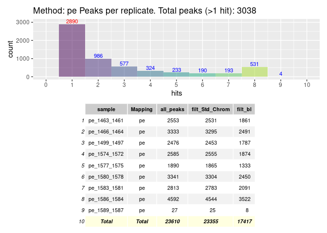

<!-- <style> -->
<!-- .vscroll-plot { -->
<!--     width: 1000px; -->
<!--     height: 1000px; -->
<!--     overflow-y: scroll; -->
<!--     overflow-x: scroll; -->
<!-- } -->
<!-- </style> -->


# R Prepare System
## R update and load librarys
BiocManager::install("")


```r
BiocManager::install(update = TRUE, ask = FALSE)
library(dbplyr)
library(tidyverse)
library(ChIPseeker)
library(rtracklayer)
library(trackViewer)
library(GenomicRanges)
library(IRanges)
library(ChIPpeakAnno)
library(AnnotationHub)
library(ggplot2)
library(viridis)
library(kableExtra)
library(DT)
library(patchwork)
library(gridExtra)

library(TxDb.Mmusculus.UCSC.mm39.knownGene)
txdb <- TxDb.Mmusculus.UCSC.mm39.knownGene
```


## R folders


# Unix Prepare System
## Unix Update System


## Unix Folder & Names


# 3 Results

{height=100%, width=100%}

{height=100%, width=100%}


```r
knitr::include_graphics("https://github.com/DNAborn/ChIPseq_Wt1/blob/main/Results/sheme.png")
knitr::include_graphics("https://github.com/DNAborn/ChIPseq_Wt1/blob/main/Results/sheme.pdf")
# knitr::include_graphics("./sheme.png")
# knitr::include_graphics("./sheme.pdf")
# knitr::include_graphics("../sheme.png")
# knitr::include_graphics("../sheme.pdf")
# knitr::include_graphics("/mnt/s/AG/AG-Scholz-NGS/Daten/Simon/P3026_ChIP-Seq_epiSVF/ChIPseq_Wt1_P3026/Results/sheme.png")
# knitr::include_graphics("/mnt/s/AG/AG-Scholz-NGS/Daten/Simon/P3026_ChIP-Seq_epiSVF/ChIPseq_Wt1_P3026/Results/sheme.pdf")
getwd()
```


```r
print("include figure in r chunk")
knitr::include_graphics("../Data/sheme.pdf") # doesn't show
```


### Generate combined peak list


#### Peak Tables


#### Hists & Tables



#### Overlap Peaks
<!-- -->

## Annotate Peaks
#### 1 Run
<!-- -->

#### All peaks


#### Venns


