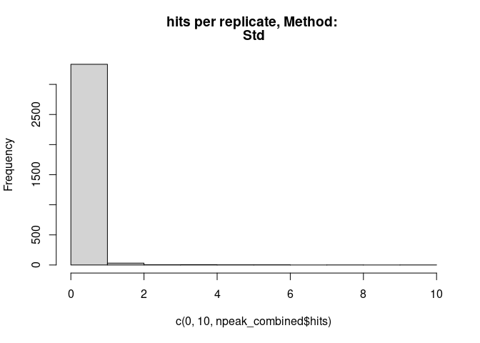
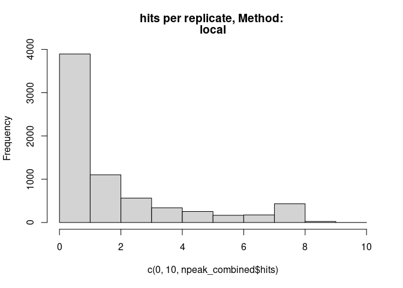
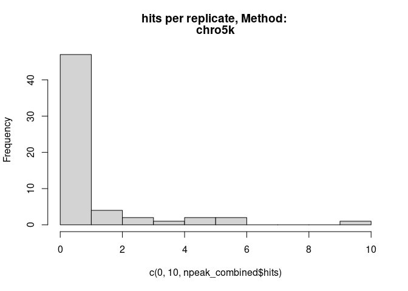
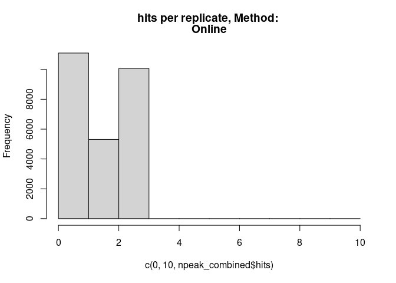

<style>
.vscroll-plot {
    width: 1000px;
    height: 500px;
    overflow-y: scroll;
    overflow-x: scroll;
}
</style>


# Prepare System
## R update and load librarys

```r
BiocManager::install("kableExtra",update = TRUE, ask = FALSE)
library(dbplyr)
library(tidyverse)
library(ChIPseeker)
library(rtracklayer)
library(trackViewer)
library(GenomicRanges)
library(IRanges)
library(ChIPpeakAnno)
library(AnnotationHub)
library(ggplot2)
library(viridis)
library(kableExtra)

library(TxDb.Mmusculus.UCSC.mm39.knownGene)
txdb <- TxDb.Mmusculus.UCSC.mm39.knownGene
```


## R folders


## linux


# 0 Prerequisits
## Folder & Names


# 3 Results
### Generate combined peak list
<!-- --><!-- --><!-- --><!-- --><!-- -->


```r
knitr::kable(npeak_numbers_table) %>% 
  kable_styling("striped", full_width = F) %>% 
 scroll_box(height = "400px")
```

<div style="border: 1px solid #ddd; padding: 0px; overflow-y: scroll; height:400px; "><table class="table table-striped" style="width: auto !important; margin-left: auto; margin-right: auto;">
 <thead>
  <tr>
   <th style="text-align:left;position: sticky; top:0; background-color: #FFFFFF;"> sample </th>
   <th style="text-align:right;position: sticky; top:0; background-color: #FFFFFF;"> all_peaks </th>
   <th style="text-align:right;position: sticky; top:0; background-color: #FFFFFF;"> peaks_on_std_chromosomes </th>
   <th style="text-align:right;position: sticky; top:0; background-color: #FFFFFF;"> peaks_wo_blacklist </th>
  </tr>
 </thead>
<tbody>
  <tr>
   <td style="text-align:left;"> Std_1463_1461 </td>
   <td style="text-align:right;"> 379 </td>
   <td style="text-align:right;"> 338 </td>
   <td style="text-align:right;"> 200 </td>
  </tr>
  <tr>
   <td style="text-align:left;"> Std_1466_1464 </td>
   <td style="text-align:right;"> 282 </td>
   <td style="text-align:right;"> 241 </td>
   <td style="text-align:right;"> 124 </td>
  </tr>
  <tr>
   <td style="text-align:left;"> Std_1499_1497 </td>
   <td style="text-align:right;"> 411 </td>
   <td style="text-align:right;"> 368 </td>
   <td style="text-align:right;"> 236 </td>
  </tr>
  <tr>
   <td style="text-align:left;"> Std_1574_1572 </td>
   <td style="text-align:right;"> 568 </td>
   <td style="text-align:right;"> 523 </td>
   <td style="text-align:right;"> 310 </td>
  </tr>
  <tr>
   <td style="text-align:left;"> Std_1577_1575 </td>
   <td style="text-align:right;"> 224 </td>
   <td style="text-align:right;"> 190 </td>
   <td style="text-align:right;"> 107 </td>
  </tr>
  <tr>
   <td style="text-align:left;"> Std_1580_1578 </td>
   <td style="text-align:right;"> 2063 </td>
   <td style="text-align:right;"> 1997 </td>
   <td style="text-align:right;"> 1562 </td>
  </tr>
  <tr>
   <td style="text-align:left;"> Std_1583_1581 </td>
   <td style="text-align:right;"> 1131 </td>
   <td style="text-align:right;"> 1072 </td>
   <td style="text-align:right;"> 826 </td>
  </tr>
  <tr>
   <td style="text-align:left;"> Std_1586_1584 </td>
   <td style="text-align:right;"> 184 </td>
   <td style="text-align:right;"> 143 </td>
   <td style="text-align:right;"> 48 </td>
  </tr>
  <tr>
   <td style="text-align:left;"> Std_1589_1587 </td>
   <td style="text-align:right;"> 109 </td>
   <td style="text-align:right;"> 106 </td>
   <td style="text-align:right;"> 61 </td>
  </tr>
  <tr>
   <td style="text-align:left;"> pe_1463_1461 </td>
   <td style="text-align:right;"> 2553 </td>
   <td style="text-align:right;"> 2531 </td>
   <td style="text-align:right;"> 1861 </td>
  </tr>
  <tr>
   <td style="text-align:left;"> pe_1466_1464 </td>
   <td style="text-align:right;"> 3333 </td>
   <td style="text-align:right;"> 3295 </td>
   <td style="text-align:right;"> 2491 </td>
  </tr>
  <tr>
   <td style="text-align:left;"> pe_1499_1497 </td>
   <td style="text-align:right;"> 2476 </td>
   <td style="text-align:right;"> 2453 </td>
   <td style="text-align:right;"> 1787 </td>
  </tr>
  <tr>
   <td style="text-align:left;"> pe_1574_1572 </td>
   <td style="text-align:right;"> 2585 </td>
   <td style="text-align:right;"> 2555 </td>
   <td style="text-align:right;"> 1874 </td>
  </tr>
  <tr>
   <td style="text-align:left;"> pe_1577_1575 </td>
   <td style="text-align:right;"> 1890 </td>
   <td style="text-align:right;"> 1865 </td>
   <td style="text-align:right;"> 1333 </td>
  </tr>
  <tr>
   <td style="text-align:left;"> pe_1580_1578 </td>
   <td style="text-align:right;"> 3341 </td>
   <td style="text-align:right;"> 3304 </td>
   <td style="text-align:right;"> 2450 </td>
  </tr>
  <tr>
   <td style="text-align:left;"> pe_1583_1581 </td>
   <td style="text-align:right;"> 2813 </td>
   <td style="text-align:right;"> 2783 </td>
   <td style="text-align:right;"> 2091 </td>
  </tr>
  <tr>
   <td style="text-align:left;"> pe_1586_1584 </td>
   <td style="text-align:right;"> 4592 </td>
   <td style="text-align:right;"> 4544 </td>
   <td style="text-align:right;"> 3522 </td>
  </tr>
  <tr>
   <td style="text-align:left;"> pe_1589_1587 </td>
   <td style="text-align:right;"> 27 </td>
   <td style="text-align:right;"> 25 </td>
   <td style="text-align:right;"> 8 </td>
  </tr>
  <tr>
   <td style="text-align:left;"> local_1463_1461 </td>
   <td style="text-align:right;"> 2666 </td>
   <td style="text-align:right;"> 2634 </td>
   <td style="text-align:right;"> 1916 </td>
  </tr>
  <tr>
   <td style="text-align:left;"> local_1466_1464 </td>
   <td style="text-align:right;"> 3602 </td>
   <td style="text-align:right;"> 3569 </td>
   <td style="text-align:right;"> 2717 </td>
  </tr>
  <tr>
   <td style="text-align:left;"> local_1499_1497 </td>
   <td style="text-align:right;"> 2452 </td>
   <td style="text-align:right;"> 2430 </td>
   <td style="text-align:right;"> 1769 </td>
  </tr>
  <tr>
   <td style="text-align:left;"> local_1574_1572 </td>
   <td style="text-align:right;"> 2678 </td>
   <td style="text-align:right;"> 2643 </td>
   <td style="text-align:right;"> 1893 </td>
  </tr>
  <tr>
   <td style="text-align:left;"> local_1577_1575 </td>
   <td style="text-align:right;"> 1910 </td>
   <td style="text-align:right;"> 1882 </td>
   <td style="text-align:right;"> 1334 </td>
  </tr>
  <tr>
   <td style="text-align:left;"> local_1580_1578 </td>
   <td style="text-align:right;"> 3187 </td>
   <td style="text-align:right;"> 3154 </td>
   <td style="text-align:right;"> 2315 </td>
  </tr>
  <tr>
   <td style="text-align:left;"> local_1583_1581 </td>
   <td style="text-align:right;"> 2657 </td>
   <td style="text-align:right;"> 2626 </td>
   <td style="text-align:right;"> 1905 </td>
  </tr>
  <tr>
   <td style="text-align:left;"> local_1586_1584 </td>
   <td style="text-align:right;"> 5200 </td>
   <td style="text-align:right;"> 5145 </td>
   <td style="text-align:right;"> 3971 </td>
  </tr>
  <tr>
   <td style="text-align:left;"> local_1589_1587 </td>
   <td style="text-align:right;"> 107 </td>
   <td style="text-align:right;"> 95 </td>
   <td style="text-align:right;"> 58 </td>
  </tr>
  <tr>
   <td style="text-align:left;"> chro5k_1463_1461 </td>
   <td style="text-align:right;"> 33 </td>
   <td style="text-align:right;"> 22 </td>
   <td style="text-align:right;"> 8 </td>
  </tr>
  <tr>
   <td style="text-align:left;"> chro5k_1466_1464 </td>
   <td style="text-align:right;"> 21 </td>
   <td style="text-align:right;"> 13 </td>
   <td style="text-align:right;"> 2 </td>
  </tr>
  <tr>
   <td style="text-align:left;"> chro5k_1499_1497 </td>
   <td style="text-align:right;"> 28 </td>
   <td style="text-align:right;"> 13 </td>
   <td style="text-align:right;"> 2 </td>
  </tr>
  <tr>
   <td style="text-align:left;"> chro5k_1574_1572 </td>
   <td style="text-align:right;"> 35 </td>
   <td style="text-align:right;"> 24 </td>
   <td style="text-align:right;"> 14 </td>
  </tr>
  <tr>
   <td style="text-align:left;"> chro5k_1577_1575 </td>
   <td style="text-align:right;"> 38 </td>
   <td style="text-align:right;"> 25 </td>
   <td style="text-align:right;"> 15 </td>
  </tr>
  <tr>
   <td style="text-align:left;"> chro5k_1580_1578 </td>
   <td style="text-align:right;"> 36 </td>
   <td style="text-align:right;"> 26 </td>
   <td style="text-align:right;"> 12 </td>
  </tr>
  <tr>
   <td style="text-align:left;"> chro5k_1583_1581 </td>
   <td style="text-align:right;"> 39 </td>
   <td style="text-align:right;"> 27 </td>
   <td style="text-align:right;"> 15 </td>
  </tr>
  <tr>
   <td style="text-align:left;"> chro5k_1586_1584 </td>
   <td style="text-align:right;"> 39 </td>
   <td style="text-align:right;"> 25 </td>
   <td style="text-align:right;"> 10 </td>
  </tr>
  <tr>
   <td style="text-align:left;"> chro5k_1589_1587 </td>
   <td style="text-align:right;"> 24 </td>
   <td style="text-align:right;"> 22 </td>
   <td style="text-align:right;"> 12 </td>
  </tr>
  <tr>
   <td style="text-align:left;"> Online_SRR1703423_SRR1703426 </td>
   <td style="text-align:right;"> 12870 </td>
   <td style="text-align:right;"> 12869 </td>
   <td style="text-align:right;"> 12698 </td>
  </tr>
  <tr>
   <td style="text-align:left;"> Online_SRR1703424_SRR1703427 </td>
   <td style="text-align:right;"> 25304 </td>
   <td style="text-align:right;"> 25288 </td>
   <td style="text-align:right;"> 24757 </td>
  </tr>
  <tr>
   <td style="text-align:left;"> Online_SRR1703425_SRR1703428 </td>
   <td style="text-align:right;"> 16322 </td>
   <td style="text-align:right;"> 16309 </td>
   <td style="text-align:right;"> 15963 </td>
  </tr>
</tbody>
</table></div>

```r
knitr::kable(peaks_summary)
```

<table>
 <thead>
  <tr>
   <th style="text-align:left;">   </th>
   <th style="text-align:left;"> Sample </th>
   <th style="text-align:right;"> Peaks </th>
   <th style="text-align:right;"> ol.Std </th>
   <th style="text-align:right;"> ol.pe </th>
   <th style="text-align:right;"> ol.local </th>
   <th style="text-align:right;"> ol.chro5k </th>
   <th style="text-align:right;"> ol.Online </th>
  </tr>
 </thead>
<tbody>
  <tr>
   <td style="text-align:left;"> Std </td>
   <td style="text-align:left;"> Std </td>
   <td style="text-align:right;"> 48 </td>
   <td style="text-align:right;"> 48 </td>
   <td style="text-align:right;"> 22 </td>
   <td style="text-align:right;"> 27 </td>
   <td style="text-align:right;"> 14 </td>
   <td style="text-align:right;"> 7 </td>
  </tr>
  <tr>
   <td style="text-align:left;"> pe </td>
   <td style="text-align:left;"> pe </td>
   <td style="text-align:right;"> 3038 </td>
   <td style="text-align:right;"> 22 </td>
   <td style="text-align:right;"> 3138 </td>
   <td style="text-align:right;"> 2288 </td>
   <td style="text-align:right;"> 9 </td>
   <td style="text-align:right;"> 22 </td>
  </tr>
  <tr>
   <td style="text-align:left;"> local </td>
   <td style="text-align:left;"> local </td>
   <td style="text-align:right;"> 3061 </td>
   <td style="text-align:right;"> 27 </td>
   <td style="text-align:right;"> 2301 </td>
   <td style="text-align:right;"> 3207 </td>
   <td style="text-align:right;"> 10 </td>
   <td style="text-align:right;"> 33 </td>
  </tr>
  <tr>
   <td style="text-align:left;"> chro5k </td>
   <td style="text-align:left;"> chro5k </td>
   <td style="text-align:right;"> 11 </td>
   <td style="text-align:right;"> 14 </td>
   <td style="text-align:right;"> 9 </td>
   <td style="text-align:right;"> 10 </td>
   <td style="text-align:right;"> 11 </td>
   <td style="text-align:right;"> 5 </td>
  </tr>
  <tr>
   <td style="text-align:left;"> Online </td>
   <td style="text-align:left;"> Online </td>
   <td style="text-align:right;"> 15376 </td>
   <td style="text-align:right;"> 7 </td>
   <td style="text-align:right;"> 25 </td>
   <td style="text-align:right;"> 34 </td>
   <td style="text-align:right;"> 5 </td>
   <td style="text-align:right;"> 17594 </td>
  </tr>
</tbody>
</table>

```r
# tibble::as.tibble(npeak_numbers_table)
# tibble::as.tibble(peaks_summary)
```


#### Venn
<!-- -->

### Convert Peaks to Gene names

```r
# Add Gene names
ah = AnnotationHub()
query(ah, c("EnsDb", "Musculus"))
edb <- ah[["AH113713"]]

# 1 Subfolder
i <- 5
all_npeaksAnno <- annotatePeak(npeak_combined_all[[i]], TxDb=txdb,tssRegion=c(-3000, 3000), verbose=TRUE)
  all_npeaksAnno_table <- as.data.frame(all_npeaksAnno)
  all_npeaksAnno_table$transcriptId2 <- sub("\\.\\d+$", "", all_npeaksAnno_table$transcriptId)
  all_npeaksAnno_table$geneId <- mapIds(edb, keys = all_npeaksAnno_table$transcriptId2, column = "GENEID", keytype = "TXID")
  all_npeaksAnno_table$symbol <- mapIds(edb, keys = all_npeaksAnno_table$transcriptId2, column = "SYMBOL", keytype = "TXID")
n <- names(npeak_combined_all[i])
all_npeaksAnno_table$annotation_short <-  str_split(all_npeaksAnno_table$annotation,pattern = " ", simplify = TRUE)[,1]

ggplot(all_npeaksAnno_table,aes(x=hits, fill=hits)) +
      stat_bin(alpha=0.6, position = 'identity', binwidth=1) + #
      stat_bin(position = 'identity', binwidth=1, geom="text", aes(label=after_stat(count)), vjust=-0.5, colour="blue") +
  ggtitle(n)
```

<!-- -->

```r
ggplot(all_npeaksAnno_table,aes(x=width, group=annotation_short, fill=annotation_short)) +
      stat_bin(alpha=0.5, position = 'identity', binwidth=100) + 
  # stat_bin(position = 'identity', binwidth=100, geom="text", aes(label=after_stat(count)), vjust=-0.5, colour="blue") +
  scale_fill_viridis_d() +
  ggtitle(paste("genetic region per peak size (",n,")",sep="")) # + coord_cartesian(xlim = c(0, 100), ylim=c(0,200))
```

<!-- -->

```r
ggsave(file=paste(pubfigdir,"Peaks_geneticregions_",n,".pdf",sep=""), width = 8, height = 8, device = "pdf")

ggplot(all_npeaksAnno_table,aes(x=width, group=hits, fill=hits)) +
      stat_bin(alpha=0.5, position = 'identity', binwidth=200) + 
  # stat_bin(position = 'identity', binwidth=100, geom="text", aes(label=after_stat(count)), vjust=-0.5, colour="blue") +
  scale_fill_viridis_c() +
  ggtitle(paste("hits per peak size")) # + coord_cartesian(xlim = c(0, 10000), ylim=c(0,50))
```

<!-- -->

```r
ggplot(all_npeaksAnno_table,aes(x=qValue, group=hits, fill=hits)) +
  stat_bin(alpha=0.5, position = 'identity', binwidth=5) + 
  scale_fill_viridis_c() +
  ggtitle(paste("qvalue per hit")) # + coord_cartesian(xlim = c(0, 10000), ylim=c(0,50))
```

<!-- -->

```r
levels(factor(all_npeaksAnno_table$annotation_short))

head(all_npeaksAnno_table[order(all_npeaksAnno_table$width),])
viridis(8)

top_hits <- subset(all_npeaksAnno_table, distanceToTSS > -2000 & distanceToTSS < 2000)
dim(top_hits)
```

#### All peaks


#### Venns


