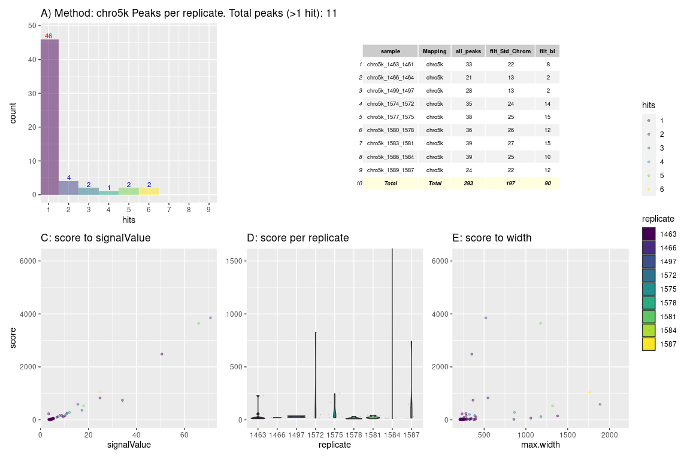
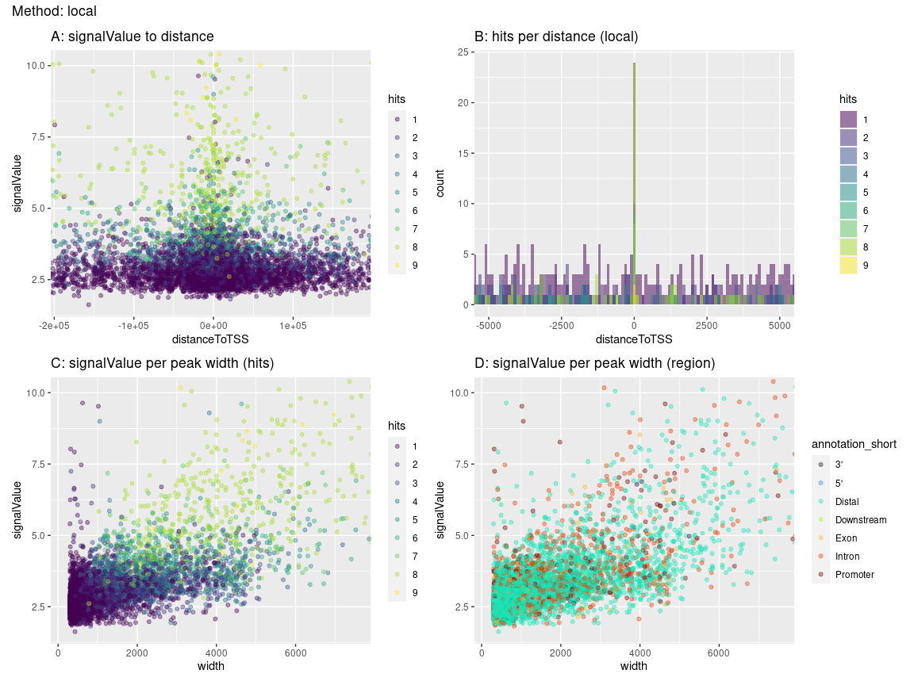
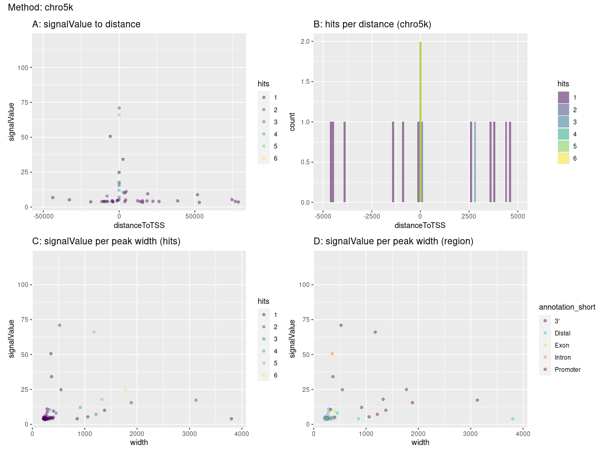

# R Prepare System

## R update and load librarys

BiocManager::install()

``` r
# BiocManager::install(update = TRUE, ask = FALSE)

library(dbplyr)
library(tidyverse)
library(ChIPseeker)
library(rtracklayer)
library(trackViewer)
library(GenomicRanges)
library(IRanges)
library(ChIPpeakAnno)
library(AnnotationHub)
library(ggplot2)
library(viridis)
library(kableExtra)
library(DT)
library(patchwork)
library(gridExtra)
library(foreach)
library(doParallel)
library(tidyGenomeBrowser)
library(Gviz)
library(magrittr)

# library()

library(TxDb.Mmusculus.UCSC.mm39.knownGene)
txdb <- TxDb.Mmusculus.UCSC.mm39.knownGene
library(org.Mm.eg.db)
```

## R folders

# Unix Prepare System

## Unix Update System

## Unix Folder & Names

# 3 Results

<a href="../Data/sheme.pdf" height="100%," width="100%">Analysis
Overview</a>

``` r
# write outside r code: {height=100%, width=100%}

# knitr::include_graphics("https://github.com/DNAborn/ChIPseq_Wt1/blob/main/Results/sheme.png")
# knitr::include_graphics("https://github.com/DNAborn/ChIPseq_Wt1/blob/main/Results/sheme.png?raw=true")
knitr::include_graphics("../Data/sheme.png")
```


``` r
# knitr::include_graphics("./sheme.png")
# knitr::include_graphics("./sheme.pdf")
# knitr::include_graphics("../sheme.png")
# knitr::include_graphics("../sheme.pdf")
# knitr::include_graphics("/mnt/s/AG/AG-Scholz-NGS/Daten/Simon/P3026_ChIP-Seq_epiSVF/ChIPseq_Wt1_P3026/Results/sheme.png")
# knitr::include_graphics("/mnt/s/AG/AG-Scholz-NGS/Daten/Simon/P3026_ChIP-Seq_epiSVF/ChIPseq_Wt1_P3026/Results/sheme.pdf")
getwd()
```

    ## [1] "/mnt/s/AG/AG-Scholz-NGS/Daten/Simon/P3026_ChIP-Seq_epiSVF/ChIPseq_Wt1_P3026/Results"

``` r
print("include figure in r chunk")
knitr::include_graphics("../Data/sheme.pdf") # doesn't show
```

### Generate combined peak list

#### Peak Tables

``` r
dim(npeak_numbers_table)
```

    ## [1] 39  5

``` r
knitr::kable(npeak_numbers_table, format = "markdown") %>% 
  kable_styling("striped", full_width = F) %>% 
  scroll_box(height = "400px")
```

<div style="border: 1px solid #ddd; padding: 0px; overflow-y: scroll; height:400px; ">

<table class="table table-striped" style="width: auto !important; margin-left: auto; margin-right: auto;">
<thead>
<tr>
<th style="text-align:left;position: sticky; top:0; background-color: #FFFFFF;">
sample
</th>
<th style="text-align:left;position: sticky; top:0; background-color: #FFFFFF;">
Mapping
</th>
<th style="text-align:right;position: sticky; top:0; background-color: #FFFFFF;">
all_peaks
</th>
<th style="text-align:right;position: sticky; top:0; background-color: #FFFFFF;">
filt_Std_Chrom
</th>
<th style="text-align:right;position: sticky; top:0; background-color: #FFFFFF;">
filt_bl
</th>
</tr>
</thead>
<tbody>
<tr>
<td style="text-align:left;">
Std_1463_1461
</td>
<td style="text-align:left;">
Std
</td>
<td style="text-align:right;">
379
</td>
<td style="text-align:right;">
338
</td>
<td style="text-align:right;">
200
</td>
</tr>
<tr>
<td style="text-align:left;">
Std_1466_1464
</td>
<td style="text-align:left;">
Std
</td>
<td style="text-align:right;">
282
</td>
<td style="text-align:right;">
241
</td>
<td style="text-align:right;">
124
</td>
</tr>
<tr>
<td style="text-align:left;">
Std_1499_1497
</td>
<td style="text-align:left;">
Std
</td>
<td style="text-align:right;">
411
</td>
<td style="text-align:right;">
368
</td>
<td style="text-align:right;">
236
</td>
</tr>
<tr>
<td style="text-align:left;">
Std_1574_1572
</td>
<td style="text-align:left;">
Std
</td>
<td style="text-align:right;">
568
</td>
<td style="text-align:right;">
523
</td>
<td style="text-align:right;">
310
</td>
</tr>
<tr>
<td style="text-align:left;">
Std_1577_1575
</td>
<td style="text-align:left;">
Std
</td>
<td style="text-align:right;">
224
</td>
<td style="text-align:right;">
190
</td>
<td style="text-align:right;">
107
</td>
</tr>
<tr>
<td style="text-align:left;">
Std_1580_1578
</td>
<td style="text-align:left;">
Std
</td>
<td style="text-align:right;">
2063
</td>
<td style="text-align:right;">
1997
</td>
<td style="text-align:right;">
1562
</td>
</tr>
<tr>
<td style="text-align:left;">
Std_1583_1581
</td>
<td style="text-align:left;">
Std
</td>
<td style="text-align:right;">
1131
</td>
<td style="text-align:right;">
1072
</td>
<td style="text-align:right;">
826
</td>
</tr>
<tr>
<td style="text-align:left;">
Std_1586_1584
</td>
<td style="text-align:left;">
Std
</td>
<td style="text-align:right;">
184
</td>
<td style="text-align:right;">
143
</td>
<td style="text-align:right;">
48
</td>
</tr>
<tr>
<td style="text-align:left;">
Std_1589_1587
</td>
<td style="text-align:left;">
Std
</td>
<td style="text-align:right;">
109
</td>
<td style="text-align:right;">
106
</td>
<td style="text-align:right;">
61
</td>
</tr>
<tr>
<td style="text-align:left;">
pe_1463_1461
</td>
<td style="text-align:left;">
pe
</td>
<td style="text-align:right;">
2553
</td>
<td style="text-align:right;">
2531
</td>
<td style="text-align:right;">
1861
</td>
</tr>
<tr>
<td style="text-align:left;">
pe_1466_1464
</td>
<td style="text-align:left;">
pe
</td>
<td style="text-align:right;">
3333
</td>
<td style="text-align:right;">
3295
</td>
<td style="text-align:right;">
2491
</td>
</tr>
<tr>
<td style="text-align:left;">
pe_1499_1497
</td>
<td style="text-align:left;">
pe
</td>
<td style="text-align:right;">
2476
</td>
<td style="text-align:right;">
2453
</td>
<td style="text-align:right;">
1787
</td>
</tr>
<tr>
<td style="text-align:left;">
pe_1574_1572
</td>
<td style="text-align:left;">
pe
</td>
<td style="text-align:right;">
2585
</td>
<td style="text-align:right;">
2555
</td>
<td style="text-align:right;">
1874
</td>
</tr>
<tr>
<td style="text-align:left;">
pe_1577_1575
</td>
<td style="text-align:left;">
pe
</td>
<td style="text-align:right;">
1890
</td>
<td style="text-align:right;">
1865
</td>
<td style="text-align:right;">
1333
</td>
</tr>
<tr>
<td style="text-align:left;">
pe_1580_1578
</td>
<td style="text-align:left;">
pe
</td>
<td style="text-align:right;">
3341
</td>
<td style="text-align:right;">
3304
</td>
<td style="text-align:right;">
2450
</td>
</tr>
<tr>
<td style="text-align:left;">
pe_1583_1581
</td>
<td style="text-align:left;">
pe
</td>
<td style="text-align:right;">
2813
</td>
<td style="text-align:right;">
2783
</td>
<td style="text-align:right;">
2091
</td>
</tr>
<tr>
<td style="text-align:left;">
pe_1586_1584
</td>
<td style="text-align:left;">
pe
</td>
<td style="text-align:right;">
4592
</td>
<td style="text-align:right;">
4544
</td>
<td style="text-align:right;">
3522
</td>
</tr>
<tr>
<td style="text-align:left;">
pe_1589_1587
</td>
<td style="text-align:left;">
pe
</td>
<td style="text-align:right;">
27
</td>
<td style="text-align:right;">
25
</td>
<td style="text-align:right;">
8
</td>
</tr>
<tr>
<td style="text-align:left;">
local_1463_1461
</td>
<td style="text-align:left;">
local
</td>
<td style="text-align:right;">
2666
</td>
<td style="text-align:right;">
2634
</td>
<td style="text-align:right;">
1916
</td>
</tr>
<tr>
<td style="text-align:left;">
local_1466_1464
</td>
<td style="text-align:left;">
local
</td>
<td style="text-align:right;">
3602
</td>
<td style="text-align:right;">
3569
</td>
<td style="text-align:right;">
2717
</td>
</tr>
<tr>
<td style="text-align:left;">
local_1499_1497
</td>
<td style="text-align:left;">
local
</td>
<td style="text-align:right;">
2452
</td>
<td style="text-align:right;">
2430
</td>
<td style="text-align:right;">
1769
</td>
</tr>
<tr>
<td style="text-align:left;">
local_1574_1572
</td>
<td style="text-align:left;">
local
</td>
<td style="text-align:right;">
2678
</td>
<td style="text-align:right;">
2643
</td>
<td style="text-align:right;">
1893
</td>
</tr>
<tr>
<td style="text-align:left;">
local_1577_1575
</td>
<td style="text-align:left;">
local
</td>
<td style="text-align:right;">
1910
</td>
<td style="text-align:right;">
1882
</td>
<td style="text-align:right;">
1334
</td>
</tr>
<tr>
<td style="text-align:left;">
local_1580_1578
</td>
<td style="text-align:left;">
local
</td>
<td style="text-align:right;">
3187
</td>
<td style="text-align:right;">
3154
</td>
<td style="text-align:right;">
2315
</td>
</tr>
<tr>
<td style="text-align:left;">
local_1583_1581
</td>
<td style="text-align:left;">
local
</td>
<td style="text-align:right;">
2657
</td>
<td style="text-align:right;">
2626
</td>
<td style="text-align:right;">
1905
</td>
</tr>
<tr>
<td style="text-align:left;">
local_1586_1584
</td>
<td style="text-align:left;">
local
</td>
<td style="text-align:right;">
5200
</td>
<td style="text-align:right;">
5145
</td>
<td style="text-align:right;">
3971
</td>
</tr>
<tr>
<td style="text-align:left;">
local_1589_1587
</td>
<td style="text-align:left;">
local
</td>
<td style="text-align:right;">
107
</td>
<td style="text-align:right;">
95
</td>
<td style="text-align:right;">
58
</td>
</tr>
<tr>
<td style="text-align:left;">
chro5k_1463_1461
</td>
<td style="text-align:left;">
chro5k
</td>
<td style="text-align:right;">
33
</td>
<td style="text-align:right;">
22
</td>
<td style="text-align:right;">
8
</td>
</tr>
<tr>
<td style="text-align:left;">
chro5k_1466_1464
</td>
<td style="text-align:left;">
chro5k
</td>
<td style="text-align:right;">
21
</td>
<td style="text-align:right;">
13
</td>
<td style="text-align:right;">
2
</td>
</tr>
<tr>
<td style="text-align:left;">
chro5k_1499_1497
</td>
<td style="text-align:left;">
chro5k
</td>
<td style="text-align:right;">
28
</td>
<td style="text-align:right;">
13
</td>
<td style="text-align:right;">
2
</td>
</tr>
<tr>
<td style="text-align:left;">
chro5k_1574_1572
</td>
<td style="text-align:left;">
chro5k
</td>
<td style="text-align:right;">
35
</td>
<td style="text-align:right;">
24
</td>
<td style="text-align:right;">
14
</td>
</tr>
<tr>
<td style="text-align:left;">
chro5k_1577_1575
</td>
<td style="text-align:left;">
chro5k
</td>
<td style="text-align:right;">
38
</td>
<td style="text-align:right;">
25
</td>
<td style="text-align:right;">
15
</td>
</tr>
<tr>
<td style="text-align:left;">
chro5k_1580_1578
</td>
<td style="text-align:left;">
chro5k
</td>
<td style="text-align:right;">
36
</td>
<td style="text-align:right;">
26
</td>
<td style="text-align:right;">
12
</td>
</tr>
<tr>
<td style="text-align:left;">
chro5k_1583_1581
</td>
<td style="text-align:left;">
chro5k
</td>
<td style="text-align:right;">
39
</td>
<td style="text-align:right;">
27
</td>
<td style="text-align:right;">
15
</td>
</tr>
<tr>
<td style="text-align:left;">
chro5k_1586_1584
</td>
<td style="text-align:left;">
chro5k
</td>
<td style="text-align:right;">
39
</td>
<td style="text-align:right;">
25
</td>
<td style="text-align:right;">
10
</td>
</tr>
<tr>
<td style="text-align:left;">
chro5k_1589_1587
</td>
<td style="text-align:left;">
chro5k
</td>
<td style="text-align:right;">
24
</td>
<td style="text-align:right;">
22
</td>
<td style="text-align:right;">
12
</td>
</tr>
<tr>
<td style="text-align:left;">
Online_SRR1703423_SRR1703426
</td>
<td style="text-align:left;">
Online
</td>
<td style="text-align:right;">
12870
</td>
<td style="text-align:right;">
12869
</td>
<td style="text-align:right;">
12698
</td>
</tr>
<tr>
<td style="text-align:left;">
Online_SRR1703424_SRR1703427
</td>
<td style="text-align:left;">
Online
</td>
<td style="text-align:right;">
25304
</td>
<td style="text-align:right;">
25288
</td>
<td style="text-align:right;">
24757
</td>
</tr>
<tr>
<td style="text-align:left;">
Online_SRR1703425_SRR1703428
</td>
<td style="text-align:left;">
Online
</td>
<td style="text-align:right;">
16322
</td>
<td style="text-align:right;">
16309
</td>
<td style="text-align:right;">
15963
</td>
</tr>
</tbody>
</table>

</div>

``` r
# datatable(npeak_numbers_table)

knitr::kable(peaks_overlap)  %>% 
  kable_styling("striped", full_width = F) %>% 
  scroll_box(height = "400px")
```

<div style="border: 1px solid #ddd; padding: 0px; overflow-y: scroll; height:400px; ">

<table class="table table-striped" style="width: auto !important; margin-left: auto; margin-right: auto;">
<thead>
<tr>
<th style="text-align:left;position: sticky; top:0; background-color: #FFFFFF;">
</th>
<th style="text-align:left;position: sticky; top:0; background-color: #FFFFFF;">
Sample
</th>
<th style="text-align:right;position: sticky; top:0; background-color: #FFFFFF;">
Peaks
</th>
<th style="text-align:right;position: sticky; top:0; background-color: #FFFFFF;">
ol.Std
</th>
<th style="text-align:right;position: sticky; top:0; background-color: #FFFFFF;">
ol.pe
</th>
<th style="text-align:right;position: sticky; top:0; background-color: #FFFFFF;">
ol.local
</th>
<th style="text-align:right;position: sticky; top:0; background-color: #FFFFFF;">
ol.chro5k
</th>
<th style="text-align:right;position: sticky; top:0; background-color: #FFFFFF;">
ol.Online
</th>
</tr>
</thead>
<tbody>
<tr>
<td style="text-align:left;">
Std
</td>
<td style="text-align:left;">
Std
</td>
<td style="text-align:right;">
3381
</td>
<td style="text-align:right;">
3387
</td>
<td style="text-align:right;">
299
</td>
<td style="text-align:right;">
326
</td>
<td style="text-align:right;">
55
</td>
<td style="text-align:right;">
36
</td>
</tr>
<tr>
<td style="text-align:left;">
pe
</td>
<td style="text-align:left;">
pe
</td>
<td style="text-align:right;">
5928
</td>
<td style="text-align:right;">
304
</td>
<td style="text-align:right;">
6392
</td>
<td style="text-align:right;">
4829
</td>
<td style="text-align:right;">
29
</td>
<td style="text-align:right;">
98
</td>
</tr>
<tr>
<td style="text-align:left;">
local
</td>
<td style="text-align:left;">
local
</td>
<td style="text-align:right;">
6955
</td>
<td style="text-align:right;">
340
</td>
<td style="text-align:right;">
4935
</td>
<td style="text-align:right;">
7681
</td>
<td style="text-align:right;">
34
</td>
<td style="text-align:right;">
125
</td>
</tr>
<tr>
<td style="text-align:left;">
chro5k
</td>
<td style="text-align:left;">
chro5k
</td>
<td style="text-align:right;">
57
</td>
<td style="text-align:right;">
58
</td>
<td style="text-align:right;">
29
</td>
<td style="text-align:right;">
34
</td>
<td style="text-align:right;">
59
</td>
<td style="text-align:right;">
13
</td>
</tr>
<tr>
<td style="text-align:left;">
Online
</td>
<td style="text-align:left;">
Online
</td>
<td style="text-align:right;">
26474
</td>
<td style="text-align:right;">
47
</td>
<td style="text-align:right;">
111
</td>
<td style="text-align:right;">
135
</td>
<td style="text-align:right;">
14
</td>
<td style="text-align:right;">
33078
</td>
</tr>
</tbody>
</table>

</div>

#### Hists & Tables



#### Venn Overlap Peaks

<!-- --><!-- --><!-- -->

## Annotate Peaks

#### 1 Run

``` r
# Add Gene names
ah = AnnotationHub()
query(ah, c("EnsDb", "Musculus"))
```

    ## AnnotationHub with 81 records
    ## # snapshotDate(): 2023-10-23
    ## # $dataprovider: Ensembl
    ## # $species: Mus musculus, Balaenoptera musculus, Mus musculus musculus, Mus ...
    ## # $rdataclass: EnsDb
    ## # additional mcols(): taxonomyid, genome, description,
    ## #   coordinate_1_based, maintainer, rdatadateadded, preparerclass, tags,
    ## #   rdatapath, sourceurl, sourcetype 
    ## # retrieve records with, e.g., 'object[["AH53222"]]' 
    ## 
    ##              title                                        
    ##   AH53222  | Ensembl 87 EnsDb for Mus Musculus            
    ##   AH53726  | Ensembl 88 EnsDb for Mus Musculus            
    ##   AH56691  | Ensembl 89 EnsDb for Mus Musculus            
    ##   AH57770  | Ensembl 90 EnsDb for Mus Musculus            
    ##   AH60788  | Ensembl 91 EnsDb for Mus Musculus            
    ##   ...        ...                                          
    ##   AH116336 | Ensembl 111 EnsDb for Mus musculus           
    ##   AH116337 | Ensembl 111 EnsDb for Mus musculus           
    ##   AH116338 | Ensembl 111 EnsDb for Mus musculus musculus  
    ##   AH116339 | Ensembl 111 EnsDb for Mus musculus domesticus
    ##   AH116340 | Ensembl 111 EnsDb for Mus musculus

``` r
edb <- ah[["AH113713"]]

# 1 Subfolder

figures_annotated_peaks <- list()

i <- "pe"
all_npeaksAnno <- annotatePeak(npeak_combined_all[[i]], TxDb=txdb,tssRegion=c(-3000, 3000), verbose=TRUE)
```

    ## >> preparing features information...      2024-02-14 14:18:18 
    ## >> identifying nearest features...        2024-02-14 14:18:19 
    ## >> calculating distance from peak to TSS...   2024-02-14 14:18:19 
    ## >> assigning genomic annotation...        2024-02-14 14:18:19 
    ## >> assigning chromosome lengths           2024-02-14 14:18:32 
    ## >> done...                    2024-02-14 14:18:32

``` r
  all_npeaksAnno_table <- as.data.frame(all_npeaksAnno)
  all_npeaksAnno_table$transcriptId2 <- sub("\\.\\d+$", "", all_npeaksAnno_table$transcriptId)
  all_npeaksAnno_table$geneId <- mapIds(edb, keys = all_npeaksAnno_table$transcriptId2, column = "GENEID", keytype = "TXID")
  all_npeaksAnno_table$symbol <- mapIds(edb, keys = all_npeaksAnno_table$transcriptId2, column = "SYMBOL", keytype = "TXID")
n <- names(npeak_combined_all[i])
all_npeaksAnno_table$annotation_short <-  str_split(all_npeaksAnno_table$annotation,pattern = " ", simplify = TRUE)[,1]

# Annotated table
top_hits <- all_npeaksAnno_table[order(all_npeaksAnno_table$signalValue, decreasing=T),]
colnames(top_hits)
```

    ##  [1] "seqnames"         "start"            "end"              "width"           
    ##  [5] "strand"           "name"             "score"            "signalValue"     
    ##  [9] "pValue"           "qValue"           "peak"             "id"              
    ## [13] "hits"             "annotation"       "geneChr"          "geneStart"       
    ## [17] "geneEnd"          "geneLength"       "geneStrand"       "geneId"          
    ## [21] "transcriptId"     "distanceToTSS"    "transcriptId2"    "symbol"          
    ## [25] "annotation_short"

``` r
kable(top_hits[1:15,c("seqnames","start","end","width","score","signalValue","hits","annotation","geneId","distanceToTSS","symbol","annotation_short")])  %>%
 kable_styling("striped", full_width = F) %>% 
 scroll_box(height = "400px")
```

<div style="border: 1px solid #ddd; padding: 0px; overflow-y: scroll; height:400px; ">

<table class="table table-striped" style="width: auto !important; margin-left: auto; margin-right: auto;">
<thead>
<tr>
<th style="text-align:left;position: sticky; top:0; background-color: #FFFFFF;">
</th>
<th style="text-align:left;position: sticky; top:0; background-color: #FFFFFF;">
seqnames
</th>
<th style="text-align:right;position: sticky; top:0; background-color: #FFFFFF;">
start
</th>
<th style="text-align:right;position: sticky; top:0; background-color: #FFFFFF;">
end
</th>
<th style="text-align:right;position: sticky; top:0; background-color: #FFFFFF;">
width
</th>
<th style="text-align:right;position: sticky; top:0; background-color: #FFFFFF;">
score
</th>
<th style="text-align:right;position: sticky; top:0; background-color: #FFFFFF;">
signalValue
</th>
<th style="text-align:right;position: sticky; top:0; background-color: #FFFFFF;">
hits
</th>
<th style="text-align:left;position: sticky; top:0; background-color: #FFFFFF;">
annotation
</th>
<th style="text-align:left;position: sticky; top:0; background-color: #FFFFFF;">
geneId
</th>
<th style="text-align:right;position: sticky; top:0; background-color: #FFFFFF;">
distanceToTSS
</th>
<th style="text-align:left;position: sticky; top:0; background-color: #FFFFFF;">
symbol
</th>
<th style="text-align:left;position: sticky; top:0; background-color: #FFFFFF;">
annotation_short
</th>
</tr>
</thead>
<tbody>
<tr>
<td style="text-align:left;">
2084
</td>
<td style="text-align:left;">
chr17
</td>
<td style="text-align:right;">
4676434
</td>
<td style="text-align:right;">
4676880
</td>
<td style="text-align:right;">
447
</td>
<td style="text-align:right;">
10464.86
</td>
<td style="text-align:right;">
98.17
</td>
<td style="text-align:right;">
7
</td>
<td style="text-align:left;">
Distal Intergenic
</td>
<td style="text-align:left;">
ENSMUSG00000116767
</td>
<td style="text-align:right;">
-8373
</td>
<td style="text-align:left;">
4930517M08Rik
</td>
<td style="text-align:left;">
Distal
</td>
</tr>
<tr>
<td style="text-align:left;">
4080
</td>
<td style="text-align:left;">
chr6
</td>
<td style="text-align:right;">
48882120
</td>
<td style="text-align:right;">
48886141
</td>
<td style="text-align:right;">
4022
</td>
<td style="text-align:right;">
4118.86
</td>
<td style="text-align:right;">
60.05
</td>
<td style="text-align:right;">
6
</td>
<td style="text-align:left;">
Promoter (\<=1kb)
</td>
<td style="text-align:left;">
ENSMUSG00000029811
</td>
<td style="text-align:right;">
0
</td>
<td style="text-align:left;">
Aoc1
</td>
<td style="text-align:left;">
Promoter
</td>
</tr>
<tr>
<td style="text-align:left;">
5552
</td>
<td style="text-align:left;">
chrX
</td>
<td style="text-align:right;">
105230323
</td>
<td style="text-align:right;">
105230844
</td>
<td style="text-align:right;">
522
</td>
<td style="text-align:right;">
2703.00
</td>
<td style="text-align:right;">
37.57
</td>
<td style="text-align:right;">
1
</td>
<td style="text-align:left;">
Promoter (\<=1kb)
</td>
<td style="text-align:left;">
ENSMUSG00000062070
</td>
<td style="text-align:right;">
0
</td>
<td style="text-align:left;">
Pgk1
</td>
<td style="text-align:left;">
Promoter
</td>
</tr>
<tr>
<td style="text-align:left;">
771
</td>
<td style="text-align:left;">
chr11
</td>
<td style="text-align:right;">
5956234
</td>
<td style="text-align:right;">
5956613
</td>
<td style="text-align:right;">
380
</td>
<td style="text-align:right;">
2341.00
</td>
<td style="text-align:right;">
36.44
</td>
<td style="text-align:right;">
1
</td>
<td style="text-align:left;">
Intron (ENSMUST00000109813.9/12323, intron 3 of 20)
</td>
<td style="text-align:left;">
ENSMUSG00000057897
</td>
<td style="text-align:right;">
-5786
</td>
<td style="text-align:left;">
Camk2b
</td>
<td style="text-align:left;">
Intron
</td>
</tr>
<tr>
<td style="text-align:left;">
4281
</td>
<td style="text-align:left;">
chr6
</td>
<td style="text-align:right;">
132440307
</td>
<td style="text-align:right;">
132440774
</td>
<td style="text-align:right;">
468
</td>
<td style="text-align:right;">
1271.00
</td>
<td style="text-align:right;">
28.61
</td>
<td style="text-align:right;">
1
</td>
<td style="text-align:left;">
Distal Intergenic
</td>
<td style="text-align:left;">
ENSMUSG00000108041
</td>
<td style="text-align:right;">
-21622
</td>
<td style="text-align:left;">
Gm5154
</td>
<td style="text-align:left;">
Distal
</td>
</tr>
<tr>
<td style="text-align:left;">
2534
</td>
<td style="text-align:left;">
chr19
</td>
<td style="text-align:right;">
37685100
</td>
<td style="text-align:right;">
37686273
</td>
<td style="text-align:right;">
1174
</td>
<td style="text-align:right;">
1177.50
</td>
<td style="text-align:right;">
22.15
</td>
<td style="text-align:right;">
4
</td>
<td style="text-align:left;">
Promoter (\<=1kb)
</td>
<td style="text-align:left;">
ENSMUSG00000120139
</td>
<td style="text-align:right;">
0
</td>
<td style="text-align:left;">
Gm32342
</td>
<td style="text-align:left;">
Promoter
</td>
</tr>
<tr>
<td style="text-align:left;">
4079
</td>
<td style="text-align:left;">
chr6
</td>
<td style="text-align:right;">
48871614
</td>
<td style="text-align:right;">
48872189
</td>
<td style="text-align:right;">
576
</td>
<td style="text-align:right;">
705.00
</td>
<td style="text-align:right;">
17.60
</td>
<td style="text-align:right;">
1
</td>
<td style="text-align:left;">
Promoter (\<=1kb)
</td>
<td style="text-align:left;">
ENSMUSG00000029811
</td>
<td style="text-align:right;">
0
</td>
<td style="text-align:left;">
Aoc1
</td>
<td style="text-align:left;">
Promoter
</td>
</tr>
<tr>
<td style="text-align:left;">
2740
</td>
<td style="text-align:left;">
chr2
</td>
<td style="text-align:right;">
104956433
</td>
<td style="text-align:right;">
104958215
</td>
<td style="text-align:right;">
1783
</td>
<td style="text-align:right;">
531.67
</td>
<td style="text-align:right;">
14.01
</td>
<td style="text-align:right;">
6
</td>
<td style="text-align:left;">
Promoter (\<=1kb)
</td>
<td style="text-align:left;">
ENSMUSG00000016458
</td>
<td style="text-align:right;">
0
</td>
<td style="text-align:left;">
Wt1
</td>
<td style="text-align:left;">
Promoter
</td>
</tr>
<tr>
<td style="text-align:left;">
2741
</td>
<td style="text-align:left;">
chr2
</td>
<td style="text-align:right;">
104963160
</td>
<td style="text-align:right;">
104964205
</td>
<td style="text-align:right;">
1046
</td>
<td style="text-align:right;">
416.00
</td>
<td style="text-align:right;">
13.48
</td>
<td style="text-align:right;">
1
</td>
<td style="text-align:left;">
Promoter (1-2kb)
</td>
<td style="text-align:left;">
ENSMUSG00000016458
</td>
<td style="text-align:right;">
1932
</td>
<td style="text-align:left;">
Wt1
</td>
<td style="text-align:left;">
Promoter
</td>
</tr>
<tr>
<td style="text-align:left;">
2815
</td>
<td style="text-align:left;">
chr2
</td>
<td style="text-align:right;">
146838103
</td>
<td style="text-align:right;">
146846920
</td>
<td style="text-align:right;">
8818
</td>
<td style="text-align:right;">
676.62
</td>
<td style="text-align:right;">
12.43
</td>
<td style="text-align:right;">
8
</td>
<td style="text-align:left;">
Distal Intergenic
</td>
<td style="text-align:left;">
ENSMUSG00000027433
</td>
<td style="text-align:right;">
-7996
</td>
<td style="text-align:left;">
Xrn2
</td>
<td style="text-align:left;">
Distal
</td>
</tr>
<tr>
<td style="text-align:left;">
5276
</td>
<td style="text-align:left;">
chrX
</td>
<td style="text-align:right;">
17362468
</td>
<td style="text-align:right;">
17370723
</td>
<td style="text-align:right;">
8256
</td>
<td style="text-align:right;">
649.38
</td>
<td style="text-align:right;">
12.41
</td>
<td style="text-align:right;">
8
</td>
<td style="text-align:left;">
Distal Intergenic
</td>
<td style="text-align:left;">
ENSMUSG00000025040
</td>
<td style="text-align:right;">
67140
</td>
<td style="text-align:left;">
Fundc1
</td>
<td style="text-align:left;">
Distal
</td>
</tr>
<tr>
<td style="text-align:left;">
3103
</td>
<td style="text-align:left;">
chr3
</td>
<td style="text-align:right;">
125921474
</td>
<td style="text-align:right;">
125929133
</td>
<td style="text-align:right;">
7660
</td>
<td style="text-align:right;">
726.50
</td>
<td style="text-align:right;">
12.12
</td>
<td style="text-align:right;">
8
</td>
<td style="text-align:left;">
Distal Intergenic
</td>
<td style="text-align:left;">
ENSMUSG00000032854
</td>
<td style="text-align:right;">
-189206
</td>
<td style="text-align:left;">
Ugt8a
</td>
<td style="text-align:left;">
Distal
</td>
</tr>
<tr>
<td style="text-align:left;">
5342
</td>
<td style="text-align:left;">
chrX
</td>
<td style="text-align:right;">
48441137
</td>
<td style="text-align:right;">
48449540
</td>
<td style="text-align:right;">
8404
</td>
<td style="text-align:right;">
732.62
</td>
<td style="text-align:right;">
12.02
</td>
<td style="text-align:right;">
8
</td>
<td style="text-align:left;">
Intron (ENSMUST00000147144.2/102638827, intron 1 of 3)
</td>
<td style="text-align:left;">
ENSMUSG00000087369
</td>
<td style="text-align:right;">
-7023
</td>
<td style="text-align:left;">
Gm14696
</td>
<td style="text-align:left;">
Intron
</td>
</tr>
<tr>
<td style="text-align:left;">
1661
</td>
<td style="text-align:left;">
chr14
</td>
<td style="text-align:right;">
100619090
</td>
<td style="text-align:right;">
100626527
</td>
<td style="text-align:right;">
7438
</td>
<td style="text-align:right;">
709.00
</td>
<td style="text-align:right;">
11.93
</td>
<td style="text-align:right;">
8
</td>
<td style="text-align:left;">
Distal Intergenic
</td>
<td style="text-align:left;">
ENSMUSG00000119005
</td>
<td style="text-align:right;">
-29392
</td>
<td style="text-align:left;">
Gm26367
</td>
<td style="text-align:left;">
Distal
</td>
</tr>
<tr>
<td style="text-align:left;">
4362
</td>
<td style="text-align:left;">
chr7
</td>
<td style="text-align:right;">
7800198
</td>
<td style="text-align:right;">
7813532
</td>
<td style="text-align:right;">
13335
</td>
<td style="text-align:right;">
703.75
</td>
<td style="text-align:right;">
10.97
</td>
<td style="text-align:right;">
8
</td>
<td style="text-align:left;">
Intron (ENSMUST00000169683.2/625353, intron 4 of 5)
</td>
<td style="text-align:left;">
ENSMUSG00000096399
</td>
<td style="text-align:right;">
9334
</td>
<td style="text-align:left;">
Vmn2r35
</td>
<td style="text-align:left;">
Intron
</td>
</tr>
</tbody>
</table>

</div>

``` r
hits_lim <- max(all_npeaksAnno_table$hits)
score_lim <- quantile(all_npeaksAnno_table$score, .99)
signalValue_lim <- quantile(all_npeaksAnno_table$signalValue, .99)
qValue_lim <- quantile(all_npeaksAnno_table$qValue, .90)

g1 <- ggplot(all_npeaksAnno_table,aes(x=distanceToTSS, y=score, color=hits)) +
  geom_point(size=1, alpha=0.5, position = "jitter") +
  scale_color_viridis_c() +
  coord_cartesian(ylim=c(0,score_lim)) +
  ggtitle(paste("scores to distance"))

g2 <- ggplot(all_npeaksAnno_table,aes(x=distanceToTSS, y=signalValue, color=hits)) +
  geom_point(size=1, alpha=0.5, position = "jitter") +
  scale_color_viridis_c() +
  coord_cartesian(ylim=c(1,signalValue_lim)) +
  ggtitle(paste("signalValue to distance"))

g3 <- ggplot(all_npeaksAnno_table,aes(x=distanceToTSS)) +
      stat_bin(alpha=0.6, position = 'identity', binwidth=1000, fill=viridis(10)[3]) +
      coord_cartesian(xlim = c(-50000,+50000))
g4 <- ggplot(all_npeaksAnno_table,aes(x=distanceToTSS)) +
      stat_bin(alpha=0.6, position = 'identity', binwidth=200, fill=viridis(10)[5]) +
      coord_cartesian(xlim = c(-10000,+10000)) 

( (g1+g2) / 
  (g1 + coord_cartesian(xlim=c(-500000,+500000),ylim=c(0,score_lim)) + 
    g2 + coord_cartesian(xlim=c(-500000,+500000),ylim=c(1,signalValue_lim))) /
  (g1 + coord_cartesian(xlim=c(-50000,+50000),ylim=c(0,score_lim)) + 
    g2 + coord_cartesian(xlim=c(-50000,+50000),ylim=c(1,signalValue_lim))) /
  (g3 + g4)
  ) + plot_layout(guides = "collect", axis_titles="collect")
```


#### All runs

``` r
i <- 2
top_hits_list <- list()
for (i in 1:length(npeak_combined_all)){
all_npeaksAnno <- annotatePeak(npeak_combined_all[[i]], TxDb=txdb,tssRegion=c(-3000, 3000), verbose=TRUE)
  all_npeaksAnno_table <- as.data.frame(all_npeaksAnno)
  all_npeaksAnno_table$transcriptId2 <- sub("\\.\\d+$", "", all_npeaksAnno_table$transcriptId)
  all_npeaksAnno_table$geneId <- mapIds(edb, keys = all_npeaksAnno_table$transcriptId2, column = "GENEID", keytype = "TXID")
  all_npeaksAnno_table$symbol <- mapIds(edb, keys = all_npeaksAnno_table$transcriptId2, column = "SYMBOL", keytype = "TXID")
  all_npeaksAnno_table$hits <- as.factor(all_npeaksAnno_table$hits)

n <- names(npeak_combined_all[i])
all_npeaksAnno_table$annotation_short <-  str_split(all_npeaksAnno_table$annotation,pattern = " ", simplify = TRUE)[,1]

hits_lim <- max(levels(all_npeaksAnno_table$hits))
score_lim <- quantile(all_npeaksAnno_table$score, .99)
peak_lim <- quantile(all_npeaksAnno_table$peak, .99)
signalValue_lim <- quantile(all_npeaksAnno_table$signalValue, .99)
qValue_lim <- quantile(all_npeaksAnno_table$qValue, .99)
distanceToTSS_max <- quantile(all_npeaksAnno_table$distanceToTSS, .90)
distanceToTSS_min <- quantile(all_npeaksAnno_table$distanceToTSS, .1)
width_lim <- quantile(all_npeaksAnno_table$width, .99)

df <- all_npeaksAnno_table

g1a <- ggplot(df,aes(x=distanceToTSS, y=signalValue, color=hits)) +
  geom_point(size=1.5, position ='jitter', alpha=0.4) +
  scale_color_viridis_d(option ="viridis") +
  coord_cartesian(xlim=c(distanceToTSS_min,distanceToTSS_max), ylim = c(signalValue_min,signalValue_lim)) +
  ggtitle(paste("A: signalValue to distance"))

g1b <- ggplot(df,aes(x=distanceToTSS, group=hits, fill=hits)) +
      stat_bin(alpha=0.5, position = 'identity', binwidth=c(10000/100)) + 
      # stat_bin(position = 'identity', binwidth=100, geom="text", aes(label=after_stat(count)), vjust=-0.5, colour="blue") +
      scale_fill_viridis_d() +
      ggtitle(paste("B: hits per distance (",n,")",sep="")) + coord_cartesian(xlim = c(-5000, 5000))

g2a <- ggplot(df,aes(x=width, y=signalValue, color=hits)) +
  geom_point(size=1.5, position ='jitter', alpha=0.4) +
  scale_color_viridis_d(option ="viridis") +
  coord_cartesian(xlim=c(180,width_lim), ylim = c(signalValue_min,signalValue_lim)) +
  ggtitle(paste("C: signalValue per peak width (hits)"))

g2b <- ggplot(df,aes(x=width, y=signalValue, color=annotation_short)) +
  geom_point(size=1.5, position ='jitter', alpha=0.4) +
  scale_color_viridis_d(option ="turbo") +
  coord_cartesian(xlim=c(180,width_lim), ylim = c(signalValue_min,signalValue_lim)) +
  ggtitle(paste("D: signalValue per peak width (region)"))

g2c <- ggplot(df,aes(x=width, y=signalValue, color=distanceToTSS)) +
  geom_point(size=1.5, position ='jitter', alpha=0.4) +
  scale_color_viridis_c(option ="turbo", limits = c(distanceToTSS_min*0.2, distanceToTSS_max*0.2)) +
  coord_cartesian(xlim=c(0,width_lim), ylim = c(signalValue_min,signalValue_lim)) +
  ggtitle(paste("E: signalValue per peak width (region)"))


figures_annotated_peaks[[n]] <- g1a+g1b+g2a+g2b+
                                  plot_layout(ncol = 2) + 
                                  plot_annotation(title = paste("Method:",n))

# axis_titles = "collect",guides = "collect"

top_hits <- subset(all_npeaksAnno_table, distanceToTSS > -2000 & distanceToTSS < 2000) 
dim(top_hits)
top_hits <- top_hits[order(top_hits$score, decreasing=T),]
top_hits_list[[n]] <- top_hits

options(kableExtra.auto_format = FALSE)

header = 7 
names(header) = paste("Method: ",n)

print(knitr::kable(top_hits[c(0:20),c("symbol","distanceToTSS","hits","score","signalValue","qValue")],format = "markdown")  %>%
 kable_styling("striped", full_width = F) %>% 
 add_header_above( header = header) %>%
  scroll_box(height = "400px"))
cat("\n")
 
plot(figures_annotated_peaks[[n]])

}
```

    ## >> preparing features information...      2024-02-14 14:18:34 
    ## >> identifying nearest features...        2024-02-14 14:18:34 
    ## >> calculating distance from peak to TSS...   2024-02-14 14:18:35 
    ## >> assigning genomic annotation...        2024-02-14 14:18:35 
    ## >> assigning chromosome lengths           2024-02-14 14:18:36 
    ## >> done...                    2024-02-14 14:18:36 
    ## <div style="border: 1px solid #ddd; padding: 0px; overflow-y: scroll; height:400px; "><table class="table table-striped" style="width: auto !important; margin-left: auto; margin-right: auto;">
    ##  <thead>
    ## <tr><th style="border-bottom:hidden;padding-bottom:0; padding-left:3px;padding-right:3px;text-align: center; position: sticky; top:0; background-color: #FFFFFF;" colspan="7"><div style="border-bottom: 1px solid #ddd; padding-bottom: 5px; ">Method:  Std</div></th></tr>
    ##   <tr>
    ##    <th style="text-align:left;position: sticky; top:0; background-color: #FFFFFF;">  </th>
    ##    <th style="text-align:left;position: sticky; top:0; background-color: #FFFFFF;"> symbol </th>
    ##    <th style="text-align:right;position: sticky; top:0; background-color: #FFFFFF;"> distanceToTSS </th>
    ##    <th style="text-align:left;position: sticky; top:0; background-color: #FFFFFF;"> hits </th>
    ##    <th style="text-align:right;position: sticky; top:0; background-color: #FFFFFF;"> score </th>
    ##    <th style="text-align:right;position: sticky; top:0; background-color: #FFFFFF;"> signalValue </th>
    ##    <th style="text-align:right;position: sticky; top:0; background-color: #FFFFFF;"> qValue </th>
    ##   </tr>
    ##  </thead>
    ## <tbody>
    ##   <tr>
    ##    <td style="text-align:left;"> 2548 </td>
    ##    <td style="text-align:left;"> Aoc1 </td>
    ##    <td style="text-align:right;"> 872 </td>
    ##    <td style="text-align:left;"> 6 </td>
    ##    <td style="text-align:right;"> 5699.83 </td>
    ##    <td style="text-align:right;"> 112.94 </td>
    ##    <td style="text-align:right;"> 570.04 </td>
    ##   </tr>
    ##   <tr>
    ##    <td style="text-align:left;"> 3326 </td>
    ##    <td style="text-align:left;"> Pgk1 </td>
    ##    <td style="text-align:right;"> 0 </td>
    ##    <td style="text-align:left;"> 2 </td>
    ##    <td style="text-align:right;"> 1971.00 </td>
    ##    <td style="text-align:right;"> 46.23 </td>
    ##    <td style="text-align:right;"> 197.16 </td>
    ##   </tr>
    ##   <tr>
    ##    <td style="text-align:left;"> 1508 </td>
    ##    <td style="text-align:left;"> Gm32342 </td>
    ##    <td style="text-align:right;"> 0 </td>
    ##    <td style="text-align:left;"> 5 </td>
    ##    <td style="text-align:right;"> 972.00 </td>
    ##    <td style="text-align:right;"> 23.58 </td>
    ##    <td style="text-align:right;"> 97.25 </td>
    ##   </tr>
    ##   <tr>
    ##    <td style="text-align:left;"> 1662 </td>
    ##    <td style="text-align:left;"> Wt1 </td>
    ##    <td style="text-align:right;"> 1932 </td>
    ##    <td style="text-align:left;"> 1 </td>
    ##    <td style="text-align:right;"> 913.00 </td>
    ##    <td style="text-align:right;"> 40.09 </td>
    ##    <td style="text-align:right;"> 91.36 </td>
    ##   </tr>
    ##   <tr>
    ##    <td style="text-align:left;"> 2544 </td>
    ##    <td style="text-align:left;"> Aoc1 </td>
    ##    <td style="text-align:right;"> -6 </td>
    ##    <td style="text-align:left;"> 1 </td>
    ##    <td style="text-align:right;"> 803.00 </td>
    ##    <td style="text-align:right;"> 23.41 </td>
    ##    <td style="text-align:right;"> 80.34 </td>
    ##   </tr>
    ##   <tr>
    ##    <td style="text-align:left;"> 2545 </td>
    ##    <td style="text-align:left;"> Aoc1 </td>
    ##    <td style="text-align:right;"> 200 </td>
    ##    <td style="text-align:left;"> 6 </td>
    ##    <td style="text-align:right;"> 696.83 </td>
    ##    <td style="text-align:right;"> 22.93 </td>
    ##    <td style="text-align:right;"> 69.73 </td>
    ##   </tr>
    ##   <tr>
    ##    <td style="text-align:left;"> 1661 </td>
    ##    <td style="text-align:left;"> Wt1 </td>
    ##    <td style="text-align:right;"> 0 </td>
    ##    <td style="text-align:left;"> 6 </td>
    ##    <td style="text-align:right;"> 622.17 </td>
    ##    <td style="text-align:right;"> 19.37 </td>
    ##    <td style="text-align:right;"> 62.27 </td>
    ##   </tr>
    ##   <tr>
    ##    <td style="text-align:left;"> 1026 </td>
    ##    <td style="text-align:left;"> Npr3 </td>
    ##    <td style="text-align:right;"> 0 </td>
    ##    <td style="text-align:left;"> 5 </td>
    ##    <td style="text-align:right;"> 294.00 </td>
    ##    <td style="text-align:right;"> 12.51 </td>
    ##    <td style="text-align:right;"> 29.46 </td>
    ##   </tr>
    ##   <tr>
    ##    <td style="text-align:left;"> 2211 </td>
    ##    <td style="text-align:left;"> Prdm16os </td>
    ##    <td style="text-align:right;"> 0 </td>
    ##    <td style="text-align:left;"> 2 </td>
    ##    <td style="text-align:right;"> 242.33 </td>
    ##    <td style="text-align:right;"> 9.91 </td>
    ##    <td style="text-align:right;"> 24.28 </td>
    ##   </tr>
    ##   <tr>
    ##    <td style="text-align:left;"> 2547 </td>
    ##    <td style="text-align:left;"> Aoc1 </td>
    ##    <td style="text-align:right;"> 258 </td>
    ##    <td style="text-align:left;"> 4 </td>
    ##    <td style="text-align:right;"> 210.25 </td>
    ##    <td style="text-align:right;"> 11.08 </td>
    ##    <td style="text-align:right;"> 21.10 </td>
    ##   </tr>
    ##   <tr>
    ##    <td style="text-align:left;"> 1118 </td>
    ##    <td style="text-align:left;"> Aqp2 </td>
    ##    <td style="text-align:right;"> 91 </td>
    ##    <td style="text-align:left;"> 2 </td>
    ##    <td style="text-align:right;"> 120.00 </td>
    ##    <td style="text-align:right;"> 8.04 </td>
    ##    <td style="text-align:right;"> 12.05 </td>
    ##   </tr>
    ##   <tr>
    ##    <td style="text-align:left;"> 1119 </td>
    ##    <td style="text-align:left;"> Aqp5 </td>
    ##    <td style="text-align:right;"> -39 </td>
    ##    <td style="text-align:left;"> 4 </td>
    ##    <td style="text-align:right;"> 115.25 </td>
    ##    <td style="text-align:right;"> 6.83 </td>
    ##    <td style="text-align:right;"> 11.57 </td>
    ##   </tr>
    ##   <tr>
    ##    <td style="text-align:left;"> 252 </td>
    ##    <td style="text-align:left;"> Pbx1 </td>
    ##    <td style="text-align:right;"> 0 </td>
    ##    <td style="text-align:left;"> 1 </td>
    ##    <td style="text-align:right;"> 109.00 </td>
    ##    <td style="text-align:right;"> 7.33 </td>
    ##    <td style="text-align:right;"> 10.92 </td>
    ##   </tr>
    ##   <tr>
    ##    <td style="text-align:left;"> 2125 </td>
    ##    <td style="text-align:left;"> Gm12610 </td>
    ##    <td style="text-align:right;"> 0 </td>
    ##    <td style="text-align:left;"> 1 </td>
    ##    <td style="text-align:right;"> 76.00 </td>
    ##    <td style="text-align:right;"> 6.00 </td>
    ##    <td style="text-align:right;"> 7.65 </td>
    ##   </tr>
    ##   <tr>
    ##    <td style="text-align:left;"> 2546 </td>
    ##    <td style="text-align:left;"> Aoc1 </td>
    ##    <td style="text-align:right;"> -14 </td>
    ##    <td style="text-align:left;"> 2 </td>
    ##    <td style="text-align:right;"> 71.50 </td>
    ##    <td style="text-align:right;"> 5.89 </td>
    ##    <td style="text-align:right;"> 7.22 </td>
    ##   </tr>
    ##   <tr>
    ##    <td style="text-align:left;"> 2316 </td>
    ##    <td style="text-align:left;"> Kit </td>
    ##    <td style="text-align:right;"> -112 </td>
    ##    <td style="text-align:left;"> 2 </td>
    ##    <td style="text-align:right;"> 56.50 </td>
    ##    <td style="text-align:right;"> 6.20 </td>
    ##    <td style="text-align:right;"> 5.69 </td>
    ##   </tr>
    ##   <tr>
    ##    <td style="text-align:left;"> 2278 </td>
    ##    <td style="text-align:left;"> Ppargc1a </td>
    ##    <td style="text-align:right;"> 0 </td>
    ##    <td style="text-align:left;"> 4 </td>
    ##    <td style="text-align:right;"> 52.75 </td>
    ##    <td style="text-align:right;"> 5.10 </td>
    ##    <td style="text-align:right;"> 5.32 </td>
    ##   </tr>
    ##   <tr>
    ##    <td style="text-align:left;"> 1124 </td>
    ##    <td style="text-align:left;"> Itga5 </td>
    ##    <td style="text-align:right;"> -56 </td>
    ##    <td style="text-align:left;"> 1 </td>
    ##    <td style="text-align:right;"> 51.00 </td>
    ##    <td style="text-align:right;"> 5.25 </td>
    ##    <td style="text-align:right;"> 5.16 </td>
    ##   </tr>
    ##   <tr>
    ##    <td style="text-align:left;"> 2449 </td>
    ##    <td style="text-align:left;"> Eif3b </td>
    ##    <td style="text-align:right;"> -505 </td>
    ##    <td style="text-align:left;"> 1 </td>
    ##    <td style="text-align:right;"> 42.00 </td>
    ##    <td style="text-align:right;"> 6.05 </td>
    ##    <td style="text-align:right;"> 4.29 </td>
    ##   </tr>
    ##   <tr>
    ##    <td style="text-align:left;"> 2605 </td>
    ##    <td style="text-align:left;"> 1700009C05Rik </td>
    ##    <td style="text-align:right;"> -1752 </td>
    ##    <td style="text-align:left;"> 1 </td>
    ##    <td style="text-align:right;"> 39.00 </td>
    ##    <td style="text-align:right;"> 4.91 </td>
    ##    <td style="text-align:right;"> 3.90 </td>
    ##   </tr>
    ## </tbody>
    ## </table></div>


    ## >> preparing features information...      2024-02-14 14:18:39 
    ## >> identifying nearest features...        2024-02-14 14:18:39 
    ## >> calculating distance from peak to TSS...   2024-02-14 14:18:39 
    ## >> assigning genomic annotation...        2024-02-14 14:18:39 
    ## >> assigning chromosome lengths           2024-02-14 14:18:41 
    ## >> done...                    2024-02-14 14:18:41 
    ## <div style="border: 1px solid #ddd; padding: 0px; overflow-y: scroll; height:400px; "><table class="table table-striped" style="width: auto !important; margin-left: auto; margin-right: auto;">
    ##  <thead>
    ## <tr><th style="border-bottom:hidden;padding-bottom:0; padding-left:3px;padding-right:3px;text-align: center; position: sticky; top:0; background-color: #FFFFFF;" colspan="7"><div style="border-bottom: 1px solid #ddd; padding-bottom: 5px; ">Method:  pe</div></th></tr>
    ##   <tr>
    ##    <th style="text-align:left;position: sticky; top:0; background-color: #FFFFFF;">  </th>
    ##    <th style="text-align:left;position: sticky; top:0; background-color: #FFFFFF;"> symbol </th>
    ##    <th style="text-align:right;position: sticky; top:0; background-color: #FFFFFF;"> distanceToTSS </th>
    ##    <th style="text-align:left;position: sticky; top:0; background-color: #FFFFFF;"> hits </th>
    ##    <th style="text-align:right;position: sticky; top:0; background-color: #FFFFFF;"> score </th>
    ##    <th style="text-align:right;position: sticky; top:0; background-color: #FFFFFF;"> signalValue </th>
    ##    <th style="text-align:right;position: sticky; top:0; background-color: #FFFFFF;"> qValue </th>
    ##   </tr>
    ##  </thead>
    ## <tbody>
    ##   <tr>
    ##    <td style="text-align:left;"> 4080 </td>
    ##    <td style="text-align:left;"> Aoc1 </td>
    ##    <td style="text-align:right;"> 0 </td>
    ##    <td style="text-align:left;"> 6 </td>
    ##    <td style="text-align:right;"> 4118.86 </td>
    ##    <td style="text-align:right;"> 60.05 </td>
    ##    <td style="text-align:right;"> 411.94 </td>
    ##   </tr>
    ##   <tr>
    ##    <td style="text-align:left;"> 5552 </td>
    ##    <td style="text-align:left;"> Pgk1 </td>
    ##    <td style="text-align:right;"> 0 </td>
    ##    <td style="text-align:left;"> 1 </td>
    ##    <td style="text-align:right;"> 2703.00 </td>
    ##    <td style="text-align:right;"> 37.57 </td>
    ##    <td style="text-align:right;"> 270.35 </td>
    ##   </tr>
    ##   <tr>
    ##    <td style="text-align:left;"> 2534 </td>
    ##    <td style="text-align:left;"> Gm32342 </td>
    ##    <td style="text-align:right;"> 0 </td>
    ##    <td style="text-align:left;"> 4 </td>
    ##    <td style="text-align:right;"> 1177.50 </td>
    ##    <td style="text-align:right;"> 22.15 </td>
    ##    <td style="text-align:right;"> 117.80 </td>
    ##   </tr>
    ##   <tr>
    ##    <td style="text-align:left;"> 4079 </td>
    ##    <td style="text-align:left;"> Aoc1 </td>
    ##    <td style="text-align:right;"> 0 </td>
    ##    <td style="text-align:left;"> 1 </td>
    ##    <td style="text-align:right;"> 705.00 </td>
    ##    <td style="text-align:right;"> 17.60 </td>
    ##    <td style="text-align:right;"> 70.54 </td>
    ##   </tr>
    ##   <tr>
    ##    <td style="text-align:left;"> 5924 </td>
    ##    <td style="text-align:left;"> Gm47283 </td>
    ##    <td style="text-align:right;"> -1452 </td>
    ##    <td style="text-align:left;"> 8 </td>
    ##    <td style="text-align:right;"> 583.67 </td>
    ##    <td style="text-align:right;"> 6.48 </td>
    ##    <td style="text-align:right;"> 58.42 </td>
    ##   </tr>
    ##   <tr>
    ##    <td style="text-align:left;"> 2740 </td>
    ##    <td style="text-align:left;"> Wt1 </td>
    ##    <td style="text-align:right;"> 0 </td>
    ##    <td style="text-align:left;"> 6 </td>
    ##    <td style="text-align:right;"> 531.67 </td>
    ##    <td style="text-align:right;"> 14.01 </td>
    ##    <td style="text-align:right;"> 53.24 </td>
    ##   </tr>
    ##   <tr>
    ##    <td style="text-align:left;"> 2741 </td>
    ##    <td style="text-align:left;"> Wt1 </td>
    ##    <td style="text-align:right;"> 1932 </td>
    ##    <td style="text-align:left;"> 1 </td>
    ##    <td style="text-align:right;"> 416.00 </td>
    ##    <td style="text-align:right;"> 13.48 </td>
    ##    <td style="text-align:right;"> 41.68 </td>
    ##   </tr>
    ##   <tr>
    ##    <td style="text-align:left;"> 1749 </td>
    ##    <td style="text-align:left;"> Npr3 </td>
    ##    <td style="text-align:right;"> 0 </td>
    ##    <td style="text-align:left;"> 4 </td>
    ##    <td style="text-align:right;"> 313.00 </td>
    ##    <td style="text-align:right;"> 10.79 </td>
    ##    <td style="text-align:right;"> 31.33 </td>
    ##   </tr>
    ##   <tr>
    ##    <td style="text-align:left;"> 3584 </td>
    ##    <td style="text-align:left;"> Prdm16os </td>
    ##    <td style="text-align:right;"> 0 </td>
    ##    <td style="text-align:left;"> 2 </td>
    ##    <td style="text-align:right;"> 288.50 </td>
    ##    <td style="text-align:right;"> 9.22 </td>
    ##    <td style="text-align:right;"> 28.90 </td>
    ##   </tr>
    ##   <tr>
    ##    <td style="text-align:left;"> 5224 </td>
    ##    <td style="text-align:left;"> 4921528I07Rik </td>
    ##    <td style="text-align:right;"> -1737 </td>
    ##    <td style="text-align:left;"> 8 </td>
    ##    <td style="text-align:right;"> 269.62 </td>
    ##    <td style="text-align:right;"> 7.46 </td>
    ##    <td style="text-align:right;"> 27.02 </td>
    ##   </tr>
    ##   <tr>
    ##    <td style="text-align:left;"> 1854 </td>
    ##    <td style="text-align:left;"> Gm23217 </td>
    ##    <td style="text-align:right;"> 1504 </td>
    ##    <td style="text-align:left;"> 8 </td>
    ##    <td style="text-align:right;"> 174.62 </td>
    ##    <td style="text-align:right;"> 5.81 </td>
    ##    <td style="text-align:right;"> 17.51 </td>
    ##   </tr>
    ##   <tr>
    ##    <td style="text-align:left;"> 1885 </td>
    ##    <td style="text-align:left;"> Aqp2 </td>
    ##    <td style="text-align:right;"> 92 </td>
    ##    <td style="text-align:left;"> 1 </td>
    ##    <td style="text-align:right;"> 159.00 </td>
    ##    <td style="text-align:right;"> 6.73 </td>
    ##    <td style="text-align:right;"> 15.99 </td>
    ##   </tr>
    ##   <tr>
    ##    <td style="text-align:left;"> 3299 </td>
    ##    <td style="text-align:left;"> Gm50470 </td>
    ##    <td style="text-align:right;"> 0 </td>
    ##    <td style="text-align:left;"> 8 </td>
    ##    <td style="text-align:right;"> 137.75 </td>
    ##    <td style="text-align:right;"> 5.27 </td>
    ##    <td style="text-align:right;"> 13.82 </td>
    ##   </tr>
    ##   <tr>
    ##    <td style="text-align:left;"> 3296 </td>
    ##    <td style="text-align:left;"> Gm3893 </td>
    ##    <td style="text-align:right;"> 0 </td>
    ##    <td style="text-align:left;"> 8 </td>
    ##    <td style="text-align:right;"> 135.00 </td>
    ##    <td style="text-align:right;"> 5.99 </td>
    ##    <td style="text-align:right;"> 13.55 </td>
    ##   </tr>
    ##   <tr>
    ##    <td style="text-align:left;"> 5925 </td>
    ##    <td style="text-align:left;"> Gm47283 </td>
    ##    <td style="text-align:right;"> 0 </td>
    ##    <td style="text-align:left;"> 8 </td>
    ##    <td style="text-align:right;"> 125.56 </td>
    ##    <td style="text-align:right;"> 3.22 </td>
    ##    <td style="text-align:right;"> 12.61 </td>
    ##   </tr>
    ##   <tr>
    ##    <td style="text-align:left;"> 1877 </td>
    ##    <td style="text-align:left;"> Smgc </td>
    ##    <td style="text-align:right;"> 0 </td>
    ##    <td style="text-align:left;"> 8 </td>
    ##    <td style="text-align:right;"> 117.38 </td>
    ##    <td style="text-align:right;"> 5.67 </td>
    ##    <td style="text-align:right;"> 11.80 </td>
    ##   </tr>
    ##   <tr>
    ##    <td style="text-align:left;"> 4525 </td>
    ##    <td style="text-align:left;"> Gm22909 </td>
    ##    <td style="text-align:right;"> 0 </td>
    ##    <td style="text-align:left;"> 8 </td>
    ##    <td style="text-align:right;"> 116.52 </td>
    ##    <td style="text-align:right;"> 5.26 </td>
    ##    <td style="text-align:right;"> 11.71 </td>
    ##   </tr>
    ##   <tr>
    ##    <td style="text-align:left;"> 4516 </td>
    ##    <td style="text-align:left;"> Gm25988 </td>
    ##    <td style="text-align:right;"> 0 </td>
    ##    <td style="text-align:left;"> 8 </td>
    ##    <td style="text-align:right;"> 110.73 </td>
    ##    <td style="text-align:right;"> 5.43 </td>
    ##    <td style="text-align:right;"> 11.12 </td>
    ##   </tr>
    ##   <tr>
    ##    <td style="text-align:left;"> 1886 </td>
    ##    <td style="text-align:left;"> Aqp5 </td>
    ##    <td style="text-align:right;"> -41 </td>
    ##    <td style="text-align:left;"> 4 </td>
    ##    <td style="text-align:right;"> 105.25 </td>
    ##    <td style="text-align:right;"> 5.49 </td>
    ##    <td style="text-align:right;"> 10.56 </td>
    ##   </tr>
    ##   <tr>
    ##    <td style="text-align:left;"> 1587 </td>
    ##    <td style="text-align:left;"> Lrch1 </td>
    ##    <td style="text-align:right;"> 1311 </td>
    ##    <td style="text-align:left;"> 8 </td>
    ##    <td style="text-align:right;"> 98.25 </td>
    ##    <td style="text-align:right;"> 5.09 </td>
    ##    <td style="text-align:right;"> 9.86 </td>
    ##   </tr>
    ## </tbody>
    ## </table></div>


    ## >> preparing features information...      2024-02-14 14:18:43 
    ## >> identifying nearest features...        2024-02-14 14:18:43 
    ## >> calculating distance from peak to TSS...   2024-02-14 14:18:45 
    ## >> assigning genomic annotation...        2024-02-14 14:18:45 
    ## >> assigning chromosome lengths           2024-02-14 14:18:46 
    ## >> done...                    2024-02-14 14:18:46 
    ## <div style="border: 1px solid #ddd; padding: 0px; overflow-y: scroll; height:400px; "><table class="table table-striped" style="width: auto !important; margin-left: auto; margin-right: auto;">
    ##  <thead>
    ## <tr><th style="border-bottom:hidden;padding-bottom:0; padding-left:3px;padding-right:3px;text-align: center; position: sticky; top:0; background-color: #FFFFFF;" colspan="7"><div style="border-bottom: 1px solid #ddd; padding-bottom: 5px; ">Method:  local</div></th></tr>
    ##   <tr>
    ##    <th style="text-align:left;position: sticky; top:0; background-color: #FFFFFF;">  </th>
    ##    <th style="text-align:left;position: sticky; top:0; background-color: #FFFFFF;"> symbol </th>
    ##    <th style="text-align:right;position: sticky; top:0; background-color: #FFFFFF;"> distanceToTSS </th>
    ##    <th style="text-align:left;position: sticky; top:0; background-color: #FFFFFF;"> hits </th>
    ##    <th style="text-align:right;position: sticky; top:0; background-color: #FFFFFF;"> score </th>
    ##    <th style="text-align:right;position: sticky; top:0; background-color: #FFFFFF;"> signalValue </th>
    ##    <th style="text-align:right;position: sticky; top:0; background-color: #FFFFFF;"> qValue </th>
    ##   </tr>
    ##  </thead>
    ## <tbody>
    ##   <tr>
    ##    <td style="text-align:left;"> 4803 </td>
    ##    <td style="text-align:left;"> Aoc1 </td>
    ##    <td style="text-align:right;"> 0 </td>
    ##    <td style="text-align:left;"> 7 </td>
    ##    <td style="text-align:right;"> 5655.50 </td>
    ##    <td style="text-align:right;"> 73.64 </td>
    ##    <td style="text-align:right;"> 565.59 </td>
    ##   </tr>
    ##   <tr>
    ##    <td style="text-align:left;"> 6530 </td>
    ##    <td style="text-align:left;"> Pgk1 </td>
    ##    <td style="text-align:right;"> 0 </td>
    ##    <td style="text-align:left;"> 1 </td>
    ##    <td style="text-align:right;"> 4045.00 </td>
    ##    <td style="text-align:right;"> 55.56 </td>
    ##    <td style="text-align:right;"> 404.60 </td>
    ##   </tr>
    ##   <tr>
    ##    <td style="text-align:left;"> 1809 </td>
    ##    <td style="text-align:left;"> Npm2 </td>
    ##    <td style="text-align:right;"> 0 </td>
    ##    <td style="text-align:left;"> 6 </td>
    ##    <td style="text-align:right;"> 2941.33 </td>
    ##    <td style="text-align:right;"> 44.51 </td>
    ##    <td style="text-align:right;"> 294.18 </td>
    ##   </tr>
    ##   <tr>
    ##    <td style="text-align:left;"> 1080 </td>
    ##    <td style="text-align:left;"> Ncoa1 </td>
    ##    <td style="text-align:right;"> -894 </td>
    ##    <td style="text-align:left;"> 1 </td>
    ##    <td style="text-align:right;"> 2549.00 </td>
    ##    <td style="text-align:right;"> 37.38 </td>
    ##    <td style="text-align:right;"> 255.00 </td>
    ##   </tr>
    ##   <tr>
    ##    <td style="text-align:left;"> 1233 </td>
    ##    <td style="text-align:left;"> Gm54610 </td>
    ##    <td style="text-align:right;"> 0 </td>
    ##    <td style="text-align:left;"> 5 </td>
    ##    <td style="text-align:right;"> 2450.80 </td>
    ##    <td style="text-align:right;"> 38.59 </td>
    ##    <td style="text-align:right;"> 245.16 </td>
    ##   </tr>
    ##   <tr>
    ##    <td style="text-align:left;"> 1232 </td>
    ##    <td style="text-align:left;"> Rn7s1 </td>
    ##    <td style="text-align:right;"> 0 </td>
    ##    <td style="text-align:left;"> 5 </td>
    ##    <td style="text-align:right;"> 2306.80 </td>
    ##    <td style="text-align:right;"> 33.16 </td>
    ##    <td style="text-align:right;"> 230.73 </td>
    ##   </tr>
    ##   <tr>
    ##    <td style="text-align:left;"> 263 </td>
    ##    <td style="text-align:left;"> 5730419F03Rik </td>
    ##    <td style="text-align:right;"> 0 </td>
    ##    <td style="text-align:left;"> 9 </td>
    ##    <td style="text-align:right;"> 2122.33 </td>
    ##    <td style="text-align:right;"> 4.34 </td>
    ##    <td style="text-align:right;"> 212.29 </td>
    ##   </tr>
    ##   <tr>
    ##    <td style="text-align:left;"> 2934 </td>
    ##    <td style="text-align:left;"> Gm32342 </td>
    ##    <td style="text-align:right;"> 0 </td>
    ##    <td style="text-align:left;"> 4 </td>
    ##    <td style="text-align:right;"> 1373.75 </td>
    ##    <td style="text-align:right;"> 24.62 </td>
    ##    <td style="text-align:right;"> 137.43 </td>
    ##   </tr>
    ##   <tr>
    ##    <td style="text-align:left;"> 4802 </td>
    ##    <td style="text-align:left;"> Aoc1 </td>
    ##    <td style="text-align:right;"> 0 </td>
    ##    <td style="text-align:left;"> 1 </td>
    ##    <td style="text-align:right;"> 900.00 </td>
    ##    <td style="text-align:right;"> 20.70 </td>
    ##    <td style="text-align:right;"> 90.05 </td>
    ##   </tr>
    ##   <tr>
    ##    <td style="text-align:left;"> 6949 </td>
    ##    <td style="text-align:left;"> Gm47283 </td>
    ##    <td style="text-align:right;"> -1338 </td>
    ##    <td style="text-align:left;"> 8 </td>
    ##    <td style="text-align:right;"> 818.78 </td>
    ##    <td style="text-align:right;"> 6.48 </td>
    ##    <td style="text-align:right;"> 81.92 </td>
    ##   </tr>
    ##   <tr>
    ##    <td style="text-align:left;"> 3179 </td>
    ##    <td style="text-align:left;"> Wt1 </td>
    ##    <td style="text-align:right;"> 1932 </td>
    ##    <td style="text-align:left;"> 1 </td>
    ##    <td style="text-align:right;"> 597.00 </td>
    ##    <td style="text-align:right;"> 16.80 </td>
    ##    <td style="text-align:right;"> 59.77 </td>
    ##   </tr>
    ##   <tr>
    ##    <td style="text-align:left;"> 3178 </td>
    ##    <td style="text-align:left;"> Wt1 </td>
    ##    <td style="text-align:right;"> 0 </td>
    ##    <td style="text-align:left;"> 7 </td>
    ##    <td style="text-align:right;"> 554.86 </td>
    ##    <td style="text-align:right;"> 13.90 </td>
    ##    <td style="text-align:right;"> 55.53 </td>
    ##   </tr>
    ##   <tr>
    ##    <td style="text-align:left;"> 4675 </td>
    ##    <td style="text-align:left;"> Gm29264 </td>
    ##    <td style="text-align:right;"> -254 </td>
    ##    <td style="text-align:left;"> 5 </td>
    ##    <td style="text-align:right;"> 526.60 </td>
    ##    <td style="text-align:right;"> 12.08 </td>
    ##    <td style="text-align:right;"> 52.72 </td>
    ##   </tr>
    ##   <tr>
    ##    <td style="text-align:left;"> 5420 </td>
    ##    <td style="text-align:left;"> Crebzf </td>
    ##    <td style="text-align:right;"> -599 </td>
    ##    <td style="text-align:left;"> 9 </td>
    ##    <td style="text-align:right;"> 403.67 </td>
    ##    <td style="text-align:right;"> 3.48 </td>
    ##    <td style="text-align:right;"> 40.43 </td>
    ##   </tr>
    ##   <tr>
    ##    <td style="text-align:left;"> 1988 </td>
    ##    <td style="text-align:left;"> Npr3 </td>
    ##    <td style="text-align:right;"> 0 </td>
    ##    <td style="text-align:left;"> 4 </td>
    ##    <td style="text-align:right;"> 398.50 </td>
    ##    <td style="text-align:right;"> 12.57 </td>
    ##    <td style="text-align:right;"> 39.89 </td>
    ##   </tr>
    ##   <tr>
    ##    <td style="text-align:left;"> 4220 </td>
    ##    <td style="text-align:left;"> Prdm16os </td>
    ##    <td style="text-align:right;"> 0 </td>
    ##    <td style="text-align:left;"> 2 </td>
    ##    <td style="text-align:right;"> 262.33 </td>
    ##    <td style="text-align:right;"> 8.58 </td>
    ##    <td style="text-align:right;"> 26.30 </td>
    ##   </tr>
    ##   <tr>
    ##    <td style="text-align:left;"> 4618 </td>
    ##    <td style="text-align:left;"> Tyw1 </td>
    ##    <td style="text-align:right;"> 0 </td>
    ##    <td style="text-align:left;"> 8 </td>
    ##    <td style="text-align:right;"> 251.12 </td>
    ##    <td style="text-align:right;"> 3.57 </td>
    ##    <td style="text-align:right;"> 25.17 </td>
    ##   </tr>
    ##   <tr>
    ##    <td style="text-align:left;"> 5857 </td>
    ##    <td style="text-align:left;"> Dpep2 </td>
    ##    <td style="text-align:right;"> 1643 </td>
    ##    <td style="text-align:left;"> 1 </td>
    ##    <td style="text-align:right;"> 238.00 </td>
    ##    <td style="text-align:right;"> 9.53 </td>
    ##    <td style="text-align:right;"> 23.86 </td>
    ##   </tr>
    ##   <tr>
    ##    <td style="text-align:left;"> 2111 </td>
    ##    <td style="text-align:left;"> Gm23217 </td>
    ##    <td style="text-align:right;"> 1388 </td>
    ##    <td style="text-align:left;"> 8 </td>
    ##    <td style="text-align:right;"> 210.75 </td>
    ##    <td style="text-align:right;"> 6.73 </td>
    ##    <td style="text-align:right;"> 21.12 </td>
    ##   </tr>
    ##   <tr>
    ##    <td style="text-align:left;"> 2500 </td>
    ##    <td style="text-align:left;"> Neu1 </td>
    ##    <td style="text-align:right;"> 1969 </td>
    ##    <td style="text-align:left;"> 1 </td>
    ##    <td style="text-align:right;"> 174.00 </td>
    ##    <td style="text-align:right;"> 8.03 </td>
    ##    <td style="text-align:right;"> 17.43 </td>
    ##   </tr>
    ## </tbody>
    ## </table></div>



    ## >> preparing features information...      2024-02-14 14:18:50 
    ## >> identifying nearest features...        2024-02-14 14:18:50 
    ## >> calculating distance from peak to TSS...   2024-02-14 14:18:50 
    ## >> assigning genomic annotation...        2024-02-14 14:18:50 
    ## >> assigning chromosome lengths           2024-02-14 14:18:53 
    ## >> done...                    2024-02-14 14:18:53 
    ## <div style="border: 1px solid #ddd; padding: 0px; overflow-y: scroll; height:400px; "><table class="table table-striped" style="width: auto !important; margin-left: auto; margin-right: auto;">
    ##  <thead>
    ## <tr><th style="border-bottom:hidden;padding-bottom:0; padding-left:3px;padding-right:3px;text-align: center; position: sticky; top:0; background-color: #FFFFFF;" colspan="7"><div style="border-bottom: 1px solid #ddd; padding-bottom: 5px; ">Method:  chro5k</div></th></tr>
    ##   <tr>
    ##    <th style="text-align:left;position: sticky; top:0; background-color: #FFFFFF;">  </th>
    ##    <th style="text-align:left;position: sticky; top:0; background-color: #FFFFFF;"> symbol </th>
    ##    <th style="text-align:right;position: sticky; top:0; background-color: #FFFFFF;"> distanceToTSS </th>
    ##    <th style="text-align:left;position: sticky; top:0; background-color: #FFFFFF;"> hits </th>
    ##    <th style="text-align:right;position: sticky; top:0; background-color: #FFFFFF;"> score </th>
    ##    <th style="text-align:right;position: sticky; top:0; background-color: #FFFFFF;"> signalValue </th>
    ##    <th style="text-align:right;position: sticky; top:0; background-color: #FFFFFF;"> qValue </th>
    ##   </tr>
    ##  </thead>
    ## <tbody>
    ##   <tr>
    ##    <td style="text-align:left;"> 56 </td>
    ##    <td style="text-align:left;"> Aoc1 </td>
    ##    <td style="text-align:right;"> 0 </td>
    ##    <td style="text-align:left;"> 6 </td>
    ##    <td style="text-align:right;"> 4314.88 </td>
    ##    <td style="text-align:right;"> 89.63 </td>
    ##    <td style="text-align:right;"> 431.52 </td>
    ##   </tr>
    ##   <tr>
    ##    <td style="text-align:left;"> 38 </td>
    ##    <td style="text-align:left;"> Pgk1 </td>
    ##    <td style="text-align:right;"> 0 </td>
    ##    <td style="text-align:left;"> 2 </td>
    ##    <td style="text-align:right;"> 2399.50 </td>
    ##    <td style="text-align:right;"> 55.91 </td>
    ##    <td style="text-align:right;"> 240.04 </td>
    ##   </tr>
    ##   <tr>
    ##    <td style="text-align:left;"> 17 </td>
    ##    <td style="text-align:left;"> Gm32342 </td>
    ##    <td style="text-align:right;"> 0 </td>
    ##    <td style="text-align:left;"> 5 </td>
    ##    <td style="text-align:right;"> 1085.80 </td>
    ##    <td style="text-align:right;"> 24.32 </td>
    ##    <td style="text-align:right;"> 108.61 </td>
    ##   </tr>
    ##   <tr>
    ##    <td style="text-align:left;"> 55 </td>
    ##    <td style="text-align:left;"> Aoc1 </td>
    ##    <td style="text-align:right;"> -21 </td>
    ##    <td style="text-align:left;"> 1 </td>
    ##    <td style="text-align:right;"> 826.00 </td>
    ##    <td style="text-align:right;"> 24.79 </td>
    ##    <td style="text-align:right;"> 82.63 </td>
    ##   </tr>
    ##   <tr>
    ##    <td style="text-align:left;"> 19 </td>
    ##    <td style="text-align:left;"> Wt1 </td>
    ##    <td style="text-align:right;"> 0 </td>
    ##    <td style="text-align:left;"> 6 </td>
    ##    <td style="text-align:right;"> 686.33 </td>
    ##    <td style="text-align:right;"> 21.33 </td>
    ##    <td style="text-align:right;"> 68.67 </td>
    ##   </tr>
    ##   <tr>
    ##    <td style="text-align:left;"> 10 </td>
    ##    <td style="text-align:left;"> Npr3 </td>
    ##    <td style="text-align:right;"> 0 </td>
    ##    <td style="text-align:left;"> 5 </td>
    ##    <td style="text-align:right;"> 330.60 </td>
    ##    <td style="text-align:right;"> 12.95 </td>
    ##    <td style="text-align:right;"> 33.10 </td>
    ##   </tr>
    ##   <tr>
    ##    <td style="text-align:left;"> 26 </td>
    ##    <td style="text-align:left;"> Prdm16os </td>
    ##    <td style="text-align:right;"> 0 </td>
    ##    <td style="text-align:left;"> 2 </td>
    ##    <td style="text-align:right;"> 259.00 </td>
    ##    <td style="text-align:right;"> 9.45 </td>
    ##    <td style="text-align:right;"> 25.94 </td>
    ##   </tr>
    ##   <tr>
    ##    <td style="text-align:left;"> 12 </td>
    ##    <td style="text-align:left;"> Aqp2 </td>
    ##    <td style="text-align:right;"> 89 </td>
    ##    <td style="text-align:left;"> 2 </td>
    ##    <td style="text-align:right;"> 206.00 </td>
    ##    <td style="text-align:right;"> 10.97 </td>
    ##    <td style="text-align:right;"> 20.65 </td>
    ##   </tr>
    ##   <tr>
    ##    <td style="text-align:left;"> 14 </td>
    ##    <td style="text-align:left;"> Aqp5 </td>
    ##    <td style="text-align:right;"> -44 </td>
    ##    <td style="text-align:left;"> 4 </td>
    ##    <td style="text-align:right;"> 152.50 </td>
    ##    <td style="text-align:right;"> 7.95 </td>
    ##    <td style="text-align:right;"> 15.31 </td>
    ##   </tr>
    ##   <tr>
    ##    <td style="text-align:left;"> 27 </td>
    ##    <td style="text-align:left;"> Ppargc1a </td>
    ##    <td style="text-align:right;"> 0 </td>
    ##    <td style="text-align:left;"> 3 </td>
    ##    <td style="text-align:right;"> 85.50 </td>
    ##    <td style="text-align:right;"> 6.30 </td>
    ##    <td style="text-align:right;"> 8.61 </td>
    ##   </tr>
    ##   <tr>
    ##    <td style="text-align:left;"> 15 </td>
    ##    <td style="text-align:left;"> Itga5 </td>
    ##    <td style="text-align:right;"> -75 </td>
    ##    <td style="text-align:left;"> 1 </td>
    ##    <td style="text-align:right;"> 63.00 </td>
    ##    <td style="text-align:right;"> 5.35 </td>
    ##    <td style="text-align:right;"> 6.33 </td>
    ##   </tr>
    ##   <tr>
    ##    <td style="text-align:left;"> 24 </td>
    ##    <td style="text-align:left;"> Wnt4 </td>
    ##    <td style="text-align:right;"> -876 </td>
    ##    <td style="text-align:left;"> 1 </td>
    ##    <td style="text-align:right;"> 35.00 </td>
    ##    <td style="text-align:right;"> 4.71 </td>
    ##    <td style="text-align:right;"> 3.50 </td>
    ##   </tr>
    ##   <tr>
    ##    <td style="text-align:left;"> 34 </td>
    ##    <td style="text-align:left;"> Or52h1 </td>
    ##    <td style="text-align:right;"> -1376 </td>
    ##    <td style="text-align:left;"> 1 </td>
    ##    <td style="text-align:right;"> 26.00 </td>
    ##    <td style="text-align:right;"> 4.57 </td>
    ##    <td style="text-align:right;"> 2.68 </td>
    ##   </tr>
    ##   <tr>
    ##    <td style="text-align:left;"> NA </td>
    ##    <td style="text-align:left;"> NA </td>
    ##    <td style="text-align:right;"> NA </td>
    ##    <td style="text-align:left;"> NA </td>
    ##    <td style="text-align:right;"> NA </td>
    ##    <td style="text-align:right;"> NA </td>
    ##    <td style="text-align:right;"> NA </td>
    ##   </tr>
    ##   <tr>
    ##    <td style="text-align:left;"> NA.1 </td>
    ##    <td style="text-align:left;"> NA </td>
    ##    <td style="text-align:right;"> NA </td>
    ##    <td style="text-align:left;"> NA </td>
    ##    <td style="text-align:right;"> NA </td>
    ##    <td style="text-align:right;"> NA </td>
    ##    <td style="text-align:right;"> NA </td>
    ##   </tr>
    ##   <tr>
    ##    <td style="text-align:left;"> NA.2 </td>
    ##    <td style="text-align:left;"> NA </td>
    ##    <td style="text-align:right;"> NA </td>
    ##    <td style="text-align:left;"> NA </td>
    ##    <td style="text-align:right;"> NA </td>
    ##    <td style="text-align:right;"> NA </td>
    ##    <td style="text-align:right;"> NA </td>
    ##   </tr>
    ##   <tr>
    ##    <td style="text-align:left;"> NA.3 </td>
    ##    <td style="text-align:left;"> NA </td>
    ##    <td style="text-align:right;"> NA </td>
    ##    <td style="text-align:left;"> NA </td>
    ##    <td style="text-align:right;"> NA </td>
    ##    <td style="text-align:right;"> NA </td>
    ##    <td style="text-align:right;"> NA </td>
    ##   </tr>
    ##   <tr>
    ##    <td style="text-align:left;"> NA.4 </td>
    ##    <td style="text-align:left;"> NA </td>
    ##    <td style="text-align:right;"> NA </td>
    ##    <td style="text-align:left;"> NA </td>
    ##    <td style="text-align:right;"> NA </td>
    ##    <td style="text-align:right;"> NA </td>
    ##    <td style="text-align:right;"> NA </td>
    ##   </tr>
    ##   <tr>
    ##    <td style="text-align:left;"> NA.5 </td>
    ##    <td style="text-align:left;"> NA </td>
    ##    <td style="text-align:right;"> NA </td>
    ##    <td style="text-align:left;"> NA </td>
    ##    <td style="text-align:right;"> NA </td>
    ##    <td style="text-align:right;"> NA </td>
    ##    <td style="text-align:right;"> NA </td>
    ##   </tr>
    ##   <tr>
    ##    <td style="text-align:left;"> NA.6 </td>
    ##    <td style="text-align:left;"> NA </td>
    ##    <td style="text-align:right;"> NA </td>
    ##    <td style="text-align:left;"> NA </td>
    ##    <td style="text-align:right;"> NA </td>
    ##    <td style="text-align:right;"> NA </td>
    ##    <td style="text-align:right;"> NA </td>
    ##   </tr>
    ## </tbody>
    ## </table></div>



    ## >> preparing features information...      2024-02-14 14:18:53 
    ## >> identifying nearest features...        2024-02-14 14:18:53 
    ## >> calculating distance from peak to TSS...   2024-02-14 14:18:54 
    ## >> assigning genomic annotation...        2024-02-14 14:18:54 
    ## >> assigning chromosome lengths           2024-02-14 14:18:57 
    ## >> done...                    2024-02-14 14:18:57 
    ## <div style="border: 1px solid #ddd; padding: 0px; overflow-y: scroll; height:400px; "><table class="table table-striped" style="width: auto !important; margin-left: auto; margin-right: auto;">
    ##  <thead>
    ## <tr><th style="border-bottom:hidden;padding-bottom:0; padding-left:3px;padding-right:3px;text-align: center; position: sticky; top:0; background-color: #FFFFFF;" colspan="7"><div style="border-bottom: 1px solid #ddd; padding-bottom: 5px; ">Method:  Online</div></th></tr>
    ##   <tr>
    ##    <th style="text-align:left;position: sticky; top:0; background-color: #FFFFFF;">  </th>
    ##    <th style="text-align:left;position: sticky; top:0; background-color: #FFFFFF;"> symbol </th>
    ##    <th style="text-align:right;position: sticky; top:0; background-color: #FFFFFF;"> distanceToTSS </th>
    ##    <th style="text-align:left;position: sticky; top:0; background-color: #FFFFFF;"> hits </th>
    ##    <th style="text-align:right;position: sticky; top:0; background-color: #FFFFFF;"> score </th>
    ##    <th style="text-align:right;position: sticky; top:0; background-color: #FFFFFF;"> signalValue </th>
    ##    <th style="text-align:right;position: sticky; top:0; background-color: #FFFFFF;"> qValue </th>
    ##   </tr>
    ##  </thead>
    ## <tbody>
    ##   <tr>
    ##    <td style="text-align:left;"> 2916 </td>
    ##    <td style="text-align:left;"> Nab2 </td>
    ##    <td style="text-align:right;"> 0 </td>
    ##    <td style="text-align:left;"> 3 </td>
    ##    <td style="text-align:right;"> 2945.00 </td>
    ##    <td style="text-align:right;"> 64.20 </td>
    ##    <td style="text-align:right;"> 294.56 </td>
    ##   </tr>
    ##   <tr>
    ##    <td style="text-align:left;"> 25750 </td>
    ##    <td style="text-align:left;"> Plxnb1 </td>
    ##    <td style="text-align:right;"> 0 </td>
    ##    <td style="text-align:left;"> 3 </td>
    ##    <td style="text-align:right;"> 2735.67 </td>
    ##    <td style="text-align:right;"> 60.92 </td>
    ##    <td style="text-align:right;"> 273.62 </td>
    ##   </tr>
    ##   <tr>
    ##    <td style="text-align:left;"> 25582 </td>
    ##    <td style="text-align:left;"> Amotl2 </td>
    ##    <td style="text-align:right;"> 0 </td>
    ##    <td style="text-align:left;"> 3 </td>
    ##    <td style="text-align:right;"> 2590.00 </td>
    ##    <td style="text-align:right;"> 67.55 </td>
    ##    <td style="text-align:right;"> 259.02 </td>
    ##   </tr>
    ##   <tr>
    ##    <td style="text-align:left;"> 295 </td>
    ##    <td style="text-align:left;"> Nab1 </td>
    ##    <td style="text-align:right;"> 0 </td>
    ##    <td style="text-align:left;"> 3 </td>
    ##    <td style="text-align:right;"> 2448.67 </td>
    ##    <td style="text-align:right;"> 65.39 </td>
    ##    <td style="text-align:right;"> 244.92 </td>
    ##   </tr>
    ##   <tr>
    ##    <td style="text-align:left;"> 7527 </td>
    ##    <td style="text-align:left;"> Gm34934 </td>
    ##    <td style="text-align:right;"> 0 </td>
    ##    <td style="text-align:left;"> 3 </td>
    ##    <td style="text-align:right;"> 2250.67 </td>
    ##    <td style="text-align:right;"> 57.14 </td>
    ##    <td style="text-align:right;"> 225.13 </td>
    ##   </tr>
    ##   <tr>
    ##    <td style="text-align:left;"> 7473 </td>
    ##    <td style="text-align:left;"> Bmpr1a </td>
    ##    <td style="text-align:right;"> 0 </td>
    ##    <td style="text-align:left;"> 3 </td>
    ##    <td style="text-align:right;"> 2223.00 </td>
    ##    <td style="text-align:right;"> 52.27 </td>
    ##    <td style="text-align:right;"> 222.37 </td>
    ##   </tr>
    ##   <tr>
    ##    <td style="text-align:left;"> 12980 </td>
    ##    <td style="text-align:left;"> Neurl1a </td>
    ##    <td style="text-align:right;"> 0 </td>
    ##    <td style="text-align:left;"> 3 </td>
    ##    <td style="text-align:right;"> 2214.33 </td>
    ##    <td style="text-align:right;"> 60.62 </td>
    ##    <td style="text-align:right;"> 221.48 </td>
    ##   </tr>
    ##   <tr>
    ##    <td style="text-align:left;"> 1124 </td>
    ##    <td style="text-align:left;"> 1700025G04Rik </td>
    ##    <td style="text-align:right;"> 0 </td>
    ##    <td style="text-align:left;"> 3 </td>
    ##    <td style="text-align:right;"> 2196.00 </td>
    ##    <td style="text-align:right;"> 60.96 </td>
    ##    <td style="text-align:right;"> 219.66 </td>
    ##   </tr>
    ##   <tr>
    ##    <td style="text-align:left;"> 25138 </td>
    ##    <td style="text-align:left;"> Smad3 </td>
    ##    <td style="text-align:right;"> 0 </td>
    ##    <td style="text-align:left;"> 3 </td>
    ##    <td style="text-align:right;"> 2171.67 </td>
    ##    <td style="text-align:right;"> 59.41 </td>
    ##    <td style="text-align:right;"> 217.23 </td>
    ##   </tr>
    ##   <tr>
    ##    <td style="text-align:left;"> 13717 </td>
    ##    <td style="text-align:left;"> Gtdc1 </td>
    ##    <td style="text-align:right;"> 0 </td>
    ##    <td style="text-align:left;"> 3 </td>
    ##    <td style="text-align:right;"> 2126.67 </td>
    ##    <td style="text-align:right;"> 53.33 </td>
    ##    <td style="text-align:right;"> 212.70 </td>
    ##   </tr>
    ##   <tr>
    ##    <td style="text-align:left;"> 14398 </td>
    ##    <td style="text-align:left;"> Secisbp2l </td>
    ##    <td style="text-align:right;"> 0 </td>
    ##    <td style="text-align:left;"> 3 </td>
    ##    <td style="text-align:right;"> 2113.67 </td>
    ##    <td style="text-align:right;"> 52.35 </td>
    ##    <td style="text-align:right;"> 211.40 </td>
    ##   </tr>
    ##   <tr>
    ##    <td style="text-align:left;"> 7972 </td>
    ##    <td style="text-align:left;"> Akap11 </td>
    ##    <td style="text-align:right;"> 0 </td>
    ##    <td style="text-align:left;"> 3 </td>
    ##    <td style="text-align:right;"> 2099.00 </td>
    ##    <td style="text-align:right;"> 54.49 </td>
    ##    <td style="text-align:right;"> 209.95 </td>
    ##   </tr>
    ##   <tr>
    ##    <td style="text-align:left;"> 4700 </td>
    ##    <td style="text-align:left;"> Mrc2 </td>
    ##    <td style="text-align:right;"> 0 </td>
    ##    <td style="text-align:left;"> 3 </td>
    ##    <td style="text-align:right;"> 2020.00 </td>
    ##    <td style="text-align:right;"> 54.80 </td>
    ##    <td style="text-align:right;"> 202.05 </td>
    ##   </tr>
    ##   <tr>
    ##    <td style="text-align:left;"> 17727 </td>
    ##    <td style="text-align:left;"> Gm12974 </td>
    ##    <td style="text-align:right;"> -1923 </td>
    ##    <td style="text-align:left;"> 3 </td>
    ##    <td style="text-align:right;"> 2017.00 </td>
    ##    <td style="text-align:right;"> 48.00 </td>
    ##    <td style="text-align:right;"> 201.74 </td>
    ##   </tr>
    ##   <tr>
    ##    <td style="text-align:left;"> 18518 </td>
    ##    <td style="text-align:left;"> Fosl2 </td>
    ##    <td style="text-align:right;"> 0 </td>
    ##    <td style="text-align:left;"> 3 </td>
    ##    <td style="text-align:right;"> 1960.40 </td>
    ##    <td style="text-align:right;"> 52.20 </td>
    ##    <td style="text-align:right;"> 196.10 </td>
    ##   </tr>
    ##   <tr>
    ##    <td style="text-align:left;"> 10637 </td>
    ##    <td style="text-align:left;"> Pbx2 </td>
    ##    <td style="text-align:right;"> 0 </td>
    ##    <td style="text-align:left;"> 3 </td>
    ##    <td style="text-align:right;"> 1950.33 </td>
    ##    <td style="text-align:right;"> 43.08 </td>
    ##    <td style="text-align:right;"> 195.09 </td>
    ##   </tr>
    ##   <tr>
    ##    <td style="text-align:left;"> 25022 </td>
    ##    <td style="text-align:left;"> Nptn </td>
    ##    <td style="text-align:right;"> 0 </td>
    ##    <td style="text-align:left;"> 3 </td>
    ##    <td style="text-align:right;"> 1931.00 </td>
    ##    <td style="text-align:right;"> 47.34 </td>
    ##    <td style="text-align:right;"> 193.12 </td>
    ##   </tr>
    ##   <tr>
    ##    <td style="text-align:left;"> 7509 </td>
    ##    <td style="text-align:left;"> Fermt2 </td>
    ##    <td style="text-align:right;"> 0 </td>
    ##    <td style="text-align:left;"> 3 </td>
    ##    <td style="text-align:right;"> 1926.67 </td>
    ##    <td style="text-align:right;"> 53.23 </td>
    ##    <td style="text-align:right;"> 192.72 </td>
    ##   </tr>
    ##   <tr>
    ##    <td style="text-align:left;"> 18177 </td>
    ##    <td style="text-align:left;"> Phf13 </td>
    ##    <td style="text-align:right;"> 0 </td>
    ##    <td style="text-align:left;"> 3 </td>
    ##    <td style="text-align:right;"> 1926.33 </td>
    ##    <td style="text-align:right;"> 51.42 </td>
    ##    <td style="text-align:right;"> 192.66 </td>
    ##   </tr>
    ##   <tr>
    ##    <td style="text-align:left;"> 10306 </td>
    ##    <td style="text-align:left;"> Nthl1 </td>
    ##    <td style="text-align:right;"> 588 </td>
    ##    <td style="text-align:left;"> 3 </td>
    ##    <td style="text-align:right;"> 1893.33 </td>
    ##    <td style="text-align:right;"> 53.95 </td>
    ##    <td style="text-align:right;"> 189.39 </td>
    ##   </tr>
    ## </tbody>
    ## </table></div>


``` r
# top_hits_list
# figures_annotated_peaks
```

#### All runs old2

#### All runs (generate lists)

#### Venns

# Visualize Peaks

### prepare bams

### prepare bigwigs

``` r
# bigwigs
bigwigdir <- paste(ddir,"deeptools/bigwig",sep="/")
sbwdirs <- list.dirs(bigwigdir)[-1]
bigwigs <- {}
bwfiles_list <- list()
for (d in sbwdirs) {
  n <- basename(d)
  bwfiles <- list.files(d,pattern=".bw$")
  bwfiles <- paste(d,bwfiles,sep="/")
  bigwigs <- c(bigwigs,bwfiles)
  bwfiles_list[[n]] <- bwfiles
}
bwfiles_list
bigwigs
```

## prepare txdb data

``` r
browseIntervals(npeak_combined_all[["Std"]][1:5])
```

<!-- -->

``` r
# 
txdb <- TxDb.Mmusculus.UCSC.mm39.knownGene
gene_models <- genes(txdb)
colnames(edb)
keytypes(edb)
gene_models$ensembl <- mapIds(edb, keys = gene_models$gene_id, column = "GENEID", keytype = "ENTREZID")
gene_models$symbol <- mapIds(edb, keys = gene_models$gene_id, column = "SYMBOL", keytype = "ENTREZID")
AOC1 <- gene_models["76507"]
# Plotting window: 500 bp around AKAP2
gene_window <- AOC1 + 500
# Window around promoter for second examples
promoter_window <- promoters(AOC1, upstream=500, downstream=500)
tx_models <- exonsBy(txdb, by="tx", use.names=TRUE)
meta_models <- exonsBy(txdb, by="gene")
```

## trackViewer

#### example

``` r
## trackViewer example
extdata <- system.file("extdata", package="trackViewer",
                       mustWork=TRUE)
gr <- GRanges("chr11", IRanges(122929275, 122930122), strand="-")
fox2 <- importScore(file.path(extdata, "fox2.bed"), format="BED",
                    ranges=gr)
fox2$dat <- coverageGR(fox2$dat)

viewTracks(trackList(fox2), gr=gr, autoOptimizeStyle=TRUE, newpage=TRUE)

dt <- DataTrack(range=fox2$dat[strand(fox2$dat)=="-"] , 
                genome="hg19", type="hist", name="fox2", 
                window=-1, chromosome="chr11", 
                fill.histogram="black", col.histogram="NA",
                background.title="white",
                col.frame="white", col.axis="black",
                col="black", col.title="black")
plotTracks(dt, from=122929275, to=122930122, strand="-")


# Maunals
## tidyGenomeBrowser
## https://github.com/MalteThodberg/tidyGenomeBrowser/blob/master/README.Rmd

## trackViewer
## https://bioconductor.org/packages/release/bioc/vignettes/trackViewer/inst/doc/trackViewer.html

## Generate bigwig
## https://hbctraining.github.io/Intro-to-ChIPseq-flipped/lessons/08_creating_bigwig_files.html

## Normalize bigwig
## https://www.biostars.org/p/394434/
```

#### own data

``` r
# # Step 1. Import data
# ## example
# repA <- importScore(file.path(extdata, "cpsf160.repA_-.wig"),
#                     file.path(extdata, "cpsf160.repA_+.wig"),
#                     format="WIG")
# ## Because the wig file does not contain any strand info, 
# ## we need to set it manually.
# strand(repA$dat) <- "-"
# strand(repA$dat2) <- "+"
# 
# # Step 2. Build the gene model
# library(TxDb.Hsapiens.UCSC.hg19.knownGene)
# library(org.Hs.eg.db)
# gr <- GRanges("chr11", IRanges(122929275, 122930122), strand="-")
# trs <- geneModelFromTxdb(TxDb.Hsapiens.UCSC.hg19.knownGene,
#                          org.Hs.eg.db,
#                          gr=gr)
# # Step 3. View the tracks
# viewerStyle <- trackViewerStyle()
# setTrackViewerStyleParam(viewerStyle, "margin", c(.1, .05, .02, .02))
# trackList <- trackList(trs)
# trackList <- trackList(repA, trs)
# vp <- viewTracks(trackList, 
#                  gr=gr, viewerStyle=viewerStyle, 
#                  autoOptimizeStyle=TRUE)

# own data
# get Peak info

top_hits_genes <- subset(top_hits_list[["pe"]], distanceToTSS > -2000 & distanceToTSS < 2000, hits > 1) 

peak <- top_hits_genes[2,]
gr <- GRanges(peak[,1:3])+1000
gr$peak <- peak$start+peak$peak
trs <- geneModelFromTxdb(txdb,
                         org.Mm.eg.db,
                         gr=gr)

bw_pe_1580 <- importScore(bigwigs[1],
                          ranges = gr,
                    format="BigWig")

bw_pe_1580_1578 <- importScore(bigwigs[3],
                          ranges = gr,
                    format="BigWig")

bw_pe_1580_2 <- importScore(bigwigs[2],
                          ranges = gr,
                    format="BigWig")

bw_pe_1580_1578_4 <- importScore(bigwigs[4],
                          ranges = gr,
                    format="BigWig")


bam_track_list <- list()
for (i in bams[25:42]){
  bam_track <- importBam(i,
                          ranges = gr)
  bam_track_list[[i]] <- bam_track
}
# bam_track_list

# Step 3. View the tracks
viewerStyle <- trackViewerStyle()
setTrackViewerStyleParam(viewerStyle, "margin", c(.1, .05, .02, .02))
trackList <- trackList(trs)
trackList <- trackList(bam_track_list,trs)
vp <- viewTracks(trackList, 
                 gr=gr, viewerStyle=viewerStyle, 
                 autoOptimizeStyle=TRUE)
addGuideLine(gr$peak, vp=vp, col="red")
```

<!-- -->

### plot all peaks
