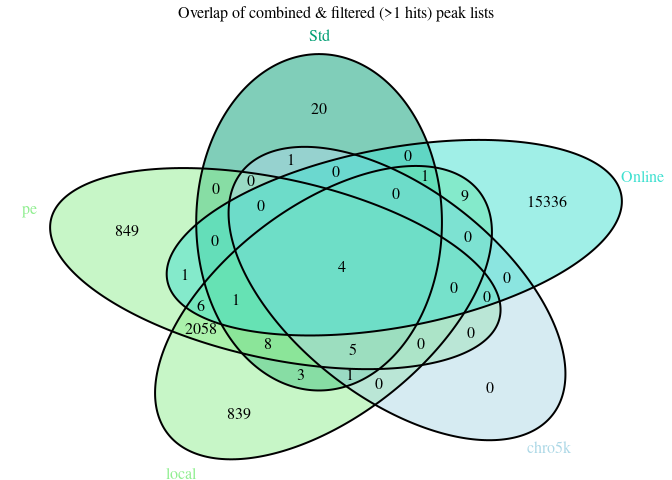

- [R Prepare System](#r-prepare-system)
  - [R update and load librarys](#r-update-and-load-librarys)
  - [R folders](#r-folders)
- [Unix Prepare System](#unix-prepare-system)
  - [Unix Update System](#unix-update-system)
  - [Unix Folder & Names](#unix-folder-names)
- [3 Results](#results)
  - [Generate combined peak list](#generate-combined-peak-list)
  - [Annotate Peaks](#annotate-peaks)

<!-- <style> -->
<!-- .vscroll-plot { -->
<!--     width: 1000px; -->
<!--     height: 1000px; -->
<!--     overflow-y: scroll; -->
<!--     overflow-x: scroll; -->
<!-- } -->
<!-- </style> -->
<!-- output: -->
<!--   html_document:  -->
<!--     toc: true -->
<!--     keep_md: true -->
<!--     self_contained: false -->
<!--     df_print: kable -->

# R Prepare System

## R update and load librarys

BiocManager::install(““)

``` r
# BiocManager::install(update = TRUE, ask = FALSE)

library(dbplyr)
library(tidyverse)
library(ChIPseeker)
library(rtracklayer)
library(trackViewer)
library(GenomicRanges)
library(IRanges)
library(ChIPpeakAnno)
library(AnnotationHub)
library(ggplot2)
library(viridis)
library(kableExtra)
library(DT)
library(patchwork)
library(gridExtra)

library(TxDb.Mmusculus.UCSC.mm39.knownGene)
txdb <- TxDb.Mmusculus.UCSC.mm39.knownGene
```

## R folders

# Unix Prepare System

## Unix Update System

## Unix Folder & Names

# 3 Results

<figure>
<embed src="../Data/sheme.pdf" style="width:100.0%" />
<figcaption aria-hidden="true">Analysis Overview</figcaption>
</figure>

<figure>

<figcaption aria-hidden="true">Analysis Overview</figcaption>
</figure>

``` r
knitr::include_graphics("https://github.com/DNAborn/ChIPseq_Wt1/blob/main/Results/sheme.png")
knitr::include_graphics("https://github.com/DNAborn/ChIPseq_Wt1/blob/main/Results/sheme.pdf")
# knitr::include_graphics("./sheme.png")
# knitr::include_graphics("./sheme.pdf")
# knitr::include_graphics("../sheme.png")
# knitr::include_graphics("../sheme.pdf")
# knitr::include_graphics("/mnt/s/AG/AG-Scholz-NGS/Daten/Simon/P3026_ChIP-Seq_epiSVF/ChIPseq_Wt1_P3026/Results/sheme.png")
# knitr::include_graphics("/mnt/s/AG/AG-Scholz-NGS/Daten/Simon/P3026_ChIP-Seq_epiSVF/ChIPseq_Wt1_P3026/Results/sheme.pdf")
getwd()
```

``` r
print("include figure in r chunk")
knitr::include_graphics("../Data/sheme.pdf") # doesn't show
```

### Generate combined peak list

#### Peak Tables

#### Hists & Tables


#### Overlap Peaks

<!-- -->

## Annotate Peaks

#### 1 Run

<!-- --><!-- -->

#### All peaks

#### Venns
