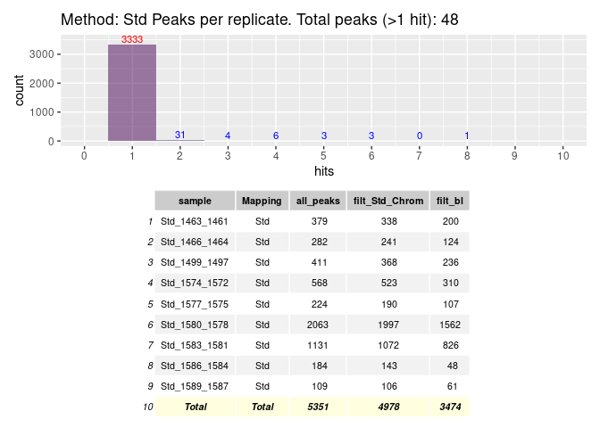
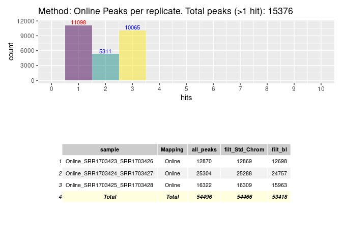

<!-- <style> -->
<!-- .vscroll-plot { -->
<!--     width: 1000px; -->
<!--     height: 1000px; -->
<!--     overflow-y: scroll; -->
<!--     overflow-x: scroll; -->
<!-- } -->
<!-- </style> -->


# R Prepare System
## R update and load librarys
BiocManager::install("")


```r
BiocManager::install(update = TRUE, ask = FALSE)
library(dbplyr)
library(tidyverse)
library(ChIPseeker)
library(rtracklayer)
library(trackViewer)
library(GenomicRanges)
library(IRanges)
library(ChIPpeakAnno)
library(AnnotationHub)
library(ggplot2)
library(viridis)
library(kableExtra)
library(DT)
library(patchwork)
library(gridExtra)

library(TxDb.Mmusculus.UCSC.mm39.knownGene)
txdb <- TxDb.Mmusculus.UCSC.mm39.knownGene
```


## R folders


# Unix Prepare System
## Unix Update System


## Unix Folder & Names


# 3 Results

{height=100%, width=100%}

{height=100%, width=100%}


```r

knitr::include_graphics("../Data/sheme.pdf")
knitr::include_graphics("./sheme.png")
knitr::include_graphics("./sheme.pdf")
knitr::include_graphics("../sheme.png")
knitr::include_graphics("../sheme.pdf")
knitr::include_graphics("/mnt/s/AG/AG-Scholz-NGS/Daten/Simon/P3026_ChIP-Seq_epiSVF/ChIPseq_Wt1_P3026/Results/sheme.png")
knitr::include_graphics("/mnt/s/AG/AG-Scholz-NGS/Daten/Simon/P3026_ChIP-Seq_epiSVF/ChIPseq_Wt1_P3026/Results/sheme.pdf")
getwd()
```


```r
print("include figure in r chunk")
knitr::include_graphics("../Data/sheme.pdf") # doesn't show
```


### Generate combined peak list


#### Peak Tables


#### Hists & Tables



#### Overlap Peaks
<!-- -->

## Annotate Peaks
#### 1 Run

```r
# Add Gene names
ah = AnnotationHub()
query(ah, c("EnsDb", "Musculus"))
edb <- ah[["AH113713"]]

# 1 Subfolder
i <- 1
all_npeaksAnno <- annotatePeak(npeak_combined_all[[i]], TxDb=txdb,tssRegion=c(-3000, 3000), verbose=TRUE)
  all_npeaksAnno_table <- as.data.frame(all_npeaksAnno)
  all_npeaksAnno_table$transcriptId2 <- sub("\\.\\d+$", "", all_npeaksAnno_table$transcriptId)
  all_npeaksAnno_table$geneId <- mapIds(edb, keys = all_npeaksAnno_table$transcriptId2, column = "GENEID", keytype = "TXID")
  all_npeaksAnno_table$symbol <- mapIds(edb, keys = all_npeaksAnno_table$transcriptId2, column = "SYMBOL", keytype = "TXID")
n <- names(npeak_combined_all[i])
all_npeaksAnno_table$annotation_short <-  str_split(all_npeaksAnno_table$annotation,pattern = " ", simplify = TRUE)[,1]

ggplot(all_npeaksAnno_table,aes(x=hits, fill=hits)) +
      stat_bin(alpha=0.6, position = 'identity', binwidth=1) + #
      stat_bin(position = 'identity', binwidth=1, geom="text", aes(label=after_stat(count)), vjust=-0.5, colour="blue") +
  ggtitle(n)
```

<!-- -->

```r
ggplot(all_npeaksAnno_table,aes(x=width, group=annotation_short, fill=annotation_short)) +
      stat_bin(alpha=0.5, position = 'identity', binwidth=100) + 
  # stat_bin(position = 'identity', binwidth=100, geom="text", aes(label=after_stat(count)), vjust=-0.5, colour="blue") +
  scale_fill_viridis_d() +
  ggtitle(paste("genetic region per peak size (",n,")",sep="")) # + coord_cartesian(xlim = c(0, 100), ylim=c(0,200))
```

<!-- -->

```r
ggsave(file=paste(pubfigdir,"Peaks_geneticregions_",n,".pdf",sep=""), width = 8, height = 8, device = "pdf")

ggplot(all_npeaksAnno_table,aes(x=width, group=hits, fill=hits)) +
      stat_bin(alpha=0.5, position = 'identity', binwidth=200) + 
  # stat_bin(position = 'identity', binwidth=100, geom="text", aes(label=after_stat(count)), vjust=-0.5, colour="blue") +
  scale_fill_viridis_c() +
  ggtitle(paste("hits per peak size")) # + coord_cartesian(xlim = c(0, 10000), ylim=c(0,50))
```

<!-- -->

```r
ggplot(all_npeaksAnno_table,aes(x=qValue, group=hits, fill=hits)) +
  stat_bin(alpha=0.5, position = 'identity') + 
  scale_fill_viridis_c() +
  ggtitle(paste("qvalue per hit")) # + coord_cartesian(xlim = c(0, 10000), ylim=c(0,50))
```

<!-- -->

```r
levels(factor(all_npeaksAnno_table$annotation_short))

head(all_npeaksAnno_table[order(all_npeaksAnno_table$width),])
viridis(8)

top_hits <- subset(all_npeaksAnno_table, distanceToTSS > -2000 & distanceToTSS < 2000)
dim(top_hits)
```

#### All peaks


#### Venns


