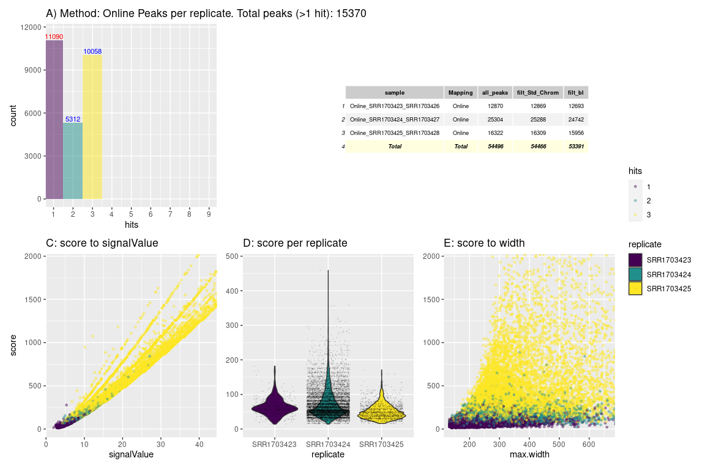
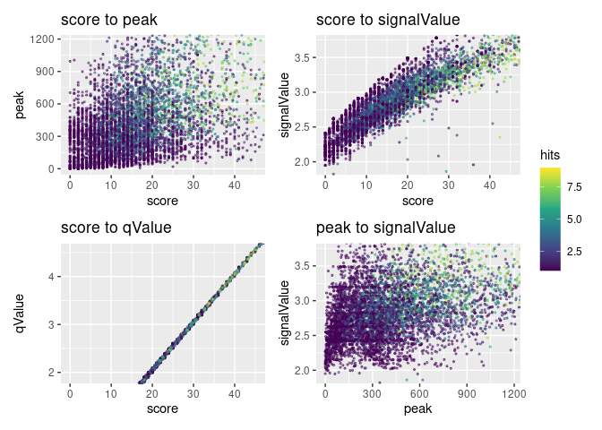

# R Prepare System

## R update and load librarys

BiocManager::install(““)

``` r
# BiocManager::install(update = TRUE, ask = FALSE)

library(dbplyr)
library(tidyverse)
library(ChIPseeker)
library(rtracklayer)
library(trackViewer)
library(GenomicRanges)
library(IRanges)
library(ChIPpeakAnno)
library(AnnotationHub)
library(ggplot2)
library(viridis)
library(kableExtra)
library(DT)
library(patchwork)
library(gridExtra)
library(foreach)
library(doParallel)
# library()

library(TxDb.Mmusculus.UCSC.mm39.knownGene)
txdb <- TxDb.Mmusculus.UCSC.mm39.knownGene
```

## R folders

# Unix Prepare System

## Unix Update System

## Unix Folder & Names

# 3 Results

<figure>
<embed src="../Data/sheme.pdf" style="width:100.0%" />
<figcaption aria-hidden="true">Analysis Overview</figcaption>
</figure>

<figure>

<figcaption aria-hidden="true">Analysis Overview</figcaption>
</figure>

``` r
knitr::include_graphics("https://github.com/DNAborn/ChIPseq_Wt1/blob/main/Results/sheme.png")
```

<!-- -->

``` r
knitr::include_graphics("https://github.com/DNAborn/ChIPseq_Wt1/blob/main/Results/sheme.pdf")
```

<!-- -->

``` r
# knitr::include_graphics("./sheme.png")
# knitr::include_graphics("./sheme.pdf")
# knitr::include_graphics("../sheme.png")
# knitr::include_graphics("../sheme.pdf")
# knitr::include_graphics("/mnt/s/AG/AG-Scholz-NGS/Daten/Simon/P3026_ChIP-Seq_epiSVF/ChIPseq_Wt1_P3026/Results/sheme.png")
# knitr::include_graphics("/mnt/s/AG/AG-Scholz-NGS/Daten/Simon/P3026_ChIP-Seq_epiSVF/ChIPseq_Wt1_P3026/Results/sheme.pdf")
getwd()
```

    ## [1] "/mnt/s/AG/AG-Scholz-NGS/Daten/Simon/P3026_ChIP-Seq_epiSVF/ChIPseq_Wt1_P3026/Results"

``` r
print("include figure in r chunk")
knitr::include_graphics("../Data/sheme.pdf") # doesn't show
```

### Generate combined peak list

#### Peak Tables

``` r
knitr::kable(npeak_numbers_table) %>% 
  kable_styling("striped", full_width = F) %>% 
 scroll_box(height = "400px")
# datatable(npeak_numbers_table)
knitr::kable(peaks_overlap)
# tibble::as.tibble(npeak_numbers_table)
# tibble::as.tibble(peaks_overlap)
print("hello")
```

#### Hists & Tables

<!-- --><!-- --><!-- --><!-- --><!-- -->

#### Venn Overlap Peaks

<!-- --><!-- -->

## Annotate Peaks

#### 1 Run

``` r
# Add Gene names
ah = AnnotationHub()
query(ah, c("EnsDb", "Musculus"))
```

    ## AnnotationHub with 81 records
    ## # snapshotDate(): 2023-10-23
    ## # $dataprovider: Ensembl
    ## # $species: Mus musculus, Balaenoptera musculus, Mus musculus musculus, Mus ...
    ## # $rdataclass: EnsDb
    ## # additional mcols(): taxonomyid, genome, description,
    ## #   coordinate_1_based, maintainer, rdatadateadded, preparerclass, tags,
    ## #   rdatapath, sourceurl, sourcetype 
    ## # retrieve records with, e.g., 'object[["AH53222"]]' 
    ## 
    ##              title                                        
    ##   AH53222  | Ensembl 87 EnsDb for Mus Musculus            
    ##   AH53726  | Ensembl 88 EnsDb for Mus Musculus            
    ##   AH56691  | Ensembl 89 EnsDb for Mus Musculus            
    ##   AH57770  | Ensembl 90 EnsDb for Mus Musculus            
    ##   AH60788  | Ensembl 91 EnsDb for Mus Musculus            
    ##   ...        ...                                          
    ##   AH116336 | Ensembl 111 EnsDb for Mus musculus           
    ##   AH116337 | Ensembl 111 EnsDb for Mus musculus           
    ##   AH116338 | Ensembl 111 EnsDb for Mus musculus musculus  
    ##   AH116339 | Ensembl 111 EnsDb for Mus musculus domesticus
    ##   AH116340 | Ensembl 111 EnsDb for Mus musculus

``` r
edb <- ah[["AH113713"]]

# 1 Subfolder

figures_annotated_peaks <- list()

i <- "pe"
all_npeaksAnno <- annotatePeak(npeak_combined_all[[i]], TxDb=txdb,tssRegion=c(-3000, 3000), verbose=TRUE)
```

    ## >> preparing features information...      2024-02-12 13:37:34 
    ## >> identifying nearest features...        2024-02-12 13:37:35 
    ## >> calculating distance from peak to TSS...   2024-02-12 13:37:35 
    ## >> assigning genomic annotation...        2024-02-12 13:37:35 
    ## >> assigning chromosome lengths           2024-02-12 13:37:48 
    ## >> done...                    2024-02-12 13:37:48

``` r
  all_npeaksAnno_table <- as.data.frame(all_npeaksAnno)
  all_npeaksAnno_table$transcriptId2 <- sub("\\.\\d+$", "", all_npeaksAnno_table$transcriptId)
  all_npeaksAnno_table$geneId <- mapIds(edb, keys = all_npeaksAnno_table$transcriptId2, column = "GENEID", keytype = "TXID")
  all_npeaksAnno_table$symbol <- mapIds(edb, keys = all_npeaksAnno_table$transcriptId2, column = "SYMBOL", keytype = "TXID")
n <- names(npeak_combined_all[i])
all_npeaksAnno_table$annotation_short <-  str_split(all_npeaksAnno_table$annotation,pattern = " ", simplify = TRUE)[,1]

# Annotated table
top_hits <- subset(all_npeaksAnno_table, distanceToTSS > -2000 & distanceToTSS < 2000) 
dim(top_hits)
```

    ## [1] 204  25

``` r
top_hits <- top_hits[order(top_hits$score, decreasing=T),]
knitr::kable(top_hits[c(0:50),c("symbol","annotation","distanceToTSS","peak","score","signalValue","qValue","hits")],format = "markdown")
```

|      | symbol        | annotation        | distanceToTSS |     peak |   score | signalValue | qValue | hits |
|:-----|:--------------|:------------------|--------------:|---------:|--------:|------------:|-------:|-----:|
| 4080 | Aoc1          | Promoter (\<=1kb) |             0 |  2904.29 | 4118.86 |       60.05 | 411.94 |    6 |
| 5552 | Pgk1          | Promoter (\<=1kb) |             0 |   213.00 | 2703.00 |       37.57 | 270.35 |    1 |
| 2534 | Gm32342       | Promoter (\<=1kb) |             0 |   413.50 | 1177.50 |       22.15 | 117.80 |    4 |
| 4079 | Aoc1          | Promoter (\<=1kb) |             0 |   297.00 |  705.00 |       17.60 |  70.54 |    1 |
| 5924 | Gm47283       | Promoter (1-2kb)  |         -1452 |  6224.00 |  583.67 |        6.48 |  58.42 |    8 |
| 2740 | Wt1           | Promoter (\<=1kb) |             0 |   564.67 |  531.67 |       14.01 |  53.24 |    6 |
| 2741 | Wt1           | Promoter (1-2kb)  |          1932 |   166.00 |  416.00 |       13.48 |  41.68 |    1 |
| 1749 | Npr3          | Promoter (\<=1kb) |             0 |  1017.25 |  313.00 |       10.79 |  31.33 |    4 |
| 3584 | Prdm16os      | Promoter (\<=1kb) |             0 |   975.00 |  288.50 |        9.22 |  28.90 |    2 |
| 5224 | 4921528I07Rik | Promoter (1-2kb)  |         -1737 |  3182.75 |  269.62 |        7.46 |  27.02 |    8 |
| 1854 | Gm23217       | Promoter (1-2kb)  |          1504 |  2491.88 |  174.62 |        5.81 |  17.51 |    8 |
| 1885 | Aqp2          | Promoter (\<=1kb) |            92 |    98.00 |  159.00 |        6.73 |  15.99 |    1 |
| 3299 | Gm50470       | Promoter (\<=1kb) |             0 |  8034.38 |  137.75 |        5.27 |  13.82 |    8 |
| 3296 | Gm3893        | Promoter (\<=1kb) |             0 |  1971.38 |  135.00 |        5.99 |  13.55 |    8 |
| 5925 | Gm47283       | Promoter (\<=1kb) |             0 |  2067.22 |  125.56 |        3.22 |  12.61 |    8 |
| 1877 | Smgc          | Promoter (\<=1kb) |             0 |  2703.25 |  117.38 |        5.67 |  11.80 |    8 |
| 4525 | Gm22909       | Promoter (\<=1kb) |             0 | 11248.28 |  116.52 |        5.26 |  11.71 |    8 |
| 4516 | Gm25988       | Promoter (\<=1kb) |             0 |  4274.27 |  110.73 |        5.43 |  11.12 |    8 |
| 1886 | Aqp5          | Promoter (\<=1kb) |           -41 |   434.75 |  105.25 |        5.49 |  10.56 |    4 |
| 1587 | Lrch1         | Promoter (1-2kb)  |          1311 |  1437.50 |   98.25 |        5.09 |   9.86 |    8 |
| 3300 | Gm52989       | Promoter (\<=1kb) |             0 |  1521.22 |   98.11 |        4.92 |   9.84 |    8 |
| 4518 | Gm22524       | Promoter (\<=1kb) |             0 |  1626.60 |   93.87 |        4.80 |   9.45 |    8 |
| 4521 | Gm25098       | Promoter (\<=1kb) |             0 |  1504.10 |   88.40 |        4.89 |   8.87 |    8 |
| 4508 | Gm26488       | Promoter (\<=1kb) |             0 |  1298.25 |   76.12 |        4.45 |   7.66 |    8 |
| 5793 | Gm20826       | Promoter (\<=1kb) |           978 |  1046.88 |   76.00 |        4.74 |   7.65 |    8 |
| 2441 | Gm36718       | Promoter (\<=1kb) |             0 |  1852.24 |   70.59 |        4.12 |   7.12 |    8 |
| 1515 | Gm3287        | Promoter (\<=1kb) |             0 |  2021.42 |   68.32 |        4.10 |   6.89 |    8 |
| 2082 | Brwd1         | Promoter (1-2kb)  |          1025 |  1668.00 |   67.00 |        4.68 |   6.77 |    1 |
| 5424 | Gm26125       | Promoter (\<=1kb) |             0 |  1561.12 |   66.50 |        4.37 |   6.70 |    8 |
| 2137 | Glo1          | Promoter (\<=1kb) |             0 |  1446.00 |   66.38 |        4.23 |   6.71 |    8 |
| 1952 | Fgf12         | Promoter (1-2kb)  |         -1365 |   914.12 |   63.00 |        4.20 |   6.34 |    8 |
| 4512 | Gm24528       | Promoter (\<=1kb) |             0 |  1950.56 |   60.11 |        4.00 |   6.07 |    8 |
| 454  | E330020D12Rik | Promoter (\<=1kb) |             0 |  1505.33 |   58.50 |        4.03 |   5.91 |    6 |
| 4509 | Gm24969       | Promoter (\<=1kb) |             0 |  1887.22 |   56.11 |        4.07 |   5.66 |    8 |
| 4176 | Vmn1r48       | Promoter (1-2kb)  |          1202 |   976.25 |   53.62 |        3.44 |   5.42 |    8 |
| 3424 | Ifnz          | Promoter (\<=1kb) |             0 |  2522.56 |   52.15 |        3.67 |   5.27 |    8 |
| 4513 | Gm24872       | Promoter (\<=1kb) |             0 |  1060.00 |   51.00 |        4.04 |   5.17 |    1 |
| 3538 | Cdca8         | Promoter (1-2kb)  |          1726 |   768.14 |   50.43 |        3.73 |   5.08 |    7 |
| 5233 | Snrk          | Promoter (1-2kb)  |         -1107 |  1053.00 |   49.00 |        4.65 |   4.98 |    1 |
| 3716 | Ppargc1a      | Promoter (\<=1kb) |             0 |   368.25 |   48.00 |        3.97 |   4.83 |    4 |
| 4407 | Arhgef1       | Promoter (1-2kb)  |          1428 |   378.33 |   45.33 |        4.07 |   4.60 |    3 |
| 5258 | H2al1b        | Promoter (\<=1kb) |             0 |  4255.92 |   45.16 |        3.94 |   4.56 |    8 |
| 4909 | Ap1m1         | Promoter (1-2kb)  |         -1069 |  1832.78 |   43.78 |        3.21 |   4.44 |    8 |
| 1889 | Itga5         | Promoter (\<=1kb) |           -65 |   428.00 |   43.00 |        3.91 |   4.34 |    1 |
| 1599 | Gm6999        | Promoter (\<=1kb) |          -787 |   459.33 |   42.33 |        3.29 |   4.29 |    3 |
| 1489 | 1700087M22Rik | Promoter (1-2kb)  |         -1619 |  1151.00 |   42.25 |        3.54 |   4.27 |    4 |
| 5234 | Gm35454       | Promoter (\<=1kb) |          -924 |   746.25 |   42.12 |        3.61 |   4.28 |    7 |
| 1336 | Gm26088       | Promoter (1-2kb)  |         -1722 |   670.00 |   41.00 |        4.36 |   4.20 |    1 |
| 4415 | Fcgbp         | Promoter (1-2kb)  |         -1581 |   617.80 |   40.60 |        3.60 |   4.13 |    5 |
| 5206 | Gm24641       | Promoter (\<=1kb) |           936 |   773.38 |   40.12 |        3.49 |   4.07 |    8 |

``` r
# extraCols_narrowPeak <- c(signalValue = "numeric", pValue = "numeric",
                          # qValue = "numeric", peak = "integer")

# 5th: "score" = int(-10*log10qvalue)
# 6th: "strand" = [empty]
# 7th: fold-change at peak summit
# 8th: "pValue" = -log10pvalue at peak summit
# 9th: "qValue" = -log10qvalue at peak summit
# 10th: "peak" = - relative summit position to peak start


hits_lim <- max(all_npeaksAnno_table$hits)
score_lim <- quantile(all_npeaksAnno_table$score, .90)
peak_lim <- quantile(all_npeaksAnno_table$peak, .90)
signalValue_lim <- quantile(all_npeaksAnno_table$signalValue, .90)
qValue_lim <- quantile(all_npeaksAnno_table$qValue, .90)


g1 <- ggplot(all_npeaksAnno_table,aes(x=score, y=peak, color=hits)) +
  # geom_violin(aes(fill=hits)) +
  geom_point(size=0.5, position ='jitter', alpha=0.5) +
  scale_color_viridis_c() +
  coord_cartesian(xlim=c(0,score_lim), ylim = c(0,peak_lim)) +
  ggtitle(paste("score to peak"))

g2 <- ggplot(all_npeaksAnno_table,aes(x=score, y=signalValue, color=hits)) +
  # geom_violin(aes(fill=hits)) +
  geom_point(size=0.5, position ='jitter', alpha=0.5) +
  scale_color_viridis_c() +
  coord_cartesian(xlim=c(0,score_lim), ylim = c(1.9,signalValue_lim)) +
  ggtitle(paste("score to signalValue"))

g3 <- ggplot(all_npeaksAnno_table,aes(x=score, y=qValue, color=hits)) +
  # geom_violin(aes(fill=hits)) +
  geom_point(size=0.5, position ='jitter', alpha=0.5) +
  scale_color_viridis_c() +
  coord_cartesian(xlim=c(0,score_lim), ylim = c(1.9,qValue_lim)) +
  ggtitle(paste("score to qValue"))


g4 <- ggplot(all_npeaksAnno_table,aes(x=peak, y=signalValue, color=hits)) +
  # geom_violin(aes(fill=hits)) +
  geom_point(size=0.5, position ='jitter', alpha=0.5) +
  scale_color_viridis_c() +
  coord_cartesian(xlim=c(0,peak_lim), ylim = c(1.9,signalValue_lim)) +
  ggtitle(paste("peak to signalValue"))

g1+g2+g3+g4+plot_layout(guides = "collect")
```

<!-- -->

``` r
head(all_npeaksAnno_table)
```

    ##   seqnames   start     end width strand
    ## 1     chr1 3263510 3264017   508      *
    ## 2     chr1 3377747 3378530   784      *
    ## 3     chr1 3916291 3916761   471      *
    ## 4     chr1 4053954 4058423  4470      *
    ## 5     chr1 4327318 4327933   616      *
    ## 6     chr1 4629910 4630575   666      *
    ##                                                                                                                                                                            name
    ## 1                                                                                                                                                       pe_1580_1578_all_peak_1
    ## 2                                                                                                                              pe_1586_1584_all_peak_1, pe_1583_1581_all_peak_1
    ## 3                                                                                                                                                       pe_1574_1572_all_peak_1
    ## 4 pe_1463_1461_all_peak_1, pe_1577_1575_all_peak_1, pe_1586_1584_all_peak_3, pe_1580_1578_all_peak_3, pe_1586_1584_all_peak_2, pe_1580_1578_all_peak_2, pe_1586_1584_all_peak_4
    ## 5                                                                                                                                                       pe_1499_1497_all_peak_1
    ## 6                                                                                                                              pe_1466_1464_all_peak_1, pe_1580_1578_all_peak_4
    ##   score signalValue pValue qValue   peak id hits
    ## 1  1.00        2.27   2.78   0.13  36.00  1    1
    ## 2 29.50        3.36   5.89   3.00 231.00  2    2
    ## 3 19.00        3.20   4.90   1.96 270.00  3    1
    ## 4 18.86        2.97   4.75   1.92 679.57  4    4
    ## 5 28.00        3.15   5.81   2.83 194.00  5    1
    ## 6 17.00        2.90   4.63   1.76 321.50  6    2
    ##                                                      annotation geneChr
    ## 1                                             Distal Intergenic       1
    ## 2           Intron (ENSMUST00000070533.5/497097, intron 2 of 2)       1
    ## 3                                             Distal Intergenic       1
    ## 4 Exon (ENSMUST00000194643.2/ENSMUST00000194643.2, exon 1 of 3)       1
    ## 5           Intron (ENSMUST00000208660.2/19888, intron 8 of 29)       1
    ## 6                                             Distal Intergenic       1
    ##   geneStart geneEnd geneLength geneStrand             geneId
    ## 1   3276746 3285855       9110          2 ENSMUSG00000051951
    ## 2   3276124 3286567      10444          2 ENSMUSG00000051951
    ## 3   3284705 3741721     457017          2 ENSMUSG00000051951
    ## 4   3284705 3741721     457017          2 ENSMUSG00000051951
    ## 5   4414369 4430537      16169          2 ENSMUSG00000025900
    ## 6   4599240 4599346        107          1 ENSMUSG00000118917
    ##           transcriptId distanceToTSS      transcriptId2  symbol
    ## 1 ENSMUST00000159265.2         21838 ENSMUST00000159265    Xkr4
    ## 2 ENSMUST00000162897.2        -91180 ENSMUST00000162897    Xkr4
    ## 3 ENSMUST00000070533.5       -174570 ENSMUST00000070533    Xkr4
    ## 4 ENSMUST00000070533.5       -312233 ENSMUST00000070533    Xkr4
    ## 5 ENSMUST00000027032.6        102604 ENSMUST00000027032     Rp1
    ## 6 ENSMUST00000240255.1         30670 ENSMUST00000240255 Gm22307
    ##   annotation_short
    ## 1           Distal
    ## 2           Intron
    ## 3           Distal
    ## 4             Exon
    ## 5           Intron
    ## 6           Distal

``` r
ggplot(all_npeaksAnno_table,aes(x=distanceToTSS, y=score, color=hits)) +
  geom_point(size=1, alpha=0.5, position = "jitter") +
  scale_color_viridis_c() +
  coord_cartesian(ylim=c(0,score_lim)) +
  ggtitle(paste("scores to signalValue"))
```

<!-- -->

``` r
# xlim=c(-10000,10000)

top_hits_list <- list()

for (i in 1:length(npeak_combined_all)){
all_npeaksAnno <- annotatePeak(npeak_combined_all[[i]], TxDb=txdb,tssRegion=c(-3000, 3000), verbose=TRUE)
  all_npeaksAnno_table <- as.data.frame(all_npeaksAnno)
  all_npeaksAnno_table$transcriptId2 <- sub("\\.\\d+$", "", all_npeaksAnno_table$transcriptId)
  all_npeaksAnno_table$geneId <- mapIds(edb, keys = all_npeaksAnno_table$transcriptId2, column = "GENEID", keytype = "TXID")
  all_npeaksAnno_table$symbol <- mapIds(edb, keys = all_npeaksAnno_table$transcriptId2, column = "SYMBOL", keytype = "TXID")
n <- names(npeak_combined_all[i])
all_npeaksAnno_table$annotation_short <-  str_split(all_npeaksAnno_table$annotation,pattern = " ", simplify = TRUE)[,1]

g1 <- ggplot(all_npeaksAnno_table,aes(x=hits)) + # fill = cut(hits, 100)
      stat_bin(alpha=0.6, position = 'identity', binwidth=1) + 
      scale_fill_viridis_d() +
      stat_bin(position = 'identity', binwidth=1, geom="text", aes(label=after_stat(count)), vjust=-0.5, colour="blue") +
      ggtitle("peaks in replicates")

g2a <- ggplot(all_npeaksAnno_table,aes(x=score, group=annotation_short, fill=annotation_short)) +
      stat_bin(alpha=0.5, position = 'identity', binwidth=5) + 
  # stat_bin(position = 'identity', binwidth=100, geom="text", aes(label=after_stat(count)), vjust=-0.5, colour="blue") +
  scale_fill_viridis_d() +
  ggtitle(paste("genetic region per score (",n,")",sep="")) + coord_cartesian(xlim = c(0, 100))
g2b <- ggplot(all_npeaksAnno_table,aes(x=signalValue, group=annotation_short, fill=annotation_short)) +
      stat_bin(alpha=0.5, position = 'identity', binwidth=1) + 
  # stat_bin(position = 'identity', binwidth=100, geom="text", aes(label=after_stat(count)), vjust=-0.5, colour="blue") +
  scale_fill_viridis_d() +
  ggtitle(paste("genetic region per signalValue (",n,")",sep="")) + coord_cartesian(xlim = c(0, 15))

g3 <- ggplot(all_npeaksAnno_table,aes(x=width, group=hits, fill=hits)) +
      stat_bin(alpha=0.5, position = 'identity', binwidth=200) + 
  # stat_bin(position = 'identity', binwidth=100, geom="text", aes(label=after_stat(count)), vjust=-0.5, colour="blue") +
  scale_fill_viridis_c() +
  ggtitle(paste("hits per peak size")) + coord_cartesian(xlim = c(0, 10000))

all_npeaksAnno_table$hits <- as.factor(all_npeaksAnno_table$hits)

# g4 <- ggplot(all_npeaksAnno_table,aes(x=hits, y=qValue)) +
#   geom_violin(aes(fill=hits)) +
#   scale_fill_viridis_d() +
#   geom_point(size=0.05, position ='jitter', alpha=0.2,color="grey40") +
#   coord_cartesian(ylim=c(0,50))

g4 <- ggplot(all_npeaksAnno_table,aes(x=hits, y=score)) +
  geom_violin(aes(fill=hits, color=hits)) +
  scale_fill_viridis_d() +
  geom_point(size=0.05, position ='jitter', alpha=0.2,color="grey40") +
  coord_cartesian(ylim=c(0,1000)) +
  ggtitle(paste("scores per hit"))

levels(factor(all_npeaksAnno_table$annotation_short))

g5 <- ggplot(all_npeaksAnno_table,aes(x=score, y=qValue, color=signalValue)) +
  # geom_violin(aes(fill=hits)) +
  geom_point(size=0.5, position ='jitter', alpha=0.5) +
  scale_color_viridis_c(limits = c(0, 15)) +
  coord_cartesian(ylim=c(0,50), xlim = c(0,500)) +
  ggtitle(paste("score to qvalue"))

g6 <- ggplot(all_npeaksAnno_table,aes(x=score, y=signalValue, color=pValue)) +
  # geom_violin(aes(fill=hits)) +
  geom_point(size=1, alpha=0.5) +
  scale_color_viridis_c(option = "D", direction = -1, limits = c(0, 100)) +
  coord_cartesian(ylim=c(0,15), xlim = c(0,1000))+
  ggtitle(paste("scores to signalValue"))

# datatable(head(all_npeaksAnno_table[order(all_npeaksAnno_table$width),]))
viridis(8)

top_hits <- subset(all_npeaksAnno_table, distanceToTSS > -2000 & distanceToTSS < 2000) 
dim(top_hits)
top_hits <- top_hits[order(top_hits$score, decreasing=T),]
top_hits_list[[n]] <- top_hits

figures_annotated_peaks[[n]] <- g1+g2a+g3+g4+g5+g6+plot_layout(nrow = 2, ncol = 3, axis_titles = "collect") + plot_annotation(title = paste("Method:",n))
}
```

    ## >> preparing features information...      2024-02-12 13:37:49 
    ## >> identifying nearest features...        2024-02-12 13:37:49 
    ## >> calculating distance from peak to TSS...   2024-02-12 13:37:49 
    ## >> assigning genomic annotation...        2024-02-12 13:37:49 
    ## >> assigning chromosome lengths           2024-02-12 13:37:51 
    ## >> done...                    2024-02-12 13:37:51 
    ## >> preparing features information...      2024-02-12 13:37:51 
    ## >> identifying nearest features...        2024-02-12 13:37:51 
    ## >> calculating distance from peak to TSS...   2024-02-12 13:37:51 
    ## >> assigning genomic annotation...        2024-02-12 13:37:51 
    ## >> assigning chromosome lengths           2024-02-12 13:37:53 
    ## >> done...                    2024-02-12 13:37:53 
    ## >> preparing features information...      2024-02-12 13:37:53 
    ## >> identifying nearest features...        2024-02-12 13:37:53 
    ## >> calculating distance from peak to TSS...   2024-02-12 13:37:53 
    ## >> assigning genomic annotation...        2024-02-12 13:37:53 
    ## >> assigning chromosome lengths           2024-02-12 13:37:55 
    ## >> done...                    2024-02-12 13:37:55 
    ## >> preparing features information...      2024-02-12 13:37:55 
    ## >> identifying nearest features...        2024-02-12 13:37:55 
    ## >> calculating distance from peak to TSS...   2024-02-12 13:37:55 
    ## >> assigning genomic annotation...        2024-02-12 13:37:55 
    ## >> assigning chromosome lengths           2024-02-12 13:37:57 
    ## >> done...                    2024-02-12 13:37:57 
    ## >> preparing features information...      2024-02-12 13:37:57 
    ## >> identifying nearest features...        2024-02-12 13:37:57 
    ## >> calculating distance from peak to TSS...   2024-02-12 13:37:57 
    ## >> assigning genomic annotation...        2024-02-12 13:37:57 
    ## >> assigning chromosome lengths           2024-02-12 13:37:59 
    ## >> done...                    2024-02-12 13:37:59

``` r
options(kableExtra.auto_format = FALSE)
knitr::kable(top_hits[c(0:50),c("symbol","distanceToTSS","hits","score","signalValue","qValue")],format = "markdown")
```

|       | symbol        | distanceToTSS | hits |   score | signalValue | qValue |
|:------|:--------------|--------------:|:-----|--------:|------------:|-------:|
| 2916  | Nab2          |             0 | 3    | 2945.00 |       64.20 | 294.56 |
| 25750 | Plxnb1        |             0 | 3    | 2735.67 |       60.92 | 273.62 |
| 25582 | Amotl2        |             0 | 3    | 2590.00 |       67.55 | 259.02 |
| 295   | Nab1          |             0 | 3    | 2448.67 |       65.39 | 244.92 |
| 7527  | Gm34934       |             0 | 3    | 2250.67 |       57.14 | 225.13 |
| 7473  | Bmpr1a        |             0 | 3    | 2223.00 |       52.27 | 222.37 |
| 12980 | Neurl1a       |             0 | 3    | 2214.33 |       60.62 | 221.48 |
| 1124  | 1700025G04Rik |             0 | 3    | 2196.00 |       60.96 | 219.66 |
| 25138 | Smad3         |             0 | 3    | 2171.67 |       59.41 | 217.23 |
| 13717 | Gtdc1         |             0 | 3    | 2126.67 |       53.33 | 212.70 |
| 14398 | Secisbp2l     |             0 | 3    | 2113.67 |       52.35 | 211.40 |
| 7972  | Akap11        |             0 | 3    | 2099.00 |       54.49 | 209.95 |
| 4700  | Mrc2          |             0 | 3    | 2020.00 |       54.80 | 202.05 |
| 17727 | Gm12974       |         -1923 | 3    | 2017.00 |       48.00 | 201.74 |
| 18518 | Fosl2         |             0 | 3    | 1960.40 |       52.20 | 196.10 |
| 10637 | Pbx2          |             0 | 3    | 1950.33 |       43.08 | 195.09 |
| 25022 | Nptn          |             0 | 3    | 1931.00 |       47.34 | 193.12 |
| 7509  | Fermt2        |             0 | 3    | 1926.67 |       53.23 | 192.72 |
| 18177 | Phf13         |             0 | 3    | 1926.33 |       51.42 | 192.66 |
| 10306 | Nthl1         |           588 | 3    | 1893.33 |       53.95 | 189.39 |
| 2917  | Nab2          |            27 | 3    | 1887.67 |       46.06 | 188.84 |
| 18256 | Faap20        |             0 | 3    | 1887.33 |       47.96 | 188.79 |
| 12893 | Gm28578       |          -318 | 3    | 1886.33 |       46.69 | 188.67 |
| 8138  | BC037032      |             0 | 3    | 1876.00 |       48.44 | 187.68 |
| 19950 | Pomp          |             0 | 3    | 1860.33 |       46.51 | 186.10 |
| 15542 | Shox2         |             0 | 3    | 1850.67 |       50.98 | 185.10 |
| 15010 | Pard6b        |             0 | 3    | 1846.33 |       44.95 | 184.69 |
| 2161  | Sirt1         |             0 | 3    | 1832.00 |       47.49 | 183.26 |
| 13402 | Rxra          |             0 | 3    | 1824.33 |       47.28 | 182.48 |
| 19258 | Srsf9         |             0 | 3    | 1819.67 |       51.25 | 182.05 |
| 3988  | Lyrm9         |           931 | 3    | 1816.33 |       50.46 | 181.72 |
| 17366 | Slc2a1        |             0 | 3    | 1794.67 |       47.70 | 179.51 |
| 6289  | 2610307P16Rik |           -75 | 3    | 1769.67 |       45.99 | 177.04 |
| 16487 | Pip4p2        |             0 | 3    | 1763.00 |       45.78 | 176.34 |
| 12227 | Tshz1         |             0 | 3    | 1762.33 |       45.00 | 176.31 |
| 7654  | 2410022M11Rik |             0 | 3    | 1741.33 |       46.31 | 174.19 |
| 330   | Hspd1         |             0 | 3    | 1737.00 |       45.15 | 173.77 |
| 1461  | H3f3a         |             0 | 3    | 1725.33 |       48.35 | 172.57 |
| 15418 | Maml3         |          1504 | 3    | 1712.00 |       44.86 | 171.23 |
| 21920 | Dbp           |             0 | 3    | 1707.33 |       48.57 | 170.76 |
| 4390  | Arhgap23      |          1407 | 3    | 1695.00 |       46.89 | 169.53 |
| 7820  | Dock5         |             0 | 3    | 1689.67 |       43.95 | 169.01 |
| 20290 | Casp2         |             0 | 3    | 1681.33 |       45.82 | 168.17 |
| 24659 | Arhgap32      |         -1053 | 3    | 1680.00 |       42.18 | 168.06 |
| 13833 | Rbms1         |             0 | 3    | 1677.33 |       45.54 | 167.81 |
| 7656  | Zmym2         |             0 | 3    | 1675.33 |       42.57 | 167.57 |
| 3791  | Mink1         |          -648 | 3    | 1668.67 |       43.03 | 166.90 |
| 9565  | Hes1          |             0 | 3    | 1648.33 |       45.71 | 164.88 |
| 12485 | Gm30042       |          -501 | 3    | 1641.00 |       47.38 | 164.16 |
| 15420 | Maml3         |             0 | 3    | 1639.33 |       43.85 | 163.97 |

``` r
knitr::kable(top_hits[c(0:50),])
```

|       | seqnames |     start |       end | width | strand | name                                                                                                                                                                                                                          |   score | signalValue | pValue | qValue |    peak |    id | hits | annotation        | geneChr | geneStart |   geneEnd | geneLength | geneStrand | geneId             | transcriptId          | distanceToTSS | transcriptId2      | symbol        | annotation_short |
|:------|:---------|----------:|----------:|------:|:-------|:------------------------------------------------------------------------------------------------------------------------------------------------------------------------------------------------------------------------------|--------:|------------:|-------:|-------:|--------:|------:|:-----|:------------------|--------:|----------:|----------:|-----------:|-----------:|:-------------------|:----------------------|--------------:|:-------------------|:--------------|:-----------------|
| 2916  | chr10    | 127502110 | 127503094 |   985 | \*     | Online_SRR1703425_SRR1703428_all_peak_1765, Online_SRR1703424_SRR1703427_all_peak_2727, Online_SRR1703423_SRR1703426_all_peak_1453                                                                                            | 2945.00 |       64.20 | 302.20 | 294.56 |  329.67 |  2916 | 3    | Promoter (\<=1kb) |      10 | 127496787 | 127502579 |       5793 |          2 | ENSMUSG00000025402 | ENSMUST00000026469.9  |             0 | ENSMUST00000026469 | Nab2          | Promoter         |
| 25750 | chr9     | 108925573 | 108926508 |   936 | \*     | Online_SRR1703424_SRR1703427_all_peak_24590, Online_SRR1703425_SRR1703428_all_peak_15857, Online_SRR1703423_SRR1703426_all_peak_12543                                                                                         | 2735.67 |       60.92 | 281.24 | 273.62 |  383.67 | 25750 | 3    | Promoter (\<=1kb) |       9 | 108925778 | 108929566 |       3789 |          1 | ENSMUSG00000053646 | ENSMUST00000130366.2  |             0 | ENSMUST00000130366 | Plxnb1        | Promoter         |
| 25582 | chr9     | 102594634 | 102595068 |   435 | \*     | Online_SRR1703424_SRR1703427_all_peak_24426, Online_SRR1703425_SRR1703428_all_peak_15758, Online_SRR1703423_SRR1703426_all_peak_12458                                                                                         | 2590.00 |       67.55 | 265.98 | 259.02 |  208.33 | 25582 | 3    | Promoter (\<=1kb) |       9 | 102594867 | 102610617 |      15751 |          1 | ENSMUSG00000032531 | ENSMUST00000035121.14 |             0 | ENSMUST00000035121 | Amotl2        | Promoter         |
| 295   | chr1     |  52539059 |  52540178 |  1120 | \*     | Online_SRR1703424_SRR1703427_all_peak_265, Online_SRR1703425_SRR1703428_all_peak_181, Online_SRR1703423_SRR1703426_all_peak_145                                                                                               | 2448.67 |       65.39 | 251.40 | 244.92 |  452.33 |   295 | 3    | Promoter (\<=1kb) |       1 |  52496453 |  52539459 |      43007 |          2 | ENSMUSG00000002881 | ENSMUST00000186764.7  |             0 | ENSMUST00000186764 | Nab1          | Promoter         |
| 7527  | chr14    |  47119887 |  47120528 |   642 | \*     | Online_SRR1703424_SRR1703427_all_peak_7151, Online_SRR1703425_SRR1703428_all_peak_4626, Online_SRR1703423_SRR1703426_all_peak_3699                                                                                            | 2250.67 |       57.14 | 231.46 | 225.13 |  288.00 |  7527 | 3    | Promoter (\<=1kb) |      14 |  47104033 |  47120214 |      16182 |          2 | ENSMUSG00000115100 | ENSMUST00000228370.2  |             0 | ENSMUST00000228370 | Gm34934       | Promoter         |
| 7473  | chr14    |  34224084 |  34224927 |   844 | \*     | Online_SRR1703424_SRR1703427_all_peak_7101, Online_SRR1703425_SRR1703428_all_peak_4591, Online_SRR1703423_SRR1703426_all_peak_3671                                                                                            | 2223.00 |       52.27 | 228.64 | 222.37 |  372.67 |  7473 | 3    | Promoter (\<=1kb) |      14 |  34132691 |  34224644 |      91954 |          2 | ENSMUSG00000021796 | ENSMUST00000049005.15 |             0 | ENSMUST00000049005 | Bmpr1a        | Promoter         |
| 12980 | chr19    |  47217064 |  47217694 |   631 | \*     | Online_SRR1703424_SRR1703427_all_peak_12397, Online_SRR1703425_SRR1703428_all_peak_8080, Online_SRR1703423_SRR1703426_all_peak_6420                                                                                           | 2214.33 |       60.62 | 227.76 | 221.48 |  201.00 | 12980 | 3    | Promoter (\<=1kb) |      19 |  47217350 |  47247874 |      30525 |          1 | ENSMUSG00000006435 | ENSMUST00000111807.5  |             0 | ENSMUST00000111807 | Neurl1a       | Promoter         |
| 1124  | chr1     | 151965305 | 151966460 |  1156 | \*     | Online_SRR1703424_SRR1703427_all_peak_1031, Online_SRR1703425_SRR1703428_all_peak_681, Online_SRR1703423_SRR1703426_all_peak_551                                                                                              | 2196.00 |       60.96 | 225.90 | 219.66 |  628.00 |  1124 | 3    | Promoter (\<=1kb) |       1 | 151728154 | 151965721 |     237568 |          2 | ENSMUSG00000032666 | ENSMUST00000187603.7  |             0 | ENSMUST00000187603 | 1700025G04Rik | Promoter         |
| 25138 | chr9     |  63665029 |  63666021 |   993 | \*     | Online_SRR1703424_SRR1703427_all_peak_24007, Online_SRR1703425_SRR1703428_all_peak_15480, Online_SRR1703423_SRR1703426_all_peak_12237                                                                                         | 2171.67 |       59.41 | 223.49 | 217.23 |  398.00 | 25138 | 3    | Promoter (\<=1kb) |       9 |  63554049 |  63665276 |     111228 |          2 | ENSMUSG00000032402 | ENSMUST00000034973.10 |             0 | ENSMUST00000034973 | Smad3         | Promoter         |
| 13717 | chr2     |  44816806 |  44817577 |   772 | \*     | Online_SRR1703424_SRR1703427_all_peak_13102, Online_SRR1703425_SRR1703428_all_peak_8547, Online_SRR1703423_SRR1703426_all_peak_6768                                                                                           | 2126.67 |       53.33 | 218.90 | 212.70 |  298.33 | 13717 | 3    | Promoter (\<=1kb) |       2 |  44465490 |  44817173 |     351684 |          2 | ENSMUSG00000036890 | ENSMUST00000130991.8  |             0 | ENSMUST00000130991 | Gtdc1         | Promoter         |
| 14398 | chr2     | 125624225 | 125624987 |   763 | \*     | Online_SRR1703424_SRR1703427_all_peak_13761, Online_SRR1703425_SRR1703428_all_peak_8969, Online_SRR1703423_SRR1703426_all_peak_7112                                                                                           | 2113.67 |       52.35 | 217.58 | 211.40 |  376.00 | 14398 | 3    | Promoter (\<=1kb) |       2 | 125578906 | 125624790 |      45885 |          2 | ENSMUSG00000035093 | ENSMUST00000053699.13 |             0 | ENSMUST00000053699 | Secisbp2l     | Promoter         |
| 7972  | chr14    |  78773837 |  78774555 |   719 | \*     | Online_SRR1703424_SRR1703427_all_peak_7570, Online_SRR1703425_SRR1703428_all_peak_4905, Online_SRR1703423_SRR1703426_all_peak_3922                                                                                            | 2099.00 |       54.49 | 216.05 | 209.95 |  322.67 |  7972 | 3    | Promoter (\<=1kb) |      14 |  78729686 |  78774248 |      44563 |          2 | ENSMUSG00000022016 | ENSMUST00000123853.9  |             0 | ENSMUST00000123853 | Akap11        | Promoter         |
| 4700  | chr11    | 105183078 | 105184191 |  1114 | \*     | Online_SRR1703424_SRR1703427_all_peak_4431, Online_SRR1703425_SRR1703428_all_peak_2897, Online_SRR1703423_SRR1703426_all_peak_2329, Online_SRR1703423_SRR1703426_all_peak_2330                                                | 2020.00 |       54.80 | 208.34 | 202.05 |  290.75 |  4700 | 3    | Promoter (\<=1kb) |      11 | 105183469 | 105217717 |      34249 |          1 | ENSMUSG00000020695 | ENSMUST00000126931.2  |             0 | ENSMUST00000126931 | Mrc2          | Promoter         |
| 17727 | chr4     | 133540443 | 133541808 |  1366 | \*     | Online_SRR1703424_SRR1703427_all_peak_16946, Online_SRR1703425_SRR1703428_all_peak_11004, Online_SRR1703423_SRR1703426_all_peak_8751                                                                                          | 2017.00 |       48.00 | 207.90 | 201.74 |  278.33 | 17727 | 3    | Promoter (1-2kb)  |       4 | 133543731 | 133544925 |       1195 |          1 | ENSMUSG00000084789 | ENSMUST00000129875.2  |         -1923 | ENSMUST00000129875 | Gm12974       | Promoter         |
| 18518 | chr5     |  32292247 |  32294270 |  2024 | \*     | Online_SRR1703424_SRR1703427_all_peak_17690, Online_SRR1703425_SRR1703428_all_peak_11455, Online_SRR1703425_SRR1703428_all_peak_11456, Online_SRR1703423_SRR1703426_all_peak_9112, Online_SRR1703423_SRR1703426_all_peak_9111 | 1960.40 |       52.20 | 202.30 | 196.10 |  456.20 | 18518 | 3    | Promoter (\<=1kb) |       5 |  32293145 |  32315186 |      22042 |          1 | ENSMUSG00000029135 | ENSMUST00000031017.11 |             0 | ENSMUST00000031017 | Fosl2         | Promoter         |
| 10637 | chr17    |  34810443 |  34811687 |  1245 | \*     | Online_SRR1703424_SRR1703427_all_peak_10163, Online_SRR1703425_SRR1703428_all_peak_6618, Online_SRR1703423_SRR1703426_all_peak_5260                                                                                           | 1950.33 |       43.08 | 200.99 | 195.09 |  696.67 | 10637 | 3    | Promoter (\<=1kb) |      17 |  34811237 |  34816374 |       5138 |          1 | ENSMUSG00000034673 | ENSMUST00000038149.13 |             0 | ENSMUST00000038149 | Pbx2          | Promoter         |
| 25022 | chr9     |  58489272 |  58490283 |  1012 | \*     | Online_SRR1703424_SRR1703427_all_peak_23896, Online_SRR1703425_SRR1703428_all_peak_15401, Online_SRR1703423_SRR1703426_all_peak_12179                                                                                         | 1931.00 |       47.34 | 198.93 | 193.12 |  253.00 | 25022 | 3    | Promoter (\<=1kb) |       9 |  58489523 |  58558601 |      69079 |          1 | ENSMUSG00000032336 | ENSMUST00000177292.8  |             0 | ENSMUST00000177292 | Nptn          | Promoter         |
| 7509  | chr14    |  45766874 |  45767933 |  1060 | \*     | Online_SRR1703424_SRR1703427_all_peak_7136, Online_SRR1703425_SRR1703428_all_peak_4616, Online_SRR1703423_SRR1703426_all_peak_3691                                                                                            | 1926.67 |       53.23 | 198.58 | 192.72 |  662.00 |  7509 | 3    | Promoter (\<=1kb) |      14 |  45696252 |  45767575 |      71324 |          2 | ENSMUSG00000037712 | ENSMUST00000045905.15 |             0 | ENSMUST00000045905 | Fermt2        | Promoter         |
| 18177 | chr4     | 152080618 | 152081272 |   655 | \*     | Online_SRR1703424_SRR1703427_all_peak_17363, Online_SRR1703425_SRR1703428_all_peak_11263, Online_SRR1703423_SRR1703426_all_peak_8952                                                                                          | 1926.33 |       51.42 | 198.64 | 192.66 |  279.00 | 18177 | 3    | Promoter (\<=1kb) |       4 | 152074090 | 152080715 |       6626 |          2 | ENSMUSG00000047777 | ENSMUST00000055688.10 |             0 | ENSMUST00000055688 | Phf13         | Promoter         |
| 10306 | chr17    |  24857738 |  24858244 |   507 | \*     | Online_SRR1703424_SRR1703427_all_peak_9843, Online_SRR1703425_SRR1703428_all_peak_6433, Online_SRR1703423_SRR1703426_all_peak_5117                                                                                            | 1893.33 |       53.95 | 195.26 | 189.39 |  167.00 | 10306 | 3    | Promoter (\<=1kb) |      17 |  24857150 |  24857810 |        661 |          1 | ENSMUSG00000041429 | ENSMUST00000234888.2  |           588 | ENSMUST00000234888 | Nthl1         | Promoter         |
| 2917  | chr10    | 127503304 | 127504410 |  1107 | \*     | Online_SRR1703424_SRR1703427_all_peak_2728, Online_SRR1703425_SRR1703428_all_peak_1766, Online_SRR1703423_SRR1703426_all_peak_1454                                                                                            | 1887.67 |       46.06 | 194.68 | 188.84 |  230.00 |  2917 | 3    | Promoter (\<=1kb) |      10 | 127500853 | 127504437 |       3585 |          2 | ENSMUSG00000025402 | ENSMUST00000129252.2  |            27 | ENSMUST00000129252 | Nab2          | Promoter         |
| 18256 | chr4     | 155334304 | 155334941 |   638 | \*     | Online_SRR1703424_SRR1703427_all_peak_17441, Online_SRR1703425_SRR1703428_all_peak_11308, Online_SRR1703423_SRR1703426_all_peak_8993                                                                                          | 1887.33 |       47.96 | 194.69 | 188.79 |  190.67 | 18256 | 3    | Promoter (\<=1kb) |       4 | 155334318 | 155335409 |       1092 |          1 | ENSMUSG00000073684 | ENSMUST00000126713.2  |             0 | ENSMUST00000126713 | Faap20        | Promoter         |
| 12893 | chr19    |  45292940 |  45293380 |   441 | \*     | Online_SRR1703424_SRR1703427_all_peak_12312, Online_SRR1703425_SRR1703428_all_peak_8029, Online_SRR1703423_SRR1703426_all_peak_6366                                                                                           | 1886.33 |       46.69 | 194.61 | 188.67 |  213.33 | 12893 | 3    | Promoter (\<=1kb) |      19 |  45288894 |  45292622 |       3729 |          2 | ENSMUSG00000100417 | ENSMUST00000238044.2  |          -318 | ENSMUST00000238044 | Gm28578       | Promoter         |
| 8138  | chr15    |   4056628 |   4057101 |   474 | \*     | Online_SRR1703424_SRR1703427_all_peak_7725, Online_SRR1703425_SRR1703428_all_peak_5009, Online_SRR1703423_SRR1703426_all_peak_4000                                                                                            | 1876.00 |       48.44 | 193.54 | 187.68 |  234.00 |  8138 | 3    | Promoter (\<=1kb) |      15 |   4051168 |   4056875 |       5708 |          2 | ENSMUSG00000087221 | ENSMUST00000155191.2  |             0 | ENSMUST00000155191 | BC037032      | Promoter         |
| 19950 | chr5     | 147797130 | 147797518 |   389 | \*     | Online_SRR1703424_SRR1703427_all_peak_19036, Online_SRR1703425_SRR1703428_all_peak_12320, Online_SRR1703423_SRR1703426_all_peak_9778                                                                                          | 1860.33 |       46.51 | 191.95 | 186.10 |  192.67 | 19950 | 3    | Promoter (\<=1kb) |       5 | 147797271 | 147813266 |      15996 |          1 | ENSMUSG00000029649 | ENSMUST00000031654.10 |             0 | ENSMUST00000031654 | Pomp          | Promoter         |
| 15542 | chr3     |  66888324 |  66888919 |   596 | \*     | Online_SRR1703424_SRR1703427_all_peak_14851, Online_SRR1703425_SRR1703428_all_peak_9653, Online_SRR1703423_SRR1703426_all_peak_7654                                                                                           | 1850.67 |       50.98 | 190.78 | 185.10 |  253.33 | 15542 | 3    | Promoter (\<=1kb) |       3 |  66879060 |  66888651 |       9592 |          2 | ENSMUSG00000027833 | ENSMUST00000162098.9  |             0 | ENSMUST00000162098 | Shox2         | Promoter         |
| 15010 | chr2     | 167922532 | 167923273 |   742 | \*     | Online_SRR1703424_SRR1703427_all_peak_14345, Online_SRR1703425_SRR1703428_all_peak_9349, Online_SRR1703423_SRR1703426_all_peak_7400                                                                                           | 1846.33 |       44.95 | 190.36 | 184.69 |  258.00 | 15010 | 3    | Promoter (\<=1kb) |       2 | 167922924 | 167943123 |      20200 |          1 | ENSMUSG00000044641 | ENSMUST00000052125.7  |             0 | ENSMUST00000052125 | Pard6b        | Promoter         |
| 2161  | chr10    |  63174390 |  63175158 |   769 | \*     | Online_SRR1703424_SRR1703427_all_peak_2013, Online_SRR1703425_SRR1703428_all_peak_1330, Online_SRR1703423_SRR1703426_all_peak_1084                                                                                            | 1832.00 |       47.49 | 189.06 | 183.26 |  279.33 |  2161 | 3    | Promoter (\<=1kb) |      10 |  63154786 |  63174811 |      20026 |          2 | ENSMUSG00000020063 | ENSMUST00000020257.13 |             0 | ENSMUST00000020257 | Sirt1         | Promoter         |
| 13402 | chr2     |  27565977 |  27566589 |   613 | \*     | Online_SRR1703424_SRR1703427_all_peak_12802, Online_SRR1703425_SRR1703428_all_peak_8348, Online_SRR1703423_SRR1703426_all_peak_6613                                                                                           | 1824.33 |       47.28 | 188.36 | 182.48 |  280.67 | 13402 | 3    | Promoter (\<=1kb) |       2 |  27566452 |  27631910 |      65459 |          1 | ENSMUSG00000015846 | ENSMUST00000129514.8  |             0 | ENSMUST00000129514 | Rxra          | Promoter         |
| 19258 | chr5     | 115464931 | 115465618 |   688 | \*     | Online_SRR1703424_SRR1703427_all_peak_18383, Online_SRR1703425_SRR1703428_all_peak_11923, Online_SRR1703423_SRR1703426_all_peak_9477                                                                                          | 1819.67 |       51.25 | 187.81 | 182.05 |  249.00 | 19258 | 3    | Promoter (\<=1kb) |       5 | 115465236 | 115471139 |       5904 |          1 | ENSMUSG00000029538 | ENSMUST00000031513.14 |             0 | ENSMUST00000031513 | Srsf9         | Promoter         |
| 3988  | chr11    |  78718386 |  78718776 |   391 | \*     | Online_SRR1703424_SRR1703427_all_peak_3733, Online_SRR1703425_SRR1703428_all_peak_2450, Online_SRR1703423_SRR1703426_all_peak_1971                                                                                            | 1816.33 |       50.46 | 187.53 | 181.72 |  181.00 |  3988 | 3    | Promoter (\<=1kb) |      11 |  78717455 |  78730101 |      12647 |          1 | ENSMUSG00000072640 | ENSMUST00000100748.5  |           931 | ENSMUST00000100748 | Lyrm9         | Promoter         |
| 17366 | chr4     | 118965828 | 118966602 |   775 | \*     | Online_SRR1703424_SRR1703427_all_peak_16592, Online_SRR1703425_SRR1703428_all_peak_10779, Online_SRR1703423_SRR1703426_all_peak_8569                                                                                          | 1794.67 |       47.70 | 185.25 | 179.51 |  324.00 | 17366 | 3    | Promoter (\<=1kb) |       4 | 118965908 | 118995180 |      29273 |          1 | ENSMUSG00000028645 | ENSMUST00000030398.10 |             0 | ENSMUST00000030398 | Slc2a1        | Promoter         |
| 6289  | chr13    |  28941693 |  28942576 |   884 | \*     | Online_SRR1703424_SRR1703427_all_peak_5983, Online_SRR1703425_SRR1703428_all_peak_3846, Online_SRR1703423_SRR1703426_all_peak_3081                                                                                            | 1769.67 |       45.99 | 182.71 | 177.04 |  444.67 |  6289 | 3    | Promoter (\<=1kb) |      13 |  28644785 |  28941618 |     296834 |          2 | ENSMUSG00000085936 | ENSMUST00000244648.1  |           -75 | ENSMUST00000244648 | 2610307P16Rik | Promoter         |
| 16487 | chr4     |  14863855 |  14864547 |   693 | \*     | Online_SRR1703424_SRR1703427_all_peak_15763, Online_SRR1703425_SRR1703428_all_peak_10249, Online_SRR1703423_SRR1703426_all_peak_8148                                                                                          | 1763.00 |       45.78 | 181.93 | 176.34 |  260.00 | 16487 | 3    | Promoter (\<=1kb) |       4 |  14864076 |  14915176 |      51101 |          1 | ENSMUSG00000028221 | ENSMUST00000029875.4  |             0 | ENSMUST00000029875 | Pip4p2        | Promoter         |
| 12227 | chr18    |  84105563 |  84106417 |   855 | \*     | Online_SRR1703424_SRR1703427_all_peak_11675, Online_SRR1703425_SRR1703428_all_peak_7602, Online_SRR1703423_SRR1703426_all_peak_6057                                                                                           | 1762.33 |       45.00 | 181.99 | 176.31 |  502.33 | 12227 | 3    | Promoter (\<=1kb) |      18 |  84033992 |  84105831 |      71840 |          2 | ENSMUSG00000046982 | ENSMUST00000237918.2  |             0 | ENSMUST00000237918 | Tshz1         | Promoter         |
| 7654  | chr14    |  57048530 |  57049728 |  1199 | \*     | Online_SRR1703424_SRR1703427_all_peak_7270, Online_SRR1703425_SRR1703428_all_peak_4705, Online_SRR1703423_SRR1703426_all_peak_3760                                                                                            | 1741.33 |       46.31 | 179.81 | 174.19 |  389.67 |  7654 | 3    | Promoter (\<=1kb) |      14 |  57049446 |  57051356 |       1911 |          1 | ENSMUSG00000100017 | ENSMUST00000186474.3  |             0 | ENSMUST00000186474 | 2410022M11Rik | Promoter         |
| 330   | chr1     |  55126859 |  55127623 |   765 | \*     | Online_SRR1703424_SRR1703427_all_peak_296, Online_SRR1703425_SRR1703428_all_peak_202, Online_SRR1703423_SRR1703426_all_peak_166                                                                                               | 1737.00 |       45.15 | 179.42 | 173.77 |  214.67 |   330 | 3    | Promoter (\<=1kb) |       1 |  55116994 |  55127183 |      10190 |          2 | ENSMUSG00000025980 | ENSMUST00000027123.15 |             0 | ENSMUST00000027123 | Hspd1         | Promoter         |
| 1461  | chr1     | 180640968 | 180641876 |   909 | \*     | Online_SRR1703424_SRR1703427_all_peak_1348, Online_SRR1703425_SRR1703428_all_peak_907, Online_SRR1703423_SRR1703426_all_peak_729                                                                                              | 1725.33 |       48.35 | 178.16 | 172.57 |  457.00 |  1461 | 3    | Promoter (\<=1kb) |       1 | 180628397 | 180641197 |      12801 |          2 | ENSMUSG00000060743 | ENSMUST00000161308.8  |             0 | ENSMUST00000161308 | H3f3a         | Promoter         |
| 15418 | chr3     |  52009293 |  52010993 |  1701 | \*     | Online_SRR1703424_SRR1703427_all_peak_14734, Online_SRR1703425_SRR1703428_all_peak_9587, Online_SRR1703423_SRR1703426_all_peak_7596, Online_SRR1703423_SRR1703426_all_peak_7597                                               | 1712.00 |       44.86 | 176.61 | 171.23 |  207.00 | 15418 | 3    | Promoter (1-2kb)  |       3 |  51593328 |  52012497 |     419170 |          2 | ENSMUSG00000061143 | ENSMUST00000121440.4  |          1504 | ENSMUST00000121440 | Maml3         | Promoter         |
| 21920 | chr7     |  45356012 |  45356569 |   558 | \*     | Online_SRR1703424_SRR1703427_all_peak_20937, Online_SRR1703425_SRR1703428_all_peak_13550, Online_SRR1703423_SRR1703426_all_peak_10722                                                                                         | 1707.33 |       48.57 | 176.37 | 170.76 |  280.67 | 21920 | 3    | Promoter (\<=1kb) |       7 |  45356528 |  45359452 |       2925 |          1 | ENSMUSG00000059824 | ENSMUST00000211748.2  |             0 | ENSMUST00000211748 | Dbp           | Promoter         |
| 4390  | chr11    |  97328518 |  97329143 |   626 | \*     | Online_SRR1703424_SRR1703427_all_peak_4119, Online_SRR1703425_SRR1703428_all_peak_2684, Online_SRR1703423_SRR1703426_all_peak_2161                                                                                            | 1695.00 |       46.89 | 175.11 | 169.53 |  215.00 |  4390 | 3    | Promoter (1-2kb)  |      11 |  97327111 |  97335054 |       7944 |          1 | ENSMUSG00000049807 | ENSMUST00000152933.2  |          1407 | ENSMUST00000152933 | Arhgap23      | Promoter         |
| 7820  | chr14    |  68170857 |  68171414 |   558 | \*     | Online_SRR1703424_SRR1703427_all_peak_7430, Online_SRR1703425_SRR1703428_all_peak_4805, Online_SRR1703423_SRR1703426_all_peak_3845                                                                                            | 1689.67 |       43.95 | 174.57 | 169.01 |  206.33 |  7820 | 3    | Promoter (\<=1kb) |      14 |  67989584 |  68170881 |     181298 |          2 | ENSMUSG00000044447 | ENSMUST00000039135.6  |             0 | ENSMUST00000039135 | Dock5         | Promoter         |
| 20290 | chr6     |  42241635 |  42242296 |   662 | \*     | Online_SRR1703424_SRR1703427_all_peak_19363, Online_SRR1703423_SRR1703426_all_peak_9937, Online_SRR1703425_SRR1703428_all_peak_12533                                                                                          | 1681.33 |       45.82 | 173.82 | 168.17 |  330.67 | 20290 | 3    | Promoter (\<=1kb) |       6 |  42241919 |  42259442 |      17524 |          1 | ENSMUSG00000029863 | ENSMUST00000031895.13 |             0 | ENSMUST00000031895 | Casp2         | Promoter         |
| 24659 | chr9     |  32154743 |  32155407 |   665 | \*     | Online_SRR1703424_SRR1703427_all_peak_23556, Online_SRR1703425_SRR1703428_all_peak_15184, Online_SRR1703423_SRR1703426_all_peak_12004                                                                                         | 1680.00 |       42.18 | 173.67 | 168.06 |  371.67 | 24659 | 3    | Promoter (1-2kb)  |       9 |  32156460 |  32160760 |       4301 |          1 | ENSMUSG00000041444 | ENSMUST00000174730.2  |         -1053 | ENSMUST00000174730 | Arhgap32      | Promoter         |
| 13833 | chr2     |  60711356 |  60712173 |   818 | \*     | Online_SRR1703424_SRR1703427_all_peak_13217, Online_SRR1703425_SRR1703428_all_peak_8612, Online_SRR1703423_SRR1703426_all_peak_6821                                                                                           | 1677.33 |       45.54 | 173.37 | 167.81 |  418.00 | 13833 | 3    | Promoter (\<=1kb) |       2 |  60582297 |  60711782 |     129486 |          2 | ENSMUSG00000026970 | ENSMUST00000164147.8  |             0 | ENSMUST00000164147 | Rbms1         | Promoter         |
| 7656  | chr14    |  57123323 |  57124860 |  1538 | \*     | Online_SRR1703424_SRR1703427_all_peak_7272, Online_SRR1703425_SRR1703428_all_peak_4706, Online_SRR1703423_SRR1703426_all_peak_3761                                                                                            | 1675.33 |       42.57 | 173.15 | 167.57 |  755.33 |  7656 | 3    | Promoter (\<=1kb) |      14 |  57124110 |  57141324 |      17215 |          1 | ENSMUSG00000021945 | ENSMUST00000223669.2  |             0 | ENSMUST00000223669 | Zmym2         | Promoter         |
| 3791  | chr11    |  70499509 |  70499916 |   408 | \*     | Online_SRR1703424_SRR1703427_all_peak_3544, Online_SRR1703423_SRR1703426_all_peak_1873, Online_SRR1703425_SRR1703428_all_peak_2318                                                                                            | 1668.67 |       43.03 | 172.56 | 166.90 |  183.67 |  3791 | 3    | Promoter (\<=1kb) |      11 |  70500564 |  70501535 |        972 |          1 | ENSMUSG00000020827 | ENSMUST00000142650.8  |          -648 | ENSMUST00000142650 | Mink1         | Promoter         |
| 9565  | chr16    |  29881920 |  29883348 |  1429 | \*     | Online_SRR1703424_SRR1703427_all_peak_9116, Online_SRR1703425_SRR1703428_all_peak_5933, Online_SRR1703423_SRR1703426_all_peak_4718                                                                                            | 1648.33 |       45.71 | 170.37 | 164.88 | 1068.33 |  9565 | 3    | Promoter (\<=1kb) |      16 |  29883202 |  29884398 |       1197 |          1 | ENSMUSG00000022528 | ENSMUST00000160592.3  |             0 | ENSMUST00000160592 | Hes1          | Promoter         |
| 12485 | chr19    |  10267301 |  10267789 |   489 | \*     | Online_SRR1703424_SRR1703427_all_peak_11923, Online_SRR1703425_SRR1703428_all_peak_7775, Online_SRR1703423_SRR1703426_all_peak_6173                                                                                           | 1641.00 |       47.38 | 169.66 | 164.16 |  222.00 | 12485 | 3    | Promoter (\<=1kb) |      19 |  10268290 |  10270785 |       2496 |          1 | ENSMUSG00000118330 | ENSMUST00000237496.2  |          -501 | ENSMUST00000237496 | Gm30042       | Promoter         |
| 15420 | chr3     |  52012084 |  52012644 |   561 | \*     | Online_SRR1703424_SRR1703427_all_peak_14736, Online_SRR1703425_SRR1703428_all_peak_9589, Online_SRR1703423_SRR1703426_all_peak_7600                                                                                           | 1639.33 |       43.85 | 169.40 | 163.97 |  213.67 | 15420 | 3    | Promoter (\<=1kb) |       3 |  51593328 |  52012497 |     419170 |          2 | ENSMUSG00000061143 | ENSMUST00000121440.4  |             0 | ENSMUST00000121440 | Maml3         | Promoter         |

``` r
# datatable(top_hits[c(0:50),c("symbol","distanceToTSS","hits","score","signalValue","qValue")])
```

#### All peaks

#### Venns

# Visualize Peaks
