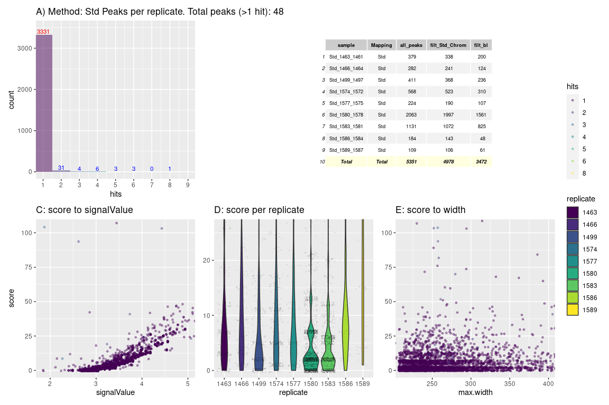
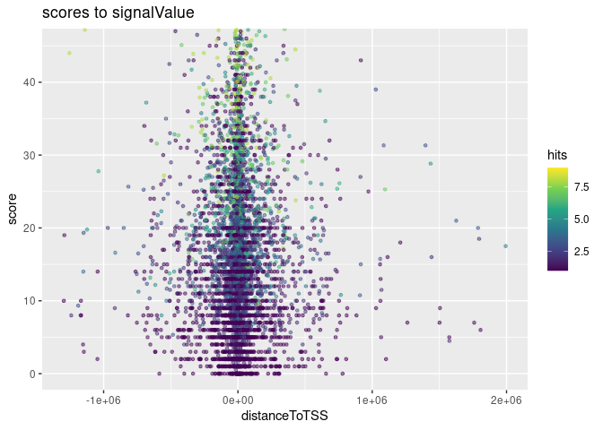

<!-- <style> -->
<!-- .vscroll-plot { -->
<!--     width: 1000px; -->
<!--     height: 1000px; -->
<!--     overflow-y: scroll; -->
<!--     overflow-x: scroll; -->
<!-- } -->
<!-- </style> -->
<!-- output: -->
<!--   html_document:  -->
<!--     toc: true -->
<!--     keep_md: true -->
<!--     self_contained: false -->
<!--     df_print: kable -->

# R Prepare System

## R update and load librarys

BiocManager::install(““)

``` r
# BiocManager::install(update = TRUE, ask = FALSE)

library(dbplyr)
library(tidyverse)
library(ChIPseeker)
library(rtracklayer)
library(trackViewer)
library(GenomicRanges)
library(IRanges)
library(ChIPpeakAnno)
library(AnnotationHub)
library(ggplot2)
library(viridis)
library(kableExtra)
library(DT)
library(patchwork)
library(gridExtra)

library(TxDb.Mmusculus.UCSC.mm39.knownGene)
txdb <- TxDb.Mmusculus.UCSC.mm39.knownGene
```

## R folders

# Unix Prepare System

## Unix Update System

## Unix Folder & Names

# 3 Results

<figure>
<embed src="../Data/sheme.pdf" style="width:100.0%" />
<figcaption aria-hidden="true">Analysis Overview</figcaption>
</figure>

<figure>

<figcaption aria-hidden="true">Analysis Overview</figcaption>
</figure>

``` r
knitr::include_graphics("https://github.com/DNAborn/ChIPseq_Wt1/blob/main/Results/sheme.png")
knitr::include_graphics("https://github.com/DNAborn/ChIPseq_Wt1/blob/main/Results/sheme.pdf")
# knitr::include_graphics("./sheme.png")
# knitr::include_graphics("./sheme.pdf")
# knitr::include_graphics("../sheme.png")
# knitr::include_graphics("../sheme.pdf")
# knitr::include_graphics("/mnt/s/AG/AG-Scholz-NGS/Daten/Simon/P3026_ChIP-Seq_epiSVF/ChIPseq_Wt1_P3026/Results/sheme.png")
# knitr::include_graphics("/mnt/s/AG/AG-Scholz-NGS/Daten/Simon/P3026_ChIP-Seq_epiSVF/ChIPseq_Wt1_P3026/Results/sheme.pdf")
getwd()
```

``` r
print("include figure in r chunk")
knitr::include_graphics("../Data/sheme.pdf") # doesn't show
```

### Generate combined peak list

#### Peak Tables

#### Hists & Tables



#### Overlap Peaks

<!-- -->

## Annotate Peaks

#### 1 Run

``` r
# Add Gene names
ah = AnnotationHub()
query(ah, c("EnsDb", "Musculus"))
```

    ## AnnotationHub with 81 records
    ## # snapshotDate(): 2023-10-23
    ## # $dataprovider: Ensembl
    ## # $species: Mus musculus, Balaenoptera musculus, Mus musculus musculus, Mus ...
    ## # $rdataclass: EnsDb
    ## # additional mcols(): taxonomyid, genome, description,
    ## #   coordinate_1_based, maintainer, rdatadateadded, preparerclass, tags,
    ## #   rdatapath, sourceurl, sourcetype 
    ## # retrieve records with, e.g., 'object[["AH53222"]]' 
    ## 
    ##              title                                        
    ##   AH53222  | Ensembl 87 EnsDb for Mus Musculus            
    ##   AH53726  | Ensembl 88 EnsDb for Mus Musculus            
    ##   AH56691  | Ensembl 89 EnsDb for Mus Musculus            
    ##   AH57770  | Ensembl 90 EnsDb for Mus Musculus            
    ##   AH60788  | Ensembl 91 EnsDb for Mus Musculus            
    ##   ...        ...                                          
    ##   AH116336 | Ensembl 111 EnsDb for Mus musculus           
    ##   AH116337 | Ensembl 111 EnsDb for Mus musculus           
    ##   AH116338 | Ensembl 111 EnsDb for Mus musculus musculus  
    ##   AH116339 | Ensembl 111 EnsDb for Mus musculus domesticus
    ##   AH116340 | Ensembl 111 EnsDb for Mus musculus

``` r
edb <- ah[["AH113713"]]

# 1 Subfolder
i <- 2
all_npeaksAnno <- annotatePeak(npeak_combined_all[[i]], TxDb=txdb,tssRegion=c(-3000, 3000), verbose=TRUE)
```

    ## >> preparing features information...      2024-01-31 14:34:15 
    ## >> identifying nearest features...        2024-01-31 14:34:15 
    ## >> calculating distance from peak to TSS...   2024-01-31 14:34:15 
    ## >> assigning genomic annotation...        2024-01-31 14:34:15 
    ## >> assigning chromosome lengths           2024-01-31 14:34:31 
    ## >> done...                    2024-01-31 14:34:31

``` r
  all_npeaksAnno_table <- as.data.frame(all_npeaksAnno)
  all_npeaksAnno_table$transcriptId2 <- sub("\\.\\d+$", "", all_npeaksAnno_table$transcriptId)
  all_npeaksAnno_table$geneId <- mapIds(edb, keys = all_npeaksAnno_table$transcriptId2, column = "GENEID", keytype = "TXID")
  all_npeaksAnno_table$symbol <- mapIds(edb, keys = all_npeaksAnno_table$transcriptId2, column = "SYMBOL", keytype = "TXID")
n <- names(npeak_combined_all[i])
all_npeaksAnno_table$annotation_short <-  str_split(all_npeaksAnno_table$annotation,pattern = " ", simplify = TRUE)[,1]

g1 <- ggplot(all_npeaksAnno_table,aes(x=hits)) + # fill = cut(hits, 100)
      stat_bin(alpha=0.6, position = 'identity', binwidth=1) + 
      scale_fill_viridis_d() +
      stat_bin(position = 'identity', binwidth=1, geom="text", aes(label=after_stat(count)), vjust=-0.5, colour="blue") +
      ggtitle("Overlapping peaks over replicates")

g2 <- ggplot(all_npeaksAnno_table,aes(x=width, group=annotation_short, fill=annotation_short)) +
      stat_bin(alpha=0.5, position = 'identity', binwidth=1) + 
  # stat_bin(position = 'identity', binwidth=100, geom="text", aes(label=after_stat(count)), vjust=-0.5, colour="blue") +
  scale_fill_viridis_d() +
  ggtitle(paste("genetic region per peak size (",n,")",sep="")) + coord_cartesian(xlim = c(0, 10000))
# ggsave(file=paste(pubfigdir,"Peaks_geneticregions_",n,".pdf",sep=""), width = 8, height = 8, device = "pdf")

g2 <- ggplot(all_npeaksAnno_table,aes(x=score, group=annotation_short, fill=annotation_short)) +
      stat_bin(alpha=0.5, position = 'identity', binwidth=1) + 
  # stat_bin(position = 'identity', binwidth=100, geom="text", aes(label=after_stat(count)), vjust=-0.5, colour="blue") +
  scale_fill_viridis_d() +
  ggtitle(paste("genetic region per qValue (",n,")",sep="")) + coord_cartesian(xlim = c(0, 50))

g3 <- ggplot(all_npeaksAnno_table,aes(x=width, group=hits, fill=hits)) +
      stat_bin(alpha=0.5, position = 'identity', binwidth=200) + 
  # stat_bin(position = 'identity', binwidth=100, geom="text", aes(label=after_stat(count)), vjust=-0.5, colour="blue") +
  scale_fill_viridis_c() +
  ggtitle(paste("hits per peak size")) + coord_cartesian(xlim = c(0, 10000))

g4 <- ggplot(all_npeaksAnno_table,aes(x=qValue, group=hits, fill=hits)) +
  stat_bin(alpha=0.5, position = 'identity', binwidth = 1) + 
  scale_fill_viridis_c() +
  ggtitle(paste("qvalue per hit")) + coord_cartesian(xlim=c(0,50))

all_npeaksAnno_table$hits <- as.factor(all_npeaksAnno_table$hits)
g4 <- ggplot(all_npeaksAnno_table,aes(x=hits, y=qValue)) +
  geom_violin(aes(fill=hits)) +
  scale_fill_viridis_d() +
  geom_point(size=0.05, position ='jitter', alpha=0.2,color="grey40") +
  coord_cartesian(ylim=c(0,50))

levels(factor(all_npeaksAnno_table$annotation_short))
```

    ## [1] "3'"         "Distal"     "Downstream" "Exon"       "Intron"    
    ## [6] "Promoter"

``` r
datatable(head(all_npeaksAnno_table[order(all_npeaksAnno_table$width),]))
```

<div class="datatables html-widget html-fill-item" id="htmlwidget-6842f01eb4e718ab7399" style="width:100%;height:auto;"></div>
<script type="application/json" data-for="htmlwidget-6842f01eb4e718ab7399">{"x":{"filter":"none","vertical":false,"data":[["2041","2785","2186","1379","2103","2593"],["chr6","chrX","chr6","chr2","chr6","chr9"],[14243797,81705501,132537501,56910331,59575101,32267301],[14243900,81705611,132537763,56910600,59575371,32267579],[104,111,263,270,271,279],["*","*","*","*","*","*"],["pe_1499_1497_all_peak_1631","pe_1574_1572_all_peak_2363","pe_1574_1572_all_peak_1813","pe_1466_1464_all_peak_1485","pe_1586_1584_all_peak_3113","pe_1586_1584_all_peak_3880"],[54,43,39,42,14,34],[3.70098,3.38519,3.59242,3.56489,2.82864,3.08257],[8.58151,7.48753,7.07146,7.2477,4.17467,6.24855],[5.47956,4.39569,3.99679,4.26222,1.48088,3.42165],[692,2096,3317,226,419,674],["2","2","3","2","4","2"],["Distal Intergenic","Distal Intergenic","Distal Intergenic","Distal Intergenic","Distal Intergenic","Intron (ENSMUST00000214720.2/105243373, intron 2 of 2)"],[6,20,6,2,6,9],[14457044,81735845,132546772,56997511,59682731,32260585],[14457149,81735976,132549364,57003084,59682859,32273034],[106,132,2593,5574,129,12450],[2,2,1,2,2,1],["ENSMUSG00000077334","ENSMUSG00000077674","ENSMUSG00000059934","ENSMUSG00000026826","ENSMUSG00001118660","ENSMUSG00000111056"],["ENSMUST00000104146.4","ENSMUST00000104486.3","ENSMUST00000074042.5","ENSMUST00000112627.2","ENSMUST00000082870.4","ENSMUST00000213360.2"],[213249,30365,-9009,92484,107488,6716],["ENSMUST00000104146","ENSMUST00000104486","ENSMUST00000074042","ENSMUST00000112627","ENSMUST00000082870","ENSMUST00000213360"],["Gm23013","Gm24470","Prh1","Nr4a2","Gm22622","Gm39317"],["Distal","Distal","Distal","Distal","Distal","Intron"]],"container":"<table class=\"display\">\n  <thead>\n    <tr>\n      <th> <\/th>\n      <th>seqnames<\/th>\n      <th>start<\/th>\n      <th>end<\/th>\n      <th>width<\/th>\n      <th>strand<\/th>\n      <th>name<\/th>\n      <th>score<\/th>\n      <th>signalValue<\/th>\n      <th>pValue<\/th>\n      <th>qValue<\/th>\n      <th>peak<\/th>\n      <th>hits<\/th>\n      <th>annotation<\/th>\n      <th>geneChr<\/th>\n      <th>geneStart<\/th>\n      <th>geneEnd<\/th>\n      <th>geneLength<\/th>\n      <th>geneStrand<\/th>\n      <th>geneId<\/th>\n      <th>transcriptId<\/th>\n      <th>distanceToTSS<\/th>\n      <th>transcriptId2<\/th>\n      <th>symbol<\/th>\n      <th>annotation_short<\/th>\n    <\/tr>\n  <\/thead>\n<\/table>","options":{"columnDefs":[{"className":"dt-right","targets":[2,3,4,7,8,9,10,11,14,15,16,17,18,21]},{"orderable":false,"targets":0},{"name":" ","targets":0},{"name":"seqnames","targets":1},{"name":"start","targets":2},{"name":"end","targets":3},{"name":"width","targets":4},{"name":"strand","targets":5},{"name":"name","targets":6},{"name":"score","targets":7},{"name":"signalValue","targets":8},{"name":"pValue","targets":9},{"name":"qValue","targets":10},{"name":"peak","targets":11},{"name":"hits","targets":12},{"name":"annotation","targets":13},{"name":"geneChr","targets":14},{"name":"geneStart","targets":15},{"name":"geneEnd","targets":16},{"name":"geneLength","targets":17},{"name":"geneStrand","targets":18},{"name":"geneId","targets":19},{"name":"transcriptId","targets":20},{"name":"distanceToTSS","targets":21},{"name":"transcriptId2","targets":22},{"name":"symbol","targets":23},{"name":"annotation_short","targets":24}],"order":[],"autoWidth":false,"orderClasses":false},"selection":{"mode":"multiple","selected":null,"target":"row","selectable":null}},"evals":[],"jsHooks":[]}</script>

``` r
viridis(8)
```

    ## [1] "#440154FF" "#46337EFF" "#365C8DFF" "#277F8EFF" "#1FA187FF" "#4AC16DFF"
    ## [7] "#9FDA3AFF" "#FDE725FF"

``` r
top_hits <- subset(all_npeaksAnno_table, distanceToTSS > -2000 & distanceToTSS < 2000) 
dim(top_hits)
```

    ## [1] 122  24

``` r
top_hits <- top_hits[order(top_hits$score, decreasing=T),]
options(kableExtra.auto_format = FALSE)
knitr::kable(top_hits[c(0:50),c("symbol","distanceToTSS","hits","score","signalValue","qValue")],format = "markdown")
```

|      | symbol        | distanceToTSS | hits | score | signalValue |    qValue |
|:-----|:--------------|--------------:|:-----|------:|------------:|----------:|
| 2089 | Aoc1          |             0 | 6    |  8634 |   136.06900 | 863.49000 |
| 1295 | Gm32342       |             0 | 4    |  3201 |    49.43500 | 320.16800 |
| 3035 | Gm47283       |         -1452 | 8    |   916 |     7.18823 |  91.69290 |
| 1399 | Wt1           |             0 | 6    |   843 |    17.24360 |  84.36460 |
| 2653 | 4921528I07Rik |         -1737 | 8    |   622 |    11.94810 |  62.22130 |
| 1830 | Prdm16os      |             0 | 2    |   460 |    12.27010 |  46.02800 |
| 911  | Npr3          |             0 | 4    |   390 |    12.11120 |  39.02840 |
| 2326 | Gm22909       |             0 | 8    |   330 |     7.65158 |  33.06580 |
| 960  | Gm23217       |          1504 | 8    |   286 |     7.55328 |  28.66360 |
| 782  | Gm3287        |             0 | 8    |   269 |     8.17194 |  26.98950 |
| 2321 | Gm22524       |             0 | 8    |   227 |     7.87793 |  22.77590 |
| 2319 | Gm25988       |             0 | 8    |   224 |     8.49820 |  22.45490 |
| 3036 | Gm47283       |             0 | 8    |   224 |     5.15066 |  22.48100 |
| 975  | Aqp5          |           -41 | 4    |   213 |     8.45498 |  21.31340 |
| 1683 | Gm3893        |             0 | 8    |   202 |     6.95414 |  20.26410 |
| 1684 | Gm50470       |             0 | 8    |   198 |     5.94587 |  19.81300 |
| 827  | Lrch1         |          1311 | 8    |   193 |     6.96827 |  19.39120 |
| 1249 | Gm36718       |             0 | 8    |   191 |     6.00978 |  19.13450 |
| 1685 | Gm52989       |             0 | 8    |   190 |     7.66810 |  19.05650 |
| 1747 | Ifnz          |             0 | 8    |   170 |     7.91977 |  17.07160 |
| 971  | Smgc          |             0 | 8    |   169 |     6.58613 |  16.99790 |
| 2947 | Gm20826       |           978 | 8    |   165 |     6.86956 |  16.54240 |
| 2314 | Gm26488       |             0 | 8    |   150 |     5.91655 |  15.02590 |
| 2324 | Gm25098       |             0 | 8    |   150 |     7.58704 |  15.00410 |
| 2672 | H2al1b        |             0 | 8    |   148 |     6.06323 |  14.82360 |
| 2317 | Gm24528       |             0 | 8    |   138 |     6.26343 |  13.85330 |
| 2752 | Gm26125       |             0 | 8    |   138 |     5.75342 |  13.81600 |
| 2134 | Vmn1r48       |          1202 | 8    |   130 |     4.80176 |  13.09450 |
| 1009 | Fgf12         |         -1365 | 8    |   125 |     5.29802 |  12.50880 |
| 1099 | Glo1          |             0 | 8    |   123 |     5.02222 |  12.35930 |
| 222  | E330020D12Rik |             0 | 6    |   118 |     5.43098 |  11.86760 |
| 2315 | Gm24969       |             0 | 8    |   117 |     5.30188 |  11.72650 |
| 2516 | Ap1m1         |         -1069 | 8    |   117 |     4.06690 |  11.76900 |
| 2011 | Tmem132c      |             0 | 6    |   110 |     6.68716 |  11.09030 |
| 2905 | Pfkfb1        |             0 | 8    |    99 |     5.11936 |   9.93814 |
| 1847 | Gm31831       |          -182 | 8    |    96 |     4.20154 |   9.62182 |
| 2660 | Gm35454       |          -924 | 7    |    96 |     5.25320 |   9.65131 |
| 1902 | Ppargc1a      |             0 | 4    |    93 |     5.41404 |   9.30381 |
| 1807 | Cdca8         |          1726 | 7    |    88 |     4.32362 |   8.83372 |
| 2257 | Arhgef1       |          1428 | 3    |    87 |     5.84310 |   8.75916 |
| 2322 | Gm26390       |             0 | 8    |    87 |     4.60176 |   8.77546 |
| 1318 | Mir467a-4     |             0 | 5    |    81 |     4.72261 |   8.11998 |
| 2255 | Pglyrp1       |             0 | 8    |    81 |     5.49276 |   8.10961 |
| 2021 | Gm31160       |         -1494 | 6    |    80 |     4.96607 |   8.06426 |
| 1773 | Gm12724       |          -110 | 5    |    74 |     3.93630 |   7.44680 |
| 771  | 1700087M22Rik |         -1619 | 4    |    71 |     4.18245 |   7.12923 |
| 2262 | Fcgbp         |         -1581 | 5    |    70 |     5.10953 |   7.02509 |
| 2316 | Gm26466       |             0 | 3    |    66 |     4.08344 |   6.60583 |
| 1383 | Ttn           |             0 | 8    |    65 |     5.00120 |   6.51845 |
| 2643 | Gm24641       |           936 | 8    |    65 |     3.58668 |   6.51868 |

``` r
datatable(top_hits[c(0:50),c("symbol","distanceToTSS","hits","score","signalValue","qValue")])
```

<div class="datatables html-widget html-fill-item" id="htmlwidget-fd4381367d8afda9a101" style="width:100%;height:auto;"></div>
<script type="application/json" data-for="htmlwidget-fd4381367d8afda9a101">{"x":{"filter":"none","vertical":false,"data":[["2089","1295","3035","1399","2653","1830","911","2326","960","782","2321","2319","3036","975","1683","1684","827","1249","1685","1747","971","2947","2314","2324","2672","2317","2752","2134","1009","1099","222","2315","2516","2011","2905","1847","2660","1902","1807","2257","2322","1318","2255","2021","1773","771","2262","2316","1383","2643"],["Aoc1","Gm32342","Gm47283","Wt1","4921528I07Rik","Prdm16os","Npr3","Gm22909","Gm23217","Gm3287","Gm22524","Gm25988","Gm47283","Aqp5","Gm3893","Gm50470","Lrch1","Gm36718","Gm52989","Ifnz","Smgc","Gm20826","Gm26488","Gm25098","H2al1b","Gm24528","Gm26125","Vmn1r48","Fgf12","Glo1","E330020D12Rik","Gm24969","Ap1m1","Tmem132c","Pfkfb1","Gm31831","Gm35454","Ppargc1a","Cdca8","Arhgef1","Gm26390","Mir467a-4","Pglyrp1","Gm31160","Gm12724","1700087M22Rik","Fcgbp","Gm26466","Ttn","Gm24641"],[0,0,-1452,0,-1737,0,0,0,1504,0,0,0,0,-41,0,0,1311,0,0,0,0,978,0,0,0,0,0,1202,-1365,0,0,0,-1069,0,0,-182,-924,0,1726,1428,0,0,0,-1494,-110,-1619,-1581,0,0,936],["6","4","8","6","8","2","4","8","8","8","8","8","8","4","8","8","8","8","8","8","8","8","8","8","8","8","8","8","8","8","6","8","8","6","8","8","7","4","7","3","8","5","8","6","5","4","5","3","8","8"],[8634,3201,916,843,622,460,390,330,286,269,227,224,224,213,202,198,193,191,190,170,169,165,150,150,148,138,138,130,125,123,118,117,117,110,99,96,96,93,88,87,87,81,81,80,74,71,70,66,65,65],[136.069,49.435,7.18823,17.2436,11.9481,12.2701,12.1112,7.65158,7.55328,8.171939999999999,7.87793,8.498200000000001,5.15066,8.454980000000001,6.95414,5.94587,6.96827,6.00978,7.6681,7.91977,6.58613,6.86956,5.91655,7.58704,6.06323,6.26343,5.75342,4.80176,5.29802,5.02222,5.43098,5.30188,4.0669,6.68716,5.11936,4.20154,5.2532,5.41404,4.32362,5.8431,4.60176,4.72261,5.49276,4.96607,3.9363,4.18245,5.10953,4.08344,5.0012,3.58668],[863.49,320.168,91.69289999999999,84.3646,62.2213,46.028,39.0284,33.0658,28.6636,26.9895,22.7759,22.4549,22.481,21.3134,20.2641,19.813,19.3912,19.1345,19.0565,17.0716,16.9979,16.5424,15.0259,15.0041,14.8236,13.8533,13.816,13.0945,12.5088,12.3593,11.8676,11.7265,11.769,11.0903,9.938140000000001,9.62182,9.65131,9.30381,8.83372,8.75916,8.775460000000001,8.11998,8.10961,8.064260000000001,7.4468,7.12923,7.02509,6.60583,6.51845,6.51868]],"container":"<table class=\"display\">\n  <thead>\n    <tr>\n      <th> <\/th>\n      <th>symbol<\/th>\n      <th>distanceToTSS<\/th>\n      <th>hits<\/th>\n      <th>score<\/th>\n      <th>signalValue<\/th>\n      <th>qValue<\/th>\n    <\/tr>\n  <\/thead>\n<\/table>","options":{"columnDefs":[{"className":"dt-right","targets":[2,4,5,6]},{"orderable":false,"targets":0},{"name":" ","targets":0},{"name":"symbol","targets":1},{"name":"distanceToTSS","targets":2},{"name":"hits","targets":3},{"name":"score","targets":4},{"name":"signalValue","targets":5},{"name":"qValue","targets":6}],"order":[],"autoWidth":false,"orderClasses":false},"selection":{"mode":"multiple","selected":null,"target":"row","selectable":null}},"evals":[],"jsHooks":[]}</script>

``` r
g1+g2+g3+g4+plot_layout(nrow = 2, ncol = 2, axis_titles = "collect") + plot_annotation(title = paste("Method:",n))
```

<!-- -->

#### All peaks

#### Venns
